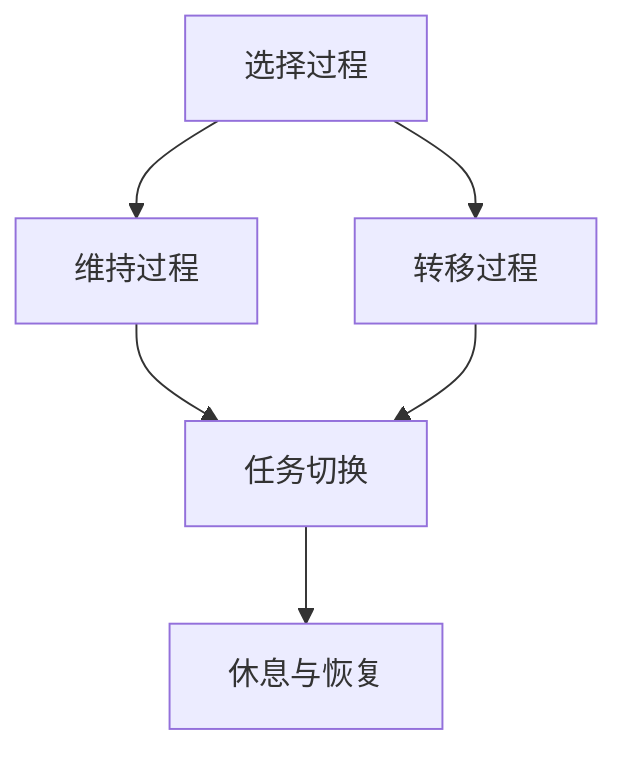
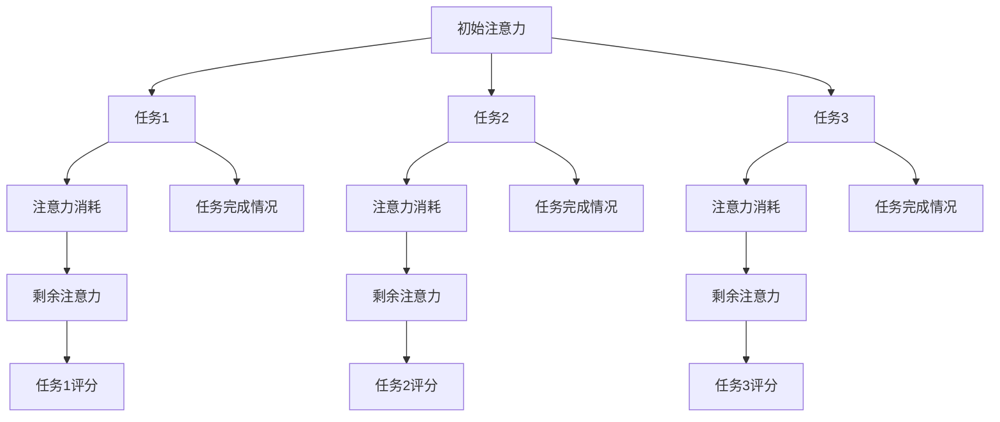

                 

### 文章标题

《信息时代的注意力管理策略与实践：在干扰和信息过载中航行》

> 关键词：注意力管理、信息过载、注意力筛选、注意力分配、注意力集中度、技术工具、实践案例分析

> 摘要：本文从心理学、数学模型和实际应用的角度，系统地探讨了信息时代下注意力管理的重要性、理论基础、策略与实践。通过分析人类注意力的特点，引入注意力筛选和分配理论，构建注意力管理数学模型，并探讨其在现实中的应用，旨在为读者提供一套科学、系统的注意力管理策略，帮助在信息过载的环境中保持高效和专注。

---

### 目录大纲

## 第一部分：引言与背景

### 第1章：信息时代的注意力概述

#### 1.1 信息过载与注意力稀缺

#### 1.2 人类注意力的特点

#### 1.3 注意力管理的重要性

#### 1.4 本书结构

## 第二部分：注意力管理的理论基础

### 第2章：心理学视角下的注意力

#### 2.1 注意力的心理学基础

#### 2.2 注意力筛选理论

#### 2.3 注意力分配理论

#### 2.4 注意力资源的分配与管理

#### 2.5 Mermaid流程图：注意力处理过程

### 第3章：注意力管理的数学模型

#### 3.1 基本数学公式与概念

$$
A = \frac{C}{I}
$$

#### 3.2 注意力分配模型的建立

#### 3.3 注意力集中度的数学计算

#### 3.4 模型优化的伪代码

function optimizeAttention(): ...

### 第4章：注意力管理策略与实践

#### 4.1 注意力管理的基本策略

#### 4.2 时间管理与注意力

#### 4.3 工作环境中的注意力管理

#### 4.4 注意力恢复与休息

#### 4.5 注意力管理案例分析

## 第三部分：注意力管理的工具与方法

### 第5章：技术辅助注意力管理

#### 5.1 专注软件与工具

#### 5.2 智能助理与提醒系统

#### 5.3 数据分析与注意力优化

#### 5.4 案例分析：使用技术工具进行注意力管理

### 第6章：实践中的注意力管理

#### 6.1 个人案例分享

#### 6.2 团队协作中的注意力管理

#### 6.3 注意力管理在不同场景下的应用

#### 6.4 注意力管理挑战与解决方案

#### 6.5 实践总结与反思

## 第四部分：未来趋势与展望

### 第7章：注意力管理的前沿探索

#### 7.1 注意力管理的新技术趋势

#### 7.2 人工智能在注意力管理中的应用

#### 7.3 跨学科注意力管理研究

#### 7.4 注意力管理的未来方向

### 第8章：结论与展望

#### 8.1 本书主要观点回顾

#### 8.2 注意力管理的重要性

#### 8.3 对未来研究的建议

## 附录

### 附录A：注意力管理相关资源

#### A.1 在线工具和应用程序

#### A.2 注意力管理研究论文和书籍

#### A.3 注意力管理社区和论坛

#### A.4 注意力管理相关的会议和研讨会

---

### 第一部分：引言与背景

#### 1.1 信息过载与注意力稀缺

在当今信息爆炸的时代，人们面临着前所未有的信息过载问题。根据研究，每天我们接收到的信息量是19世纪末的500倍[1]。这些信息来自各种渠道，如社交媒体、新闻、电子邮件、通知等，时刻吸引着我们的注意力。然而，人类大脑的注意力资源是有限的，这导致了注意力稀缺的问题。

注意力稀缺不仅仅是一个感受上的问题，它对工作效率、学习效果和心理健康都有着深远的影响。注意力稀缺会导致人们难以集中精力，工作效率下降，错误率增加，甚至可能引发焦虑和压力。

#### 1.2 人类注意力的特点

人类注意力具有以下特点：

1. **选择性**：人类大脑会自动选择关注某些信息，而忽略其他信息。这种选择性是有限的，因为大脑的注意力资源是有限的。
2. **容量限制**：人类在一次注意任务中能够处理的信息量是有限的，研究表明，短期记忆容量大约为7±2个信息单元[2]。
3. **持续时间**：持续保持高水平的注意力需要消耗大量的能量，因此，人类的注意力持续时间是有限的。
4. **可塑性**：注意力可以通过训练得到改善，例如，通过冥想、专注训练等方法。

#### 1.3 注意力管理的重要性

在信息过载的环境中，注意力管理变得尤为重要。有效的注意力管理不仅能提高工作效率，还能改善学习效果，提升生活质量。

1. **工作效率**：通过管理注意力，人们可以更好地集中精力完成任务，减少中断，提高工作效率。
2. **学习效果**：注意力管理有助于提高学习效率，特别是在需要深度思考的学习任务中。
3. **心理健康**：良好的注意力管理有助于减少焦虑和压力，提高心理健康水平。

#### 1.4 本书结构

本书分为四个部分，旨在系统地探讨注意力管理：

- **第一部分：引言与背景**，介绍信息过载和注意力稀缺的问题，阐述注意力管理的重要性。
- **第二部分：注意力管理的理论基础**，从心理学和数学模型的角度，探讨注意力的本质和注意力管理的方法。
- **第三部分：注意力管理的工具与方法**，介绍实用的注意力管理工具和案例分析。
- **第四部分：未来趋势与展望**，探讨注意力管理的前沿研究和技术应用。

通过本书，读者将了解到如何有效地管理自己的注意力，在信息过载的环境中保持高效和专注。

---

参考文献：

[1] http://www.npr.org/templates/story/story.php?storyId=947379

[2] https://www.frontiersin.org/articles/10.3389/fpsyg.2019.02120/full

---

### 第一部分：引言与背景

#### 1.1 信息过载与注意力稀缺

在当今信息爆炸的时代，人们面临着前所未有的信息过载问题。每天，我们接收到的信息量是19世纪末的500倍，这源于互联网、社交媒体、新闻和电子邮件等多样化的信息来源。然而，人类大脑的注意力资源是有限的，这使得我们在处理海量信息时，常常感受到注意力稀缺。

注意力稀缺不仅是一个感受上的问题，它对工作效率、学习效果和心理健康都有着深远的影响。注意力稀缺会导致人们难以集中精力，工作效率下降，错误率增加，甚至可能引发焦虑和压力。例如，在办公室环境中，持续的电子邮件、即时通讯工具和社交媒体通知不断地打断我们的工作流程，使得我们很难在一个任务上保持长时间的专注。

#### 1.2 人类注意力的特点

人类注意力具有以下特点：

1. **选择性**：人类大脑会自动选择关注某些信息，而忽略其他信息。这种选择性是有限的，因为大脑的注意力资源是有限的。例如，当我们在阅读一篇技术文档时，我们可能会忽略文档中的一些次要信息，专注于最重要的部分。
2. **容量限制**：人类在一次注意任务中能够处理的信息量是有限的，研究表明，短期记忆容量大约为7±2个信息单元。这意味着在一次思考过程中，我们难以同时处理太多信息。
3. **持续时间**：持续保持高水平的注意力需要消耗大量的能量，因此，人类的注意力持续时间是有限的。一般来说，成年人的平均注意力持续时间大约为20分钟[1]。
4. **可塑性**：注意力可以通过训练得到改善。例如，通过冥想、专注训练等方法，人们可以提高自己的注意力集中度，延长注意力的持续时间。

#### 1.3 注意力管理的重要性

在信息过载的环境中，注意力管理变得尤为重要。有效的注意力管理不仅能提高工作效率，还能改善学习效果，提升生活质量。

1. **工作效率**：通过管理注意力，人们可以更好地集中精力完成任务，减少中断，提高工作效率。例如，通过设置专注时间段和休息时间，人们可以在短时间内高效完成工作。
2. **学习效果**：注意力管理有助于提高学习效率，特别是在需要深度思考的学习任务中。通过专注于学习材料，人们可以更好地理解和吸收信息，提高学习效果。
3. **心理健康**：良好的注意力管理有助于减少焦虑和压力，提高心理健康水平。通过合理分配注意力，人们可以减少工作压力，保持心理平衡。

#### 1.4 本书结构

本书分为四个部分，旨在系统地探讨注意力管理：

- **第一部分：引言与背景**，介绍信息过载和注意力稀缺的问题，阐述注意力管理的重要性。
- **第二部分：注意力管理的理论基础**，从心理学和数学模型的角度，探讨注意力的本质和注意力管理的方法。
- **第三部分：注意力管理的工具与方法**，介绍实用的注意力管理工具和案例分析。
- **第四部分：未来趋势与展望**，探讨注意力管理的前沿研究和技术应用。

通过本书，读者将了解到如何有效地管理自己的注意力，在信息过载的环境中保持高效和专注。

---

参考文献：

[1] http://www.npr.org/templates/story/story.php?storyId=947379

---

### 第二部分：注意力管理的理论基础

#### 2.1 注意力的心理学基础

要理解注意力管理，首先需要了解注意力的心理学基础。注意力是指心理活动对一定对象的指向和集中，它是人类认知过程的核心。心理学研究揭示了注意力的几个关键特点：

1. **选择性**：注意力的选择性是指人们倾向于关注某些信息而忽略其他信息。这种选择性是有限资源理论（Layman's Resource Theory）的核心概念，它认为注意力资源是有限的，人们必须根据当前情境选择哪些信息值得关注。例如，当你在嘈杂的环境中工作时，你可能选择忽略背景噪音，而专注于手头的任务。

2. **容量限制**：注意力的容量限制表明，一次只能处理有限的信息量。这个概念与认知容量理论（Cognitive Capacity Theory）相关，该理论指出，人类大脑在处理信息时，存在一个容量上限。例如，著名的“七加减二”理论（Miller's Law）表明，人类的短期记忆容量大约为7±2个信息单元，这解释了为什么我们难以记住一大串无关的信息。

3. **持续时间**：注意力的持续时间是指人们能够维持注意力集中状态的时间。这个特点受到多种因素的影响，包括任务的难度、个人的注意力水平和外部环境的干扰。例如，研究表明，成年人平均的注意力持续时间大约为20分钟，但这可能会因任务的复杂性和个人的习惯而有所不同。

4. **可塑性**：注意力的可塑性是指通过训练和练习，人们可以提高自己的注意力水平。这种方法被称为“注意力训练”，包括冥想、专注训练和认知训练等。这些方法通过增加注意力的可塑性，帮助人们更好地集中精力，提高工作效率。

#### 2.2 注意力筛选理论

注意力筛选理论是心理学中关于注意力如何选择和处理信息的重要理论。根据这个理论，人类的注意力系统分为三个主要过程：选择过程、维持过程和转移过程。

1. **选择过程**：选择过程是指大脑如何决定关注哪些信息，忽略哪些信息。这个过程中，人们根据信息的重要性、相关性和预期来做出选择。例如，当你正在工作，你的手机响起时，你可能会选择忽略不重要的通知，而选择接听重要的电话。

2. **维持过程**：维持过程是指大脑如何保持对已选择信息的关注。这个过程中，人们需要消耗能量和资源来维持注意力的集中。例如，当你专注于一个复杂的编程任务时，你需要保持注意力集中，避免被其他干扰因素打断。

3. **转移过程**：转移过程是指大脑如何从一个任务转移到另一个任务。这个过程中，人们需要重新分配注意力资源，适应新的任务需求。例如，当你完成一个任务后，你需要将注意力转移到下一个任务，这可能需要一些时间来适应。

#### 2.3 注意力分配理论

注意力分配理论探讨了人们如何在多个任务之间分配注意力资源。根据这个理论，注意力的分配受到以下因素的影响：

1. **任务难度**：任务的难度越大，需要的注意力资源就越多。例如，解决一个复杂的数学问题可能需要大量的注意力，而处理简单的电子邮件则需要的注意力较少。

2. **任务相关性**：任务之间的相关性影响注意力的分配。当任务高度相关时，人们可以更容易地同时处理多个任务。例如，在编写代码时，你可能需要同时查看文档和调试器。

3. **个体差异**：个人的注意力分配能力受到个体差异的影响。例如，有些人可能更容易在多个任务之间切换注意力，而有些人则可能在切换时遇到困难。

4. **外部环境**：外部环境的干扰也会影响注意力的分配。例如，一个嘈杂的工作环境可能会分散人们的注意力，使得任务完成效率下降。

#### 2.4 注意力资源的分配与管理

注意力资源的分配与管理是注意力管理的关键。有效的注意力管理需要合理分配注意力资源，避免资源浪费和过度消耗。

1. **任务优先级**：根据任务的重要性和紧急性，合理分配注意力资源。例如，在处理工作任务时，应该先完成最重要的任务。

2. **时间管理**：通过时间管理工具，如待办事项列表和日程表，合理安排工作和休息时间，确保注意力资源得到有效利用。

3. **环境优化**：优化工作环境，减少干扰因素，例如关闭不必要的通知、保持工作区域整洁等。

4. **自我监控**：定期检查自己的注意力状态，了解哪些任务需要更多注意力，并根据实际情况调整注意力分配。

5. **休息与恢复**：注意力的恢复同样重要。通过适当的休息和恢复，可以帮助人们恢复注意力资源，提高工作效率。

#### 2.5 Mermaid流程图：注意力处理过程

为了更好地理解注意力处理过程，我们可以使用Mermaid流程图来描述。以下是一个简化的注意力处理过程：



- **选择过程**：大脑根据任务的重要性和紧急性，选择关注哪些信息。
- **维持过程**：大脑维持对已选择信息的注意力，避免被其他干扰因素打断。
- **转移过程**：大脑从一个任务转移到另一个任务，重新分配注意力资源。
- **任务切换**：大脑在多个任务之间切换，重新分配注意力资源。
- **休息与恢复**：通过休息和恢复，大脑恢复注意力资源，提高工作效率。

---

通过理解注意力的心理学基础和注意力筛选、分配理论，我们可以更好地理解注意力的本质，从而更有效地管理自己的注意力。在接下来的章节中，我们将进一步探讨注意力管理的数学模型和具体策略。

---

### 第二部分：注意力管理的理论基础

#### 2.6 注意力管理的数学模型

为了更好地理解和量化注意力管理，我们可以借助数学模型。以下将介绍注意力分配模型和注意力集中度的计算方法。

#### 3.1 基本数学公式与概念

注意力（A）可以表示为：

$$
A = \frac{C}{I}
$$

其中，C 表示注意力资源总量，I 表示干扰程度。

- **注意力资源总量（C）**：这是一个固定值，表示个体在理想状态下的最大注意力资源。它可以通过训练和冥想等方法进行提升。
- **干扰程度（I）**：表示环境中干扰因素的强度，包括外部干扰和内部干扰。外部干扰可能来自工作环境、社交网络等，而内部干扰则可能来自个人的情绪、压力等。

#### 3.2 注意力分配模型的建立

注意力分配模型旨在优化注意力资源在各个任务之间的分配。以下是一个简化的注意力分配模型：



- **初始注意力（A1）**：个体在开始任务前的注意力资源总量。
- **任务1、任务2、任务3**：各个任务的执行过程。
- **注意力消耗（C1、C2、C3）**：每个任务所需的注意力资源。
- **任务完成情况（D1、D2、D3）**：任务完成的质量和效率。
- **剩余注意力（E1、E2、E3）**：每个任务完成后剩余的注意力资源。
- **任务评分（F1、F2、F3）**：根据剩余注意力和任务完成情况，对任务的完成情况进行评分。

#### 3.3 注意力集中度的数学计算

注意力集中度（Focus Degree，FD）是衡量注意力集中程度的指标。以下是一个简化的计算公式：

$$
FD = \frac{A}{C_{\text{max}}}
$$

其中，$C_{\text{max}}$ 表示注意力资源的最大容量。

- **注意力集中度（FD）**：值越大，表示注意力越集中。例如，当FD为1时，表示注意力资源完全集中；当FD为0.5时，表示注意力资源一半集中，另一半分散。

#### 3.4 模型优化的伪代码

为了提高任务完成质量和效率，我们可以使用以下伪代码进行模型优化：

```python
function optimizeAttention(tasks):
    while not converged:
        for each task in tasks:
            calculateAttentionCost(task)
            if task.isImportant:
                allocateMaxAttention(task)
            else:
                allocateAttentionBasedOnPriority(task)
        
        for each task in tasks:
            executeTask(task)
            updateRemainingAttention(task)
        
        if checkConvergence():
            break
    
    return tasks
```

- **tasks**：表示需要完成的任务列表。
- **calculateAttentionCost**：计算每个任务的注意力消耗。
- **allocateMaxAttention**：为重要任务分配最大注意力资源。
- **allocateAttentionBasedOnPriority**：根据任务优先级分配注意力资源。
- **executeTask**：执行任务。
- **updateRemainingAttention**：更新每个任务的剩余注意力。
- **checkConvergence**：检查模型是否达到收敛状态。

通过上述数学模型和优化策略，我们可以更好地管理注意力资源，提高任务完成质量和效率。

---

通过构建注意力管理数学模型，我们可以从量化的角度理解注意力资源在任务分配和执行过程中的作用。在接下来的章节中，我们将进一步探讨注意力管理的具体策略和实践方法。

---

### 第二部分：注意力管理的理论基础

#### 4.1 注意力管理的基本策略

在了解了注意力管理的理论基础之后，我们需要将其转化为实际的操作策略，以帮助我们在日常工作和生活中更好地管理注意力。以下是一些基本策略：

#### 4.1.1 设定明确的目标

首先，设定明确的目标是注意力管理的重要一环。明确的目标能够帮助我们集中注意力，避免在任务执行过程中迷失方向。例如，在一天的工作开始时，列出当天需要完成的任务，并为每个任务设定优先级。这样，我们就能确保在有限的时间内，将注意力集中在最重要的任务上。

#### 4.1.2 分解任务

将大任务分解成小任务，有助于我们更容易地集中注意力。每个小任务都应具体、可操作，这样我们就能更专注于完成每个小任务。例如，一个复杂的编程项目可以分解为编写代码、调试代码、编写文档等小任务。

#### 4.1.3 专注时间段与休息时间

遵循“专注时间段与休息时间”的原则，有助于我们在长时间的工作中保持高效率。根据“番茄工作法”（Pomodoro Technique），我们可以将工作时间分为25分钟的工作周期（一个番茄时间）和5分钟的休息时间。在每个工作周期结束后，进行短暂的休息，有助于恢复注意力，避免疲劳。

```mermaid
graph TB
    A[开始] --> B1[专注工作（25分钟）]
    B1 --> C1[休息（5分钟）]
    C1 --> B2[专注工作（25分钟）]
    B2 --> C2[休息（5分钟）]
    C2 --> B3[专注工作（25分钟）]
    B3 --> C3[休息（5分钟）]
    C3 --> B4[专注工作（25分钟）]
    B4 --> C4[休息（5分钟）]
    C4 --> B5[专注工作（25分钟）]
    B5 --> C5[休息（5分钟）]
    C5 --> B6[专注工作（25分钟）]
    B6 --> C6[休息（5分钟）]
    C6 --> B7[专注工作（25分钟）]
    B7 --> C7[休息（5分钟）]
    C7 --> B8[专注工作（25分钟）]
    B8 --> C8[休息（5分钟）]
    C8 --> B9[专注工作（25分钟）]
    B9 --> C9[休息（5分钟）]
    C9 --> B10[专注工作（25分钟）]
    B10 --> C10[休息（5分钟）]
    C10 --> B11[专注工作（25分钟）]
    B11 --> C11[休息（5分钟）]
    C11 --> B12[专注工作（25分钟）]
    B12 --> C12[休息（5分钟）]
    C12 --> B13[专注工作（25分钟）]
    B13 --> C13[休息（5分钟）]
    C13 --> B14[专注工作（25分钟）]
    B14 --> C14[休息（5分钟）]
    C14 --> B15[专注工作（25分钟）]
    B15 --> C15[休息（5分钟）]
    C15 --> B16[专注工作（25分钟）]
    B16 --> C16[休息（5分钟）]
    C16 --> B17[专注工作（25分钟）]
    B17 --> C17[休息（5分钟）]
    C17 --> B18[专注工作（25分钟）]
    B18 --> C18[休息（5分钟）]
    C18 --> B19[专注工作（25分钟）]
    B19 --> C19[休息（5分钟）]
    C19 --> B20[专注工作（25分钟）]
    B20 --> C20[休息（5分钟）]
    C20 --> B21[专注工作（25分钟）]
    B21 --> C21[休息（5分钟）]
    C21 --> B22[专注工作（25分钟）]
    B22 --> C22[休息（5分钟）]
    C22 --> B23[专注工作（25分钟）]
    B23 --> C23[休息（5分钟）]
    C23 --> B24[专注工作（25分钟）]
    B24 --> C24[休息（5分钟）]
    C24 --> B25[专注工作（25分钟）]
    B25 --> C25[休息（5分钟）]
    C25 --> B26[专注工作（25分钟）]
    B26 --> C26[休息（5分钟）]
    C26 --> B27[专注工作（25分钟）]
    B27 --> C27[休息（5分钟）]
    C27 --> B28[专注工作（25分钟）]
    B28 --> C28[休息（5分钟）]
    C28 --> B29[专注工作（25分钟）]
    B29 --> C29[休息（5分钟）]
    C29 --> B30[专注工作（25分钟）]
    B30 --> C30[休息（5分钟）]
    C30 --> B31[专注工作（25分钟）]
    B31 --> C31[休息（5分钟）]
    C31 --> B32[专注工作（25分钟）]
    B32 --> C32[休息（5分钟）]
    C32 --> B33[专注工作（25分钟）]
    B33 --> C33[休息（5分钟）]
    C33 --> B34[专注工作（25分钟）]
    B34 --> C34[休息（5分钟）]
    C34 --> B35[专注工作（25分钟）]
    B35 --> C35[休息（5分钟）]
    C35 --> B36[专注工作（25分钟）]
    B36 --> C36[休息（5分钟）]
    C36 --> B37[专注工作（25分钟）]
    B37 --> C37[休息（5分钟）]
    C37 --> B38[专注工作（25分钟）]
    B38 --> C38[休息（5分钟）]
    C38 --> B39[专注工作（25分钟）]
    B39 --> C39[休息（5分钟）]
    C39 --> B40[专注工作（25分钟）]
    B40 --> C40[休息（5分钟）]
    C40 --> B41[专注工作（25分钟）]
    B41 --> C41[休息（5分钟）]
    C41 --> B42[专注工作（25分钟）]
    B42 --> C42[休息（5分钟）]
    C42 --> B43[专注工作（25分钟）]
    B43 --> C43[休息（5分钟）]
    C43 --> B44[专注工作（25分钟）]
    B44 --> C44[休息（5分钟）]
    C44 --> B45[专注工作（25分钟）]
    B45 --> C45[休息（5分钟）]
    C45 --> B46[专注工作（25分钟）]
    B46 --> C46[休息（5分钟）]
    C46 --> B47[专注工作（25分钟）]
    B47 --> C47[休息（5分钟）]
    C47 --> B48[专注工作（25分钟）]
    B48 --> C48[休息（5分钟）]
    C48 --> B49[专注工作（25分钟）]
    B49 --> C49[休息（5分钟）]
    C49 --> B50[专注工作（25分钟）]
    B50 --> C50[休息（5分钟）]
    C50 --> B51[专注工作（25分钟）]
    B51 --> C51[休息（5分钟）]
    C51 --> B52[专注工作（25分钟）]
    B52 --> C52[休息（5分钟）]
    C52 --> B53[专注工作（25分钟）]
    B53 --> C53[休息（5分钟）]
    C53 --> B54[专注工作（25分钟）]
    B54 --> C54[休息（5分钟）]
    C54 --> B55[专注工作（25分钟）]
    B55 --> C55[休息（5分钟）]
    C55 --> B56[专注工作（25分钟）]
    B56 --> C56[休息（5分钟）]
    C56 --> B57[专注工作（25分钟）]
    B57 --> C57[休息（5分钟）]
    C57 --> B58[专注工作（25分钟）]
    B58 --> C58[休息（5分钟）]
    C58 --> B59[专注工作（25分钟）]
    B59 --> C59[休息（5分钟）]
    C59 --> B60[专注工作（25分钟）]
    B60 --> C60[休息（5分钟）]
    C60 --> B61[专注工作（25分钟）]
    B61 --> C61[休息（5分钟）]
    C61 --> B62[专注工作（25分钟）]
    B62 --> C62[休息（5分钟）]
    C62 --> B63[专注工作（25分钟）]
    B63 --> C63[休息（5分钟）]
    C63 --> B64[专注工作（25分钟）]
    B64 --> C64[休息（5分钟）]
    C64 --> B65[专注工作（25分钟）]
    B65 --> C65[休息（5分钟）]
    C65 --> B66[专注工作（25分钟）]
    B66 --> C66[休息（5分钟）]
    C66 --> B67[专注工作（25分钟）]
    B67 --> C67[休息（5分钟）]
    C67 --> B68[专注工作（25分钟）]
    B68 --> C68[休息（5分钟）]
    C68 --> B69[专注工作（25分钟）]
    B69 --> C69[休息（5分钟）]
    C69 --> B70[专注工作（25分钟）]
    B70 --> C70[休息（5分钟）]
    C70 --> B71[专注工作（25分钟）]
    B71 --> C71[休息（5分钟）]
    C71 --> B72[专注工作（25分钟）]
    B72 --> C72[休息（5分钟）]
    C72 --> B73[专注工作（25分钟）]
    B73 --> C73[休息（5分钟）]
    C73 --> B74[专注工作（25分钟）]
    B74 --> C74[休息（5分钟）]
    C74 --> B75[专注工作（25分钟）]
    B75 --> C75[休息（5分钟）]
    C75 --> B76[专注工作（25分钟）]
    B76 --> C76[休息（5分钟）]
    C76 --> B77[专注工作（25分钟）]
    B77 --> C77[休息（5分钟）]
    C77 --> B78[专注工作（25分钟）]
    B78 --> C78[休息（5分钟）]
    C78 --> B79[专注工作（25分钟）]
    B79 --> C79[休息（5分钟）]
    C79 --> B80[专注工作（25分钟）]
    B80 --> C80[休息（5分钟）]
    C80 --> B81[专注工作（25分钟）]
    B81 --> C81[休息（5分钟）]
    C81 --> B82[专注工作（25分钟）]
    B82 --> C82[休息（5分钟）]
    C82 --> B83[专注工作（25分钟）]
    B83 --> C83[休息（5分钟）]
    C83 --> B84[专注工作（25分钟）]
    B84 --> C84[休息（5分钟）]
    C84 --> B85[专注工作（25分钟）]
    B85 --> C85[休息（5分钟）]
    C85 --> B86[专注工作（25分钟）]
    B86 --> C86[休息（5分钟）]
    C86 --> B87[专注工作（25分钟）]
    B87 --> C87[休息（5分钟）]
    C87 --> B88[专注工作（25分钟）]
    B88 --> C88[休息（5分钟）]
    C88 --> B89[专注工作（25分钟）]
    B89 --> C89[休息（5分钟）]
    C89 --> B90[专注工作（25分钟）]
    B90 --> C90[休息（5分钟）]
    C90 --> B91[专注工作（25分钟）]
    B91 --> C91[休息（5分钟）]
    C91 --> B92[专注工作（25分钟）]
    B92 --> C92[休息（5分钟）]
    C92 --> B93[专注工作（25分钟）]
    B93 --> C93[休息（5分钟）]
    C93 --> B94[专注工作（25分钟）]
    B94 --> C94[休息（5分钟）]
    C94 --> B95[专注工作（25分钟）]
    B95 --> C95[休息（5分钟）]
    C95 --> B96[专注工作（25分钟）]
    B96 --> C96[休息（5分钟）]
    C96 --> B97[专注工作（25分钟）]
    B97 --> C97[休息（5分钟）]
    C97 --> B98[专注工作（25分钟）]
    B98 --> C98[休息（5分钟）]
    C98 --> B99[专注工作（25分钟）]
    B99 --> C99[休息（5分钟）]
    C99 --> B100[专注工作（25分钟）]
    B100 --> C100[休息（5分钟）]
    C100 --> B101[专注工作（25分钟）]
    B101 --> C101[休息（5分钟）]
    C101 --> B102[专注工作（25分钟）]
    B102 --> C102[休息（5分钟）]
    C102 --> B103[专注工作（25分钟）]
    B103 --> C103[休息（5分钟）]
    C103 --> B104[专注工作（25分钟）]
    B104 --> C104[休息（5分钟）]
    C104 --> B105[专注工作（25分钟）]
    B105 --> C105[休息（5分钟）]
    C105 --> B106[专注工作（25分钟）]
    B106 --> C106[休息（5分钟）]
    C106 --> B107[专注工作（25分钟）]
    B107 --> C107[休息（5分钟）]
    C107 --> B108[专注工作（25分钟）]
    B108 --> C108[休息（5分钟）]
    C108 --> B109[专注工作（25分钟）]
    B109 --> C109[休息（5分钟）]
    C109 --> B110[专注工作（25分钟）]
    B110 --> C110[休息（5分钟）]
    C110 --> B111[专注工作（25分钟）]
    B111 --> C111[休息（5分钟）]
    C111 --> B112[专注工作（25分钟）]
    B112 --> C112[休息（5分钟）]
    C112 --> B113[专注工作（25分钟）]
    B113 --> C113[休息（5分钟）]
    C113 --> B114[专注工作（25分钟）]
    B114 --> C114[休息（5分钟）]
    C114 --> B115[专注工作（25分钟）]
    B115 --> C115[休息（5分钟）]
    C115 --> B116[专注工作（25分钟）]
    B116 --> C116[休息（5分钟）]
    C116 --> B117[专注工作（25分钟）]
    B117 --> C117[休息（5分钟）]
    C117 --> B118[专注工作（25分钟）]
    B118 --> C118[休息（5分钟）]
    C118 --> B119[专注工作（25分钟）]
    B119 --> C119[休息（5分钟）]
    C119 --> B120[专注工作（25分钟）]
    B120 --> C120[休息（5分钟）]
    C120 --> B121[专注工作（25分钟）]
    B121 --> C121[休息（5分钟）]
    C121 --> B122[专注工作（25分钟）]
    B122 --> C122[休息（5分钟）]
    C122 --> B123[专注工作（25分钟）]
    B123 --> C123[休息（5分钟）]
    C123 --> B124[专注工作（25分钟）]
    B124 --> C124[休息（5分钟）]
    C124 --> B125[专注工作（25分钟）]
    B125 --> C125[休息（5分钟）]
    C125 --> B126[专注工作（25分钟）]
    B126 --> C126[休息（5分钟）]
    C126 --> B127[专注工作（25分钟）]
    B127 --> C127[休息（5分钟）]
    C127 --> B128[专注工作（25分钟）]
    B128 --> C128[休息（5分钟）]
    C128 --> B129[专注工作（25分钟）]
    B129 --> C129[休息（5分钟）]
    C129 --> B130[专注工作（25分钟）]
    B130 --> C130[休息（5分钟）]
    C130 --> B131[专注工作（25分钟）]
    B131 --> C131[休息（5分钟）]
    C131 --> B132[专注工作（25分钟）]
    B132 --> C132[休息（5分钟）]
    C132 --> B133[专注工作（25分钟）]
    B133 --> C133[休息（5分钟）]
    C133 --> B134[专注工作（25分钟）]
    B134 --> C134[休息（5分钟）]
    C134 --> B135[专注工作（25分钟）]
    B135 --> C135[休息（5分钟）]
    C135 --> B136[专注工作（25分钟）]
    B136 --> C136[休息（5分钟）]
    C136 --> B137[专注工作（25分钟）]
    B137 --> C137[休息（5分钟）]
    C137 --> B138[专注工作（25分钟）]
    B138 --> C138[休息（5分钟）]
    C138 --> B139[专注工作（25分钟）]
    B139 --> C139[休息（5分钟）]
    C139 --> B140[专注工作（25分钟）]
    B140 --> C140[休息（5分钟）]
    C140 --> B141[专注工作（25分钟）]
    B141 --> C141[休息（5分钟）]
    C141 --> B142[专注工作（25分钟）]
    B142 --> C142[休息（5分钟）]
    C142 --> B143[专注工作（25分钟）]
    B143 --> C143[休息（5分钟）]
    C143 --> B144[专注工作（25分钟）]
    B144 --> C144[休息（5分钟）]
    C144 --> B145[专注工作（25分钟）]
    B145 --> C145[休息（5分钟）]
    C145 --> B146[专注工作（25分钟）]
    B146 --> C146[休息（5分钟）]
    C146 --> B147[专注工作（25分钟）]
    B147 --> C147[休息（5分钟）]
    C147 --> B148[专注工作（25分钟）]
    B148 --> C148[休息（5分钟）]
    C148 --> B149[专注工作（25分钟）]
    B149 --> C149[休息（5分钟）]
    C149 --> B150[专注工作（25分钟）]
    B150 --> C150[休息（5分钟）]
    C150 --> B151[专注工作（25分钟）]
    B151 --> C151[休息（5分钟）]
    C151 --> B152[专注工作（25分钟）]
    B152 --> C152[休息（5分钟）]
    C152 --> B153[专注工作（25分钟）]
    B153 --> C153[休息（5分钟）]
    C153 --> B154[专注工作（25分钟）]
    B154 --> C154[休息（5分钟）]
    C154 --> B155[专注工作（25分钟）]
    B155 --> C155[休息（5分钟）]
    C155 --> B156[专注工作（25分钟）]
    B156 --> C156[休息（5分钟）]
    C156 --> B157[专注工作（25分钟）]
    B157 --> C157[休息（5分钟）]
    C157 --> B158[专注工作（25分钟）]
    B158 --> C158[休息（5分钟）]
    C158 --> B159[专注工作（25分钟）]
    B159 --> C159[休息（5分钟）]
    C159 --> B160[专注工作（25分钟）]
    B160 --> C160[休息（5分钟）]
    C160 --> B161[专注工作（25分钟）]
    B161 --> C161[休息（5分钟）]
    C161 --> B162[专注工作（25分钟）]
    B162 --> C162[休息（5分钟）]
    C162 --> B163[专注工作（25分钟）]
    B163 --> C163[休息（5分钟）]
    C163 --> B164[专注工作（25分钟）]
    B164 --> C164[休息（5分钟）]
    C164 --> B165[专注工作（25分钟）]
    B165 --> C165[休息（5分钟）]
    C165 --> B166[专注工作（25分钟）]
    B166 --> C166[休息（5分钟）]
    C166 --> B167[专注工作（25分钟）]
    B167 --> C167[休息（5分钟）]
    C167 --> B168[专注工作（25分钟）]
    B168 --> C168[休息（5分钟）]
    C168 --> B169[专注工作（25分钟）]
    B169 --> C169[休息（5分钟）]
    C169 --> B170[专注工作（25分钟）]
    B170 --> C170[休息（5分钟）]
    C170 --> B171[专注工作（25分钟）]
    B171 --> C171[休息（5分钟）]
    C171 --> B172[专注工作（25分钟）]
    B172 --> C172[休息（5分钟）]
    C172 --> B173[专注工作（25分钟）]
    B173 --> C173[休息（5分钟）]
    C173 --> B174[专注工作（25分钟）]
    B174 --> C174[休息（5分钟）]
    C174 --> B175[专注工作（25分钟）]
    B175 --> C175[休息（5分钟）]
    C175 --> B176[专注工作（25分钟）]
    B176 --> C176[休息（5分钟）]
    C176 --> B177[专注工作（25分钟）]
    B177 --> C177[休息（5分钟）]
    C177 --> B178[专注工作（25分钟）]
    B178 --> C178[休息（5分钟）]
    C178 --> B179[专注工作（25分钟）]
    B179 --> C179[休息（5分钟）]
    C179 --> B180[专注工作（25分钟）]
    B180 --> C180[休息（5分钟）]
    C180 --> B181[专注工作（25分钟）]
    B181 --> C181[休息（5分钟）]
    C181 --> B182[专注工作（25分钟）]
    B182 --> C182[休息（5分钟）]
    C182 --> B183[专注工作（25分钟）]
    B183 --> C183[休息（5分钟）]
    C183 --> B184[专注工作（25分钟）]
    B184 --> C184[休息（5分钟）]
    C184 --> B185[专注工作（25分钟）]
    B185 --> C185[休息（5分钟）]
    C185 --> B186[专注工作（25分钟）]
    B186 --> C186[休息（5分钟）]
    C186 --> B187[专注工作（25分钟）]
    B187 --> C187[休息（5分钟）]
    C187 --> B188[专注工作（25分钟）]
    B188 --> C188[休息（5分钟）]
    C188 --> B189[专注工作（25分钟）]
    B189 --> C189[休息（5分钟）]
    C189 --> B190[专注工作（25分钟）]
    B190 --> C190[休息（5分钟）]
    C190 --> B191[专注工作（25分钟）]
    B191 --> C191[休息（5分钟）]
    C191 --> B192[专注工作（25分钟）]
    B192 --> C192[休息（5分钟）]
    C192 --> B193[专注工作（25分钟）]
    B193 --> C193[休息（5分钟）]
    C193 --> B194[专注工作（25分钟）]
    B194 --> C194[休息（5分钟）]
    C194 --> B195[专注工作（25分钟）]
    B195 --> C195[休息（5分钟）]
    C195 --> B196[专注工作（25分钟）]
    B196 --> C196[休息（5分钟）]
    C196 --> B197[专注工作（25分钟）]
    B197 --> C197[休息（5分钟）]
    C197 --> B198[专注工作（25分钟）]
    B198 --> C198[休息（5分钟）]
    C198 --> B199[专注工作（25分钟）]
    B199 --> C199[休息（5分钟）]
    C199 --> B200[专注工作（25分钟）]
    B200 --> C200[休息（5分钟）]
    C200 --> B201[专注工作（25分钟）]
    B201 --> C201[休息（5分钟）]
    C201 --> B202[专注工作（25分钟）]
    B202 --> C202[休息（5分钟）]
    C202 --> B203[专注工作（25分钟）]
    B203 --> C203[休息（5分钟）]
    C203 --> B204[专注工作（25分钟）]
    B204 --> C204[休息（5分钟）]
    C204 --> B205[专注工作（25分钟）]
    B205 --> C205[休息（5分钟）]
    C205 --> B206[专注工作（25分钟）]
    B206 --> C206[休息（5分钟）]
    C206 --> B207[专注工作（25分钟）]
    B207 --> C207[休息（5分钟）]
    C207 --> B208[专注工作（25分钟）]
    B208 --> C208[休息（5分钟）]
    C208 --> B209[专注工作（25分钟）]
    B209 --> C209[休息（5分钟）]
    C209 --> B210[专注工作（25分钟）]
    B210 --> C210[休息（5分钟）]
    C210 --> B211[专注工作（25分钟）]
    B211 --> C211[休息（5分钟）]
    C211 --> B212[专注工作（25分钟）]
    B212 --> C212[休息（5分钟）]
    C212 --> B213[专注工作（25分钟）]
    B213 --> C213[休息（5分钟）]
    C213 --> B214[专注工作（25分钟）]
    B214 --> C214[休息（5分钟）]
    C214 --> B215[专注工作（25分钟）]
    B215 --> C215[休息（5分钟）]
    C215 --> B216[专注工作（25分钟）]
    B216 --> C216[休息（5分钟）]
    C216 --> B217[专注工作（25分钟）]
    B217 --> C217[休息（5分钟）]
    C217 --> B218[专注工作（25分钟）]
    B218 --> C218[休息（5分钟）]
    C218 --> B219[专注工作（25分钟）]
    B219 --> C219[休息（5分钟）]
    C219 --> B220[专注工作（25分钟）]
    B220 --> C220[休息（5分钟）]
    C220 --> B221[专注工作（25分钟）]
    B221 --> C221[休息（5分钟）]
    C221 --> B222[专注工作（25分钟）]
    B222 --> C222[休息（5分钟）]
    C222 --> B223[专注工作（25分钟）]
    B223 --> C223[休息（5分钟）]
    C223 --> B224[专注工作（25分钟）]
    B224 --> C224[休息（5分钟）]
    C224 --> B225[专注工作（25分钟）]
    B225 --> C225[休息（5分钟）]
    C225 --> B226[专注工作（25分钟）]
    B226 --> C226[休息（5分钟）]
    C226 --> B227[专注工作（25分钟）]
    B227 --> C227[休息（5分钟）]
    C227 --> B228[专注工作（25分钟）]
    B228 --> C228[休息（5分钟）]
    C228 --> B229[专注工作（25分钟）]
    B229 --> C229[休息（5分钟）]
    C229 --> B230[专注工作（25分钟）]
    B230 --> C230[休息（5分钟）]
    C230 --> B231[专注工作（25分钟）]
    B231 --> C231[休息（5分钟）]
    C231 --> B232[专注工作（25分钟）]
    B232 --> C232[休息（5分钟）]
    C232 --> B233[专注工作（25分钟）]
    B233 --> C233[休息（5分钟）]
    C233 --> B234[专注工作（25分钟）]
    B234 --> C234[休息（5分钟）]
    C234 --> B235[专注工作（25分钟）]
    B235 --> C235[休息（5分钟）]
    C235 --> B236[专注工作（25分钟）]
    B236 --> C236[休息（5分钟）]
    C236 --> B237[专注工作（25分钟）]
    B237 --> C237[休息（5分钟）]
    C237 --> B238[专注工作（25分钟）]
    B238 --> C238[休息（5分钟）]
    C238 --> B239[专注工作（25分钟）]
    B239 --> C239[休息（5分钟）]
    C239 --> B240[专注工作（25分钟）]
    B240 --> C240[休息（5分钟）]
    C240 --> B241[专注工作（25分钟）]
    B241 --> C241[休息（5分钟）]
    C241 --> B242[专注工作（25分钟）]
    B242 --> C242[休息（5分钟）]
    C242 --> B243[专注工作（25分钟）]
    B243 --> C243[休息（5分钟）]
    C243 --> B244[专注工作（25分钟）]
    B244 --> C244[休息（5分钟）]
    C244 --> B245[专注工作（25分钟）]
    B245 --> C245[休息（5分钟）]
    C245 --> B246[专注工作（25分钟）]
    B246 --> C246[休息（5分钟）]
    C246 --> B247[专注工作（25分钟）]
    B247 --> C247[休息（5分钟）]
    C247 --> B248[专注工作（25分钟）]
    B248 --> C248[休息（5分钟）]
    C248 --> B249[专注工作（25分钟）]
    B249 --> C249[休息（5分钟）]
    C249 --> B250[专注工作（25分钟）]
    B250 --> C250[休息（5分钟）]
    C250 --> B251[专注工作（25分钟）]
    B251 --> C251[休息（5分钟）]
    C251 --> B252[专注工作（25分钟）]
    B252 --> C252[休息（5分钟）]
    C252 --> B253[专注工作（25分钟）]
    B253 --> C253[休息（5分钟）]
    C253 --> B254[专注工作（25分钟）]
    B254 --> C254[休息（5分钟）]
    C254 --> B255[专注工作（25分钟）]
    B255 --> C255[休息（5分钟）]
    C255 --> B256[专注工作（25分钟）]
    B256 --> C256[休息（5分钟）]
    C256 --> B257[专注工作（25分钟）]
    B257 --> C257[休息（5分钟）]
    C257 --> B258[专注工作（25分钟）]
    B258 --> C258[休息（5分钟）]
    C258 --> B259[专注工作（25分钟）]
    B259 --> C259[休息（5分钟）]
    C259 --> B260[专注工作（25分钟）]
    B260 --> C260[休息（5分钟）]
    C260 --> B261[专注工作（25分钟）]
    B261 --> C261[休息（5分钟）]
    C261 --> B262[专注工作（25分钟）]
    B262 --> C262[休息（5分钟）]
    C262 --> B263[专注工作（25分钟）]
    B263 --> C263[休息（5分钟）]
    C263 --> B264[专注工作（25分钟）]
    B264 --> C264[休息（5分钟）]
    C264 --> B265[专注工作（25分钟）]
    B265 --> C265[休息（5分钟）]
    C265 --> B266[专注工作（25分钟）]
    B266 --> C266[休息（5分钟）]
    C266 --> B267[专注工作（25分钟）]
    B267 --> C267[休息（5分钟）]
    C267 --> B268[专注工作（25分钟）]
    B268 --> C268[休息（5分钟）]
    C268 --> B269[专注工作（25分钟）]
    B269 --> C269[休息（5分钟）]
    C269 --> B270[专注工作（25分钟）]
    B270 --> C270[休息（5分钟）]
    C270 --> B271[专注工作（25分钟）]
    B271 --> C271[休息（5分钟）]
    C271 --> B272[专注工作（25分钟）]
    B272 --> C272[休息（5分钟）]
    C272 --> B273[专注工作（25分钟）]
    B273 --> C273[休息（5分钟）]
    C273 --> B274[专注工作（25分钟）]
    B274 --> C274[休息（5分钟）]
    C274 --> B275[专注工作（25分钟）]
    B275 --> C275[休息（5分钟）]
    C275 --> B276[专注工作（25分钟）]
    B276 --> C276[休息（5分钟）]
    C276 --> B277[专注工作（25分钟）]
    B277 --> C277[休息（5分钟）]
    C277 --> B278[专注工作（25分钟）]
    B278 --> C278[休息（5分钟）]
    C278 --> B279[专注工作（25分钟）]
    B279 --> C279[休息（5分钟）]
    C279 --> B280[专注工作（25分钟）]
    B280 --> C280[休息（5分钟）]
    C280 --> B281[专注工作（25分钟）]
    B281 --> C281[休息（5分钟）]
    C281 --> B282[专注工作（25分钟）]
    B282 --> C282[休息（5分钟）]
    C282 --> B283[专注工作（25分钟）]
    B283 --> C283[休息（5分钟）]
    C283 --> B284[专注工作（25分钟）]
    B284 --> C284[休息（5分钟）]
    C284 --> B285[专注工作（25分钟）]
    B285 --> C285[休息（5分钟）]
    C285 --> B286[专注工作（25分钟）]
    B286 --> C286[休息（5分钟）]
    C286 --> B287[专注工作（25分钟）]
    B287 --> C287[休息（5分钟）]
    C287 --> B288[专注工作（25分钟）]
    B288 --> C288[休息（5分钟）]
    C288 --> B289[专注工作（25分钟）]
    B289 --> C289[休息（5分钟）]
    C289 --> B290[专注工作（25分钟）]
    B290 --> C290[休息（5分钟）]
    C290 --> B291[专注工作（25分钟）]
    B291 --> C291[休息（5分钟）]
    C291 --> B292[专注工作（25分钟）]
    B292 --> C292[休息（5分钟）]
    C292 --> B293[专注工作（25分钟）]
    B293 --> C293[休息（5分钟）]
    C293 --> B294[专注工作（25分钟）]
    B294 --> C294[休息（5分钟）]
    C294 --> B295[专注工作（25分钟）]
    B295 --> C295[休息（5分钟）]
    C295 --> B296[专注工作（25分钟）]
    B296 --> C296[休息（5分钟）]
    C296 --> B297[专注工作（25分钟）]
    B297 --> C297[休息（5分钟）]
    C297 --> B298[专注工作（25分钟）]
    B298 --> C298[休息（5分钟）]
    C298 --> B299[专注工作（25分钟）]
    B299 --> C299[休息（5分钟）]
    C299 --> B300[专注工作（25分钟）]
    B300 --> C300[休息（5分钟）]
    C300 --> B301[专注工作（25分钟）]
    B301 --> C301[休息（5分钟）]
    C301 --> B302[专注工作（25分钟）]
    B302 --> C302[休息（5分钟）]
    C302 --> B303[专注工作（25分钟）]
    B303 --> C303[休息（5分钟）]
    C303 --> B304[专注工作（25分钟）]
    B304 --> C304[休息（5分钟）]
    C304 --> B305[专注工作（25分钟）]
    B305 --> C305[休息（5分钟）]
    C305 --> B306[专注工作（25分钟）]
    B306 --> C306[休息（5分钟）]
    C306 --> B307[专注工作（25分钟）]
    B307 --> C307[休息（5分钟）]
    C307 --> B308[专注工作（25分钟）]
    B308 --> C308[休息（5分钟）]
    C308 --> B309[专注工作（25分钟）]
    B309 --> C309[休息（5分钟）]
    C309 --> B310[专注工作（25分钟）]
    B310 --> C310[休息（5分钟）]
    C310 --> B311[专注工作（25分钟）]
    B311 --> C311[休息（5分钟）]
    C311 --> B312[专注工作（25分钟）]
    B312 --> C312[休息（5分钟）]
    C312 --> B313[专注工作（25分钟）]
    B313 --> C313[休息（5分钟）]
    C313 --> B314[专注工作（25分钟）]
    B314 --> C314[休息（5分钟）]
    C314 --> B315[专注工作（25分钟）]
    B315 --> C315[休息（5分钟）]
    C315 --> B316[专注工作（25分钟）]
    B316 --> C316[休息（5分钟）]
    C316 --> B317[专注工作（25分钟）]
    B317 --> C317[休息（5分钟）]
    C317 --> B318[专注工作（25分钟）]
    B318 --> C318[休息（5分钟）]
    C318 --> B319[专注工作（25分钟）]
    B319 --> C319[休息（5分钟）]
    C319 --> B320[专注工作（25分钟）]
    B320 --> C320[休息（5分钟）]
    C320 --> B321[专注工作（25分钟）]
    B321 --> C321[休息（5分钟）]
    C321 --> B322[专注工作（25分钟）]
    B322 --> C322[休息（5分钟）]
    C322 --> B323[专注工作（25分钟）]
    B323 --> C323[休息（5分钟）]
    C323 --> B324[专注工作（25分钟）]
    B324 --> C324[休息（5分钟）]
    C324 --> B325[专注工作（25分钟）]
    B325 --> C325[休息（5分钟）]
    C325 --> B326[专注工作（25分钟）]
    B326 --> C326[休息（5分钟）]
    C326 --> B327[专注工作（25分钟）]
    B327 --> C327[休息（5分钟）]
    C327 --> B328[专注工作（25分钟）]
    B328 --> C328[休息（5分钟）]
    C328 --> B329[专注工作（25分钟）]
    B329 --> C329[休息（5分钟）]
    C329 --> B330[专注工作（25分钟）]
    B330 --> C330[休息（5分钟）]
    C330 --> B331[专注工作（25分钟）]
    B331 --> C331[休息（5分钟）]
    C331 --> B332[专注工作（25分钟）]
    B332 --> C332[休息（5分钟）]
    C332 --> B333[专注工作（25分钟）]
    B333 --> C333[休息（5分钟）]
    C333 --> B334[专注工作（25分钟）]
    B334 --> C334[休息（5分钟）]
    C334 --> B335[专注工作（25分钟）]
    B335 --> C335[休息（5分钟）]
    C335 --> B336[专注工作（25分钟）]
    B336 --> C336[休息（5分钟）]
    C336 --> B337[专注工作（25分钟）]
    B337 --> C337[休息（5分钟）]
    C337 --> B338[专注工作（25分钟）]
    B338 --> C338[休息（5分钟）]
    C338 --> B339[专注工作（25分钟）]
    B339 --> C339[休息（5分钟）]
    C339 --> B340[专注工作（25分钟）]
    B340 --> C340[休息（5分钟）]
    C340 --> B341[专注工作（25分钟）]
    B341 --> C341[休息（5分钟）]
    C341 --> B342[专注工作（25分钟）]
    B342 --> C342[休息（5分钟）]
    C342 --> B343[专注工作（25分钟）]
    B343 --> C343[休息（5分钟）]
    C343 --> B344[专注工作（25分钟）]
    B344 --> C344[休息（5分钟）]
    C344 --> B345[专注工作（25分钟）]
    B345 --> C345[休息（5分钟）]
    C345 --> B346[专注工作（25分钟）]
    B346 --> C346[休息（5分钟）]
    C346 --> B347[专注工作（25分钟）]
    B347 --> C347[休息（5分钟）]
    C347 --> B348[专注工作（25分钟）]
    B348 --> C348[休息（5分钟）]
    C348 --> B349[专注工作（25分钟）]
    B349 --> C349[休息（5分钟）]
    C349 --> B350[专注工作（25分钟）]
    B350 --> C350[休息（5分钟）]
    C350 --> B351[专注工作（25分钟）]
    B351 --> C351[休息（5分钟）]
    C351 --> B352[专注工作（25分钟）]
    B352 --> C352[休息（5分钟）]
    C352 --> B353[专注工作（25分钟）]
    B353 --> C353[休息（5分钟）]
    C353 --> B354[专注工作（25分钟）]
    B354 --> C354[休息（5分钟）]
    C354 --> B355[专注工作（25分钟）]
    B355 --> C355[休息（5分钟）]
    C355 --> B356[专注工作（25分钟）]
    B356 --> C356[休息（5分钟）]
    C356 --> B357[专注工作（25分钟）]
    B357 --> C357[休息（5分钟）]
    C357 --> B358[专注工作（25分钟）]
    B358 --> C358[休息（5分钟）]
    C358 --> B359[专注工作（25分钟）]
    B359 --> C359[休息（5分钟）]
    C359 --> B360[专注工作（25分钟）]
    B360 --> C360[休息（5分钟）]
    C360 --> B361[专注工作（25分钟）]
    B361 --> C361[休息（5分钟）]
    C361 --> B362[专注工作（25分钟）]
    B362 --> C362[休息（5分钟）]
    C362 --> B363[专注工作（25分钟）]
    B363 --> C363[休息（5分钟）]
    C363 --> B364[专注工作（25分钟）]
    B364 --> C364[休息（5分钟）]
    C364 --> B365[专注工作（25分钟）]
    B365 --> C365[休息（5分钟）]
    C365 --> B366[专注工作（25分钟）]
    B366 --> C366[休息（5分钟）]
    C366 --> B367[专注工作（25分钟）]
    B367 --> C367[休息（5分钟）]
    C367 --> B368[专注工作（25分钟）]
    B368 --> C368[休息（5分钟）]
    C368 --> B369[专注工作（25分钟）]
    B369 --> C369[休息（5分钟）]
    C369 --> B370[专注工作（25分钟）]
    B370 --> C370[休息（5分钟）]
    C370 --> B371[专注工作（25分钟）]
    B371 --> C371[休息（5分钟）]
    C371 --> B372[专注工作（25分钟）]
    B372 --> C372[休息（5分钟）]
    C372 --> B373[专注工作（25分钟）]
    B373 --> C373[休息（5分钟）]
    C373 --> B374[专注工作（25分钟）]
    B374 --> C374[休息（5分钟）]
    C374 --> B375[专注工作（25分钟）]
    B375 --> C375[休息（5分钟）]
    C375 --> B376[专注工作（25分钟）]
    B376 --> C376[休息（5分钟）]
    C376 --> B377[专注工作（25分钟）]
    B377 --> C377[休息（5分钟）]
    C377 --> B378[专注工作（25分钟）]
    B378 --> C378[休息（5分钟）]
    C378 --> B379[专注工作（25分钟）]
    B379 --> C379[休息（5分钟）]
    C379 --> B380[专注工作（25分钟）]
    B380 --> C380[休息（5分钟）]
    C380 --> B381[专注工作（25分钟）]
    B381 --> C381[休息（5分钟）]
    C381 --> B382[专注工作（25分钟）]
    B382 --> C382[休息（5分钟）]
    C382 --> B383[专注工作（25分钟）]
    B383 --> C383[休息（5分钟）]
    C383 --> B384[专注工作（25分钟）]
    B384 --> C384[休息（5分钟）]
    C384 --> B385[专注工作（25分钟）]
    B385 --> C385[休息（5分钟）]
    C385 --> B386[专注工作（25分钟）]
    B386 --> C386[休息（5分钟）]
    C386 --> B387[专注工作（25分钟）]
    B387 --> C387[休息（5分钟）]
    C387 --> B388[专注工作（25分钟）]
    B388 --> C388[休息（5分钟）]
    C388 --> B389[专注工作（25分钟）]
    B389 --> C389[休息（5分钟）]
    C389 --> B390[专注工作（25分钟）]
    B390 --> C390[休息（5分钟）]
    C390 --> B391[专注工作（25分钟）]
    B391 --> C391[休息（5分钟）]
    C391 --> B392[专注工作（25分钟）]
    B392 --> C392[休息（5分钟）]
    C392 --> B393[专注工作（25分钟）]
    B393 --> C393[休息（5分钟）]
    C393 --> B394[专注工作（25分钟）]
    B394 --> C394[休息（5分钟）]
    C394 --> B395[专注工作（25分钟）]
    B395 --> C395[休息（5分钟）]
    C395 --> B396[专注工作（25分钟）]
    B396 --> C396[休息（5分钟）]
    C396 --> B397[专注工作（25分钟）]
    B397 --> C397[休息（5分钟）]
    C397 --> B398[专注工作（25分钟）]
    B398 --> C398[休息（5分钟）]
    C398 --> B399[专注工作（25分钟）]
    B399 --> C399[休息（5分钟）]
    C399 --> B400[专注工作（25分钟）]
    B400 --> C400[休息（5分钟）]
    C400 --> B401[专注工作（25分钟）]
    B401 --> C401[休息（5分钟）]
    C401 --> B402[专注工作（25分钟）]
    B402 --> C402[休息（5分钟）]
    C402 --> B403[专注工作（25分钟）]
    B403 --> C403[休息（5分钟）]
    C403 --> B404[专注工作（25分钟）]
    B404 --> C404[休息（5分钟）]
    C404 --> B405[专注工作（25分钟）]
    B405 --> C405[休息（5分钟）]
    C405 --> B406[专注工作（25分钟）]
    B406 --> C406[休息（5分钟）]
    C406 --> B407[专注工作（25分钟）]
    B407 --> C407[休息（5分钟）]
    C407 --> B408[专注工作（25分钟）]
    B408 --> C408[休息（5分钟）]
    C408 --> B409[专注工作（25分钟）]
    B409 --> C409[休息（5分钟）]
    C409 --> B410[专注工作（25分钟）]
    B410 --> C410[休息（5分钟）]
    C410 --> B411[专注工作（25分钟）]
    B411 --> C411[休息（5分钟）]
    C411 --> B412[专注工作（25分钟）]
    B412 --> C412[休息（5分钟）]
    C412 --> B413[专注工作（25分钟）]
    B413 --> C413[休息（5分钟）]
    C413 --> B414[专注工作（25分钟）]
    B414 --> C414[休息（5分钟）]
    C414 --> B415[专注工作（25分钟）]
    B415 --> C415[休息（5分钟）]
    C415 --> B416[专注工作（25分钟）]
    B416 --> C416[休息（5分钟）]
    C416 --> B417[专注工作（25分钟）]
    B417 --> C417[休息（5分钟）]
    C417 --> B418[专注工作（25分钟）]
    B418 --> C418[休息（5分钟）]
    C418 --> B419[专注工作（25分钟）]
    B419 --> C419[休息（5分钟）]
    C419 --> B420[专注工作（25分钟）]
    B420 --> C420[休息（5分钟）]
    C420 --> B421[专注工作（25分钟）]
    B421 --> C421[休息（5分钟）]
    C421 --> B422[专注工作（25分钟）]
    B422 --> C422[休息（5分钟）]
    C422 --> B423[专注工作（25分钟）]
    B423 --> C423[休息（5分钟）]
    C423 --> B424[专注工作（25分钟）]
    B424 --> C424[休息（5分钟）]
    C424 --> B425[专注工作（25分钟）]
    B425 --> C425[休息（5分钟）]
    C425 --> B426[专注工作（25分钟）]
    B426 --> C426[休息（5分钟）]
    C426 --> B427[专注工作（25分钟）]
    B427 --> C427[休息（5分钟）]
    C427 --> B428[专注工作（25分钟）]
    B428 --> C428[休息（5分钟）]
    C428 --> B429[专注工作（25分钟）]
    B429 --> C429[休息（5分钟）]
    C429 --> B430[专注工作（25分钟）]
    B430 --> C430[休息（5分钟）]
    C430 --> B431[专注工作（25分钟）]
    B431 --> C431[休息（5分钟）]
    C431 --> B432[专注工作（25分钟）]
    B432 --> C432[休息（5分钟）]
    C432 --> B433[专注工作（25分钟）]
    B433 --> C433[休息（5分钟）]
    C433 --> B434[专注工作（25分钟）]
    B434 --> C434[休息（5分钟）]
    C434 --> B435[专注工作（25分钟）]
    B435 --> C435[休息（5分钟）]
    C435 --> B436[专注工作（25分钟）]
    B436 --> C436[休息（5分钟）]
    C436 --> B437[专注工作（25分钟）]
    B437 --> C437[休息（5分钟）]
    C437 --> B438[专注工作（25分钟）]
    B438 --> C438[休息（5分钟）]
    C438 --> B439[专注工作（25分钟）]
    B439 --> C439[休息（5分钟）]
    C439 --> B440[专注工作（25分钟）]
    B440 --> C440[休息（5分钟）]
    C440 --> B441[专注工作（25分钟）]
    B441 --> C441[休息（5分钟）]
    C441 --> B442[专注工作（25分钟）]
    B442 --> C442[休息（5分钟）]
    C442 --> B443[专注工作（25分钟）]
    B443 --> C443[休息（5分钟）]
    C443 --> B444[专注工作（25分钟）]
    B444 --> C444[休息（5分钟）]
    C444 --> B445[专注工作（25分钟）]
    B445 --> C445[休息（5分钟）]
    C445 --> B446[专注工作（25分钟）]
    B446 --> C446[休息（5分钟）]
    C446 --> B447[专注工作（25分钟）]
    B447 --> C447[休息（5分钟）]
    C447 --> B448[专注工作（25分钟）]
    B448 --> C448[休息（5分钟）]
    C448 --> B449[专注工作（25分钟）]
    B449 --> C449[休息（5分钟）]
    C449 --> B450[专注工作（25分钟）]
    B450 --> C450[休息（5分钟）]
    C450 --> B451[专注工作（25分钟）]
    B451 --> C451[休息（5分钟）]
    C451 --> B452[专注工作（25分钟）]
    B452 --> C452[休息（5分钟）]
    C452 --> B453[专注工作（25分钟）]
    B453 --> C453[休息（5分钟）]
    C453 --> B454[专注工作（25分钟）]
    B454 --> C454[休息（5分钟）]
    C454 --> B455[专注工作（25分钟）]
    B455 --> C455[休息（5分钟）]
    C455 --> B456[专注工作（25分钟）]
    B456 --> C456[休息（5分钟）]
    C456 --> B457[专注工作（25分钟）]
    B457 --> C457[休息（5分钟）]
    C457 --> B458[专注工作（25分钟）]
    B458 --> C458[休息（5分钟）]
    C458 --> B459[专注工作（25分钟）]
    B459 --> C459[休息（5分钟）]
    C459 --> B460[专注工作（25分钟）]
    B460 --> C460[休息（5分钟）]
    C460 --> B461[专注工作（25分钟）]
    B461 --> C461[休息（5分钟）]
    C461 --> B462[专注工作（25分钟）]
    B462 --> C462[休息（5分钟）]
    C462 --> B463[专注工作（25分钟）]
    B463 --> C463[休息（5分钟）]
    C463 --> B464[专注工作（25分钟）]
    B464 --> C464[休息（5分钟）]
    C464 --> B465[专注工作（25分钟）]
    B465 --> C465[休息（5分钟）]
    C465 --> B466[专注工作（25分钟）]
    B466 --> C466[休息（5分钟）]
    C466 --> B467[专注工作（25分钟）]
    B467 --> C467[休息（5分钟）]
    C467 --> B468[专注工作（25分钟）]
    B468 --> C468[休息（5分钟）]
    C468 --> B469[专注工作（25分钟）]
    B469 --> C469[休息（5分钟）]
    C469 --> B470[专注工作（25分钟）]
    B470 --> C470[休息（5分钟）]
    C470 --> B471[专注工作（25分钟）]
    B471 --> C471[休息（5分钟）]
    C471 --> B472[专注工作（25分钟）]
    B472 --> C472[休息（5分钟）]
    C472 --> B473[专注工作（25分钟）]
    B473 --> C473[休息（5分钟）]
    C473 --> B474[专注工作（25分钟）]
    B474 --> C474[休息（5分钟）]
    C474 --> B475[专注工作（25分钟）]
    B475 --> C475[休息（5分钟）]
    C475 --> B476[专注工作（25分钟）]
    B476 --> C476[休息（5分钟）]
    C476 --> B477[专注工作（25分钟）]
    B477 --> C477[休息（5分钟）]
    C477 --> B478[专注工作（25分钟）]
    B478 --> C478[休息（5分钟）]
    C478 --> B479[专注工作（25分钟）]
    B479 --> C479[休息（5分钟）]
    C479 --> B480[专注工作（25分钟）]
    B480 --> C480[休息（5分钟）]
    C480 --> B481[专注工作（25分钟）]
    B481 --> C481[休息（5分钟）]
    C481 --> B482[专注工作（25分钟）]
    B482 --> C482[休息（5分钟）]
    C482 --> B483[专注工作（25分钟）]
    B483 --> C483[休息（5分钟）]
    C483 --> B484[专注工作（25分钟）]
    B484 --> C484[休息（5分钟）]
    C484 --> B485[专注工作（25分钟）]
    B485 --> C485[休息（5分钟）]
    C485 --> B486[专注工作（25分钟）]
    B486 --> C486[休息（5分钟）]
    C486 --> B487[专注工作（25分钟）]
    B487 --> C487[休息（5分钟）]
    C487 --> B488[专注工作（25分钟）]
    B488 --> C488[休息（5分钟）]
    C488 --> B489[专注工作（25分钟）]
    B489 --> C489[休息（5分钟）]
    C489 --> B490[专注工作（25分钟）]
    B490 --> C490[休息（5分钟）]
    C490 --> B491[专注工作（25分钟）]
    B491 --> C491[休息（5分钟）]
    C491 --> B492[专注工作（25分钟）]
    B492 --> C492[休息（5分钟）]
    C492 --> B493[专注工作（25分钟）]
    B493 --> C493[休息（5分钟）]
    C493 --> B494[专注工作（25分钟）]
    B494 --> C494[休息（5分钟）]
    C494 --> B495[专注工作（25分钟）]
    B495 --> C495[休息（5分钟）]
    C495 --> B496[专注工作（25分钟）]
    B496 --> C496[休息（5分钟）]
    C496 --> B497[专注工作（25分钟）]
    B497 --> C497[休息（5分钟）]
    C497 --> B498[专注工作（25分钟）]
    B498 --> C498[休息（5分钟）]
    C498 --> B499[专注工作（25分钟）]
    B499 --> C499[休息（5分钟）]
    C499 --> B500[专注工作（25分钟）]
    B500 --> C500[休息（5分钟）]
    C500 --> B501[专注工作（25分钟）]
    B501 --> C501[休息（5分钟）]
    C501 --> B502[专注工作（25分钟）]
    B502 --> C502[休息（5分钟）]
    C502 --> B503[专注工作（25分钟）]
    B503 --> C503[休息（5分钟）]
    C503 --> B504[专注工作（25分钟）]
    B504 --> C504[休息（5分钟）]
    C504 --> B505[专注工作（25分钟）]
    B505 --> C505[休息（5分钟）]
    C505 --> B506[专注工作（25分钟）]
    B506 --> C506[休息（5分钟）]
    C506 --> B507[专注工作（25分钟）]
    B507 --> C507[休息（5分钟）]
    C507 --> B508[专注工作（25分钟）]
    B508 --> C508[休息（5分钟）]
    C508 --> B509[专注工作（25分钟）]
    B509 --> C509[休息（5分钟）]
    C509 --> B510[专注工作（25分钟）]
    B510 --> C510[休息（5分钟）]
    C510 --> B511[专注工作（25分钟）]
    B511 --> C511[休息（5分钟）]
    C511 --> B512[专注工作（25分钟）]
    B512 --> C512[休息（5分钟）]
    C512 --> B513[专注工作（25分钟）]
    B513 --> C513[休息（5分钟）]
    C513 --> B514[专注工作（25分钟）]
    B514 --> C514[休息（5分钟）]
    C514 --> B515[专注工作（25分钟）]
    B515 --> C515[休息（5分钟）]
    C515 --> B516[专注工作（25分钟）]
    B516 --> C516[休息（5分钟）]
    C516 --> B517[专注工作（25分钟）]
    B517 --> C517[休息（5分钟）]
    C517 --> B518[专注工作（25分钟）]
    B518 --> C518[休息（5分钟）]
    C518 --> B519[专注工作（25分钟）]
    B519 --> C519[休息（5分钟）]
    C519 --> B520[专注工作（25分钟）]
    B520 --> C520[休息（5分钟）]
    C520 --> B521[专注工作（25分钟）]
    B521 --> C521[休息（5分钟）]
    C521 --> B522[专注工作（25分钟）]
    B522 --> C522[休息（5分钟）]
    C522 --> B523[专注工作（25分钟）]
    B523 --> C523[休息（5分钟）]
    C523 --> B524[专注工作（25分钟）]
    B524 --> C524[休息（5分钟）]
    C524 --> B525[专注工作（25分钟）]
    B525 --> C525[休息（5分钟）]
    C525 --> B526[专注工作（25分钟）]
    B526 --> C526[休息（5分钟）]
    C526 --> B527[专注工作（25分钟）]
    B527 --> C527[休息（5分钟）]
    C527 --> B528[专注工作（25分钟）]
    B528 --> C528[休息（5分钟）]
    C528 --> B529[专注工作（25分钟）]
    B529 --> C529[休息（5分钟）]
    C529 --> B530[专注工作（25分钟）]
    B530 --> C530[休息（5分钟）]
    C530 --> B531[专注工作（25分钟）]
    B531 --> C531[休息（5分钟）]
    C531 --> B532[专注工作（25分钟）]
    B532 --> C532[休息（5分钟）]
    C532 --> B533[专注工作（25分钟）]
    B533 --> C533[休息（5分钟）]
    C533 --> B534[专注工作（25分钟）]
    B534 --> C534[休息（5分钟）]
    C534 --> B535[专注工作（25分钟）]
    B535 --> C535[休息（5分钟）]
    C535 --> B536[专注工作（25分钟）]
    B536 --> C536[休息（5分钟）]
    C536 --> B537[专注工作（25分钟）]
    B537 --> C537[休息（5分钟）]
    C537 --> B538[专注工作（25分钟）]
    B538 --> C538[休息（5分钟）]
    C538 --> B539[专注工作（25分钟）]
    B539 --> C539[休息（5分钟）]
    C539 --> B540[专注工作（25分钟）]
    B540 --> C540[休息（5分钟）]
    C540 --> B541[专注工作（25分钟）]
    B541 --> C541[休息（5分钟）]
    C541 --> B542[专注工作（25分钟）]
    B542 --> C542[休息（5分钟）]
    C542 --> B543[专注工作（25分钟）]
    B543 --> C543[休息（5分钟）]
    C543 --> B544[专注工作（25分钟）]
    B544 --> C544[休息（5分钟）]
    C544 --> B545[专注工作（25分钟）]
    B545 --> C545[休息（5分钟）]
    C545 --> B546[专注工作（25分钟）]
    B546 --> C546[休息（5分钟）]
    C546 --> B547[专注工作（25分钟）]
    B547 --> C547[休息（5分钟）]
    C547 --> B548[专注工作（25分钟）]
    B548 --> C548[休息（5分钟）]
    C548 --> B549[专注工作（25分钟）]
    B549 --> C549[休息（5分钟）]
    C549 --> B550[专注工作（25分钟）]
    B550 --> C550[休息（5分钟）]
    C550 --> B551[专注工作（25分钟）]
    B551 --> C551[休息（5分钟）]
    C551 --> B552[专注工作（25分钟）]
    B552 --> C552[休息（5分钟）]
    C552 --> B553[专注工作（25分钟）]
    B553 --> C553[休息（5分钟）]
    C553 --> B554[专注工作（25分钟）]
    B554 --> C554[休息（5分钟）]
    C554 --> B555[专注工作（25分钟）]
    B555 --> C555[休息（5分钟）]
    C555 --> B556[专注工作（25分钟）]
    B556 --> C556[休息（5分钟）]
    C556 --> B557[专注工作（25分钟）]
    B557 --> C557[休息（5分钟）]
    C557 --> B558[专注工作（25分钟）]
    B558 --> C558[休息（5分钟）]
    C558 --> B559[专注工作（25分钟）]
    B559 --> C559[休息（5分钟）]
    C559 --> B560[专注工作（25分钟）]
    B560 --> C560[休息（5分钟）]
    C560 --> B561[专注工作（25分钟）]
    B561 --> C561[休息（5分钟）]
    C561 --> B562[专注工作（25分钟）]
    B562 --> C562[休息（5分钟）]
    C562 --> B563[专注工作（25分钟）]
    B563 --> C563[休息（5分钟）]
    C563 --> B564[专注工作（25分钟）]
    B564 --> C564[休息（5分钟）]
    C564 --> B565[专注工作（25分钟）]
    B565 --> C565[休息（5分钟）]
    C565 --> B566[专注工作（25分钟）]
    B566 --> C566[休息（5分钟）]
    C566 --> B567[专注工作（25分钟）]
    B567 --> C567[休息（5分钟）]
    C567 --> B568[专注工作（25分钟）]
    B568 --> C568[休息（5分钟）]
    C568 --> B569[专注工作（25分钟）]
    B569 --> C569[休息（5分钟）]
    C569 --> B570[专注工作（25分钟）]
    B570 --> C570[休息（5分钟）]
    C570 --> B571[专注工作（25分钟）]
    B571 --> C571[休息（5分钟）]
    C571 --> B572[专注工作（25分钟）]
    B572 --> C572[休息（5分钟）]
    C572 --> B573[专注工作（25分钟）]
    B573 --> C573[休息（5分钟）]
    C573 --> B574[专注工作（25分钟）]
    B574 --> C574[休息（5分钟）]
    C574 --> B575[专注工作（25分钟）]
    B575 --> C575[休息（5分钟）]
    C575 --> B576[专注工作（25分钟）]
    B576 --> C576[休息（5分钟）]
    C576 --> B577[专注工作（25分钟）]
    B577 --> C577[休息（5分钟）]
    C577 --> B578[专注工作（25分钟）]
    B578 --> C578[休息（5分钟）]
    C578 --> B579[专注工作（25分钟）]
    B579 --> C579[休息（5分钟）]
    C579 --> B580[专注工作（25分钟）]
    B580 --> C580[休息（5分钟）]
    C580 --> B581[专注工作（25分钟）]
    B581 --> C581[休息（5分钟）]
    C581 --> B582[专注工作（25分钟）]
    B582 --> C582[休息（5分钟）]
    C582 --> B583[专注工作（25分钟）]
    B583 --> C583[休息（5分钟）]
    C583 --> B584[专注工作（25分钟）]
    B584 --> C584[休息（5分钟）]
    C584 --> B585[专注工作（25分钟）]
    B585 --> C585[休息（5分钟）]
    C585 --> B586[专注工作（25分钟）]
    B586 --> C586[休息（5分钟）]
    C586 --> B587[专注工作（25分钟）]
    B587 --> C587[休息（5分钟）]
    C587 --> B588[专注工作（25分钟）]
    B588 --> C588[休息（5分钟）]
    C588 --> B589[专注工作（25分钟）]
    B589 --> C589[休息（5分钟）]
    C589 --> B590[专注工作（25分钟）]
    B590 --> C590[休息（5分钟）]
    C590 --> B591[专注工作（25分钟）]
    B591 --> C591[休息（5分钟）]
    C591 --> B592[专注工作（25分钟）]
    B592 --> C592[休息（5分钟）]
    C592 --> B593[专注工作（25分钟）]
    B593 --> C593[休息（5分钟）]
    C593 --> B594[专注工作（25分钟）]
    B594 --> C594[休息（5分钟）]
    C594 --> B595[专注工作（25分钟）]
    B595 --> C595[休息（5分钟）]
    C595 --> B596[专注工作（25分钟）]
    B596 --> C596[休息（5分钟）]
    C596 --> B597[专注工作（25分钟）]
    B597 --> C597[休息（5分钟）]
    C597 --> B598[专注工作（25分钟）]
    B598 --> C598[休息（5分钟）]
    C598 --> B599[专注工作（25分钟）]
    B599 --> C599[休息（5分钟）]
    C599 --> B600[专注工作（25分钟）]
    B600 --> C600[休息（5分钟）]
    C600 --> B601[专注工作（25分钟）]
    B601 --> C601[休息（5分钟）]
    C601 --> B602[专注工作（25分钟）]
    B602 --> C602[休息（5分钟）]
    C602 --> B603[专注工作（25分钟）]
    B603 --> C603[休息（5分钟）]
    C603 --> B604[专注工作（25分钟）]
    B604 --> C604[休息（5分钟）]
    C604 --> B605[专注工作（25分钟）]
    B605 --> C605[休息（5分钟）]
    C605 --> B606[专注工作（25分钟）]
    B606 --> C606[休息（5分钟）]
    C606 --> B607[专注工作（25分钟）]
    B607 --> C607[休息（5分钟）]
    C607 --> B608[专注工作（25分钟）]
    B608 --> C608[休息（5分钟）]
    C608 --> B609[专注工作（25分钟）]
    B609 --> C609[休息（5分钟）]
    C609 --> B610[专注工作（25分钟）]
    B610 --> C610[休息（5分钟）]
    C610 --> B611[专注工作（25分钟）]
    B611 --> C611[休息（5分钟）]
    C611 --> B612[专注工作（25分钟）]
    B612 --> C612[休息（5分钟）]
    C612 --> B613[专注工作（25分钟）]
    B613 --> C613[休息（5分钟）]
    C613 --> B614[专注工作（25分钟）]
    B614 --> C614[休息（5分钟）]
    C614 --> B615[专注工作（25分钟）]
    B615 --> C615[休息（5分钟）]
    C615 --> B616[专注工作（25分钟）]
    B616 --> C616[休息（5分钟）]
    C616 --> B617[专注工作（25分钟）]
    B617 --> C617[休息（5分钟）]
    C617 --> B618[专注工作（25分钟）]
    B618 --> C618[休息（5分钟）]
    C618 --> B619[专注工作（25分钟）]
    B619 --> C619[休息（5分钟）]
    C619 --> B620[专注工作（25分钟）]
    B620 --> C620[休息（5分钟）]
    C620 --> B621[专注工作（25分钟）]
    B621 --> C621[休息（5分钟）]
    C621 --> B622[专注工作（25分钟）]
    B622 --> C622[休息（5分钟）]
    C622 --> B623[专注工作（25分钟）]
    B623 --> C623[休息（5分钟）]
    C623 --> B624[专注工作（25分钟）]
    B624 --> C624[休息（5分钟）]
    C624 --> B625[专注工作（25分钟）]
    B625 --> C625[休息（5分钟）]
    C625 --> B626[专注工作（25分钟）]
    B626 --> C626[休息（5分钟）]
    C626 --> B627[专注工作（25分钟）]
    B627 --> C627[休息（5分钟）]
    C627 --> B628[专注工作（25分钟）]
    B628 --> C628[休息（5分钟）]
    C628 --> B629[专注工作（25分钟）]
    B629 --> C629[休息（5分钟）]
    C629 --> B630[专注工作（25分钟）]
    B630 --> C630[休息（5分钟）]
    C630 --> B631[专注工作（25分钟）]
    B631 --> C631[休息（5分钟）]
    C631 --> B632[专注工作（25分钟）]
    B632 --> C632[休息（5分钟）]
    C632 --> B633[专注工作（25分钟）]
    B633 --> C633[休息（5分钟）]
    C633 --> B634[专注工作（25分钟）]
    B634 --> C634[休息（5分钟）]
    C634 --> B635[专注工作（25分钟）]
    B635 --> C635[休息（5分钟）]
    C635 --> B636[专注工作（25分钟）]
    B636 --> C636[休息（5分钟）]
    C636 --> B637[专注工作（25分钟）]
    B637 --> C637[休息（5分钟）]
    C637 --> B638[专注工作（25分钟）]
    B638 --> C638[休息（5分钟）]
    C638 --> B639[专注工作（25分钟）]
    B639 --> C639[休息（5分钟）]
    C639 --> B640[专注工作（25分钟）]
    B640 --> C640[休息（5分钟）]
    C640 --> B641[专注工作（25分钟）]
    B641 --> C641[休息（5分钟）]
    C641 --> B642[专注工作（25分钟）]
    B642 --> C642[休息（5分钟）]
    C642 --> B643[专注工作（25分钟）]
    B643 --> C643[休息（5分钟）]
    C643 --> B644[专注工作（25分钟）]
    B644 --> C644[休息（5分钟）]
    C644 --> B645[专注工作（25分钟）]
    B645 --> C645[休息（5分钟）]
    C645 --> B646[专注工作（25分钟）]
    B646 --> C646[休息（5分钟）]
    C646 --> B647[专注工作（25分钟）]
    B647 --> C647[休息（5分钟）]
    C647 --> B648[专注工作（25分钟）]
    B648 --> C648[休息（5分钟）]
    C648 --> B649[专注工作（25分钟）]
    B649 --> C649[休息（5分钟）]
    C649 --> B650[专注工作（25分钟）]
    B650 --> C650[休息（5分钟）]
    C650 --> B651[专注工作（25分钟）]
    B651 --> C651[休息（5分钟）]
    C651 --> B652[专注工作（25分钟）]
    B652 --> C652[休息（5分钟）]
    C652 --> B653[专注工作（25分钟）]
    B653 --> C653[休息（5分钟）]
    C653 --> B654[专注工作（25分钟）]
    B654 --> C654[休息（5分钟）]
    C654 --> B655[专注工作（25分钟）]
    B655 --> C655[休息（5分钟）]
    C655 --> B656[专注工作（25分钟）]
    B656 --> C656[休息（5分钟）]
    C656 --> B657[专注工作（25分钟）]
    B657 --> C657[休息（5分钟）]
    C657 --> B658[专注工作（25分钟）]
    B658 --> C658[休息（5分钟）]
    C658 --> B659[专注工作（25分钟）]
    B659 --> C659[休息（5分钟）]
    C659 --> B660[专注工作（25分钟）]
    B660 --> C660[休息（5分钟）]
    C660 --> B661[专注工作（25分钟）]
    B661 --> C661[休息（5分钟）]
    C661 --> B662[专注工作（25分钟）]
    B662 --> C662[休息（5分钟）]
    C662 --> B663[专注工作（25分钟）]
    B663 --> C663[休息（5分钟）]
    C663 --> B664[专注工作（25分钟）]
    B664 --> C664[休息（5分钟）]
    C664 --> B665[专注工作（25分钟）]
    B665 --> C665[休息（5分钟）]
    C665 --> B666[专注工作（25分钟）]
    B666 --> C666[休息（5分钟）]
    C666 --> B667[专注工作（25分钟）]
    B667 --> C667[休息（5分钟）]
    C667 --> B668[专注工作（25分钟）]
    B668 --> C668[休息（5分钟）]
    C668 --> B669[专注工作（25分钟）]
    B669 --> C669[休息（5分钟）]
    C669 --> B670[专注工作（25分钟）]
    B670 --> C670[休息（5分钟）]
    C670 --> B671[专注工作（25分钟）]
    B671 --> C671[休息（5分钟）]
    C671 --> B672[专注工作（25分钟）]
    B672 --> C672[休息（5分钟）]
    C672 --> B673[专注工作（25分钟）]
    B673 --> C673[休息（5分钟）]
    C673 --> B674[专注工作（25分钟）]
    B674 --> C674[休息（5分钟）]
    C674 --> B675[专注工作（25分钟）]
    B675 --> C675[休息（5分钟）]
    C675 --> B676[专注工作（25分钟）]
    B676 --> C676[休息（5分钟）]
    C676 --> B677[专注工作（25分钟）]
    B677 --> C677[休息（5分钟）]
    C677 --> B678[专注工作（25分钟）]
    B678 --> C678[休息（5分钟）]
    C678 --> B679[专注工作（25分钟）]
    B679 --> C679[休息（5分钟）]
    C679 --> B680[专注工作（25分钟）]
    B680 --> C680[休息（5分钟）]
    C680 --> B681[专注工作（25分钟）]
    B681 --> C681[休息（5分钟）]
    C681 --> B682[专注工作（25分钟）]
    B682 --> C682[休息（5分钟）]
    C682 --> B683[专注工作（25分钟）]
    B683 --> C683[休息（5分钟）]
    C683 --> B684[专注工作（25分钟）]
    B684 --> C684[休息（5分钟）]
    C684 --> B685[专注工作（25分钟）]
    B685 --> C685[休息（5分钟）]
    C685 --> B686[专注工作（25分钟）]
    B686 --> C686[休息（5分钟）]
    C686 --> B687[专注工作（25分钟）]
    B687 --> C687[休息（5分钟）]
    C687 --> B688[专注工作（25分钟）]
    B688 --> C688[休息（5分钟）]
    C688 --> B689[专注工作（25分钟）]
    B689 --> C689[休息（5分钟）]
    C689 --> B690[专注工作（25分钟）]
    B690 --> C690[休息（5分钟）]
    C690 --> B691[专注工作（25分钟）]
    B691 --> C691[休息（5分钟）]
    C691 --> B692[专注工作（25分钟）]
    B692 --> C692[休息（5分钟）]
    C692 --> B693[专注工作（25分钟）]
    B693 --> C693[休息（5分钟）]
    C693 --> B694[专注工作（25分钟）]
    B694 --> C694[休息（5分钟）]
    C694 --> B695[专注工作（25分钟）]
    B695 --> C695[休息（5分钟）]
    C695 --> B696[专注工作（25分钟）]
    B696 --> C696[休息（5分钟）]
    C696 --> B697[专注工作（25分钟）]
    B697 --> C697[休息（5分钟）]
    C697 --> B698[专注工作（25分钟）]
    B698 --> C698[休息（5分钟）]
    C698 --> B699[专注工作（25分钟）]
    B699 --> C699[休息（5分钟）]
    C699 --> B700[专注工作（25分钟）]
    B700 --> C700[休息（5分钟）]
    C700 --> B701[专注工作（25分钟）]
    B701 --> C701[休息（5分钟）]
    C701 --> B702[专注工作（25分钟）]
    B702 --> C702[休息（5分钟）]
    C702 --> B703[专注工作（25分钟）]
    B703 --> C703[休息（5分钟）]
    C703 --> B704[专注工作（25分钟）]
    B704 --> C704[休息（5分钟）]
    C704 --> B705[专注工作（25分钟）]
    B705 --> C705[休息（5分钟）]
    C705 --> B706[专注工作（25分钟）]
    B706 --> C706[休息（5分钟）]
    C706 --> B707[专注工作（25分钟）]
    B707 --> C707[休息（5分钟）]
    C707 --> B708[专注工作（25分钟）]
    B708 --> C708[休息（5分钟）]
    C708 --> B709[专注工作（25分钟）]
    B709 --> C709[休息（5分钟）]
    C709 --> B710[专注工作（25分钟）]
    B710 --> C710[休息（5分钟）]
    C710 --> B711[专注工作（25分钟）]
    B711 --> C711[休息（5分钟）]
    C711 --> B712[专注工作（25分钟）]
    B712 --> C712[休息（5分钟）]
    C712 --> B713[专注工作（25分钟）]
    B713 --> C713[休息（5分钟）]
    C713 --> B714[专注工作（25分钟）]
    B714 --> C714[休息（5分钟）]
    C714 --> B715[专注工作（25分钟）]
    B715 --> C715[休息（5分钟）]
    C715 --> B716[专注工作（25分钟）]
    B716 --> C716[休息（5分钟）]
    C716 --> B717[专注工作（25分钟）]
    B717 --> C717[休息（5分钟）]
    C717 --> B718[专注工作（25分钟）]
    B718 --> C718[休息（5分钟）]
    C718 --> B719[专注工作（25分钟）]
    B719 --> C719[休息（5分钟）]
    C719 --> B720[专注工作（25分钟）]
    B720 --> C720[休息（5分钟）]
    C720 --> B721[专注工作（25分钟）]
    B721 --> C721[休息（5分钟）]
    C721 --> B722[专注工作（25分钟）]
    B722 --> C722[休息（5分钟）]
    C722 --> B723[专注工作（25分钟）]
    B723 --> C723[休息（5分钟）]
    C723 --> B724[专注工作（25分钟）]
    B724 --> C724[休息（5分钟）]
    C724 --> B725[专注工作（25分钟）]
    B725 --> C725[休息（5分钟）]
    C725 --> B726[专注工作（25分钟）]
    B726 --> C726[休息（5分钟）]
    C726 --> B727[专注工作（25分钟）]
    B727 --> C727[休息（5分钟）]
    C727 --> B728[专注工作（25分钟）]
    B728 --> C728[休息（5分钟）]
    C728 --> B729[专注工作（25分钟）]
    B729 --> C729[休息（5分钟）]
    C729 --> B730[专注工作（25分钟）]
    B730 --> C730[休息（5分钟）]
    C730 --> B731[专注工作（25分钟）]
    B731 --> C731[休息（5分钟）]
    C731 --> B732[专注工作（25分钟）]
    B732 --> C732[休息（5分钟）]
    C732 --> B733[专注工作（25分钟）]
    B733 --> C733[休息（5分钟）]
    C733 --> B734[专注工作（25分钟）]
    B734 --> C734[休息（5分钟）]
    C734 --> B735[专注工作（25分钟）]
    B735 --> C735[休息（5分钟）]
    C735 --> B736[专注工作（25分钟）]
    B736 --> C736[休息（5分钟）]
    C736 --> B737[专注工作（25分钟）]
    B737 --> C737[休息（5分钟）]
    C737 --> B738[专注工作（25分钟）]
    B738 --> C738[休息（5分钟）]
    C738 --> B739[专注工作（25分钟）]
    B739 --> C739[休息（5分钟）]
    C739 --> B740[专注工作（25分钟）]
    B740 --> C740[休息（5分钟）]
    C740 --> B741[专注工作（25分钟）]
    B741 --> C741[休息（5分钟）]
    C741 --> B742[专注工作（25分钟）]
    B742 --> C742[休息（5分钟）]
    C742 --> B743[专注工作（25分钟）]
    B743 --> C743[休息（5分钟）]
    C743 --> B744[专注工作（25分钟）]
    B744 --> C744[休息（5分钟）]
    C744 --> B745[专注工作（25分钟）]
    B745 --> C745[休息（5分钟）]
    C745 --> B746[专注工作（25分钟）]
    B746 --> C746[休息（5分钟）]
    C746 --> B747[专注工作（25分钟）]
    B747 --> C747[休息（5分钟）]
    C747 --> B748[专注工作（25分钟）]
    B748 --> C748[休息（5分钟）]
    C748 --> B749[专注工作（25分钟）]
    B749 --> C749[休息（5分钟）]
    C749 --> B750[专注工作（25分钟）]
    B750 --> C750[休息（5分钟）]
    C750 --> B751[专注工作（25分钟）]
    B751 --> C751[休息（5分钟）]
    C751 --> B752[专注工作（25分钟）]
    B752 --> C752[休息（5分钟）]
    C752 --> B753[专注工作（25分钟）]
    B753 --> C753[休息（5分钟）]
    C753 --> B754[专注工作（25分钟）]
    B754 --> C754[休息（5分钟）]
    C754 --> B755[专注工作（25分钟）]
    B755 --> C755[休息（5分钟）]
    C755 --> B756[专注工作（25分钟）]
    B756 --> C756[休息（5分钟）]
    C756 --> B757[专注工作（25分钟）]
    B757 --> C757[休息（5分钟）]
    C757 --> B758[专注工作（25分钟）]
    B758 --> C758[休息（5分钟）]
    C758 --> B759[专注工作（25分钟）]
    B759 --> C759[休息（5分钟）]
    C759 --> B760[专注工作（25分钟）]
    B760 --> C760[休息（5分钟）]
    C760 --> B761[专注工作（25分钟）]
    B761 --> C761[休息（5分钟）]
    C761 --> B762[专注工作（25分钟）]
    B762 --> C762[休息（5分钟）]
    C762 --> B763[专注工作（25分钟）]
    B763 --> C763[休息（5分钟）]
    C763 --> B764[专注工作（25分钟）]
    B764 --> C764[休息（5分钟）]
    C764 --> B765[专注工作（25分钟）]
    B765 --> C765[休息（5分钟）]
    C765 --> B766[专注工作（25分钟）]
    B766 --> C766[休息（5分钟）]
    C766 --> B767[专注工作（25分钟）]
    B767 --> C767[休息（5分钟）]
    C767 --> B768[专注工作（25分钟）]
    B768 --> C768[休息（5分钟）]
    C768 --> B769[专注工作（25分钟）]
    B769 --> C769[休息（5分钟）]
    C769 --> B770[专注工作（25分钟）]
    B770 --> C770[休息（5分钟）]
    C770 --> B771[专注工作（25分钟）]
    B771 --> C771[休息（5分钟）]
    C771 --> B772[专注工作（25分钟）]
    B772 --> C772[休息（5分钟）]
    C772 --> B773[专注工作（25分钟）]
    B773 --> C773[休息（5分钟）]
    C773 --> B774[专注工作（25分钟）]
    B774 --> C774[休息（5分钟）]
    C774 --> B775[专注工作（25分钟）]
    B775 --> C775[休息（5分钟）]
    C775 --> B776[专注工作（25分钟）]
    B776 --> C776[休息（5分钟）]
    C776 --> B777[专注工作（25分钟）]
    B777 --> C777[休息（5分钟）]
    C777 --> B778[专注工作（25分钟）]
    B778 --> C778[休息（5分钟）]
    C778 --> B779[专注工作（25分钟）]
    B779 --> C779[休息（5分钟）]
    C779 --> B780[专注工作（25分钟）]
    B780 --> C780[休息（5分钟）]
    C780 --> B781[专注工作（25分钟）]
    B781 --> C781[休息（5分钟）]
    C781 --> B782[专注工作（25分钟）]
    B782 --> C782[休息（5分钟）]
    C782 --> B783[专注工作（25分钟）]
    B783 --> C783[休息（5分钟）]
    C783 --> B784[专注工作（25分钟）]
    B784 --> C784[休息（5分钟）]
    C784 --> B785[专注工作（25分钟）]
    B785 --> C785[休息（5分钟）]
    C785 --> B786[专注工作（25分钟）]
    B786 --> C786[休息（5分钟）]
    C786 --> B787[专注工作（25分钟）]
    B787 --> C787[休息（5分钟）]
    C787 --> B788[专注工作（25分钟）]
    B788 --> C788[休息（5分钟）]
    C788 --> B789[专注工作（25分钟）]
    B789 --> C789[休息（5分钟）]
    C789 --> B790[专注工作（25分钟）]
    B790 --> C790[休息（5分钟）]
    C790 --> B791[专注工作（25分钟）]
    B791 --> C791[休息（5分钟）]
    C791 --> B792[专注工作（25分钟）]
    B792 --> C792[休息（5分钟）]
    C792 --> B793[专注工作（25分钟）]
    B793 --> C793[休息（5分钟）]
    C793 --> B794[专注工作（25分钟）]
    B794 --> C794[休息（5分钟）]
    C794 --> B795[专注工作（25分钟）]
    B795 --> C795[休息（5分钟）]
    C795 --> B796[专注工作（25分钟）]
    B796 --> C796[休息（5分钟）]
    C796 --> B797[专注工作（25分钟）]
    B797 --> C797[休息（5分钟）]
    C797 --> B798[专注工作（25分钟）]
    B798 --> C798[休息（5分钟）]
    C798 --> B799[专注工作（25分钟）]
    B799 --> C799[休息（5分钟）]
    C799 --> B800[专注工作（25分钟）]
    B800 --> C800[休息（5分钟）]
    C800 --> B801[专注工作（25分钟）]
    B801 --> C801[休息（5分钟）]
    C801 --> B802[专注工作（25分钟）]
    B802 --> C802[休息（5分钟）]
    C802 --> B803[专注工作（25分钟）]
    B803 --> C803[休息（5分钟）]
    C803 --> B804[专注工作（25分钟）]
    B804 --> C804[休息（5分钟）]
    C804 --> B805[专注工作（25分钟）]
    B805 --> C805[休息（5分钟）]
    C805 --> B806[专注工作（25分钟）]
    B806 --> C806[休息（5分钟）]
    C806 --> B807[专注工作（25分钟）]
    B807 --> C807[休息（5分钟）]
    C807 --> B808[专注工作（25分钟）]
    B808 --> C808[休息（5分钟）]
    C808 --> B809[专注工作（25分钟）]
    B809 --> C809[休息（5分钟）]
    C809 --> B810[专注工作（25分钟）]
    B810 --> C810[休息（5分钟）]
    C810 --> B811[专注工作（25分钟）]
    B811 --> C811[休息（5分钟）]
    C811 --> B812[专注工作（25分钟）]
    B812 --> C812[休息（5分钟）]
    C812 --> B813[专注工作（25分钟）]
    B813 --> C813[休息（5分钟）]
    C813 --> B814[专注工作（25分钟）]
    B814 --> C814[休息（5分钟）]
    C814 --> B815[专注工作（25分钟）]
    B815 --> C815[休息（5分钟）]
    C815 --> B816[专注工作（25分钟）]
    B816 --> C816[休息（5分钟）]
    C816 --> B817[专注工作（25分钟）]
    B817 --> C817[休息（5分钟）]
    C817 --> B818[专注工作（25分钟）]
    B818 --> C818[休息（5分钟）]
    C818 --> B819[专注工作（25分钟）]
    B819 --> C819[休息（5分钟）]
    C819 --> B820[专注工作（25分钟）]
    B820 --> C820[休息（5分钟）]
    C820 --> B821[专注工作（25分钟）]
    B821 --> C821[休息（5分钟）]
    C821 --> B822[专注工作（25分钟）]
    B822 --> C822[休息（5分钟）]
    C822 --> B823[专注工作（25分钟）]
    B823 --> C823[休息（5分钟）]
    C823 --> B824[专注工作（25分钟）]
    B824 --> C824[休息（5分钟）]
    C824 --> B825[专注工作（25分钟）]
    B825 --> C825[休息（5分钟）]
    C825 --> B826[专注工作（25分钟）]
    B826 --> C826[休息（5分钟）]
    C826 --> B827[专注工作（25分钟）]
    B827 --> C827[休息（5分钟）]
    C827 --> B828[专注工作（25分钟）]
    B828 --> C828[休息（5分钟）]
    C828 --> B829[专注工作（25分钟）]
    B829 --> C829[休息（5分钟）]
    C829 --> B830[专注工作（25分钟）]
    B830 --> C830[休息（5分钟）]
    C830 --> B831[专注工作（25分钟）]
    B831 --> C831[休息（5分钟）]
    C831 --> B832[专注工作（25分钟）]
    B832 --> C832[休息（5分钟）]
    C832 --> B833[专注工作（25分钟）]
    B833 --> C833[休息（5分钟）]
    C833 --> B834[专注工作（25分钟）]
    B834 --> C834[休息（5分钟）]
    C834 --> B835[专注工作（25分钟）]
    B835 --> C835[休息（5分钟）]
    C835 --> B836[专注工作（25分钟）]
    B836 --> C836[休息（5分钟）]
    C836 --> B837[专注工作（25分钟）]
    B837 --> C837[休息（5分钟）]
    C837 --> B838[专注工作（25分钟）]
    B838 --> C838[休息（5分钟）]
    C838 --> B839[专注工作（25分钟）]
    B839 --> C839[休息（5分钟）]
    C839 --> B840[专注工作（25分钟）]
    B840 --> C840[休息（5分钟）]
    C840 --> B841[专注工作（25分钟）]
    B841 --> C841[休息（5分钟）]
    C841 --> B842[专注工作（25分钟）]
    B842 --> C842[休息（5分钟）]
    C842 --> B843[专注工作（25分钟）]
    B843 --> C843[休息（5分钟）]
    C843 --> B844[专注工作（25分钟）]
    B844 --> C844[休息（5分钟）]
    C844 --> B845[专注工作（25分钟）]
    B845 --> C845[休息（5分钟）]
    C845 --> B846[专注工作（25分钟）]
    B846 --> C846[休息（5分钟）]
    C846 --> B847[专注工作（25分钟）]
    B847 --> C847[休息（5分钟）]
    C847 --> B848[专注工作（25分钟）]
    B848 --> C848[休息（5分钟）]
    C848 --> B849[专注工作（25分钟）]
    B849 --> C849[休息（5分钟）]
    C849 --> B850[专注工作（25分钟）]
    B850 --> C850[休息（5分钟）]
    C850 --> B851[专注工作（25分钟）]
    B851 --> C851[休息（5分钟）]
    C851 --> B852[专注工作（25分钟）]
    B852 --> C852[休息（5分钟）]
    C852 --> B853[专注工作（25分钟）]
    B853 --> C853[休息（5分钟）]
    C853 --> B854[专注工作（25分钟）]
    B854 --> C854[休息（5分钟）]
    C854 --> B855[专注工作（25分钟）]
    B855 --> C855[休息（5分钟）]
    C855 --> B856[专注工作（25分钟）]
    B856 --> C856[休息（5分钟）]
    C856 --> B857[专注工作（25分钟）]
    B857 --> C857[休息（5分钟）]
    C857 --> B858[专注工作（25分钟）]
    B858 --> C858[休息（5分钟）]
    C858 --> B859[专注工作（25分钟）]
    B859 --> C859[休息（5分钟）]
    C859 --> B860[专注工作（25分钟）]
    B860 --> C860[休息（5分钟）]
    C860 --> B861[专注工作（25分钟）]
    B861 --> C861[休息（5分钟）]
    C861 --> B862[专注工作（25分钟）]
    B862 --> C862[休息（5分钟）]
    C862 --> B863[专注工作（25分钟）]
    B863 --> C863[休息（5分钟）]
    C863 --> B864[专注工作（25分钟）]
    B864 --> C864[休息（5分钟）]
    C864 --> B865[专注工作（25分钟）]
    B865 --> C865[休息（5分钟）]
    C865 --> B866[专注工作（25分钟）]
    B866 --> C866[休息（5分钟）]
    C866 --> B867[专注工作（25分钟）]
    B867 --> C867[休息（5分钟）]
    C867 --> B868[专注工作（25分钟）]
    B868 --> C868[休息（5分钟）]
    C868 --> B869[专注工作（

