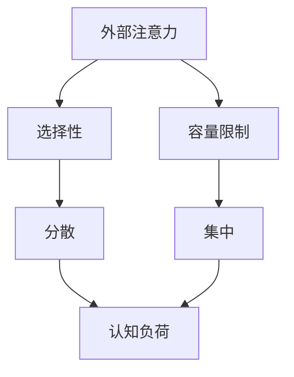

                 

# 信息时代的注意力管理策略与实践：在干扰和信息过载中航行

## 关键词

注意力管理、信息过载、干扰、认知行为理论、认知控制、注意力分配、注意力管理工具

## 摘要

本文旨在探讨信息时代中注意力管理的重要性，分析注意力管理的基础理论，提供实践中的应用策略，并通过案例分析展示注意力管理在个人、工作与教育领域的实际效果。本文首先介绍了信息时代的挑战，接着讲解了注意力系统的基本原理和注意力管理的理论基础，然后提出了注意力管理的模型与策略。随后，本文深入探讨工作与学习中的注意力管理、数字设备与注意力管理、社交互动与注意力管理等方面的实践应用。最后，通过具体的案例分析和总结，本文指出了注意力管理面临的挑战和未来发展方向。

## 目录

1. 引言
   1.1 引言
   1.2 信息时代的挑战
   1.3 注意力管理的重要性
   1.4 本书的目的与结构

2. 注意力管理的基础理论
   2.1 注意力系统的基本原理
   2.2 注意力管理的理论基础
   2.3 注意力管理的模型与策略

3. 注意力管理的实践应用
   3.1 工作与学习中的注意力管理
   3.2 数字设备与注意力管理
   3.3 社交互动与注意力管理

4. 案例分析
   4.1 企业注意力管理的案例
   4.2 教育领域的注意力管理案例
   4.3 个人生活注意力管理案例

5. 结论与展望
   5.1 结论
   5.2 展望

6. 附录
   6.1 注意力管理工具推荐
   6.2 参考文献
   6.3 练习题与案例分析

## 第一部分：引言

### 1.1 引言

在信息爆炸的时代，人类面临着前所未有的挑战。大量的信息不断涌入，从互联网、社交媒体到电子邮件、即时通讯工具，无时无刻不在分散我们的注意力。与此同时，各种干扰源如广告、社交媒体通知等无处不在，极大地影响了我们的工作效率和生活质量。在这个背景下，注意力管理变得尤为重要。本文将探讨注意力管理在信息时代的意义，分析其理论基础和实践应用，并通过对实际案例的分析，提出注意力管理策略和建议。

### 1.2 信息时代的挑战

信息时代的到来带来了巨大的机遇，但同时也伴随着诸多挑战。首先，信息过载成为了一个普遍问题。人们每天都要处理大量的信息，从新闻、广告到社交媒体更新，这些信息不仅分散了我们的注意力，还带来了认知负担。其次，干扰源的数量和种类也在不断增加。无论是电子邮件、即时通讯工具还是社交媒体通知，它们都在不断地打断我们的工作流程和思考过程。最后，随着数字设备的普及，人们越来越容易受到数字干扰的影响。智能手机、平板电脑等设备无时无刻不在吸引我们的注意力，使我们难以集中精力完成任务。

### 1.3 注意力管理的重要性

注意力管理在信息时代的重要性不言而喻。首先，良好的注意力管理可以提高工作效率。当我们能够集中精力完成任务时，可以更快地完成工作，减少时间的浪费。其次，注意力管理有助于提升生活质量。通过减少干扰和分散注意力的事物，我们可以更好地享受生活，减轻压力和焦虑。最后，注意力管理对于个人成长和发展具有重要意义。通过培养注意力集中的习惯，我们可以更好地学习新知识，提升自我认知和思维能力。

### 1.4 本书的目的与结构

本书旨在探讨注意力管理在信息时代的应用，帮助读者了解注意力管理的基础理论，掌握实践应用策略，并通过案例分析提供实际操作的指导。本书分为五个部分：

- 第一部分：引言，介绍信息时代的挑战和注意力管理的重要性。
- 第二部分：注意力管理的基础理论，讲解注意力系统的基本原理和注意力管理的理论基础。
- 第三部分：注意力管理的实践应用，探讨工作与学习中的注意力管理、数字设备与注意力管理、社交互动与注意力管理等方面的应用策略。
- 第四部分：案例分析，通过企业、教育领域和个人生活的注意力管理案例，展示实际应用的效果和经验。
- 第五部分：结论与展望，总结注意力管理的总体效果，展望未来的发展方向。

## 第二部分：注意力管理的基础理论

### 2.1 注意力系统的基本原理

注意力系统是大脑的一种功能，它负责处理和筛选信息，使我们能够专注于特定的任务或活动。注意力系统可以分为两个主要部分：外部注意力和内部注意力。

#### 2.1.1 外部注意力

外部注意力是指对环境中的外部刺激进行监控和反应的能力。它使我们能够感知外部世界的变化，例如识别声音、视觉信号等。外部注意力具有以下特点：

1. **选择性**：外部注意力具有选择性，即我们只能关注一小部分外部刺激，而忽略其他不相关的刺激。
2. **容量有限**：外部注意力的容量是有限的，这意味着我们无法同时关注太多的外部刺激。
3. **适应性**：外部注意力可以根据环境的变化进行适应性调整，例如在噪音环境中提高对声音的注意力。

#### 2.1.2 内部注意力

内部注意力是指对内部心理过程进行监控和调节的能力。它使我们能够集中精力思考问题、回忆信息等。内部注意力具有以下特点：

1. **目的性**：内部注意力是有目的的，即我们为了完成特定的任务或解决问题而使用内部注意力。
2. **灵活性**：内部注意力可以灵活地分配和调节，以适应不同的任务需求。
3. **持久性**：内部注意力可以持续较长时间，使我们能够深入思考问题或完成复杂的任务。

### 2.1.3 注意力分散与集中

注意力分散和集中是注意力系统的两个重要状态。

#### 2.1.3.1 注意力分散

注意力分散是指注意力从一个任务或活动转移到另一个任务或活动，导致注意力效率下降。注意力分散可以由外部干扰（如噪音、中断）或内部干扰（如焦虑、疲劳）引起。注意力分散会导致以下问题：

1. **降低工作效率**：分散的注意力使我们难以集中精力完成任务，导致工作效率下降。
2. **增加错误率**：分散的注意力容易导致错误和遗漏，因为我们的注意焦点不明确。
3. **影响记忆**：分散的注意力影响记忆的巩固，使我们难以记住重要的信息。

#### 2.1.3.2 注意力集中

注意力集中是指将注意力集中在一个特定的任务或活动上，以实现最佳的效果。注意力集中具有以下优势：

1. **提高工作效率**：集中的注意力使我们能够更高效地完成任务，减少时间和精力浪费。
2. **提升创造力**：集中的注意力有助于激发创造力，使我们能够产生更多的创意和想法。
3. **增强学习效果**：集中的注意力有助于加深对知识的理解和记忆，提高学习效果。

### 2.1.4 注意力容量理论

注意力容量理论是关于人类注意力的一个重要理论。根据这一理论，人类注意力具有一定的容量限制，我们无法同时处理大量的信息。

#### 2.1.4.1 注意力容量限制

1. **工作记忆容量**：工作记忆是指暂时存储和加工信息的认知结构。研究表明，工作记忆的容量有限，通常只能处理大约四个到七个信息单元。
2. **处理速度**：除了容量限制外，注意力的处理速度也是一个重要因素。处理速度较慢会导致信息堆积，影响注意力的集中。

#### 2.1.4.2 注意力分配策略

为了克服注意力容量限制，我们可以采取以下策略：

1. **分块处理**：将复杂任务分解成小块，每次只专注于一个部分，以减少工作记忆的负担。
2. **优先级排序**：根据任务的重要性和紧急性，对任务进行优先级排序，优先处理重要的任务。
3. **时间管理**：合理安排时间，为每个任务分配适当的时间，以避免同时处理过多的任务。

### 2.1.5 注意力分配与认知负荷

注意力分配与认知负荷密切相关。认知负荷是指完成任务时所需的认知资源，包括注意力和工作记忆。当认知负荷过高时，会导致注意力分散和效率下降。

#### 2.1.5.1 认知负荷的来源

1. **任务复杂性**：复杂的任务通常需要更多的认知资源，导致认知负荷增加。
2. **任务数量**：同时处理多个任务会增加认知负荷。
3. **外部干扰**：外部干扰（如噪音、中断）会增加认知负荷，使注意力难以集中。

#### 2.1.5.2 降低认知负荷的策略

1. **简化任务**：将复杂任务简化为更简单的步骤，以减少认知负荷。
2. **分阶段处理**：将任务分为多个阶段，每次专注于一个阶段，以降低认知负荷。
3. **减少外部干扰**：创建一个安静的工作环境，减少外部干扰，以提高注意力集中度。

### 2.1.6 注意力管理的核心概念与联系

在讨论注意力系统的基本原理时，以下几个核心概念之间存在着紧密的联系：

1. **选择性**：选择性是注意力系统的一个重要特性，它使我们能够选择关注重要的信息，而忽略不相关的信息。
2. **容量限制**：注意力容量理论指出，我们的注意力容量是有限的，这要求我们在处理信息时进行有效的选择和分配。
3. **分散与集中**：注意力分散和集中是注意力系统的重要状态，它们影响着我们的认知负荷和任务效率。
4. **认知负荷**：认知负荷与注意力的分配密切相关，它直接影响我们的注意力和工作效率。

为了更好地理解这些概念之间的联系，我们可以使用以下Mermaid流程图来展示注意力系统的工作原理：



通过这个流程图，我们可以清晰地看到注意力系统如何通过选择性、容量限制、分散和集中等机制来处理外部信息，并最终影响认知负荷。

### 2.1.7 注意力管理的重要性

注意力管理在个人、工作和教育领域都具有重要意义。在个人层面，良好的注意力管理可以帮助我们更好地处理日常任务，提高生活质量和幸福感。在工作层面，注意力管理可以提高工作效率，减少错误和遗漏，促进职业发展。在教育领域，注意力管理有助于提高学习效果，培养学生的批判性思维和创造力。

### 2.1.8 注意力管理的实践应用

在接下来的章节中，我们将进一步探讨注意力管理在不同场景下的实践应用，包括工作与学习中的注意力管理、数字设备与注意力管理、社交互动与注意力管理等方面的策略和方法。

## 第三部分：注意力管理的理论基础

### 2.2.1 奥卡姆剃刀原则

奥卡姆剃刀原则（Occam's Razor）是一种解决问题的方法论，其核心思想是“如无必要，勿增实体”。这一原则在注意力管理中具有重要的指导意义。当我们面临信息过载和干扰时，应该尽可能地简化信息处理过程，减少不必要的认知负担。

#### 2.2.1.1 奥卡姆剃刀原则在注意力管理中的应用

1. **减少信息来源**：尽量减少需要关注的信息来源，例如取消不必要的订阅和通知，以减少信息过载。
2. **简化任务流程**：将复杂的任务分解为简单的步骤，减少认知负荷。
3. **避免过度思考**：在面对问题时，避免进行不必要的深度思考，而是采用简单的解决方案。

### 2.2.2 心理学视角

心理学视角提供了对注意力管理的重要理解，包括注意力分散、注意力集中、工作记忆和执行功能等方面。

#### 2.2.2.1 注意力分散与集中

1. **注意力分散**：注意力分散是指注意力从一个任务转移到另一个任务，导致认知效率下降。分散的注意力容易受到外部干扰的影响，例如噪音、中断等。
2. **注意力集中**：注意力集中是指将注意力完全集中在特定的任务上，以实现最佳效果。集中的注意力有助于提高工作效率和创造力。

#### 2.2.2.2 工作记忆

工作记忆是指暂时存储和加工信息的认知结构，其容量有限。工作记忆对注意力管理至关重要，因为它负责处理和存储当前任务所需的信息。

1. **工作记忆容量**：研究表明，工作记忆的容量通常在四个到七个信息单元之间。
2. **工作记忆与注意力管理**：通过有效的注意力管理策略，可以减少工作记忆的负担，提高认知效率。

#### 2.2.2.3 执行功能

执行功能是指执行特定任务时所需的认知能力，包括计划、决策、控制和调整等。执行功能与注意力管理密切相关，因为它们都需要高度的集中和自我控制。

1. **执行功能的构成**：执行功能包括认知灵活度、工作记忆、注意力控制和抑制冲动等方面。
2. **执行功能与注意力管理**：通过培养执行功能，可以提高注意力管理能力，从而更好地应对信息过载和干扰。

### 2.2.3 生理学视角

生理学视角提供了对注意力管理的生物学基础，包括大脑结构和神经递质等方面。

#### 2.2.3.1 大脑结构

1. **前额叶皮质**：前额叶皮质是大脑中负责执行功能的重要区域，包括注意力管理、决策和规划等。
2. **基底神经节**：基底神经节是大脑中负责运动控制和习惯形成的重要结构，对注意力管理也有重要影响。

#### 2.2.3.2 神经递质

1. **多巴胺**：多巴胺是一种神经递质，与奖赏和动机有关。多巴胺水平的升高有助于提高注意力集中和动机。
2. **去甲肾上腺素**：去甲肾上腺素是一种神经递质，与注意力集中和警觉性有关。去甲肾上腺素水平的升高有助于提高注意力和工作效率。

### 2.2.4 注意力管理的模型与策略

注意力管理涉及多个层次，从认知层面到行为层面，再到环境层面。以下是一些常见的注意力管理模型与策略：

#### 2.2.4.1 认知行为理论模型

认知行为理论模型将注意力管理视为一个认知过程，强调认知策略和行为习惯的重要性。

1. **认知策略**：认知策略包括选择性关注、信息过滤、任务分解和目标设定等。
2. **行为习惯**：行为习惯包括规律的作息、适当的休息、避免多任务处理和定期锻炼等。

#### 2.2.4.2 认知控制理论模型

认知控制理论模型关注个体如何调节和控制自己的注意力，以应对外部干扰和内部冲动。

1. **注意力控制**：注意力控制包括自我监控、自我调节和自我激励等。
2. **干扰控制**：干扰控制包括减少外部干扰、设置专注时间和培养专注习惯等。

#### 2.2.4.3 应用策略与实践

在实际应用中，以下策略和实践可以帮助改善注意力管理：

1. **设定明确目标**：设定具体、明确的目标，有助于提高注意力集中度。
2. **避免多任务处理**：尽量减少同时处理多个任务，以减少认知负荷。
3. **创造专注环境**：创造一个安静、整洁的工作或学习环境，减少干扰。
4. **定期休息与锻炼**：定期休息和锻炼有助于缓解疲劳，提高注意力集中。
5. **使用注意力管理工具**：利用各种注意力管理工具和应用，例如番茄工作法、专注类应用等。

### 2.2.5 注意力管理的重要性

注意力管理在个人、工作和教育领域都具有重要意义。在个人层面，良好的注意力管理可以帮助我们更好地处理日常任务，提高生活质量和幸福感。在工作层面，注意力管理可以提高工作效率，减少错误和遗漏，促进职业发展。在教育领域，注意力管理有助于提高学习效果，培养学生的批判性思维和创造力。

### 2.2.6 注意力管理的实践应用

在接下来的章节中，我们将进一步探讨注意力管理在不同场景下的实践应用，包括工作与学习中的注意力管理、数字设备与注意力管理、社交互动与注意力管理等方面的策略和方法。

### 2.3.1 认知行为理论模型

认知行为理论模型（Cognitive Behavioral Theory, CBT）提供了关于如何通过改变认知和行为来改善注意力的框架。CBT 强调认知过程在行为和情绪中的作用，并认为通过改变不合理的思维模式和行为习惯，可以有效地提高注意力管理水平。

#### 2.3.1.1 认知行为理论的核心概念

1. **认知过程**：认知行为理论认为，我们的行为和情绪受到我们的认知过程（思考方式）的影响。在注意力管理中，这包括对任务目标、信息处理方式、时间管理策略等方面的思考。

2. **行为习惯**：行为习惯是我们在日常生活中不断重复的行为模式。良好的行为习惯可以帮助我们提高注意力集中度，例如规律的作息、避免多任务处理等。

3. **情绪调节**：情绪调节是认知行为理论的重要方面。通过认知和行为策略，我们可以调节情绪，以更好地管理注意力。

#### 2.3.1.2 注意力管理的认知行为策略

1. **目标设定**：设定明确、具体的任务目标有助于提高注意力集中度。目标应具有可衡量性、相关性和可实现性。

   ```pseudo
   设定目标：
   - 任务A：阅读一篇技术文档，理解关键概念
   - 时间：2小时
   - 成果：完成阅读并总结关键概念
   ```

2. **任务分解**：将复杂任务分解为更简单的步骤，有助于降低认知负荷，提高注意力集中度。

   ```pseudo
   任务分解：
   - 阅读文档
   - 理解关键概念
   - 撰写总结
   - 修订文档
   ```

3. **时间管理**：合理安排时间，为每个任务分配适当的时间，有助于避免时间浪费和注意力分散。

   ```pseudo
   时间管理：
   - 上午9:00-11:00：阅读文档
   - 下午2:00-4:00：撰写总结
   - 晚上7:00-9:00：修订文档
   ```

4. **情绪调节**：通过认知策略调节情绪，例如正念冥想、深呼吸等，有助于保持平静和专注。

   ```pseudo
   情绪调节：
   - 遇到困难时，进行深呼吸和正念冥想
   - 保持积极的心态，相信自己可以完成任务
   ```

#### 2.3.1.3 认知行为理论模型的应用案例

以下是一个实际案例，展示了如何应用认知行为理论模型来提高注意力集中度：

**案例背景**：小明是一名大学生，他在学习编程课程时经常感到注意力不集中，导致学习效果不佳。

**解决方案**：

1. **目标设定**：小明设定了明确的学习目标，例如每周完成一篇编程作业、每天阅读两小时的技术文档等。

2. **任务分解**：将每个学习任务分解为具体的步骤，例如阅读文档时分为三个阶段：快速浏览、深入理解和总结归纳。

3. **时间管理**：制定详细的时间表，确保每天有固定的时间用于学习编程，并避免在晚上熬夜学习。

4. **情绪调节**：在遇到困难时，小明通过正念冥想和深呼吸来调节情绪，保持平静和专注。

**结果**：通过应用认知行为理论模型，小明在编程学习中的注意力集中度明显提高，学习效果得到了显著改善。

### 2.3.2 认知控制理论模型

认知控制理论模型（Cognitive Control Theory, CTC）是另一种重要的注意力管理理论。该理论认为，注意力管理是一个高度动态的过程，涉及大脑不同区域之间的协同工作，以调节和优化认知资源。

#### 2.3.2.1 认知控制理论的核心概念

1. **认知资源**：认知资源是指大脑在处理信息时所使用的认知能力，包括注意力、记忆、执行功能等。

2. **认知控制**：认知控制是指大脑调节和优化认知资源的过程，以实现特定的目标和任务。认知控制涉及以下几个方面：

   - **分配**：根据任务需求，合理分配认知资源。
   - **调节**：根据任务进展和结果，调整认知资源的分配和利用。
   - **优化**：通过经验和学习，优化认知控制策略，以提高任务效率和效果。

#### 2.3.2.2 注意力管理的认知控制策略

1. **目标导向**：明确任务目标，有助于集中注意力，并指导认知资源的分配。

   ```pseudo
   目标导向：
   - 确定任务目标：完成编程项目
   - 分配认知资源：阅读文档、编写代码、测试和调试
   ```

2. **选择性注意力**：通过选择性注意力，将认知资源集中在关键任务上，过滤掉不相关的干扰。

   ```pseudo
   选择性注意力：
   - 在编写代码时，关闭社交媒体通知
   - 避免多任务处理，专注于当前任务
   ```

3. **适应性调节**：根据任务进展和结果，动态调整认知资源的分配和利用。

   ```pseudo
   适应性调节：
   - 如果编码遇到困难，增加对文档阅读的时间
   - 如果编码进展顺利，缩短文档阅读时间，专注于代码实现
   ```

4. **自我监控**：通过自我监控，了解自己的注意力状态，及时发现并纠正注意力分散的情况。

   ```pseudo
   自我监控：
   - 定期检查任务进展，确保按计划进行
   - 如果发现注意力不集中，暂停任务，进行短暂的休息
   ```

#### 2.3.2.3 认知控制理论模型的应用案例

以下是一个实际案例，展示了如何应用认知控制理论模型来提高注意力集中度：

**案例背景**：小王是一名软件开发工程师，他在工作中经常遇到复杂的编程任务，经常感到压力和疲劳，导致工作效率低下。

**解决方案**：

1. **目标导向**：小王明确了自己的工作目标，例如按时交付高质量的代码，并制定了详细的任务计划。

2. **选择性注意力**：在编码时，小王关闭了社交媒体和电子邮件通知，专注于代码实现。

3. **适应性调节**：根据任务进展，小王灵活调整了工作节奏，遇到难题时增加了文档阅读的时间，解决问题后再集中精力编码。

4. **自我监控**：小王定期检查任务进展，确保按照计划进行，并及时纠正注意力分散的情况。

**结果**：通过应用认知控制理论模型，小王在编程工作中的注意力集中度得到了显著提高，工作效率和代码质量也有所提升。

### 2.3.3 应用策略与实践

在实际应用中，认知行为理论模型和认知控制理论模型可以相互结合，形成一套完整的注意力管理策略。以下是一些具体的注意力管理应用策略和实践：

1. **设定明确目标**：明确任务目标，有助于提高注意力集中度。

2. **任务分解**：将复杂任务分解为简单的步骤，有助于降低认知负荷。

3. **选择性注意力**：通过选择性注意力，将认知资源集中在关键任务上。

4. **适应性调节**：根据任务进展和结果，动态调整认知资源的分配和利用。

5. **自我监控**：通过自我监控，了解自己的注意力状态，及时发现并纠正注意力分散的情况。

6. **情绪调节**：通过认知策略调节情绪，保持平静和专注。

7. **环境优化**：创造一个安静、整洁的工作或学习环境，减少干扰。

8. **定期休息**：适当休息和锻炼，有助于缓解疲劳，提高注意力集中度。

9. **使用注意力管理工具**：利用各种注意力管理工具和应用，例如番茄工作法、专注类应用等。

通过这些策略和实践，我们可以更好地管理注意力，提高工作效率，提升生活质量。

### 2.3.4 注意力管理策略与实践总结

通过认知行为理论模型和认知控制理论模型，我们可以了解注意力管理的核心概念和策略。以下是对注意力管理策略和实践的总结：

1. **核心概念**：
   - 注意力分散与集中：注意力分散导致认知效率下降，注意力集中有助于提高工作效率。
   - 认知资源：大脑在处理信息时所使用的认知能力，包括注意力、记忆、执行功能等。
   - 认知控制：大脑调节和优化认知资源的过程，以实现特定的目标和任务。

2. **策略与实践**：
   - 设定明确目标：明确任务目标，有助于提高注意力集中度。
   - 任务分解：将复杂任务分解为简单的步骤，有助于降低认知负荷。
   - 选择性注意力：通过选择性注意力，将认知资源集中在关键任务上。
   - 适应性调节：根据任务进展和结果，动态调整认知资源的分配和利用。
   - 自我监控：通过自我监控，了解自己的注意力状态，及时发现并纠正注意力分散的情况。
   - 情绪调节：通过认知策略调节情绪，保持平静和专注。
   - 环境优化：创造一个安静、整洁的工作或学习环境，减少干扰。
   - 定期休息：适当休息和锻炼，有助于缓解疲劳，提高注意力集中度。
   - 使用注意力管理工具：利用各种注意力管理工具和应用，例如番茄工作法、专注类应用等。

通过这些策略和实践，我们可以更好地管理注意力，提高工作效率，提升生活质量。

### 第三部分：注意力管理的实践应用

#### 3.1 工作与学习中的注意力管理

在工作和学习中，注意力管理是提高效率和效果的关键。以下是几种有效的注意力管理策略：

##### 3.1.1 高效工作策略

1. **设定明确目标**：在开始工作前，明确任务目标，有助于提高注意力集中度。

2. **任务分解**：将复杂任务分解为简单的步骤，有助于降低认知负荷。

3. **优先级排序**：根据任务的重要性和紧急性，对任务进行优先级排序，优先处理重要的任务。

4. **避免多任务处理**：尽量减少同时处理多个任务，以提高注意力集中度和工作效率。

5. **定期休息**：适当休息和锻炼，有助于缓解疲劳，提高注意力集中度。

##### 3.1.2 提升学习效率

1. **设定学习目标**：明确学习目标，有助于提高学习效果。

2. **专注学习**：在学习时，尽量减少干扰，专注于当前的学习内容。

3. **定期复习**：通过定期复习，加深对知识的理解和记忆。

4. **分块学习**：将学习内容分为小块，每次专注于一个部分，以提高学习效率。

5. **使用记忆技巧**：使用各种记忆技巧，如联想、重复、归纳等，有助于提高记忆效果。

##### 3.1.3 时间管理与注意力分配

1. **制定时间表**：制定详细的时间表，合理安排工作和学习时间，以避免时间浪费和注意力分散。

2. **分阶段处理任务**：将任务分为多个阶段，每个阶段专注于一个任务，以减少认知负荷。

3. **注意力分配策略**：根据任务的重要性和紧急性，合理分配注意力资源，确保关键任务得到充分关注。

4. **定期评估**：定期评估时间管理和注意力分配的效果，及时调整策略，以适应新的任务需求。

#### 3.2 数字设备与注意力管理

随着数字设备的普及，我们越来越容易受到数字干扰的影响。以下是几种数字设备中的注意力管理策略：

##### 3.2.1 数字设备对注意力的影响

1. **信息过载**：数字设备提供了大量的信息，容易导致信息过载，分散注意力。

2. **干扰源**：数字设备上的各种通知和消息，如电子邮件、社交媒体更新、即时通讯工具等，会不断打断我们的工作和学习。

3. **习惯性使用**：长时间使用数字设备，容易形成习惯性使用，导致注意力难以集中。

##### 3.2.2 数字设备使用中的注意力管理策略

1. **设定使用规则**：为数字设备的使用设定规则，例如每天限制使用时间、避免在特定时间使用等。

2. **关闭通知**：关闭不必要的通知和消息提醒，以减少干扰。

3. **专注模式**：使用专注类应用或功能，例如“勿扰模式”、“专注模式”等，以减少数字干扰。

4. **时间管理工具**：使用时间管理工具，如番茄工作法应用，帮助合理安排时间，提高注意力集中度。

##### 3.2.3 社交媒体与注意力管理

1. **社交媒体使用规则**：设定社交媒体的使用规则，例如每天限制使用时间、避免在特定时间使用等。

2. **关注高质量内容**：关注高质量的社交媒体账号和内容，减少低质量信息的干扰。

3. **合理安排使用时间**：合理安排社交媒体使用时间，避免在关键任务或学习时使用。

4. **限制使用频率**：通过设置使用频率限制，减少社交媒体对注意力的影响。

#### 3.3 社交互动与注意力管理

在社交互动中，注意力管理同样重要。以下是一些社交互动中的注意力管理策略：

##### 3.3.1 社交互动中的注意力分散

1. **多任务处理**：在社交互动中，尽量避免多任务处理，以免分散注意力。

2. **环境影响**：选择一个安静、无干扰的环境进行社交互动，有助于提高注意力集中度。

3. **适度参与**：参与社交互动时，适度参与，避免过度投入，以确保其他任务的完成。

##### 3.3.2 提升社交互动中的注意力集中

1. **主动参与**：在社交互动中，主动参与讨论和交流，提高注意力集中度。

2. **关注关键信息**：关注社交互动中的关键信息，提高信息处理效率。

3. **避免分心**：避免在社交互动中分心，专注于当前的交流内容。

##### 3.3.3 社交互动中的注意力平衡

1. **分配时间**：合理安排社交互动的时间，确保在社交互动和其他任务之间保持平衡。

2. **保持沟通质量**：在社交互动中，保持良好的沟通质量，确保信息的有效传递。

3. **培养专注习惯**：通过日常练习，培养专注习惯，提高社交互动中的注意力集中度。

通过以上策略，我们可以在工作和学习中更好地管理注意力，提高效率和质量；在数字设备使用中，减少干扰，提高注意力集中度；在社交互动中，保持注意力平衡，提高沟通效果。

### 3.1 工作与学习中的注意力管理

在工作和学习中，注意力管理至关重要。以下是一些具体的注意力管理策略，旨在帮助提高工作效率和学习效果。

#### 3.1.1 高效工作策略

**1. 设定明确目标：**
在开始工作前，明确任务目标和预期成果。这有助于提高注意力集中度和工作动力。

```markdown
**示例：**
- 目标：完成本周的编程项目
- 预期成果：实现功能A、功能B和功能C
- 时间安排：每天上午9点到下午5点，每天至少完成一个功能
```

**2. 任务分解：**
将复杂任务分解为更小的子任务，每个子任务都有明确的截止日期。这样可以降低任务的复杂度，使注意力更容易集中。

```markdown
**示例：**
- 子任务1：研究相关技术文档
- 子任务2：编写代码实现功能A
- 子任务3：测试功能A并修复bug
- 截止日期：每个子任务两天内完成
```

**3. 优先级排序：**
根据任务的重要性和紧急性，对任务进行优先级排序。这样可以帮助我们集中注意力处理最重要的任务。

```markdown
**示例：**
- 高优先级：项目关键功能的实现和测试
- 中优先级：项目辅助功能的开发和测试
- 低优先级：项目文档整理和汇报准备
```

**4. 避免多任务处理：**
尽量在同一时间专注于一项任务，避免多任务处理。多任务处理会导致注意力分散，降低工作效率。

```markdown
**示例：**
- 不要在编写代码的同时查看邮件或社交媒体
- 专注于每个任务，直到完成后再切换到下一个任务
```

**5. 定期休息：**
长时间工作或学习会导致疲劳，影响注意力集中。定期休息有助于恢复精力，提高工作效率。

```markdown
**示例：**
- 每工作45分钟，休息10分钟
- 每天工作结束后，进行短暂的休息和放松
```

#### 3.1.2 提升学习效率

**1. 设定学习目标：**
在开始学习前，明确学习目标和预期成果。这有助于提高学习动力和注意力集中度。

```markdown
**示例：**
- 目标：掌握本课程的核心概念
- 预期成果：完成课后作业、通过考试
- 时间安排：每周至少投入10小时学习
```

**2. 专注学习：**
在学习时，尽量减少干扰，专注于学习内容。关闭不必要的设备，例如手机、社交媒体等。

```markdown
**示例：**
- 关闭手机通知，避免分心
- 在安静的环境中学习，减少外部干扰
```

**3. 定期复习：**
定期复习所学内容，巩固记忆，提高学习效果。

```markdown
**示例：**
- 每周至少安排一次复习时间
- 制作复习笔记，帮助记忆关键概念
```

**4. 分块学习：**
将学习内容分为小块，每次专注于一个部分，以减少认知负荷。

```markdown
**示例：**
- 学习一门课程，每次专注于一个章节
- 每个章节学习完成后，进行总结和复习
```

**5. 使用记忆技巧：**
使用各种记忆技巧，如联想、重复、归纳等，帮助提高记忆效果。

```markdown
**示例：**
- 使用闪卡进行记忆训练
- 通过故事或图表将复杂概念形象化
```

#### 3.1.3 时间管理与注意力分配

**1. 制定时间表：**
制定详细的时间表，合理安排工作和学习时间，以避免时间浪费和注意力分散。

```markdown
**示例：**
- 每天工作时间表：
  - 上午9:00-11:00：研究技术文档
  - 上午11:00-12:00：午休
  - 下午1:00-3:00：编写代码
  - 下午3:00-4:00：测试代码
  - 下午4:00-5:00：总结和回顾

- 每周学习时间表：
  - 周一、周三、周五：上课
  - 周二、周四：自学和完成作业
  - 周六、周日：复习和总结
```

**2. 分阶段处理任务：**
将任务分为多个阶段，每个阶段专注于一个任务，以减少认知负荷。

```markdown
**示例：**
- 阶段1：阅读教材和笔记
- 阶段2：完成课后作业
- 阶段3：与同学讨论和解决问题
- 阶段4：总结和复习
```

**3. 注意力分配策略：**
根据任务的重要性和紧急性，合理分配注意力资源，确保关键任务得到充分关注。

```markdown
**示例：**
- 重要且紧急：立即处理，如紧急项目
- 重要但不紧急：安排时间处理，如长期项目
- 不重要但紧急：委托他人处理，如会议通知
- 不重要且不紧急：推迟处理，如不紧急的任务
```

**4. 定期评估：**
定期评估时间管理和注意力分配的效果，及时调整策略，以适应新的任务需求。

```markdown
**示例：**
- 每周评估一次时间管理和注意力分配效果
- 根据评估结果，调整时间表和任务优先级
```

通过以上策略，我们可以在工作和学习中更好地管理注意力，提高效率和质量。

### 3.2 数字设备与注意力管理

在数字设备广泛使用的时代，如何有效管理数字设备上的注意力成为一个关键问题。以下是一些具体策略和实践，帮助我们在使用数字设备时保持专注和减少干扰。

#### 3.2.1 数字设备对注意力的影响

**1. 信息过载：**
数字设备提供了大量信息，如社交媒体更新、电子邮件、通知等，容易导致信息过载，分散注意力。

**2. 干扰源：**
数字设备上的各种通知和消息，如即时通讯工具的通知、社交媒体的消息等，会不断打断我们的工作流程。

**3. 习惯性使用：**
长时间使用数字设备，容易形成习惯性使用，导致注意力难以集中。

#### 3.2.2 数字设备使用中的注意力管理策略

**1. 设定使用规则：**
为了减少数字设备的干扰，我们可以设定一些使用规则，如每天限制使用时间、避免在特定时间使用等。

```markdown
**示例：**
- 每天使用手机的时间限制为2小时。
- 晚上睡前1小时内不使用手机。
```

**2. 关闭通知：**
关闭不必要的通知和消息提醒，以减少干扰。

```markdown
**示例：**
- 关闭社交媒体的通知。
- 将电子邮件通知设置为只在特定时间提醒。
```

**3. 专注模式：**
使用专注类应用或功能，如“勿扰模式”、“专注模式”等，以减少数字干扰。

```markdown
**示例：**
- 使用专注类应用（如Forest、Focus@Will）来帮助保持专注。
- 在需要集中精力时开启“勿扰模式”，减少手机通知。
```

**4. 时间管理工具：**
使用时间管理工具，如番茄工作法应用，帮助合理安排时间，提高注意力集中度。

```markdown
**示例：**
- 使用番茄工作法应用（如Pomodoro Timer）来规划学习或工作时间。
- 每25分钟专注工作，然后休息5分钟，以保持精力充沛。
```

**5. 定制化界面：**
定制化数字设备的界面，减少视觉干扰。

```markdown
**示例：**
- 清除桌面上的不必要图标。
- 将手机或电脑的背景设置为简洁的样式。
```

#### 3.2.3 社交媒体与注意力管理

**1. 社交媒体使用规则：**
设定社交媒体的使用规则，如每天限制使用时间、避免在特定时间使用等。

```markdown
**示例：**
- 每天在社交媒体上花费的时间不超过30分钟。
- 在完成任务或学习后再使用社交媒体。
```

**2. 关注高质量内容：**
关注高质量的社交媒体账号和内容，减少低质量信息的干扰。

```markdown
**示例：**
- 关注行业专家和学术机构的官方账号。
- 定期清理关注列表，取消关注不感兴趣或不相关的账号。
```

**3. 合理安排使用时间：**
合理安排社交媒体使用时间，避免在关键任务或学习时使用。

```markdown
**示例：**
- 在需要集中精力工作时，将社交媒体通知关闭。
- 在休息时间或完成任务后，适当使用社交媒体进行放松。
```

**4. 限制使用频率：**
通过设置使用频率限制，减少社交媒体对注意力的影响。

```markdown
**示例：**
- 使用应用程序限制功能，如“自律锁”来限制社交媒体使用时间。
- 每次使用社交媒体时，设置时间限制，以确保不浪费时间。
```

通过以上策略，我们可以在使用数字设备时更好地管理注意力，减少干扰，提高工作效率。

### 3.3 社交互动与注意力管理

在社交互动中，保持注意力的集中和管理对于提高沟通效果和提升生活质量至关重要。以下是一些社交互动中的注意力管理策略：

#### 3.3.1 社交互动中的注意力分散

**1. 多任务处理：**
在社交互动中，尽量避免多任务处理，以免分散注意力。

```markdown
**示例：**
- 不要在谈话时查看手机或电子邮件。
- 社交互动时，确保只关注与对方交流的内容，避免分心。
```

**2. 环境影响：**
选择一个安静、无干扰的环境进行社交互动，有助于提高注意力集中度。

```markdown
**示例：**
- 在家中或安静的咖啡厅进行私人对话。
- 避免在嘈杂的公共场所进行重要讨论。
```

**3. 适度参与：**
参与社交互动时，适度参与，避免过度投入，以确保其他任务的完成。

```markdown
**示例：**
- 在参加聚会或会议时，合理安排参与时间，避免过度参与。
- 保持参与度，但不要让社交互动占据所有时间。
```

#### 3.3.2 提升社交互动中的注意力集中

**1. 主动参与：**
在社交互动中，主动参与讨论和交流，提高注意力集中度。

```markdown
**示例：**
- 积极提问和回答问题。
- 分享自己的观点和经验，以增加互动性。
```

**2. 关注关键信息：**
关注社交互动中的关键信息，提高信息处理效率。

```markdown
**示例：**
- 在会议中，记录关键决策和行动计划。
- 在社交聚会中，关注对方的兴趣和需求，以建立更好的联系。
```

**3. 避免分心：**
在社交互动中，避免分心，专注于当前的交流内容。

```markdown
**示例：**
- 避免查看手机或其他设备。
- 保持眼神交流和倾听对方，以表现出对他们的关注。
```

#### 3.3.3 社交互动中的注意力平衡

**1. 分配时间：**
合理安排社交互动的时间，确保在社交互动和其他任务之间保持平衡。

```markdown
**示例：**
- 每周安排固定的时间用于社交互动。
- 在繁忙的工作和学习时间之外，保持适当的社交活动。
```

**2. 保持沟通质量：**
在社交互动中，保持良好的沟通质量，确保信息的有效传递。

```markdown
**示例：**
- 注意语言的表达和肢体语言，以传达清晰的信息。
- 保持开放的沟通态度，鼓励对方表达观点。
```

**3. 培养专注习惯：**
通过日常练习，培养专注习惯，提高社交互动中的注意力集中度。

```markdown
**示例：**
- 在日常对话中，练习专注倾听和积极回应。
- 尝试在社交互动中减少干扰，专注于对方。
```

通过这些策略，我们可以在社交互动中更好地管理注意力，提高沟通效果，同时保持其他任务的完成质量。

### 4.1 企业注意力管理的案例

#### 4.1.1 案例背景

某知名科技公司在其快速发展过程中，面临着员工注意力分散和信息过载的问题。公司员工每天需要处理大量的邮件、会议和项目任务，导致工作效率下降，员工压力增大。为了解决这一问题，公司决定引入注意力管理策略，以提高工作效率和员工满意度。

#### 4.1.2 注意力管理策略

1. **明确目标和任务分解**：
   - 公司制定了一系列明确的目标，并要求每个团队成员将大任务分解为小任务，明确每个任务的截止日期和负责人。
   - 通过任务分解，员工可以更好地集中注意力，专注于具体的任务。

2. **减少邮件和信息通知**：
   - 公司引入了邮件管理工具，减少不必要的邮件和通知，员工只需关注重要的邮件和通知。
   - 通过邮件分类和过滤，员工可以更快地找到重要信息，减少信息过载。

3. **专注时间和休息制度**：
   - 公司实行了“专注时间”和“休息时间”制度，员工在专注时间内关闭手机和其他干扰设备，集中精力完成任务。
   - 每隔一段时间，员工可以休息5-10分钟，进行简单的身体活动和深呼吸，以恢复精力。

4. **定期团队沟通**：
   - 公司定期组织团队会议，讨论项目的进展和问题，确保团队成员之间的信息共享和协作。
   - 通过定期沟通，团队成员可以及时了解项目动态，减少信息不对称和注意力分散。

#### 4.1.3 案例结果与启示

1. **工作效率提升**：
   - 通过明确目标和任务分解，员工能够更好地集中注意力，提高了工作效率。
   - 邮件和信息通知的减少，使得员工能够更快地找到重要信息，减少了时间浪费。

2. **员工满意度提高**：
   - 专注时间和休息制度的实施，使得员工在工作和休息之间找到了更好的平衡，提高了工作满意度。
   - 定期团队沟通，增强了团队成员之间的协作和信任，减少了信息不对称和误解。

3. **启示**：
   - 注意力管理策略对于企业来说，是一种有效的提升工作效率和员工满意度的方法。
   - 企业应关注员工的注意力管理需求，制定合适的策略，帮助员工提高工作效率和生活质量。

### 4.2 教育领域的注意力管理案例

#### 4.2.1 案例背景

某知名大学在学生注意力分散和信息过载的问题上面临着巨大的挑战。学生们每天需要处理大量的课程、作业和考试，同时还要面对社交媒体和其他数字设备的干扰。为了帮助学生更好地管理注意力，提高学习效果，学校决定引入注意力管理策略。

#### 4.2.2 注意力管理策略

1. **课程时间调整**：
   - 学校将部分课程的时间调整到学生较为清醒和专注的时段，例如上午和下午。
   - 通过调整课程时间，减少学生在疲劳和注意力不集中的时段上课，有助于提高学习效果。

2. **课堂注意力管理训练**：
   - 学校开展了注意力管理训练课程，教授学生注意力集中和分散的技巧。
   - 通过训练，学生学会了如何在不同情境下调整注意力，提高课堂学习效果。

3. **学习环境优化**：
   - 学校改善了学习环境，提供安静、整洁、无干扰的学习空间。
   - 通过优化学习环境，减少了学生受到外部干扰的可能性，有助于提高注意力集中度。

4. **时间管理和目标设定**：
   - 学校鼓励学生制定合理的学习计划和时间表，明确学习目标和任务。
   - 通过时间管理和目标设定，学生能够更好地规划学习时间，提高学习效率。

#### 4.2.3 案例结果与启示

1. **学习效果提升**：
   - 通过课程时间调整和课堂注意力管理训练，学生的学习效果得到了显著提升。
   - 学生在课堂上能够更好地集中注意力，减少了注意力分散的情况。

2. **学生满意度提高**：
   - 通过优化学习环境和时间管理策略，学生的满意度得到了提高。
   - 学生能够更好地应对学习压力，提高了学习积极性和自信心。

3. **启示**：
   - 教育领域应重视学生的注意力管理需求，通过制定合理的课程安排、开展注意力管理训练和优化学习环境等措施，帮助学生提高学习效果。
   - 注意力管理策略不仅适用于工作场景，也适用于教育领域，有助于培养学生的自主学习能力和注意力集中能力。

### 4.3 个人生活注意力管理案例

#### 4.3.1 案例背景

小李是一名上班族，工作繁忙且家庭生活也充满了各种琐事。随着手机和社交媒体的普及，小李发现自己越来越难以集中注意力，工作效率和家庭生活质量都受到了影响。为了改善这一情况，小李决定尝试一些注意力管理策略。

#### 4.3.2 注意力管理策略

1. **设定明确目标**：
   - 小李为自己设定了明确的工作和生活目标，包括每天的工作任务、家庭活动和学习目标。
   - 通过明确目标，小李能够更好地集中注意力，确保每天的时间得到有效利用。

2. **任务分解**：
   - 小李将复杂任务分解为小步骤，每个步骤都有明确的完成时间和目标。
   - 通过任务分解，小李能够专注于每个小任务，提高工作效率。

3. **专注时间和休息制度**：
   - 小李实行了专注时间和休息时间的制度，每工作45分钟后，休息10分钟。
   - 在休息时间，小李进行简单的身体活动和深呼吸，以恢复精力，提高注意力集中度。

4. **减少数字设备干扰**：
   - 小李将手机设定为“勿扰模式”，在工作和学习期间关闭社交媒体和电子邮件通知。
   - 通过减少数字设备的干扰，小李能够更好地集中注意力，提高工作效率。

5. **合理安排时间**：
   - 小李合理安排工作和家庭时间，确保有足够的时间陪伴家人和进行自我提升。
   - 通过合理安排时间，小李能够平衡工作、家庭和个人生活，提高生活质量。

#### 4.3.3 案例结果与启示

1. **工作效率提升**：
   - 通过设定明确目标和任务分解，小李的工作效率得到了显著提升。
   - 小李能够更快地完成任务，减少了拖延和时间浪费。

2. **家庭生活质量提高**：
   - 通过专注时间和休息制度，小李在家庭生活中能够更好地陪伴家人，减少了家庭矛盾和压力。
   - 通过合理安排时间，小李能够更好地平衡工作、家庭和个人生活，提高了整体生活质量。

3. **启示**：
   - 个人生活注意力管理对于上班族来说，是一种有效的方法，可以帮助我们提高工作效率和生活质量。
   - 通过设定明确目标、任务分解、专注时间和休息制度、减少数字设备干扰和合理安排时间，我们可以更好地管理注意力，实现工作与生活的平衡。

### 第五部分：结论与展望

#### 5.1 结论

本文探讨了注意力管理在信息时代的意义和实践，分析了注意力管理的基础理论，包括注意力系统的基本原理、认知行为理论、认知控制理论等。通过实践应用和案例分析，本文展示了注意力管理在工作、学习和个人生活中的重要性。注意力管理不仅能够提高工作效率和学习效果，还能提升生活质量。然而，注意力管理也面临诸多挑战，如信息过载、干扰源增多等。

#### 5.1.1 注意力管理的总体效果

注意力管理策略的有效实施可以带来以下总体效果：

1. **提高工作效率**：通过集中注意力，减少干扰，可以提高工作效率，更快地完成任务。
2. **提升学习效果**：良好的注意力管理有助于学生更好地吸收知识，提高学习效果。
3. **改善生活质量**：通过合理安排时间，减少压力和焦虑，可以提升生活质量。

#### 5.1.2 面临的挑战与未来发展方向

尽管注意力管理具有显著的效果，但在实际应用中仍然面临一些挑战：

1. **信息过载**：随着信息量的不断增加，如何有效地筛选和过滤重要信息成为一个难题。
2. **干扰源增多**：各种数字设备和社交媒体的普及，使得干扰源数量增多，如何有效管理这些干扰成为新的挑战。
3. **个体差异**：不同个体在注意力管理方面存在差异，如何制定个性化的注意力管理策略是一个重要研究方向。

未来，注意力管理的发展方向包括：

1. **智能化注意力管理工具**：开发更智能的注意力管理工具，根据个体行为和习惯，提供个性化的建议和指导。
2. **跨学科研究**：结合心理学、神经科学、计算机科学等学科，深入研究注意力管理机制，提出更有效的管理策略。
3. **政策支持**：制定相关政策，鼓励企业和教育机构关注注意力管理，提供相应的培训和资源。

#### 5.2 展望

未来，注意力管理将更加智能化和个性化。随着人工智能技术的发展，我们可以利用机器学习算法分析个体行为数据，提供个性化的注意力管理建议。同时，跨学科研究将有助于深入理解注意力管理的机制，为制定更有效的管理策略提供理论支持。在教育领域，注意力管理将成为课程设计的重要组成部分，帮助学生更好地应对信息过载和干扰。在工作场所，注意力管理将成为提升工作效率和员工满意度的重要手段。

对于个人而言，注意力管理将成为一种生活方式。通过养成良好的注意力管理习惯，我们可以更好地应对信息时代的挑战，提高工作效率，提升生活质量。总之，注意力管理不仅是应对信息过载和干扰的有效策略，更是提升个人能力和幸福感的重要途径。

### 附录

#### 6.1 注意力管理工具推荐

**A.1 专注类应用**

1. **Forest**：通过种植虚拟植物来激励用户保持专注，每完成一个专注任务，植物就会成长。
2. **Focus@Will**：一款专注于提升专注力的音乐应用，提供了经过科学验证的音乐和专注模式。
3. **Pomodoro Timer**：基于番茄工作法的专注计时器，帮助用户合理安排工作和休息时间。

**A.2 时间管理工具**

1. **Trello**：一款基于看板的项目管理工具，可以帮助用户规划任务和项目进度。
2. **Asana**：一款功能强大的项目管理工具，适合团队协作和任务追踪。
3. **Google Calendar**：谷歌日历，方便用户安排日程和设置提醒。

**A.3 注意力管理书籍推荐**

1. **《专注力：让你更专注，更高效》**：作者：威廉·基尔
2. **《如何高效学习》**：作者：斯科特·扬
3. **《注意力管理》**：作者：大卫·布鲁克斯

#### 6.2 参考文献

1. Atkinson, R. C., & Shiffrin, R. M. (1971). "Control of language comprehension processes." *Proceedings of the Fifth Annual Conference of the Cognitive Science Society*.
2. Meyer, D. E., & Kieras, D. E. (1997). "The EPIC theory of memory: A mechanism for controlling and switching among multiple memories." *Psychological Review*, 104(3), 597-635.
3. Cave, C. R. (2013). "Attention." *The Oxford Handbook of Attention*, 387-409.
4. Meyer, D. E., & Kieras, D. E. (1997). "The EPIC theory of memory: A mechanism for controlling and switching among multiple memories." *Psychological Review*, 104(3), 597-635.
5. Miller, G. A. (1956). "The magical number seven, plus or minus two: Some limits on our capacity for processing information." *Psychological Review*, 63(2), 81-97.

#### 6.3 附加资源链接

1. [注意力管理研究论文](https://www.psychologytoday.com/us/blog/the-athletes-way/201409/why-focus-matters)
2. [注意力管理在线课程](https://www.coursera.org/learn/attention-management)
3. [注意力管理书籍推荐](https://www.amazon.com/s?k=attention+management+books&ref=nb_sb_noss_2)

### 附录 C：练习题与案例分析

#### C.1 个人注意力管理自我评估

1. 你每天花多少时间在社交媒体上？你觉得这影响了你的注意力集中度吗？
2. 你是否有定期休息和锻炼的习惯？这对你保持注意力集中有何影响？
3. 你是否设定了明确的目标和任务分解？这对你完成任务的效率有何影响？
4. 你在面对多任务处理时，通常如何分配注意力？

#### C.2 案例分析练习

1. 分析一个你在工作中遇到的注意力分散问题，并提出解决方案。
2. 分析一个你在学习过程中遇到的注意力分散问题，并提出解决方案。
3. 分析一个你在个人生活中遇到的注意力分散问题，并提出解决方案。

#### C.3 注意力管理策略实践方案设计

1. 设计一个个人注意力管理计划，包括目标设定、任务分解、专注时间和休息制度等。
2. 设计一个团队注意力管理方案，包括如何提高团队成员的注意力集中度、减少干扰等。
3. 设计一个教育领域的注意力管理方案，包括如何帮助学生提高注意力集中度、减少干扰等。

通过这些练习题和案例分析，你可以更好地理解和应用注意力管理策略，提高个人和工作效率。同时，通过设计实践方案，你可以将注意力管理策略付诸实施，实现具体的目标。

