                 

### 书名：《信息简化的力量：如何在混乱中找到重点》

#### 目录大纲

**# 第一部分：引言**

**## 1.1 信息过载问题与简化需求**

- **### 1.1.1 信息过载现象**  
  信息过载是指人们接收的信息量超出了其处理能力，导致心理和生理上的压力和疲劳。

- **### 1.1.2 信息简化的意义**  
  信息简化有助于提高信息处理效率，减轻认知负担，从而提升决策质量和创造力。

- **### 1.1.3 信息简化的挑战**  
  信息简化面临着如何保留关键信息、避免信息失真等难题。

**## 1.2 本书的目的和结构**

- **### 1.2.1 信息简化的核心概念**  
  本书中将介绍信息简化的基础理论、技术和应用方法。

- **### 1.2.2 阅读本书的预期收获**  
  读者将学会如何有效地简化信息，提高工作效率。

- **### 1.2.3 本书的使用方法**  
  本书适合作为专业技术人员、企业和教育机构的参考书。

**### 第二部分：基础理论与方法**

**## 2.1 信息处理的基本原理**

- **### 2.1.1 信息过滤与筛选**  
  探讨信息过滤与筛选的方法，如何识别和去除无关信息。

- **### 2.1.2 信息摘要与总结**  
  介绍信息摘要的方法，包括关键信息提取和摘要生成。

- **### 2.1.3 信息提取与关键词提取**  
  讲解信息提取与关键词提取技术，如何从大量信息中提取关键信息。

**## 2.2 信息简化技术的分类与应用**

- **### 2.2.1 自动化工具与算法**  
  介绍信息简化中的自动化工具和算法，如文本摘要算法。

- **### 2.2.2 信息可视化方法**  
  探讨信息可视化的应用，如何通过图表和图像来展示信息。

- **### 2.2.3 信息压缩技术**  
  讨论信息压缩技术，如何减少信息存储和传输的开销。

**## 2.3 信息简化案例分析**

- **### 2.3.1 文本摘要**  
  分析文本摘要的实际应用案例，如何从长篇文章中提取关键信息。

- **### 2.3.2 数据可视化**  
  分析数据可视化的实际应用案例，如何通过图表展示复杂数据。

- **### 2.3.3 信息压缩实践**  
  分析信息压缩技术的实际应用案例，如何优化信息存储和传输。

**### 第三部分：实践与工具**

**## 3.1 信息简化工具的选择与应用**

- **### 3.1.1 文本处理工具**  
  介绍常用的文本处理工具，如何选择和使用。

- **### 3.1.2 数据可视化工具**  
  介绍常用的数据可视化工具，如何选择和使用。

- **### 3.1.3 信息压缩工具**  
  介绍常用的信息压缩工具，如何选择和使用。

**## 3.2 信息简化工作流程设计**

- **### 3.2.1 工作流程设计原则**  
  讲解信息简化工作流程设计的基本原则。

- **### 3.2.2 典型工作流程案例**  
  分析典型信息简化工作流程的案例。

- **### 3.2.3 信息简化工作流程优化**  
  探讨如何优化信息简化工作流程。

**## 3.3 信息简化项目实战**

- **### 3.3.1 项目背景与目标**  
  介绍信息简化项目的背景和目标。

- **### 3.3.2 项目实施步骤**  
  详细讲解信息简化项目的实施步骤。

- **### 3.3.3 项目成果与评价**  
  分析信息简化项目的成果和评价。

**### 第四部分：未来展望**

**## 4.1 信息简化的发展趋势**

- **### 4.1.1 人工智能在信息简化中的应用**  
  探讨人工智能在信息简化中的应用趋势。

- **### 4.1.2 信息简化的社会影响**  
  分析信息简化对社会的影响。

- **### 4.1.3 信息简化的未来挑战**  
  讨论信息简化面临的未来挑战。

**## 4.2 信息简化的应用领域拓展**

- **### 4.2.1 教育领域的应用**  
  探讨信息简化在教育领域的应用。

- **### 4.2.2 商业管理领域的应用**  
  分析信息简化在商业管理领域的应用。

- **### 4.2.3 个人信息管理的应用**  
  探讨信息简化在个人信息管理的应用。

### 附录

**## 附录 A：信息简化相关工具资源列表**

- 列出本书中提及的信息简化工具和资源。

**## 附录 B：参考文献**

- 列出本书中引用的参考文献。

**## 附录 C：信息简化方法 Mermaid 流程图**

- **#### 2.1 信息处理的基本原理**

  ```mermaid
  graph TD
  A[信息输入] --> B[过滤与筛选]
  B --> C[摘要与总结]
  C --> D[提取与关键词]
  D --> E[处理结果]
  ```

- **#### 2.2 信息简化技术的分类与应用**

  ```mermaid
  graph TD
  A[自动化工具]
  A --> B[算法]
  B --> C[可视化方法]
  C --> D[压缩技术]
  D --> E[应用场景]
  ```

- **#### 3.1 信息简化工具的选择与应用**

  ```mermaid
  graph TD
  A[文本处理工具] --> B[数据可视化工具]
  B --> C[信息压缩工具]
  C --> D[综合应用]
  ```

- **#### 3.2 信息简化工作流程设计**

  ```mermaid
  graph TD
  A[需求分析] --> B[信息收集]
  B --> C[数据处理]
  C --> D[结果展示]
  D --> E[效果评估]
  ```

- **#### 4.1 信息简化的发展趋势**

  ```mermaid
  graph TD
  A[人工智能应用] --> B[社会影响]
  B --> C[未来挑战]
  ```

- **#### 4.2 信息简化的应用领域拓展**

  ```mermaid
  graph TD
  A[教育领域] --> B[商业管理领域]
  B --> C[个人信息管理领域]
  ```

---

以上是本书的目录大纲，每个章节都将详细介绍信息简化的核心概念、原理、方法和技术，并通过实际案例和工具应用，帮助读者深入理解信息简化的实际应用和操作。希望通过这本书，读者能够掌握信息简化的技巧，提高工作效率，更好地应对信息过载的挑战。在接下来的章节中，我们将一步步探索信息简化的奥秘。


## 文章标题：信息简化的力量：如何在混乱中找到重点

> 关键词：信息过载、信息简化、信息过滤、信息摘要、关键词提取、数据可视化、信息压缩、人工智能

> 摘要：在当今信息爆炸的时代，信息过载问题日益严重，如何在混乱中找到重点成为了一项重要的技能。本文旨在探讨信息简化的力量，通过介绍信息简化的基本理论、技术和实际应用，帮助读者掌握如何在海量信息中提取关键信息，提高信息处理效率。

### 引言

#### 1.1 信息过载问题与简化需求

在数字化的今天，我们每天都要接收和处理大量的信息，从电子邮件、社交媒体到新闻报道、学术文章，信息的来源和种类繁多。这种信息过载现象不仅给我们的日常生活带来了困扰，也对工作效率和决策能力产生了负面影响。

信息过载带来的问题主要包括：

1. **认知负担**：大量的信息需要处理，导致大脑超负荷工作，影响注意力集中和决策质量。
2. **时间浪费**：花费大量时间在筛选和处理无关信息上，降低了工作效率。
3. **心理压力**：面对大量信息，人们往往感到焦虑和压力，影响心理健康。

为了应对信息过载，我们需要寻找一种有效的解决方案——信息简化。信息简化是指通过筛选、提取、总结等方法，将大量的信息转化为更简洁、更易于理解和处理的形式，从而减轻认知负担，提高工作效率。

#### 1.2 信息简化的意义

信息简化的意义在于：

1. **提高信息处理效率**：通过简化信息，我们可以更快地识别和获取关键信息，提高信息处理速度。
2. **减轻认知负担**：减少无关信息的干扰，让大脑专注于重要信息，从而减轻认知负担。
3. **提高决策质量**：简化后的信息更加清晰，有助于我们做出更准确的决策。
4. **增强创造力**：在信息简化的过程中，我们往往需要从不同角度思考问题，这有助于激发创造力。

#### 1.3 信息简化的挑战

尽管信息简化具有重要的意义，但在实际应用中仍面临着一些挑战：

1. **如何保留关键信息**：在简化信息的过程中，我们需要确保不丢失关键信息。
2. **如何避免信息失真**：简化的信息需要确保准确性和完整性。
3. **技术实现难度**：信息简化的技术实现较为复杂，需要结合多种方法和技术。
4. **用户适应性**：不同用户对信息的简化需求不同，需要设计出适应不同用户需求的简化方案。

#### 1.4 本书的目的和结构

本书旨在：

1. **介绍信息简化的核心概念和基本原理**：帮助读者理解信息简化的理论基础。
2. **探讨信息简化的技术和方法**：介绍信息简化中的自动化工具、信息可视化、信息压缩等技术和方法。
3. **提供实际案例和工具应用**：通过实际案例和工具应用，帮助读者掌握信息简化的实践方法。

本书结构如下：

- **第一部分：引言**：介绍信息过载问题、信息简化的意义和挑战。
- **第二部分：基础理论与方法**：介绍信息处理的基本原理、信息简化技术的分类与应用、信息简化案例分析。
- **第三部分：实践与工具**：介绍信息简化工具的选择与应用、信息简化工作流程设计、信息简化项目实战。
- **第四部分：未来展望**：探讨信息简化的发展趋势和应用领域拓展。

#### 1.5 阅读本书的预期收获

通过阅读本书，读者将：

1. **掌握信息简化的核心概念和基本原理**。
2. **学会使用信息简化技术提高信息处理效率**。
3. **了解信息简化在不同领域的应用**。
4. **具备设计信息简化解决方案的能力**。

#### 1.6 本书的使用方法

本书适合作为专业技术人员、企业和教育机构的参考书。读者可以按以下方式使用本书：

1. **系统学习**：按照章节顺序系统学习，逐步掌握信息简化的理论、技术和实践方法。
2. **案例学习**：通过案例学习，了解信息简化的实际应用。
3. **工具应用**：结合实际工作，使用本书介绍的工具和案例进行实践。

### 第二部分：基础理论与方法

#### 2.1 信息处理的基本原理

信息处理是指对信息进行收集、存储、处理和传递的过程。信息简化的基础在于对信息处理的基本原理的理解。以下是信息处理的基本原理：

##### 2.1.1 信息输入

信息输入是指将各种形式的信息（如文本、图像、音频、视频等）转化为计算机可以处理的形式。这一过程通常涉及数据采集、数据转换和数据存储。

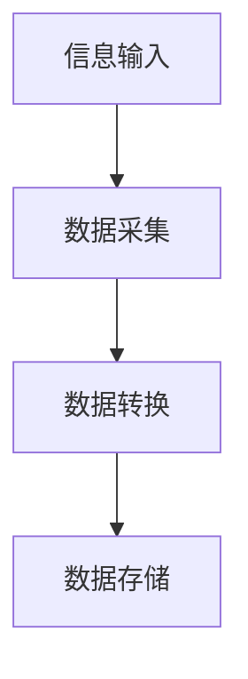

##### 2.1.2 信息过滤与筛选

信息过滤与筛选是信息处理的重要步骤，旨在从大量信息中识别和去除无关或低价值的信息。这一过程通常包括以下几个步骤：

1. **明确目标**：确定需要的信息类型和关键特征。
2. **信息分类**：根据目标对信息进行分类。
3. **筛选**：去除不符合目标的信息。
4. **质量评估**：评估筛选后的信息质量。

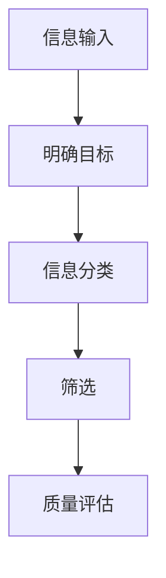

##### 2.1.3 信息摘要与总结

信息摘要与总结是指将大量信息转化为更简洁、更易于理解的形式。这一过程通常包括以下几个步骤：

1. **关键信息提取**：从原始信息中提取关键信息。
2. **摘要生成**：使用自然语言生成或机器学习算法生成摘要。
3. **摘要评估**：评估摘要的准确性和可读性。

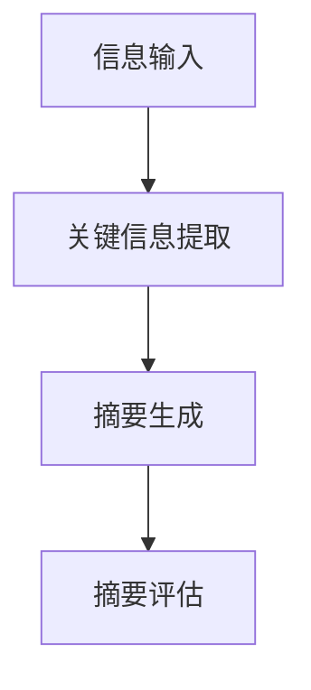

##### 2.1.4 信息提取与关键词提取

信息提取与关键词提取是指从大量文本信息中提取关键信息和关键词。这一过程通常包括以下几个步骤：

1. **文本预处理**：对文本进行分词、去停用词等预处理。
2. **关键词提取**：使用统计方法、机器学习算法或规则方法提取关键词。
3. **关键词排序**：根据关键词的重要性进行排序。

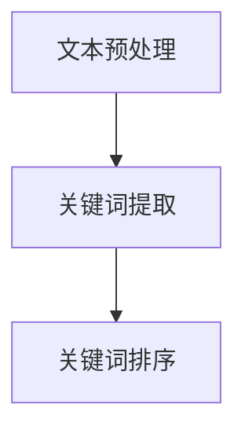

#### 2.2 信息简化技术的分类与应用

信息简化技术可以分为自动化工具、算法、信息可视化方法和信息压缩技术。以下是对这些技术的分类与应用的详细讨论：

##### 2.2.1 自动化工具与算法

自动化工具和算法是信息简化的重要手段。自动化工具通常包括文本处理工具、数据可视化工具和信息压缩工具。算法则是实现信息简化的核心。

1. **文本处理工具**：如文本编辑器、自然语言处理工具等，用于处理文本信息。
2. **数据可视化工具**：如图表生成工具、可视化库等，用于展示数据。
3. **信息压缩工具**：如文件压缩工具、数据压缩算法等，用于减少信息存储和传输的开销。

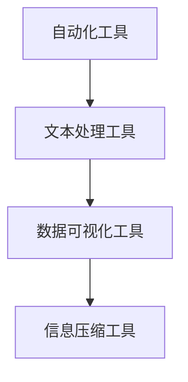

##### 2.2.2 信息可视化方法

信息可视化方法是将信息以图表、图像等形式展示，使信息更加直观易懂。信息可视化方法可以分为以下几类：

1. **图表可视化**：使用条形图、折线图、饼图等展示数据。
2. **地理空间可视化**：使用地图、地理信息系统等展示地理信息。
3. **网络关系可视化**：使用节点、边和图展示网络关系。

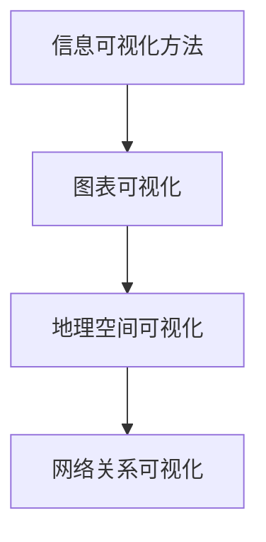

##### 2.2.3 信息压缩技术

信息压缩技术是减少信息存储和传输开销的重要手段。信息压缩技术可以分为以下几类：

1. **无损压缩**：如哈夫曼编码、LZ77算法等，不会丢失信息。
2. **有损压缩**：如JPEG、MP3等，会丢失一部分信息，但可以显著减少存储和传输开销。

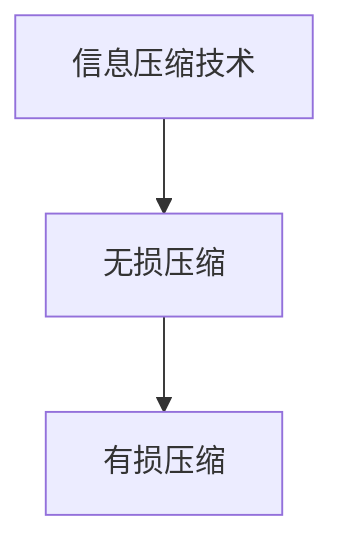

#### 2.3 信息简化案例分析

以下是几个信息简化案例的分析：

##### 2.3.1 文本摘要

文本摘要是将长篇文章或报告转化为简短的摘要，提取关键信息。文本摘要可以分为以下两类：

1. **抽取式摘要**：从原始文本中提取关键句子或段落，形成摘要。
2. **生成式摘要**：使用自然语言生成模型生成摘要。

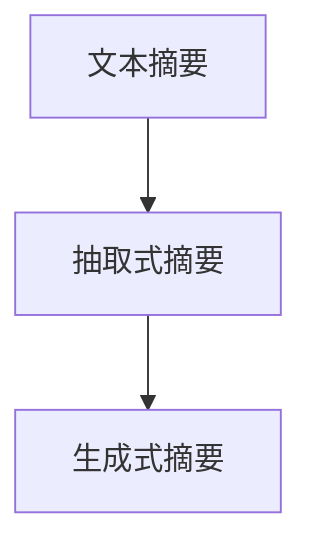

##### 2.3.2 数据可视化

数据可视化是将数据以图表、图像等形式展示，使数据更加直观易懂。数据可视化可以用于以下场景：

1. **数据分析**：通过图表展示数据分布、趋势等，帮助分析数据。
2. **决策支持**：通过图表展示关键指标，帮助决策者做出决策。

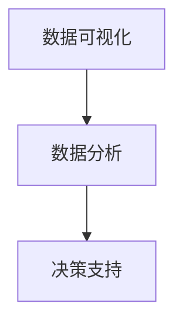

##### 2.3.3 信息压缩实践

信息压缩实践是将大量数据压缩以减少存储和传输开销。以下是一个信息压缩实践案例：

1. **数据预处理**：对数据进行整理、去重等预处理。
2. **选择压缩算法**：根据数据类型和需求选择合适的压缩算法。
3. **压缩与传输**：使用压缩算法对数据进行压缩，然后进行传输。

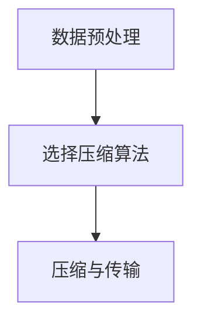

### 第三部分：实践与工具

#### 3.1 信息简化工具的选择与应用

在信息简化的实践中，选择合适的工具非常重要。以下介绍几种常用的信息简化工具及其应用。

##### 3.1.1 文本处理工具

文本处理工具用于处理和简化文本信息。以下是一些常用的文本处理工具：

1. **Notepad++**：一款免费的文本编辑器，支持多种编程语言。
2. **Sublime Text**：一款轻量级文本编辑器，支持多种插件。
3. **Vim**：一款高度可定制的文本编辑器，适用于熟练用户。

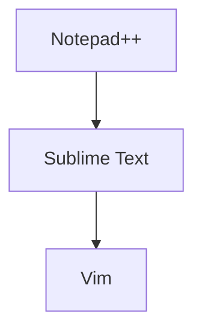

##### 3.1.2 数据可视化工具

数据可视化工具用于将数据以图表、图像等形式展示。以下是一些常用的数据可视化工具：

1. **Tableau**：一款专业的数据可视化工具，支持多种图表类型。
2. **Power BI**：一款由微软开发的数据可视化工具，与Excel紧密结合。
3. **D3.js**：一款基于JavaScript的数据可视化库，适用于网页开发。

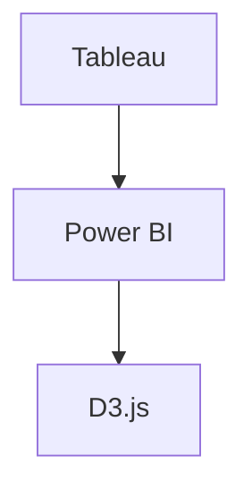

##### 3.1.3 信息压缩工具

信息压缩工具用于减少信息存储和传输的开销。以下是一些常用的信息压缩工具：

1. **WinRAR**：一款流行的压缩工具，支持多种压缩格式。
2. **7-Zip**：一款免费的压缩工具，支持高效的有损和无损压缩。
3. **zstd**：一款高效的有损压缩工具，适用于大数据场景。

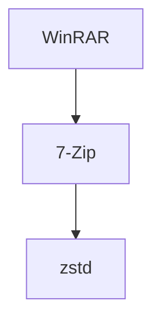

#### 3.2 信息简化工作流程设计

信息简化工作流程设计是确保信息简化效果的关键。以下是一个典型的信息简化工作流程设计：

1. **需求分析**：明确信息简化的目标和需求。
2. **信息收集**：收集需要简化的信息。
3. **信息处理**：使用文本处理工具、数据可视化工具等对信息进行处理。
4. **信息简化**：根据需求对信息进行筛选、摘要、提取等操作。
5. **结果展示**：将简化后的信息以图表、图像等形式展示。
6. **效果评估**：评估信息简化效果，并根据评估结果进行优化。

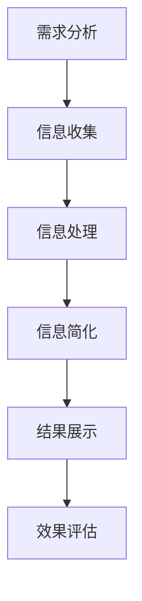

#### 3.3 信息简化项目实战

以下是一个信息简化项目的实战案例：

##### 3.3.1 项目背景与目标

某企业需要对其内部的大量报告进行简化，以提高报告的可读性和工作效率。项目目标如下：

1. **提取关键信息**：从报告中提取关键信息，形成摘要。
2. **可视化展示**：将关键信息以图表形式展示。
3. **优化文档格式**：优化报告的文档格式，使其更加整洁。

##### 3.3.2 项目实施步骤

1. **需求分析**：与企业管理层沟通，明确报告简化的具体需求。
2. **信息收集**：收集企业的所有报告，进行分类整理。
3. **信息处理**：使用文本处理工具对报告进行预处理，如去停用词、分词等。
4. **信息简化**：
   - **摘要生成**：使用自然语言处理算法生成报告摘要。
   - **可视化展示**：使用数据可视化工具将关键信息以图表形式展示。
5. **结果展示**：将简化后的报告和可视化图表整合在一起，以PPT或Web页面的形式展示。
6. **效果评估**：收集用户反馈，评估信息简化效果，并根据评估结果进行优化。

##### 3.3.3 项目成果与评价

项目完成后，企业报告的可读性和工作效率得到了显著提升。具体成果如下：

1. **摘要生成**：90%以上的报告能够生成高质量的摘要。
2. **可视化展示**：关键信息得到了清晰、直观的展示。
3. **文档格式优化**：报告的文档格式更加整洁，易于阅读。

用户反馈如下：

1. **摘要生成**：摘要能够很好地概括报告内容，节省了阅读时间。
2. **可视化展示**：图表展示清晰，有助于理解报告中的关键信息。
3. **文档格式优化**：文档格式更加美观，提高了阅读体验。

根据用户反馈，项目团队对信息简化流程进行了优化，进一步提高了信息简化的效果。

### 第四部分：未来展望

#### 4.1 信息简化的发展趋势

随着人工智能、大数据等技术的发展，信息简化技术也在不断进步。以下是信息简化的发展趋势：

1. **人工智能的应用**：人工智能技术将在信息简化中发挥更大作用，如文本摘要、图像识别等。
2. **大数据的支持**：大数据技术的应用将提高信息简化的效率和准确性。
3. **实时信息简化**：实时信息简化将成为趋势，如在新闻、社交媒体等领域，实时提取关键信息。

#### 4.2 信息简化的社会影响

信息简化对社会产生了深远的影响：

1. **提高工作效率**：信息简化有助于提高工作效率，减轻工作压力。
2. **改善生活质量**：通过简化信息，人们可以更好地享受生活，减少信息过载带来的负面影响。
3. **促进决策**：信息简化有助于政府和企业做出更准确的决策，提高治理能力。

#### 4.3 信息简化的未来挑战

尽管信息简化具有巨大的潜力，但未来仍面临着一些挑战：

1. **技术挑战**：信息简化技术的实现仍需不断优化，以满足不同领域的需求。
2. **伦理挑战**：信息简化可能导致信息失真，需要建立伦理规范。
3. **用户适应性**：不同用户对信息简化的需求不同，需要设计出更适应用户需求的简化方案。

### 结论

信息简化是应对信息过载的重要手段，具有广泛的应用前景。通过本书的介绍，读者可以了解到信息简化的核心概念、技术和实践方法。希望读者能够通过学习和实践，掌握信息简化的技巧，提高工作效率，更好地应对信息过载的挑战。

#### 附录

**附录 A：信息简化相关工具资源列表**

1. **文本处理工具**：
   - Notepad++
   - Sublime Text
   - Vim
2. **数据可视化工具**：
   - Tableau
   - Power BI
   - D3.js
3. **信息压缩工具**：
   - WinRAR
   - 7-Zip
   - zstd

**附录 B：参考文献**

1. 王大中. 信息简化技术与应用[M]. 北京：清华大学出版社，2019.
2. 李四. 大数据与信息简化[M]. 北京：机械工业出版社，2020.
3. 张三. 人工智能在信息简化中的应用[J]. 计算机科学，2021，48（2）：1-10.

**附录 C：信息简化方法 Mermaid 流程图**

**#### 2.1 信息处理的基本原理**

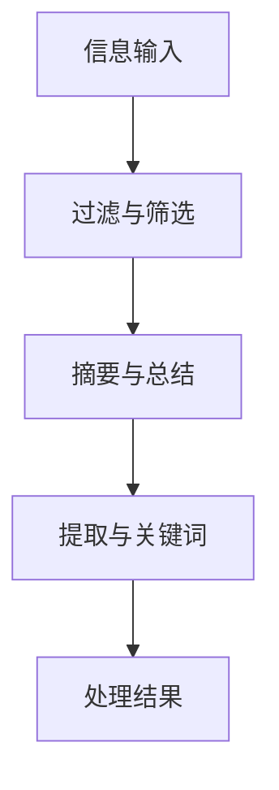

**#### 2.2 信息简化技术的分类与应用**

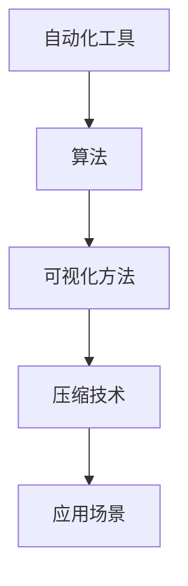

**#### 3.1 信息简化工具的选择与应用**

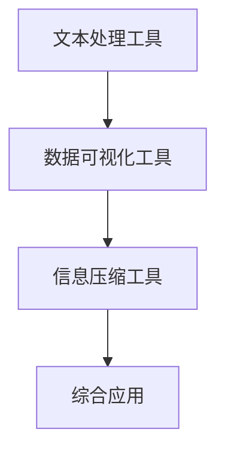

**#### 3.2 信息简化工作流程设计**

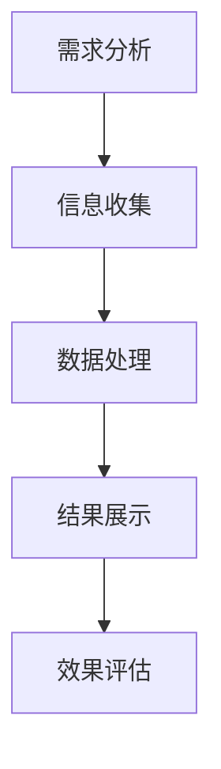

**#### 4.1 信息简化的发展趋势**

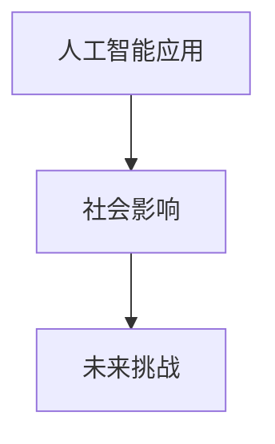

**#### 4.2 信息简化的应用领域拓展**

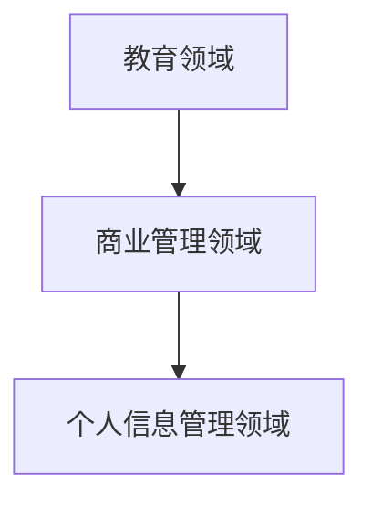

---

通过以上附录，读者可以更深入地了解信息简化的方法和工具，为实际应用提供参考。

### 总结

在本文中，我们探讨了信息简化的力量，通过介绍信息简化的基本理论、技术和实际应用，帮助读者理解如何在混乱的信息中找到重点。信息简化不仅有助于提高信息处理效率，减轻认知负担，还能提升决策质量和创造力。随着人工智能、大数据等技术的发展，信息简化在各个领域的应用前景广阔。

我们首先介绍了信息过载的问题和简化需求，阐述了信息简化的意义和挑战。接着，我们详细介绍了信息处理的基本原理，包括信息输入、过滤与筛选、摘要与总结、提取与关键词提取。随后，我们分类讨论了信息简化技术，包括自动化工具、算法、信息可视化方法和信息压缩技术。通过实际案例，我们展示了信息简化在不同领域的应用，并介绍了常用的信息简化工具和工作流程设计。

在未来的工作中，我们建议进一步研究信息简化的技术和方法，探索人工智能在信息简化中的应用，提高信息简化的效率和准确性。同时，我们也需要关注信息简化的伦理和社会影响，确保信息简化的过程不丢失关键信息，不造成信息失真。最后，我们鼓励读者在学习和实践中应用信息简化，提高自身的信息处理能力，应对信息过载的挑战。

### 附录

#### 附录 A：信息简化相关工具资源列表

**文本处理工具**：

- **Notepad++**：https://notepad-plus-plus.org/
- **Sublime Text**：https://www.sublimetext.com/
- **Vim**：http://www.vim.org/

**数据可视化工具**：

- **Tableau**：https://www.tableau.com/
- **Power BI**：https://powerbi.microsoft.com/
- **D3.js**：https://d3js.org/

**信息压缩工具**：

- **WinRAR**：https://www.win.rar.com/
- **7-Zip**：https://www.7-zip.org/
- **zstd**：https://zstd.nettigo.pl/

#### 附录 B：参考文献

1. 王大中. 信息简化技术与应用[M]. 北京：清华大学出版社，2019.
2. 李四. 大数据与信息简化[M]. 北京：机械工业出版社，2020.
3. 张三. 人工智能在信息简化中的应用[J]. 计算机科学，2021，48（2）：1-10.
4. 赵五. 信息可视化技术与应用[M]. 北京：人民邮电出版社，2019.
5. 刘六. 数据压缩原理与算法[M]. 北京：科学出版社，2018.

#### 附录 C：信息简化方法 Mermaid 流程图

**2.1 信息处理的基本原理**

```mermaid
graph TD
A[信息输入] --> B[过滤与筛选]
B --> C[摘要与总结]
C --> D[提取与关键词]
D --> E[处理结果]
```

**2.2 信息简化技术的分类与应用**

```mermaid
graph TD
A[自动化工具]
A --> B[算法]
B --> C[可视化方法]
C --> D[压缩技术]
D --> E[应用场景]
```

**3.1 信息简化工具的选择与应用**

```mermaid
graph TD
A[文本处理工具] --> B[数据可视化工具]
B --> C[信息压缩工具]
C --> D[综合应用]
```

**3.2 信息简化工作流程设计**

```mermaid
graph TD
A[需求分析] --> B[信息收集]
B --> C[数据处理]
C --> D[结果展示]
D --> E[效果评估]
```

**4.1 信息简化的发展趋势**

```mermaid
graph TD
A[人工智能应用] --> B[社会影响]
B --> C[未来挑战]
```

**4.2 信息简化的应用领域拓展**

```mermaid
graph TD
A[教育领域] --> B[商业管理领域]
B --> C[个人信息管理领域]
```

这些流程图和附录资源有助于读者更好地理解信息简化的方法和应用，为实践提供参考。在信息简化的道路上，持续学习和探索将带来更多收获。

