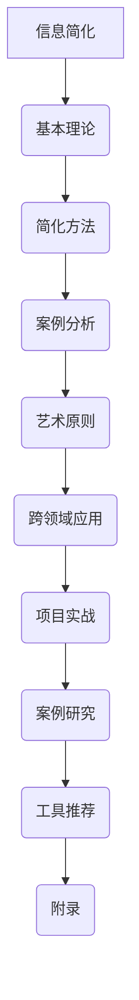

                 

### 《信息简化的原则与艺术：在混乱中建立秩序与简化》

#### 关键词：信息简化、信息过载、简化原则、简化方法、简化工具、案例分析、艺术原则、跨领域应用

#### 摘要：
在当今信息爆炸的时代，如何有效地处理和利用信息成为了一个关键问题。本文旨在探讨信息简化的原则与艺术，从基本理论到实际应用，系统地阐述了信息简化的必要性、基本原则、方法与工具，并通过案例分析展示了信息简化在不同领域的成功实践。文章还将深入探讨信息简化的艺术原则，展望其未来发展趋势，并提供实际应用与项目实战的指导。

---

### 《信息简化的原则与艺术：在混乱中建立秩序与简化》目录大纲

#### 第一部分：信息简化的基本理论

#### 第二部分：信息简化的艺术

#### 第三部分：实际应用与项目实战

#### 附录

### 第一部分：信息简化的基本理论

#### 1. 引言：信息简化的背景与意义
##### 1.1 信息简化的定义
##### 1.2 信息过载问题
##### 1.3 信息简化的必要性

#### 2. 信息简化的基本原则
##### 2.1 简化与效率的关系
##### 2.2 简化与可读性的平衡
##### 2.3 信息简化的实用原则

#### 3. 信息简化的方法与工具
##### 3.1 纸质文档的简化方法
##### 3.2 数字文档的简化方法
##### 3.3 信息可视化的简化工具

#### 4. 信息简化的案例分析
##### 4.1 企业信息简化实践
##### 4.2 个人信息简化实践
##### 4.3 信息简化在政府管理中的应用

### 第二部分：信息简化的艺术

#### 5. 信息简化的艺术原则
##### 5.1 简化中的美学考量
##### 5.2 信息美学的理论基础
##### 5.3 信息简化的审美标准

#### 6. 创意简化的实践
##### 6.1 创意简化的思路与方法
##### 6.2 创意简化的案例分析
##### 6.3 创意简化的实际应用

#### 7. 信息简化的跨领域应用
##### 7.1 在教育领域的应用
##### 7.2 在医疗领域的应用
##### 7.3 在市场营销中的应用

#### 8. 信息简化的挑战与未来展望
##### 8.1 信息简化的技术挑战
##### 8.2 信息简化的社会挑战
##### 8.3 信息简化的未来发展趋势

### 第三部分：实际应用与项目实战

#### 9. 信息简化项目实战
##### 9.1 项目实战的背景与目标
##### 9.2 项目实施步骤
##### 9.3 项目评估与优化

#### 10. 案例研究：信息简化项目分析
##### 10.1 案例背景
##### 10.2 案例分析与解决方案
##### 10.3 案例效果评估

#### 11. 信息简化工具与资源推荐
##### 11.1 信息简化工具概述
##### 11.2 推荐工具与资源
##### 11.3 使用指南与最佳实践

### 附录

#### 附录 A：信息简化相关资源
##### A.1 学术资源
##### A.2 实用工具
##### A.3 教育资源

#### 附录 B：信息简化常用符号与术语解释
##### B.1 常用符号解释
##### B.2 常见术语解释

### 软件架构流程图



### 常用算法伪代码

```python
// 信息简化算法伪代码
function SimplifyInformation(document):
    if document is not clear:
        SplitDocumentIntoSegments(document)
        AnalyzeSegmentsForRedundancy()
        RemoveRedundantSegments()
        ReorganizeSegmentsForImprovedReadability()
        if document is still complex:
            ApplyInformationVisualization()
        else:
            Return SimplifiedDocument()
    else:
        Return document

// 分段
function SplitDocumentIntoSegments(document):
    segments = []
    for each paragraph in document:
        if paragraph is relevant:
            segments.append(paragraph)

// 分析冗余
function AnalyzeSegmentsForRedundancy():
    for each pair of segments (seg1, seg2):
        if seg1 and seg2 are redundant:
            mark seg2 as redundant

// 去除冗余
function RemoveRedundantSegments():
    for each segment:
        if segment is marked as redundant:
            remove segment from document

// 重组
function ReorganizeSegmentsForImprovedReadability():
    SortSegmentsByRelevance()
    MergeRelevantSegments()

// 信息可视化
function ApplyInformationVisualization():
    VisualizeSegmentsUsingChartsAndGraphs()
    AddAnnotationsForClarity()
```

### 数学公式和详细讲解

#### 信息简化效率公式
$$
E = \frac{I_{\text{original}} - I_{\text{simplified}}}{I_{\text{original}}}
$$

**详细讲解：**
- \(E\) 表示信息简化效率。
- \(I_{\text{original}}\) 表示原始信息量。
- \(I_{\text{simplified}}\) 表示简化后的信息量。

该公式用于衡量信息简化的效率，简化后的信息量与原始信息量的差值越小，信息简化效率越高。

#### 冗余度计算公式
$$
R = \frac{R_{\text{redundant}}}{R_{\text{total}}}
$$

**详细讲解：**
- \(R\) 表示冗余度。
- \(R_{\text{redundant}}\) 表示文档中的冗余信息量。
- \(R_{\text{total}}\) 表示文档中的总信息量。

该公式用于计算文档中冗余信息所占的比例，冗余度越高，说明文档信息简化程度越低。

### 举例说明
假设一个文档的总信息量为1000个单词，简化后的信息量为800个单词，其中冗余信息量为200个单词。

1. **信息简化效率：**
   $$
   E = \frac{1000 - 800}{1000} = 0.2
   $$
   说明信息简化效率为20%。

2. **冗余度：**
   $$
   R = \frac{200}{1000} = 0.2
   $$
   说明文档中有20%的信息是冗余的。

通过以上公式和计算，可以更好地理解和应用信息简化的理论和方法。在实际应用中，需要根据具体情况调整简化策略，以达到最佳的简化效果。

---

接下来，我们将深入探讨信息简化的基本理论，包括信息简化的定义、信息过载问题以及信息简化的必要性，为后续的讨论打下坚实的基础。让我们一步一步地分析推理，确保每个核心概念都得到清晰的阐述。

