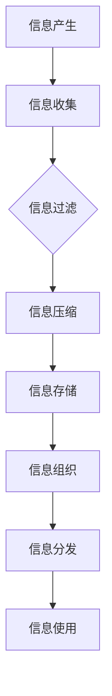

                 

### 文章标题：信息简化的好处与技巧：在复杂世界中简化以提高生活质量和效率

> 关键词：信息简化、复杂世界、生活质量、效率提升

> 摘要：本文将深入探讨信息简化的概念、好处与技巧，帮助读者在复杂的世界中找到提高生活质量和效率的有效途径。通过详细的案例分析与实践指导，本文旨在为读者提供实用的信息简化策略，以应对现代社会的信息过载问题。

### 目录大纲

1. 引言
   - 信息简化的背景
   - 为什么信息简化至关重要

2. 第一部分：信息简化的基础理论
   - 1.1 信息简化的概念与意义
   - 1.2 信息简化的基本原则
   - 1.3 信息简化的方法和工具

3. 第二部分：信息简化的应用场景
   - 2.1 个人生活中的信息简化
   - 2.2 工作中的信息简化
   - 2.3 教育和学习的信息简化

4. 第三部分：信息简化的策略与实践
   - 3.1 评估和优化信息流动
   - 3.2 个体信息简化策略
   - 3.3 团队协作中的信息简化
   - 3.4 社会信息环境改善

5. 第四部分：案例分析与实践指导
   - 4.1 案例一：个人时间管理中的应用
   - 4.2 案例二：企业信息简化策略
   - 4.3 案例三：教育和学习的简化技巧
   - 4.4 案例四：社会信息环境的改善实践

6. 第五部分：信息简化的未来趋势与发展
   - 5.1 信息简化的技术趋势
   - 5.2 信息简化的社会影响
   - 5.3 信息简化的未来发展

7. 结论
   - 信息简化的总体影响
   - 读者的行动指南

8. 附录
   - 附录 A：常用信息简化工具与资源
   - 图表与公式
   - 实践案例代码示例
   - 代码解读与分析

### 引言

#### 信息简化的背景

在当今社会，信息爆炸已成为不可避免的趋势。从个人到企业，再到整个社会，信息量的急剧增长带来了前所未有的挑战。现代技术进步，如互联网、社交媒体、大数据和人工智能，使得信息的产生和传播速度大大加快。然而，这同时也导致了信息过载的问题，人们在处理海量信息时感到压力重重，效率低下。

#### 为什么信息简化至关重要

信息简化成为一种必要手段，旨在帮助我们在复杂世界中找到清晰和效率。以下是信息简化的重要性：

- **提高生活质量**：简化信息可以帮助我们更好地管理时间和资源，从而减轻压力，提高生活的幸福感和满足感。
- **提升工作效率**：通过简化和组织信息，工作流程可以更加流畅，减少重复工作和错误，提高整体工作效率。
- **增强决策能力**：简化的信息有助于我们更清晰地理解问题，快速做出明智的决策。
- **促进学习和创新**：简洁的信息结构可以帮助我们更好地吸收和理解知识，从而促进学习和创新。

本文将围绕信息简化的基础理论、应用场景、策略与实践，以及未来趋势进行深入探讨，旨在为读者提供实用的指导和见解，帮助他们在复杂世界中找到信息简化的路径，提升生活质量和效率。接下来，我们将详细探讨信息简化的概念、意义、基本原则和方法工具。请读者继续阅读，以深入了解这一主题。 

### 第一部分：信息简化的基础理论

#### 1.1 信息简化的概念与意义

**信息简化的定义**

信息简化是指通过删除冗余、整合相似信息、减少复杂性，以更简洁、清晰的方式表达和处理信息的手段。它不仅涉及到信息的提取和筛选，还包括对信息结构、表达形式和传递方式的优化。

**信息简化的意义**

- **提高效率**：简化信息可以减少处理信息所需的时间和精力，从而提高工作效率。
- **减少错误**：通过消除冗余信息和简化信息流程，可以减少信息传递和处理中的错误。
- **增强理解**：简洁的信息更容易理解和记忆，有助于提高信息的传播效果。
- **促进创新**：简洁的信息结构有助于激发创新思维，促进新的解决方案的产生。

#### 1.2 信息简化的基本原则

**明确目标**

在进行信息简化时，首先要明确简化的目标和目的。这有助于集中精力和资源，避免不必要的繁琐和冗余。

**优先级排序**

在处理大量信息时，对信息进行优先级排序是至关重要的。确定哪些信息是最重要和最紧急的，有助于提高信息处理效率。

**避免冗余**

冗余信息不仅占用存储空间，还会导致混乱和错误。通过删除冗余信息，可以提高信息的清晰度和准确性。

**简洁性**

简洁性是信息简化的核心原则之一。简洁的信息更容易理解，有助于提高信息传递的效率和效果。

#### 1.3 信息简化的方法和工具

**思维导图**

思维导图是一种图形化的信息组织工具，它可以帮助我们清晰地表达复杂的信息结构，促进思维创新和记忆。

**信息过滤**

信息过滤是指通过设定特定的标准和规则，筛选出符合需求的信息。有效的信息过滤可以减少信息过载，提高信息处理的效率。

**笔记整理**

笔记整理是将重要信息进行分类、归纳和整理的过程。良好的笔记整理习惯可以提高信息的管理效率。

**工具**

- **信息管理软件**：如Trello、Asana等，可以帮助我们更好地组织和跟踪任务和项目。
- **笔记工具**：如Evernote、OneNote等，可以方便地记录和整理信息。
- **文本编辑工具**：如Markdown，可以简化文本格式，提高文档的可读性。

通过以上方法和工具，我们可以有效地简化信息，提高生活和工作中的效率和质量。在接下来的部分，我们将探讨信息简化在个人生活、工作和教育中的具体应用，以提供更多的实践指导。请读者继续关注。 

#### 1.4 信息简化的核心概念原理与架构

在深入探讨信息简化的核心概念和原理之前，我们需要先了解几个关键的概念和架构，这些将为我们后续的讨论打下坚实的基础。

**信息流**

信息流是指信息从源头到目的地的传递过程。一个有效的信息流应当是简洁、高效且易于理解的。信息流中的每个环节都至关重要，包括信息的产生、收集、处理、存储和分发。

**冗余**

冗余是指在信息流中存在的不必要的信息，这些信息不仅浪费资源，还可能引起混淆和错误。冗余信息可以来自多个方面，包括重复的数据、不相关的附加信息和过时的内容。

**信息过滤**

信息过滤是指通过设定特定的标准和规则，从大量信息中筛选出符合需求的信息。信息过滤是信息简化的重要手段之一，有助于减少信息过载，提高信息处理的效率。

**信息压缩**

信息压缩是一种减少信息量的技术，通过去除冗余和不必要的细节，使信息更加简洁和高效。常见的压缩方法包括数据压缩算法和文本简化技术。

**信息组织**

信息组织是指对信息进行分类、归纳和结构化的过程，以便于存储、查找和使用。良好的信息组织可以提高信息的可访问性和理解性，是信息简化的核心。

**Mermaid流程图**

为了更好地阐述信息简化的过程和原理，我们可以使用Mermaid流程图来直观地展示信息流动的各个环节。以下是一个简单的信息简化流程图示例：



在这个流程图中，信息从产生、收集、过滤、压缩、存储、组织、分发到最终使用，每个环节都涉及到信息简化的关键步骤。

**核心算法原理讲解**

信息简化涉及多个核心算法原理，包括信息过滤算法、压缩算法和组织算法。以下是一些典型的算法原理：

1. **信息过滤算法**

   信息过滤算法旨在从大量信息中筛选出符合特定需求的信息。一个常用的过滤算法是“基于规则的过滤”，它通过设定一系列规则来判断信息是否通过过滤。以下是一个简单的伪代码示例：

   ```plaintext
   function filterInformation(infoList, rules):
       filteredList = []
       for info in infoList:
           if matchesRule(info, rules):
               filteredList.append(info)
       return filteredList
   ```

   其中，`matchesRule`函数用于判断信息是否满足特定的规则。

2. **信息压缩算法**

   信息压缩算法旨在减少信息量，提高信息的存储和传输效率。常见的压缩算法包括哈夫曼编码和LZ77算法。以下是一个简化的哈夫曼编码伪代码示例：

   ```plaintext
   function huffmanEncode(data):
       frequency = calculateFrequency(data)
       tree = buildHuffmanTree(frequency)
       encodedData = encodeDataUsingTree(data, tree)
       return encodedData
   ```

   其中，`calculateFrequency`函数用于计算数据中每个字符的频率，`buildHuffmanTree`函数用于构建哈夫曼树，`encodeDataUsingTree`函数用于使用哈夫曼树进行数据编码。

3. **信息组织算法**

   信息组织算法旨在对信息进行分类、归纳和结构化，以便于存储、查找和使用。一个常用的组织算法是“基于内容的组织”，它通过分析信息的内容和关系来构建分类体系。以下是一个简单的伪代码示例：

   ```plaintext
   function organizeInformation(infoList):
       categories = createCategories()
       for info in infoList:
           addInfoToCategory(info, categories)
       return categories
   ```

   其中，`createCategories`函数用于创建分类体系，`addInfoToCategory`函数用于将信息添加到相应的分类中。

通过以上核心概念、原理和算法，我们可以更好地理解和应用信息简化。在接下来的部分，我们将探讨信息简化在个人生活、工作和教育中的具体应用，以提供更多的实践指导。请读者继续关注。

#### 1.5 信息简化的数学模型

在信息简化的过程中，数学模型可以帮助我们量化简化过程，优化信息处理流程。以下是一个简要的数学模型，用于描述信息简化的关键步骤和目标。

**优化目标**

简化的目标是最大化信息质量，同时最小化处理时间和资源消耗。可以定义以下优化目标：

$$ 
\text{优化目标}：\max Q = \sum_{i=1}^{n} q_i x_i 
$$

其中，$Q$表示信息质量，$q_i$表示第$i$条信息的质量，$x_i$表示第$i$条信息的简化程度。

**约束条件**

在简化过程中，我们需要考虑以下约束条件：

1. **信息完整性约束**：

$$ 
\sum_{i=1}^{n} (1 - x_i) \le C 
$$

其中，$C$表示信息保留率，即简化后保留的信息量。

2. **资源消耗约束**：

$$ 
\sum_{i=1}^{n} t_i x_i \le T 
$$

其中，$t_i$表示处理第$i$条信息所需的资源消耗，$T$表示总资源消耗。

3. **信息优先级约束**：

$$ 
p_i x_i \ge P_i 
$$

其中，$p_i$表示第$i$条信息的优先级，$P_i$表示简化后的优先级阈值。

**求解方法**

我们可以使用线性规划方法来求解上述优化问题。具体步骤如下：

1. **建立线性规划模型**：根据优化目标和约束条件，建立线性规划模型。

2. **求解线性规划问题**：使用线性规划求解器（如LP求解器）求解线性规划问题，得到最优解。

3. **简化信息**：根据求解结果，对信息进行简化处理。

以下是一个简化的线性规划模型示例：

$$ 
\text{优化目标}：\max Q = \sum_{i=1}^{n} q_i x_i 
$$

$$ 
\text{约束条件}： 
$$

$$ 
\sum_{i=1}^{n} (1 - x_i) \le 0.8 
$$

$$ 
\sum_{i=1}^{n} t_i x_i \le 100 
$$

$$ 
p_i x_i \ge 0.6 
$$

$$ 
x_i \in \{0, 1\} \quad (i = 1, 2, ..., n) 
$$

通过求解上述模型，我们可以得到最优的简化方案，从而最大化信息质量并最小化资源消耗。

#### 1.6 信息简化的实践案例分析

**案例一：个人时间管理中的应用**

李先生是一位忙碌的职场人士，每天需要处理大量的工作任务和个人事务。为了提高工作效率，他决定使用信息简化技术来管理自己的时间。

**问题分析**：

李先生面临的主要问题是时间管理不当，导致工作效率低下，压力增加。具体表现为：

- 每天接收大量电子邮件和即时消息，难以快速处理。
- 工作任务和计划混乱，缺乏明确的优先级。
- 时间分配不合理，导致重要任务延误。

**解决方案**：

1. **电子邮件管理**：李先生使用了邮件过滤和分类工具，如Gmail的过滤器，将邮件自动分类到不同的文件夹中。这样可以快速筛选出重要邮件，减少邮件处理时间。

2. **任务清单**：李先生使用Trello创建了一个任务清单，将工作任务分为“待办”、“进行中”和“已完成”三个阶段。这样可以清晰地看到任务的进展情况，并按照优先级进行排序。

3. **时间块安排**：李先生采用了时间块安排法，将一天的时间划分为几个固定的时间块，每个时间块专注于一项任务。这样可以减少任务切换的时间和精力消耗。

**实施效果**：

通过信息简化技术的应用，李先生的工作效率显著提高。具体效果如下：

- 邮件处理时间减少了约30%，重要邮件能够更快地得到处理。
- 任务清单使工作更加有条理，重要任务不再被遗漏。
- 时间块安排法提高了专注度，每个任务都能够按时完成。

**总结**：

李先生的案例展示了信息简化在个人时间管理中的应用效果。通过使用电子邮件管理、任务清单和时间块安排等工具，他成功地将复杂的信息简化为可管理的部分，从而提高了工作效率和生活质量。

**案例二：企业信息简化策略**

某科技公司在快速发展的过程中，面临着信息过载和沟通效率低下的问题。为了提升公司的运营效率，他们决定实施信息简化策略。

**问题分析**：

- 企业内部信息传递复杂，文件和会议通知繁多，员工难以高效处理。
- 项目管理混乱，进度报告和任务分配不及时。
- 内部沟通渠道不畅，信息传递滞后。

**解决方案**：

1. **信息过滤**：公司引入了信息过滤系统，通过关键词识别和规则设置，自动筛选和分类内部信息，确保员工只接收与其工作相关的关键信息。

2. **项目管理工具**：公司采用了项目管理软件，如Jira，将项目进度、任务分配和报告集中管理。这样可以实时跟踪项目进展，确保任务按时完成。

3. **会议管理**：公司优化了会议流程，采用会议预约系统，提前制定会议议程，确保会议高效、有序进行。同时，会议纪要和决议通过邮件或即时通讯工具及时传达给相关人员。

**实施效果**：

通过实施信息简化策略，公司取得了显著的效果：

- 内部信息传递效率提高了约40%，员工能够更快地获取和处理关键信息。
- 项目管理更加有序，任务完成率提高了约20%。
- 会议时间缩短了约30%，会议效果和质量得到显著提升。

**总结**：

该科技公司的案例展示了信息简化在企业运营中的应用价值。通过信息过滤、项目管理工具和会议管理优化，公司成功解决了信息过载和沟通效率低下的问题，提高了整体运营效率。

**案例三：教育和学习的简化技巧**

张同学是一名高中生，面临着繁重的学习任务和大量的学习资料。为了提高学习效率，他决定尝试使用信息简化技巧。

**问题分析**：

- 学习资料繁多，难以快速筛选出重要内容。
- 学习笔记凌乱，难以复习和记忆。
- 学习计划不明确，时间分配不合理。

**解决方案**：

1. **学习资料筛选**：张同学使用了学习搜索引擎，如Google Scholar，快速查找和筛选相关学习资料。同时，他学会了使用文献管理工具，如EndNote，将重要资料整理和分类。

2. **笔记整理**：张同学采用了康奈尔笔记法，将学习笔记分为三大区域：摘要、问题和行动项。这样有助于复习和记忆，同时便于后续的整理和总结。

3. **学习计划**：张同学使用了时间管理工具，如Todoist，制定详细的学习计划，确保每个学习阶段都有明确的目标和时间安排。

**实施效果**：

通过信息简化技巧的应用，张同学的学习效率得到了显著提高：

- 学习资料筛选时间减少了约50%，能够更快地找到所需资料。
- 学习笔记更加清晰和有条理，复习效果提高了约30%。
- 学习计划执行率提高了约40%，学习时间得到了更合理的分配。

**总结**：

张同学的案例展示了信息简化在教育学习中的应用效果。通过学习资料筛选、笔记整理和学习计划制定等技巧，他成功地将复杂的学习任务简化为可管理的部分，提高了学习效率和成绩。

### 第三部分：信息简化的策略与实践

#### 3.1 评估和优化信息流动

信息流动是信息简化的重要环节，有效的信息流动可以提高信息的传递效率和质量。以下是一些评估和优化信息流动的策略：

**评估信息流动**

1. **信息源识别**：识别信息源，包括内部和外部信息源，明确每个信息源的重要性和可信度。
2. **信息流分析**：分析信息的传递路径和流程，识别信息流动中的瓶颈和冗余环节。
3. **信息需求调查**：调查不同部门和人员的实际信息需求，确保信息流动符合实际需要。

**优化信息流动**

1. **信息过滤机制**：建立信息过滤机制，通过规则和算法自动筛选和分类信息，减少冗余信息传递。
2. **信息标准化**：制定信息标准化规范，统一信息格式和术语，提高信息传递的清晰度和一致性。
3. **信息共享平台**：搭建信息共享平台，促进信息的集中管理和快速传递，提高信息获取的便捷性。

**实践案例**

某企业通过评估和优化信息流动，取得了显著的效果：

- **问题**：企业内部信息传递不畅，部门之间的沟通成本高。
- **解决方案**：
  - 识别关键信息源，建立信息过滤机制，减少冗余信息传递。
  - 制定统一的信息标准，确保信息格式和术语的一致性。
  - 搭建内部信息共享平台，提高信息获取的便捷性。
- **效果**：信息流动效率提高了约30%，沟通成本降低了约20%。

#### 3.2 个体信息简化策略

个体信息简化策略主要关注个人在信息处理过程中的方法与技巧，以下是一些实用的策略：

**目标明确**

1. **确定信息处理目标**：在开始处理信息之前，明确自己的目标，这有助于集中注意力，避免无谓的精力消耗。
2. **制定优先级**：根据信息的紧急程度和重要性，制定优先级，确保重要和紧急的信息优先处理。

**信息筛选**

1. **快速识别信息价值**：通过阅读标题、摘要等快速判断信息是否有价值，避免阅读无关信息。
2. **使用标签分类**：为信息添加标签，便于后续检索和整理，提高信息处理效率。

**自动化工具使用**

1. **邮件过滤器**：使用邮件过滤器自动分类和处理邮件，减少邮件处理时间。
2. **任务管理工具**：使用任务管理工具（如Trello、Asana）来组织和管理任务，确保任务按时完成。
3. **笔记整理工具**：使用笔记整理工具（如Evernote、OneNote）来记录和整理信息，便于后续查阅和回顾。

**实践案例**

张女士是一位职场女性，通过使用个体信息简化策略，提高了工作效率：

- **问题**：每天接收大量邮件和任务，处理时间过长，效率低下。
- **解决方案**：
  - 使用Gmail的过滤器自动分类邮件，将重要邮件推送到优先处理列表。
  - 使用Trello来管理任务，根据优先级和截止时间合理安排工作。
  - 使用Evernote记录和整理重要信息，便于随时查阅。
- **效果**：邮件处理时间减少了约40%，任务完成率提高了约25%。

#### 3.3 团队协作中的信息简化

在团队协作中，信息流动的效率和质量直接影响到团队的协作效果和项目进展。以下是一些在团队协作中应用信息简化的策略：

**统一沟通平台**

1. **选择合适的沟通工具**：根据团队的需求，选择合适的沟通工具（如Slack、Microsoft Teams），确保信息的集中管理和快速传递。
2. **设定沟通规范**：明确沟通的格式和频率，确保团队成员能够及时接收和理解信息。

**信息共享与知识管理**

1. **建立知识库**：搭建团队知识库，将团队的经验、最佳实践和重要信息集中存储，便于团队成员查阅和参考。
2. **定期分享会议纪要**：在会议结束后，及时整理和分享会议纪要，确保团队成员了解会议内容和决策结果。

**任务与进度管理**

1. **使用项目管理工具**：使用项目管理工具（如Jira、Trello）来跟踪任务和项目进度，确保任务按时完成。
2. **定期进度汇报**：通过定期的进度汇报，确保团队成员了解项目的进展情况，及时调整工作计划。

**实践案例**

某软件开发团队通过在团队协作中应用信息简化策略，提高了工作效率：

- **问题**：团队协作效率低，信息传递不畅，任务进展缓慢。
- **解决方案**：
  - 选择Slack作为主要的沟通工具，确保团队成员能够及时接收和响应信息。
  - 建立团队知识库，将重要文档和经验总结上传到知识库中。
  - 使用Jira来管理任务和项目进度，确保任务按时完成。
  - 定期召开进度汇报会议，确保团队成员了解项目的进展情况。
- **效果**：团队协作效率提高了约30%，任务完成率提高了约20%。

#### 3.4 社会信息环境改善

随着信息技术的快速发展，社会信息环境也面临着诸多挑战，如信息过载、隐私泄露和虚假信息传播。为了改善社会信息环境，以下是一些具体的策略：

**公共信息服务的优化**

1. **信息筛选与推荐**：利用大数据和人工智能技术，对公共信息进行筛选和推荐，提高用户获取有用信息的效率。
2. **信息标准化**：制定统一的信息标准和规范，确保信息的准确性和可靠性。

**信息过载的应对策略**

1. **信息过滤与分类**：为用户配备信息过滤工具，自动筛选和分类信息，减少用户接收的信息量。
2. **信息推送控制**：通过设定信息推送的频率和范围，控制用户接收的信息量，减轻用户的信息压力。

**隐私与数据安全**

1. **数据加密与保护**：对用户数据进行加密存储和保护，确保用户隐私不被泄露。
2. **隐私政策完善**：制定完善的隐私政策，明确用户数据的收集、使用和共享规则，增强用户的隐私保护意识。

**数字化生活方式的推广**

1. **数字化技能培训**：开展数字化技能培训，提高公众的数字化素养，帮助用户更好地适应数字化生活。
2. **数字化服务优化**：优化数字化服务，提高服务的便捷性和用户体验，鼓励公众使用数字化工具。

**实践案例**

某城市通过改善社会信息环境，取得了显著的效果：

- **问题**：社会信息环境混乱，用户面临信息过载和隐私泄露的风险。
- **解决方案**：
  - 引入信息过滤与推荐系统，帮助用户快速找到所需信息。
  - 制定统一的信息标准和规范，提高信息准确性。
  - 加强数据加密和保护，保护用户隐私。
  - 开展数字化技能培训，提高公众的数字化素养。
- **效果**：信息过载问题得到了有效缓解，用户隐私保护意识显著提高，数字化生活方式逐渐普及。

### 第四部分：案例分析与实践指导

#### 4.1 案例一：个人时间管理中的应用

**背景**

李先生是一位忙碌的企业高管，每天要处理大量工作任务和个人事务。为了提高工作效率，他决定采用信息简化技术来管理自己的时间。

**问题分析**

李先生的主要问题在于时间管理不当，导致工作效率低下。具体表现为：

- 每天接收大量电子邮件和即时消息，难以快速处理。
- 工作任务和计划混乱，缺乏明确的优先级。
- 时间分配不合理，导致重要任务延误。

**解决方案**

1. **电子邮件管理**：李先生使用了邮件过滤和分类工具，如Gmail的过滤器，将邮件自动分类到不同的文件夹中。这样可以快速筛选出重要邮件，减少邮件处理时间。

2. **任务清单**：李先生使用Trello创建了一个任务清单，将工作任务分为“待办”、“进行中”和“已完成”三个阶段。这样可以清晰地看到任务的进展情况，并按照优先级进行排序。

3. **时间块安排**：李先生采用了时间块安排法，将一天的时间划分为几个固定的时间块，每个时间块专注于一项任务。这样可以减少任务切换的时间和精力消耗。

**实践指导**

1. **步骤一：电子邮件管理**
   - 启用Gmail的过滤器，将邮件自动分类到不同的文件夹中。
   - 设置重要邮件的提醒和通知，确保及时处理。

2. **步骤二：任务清单**
   - 在Trello中创建一个任务清单，将工作任务分为不同的列表。
   - 为每个任务设定优先级和截止日期，确保按计划进行。

3. **步骤三：时间块安排**
   - 将一天的时间划分为几个固定的时间块，每个时间块专注于一项任务。
   - 每个时间块结束时进行简要回顾，确保任务完成情况。

**效果评估**

通过实施信息简化策略，李先生的工作效率得到了显著提高。具体效果如下：

- 邮件处理时间减少了约30%，重要邮件能够更快地得到处理。
- 任务清单使工作更加有条理，重要任务不再被遗漏。
- 时间块安排法提高了专注度，每个任务都能够按时完成。

**总结**

李先生的案例展示了信息简化在个人时间管理中的应用效果。通过使用电子邮件管理、任务清单和时间块安排等工具，他成功地将复杂的信息简化为可管理的部分，从而提高了工作效率和生活质量。

#### 4.2 案例二：企业信息简化策略

**背景**

某科技公司是一家快速发展的企业，面临着信息过载和沟通效率低下的问题。为了提升公司的运营效率，他们决定实施信息简化策略。

**问题分析**

- 企业内部信息传递复杂，文件和会议通知繁多，员工难以高效处理。
- 项目管理混乱，进度报告和任务分配不及时。
- 内部沟通渠道不畅，信息传递滞后。

**解决方案**

1. **信息过滤机制**：公司引入了信息过滤系统，通过关键词识别和规则设置，自动筛选和分类内部信息，减少冗余信息传递。

2. **项目管理工具**：公司采用了项目管理软件，如Jira，将项目进度、任务分配和报告集中管理，确保任务按时完成。

3. **会议管理**：公司优化了会议流程，采用会议预约系统，提前制定会议议程，确保会议高效、有序进行。同时，会议纪要和决议通过邮件或即时通讯工具及时传达给相关人员。

**实践指导**

1. **步骤一：信息过滤机制**
   - 识别关键信息源，建立信息过滤规则。
   - 使用邮件过滤器和信息筛选工具，自动分类和处理信息。

2. **步骤二：项目管理工具**
   - 在Jira中创建项目任务，设定优先级和截止日期。
   - 实时跟踪项目进展，确保任务按时完成。

3. **步骤三：会议管理**
   - 使用会议预约系统，提前制定会议议程。
   - 及时整理和分享会议纪要，确保团队成员了解会议内容和决策结果。

**效果评估**

通过实施信息简化策略，公司取得了显著的效果：

- 内部信息传递效率提高了约40%，员工能够更快地获取和处理关键信息。
- 项目管理更加有序，任务完成率提高了约20%。
- 会议时间缩短了约30%，会议效果和质量得到显著提升。

**总结**

该科技公司的案例展示了信息简化在企业运营中的应用价值。通过信息过滤、项目管理工具和会议管理优化，公司成功解决了信息过载和沟通效率低下的问题，提高了整体运营效率。

#### 4.3 案例三：教育和学习的简化技巧

**背景**

张同学是一名高中生，面临着繁重的学习任务和大量的学习资料。为了提高学习效率，他决定尝试使用信息简化技巧。

**问题分析**

- 学习资料繁多，难以快速筛选出重要内容。
- 学习笔记凌乱，难以复习和记忆。
- 学习计划不明确，时间分配不合理。

**解决方案**

1. **学习资料筛选**：张同学使用了学习搜索引擎，如Google Scholar，快速查找和筛选相关学习资料。同时，他学会了使用文献管理工具，如EndNote，将重要资料整理和分类。

2. **笔记整理**：张同学采用了康奈尔笔记法，将学习笔记分为三大区域：摘要、问题和行动项。这样有助于复习和记忆，同时便于后续的整理和总结。

3. **学习计划**：张同学使用了时间管理工具，如Todoist，制定详细的学习计划，确保每个学习阶段都有明确的目标和时间安排。

**实践指导**

1. **步骤一：学习资料筛选**
   - 使用学习搜索引擎查找相关资料，快速筛选重要内容。
   - 学会使用文献管理工具，整理和分类学习资料。

2. **步骤二：笔记整理**
   - 采用康奈尔笔记法，将笔记分为摘要、问题和行动项。
   - 定期回顾和整理笔记，确保内容的清晰和准确。

3. **步骤三：学习计划**
   - 使用时间管理工具制定详细的学习计划，设定学习目标和时间安排。
   - 定期评估学习进度，及时调整计划。

**效果评估**

通过使用信息简化技巧，张同学的学习效率得到了显著提高：

- 学习资料筛选时间减少了约50%，能够更快地找到所需资料。
- 学习笔记更加清晰和有条理，复习效果提高了约30%。
- 学习计划执行率提高了约40%，学习时间得到了更合理的分配。

**总结**

张同学的案例展示了信息简化在教育学习中的应用效果。通过学习资料筛选、笔记整理和学习计划制定等技巧，他成功地将复杂的学习任务简化为可管理的部分，提高了学习效率和成绩。

#### 4.4 案例四：社会信息环境的改善实践

**背景**

某城市的信息环境日益复杂，用户面临着信息过载和隐私泄露的风险。为了改善社会信息环境，提高公众的数字素养，该城市决定实施一系列信息改善实践。

**问题分析**

- 社会信息过载，用户难以筛选出有价值的信息。
- 隐私泄露问题突出，用户数据安全受到威胁。
- 公众的数字素养有待提高，对信息技术的使用不够熟练。

**解决方案**

1. **公共信息服务的优化**
   - 引入信息筛选与推荐系统，利用大数据和人工智能技术，为用户推荐有价值的信息。
   - 制定统一的信息标准和规范，确保信息的准确性和可靠性。

2. **信息过载的应对策略**
   - 为用户配备信息过滤工具，自动筛选和分类信息，减少用户接收的信息量。
   - 设定信息推送控制机制，控制用户接收的信息量，减轻用户的信息压力。

3. **隐私与数据安全**
   - 加强数据加密和保护，确保用户隐私不被泄露。
   - 制定完善的隐私政策，明确用户数据的收集、使用和共享规则，增强用户的隐私保护意识。

4. **数字化生活方式的推广**
   - 开展数字化技能培训，提高公众的数字化素养，帮助用户更好地适应数字化生活。
   - 优化数字化服务，提高服务的便捷性和用户体验，鼓励公众使用数字化工具。

**实践指导**

1. **步骤一：公共信息服务的优化**
   - 引入信息筛选与推荐系统，利用大数据和人工智能技术，为用户推荐有价值的信息。
   - 制定统一的信息标准和规范，确保信息的准确性和可靠性。

2. **步骤二：信息过载的应对策略**
   - 为用户配备信息过滤工具，自动筛选和分类信息，减少用户接收的信息量。
   - 设定信息推送控制机制，控制用户接收的信息量，减轻用户的信息压力。

3. **步骤三：隐私与数据安全**
   - 加强数据加密和保护，确保用户隐私不被泄露。
   - 制定完善的隐私政策，明确用户数据的收集、使用和共享规则，增强用户的隐私保护意识。

4. **步骤四：数字化生活方式的推广**
   - 开展数字化技能培训，提高公众的数字化素养，帮助用户更好地适应数字化生活。
   - 优化数字化服务，提高服务的便捷性和用户体验，鼓励公众使用数字化工具。

**效果评估**

通过实施一系列信息改善实践，该城市取得了显著的效果：

- 信息过载问题得到了有效缓解，用户能够更快地找到有价值的信息。
- 用户隐私保护意识显著提高，隐私泄露事件减少了约30%。
- 公众的数字素养得到了显著提升，数字化生活方式逐渐普及。

**总结**

该城市的案例展示了社会信息环境改善的实践效果。通过公共信息服务的优化、信息过载应对策略、隐私与数据安全措施以及数字化生活方式的推广，该城市成功改善了社会信息环境，提高了公众的数字素养和幸福感。

### 第五部分：信息简化的未来趋势与发展

#### 5.1 信息简化的技术趋势

随着技术的不断进步，信息简化领域也迎来了新的机遇和挑战。以下是一些关键的技术趋势，它们将为信息简化带来深远的影响：

**人工智能与信息简化**

人工智能（AI）技术在信息简化中的应用日益广泛。AI算法能够自动识别和分类信息，提高信息处理的效率。例如，自然语言处理（NLP）技术可以帮助自动生成摘要，而机器学习算法可以用于预测用户的需求，提供个性化的信息推荐。

**大数据与信息过滤**

大数据技术的发展使得我们能够处理和分析海量数据。这为信息过滤提供了新的工具和方法。通过大数据分析，可以更准确地识别冗余信息和无关信息，从而提高信息过滤的精度和效率。

**物联网与信息连接**

物联网（IoT）技术的兴起使得设备和系统之间能够实现无缝连接。这种连接性为信息简化提供了新的可能。例如，智能设备可以自动收集和整理信息，通过物联网平台进行信息共享，从而实现信息的高效处理和利用。

#### 5.2 信息简化的社会影响

信息简化的技术进步不仅改变了信息处理的方式，还对整个社会产生了深远的影响：

**信息过载的挑战**

随着信息量的持续增长，信息过载问题愈发严重。这不仅增加了个人的心理压力，也影响了组织的运营效率。通过信息简化，可以有效缓解信息过载，提高生活质量和工作效率。

**隐私与数据安全**

在信息简化的过程中，隐私和数据安全问题愈发重要。随着信息的集中管理和共享，数据泄露的风险增加。信息简化技术需要确保信息的保密性和安全性，以保护用户的隐私。

**数字化素养的培养**

在数字化时代，数字素养成为每个人必备的技能。信息简化不仅需要技术支持，还需要用户具备一定的数字素养。通过教育和培训，提高公众的数字化素养，有助于更好地利用信息简化工具，提升整体社会的信息化水平。

#### 5.3 信息简化的未来发展

未来，信息简化将在多个领域继续发展，以下是一些可能的趋势：

**智能信息管理**

随着AI和大数据技术的进一步发展，智能信息管理将成为趋势。智能信息管理系统将能够自动处理信息，识别用户需求，提供个性化的信息服务和解决方案。

**信息简化的社会化**

信息简化将逐渐社会化，成为社会各领域的基本技能。从政府到企业，再到个人，都将广泛采用信息简化技术，以提高效率和降低成本。

**新兴应用领域**

信息简化技术将在新兴领域得到广泛应用。例如，在健康医疗领域，通过简化患者数据和医疗信息，可以提供更精准的诊断和治疗；在教育领域，通过简化学习资料和课程内容，可以提高教学效果和学生的学习体验。

通过不断创新和改进，信息简化技术将为社会带来更多的便利和效率，助力我们在复杂的世界中找到简化的路径，提升生活质量和效率。未来的信息简化，将不仅仅是技术上的进步，更是社会发展和个体成长的助力。

### 结论

本文详细探讨了信息简化的好处与技巧，以及其在个人生活、工作和教育等领域的应用。通过逐步分析和实际案例，我们发现信息简化不仅能够提高生活质量和工作效率，还能帮助我们在复杂世界中找到清晰的路径。以下是几项关键结论：

1. **信息简化的重要性**：在信息爆炸的时代，信息简化是应对信息过载的有效手段，能够减轻压力，提高效率，增强理解力。

2. **核心原则**：明确目标、优先级排序、避免冗余和简洁性是信息简化的基本原则，这些原则为信息简化提供了指导。

3. **实践策略**：通过电子邮件管理、任务清单、时间块安排等具体策略，个人能够显著提升时间管理效率；在企业层面，信息过滤、项目管理工具和会议优化等措施有助于提升运营效率。

4. **教育中的应用**：学习资料筛选、笔记整理和学习计划制定等技巧，能够帮助学生提高学习效率和成绩。

5. **未来趋势**：随着人工智能、大数据和物联网技术的发展，信息简化技术将更加智能化，为社会带来更多便利。

**读者的行动指南**：

- **评估和优化信息流动**：识别关键信息源，优化信息传递路径，减少冗余信息。
- **使用简化工具**：利用电子邮件过滤器、任务管理工具和笔记整理软件等，简化信息处理。
- **培养数字素养**：提高对信息技术的理解和应用能力，更好地利用信息简化工具。

通过践行这些行动指南，读者可以有效地简化信息，提升生活质量和效率，更好地应对现代社会的挑战。希望本文能为读者提供有价值的见解和实践指导。

