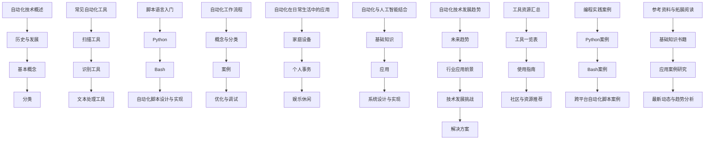
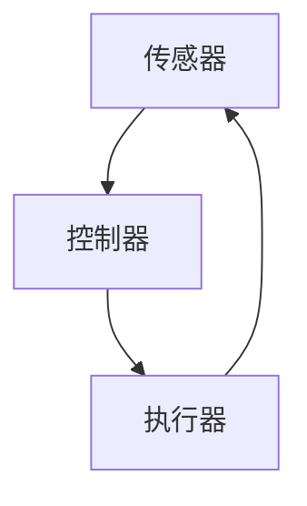

                 

# 文章标题：信息简化的工具和自动化：利用技术简化你的生活和工作流程

> 关键词：自动化，技术简化，生活流程，工作流程，工具，Python，Bash，人工智能

> 摘要：本文将探讨信息简化的工具和自动化技术在现代生活和工作中的应用。通过介绍自动化技术的概述、常见工具、脚本语言入门、自动化工作流程的构建、日常生活中的应用、与人工智能的结合以及未来发展趋势，本文旨在为读者提供一个全面了解和掌握自动化技术的方法和实践指导。

## 目录大纲

- **第1章：自动化技术的概述**
  - 1.1 自动化的历史与发展
  - 1.2 自动化的基本概念
  - 1.3 自动化技术的分类

- **第2章：常见自动化工具**
  - 2.1 扫描工具
  - 2.2 识别工具
  - 2.3 文本处理工具

- **第3章：脚本语言入门**
  - 3.1 Python 脚本编程基础
  - 3.2 Bash 脚本编程基础
  - 3.3 自动化脚本的设计与实现

- **第4章：自动化工作流程的构建**
  - 4.1 工作流程的概念与分类
  - 4.2 常见自动化工作流程案例
  - 4.3 工作流程的优化与调试

- **第5章：自动化在日常生活中的应用**
  - 5.1 自动化家庭设备
  - 5.2 自动化个人事务
  - 5.3 自动化娱乐休闲

- **第6章：自动化与人工智能的结合**
  - 6.1 人工智能的基础知识
  - 6.2 人工智能在自动化中的应用
  - 6.3 人工智能自动化系统的设计与实现

- **第7章：自动化技术的未来发展趋势**
  - 7.1 自动化技术的未来趋势
  - 7.2 自动化技术在各行业中的应用前景
  - 7.3 自动化技术的发展挑战与解决方案

- **附录A：自动化工具资源汇总**
  - A.1 常用自动化工具一览表
  - A.2 自动化工具使用指南
  - A.3 自动化社区与资源推荐

- **附录B：编程实践案例**
  - B.1 Python 脚本案例
  - B.2 Bash 脚本案例
  - B.3 跨平台自动化脚本案例

- **附录C：参考资料与拓展阅读**
  - C.1 基础知识书籍推荐
  - C.2 应用案例研究
  - C.3 自动化领域最新动态与趋势分析

- **Mermaid 流程图：自动化技术架构**

## 第1章：自动化技术的概述

### 1.1 自动化的历史与发展

自动化技术的起源可以追溯到20世纪初期，当时的工业革命促使人们对生产效率的追求达到了前所未有的高度。最早的自动化设备是流水线上的机械臂，用于代替人工完成重复性工作。随着电气化和计算机技术的发展，自动化技术逐渐从工业生产领域扩展到其他领域。

在工业自动化方面，20世纪40年代和50年代，美国和苏联的航空航天项目推动了自动化技术的发展。例如，美国在1950年代初期推出了著名的UNIVAC计算机，这是第一台用于商业数据的通用电子数字计算机。UNIVAC的诞生标志着计算机开始应用于工业控制领域。

信息自动化则是在计算机技术飞速发展的背景下产生的。20世纪60年代，计算机被用于数据处理和管理，这标志着自动化技术从工业领域向信息领域的转移。随着互联网的普及，自动化技术进一步与网络技术相结合，形成了现代的自动化系统。

#### 从工业自动化到信息自动化

工业自动化主要是指通过机械、电气、液压、气动等自动化装置实现生产过程中的自动化控制。例如，汽车制造业中的生产线、电子制造业中的贴片机等，都是工业自动化的具体应用。工业自动化的目标是提高生产效率、降低生产成本、提高产品质量。

信息自动化则是随着计算机技术的发展而产生的，主要是指利用计算机系统完成信息的采集、处理、传输和存储等过程。例如，智能客服系统、自动化办公系统等。信息自动化的目标是提高工作效率、减少人为错误、优化资源配置。

#### 自动化技术的发展趋势

1. **智能化：**随着人工智能技术的发展，自动化技术正朝着智能化方向发展。自动化设备能够通过机器学习、深度学习等技术实现自我学习和自我优化，从而提高工作效率和质量。

2. **网络化：**随着物联网技术的普及，自动化设备开始通过网络进行互联互通。这种网络化使得自动化系统能够实现远程监控和控制，提高了系统的灵活性和可靠性。

3. **协同化：**自动化设备之间的协同工作也是自动化技术发展的一个重要趋势。通过协同工作，自动化系统能够实现更高效率的生产和服务。

### 1.2 自动化的基本概念

自动化技术的基本概念包括自动化系统、自动化工具和自动化程序。

#### 自动化系统

自动化系统是由传感器、控制器、执行器等组成的能够自动完成特定任务的系统。传感器用于检测外部环境，控制器用于接收传感器数据并根据预设的规则进行决策，执行器用于执行控制器的决策。

#### 自动化工具

自动化工具是指用于实现自动化功能的设备和软件。常见的自动化工具包括扫描工具、识别工具、文本处理工具等。这些工具可以帮助我们简化日常工作和生活流程。

#### 自动化程序

自动化程序是指用于控制自动化系统的软件程序。通过编写自动化程序，我们可以实现对自动化设备的编程控制，从而实现自动化操作。

### 1.3 自动化技术的分类

自动化技术根据应用场景和功能特点可以分为以下几类：

- **工业自动化：**主要用于生产制造过程中的自动化控制，如流水线上的机械臂、自动化生产线等。

- **家居自动化：**主要用于家庭环境中的设备控制，如智能照明、智能安防、智能家电等。

- **办公自动化：**主要用于办公环境中的事务处理，如文档处理、邮件处理、日程管理等。

- **交通自动化：**主要用于交通领域的自动化控制，如无人驾驶车辆、自动火车等。

- **医疗自动化：**主要用于医疗环境中的自动化设备，如自动化医疗机器人、自动化诊断系统等。

## 第2章：常见自动化工具

### 2.1 扫描工具

扫描工具是一种能够将纸质文档、图片等转换为电子文档的工具。常见的扫描工具包括扫描仪和OCR（光学字符识别）工具。

#### 扫描仪

扫描仪是一种能够将纸质文档转换为电子文档的设备。扫描仪通过光学传感器将文档内容转换为数字信号，然后通过软件将数字信号转换为图像或文本格式。

#### OCR工具

OCR工具是一种能够将扫描的文档中的文字识别为电子文本的工具。OCR工具通过图像处理和模式识别技术，将扫描的图像中的文字转换为可编辑的文本格式。

### 2.2 识别工具

识别工具用于对图像、语音、手势等进行识别。常见的识别工具包括人脸识别工具、语音识别工具和手势识别工具。

#### 人脸识别工具

人脸识别工具是一种能够识别人脸并进行身份验证的工具。人脸识别工具通过计算机视觉技术，对人脸图像进行分析和处理，从而识别出特定的身份信息。

#### 语音识别工具

语音识别工具是一种能够将语音转换为文本的工具。语音识别工具通过语音信号处理和自然语言处理技术，将语音信号转换为可编辑的文本格式。

#### 手势识别工具

手势识别工具是一种能够识别用户手势并进行相应操作的工具。手势识别工具通过计算机视觉技术，对用户的手势进行分析和处理，从而识别出用户意图。

### 2.3 文本处理工具

文本处理工具用于对文本进行编辑、分析、处理等。常见的文本处理工具包括文本编辑器、文本分析工具和文本翻译工具。

#### 文本编辑器

文本编辑器是一种用于编辑文本文件的软件。文本编辑器提供了丰富的编辑功能，如文本格式设置、语法高亮、代码补全等。

#### 文本分析工具

文本分析工具是一种用于分析文本内容的软件。文本分析工具提供了丰富的分析功能，如关键词提取、情感分析、文本分类等。

#### 文本翻译工具

文本翻译工具是一种用于将一种语言的文本翻译为另一种语言的软件。文本翻译工具通过自然语言处理技术，将源语言文本转换为目标语言文本。

## 第3章：脚本语言入门

### 3.1 Python 脚本编程基础

Python是一种广泛应用于自动化领域的脚本语言。Python具有简洁的语法和丰富的库支持，使得编写自动化脚本变得简单高效。

#### Python 基本语法

Python的基本语法包括变量、数据类型、运算符、控制结构等。

- **变量：**Python中的变量不需要明确声明，使用时直接赋值即可。
- **数据类型：**Python支持多种数据类型，包括整数、浮点数、字符串、列表、字典等。
- **运算符：**Python支持各种运算符，包括算术运算符、比较运算符、逻辑运算符等。
- **控制结构：**Python提供了多种控制结构，包括条件语句、循环语句、异常处理等。

#### Python 函数与模块

函数是Python中用于组织代码的基本单位。Python的函数可以接收参数，返回值，并使用局部变量。

- **函数定义：**使用`def`关键字定义函数。
- **函数调用：**使用函数名和参数列表调用函数。

模块是Python中用于组织代码的扩展。Python的模块可以包含函数、类、变量等。

- **模块导入：**使用`import`关键字导入模块。
- **模块引用：**使用模块名和函数名引用模块中的函数。

#### Python 异常处理

异常处理是Python中用于处理错误的机制。Python的异常处理包括异常捕获、异常传递和异常处理。

- **异常捕获：**使用`try`和`except`语句捕获异常。
- **异常传递：**使用`raise`关键字抛出异常。
- **异常处理：**使用`finally`语句处理异常。

### 3.2 Bash 脚本编程基础

Bash是Linux操作系统的默认shell，用于编写shell脚本。Bash脚本是一种文本文件，包含了一系列操作系统命令和脚本语句。

#### Bash 基本语法

Bash的基本语法包括变量、数据类型、运算符、控制结构等。

- **变量：**Bash中的变量不需要明确声明，使用时直接赋值即可。
- **数据类型：**Bash支持字符串、数字、数组等数据类型。
- **运算符：**Bash支持各种运算符，包括算术运算符、比较运算符、逻辑运算符等。
- **控制结构：**Bash提供了多种控制结构，包括条件语句、循环语句、函数等。

#### Bash 函数与脚本结构

函数是Bash中用于组织代码的基本单位。Bash的函数可以接收参数，返回值，并使用局部变量。

- **函数定义：**使用`function`关键字定义函数。
- **函数调用：**使用函数名和参数列表调用函数。

脚本结构是Bash脚本的基本组成部分。脚本结构包括脚本头部、函数定义和主程序。

- **脚本头部：**包括注释、变量声明等。
- **函数定义：**定义脚本中的函数。
- **主程序：**脚本的主程序，包含脚本的主要逻辑。

#### Bash 输入输出

Bash提供了丰富的输入输出功能，包括命令行参数处理、文件读取、文件写入等。

- **命令行参数处理：**使用位置参数和特殊参数处理命令行参数。
- **文件读取：**使用`<`和`<<`操作符读取文件内容。
- **文件写入：**使用`>`和`>>`操作符写入文件内容。

### 3.3 自动化脚本的设计与实现

自动化脚本的设计与实现包括需求分析、脚本设计、脚本实现和脚本测试与调试。

#### 需求分析

需求分析是自动化脚本设计的第一个步骤。在需求分析阶段，我们需要明确自动化脚本的功能需求，包括输入、输出、逻辑流程等。

#### 脚本设计

脚本设计是根据需求分析的结果，设计脚本的结构和流程。脚本设计包括变量声明、函数定义、逻辑流程等。

#### 脚本实现

脚本实现是根据脚本设计，编写脚本代码。脚本实现需要遵循良好的编程规范，包括代码注释、变量命名、函数定义等。

#### 脚本测试与调试

脚本测试与调试是确保脚本功能正确性和稳定性的关键步骤。在测试与调试阶段，我们需要对脚本进行测试，并修复可能出现的错误。

## 第4章：自动化工作流程的构建

### 4.1 工作流程的概念与分类

工作流程是指工作过程中的一系列操作和步骤。工作流程可以分为以下几类：

- **顺序工作流程：**按照顺序执行的一系列操作。例如，一个订单的处理流程可能包括订单创建、订单确认、订单发货等步骤。

- **分支工作流程：**根据条件执行不同的操作路径。例如，一个数据分析流程可能根据数据质量的好坏分为两个分支，分别进行不同的处理。

- **循环工作流程：**重复执行相同或类似的操作。例如，一个数据清洗流程可能需要多次循环遍历数据，删除重复记录和错误数据。

### 4.2 常见自动化工作流程案例

常见自动化工作流程案例包括文档处理、邮件处理和数据处理等。

#### 文档处理工作流程

文档处理工作流程包括文档的创建、编辑、保存和归档等步骤。通过自动化脚本，我们可以实现文档的自动创建和编辑，节省人工操作时间。

- **自动创建文档：**使用脚本创建空白文档，并设置默认格式。
- **自动编辑文档：**使用脚本添加文本、图片、表格等元素。
- **自动保存文档：**使用脚本定期保存文档，防止数据丢失。
- **自动归档文档：**使用脚本将文档分类保存到指定的文件夹。

#### 邮件处理工作流程

邮件处理工作流程包括邮件的接收、分类、处理和回复等步骤。通过自动化脚本，我们可以实现邮件的自动分类和处理，提高工作效率。

- **自动接收邮件：**使用脚本定期检查邮箱，下载新邮件。
- **自动分类邮件：**使用脚本根据邮件主题和发件人自动分类邮件。
- **自动处理邮件：**使用脚本自动回复邮件、转发邮件或删除无用的邮件。
- **自动回复邮件：**使用脚本根据预设的规则自动回复邮件，如自动回复请假申请或会议邀请。

#### 数据处理工作流程

数据处理工作流程包括数据的收集、处理、分析和存储等步骤。通过自动化脚本，我们可以实现数据的自动处理和分析，提高数据处理效率。

- **自动收集数据：**使用脚本从网络或数据库中自动收集数据。
- **自动处理数据：**使用脚本清洗数据、转换数据格式或进行数据计算。
- **自动分析数据：**使用脚本进行数据可视化、统计分析或机器学习。
- **自动存储数据：**使用脚本将处理后的数据存储到数据库或文件中。

### 4.3 工作流程的优化与调试

工作流程的优化与调试是确保工作流程高效稳定运行的关键步骤。

#### 性能优化

性能优化包括以下方面：

- **代码优化：**通过优化代码结构、算法和数据结构，提高脚本运行速度。
- **资源优化：**通过优化系统资源使用，如CPU、内存、网络等，提高脚本运行效率。
- **并发优化：**通过并发处理技术，提高脚本处理大量任务的能力。

#### 稳定性优化

稳定性优化包括以下方面：

- **错误处理：**通过异常处理机制，捕获并处理脚本运行过程中出现的错误。
- **日志记录：**通过日志记录脚本运行过程中的关键信息，便于调试和问题追踪。
- **版本控制：**通过版本控制机制，确保脚本在不同环境下的稳定性。

#### 调试

调试包括以下步骤：

- **代码调试：**使用调试工具，如IDE的调试器，跟踪代码执行流程，找出错误原因。
- **日志调试：**通过查看日志记录，分析脚本运行过程中的错误信息。
- **单元测试：**编写单元测试，验证脚本的功能和性能，确保脚本的正确性。

## 第5章：自动化在日常生活中的应用

### 5.1 自动化家庭设备

自动化家庭设备是指通过自动化技术控制家庭中的各种设备，提高生活便利性和舒适度。常见的自动化家庭设备包括智能照明、智能安防、智能家电等。

#### 智能照明

智能照明可以通过自动化技术实现照明的远程控制、定时开关和场景设置等功能。

- **远程控制：**使用手机或平板电脑远程控制家庭照明的开关和亮度。
- **定时开关：**通过预设的时间表，自动控制家庭照明的开关时间。
- **场景设置：**根据不同场景，设置不同的照明模式和亮度。

#### 智能安防

智能安防可以通过自动化技术实现家庭安全的监控和保护。

- **视频监控：**使用摄像头实时监控家庭环境，并通过手机或平板电脑远程查看。
- **入侵报警：**当检测到异常情况时，自动触发报警，并通过手机或平板电脑通知主人。
- **门窗监控：**自动检测门窗的开关状态，并通过手机或平板电脑通知主人。

#### 智能家电

智能家电可以通过自动化技术实现家电设备的远程控制、定时开关和场景设置等功能。

- **远程控制：**使用手机或平板电脑远程控制家电设备的开关和操作。
- **定时开关：**通过预设的时间表，自动控制家电设备的开关时间。
- **场景设置：**根据不同场景，设置不同的家电设备组合模式。

### 5.2 自动化个人事务

自动化个人事务是指通过自动化技术简化个人事务的处理，提高工作效率和生活质量。常见的自动化个人事务包括日程管理、财务管理和健康监控等。

#### 日程管理

日程管理可以通过自动化技术实现日程的自动安排、提醒和跟踪等功能。

- **自动安排：**使用日程管理软件，根据预设的规则自动安排日程。
- **提醒通知：**通过手机或平板电脑自动提醒日程安排，避免遗忘重要事务。
- **跟踪记录：**自动记录日程的执行情况，便于后续的回顾和总结。

#### 财务管理

财务管理可以通过自动化技术实现财务记录、分类和报告等功能。

- **自动记录：**使用财务管理软件，自动记录日常收支情况。
- **自动分类：**根据预设的分类规则，自动将收支记录分类到相应的类别。
- **自动报告：**自动生成财务报告，便于了解财务状况。

#### 健康监控

健康监控可以通过自动化技术实现健康数据的自动记录、分析和反馈等功能。

- **自动记录：**使用智能穿戴设备，自动记录心率、步数、睡眠等健康数据。
- **自动分析：**使用健康分析软件，自动分析健康数据，提供健康建议。
- **自动反馈：**通过手机或平板电脑，自动反馈健康数据和分析结果，帮助用户改善生活习惯。

### 5.3 自动化娱乐休闲

自动化娱乐休闲是指通过自动化技术简化娱乐休闲活动的操作，提供更加便捷和个性化的娱乐体验。常见的自动化娱乐休闲包括媒体播放、游戏控制和虚拟现实等。

#### 媒体播放

媒体播放可以通过自动化技术实现音乐、视频等娱乐内容的自动播放和切换。

- **自动播放：**根据预设的播放列表，自动播放音乐或视频。
- **自动切换：**根据播放进度，自动切换到下一个音乐或视频。
- **场景播放：**根据场景设定，自动播放适合的音乐或视频。

#### 游戏控制

游戏控制可以通过自动化技术实现游戏设备的自动操作和控制。

- **自动操作：**使用脚本或游戏辅助软件，自动执行游戏中的操作。
- **自动控制：**通过遥控器或其他输入设备，实现游戏的自动操作。

#### 虚拟现实

虚拟现实可以通过自动化技术实现虚拟现实设备的自动启动和控制。

- **自动启动：**使用脚本或控制软件，自动启动虚拟现实设备。
- **自动控制：**通过手势、语音等交互方式，实现虚拟现实设备的自动操作。

## 第6章：自动化与人工智能的结合

### 6.1 人工智能的基础知识

人工智能（AI）是指使计算机系统能够模拟、延伸和扩展人类智能的理论、方法和技术。人工智能的基础知识包括以下几个方面：

#### 机器学习

机器学习是一种让计算机通过数据学习并获得知识的方法。机器学习的基本流程包括数据收集、数据预处理、模型训练、模型评估和模型部署。

- **数据收集：**收集大量的数据，用于训练机器学习模型。
- **数据预处理：**对收集到的数据进行清洗、归一化等处理，为模型训练做好准备。
- **模型训练：**使用训练数据训练机器学习模型，使其能够学习并识别数据中的规律。
- **模型评估：**使用测试数据评估模型的性能，确保模型能够准确识别数据。
- **模型部署：**将训练好的模型部署到实际应用中，使其能够为用户服务。

#### 深度学习

深度学习是一种模拟人脑神经网络的机器学习方法。深度学习的基本单元是神经网络，神经网络通过多层神经元进行数据传递和计算。

- **神经元：**深度学习的基本单元，用于接收输入、传递信号和产生输出。
- **神经网络：**由多个神经元组成的网络，用于模拟人脑的计算过程。
- **深度神经网络：**由多层神经网络组成的网络，能够处理复杂的数据和任务。

#### 自然语言处理

自然语言处理（NLP）是一种使计算机能够理解、生成和处理自然语言的方法。自然语言处理的基本任务包括文本分类、情感分析、命名实体识别、机器翻译等。

- **文本分类：**将文本数据分为不同的类别，如新闻分类、垃圾邮件分类等。
- **情感分析：**分析文本数据中的情感倾向，如积极、消极、中性等。
- **命名实体识别：**识别文本数据中的特定实体，如人名、地名、组织名等。
- **机器翻译：**将一种语言的文本翻译为另一种语言。

### 6.2 人工智能在自动化中的应用

人工智能在自动化中的应用主要包括自动化系统优化、自动化设备自学习和自动化决策支持等。

#### 自动化系统优化

自动化系统优化是指使用人工智能技术提高自动化系统的性能和效率。具体应用包括：

- **故障预测：**使用机器学习模型预测自动化系统中的故障，提前进行维护和修复，减少停机时间。
- **性能优化：**使用深度学习模型优化自动化系统的参数设置，提高系统的性能和稳定性。
- **能效管理：**使用机器学习模型优化自动化系统的能源消耗，提高能源利用率。

#### 自动化设备自学习

自动化设备自学习是指自动化设备通过自我学习提高工作效率和质量。具体应用包括：

- **路径优化：**使用机器学习模型优化自动化设备的移动路径，减少移动距离和时间。
- **动作优化：**使用深度学习模型优化自动化设备的动作，提高动作的准确性和效率。
- **环境适应：**使用机器学习模型使自动化设备能够适应不同的环境变化，提高适应能力。

#### 自动化决策支持

自动化决策支持是指使用人工智能技术为自动化系统提供决策支持。具体应用包括：

- **决策优化：**使用机器学习模型为自动化系统提供最优的决策，提高决策的准确性和效率。
- **风险预测：**使用机器学习模型预测自动化系统中的风险，提前采取预防措施。
- **异常检测：**使用机器学习模型检测自动化系统中的异常情况，及时进行调整和处理。

### 6.3 人工智能自动化系统的设计与实现

人工智能自动化系统的设计与实现包括系统需求分析、系统设计、系统实现和系统测试与调试等步骤。

#### 系统需求分析

系统需求分析是人工智能自动化系统的设计起点。在需求分析阶段，我们需要明确系统的功能需求、性能需求和用户需求。

- **功能需求：**确定系统需要实现的功能，如故障预测、路径优化、决策支持等。
- **性能需求：**确定系统的性能指标，如响应时间、准确性、稳定性等。
- **用户需求：**确定用户对系统的期望和使用场景，如使用便捷性、用户体验等。

#### 系统设计

系统设计是根据系统需求分析的结果，设计系统的结构和流程。系统设计包括以下几个方面：

- **系统架构：**设计系统的整体架构，确定系统的模块划分和接口设计。
- **算法选择：**选择适合的算法实现系统功能，如机器学习算法、深度学习算法等。
- **数据流设计：**设计数据在系统中的流动和处理过程，确保数据的准确性和安全性。
- **界面设计：**设计系统的用户界面，确保用户能够方便地使用系统。

#### 系统实现

系统实现是根据系统设计的结果，编写系统的代码并实现系统的功能。系统实现包括以下几个方面：

- **编码实现：**根据系统设计文档，编写系统的代码，实现系统的功能。
- **模块化设计：**将系统划分为多个模块，每个模块负责不同的功能，便于维护和扩展。
- **测试代码：**编写测试代码，对系统功能进行验证和测试，确保系统的正确性和稳定性。

#### 系统测试与调试

系统测试与调试是确保系统功能正确性和稳定性的关键步骤。在测试与调试阶段，我们需要对系统进行功能测试、性能测试和安全性测试。

- **功能测试：**测试系统的功能是否按照设计要求正常运行，包括功能是否完整、操作是否流畅等。
- **性能测试：**测试系统的性能是否达到设计要求，包括响应时间、并发处理能力等。
- **安全性测试：**测试系统的安全性，确保系统的数据和操作安全，防止黑客攻击和数据泄露。

## 第7章：自动化技术的未来发展趋势

### 7.1 自动化技术的未来趋势

自动化技术的未来发展趋势包括智能化、网络化和协同化。

#### 智能化

智能化是自动化技术发展的核心方向。随着人工智能技术的发展，自动化设备将具备自我学习和自我优化能力，能够根据环境变化和任务需求进行自适应调整。智能化将使自动化系统更加灵活、高效和可靠。

#### 网络化

网络化是自动化技术发展的另一个重要方向。物联网技术的普及将使自动化设备能够通过网络进行互联互通，实现设备间的数据共享和协同工作。网络化将使自动化系统具有更强的扩展性和灵活性。

#### 协同化

协同化是自动化技术发展的必然趋势。自动化设备将能够协同工作，形成智能化、高效的生产和服务系统。协同化将使自动化系统具备更高的生产效率和服务质量。

### 7.2 自动化技术在各行业中的应用前景

自动化技术在各行业中的应用前景广阔，包括工业、服务业、农业和医疗等。

#### 工业

在工业领域，自动化技术将广泛应用于生产制造、质量控制、设备维护等环节。通过自动化技术，企业可以实现生产过程的自动化控制，提高生产效率、降低生产成本、提高产品质量。

#### 服务业

在服务业领域，自动化技术将用于服务流程的自动化、服务质量的提升和服务体验的优化。例如，在酒店业，自动化技术可以用于客房服务、设施管理等方面，提高服务效率和客户满意度。

#### 农业

在农业领域，自动化技术将用于农业生产过程的自动化控制，提高农业生产效率和质量。例如，通过自动化技术，可以实现精准农业、智能灌溉、无人机喷洒等，提高农业生产的可持续性和效益。

#### 医疗

在医疗领域，自动化技术将用于医疗设备的自动化控制、医疗信息的自动化处理和医疗服务流程的自动化管理。例如，通过自动化技术，可以实现医疗设备的自动运行、医疗数据的自动分析和医疗服务流程的自动化调度，提高医疗服务的质量和效率。

### 7.3 自动化技术的发展挑战与解决方案

自动化技术的发展面临一些挑战，包括技术难题、伦理问题和法律法规问题等。

#### 技术难题

技术难题包括人工智能算法的优化、自动化设备的自学习和复杂系统的协同工作等。解决技术难题需要持续的研发投入和技术创新。

#### 伦理问题

伦理问题包括自动化设备的责任归属、隐私保护和数据安全等。解决伦理问题需要制定相应的法律法规和道德规范，确保自动化技术的应用符合伦理要求。

#### 法律法规问题

法律法规问题包括自动化设备的监管、责任归属和数据隐私保护等。解决法律法规问题需要建立健全的法律法规体系，明确自动化技术的责任和义务。

## 附录A：自动化工具资源汇总

### A.1 常用自动化工具一览表

- **Python自动化工具：** Python、PyQt、PyAutoGUI等。
- **Bash自动化工具：** Bash、Shell Script、AutoHotkey等。
- **自动化软件平台：** AWS Lambda、Azure Functions、Google Cloud Functions等。
- **自动化硬件平台：** PLC、Arduino、Raspberry Pi等。

### A.2 自动化工具使用指南

- **Python使用指南：** 《Python官方文档》、《Python CookBook》等。
- **Bash使用指南：** 《Bash官方手册》、《Bash参考手册》等。
- **自动化软件平台使用指南：** AWS Lambda官方文档、Azure Functions官方文档、Google Cloud Functions官方文档等。

### A.3 自动化社区与资源推荐

- **自动化社区：** Stack Overflow、GitHub、Reddit等。
- **自动化论坛：** CSDN、开源中国、自动化论坛等。
- **自动化博客：** 博客园、CSDN博客、知乎专栏等。

## 附录B：编程实践案例

### B.1 Python 脚本案例

#### 自动化办公脚本

```python
import os
import datetime

# 设置工作目录
os.chdir("/path/to/workdirectory")

# 自动创建文档
def create_document(filename):
    with open(filename, "w") as file:
        file.write("文档内容")

# 自动保存文档
def save_document(filename):
    with open(filename, "a") as file:
        current_time = datetime.datetime.now().strftime("%Y-%m-%d %H:%M:%S")
        file.write(f"\n{current_time}")

# 自动化办公流程
create_document("工作日志.txt")
save_document("工作日志.txt")

print("自动化办公脚本执行完成。")
```

#### 数据处理脚本

```python
import pandas as pd

# 加载数据
data = pd.read_csv("data.csv")

# 数据清洗
data.dropna(inplace=True)
data["年龄"] = data["年龄"].astype(int)

# 数据分析
age_avg = data["年龄"].mean()
age_std = data["年龄"].std()

# 数据可视化
import matplotlib.pyplot as plt

plt.figure(figsize=(8, 6))
plt.scatter(data["年龄"], data["收入"])
plt.xlabel("年龄")
plt.ylabel("收入")
plt.title("年龄与收入关系图")
plt.show()

print(f"平均年龄：{age_avg}, 年龄标准差：{age_std}")
```

### B.2 Bash 脚本案例

#### 系统监控脚本

```bash
#!/bin/bash

# 设置监控目录
MONITOR_DIR="/path/to/monitoring/directory"

# 监控文件系统使用情况
df -h $MONITOR_DIR

# 监控网络流量
ifconfig -a | grep "RX bytes" | grep -v "127.0.0.1"

# 检查系统日志
tail -n 100 /var/log/syslog

echo "系统监控脚本执行完成。"
```

#### 跨平台部署脚本

```bash
#!/bin/bash

# 设置部署环境
PLATFORM=$(uname -s)

# 部署Python脚本
if [ "$PLATFORM" == "Linux" ]; then
    python3 /path/to/python_script.py
elif [ "$PLATFORM" == "Darwin" ]; then
    python /path/to/python_script.py
fi

# 部署Bash脚本
if [ "$PLATFORM" == "Linux" ]; then
    bash /path/to/bash_script.sh
elif [ "$PLATFORM" == "Darwin" ]; then
    sh /path/to/bash_script.sh
fi

echo "跨平台部署脚本执行完成。"
```

### B.3 跨平台自动化脚本案例

#### 自动化部署Web应用程序

```bash
#!/bin/bash

# 设置部署环境
PLATFORM=$(uname -s)

# 部署到Linux服务器
if [ "$PLATFORM" == "Linux" ]; then
    # 安装Nginx
    sudo apt update
    sudo apt install nginx

    # 配置Nginx
    sudo rm /etc/nginx/sites-available/default
    sudo ln -s /path/to/nginx.conf /etc/nginx/sites-available/default

    # 启动Nginx
    sudo systemctl restart nginx
    echo "Web应用程序已成功部署到Linux服务器。"
elif [ "$PLATFORM" == "Darwin" ]; then
    # 安装MAMP
    brew cask install mamp

    # 配置MAMP
    open /Applications/MAMP/bin/mampserver.app/Contents/Eetc/nginx.conf

    # 启动MAMP
    /Applications/MAMP/bin/start��mp.sh
    echo "Web应用程序已成功部署到Mac服务器。"
fi
```

## 附录C：参考资料与拓展阅读

### C.1 基础知识书籍推荐

- 《Python编程：从入门到实践》
- 《Bash脚本编程指南》
- 《深度学习入门：基于Python的理论与实现》

### C.2 应用案例研究

- 《人工智能应用案例集》
- 《智能家居应用案例集》
- 《自动化办公应用案例集》

### C.3 自动化领域最新动态与趋势分析

- 《自动化技术发展趋势报告》
- 《人工智能在自动化领域的应用》
- 《工业自动化发展趋势分析》

## Mermaid 流程图：自动化技术架构



## 第1章：自动化技术的概述

### 1.1 自动化的历史与发展

自动化的概念起源于20世纪初期，最初的应用主要集中在工业生产领域。在那个时代，制造业迫切需要提高生产效率和降低成本，从而推动了自动化技术的发展。最早的自动化设备是机械手臂和自动化生产线，这些设备能够代替人工完成重复性、危险性较高的工作。

**工业自动化：**20世纪40年代和50年代，随着电气化技术的普及，自动化技术在工业生产中得到了广泛应用。这个时期，计算机开始进入工业领域，用于控制生产线。例如，美国在1952年推出了第一台可编程控制器（PLC），这是工业自动化历史上的一个重要里程碑。

**信息自动化：**随着计算机技术的发展，自动化技术从工业领域逐渐扩展到信息处理领域。20世纪60年代，计算机开始用于数据处理和管理，这标志着信息自动化的开始。计算机不仅能处理大量数据，还能进行复杂的计算和分析，大大提高了工作效率。

**微电子技术：**20世纪70年代，微电子技术的迅猛发展，使得自动化设备变得更加小巧、廉价、高效。这个时期的代表性技术包括微型计算机和微型控制器的出现，这些设备使得自动化系统更加普及和灵活。

**互联网时代：**进入21世纪，互联网技术的飞速发展，使得自动化技术进一步扩展到各个领域。自动化设备通过网络互联，能够实现远程监控和控制，从而提高了系统的协同性和灵活性。

**人工智能时代：**近年来，人工智能技术的兴起，为自动化技术带来了新的发展方向。通过机器学习和深度学习，自动化设备能够实现自我学习和自我优化，从而提高了工作效率和精确度。

**历史发展过程总结：**
- 20世纪初期：机械自动化，用于代替重复性工作。
- 20世纪40-50年代：电气自动化，PLC的出现标志着工业自动化的开始。
- 20世纪60年代：信息自动化，计算机用于数据处理和管理。
- 20世纪70年代：微电子自动化，微型计算机和微型控制器的普及。
- 21世纪：网络自动化和人工智能自动化，设备通过互联网互联，并引入人工智能技术。

### 1.2 自动化的基本概念

自动化技术的基本概念涉及多个方面，包括自动化系统、自动化工具和自动化程序。

**自动化系统：**自动化系统是由传感器、控制器、执行器等组成的，能够自动完成特定任务的系统。传感器用于检测外部环境的变化，控制器根据传感器收集到的数据做出决策，执行器则根据控制器的指令执行相应的操作。

**自动化工具：**自动化工具是用于实现自动化功能的设备和软件。在工业生产中，自动化工具包括机械手臂、自动化设备、传感器等。在信息处理领域，自动化工具包括计算机系统、软件程序等。

**自动化程序：**自动化程序是用于控制自动化系统的软件程序。这些程序通过预设的算法和逻辑，实现对自动化设备的控制。自动化程序可以是简单的脚本，也可以是复杂的系统软件。

**核心概念联系：**

- **传感器：**传感器是自动化系统的重要组成部分，用于检测外部环境的变化。传感器的数据输入是控制器决策的重要依据。
- **控制器：**控制器是自动化系统的核心组件，负责根据传感器的数据输入做出决策。控制器的决策输出是执行器的操作依据。
- **执行器：**执行器是自动化系统的执行组件，根据控制器的决策输出执行具体的操作。执行器的操作结果反馈给传感器，形成闭环控制。

**Mermaid流程图：自动化技术架构**



### 1.3 自动化技术的分类

自动化技术根据应用场景和功能特点可以分为多种类型，以下是一些常见的分类：

**工业自动化：**工业自动化主要用于生产制造过程中的自动化控制。这种自动化技术通过使用PLC、机器人、自动化设备等，实现生产过程的自动化。工业自动化的目标是提高生产效率、降低成本、提高产品质量。

**家居自动化：**家居自动化主要用于家庭环境中的设备控制。这种自动化技术通过智能家电、智能灯光、智能安防等设备，实现家庭生活的智能化和便利化。家居自动化的目标是提高生活品质、节省能源、增强安全性。

**办公自动化：**办公自动化主要用于办公环境中的事务处理。这种自动化技术通过自动化办公软件、智能文档处理等，实现办公流程的自动化和高效化。办公自动化的目标是提高工作效率、减少人工错误、优化资源管理。

**交通自动化：**交通自动化主要用于交通领域的自动化控制。这种自动化技术通过智能交通系统、自动驾驶车辆等，实现交通管理的智能化和高效化。交通自动化的目标是减少交通事故、缓解交通拥堵、提高出行效率。

**医疗自动化：**医疗自动化主要用于医疗环境中的自动化设备。这种自动化技术通过自动化医疗设备、智能诊断系统等，实现医疗服务的自动化和精准化。医疗自动化的目标是提高医疗服务质量、降低医疗成本、提升患者体验。

**自动化技术分类总结：**

- **工业自动化：**提高生产效率、降低成本、提高产品质量。
- **家居自动化：**提高生活品质、节省能源、增强安全性。
- **办公自动化：**提高工作效率、减少人工错误、优化资源管理。
- **交通自动化：**减少交通事故、缓解交通拥堵、提高出行效率。
- **医疗自动化：**提高医疗服务质量、降低医疗成本、提升患者体验。

## 第2章：常见自动化工具

### 2.1 扫描工具

扫描工具是用于将纸质文档或图像转换为电子文档的工具。常见的扫描工具包括扫描仪和OCR（光学字符识别）工具。

**扫描仪：**扫描仪通过光学传感器将纸质文档或图像转换为数字图像。扫描仪通常具有多种扫描模式，如黑白、灰度、彩色等，能够满足不同的扫描需求。扫描仪的分辨率越高，扫描的图像质量越好。

**OCR工具：**OCR工具是用于将扫描的文档中的文字识别为电子文本的工具。OCR技术通过图像处理和模式识别技术，将扫描的图像中的文字转换为可编辑的文本格式。OCR工具广泛应用于文档处理、数据录入等领域。

**使用场景：**扫描工具在文档处理、档案管理、电子书制作等领域具有广泛的应用。例如，企业可以将纸质合同、发票等文档扫描并转换为电子文档，便于存储和检索。在教育领域，教师可以使用OCR工具将教材中的文字内容转换为电子文档，便于学生学习和阅读。

**优势：**扫描工具能够快速地将纸质文档转换为电子文档，提高文档处理效率。OCR工具能够自动识别和提取文档中的文字，减少人工录入的工作量。

**挑战：**扫描工具的精度受到扫描仪分辨率和扫描环境的限制。OCR工具的准确率受到图像质量、文字排版等因素的影响。

### 2.2 识别工具

识别工具是用于对图像、语音、手势等进行识别的工具。常见的识别工具包括人脸识别工具、语音识别工具和手势识别工具。

**人脸识别工具：**人脸识别工具通过计算机视觉技术识别人脸，并对其进行身份验证。人脸识别工具广泛应用于安全认证、人脸支付、人脸识别门禁等领域。

**语音识别工具：**语音识别工具通过语音信号处理和模式识别技术，将语音信号转换为文本格式。语音识别工具广泛应用于智能客服、语音搜索、语音控制等领域。

**手势识别工具：**手势识别工具通过计算机视觉技术识别用户的手势，并对其进行操作。手势识别工具广泛应用于虚拟现实、游戏控制、智能家居等领域。

**使用场景：**识别工具在智能安防、智能交互、智能娱乐等领域具有广泛的应用。例如，在智能安防领域，人脸识别工具可以用于门禁系统、监控系统等，提高安全性。在智能交互领域，语音识别工具和手势识别工具可以用于智能音箱、智能机器人等，提供便捷的交互方式。

**优势：**识别工具能够实现自动化识别和操作，提高效率和准确性。人脸识别工具和语音识别工具可以实现无接触操作，提高安全性。

**挑战：**识别工具的准确性受到图像质量、语音清晰度等因素的影响。手势识别工具需要准确捕捉用户的手势，对环境光照和视角有一定要求。

### 2.3 文本处理工具

文本处理工具是用于对文本进行编辑、分析、处理等操作的软件。常见的文本处理工具包括文本编辑器、文本分析工具和文本翻译工具。

**文本编辑器：**文本编辑器是一种用于编辑文本文件的软件，例如Notepad++、Sublime Text等。文本编辑器提供了丰富的文本编辑功能，如语法高亮、代码补全、查找替换等。

**文本分析工具：**文本分析工具用于对文本内容进行分析和处理，例如文本分类、情感分析、关键词提取等。文本分析工具广泛应用于自然语言处理、信息检索、市场分析等领域。

**文本翻译工具：**文本翻译工具用于将一种语言的文本翻译为另一种语言的文本，例如Google Translate、DeepL等。文本翻译工具在跨语言沟通、国际业务等领域具有重要应用。

**使用场景：**文本处理工具在文档编辑、数据分析、翻译等领域具有广泛的应用。例如，在文档编辑领域，文本编辑器可以用于撰写报告、编写代码等。在数据分析领域，文本分析工具可以用于分析用户评论、新闻内容等。在翻译领域，文本翻译工具可以用于翻译文档、邮件等。

**优势：**文本处理工具能够提高文本编辑和处理的效率，减少人工工作量。文本分析工具和文本翻译工具可以实现自动化处理，提高准确性。

**挑战：**文本处理工具的准确性和效率受到文本质量和算法的影响。文本分析工具需要准确理解文本内容，文本翻译工具需要准确翻译文本。

### 3.1 Python 脚本编程基础

Python是一种广泛应用于自动化领域的脚本语言。Python的语法简洁，易于学习，同时拥有丰富的库支持，使得编写自动化脚本变得高效便捷。本节将介绍Python脚本编程的基础知识，包括Python基本语法、函数与模块、异常处理等。

#### Python基本语法

Python的基本语法包括变量、数据类型、运算符、控制结构等。

**变量：**Python中的变量不需要显式声明类型，变量在使用时自动赋值并确定类型。

```python
x = 10
name = "Alice"
```

**数据类型：**Python支持多种数据类型，包括整数（int）、浮点数（float）、字符串（str）、列表（list）、元组（tuple）、字典（dict）等。

```python
integer = 42
float_number = 3.14
string = "Hello, World!"
list_example = [1, 2, 3, 4]
tuple_example = (1, 2, 3)
dict_example = {"name": "Alice", "age": 30}
```

**运算符：**Python支持各种运算符，包括算术运算符、比较运算符、逻辑运算符等。

```python
# 算术运算符
x = 5 + 3
y = 10 - 2
z = x * y
w = y / x

# 比较运算符
if x > y:
    print("x大于y")
elif x < y:
    print("x小于y")
else:
    print("x等于y")

# 逻辑运算符
a = True
b = False
print(a and b)  # False
print(a or b)  # True
print(not a)  # False
```

**控制结构：**Python提供了多种控制结构，包括条件语句（if-else）、循环语句（for、while）等。

```python
# 条件语句
if x > 10:
    print("x大于10")
elif x < 10:
    print("x小于10")
else:
    print("x等于10")

# 循环语句
for i in range(5):
    print(i)

# while循环
while x > 0:
    print(x)
    x -= 1
```

#### Python函数与模块

函数是Python中用于组织代码的基本单位。函数可以接收参数，返回值，并使用局部变量。

```python
# 定义函数
def greet(name):
    print("Hello, " + name)

# 调用函数
greet("Alice")
```

模块是Python中用于组织代码的扩展。模块可以包含函数、类、变量等。

```python
# 导入模块
import math

# 使用模块中的函数
print(math.sqrt(16))
```

#### Python异常处理

异常处理是Python中用于处理错误的机制。异常处理包括异常捕获、异常传递和异常处理。

```python
# 异常捕获
try:
    x = 1 / 0
except ZeroDivisionError:
    print("无法除以零")
finally:
    print("异常处理完成")

# 异常传递
def divide(a, b):
    try:
        result = a / b
    except ZeroDivisionError:
        raise ValueError("不能除以零")
    return result

# 调用函数
print(divide(10, 0))
```

### 3.2 Bash 脚本编程基础

Bash是Linux操作系统的默认shell，用于编写shell脚本。Bash脚本是一种文本文件，包含了一系列操作系统命令和脚本语句。Bash脚本具有简洁的语法和强大的功能，使得自动化任务变得简单高效。

#### Bash基本语法

Bash的基本语法包括变量、数据类型、运算符、控制结构等。

**变量：**Bash中的变量不需要显式声明类型，变量在使用时自动赋值并确定类型。

```bash
x=10
name="Alice"
```

**数据类型：**Bash支持字符串、整数、浮点数等数据类型。

```bash
# 字符串
str="Hello, World!"

# 整数
num=42

# 浮点数
float_num=3.14
```

**运算符：**Bash支持各种运算符，包括算术运算符、比较运算符、逻辑运算符等。

```bash
# 算术运算符
x=$(($num + $float_num))
y=$(($num - $float_num))
z=$(($x * $y))
w=$(($y / $x))

# 比较运算符
if [ $x -gt $y ]; then
    echo "x大于y"
elif [ $x -lt $y ]; then
    echo "x小于y"
else
    echo "x等于y"
fi

# 逻辑运算符
a=true
b=false
echo $((a && b))  # False
echo $((a || b))  # True
echo $(!a)       # False
```

**控制结构：**Bash提供了多种控制结构，包括条件语句（if-else）、循环语句（for、while）等。

```bash
# 条件语句
if [ $x -gt 10 ]; then
    echo "x大于10"
elif [ $x -lt 10 ]; then
    echo "x小于10"
else
    echo "x等于10"
fi

# 循环语句
for i in {1..5}; do
    echo $i
done

# while循环
while [ $x -gt 0 ]; do
    echo $x
    x=$(($x - 1))
done
```

#### Bash函数与脚本结构

函数是Bash中用于组织代码的基本单位。函数可以接收参数，返回值，并使用局部变量。

```bash
# 定义函数
function greet() {
    echo "Hello, $1!"
}

# 调用函数
greet "Alice"
```

脚本结构是Bash脚本的基本组成部分。脚本结构包括脚本头部、函数定义和主程序。

**脚本头部：**脚本头部包括注释、变量声明等。

```bash
#!/bin/bash
# 脚本注释
```

**函数定义：**定义脚本中的函数。

```bash
function greet() {
    echo "Hello, $1!"
}
```

**主程序：**主程序是脚本的主要逻辑。

```bash
greet "Alice"
```

#### Bash输入输出

Bash提供了丰富的输入输出功能，包括命令行参数处理、文件读取、文件写入等。

**命令行参数处理：**使用位置参数和特殊参数处理命令行参数。

```bash
#!/bin/bash

# 获取命令行参数
echo "参数1: $1"
echo "参数2: $2"
```

**文件读取：**使用`<`和`<<`操作符读取文件内容。

```bash
#!/bin/bash

# 读取文件内容
while read line; do
    echo "$line"
done < "file.txt"
```

**文件写入：**使用`>`和`>>`操作符写入文件内容。

```bash
#!/bin/bash

# 写入文件内容
echo "Hello, World!" > "file.txt"
echo "This is a new line." >> "file.txt"
```

### 3.3 自动化脚本的设计与实现

自动化脚本的设计与实现包括需求分析、脚本设计、脚本实现和脚本测试与调试等步骤。

#### 需求分析

需求分析是自动化脚本设计的第一个步骤。在需求分析阶段，我们需要明确自动化脚本的功能需求、输入、输出和逻辑流程。

- **功能需求：**确定脚本需要实现的功能，如自动化备份、自动监控、自动部署等。
- **输入：**确定脚本的输入来源，如命令行参数、文件、环境变量等。
- **输出：**确定脚本的输出结果，如日志文件、通知消息等。
- **逻辑流程：**确定脚本的主要逻辑流程，如数据处理、条件判断、循环控制等。

#### 脚本设计

脚本设计是根据需求分析的结果，设计脚本的结构和流程。脚本设计包括变量声明、函数定义、逻辑流程等。

- **变量声明：**根据需求分析的结果，声明脚本所需的变量。
- **函数定义：**定义脚本中的函数，实现脚本的功能。
- **逻辑流程：**设计脚本的主要逻辑流程，确保脚本按照预期运行。

#### 脚本实现

脚本实现是根据脚本设计的结果，编写脚本代码。脚本实现需要遵循良好的编程规范，包括代码注释、变量命名、函数定义等。

- **代码注释：**对脚本中的重要代码段进行注释，便于后续理解和维护。
- **变量命名：**使用清晰、有意义的变量名，便于代码理解和维护。
- **函数定义：**定义清晰、模块化的函数，实现脚本的功能。

#### 脚本测试与调试

脚本测试与调试是确保脚本功能正确性和稳定性的关键步骤。在测试与调试阶段，我们需要对脚本进行功能测试、性能测试和安全性测试。

- **功能测试：**验证脚本的功能是否符合需求，确保脚本能够正确处理各种输入并产生预期的输出。
- **性能测试：**测试脚本在不同负载下的性能，确保脚本能够在规定的时间内完成处理。
- **安全性测试：**测试脚本的安全性，确保脚本不会受到恶意攻击或导致数据泄露。

#### 编写步骤总结

1. **需求分析：**明确脚本的功能需求、输入、输出和逻辑流程。
2. **脚本设计：**设计脚本的结构和流程，包括变量声明、函数定义和逻辑流程。
3. **脚本实现：**编写脚本代码，遵循良好的编程规范。
4. **脚本测试与调试：**对脚本进行功能测试、性能测试和安全性测试，确保脚本的正确性和稳定性。

## 第4章：自动化工作流程的构建

### 4.1 工作流程的概念与分类

工作流程（WorkFlow）是指完成一项任务所需的一系列步骤或活动。这些步骤或活动可以是手工操作，也可以是自动化操作。工作流程的设计与优化对于提高工作效率、减少人为错误和优化资源利用至关重要。

**工作流程的概念：**
- 工作流程是一系列有序的活动，这些活动共同完成一个特定的任务或目标。
- 工作流程包括活动的定义、活动的执行顺序、活动的输入和输出等。

**工作流程的分类：**
- **顺序工作流程：**按照一定的顺序依次执行的任务。例如，审批流程、生产流程等。
- **分支工作流程：**根据条件执行不同的分支任务。例如，根据订单金额决定订单处理流程。
- **循环工作流程：**重复执行某些任务，直到满足特定的条件。例如，数据清洗流程可能需要多次循环处理数据。

**工作流程的特点：**
- **有序性：**工作流程中的活动按照一定的顺序执行，确保任务能够正确完成。
- **灵活性：**工作流程可以根据实际情况进行调整，以适应不同的任务需求。
- **可监控性：**工作流程可以监控任务的执行状态，确保任务按照计划进行。

### 4.2 常见自动化工作流程案例

自动化工作流程在现代企业和组织中得到了广泛应用，以下是一些常见的自动化工作流程案例。

**文档处理工作流程：**
- **任务描述：**自动化处理文档的创建、编辑、审批和归档。
- **流程描述：**
  1. 用户创建文档并上传到文档管理系统。
  2. 文档自动分配给相应的审批人员。
  3. 审批人员对文档进行审查，并进行修改或批准。
  4. 文档审批通过后，自动归档并通知创建者。
- **应用领域：**企业和组织内部文档管理，如合同、报告、邮件等。

**邮件处理工作流程：**
- **任务描述：**自动化处理邮件的接收、分类、处理和回复。
- **流程描述：**
  1. 邮件自动接收并存储在邮件服务器中。
  2. 邮件分类系统根据邮件主题和发件人自动分类。
  3. 邮件处理系统对邮件进行处理，如删除垃圾邮件、转发重要邮件等。
  4. 自动回复邮件系统根据预设规则自动回复邮件。
- **应用领域：**企业内部和外部的邮件管理，如客户服务、订单处理等。

**数据处理工作流程：**
- **任务描述：**自动化处理数据收集、清洗、分析和存储。
- **流程描述：**
  1. 数据自动收集并存储在数据库中。
  2. 数据清洗系统对数据进行清洗，如去除重复记录、纠正错误数据等。
  3. 数据分析系统对数据进行分析，如生成报告、进行预测等。
  4. 数据存储系统将处理后的数据存储到数据库或文件中。
- **应用领域：**企业数据管理和分析，如市场分析、客户分析等。

**项目管理工作流程：**
- **任务描述：**自动化处理项目计划、任务分配、进度跟踪和报告生成。
- **流程描述：**
  1. 项目经理创建项目计划和任务。
  2. 自动化任务分配系统根据项目计划和团队成员的技能自动分配任务。
  3. 进度跟踪系统实时监控任务的完成情况。
  4. 自动化报告生成系统根据项目的进展生成报告。
- **应用领域：**企业项目管理和进度控制。

### 4.3 工作流程的优化与调试

工作流程的优化与调试是确保工作流程高效稳定运行的关键步骤。以下是一些优化与调试的方法：

**性能优化：**
- **代码优化：**通过优化脚本代码，提高脚本执行速度。例如，减少循环次数、使用高效算法等。
- **资源优化：**优化系统资源的利用，如CPU、内存、网络等。例如，减少并发处理数量、优化数据库查询等。
- **负载均衡：**通过负载均衡技术，将工作负载分配到多个服务器上，提高系统处理能力。

**稳定性优化：**
- **错误处理：**通过异常处理机制，捕获并处理脚本执行过程中出现的错误。例如，使用try-except语句捕获异常。
- **日志记录：**通过日志记录脚本执行过程中的关键信息，便于调试和问题追踪。例如，使用print语句记录日志。
- **版本控制：**通过版本控制机制，确保脚本在不同环境下的稳定性。例如，使用Git进行代码管理。

**调试方法：**
- **代码调试：**使用调试工具，如IDE的调试器，跟踪代码执行流程，找出错误原因。例如，使用Python的pdb调试器。
- **日志调试：**通过查看日志记录，分析脚本运行过程中的错误信息。例如，使用grep命令搜索日志中的错误信息。
- **单元测试：**编写单元测试，验证脚本的功能和性能，确保脚本的正确性。例如，使用Python的unittest框架编写测试用例。

通过优化与调试，工作流程可以更高效、更稳定地运行，从而提高企业的生产力和竞争力。

## 第5章：自动化在日常生活中的应用

### 5.1 自动化家庭设备

自动化家庭设备已经成为现代家庭生活中不可或缺的一部分，通过自动化技术，家庭设备可以实现远程控制、定时开关、场景设置等功能，极大地提高了生活的便利性和舒适度。

#### 自动化照明

自动化照明是家庭自动化中最常见的应用之一。通过智能照明系统，用户可以远程控制家中的灯光，调整亮度和颜色，甚至设置自动开关时间。

**应用场景：**
- **早晨自动唤醒：**设置灯光在早晨自动亮起，模拟日出效果，帮助用户更好地起床。
- **夜间节能模式：**根据用户的生活习惯，自动关闭不使用的房间灯光，节约能源。
- **氛围照明：**根据不同的活动场景，如看电影、聚会等，自动调整灯光的亮度和颜色，创造舒适的环境。

**实现方法：**
- **使用智能灯泡：**安装支持Wi-Fi的智能灯泡，通过智能手机或语音助手（如Amazon Echo、Google Home）控制灯光。
- **使用智能开关：**使用带有Wi-Fi模块的智能开关，通过手机应用或智能家居中心控制灯光。

#### 自动化安防

自动化安防系统通过传感器和监控设备，实现对家庭环境的实时监控，提高家庭的安全性。

**应用场景：**
- **实时监控：**通过摄像头和运动传感器，实时监控家庭内部和周边环境，及时发现异常情况。
- **入侵报警：**当检测到异常入侵时，系统会自动触发报警，并通过手机应用或短信通知用户。
- **远程控制：**用户可以远程查看监控视频，甚至远程控制摄像头，如调整拍摄角度、放大缩小等。

**实现方法：**
- **安装智能摄像头：**选择支持Wi-Fi的智能摄像头，通过手机应用查看实时视频。
- **使用智能门锁：**安装智能门锁，用户可以通过手机应用远程开锁，提高安全性。

#### 自动化家电

自动化家电通过智能家居系统，实现对家中的电器设备进行远程控制和自动化操作，提高生活的便利性。

**应用场景：**
- **远程控制：**用户可以通过智能手机或语音助手远程控制家中的空调、电视、洗衣机等家电设备。
- **定时开关：**设定家电设备的自动开关时间，如在早晨自动开启咖啡机，晚上自动关闭电视。
- **节能模式：**根据用户的生活习惯，自动调整家电设备的功率和使用时间，节约能源。

**实现方法：**
- **使用智能插座：**通过安装智能插座，可以远程控制连接在插座上的家电设备。
- **使用智能家电：**购买支持Wi-Fi或蓝牙连接的智能家电，通过手机应用进行控制。

#### 自动化温控

自动化温控系统通过智能温控器，实现对家庭室内温度的自动调节，提供舒适的居住环境。

**应用场景：**
- **节能模式：**根据用户的生活习惯，自动调整空调或暖气的工作时间，节约能源。
- **舒适体验：**根据室外温度和用户设定，自动调节室内温度，提供舒适的居住环境。
- **远程控制：**用户可以通过手机应用或语音助手远程调节室内温度。

**实现方法：**
- **使用智能温控器：**安装智能温控器，连接空调或暖气系统，通过手机应用或语音助手进行控制。

通过这些自动化家庭设备的运用，用户可以享受到更加便捷、舒适、安全的生活体验。随着智能家居技术的不断发展，未来自动化家庭设备的应用场景将更加广泛，生活品质也将得到进一步提升。

### 5.2 自动化个人事务

自动化个人事务是指通过自动化技术简化个人事务的处理，提高工作效率和生活质量。在日常工作和生活中，自动化技术可以帮助我们实现日程管理、财务管理和健康监控等功能的自动化。

#### 日程管理

自动化日程管理可以帮助我们更有效地规划和管理个人时间，避免遗漏重要事项。

**应用场景：**
- **自动提醒：**日程管理软件可以根据设定的时间自动提醒用户即将到来的日程，如会议、约会等。
- **自动安排：**通过预设的日程模板，自动化安排日常的工作和生活事项，如工作计划、健身计划等。
- **自动化处理：**根据日程安排，自动化处理邮件、电话和其他通知，确保事务得到及时处理。

**实现方法：**
- **使用智能日程管理应用：**如Google Calendar、Outlook等，可以自动同步手机和电脑上的日程信息，提供提醒和通知功能。
- **使用语音助手：**如Apple Siri、Google Assistant等，可以通过语音指令添加和查询日程。

#### 财务管理

自动化财务管理可以帮助我们更好地管理个人财务，实现自动记录、分类和报告。

**应用场景：**
- **自动记录：**自动化财务软件可以自动记录日常的收支情况，无需手动输入。
- **自动分类：**根据预设的分类规则，自动将收支记录分类到相应的类别，如餐饮、交通、娱乐等。
- **自动报告：**定期生成财务报告，帮助用户了解财务状况，如月度支出报告、年度财务分析等。

**实现方法：**
- **使用财务管理软件：**如Mint、YNAB等，可以自动同步银行账户信息，提供详细的财务报表和分析。
- **使用手机应用：**如支付宝、微信支付等，可以自动记录消费记录，便于分类管理。

#### 健康监控

自动化健康监控可以帮助我们更好地管理个人健康，实现健康数据的自动记录、分析和反馈。

**应用场景：**
- **自动记录：**智能穿戴设备可以自动记录心率、步数、睡眠等健康数据，无需手动输入。
- **自动分析：**通过数据分析软件，自动分析健康数据，提供健康建议，如运动建议、饮食建议等。
- **自动反馈：**通过手机应用或邮件，自动反馈健康数据和分析结果，帮助用户改善生活习惯。

**实现方法：**
- **使用智能穿戴设备：**如智能手表、健康手环等，可以自动记录健康数据。
- **使用健康数据分析软件：**如MyFitnessPal、Apple Health等，可以自动分析健康数据，提供个性化的健康建议。

通过自动化个人事务的管理，我们可以更好地利用时间，提高工作效率，同时更好地管理个人财务和健康，实现更高质量的生活。

### 5.3 自动化娱乐休闲

自动化娱乐休闲是指通过自动化技术简化娱乐和休闲活动的操作，提供更加便捷和个性化的娱乐体验。随着智能家居和智能娱乐技术的发展，自动化娱乐休闲已经成为现代生活中的一部分。

#### 媒体播放

自动化媒体播放可以通过智能设备实现音乐、视频等娱乐内容的自动播放和切换，提高观看和收听的便利性。

**应用场景：**
- **自动播放：**根据用户喜好和日程安排，自动播放音乐或视频，无需用户手动操作。
- **场景切换：**根据用户所在的环境或活动，自动切换到适合的音乐或视频，如在家看电影时自动播放电影原声。

**实现方法：**
- **使用智能音箱：**如Amazon Echo、Google Home等，可以通过语音指令控制播放音乐、视频等。
- **使用智能电视：**如智能电视或流媒体设备，可以通过手机应用或语音助手进行控制。

#### 游戏控制

自动化游戏控制可以通过脚本或自动化工具实现游戏设备的自动操作和控制，提高游戏的乐趣和体验。

**应用场景：**
- **自动操作：**通过自动化脚本，自动执行游戏中的复杂操作，如自动跳跃、自动攻击等。
- **游戏直播：**通过自动化工具，自动录制游戏过程并上传到直播平台，无需手动操作。

**实现方法：**
- **使用游戏辅助软件：**如AutoHotkey、AutoIt等，可以编写脚本实现游戏自动操作。
- **使用游戏控制设备：**如智能手环、智能手表等，可以通过触摸或手势控制游戏。

#### 虚拟现实

自动化虚拟现实通过自动化技术实现虚拟现实设备的自动启动和控制，提供更加沉浸式的娱乐体验。

**应用场景：**
- **自动启动：**通过自动化脚本，自动启动虚拟现实设备，无需用户手动操作。
- **场景设置：**根据用户喜好，自动设置虚拟现实场景，如游戏场景、旅游场景等。

**实现方法：**
- **使用VR一体机：**如Oculus Go、Pico等，可以通过手机应用或语音助手自动启动和控制。
- **使用VR软件：**如VRChat、Rec Room等，可以通过自动化脚本设置场景和角色。

通过自动化娱乐休闲的应用，用户可以享受到更加便捷、个性化的娱乐体验，同时减少了手动操作的繁琐，提高了娱乐活动的乐趣和效果。

### 6.1 人工智能的基础知识

人工智能（AI）是一种模拟人类智能的技术，旨在使计算机能够执行通常需要人类智能的任务，如视觉识别、语言理解、决策制定等。人工智能的基础知识涵盖了多个领域，包括机器学习、深度学习和自然语言处理等。

**机器学习：**机器学习是一种让计算机通过数据学习并获得知识的方法。它基于统计学和计算数学的理论，通过训练模型来自动化决策和预测。机器学习的主要流程包括数据收集、数据预处理、模型训练、模型评估和模型部署。

- **数据收集：**收集大量的数据，用于训练机器学习模型。
- **数据预处理：**对收集到的数据进行清洗、归一化等处理，为模型训练做好准备。
- **模型训练：**使用训练数据训练机器学习模型，使其能够学习并识别数据中的规律。
- **模型评估：**使用测试数据评估模型的性能，确保模型能够准确识别数据。
- **模型部署：**将训练好的模型部署到实际应用中，使其能够为用户服务。

**深度学习：**深度学习是一种基于人工神经网络的研究方法，它通过多层神经网络进行数据传递和计算，能够处理复杂的数据和任务。深度学习的核心是神经网络，神经网络通过多层神经元进行数据传递和计算，从而实现数据的自动学习和特征提取。

- **神经元：**深度学习的基本单元，用于接收输入、传递信号和产生输出。
- **神经网络：**由多个神经元组成的网络，用于模拟人脑的计算过程。
- **深度神经网络：**由多层神经网络组成的网络，能够处理复杂的数据和任务。

**自然语言处理（NLP）：**自然语言处理是一种使计算机能够理解、生成和处理自然语言的方法。NLP广泛应用于文本分类、情感分析、命名实体识别、机器翻译等任务。

- **文本分类：**将文本数据分为不同的类别，如新闻分类、垃圾邮件分类等。
- **情感分析：**分析文本数据中的情感倾向，如积极、消极、中性等。
- **命名实体识别：**识别文本数据中的特定实体，如人名、地名、组织名等。
- **机器翻译：**将一种语言的文本翻译为另一种语言。

### 6.2 人工智能在自动化中的应用

人工智能在自动化中的应用已经得到了广泛的研究和探索，它能够显著提高自动化系统的效率和准确性。以下是一些人工智能在自动化中的应用案例：

**自动化系统优化：**人工智能可以通过机器学习和深度学习算法优化自动化系统的性能和效率。例如，通过分析历史数据，人工智能可以预测设备的故障，提前进行维护，从而减少停机时间。此外，人工智能还可以优化生产流程，提高生产效率。

- **故障预测：**使用机器学习模型分析设备运行数据，预测设备可能出现的故障，提前进行维护。
- **生产优化：**使用深度学习模型分析生产数据，优化生产流程，提高生产效率。

**自动化设备自学习：**通过人工智能，自动化设备可以自我学习和优化操作，从而提高工作效率。例如，自动化机器人可以通过深度学习算法学习不同的操作技能，如焊接、装配等，从而实现多种任务的自动化处理。

- **技能学习：**使用深度学习算法，自动化机器人可以自我学习不同的操作技能，如焊接、装配等。
- **环境适应：**使用机器学习模型，自动化设备可以适应不同的环境变化，提高适应能力。

**自动化决策支持：**人工智能可以提供自动化决策支持，帮助自动化系统做出更明智的决策。例如，在智能交通系统中，人工智能可以分析交通数据，预测交通流量，为交通信号灯的调整提供决策支持。

- **交通优化：**使用机器学习模型分析交通数据，预测交通流量，为交通信号灯的调整提供决策支持。
- **异常检测：**使用深度学习模型检测交通系统中的异常情况，如交通事故、道路堵塞等，及时进行调整和处理。

**人机协作：**人工智能可以帮助人与自动化设备更好地协作，提高工作效率。例如，在工业生产中，人工智能可以分析操作工的数据，提供操作建议，从而提高操作工的工作效率和准确性。

- **操作指导：**使用人工智能分析操作工的数据，提供实时操作指导，提高操作准确性。
- **人机交互：**使用人工智能改善人机交互体验，提供更自然、更直观的操作方式。

通过这些应用，人工智能不仅提高了自动化系统的效率和质量，还促进了人机协作，为现代工业和服务业带来了巨大的变革。

### 6.3 人工智能自动化系统的设计与实现

人工智能自动化系统的设计与实现是一个复杂且系统的工程，它涉及多个阶段，包括需求分析、系统设计、模型训练与优化、系统集成与测试等。以下是一个详细的设计与实现流程。

#### 需求分析

需求分析是系统设计的起点，它涉及对系统需求的收集和分析。在这个阶段，我们需要明确系统的主要功能、性能要求、用户需求和数据需求。

- **功能需求：**确定系统需要实现的功能，如自动化决策、故障预测、自学习等。
- **性能要求：**确定系统的性能指标，如响应时间、准确率、稳定性等。
- **用户需求：**确定用户对系统的期望和使用场景，如易用性、用户体验等。
- **数据需求：**确定系统所需的数据类型、数据量和数据来源。

#### 系统设计

系统设计是根据需求分析的结果，设计系统的整体结构和各个模块的功能。系统设计包括以下几个方面：

- **系统架构设计：**确定系统的整体架构，包括硬件和软件的组成，以及各个模块的接口和通信方式。
- **模块划分：**将系统划分为多个功能模块，如数据收集模块、数据处理模块、模型训练模块等。
- **算法选择：**选择适合的算法实现系统功能，如机器学习算法、深度学习算法等。
- **数据流设计：**设计数据在系统中的流动和处理过程，确保数据的准确性和安全性。
- **界面设计：**设计系统的用户界面，确保用户能够方便地使用系统。

#### 模型训练与优化

模型训练与优化是人工智能自动化系统的核心环节。在这个阶段，我们需要使用训练数据对模型进行训练，并通过优化算法提高模型的性能。

- **数据预处理：**对收集到的原始数据进行预处理，包括数据清洗、归一化、特征提取等。
- **模型训练：**使用预处理后的数据对模型进行训练，通过迭代优化模型参数，使其能够准确识别数据。
- **模型评估：**使用测试数据评估模型的性能，包括准确率、召回率、F1值等指标。
- **模型优化：**通过调整模型结构、参数设置和训练策略，提高模型的性能和鲁棒性。

#### 系统集成与测试

系统集成与测试是将各个模块集成到一起，并进行系统测试，确保系统的整体性能和稳定性。

- **模块集成：**将各个模块集成到一起，确保它们能够协同工作，实现系统功能。
- **单元测试：**对每个模块进行单独测试，确保模块的功能正确和性能满足要求。
- **集成测试：**将各个模块集成到一起进行测试，确保系统整体功能的正确性和稳定性。
- **性能测试：**测试系统的性能，包括响应时间、并发处理能力等，确保系统在预期负载下能够稳定运行。
- **安全性测试：**测试系统的安全性，确保系统的数据和操作安全，防止黑客攻击和数据泄露。

#### 系统部署与维护

系统部署与维护是确保系统正常运行的关键步骤。在这个阶段，我们需要将系统部署到实际环境，并进行定期维护和更新。

- **系统部署：**将开发完成的人工智能自动化系统部署到生产环境，确保系统能够为用户服务。
- **系统维护：**定期检查系统运行状态，修复发现的错误和问题，确保系统稳定运行。
- **系统更新：**根据用户需求和系统运行情况，定期更新系统功能和技术，保持系统的先进性和竞争力。

通过以上步骤，我们可以设计并实现一个高效、稳定的人工智能自动化系统，为企业和组织带来显著的效益。

### 7.1 自动化技术的未来趋势

自动化技术正处于快速发展的阶段，未来将在多个领域产生重大影响。以下是自动化技术的一些未来趋势：

**智能化：**随着人工智能技术的发展，自动化系统将具备更高的智能水平，能够进行自我学习和自我优化。这种智能化将使自动化系统能够更好地适应复杂的环境和任务需求，提高生产效率和服务质量。

**网络化：**物联网（IoT）技术的普及将使自动化设备能够通过互联网进行互联互通，形成智能化的网络系统。这种网络化将使自动化系统具有更强的扩展性和灵活性，能够实现设备间的数据共享和协同工作。

**协同化：**自动化设备之间的协同工作将变得更加普遍，多个自动化系统将能够协同工作，实现更高效率的生产和服务。例如，在制造业中，自动化生产线将能够与机器人协同工作，实现高效的生产流程。

**绿色化：**随着环保意识的增强，自动化技术将在绿色制造、能源管理等领域得到广泛应用。通过自动化技术，企业可以实现生产过程的自动化控制，减少能源消耗和环境污染。

**个性化：**自动化技术将能够更好地满足个性化需求，通过大数据分析和个性化推荐，为用户提供定制化的服务和产品。例如，在零售业中，自动化系统可以根据用户的购物习惯和偏好，推荐个性化的商品。

**人机协作：**随着自动化技术的发展，人与机器的协作将成为未来工作的重要模式。通过人工智能技术，自动化系统将能够更好地理解人类行为和意图，实现更加自然和高效的人机协作。

**安全化：**随着自动化技术的广泛应用，安全将成为一个重要议题。未来自动化系统将需要具备更高的安全性，包括数据安全、设备安全、网络安全等，以防止恶意攻击和数据泄露。

**个性化定制：**自动化技术将使产品和服务更加个性化，用户可以根据自己的需求和偏好，定制适合自己的产品。例如，在制造业中，自动化生产线可以根据用户需求，定制化生产不同规格的产品。

**智能供应链：**自动化技术将使供应链管理更加智能化，通过物联网技术，自动化设备可以实时监控供应链的各个环节，实现高效、精准的供应链管理。

**智能医疗：**自动化技术将在医疗领域发挥重要作用，通过智能诊断系统、手术机器人等，实现更加精准、高效的医疗服务。

**智能家居：**自动化技术将使家庭生活更加智能化，智能家居设备将能够实现远程控制、自动调节等功能，提高生活舒适度和便利性。

**虚拟现实和增强现实：**自动化技术与虚拟现实（VR）和增强现实（AR）技术相结合，将创造更加沉浸式的体验，应用于游戏、教育、培训等领域。

通过以上趋势，我们可以看到，自动化技术将在未来继续发展和创新，为各行各业带来巨大的变革和机遇。

### 7.2 自动化技术在各行业中的应用前景

自动化技术在各个行业中具有广泛的应用前景，能够显著提高生产效率、降低成本、提高产品质量和提升客户满意度。以下是一些关键行业中的自动化技术应用前景：

**制造业：**自动化技术将广泛应用于制造业，特别是在生产流程优化、质量控制、设备维护和物流管理等方面。通过引入自动化生产线、机器人、传感器和人工智能，制造业可以实现高效、精准和灵活的生产，提高产品的质量和竞争力。

**服务业：**自动化技术在服务业中有着巨大的应用潜力，例如在酒店、餐饮、零售和金融等领域。通过引入自动化设备、智能客服系统和自动化流程管理，服务业可以提供更加个性化、高效和便捷的服务，提高客户满意度和运营效率。

**物流和运输：**自动化技术在物流和运输行业中发挥着重要作用，通过自动化仓储系统、无人驾驶车辆和智能交通管理系统，可以实现高效的货物搬运、精确的路线规划和优化的运输成本。自动化技术将使物流和运输行业更加高效、安全和环保。

**医疗保健：**自动化技术将在医疗保健领域带来深刻的变革，例如在医疗设备自动化、手术机器人、智能诊断系统和健康监控等方面。通过自动化技术，医疗保健行业可以实现更加精准、高效和个性化的医疗服务，提高患者的治疗效果和满意度。

**农业：**自动化技术在农业中的应用前景广阔，通过引入自动化播种机、无人机、自动化灌溉系统和智能农机器，可以实现精准农业和智能化管理。自动化技术将提高农业生产效率、降低劳动力成本，并减少对环境的影响。

**金融科技：**自动化技术在金融科技领域发挥着关键作用，例如在自动化交易系统、风险管理、客户服务和反欺诈等方面。通过引入自动化技术和人工智能，金融科技行业可以实现更加高效、准确和安全的金融服务，提高客户的体验和满意度。

**教育：**自动化技术在教育领域有着广泛的应用前景，例如在在线教育、智能教学系统和个性化学习等方面。通过引入自动化技术和人工智能，教育行业可以实现更加灵活、高效和个性化的教育方式，提高教学质量和学生的学习效果。

**能源管理：**自动化技术在能源管理中的应用前景包括智能电网、智能能源监测和智能能效管理。通过引入自动化技术和人工智能，能源管理行业可以实现更加高效、环保和可持续的能源使用，降低能源成本并减少碳排放。

综上所述，自动化技术在各行业中的应用前景广阔，将带来深刻的变革和机遇。通过自动化技术的引入和应用，各行业可以实现更高效率、更高质量和更可持续的发展。

### 7.3 自动化技术的发展挑战与解决方案

尽管自动化技术在各个行业中具有巨大的应用潜力，但其发展仍面临一系列挑战。以下是一些主要的技术挑战及其解决方案：

**技术难题：**自动化技术发展过程中面临的技术难题包括算法优化、数据质量、计算能力和系统集成等。

- **算法优化：**随着自动化系统变得越来越复杂，对算法的优化提出了更高的要求。解决方案包括引入先进的机器学习和深度学习算法，以及通过云计算和分布式计算提高算法的效率和准确性。
- **数据质量：**自动化系统依赖于大量高质量的数据进行训练和决策。解决方案包括建立完善的数据清洗和预处理流程，采用数据质量管理工具，确保数据的准确性和一致性。
- **计算能力：**随着自动化系统的复杂度和规模不断增加，对计算能力的要求也越来越高。解决方案包括使用高性能计算硬件和云计算服务，提高数据处理和分析的效率。

**伦理问题：**自动化技术的发展也引发了一系列伦理问题，包括隐私保护、责任归属和安全性等。

- **隐私保护：**自动化系统通常需要收集和处理大量个人数据，如何保护用户隐私成为一个重要议题。解决方案包括制定严格的隐私保护政策，采用加密技术和匿名化处理，确保用户数据的安全。
- **责任归属：**当自动化系统出现故障或导致事故时，责任归属问题变得复杂。解决方案包括建立明确的法律法规，明确自动化系统的责任归属，确保各方利益得到保护。
- **安全性：**自动化系统面临网络攻击和数据泄露的风险，安全性问题至关重要。解决方案包括采用安全协议和加密技术，建立完善的安全监控和应急响应机制，确保系统的安全运行。

**法律法规问题：**自动化技术的发展也需要相应的法律法规来规范其应用，包括监管、标准和合规等。

- **监管：**随着自动化技术的广泛应用，监管问题变得越来越重要。解决方案包括建立专门的监管机构，制定监管政策和标准，确保自动化技术的安全、合法和合规。
- **标准：**自动化技术的发展需要统一的行业标准和技术规范，以确保系统的兼容性和互操作性。解决方案包括制定国际和行业标准，促进行业内的技术交流和合作。
- **合规：**自动化系统的开发和部署需要遵循相关法律法规和行业标准，确保系统的合规性。解决方案包括建立合规管理体系，进行定期合规审查和审计。

通过解决这些挑战，自动化技术将能够更好地服务于社会和经济的发展，为各行业带来更多创新和机遇。

