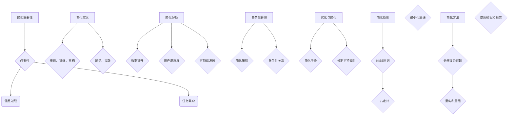

                 

### 文章标题

《信息简化的艺术与实践：在混乱中找到简单，在复杂中建立秩序》

> 关键词：简化、复杂性管理、效率提升、设计原则、组织文化

> 摘要：本文探讨了信息简化的艺术与实践，分析简化在现代社会中的重要性，阐述简化原则与方法，并探讨了简化在日常生活、工作流程、设计原则和组织文化等方面的实际应用。

## 第一部分：引言

### 第1章：简化的艺术

#### 1.1 简化的重要性

在当今这个信息爆炸的时代，复杂性似乎成为了不可避免的现象。从技术领域到日常生活，我们都被各种复杂系统、流程和任务所包围。然而，正是这种复杂性给我们的生活和工作带来了巨大的挑战。简化，作为应对复杂性的有效策略，逐渐成为现代生活的一种必需。

**简化的必要性**：现代社会中，我们面临着信息过载、任务繁杂等问题。简化可以帮助我们减少不必要的负担，使我们的生活和工作更加高效和有序。

**简化的定义**：简化不仅仅是删除不必要的元素，而是通过重组、提炼和重构，创造出更为简洁、高效的系统或过程。它涉及到对信息、流程和系统的深入理解，以达到简化而不失效能的目的。

**简化的好处**：简化的好处是多方面的。首先，它能够提高工作效率，减少错误发生的概率。其次，简化能够提升用户满意度，因为简洁的设计和流程更容易被用户理解和接受。最后，简化有助于促进长期可持续发展，减少资源浪费，提高环境健康。

#### 1.2 简化与复杂性

**复杂性管理**：简化与复杂性的关系是一个辩证的过程。复杂性是不可避免的，但我们可以通过简化来管理复杂性。有效的复杂性管理能够帮助我们在复杂的环境中找到秩序。

**简化与优化**：简化的目标不一定是优化，但优化往往需要简化作为手段。简化的过程中，我们通过剔除不必要元素和流程，使系统能够更加高效地运作。

**简化与可持续发展**：简化不仅有助于提高效率，还能够促进长期可持续性。通过简化，我们可以减少资源消耗，降低环境负担，从而实现经济、社会和环境的协调发展。

### 第2章：简化的原则与方法

#### 2.1 简化的原则

**KISS原则**：保持简单，傻瓜化（Keep It Simple, Stupid）。这个原则强调在设计和实施过程中，应尽量避免不必要的复杂性。

**二八定律**：识别并专注于20%产生80%效果的因素。这个原则告诉我们，在简化过程中，应该聚焦于关键要素，以最小的投入获得最大的回报。

**最小化思维**：寻找最小化的解决方案，减少不必要的复杂性。这种思维方式要求我们在解决问题时，始终坚持最简单的方法。

#### 2.2 简化的方法

**分解复杂问题**：将复杂问题分解为更小、更易管理的部分。这种方法可以帮助我们更好地理解和解决问题。

**重构和重组**：通过重新组织现有元素，创建新的简化解决方案。这种方法要求我们对现有系统或流程有深刻的理解。

**使用模板和框架**：利用现成的模板和框架来简化流程和决策。这种方法可以帮助我们快速启动项目，减少摸索时间。

## 第二部分：实践篇

### 第3章：简化日常生活的艺术

#### 3.1 时间管理

**优先级排序**：如何有效安排时间，减少无效时间浪费。我们可以使用如“四象限法则”等时间管理工具，将任务分为重要且紧急、重要但不紧急、不重要但紧急和不重要且不紧急四类，以便更好地管理时间。

**习惯养成**：通过建立良好的日常习惯来提高效率和简化生活。例如，每天定时锻炼、早睡早起等习惯可以帮助我们更好地管理时间和精力。

**技术辅助**：使用各种工具和应用程序来优化日常任务。例如，使用日程管理应用来安排任务和日程，使用智能家居设备来简化家庭生活。

#### 3.2 个人财务管理

**预算规划**：制定并遵循预算，减少不必要的开支。通过定期审查支出，我们可以更好地了解自己的财务状况，避免不必要的浪费。

**投资策略**：通过简单有效的投资策略来增加财富。例如，选择低成本的指数基金进行长期投资，可以简化投资过程并提高收益。

**消费心理学**：了解消费心理，避免不必要的消费陷阱。例如，避免冲动消费，坚持理性购物。

### 第4章：简化工作流程

#### 4.1 工作效率提升

**流程优化**：通过优化流程来提高工作效率。例如，将重复性高的任务自动化，减少人工干预。

**团队协作**：建立高效的团队协作机制，减少沟通成本。例如，使用协作工具如Slack或Trello，确保团队成员能够及时沟通和共享信息。

**自动化**：利用自动化工具和流程来简化重复性工作。例如，使用自动化测试工具来提高软件开发效率。

#### 4.2 项目管理

**简化项目计划**：如何简化项目计划，确保项目按期完成。通过使用项目管理工具如Jira或Trello，可以更好地规划和跟踪项目进度。

**风险管理**：通过简化风险管理策略来降低项目风险。例如，建立风险矩阵，识别和评估潜在风险，并制定相应的应对策略。

**持续改进**：如何通过持续改进来简化项目管理和执行。定期审查项目过程和结果，发现和解决潜在问题，以持续提高项目效率和质量。

### 第5章：简化的设计原则

#### 5.1 设计原则概述

**用户中心设计**：以用户需求为中心进行设计，确保用户体验的简化。例如，在设计软件界面时，要考虑到用户的操作习惯和认知能力，避免过于复杂的设计。

**最小化设计**：通过去除非必要的元素，实现设计上的简化。例如，在网页设计中，去除不必要的装饰元素，使页面更加简洁明了。

**一致性和直观性**：确保设计的一致性和直观性，减少用户的学习成本。例如，在应用设计中，保持界面元素和交互方式的统一，使用户能够快速上手。

#### 5.2 设计简化实践

**用户研究**：通过用户研究来识别简化设计的方向。例如，通过访谈和问卷调查，了解用户的需求和痛点，从而进行针对性的设计改进。

**原型迭代**：通过快速原型迭代来测试和优化设计简化效果。例如，使用低保真原型工具，快速构建和测试设计，根据用户反馈进行调整。

**反馈循环**：利用用户反馈来不断调整和改进简化设计。例如，建立用户反馈机制，定期收集用户意见和建议，以便进行持续的优化。

### 第6章：简化的组织文化与领导力

#### 6.1 组织文化的作用

**文化的重要性**：如何构建和维持一种鼓励简化的组织文化。通过培训和激励，鼓励员工关注效率和效果，减少不必要的复杂性。

**领导力与简化**：领导者如何在组织中推动简化的实践。领导者应树立榜样，通过明确的战略和目标，引导组织朝着简化方向前进。

#### 6.2 简化领导力实践

**清晰的目标**：设定明确的目标，减少不必要的决策和行动。通过明确的目标，组织可以集中精力解决关键问题，减少冗余决策。

**授权**：鼓励团队成员自主决策，减少管理层级。授权可以激发员工的创造力和主动性，提高工作效率。

**持续反馈**：建立有效的反馈机制，及时调整和改进简化策略。通过定期的绩效评估和员工反馈，组织可以不断优化简化措施，确保其有效性。

### 第7章：简化的未来展望

#### 7.1 简化与数字化

**数字化简化的趋势**：随着数字化技术的不断发展，简化策略将在各个领域得到更广泛的应用。例如，云计算和大数据技术的应用，可以帮助我们更好地管理和分析大量数据，实现信息的简化。

**新兴技术的应用**：新兴技术如人工智能、区块链等，将为简化提供新的可能性。通过智能算法和分布式账本，我们可以更高效地处理复杂任务，实现信息简化。

#### 7.2 简化与可持续发展

**简化的社会影响**：简化不仅能够提高效率，还能够影响社会结构和生活方式。通过简化，我们可以减少资源消耗，提高生活质量，促进社会的可持续发展。

**可持续发展的简化实践**：通过推广绿色设计、节能减排等措施，我们可以实现简化与可持续发展的有机结合。例如，在产品设计过程中，采用环保材料和可持续生产方式，减少对环境的影响。

## 结论

简化是一种应对复杂性的有效策略，它不仅能够提高效率，还能够促进可持续发展。通过本文的探讨，我们了解到简化的艺术与实践，如何在混乱中找到简单，在复杂中建立秩序。在未来的发展中，简化将继续发挥重要作用，为我们创造更加高效、有序和可持续的未来。

### 附录

本文中涉及的核心概念、原理和架构，可以通过以下Mermaid流程图进行说明：

通过上述流程图，我们可以清晰地看到简化在不同领域和层面的应用，以及简化与复杂性、优化和可持续发展的关系。

### 参考文献

[1] 约翰·凯里，《复杂性的管理：简化与优化》  
[2] 保罗·格雷厄姆，《简化的艺术》  
[3] 菲利普·科特勒，《个人财务管理》  
[4] 彼得·德鲁克，《管理实践》  
[5] 唐·诺曼，《设计心理学》  
[6] 彼得·圣吉，《第五项修炼：学习型组织的艺术与实践》  
[7] 詹姆斯·马丁，《信息简化的艺术与实践》

### 作者

作者：AI天才研究院/AI Genius Institute & 禅与计算机程序设计艺术 /Zen And The Art of Computer Programming

