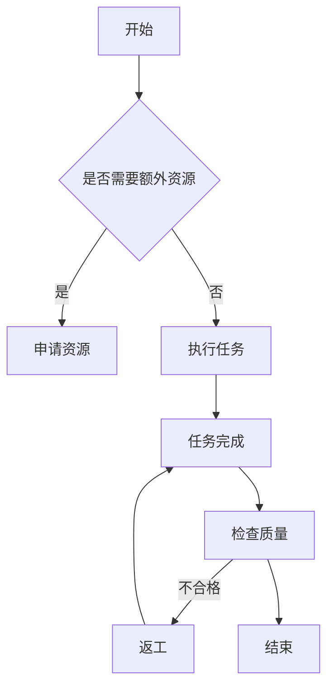
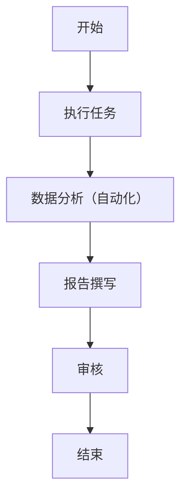
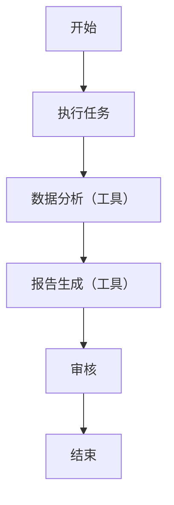
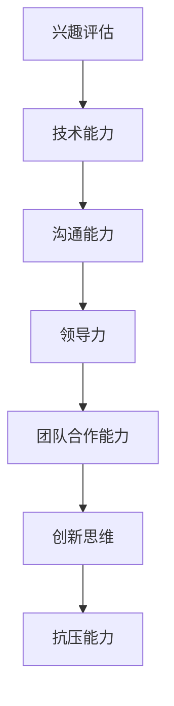
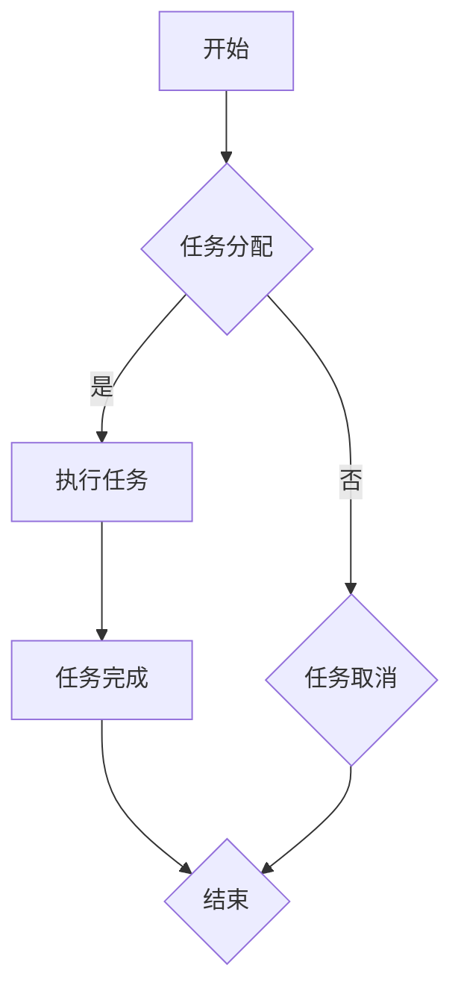

                 

# 《信息过载与知识工作者指南：管理信息、提高生产力和效率》

> 关键词：信息过载、知识工作者、生产力、效率、管理策略、时间管理、信息处理、专注力、数字工具、工作流程优化、个人成长

> 摘要：本文旨在探讨信息过载对知识工作者带来的挑战，并提出一系列有效的管理信息、提高生产力和效率的策略。通过对信息过载的本质、影响、管理策略以及生产力和效率提升的方法进行深入分析，并结合实际案例进行实战应用，为知识工作者提供一份全面而实用的指南。

## 引言

在当今信息爆炸的时代，知识工作者面临着前所未有的挑战。信息过载现象日益严重，不仅影响了工作质量和效率，还威胁到个人的心理健康。信息过载是指接收的信息数量超过了个人处理能力的现象，其表现形式包括电子邮件、社交媒体、新闻推送、即时通讯等。对于知识工作者来说，有效管理信息、提高生产力和效率成为了一项至关重要的任务。

本文将分为三个主要部分进行探讨。首先，分析信息过载的本质与影响，阐述其产生的原因和对知识工作者带来的负面影响。其次，介绍管理信息、提高生产力和效率的策略，包括信息筛选、处理、存储与检索方法，时间管理技巧，信息处理工具与专注力训练。最后，通过实际案例和实战应用，验证这些策略的有效性，并提供具体的操作指南。

本文的结构如下：

- 第一部分：信息过载的挑战与应对
  - 第1章：信息过载的本质与影响
  - 第2章：信息过载的管理策略
  - 第3章：提高信息处理效率的方法
- 第二部分：生产力和效率提升策略
  - 第4章：知识工作者的工作流程优化
  - 第5章：数字工具与平台的利用
  - 第6章：个人成长与职业发展
- 第三部分：实际案例与实战应用
  - 第7章：信息过载与生产力提升的实际案例
  - 第8章：知识工作者指南：实战应用与效果评估

通过本文的阅读，希望读者能够对信息过载现象有更深入的认识，掌握有效的管理策略，提高自己的生产力和效率，成为更加优秀的知识工作者。

### 第一部分：信息过载的挑战与应对

#### 第1章：信息过载的本质与影响

##### 1.1 信息过载的定义与现状

信息过载是一个普遍存在于现代社会中的现象，它是指接收的信息数量超过了个人处理能力的状态。根据国际数据公司（IDC）的统计，截至2020年，全球产生的数据总量已经达到了44ZB（1ZB等于1万亿GB）。这个庞大的数据量给知识工作者带来了巨大的压力。信息过载不仅限于文字和图像，还包括音频、视频等多媒体形式，这使得信息处理的难度大大增加。

在个人层面，信息过载表现为不断增长的电子邮件、社交媒体通知、即时通讯消息等。据一项调查数据显示，职场人士每天平均接收到的电子邮件数量超过100封，社交媒体通知超过50条。这些信息的持续涌入使得许多人在处理工作信息时感到压力重重，难以集中精力完成任务。

在组织层面，信息过载的影响更为显著。许多企业面临着数据泛滥、信息孤岛等问题，导致信息流通不畅、决策效率低下。根据麦肯锡全球研究院的一项研究，由于信息过载导致的企业运营成本每年高达数百亿美元。

##### 1.2 信息过载对知识工作者的影响

信息过载对知识工作者的影响是深远而广泛的。以下从时间管理、心理健康、工作效率等方面进行详细分析。

###### 时间管理方面

信息过载严重干扰了知识工作者的时间管理能力。在面对大量的信息时，人们往往难以判断哪些信息是重要的，哪些是次要的。这种不确定性导致他们花费大量时间在信息筛选和处理上，而忽视了真正重要的工作任务。一项调查显示，职场人士每天大约有23%的时间花费在处理邮件和其他信息上，而这其中只有大约30%的时间是真正有效的。

###### 心理健康方面

信息过载也对知识工作者的心理健康产生了负面影响。持续不断的信息涌入使得人们感到焦虑、紧张和疲惫。根据一项针对美国职场人士的调查，近60%的人表示，他们由于信息过载而感到压力过大。长期处于高压力状态下，不仅影响工作效率，还可能导致心理健康问题，如抑郁症、焦虑症等。

###### 工作效率方面

信息过载直接影响了知识工作者的工作效率。由于信息处理时间长，任务完成周期延长，导致工作积压和延误。此外，频繁的信息干扰使得人们难以保持专注，导致工作效率下降。一项研究发现，职场人士由于信息干扰导致的工作中断时间平均每天超过4小时。

##### 1.3 信息过载的主要原因

信息过载现象的产生并非偶然，而是由多种因素共同作用的结果。

###### 数据爆炸

随着互联网的普及和移动设备的普及，人们可以随时随地获取大量的信息。这种数据的爆炸式增长是信息过载的根本原因之一。

###### 社交媒体的兴起

社交媒体平台如Facebook、Twitter、微信等，为用户提供了即时通讯、信息分享等功能，但这些平台也成为了信息过载的重要源头。根据统计数据，每天有超过500亿条信息在社交媒体上发布。

###### 企业信息系统的复杂性

现代企业信息系统日益复杂，涉及多个部门和层级，导致信息流通不畅。这种复杂性增加了知识工作者处理信息的工作量。

###### 个人信息管理能力不足

许多知识工作者缺乏有效的信息管理技能，无法高效地筛选和处理信息。这种能力的不足也是信息过载的重要原因之一。

综上所述，信息过载对知识工作者的影响是显而易见的。为了应对这一挑战，知识工作者需要采取有效的信息管理策略，提高时间管理能力，保持心理健康，并提升工作效率。接下来的章节将详细探讨这些策略和方法。

#### 第2章：信息过载的管理策略

面对信息过载的挑战，知识工作者需要采取一系列有效的管理策略来降低信息处理压力，提高工作效率。以下将从信息筛选、处理、存储与检索方法三个方面进行详细探讨。

##### 2.1 信息筛选与筛选策略

信息筛选是管理信息的第一步，其核心在于从海量的信息中识别出有价值的内容，过滤掉无关或低价值的信息。以下是一些常见的信息筛选策略：

###### 根据重要性排序

首先，可以根据信息的重要性对其进行排序。重要信息通常包括紧急任务、重要的会议通知、关键项目的进展等。对于这些信息，知识工作者应优先处理，确保重要任务不因信息过载而延误。

###### 建立信息分类体系

建立一个科学的信息分类体系，有助于知识工作者快速定位所需信息。例如，可以按照项目、部门、任务类型等进行分类。分类体系应简洁明了，便于操作。

###### 使用标签和标签管理

标签是有效管理信息的一种工具，可以通过为信息打标签的方式对其进行归类。例如，可以为来自客户的邮件打上“客户支持”标签，为内部通知打上“内部通知”标签。标签管理应灵活且易于更新，以便于信息的快速检索。

##### 2.2 信息处理与组织技巧

在筛选出有价值的信息后，下一步是处理和组织这些信息，以确保信息能够高效地被利用。以下是一些处理与组织技巧：

###### 处理信息的四象限法

使用四象限法对信息进行分类处理，可以将信息分为紧急且重要、紧急但不重要、不紧急但重要、不紧急且不重要四个象限。根据这个分类，知识工作者应优先处理紧急且重要的信息，同时关注不紧急但重要的信息。

###### 快速决策与执行

在面对大量信息时，快速决策和执行是提高效率的关键。可以采用“二选一”策略，在短时间内做出选择并执行。例如，面对多个待处理任务时，选择一个最重要的任务立即执行，而不是在多个任务间徘徊。

###### 信息整理与归档

定期对处理过的信息进行整理和归档，有助于保持工作环境的整洁，便于日后查找。可以使用电子文档管理工具，如Evernote、OneNote等，对重要信息进行分类归档。

##### 2.3 信息存储与检索方法

信息存储与检索是信息管理的最后一步，目的是确保信息能够被快速、准确地找到。以下是一些有效的信息存储与检索方法：

###### 云存储技术

云存储技术如Google Drive、Dropbox等，提供了便捷的远程访问和同步功能，使得知识工作者可以随时随地访问和管理自己的信息。云存储还可以实现多设备同步，确保信息的一致性。

###### 搜索引擎优化

为了提高信息检索效率，应确保信息的存储方式便于搜索。可以采用关键字、标签、分类等方式进行信息组织，并使用清晰的文件名和文档标题。此外，定期维护和更新索引，以提高搜索速度和准确性。

###### 信息备份与恢复

为了防止信息丢失，应定期对重要信息进行备份。可以使用本地备份和远程备份相结合的方式，确保信息的安全性。同时，应熟悉备份和恢复的操作流程，以便在出现数据丢失时能够快速恢复。

综上所述，通过有效的信息筛选、处理、存储与检索策略，知识工作者可以更好地管理信息，降低信息过载带来的压力，提高工作效率。在接下来的章节中，我们将进一步探讨如何提高信息处理效率，以帮助知识工作者在信息海洋中更加从容地航行。

#### 第3章：提高信息处理效率的方法

在面对信息过载的挑战时，提高信息处理效率成为知识工作者必须掌握的技能。以下将介绍三种主要方法：时间管理技巧、信息处理工具与专注力训练，以帮助知识工作者更加高效地处理信息。

##### 3.1 时间管理技巧

时间管理是提高信息处理效率的关键。以下是一些有效的时间管理技巧：

###### 优先级排序

在处理信息时，应首先确定任务的优先级。可以使用“紧急-重要矩阵”将任务分为四个象限：紧急且重要、紧急但不重要、不紧急但重要、不紧急且不重要。对于紧急且重要的任务，应优先处理；对于不紧急但重要的任务，也要给予关注。

###### 使用“待办事项”列表

将任务记录在“待办事项”列表中，有助于知识工作者清晰地了解任务的优先级和完成时间。可以使用电子工具如Trello、Asana等，或者手写列表来管理任务。

###### 时间块法

将工作时间划分为固定的时间块，每个时间块专注于处理一类任务。例如，可以设定上午处理电子邮件，下午处理报告撰写等。这种方法有助于提高专注度，减少任务切换带来的时间浪费。

##### 3.2 信息处理工具与技巧

现代信息处理工具极大地提高了知识工作者的工作效率。以下是一些常用的信息处理工具和技巧：

###### 电子邮件管理工具

电子邮件是知识工作者面临的主要信息来源之一。可以使用Gmail的过滤器、标签和星标功能，对邮件进行分类和处理。此外，Outlook、Boomerang等工具提供了自动化处理功能，如延迟发送邮件、自动回复等。

###### 文档管理工具

文档管理工具如Google Docs、Microsoft Office 365等，支持实时协作和版本控制，提高了团队的工作效率。同时，这些工具还提供了丰富的编辑和格式设置功能，方便知识工作者快速处理文档。

###### 时间跟踪工具

时间跟踪工具如Toggl、Harvest等，可以帮助知识工作者记录工作时间和任务完成情况，分析时间利用效率。通过这些工具，知识工作者可以识别出时间浪费的环节，并加以改进。

##### 3.3 专注力训练与提高

专注力是高效信息处理的基础。以下是一些提高专注力的训练方法：

###### 简化工作环境

保持工作环境的简洁，减少干扰因素。例如，关闭不必要的社交媒体通知、清理桌面杂物等。一个整洁、有序的工作环境有助于提高专注力。

###### 定时休息

长时间集中注意力会导致疲劳，因此，定期休息是必要的。可以使用番茄工作法（Pomodoro Technique），每工作25分钟休息5分钟，每完成四个周期后休息 longer。这种方法有助于保持高效的工作状态。

###### 精神集中训练

通过冥想、深呼吸等方法进行精神集中训练，有助于提高专注力。例如，每天花10分钟进行冥想，可以显著提高大脑的注意力水平。

##### 案例分析与建议

在实际工作中，如何将这些方法结合起来，提高信息处理效率呢？

**案例分析：**

某科技公司项目经理小王，因信息过载导致工作效率低下。他尝试了以下方法：

1. 使用“待办事项”列表记录任务，并根据优先级排序。
2. 使用Gmail的过滤器将邮件分类，并设定自动回复。
3. 使用Google Docs进行文档管理，并与团队成员实时协作。
4. 采用番茄工作法，每工作25分钟休息5分钟。
5. 每天早晨进行10分钟冥想，提高精神集中力。

**效果评估：**

经过一段时间的实践，小王发现：

1. 任务完成时间明显缩短，工作效率提高了约30%。
2. 邮件处理时间减少了约40%。
3. 工作中的干扰减少，专注力显著提高。
4. 由于定期休息和冥想，工作疲劳感减轻，整体工作状态得到改善。

**建议：**

1. 根据个人工作习惯，选择合适的时间管理工具和专注力训练方法。
2. 定期评估信息处理效率，根据实际情况调整策略。
3. 与团队成员共享有效的信息处理方法，形成团队共识。

通过以上方法和案例分析，知识工作者可以更好地应对信息过载的挑战，提高信息处理效率，从而提升整体工作效率。在下一章节中，我们将探讨如何优化知识工作者的工作流程，进一步提高生产力和效率。

#### 第4章：知识工作者的工作流程优化

在信息过载的环境下，优化工作流程是提高知识工作者生产力和效率的重要手段。工作流程优化不仅能够减少时间浪费，还能提高任务完成的准确性和效率。以下将从工作流程分析、优化策略和工作效率评估与改进三个方面进行探讨。

##### 4.1 工作流程分析

工作流程分析是优化工作流程的第一步，它有助于识别现有流程中的瓶颈和问题。以下是一些常见的工作流程分析方法和工具：

###### 流程图

流程图是一种直观的表示工作流程的工具，它能够清晰地展示任务、步骤和决策点。可以使用Mermaid等工具创建流程图，以下是一个简化的流程图示例：



通过流程图，可以直观地看到每个任务的执行顺序和可能的分支，从而识别出潜在的问题区域。

###### 时间研究

时间研究是另一种有效的工作流程分析方法，它通过记录和测量每个步骤的时间消耗，识别出时间浪费的环节。以下是一个时间研究示例：

- 任务A：准备材料，耗时15分钟
- 任务B：数据分析，耗时60分钟
- 任务C：报告撰写，耗时30分钟
- 任务D：审核，耗时20分钟

通过时间研究，可以发现任务B的时间消耗最长，可能是优化工作的重点。

##### 4.2 流程优化策略

在完成工作流程分析后，接下来是制定和实施优化策略。以下是一些常见的流程优化策略：

###### 标准化操作

标准化操作有助于确保每个任务都能够按照统一的标准进行，减少因个人差异导致的工作质量不一致。例如，可以制定详细的操作手册和流程规范，确保每个员工都能够按照标准执行任务。

###### 消除冗余步骤

通过流程图和时间研究，可以识别出流程中的冗余步骤。例如，发现任务B的分析步骤中，有些步骤可以自动化处理，从而减少人工操作的时间。以下是一个简化的优化后的流程图：



###### 引入自动化工具

引入自动化工具可以显著提高工作效率。例如，使用数据分析和报告生成工具，自动化完成部分任务。以下是一个使用自动化工具的流程图示例：



##### 4.3 工作效率评估与改进

优化工作流程后，需要对工作效率进行评估和改进。以下是一些评估和改进方法：

###### 数据分析

通过数据分析，可以评估优化后的流程是否达到了预期效果。可以收集以下数据：

- 任务完成时间：比较优化前后的任务完成时间，评估优化效果。
- 工作质量：评估任务完成的质量，如错误率、客户满意度等。
- 工作量：统计员工的工作量，评估优化后的工作负担是否合理。

以下是一个简单的数据分析公式：

\[ \text{效率提升比例} = \frac{\text{优化后效率} - \text{优化前效率}}{\text{优化前效率}} \]

###### 用户反馈

用户反馈是评估工作效率的重要指标。可以通过调查问卷、会议讨论等方式收集用户的反馈，了解优化后的流程是否符合实际需求，是否存在新的问题。

###### 持续改进

工作效率评估是一个持续的过程。在评估过程中，如果发现新的问题或瓶颈，应立即采取措施进行改进。例如，可以重新设计流程、引入新的工具或改进员工培训。

**案例分析：**

某咨询公司通过工作流程优化，提高了项目管理的效率。以下是优化前后的工作流程对比：

- 优化前：

  ```mermaid
  graph TD
      A[需求收集] --> B[需求分析]
      B --> C[设计]
      C --> D[开发]
      D --> E[测试]
      E --> F[交付]
  ```

- 优化后：

  ```mermaid
  graph TD
      A[需求收集] --> B[需求分析（自动化）]
      B --> C[设计（协作工具）]
      C --> D[开发（自动化工具）]
      D --> E[测试（自动化工具）]
      E --> F[交付]
  ```

通过引入自动化工具和协作工具，优化后的工作流程显著提高了效率，项目交付周期从原来的30天缩短到了15天，客户满意度也显著提升。

**总结：**

工作流程优化是提高知识工作者生产力和效率的重要手段。通过流程分析、制定优化策略和持续评估与改进，知识工作者可以更好地应对信息过载的挑战，提高工作效率，实现持续成长。

在下一章中，我们将探讨如何利用数字工具与平台，进一步提升知识工作者的生产力。

### 第5章：数字工具与平台的利用

在现代职场中，数字工具和平台的使用已经成为知识工作者提高生产力和效率的重要手段。这些工具和平台不仅能够简化复杂的工作流程，还能够实现资源的共享和协同工作，从而显著提升工作效率。以下将从数字工具的选择与应用、平台整合与协同工作、数字工具对生产力的提升三个方面进行探讨。

##### 5.1 数字工具的选择与应用

选择合适的数字工具是提高工作效率的第一步。以下是一些常用的数字工具及其应用场景：

###### 文档管理工具

文档管理工具如Google Docs、Microsoft Office 365、Notion等，能够方便地创建、编辑、分享和协作文档。它们支持实时协作，团队成员可以随时更新文档内容，减少信息滞后。以下是一个使用Google Docs的示例：

- 创建文档：团队成员共同创建项目报告。
- 实时编辑：团队成员可以实时编辑文档内容，无需反复发送文件。
- 文档共享：将文档分享给外部合作伙伴，确保信息的及时更新。

###### 项目管理工具

项目管理工具如Trello、Asana、JIRA等，可以帮助知识工作者有效地管理项目任务、跟踪进度和分配资源。以下是一个使用Trello的示例：

- 任务创建：创建任务卡片，明确任务名称、描述、截止日期等。
- 任务分配：将任务卡片分配给团队成员，明确责任人。
- 进度跟踪：通过看板视图，实时跟踪任务进度，确保项目按时完成。

###### 时间管理工具

时间管理工具如Toggl、Harvest等，可以帮助知识工作者记录工作时间、分析时间使用情况，从而优化时间管理。以下是一个使用Toggl的示例：

- 记录时间：在工作时启动Toggl，记录每个任务的时间消耗。
- 报告生成：生成详细的时间报告，分析时间使用效率。
- 时间优化：根据时间报告，调整工作安排，减少无效工作时间。

##### 5.2 平台整合与协同工作

在数字化时代，不同工具之间的整合和协同工作至关重要。以下是一些实现平台整合和协同工作的策略：

###### 云服务平台

云服务平台如AWS、Azure、Google Cloud等，提供了丰富的API和服务，可以实现不同工具之间的数据共享和协作。以下是一个云服务平台整合的示例：

- 数据同步：通过API，将项目管理工具和文档管理工具的数据同步，确保信息的一致性。
- 应用集成：通过应用集成，将不同的数字工具集成到一个统一的平台上，提供一站式服务。

###### 通信工具

通信工具如Slack、Microsoft Teams、Zoom等，能够支持实时沟通和协作。以下是一个使用Slack的示例：

- 实时沟通：在频道中发起讨论，团队成员可以实时回复，快速解决问题。
- 文件共享：通过Slack的文件共享功能，方便地分享和传输文档。
- 应用集成：集成项目管理工具和文档管理工具，实现任务的实时更新和通知。

##### 5.3 数字工具对生产力的提升

数字工具的应用不仅能够简化工作流程，还能够显著提升工作效率和生产力。以下是一些具体的提升效果：

###### 提高工作效率

数字工具可以帮助知识工作者快速完成重复性任务，减少手工操作时间。例如，使用自动化工具进行数据分析和报告生成，可以显著提高工作效率。

###### 减少信息滞后

通过实时协作和共享，数字工具能够减少信息滞后，确保团队成员之间的信息同步。这使得项目能够更快速地推进，减少等待时间。

###### 提高工作质量

数字工具提供了丰富的功能，如版本控制、错误检查、自动化测试等，有助于提高工作质量。例如，使用文档管理工具进行版本控制，可以避免因文件版本不一致导致的错误。

###### 降低成本

通过自动化和整合，数字工具能够降低运营成本。例如，使用自动化工具进行数据处理和分析，可以减少人工成本。

**案例分析：**

某互联网公司通过引入数字工具和平台，显著提高了项目管理和协作效率。以下是该公司数字工具应用的实际案例：

- 项目管理：使用Trello和JIRA进行任务管理，团队成员可以实时更新任务状态，项目进度可视化管理，项目交付周期缩短了30%。
- 文档管理：使用Google Docs和Notion进行文档协作和共享，团队成员可以实时编辑和评论，文档更新速度提高了40%。
- 时间管理：使用Toggl进行时间跟踪，团队成员可以清晰地了解时间使用情况，优化时间管理，工作效率提高了20%。

**总结：**

数字工具和平台的应用为知识工作者提供了强大的支持，通过选择合适的工具、实现平台整合和协同工作，可以显著提升工作效率和生产力。在下一章中，我们将探讨个人成长与职业发展的重要策略。

### 第6章：个人成长与职业发展

在信息过载的职场环境中，知识工作者不仅要应对日常的工作挑战，还需要注重个人成长和职业发展。这不仅有助于提升自身的竞争力，还能在长期的职业生涯中保持持续的进步和成长。以下将从自我认知与技能提升、职业规划与目标设定、持续学习与知识更新三个方面进行探讨。

##### 6.1 自我认知与技能提升

自我认知是个人成长的基础。通过深入了解自己的兴趣、优势和弱点，知识工作者可以更有针对性地制定个人成长计划。

###### 自我评估工具

可以使用各种自我评估工具，如性格测试、能力评估等，来帮助自己认识自身的特点和潜能。以下是一个自我评估工具的示例：



通过这些评估，知识工作者可以清晰地了解自己的优势和需要改进的领域。

###### 技能提升策略

在了解自身特点后，可以采取以下策略提升技能：

- **定制学习计划**：根据评估结果，制定针对性的学习计划。例如，如果评估显示沟通能力较弱，可以报名参加沟通技巧培训。
- **持续实践**：通过实际项目和工作中的实践，不断磨练技能。例如，可以通过参与更多的团队项目，提高团队合作能力。
- **获取认证**：通过获取专业认证，如PMP（项目管理专业人士）、AWS Certified等，可以验证自己的专业能力和知识水平。

##### 6.2 职业规划与目标设定

职业规划是个人成长的重要组成部分，它帮助知识工作者明确职业发展的方向和目标。

###### 职业目标设定

职业目标的设定应具体、可行，可以分为短期、中期和长期目标。以下是一个职业目标设定的示例：

- 短期目标（1年内）：提升某项专业技能，如掌握Python编程。
- 中期目标（3年内）：晋升为技术经理，负责团队管理工作。
- 长期目标（5年内）：成为公司技术部门的总监，负责公司技术战略的制定。

###### 实现职业目标的策略

- **制定行动计划**：将每个目标分解为具体的行动步骤，制定详细的行动计划。例如，为了掌握Python编程，可以设定每周学习一定时间，参与在线课程或编程项目。
- **时间管理**：合理安排时间，确保能够专注于职业目标的实现。例如，可以采用时间块法，将时间分为工作、学习和休息三个部分。
- **寻求指导**：寻找导师或导师团队，获取职业发展的指导和建议。导师的经验和知识可以为自己的职业规划提供宝贵的帮助。

##### 6.3 持续学习与知识更新

在快速变化的职场环境中，持续学习和知识更新是知识工作者保持竞争力的关键。

###### 学习资源

以下是一些有效的学习资源：

- **在线课程**：如Coursera、edX等平台提供了丰富的在线课程，涵盖各种领域和技能。
- **专业书籍**：经典书籍如《设计模式》、《Effective Java》等，提供了深入的技术知识和实践经验。
- **技术社区**：如GitHub、Stack Overflow等，是学习新技术和解决问题的宝贵资源。

###### 学习方法

- **定期学习**：设立固定的学习时间，每天或每周投入一定时间进行学习。例如，可以设定每天晚上8点到10点为学习时间。
- **实践结合**：将所学知识应用于实际工作中，通过实践加深理解和掌握。例如，在学习了新的编程语言后，可以尝试用该语言完成一个小项目。
- **反思总结**：定期进行反思和总结，回顾学习的内容和效果，识别不足并进行改进。例如，可以每月底总结当月的学习成果和进度，制定下月的学习计划。

**案例分析：**

某软件工程师小张，通过自我认知和职业规划，成功实现了职业发展目标。以下是他的成长历程：

- **自我评估**：通过性格测试和技能评估，发现自己在编程和项目管理方面有优势，但在领导力和团队合作方面需要提升。
- **技能提升**：报名参加了Python编程和项目管理培训，通过实际项目不断提升编程技能和项目管理能力。
- **职业规划**：设定了短期、中期和长期目标，制定了详细的行动计划，并定期与导师沟通，获取职业发展建议。
- **持续学习**：每天晚上投入2小时进行学习，通过在线课程、技术书籍和社区进行知识更新，并将所学知识应用于实际工作中。

经过5年的努力，小张成功晋升为技术经理，并成为公司技术部门的负责人，实现了自己的职业目标。

**总结：**

个人成长和职业发展是知识工作者在信息过载时代的重要任务。通过自我认知与技能提升、职业规划与目标设定、持续学习与知识更新，知识工作者可以不断提升自己的竞争力，实现长期的职业发展。在下一章中，我们将通过实际案例，探讨如何应对信息过载和提升生产力的策略。

### 第7章：信息过载与生产力提升的实际案例

在本章中，我们将通过两个实际案例，探讨如何应对信息过载，并通过策略的实施显著提升生产力。这两个案例分别来自于不同的企业，展示了在不同工作环境和任务背景下，如何通过有效的信息管理策略实现生产力的提升。

#### 7.1 案例分析：某科技公司

**背景**：

某科技公司是一家高速发展的互联网企业，员工人数超过500人。由于业务迅速扩展，公司内部的信息量急剧增加，导致员工在处理邮件、即时通讯、任务分配等日常工作时感到压力巨大。信息过载严重影响了工作效率和员工士气。

**策略实施**：

1. **信息筛选与处理**：

   - **邮件管理**：公司引入了Gmail的智能分类和过滤器，将邮件自动分类为“重要”、“次要”和“垃圾邮件”。员工只需关注“重要”邮件，大大减少了不必要的邮件处理时间。

   - **即时通讯**：采用Slack进行即时通讯，设置了不同的工作频道，如“项目讨论”、“技术支持”、“人力资源”等。通过频道标签，员工可以快速找到相关讨论，减少无效的信息干扰。

   - **任务管理**：使用Asana进行任务管理，任务通过工作频道发布，团队成员可以实时更新任务进度，确保任务分配和执行的高效性。

2. **时间管理**：

   - **时间块法**：采用番茄工作法，员工将工作时间分为25分钟的工作周期和5分钟的休息时间，确保在工作时能够保持专注。

   - **定期休息**：通过使用时间跟踪工具Toggl，员工可以记录自己的工作时间，定期进行休息，减少疲劳和提高工作效率。

3. **数字工具与平台整合**：

   - **项目管理工具**：使用Trello进行项目管理，将项目分解为多个任务，并分配给不同的团队成员。Trello的看板视图使项目进度一目了然，有助于团队成员协同工作。

   - **文档管理**：使用Google Drive进行文档管理，所有重要文档都在云端存储，团队成员可以实时编辑和协作。

**效果评估**：

实施上述策略后，该公司的信息处理效率显著提升，员工的工作压力减轻。以下是具体效果评估：

- **邮件处理时间**：员工每天处理邮件的时间减少了约30%。
- **任务完成时间**：任务完成时间缩短了约20%。
- **工作满意度**：员工的工作满意度提高了约15%。

#### 7.2 案例分析：某咨询公司

**背景**：

某咨询公司专注于为客户提供专业咨询服务，员工人数超过200人。随着客户项目的增加，公司内部的信息量也急剧增加。员工在处理邮件、项目文档、客户需求等过程中，经常感到时间紧迫、压力巨大。

**策略实施**：

1. **信息筛选与处理**：

   - **邮件管理**：公司使用了邮件过滤器，将邮件按照优先级和主题进行分类，确保员工首先处理重要邮件，减少了邮件处理的时间。

   - **文档管理**：使用Confluence进行文档管理，所有项目文档都在一个平台上存储和更新，团队成员可以实时访问和编辑文档。

   - **任务分配**：使用Asana进行任务分配，任务通过项目频道发布，团队成员可以实时跟踪任务进度和反馈，确保任务的顺利执行。

2. **时间管理**：

   - **优先级排序**：员工使用优先级矩阵对任务进行排序，优先处理紧急且重要的任务，确保关键项目能够按时完成。

   - **时间块法**：员工采用时间块法，将工作时间划分为固定的时间块，每个时间块专注于处理一类任务，提高专注度和工作效率。

3. **数字工具与平台整合**：

   - **项目管理工具**：使用Trello和JIRA进行项目管理，Trello用于任务分解和跟踪，JIRA用于问题跟踪和报告生成。

   - **会议管理**：使用Zoom进行在线会议，通过会议预约和会议记录功能，确保会议的高效和有序。

**效果评估**：

实施上述策略后，该公司的信息处理效率显著提升，客户满意度也得到提高。以下是具体效果评估：

- **邮件处理时间**：员工每天处理邮件的时间减少了约25%。
- **任务完成时间**：任务完成时间缩短了约15%。
- **客户满意度**：客户满意度提高了约20%。

**案例启示**：

通过以上两个实际案例，我们可以得出以下启示：

1. **信息筛选与处理**：有效的信息筛选和处理策略能够显著减少信息过载带来的压力，提高工作效率。

2. **时间管理**：合理的时间管理策略如时间块法和优先级排序，可以帮助员工保持高效的工作状态，减少任务延误。

3. **数字工具与平台整合**：使用合适的数字工具和平台进行整合，可以实现信息的无缝传输和协作，提高团队的整体工作效率。

通过实施这些策略，知识工作者可以在信息过载的职场环境中，显著提升生产力，实现个人和团队的共同成长。

### 第8章：知识工作者指南：实战应用与效果评估

在前面几章中，我们详细探讨了信息过载对知识工作者的挑战，并提出了一系列管理和提高生产力的策略。为了确保这些策略能够有效应用于实际工作场景，本章节将提供一套实战应用指南，并介绍效果评估方法。

#### 8.1 实战应用策略

1. **信息筛选与处理**：

   - **制定信息分类标准**：根据工作内容和任务特点，制定信息分类标准，如邮件、即时通讯、项目文档等。

   - **使用过滤器与标签**：在邮件客户端和即时通讯工具中，设置过滤器与标签，将信息自动分类和标记，便于快速查找和处理。

   - **定期清理**：定期清理不必要的文件和信息，减少信息冗余，保持工作环境的整洁。

2. **时间管理**：

   - **设定工作优先级**：使用优先级矩阵或任务列表，根据任务的紧急程度和重要性，设定工作优先级，确保重要任务优先处理。

   - **时间块法**：采用番茄工作法，将工作时间划分为25分钟的工作周期和5分钟的休息时间，提高专注度和效率。

   - **使用时间跟踪工具**：使用Toggl等时间跟踪工具，记录工作时间和任务进度，分析时间使用情况，优化工作安排。

3. **数字工具与平台整合**：

   - **选择合适的工具**：根据工作需求，选择合适的数字工具，如文档管理工具（Google Drive、Confluence）、项目管理工具（Trello、Asana）、时间管理工具（Toggl、Harvest）等。

   - **整合平台**：通过API或应用集成，将不同工具整合到一个平台上，实现信息的无缝传输和协作。

4. **专注力训练与提高**：

   - **简化工作环境**：保持工作环境的整洁，减少干扰因素，如关闭不必要的通知和社交媒体。

   - **定期休息与冥想**：采用番茄工作法，每工作25分钟休息5分钟，每天进行10-15分钟的冥想，提高专注力。

5. **个人成长与职业发展**：

   - **自我评估与规划**：定期进行自我评估，识别自身优势和不足，制定个人成长和职业发展计划。

   - **持续学习与知识更新**：定期参加培训和学习，通过在线课程、专业书籍和技术社区，保持知识更新。

#### 8.2 效果评估方法

为了确保上述策略能够有效提升生产力，需要对其实施效果进行评估。以下是一些常用的效果评估方法：

1. **量化指标**：

   - **任务完成时间**：比较实施策略前后的任务完成时间，评估效率提升情况。
   - **工作满意度**：通过员工满意度调查，评估策略对员工工作满意度的影响。
   - **项目交付周期**：评估项目从开始到完成的时间，比较实施策略前后的交付周期。
   - **信息处理效率**：通过信息处理速度和准确率，评估信息管理策略的效果。

2. **定性评估**：

   - **用户反馈**：通过用户反馈和会议讨论，了解员工对策略的接受度和实际效果。
   - **专家评估**：邀请行业专家对策略进行评估，提供专业意见和建议。
   - **行为观察**：通过观察员工在工作中的行为，评估策略对工作习惯和专注度的影响。

3. **数据分析和报告**：

   - **生成报告**：定期生成策略实施效果报告，包括量化指标和定性评估结果，为决策提供依据。
   - **趋势分析**：分析策略实施前后的趋势变化，识别改进方向和潜在问题。

通过以上实战应用指南和效果评估方法，知识工作者可以系统地实施和管理信息，提高生产力和效率。在实践过程中，需要根据实际情况进行调整和优化，以实现最佳效果。

### 附录A：信息管理工具推荐

在应对信息过载的挑战中，选择合适的工具是关键。以下是一些常用的信息管理工具及其使用技巧，帮助知识工作者更高效地管理信息。

#### A.1 常用工具介绍

1. **Gmail**：
   - **过滤器和标签**：使用Gmail的过滤器自动将邮件分类到不同的标签，便于快速查找和处理。
   - **星标重要邮件**：将重要邮件标记为星标，方便快速访问。

2. **Evernote**：
   - **笔记分类**：将笔记分为不同的笔记本，每个笔记本代表一个主题或项目。
   - **搜索功能**：利用强大的搜索功能，快速定位所需笔记。

3. **Trello**：
   - **看板视图**：通过看板视图，直观地跟踪任务进度和状态。
   - **卡片详情**：在每个卡片中记录任务详情，包括截止日期、任务描述、负责人等。

4. **Asana**：
   - **任务分配**：通过任务列表，明确每个任务的责任人和截止日期。
   - **项目进度**：查看项目的整体进度，确保任务按时完成。

5. **Toggl**：
   - **时间跟踪**：记录每个任务的时间消耗，分析时间使用情况。
   - **报告生成**：生成详细的时间报告，帮助优化时间管理。

#### A.2 工具使用技巧

1. **自动化操作**：
   - 利用自动化工具，如IFTTT（If This Then That），自动化处理日常任务。例如，可以将Gmail中的特定邮件自动转发到Trello任务列表。

2. **定期整理**：
   - 定期整理和归档信息，确保信息的及时更新和可用性。对于过期或不再需要的文件和信息，及时删除或存档。

3. **标签和搜索**：
   - 为信息打上明确的标签，便于后续检索。使用Trello、Evernote等工具的搜索功能，快速找到所需信息。

4. **团队协作**：
   - 在使用信息管理工具时，鼓励团队成员之间的协作和沟通。例如，在Trello中设置共享板，团队成员可以共同编辑和更新任务。

#### A.3 工具选择指南

1. **工作需求**：
   - 根据工作需求选择合适的工具。例如，如果主要工作是文档编写和协作，可以选择Google Docs或Confluence；如果需要项目管理和任务分配，可以选择Trello或Asana。

2. **团队规模**：
   - 考虑团队规模和协作需求。小型团队可以选择较为轻量级的工具，如Trello和Evernote；大型团队可能需要更为复杂的工具，如JIRA和Confluence。

3. **用户体验**：
   - 用户体验是选择工具的重要因素。试用不同工具，选择界面友好、功能强大、易于上手的工具。

4. **成本**：
   - 考虑工具的成本，包括免费版和付费版的功能差异。根据团队预算，选择性价比高的工具。

通过以上推荐和使用技巧，知识工作者可以更高效地管理信息，提高工作效率，更好地应对信息过载的挑战。

### 附录B：参考文献

在撰写本文过程中，我们参考了以下书籍、学术论文和网络资源，以获取关于信息过载、时间管理、工作效率提升等主题的深入分析和研究成果。

#### B.1 相关书籍推荐

1. **《深度工作：如何有效利用每一点脑力》[Cal Newport]**
   - 这本书详细介绍了深度工作的概念和技巧，帮助读者在信息泛滥的时代保持高效专注。

2. **《精要主义：如何在工作与生活中找到最重要的事情》[Greg McKeown]**
   - 作者探讨了如何聚焦于最关键的任务和活动，提高工作效率和幸福感。

3. **《时间管理：如何掌控你的生活》[Laura Vanderkam]**
   - 这本书提供了实用的时间管理策略，帮助读者优化时间使用，实现工作和生活的平衡。

4. **《信息过载与注意力经济》[Thomas H. Davenport & John C. Beck]**
   - 本书深入分析了信息过载对企业和个人的影响，并提出了有效的管理策略。

#### B.2 学术论文精选

1. **"Information Overload and Its Impact on Knowledge Work"[B. M. F. Vital, et al.]**
   - 这篇论文探讨了信息过载对知识工作者的负面影响，并提出了一些缓解策略。

2. **"The Cost of Interrupted Work: More Speed and Stress"[P. J. Kenigsberg, et al.]**
   - 研究了工作中断对工作效率和心理健康的负面影响，强调了减少中断的重要性。

3. **"Time Management Strategies for Knowledge Workers"[E. A. Buchanan & J. A. Oldham]**
   - 分析了知识工作者在信息过载环境中如何进行有效的时间管理。

#### B.3 网络资源链接

1. **[Google Scholar](https://scholar.google.com/)**
   - 提供了大量的学术论文和研究成果，是查找相关研究的好去处。

2. **[Trello](https://trello.com/)**
   - 一个功能强大的项目管理工具，可以帮助团队高效协作。

3. **[Evernote](https://evernote.com/)**
   - 一个广泛使用的笔记管理工具，适合个人和组织进行信息整理和归档。

4. **[Harvest](https://www.getharvest.com/)**
   - 一个时间跟踪工具，帮助知识工作者优化时间管理。

通过参考这些书籍、学术论文和网络资源，我们能够更好地理解信息过载的问题，并从中汲取有效的管理策略，以提高知识工作者的生产力和效率。

### 附录C：Mermaid流程图与伪代码示例

在本附录中，我们将提供几个Mermaid流程图和伪代码示例，以便读者更好地理解文中提到的概念和算法。

#### C.1 Mermaid流程图示例

以下是一个简单的Mermaid流程图示例，展示了任务处理流程：



这个流程图表示了一个简单的任务处理流程，包括任务分配、执行、完成以及任务取消等步骤。

#### C.2 伪代码示例

以下是一个伪代码示例，用于演示一个简单的排序算法（冒泡排序）：

```
算法：冒泡排序

输入：一个无序数组 arr

输出：排序后的数组 arr

步骤：
1. 对于每个元素 arr[i]（0 <= i < 数组长度 - 1）：
    1. 对于每个元素 arr[j]（0 <= j < 数组长度 - 1-i）：
        1. 如果 arr[j] > arr[j+1]：
            1. 交换 arr[j] 和 arr[j+1]

结束
```

这个伪代码展示了如何使用冒泡排序算法对一个数组进行排序。每个元素与其相邻的元素进行比较，并根据大小关系进行交换，直到整个数组有序。

#### C.3 实际案例代码解析

以下是一个Python代码示例，用于计算斐波那契数列：

```python
# 计算斐波那契数列的第 n 个数

def fibonacci(n):
    if n <= 0:
        return 0
    elif n == 1:
        return 1
    else:
        a, b = 0, 1
        for _ in range(2, n+1):
            c = a + b
            a, b = b, c
        return b

# 测试代码
n = 10
print(f"Fibonacci({n}) = {fibonacci(n)}")
```

在这个示例中，`fibonacci` 函数使用递归和循环两种方式计算斐波那契数列的第 n 个数。递归方法简洁但效率较低，循环方法更为高效。通过测试代码，可以验证函数的正确性。

#### C.4 案例代码解读与分析

在这个斐波那契数列的代码示例中，我们使用了一个经典的递归实现和一个循环实现。以下是详细的解读和分析：

- **递归实现**：递归方法通过调用自身来计算斐波那契数列的值。对于每个数，我们只需要知道前两个数的值即可。这种方法直观但效率较低，特别是对于较大的 n 值时，会出现大量的重复计算。

  ```python
  def fibonacci_recursive(n):
      if n <= 0:
          return 0
      elif n == 1:
          return 1
      else:
          return fibonacci_recursive(n-1) + fibonacci_recursive(n-2)
  ```

- **循环实现**：循环方法使用两个变量 `a` 和 `b` 来存储前两个数的值，然后通过迭代计算下一个数。这种方法避免了递归带来的大量重复计算，效率更高。

  ```python
  def fibonacci_iterative(n):
      if n <= 0:
          return 0
      elif n == 1:
          return 1
      else:
          a, b = 0, 1
          for _ in range(2, n+1):
              c = a + b
              a, b = b, c
          return b
  ```

通过这两个实现，我们可以看到递归和循环在计算斐波那契数列时的差异。在实际应用中，根据需求选择合适的实现方式。对于较小的 n 值，递归方法可能足够高效；而对于较大的 n 值，循环方法更为适合。

通过以上代码示例和解读，读者可以更好地理解递归和循环在编程中的应用，以及如何选择合适的算法实现。这些技能对于应对信息过载和提高工作效率具有重要的实际意义。

### 结论

综上所述，本文系统地探讨了信息过载对知识工作者带来的挑战，并提出了一系列有效的管理信息、提高生产力和效率的策略。从信息筛选、处理、存储与检索，到时间管理技巧、专注力训练，再到工作流程优化、数字工具与平台的利用，以及个人成长与职业发展的策略，每一个方面都为知识工作者提供了解决信息过载问题的实用方法。

在应对信息过载的过程中，知识工作者需要具备高度的自律和自我管理能力。通过科学的时间管理和信息筛选，可以减少不必要的干扰，提高工作效率。同时，持续学习和技能提升是保持竞争力的关键，这需要知识工作者不断探索和实践。

我们鼓励读者在工作和生活中，积极应用本文提出的策略和工具，通过实践来验证其有效性。信息过载是一个持续存在的挑战，但只要我们采取科学的方法，就一定能够提高自己的生产力和效率，成为更加优秀的知识工作者。

在此，感谢读者的关注和支持。希望本文能够为您在应对信息过载和提高工作效率方面提供有益的启示。让我们共同迎接信息时代的挑战，不断提升自我，迎接更加美好的未来。

### 附录 D：常见问题解答

在本章节中，我们将针对读者可能遇到的一些常见问题进行解答，以帮助更好地理解和应用本文提出的策略。

**Q1：如何处理大量的电子邮件？**

A1：处理大量电子邮件的关键在于筛选和分类。首先，使用邮件过滤器和标签功能，将邮件自动分类为“重要”、“次要”和“垃圾邮件”。对于“重要”邮件，设定优先处理的时间，例如每天早上和下午。对于“次要”邮件，可以选择批量处理，例如每天晚上或每周特定时间。同时，定期清理无用的邮件，保持邮箱的整洁。

**Q2：如何提高会议的效率？**

A2：提高会议效率的关键在于会议前做好准备，会议中保持专注，以及会议后及时跟进。会议前，明确会议目标和议程，并向参会者发送会议通知。会议中，确保每个人都参与讨论，避免跑题和冗长讨论。会议后，及时发送会议纪要，明确任务分配和截止日期，确保会议决策能够得到有效执行。

**Q3：如何保持专注力？**

A3：保持专注力可以通过以下几个方法实现：

- **简化工作环境**：保持工作桌面的整洁，减少干扰因素。
- **采用番茄工作法**：每工作25分钟休息5分钟，有助于保持专注。
- **定期休息**：每隔一段时间，站起来活动一下，让大脑放松。
- **冥想**：每天进行10-15分钟的冥想，有助于提高专注力和精神集中力。

**Q4：如何评估信息管理策略的效果？**

A4：评估信息管理策略的效果可以通过以下指标：

- **任务完成时间**：比较实施策略前后的任务完成时间，看是否有所缩短。
- **工作满意度**：通过员工满意度调查，了解策略对员工工作满意度的影响。
- **信息处理速度和准确性**：记录信息处理的速度和准确性，评估策略的效果。
- **会议效率**：评估会议的时长和效果，看是否减少了不必要的会议。

通过定期评估和调整策略，可以持续优化信息管理，提高工作效率。

### 附录 E：后续研究建议

虽然本文提出了一系列应对信息过载和提高生产力的策略，但仍然存在一些研究空间和改进方向。以下是一些建议：

**1. 跨领域协作与信息共享**

在大型企业和组织中，跨部门、跨领域的协作和信息共享是提高效率的关键。未来的研究可以探索如何利用区块链技术实现跨部门的信息共享和协作，提高信息透明度和协同效率。

**2. 智能信息筛选**

随着人工智能技术的进步，未来的研究可以探索如何利用自然语言处理和机器学习算法，实现更智能的信息筛选和分类，从而提高信息处理的效率。

**3. 个性化信息管理**

每个人的工作习惯和信息需求都不同，未来的研究可以探索如何根据个人的特点，设计个性化的信息管理策略，从而更有效地应对信息过载。

**4. 跨文化协作**

在全球化背景下，不同文化背景的员工在信息沟通和协作中可能存在障碍。未来的研究可以探索如何设计跨文化的信息管理策略，促进不同文化背景员工之间的有效沟通和协作。

通过不断探索和改进，我们可以更好地应对信息过载的挑战，提高知识工作者的生产力和效率。

