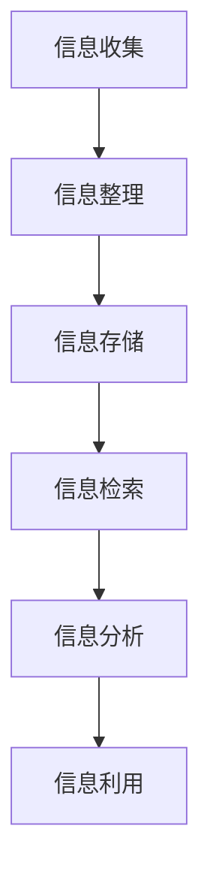

                 

# 《信息过载与知识工作者的生存指南：管理信息、时间和注意力》

> 关键词：信息过载、知识工作者、信息管理、时间管理、注意力管理

摘要：在数字化时代，知识工作者面临着前所未有的信息过载挑战。本文旨在探讨信息管理、时间管理和注意力管理的重要性，并提供具体的策略和实践指南，帮助知识工作者有效应对信息过载，提高工作效率，实现个人成长。

## 第1章 引言

### 1.1 信息过载的挑战

在数字化时代，信息过载已成为知识工作者面临的主要挑战之一。随着互联网的快速发展，信息量的激增使得知识工作者难以有效管理和处理海量信息。据统计，全球每天产生的数据量高达约2.5万亿GB，这些数据中大部分是以文字、图像、音频和视频等多种形式存在的。面对如此庞大的信息量，知识工作者如何筛选、处理和利用信息，成为亟待解决的问题。

### 1.2 知识工作者的生存现状

知识工作者在信息过载的背景下，面临着巨大的压力。一方面，他们需要不断学习新知识、掌握新技术，以适应快速变化的职场环境；另一方面，他们需要在海量信息中找到有价值的信息，以支持工作决策。然而，由于信息过载，许多知识工作者陷入了“信息疲劳”的困境，工作效率低下，甚至出现焦虑和抑郁等心理问题。

### 1.3 本书的结构安排与目的

本书旨在为知识工作者提供一套全面的信息、时间和注意力管理策略，帮助他们有效应对信息过载的挑战。本书分为八个章节，涵盖信息管理、时间管理和注意力管理的核心概念、原则、方法与实践。通过本书的学习，知识工作者将能够：

1. 理解信息过载的概念及其对知识工作的影响。
2. 掌握信息管理的基本原则和流程。
3. 学会信息筛选与处理的技巧。
4. 掌握时间管理的基本原则和方法。
5. 提高注意力管理的能力。
6. 实现个体信息、时间、注意力的整合管理。
7. 学习实际案例，将管理策略应用于实践。

## 第2章 信息管理基础

### 2.1 信息管理的概念

信息管理是指对信息进行收集、整理、存储、检索、分析和利用的过程。其目的是确保信息的高效流通，为决策提供支持。在数字化时代，信息管理的重要性愈发凸显，因为信息已成为知识工作者的重要资源。

### 2.2 信息管理的重要性

1. 提高工作效率：有效的信息管理可以帮助知识工作者快速获取所需信息，减少搜索时间，提高工作效率。
2. 支持决策：信息管理提供了全面、准确的数据支持，有助于知识工作者做出科学、合理的决策。
3. 减少信息冗余：通过信息管理，可以减少冗余信息的存储，降低存储成本。
4. 提高信息安全性：有效的信息管理可以确保信息安全，防止数据泄露和损失。

### 2.3 信息管理的原则

1. 以用户为中心：信息管理应以满足用户需求为核心，提供便捷、高效的信息服务。
2. 整体性原则：信息管理应考虑整个组织的信息需求，实现信息资源的整合与共享。
3. 可靠性原则：信息管理应确保信息的准确性和可靠性，为决策提供可靠依据。
4. 保密性原则：信息管理应采取必要的措施，确保信息的安全性，防止信息泄露。

### 2.4 信息管理的流程

1. 信息收集：通过多种渠道收集信息，如互联网、数据库、专业杂志等。
2. 信息整理：对收集到的信息进行分类、筛选和整理，去除冗余信息。
3. 信息存储：将整理后的信息存储在数据库或文件系统中，便于检索和利用。
4. 信息检索：提供便捷的信息检索服务，支持用户快速找到所需信息。
5. 信息分析：对信息进行分析和挖掘，提取有价值的信息，为决策提供支持。
6. 信息利用：将信息应用于实际工作，提高工作效率和决策质量。

### 2.5 信息分类与标签系统

为了提高信息检索的效率，需要对信息进行分类和标注。以下是一种常见的信息分类与标签系统：

1. 分类体系：建立一套科学、系统的分类体系，将信息分为不同的类别，如技术、管理、市场等。
2. 标签系统：为每条信息分配标签，如关键词、主题、作者等，便于用户根据标签快速找到相关内容。
3. 分类与标签的关联：将分类和标签进行关联，实现多维度的信息检索。

## 第3章 信息筛选与处理

### 3.1 信息筛选的原则

1. 有用性原则：筛选出对工作和生活有价值的信息。
2. 准确性原则：筛选出真实、可靠的信息。
3. 时效性原则：筛选出最新、最相关的信息。
4. 完整性原则：筛选出完整的信息，避免遗漏关键内容。

### 3.2 信息筛选的工具与技术

1. 搜索引擎：使用搜索引擎，如Google、百度等，快速找到所需信息。
2. 社交媒体：利用社交媒体，如微博、微信等，获取实时、有价值的信息。
3. 信息过滤工具：使用信息过滤工具，如过滤广告、垃圾邮件等。
4. 信息源评估：对信息源进行评估，确保信息来源的可靠性。

### 3.3 信息处理的技巧

1. 摘要写作：对关键信息进行摘要，提取核心观点，便于快速阅读和理解。
2. 信息整合：将来自不同来源的信息进行整合，形成完整的知识体系。
3. 信息可视化：使用图表、图片等方式，将复杂的信息进行可视化处理，提高信息传达效果。
4. 信息存储：将处理后的信息存储在合适的存储位置，便于后续检索和利用。

### 3.4 信息过滤与知识提取

1. 信息过滤：通过过滤技术，去除无关、冗余的信息，提高信息的准确性。
2. 知识提取：从海量信息中提取有价值的信息，形成知识体系，支持决策。

## 第4章 时间管理

### 4.1 时间管理的概念

时间管理是指对时间进行有效规划和利用，以实现个人和组织的目标。时间管理的重要性在于，它能够帮助知识工作者提高工作效率，减少无效时间的浪费，从而实现个人成长和职业发展。

### 4.2 时间管理的重要性

1. 提高工作效率：通过时间管理，知识工作者能够合理安排工作，提高工作效率，缩短项目完成时间。
2. 减少压力：合理的时间管理可以帮助知识工作者避免因工作压力过大而产生的焦虑和抑郁等心理问题。
3. 提升生活质量：通过时间管理，知识工作者可以平衡工作和生活，提高生活质量。
4. 促进职业发展：良好的时间管理能力是职业发展的重要基础，有助于知识工作者在职场中脱颖而出。

### 4.3 时间管理的基本原则

1. 目标导向原则：时间管理应以实现目标为导向，明确个人和组织的目标，确保时间投入产生最大效益。
2. 优先级原则：合理安排任务的优先级，优先完成重要且紧急的任务。
3. 规划原则：提前规划时间，制定合理的工作计划，确保各项工作有序进行。
4. 自律原则：保持自律，养成良好的时间管理习惯，克服拖延症。

### 4.4 时间管理的工具与方法

1. 日历工具：使用日历工具，如Google日历、Outlook等，记录重要事件和任务。
2. 时间块管理：将时间划分为不同的时间块，每个时间块专注于一项任务，提高工作效率。
3. 甘特图：使用甘特图，如Microsoft Project等，可视化项目进度，确保项目按时完成。
4. 时间记录工具：使用时间记录工具，如Toggl等，记录工作时间，分析时间分配情况。

### 4.5 高效工作时间的安排

1. 确定最佳工作时间：根据个人生物钟和工作习惯，确定一天中精力最充沛的时间段，用于完成重要任务。
2. 避免干扰：在工作时，避免打扰和干扰，确保专注。
3. 短暂休息：工作一段时间后，进行短暂休息，缓解疲劳。
4. 灵活调整：根据实际情况，灵活调整工作计划，确保高效完成工作任务。

## 第5章 注意力管理

### 5.1 注意力的概念

注意力是指心理活动指向和集中于特定对象的属性。注意力管理是指通过策略和方法，提高注意力的集中度和稳定性，从而提高工作效率和学习效果。

### 5.2 注意力的管理原则

1. 分散注意力的原则：合理分配注意力，避免过度集中导致疲劳。
2. 维持注意力的原则：保持注意力的稳定性和持久性，避免注意力分散。
3. 提高注意力的原则：通过训练和调整，提高注意力的质量和效能。

### 5.3 注意力分散的原因

1. 干扰因素：环境中的噪音、信息过载、社交媒体等干扰因素会分散注意力。
2. 生物节律：人体生物节律的变化会影响注意力的稳定性。
3. 心理因素：焦虑、压力、无聊等心理因素会导致注意力分散。

### 5.4 提高注意力的方法

1. 环境优化：创造一个安静、舒适的工作环境，减少干扰因素。
2. 生物节律管理：合理安排作息时间，保持良好的生物节律。
3. 心理调适：通过冥想、深呼吸等方法，缓解压力，提高心理素质。
4. 训练方法：通过注意力训练，如专注力训练、记忆训练等，提高注意力的集中度和稳定性。

## 第6章 个体信息、时间、注意力的整合管理

### 6.1 整合管理的概念

整合管理是指将信息管理、时间管理和注意力管理结合起来，形成一套完整的个人管理策略，以提高个人工作效率和学习效果。

### 6.2 整合管理的策略

1. 目标统一：将信息管理、时间管理和注意力管理的目标统一，确保各项工作有序进行。
2. 资源整合：整合信息资源、时间资源和注意力资源，实现资源的高效利用。
3. 方法融合：将信息管理、时间管理和注意力管理的有效方法相结合，形成一套完整的管理策略。

### 6.3 整合管理的实践

1. 制定个人计划：根据个人目标和任务，制定详细的工作计划，合理安排时间和注意力。
2. 跟踪进度：使用工具，如日历、甘特图等，跟踪工作进度，确保任务按时完成。
3. 定期评估：定期评估信息管理、时间管理和注意力管理的效果，调整管理策略。

### 6.4 整合管理的评估与改进

1. 评估指标：设定评估指标，如任务完成率、工作效率、学习效果等，对整合管理进行评估。
2. 数据分析：收集和分析相关数据，找出管理中的问题和不足，为改进提供依据。
3. 改进措施：根据评估结果，制定改进措施，优化整合管理策略。

## 第7章 信息、时间、注意力的管理实践

### 7.1 实践案例分析

以下是一个信息、时间、注意力管理的实践案例分析：

**案例背景**：某公司项目经理张华负责一个跨部门的项目，项目周期为6个月。项目涉及多个团队，任务繁杂，信息量大。

**实践步骤**：

1. 信息管理：张华使用云笔记工具，如Evernote，收集和整理项目相关文档和资料，确保信息的高效流通。
2. 时间管理：张华使用Google日历，制定详细的工作计划，合理安排项目进度，确保任务按时完成。
3. 注意力管理：张华采用番茄工作法，将工作分为25分钟的工作时间和5分钟的休息时间，提高注意力集中度。

**实践效果**：

通过信息、时间、注意力的整合管理，张华成功完成了项目，任务完成率达到100%，项目进度提前完成。

### 7.2 实践策略与技巧

1. 信息管理策略：使用云笔记工具、邮件管理等工具，实现信息的高效收集、整理和存储。
2. 时间管理技巧：使用日历、时间块管理等工具，合理安排工作时间，提高工作效率。
3. 注意力管理技巧：采用番茄工作法、冥想等方法，提高注意力集中度，减少干扰。

### 7.3 实践中常见问题与解决方案

1. **信息过载问题**：解决方案：优化信息筛选与处理，减少冗余信息的接收。
2. **时间管理问题**：解决方案：合理安排工作计划，避免任务堆积。
3. **注意力管理问题**：解决方案：优化工作环境，减少干扰因素。

## 第8章 未来展望

### 8.1 信息、时间、注意力管理的趋势

1. 人工智能：随着人工智能技术的发展，信息、时间和注意力管理将更加智能化，为知识工作者提供个性化、高效的管理方案。
2. 5G和物联网：5G和物联网的普及将加速信息传输速度，提高信息获取和处理的效率。
3. 虚拟现实和增强现实：虚拟现实和增强现实技术将改变知识工作者的工作方式，提高信息、时间和注意力管理的有效性。

### 8.2 新技术对管理的影响

1. 人工智能：人工智能将改变信息筛选、处理和存储的方式，提高信息管理的效率。
2. 5G和物联网：5G和物联网将加速信息传输速度，提高信息获取和处理的效率。
3. 虚拟现实和增强现实：虚拟现实和增强现实技术将改变知识工作者的工作方式，提高信息、时间和注意力管理的有效性。

### 8.3 信息、时间、注意力管理的未来发展方向

1. 智能化：未来的信息、时间和注意力管理将更加智能化，利用大数据和机器学习等技术，为知识工作者提供个性化、高效的管理方案。
2. 综合化：未来的管理将更加综合，涵盖信息、时间、注意力等多个方面，实现全方位的管理。
3. 人性化：未来的管理将更加注重人性化和用户体验，帮助知识工作者提高工作效率，实现个人成长。

## 附录

### A.1 常用工具介绍

1. 云笔记工具：如Evernote、OneNote等，用于收集和整理信息。
2. 日历工具：如Google日历、Outlook等，用于时间管理。
3. 时间记录工具：如Toggl等，用于记录工作时间。
4. 信息过滤工具：如AdBlock、垃圾邮件过滤等，用于减少干扰。

### A.2 参考文献

1. 戴维·艾伦. 《时间管理：如何充分利用24小时》[M]. 北京：电子工业出版社，2015.
2. 赫伯特·西蒙. 《信息过载》[M]. 北京：清华大学出版社，2011.
3. 史蒂芬·平克. 《注意力的心理学》[M]. 北京：中国社会科学出版社，2007.

### A.3 致谢

感谢所有提供宝贵建议和帮助的朋友，特别感谢AI天才研究院的同事们，他们在本文的撰写过程中给予了极大的支持。同时，感谢读者对本文的关注和支持，希望本文能对您在信息、时间和注意力管理方面有所启发。

### 附录 Mermaid 流程图

以下是一个简单的Mermaid流程图，用于展示信息管理的流程：

作者：AI天才研究院/AI Genius Institute & 禅与计算机程序设计艺术 /Zen And The Art of Computer Programming

本文详细探讨了信息过载对知识工作者的影响，并提出了信息管理、时间管理和注意力管理的策略和实践。通过整合管理，知识工作者能够有效应对信息过载，提高工作效率，实现个人成长。未来，随着人工智能、5G和物联网等新技术的发展，信息、时间和注意力管理将变得更加智能化和综合化。希望本文能为读者在数字化时代的信息、时间和注意力管理提供有益的指导。

