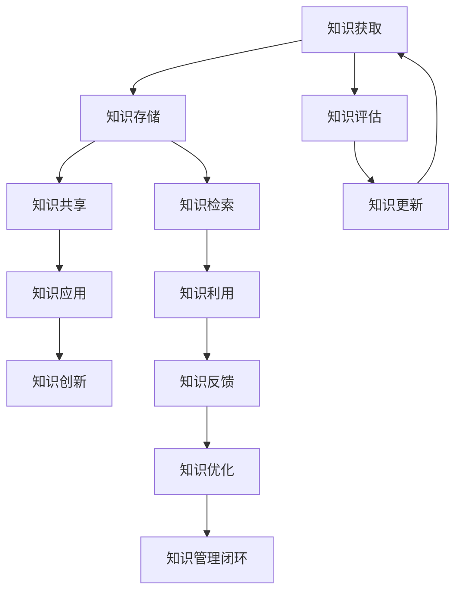

                 

## 文章标题：信息过载与知识管理：如何在复杂的信息环境中做出明智的决定

### 关键词：信息过载、知识管理、决策、信息筛选、知识共享

#### 摘要：

在当今数字化时代，信息过载已成为普遍现象，给个体和组织带来了巨大的挑战。本文深入探讨了信息过载的根源及其负面影响，同时阐述了知识管理的核心概念和模型。通过对知识管理策略与工具的分析，以及实际案例的展示，本文旨在为读者提供一套系统的知识管理方案，帮助他们在复杂的信息环境中做出明智的决策。

### 目录大纲

1. **引言**
   - 1.1 信息过载的挑战与影响
   - 1.2 知识管理的定义与发展
   - 1.3 研究目的与结构安排

2. **第一部分：信息过载与知识管理的背景与核心概念**
   - **第1章：信息过载的挑战与影响**
     - 1.1 信息过载的定义与现状
     - 1.2 信息过载带来的负面影响
     - 1.3 知识管理与信息过载的关系
   - **第2章：知识管理的核心概念与模型**
     - 2.1 知识管理的定义与发展
     - 2.2 知识管理的核心模型
     - 2.3 知识管理在组织中的实施

3. **第二部分：信息过载与知识管理的关系研究**
   - **第3章：信息过载与知识管理的关系研究**
     - 3.1 信息过载对知识管理的影响
     - 3.2 知识管理对信息过载的缓解作用
     - 3.3 信息过载与知识管理的动态平衡

4. **第三部分：知识管理策略与工具**
   - **第4章：知识管理策略概述**
     - 4.1 知识管理策略概述
     - 4.2 知识管理工具与技术
     - 4.3 知识管理工具的选型与实施
   - **第5章：信息过滤与筛选技术**
     - 5.1 信息过滤技术的基本原理
     - 5.2 常见的信息过滤方法
     - 5.3 信息过滤在知识管理中的应用
   - **第6章：信息的可视化与呈现**
     - 6.1 信息的可视化概念与重要性
     - 6.2 常见的可视化工具与方法
     - 6.3 可视化在知识管理中的应用

5. **第四部分：知识共享与协作平台**
   - **第7章：知识共享与协作平台**
     - 7.1 知识共享的定义与价值
     - 7.2 知识共享平台的构建与维护
     - 7.3 知识共享在组织中的实践案例

6. **第五部分：信息过载与知识管理案例分析**
   - **第8章：信息过载与知识管理案例分析**
     - 8.1 案例一：企业知识管理实践
     - 8.2 案例二：政府部门信息过滤与知识管理
     - 8.3 案例三：教育机构信息过载与知识管理

7. **第六部分：信息过载与知识管理的未来发展**
   - **第9章：信息过载与知识管理的未来发展**
     - 9.1 人工智能与知识管理的融合
     - 9.2 大数据在知识管理中的应用
     - 9.3 未来知识管理的发展趋势

8. **附录**
   - **附录A：信息过载与知识管理常用工具与资源**
   - **附录B：知识管理相关的 Mermaid 流程图**
   - **附录C：信息过滤与筛选技术相关的伪代码**
   - **附录D：知识共享与协作平台实施指南**
   - **附录E：信息过载与知识管理相关书籍与论文推荐**

### 引言

在当今信息时代，信息过载已成为一种普遍现象。随着互联网的普及和移动设备的广泛使用，人们每天接收到的信息量呈爆炸性增长。根据麦肯锡全球研究所的报告，人类每天产生的数据量已经达到了 2.5 亿 GB，而且这个数字还在不断增长。这种信息爆炸带来的直接后果就是信息过载，即个体和组织在面对海量信息时，难以有效地筛选和处理这些信息，导致决策效率低下和知识获取困难。

信息过载的负面影响主要体现在以下几个方面：

1. **注意力分散**：面对大量的信息，个体往往会陷入选择困境，无法集中注意力处理最重要的任务。
2. **记忆负担**：大量的信息需要记忆和存储，给大脑带来了巨大的负担，降低了记忆效率和准确性。
3. **决策困难**：信息过载使得个体在做出决策时，难以快速获取关键信息，增加了决策难度和错误率。
4. **工作效率降低**：信息过载导致个体花费大量时间在信息筛选和处理上，降低了工作效率。

为了应对信息过载的挑战，知识管理应运而生。知识管理是指通过特定的方法和技术，对组织内部的知识进行识别、获取、组织、存储、传播和应用，以实现知识价值的最大化。知识管理不仅关注知识的获取和存储，更强调知识的共享和应用，旨在通过优化知识流动，提高组织的决策效率和工作效率。

本文旨在探讨信息过载与知识管理的关系，分析知识管理的核心概念和模型，提出有效的知识管理策略与工具，并通过实际案例展示如何在实际环境中应用这些策略和工具。本文的结构安排如下：

- 第一部分将介绍信息过载的挑战与知识管理的核心概念。
- 第二部分将深入研究信息过载与知识管理的关系，包括信息过载对知识管理的影响和知识管理对信息过载的缓解作用。
- 第三部分将讨论知识管理策略与工具，包括信息过滤与筛选技术、信息的可视化与呈现以及知识共享与协作平台。
- 第四部分将分析信息过载与知识管理的实际案例，展示如何在不同场景中应用知识管理策略。
- 第五部分将探讨信息过载与知识管理的未来发展，包括人工智能和大数据在知识管理中的应用。

通过本文的阅读，读者将能够全面了解信息过载与知识管理的关系，掌握有效的知识管理策略和工具，从而在复杂的信息环境中做出明智的决策。同时，本文也将为未来的研究提供一些有价值的方向和建议。


### 第一部分：信息过载与知识管理的背景与核心概念

#### 第1章：信息过载的挑战与影响

**1.1 信息过载的定义与现状**

信息过载（Information Overload）是指个体在处理信息时，由于信息量过大而难以有效筛选、理解和吸收的现象。在数字化时代，信息过载已经成为一个全球性的问题。根据国际数据公司（IDC）的报告，截至2020年，全球数据总量已经达到了 44ZB（Zettabyte，拍字节），并且预计每年将增长23%。这种数据爆炸式增长导致了信息过载问题的加剧。

信息过载不仅仅是个人层面的困扰，它也深刻影响了组织的管理和运营。在一个典型的企业环境中，员工每天需要处理来自各种渠道的大量信息，包括电子邮件、即时通讯、社交媒体和公司内部系统。根据美国心理学协会（APA）的研究，员工每天平均花费约2.5小时在信息处理上，这极大地降低了工作效率。

**1.2 信息过载带来的负面影响**

信息过载对个体和组织都产生了显著的负面影响，具体表现在以下几个方面：

1. **注意力的分散**：面对大量的信息，个体难以集中注意力处理最重要的任务，导致工作效率下降。
2. **决策困难**：信息过载使得个体在做出决策时难以快速获取关键信息，增加了决策难度和错误率。
3. **记忆负担**：大量的信息需要记忆和存储，给大脑带来了巨大的负担，降低了记忆效率和准确性。
4. **时间浪费**：员工在信息筛选和处理上花费大量时间，导致时间浪费和任务延误。
5. **心理健康问题**：长期的信息过载可能导致焦虑、压力和疲劳等心理健康问题。

**1.3 知识管理与信息过载的关系**

知识管理（Knowledge Management，KM）是一个旨在通过系统化的方法和技术，对组织内的知识进行识别、获取、组织、存储、传播和应用的过程。知识管理旨在最大化知识的价值，提高组织的创新能力、适应能力和竞争力。知识管理对于解决信息过载问题具有重要意义。

1. **信息筛选与过滤**：知识管理通过有效的信息筛选和过滤机制，帮助个体和组织从海量信息中提取出有价值的信息，减少信息过载。
2. **知识的共享与传播**：知识管理强调知识的共享和传播，通过建立知识共享平台和协作机制，促进知识的流动和应用，降低信息过载的影响。
3. **知识的应用与创新**：知识管理不仅关注知识的获取和存储，更强调知识的实际应用和创新，通过知识应用和创新，提高组织对信息的处理能力和决策效率。

总之，知识管理是解决信息过载问题的重要手段。通过实施有效的知识管理策略，个体和组织可以更好地应对信息过载的挑战，提高工作效率和决策质量。

#### 第2章：知识管理的核心概念与模型

**2.1 知识管理的定义与发展**

知识管理（Knowledge Management，KM）是指通过特定的方法和技术，对组织内部的知识进行识别、获取、组织、存储、传播和应用，以实现知识价值的最大化。知识管理的概念最早由美国学者Nonaka和Takeuchi在1995年提出，他们提出了“知识螺旋”模型，强调知识从隐性到显性，再从显性到隐性转化的循环过程。

知识管理的发展可以分为以下几个阶段：

1. **知识获取阶段**：这一阶段主要关注如何获取内外部的知识资源，包括文献资料、行业报告和专家咨询等。
2. **知识共享阶段**：随着知识获取的推进，知识共享逐渐成为知识管理的重要目标。通过建立共享机制和平台，促进知识的流动和交流。
3. **知识应用与创新阶段**：知识管理的核心目标是将知识应用于实际工作中，推动创新和提升组织竞争力。
4. **知识战略阶段**：在这一阶段，知识管理被提升到组织战略层面，成为提升核心竞争力的重要手段。

**2.2 知识管理的核心模型**

知识管理领域有许多核心模型，以下是其中两个重要的模型：

1. **SECI模型**：SECI模型是由Nonaka和Takeuchi提出的，代表了知识转化的四种基本过程，即社会化（Socialization）、外化（Externalization）、整合（Combination）和内化（Internalization）。

   - **社会化**：通过共享经验，将隐性知识转化为显性知识。
   - **外化**：通过讨论和交流，将隐性知识转化为显性知识。
   - **整合**：通过整合和综合，将不同的显性知识转化为新的显性知识。
   - **内化**：通过实践和学习，将显性知识转化为隐性知识。

   以下是SECI模型的Mermaid流程图：

   ```mermaid
   graph TD
       A[社会化] --> B[外化]
       B --> C[整合]
       C --> D[内化]
   ```

2. **知识管理框架模型**：知识管理框架模型是一个综合性的模型，它包括了知识管理的主要组件和过程。这个模型通常包括以下部分：

   - **知识源**：包括内部和外部知识源，如员工经验、文献资料和数据库等。
   - **知识获取**：通过调查、研究、学习等方式获取知识。
   - **知识存储**：建立知识库，存储和管理知识。
   - **知识共享**：通过会议、工作坊、电子平台等方式共享知识。
   - **知识应用**：将知识应用于实际工作中，提高效率和创新能力。
   - **知识创新**：通过知识整合和创造，推动新知识的生成。

   以下是知识管理框架模型的Mermaid流程图：

   ```mermaid
   graph TD
       A[知识源] --> B[知识获取]
       B --> C[知识存储]
       C --> D[知识共享]
       D --> E[知识应用]
       E --> F[知识创新]
   ```

**2.3 知识管理在组织中的实施**

知识管理在组织中的实施是一个复杂的过程，通常包括以下几个步骤：

1. **需求分析**：确定组织在知识管理方面的需求和目标，包括知识获取、共享和应用的需求。
2. **资源规划**：包括人员、技术、资金等方面的规划，确保知识管理项目的顺利实施。
3. **知识获取**：通过多种渠道获取所需的内部和外部知识，如员工经验、行业报告和外部咨询等。
4. **知识存储**：建立知识库，采用适当的技术和工具存储和管理知识，确保知识的可访问性和可维护性。
5. **知识共享**：制定共享机制和平台，促进知识的流动和交流，提高知识的利用效率。
6. **知识应用**：通过培训、指导和支持，推动知识的实际应用，提高组织的工作效率和创新能力。
7. **持续改进**：通过反馈和评估，不断优化知识管理的流程和效果，确保知识管理能够持续地为组织带来价值。

知识管理在组织中的实施不仅需要技术的支持，更需要文化的培育和机制的保障。通过有效的知识管理，组织可以更好地应对信息过载的挑战，提高决策效率和创新能力。

### 第二部分：信息过载与知识管理的关系研究

#### 第3章：信息过载与知识管理的关系研究

**3.1 信息过载对知识管理的影响**

信息过载对知识管理产生了深远的影响，这种影响主要体现在以下几个方面：

1. **知识获取的难度增加**：信息过载导致大量无价值或低价值的信息充斥在知识获取的过程中，使得个体和组织在筛选有价值信息时面临巨大的挑战。这增加了知识获取的时间和成本，降低了知识获取的效率。

2. **知识存储的负担加重**：随着信息量的增加，知识库中的信息也越来越多，如何有效地管理和存储这些信息成为知识管理的一个重要问题。过量的信息不仅增加了存储空间的占用，还增加了信息检索和更新的难度。

3. **知识共享的障碍增加**：信息过载使得个体难以从海量信息中提取出有价值的信息，导致知识共享的障碍增加。个体在面对大量的信息时，难以快速找到所需的信息，影响了知识共享的效果。

4. **知识应用的困难增加**：信息过载导致个体在应用知识时面临选择困难，难以从大量的信息中找到合适的解决方案。这增加了知识应用的难度，影响了知识对实际工作价值的实现。

**3.2 知识管理对信息过载的缓解作用**

知识管理通过一系列策略和工具，有效地缓解了信息过载带来的负面影响。以下是一些具体的缓解措施：

1. **信息筛选与过滤**：知识管理通过引入信息筛选和过滤技术，帮助个体和组织从海量信息中提取出有价值的信息。这些技术包括关键词搜索、语义分析、推荐系统等，通过提高信息筛选的效率，降低了信息过载的影响。

2. **知识共享与协作**：知识管理强调知识的共享和协作，通过建立知识共享平台和协作机制，促进知识的流动和应用。这些平台和机制包括企业内部网、社交媒体、知识库等，通过提高知识的可访问性和利用率，降低了信息过载的负面影响。

3. **知识的组织与分类**：知识管理通过引入分类和标签化技术，对知识进行有效的组织和管理。这些技术有助于个体快速找到所需的信息，提高了信息检索的效率，降低了信息过载的影响。

4. **知识的可视化与呈现**：知识管理通过引入可视化技术，将复杂的信息以直观的方式呈现出来。这些技术包括图表、图形、地图等，通过提高信息的可理解性，降低了个体在处理信息时的认知负担，缓解了信息过载的影响。

**3.3 信息过载与知识管理的动态平衡**

信息过载与知识管理之间存在一种动态平衡关系。信息过载是知识管理的挑战，而知识管理是解决信息过载问题的重要手段。这种动态平衡关系体现在以下几个方面：

1. **信息量与知识量的平衡**：随着信息量的增加，知识管理通过有效的筛选、共享和应用，保持知识的质量和价值。通过优化信息流，知识管理实现了信息量与知识量的平衡。

2. **信息处理能力与知识管理能力的平衡**：个体和组织在处理信息时，知识管理提供了有效的工具和方法，帮助个体提高信息处理能力。通过不断的知识积累和应用，知识管理提高了组织的信息处理能力。

3. **信息利用效率与知识价值的平衡**：知识管理通过提高信息的利用效率，实现了信息价值的最大化。在信息过载的情况下，知识管理通过有效的信息筛选和应用，提高了知识的价值。

总之，信息过载与知识管理之间存在一种动态平衡关系。通过有效的知识管理，个体和组织可以更好地应对信息过载的挑战，实现信息与知识的平衡和发展。

### 第三部分：知识管理策略与工具

#### 第4章：知识管理策略概述

知识管理策略是指为解决信息过载和知识获取、共享、应用等方面的问题，采取的一系列方法、技术和措施。有效的知识管理策略能够提高组织的知识利用效率，促进创新和发展。以下是一些常见的知识管理策略：

**4.1 策略一：建立知识共享平台**

知识共享平台是知识管理的重要基础设施，通过提供集中的知识存储、检索和交流功能，促进知识的共享和传播。常见的知识共享平台包括企业内部网、社交媒体、知识库等。

**4.2 策略二：推行知识编码与标准化**

知识编码是指将隐性知识转化为显性知识，通过文档、教程、视频等形式进行标准化。标准化有助于知识的传播和应用，提高知识的可维护性和可访问性。

**4.3 策略三：实施知识培训与教育**

知识培训和教育是知识管理的重要组成部分，通过培训员工的知识技能，提高他们的知识获取、共享和应用能力。教育有助于培养知识型员工，提高组织的知识储备。

**4.4 策略四：建立知识激励机制**

知识激励机制是指通过奖励机制鼓励员工分享知识，提高知识的共享积极性。激励机制可以包括奖金、晋升、荣誉称号等形式，通过激励措施激发员工的知识分享意愿。

**4.5 策略五：加强知识管理文化建设**

知识管理文化是指组织内部对知识管理的认识和价值观。通过加强知识管理文化建设，培育知识共享、合作和创新的组织氛围，提高知识管理的实施效果。

#### 第5章：知识管理工具与技术

知识管理工具和技术是实现知识管理策略的重要手段。以下是一些常见的知识管理工具和技术：

**5.1 知识库**

知识库是存储和管理知识的系统，通过结构化的方式组织知识，提高知识的可检索性和利用率。知识库可以包括文档库、图片库、视频库等，支持多维度知识存储。

**5.2 知识地图**

知识地图是一种可视化工具，用于展示组织内部的知识结构和关联关系。知识地图可以帮助员工快速找到所需的知识，提高知识的利用效率。

**5.3 语义分析**

语义分析是一种通过理解文本内容的技术，用于提取关键词、主题和关系。语义分析可以帮助知识管理系统能够更准确地匹配和检索知识，提高知识管理的智能化水平。

**5.4 社交网络分析**

社交网络分析是一种通过分析社交网络数据，了解知识流动和协作关系的工具。社交网络分析可以帮助组织识别知识的关键节点和核心团队，优化知识共享和协作。

**5.5 大数据技术**

大数据技术是处理海量数据的工具，包括数据采集、存储、处理和分析等。大数据技术可以帮助知识管理系统处理和分析海量知识数据，提高知识的挖掘和应用能力。

**5.6 人工智能**

人工智能（AI）技术，如机器学习、自然语言处理和智能推荐，可以用于知识管理系统的自动化和智能化。人工智能可以帮助知识管理系统更准确地筛选和推荐知识，提高知识的利用效率。

#### 第6章：知识管理工具的选型与实施

选择和实施知识管理工具是知识管理策略成功的关键。以下是一些选型与实施的指导原则：

**6.1 选型原则**

1. **需求导向**：根据组织的具体需求选择合适的工具，确保工具能够满足知识管理的目标。
2. **技术成熟度**：选择成熟稳定的技术和工具，降低实施风险。
3. **兼容性**：确保工具与现有的IT系统和应用兼容，避免技术壁垒。
4. **可扩展性**：选择具备可扩展性的工具，以适应未来业务的发展需求。
5. **用户友好性**：选择用户界面友好、易于操作的工具，提高员工的接受度和使用率。

**6.2 实施步骤**

1. **需求分析**：明确知识管理的具体需求和目标，包括知识获取、共享、应用等方面。
2. **方案设计**：根据需求分析结果，设计知识管理系统的整体架构和功能模块。
3. **工具选型**：根据方案设计，选择合适的知识管理工具和技术。
4. **实施计划**：制定详细的实施计划，包括时间表、任务分配和资源规划。
5. **系统集成**：将知识管理系统与现有的IT系统进行集成，确保数据的互通和共享。
6. **用户培训**：对员工进行知识管理工具的使用培训，提高他们的操作技能和知识管理水平。
7. **试运行与优化**：在试运行阶段，收集用户反馈，不断优化系统功能和用户体验。
8. **持续改进**：通过定期评估和改进，确保知识管理系统能够持续地为组织带来价值。

通过有效的知识管理工具选型和实施，组织可以更好地应对信息过载的挑战，提高知识的获取、共享和应用效率，实现知识管理的目标。

### 第四部分：信息过滤与筛选技术

#### 第5章：信息过滤与筛选技术

信息过滤与筛选技术是知识管理的重要组成部分，旨在从海量信息中提取出有价值的信息，帮助个体和组织减少信息过载，提高信息处理的效率。以下将详细探讨信息过滤与筛选技术的基本原理、常见方法以及它们在知识管理中的应用。

**5.1 信息过滤技术的基本原理**

信息过滤技术是一种通过特定算法和策略，从大量数据中筛选出用户感兴趣的信息的方法。其基本原理包括以下几个方面：

1. **基于规则的方法**：这种方法通过预先定义的规则或模式来筛选信息。规则可以是简单的关键词匹配，也可以是复杂的逻辑表达式。基于规则的方法具有实现简单、易于理解和快速处理的特点。

2. **基于统计的方法**：这种方法通过分析信息内容的统计特性，如词频、词向量等，来判断信息的价值。基于统计的方法可以处理大量的数据，且能够自动适应信息的动态变化。

3. **基于机器学习的方法**：这种方法利用机器学习算法，如决策树、贝叶斯分类、支持向量机等，从历史数据中学习信息筛选的规律，并应用于新数据的筛选。基于机器学习的方法具有较好的自适应性和泛化能力。

4. **基于用户行为的方法**：这种方法通过分析用户的行为数据，如点击记录、搜索历史等，来预测用户的兴趣和需求，从而筛选出符合用户兴趣的信息。基于用户行为的方法可以提供个性化的信息筛选服务。

**5.2 常见的信息过滤方法**

以下是几种常见的信息过滤方法：

1. **关键词过滤**：这是最简单也是最常用的信息过滤方法，通过设置关键词列表，筛选出包含这些关键词的信息。关键词过滤的缺点是容易漏掉重要信息，且对同义词和变体词的处理能力有限。

2. **过滤网**（Filter Bubble）：过滤网是一种根据用户的偏好和历史行为，自动筛选信息的方法。这种方法虽然能够提供个性化的信息，但可能会导致用户陷入信息茧房，无法接触到多样化的信息。

3. **协同过滤**：协同过滤通过分析用户之间的相似性，推荐用户可能感兴趣的信息。协同过滤分为基于用户的协同过滤和基于物品的协同过滤。基于用户的协同过滤推荐与目标用户兴趣相似的其他用户的偏好信息，而基于物品的协同过滤则推荐与目标用户过去喜欢的物品相似的物品。

4. **内容分析**：内容分析是一种通过分析信息内容的语义和结构，来判断信息的价值和相关性。这种方法通常结合自然语言处理技术，如词频分析、主题模型、情感分析等。

**5.3 信息过滤在知识管理中的应用**

信息过滤技术在知识管理中具有广泛的应用，以下是一些具体的应用场景：

1. **知识获取**：在知识获取过程中，信息过滤技术可以帮助个体和组织从大量的信息源中筛选出有价值的信息，提高知识获取的效率。

2. **知识共享**：在知识共享平台上，信息过滤技术可以帮助用户快速找到所需的知识，提高知识共享的效果。例如，通过关键词过滤和内容分析，用户可以找到相关的文档、教程和案例。

3. **知识应用**：在知识应用过程中，信息过滤技术可以帮助用户从大量的知识资源中提取出与当前任务相关的知识，提高知识应用的效果。

4. **知识推荐**：通过协同过滤和内容分析，知识管理系统可以推荐用户可能感兴趣的知识，促进知识的传播和应用。

总之，信息过滤与筛选技术是知识管理中不可或缺的一部分，通过有效的信息过滤，个体和组织可以更好地应对信息过载的挑战，提高知识的获取、共享和应用效率。在未来的知识管理实践中，信息过滤技术将继续发挥重要的作用，推动知识管理的不断创新和发展。

### 第五部分：信息的可视化与呈现

#### 第6章：信息的可视化与呈现

信息的可视化与呈现是知识管理中的重要环节，通过将复杂的信息转化为直观的图形或图表，有助于用户更好地理解信息和发现信息中的模式与趋势。以下将介绍信息的可视化概念与重要性、常见的可视化工具与方法以及可视化在知识管理中的应用。

**6.1 信息的可视化概念与重要性**

信息的可视化（Information Visualization）是指通过图形、图像、图表等视觉元素，将数据和信息以直观、易于理解的方式呈现出来的过程。其核心目标是提高信息的可理解性和可访问性，帮助用户从复杂的信息中发现隐藏的模式、趋势和关联。

信息可视化的重要性体现在以下几个方面：

1. **提高信息的可理解性**：通过将数据和信息以视觉化的方式呈现，用户可以更直观地理解信息的含义和关系，减少信息过载带来的认知负担。

2. **发现隐藏的模式和趋势**：信息可视化可以帮助用户从大量数据中发现潜在的规律和模式，这些模式可能通过传统的文本分析难以发现。

3. **增强决策支持**：通过可视化的方式呈现信息，决策者可以更清晰地了解问题的本质，从而做出更明智的决策。

4. **促进知识共享与协作**：可视化信息易于共享和传播，有助于促进组织内部的知识共享与协作。

**6.2 常见的可视化工具与方法**

以下是几种常见的可视化工具与方法：

1. **条形图**（Bar Chart）：条形图是一种常用的数据展示方式，用于比较不同类别的数据大小。它通过长短不同的条形来表示各类别的数据值。

2. **折线图**（Line Chart）：折线图通过连接数据点的线条来展示数据的变化趋势。它适用于展示时间序列数据。

3. **饼图**（Pie Chart）：饼图通过将数据分成不同的扇形区域来表示各类别的占比。它适用于展示比例或百分比数据。

4. **散点图**（Scatter Plot）：散点图通过在坐标系中标记数据点来展示两个变量之间的关系。它适用于探索变量之间的相关性。

5. **热力图**（Heat Map）：热力图通过使用不同颜色深浅来表示数据值的密集程度，适用于展示多维度数据的分布和关联。

6. **词云**（Word Cloud）：词云通过使用字体大小来表示词频，将文本数据以视觉化的形式呈现，有助于识别文本中的高频词汇。

7. **网络图**（Network Graph）：网络图通过节点和边来展示对象之间的关系，适用于探索复杂系统的结构。

**6.3 可视化在知识管理中的应用**

1. **知识地图**：知识地图是一种利用图形化方式展示知识结构、关联和流动的工具。通过知识地图，用户可以直观地了解组织的知识体系，快速找到所需的知识。

2. **项目进度图**：项目进度图通过可视化项目的时间线和关键节点，帮助项目经理和团队成员了解项目的进展情况，确保项目按时完成。

3. **报告与仪表盘**：在知识管理系统中，报告和仪表盘采用可视化技术展示关键绩效指标（KPI）、统计分析和用户行为数据，帮助管理人员实时监控业务状况。

4. **决策支持系统**：决策支持系统利用可视化技术，将复杂的数据分析结果以直观的方式呈现给决策者，帮助他们快速做出明智的决策。

5. **培训与教育**：通过可视化的方式呈现培训材料，如流程图、动画和交互式图表，可以提高培训的吸引力和效果。

总之，信息的可视化与呈现是知识管理中不可或缺的一环。通过有效的可视化，用户可以更好地理解和利用信息，提高知识管理的效率和质量。

### 第六部分：知识共享与协作平台

#### 第7章：知识共享与协作平台

知识共享与协作平台是现代组织实现知识管理目标的关键工具。通过这些平台，组织可以促进知识的流动、共享和应用，从而提高工作效率和创新能力。以下将探讨知识共享的定义与价值、知识共享平台的构建与维护，以及知识共享在组织中的实践案例。

**7.1 知识共享的定义与价值**

知识共享（Knowledge Sharing）是指个体或团队将知识传递给他人，使其能够在新的环境中应用和发展的过程。知识共享不仅包括显性知识的传递，如文档、报告、数据库等，还包括隐性知识的交流，如经验、技能和最佳实践等。

知识共享的价值体现在以下几个方面：

1. **提高工作效率**：通过知识共享，员工可以更快地获取所需的信息和知识，避免重复劳动，提高工作效率。

2. **促进创新**：知识共享促进了不同部门和团队之间的合作与交流，激发了新的想法和创新的火花。

3. **增强团队协作**：知识共享平台为团队成员提供了一个交流和协作的空间，增强了团队凝聚力和协作效率。

4. **提升组织竞争力**：通过知识共享，组织可以更好地利用内部资源，提高知识利用率和创新能力，从而增强竞争力。

**7.2 知识共享平台的构建与维护**

构建和维护一个有效的知识共享平台需要遵循以下原则和步骤：

1. **明确目标与需求**：在构建知识共享平台前，需要明确平台的目标和需求，包括知识获取、存储、共享和应用等方面。

2. **选择合适的平台**：根据组织的规模、需求和资源，选择合适的知识共享平台。常见的平台包括企业内部网、知识库、社交媒体、协作工具等。

3. **设计平台架构**：设计平台的技术架构，包括数据库、存储、安全、用户界面等方面，确保平台的稳定性和可扩展性。

4. **制定共享规则与流程**：制定知识共享的规则和流程，包括知识分类、标签化、权限管理等，确保知识共享的有序进行。

5. **培训与推广**：对员工进行知识共享平台的培训，提高他们的使用意愿和技能。同时，通过宣传和激励措施，推广知识共享文化。

6. **持续维护与优化**：定期对平台进行维护和优化，包括更新知识库、改进用户界面、提升性能等，确保平台能够持续满足组织的知识管理需求。

**7.3 知识共享在组织中的实践案例**

以下是几个知识共享在组织中的成功实践案例：

1. **案例一：某大型企业的知识共享平台**

某大型企业通过构建内部知识共享平台，实现了知识的系统化管理和共享。平台包括文档库、论坛、培训模块等功能，员工可以上传文档、参与讨论、参加在线培训。通过平台的推广，企业的知识利用率显著提高，员工的工作效率也得到了提升。

2. **案例二：某研发团队的协作平台**

某研发团队采用协作工具，实现了团队成员之间的实时沟通和知识共享。团队成员可以通过平台共享代码、文档、讨论项目进展，以及进行远程协作。这种协作模式极大地提高了团队的效率和创新能力。

3. **案例三：某教育培训机构的在线学习平台**

某教育培训机构通过在线学习平台，为学生提供了丰富的学习资源和互动交流空间。学生可以通过平台观看课程视频、参与讨论、完成作业，并得到教师的专业指导。这种知识共享模式不仅提高了学生的学习效果，也促进了教师之间的交流与合作。

总之，知识共享与协作平台在组织中的应用，有助于实现知识的最大化价值，提高组织的工作效率和创新能力。通过有效的知识共享平台，组织可以更好地应对信息过载的挑战，实现持续发展和竞争优势。

### 第七部分：信息过载与知识管理案例分析

#### 第8章：信息过载与知识管理案例分析

信息过载和知识管理在现实世界中的应用广泛，不同的组织在面对信息过载时采取了不同的策略和工具，以实现有效的知识管理和决策。以下将介绍三个具体的案例，包括企业知识管理实践、政府部门信息过滤与知识管理以及教育机构信息过载与知识管理。

**8.1 案例一：企业知识管理实践**

某国际知名企业在其知识管理实践中，采用了多种策略和工具来应对信息过载问题。首先，企业建立了全面的内部知识库，包括文档库、视频库和案例库，员工可以在其中方便地获取所需的信息。其次，企业引入了信息过滤与筛选技术，通过关键词搜索、语义分析和推荐系统，帮助员工快速找到相关的知识资源。此外，企业还推行了知识共享与协作平台，鼓励员工在平台上分享经验和最佳实践，提高知识的传播和利用率。

在知识管理的具体实施中，企业采取了以下步骤：

1. **需求分析**：通过问卷调查和访谈，了解员工在知识获取、共享和应用方面的需求和痛点。

2. **平台设计**：根据需求分析结果，设计知识共享平台的功能模块和用户界面，确保平台的易用性和高效性。

3. **系统集成**：将知识共享平台与现有的IT系统，如电子邮件、即时通讯和CRM系统等进行集成，确保数据的互通和共享。

4. **用户培训**：对员工进行平台使用培训，提高他们的知识管理水平。

5. **持续改进**：通过定期评估和用户反馈，不断优化平台的功能和用户体验。

通过这些措施，企业的知识管理项目取得了显著成效。员工在知识获取和共享方面的效率大幅提高，信息过载问题得到了有效缓解，企业的创新能力和竞争力也得到了增强。

**8.2 案例二：政府部门信息过滤与知识管理**

某市政府部门在面对日益增长的信息量和信息过载问题时，采用了信息过滤与知识管理策略，以提高信息处理效率和决策质量。首先，政府部门建立了信息过滤系统，通过关键词匹配、语义分析和数据挖掘技术，从大量的信息源中筛选出对决策有用的信息。其次，政府部门构建了知识管理系统，通过分类、标签化和可视化技术，对筛选出的信息进行整理和管理，确保信息的高效利用。

在具体实施中，政府部门采取了以下步骤：

1. **信息源整合**：整合来自不同部门、不同渠道的信息源，建立统一的信息收集和处理平台。

2. **信息过滤**：通过自动化的信息过滤系统，对海量信息进行筛选，提取出对决策有价值的信息。

3. **知识库构建**：建立知识库，对筛选出的信息进行分类、标签化存储，确保信息的可检索性和可访问性。

4. **知识共享**：通过内部网和协作平台，促进知识的共享和传播，提高信息利用效率。

5. **用户培训**：对政府部门的工作人员进行知识管理培训，提高他们的信息处理和知识应用能力。

通过这些措施，政府部门在应对信息过载和知识管理方面取得了显著成效。信息处理效率显著提高，决策质量得到保障，政府的服务水平也得到了提升。

**8.3 案例三：教育机构信息过载与知识管理**

某知名大学在数字化教学环境中面临着信息过载的挑战，为了提高教学效果和学生的学习体验，学校采取了知识管理策略。首先，学校建立了课程知识库，收集和整理各种教学资源，包括教材、课件、视频和实验报告等。其次，学校引入了信息过滤技术，通过关键词搜索和语义分析，帮助学生快速找到与课程相关的学习资料。此外，学校还推行了在线学习社区，鼓励学生之间进行知识共享和协作学习。

在教育机构中，知识管理的具体实施步骤如下：

1. **课程知识库构建**：收集和整理各门课程的教学资源，建立课程知识库，确保资源的系统化和规范化。

2. **信息过滤**：通过信息过滤技术，帮助学生快速找到相关的学习资料，减少信息筛选的时间。

3. **在线学习社区**：建立在线学习社区，提供交流和协作平台，鼓励学生之间的知识共享和互动。

4. **用户培训**：对学生进行信息过滤和知识管理培训，提高他们的信息获取和知识应用能力。

5. **持续改进**：通过定期评估和用户反馈，不断优化知识管理系统的功能和用户体验。

通过这些措施，学校在应对信息过载和知识管理方面取得了显著成效。学生的学习效果得到提升，教师的教学效率也得到提高，学校的教育质量得到了保障。

总之，通过上述案例分析可以看出，信息过载与知识管理在实际应用中具有重要的价值和意义。不同组织通过采取有效的知识管理策略和工具，成功应对了信息过载的挑战，提高了工作效率和决策质量，实现了组织的持续发展。未来，随着信息技术的发展，知识管理将继续发挥重要作用，为组织创造更大的价值。

### 第八部分：信息过载与知识管理的未来发展

#### 第9章：信息过载与知识管理的未来发展

在数字化和全球化的大背景下，信息过载与知识管理将继续成为组织和个人面临的重要挑战。未来的知识管理将受到人工智能、大数据和云计算等新兴技术的深刻影响，这些技术的应用将为知识管理带来新的机遇和挑战。

**9.1 人工智能与知识管理的融合**

人工智能（AI）技术的迅猛发展，为知识管理提供了强大的支持。未来，人工智能将在以下几个方面对知识管理产生影响：

1. **自动化知识获取**：通过自然语言处理（NLP）和机器学习技术，AI可以自动化地从各种渠道获取知识，如网页、文献、报告等，大大提高知识获取的效率。

2. **智能化信息过滤**：AI可以通过深度学习和模式识别技术，自动识别和筛选用户感兴趣的信息，减少信息过载，提高信息处理的精准度。

3. **知识图谱构建**：AI技术可以构建知识图谱，将分散的知识点和关系进行关联和整合，形成系统化的知识体系，提高知识的可访问性和利用效率。

4. **智能推荐**：基于用户的行为数据和偏好，AI可以提供个性化的知识推荐，帮助用户快速找到所需的知识，提高知识的应用效果。

**9.2 大数据在知识管理中的应用**

大数据技术为知识管理提供了海量的数据资源，通过大数据分析，组织可以更深入地了解知识的分布、流动和利用情况。未来，大数据在知识管理中的应用将体现在以下几个方面：

1. **知识洞察**：通过大数据分析，组织可以挖掘出知识中的潜在价值，发现知识的关联和趋势，为决策提供数据支持。

2. **知识预测**：基于历史数据和知识模型，大数据分析可以预测未来的知识需求和发展趋势，帮助组织进行前瞻性的知识规划和准备。

3. **知识质量评估**：通过大数据分析，可以评估知识的质量和可靠性，识别知识中的问题和缺陷，提高知识的可信度和应用价值。

4. **知识共享优化**：通过分析知识共享行为数据，组织可以优化知识共享的机制和流程，提高知识共享的效率和效果。

**9.3 未来知识管理的发展趋势**

未来的知识管理将朝着更加智能化、系统化和协作化的方向发展，具体趋势包括：

1. **知识一体化**：未来的知识管理将更加注重知识的整合和一体化，通过构建统一的知识平台，实现知识在不同系统和部门之间的无缝连接和共享。

2. **知识社会化**：知识管理将更加注重知识的共享和传播，通过促进知识的社会化，提高知识的流动和应用效率。

3. **知识智能化**：随着人工智能技术的应用，知识管理将更加智能化，通过自动化和智能化的手段，实现知识的获取、筛选、共享和应用。

4. **知识个性化**：未来的知识管理将更加注重个性化，通过分析用户的行为数据和偏好，提供个性化的知识推荐和定制化服务。

5. **知识生态化**：知识管理将逐渐形成生态化的知识网络，通过跨组织、跨领域的知识共享与合作，实现知识的生态化和全球化。

总之，未来的知识管理将受到人工智能、大数据和云计算等新兴技术的深刻影响，这些技术将为知识管理带来新的机遇和挑战。通过有效利用这些技术，组织可以更好地应对信息过载的挑战，实现知识的高效管理和应用，推动组织的持续发展和创新。

### 附录

#### 附录A：信息过载与知识管理常用工具与资源

在信息过载与知识管理的实践中，选择合适的工具和资源对于提升工作效率和决策质量至关重要。以下列举了一些常用的工具和资源，以帮助读者更好地理解和应用相关知识。

**1. 知识共享与协作平台**

- **Slack**：一款流行的即时通讯工具，支持团队协作和文件共享。
- **Microsoft Teams**：微软推出的团队协作工具，集成了聊天、会议、文档共享等功能。
- **Confluence**：一款用于团队协作和知识共享的软件，支持创建、编辑和共享文档。
- **Trello**：一款直观的看板工具，用于任务管理和项目管理。

**2. 信息过滤与筛选工具**

- **Google Alerts**：谷歌提供的一个信息订阅服务，用于监控特定关键词的互联网内容。
- **Feedly**：一款内容聚合工具，可以将多个博客和新闻源的更新集中在一个界面中。
- **IFTTT**：一款自动化服务，可以将不同应用和平台连接起来，实现信息自动过滤和推送。

**3. 知识管理工具**

- **Evernote**：一款强大的笔记和组织工具，支持跨平台同步和共享。
- **Notion**：一款多功能的信息管理工具，可以用于笔记、项目管理、数据库等。
- **Sourcetree**：一款版本控制工具，适用于团队协作和知识共享。

**4. 可视化工具**

- **Tableau**：一款流行的数据可视化工具，支持多种图表和报表的创建。
- **D3.js**：一款基于JavaScript的可视化库，用于创建交互式的数据可视化。
- **Power BI**：微软推出的商业智能工具，支持数据连接、数据可视化和报告生成。

**5. 教育与培训资源**

- **Coursera**：一个在线学习平台，提供各种课程和专项课程。
- **edX**：由哈佛大学和麻省理工学院联合推出的在线学习平台。
- **Udemy**：一个在线学习平台，提供广泛的课程和学习路径。

**6. 学术期刊与论文库**

- **IEEE Xplore**：IEEE出版的期刊、会议论文和标准数据库。
- **Google Scholar**：一个广泛使用的学术搜索引擎，提供学术文章、论文和引用。
- **PubMed**：由美国国立卫生研究院（NIH）提供的一个生物医学文献数据库。

**7. 专业论坛与社区**

- **Stack Overflow**：一个面向程序员的问答社区，提供编程问题和解决方案。
- **LinkedIn**：一个职业社交平台，可以寻找行业专家和交流知识。
- **Quora**：一个知识问答社区，用户可以提问和回答问题。

通过利用这些工具和资源，读者可以更好地应对信息过载的挑战，实现有效的知识管理和决策。

### 附录B：知识管理相关的 Mermaid 流程图

在知识管理中，流程图是一种非常有用的工具，它可以帮助我们清晰地展示知识管理的过程和各个环节之间的逻辑关系。以下是一个知识管理流程图的示例，使用Mermaid语言进行描述：



这个流程图展示了知识管理的主要环节，包括知识获取、知识存储、知识共享、知识应用、知识创新、知识评估、知识更新、知识检索、知识利用、知识反馈和知识优化。每个环节都是相互关联的，形成一个闭环，确保知识的连续性和可持续性。

### 附录C：信息过滤与筛选技术相关的伪代码

在信息过滤与筛选技术中，伪代码是一种用于描述算法逻辑的简单工具。以下是一个简单的信息过滤算法的伪代码示例，用于从大量文本数据中提取出特定关键词的相关信息：

```plaintext
算法：信息过滤

输入：文本数据，关键词列表
输出：过滤后的文本数据

步骤：

1. 初始化一个空列表 filtered_texts
2. 遍历文本数据中的每个文本
    a. 对文本进行预处理（如分词、去停用词等）
    b. 检查文本是否包含关键词列表中的任意一个关键词
        i. 如果是，将文本添加到 filtered_texts 列表中
3. 返回 filtered_texts
```

这个伪代码提供了一个基本的框架，用于从文本数据中提取包含特定关键词的文本。在实际应用中，可以根据具体需求进行扩展和优化。

### 附录D：知识共享与协作平台实施指南

**1. 确定平台需求与目标**

在实施知识共享与协作平台之前，首先要明确平台的需求和目标。这包括确定平台要解决的具体问题、期望实现的功能和预期的效果。例如，平台的目标可能是提高团队成员之间的协作效率、促进知识共享或者优化项目管理流程。

**2. 选择合适的平台**

根据需求和目标，选择一个适合的组织内部知识共享与协作平台。常见的平台包括Confluence、SharePoint、Trello、Slack等。选择平台时需要考虑以下因素：

- 功能：平台是否具备所需的功能，如文档管理、任务分配、即时通讯、项目跟踪等。
- 可定制性：平台是否支持自定义功能模块和用户界面。
- 兼容性：平台是否与现有的IT系统兼容。
- 安全性：平台是否具备足够的安全性保障，如数据加密、用户权限管理等。
- 用户友好性：平台的操作是否简单直观，用户是否容易上手。

**3. 设计平台架构**

在确定平台后，设计平台的技术架构，包括服务器配置、数据存储、网络安全等方面。确保平台具备高可用性、可靠性和可扩展性。同时，要考虑平台的集成性，确保能够与现有的IT系统无缝连接。

**4. 制定平台使用规则**

为了确保平台的有效运行，制定一套平台使用规则和指南，包括：

- 用户权限管理：定义不同用户角色的权限和责任。
- 数据上传与共享：规定数据上传的格式、标准和权限。
- 信息保密与安全：明确信息的保密级别和安全措施。
- 使用行为规范：规定用户在平台上的行为准则和违规处理机制。

**5. 培训与推广**

对平台用户进行培训，确保他们能够熟练使用平台的功能。培训内容应包括平台的操作指南、功能介绍和使用技巧等。同时，通过内部宣传和激励措施，提高用户对平台的接受度和使用积极性。

**6. 持续优化与维护**

平台上线后，定期收集用户反馈，分析平台的运行状况和使用效果。根据反馈和数据分析，不断优化平台的功能和用户体验。同时，定期进行平台维护和更新，确保平台的稳定性和安全性。

通过上述实施指南，组织可以有效地构建和运行一个知识共享与协作平台，促进知识的流动和应用，提高组织的协作效率和创新能力。

### 附录E：信息过载与知识管理相关书籍与论文推荐

为了深入理解信息过载与知识管理的理论和实践，以下推荐了一些经典的书籍和重要的学术论文，这些资源对于学术研究和专业实践都具有极高的参考价值。

**书籍推荐**

1. **《智慧工作：信息过载与决策新科学》（Work Smarter, Not Harder: The Science of Productivity and Decision Making in the Information Age）**
   - 作者：David Rock和Jamie Wheal
   - 简介：这本书探讨了如何在工作环境中应对信息过载，通过神经科学的角度提供了实用的策略和方法。

2. **《信息过载：应对信息时代的挑战》（Information Overload: Understanding and Overcoming the Dangers of Too Much Information）**
   - 作者：Dan Gilmor
   - 简介：作者详细分析了信息过载的根源及其负面影响，并提出了具体的解决方案。

3. **《知识管理：理论与方法》（Knowledge Management: Concepts, Techniques and Tools for Success）**
   - 作者：Jack Park
   - 简介：这本书提供了全面的知识管理理论框架，以及具体的方法和技术，是知识管理领域的权威指南。

4. **《知识管理与组织学习》（Knowledge Management and Organizational Learning）**
   - 作者：Dave F. King和Michael Verrochi
   - 简介：本书通过探讨知识管理如何促进组织学习，强调了知识共享和协作在组织发展中的关键作用。

5. **《禅与计算机程序设计艺术》（Zen and the Art of Motorcycle Maintenance）**
   - 作者：Robert M. Pirsig
   - 简介：虽然这本书不是专门讨论知识管理的，但其哲学思想对理解和实践知识管理有着深刻的启示。

**学术论文推荐**

1. **“Knowledge Management and the Learning Organization: Conceptual Foundations and Empirical Evidence”**
   - 作者：Ikujiro Nonaka和Hirotaka Takeuchi
   - 期刊：Long Range Planning
   - 简介：这篇文章提出了知识管理和学习型组织的基本概念，并提供了实证研究的支持。

2. **“The Role of Knowledge Management Systems in Enhancing Organizational Performance”**
   - 作者：David A. Farris和Stephen D. Burkey
   - 期刊：Information Resources Management Journal
   - 简介：这篇文章探讨了知识管理系统如何影响组织的整体绩效，并提出了具体的实施建议。

3. **“A Framework for Evaluating the Impact of Knowledge Management Systems”**
   - 作者：Ian W. Ayres和Graham W. Titterington
   - 期刊：Journal of Knowledge Management
   - 简介：这篇文章提供了一个评估知识管理系统影响的框架，帮助组织更好地理解和衡量知识管理的效果。

4. **“Information Overload and Decision Making: An Integrative Review”**
   - 作者：Wei Wang和Eric T. Fang
   - 期刊：Decision Sciences
   - 简介：这篇文章通过综合回顾，探讨了信息过载对决策过程的影响，并提供了一些缓解策略。

通过阅读这些书籍和学术论文，读者可以全面了解信息过载与知识管理的理论基础和实践应用，从而在实际工作中做出更为明智的决策和规划。

