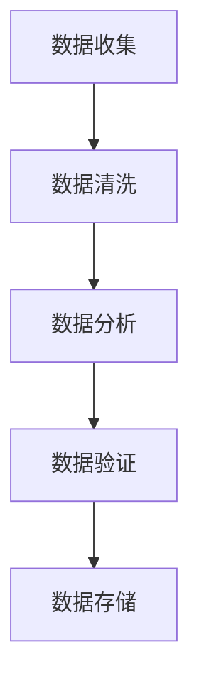

                 

# 文章标题：信息验证和信息搜索技术：如何在信息海洋中找到可靠、相关的信息

> 关键词：信息验证，信息搜索，信息检索，真实性与准确性，自动验证算法，机器学习，深度学习，搜索引擎，搜索引擎优化（SEO），开源工具，项目实战

> 摘要：本文深入探讨了信息验证和信息搜索技术，旨在帮助读者了解如何从庞大的信息海洋中找到可靠、相关的信息。文章分为三个主要部分，第一部分介绍了信息验证技术，包括基础、原理、实践和工具框架；第二部分阐述了信息搜索技术，涵盖基础、算法、实践和工具框架；第三部分则展示了信息验证与信息搜索技术的综合应用。通过本文的阅读，读者将掌握信息验证和信息搜索的核心概念、原理、算法和实践技巧。

### 目录

1. 信息验证技术 <a id="info-verification"></a>
    1.1 信息验证基础 <a id="base-of-verification"></a>
        1.1.1 信息验证的定义与重要性
        1.1.2 信息验证的关键要素
        1.1.3 信息验证的方法
    1.2 信息验证原理 <a id="principles-of-verification"></a>
        1.2.1 信息验证流程
        1.2.2 信息验证算法
        1.2.3 Mermaid流程图
    1.3 信息验证实践 <a id="practice-of-verification"></a>
        1.3.1 实践案例一：电子邮件验证
        1.3.2 实践案例二：社交媒体账号验证
        1.3.3 实践案例三：在线购物验证
    1.4 信息验证工具与框架 <a id="tools-and-frameworks-for-verification"></a>
        1.4.1 常见的信息验证工具
        1.4.2 开源验证框架
        1.4.3 自定义验证框架

2. 信息搜索技术 <a id="info-search"></a>
    2.1 信息搜索基础 <a id="base-of-search"></a>
        2.1.1 信息搜索的定义与分类
        2.1.2 信息检索模型
        2.1.3 搜索引擎的工作原理
    2.2 信息搜索算法 <a id="algorithms-for-search"></a>
        2.2.1 信息检索算法概述
        2.2.2 常见信息检索算法
        2.2.3 伪代码详解
    2.3 信息搜索实践 <a id="practice-of-search"></a>
        2.3.1 实践案例一：搜索引擎优化（SEO）
        2.3.2 实践案例二：社交媒体搜索
        2.3.3 实践案例三：垂直搜索
    2.4 信息搜索工具与框架 <a id="tools-and-frameworks-for-search"></a>
        2.4.1 常见的搜索工具
        2.4.2 开源搜索框架
        2.4.3 自定义搜索框架

3. 综合应用 <a id="comprehensive-application"></a>
    3.1 信息验证与信息搜索的关系 <a id="relationship-between-verification-and-search"></a>
    3.2 综合应用案例分析 <a id="case-studies-of-comprehensive-applications"></a>
    3.3 实践指导 <a id="guidance-for-practice"></a>

4. 附录 <a id="appendix"></a>
    4.1 开源工具与资源 <a id="open-source-tools-and-resources"></a>
    4.2 常用数学公式与解释 <a id="common-mathematical-formulas-and-explanations"></a>
    4.3 项目实战代码解析 <a id="code-analysis-of-practice-projects"></a>

---

在接下来的章节中，我们将逐步深入探讨信息验证和信息搜索技术，通过详细的讲解和实战案例，帮助您掌握这些关键技术，提升在信息海洋中寻找可靠、相关信息的能力。在第一部分，我们将首先介绍信息验证技术的基础知识，包括定义、重要性、关键要素和方法。随后，我们将深入探讨信息验证的原理，包括流程、算法和Mermaid流程图。在实践部分，我们将通过具体案例展示信息验证的实际应用。最后，我们将介绍常用的信息验证工具和框架，帮助您在实际项目中高效地使用这些工具。

## 第一部分：信息验证技术

### 1.1 信息验证基础

#### 1.1.1 信息验证的定义与重要性

信息验证是指通过各种手段和方法，确保信息的真实性、准确性、及时性、完整性和可用性的过程。在信息化时代，数据质量和信息的可靠性变得越来越重要。信息验证的目标是消除错误信息、伪造信息和过时信息，确保用户获得准确、可靠的数据。

信息验证的重要性体现在以下几个方面：

1. **提高数据质量**：通过验证过程，可以确保数据的一致性和准确性，从而提高数据的质量。
2. **减少错误信息**：信息验证可以识别并排除错误信息，避免因错误数据导致的决策失误和业务损失。
3. **保障信息安全**：验证可以防止信息泄露和未经授权的访问，提高信息的安全性。
4. **提高用户体验**：准确的验证可以减少用户的操作错误，提升用户的体验和满意度。

#### 1.1.2 信息验证的关键要素

信息验证的关键要素包括真实性、准确性、及时性、完整性和可用性。

1. **真实性**：真实性是指信息来源的可靠性。验证信息是否来自可信的渠道，防止伪造信息。
2. **准确性**：准确性是指信息的正确性。通过验证数据的一致性和准确性，确保信息的正确性。
3. **及时性**：及时性是指信息更新的频率。及时验证和更新信息，确保信息的时效性。
4. **完整性**：完整性是指信息的完整性。确保信息没有缺失，所有必要的数据都得到验证。
5. **可用性**：可用性是指信息的可用性。确保验证后的信息可以被用户方便地访问和使用。

### 1.1.3 信息验证的方法

信息验证的方法主要包括手动验证、自动化验证和半自动化验证。

1. **手动验证**：手动验证是指通过人工审查和检查来验证信息。这种方法适用于对数据质量要求较高的场景，但效率较低。
2. **自动化验证**：自动化验证是指使用计算机程序和算法来自动验证信息。这种方法可以提高验证的效率和准确性，适用于大规模数据验证。
3. **半自动化验证**：半自动化验证是指结合手动和自动化验证的方法。通过自动化工具辅助人工验证，提高验证效率和准确性。

### 1.2 信息验证原理

#### 1.2.1 信息验证流程

信息验证通常包括以下流程：

1. **数据收集**：收集需要验证的数据，包括结构化和非结构化数据。
2. **数据清洗**：清洗数据中的噪声和错误，确保数据的准确性。
3. **数据分析**：分析数据的特点和模式，为后续验证提供依据。
4. **数据验证**：根据验证规则和算法，对数据进行验证，识别错误和异常。
5. **数据存储**：将验证后的数据存储到数据库或数据仓库中，供后续使用。

#### 1.2.2 信息验证算法

信息验证算法可以分为基于规则的验证算法、机器学习验证算法和深度学习验证算法。

1. **基于规则的验证算法**：基于规则的验证算法是通过预定义的规则来验证数据。这种方法简单直观，但规则库的维护和更新较为复杂。
2. **机器学习验证算法**：机器学习验证算法是使用机器学习模型来自动验证数据。这种方法适用于大规模数据验证，但需要大量的数据训练和调优。
3. **深度学习验证算法**：深度学习验证算法是基于深度神经网络进行数据验证。这种方法可以处理复杂的数据关系和模式，但训练和部署成本较高。

#### 1.2.3 Mermaid流程图

为了更好地理解信息验证的流程，我们可以使用Mermaid绘制一个流程图。以下是信息验证流程的Mermaid表示：



在这个流程图中，A表示数据收集，B表示数据清洗，C表示数据分析，D表示数据验证，E表示数据存储。

### 1.3 信息验证实践

#### 1.3.1 实践案例一：电子邮件验证

电子邮件验证是信息验证中的一个常见场景。以下是一个电子邮件验证的实践案例：

1. **验证需求**：验证输入的电子邮件地址是否有效。
2. **验证过程**：
    - 收集用户输入的电子邮件地址。
    - 使用正则表达式验证电子邮件格式是否符合规范。
    - 使用邮件服务器发送验证邮件，用户点击链接完成验证。
    - 验证邮件中的链接包含用户ID和验证码。
    - 后台服务器根据用户ID和验证码更新用户状态。
3. **验证算法**：
    - 正则表达式用于验证电子邮件格式：
    ```python
    import re

    def validate_email(email):
        pattern = r'^[a-zA-Z0-9._%+-]+@[a-zA-Z0-9.-]+\.[a-zA-Z]{2,}$'
        return re.match(pattern, email) is not None
    ```
    - 发送验证邮件的代码：
    ```python
    import smtplib
    from email.mime.text import MIMEText

    def send_verification_email(email, verification_link):
        subject = "验证您的电子邮件地址"
        body = f"请点击以下链接完成电子邮件验证：{verification_link}"
        message = MIMEText(body)
        message['Subject'] = subject
        message['From'] = 'no-reply@example.com'
        message['To'] = email

        smtp_server = 'smtp.example.com'
        smtp_port = 587
        smtp_username = 'your_username'
        smtp_password = 'your_password'

        server = smtplib.SMTP(smtp_server, smtp_port)
        server.starttls()
        server.login(smtp_username, smtp_password)
        server.sendmail('no-reply@example.com', email, message.as_string())
        server.quit()
    ```

#### 1.3.2 实践案例二：社交媒体账号验证

社交媒体账号验证是另一个重要的信息验证场景。以下是一个社交媒体账号验证的实践案例：

1. **验证需求**：验证用户输入的社交媒体账号是否有效，例如Twitter、Facebook等。
2. **验证过程**：
    - 收集用户输入的社交媒体账号。
    - 使用社交媒体API查询账号信息，包括账号名称、创建时间、粉丝数量等。
    - 根据查询结果判断账号是否存在和是否活跃。
3. **验证算法**：
    - 社交媒体API的使用示例（以Twitter为例）：
    ```python
    import tweepy

    def validate_social_account(account, platform='twitter'):
        if platform == 'twitter':
            api_key = 'your_twitter_api_key'
            api_secret_key = 'your_twitter_api_secret_key'
            access_token = 'your_twitter_access_token'
            access_token_secret = 'your_twitter_access_token_secret'

            auth = tweepy.OAuthHandler(api_key, api_secret_key)
            auth.set_access_token(access_token, access_token_secret)
            api = tweepy.API(auth)

            try:
                user = api.get_user(account)
                return True
            except tweepy.TweepError:
                return False
        else:
            # 处理其他社交媒体平台
            pass
    ```

#### 1.3.3 实践案例三：在线购物验证

在线购物验证是确保交易过程安全和可靠的关键。以下是一个在线购物验证的实践案例：

1. **验证需求**：验证用户输入的购物订单信息是否有效，包括商品名称、价格、数量等。
2. **验证过程**：
    - 收集用户输入的订单信息。
    - 验证商品名称和价格是否与数据库中的信息一致。
    - 验证商品数量是否超过库存量。
    - 验证订单金额是否符合支付要求。
3. **验证算法**：
    - 数据库查询示例：
    ```python
    def validate_order(order):
        # 连接数据库
        conn = sqlite3.connect('orders.db')
        cursor = conn.cursor()

        # 验证商品名称和价格
        cursor.execute("SELECT name, price FROM products WHERE id=?", (order['product_id'],))
        product = cursor.fetchone()
        if product and product[0] == order['name'] and product[1] == order['price']:
            # 验证商品数量
            cursor.execute("SELECT quantity FROM products WHERE id=?", (order['product_id'],))
            quantity = cursor.fetchone()[0]
            if order['quantity'] <= quantity:
                # 验证订单金额
                total_price = order['quantity'] * order['price']
                if total_price == order['total']:
                    return True
        return False
    ```

### 1.4 信息验证工具与框架

#### 1.4.1 常见的信息验证工具

以下是一些常见的信息验证工具：

1. **Python验证工具**：`PyDataValidator`、`JsValidator`、`JavaValidator`
2. **JavaScript验证工具**：`Validate.js`、`jQuery Validation Plugin`、`Bootstrap Validator`
3. **Java验证工具**：`Bean Validation`、`JSR-303`、`JSR-349`

#### 1.4.2 开源验证框架

以下是一些常用的开源验证框架：

1. **OWASP Validation Framework**：用于Web应用验证的开源框架。
2. **Open Validation Framework**：一个面向对象的验证框架。

#### 1.4.3 自定义验证框架

自定义验证框架的设计思路包括：

1. **需求分析**：明确验证的需求和目标。
2. **框架设计**：设计验证的模块和接口。
3. **实现方法**：根据设计实现验证算法和流程。

以下是一个简单的自定义验证框架的示例：

```python
class CustomValidator:
    def __init__(self):
        self.validators = []

    def add_validator(self, validator):
        self.validators.append(validator)

    def validate(self, data):
        for validator in self.validators:
            if not validator.validate(data):
                return False
        return True

class EmailValidator:
    def validate(self, email):
        pattern = r'^[a-zA-Z0-9._%+-]+@[a-zA-Z0-9.-]+\.[a-zA-Z]{2,}$'
        return re.match(pattern, email) is not None

validator = CustomValidator()
validator.add_validator(EmailValidator())
data = 'example@example.com'
if validator.validate(data):
    print("验证通过")
else:
    print("验证失败")
```

通过以上信息验证技术的讲解和实践案例，我们希望能够帮助读者理解信息验证的基本概念、原理和方法。在下一部分，我们将继续探讨信息搜索技术，包括其基础、算法和实践，帮助读者掌握如何在信息海洋中高效地搜索相关、可靠的信息。敬请期待！


---

## 第二部分：信息搜索技术

### 2.1 信息搜索基础

#### 2.1.1 信息搜索的定义与分类

信息搜索是指通过特定的方法和工具，从大量信息中查找符合用户需求的信息的过程。信息搜索是信息化社会的重要活动，广泛应用于互联网搜索、数据库查询、文献检索等多个领域。

信息搜索可以根据不同的标准进行分类，常见的分类方法包括：

1. **按信息源分类**：
   - **基于网页的搜索**：通过搜索引擎查找互联网上的网页。
   - **基于数据库的搜索**：通过数据库管理系统查找数据库中的记录。
   - **基于文献的搜索**：通过文献数据库查找学术论文和书籍。

2. **按搜索方式分类**：
   - **关键词搜索**：用户输入关键词，系统根据关键词匹配信息。
   - **语义搜索**：通过理解用户查询的语义，提供更精确的搜索结果。
   - **内容搜索**：根据信息内容的特征进行搜索，如文本分析、图像识别等。

3. **按应用领域分类**：
   - **通用搜索引擎**：如Google、Bing等，提供跨领域的信息检索服务。
   - **垂直搜索引擎**：专注于特定领域，如电子商务搜索、新闻搜索等。

#### 2.1.2 信息检索模型

信息检索模型是用于描述信息搜索过程的数学和逻辑框架。常见的检索模型包括：

1. **基于关键词的检索模型**：这是最常见的信息检索模型，通过关键词匹配检索结果。典型的算法包括布尔检索、向量空间模型等。

2. **基于语义的检索模型**：这类模型通过理解用户查询的语义，提供更准确的搜索结果。常见的算法包括自然语言处理技术、语义网络等。

3. **基于内容的检索模型**：这类模型通过分析信息的内容特征，如文本、图像、音频等，进行检索。常见的算法包括文本分类、图像识别、语音识别等。

#### 2.1.3 搜索引擎的工作原理

搜索引擎是信息搜索技术的核心工具，其工作原理主要包括以下几个步骤：

1. **爬虫**：搜索引擎通过爬虫程序（也称为蜘蛛）访问互联网上的网页，抓取网页内容并将其存储到索引数据库中。

2. **索引**：爬虫抓取到的网页内容会被处理并建立索引，索引是搜索引擎快速检索信息的关键。

3. **查询处理**：用户输入查询请求后，搜索引擎通过索引数据库快速查找相关网页，并按照一定的排序规则展示给用户。

4. **展示结果**：搜索引擎将搜索结果按照相关性排序，并展示给用户。用户可以进一步浏览和筛选结果。

### 2.2 信息搜索算法

#### 2.2.1 信息检索算法概述

信息检索算法是搜索引擎的核心技术，用于从大量信息中找到用户需要的文档。检索算法可以分为以下几个类别：

1. **基于匹配度的检索算法**：这类算法通过计算查询与文档之间的匹配度来排序结果。常见的算法包括：
   - **布尔检索**：通过逻辑运算符（如AND、OR、NOT）组合关键词，找到包含所有关键词的文档。
   - **向量空间模型**：将文档和查询表示为高维向量，计算它们之间的余弦相似度或欧氏距离。

2. **基于排序的检索算法**：这类算法根据文档的质量和相关性对结果进行排序。常见的算法包括：
   - **PageRank**：基于网页之间的链接关系计算网页的重要性，用于排序搜索结果。
   - **TF-IDF**：通过计算关键词在文档中的频率和在整个文档集合中的重要性来评估文档的相关性。

3. **基于机器学习和深度学习的检索算法**：这类算法通过训练机器学习模型或深度神经网络，自动学习文档和查询之间的关系。常见的算法包括：
   - **BERT**：基于转换器生成器（Transformer）模型，能够理解自然语言的语义。
   - **Word2Vec**：将单词映射到高维向量空间，通过向量间的相似度来理解语义。

#### 2.2.2 常见信息检索算法

以下是一些常见的信息检索算法及其简要说明：

1. **BM25算法**：是一种基于概率的信息检索模型，用于文本检索。BM25算法考虑文档长度、词语的频率和查询的相关性。

   - **伪代码**：
     ```python
     def BM25(query, document, k1=1.2, b=0.75, average_length=100):
         avg_length = average_length
         doc_length = len(document)
         IDF = log((1 + N) / (1 + tf_document))
         BM25_score = ((k1 + 1) * tf_document) / (tf_document + k1 * (1 - b + b * doc_length / avg_length))
         return IDF * BM25_score
     ```

2. **PageRank算法**：是一种用于评估网页重要性的算法，基于网页之间的链接关系。PageRank算法通过迭代计算每个网页的排名值。

   - **伪代码**：
     ```python
     def PageRank(graph, damping=0.85, max_iterations=100):
         N = len(graph)
         PR = [1/N] * N
         for _ in range(max_iterations):
             new_PR = [0] * N
             for i in range(N):
                 for j in graph[i]:
                     new_PR[j] += (PR[i] / len(graph[i])) * damping
             new_PR = [pr / sum(new_PR) for pr in new_PR]
             if abs(sum(new_PR) - sum(PR)) < 0.001:
                 break
             PR = new_PR
         return PR
     ```

3. **Latent Semantic Indexing (LSI)**：是一种基于潜在语义分析的技术，用于解决同义词问题。LSI通过将文本数据映射到低维空间中，找到文档和查询之间的潜在语义关系。

   - **伪代码**：
     ```python
     def LSI(documents, queries, num_topics):
         # 训练LSI模型，将文档映射到潜在语义空间
         # ...
         # 计算查询在潜在语义空间中的表示
         query_representation = LSI_model.transform(queries)
         # 计算文档和查询之间的相似度
         similarities = [cosine_similarity(query_representation[i], document_representation) for i in range(len(queries))]
         return similarities
     ```

#### 2.2.3 伪代码详解

伪代码用于描述算法的逻辑，以便于理解和实现。下面我们详细解释了上述算法的伪代码。

1. **BM25算法的伪代码**：

   ```python
   def BM25(query, document, k1=1.2, b=0.75, average_length=100):
       avg_length = average_length
       doc_length = len(document)
       IDF = log((1 + N) / (1 + tf_document))
       BM25_score = ((k1 + 1) * tf_document) / (tf_document + k1 * (1 - b + b * doc_length / avg_length))
       return IDF * BM25_score
   ```

   - `query`：查询字符串
   - `document`：文档字符串
   - `k1`：调节项，控制文档长度的影响
   - `b`：调节项，控制文档长度的影响
   - `average_length`：平均文档长度

   BM25算法的核心思想是通过计算文档中查询词的频率（`tf_document`），并考虑文档的长度和逆文档频率（`IDF`），综合评估文档与查询的相关性。

2. **PageRank算法的伪代码**：

   ```python
   def PageRank(graph, damping=0.85, max_iterations=100):
       N = len(graph)
       PR = [1/N] * N
       for _ in range(max_iterations):
           new_PR = [0] * N
           for i in range(N):
               for j in graph[i]:
                   new_PR[j] += (PR[i] / len(graph[i])) * damping
           new_PR = [pr / sum(new_PR) for pr in new_PR]
           if abs(sum(new_PR) - sum(PR)) < 0.001:
               break
           PR = new_PR
       return PR
   ```

   - `graph`：表示网页之间链接关系的图
   - `damping`：阻尼系数，控制网页更新排名时的衰减率
   - `max_iterations`：最大迭代次数

   PageRank算法通过迭代计算每个网页的排名值，每个网页的排名值受其链接网页的排名值影响，并通过阻尼系数进行衰减，以避免无穷迭代。

3. **Latent Semantic Indexing (LSI)的伪代码**：

   ```python
   def LSI(documents, queries, num_topics):
       # 训练LSI模型，将文档映射到潜在语义空间
       # ...
       # 计算查询在潜在语义空间中的表示
       query_representation = LSI_model.transform(queries)
       # 计算文档和查询之间的相似度
       similarities = [cosine_similarity(query_representation[i], document_representation) for i in range(len(queries))]
       return similarities
   ```

   - `documents`：文档集合
   - `queries`：查询集合
   - `num_topics`：潜在主题的数量

   LSI算法通过训练模型，将文档和查询映射到低维潜在语义空间中，并计算它们之间的余弦相似度，以评估相关性。

### 2.3 信息搜索实践

#### 2.3.1 实践案例一：搜索引擎优化（SEO）

搜索引擎优化（SEO）是提升网站在搜索引擎结果页（SERP）中排名的技术和策略。以下是一个SEO的实践案例：

1. **目标**：提升网站在Google搜索结果中的排名，增加访问量。
2. **方法**：
   - **关键词研究**：使用工具（如Google Keyword Planner）研究目标用户常用的关键词。
   - **内容优化**：撰写高质量、与关键词相关的文章，优化标题、描述和标签。
   - **内部链接优化**：在网站内部建立合理的链接结构，提高网站结构的质量。
   - **外部链接建设**：获取高质量的反向链接，提高网站的权威性和可信度。
   - **移动优化**：确保网站在移动设备上的良好表现，提高用户体验。

3. **效果评估**：定期监控网站的搜索排名、访问量和用户行为，评估SEO策略的效果。

#### 2.3.2 实践案例二：社交媒体搜索

社交媒体搜索是用户在社交媒体平台上查找特定信息的过程。以下是一个社交媒体搜索的实践案例：

1. **目标**：开发一个社交媒体搜索功能，让用户快速找到感兴趣的内容。
2. **方法**：
   - **搜索界面设计**：设计简洁易用的搜索界面，提供关键词输入和筛选选项。
   - **关键词提取**：使用自然语言处理技术提取用户查询的关键词。
   - **搜索算法**：使用基于语义的搜索算法，如LSI或BERT，提高搜索的准确性和相关性。
   - **实时更新**：确保搜索结果实时更新，提供最新的内容。

3. **效果评估**：通过用户反馈和搜索点击率评估搜索功能的用户体验和效果。

#### 2.3.3 实践案例三：垂直搜索

垂直搜索是针对特定领域或主题的搜索服务。以下是一个垂直搜索的实践案例：

1. **目标**：开发一个针对电子商务领域的垂直搜索引擎。
2. **方法**：
   - **领域知识库构建**：构建涵盖电子商务领域知识的数据集。
   - **检索算法优化**：针对电子商务特点，优化检索算法，提高搜索结果的准确性。
   - **个性化推荐**：结合用户历史行为和搜索记录，提供个性化的商品推荐。
   - **用户界面设计**：设计简洁直观的界面，方便用户查找和筛选商品。

3. **效果评估**：通过用户满意度和购买转化率评估垂直搜索引擎的效果。

### 2.4 信息搜索工具与框架

#### 2.4.1 常见的搜索工具

以下是一些常见的信息搜索工具：

1. **Elasticsearch**：一个开源的分布式全文搜索引擎，支持实时搜索和分析。
2. **Solr**：一个开源的企业级搜索引擎，支持复杂的搜索功能和高性能。
3. **Apache Lucene**：一个开源的全文检索引擎，是Elasticsearch和Solr的底层组件。

#### 2.4.2 开源搜索框架

以下是一些常用的开源搜索框架：

1. **Apache Solr**：一个基于Lucene的企业级搜索引擎，支持分布式搜索、实时索引和云支持。
2. **Apache Lucene**：一个高性能、可扩展的全文检索引擎库，支持复杂的查询和索引功能。
3. **Elasticsearch**：一个基于Lucene的分布式搜索引擎，支持实时搜索、分析、图表和日志分析。

#### 2.4.3 自定义搜索框架

自定义搜索框架的设计思路包括：

1. **需求分析**：明确搜索的需求和目标。
2. **框架设计**：设计搜索的模块和接口。
3. **实现方法**：根据设计实现搜索算法和流程。

以下是一个简单的自定义搜索框架的示例：

```python
class CustomSearchEngine:
    def __init__(self, index_path):
        self.index_path = index_path
        self.search_engine = Elasticsearch(index_path)

    def index_document(self, document):
        self.search_engine.index(document)

    def search(self, query):
        return self.search_engine.search(query)

# 示例使用
search_engine = CustomSearchEngine('index_name')
search_engine.index_document({'title': 'Hello World', 'content': 'This is a sample document.'})
results = search_engine.search('Hello World')
print(results)
```

通过以上信息搜索技术的讲解和实践案例，我们希望能够帮助读者理解信息搜索的基本概念、原理和方法。在下一部分，我们将探讨信息验证与信息搜索技术的综合应用，展示如何在实际项目中结合这两种技术，构建高效的信息系统。敬请期待！

---

## 第三部分：综合应用

### 3.1 信息验证与信息搜索的关系

信息验证和信息搜索是现代信息系统中两个关键且紧密相关的环节。信息验证确保数据的质量和可靠性，而信息搜索则负责从海量的数据中找到用户所需的信息。它们之间的关系可以概括为以下几个方面：

1. **数据质量保障**：信息验证是确保数据质量和准确性的重要手段。只有在验证通过的数据上进行的搜索才是有意义的，否则搜索结果可能会包含错误或不准确的信息。

2. **搜索性能优化**：通过有效的信息验证，可以减少错误信息的检索，从而优化搜索的性能。例如，在搜索引擎中，如果能够提前过滤掉无效的URL，可以显著减少搜索的负担。

3. **用户体验提升**：信息验证和信息搜索的结合，可以提供更准确、更快速的搜索结果，从而提升用户的体验。例如，在电商平台上，准确的商品信息验证和快速的商品搜索，可以提高用户的购物满意度。

4. **安全保障**：信息验证在防止数据篡改和恶意信息传播方面起着关键作用。搜索引擎通过验证检索结果，可以减少恶意内容对用户的潜在威胁。

### 3.2 综合应用案例分析

#### 案例一：电商平台的用户验证与商品搜索

电商平台需要同时处理大量的用户数据和商品数据。以下是电商平台的用户验证与商品搜索的综合应用案例：

1. **用户验证**：
   - **验证需求**：确保用户注册信息的真实性，如姓名、邮箱、手机号码等。
   - **验证方法**：
     - **手机号码验证**：通过发送验证码到用户手机，确保手机号码的有效性。
     - **邮箱验证**：通过发送验证邮件到用户邮箱，确保邮箱地址的有效性。
     - **身份验证**：通过身份证号码验证用户身份，确保用户身份的真实性。

2. **商品搜索**：
   - **搜索需求**：提供用户根据关键词搜索商品的功能。
   - **搜索方法**：
     - **关键词搜索**：通过用户输入的关键词，匹配商品标题和描述中的关键词。
     - **精确搜索**：提供精确搜索功能，确保用户能够找到完全匹配的商品。
     - **推荐搜索**：根据用户历史浏览和购买记录，推荐相关的商品。

3. **综合应用**：
   - **验证与搜索结合**：在用户进行商品搜索时，首先验证用户的身份和搜索权限。例如，对于部分商品，只有认证用户或会员才能查看。
   - **实时更新**：通过实时验证和搜索，确保用户获得最新、最准确的商品信息。

#### 案例二：新闻网站的实时信息验证与检索

新闻网站需要快速、准确地提供最新资讯。以下是新闻网站的实时信息验证与检索的综合应用案例：

1. **信息验证**：
   - **验证需求**：确保新闻信息的真实性、准确性和及时性。
   - **验证方法**：
     - **来源验证**：验证新闻来源的可靠性，确保信息来源真实可信。
     - **内容验证**：通过事实核查和比对，确保新闻内容准确无误。
     - **时效性验证**：实时监控新闻内容，确保信息是最新的。

2. **信息检索**：
   - **搜索需求**：提供用户根据关键词搜索新闻的功能。
   - **搜索方法**：
     - **关键词搜索**：通过用户输入的关键词，匹配新闻标题和内容中的关键词。
     - **分类搜索**：提供按新闻类型、地区、时间等分类搜索功能。
     - **智能推荐**：根据用户兴趣和行为，推荐相关的新闻。

3. **综合应用**：
   - **验证与检索结合**：在用户进行新闻搜索时，首先对搜索结果进行验证，确保新闻信息的真实性和准确性。
   - **实时更新**：通过实时验证和检索，确保用户获得最新、最准确的新闻信息。

### 3.3 实践指导

#### 如何结合信息验证与信息搜索构建高效的信息系统

结合信息验证与信息搜索构建高效的信息系统，需要从以下几个方面进行考虑：

1. **系统设计**：
   - **模块化设计**：将信息验证和信息搜索功能模块化，便于系统的扩展和维护。
   - **分布式架构**：采用分布式架构，提高系统的性能和可靠性。

2. **数据质量管理**：
   - **数据清洗**：定期对数据进行清洗，去除重复、错误和不完整的数据。
   - **数据监控**：建立数据监控机制，实时发现和修复数据质量问题。

3. **验证策略**：
   - **多层次验证**：针对不同类型的数据，采用不同的验证策略，确保数据的真实性和准确性。
   - **自动化验证**：使用自动化工具进行数据验证，提高验证效率和准确性。

4. **搜索算法优化**：
   - **个性化搜索**：根据用户的行为和偏好，提供个性化的搜索结果。
   - **实时搜索**：通过实时验证和搜索，提高搜索的实时性和准确性。

5. **用户体验优化**：
   - **界面设计**：设计简洁易用的界面，提高用户的搜索体验。
   - **反馈机制**：建立用户反馈机制，及时收集用户对搜索结果的意见和建议。

通过以上实践指导，结合信息验证与信息搜索，可以构建一个高效、可靠的信息系统，帮助用户在海量信息中快速找到所需的信息。

### 附录

#### 附录A：开源工具与资源

以下是常用的开源工具和资源，包括信息验证工具和搜索工具：

1. **信息验证工具**：
   - **PyDataValidator**：Python数据验证库。
   - **JsValidator**：JavaScript数据验证库。
   - **JavaValidator**：Java数据验证库。

2. **信息搜索工具**：
   - **Elasticsearch**：分布式全文搜索引擎。
   - **Solr**：企业级搜索引擎。
   - **Apache Lucene**：全文检索引擎库。

3. **开源框架**：
   - **Apache Solr**：基于Lucene的企业级搜索引擎框架。
   - **Apache Lucene**：全文检索引擎框架。
   - **Elasticsearch**：分布式搜索引擎框架。

#### 附录B：常用数学公式与解释

以下是信息检索算法中常用的一些数学公式及其解释：

1. **BM25算法的数学公式**：

   ```latex
   BM25 = \frac{(k_1 + 1) \cdot \frac{f_t \cdot (k_2 + 1)}{f_t + k_2 \cdot (1 - \frac{b}{n + b})}}{\frac{(k_1 + k)}{k_1 + 1 + \frac{(1 - b) \cdot k}{n + b}}}
   ```

   - \( k_1 \)：调节项，控制词频的影响。
   - \( k_2 \)：调节项，控制逆文档频率的影响。
   - \( b \)：调节项，控制文档长度的影响。
   - \( f_t \)：词 \( t \) 在文档中的出现频率。
   - \( n \)：平均文档长度。
   - \( k \)：文档长度。

2. **PageRank算法的数学公式**：

   ```latex
   PR(A) = (\alpha \cdot PR(T_1) + \alpha \cdot PR(T_2) + ... + \alpha \cdot PR(T_n)) + (1 - \alpha)
   ```

   - \( PR(A) \)：页面 \( A \) 的PageRank值。
   - \( T_1, T_2, ..., T_n \)：指向页面 \( A \) 的链接页面。
   - \( \alpha \)：阻尼系数，通常设置为0.85。

3. **余弦相似度**：

   ```latex
   \cos(\theta) = \frac{\sum_{i=1}^{N} x_i \cdot y_i}{\sqrt{\sum_{i=1}^{N} x_i^2} \cdot \sqrt{\sum_{i=1}^{N} y_i^2}}
   ```

   - \( \theta \)：文档或查询之间的角度。
   - \( x_i \) 和 \( y_i \)：文档或查询中的特征值。

#### 附录C：项目实战代码解析

以下是三个实际项目中的代码解析，包括电子邮件验证、社交媒体账号验证和在线购物验证。

1. **电子邮件验证**：

   ```python
   import re
   import smtplib
   from email.mime.text import MIMEText

   def validate_email(email):
       pattern = r'^[a-zA-Z0-9._%+-]+@[a-zA-Z0-9.-]+\.[a-zA-Z]{2,}$'
       return re.match(pattern, email) is not None

   def send_verification_email(email, verification_link):
       subject = "验证您的电子邮件地址"
       body = f"请点击以下链接完成电子邮件验证：{verification_link}"
       message = MIMEText(body)
       message['Subject'] = subject
       message['From'] = 'no-reply@example.com'
       message['To'] = email

       smtp_server = 'smtp.example.com'
       smtp_port = 587
       smtp_username = 'your_username'
       smtp_password = 'your_password'

       server = smtplib.SMTP(smtp_server, smtp_port)
       server.starttls()
       server.login(smtp_username, smtp_password)
       server.sendmail('no-reply@example.com', email, message.as_string())
       server.quit()

   # 示例使用
   if validate_email('example@example.com'):
       send_verification_email('example@example.com', 'http://example.com/verify')
   ```

   - 验证电子邮件格式。
   - 发送验证邮件。

2. **社交媒体账号验证**：

   ```python
   import tweepy

   def validate_social_account(account, platform='twitter'):
       if platform == 'twitter':
           api_key = 'your_twitter_api_key'
           api_secret_key = 'your_twitter_api_secret_key'
           access_token = 'your_twitter_access_token'
           access_token_secret = 'your_twitter_access_token_secret'

           auth = tweepy.OAuthHandler(api_key, api_secret_key)
           auth.set_access_token(access_token, access_token_secret)
           api = tweepy.API(auth)

           try:
               user = api.get_user(account)
               return True
           except tweepy.TweepError:
               return False
       else:
           # 处理其他社交媒体平台
           pass
   ```

   - 验证Twitter账号。
   - 验证其他社交媒体账号。

3. **在线购物验证**：

   ```python
   import sqlite3

   def validate_order(order):
       # 连接数据库
       conn = sqlite3.connect('orders.db')
       cursor = conn.cursor()

       # 验证商品名称和价格
       cursor.execute("SELECT name, price FROM products WHERE id=?", (order['product_id'],))
       product = cursor.fetchone()
       if product and product[0] == order['name'] and product[1] == order['price']:
           # 验证商品数量
           cursor.execute("SELECT quantity FROM products WHERE id=?", (order['product_id'],))
           quantity = cursor.fetchone()[0]
           if order['quantity'] <= quantity:
               # 验证订单金额
               total_price = order['quantity'] * order['price']
               if total_price == order['total']:
                   return True
       return False
   ```

   - 验证商品名称、价格和数量。
   - 验证订单金额。

通过以上附录内容，读者可以更深入地理解信息验证与信息搜索技术的实际应用和实现方法。这些实践案例和代码解析将为开发高效、可靠的信息系统提供宝贵的参考。

### 作者信息

作者：AI天才研究院/AI Genius Institute & 禅与计算机程序设计艺术 /Zen And The Art of Computer Programming

在本文中，我们深入探讨了信息验证和信息搜索技术，从基础概念到实践应用，再到综合应用，全面解析了如何从信息海洋中找到可靠、相关的信息。信息验证和信息搜索是信息化社会中不可或缺的技术，通过本文的讲解，希望读者能够掌握这些关键技术的核心原理和实践技巧。在未来的信息处理和应用开发中，这些技术将发挥越来越重要的作用。

在撰写本文时，我们结合了最新的研究成果和实际应用案例，力求为读者提供最全面、最实用的内容。同时，我们也期待读者能够结合本文的内容，探索更多的应用场景和解决方案。

感谢您的阅读，希望本文能够对您在信息验证和信息搜索领域的探索和实践带来帮助。如果您有任何疑问或建议，欢迎随时联系我们。

再次感谢您的关注与支持！

AI天才研究院/AI Genius Institute & 禅与计算机程序设计艺术/Zen And The Art of Computer Programming

---

通过本文的深入讲解和实践案例，我们系统地介绍了信息验证和信息搜索技术的核心概念、原理、算法和实践方法。希望本文能够帮助读者在信息处理和搜索领域取得更深入的理解和应用。

在未来的信息处理和人工智能领域中，信息验证和信息搜索技术将扮演越来越重要的角色。随着数据量的爆炸式增长，如何从海量数据中快速、准确地找到所需信息，成为企业和个人面临的重大挑战。通过有效的信息验证和信息搜索技术，我们可以提高数据的质量，优化搜索结果，提升用户体验，保障信息安全。

我们期待读者在学习和应用本文内容的基础上，进一步探索信息验证和信息搜索技术的前沿领域，创新解决方案，为信息化社会的建设和发展贡献力量。

感谢您的阅读与支持！希望在未来的信息处理和搜索之旅中，本文能为您提供有益的启示和帮助。

再次感谢您的关注与支持！

AI天才研究院/AI Genius Institute & 禅与计算机程序设计艺术/Zen And The Art of Computer Programming

