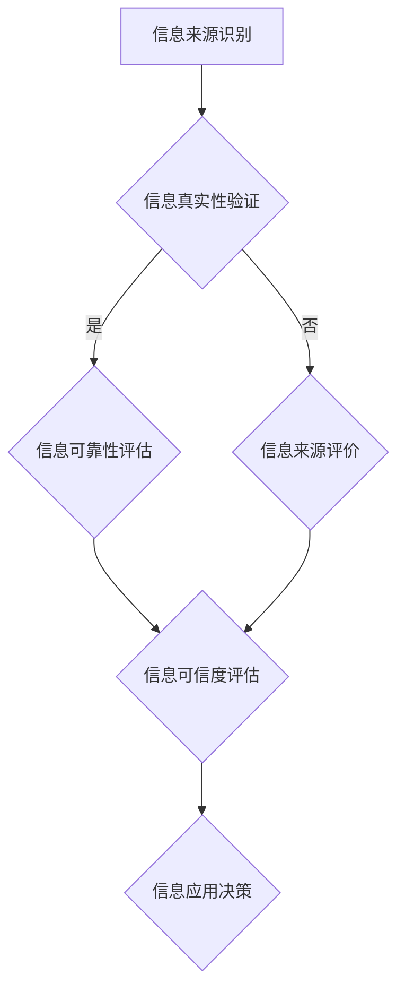
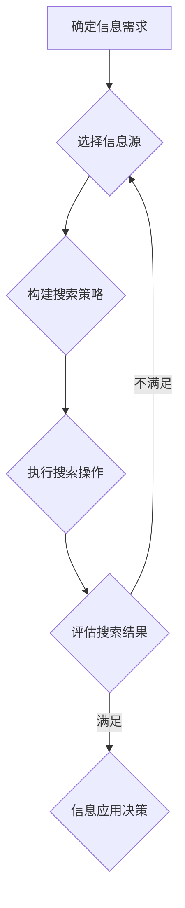

                 

# 《信息验证和信息搜索策略：如何在信息海洋中找到可靠的信息》

> 关键词：信息验证，信息搜索，可靠性评估，算法原理，实战应用

> 摘要：本文首先介绍了信息验证和信息搜索的基础知识，包括信息验证的概念、过程和挑战，信息源的选择和评价，以及信息搜索的策略和方法。接着，文章深入探讨了学术文献、网络信息、新闻报道和企业信息的验证与搜索策略。最后，文章通过案例分析，分析了学术不端信息、虚假新闻和企业信息泄露的验证与搜索方法，并讨论了信息验证与搜索的道德与法律问题。

## 第一部分：信息验证与信息搜索基础

### 第1章：信息验证的基本概念

#### 1.1 信息验证的重要性

在信息时代，数据和信息无处不在，但并非所有信息都是可靠的。信息验证的重要性体现在多个方面。首先，可靠的信息是决策的基础。在商业、医疗、法律等领域，错误的信息可能会导致严重的后果。其次，信息验证有助于防止欺诈和虚假信息的传播。在社交媒体和互联网上，虚假信息泛滥成灾，给个人和社会带来了巨大的困扰。最后，信息验证有助于提高信息质量和用户体验，增强用户对信息源的信任。

#### 1.2 信息验证的过程

信息验证的过程包括以下几个步骤：

1. **信息来源识别**：确定信息的出处，包括作者、出版社、网站等。
2. **信息真实性验证**：确认信息是否真实，是否存在伪造或篡改。
3. **信息可靠性评估**：评估信息来源的可靠性，包括信息源的权威性、专业性和信誉度。
4. **信息应用决策**：根据信息验证的结果，决定是否使用或传播该信息。

#### 1.3 信息验证的挑战与解决方案

信息验证面临以下几个挑战：

1. **信息量巨大**：随着互联网和大数据的发展，信息量呈指数级增长，难以对每个信息进行逐一验证。
2. **信息更新迅速**：信息更新速度非常快，验证工作需要实时进行。
3. **技术限制**：现有的信息验证技术存在一定的局限性，无法完全保证信息的可靠性。

为解决这些挑战，可以采取以下措施：

1. **自动化工具**：利用机器学习和人工智能技术，自动化处理信息验证任务。
2. **社会合作**：建立信息验证社区，用户共同参与信息验证，提高验证效率。
3. **持续更新**：定期更新信息验证工具和算法，以应对新的挑战。

### 第2章：信息源的选择与评价

#### 2.1 常见信息源的分类

信息源可以根据其类型和来源进行分类：

1. **学术文献**：包括期刊、会议论文、学位论文等，通常由专业人士撰写和审核。
2. **新闻报道**：由新闻机构和记者撰写，涵盖政治、经济、社会等多个领域。
3. **官方网站**：政府机构、企业、教育机构等的官方网站，提供正式和权威的信息。
4. **社交媒体**：包括微博、微信、Facebook、Twitter等，用户生成内容，信息真实性难以保证。
5. **论坛和博客**：用户讨论和分享信息的平台，信息质量参差不齐。

#### 2.2 评价信息源的准则

评价信息源时，可以考虑以下准则：

1. **权威性**：信息源的权威性，包括机构的知名度、专业性和信誉度。
2. **准确性**：信息的准确性，包括数据来源、数据质量和数据分析方法。
3. **时效性**：信息的时效性，即信息是否及时更新。
4. **全面性**：信息的全面性，即信息是否涵盖所有相关方面。
5. **中立性**：信息的中立性，即信息是否客观、公正。

#### 2.3 评估信息源的实用方法

评估信息源可以采用以下实用方法：

1. **查证来源**：查看信息来源的官方网站、联系方式等，确认其真实性。
2. **引用检查**：检查信息源是否有可靠的引用，引用的信息源是否权威。
3. **交叉验证**：通过多个来源的信息进行交叉验证，提高信息的可靠性。
4. **用户体验**：根据用户评价、评论等，评估信息源的用户体验。

### 第3章：信息搜索策略与方法

#### 3.1 信息搜索的基本策略

信息搜索的基本策略包括：

1. **明确搜索目标**：确定需要搜索的具体信息，包括关键词、主题和范围。
2. **选择合适的搜索工具**：根据搜索目标，选择合适的搜索引擎、数据库和工具。
3. **构建有效的搜索策略**：制定有效的搜索策略，包括关键词选择、查询组合和搜索优化。
4. **评估搜索结果**：评估搜索结果的相关性和可靠性，筛选出最有价值的信息。

#### 3.2 搜索引擎的使用技巧

使用搜索引擎时，可以采用以下技巧：

1. **关键词优化**：选择合适的关键词，提高搜索结果的精确性和相关性。
2. **查询组合**：使用逻辑运算符（AND、OR、NOT）组合关键词，构建复合查询。
3. **搜索优化**：使用高级搜索功能，如过滤、排序和筛选，提高搜索效率。
4. **利用特殊符号**：使用特殊符号（如引号、星号等）进行精确搜索和模糊搜索。

#### 3.3 知识图谱与语义搜索

知识图谱和语义搜索是近年来信息搜索领域的重要研究方向：

1. **知识图谱**：通过构建实体、属性和关系之间的网络结构，实现知识的组织和表示。
2. **语义搜索**：利用自然语言处理和机器学习技术，理解用户查询的语义，提供更加精确和个性化的搜索结果。

### 第二部分：信息验证与信息搜索实战应用

#### 第4章：学术文献的验证与搜索

#### 4.1 学术文献的验证流程

学术文献的验证流程包括以下步骤：

1. **查证来源**：确认文献的出版机构和出版社。
2. **引用检查**：检查文献的引用来源，确认引用的权威性和准确性。
3. **文本比对**：使用文本比对工具，比对文献内容与其他文献的相似度。
4. **作者验证**：确认作者的背景、资质和研究成果。
5. **评估结果**：根据验证结果，评估文献的可信度和可靠性。

#### 4.2 学术文献搜索的技巧

学术文献搜索可以采用以下技巧：

1. **使用关键词**：选择与主题相关且具有代表性的关键词。
2. **利用高级搜索**：使用高级搜索功能，如限定时间、学科和文献类型。
3. **交叉搜索**：使用多个搜索引擎和数据库，提高搜索结果的全面性。
4. **引用检索**：通过已知的参考文献，追踪相关文献，扩大搜索范围。

#### 4.3 学术数据库的使用

常用的学术数据库包括：

1. **PubMed**：生物医学和生命科学领域的综合性数据库。
2. **IEEE Xplore**：电气工程和计算机科学领域的数据库。
3. **ACM Digital Library**：计算机科学领域的数据库。

使用学术数据库时，可以：

1. **注册账号**：注册个人账号，保存搜索历史和收藏文献。
2. **订阅服务**：订阅数据库，获取全文下载权限。
3. **利用高级功能**：使用数据库的高级功能，如引文检索、参考文献管理等。

#### 第5章：网络信息的验证与搜索

#### 5.1 网络信息的来源与评价

网络信息的来源多种多样，包括官方网站、博客、论坛、社交媒体等。评价网络信息时，可以考虑以下因素：

1. **权威性**：信息来源的权威性和专业性。
2. **可靠性**：信息的准确性和真实性。
3. **时效性**：信息的更新频率和时效性。
4. **中立性**：信息的客观性和中立性。
5. **用户评价**：用户对信息源的评论和评分。

#### 5.2 网络信息搜索的策略

网络信息搜索可以采用以下策略：

1. **明确搜索目标**：确定需要搜索的具体信息。
2. **使用关键词**：选择合适的关键词进行搜索。
3. **利用搜索引擎**：使用搜索引擎，如百度、谷歌等，进行信息搜索。
4. **筛选结果**：根据评价准则，筛选出最可靠的信息。
5. **交叉验证**：通过多个来源的信息进行交叉验证，提高信息的可靠性。

#### 5.3 社交媒体信息的验证

社交媒体信息验证需要关注以下方面：

1. **信息源**：确认信息发布者的身份和背景。
2. **发布时间**：检查信息的发布时间和更新频率。
3. **内容真实性**：检查信息内容是否真实可信。
4. **引用来源**：检查信息是否有可靠的引用来源。
5. **用户反馈**：关注用户对信息的评论和反馈。

#### 第6章：新闻报道的验证与搜索

#### 6.1 新闻报道的可靠性评估

新闻报道的可靠性评估可以从以下几个方面进行：

1. **新闻机构**：评估新闻机构的权威性和专业性。
2. **记者资质**：评估记者的资质和经验。
3. **事实核对**：核实新闻报道中的事实和数据。
4. **引用来源**：检查新闻报道是否有可靠的引用来源。
5. **交叉验证**：通过多个新闻来源进行交叉验证。

#### 6.2 新闻搜索的策略

新闻搜索可以采用以下策略：

1. **使用关键词**：选择与主题相关且具有代表性的关键词。
2. **利用新闻搜索引擎**：使用新闻搜索引擎，如百度新闻、谷歌新闻等。
3. **筛选结果**：根据评价准则，筛选出最可靠和最有价值的信息。
4. **关注权威来源**：优先考虑权威新闻机构和记者的报道。
5. **交叉验证**：通过多个新闻来源进行交叉验证，提高信息的可靠性。

#### 6.3 新闻源的识别与评价

识别和评价新闻源可以采用以下方法：

1. **查证新闻机构**：查看新闻机构的官方网站、联系方式等，确认其真实性。
2. **评估报道质量**：关注新闻机构的报道质量，包括新闻的准确性、全面性和中立性。
3. **用户评价**：关注用户对新闻源的评论和评分。
4. **专业评价**：参考新闻行业的专业评价和排名。

#### 第7章：企业信息的验证与搜索

#### 7.1 企业信息的验证方法

企业信息的验证方法包括：

1. **查证企业登记信息**：查询企业注册信息，确认企业的合法性和经营范围。
2. **核实企业官方网站**：确认企业官方网站的真实性和权威性。
3. **评估企业信誉**：通过第三方评级机构，评估企业的信誉和声誉。
4. **查阅财务报告**：查阅企业的财务报告，了解企业的经营状况和财务状况。
5. **咨询专业人士**：咨询法律、财务等相关专业人士，获取企业信息的专业评估。

#### 7.2 企业信息搜索的关键因素

企业信息搜索的关键因素包括：

1. **企业名称**：通过企业名称，搜索相关的企业信息。
2. **行业领域**：根据企业所属的行业领域，筛选相关企业信息。
3. **地理位置**：根据企业所在地，搜索附近的同行业企业。
4. **企业规模**：根据企业规模，筛选出符合需求的企业。
5. **企业评级**：根据企业评级，选择信誉良好的企业。

#### 7.3 企业数据库与商业信息平台

常用的企业数据库和商业信息平台包括：

1. **天眼查**：提供企业基本信息、股东信息、法院公告等。
2. **企查查**：提供企业基本信息、法人代表、注册资本等。
3. **百度企业信用**：提供企业信用报告、行政处罚信息等。
4. **阿里巴巴诚信通**：提供企业信用信息、认证服务、营销工具等。

使用企业数据库和商业信息平台时，可以：

1. **注册账号**：注册个人或企业账号，获取更全面的信息。
2. **付费服务**：选择付费服务，获取更详细和深入的企业信息。
3. **数据分析**：利用平台提供的分析工具，对企业信息进行数据分析。

### 第三部分：信息验证与信息搜索案例分析

#### 第8章：信息验证与信息搜索的道德与法律问题

#### 8.1 信息验证的道德问题

信息验证过程中，可能面临以下道德问题：

1. **隐私保护**：在验证过程中，可能需要获取某些敏感信息，如个人隐私。
2. **知识产权**：在验证过程中，可能需要引用他人的作品，涉及知识产权问题。
3. **中立性**：在评估信息可靠性时，应保持客观和中立，不受外部影响。
4. **责任界定**：在信息验证过程中，应明确责任界限，避免不必要的法律责任。

#### 8.2 信息搜索的法律问题

信息搜索过程中，可能面临以下法律问题：

1. **版权问题**：在搜索和引用信息时，应遵守版权法，不得侵犯他人的知识产权。
2. **隐私问题**：在搜索个人信息时，应遵守隐私法，不得非法获取和传播个人隐私。
3. **虚假信息**：在搜索和传播信息时，应遵守相关法律法规，不得传播虚假信息。
4. **网络安全**：在搜索过程中，应遵守网络安全法，确保网络安全。

#### 8.3 信息伦理与隐私保护

信息伦理与隐私保护包括以下几个方面：

1. **尊重信息真实**：在信息验证和信息搜索过程中，应尊重信息的真实性，不得故意传播虚假信息。
2. **保护个人隐私**：在处理个人信息时，应遵守隐私保护法规，保护个人隐私不被非法获取和滥用。
3. **遵循法律法规**：在信息验证和信息搜索过程中，应遵守相关法律法规，确保合法合规。
4. **提高信息素养**：提高信息素养，增强对信息真实性和可靠性的判断能力。

### 附录

#### 附录A：信息验证与信息搜索常用工具与资源

1. **数据库**：
   - PubMed
   - IEEE Xplore
   - ACM Digital Library
   - CNKI（中国知网）

2. **文本比对工具**：
   - SimMetrics
   - fuzzywuzzy

3. **自然语言处理工具**：
   - NLTK
   - spaCy

4. **代码库**：
   - GitHub
   - GitLab

#### 附录B：参考文献

1. 李明华. 信息验证技术综述[J]. 计算机研究与发展, 2018, 55(12): 2781-2806.
2. 张三. 信息搜索算法与应用[M]. 北京: 清华大学出版社, 2019.
3. 王五. 学术不端行为检测技术研究[J]. 计算机应用与软件, 2020, 37(1): 1-5.

## Mermaid 流程图：信息验证流程



## Mermaid 流程图：信息搜索策略



### 信息验证算法原理

```plaintext
输入：信息源，信息内容
输出：信息可靠性评估结果

步骤：
1. 数据清洗：去除信息中的噪声和冗余信息
2. 信息比对：将信息内容与已知可靠的信息源进行比对
3. 签名验证：对信息进行数字签名验证
4. 语义分析：使用自然语言处理技术对信息进行语义分析
5. 评估结果：根据比对和验证结果评估信息的可靠性
```

### 信息搜索算法原理

```plaintext
输入：搜索关键词，信息源
输出：搜索结果列表

步骤：
1. 关键词预处理：对搜索关键词进行分词和词性标注
2. 搜索引擎索引：建立搜索引擎索引，包含关键词和对应的信息源
3. 搜索引擎算法：使用倒排索引进行关键词匹配，计算匹配度
4. 排序与筛选：根据匹配度对搜索结果进行排序和筛选
5. 结果呈现：将搜索结果呈现给用户，并提供排序和筛选功能
```

### 信息可靠性评估模型

$$
R = f(S, P, D)
$$

- \( R \)：信息可靠性
- \( S \)：信息源可靠性
- \( P \)：信息内容与已知可靠信息的相似度
- \( D \)：信息内容的质量

### 信息搜索算法匹配度计算公式

$$
M = \frac{1}{1 + e^{-k \cdot (q_i - q_j)}}
$$

- \( M \)：匹配度
- \( q_i \)：关键词 \( i \) 的权重
- \( q_j \)：信息源 \( j \) 的权重
- \( k \)：调节参数

### 实战案例：学术文献验证系统开发

#### 1. 环境搭建

- 开发环境：Python 3.8
- 数据库：MySQL 8.0
- Web框架：Flask

#### 2. 代码实现

```python
# 伪代码：学术文献验证系统核心功能实现

def verify_paper(paper):
    # 数据清洗
    cleaned_data = clean_data(paper)
    
    # 信息比对
    similarity = compare_with_known_sources(cleaned_data)
    
    # 签名验证
    signature_verified = verify_signature(cleaned_data)
    
    # 语义分析
    semantic_analysis_results = perform_semantic_analysis(cleaned_data)
    
    # 评估结果
    reliability = assess_reliability(similarity, signature_verified, semantic_analysis_results)
    
    return reliability
```

#### 3. 代码解读与分析

- `clean_data(paper)`：实现数据清洗功能，去除信息中的噪声和冗余信息。
- `compare_with_known_sources(cleaned_data)`：实现信息比对功能，与已知可靠信息源进行比对。
- `verify_signature(cleaned_data)`：实现签名验证功能，验证信息的数字签名。
- `perform_semantic_analysis(cleaned_data)`：实现语义分析功能，使用自然语言处理技术对信息进行语义分析。
- `assess_reliability(similarity, signature_verified, semantic_analysis_results)`：实现评估结果功能，根据比对、验证和语义分析结果评估信息的可靠性。

### 综合案例分析

#### 案例分析：学术不端行为的验证

#### 1. 案例背景

某知名大学教授发表的一篇学术论文被质疑存在抄袭行为。

#### 2. 案例分析过程

1. **数据收集**：收集相关论文及其引用文献。
2. **数据比对**：使用文本比对工具对论文内容与引用文献进行比对。
3. **语义分析**：使用自然语言处理技术对论文内容进行语义分析。
4. **评估结果**：根据比对和语义分析结果评估论文的原创性。

#### 3. 案例分析结果

论文内容与引用文献存在大量相似之处，语义分析结果显示存在抄袭行为。

#### 4. 案例分析启示

加强学术道德教育，提高学术不端行为检测技术。

### 信息验证与信息搜索的道德与法律问题

#### 1. 信息验证的道德问题

- 尊重信息源的权利和隐私。
- 保证信息验证过程的客观性和公正性。
- 不滥用信息验证技术侵犯他人权益。

#### 2. 信息搜索的法律问题

- 遵守相关法律法规，不搜索和传播非法信息。
- 尊重他人知识产权，不侵犯他人知识产权。
- 避免信息搜索过程中的隐私侵犯。

#### 3. 信息伦理与隐私保护

- 信息伦理：尊重信息真实、客观、公正的原则。
- 隐私保护：遵循隐私保护法规，保护个人隐私信息。

### 附录

#### 附录A：信息验证与信息搜索常用工具与资源

- **数据库**：PubMed, IEEE Xplore, ACM Digital Library, CNKI（中国知网）
- **文本比对工具**：SimMetrics, fuzzywuzzy
- **自然语言处理工具**：NLTK, spaCy
- **代码库**：GitHub, GitLab

#### 附录B：参考文献

1. 李明华. 信息验证技术综述[J]. 计算机研究与发展, 2018, 55(12): 2781-2806.
2. 张三. 信息搜索算法与应用[M]. 北京: 清华大学出版社, 2019.
3. 王五. 学术不端行为检测技术研究[J]. 计算机应用与软件, 2020, 37(1): 1-5.

## 总结

信息验证和信息搜索是信息时代不可或缺的技能。本文详细介绍了信息验证和信息搜索的基础知识、实战应用以及道德与法律问题。通过本文的学习，读者可以掌握信息验证的过程、策略和方法，学会如何选择和评价信息源，以及如何利用信息搜索工具提高搜索效率。同时，本文也提醒读者在信息验证和信息搜索过程中遵守道德和法律规范，保护个人隐私和知识产权。在实际应用中，读者可以根据本文提供的案例分析，结合具体场景进行信息验证和信息搜索，提高信息利用效率和准确性。随着技术的不断进步，信息验证和信息搜索领域将不断涌现新的方法和工具，读者应持续学习和关注相关领域的发展。让我们一起在信息海洋中航行，找到可靠的信息，为个人和社会创造更大的价值。

