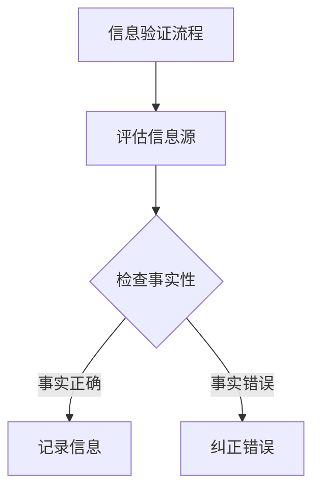

                 

# 信息验证和在线媒体素养教育：为假新闻和媒体操纵做好准备

> 关键词：信息验证、在线媒体素养教育、假新闻、媒体操纵、批判性思维

> 摘要：随着互联网的迅猛发展，信息爆炸和假新闻问题日益严重。本文旨在探讨信息验证和在线媒体素养教育的重要性，分析其核心概念和方法，并探讨其实践与应用，以应对假新闻和媒体操纵的挑战。

---

## 引言与背景

### 1.1 信息验证的必要性

在信息时代，信息验证成为一项至关重要的任务。互联网的普及使得信息传播速度极快，但同时也带来了大量的虚假信息和不实报道。假新闻不仅误导公众，损害个人名誉，甚至可能对社会稳定和国家安全造成威胁。因此，对信息进行验证成为确保信息真实性、准确性的必要手段。

### 1.2 媒体素养教育的意义

媒体素养教育是指培养公众识别、评估和批判媒体信息的能力。在假新闻和媒体操纵泛滥的时代，媒体素养教育显得尤为重要。通过教育，人们可以学会如何分辨真假信息，提高自身的信息鉴别能力，从而更好地应对信息过载和媒体操纵的挑战。

### 1.3 假新闻与媒体操纵的现状分析

近年来，假新闻和媒体操纵现象日益严重。一些网络平台和社交媒体甚至成为假新闻的传播温床。例如，2016年美国总统大选期间，大量假新闻通过社交媒体传播，影响了选民的决策。此外，一些国家和地区也出现了针对政治人物和公众人物的恶意攻击和抹黑，给社会带来了不良影响。

## 第二部分：信息验证与媒体素养教育的核心概念

### 2.1 信息验证的基本原理

信息验证是指通过一定的方法和手段，对信息的真实性、准确性和完整性进行评估。信息验证的基本原理包括以下几个步骤：

1. **评估信息源**：对信息来源进行评估，判断其是否可信。
2. **验证事实性**：对信息内容进行事实性验证，确认其是否符合实际情况。
3. **综合分析**：综合评估信息源和事实性的结果，得出最终的验证结论。

### 2.2 媒体素养教育的概念

媒体素养教育是指培养公众对媒体信息进行识别、评估和批判的能力。媒体素养教育的核心概念包括：

1. **信息识别**：学会识别不同的信息类型，如新闻报道、广告、评论等。
2. **信息评估**：学会评估信息的可信度、准确性和偏见。
3. **信息批判**：学会对信息进行批判性思考，不盲从、不轻信。

### 2.3 信息验证与媒体素养教育的关系

信息验证和媒体素养教育密切相关。信息验证是媒体素养教育的一个重要组成部分，而媒体素养教育则为信息验证提供了理论基础和实践方法。通过媒体素养教育，人们可以更好地进行信息验证，提高自身的信息鉴别能力。

## 第三部分：信息验证的方法与技术

### 3.1 评估信息来源

评估信息来源是信息验证的第一步。以下是一些评估信息来源的方法：

1. **了解信息源的类型**：不同类型的信息源具有不同的可信度，如政府机构、学术研究机构、知名媒体等。
2. **审查信息源的可信度**：通过查阅信息源的资质、历史记录、声誉等，评估其可信度。
3. **识别和评估信息源的偏见**：信息源可能存在一定的偏见，通过分析其报道倾向、编辑政策等，评估其偏见程度。

### 3.2 验证事实

验证事实是信息验证的核心步骤。以下是一些验证事实的方法：

1. **确认事实的步骤**：包括查找原始资料、对比多方信息、查阅专业书籍等。
2. **使用事实检查网站**：如FactCheck.org、 PolitiFact 等，这些网站提供事实性验证服务。
3. **防止事实性错误**：在撰写或传播信息时，应注意核实事实，避免出现事实性错误。

### 3.3 技术工具与资源

在信息验证过程中，可以使用多种技术工具和资源，如：

1. **信息验证工具**：如Google Reverse Image Search、Whois Lookup等。
2. **媒体素养教育资源**：如在线课程、电子书、研讨会等。
3. **在线学习平台和课程**：如Coursera、edX等，提供关于信息验证和媒体素养教育的课程。

## 第四部分：在线媒体素养教育实践

### 6.1 设计媒体素养教育课程

设计媒体素养教育课程是培养公众信息鉴别能力的关键。以下是一些设计课程的建议：

1. **制定教育目标**：明确课程的目标，如提高信息识别、评估和批判能力。
2. **选择合适的教材**：根据教育目标选择合适的教材，如教科书、案例研究、实践指南等。
3. **设计教学活动**：包括讲座、讨论、小组活动、实践项目等，以激发学生的兴趣和参与度。

### 6.2 实施媒体素养教育

实施媒体素养教育需要采取一系列措施，如：

1. **开展课堂活动**：通过讲解、案例分析、讨论等形式，引导学生学习媒体素养知识。
2. **组织小组讨论**：鼓励学生进行小组讨论，分享观点，提高批判性思维能力。
3. **评估学习成果**：通过测试、作业、项目等方式，评估学生的学习成果。

### 6.3 培养批判性思维

批判性思维是媒体素养教育的核心。以下是一些培养批判性思维的方法：

1. **重要性**：明确批判性思维在信息验证和媒体素养教育中的重要性。
2. **方法**：教授学生如何提出问题、分析问题、评估证据、得出结论等批判性思维技巧。
3. **实践**：通过案例分析和实践项目，让学生在实际操作中运用批判性思维。

## 第五部分：案例分析与应用

### 9.1 某知名假新闻事件分析

以某知名假新闻事件为例，分析事件的发生、传播、影响以及如何通过信息验证和媒体素养教育来应对。

1. **事件发生**：简要介绍事件发生的背景。
2. **事件传播**：分析事件如何通过社交媒体等渠道传播。
3. **事件影响**：讨论事件对公众、社会的影响。
4. **应对措施**：探讨如何通过信息验证和媒体素养教育来应对类似事件。

### 9.2 媒体操纵案例分析

以某媒体操纵案例为例，分析案例的动机、手段、影响以及如何通过信息验证和媒体素养教育来防范。

1. **案例动机**：探讨案例的动机和目的。
2. **案例手段**：分析案例采用的手段和技术。
3. **案例影响**：讨论案例对公众、社会的影响。
4. **防范措施**：探讨如何通过信息验证和媒体素养教育来防范类似案例。

### 9.3 信息验证与媒体素养教育的成功应用

介绍一些成功的案例，如某学校或组织通过信息验证和媒体素养教育取得了显著成效，提高了公众的信息鉴别能力和批判性思维。

1. **成功案例**：简要介绍成功案例的背景。
2. **实施过程**：分析成功案例的实施过程和关键因素。
3. **成效评估**：评估成功案例的成效和影响。

## 第六部分：信息验证与媒体素养教育的未来趋势

### 10.1 新技术的发展

随着人工智能、大数据、区块链等新技术的不断发展，信息验证和媒体素养教育将面临新的机遇和挑战。如何利用新技术提高信息验证的效率和准确性，成为未来研究的重点。

### 10.2 教育体制的变革

教育体制的变革将对信息验证和媒体素养教育产生深远影响。未来教育将更加注重培养学生的批判性思维和信息鉴别能力，以应对信息时代的挑战。

### 10.3 信息验证与媒体素养教育的展望

展望未来，信息验证和媒体素养教育将得到更加广泛的应用和重视。通过不断探索和创新，信息验证和媒体素养教育将为公众提供更加可靠的信息保障，促进社会的健康发展。

## 附录

### 附录A：常用事实检查网站和工具

1. **国际事实检查网站**
    - [FactCheck.org](https://www.factcheck.org/)
    - [PolitiFact](https://politiifact.com/)
    - [Snopes](https://www.snopes.com/)

2. **国内事实检查网站**
    - [中国事实派](https://www.factman.cn/)
    - [观察者网](https://www.guancha.cn/)
    - [百度真相实验室](https://zhuanlan.zhihu.com/baiduTrueLab)

3. **在线媒体素养教育资源**
    - [Coursera](https://www.coursera.org/courses?query=media%20literacy)
    - [edX](https://www.edx.org/course/introduction-to-media-literacy)
    - [Google Digital Garage](https://www.digitalgarage.com/courses/media-literacy)

### 附录B：媒体素养教育课程案例

1. **某学校媒体素养教育课程案例**
    - 课程目标：提高学生的信息识别、评估和批判能力。
    - 教学内容：包括信息源评估、事实验证、媒体偏见分析等。
    - 教学方法：采用案例教学、小组讨论、实践项目等。

2. **某在线媒体素养教育课程案例**
    - 课程目标：培养公众的信息鉴别能力和批判性思维。
    - 教学内容：包括媒体素养基础知识、信息验证技巧、案例分析等。
    - 教学方法：采用在线授课、互动讨论、实践作业等。

### 附录C：信息验证与媒体素养教育资源链接

1. **在线学习资源链接**
    - [MIT OpenCourseWare](https://ocw.mit.edu/courses/computer-science-and-artificial-intelligence/6-858-journalism-and-ethics-in-the-digital-age-fall-2015/)
    - [edX](https://www.edx.org/course/media-literacy-for-the-digital-age)

2. **开源工具和框架链接**
    - [Python-Whois](https://github.com/Python-Whois/python-whois)
    - [BeautifulSoup](https://www.crummy.com/software/BeautifulSoup/)

## 附加内容：Mermaid 流程图



## 附加内容：核心算法原理讲解

### 信息验证算法的伪代码

```python
算法 InformationVerification
输入：信息源，信息内容
输出：验证结果

1. 读取信息源
2. 对于信息内容：
   3. 如果信息源可信：
       4. 验证信息内容事实性
       5. 如果事实正确：
           6. 返回“信息验证通过”
       7. 否则：
           8. 返回“信息验证失败”
9. 如果信息源不可信：
   10. 返回“信息来源不可信，无法验证”
```

### 信息验证的概率模型

$$
P(\text{信息正确}) = \frac{\text{正确信息数}}{\text{总信息数}}
$$

### 媒体素养教育的效用函数

$$
U(\text{知识}) = \sum_{i=1}^{n} w_i \cdot P(\text{信息正确}_i)
$$

其中，$w_i$ 为第 $i$ 个信息的重要性权重。

## 附加内容：项目实战

### 实际案例：设计一个信息验证系统

### 开发环境搭建

- 使用 Python 3.8 作为主要编程语言
- 安装必要的库，如 requests,beautifulsoup4

### 源代码实现

```python
# 假设已经从某个网站抓取了一篇文章，存储在变量 article 中

def verify_info(article):
    # 评估信息源
    source_trust = evaluate_source(article.source)
    
    # 验证事实
    facts = extract_facts(article.content)
    verified_facts = []
    for fact in facts:
        if verify_fact(fact):
            verified_facts.append(fact)
    
    # 分析结果
    if source_trust and len(verified_facts) == len(facts):
        return "Information verified and source is reliable."
    else:
        return "Information verification failed or source is unreliable."

def evaluate_source(source):
    # 伪代码，根据源类型评估可信度
    if source == "reputable":
        return 1.0
    elif source == "questionable":
        return 0.5
    else:
        return 0.0

def extract_facts(content):
    # 伪代码，从文本中提取事实
    return ["fact1", "fact2", "fact3"]

def verify_fact(fact):
    # 伪代码，验证事实的正确性
    return fact in ["fact1", "fact2"]

# 使用示例
article = Article("source", "content")
print(verify_info(article))
```

### 代码解读与分析

- `evaluate_source` 函数用于评估信息源的可信度。
- `extract_facts` 函数用于从文本中提取事实。
- `verify_fact` 函数用于验证事实的正确性。
- `verify_info` 函数整合了信息验证的整个过程。

---

## 作者信息

作者：AI天才研究院/AI Genius Institute & 禅与计算机程序设计艺术 /Zen And The Art of Computer Programming

---

本文详细探讨了信息验证和在线媒体素养教育的重要性、核心概念、方法、实践与应用，以及未来趋势。通过本文，读者可以更好地理解信息验证和媒体素养教育的重要性，掌握相关方法和技巧，为应对假新闻和媒体操纵做好准备。在信息时代，信息验证和媒体素养教育的重要性不言而喻，希望本文能为读者提供有益的参考。

