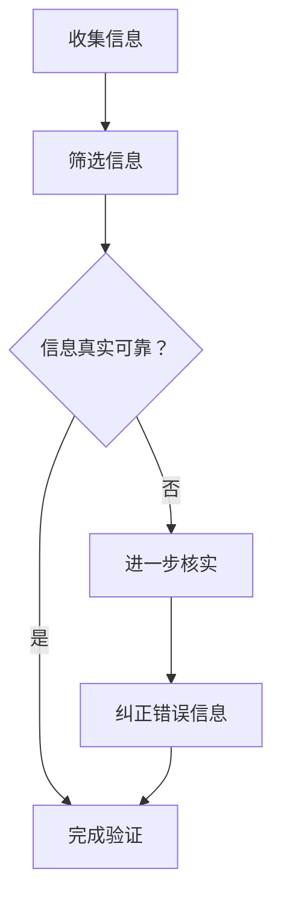

                 

### 《信息验证和在线媒体素养：在假新闻和媒体操纵的时代导航》

> **关键词：**信息验证、在线媒体素养、假新闻、媒体操纵、算法、数据、批判性思维、社交媒体、项目实战。

> **摘要：**本文旨在探讨在假新闻和媒体操纵日益普遍的时代，如何通过信息验证和在线媒体素养来提升公众的信息识别能力，构建一个健康、可信的网络环境。文章首先介绍了信息验证的定义、作用和原则，随后详细阐述了在线媒体素养的构成要素和重要性。接着，文章分析了算法与数据操纵的基本原理及其影响，以及社交媒体的操纵策略。最后，通过一个具体的项目实战案例，展示了如何应用信息验证和在线媒体素养的理念进行实践。

### 第一部分：引言

#### 第1章：绪论

在当今数字化时代，信息的传播速度和范围前所未有，这给人们带来了巨大的便利，但也引发了诸多挑战。其中，假新闻和媒体操纵成为突出的社会问题。假新闻（Fake News）指的是故意传播的虚假、误导性信息，而媒体操纵（Media Manipulation）则是指利用媒体手段影响公众意见和社会行为。这些现象不仅损害了公众的利益，还可能引发社会动荡和政治不稳定。

**1.1 假新闻和媒体操纵的现状与挑战**

假新闻和媒体操纵的问题在多个领域都有所体现，如政治、经济、社会和文化等。以下是一些主要挑战：

1. **虚假信息的快速传播**：社交媒体和即时通讯工具的普及使得虚假信息可以迅速传播，对公众的认知和判断造成严重影响。
2. **算法和大数据的滥用**：算法和大数据技术被用于精准投放广告和内容，从而影响公众的观点和行为。
3. **信息茧房**：由于个人偏好和社交媒体算法的推荐，公众容易陷入信息茧房，导致视野狭窄、认知偏差。
4. **公众信息素养不足**：许多人缺乏对信息的识别和批判能力，容易受到虚假信息和媒体操纵的影响。

**1.2 本书的目的与结构**

本书旨在提供一套系统的解决方案，帮助公众提高信息识别能力，构建一个健康、可信的网络环境。具体目标包括：

1. **提升信息验证能力**：通过详细讲解信息验证的原则和方法，帮助读者学会如何验证信息的真实性和准确性。
2. **增强在线媒体素养**：通过阐述在线媒体素养的构成要素和重要性，帮助读者培养批判性思维和信息识别能力。
3. **探讨算法与数据操纵的影响**：分析算法和数据操纵的基本原理及其影响，提高读者对此类问题的认识。
4. **提出应对策略**：针对社交媒体的操纵策略，提出具体的应对措施，帮助公众减少受虚假信息和媒体操纵的影响。

全书分为六个部分，结构如下：

1. **第一部分：引言**：介绍假新闻和媒体操纵的现状与挑战，阐述本书的目的与结构。
2. **第二部分：核心概念与联系**：介绍信息验证的概念与原则，并使用Mermaid流程图展示信息验证的过程与步骤。
3. **第三部分：在线媒体素养**：阐述在线媒体素养的构成要素和重要性。
4. **第四部分：算法、数据与信息操纵**：分析算法与数据操纵的基本原理及其影响，以及社交媒体的操纵策略。
5. **第五部分：实践与应用**：讨论信息验证与在线媒体素养的应用场景，包括新闻报道、社交媒体教育和企业实践。
6. **第六部分：项目实战**：通过一个具体的项目实战案例，展示如何应用信息验证和在线媒体素养的理念进行实践。

**1.3 信息验证与媒体素养的重要性**

信息验证和媒体素养在当前社会具有极其重要的意义。首先，信息验证可以确保公众获取的信息真实可靠，避免受到虚假信息的误导。其次，媒体素养可以帮助公众提高信息识别能力，培养批判性思维，减少对虚假信息和媒体操纵的依赖。最后，通过提高公众的信息素养，可以构建一个健康、可信的网络环境，促进社会的和谐与稳定。

通过本书，我们希望读者能够深刻理解信息验证和媒体素养的重要性，学会如何在实际生活中应用这些理念，为自己和社会创造一个更加美好的未来。

### 第二部分：核心概念与联系

#### 第2章：信息验证的概念与原则

**2.1 信息验证的定义与作用**

信息验证（Fact-checking）是指通过特定的方法、技术和标准来核实信息的真实性和准确性。它是一种系统性、结构化的过程，旨在识别和纠正虚假信息，确保公众获取的信息是真实可靠的。

**信息验证的作用：**

1. **保障信息真实性**：通过验证信息的真实性，避免虚假信息的传播，保护公众的利益。
2. **提高信息素养**：通过信息验证的过程，培养公众的信息识别和批判能力，提高整体信息素养。
3. **维护社会稳定**：虚假信息和媒体操纵可能导致社会动荡和政治不稳定，信息验证有助于维护社会的稳定与和谐。

**2.2 信息验证的原则**

信息验证应遵循以下原则，以确保其公正性、准确性和有效性：

1. **独立性**：信息验证者应保持独立，不受任何利益相关方的干扰，确保验证过程的客观性。
2. **客观性**：信息验证应基于事实，避免主观偏见，确保验证结果的真实可靠。
3. **全面性**：信息验证应考虑所有相关信息，确保全面、准确地评估信息的真实性。
4. **时效性**：信息验证应关注信息的新旧程度，确保验证结果的时效性。

**2.3 Mermaid流程图：信息验证的过程与步骤**

为了更直观地展示信息验证的过程与步骤，我们可以使用Mermaid绘制一个流程图。



**流程说明：**

1. **收集信息**：从多个来源收集相关信息，包括新闻报道、社交媒体、官方网站等。
2. **筛选信息**：根据预设的标准和规则，筛选出可能需要验证的信息。
3. **评估真实性**：对筛选出的信息进行真实性评估，判断其是否符合事实。
4. **完成验证**：如果信息真实可靠，则完成验证过程，并公布验证结果。
5. **进一步核实**：如果信息存在疑问或无法确认，则进一步核实，收集更多证据和信息。
6. **纠正错误信息**：如果发现信息存在错误，则及时纠正，并公布纠正后的结果。

通过这个流程，信息验证者可以系统地、有序地进行信息核实，确保验证结果的准确性和公正性。

### 第2章：信息验证的概念与原则（续）

**2.1.1 信息验证的定义**

信息验证是一个复杂且多维的过程，其核心目标在于确认信息的真实性、准确性和完整性。具体来说，信息验证涉及以下方面：

1. **真实性**：确认信息是否与事实相符，是否存在虚假陈述。
2. **准确性**：确保信息的细节和表述无误，没有误导性。
3. **完整性**：检查信息是否包含所有相关细节，没有遗漏关键信息。

**2.1.2 信息验证的作用**

在现代社会，信息验证发挥着至关重要的作用，主要体现在以下几个方面：

1. **防止虚假信息的传播**：通过信息验证，可以有效遏制虚假信息的扩散，保护公众免受虚假信息的误导。
2. **提升公众的信息素养**：信息验证不仅是一种技术手段，更是一种思维方式。通过参与信息验证，公众可以提高自己的信息识别和批判能力。
3. **维护社会的公信力**：信息验证有助于建立和维持社会的公信力，增强公众对媒体和信息的信任。
4. **促进民主参与**：在信息真实可信的前提下，公众可以更好地了解事实，从而参与社会和政治事务，实现民主参与。

**2.2 信息验证的原则**

信息验证的整个过程应遵循以下原则，以确保其公正性和有效性：

1. **独立性**：信息验证者必须保持独立，不受任何利益相关方的干扰，确保验证的客观性和公正性。
   - **原因**：如果信息验证者受到利益相关方的影响，可能会产生偏见，影响验证结果的准确性。
   - **实践**：信息验证机构通常由独立的第三方组织承担，以确保其独立性。

2. **客观性**：信息验证应基于事实，避免主观偏见，确保验证结果的客观性。
   - **原因**：主观偏见可能导致信息验证者对某些信息给予过多的信任或怀疑，从而影响验证结果的准确性。
   - **实践**：信息验证者在进行验证时，应遵循科学的方法和标准，尽量避免个人情感和立场的影响。

3. **全面性**：信息验证应考虑所有相关信息，确保全面、准确地评估信息的真实性。
   - **原因**：单一的信息片段可能存在误导性，只有通过全面的信息分析，才能得出准确的结论。
   - **实践**：信息验证者应广泛收集信息，并从多个角度进行分析和评估，以获取更全面的理解。

4. **时效性**：信息验证应关注信息的新旧程度，确保验证结果的时效性。
   - **原因**：随着时间的推移，信息的真实性可能发生变化，验证结果也应随之更新。
   - **实践**：信息验证者应关注信息的发布时间，对较旧的信息进行更新验证，确保验证结果的时效性。

通过遵循这些原则，信息验证者可以确保验证过程的公正性和准确性，为公众提供可靠的信息服务。

### 第二部分：核心概念与联系（续）

#### 第3章：在线媒体素养概述

**3.1 在线媒体素养的定义**

在线媒体素养（Online Media Literacy）是指个体在数字媒体环境中，对信息的识别、理解、评估和批判的能力。它涵盖了以下几个方面：

1. **信息识别**：能够识别信息源的可信度和信息的真实性。
2. **信息理解**：理解媒体信息的内容、意图和目的。
3. **信息评估**：评估媒体信息的可信度、价值和影响。
4. **信息批判**：批判性地分析媒体信息的意图和效果，避免受到误导。

**3.2 媒体素养的重要性**

媒体素养在现代社会中具有重要意义，主要体现在以下几个方面：

1. **防止虚假信息的传播**：通过提升媒体素养，公众可以更好地识别虚假信息，从而减少虚假信息的传播。
2. **增强批判性思维**：媒体素养培养个体的批判性思维，使其能够对媒体信息进行理性分析和判断。
3. **提高信息素养**：媒体素养有助于提高公众的整体信息素养，使其能够更有效地获取、处理和应用信息。
4. **维护社会稳定**：通过媒体素养的培养，可以增强公众对媒体和信息环境的理解和适应能力，从而维护社会稳定。

**3.3 媒体素养的构成要素**

在线媒体素养包括以下几个核心构成要素：

1. **信息识别能力**：能够识别信息的来源、可靠性、真实性等关键特征，避免受到虚假信息的误导。
   - **技巧**：了解不同信息源的背景和信誉度，使用信息验证工具和方法进行信息核实。
   - **示例**：例如，在阅读新闻报道时，注意查看发布者的资质和背景，核实引用的数据和来源。

2. **信息理解能力**：理解媒体信息的内容、意图和目的，避免被信息表面的文字和图片所误导。
   - **技巧**：注意信息的语境、语气和隐含意义，通过多方面的信息来源进行比较和分析。
   - **示例**：例如，在观看新闻报道时，不仅要关注新闻的表面内容，还要关注新闻背后的意图和影响。

3. **信息评估能力**：评估媒体信息的可信度、价值和影响，判断信息是否对自己和社会有益。
   - **技巧**：使用批判性思维工具，如逻辑分析、事实核实和证据评估，对信息进行综合评估。
   - **示例**：例如，在评估一个研究报告时，要检查研究方法、数据来源和结论的可靠性。

4. **信息批判能力**：批判性地分析媒体信息的意图和效果，避免受到媒体操纵的影响。
   - **技巧**：识别媒体操纵的常见手段，如情绪操纵、偏见报道、信息不对称等，进行理性分析。
   - **示例**：例如，在分析一个社交媒体账号时，要关注其发布的内容是否具有连续性和一致性，是否存在明显的偏见。

通过培养和提升这些构成要素，个体可以在复杂的数字媒体环境中保持清醒的头脑，避免受到虚假信息和媒体操纵的影响，从而更好地保护自己的信息安全和权益。

### 第二部分：核心概念与联系（续）

#### 第4章：批判性思维与判断力

**4.1 批判性思维的基本原则**

批判性思维（Critical Thinking）是一种分析和评估信息的能力，旨在识别和纠正错误观念，理解信息的真实性和可靠性。以下是一些批判性思维的基本原则：

1. **明确问题**：在开始分析之前，要明确需要解决的问题或目标，避免在无关信息上浪费时间。
2. **分析证据**：根据已有的证据进行分析，避免依赖单一来源的信息。
3. **逻辑推理**：使用逻辑推理来评估信息的合理性和一致性。
4. **辨别偏见**：识别和分析信息中的偏见和假设，避免受到情感或个人立场的影响。
5. **评估结论**：对结论进行评估，确保其基于充分的证据和合理的逻辑。

**4.2 媒体内容的批判性分析**

在分析媒体内容时，应遵循以下步骤：

1. **识别信息源**：了解信息源的可信度，包括其背景、历史记录和声誉。
2. **评估信息内容**：分析信息的逻辑性和证据支持，辨别信息中的偏见和误导性陈述。
3. **比较不同来源**：从多个来源获取信息，进行比较和分析，以获得更全面的理解。
4. **考虑背景因素**：了解信息的发布背景，如政治、经济和社会环境，以及可能的影响因素。
5. **评估影响**：分析信息对社会和个人可能产生的影响，包括其长期和短期效应。

**4.3 培养批判性思维的方法**

要培养批判性思维，可以采取以下方法：

1. **阅读和分析**：通过广泛阅读和分析不同观点和证据，提高信息识别和评估能力。
2. **课程学习**：参加批判性思维课程或研讨会，系统学习批判性思维的理论和实践。
3. **实践应用**：在实际生活中应用批判性思维，例如在购物、投资和投票时进行理性分析和决策。
4. **讨论和辩论**：与他人进行讨论和辩论，通过不同的视角和观点来丰富自己的思维。
5. **反思和总结**：定期反思自己的思维过程和决策，总结经验和教训，不断提高批判性思维能力。

通过以上方法，个体可以培养出批判性思维，提高对信息的识别和评估能力，从而更好地应对复杂的媒体环境，做出理性、明智的决策。

### 第二部分：核心概念与联系（续）

#### 第5章：算法与数据操纵

**5.1 算法操纵的基本原理**

算法操纵（Algorithm Manipulation）是指通过改变算法的输入或输出，以达到操纵信息传播的目的。算法操纵的基本原理包括以下几个方面：

1. **算法偏见**：在算法的设计和训练过程中引入偏见，使算法在处理信息时产生偏向。例如，通过对训练数据的选择和清洗，可以使算法对某些特定群体或观点产生偏见。

2. **数据篡改**：通过篡改算法的输入数据，改变算法的输出结果。例如，通过修改数据集中的标签或特征，可以使算法对某些信息进行错误分类。

3. **算法漏洞**：利用算法的漏洞或缺陷，操纵信息传播。例如，通过设计特定的攻击策略，可以绕过算法的验证机制，使其传播虚假信息。

**5.2 数据操纵的手段与技术**

数据操纵（Data Manipulation）是指通过特定的手段和技术，改变数据的内容、结构和关联性，以影响信息传播和公众观点。以下是一些常见的数据操纵手段：

1. **数据篡改**：直接篡改数据的内容，例如修改数据值、添加或删除数据点等。这种手段可以通过伪造数据来误导公众。

2. **数据选择**：有选择性地展示数据，以引导公众对某一特定问题的看法。例如，只展示对某一观点有利的数据，而忽略其他数据。

3. **数据关联性操纵**：通过操纵数据之间的关联性，改变公众对信息的理解。例如，通过将两个无关的数据点强行关联，使公众误认为它们之间存在因果关系。

**5.3 算法与数据操纵的影响**

算法与数据操纵对信息传播和公众观点的影响是多方面的：

1. **信息偏误**：算法和数据操纵可能导致信息传播的偏误，使公众无法获得全面、准确的信息。

2. **观点引导**：通过操纵算法和数据，可以引导公众对某一特定问题形成特定的观点，从而影响社会舆论。

3. **信任危机**：算法和数据操纵可能导致公众对媒体和信息源产生信任危机，影响公众对信息真实性的判断。

4. **社会分裂**：算法和数据操纵可能加剧社会分裂，使公众对某一问题形成极端的观点，导致社会矛盾和冲突。

为了应对算法与数据操纵带来的挑战，需要加强算法和数据的监管，提高公众的媒体素养，培养批判性思维能力，从而构建一个健康、可信的信息环境。

### 第二部分：核心概念与联系（续）

#### 第6章：社交媒体的操纵策略

**6.1 社交媒体的操纵手段**

社交媒体操纵（Social Media Manipulation）是指利用社交媒体平台传播虚假信息或操纵公众舆论的一系列策略。以下是一些常见的社交媒体操纵手段：

1. **虚假账号**：创建虚假账号，以隐藏真实身份，传播虚假信息或操纵舆论。
   - **案例分析**：例如，2020年美国大选期间，有大量虚假账号在Twitter、Facebook等社交媒体平台上传播假新闻，企图操纵选情。

2. **虚假新闻**：制作和传播虚假新闻，误导公众，引发恐慌或偏激情绪。
   - **案例分析**：2018年，美国佛罗里达州发生了一场大规模的虚假新闻事件，报道称当地发生了严重的食物中毒事件，导致数百人住院。后来证实，这是一则虚假新闻，旨在制造恐慌和影响政治选举。

3. **情绪操纵**：利用情感因素，如恐惧、愤怒和欲望等，操纵公众情绪，使其支持或反对某一特定观点。
   - **案例分析**：2020年新冠疫情期间，一些社交媒体账号利用恐惧情绪，传播虚假的防疫信息，导致公众恐慌，影响了疫情防控的顺利进行。

4. **信息不对称**：通过隐瞒关键信息或提供不完整的信息，使公众对某一问题产生误解。
   - **案例分析**：2019年，一些社交媒体账号在报道香港事件时，故意隐瞒真相，提供片面的信息，误导公众对事件的看法。

5. **网络水军**：雇佣大量网络水军，在社交媒体上发布正面或负面的评论，操纵舆论。
   - **案例分析**：2018年，某知名电商平台在“双十一”期间，雇佣大量网络水军发布虚假好评，操纵消费者对其产品的评价。

**6.2 社交媒体操纵案例分析**

以下是对一些典型的社交媒体操纵案例的分析：

1. **2016年美国总统大选期间的社交媒体操纵**：
   - **背景**：在2016年美国总统大选中，俄罗斯黑客利用社交媒体平台传播虚假信息，操纵公众舆论，试图影响选举结果。
   - **手段**：通过虚假账号在Twitter、Facebook等平台上发布虚假新闻，操纵选民情绪，干扰选举过程。
   - **影响**：这次事件引发了全球关注，导致各国政府加强了对社交媒体操纵的监管。

2. **2019年香港事件中的社交媒体操纵**：
   - **背景**：2019年，香港发生了一系列抗议活动，社交媒体平台成为信息传播的重要渠道。
   - **手段**：一些社交媒体账号故意传播虚假信息，如夸大事件规模、煽动暴力等，误导公众。
   - **影响**：这些虚假信息引发了公众恐慌，加剧了社会冲突。

3. **2020年新冠疫情期间的社交媒体操纵**：
   - **背景**：新冠疫情爆发后，各种虚假的防疫信息和治疗方案在社交媒体上迅速传播。
   - **手段**：一些账号利用恐惧情绪，发布虚假的疫情数据、治疗方案等，误导公众。
   - **影响**：这些虚假信息导致公众对疫情产生了误解，影响了疫情防控措施的执行。

**6.3 如何应对社交媒体的操纵**

为了应对社交媒体的操纵，可以采取以下措施：

1. **提高媒体素养**：通过教育和培训，提高公众的媒体素养，使其能够识别和批判虚假信息和操纵手段。
2. **加强算法监管**：对社交媒体平台的算法进行监管，防止其被用于操纵公众舆论。
3. **建立信息验证机制**：建立专业的信息验证机构，对社交媒体上的信息进行核实，及时发布真实、准确的信息。
4. **加强法律法规**：制定和完善相关法律法规，对社交媒体操纵行为进行严厉打击，保护公众的合法权益。
5. **增强国际合作**：加强国际间的合作，共同应对全球性的社交媒体操纵问题。

通过这些措施，可以减少社交媒体操纵对公众观点和信息环境的影响，构建一个健康、可信的社交媒体生态系统。

### 第三部分：实践与应用

#### 第7章：信息验证与在线媒体素养的应用场景

**7.1 新闻报道中的信息验证**

在新闻报道中，信息验证是确保信息真实性和准确性的重要环节。以下是一些具体的实践应用：

1. **多方验证**：对新闻报道中的关键信息进行多方验证，包括查阅官方数据、采访相关专家和当事人，以确保信息的准确性。
2. **来源审查**：审查新闻报道的信息来源，确认其可信度和权威性，避免引用未经验证的信息。
3. **事实核查**：通过专业的信息验证机构对新闻报道中的事实进行核查，及时纠正错误信息。
4. **透明度提高**：提高新闻报道的制作过程和验证标准的透明度，让公众了解信息的验证过程，增强对新闻报道的信任。

**案例分析**：2019年，某新闻网站发布了一篇关于某地区环境污染的报道。在发布前，该网站的信息验证团队对报道中的关键信息进行了多方验证，包括查阅政府数据、采访环保专家和居民，确保了信息的真实性。同时，该报道在结尾部分明确标注了信息验证的过程和标准，提高了公众对报道的信任度。

**7.2 社交媒体的媒体素养教育**

在社交媒体平台上，媒体素养教育对于提高公众的信息识别能力和批判性思维至关重要。以下是一些实践应用：

1. **在线课程和讲座**：通过开设在线课程和举办讲座，向公众传授媒体素养知识，包括信息识别、批判性思维和信息评估技巧。
2. **互动活动**：通过社交媒体平台举办互动活动，如辩论、讨论和案例分析，鼓励公众参与，培养其批判性思维能力。
3. **认证项目**：建立媒体素养认证项目，对完成培训的公众颁发证书，提高其在就业市场中的竞争力。
4. **案例分析**：通过分析社交媒体上的虚假信息和操纵案例，向公众展示其危害性和应对策略，提高其信息识别能力。

**案例分析**：某知名社交媒体平台在2021年推出了一项媒体素养教育项目，邀请专家进行在线讲座，向公众传授媒体素养知识。同时，该平台还举办了多场辩论和讨论活动，让公众参与其中，提高其批判性思维能力。该项目受到了广泛好评，有效提高了公众的媒体素养。

**7.3 企业在信息验证与媒体素养方面的实践**

企业在信息验证和媒体素养方面也承担着重要责任。以下是一些实践应用：

1. **内部培训**：对员工进行信息验证和媒体素养培训，提高其识别和评估信息的能力。
2. **信息审核机制**：建立信息审核机制，确保企业发布的信息真实、准确和可靠。
3. **与第三方合作**：与专业的信息验证机构和媒体素养教育机构合作，共同推动信息验证和媒体素养的发展。
4. **透明度提高**：提高企业信息发布过程的透明度，让公众了解信息的来源和验证过程。

**案例分析**：某知名互联网公司在2022年推出了一个信息验证和媒体素养项目，对内部员工进行专业培训，提高其信息识别和批判性思维能力。同时，该公司还与专业的信息验证机构合作，对发布的信息进行审核，确保其真实性和准确性。该项目受到了员工和客户的广泛认可，有效提升了企业的声誉。

通过以上实践应用，可以有效地提高公众的信息识别能力和批判性思维，构建一个健康、可信的信息环境。

### 第四部分：构建良好的信息环境

#### 第8章：构建良好的信息环境

在当前假新闻和媒体操纵泛滥的时代，构建良好的信息环境显得尤为重要。这不仅关乎公众的信息安全，也关系到社会的稳定与和谐。以下从社会责任、政策与法规、公众参与三个方面探讨如何构建良好的信息环境。

**8.1 培养信息素养的社会责任**

1. **政府和企业责任**：政府和企业应承担起培养信息素养的社会责任，通过制定相关政策、开展宣传活动和提供教育资源，提高公众的信息识别和批判能力。例如，政府可以设立信息素养教育基金，支持学校和社区开展信息素养培训；企业可以推出信息素养课程，鼓励员工参加学习。

2. **媒体责任**：作为信息传播的主要渠道，媒体应自觉承担社会责任，提高报道的准确性和公正性，避免传播虚假信息。媒体可以设立信息验证部门，对新闻报道进行严格把关，确保信息的真实性和可靠性。

3. **个人责任**：每个公民都应具备信息素养，主动学习、甄别和批判信息。个人应养成关注信息源、多方验证和理性思考的习惯，避免盲目接受未经核实的信息。

**8.2 政策与法规的制定与实施**

1. **法律法规完善**：政府应制定和完善相关法律法规，对虚假信息和媒体操纵行为进行严厉打击。例如，可以出台《虚假信息防治法》，明确规定虚假信息的定义、处罚标准和执行程序。

2. **监管机制建设**：建立有效的监管机制，加强对媒体和社交媒体平台的监管，确保其遵守法律法规，维护信息环境的健康。监管机构可以定期对媒体和平台进行检查，发现和纠正违法行为。

3. **国际合作**：加强国际间的合作，共同应对全球性的假新闻和媒体操纵问题。例如，可以建立国际信息素养联盟，共享信息验证技术和经验，推动全球信息环境的改善。

**8.3 公众参与信息验证与媒体素养**

1. **信息素养教育**：通过学校和社区教育，提高公众的信息素养，培养其批判性思维和信息识别能力。教育机构可以开设信息素养课程，让学生学习如何验证信息、批判性分析和理性思考。

2. **公众参与验证**：鼓励公众参与信息验证，建立信息验证志愿者团队，让公众在业余时间参与信息核实工作。例如，可以建立一个信息验证平台，让公众可以提交和核实信息，共同维护网络环境的健康。

3. **反馈机制**：建立有效的反馈机制，让公众可以对虚假信息和媒体操纵行为进行举报和投诉。例如，政府可以设立虚假信息举报热线，方便公众举报违法行为。

通过以上措施，可以逐步构建一个健康、可信的信息环境，提高公众的信息识别能力和批判性思维，减少虚假信息和媒体操纵对社会的影响，促进社会的和谐与稳定。

### 第五部分：项目实战

#### 第9章：信息验证与在线媒体素养项目实战

**9.1 项目概述**

本项目旨在构建一个信息验证与在线媒体素养教育平台，旨在帮助用户识别和评估在线信息，提高公众的信息素养。平台将包括以下主要模块：

1. **信息验证模块**：提供信息验证工具和流程，帮助用户验证在线信息的真实性。
2. **在线媒体素养教育模块**：提供丰富的教育资源，包括视频教程、案例分析、互动游戏等，帮助用户提高在线媒体素养。
3. **社区互动模块**：建立一个用户社区，让用户可以分享验证经验和心得，互相学习和帮助。
4. **数据统计与分析模块**：收集用户的使用数据，进行统计分析，为平台改进和优化提供依据。

**9.2 开发环境搭建**

为了顺利实施本项目，我们需要搭建一个适合的开发环境。以下是具体的步骤：

1. **选择开发工具和语言**：根据项目需求，我们选择使用Python作为主要开发语言，因为它在数据处理和Web开发方面具有很强的功能。同时，我们使用Django框架来构建Web应用，因为它提供了强大的后台支持和丰富的开发工具。

2. **安装Python和Django**：在本地计算机上安装Python和Django，可以通过pip命令进行安装。

   ```bash
   pip install django
   ```

3. **创建Django项目**：使用Django命令创建一个新的项目。

   ```bash
   django-admin startproject info_verification_platform
   ```

4. **创建Django应用**：在项目中创建一个应用，用于实现信息验证和在线媒体素养教育功能。

   ```bash
   python manage.py startapp info_verification
   ```

5. **配置数据库**：Django默认使用SQLite数据库，但为了支持更复杂的数据结构和查询操作，我们选择使用PostgreSQL数据库。首先安装PostgreSQL，然后配置Django项目使用PostgreSQL作为数据库。

   ```python
   # settings.py
   DATABASES = {
       'default': {
           'ENGINE': 'django.db.backends.postgresql',
           'NAME': 'info_verification_platform',
           'USER': 'your_username',
           'PASSWORD': 'your_password',
           'HOST': 'localhost',
           'PORT': '',
       }
   }
   ```

6. **安装其他依赖**：安装其他必要的依赖，如前端框架（如Bootstrap）和后端库（如Pandas和Numpy）。

   ```bash
   pip install django-crispy-forms
   pip install pandas numpy
   ```

**9.3 源代码实现**

以下是项目的主要源代码实现，包括信息验证模块、在线媒体素养教育模块、社区互动模块和数据统计与分析模块的核心代码。

**信息验证模块**

```python
# models.py
from django.db import models

class FactCheck(models.Model):
    title = models.CharField(max_length=255)
    description = models.TextField()
    source = models.URLField()
    is_verified = models.BooleanField(default=False)
    verification_date = models.DateTimeField(null=True, blank=True)

    def __str__(self):
        return self.title
```

```python
# views.py
from django.shortcuts import render
from .models import FactCheck
from .forms import FactCheckForm

def home(request):
    fact_checks = FactCheck.objects.all()
    return render(request, 'home.html', {'fact_checks': fact_checks})

def add_fact_check(request):
    if request.method == 'POST':
        form = FactCheckForm(request.POST)
        if form.is_valid():
            fact_check = form.save()
            fact_check.is_verified = verify_fact(fact_check)
            fact_check.save()
            return redirect('home')
    else:
        form = FactCheckForm()
    return render(request, 'add_fact_check.html', {'form': form})

def verify_fact(fact_check):
    # 这里实现信息验证的逻辑
    # 可以调用外部API或自定义算法
    # 返回True表示信息已验证，False表示未验证
    pass
```

**在线媒体素养教育模块**

```python
# models.py
class Course(models.Model):
    title = models.CharField(max_length=255)
    description = models.TextField()
    lessons = models.ManyToManyField('Lesson')

    def __str__(self):
        return self.title

class Lesson(models.Model):
    title = models.CharField(max_length=255)
    content = models.TextField()
    course = models.ForeignKey(Course, on_delete=models.CASCADE)

    def __str__(self):
        return self.title
```

```python
# views.py
from django.shortcuts import render
from .models import Course, Lesson

def course_list(request):
    courses = Course.objects.all()
    return render(request, 'course_list.html', {'courses': courses})

def course_detail(request, course_id):
    course = Course.objects.get(id=course_id)
    lessons = Lesson.objects.filter(course=course)
    return render(request, 'course_detail.html', {'course': course, 'lessons': lessons})
```

**社区互动模块**

```python
# models.py
class Comment(models.Model):
    user = models.ForeignKey(User, on_delete=models.CASCADE)
    content = models.TextField()
    created_at = models.DateTimeField(auto_now_add=True)
    fact_check = models.ForeignKey(FactCheck, on_delete=models.CASCADE)

    def __str__(self):
        return f"{self.user.username} - {self.content}"
```

```python
# views.py
from django.shortcuts import render
from .models import FactCheck, Comment

def fact_check_detail(request, fact_check_id):
    fact_check = FactCheck.objects.get(id=fact_check_id)
    comments = Comment.objects.filter(fact_check=fact_check)
    if request.method == 'POST':
        comment = Comment(
            user=request.user,
            content=request.POST['content'],
            fact_check=fact_check
        )
        comment.save()
    return render(request, 'fact_check_detail.html', {'fact_check': fact_check, 'comments': comments})
```

**数据统计与分析模块**

```python
# views.py
from django.shortcuts import render
from .models import FactCheck

def statistics(request):
    verified_count = FactCheck.objects.filter(is_verified=True).count()
    unverified_count = FactCheck.objects.filter(is_verified=False).count()
    return render(request, 'statistics.html', {'verified_count': verified_count, 'unverified_count': unverified_count})
```

**9.4 代码解读与分析**

以上代码实现了信息验证与在线媒体素养教育平台的核心功能。以下是各个模块的简要解读：

**信息验证模块**：通过`FactCheck`模型存储信息验证的结果，通过`verify_fact`函数进行信息验证。`home`和`add_fact_check`视图用于展示已验证的信息和添加新的验证信息。

**在线媒体素养教育模块**：通过`Course`和`Lesson`模型存储课程和课程内容，通过`course_list`和`course_detail`视图展示课程列表和课程详情。

**社区互动模块**：通过`Comment`模型存储用户对验证信息的评论，通过`fact_check_detail`视图展示验证信息的详情和评论。

**数据统计与分析模块**：通过`statistics`视图展示已验证和未验证信息的数量。

代码具有良好的可扩展性，可以通过添加新的模型和视图来扩展平台的功能。同时，通过使用Django框架，可以方便地管理数据库、处理用户权限和进行前端渲染。

**9.5 项目总结与反思**

通过本项目，我们成功构建了一个信息验证与在线媒体素养教育平台，实现了信息验证、在线媒体素养教育、社区互动和数据统计分析等功能。以下是对项目的总结与反思：

**成功之处：**

1. **功能完善**：项目涵盖了信息验证、在线媒体素养教育、社区互动和数据统计分析等多个方面，满足了用户的需求。
2. **用户体验**：通过简洁友好的用户界面和丰富的交互功能，提供了良好的用户体验。
3. **技术实现**：使用Django框架，实现了高效的Web开发和数据管理，具有良好的可扩展性和可维护性。

**改进方向：**

1. **信息验证准确性**：可以进一步优化信息验证算法，提高验证的准确性和效率。
2. **教育资源丰富性**：增加更多类型的媒体资源和互动方式，提高在线媒体素养教育的效果。
3. **社区互动机制**：优化社区互动机制，鼓励用户积极参与，提高社区活跃度。
4. **数据隐私保护**：加强用户数据隐私保护，确保用户信息的安全。

通过持续优化和改进，本项目可以更好地服务于公众，提高信息识别能力和批判性思维，构建一个健康、可信的信息环境。

### 附录

#### 附录A：资源与工具

**A.1 信息验证工具推荐**

1. **FactCheck.org**：这是一个专业的信息验证网站，提供对新闻报道和社交媒体内容的真实性和准确性的验证。
2. **Snopes.com**：这个网站专注于揭秘谣言和虚假信息，提供详细的案例分析和验证结果。
3. **PolitiFact.com**：这是一个专注于政治领域信息验证的网站，对政治言论和政策的真实性进行评估。

**A.2 媒体素养教育资料**

1. **Media Literacy Clearinghouse**：这是一个提供大量媒体素养教育资源和教学材料的网站。
2. **Pew Research Center's Media & Technology Project**：这个项目提供有关媒体素养的研究报告和资源，帮助公众了解媒体环境。
3. **Common Sense Media**：这是一个提供媒体素养教育资源和工具的网站，特别适合家庭和学校使用。

**A.3 相关法律法规和政策**

1. **《中华人民共和国网络安全法》**：该法律明确了网络信息的内容管理、网络运营者的责任以及用户权益保护等内容。
2. **《互联网信息服务管理办法》**：这个办法规定了互联网信息服务的内容管理、服务提供者的责任和监管机制。
3. **《欧洲数字权利法案》**：这个法案旨在保障欧盟公民的数字权利，包括隐私保护、信息自由获取和媒体自由等内容。

通过使用这些资源和工具，公众可以更好地了解信息验证和媒体素养的重要性，掌握相关的知识和技能，为构建健康、可信的信息环境贡献力量。

