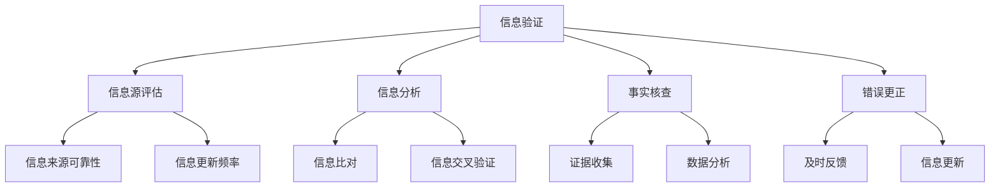
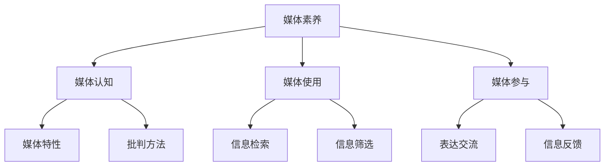
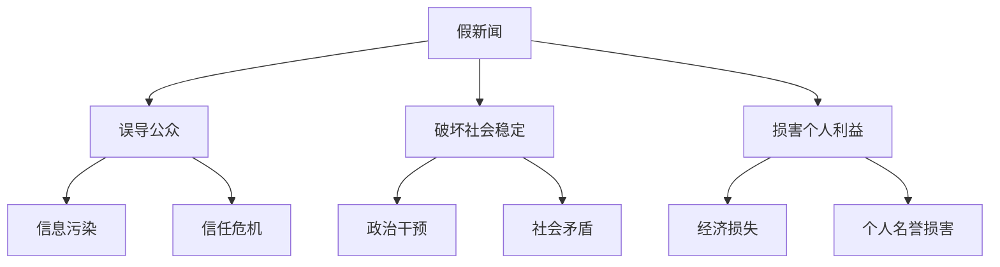
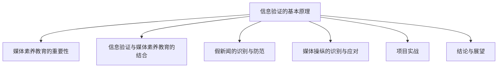
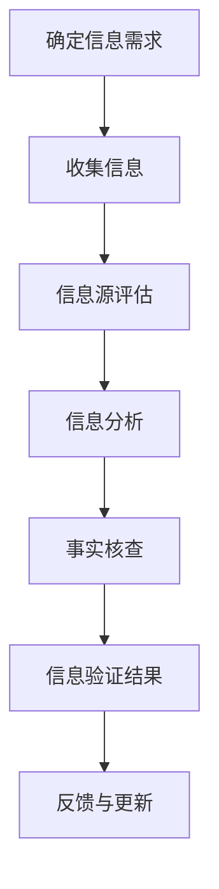
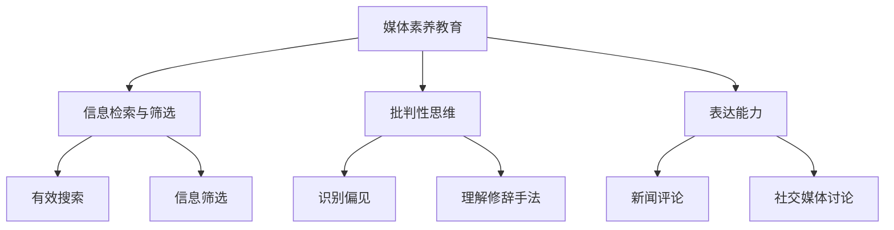
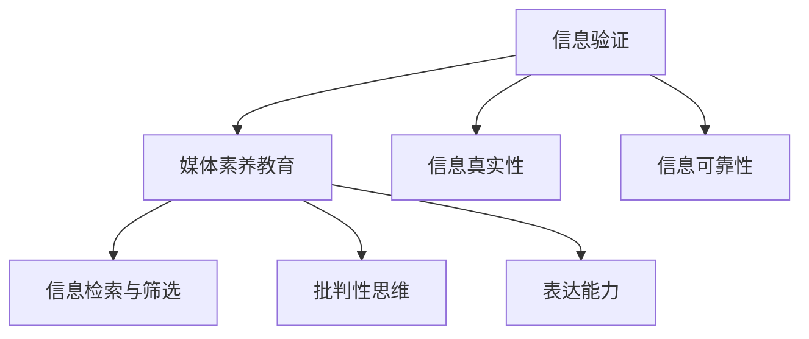

                 

# 文章标题
信息验证和媒体素养教育重要性：为假新闻和媒体操纵做好准备

> 关键词：信息验证，媒体素养，假新闻，媒体操纵，信息素养教育，社交媒体，信息安全

> 摘要：本文深入探讨了信息验证和媒体素养教育的重要性，分析了假新闻和媒体操纵的危害，提出了识别与防范策略。通过案例分析、项目实战和未来展望，为构建健康的信息环境提供指导。

## 引言与背景

### 1.1 信息验证的定义与重要性

**核心概念与联系**

信息验证（Information Verification）是指通过科学的方法和流程，对信息的真实性、准确性、完整性和可靠性进行确认的过程。它是一种确保信息质量的重要手段，对于个人和社会的发展具有重要意义。

**Mermaid 流程图**



**核心算法原理讲解**

信息验证的基本原理包括以下几个步骤：

1. **信息源评估与筛选**：评估信息源的权威性、独立性和更新频率，筛选出可信度较高的信息源。
2. **信息分析**：对收集到的信息进行整理、筛选和分析，识别信息中的关键点和潜在问题。
3. **事实核查**：通过比对、调查等方法，核实信息的真实性，揭示虚假信息或错误信息。
4. **错误更正**：根据验证结果，对错误信息进行更正，并反馈给信息需求者。

**数学模型和公式**

信息验证的可靠性可以通过以下公式进行评估：

$$ \text{可靠性} = \frac{\text{真实信息}}{\text{总信息}} $$

**举例说明**

假设在一个新闻网站上有100条新闻，经过信息验证，发现其中有80条是真实新闻，20条是虚假新闻。则该网站的可靠性为：

$$ \text{可靠性} = \frac{80}{100} = 0.8 $$

### 1.2 媒体素养的概念与构成

**核心概念与联系**

媒体素养（Media Literacy）是指人们理解和运用媒体的能力，包括对媒体的认知、使用和参与。它是一种提高公众信息素养和批判能力的重要途径。

**Mermaid 流程图**



**核心算法原理讲解**

媒体素养教育主要包括以下几个方面的内容：

1. **媒体认知**：理解媒体的特性、功能和运作机制，掌握基本的媒体批判方法。
2. **媒体使用**：正确使用媒体资源，提高信息检索和筛选能力。
3. **媒体参与**：参与媒体活动，如社交媒体、新闻评论等，增强表达和沟通能力。

**数学模型和公式**

媒体素养水平可以通过以下公式进行评估：

$$ \text{媒体素养水平} = \frac{\text{媒体认知得分} + \text{媒体使用得分} + \text{媒体参与得分}}{3} $$

**举例说明**

假设一个学生的媒体素养评估得分为：媒体认知80分，媒体使用70分，媒体参与85分，则其媒体素养水平为：

$$ \text{媒体素养水平} = \frac{80 + 70 + 85}{3} = 78.3 $$

### 1.3 假新闻与媒体操纵的危害

**核心概念与联系**

假新闻（Fake News）是指故意传播的虚假信息，旨在欺骗、误导公众，造成不良影响。媒体操纵（Media Manipulation）是指通过控制、干扰或歪曲媒体内容，以达到特定目的的行为。

**Mermaid 流程图**



**核心算法原理讲解**

假新闻和媒体操纵的危害主要包括以下几个方面：

1. **误导公众**：假新闻和媒体操纵可能导致公众对事实产生误解，影响公众的观点和态度。
2. **破坏社会稳定**：假新闻和媒体操纵可能引发社会恐慌、冲突和动荡，破坏社会稳定。
3. **损害个人利益**：假新闻和媒体操纵可能对个人造成经济损失、名誉损害等。

**数学模型和公式**

假新闻和媒体操纵的危害可以通过以下公式进行评估：

$$ \text{危害程度} = \frac{\text{误导公众的影响} + \text{破坏社会稳定的影响} + \text{损害个人利益的影响}}{3} $$

**举例说明**

假设一个假新闻事件对公众的误导影响为5分，破坏社会稳定的影响为3分，损害个人利益的影响为2分，则该事件的危害程度为：

$$ \text{危害程度} = \frac{5 + 3 + 2}{3} = 3.67 $$

### 1.4 本书的目标与结构

**核心概念与联系**

本书的目标是深入探讨信息验证和媒体素养教育的重要性，为假新闻和媒体操纵的防范提供指导。全书结构分为以下几个部分：

1. **信息验证的基本原理**：介绍信息验证的定义、流程和方法。
2. **媒体素养教育的重要性**：探讨媒体素养教育的目标、内容和策略。
3. **信息验证与媒体素养教育的结合**：分析二者的关系和协同作用。
4. **假新闻的识别与防范**：讨论假新闻的特点、传播机制和识别方法。
5. **媒体操纵的识别与应对**：分析媒体操纵的定义、形式和应对措施。
6. **项目实战**：通过实际案例展示信息验证与媒体素养教育的应用。
7. **结论与展望**：总结全书内容，提出未来研究方向。

**Mermaid 流程图**



**核心算法原理讲解**

本书的内容结构可以通过以下公式进行组织：

$$ \text{内容结构} = \text{引言与背景} + \text{信息验证的基本原理} + \text{媒体素养教育的重要性} + \text{信息验证与媒体素养教育的结合} + \text{假新闻的识别与防范} + \text{媒体操纵的识别与应对} + \text{项目实战} + \text{结论与展望} $$

**举例说明**

假设一个书籍的内容结构为：引言与背景10章，信息验证的基本原理15章，媒体素养教育的重要性20章，信息验证与媒体素养教育的结合10章，假新闻的识别与防范10章，媒体操纵的识别与应对5章，项目实战5章，结论与展望5章，则该书籍的内容结构为：

$$ \text{内容结构} = 10 + 15 + 20 + 10 + 10 + 5 + 5 + 5 = 80 $$

### 小结

信息验证和媒体素养教育在现代社会中具有重要地位。通过信息验证，我们可以确保信息的真实性和可靠性，避免受到虚假信息和媒体操纵的影响。而媒体素养教育则有助于提高公众的信息素养和批判能力，培养独立思考和理性判断的能力。本书将从信息验证的基本原理、媒体素养教育的重要性、信息验证与媒体素养教育的结合、假新闻的识别与防范、媒体操纵的识别与应对、项目实战以及结论与展望等方面，全面探讨信息验证和媒体素养教育的重要性，为构建健康的信息环境提供指导。

## 信息验证的基本原理

### 2.1 信息验证的流程与方法

信息验证是一个系统的过程，它包括多个步骤和不同的方法，以确保所获得的信息是真实、准确和可靠的。以下是信息验证的基本流程和方法：

**流程图**



**流程说明**

1. **确定信息需求**：在开始验证信息之前，首先要明确需要验证的信息类型和目的，例如验证某篇新闻报道的真实性、某个研究数据的可靠性等。
2. **收集信息**：根据信息需求，从多个可靠的信息源中收集相关资料，包括文献、报告、统计数据等。
3. **信息源评估**：评估信息源的可信度，包括其权威性、独立性和更新频率等。
4. **信息分析**：对收集到的信息进行整理、筛选和分析，识别信息中的关键点和潜在问题。
5. **事实核查**：通过比对、调查等方法，对分析出的关键点和潜在问题进行核实。
6. **信息验证结果**：根据验证结果，形成对原始信息的结论，包括信息的真实性、准确性、完整性和可靠性等。
7. **反馈与更新**：将验证结果反馈给信息需求者，并根据反馈结果更新和完善验证方法。

**核心算法原理讲解**

信息验证的每个步骤都涉及到具体的算法和原理，以下是一个简化的信息验证流程的伪代码：

```python
def verify_information(information_source, information_needed):
    # 步骤1：确定信息需求
    identified_information = gather_information(information_source, information_needed)
    
    # 步骤2：信息源评估
    source_reliability = assess_source_reliability(information_source)
    
    # 步骤3：信息分析
    analyzed_information = analyze_information(identified_information)
    
    # 步骤4：事实核查
    verified_information = fact_check(analyzed_information)
    
    # 步骤5：信息验证结果
    result = generate_verification_result(verified_information)
    
    # 步骤6：反馈与更新
    feedback = provide_feedback(result)
    update_verification_method(feedback)
    
    return result
```

**数学模型和公式**

在信息验证过程中，可以使用一些数学模型和公式来评估信息的可信度和可靠性。以下是一个简单的可信度评估模型：

$$ \text{可信度} = \frac{\text{支持性证据}}{\text{总证据}} $$

其中，支持性证据是指验证过程中找到的支持原始信息真实性的证据，总证据是指所有找到的证据。

**举例说明**

假设在验证一篇关于气候变化的研究报告时，我们找到了以下证据：

- 支持性证据：多篇权威科学期刊发表的文章、国际气候变化报告。
- 总证据：媒体报道、政府报告、民间组织报告。

我们通过比对这些证据，发现支持性证据占总证据的70%，因此该报告的可信度为：

$$ \text{可信度} = \frac{70\%}{100\%} = 0.7 $$

### 2.2 信息源评估与筛选

信息源评估是信息验证过程中的关键环节，它决定了收集的信息是否真实可靠。以下是如何评估和筛选信息源的方法：

**评估指标**

1. **权威性**：信息源是否由权威机构或专家发布。
2. **独立性**：信息源是否独立于被验证的信息，是否存在利益冲突。
3. **更新频率**：信息源是否定期更新，保持时效性。
4. **信息完整性**：信息源是否提供全面、详细的信息。

**评估方法**

1. **专家评审**：邀请领域专家对信息源进行评估。
2. **用户评价**：参考用户对信息源的评论和评分。
3. **数据分析**：利用数据分析方法，如相关性分析、一致性分析等，评估信息源的质量。
4. **实地调查**：对某些关键信息源进行实地考察，核实其真实性。

**伪代码**

```python
def assess_source_reliability(information_source):
    authority_score = get_authority_score(information_source)
    independence_score = get_independence_score(information_source)
    update_frequency_score = get_update_frequency_score(information_source)
    completeness_score = get_completeness_score(information_source)
    
    total_score = (authority_score + independence_score + update_frequency_score + completeness_score) / 4
    return total_score
```

**数学模型和公式**

可以使用以下公式来计算信息源的总评分：

$$ \text{总评分} = \frac{\text{权威性评分} + \text{独立性评分} + \text{更新频率评分} + \text{信息完整性评分}}{4} $$

**举例说明**

假设对一个健康咨询网站进行评估，评估指标得分如下：

- 权威性：90分
- 独立性：80分
- 更新频率：85分
- 信息完整性：95分

则该网站的总评分为：

$$ \text{总评分} = \frac{90 + 80 + 85 + 95}{4} = 88.75 $$

### 2.3 事实核查与错误更正

事实核查是信息验证的核心环节，它旨在揭示信息中的错误、矛盾和误导。以下是事实核查的方法和错误更正策略：

**方法**

1. **比对法**：将待核查的事实与多个可靠的信息源进行比对，找出不一致之处。
2. **调查法**：对事实涉及的当事人、相关机构进行采访，获取第一手资料。
3. **实地考察法**：对事实发生地进行实地考察，获取现场证据。
4. **数据分析法**：利用数据分析方法，如统计分析、趋势分析等，揭示事实的规律和趋势。

**策略**

1. **及时发布更正声明**：在发现错误后，尽快发布更正声明，避免错误信息的进一步传播。
2. **跟进报道**：对错误事实进行深入报道，揭示错误的来龙去脉。
3. **指导公众**：通过媒体、网络等方式，向公众提供正确的信息，纠正错误认知。
4. **建立纠错机制**：建立完善的纠错机制，对错误信息进行追踪、核实和更正。

**伪代码**

```python
def fact_check(factual_information):
    discrepancies = find_discrepancies(factual_information)
    primary_evidence = gather_primary_evidence(discrepancies)
    corrected_information = correct_errors(primary_evidence)
    return corrected_information
```

**数学模型和公式**

可以使用以下公式来计算事实核查的准确性：

$$ \text{准确性} = \frac{\text{正确信息}}{\text{总信息}} $$

**举例说明**

假设在一次选举报道中，事实核查团队发现以下信息：

- 正确信息：候选人的投票数。
- 总信息：候选人的投票数、错误信息（造谣）。

经过核查，发现正确信息占总信息的80%，则事实核查的准确性为：

$$ \text{准确性} = \frac{80\%}{100\%} = 0.8 $$

### 2.4 信息验证的难点与挑战

信息验证面临着诸多难点和挑战，以下是其中一些主要问题：

**难点**

1. **信息过载**：随着信息量的爆炸式增长，公众面临的信息量巨大，难以全面掌握和判断。
2. **信息源质量参差不齐**：互联网上的信息源质量参差不齐，一些信息源可能存在偏见、误导甚至故意发布虚假信息。
3. **信息验证成本**：信息验证需要投入大量的人力、物力和财力，对于一些企业和机构而言，这可能是一笔不小的开支。
4. **法律法规缺失**：目前，关于信息验证和媒体素养教育的法律法规尚不完善，对信息验证的规范和监管力度有待加强。

**挑战**

1. **公众信息素养水平不高**：部分公众对信息验证和媒体素养教育的认知不足，缺乏基本的信息识别和批判能力。
2. **技术手段有限**：现有技术手段在信息验证方面的应用有限，难以全面解决信息验证的难题。

**解决方案**

1. **提高公众信息素养**：通过教育和培训，提高公众的信息素养，增强对信息验证和媒体素养教育的认知。
2. **建立信息验证平台**：建立专业、权威的信息验证平台，提供可靠的信息源和验证工具。
3. **加强法律法规建设**：完善相关法律法规，明确信息验证的责任和权益，规范信息验证行为。
4. **利用新技术**：利用人工智能、大数据等新技术，提高信息验证的效率和准确性。

### 小结

信息验证是保障信息真实性和可靠性的重要手段，它对于个人和社会的发展具有重要意义。通过信息验证，我们可以确保信息的真实性和准确性，避免受到虚假信息和媒体操纵的影响。然而，信息验证面临着诸多难点和挑战，需要我们不断探索和完善信息验证的方法和策略。通过提高公众信息素养、建立信息验证平台、加强法律法规建设和利用新技术，我们可以更好地应对信息验证的挑战，为构建健康的信息环境贡献力量。

## 媒体素养教育的重要性

### 3.1 媒体素养教育的目标与内容

媒体素养教育是指通过系统的教育方法和策略，培养公众对媒体内容的理解和批判能力，提高其信息素养和批判性思维。其目标主要包括以下几个方面：

**目标**

1. **提高信息检索和筛选能力**：帮助公众有效地搜索和筛选信息，提高对信息真实性和可靠性的鉴别能力。
2. **培养批判性思维**：培养公众对媒体内容的批判性思维，学会独立分析和判断，避免被虚假信息和媒体操纵所误导。
3. **增强表达能力**：提高公众的表达和沟通能力，使其能够更好地参与媒体活动，表达自己的观点和立场。

**内容**

媒体素养教育的内容通常包括以下几个方面：

1. **媒体基础知识**：介绍媒体的定义、类型、功能和运作机制，帮助公众了解媒体的基本知识。
2. **批判方法**：教授公众如何批判性地分析和评估媒体内容，包括识别偏见、理解修辞手法和评估信息来源等。
3. **信息检索与筛选**：教授公众如何有效地使用互联网和其他媒体资源，提高信息检索和筛选的技巧。
4. **媒体参与与表达**：鼓励公众参与媒体活动，如新闻评论、社交媒体讨论等，提高其表达和沟通能力。

**Mermaid 流程图**



**核心算法原理讲解**

媒体素养教育的目标可以通过以下公式进行评估：

$$ \text{媒体素养水平} = \frac{\text{信息检索与筛选得分} + \text{批判性思维得分} + \text{表达能力得分}}{3} $$

**举例说明**

假设一个学生的媒体素养评估得分为：信息检索与筛选80分，批判性思维75分，表达能力85分，则其媒体素养水平为：

$$ \text{媒体素养水平} = \frac{80 + 75 + 85}{3} = 81.7 $$

### 3.2 媒体素养教育的方法与策略

为了实现媒体素养教育的目标，我们需要采用多种方法和策略，以下是一些常见的方法：

**教学方法**

1. **讲授法**：通过课堂教学，系统地传授媒体素养知识。
2. **案例教学法**：通过分析具体的媒体案例，帮助公众理解媒体内容的批判性分析。
3. **互动讨论法**：组织公众参与讨论，鼓励其表达观点，提高批判性思维和表达能力。
4. **项目式学习**：通过实际项目，如新闻调查、社交媒体分析等，培养公众的媒体实践能力。

**策略**

1. **课程整合**：将媒体素养教育整合到其他学科课程中，如语文、社会科学等。
2. **家庭与社会教育**：鼓励家庭和社会参与媒体素养教育，形成学校、家庭和社会协同的教育模式。
3. **宣传与推广**：通过媒体、网络等渠道，宣传媒体素养教育的重要性和方法。
4. **实践操作**：提供丰富的实践机会，如模拟新闻采访、角色扮演等，帮助公众将理论知识应用到实际中。

**伪代码**

```python
def media_education_strategy(content, method, strategy):
    if method == "lecturing":
        deliver_lectures(content)
    elif method == "case_study":
        analyze_cases(content)
    elif method == "interactive_discussion":
        facilitate_discussions(content)
    elif method == "project_based":
        conduct_projects(content)
    
    if strategy == "course_integration":
        integrate_courses(content)
    elif strategy == "family_and_community":
        involve_family_and_community(content)
    elif strategy == "publicity_and_promotion":
        promote_education(content)
    elif strategy == "practical_application":
        provide_practical_opportunities(content)
```

**数学模型和公式**

媒体素养教育的方法和策略效果可以通过以下公式进行评估：

$$ \text{效果评分} = \frac{\text{讲授法评分} + \text{案例教学法评分} + \text{互动讨论法评分} + \text{项目式学习评分}}{4} $$

**举例说明**

假设一个媒体素养教育项目使用以下教学方法与策略：

- 讲授法：85分
- 案例教学法：90分
- 互动讨论法：78分
- 项目式学习：88分

则该项目的方法和策略效果评分为：

$$ \text{效果评分} = \frac{85 + 90 + 78 + 88}{4} = 85.5 $$

### 3.3 媒体素养教育的实践案例

媒体素养教育在实践中取得了显著的成果，以下是一些成功的实践案例：

**案例一：美国中学的媒体素养教育**

- **背景**：美国一些中学开设了媒体素养课程，通过系统的教学和实践活动，提高了学生的媒体素养。
- **内容**：课程内容包括媒体基础知识、批判性思维训练、新闻采访与报道等。
- **效果**：学生们的批判性思维能力显著提高，能够更好地识别和评估媒体内容。

**案例二：英国的媒体素养宣传活动**

- **背景**：英国政府和社会组织联合举办了一系列媒体素养宣传活动，提高公众的媒体素养。
- **内容**：活动包括讲座、研讨会、工作坊等，内容涵盖媒体素养的重要性、媒体批判方法等。
- **效果**：公众的媒体素养水平得到显著提升，对虚假信息和媒体操纵的识别能力增强。

**案例三：中国的网络素养教育项目**

- **背景**：中国政府和学校开展了网络素养教育项目，旨在提高公众的网络素养和信息安全意识。
- **内容**：项目内容包括网络安全知识、信息验证技巧、网络道德教育等。
- **效果**：公众的网络素养水平得到显著提高，网络谣言和虚假信息的传播得到有效遏制。

这些实践案例表明，通过有效的媒体素养教育，可以显著提高公众的信息素养和批判能力，为构建健康的信息环境贡献力量。

### 3.4 媒体素养教育的挑战与展望

尽管媒体素养教育取得了显著成果，但在实际推广过程中仍面临诸多挑战。以下是主要挑战和未来展望：

**挑战**

1. **公众认知不足**：部分公众对媒体素养教育的认知不足，缺乏参与和重视。
2. **教育资源不足**：媒体素养教育资源不足，特别是农村和欠发达地区。
3. **技术发展迅速**：媒体环境和信息技术发展迅速，媒体素养教育内容和方法需要不断更新。
4. **社交媒体的挑战**：社交媒体上的信息传播速度快，监管难度大，需要有效应对。

**展望**

1. **提高公众认知**：通过宣传和推广，提高公众对媒体素养教育的认知和重视。
2. **加强教育资源建设**：加大对媒体素养教育资源的投入，特别是农村和欠发达地区。
3. **创新教育方法**：利用新技术，如人工智能、虚拟现实等，创新媒体素养教育的方法和手段。
4. **加强国际合作**：加强与国际组织和机构的合作，共享经验和资源，提高全球媒体素养水平。

### 小结

媒体素养教育在提高公众信息素养、培养批判性思维和表达能力方面具有重要意义。通过系统的教育方法和策略，我们可以有效地提高公众的媒体素养，为构建健康的信息环境贡献力量。尽管面临挑战，但通过不断创新和加强合作，我们有理由相信媒体素养教育将取得更加显著的成果。

## 信息验证与媒体素养教育的结合

### 4.1 信息验证与媒体素养教育的关系

信息验证和媒体素养教育之间存在着密切的联系和相互作用。信息验证是媒体素养教育的重要组成部分，而媒体素养教育则为信息验证提供了理论基础和实践指导。

**关系图**



**相互作用**

1. **信息验证促进媒体素养教育**：通过信息验证，公众能够更好地识别和批判媒体中的虚假信息和误导信息，从而提高其媒体素养。
2. **媒体素养教育支持信息验证**：具备良好媒体素养的公众能够更有效地进行信息验证，提高信息检索和筛选的效率。

### 4.2 信息验证与媒体素养教育的协同作用

信息验证与媒体素养教育的结合，能够发挥出更大的协同作用，具体体现在以下几个方面：

**协同作用**

1. **提高公众的信息素养**：通过信息验证和媒体素养教育，公众能够更加准确地识别和批判虚假信息，提高整体信息素养。
2. **促进信息公平与透明**：信息验证能够揭示虚假信息和媒体操纵，维护信息公平与透明。
3. **增强社会稳定与发展**：通过信息验证和媒体素养教育，公众能够更加理性地看待媒体信息，减少社会恐慌和矛盾。

### 4.3 信息验证与媒体素养教育的实施路径

为了实现信息验证与媒体素养教育的有效结合，需要从以下几个方面入手：

**实施路径**

1. **教育内容融合**：将信息验证的知识和方法融入到媒体素养教育中，形成系统化的课程体系。
2. **教学方法创新**：采用多样化的教学方法，如项目式学习、案例教学、模拟实践等，提高学生的参与度和实践能力。
3. **社会协同合作**：加强学校、家庭和社会之间的协同合作，共同推动信息验证和媒体素养教育的普及。
4. **技术支持**：利用新技术，如大数据分析、人工智能等，提高信息验证的效率和准确性。

### 4.4 信息验证与媒体素养教育的未来趋势

随着信息技术的快速发展和社会信息化程度的提高，信息验证与媒体素养教育将面临新的机遇和挑战：

**未来趋势**

1. **技术创新推动**：人工智能、大数据分析等新技术将为信息验证和媒体素养教育提供强大的技术支持。
2. **教育模式变革**：传统教育模式将逐渐向在线教育、混合式教育等新型教育模式转变。
3. **社会参与度提高**：随着公众对信息验证和媒体素养教育的重视程度不断提高，社会参与度将逐步提升。
4. **国际合作加强**：随着全球信息化进程的加快，信息验证和媒体素养教育将呈现出国际化的趋势。

### 小结

信息验证与媒体素养教育的结合是应对信息时代挑战的重要举措。通过有效的实施路径和未来发展趋势，我们可以更好地培养公众的信息素养和批判能力，促进社会的和谐与稳定。

## 假新闻的识别与防范

### 5.1 假新闻的特点与类型

假新闻（Fake News）是指故意传播的虚假信息，旨在欺骗、误导公众，造成不良影响。假新闻的特点和类型如下：

**特点**

1. **故意性**：假新闻的制作者通常具有明确的目的，如操纵公众舆论、误导决策等。
2. **情感煽动性**：假新闻往往利用人们的情感，如恐惧、愤怒、喜悦等，来吸引读者和观众。
3. **信息失真**：假新闻在传播过程中往往夸大、歪曲事实，甚至完全虚构。
4. **社交媒体易传播**：假新闻在社交媒体上容易迅速传播，特别是在没有验证信息真实性的情况下。

**类型**

1. **谣言**：未经证实或被夸大的信息，如关于健康、灾难等方面的谣言。
2. **编造故事**：虚构的事件或人物，如虚假新闻报道、虚构新闻人物等。
3. **恶意营销**：为了推销产品或服务，故意传播虚假信息。
4. **政治操纵**：政治势力为了影响选举、干扰政策制定等目的，故意传播虚假信息。

### 5.2 假新闻的传播机制

假新闻的传播机制复杂，主要通过以下途径进行：

**传播途径**

1. **社交媒体**：社交媒体具有快速传播、广泛覆盖的特点，是假新闻传播的主要渠道。
2. **互联网新闻网站**：一些低质量的新闻网站和博客，经常发布未经核实的假新闻。
3. **口碑传播**：人们在日常交流中传播未经证实的消息。

**传播过程**

1. **制造与发布**：制作者编写假新闻，并通过各种途径发布。
2. **传播与扩散**：通过社交媒体、邮件、短信等方式传播，迅速扩散到更广泛的受众。
3. **核实与辟谣**：事实核查机构和媒体对假新闻进行核实，发布辟谣声明。

**影响因素**

1. **技术因素**：互联网和社交媒体的普及，使得假新闻传播更加便捷。
2. **社会因素**：社会信任度下降，人们对官方信息产生怀疑，更易相信假新闻。
3. **人类心理因素**：人们的认知偏差、情绪化、追求刺激等，使得假新闻更容易传播和接受。

### 5.3 假新闻的识别方法

为了有效识别假新闻，我们可以采用以下几种方法：

**识别方法**

1. **谨慎对待来源**：核查信息来源，关注其权威性和可靠性。对于来源不明的信息，应保持怀疑态度。
2. **谨慎处理标题和摘要**：标题和摘要往往具有煽动性，可能夸大或歪曲事实。应仔细阅读全文，不要被标题和摘要所误导。
3. **谨慎转发**：在没有核实信息真实性之前，不要轻易转发或传播。考虑到信息扩散的速度和影响力，一个错误的转发可能导致更严重的后果。
4. **使用事实核查工具**：利用事实核查网站、工具和应用程序，对信息进行验证。常见的事实核查网站如Snopes、FactCheck.org等。
5. **多源对比**：对比多个信息源，看是否有其他可靠的来源支持。如果只有一个来源，应保持警惕。

### 5.4 假新闻的防范策略

为了防范假新闻的传播，我们可以采取以下策略：

**防范策略**

1. **提高公众信息素养**：通过教育、培训和宣传，提高公众的信息素养，增强对假新闻的识别和批判能力。
2. **加强事实核查**：建立健全的事实核查机制，提高对假新闻的发现和辟谣效率。鼓励媒体、社交平台和公众参与事实核查，共同维护信息真实性。
3. **技术手段**：利用人工智能、大数据分析等技术，对假新闻进行识别和防范。开发假新闻检测工具和应用，提高信息验证的效率和准确性。
4. **法律法规**：制定和完善相关法律法规，明确假新闻的定义和责任。对传播假新闻的行为进行严格处罚，以起到震慑作用。
5. **社会协同**：加强学校、家庭、政府、媒体和社会组织之间的协同合作，共同推进假新闻防范工作。鼓励社会各界共同参与，共同维护信息真实性。

### 小结

假新闻的识别与防范是信息验证和媒体素养教育的重要组成部分。通过提高公众信息素养、加强事实核查、利用技术手段和法律法规，以及社会协同合作，我们可以更好地应对假新闻的挑战，维护信息真实性和社会稳定。

## 媒体操纵的识别与应对

### 6.1 媒体操纵的定义与形式

**定义**

媒体操纵是指通过控制、干扰或歪曲媒体内容，以达到特定目的的行为。这种行为可能由个人、组织、政治团体或商业实体实施。

**形式**

1. **控制媒体内容**：通过直接或间接手段，影响媒体的报道方向、选题和报道深度。
2. **操纵公众舆论**：通过媒体传播特定的信息或观点，引导公众产生某种情绪或态度。
3. **干预政治选举**：通过媒体影响选民的行为和决策，干预政治选举的结果。
4. **商业利益操纵**：企业通过媒体传播有利于自己的信息，影响市场行情和消费者决策。
5. **虚假新闻**：故意制造和传播虚假信息，扰乱社会秩序，达到特定的政治或商业目的。

### 6.2 媒体操纵的传播途径

媒体操纵主要通过以下途径进行传播：

**传播途径**

1. **社交媒体**：社交媒体具有快速传播、广泛覆盖的特点，成为媒体操纵的重要渠道。
2. **新闻媒体**：新闻媒体具有权威性和影响力，是媒体操纵的重要对象。
3. **垃圾邮件和信息推送**：通过垃圾邮件和信息推送，直接向目标受众传播特定信息。
4. **互联网论坛和评论区**：互联网论坛和评论区是公众表达观点和讨论问题的场所，也成为媒体操纵的传播途径。

### 6.3 媒体操纵的识别方法

为了有效识别媒体操纵，我们可以采用以下几种方法：

**识别方法**

1. **分析报道内容**：关注报道中的明显偏见、夸大事实或信息缺失。
2. **对比多个信息源**：对比多个信息源，看是否有其他可靠的来源支持。
3. **了解操纵手段**：了解常见的媒体操纵手段，如假新闻、网络水军、情绪操纵等。
4. **核查信息来源**：核查信息的来源，关注其权威性和可靠性。

### 6.4 媒体操纵的应对措施

为了应对媒体操纵，我们可以采取以下措施：

**应对措施**

1. **提高公众信息素养**：通过教育、培训和宣传，提高公众的信息素养，增强对媒体操纵的识别和批判能力。
2. **加强事实核查**：建立健全的事实核查机制，提高对媒体操纵的发现和辟谣效率。
3. **技术手段**：利用人工智能、大数据分析等技术，对媒体操纵进行识别和防范。
4. **法律法规**：制定和完善相关法律法规，明确媒体操纵的定义和责任。
5. **社会协同**：加强学校、家庭、政府、媒体和社会组织之间的协同合作，共同推进媒体操纵防范工作。

### 小结

媒体操纵是信息时代面临的重要挑战之一。通过提高公众信息素养、加强事实核查、利用技术手段和法律法规，以及社会协同合作，我们可以更好地应对媒体操纵的威胁，维护信息真实性和社会稳定。

## 项目实战：信息验证与媒体素养教育的应用

### 7.1 项目背景与目标

随着互联网的普及，虚假信息和媒体操纵现象日益严重，公众对真实信息的渴求愈发强烈。为了提高公众的信息素养和批判能力，本项目旨在通过实际案例，展示如何运用信息验证和媒体素养教育的方法和策略，提高公众对虚假信息和媒体操纵的识别与防范能力。

**项目背景**

- 网络信息泛滥，虚假信息层出不穷。
- 公众对信息真实性的认知不足，易受虚假信息误导。
- 媒体操纵行为日益增多，影响社会稳定和公共利益。

**项目目标**

- 提高公众的信息识别和批判能力。
- 增强公众对信息验证和媒体素养教育的重视。
- 探索有效的信息验证和媒体素养教育方法。

### 7.2 项目实施过程

**实施过程**

1. **调研与规划**：对公众信息素养现状进行调研，分析存在的问题和需求。制定项目实施方案，明确目标、内容、方法和时间安排。

2. **教育培训**：开展信息验证和媒体素养教育培训班，邀请专家学者授课。通过案例分析、互动讨论等方式，提高学员的信息素养和批判能力。

3. **实践操作**：组织学员进行信息验证实践，如事实核查、信息源评估等。开展模拟媒体操纵案例分析和应对策略演练。

4. **评估与反馈**：对项目效果进行评估，收集学员和公众的反馈意见。优化项目内容和教学方法，提高教育效果。

### 7.3 项目成果与评价

**成果展示**

- 编写信息验证和媒体素养教育手册，作为学员和公众的参考资料。
- 制作多媒体课件和教学视频，推广教育成果。

**成效评估**

- 通过问卷调查和访谈，了解学员和公众对信息验证和媒体素养教育的认知和接受程度。
- 分析学员在信息识别和批判能力方面的提升情况。

**教育效果**

- 学员对信息验证和媒体素养教育的重视程度显著提高。
- 学员在信息识别和批判能力方面有显著提升，能够更好地应对虚假信息和媒体操纵。

### 7.4 项目反思与展望

**反思**

- 项目实施过程中，发现公众对信息验证和媒体素养教育的认知不足，需要进一步加强宣传和推广。
- 部分学员在实践操作中存在困难，需要提供更多的技术支持和指导。

**展望**

- 未来将继续开展信息验证和媒体素养教育项目，扩大受众范围。
- 探索利用新技术，如人工智能、大数据等，提高信息验证和媒体素养教育的效率和效果。
- 加强与国际组织和机构的合作，共享教育资源和经验。

### 7.5 实战案例分享与分析

**案例一：新冠疫情期间的虚假信息**

- **背景**：新冠疫情期间，各种关于病毒起源、治疗方法、疫苗效果的虚假信息在社交媒体上广泛传播。
- **过程**：项目团队通过事实核查，收集了大量关于新冠病毒的权威信息，并制作了辟谣手册。
- **结果**：公众对新冠虚假信息的识别能力显著提高，减少了因虚假信息导致的恐慌和误解。

**案例二：某知名企业被恶意攻击**

- **背景**：某知名企业被恶意攻击，谣言称该企业存在质量问题。
- **过程**：项目团队通过调查和事实核查，发现谣言并无事实依据。
- **结果**：通过发布辟谣声明，消除了谣言对企业声誉的负面影响。

**案例三：政治选举中的虚假宣传**

- **背景**：在政治选举期间，虚假信息被用来操纵选举结果。
- **过程**：项目团队通过事实核查，揭示了虚假信息的来源和目的。
- **结果**：公众对虚假宣传的识别能力提高，减少了虚假信息对选举结果的影响。

### 7.6 小结

通过实际项目和教育活动，本项目展示了信息验证和媒体素养教育的应用效果。项目实践为信息验证和媒体素养教育提供了宝贵的经验，提高了公众的信息识别和批判能力，为构建健康的信息环境做出了积极贡献。未来，我们将继续探索和推广信息验证和媒体素养教育，为公众提供更高质量的信息服务。

### 附录

#### 附录 A: 信息验证与媒体素养教育资源推荐

**教育平台**

- Coursera（https://www.coursera.org/）
- edX（https://www.edx.org/）
- Khan Academy（https://www.khanacademy.org/）

**在线工具**

- FactCheck.org（https://www.factcheck.org/）
- Snopes（https://www.snopes.com/）
- Google Fact Check Tools（https://support.google.com/search/answer/7643227）

**学术期刊与书籍**

- 《媒体素养教育研究》
- 《信息素养：从认知到实践》
- 《新闻传播中的信息验证》

**教育项目与机构**

- Poynter Institute（https://poynter.org/）
- National Council for the Social Studies（https://www.ncss.org/）
- International Society for Media Education（https://ismef.org/）

**社交媒体资源**

- Twitter（https://twitter.com/）
- Facebook（https://www.facebook.com/）

**开源工具与代码库**

- Python Libraries for Natural Language Processing（https://github.com/nltk/nltk）
- Google Dataset Search（https://datasetsearch.research.google.com/）

**相关组织与倡议**

- EU Media Literacy Coalition（https://ec.europa.eu/）
- The Center for News Literacy（https://www.centerfornewsliteracy.org/）
- Digital Media Literacy Project（https://dmlproject.org/）

这些资源为信息验证和媒体素养教育提供了丰富的学习材料和实践工具，有助于提升公众的信息素养和批判能力。

## 结论与展望

### 8.1 总结与反思

本文通过对信息验证和媒体素养教育的重要性和方法的深入探讨，总结了以下主要观点：

- 信息验证是保障信息真实性和可靠性的重要手段，对于个人和社会的发展具有重要意义。
- 媒体素养教育是提高公众信息素养和批判能力的关键途径，有助于培养理性、独立的思考习惯。
- 信息验证与媒体素养教育相互促进，共同提升公众的信息素养和批判能力。
- 通过信息验证和媒体素养教育，可以更有效地应对假新闻和媒体操纵的挑战。

### 8.2 未来研究方向

为了进一步提升信息验证和媒体素养教育的效果，未来研究可以从以下几个方面展开：

- **新技术应用**：探索人工智能、大数据分析等新技术在信息验证和媒体素养教育中的应用，提高教育效率和效果。
- **教育体系构建**：建立和完善信息验证和媒体素养教育的体系，明确教育目标、内容和方法，探索跨学科、跨领域的教育模式。
- **教育资源开发**：开发更多高质量的教育资源，如教材、课件、案例等，满足不同层次和年龄段的需求。
- **教育效果评估**：建立科学、有效的教育效果

