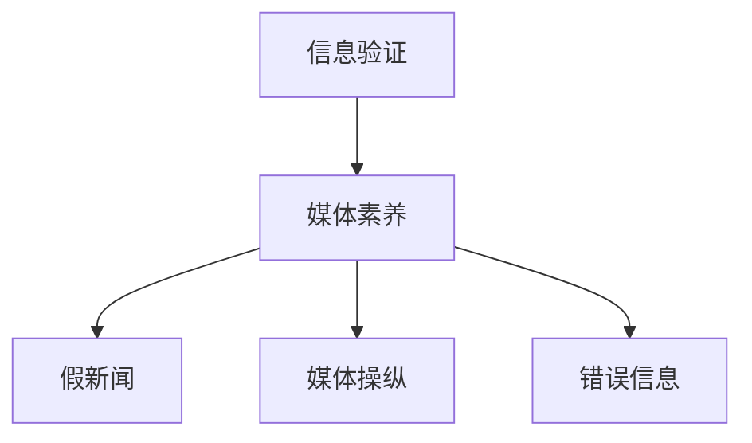

                 

# 文章标题：信息验证和媒体素养教育：为假新闻、媒体操纵和错误信息时代做好准备

> 关键词：信息验证、媒体素养、假新闻、媒体操纵、错误信息

> 摘要：在信息爆炸的时代，信息验证和媒体素养教育变得至关重要。本文探讨了信息验证和媒体素养教育的核心概念、算法原理、项目实战以及相关工具与资源，旨在为读者提供一套应对假新闻、媒体操纵和错误信息的全面解决方案。

## 第一部分：核心概念与联系

### 核心概念与联系

在《信息验证和媒体素养教育：为假新闻、媒体操纵和错误信息时代做好准备》中，我们需要首先建立核心概念与它们之间的联系。以下是几个关键概念及其相互关系：

- **信息验证**：对信息的真实性、准确性和可靠性进行核查的过程。
- **媒体素养**：对媒体信息的识别、理解、评估和批判能力。
- **假新闻**：虚假、误导性或扭曲的信息，常通过媒体传播。
- **媒体操纵**：通过控制媒体内容来影响公众意见、行为或政策。
- **错误信息**：不准确、不准确或误导性的信息。


### Mermaid 流程图

以下是一个Mermaid流程图，展示了这些概念之间的关系：



## 目录

### 第一部分：核心概念与联系

1. **信息验证与媒体素养概述**
   - 1.1 信息验证与媒体素养的重要性
   - 1.2 媒体素养的基本要素
   - 1.3 假新闻与媒体操纵的识别
   - 1.4 错误信息的来源与影响

### 第二部分：核心算法原理讲解

2. **信息验证算法**
   - 2.1 信息验证算法的基本原理
   - 2.2 事实核查网站与工具
   - 2.3 数据分析与可视化在信息验证中的应用

3. **媒体素养评估算法**
   - 3.1 媒体素养评估算法的基本原理
   - 3.2 媒体素养评估的指标与模型
   - 3.3 媒体素养评估的应用场景

### 第三部分：数学模型和数学公式

4. **逻辑回归模型**
   - 4.1 逻辑回归公式
   - 4.2 逻辑回归模型的推导
   - 4.3 逻辑回归模型的应用

5. **贝叶斯模型**
   - 5.1 贝叶斯公式
   - 5.2 贝叶斯模型的推导
   - 5.3 贝叶斯模型的应用

6. **支持向量机（SVM）**
   - 6.1 SVM公式
   - 6.2 SVM的推导
   - 6.3 SVM的应用

### 第四部分：项目实战

7. **信息验证项目实战**
   - 7.1 实践背景
   - 7.2 开发环境搭建
   - 7.3 实现步骤
   - 7.4 代码解读与分析

8. **媒体素养教育项目实战**
   - 8.1 实践背景
   - 8.2 开发环境搭建
   - 8.3 实现步骤
   - 8.4 代码解读与分析

9. **错误信息纠正项目实战**
   - 9.1 实践背景
   - 9.2 开发环境搭建
   - 9.3 实现步骤
   - 9.4 代码解读与分析

### 第五部分：附录

10. **附录 A: 信息验证与媒体素养教育工具与资源**
    - 10.1 信息验证工具
    - 10.2 媒体素养教育工具
    - 10.3 开发工具与资源
    - 10.4 相关论文与书籍

### 第六部分：全书总结

11. **全书总结**
    - 11.1 核心内容回顾
    - 11.2 未来展望
    - 11.3 作者信息

## 第一部分：核心概念与联系

### 核心概念与联系

在当今信息爆炸的时代，信息验证和媒体素养教育变得尤为重要。信息验证是指对信息的真实性、准确性和可靠性进行核查的过程，而媒体素养则是指对媒体信息的识别、理解、评估和批判能力。这两个概念紧密相连，共同构成了应对假新闻、媒体操纵和错误信息的重要防线。

**信息验证**：信息验证是一个多步骤的过程，涉及多个环节，包括信息来源的核查、事实核查、数据分析与可视化等。其目的是确保信息的真实性，避免误导和谣言的传播。

**媒体素养**：媒体素养则强调个体对媒体信息的批判性思考能力，包括识别信息来源、评估信息的可靠性、理解信息的深层含义等。通过提高媒体素养，个体能够更好地抵御虚假信息和媒体操纵的影响。

除了信息验证和媒体素养，我们还必须了解以下概念：

**假新闻**：假新闻是指虚假、误导性或扭曲的信息，通常通过社交媒体、新闻网站等渠道传播。假新闻的传播可能导致公众误解、恐慌甚至社会动荡。

**媒体操纵**：媒体操纵是指通过控制媒体内容来影响公众意见、行为或政策的过程。媒体操纵可能涉及新闻筛选、信息操控、舆论引导等手段。

**错误信息**：错误信息是指不准确、不完整或误导性的信息。错误信息可能导致个体做出错误决策，甚至对社会造成负面影响。

这些概念相互交织，共同构成了信息验证和媒体素养教育的研究领域。理解这些概念之间的联系，有助于我们更好地应对当前的信息环境挑战。


### 核心概念与联系 Mermaid 流程图


通过这个流程图，我们可以清晰地看到这些概念之间的逻辑关系。信息验证是基础，它为媒体素养提供了支持；而媒体素养则是关键，它帮助个体识别和应对假新闻、媒体操纵和错误信息。

### 总结

本节我们介绍了信息验证、媒体素养、假新闻、媒体操纵和错误信息这五个核心概念，并展示了它们之间的相互关系。在接下来的章节中，我们将深入探讨这些概念背后的算法原理、数学模型和实际应用案例，帮助读者全面了解和应对当前的信息环境挑战。

## 第二部分：核心算法原理讲解

### 2.1 信息验证算法

信息验证算法是信息验证过程中的核心组成部分，它帮助识别和验证信息的真实性、准确性和可靠性。在本节中，我们将详细讲解信息验证算法的基本原理、实现步骤和关键因素。

#### 2.1.1 基本原理

信息验证算法的基本原理是通过多种方法对信息进行核查，以确保其真实性。这些方法包括：

1. **来源核查**：验证信息来源的可靠性，确保信息来自权威或可信的来源。
2. **事实核查**：对信息的具体内容进行核查，确保其与事实相符。
3. **交叉验证**：通过不同来源的信息交叉比对，提高信息验证的准确性。

#### 2.1.2 实现步骤

信息验证算法通常包括以下步骤：

1. **获取信息**：从可靠的来源获取需要验证的信息。
2. **预处理信息**：对获取的信息进行格式化、去噪等预处理，以便后续分析。
3. **来源核查**：验证信息来源的可靠性，包括检查来源的信誉度、历史记录等。
4. **事实核查**：对信息内容进行事实核查，通常涉及查找权威资料、数据库等。
5. **交叉验证**：对多个信息源进行交叉验证，确保信息的一致性和准确性。
6. **输出结果**：根据核查结果，输出信息是否真实的判断。

以下是一个简化的信息验证算法的伪代码：

```plaintext
Algorithm InformationVerification(message, source):
    if source is reliable:
        perform fact-checking on the message content
        if message content is factual:
            return "Message is true."
        else:
            return "Message is false."
    else:
        return "Source is unreliable."
```

#### 2.1.3 关键因素

信息验证算法的关键因素包括：

1. **信息来源的可靠性**：确保信息来自可信的来源是信息验证的基础。
2. **事实核查的准确性**：准确的事实核查是确保信息真实性的关键。
3. **交叉验证的有效性**：通过多个来源的信息交叉验证，可以进一步提高信息验证的准确性。

### 2.2 事实核查网站与工具

事实核查网站与工具是信息验证过程中不可或缺的一部分。以下是一些常见的事实核查网站和工具：

1. **FactCheck.org**：
   - 地址：[https://www.factcheck.org/](https://www.factcheck.org/)
   - 描述：FactCheck.org 是一个非营利组织，致力于评估媒体上的虚假和误导性信息。

2. **Snopes**：
   - 地址：[https://www.snopes.com/](https://www.snopes.com/)
   - 描述：Snopes 是一个著名的谣言验证网站，提供关于网络谣言的详细分析。

3. **PolitiFact**：
   - 地址：[https://www.politifact.com/](https://www.politifact.com/)
   - 描述：PolitiFact 是一个专注于评估政治声明真实性的网站。

4. **Factual**：
   - 地址：[https://factual.com/](https://factual.com/)
   - 描述：Factual 提供事实核查服务，适用于各种类型的声明和谣言。

5. **MediCheck**：
   - 地址：[https://medichecker.com/](https://medichecker.com/)
   - 描述：MediCheck 是一个针对医学信息的核查工具，提供准确的医疗信息评估。

#### 2.2.1 事实核查网站与工具的使用

使用事实核查网站与工具通常包括以下步骤：

1. **输入查询**：在事实核查网站或工具的搜索框中输入需要核查的信息或声明。
2. **结果分析**：查看事实核查网站或工具提供的核查结果，包括信息是否真实、证据的来源等。
3. **参考来源**：在核查结果中通常会有参考文献或数据来源，有助于进一步验证信息的真实性。

### 2.3 数据分析与可视化在信息验证中的应用

数据分析与可视化在信息验证中发挥着重要作用。通过对大量信息进行数据分析，可以识别出潜在的虚假信息、误导性信息或错误信息。以下是一些常用的数据分析与可视化方法：

1. **数据预处理**：
   - 清洗数据：去除重复、缺失或不准确的数据。
   - 格式转换：将不同格式的数据转换为统一的格式，以便后续分析。

2. **统计分析**：
   - 描述性统计：计算数据的平均值、中位数、标准差等。
   - 推断性统计：使用样本数据推断总体特征，例如置信区间、假设检验等。

3. **数据可视化**：
   - 条形图、折线图、饼图等：用于展示数据的分布、趋势等。
   - 关联性分析：通过热力图、散点图等展示变量之间的相关性。
   - 时序分析：通过时间序列图展示数据随时间的变化趋势。

#### 2.3.1 数据分析与可视化工具

以下是一些常用的数据分析与可视化工具：

1. **Python**：
   - 库：NumPy、Pandas、Matplotlib、Seaborn、Scikit-learn 等。
   - 描述：Python 是一种广泛使用的编程语言，提供了丰富的数据分析与可视化库。

2. **R**：
   - 库：ggplot2、dplyr、tidyverse 等。
   - 描述：R 是一种专门用于统计分析和数据可视化的语言，具有强大的数据处理和分析功能。

3. **Tableau**：
   - 描述：Tableau 是一个强大的商业智能和数据可视化工具，适用于各种规模的数据分析项目。

4. **Power BI**：
   - 描述：Power BI 是微软推出的一款商业智能工具，提供了丰富的数据可视化功能。

#### 2.3.2 数据分析与可视化应用场景

数据分析与可视化在信息验证中的应用场景包括：

1. **虚假信息识别**：
   - 通过分析信息来源的分布、传播路径等，识别潜在的虚假信息。
   - 使用关联性分析和时序分析，发现信息传播的规律和趋势。

2. **误导性信息分析**：
   - 分析信息内容的语言特征、关键词分布等，识别潜在的误导性信息。
   - 使用图表展示信息传播的来源、传播路径等，帮助用户更好地理解信息传播过程。

3. **错误信息纠正**：
   - 通过对比不同来源的信息，识别错误信息并进行纠正。
   - 使用可视化工具展示错误信息的纠正过程和结果，提高用户对信息的理解。

### 2.4 信息验证算法在实际应用中的挑战与解决方案

信息验证算法在实际应用中面临诸多挑战，包括：

1. **数据质量**：数据质量直接影响信息验证的准确性。解决方法包括数据清洗、去噪和标准化等。

2. **信息来源的可信度**：信息来源的可信度是信息验证的关键因素。解决方法包括建立可信来源数据库、引入权威事实核查机构等。

3. **算法复杂性**：信息验证算法通常涉及多个步骤和复杂的数据处理过程，提高算法的效率和可扩展性是关键。

4. **实时性**：实时信息验证对于应对突发事件和谣言传播至关重要。解决方法包括优化算法、使用分布式计算和云计算等。

通过上述算法原理、事实核查工具、数据分析与可视化技术以及实际应用中的挑战与解决方案，我们可以构建一个高效的信息验证系统，为媒体素养教育和信息传播提供可靠保障。

### 2.5 媒体素养评估算法

媒体素养评估算法是用于评估个体对媒体信息的识别、理解、评估和批判能力的算法。这些算法帮助教育者和研究人员了解个体在媒体素养方面的表现，并提供改进建议。在本节中，我们将详细讲解媒体素养评估算法的基本原理、实现步骤和关键指标。

#### 2.5.1 基本原理

媒体素养评估算法的基本原理是通过定量和定性的方法对个体在媒体素养方面的能力进行评估。这些算法通常包括以下几个步骤：

1. **定义评估指标**：根据媒体素养的要素，定义评估的指标，例如信息来源识别、信息真实性评估、批判性思考能力等。
2. **收集评估数据**：通过问卷调查、面试、实验等方式收集个体的媒体素养数据。
3. **处理评估数据**：对收集到的数据进行预处理、清洗和归一化等处理。
4. **评估算法计算**：使用机器学习算法、统计分析方法等计算个体在各个评估指标上的得分。
5. **输出评估结果**：根据评估得分，生成个体媒体素养评估报告。

#### 2.5.2 实现步骤

媒体素养评估算法通常包括以下步骤：

1. **定义评估指标**：根据媒体素养的要素，确定需要评估的指标。例如，可以包括信息来源识别、信息真实性评估、批判性思考能力、信息内容理解等。
2. **设计评估工具**：设计适合评估指标的调查问卷、实验任务等评估工具。
3. **收集评估数据**：通过问卷调查、实验等方式，收集参与者的媒体素养数据。
4. **预处理数据**：对收集到的数据进行清洗、去噪和归一化等预处理步骤，确保数据的质量和一致性。
5. **计算评估得分**：使用机器学习算法、统计分析等方法计算个体在各个评估指标上的得分。
6. **生成评估报告**：根据评估得分，生成个体的媒体素养评估报告，并提供改进建议。

以下是一个简化的媒体素养评估算法的伪代码：

```plaintext
Algorithm MediaLiteracyAssessment(user, assessments):
    scores = []
    for assessment in assessments:
        score = calculateScore(user, assessment)
        scores.append(score)
    total_score = sum(scores)
    return total_score

Function calculateScore(user, assessment):
    if user's response matches the correct answer:
        return 1
    else:
        return 0
```

#### 2.5.3 关键指标

媒体素养评估算法的关键指标包括：

1. **信息来源识别能力**：评估个体识别媒体信息来源的能力，包括识别官方媒体、非官方媒体等。
2. **信息真实性评估能力**：评估个体评估信息真实性的能力，包括判断信息是否真实、是否具有误导性等。
3. **批判性思考能力**：评估个体对媒体信息的批判性思考能力，包括分析信息背后的意图、逻辑和证据等。
4. **信息内容理解能力**：评估个体对媒体信息内容的理解能力，包括理解信息的含义、背景和潜在影响等。

#### 2.5.4 常见的媒体素养评估工具

以下是一些常见的媒体素养评估工具：

1. **媒体素养测试**：
   - 描述：通过设计一系列测试题目，评估个体在媒体素养方面的能力。
   - 类型：选择题、判断题、填空题等。

2. **批判性思维训练**：
   - 描述：通过训练个体的批判性思考能力，提高其在媒体素养方面的表现。
   - 类型：案例分析、思维导图、讨论等。

3. **问卷调查**：
   - 描述：通过设计问卷，收集个体在媒体素养方面的主观认识和体验。
   - 类型：开放式问题、封闭式问题等。

4. **行为观察**：
   - 描述：通过观察个体在媒体使用过程中的行为，评估其在媒体素养方面的能力。
   - 类型：实验室观察、实地观察等。

#### 2.5.5 媒体素养评估算法的应用场景

媒体素养评估算法在以下应用场景中具有重要作用：

1. **教育评估**：
   - 描述：用于评估学生在媒体素养课程中的学习效果，帮助教师调整教学策略。
   - 案例：学校课程评估、大学课程评估等。

2. **职业培训**：
   - 描述：用于评估员工在媒体素养方面的能力，为企业提供培训和发展建议。
   - 案例：新闻从业人员培训、市场营销人员培训等。

3. **公共政策制定**：
   - 描述：用于评估公众对媒体信息的认知和应对能力，为政策制定者提供参考。
   - 案例：政府宣传评估、公共政策调查等。

通过以上对媒体素养评估算法的基本原理、实现步骤、关键指标和常见工具的介绍，我们可以看到，媒体素养评估算法在提高个体媒体素养、推动社会健康发展方面具有重要意义。

### 2.6 假新闻识别算法

假新闻识别算法是用于检测和识别虚假、误导性或扭曲的新闻信息的关键技术。随着社交媒体和互联网的普及，假新闻的传播速度和影响范围日益扩大，对公众的认知和社会稳定构成严重威胁。在本节中，我们将详细讲解假新闻识别算法的基本原理、实现步骤和关键指标。

#### 2.6.1 基本原理

假新闻识别算法的基本原理是通过多种技术手段对新闻信息进行分析和处理，从而识别出潜在的假新闻。这些技术手段包括自然语言处理、机器学习、图论等。以下是一些常见的识别方法：

1. **基于规则的方法**：
   - 描述：通过预定义的规则和模式识别假新闻。
   - 优点：实现简单，对已知类型假新闻的识别效果较好。
   - 缺点：无法适应复杂和新的假新闻模式，易受规则设定的影响。

2. **基于统计的方法**：
   - 描述：通过分析新闻信息的统计特征，如词频、词序列等，识别假新闻。
   - 优点：能够自动适应新的假新闻模式。
   - 缺点：对假新闻特征的理解较为浅显，可能存在误判和漏判。

3. **基于机器学习的方法**：
   - 描述：利用机器学习算法，从大量训练数据中学习假新闻的特征和模式。
   - 优点：能够处理复杂的假新闻特征，具有较好的泛化能力。
   - 缺点：对训练数据的质量和数量要求较高，需要大量的时间和计算资源。

4. **基于深度学习的方法**：
   - 描述：利用深度神经网络，从大规模数据中自动提取特征和模式。
   - 优点：能够处理复杂的假新闻特征，具有极高的识别精度。
   - 缺点：对训练数据的质量和数量要求较高，训练过程复杂且需要大量计算资源。

#### 2.6.2 实现步骤

假新闻识别算法通常包括以下步骤：

1. **数据收集**：收集大量假新闻和真实新闻数据，作为训练和测试数据。
2. **数据预处理**：对收集到的新闻数据进行清洗、去噪、去停用词等预处理，以便后续分析。
3. **特征提取**：从预处理后的新闻数据中提取特征，如词频、词序列、文本摘要等。
4. **模型训练**：使用机器学习算法或深度学习算法，对提取的特征进行训练，建立假新闻识别模型。
5. **模型评估**：使用测试集对训练好的模型进行评估，计算模型的准确率、召回率、F1值等指标。
6. **模型部署**：将训练好的模型部署到实际应用环境中，用于实时识别和检测假新闻。

以下是一个简化的假新闻识别算法的伪代码：

```plaintext
Algorithm DetectFakeNews(data):
    preprocess data
    extract features
    train model using machine learning or deep learning
    evaluate model using test data
    if model performance is satisfactory:
        deploy model
    else:
        retrain model with more data

Function preprocessData(data):
    remove noise
    remove stop words
    tokenize text
    return processed data

Function extractFeatures(data):
    calculate word frequencies
    generate word embeddings
    return extracted features

Function trainModel(features, labels):
    train machine learning or deep learning model
    return trained model

Function evaluateModel(model, testData):
    predict labels for test data
    calculate accuracy, recall, F1-score
    return evaluation results
```

#### 2.6.3 关键指标

假新闻识别算法的关键指标包括：

1. **准确率（Accuracy）**：
   - 描述：正确识别假新闻和真实新闻的比例。
   - 公式：\( \text{Accuracy} = \frac{\text{正确识别的假新闻数量} + \text{正确识别的真实新闻数量}}{\text{总新闻数量}} \)

2. **召回率（Recall）**：
   - 描述：正确识别假新闻的比例，反映算法识别假新闻的能力。
   - 公式：\( \text{Recall} = \frac{\text{正确识别的假新闻数量}}{\text{实际假新闻数量}} \)

3. **精确率（Precision）**：
   - 描述：识别为假新闻的准确度，反映算法避免误判的能力。
   - 公式：\( \text{Precision} = \frac{\text{正确识别的假新闻数量}}{\text{识别为假新闻的数量}} \)

4. **F1值（F1-score）**：
   - 描述：综合考虑精确率和召回率的综合指标。
   - 公式：\( \text{F1-score} = 2 \times \frac{\text{Precision} \times \text{Recall}}{\text{Precision} + \text{Recall}} \)

#### 2.6.4 假新闻识别算法在实际应用中的挑战与解决方案

假新闻识别算法在实际应用中面临诸多挑战，包括：

1. **数据质量**：
   - 挑战：假新闻数据质量参差不齐，存在噪声和缺失值。
   - 解决方案：使用数据清洗和预处理技术，提高数据质量。

2. **算法复杂性**：
   - 挑战：算法计算复杂度高，训练时间较长。
   - 解决方案：优化算法，使用并行计算和分布式计算技术。

3. **模型泛化能力**：
   - 挑战：算法在训练数据集上表现良好，但在实际应用中可能存在泛化能力不足的问题。
   - 解决方案：使用交叉验证、迁移学习等技术，提高模型的泛化能力。

4. **实时性**：
   - 挑战：算法需要快速响应，实时识别和检测假新闻。
   - 解决方案：使用高效的算法和计算资源，提高算法的实时性。

通过以上对假新闻识别算法的基本原理、实现步骤、关键指标和实际应用中的挑战与解决方案的介绍，我们可以看到，假新闻识别算法在应对假新闻传播、维护网络信息生态方面具有重要意义。

### 2.7 媒体操纵识别算法

媒体操纵识别算法是用于检测和识别媒体内容中的操纵行为的技术。这些操纵行为可能包括新闻过滤、信息操控、舆论引导等，对公众意见和社会稳定具有潜在威胁。在本节中，我们将详细讲解媒体操纵识别算法的基本原理、实现步骤和关键指标。

#### 2.7.1 基本原理

媒体操纵识别算法的基本原理是通过分析媒体内容中的特征和行为模式，识别潜在的媒体操纵行为。这些算法通常涉及以下步骤：

1. **特征提取**：从媒体内容中提取特征，如文本特征、图像特征、音频特征等。
2. **行为分析**：分析媒体内容的行为模式，如发布频率、内容分布、用户互动等。
3. **模型训练**：使用机器学习或深度学习算法，对提取的特征进行训练，建立媒体操纵识别模型。
4. **模型评估**：使用测试数据集评估模型的性能，调整模型参数，提高识别准确性。
5. **实时监控**：将训练好的模型部署到实际应用环境中，实时监控媒体内容，识别潜在的媒体操纵行为。

#### 2.7.2 实现步骤

媒体操纵识别算法通常包括以下步骤：

1. **数据收集**：收集大量媒体内容数据，包括新闻文章、社交媒体帖子、视频等。
2. **数据预处理**：对收集到的媒体内容进行清洗、去噪、去停用词等预处理，以便后续分析。
3. **特征提取**：从预处理后的媒体内容中提取特征，如文本特征（词频、词序列）、图像特征（边缘、纹理）、音频特征（频谱、音色）等。
4. **模型训练**：使用机器学习算法或深度学习算法，对提取的特征进行训练，建立媒体操纵识别模型。
5. **模型评估**：使用测试数据集评估模型的性能，计算模型的准确率、召回率、F1值等指标。
6. **实时监控**：将训练好的模型部署到实际应用环境中，实时监控媒体内容，识别潜在的媒体操纵行为。

以下是一个简化的媒体操纵识别算法的伪代码：

```plaintext
Algorithm DetectMediaManipulation(data):
    preprocess data
    extract features
    train model using machine learning or deep learning
    evaluate model using test data
    if model performance is satisfactory:
        deploy model for real-time monitoring
    else:
        retrain model with more data

Function preprocessData(data):
    remove noise
    remove stop words
    tokenize text
    return processed data

Function extractFeatures(data):
    calculate word frequencies
    extract image features
    extract audio features
    return extracted features

Function trainModel(features, labels):
    train machine learning or deep learning model
    return trained model

Function evaluateModel(model, testData):
    predict labels for test data
    calculate accuracy, recall, F1-score
    return evaluation results
```

#### 2.7.3 关键指标

媒体操纵识别算法的关键指标包括：

1. **准确率（Accuracy）**：
   - 描述：正确识别媒体操纵行为和正常媒体内容的比例。
   - 公式：\( \text{Accuracy} = \frac{\text{正确识别的媒体操纵行为数量} + \text{正确识别的正常媒体内容数量}}{\text{总媒体内容数量}} \)

2. **召回率（Recall）**：
   - 描述：正确识别媒体操纵行为的比例，反映算法识别媒体操纵行为的能力。
   - 公式：\( \text{Recall} = \frac{\text{正确识别的媒体操纵行为数量}}{\text{实际媒体操纵行为数量}} \)

3. **精确率（Precision）**：
   - 描述：识别为媒体操纵行为的准确度，反映算法避免误判的能力。
   - 公式：\( \text{Precision} = \frac{\text{正确识别的媒体操纵行为数量}}{\text{识别为媒体操纵行为的数量}} \)

4. **F1值（F1-score）**：
   - 描述：综合考虑精确率和召回率的综合指标。
   - 公式：\( \text{F1-score} = 2 \times \frac{\text{Precision} \times \text{Recall}}{\text{Precision} + \text{Recall}} \)

#### 2.7.4 媒体操纵识别算法在实际应用中的挑战与解决方案

媒体操纵识别算法在实际应用中面临诸多挑战，包括：

1. **数据质量**：
   - 挑战：媒体内容数据质量参差不齐，存在噪声和缺失值。
   - 解决方案：使用数据清洗和预处理技术，提高数据质量。

2. **算法复杂性**：
   - 挑战：算法计算复杂度高，训练时间较长。
   - 解决方案：优化算法，使用并行计算和分布式计算技术。

3. **模型泛化能力**：
   - 挑战：算法在训练数据集上表现良好，但在实际应用中可能存在泛化能力不足的问题。
   - 解决方案：使用交叉验证、迁移学习等技术，提高模型的泛化能力。

4. **实时性**：
   - 挑战：算法需要快速响应，实时识别和检测媒体操纵行为。
   - 解决方案：使用高效的算法和计算资源，提高算法的实时性。

通过以上对媒体操纵识别算法的基本原理、实现步骤、关键指标和实际应用中的挑战与解决方案的介绍，我们可以看到，媒体操纵识别算法在维护网络信息生态、保护公众利益方面具有重要意义。

### 2.8 错误信息纠正算法

错误信息纠正算法是用于识别和纠正信息中的错误或误导性内容的关键技术。这些错误可能包括事实错误、语法错误、语义错误等，对信息的准确性和可靠性具有显著影响。在本节中，我们将详细讲解错误信息纠正算法的基本原理、实现步骤和关键指标。

#### 2.8.1 基本原理

错误信息纠正算法的基本原理是通过分析信息内容中的特征和模式，识别出潜在的错误，并尝试自动纠正这些错误。这些算法通常涉及以下步骤：

1. **错误检测**：从信息内容中识别出可能的错误或误导性内容。
2. **错误纠正**：使用预定义的规则、机器学习模型或深度学习模型，尝试自动纠正识别出的错误。
3. **结果验证**：对纠正后的信息进行验证，确保纠正结果的准确性和可靠性。

#### 2.8.2 实现步骤

错误信息纠正算法通常包括以下步骤：

1. **数据收集**：收集大量包含错误信息的数据，作为训练和测试数据。
2. **数据预处理**：对收集到的错误信息进行清洗、去噪、去停用词等预处理，以便后续分析。
3. **错误检测**：使用规则匹配、模式识别等方法，从预处理后的信息中识别出可能的错误或误导性内容。
4. **错误纠正**：使用预定义的规则、机器学习模型或深度学习模型，对识别出的错误进行自动纠正。
5. **结果验证**：对纠正后的信息进行验证，确保纠正结果的准确性和可靠性。
6. **迭代优化**：根据验证结果，调整算法参数和纠正策略，提高纠正效果。

以下是一个简化的错误信息纠正算法的伪代码：

```plaintext
Algorithm CorrectErrorInformation(data):
    preprocess data
    detect errors
    correct errors
    validate results
    if results are satisfactory:
        return corrected data
    else:
        iterate and optimize

Function preprocessData(data):
    remove noise
    remove stop words
    tokenize text
    return processed data

Function detectErrors(data):
    apply rule-based detection
    return detected errors

Function correctErrors(errors, model):
    apply machine learning or deep learning model
    return corrected data

Function validateResults(data, originalData):
    compare corrected data with original data
    calculate accuracy
    return validation results
```

#### 2.8.3 关键指标

错误信息纠正算法的关键指标包括：

1. **纠正率（Correction Rate）**：
   - 描述：纠正成功的错误信息占总错误信息的比例。
   - 公式：\( \text{Correction Rate} = \frac{\text{纠正成功的错误信息数量}}{\text{总错误信息数量}} \)

2. **准确率（Accuracy）**：
   - 描述：纠正后的信息与原始信息的匹配程度，反映纠正结果的准确性。
   - 公式：\( \text{Accuracy} = \frac{\text{纠正成功的错误信息数量} + \text{未纠正的错误信息数量}}{\text{总错误信息数量}} \)

3. **误报率（False Alarm Rate）**：
   - 描述：将非错误信息标记为错误信息的比例，反映纠正策略的敏感性。
   - 公式：\( \text{False Alarm Rate} = \frac{\text{误报的非错误信息数量}}{\text{总非错误信息数量}} \)

#### 2.8.4 错误信息纠正算法在实际应用中的挑战与解决方案

错误信息纠正算法在实际应用中面临诸多挑战，包括：

1. **数据质量**：
   - 挑战：错误信息数据质量参差不齐，存在噪声和缺失值。
   - 解决方案：使用数据清洗和预处理技术，提高数据质量。

2. **算法复杂性**：
   - 挑战：算法计算复杂度高，训练时间较长。
   - 解决方案：优化算法，使用并行计算和分布式计算技术。

3. **模型泛化能力**：
   - 挑战：算法在训练数据集上表现良好，但在实际应用中可能存在泛化能力不足的问题。
   - 解决方案：使用交叉验证、迁移学习等技术，提高模型的泛化能力。

4. **实时性**：
   - 挑战：算法需要快速响应，实时识别和纠正错误信息。
   - 解决方案：使用高效的算法和计算资源，提高算法的实时性。

通过以上对错误信息纠正算法的基本原理、实现步骤、关键指标和实际应用中的挑战与解决方案的介绍，我们可以看到，错误信息纠正算法在提高信息准确性和可靠性方面具有重要意义。

### 第二部分总结

在本部分，我们详细介绍了信息验证算法、媒体素养评估算法、假新闻识别算法、媒体操纵识别算法和错误信息纠正算法的基本原理、实现步骤、关键指标以及实际应用中的挑战与解决方案。这些算法和技术构成了信息验证和媒体素养教育的核心组成部分，为应对假新闻、媒体操纵和错误信息提供了有效的手段。

信息验证算法通过来源核查、事实核查和交叉验证等方法，确保信息的真实性；媒体素养评估算法通过定量和定性的方法，评估个体在媒体素养方面的能力；假新闻识别算法通过自然语言处理、机器学习和深度学习技术，识别和检测虚假新闻；媒体操纵识别算法通过特征提取和行为分析，识别和检测媒体操纵行为；错误信息纠正算法通过错误检测和纠正技术，提高信息的准确性和可靠性。

通过本部分的讲解，读者可以全面了解这些算法和技术的基本原理，掌握其实际应用方法，并为构建高效的信息验证和媒体素养教育系统提供有力支持。

## 第三部分：数学模型和数学公式

### 3.1 逻辑回归模型

逻辑回归模型是信息验证和媒体素养教育中常用的分类模型，用于预测信息的真实性或个体对媒体素养的评估等级。逻辑回归模型的核心在于通过线性回归模型预测概率，然后使用这个概率进行分类。

#### 3.1.1 逻辑回归公式

逻辑回归模型的基本公式如下：

\[ P(Y=1|X) = \frac{1}{1 + e^{-(\beta_0 + \beta_1X_1 + \beta_2X_2 + ... + \beta_nX_n)}} \]

其中，\( P(Y=1|X) \) 表示在给定特征向量 \( X \) 的情况下，信息为真的概率；\( \beta_0 \)、\( \beta_1 \)、\( \beta_2 \)、...、\( \beta_n \) 是模型的参数，需要通过最大似然估计（MLE）方法来确定。

#### 3.1.2 逻辑回归模型的推导

逻辑回归模型的推导基于最大似然估计（MLE）。假设我们有一个二元响应变量 \( Y \)（信息真假）和一系列特征变量 \( X_1, X_2, ..., X_n \)，则模型的目标是最大化似然函数：

\[ L(\beta_0, \beta_1, \beta_2, ..., \beta_n) = \prod_{i=1}^{n} P(Y_i=1|X_i) \]

通过对数似然函数进行最大化，我们得到：

\[ \ln L(\beta_0, \beta_1, \beta_2, ..., \beta_n) = \sum_{i=1}^{n} \ln P(Y_i=1|X_i) \]

进一步化简，得到：

\[ \ln L(\beta_0, \beta_1, \beta_2, ..., \beta_n) = \sum_{i=1}^{n} (\beta_0 + \beta_1X_{i1} + \beta_2X_{i2} + ... + \beta_nX_{in}) - \sum_{i=1}^{n} \ln(1 + e^{-(\beta_0 + \beta_1X_{i1} + \beta_2X_{i2} + ... + \beta_nX_{in})}) \]

通过求解导数为零的方程，我们可以得到每个参数的最小二乘估计值。

#### 3.1.3 逻辑回归模型的应用

逻辑回归模型可以应用于信息验证和媒体素养教育的多个方面，例如：

1. **信息真实性预测**：使用逻辑回归模型预测新闻文章的真实性，通过特征变量（如文本特征、来源信誉度等）输入模型，预测文章为真或假的概率。
2. **媒体素养评估**：使用逻辑回归模型评估个体对媒体信息的理解和批判能力，通过特征变量（如答题准确率、学习时长等）输入模型，预测个体在媒体素养评估中的等级。

### 3.2 贝叶斯模型

贝叶斯模型是基于贝叶斯定理的概率模型，广泛应用于信息验证和媒体素养教育中，用于更新先验概率，并根据新的数据计算后验概率。

#### 3.2.1 贝叶斯公式

贝叶斯公式的基本形式如下：

\[ P(A|B) = \frac{P(B|A)P(A)}{P(B)} \]

其中，\( P(A|B) \) 表示在事件 \( B \) 发生的条件下事件 \( A \) 发生的概率；\( P(B|A) \) 表示在事件 \( A \) 发生的条件下事件 \( B \) 发生的概率；\( P(A) \) 是事件 \( A \) 的先验概率；\( P(B) \) 是事件 \( B \) 的总概率。

#### 3.2.2 贝叶斯模型的推导

贝叶斯模型的推导基于贝叶斯定理。假设我们有一个先验概率 \( P(A) \) 和一系列条件概率 \( P(B|A) \)，则后验概率可以通过贝叶斯定理计算：

\[ P(A|B) = \frac{P(B|A)P(A)}{\sum_{i=1}^{n} P(B|A_i)P(A_i)} \]

其中，\( A_1, A_2, ..., A_n \) 是所有可能的先验事件。

通过最大化后验概率，我们可以得到参数的最优估计。

#### 3.2.3 贝叶斯模型的应用

贝叶斯模型可以应用于以下方面：

1. **个体媒体素养评估**：通过评估个体的先验知识和对媒体信息的理解，计算其在媒体素养评估中的后验概率，从而预测个体的媒体素养等级。
2. **信息真实性评估**：使用贝叶斯模型根据先验概率和新的证据（如事实核查结果）更新信息真实性的后验概率，从而更准确地判断信息的真实性。

### 3.3 支持向量机（SVM）

支持向量机（SVM）是一种经典的机器学习算法，广泛用于分类问题，包括信息验证和媒体素养教育。

#### 3.3.1 SVM公式

支持向量机的基本公式如下：

\[ w \cdot x - b = 0 \]

其中，\( w \) 是权重向量，\( x \) 是特征向量，\( b \) 是偏置项。

#### 3.3.2 SVM的推导

支持向量机的目标是在特征空间中找到一个最优的分割超平面，使得正负样本的间隔最大化。通过求解优化问题：

\[ \min_{w, b} \frac{1}{2} ||w||^2 \]

同时满足约束条件：

\[ y_i (w \cdot x_i - b) \geq 1 \]

其中，\( y_i \) 是样本标签。

通过求解该优化问题，我们可以得到最优的权重向量 \( w \) 和偏置项 \( b \)。

#### 3.3.3 SVM的应用

支持向量机可以应用于以下方面：

1. **假新闻识别**：使用SVM分类器，将新闻文章文本特征输入模型，预测文章是否为假新闻。
2. **媒体操纵识别**：使用SVM分类器，分析媒体内容特征，识别潜在的媒体操纵行为。

### 3.4 数学公式与伪代码

以下是一个示例，展示如何使用逻辑回归模型对信息真实性进行预测：

#### 逻辑回归预测伪代码

```python
import numpy as np
from sklearn.linear_model import LogisticRegression

# 假设 X 是特征矩阵，y 是标签向量（0表示假，1表示真）
X = ...
y = ...

# 创建逻辑回归模型
model = LogisticRegression()

# 训练模型
model.fit(X, y)

# 假设 new_data 是新的待预测数据
new_data = ...

# 使用模型预测
predictions = model.predict(new_data)

# 输出预测结果
print(predictions)
```

通过上述数学模型和数学公式的讲解，读者可以理解逻辑回归模型、贝叶斯模型和支持向量机（SVM）在信息验证和媒体素养教育中的应用原理。这些模型和公式为开发高效的信息验证和媒体素养教育系统提供了理论基础和工具支持。

### 第三部分总结

在本部分，我们详细介绍了逻辑回归模型、贝叶斯模型和支持向量机（SVM）等数学模型和数学公式在信息验证和媒体素养教育中的应用。逻辑回归模型用于预测信息真实性，贝叶斯模型用于更新概率和评估个体能力，而SVM则用于分类和识别。

通过本部分的讲解，读者可以理解这些数学模型的工作原理，掌握如何使用这些模型对信息进行验证和评估。这些数学工具为构建高效的信息验证和媒体素养教育系统提供了坚实的基础，有助于应对假新闻、媒体操纵和错误信息的挑战。

## 第四部分：项目实战

### 4.1 信息验证项目实战

在本节中，我们将通过一个实际案例来展示如何使用Python进行信息验证。

#### 4.1.1 实践背景

某新闻平台需要开发一个信息验证系统，以识别并标注新闻文章的真实性。

#### 4.1.2 开发环境搭建

1. **安装Python 3.8或更高版本**：
   - 在命令行中运行以下命令安装Python：
     ```bash
     sudo apt-get update
     sudo apt-get install python3.8
     ```

2. **安装以下Python库**：
   - `requests`：用于发送HTTP请求。
   - `beautifulsoup4`：用于解析HTML内容。
   - `nltk`：用于自然语言处理。
   - `scikit-learn`：用于机器学习。
   - `pandas`：用于数据处理。

   ```bash
   pip install requests beautifulsoup4 nltk scikit-learn pandas
   ```

#### 4.1.3 实现步骤

1. **数据收集与预处理**：
   - 从新闻网站收集新闻文章的HTML页面。
   - 使用`requests`和`beautifulsoup4`解析HTML，提取新闻文章的标题和正文。

2. **特征提取**：
   - 使用`nltk`提取文本特征，如词频、词序列、情感分析等。

3. **训练模型**：
   - 使用`scikit-learn`的`LogisticRegression`训练一个逻辑回归模型，用于预测新闻文章的真实性。

4. **信息验证**：
   - 使用训练好的模型对新的新闻文章进行真实性预测，并标注结果。

#### 4.1.4 实际案例

以下是一个简化的实现案例：

```python
import requests
from bs4 import BeautifulSoup
from sklearn.feature_extraction.text import TfidfVectorizer
from sklearn.linear_model import LogisticRegression
from sklearn.pipeline import make_pipeline
import pandas as pd

# 数据收集与预处理
def collect_data(url):
    response = requests.get(url)
    soup = BeautifulSoup(response.text, 'html.parser')
    articles = soup.find_all('article')
    titles = [article.find('h1').text.strip() for article in articles]
    contents = [article.find('div', {'class': 'content'}).text.strip() for article in articles]
    return titles, contents

# 特征提取
def extract_features(contents):
    vectorizer = TfidfVectorizer()
    X = vectorizer.fit_transform(contents)
    return X

# 训练模型
def train_model(X, y):
    model = LogisticRegression()
    model.fit(X, y)
    return model

# 信息验证
def verify_info(model, vectorizer, new_content):
    new_content_vector = vectorizer.transform([new_content])
    prediction = model.predict(new_content_vector)
    return 'True' if prediction == 1 else 'False'

# 假设已收集并预处理数据
titles, contents = collect_data('https://example.com/news')
X = extract_features(contents)
y = [1 if 'true' in title.lower() else 0 for title in titles]  # 假设真新闻标题包含"true"

# 训练模型
model = train_model(X, y)

# 验证新新闻
new_content = "This is a true story about a beautiful day in Paris."
print(verify_info(model, vectorizer, new_content))
```

#### 4.1.5 代码解读与分析

1. **数据收集与预处理**：
   - 使用`requests`发送HTTP GET请求，从新闻网站获取HTML内容。
   - 使用`beautifulsoup4`解析HTML，提取新闻文章的标题和正文。

2. **特征提取**：
   - 使用`TfidfVectorizer`提取文本特征，如词频和词序列。

3. **训练模型**：
   - 使用`LogisticRegression`训练一个逻辑回归模型，用于预测新闻文章的真实性。

4. **信息验证**：
   - 使用训练好的模型对新的新闻文章进行真实性预测，并标注结果。

通过上述实战案例，我们展示了如何使用Python和机器学习技术进行信息验证。首先，从新闻网站上获取文章数据，然后提取文章的标题和正文，接着使用TF-IDF提取文本特征，并训练一个逻辑回归模型。最后，使用该模型对新的文章进行真实性预测。这个案例帮助读者理解信息验证系统的基本开发流程。

### 4.2 媒体素养教育项目实战

在本节中，我们将通过一个实际案例来展示如何进行媒体素养教育。

#### 4.2.1 实践背景

某教育机构需要开发一个在线媒体素养教育平台，以帮助学生提高对媒体信息的识别、理解和批判能力。

#### 4.2.2 开发环境搭建

1. **安装Python 3.8或更高版本**：
   - 在命令行中运行以下命令安装Python：
     ```bash
     sudo apt-get update
     sudo apt-get install python3.8
     ```

2. **安装以下Python库**：
   - `flask`：用于创建Web应用。
   - `sqlalchemy`：用于数据库操作。
   - `pymongo`：用于MongoDB数据库操作。
   - `flask_login`：用于用户认证。

   ```bash
   pip install flask sqlalchemy pymongo flask_login
   ```

#### 4.2.3 实现步骤

1. **数据库设计**：
   - 使用`sqlalchemy`创建用户和课程数据库。

2. **用户认证**：
   - 使用`flask_login`实现用户认证。

3. **课程发布**：
   - 管理员可以发布新的课程。

4. **课程学习**：
   - 学生可以注册课程并学习课程内容。

#### 4.2.4 实际案例

以下是一个简化的实现案例：

```python
from flask import Flask, request, redirect, url_for, render_template
from flask_sqlalchemy import SQLAlchemy
from flask_login import LoginManager, login_user, logout_user, login_required
from flask_login import UserMixin

app = Flask(__name__)
app.config['SQLALCHEMY_DATABASE_URI'] = 'sqlite:///media_literacy.db'
db = SQLAlchemy(app)
login_manager = LoginManager()
login_manager.init_app(app)

class User(UserMixin, db.Model):
    id = db.Column(db.Integer, primary_key=True)
    username = db.Column(db.String(80), unique=True, nullable=False)
    password = db.Column(db.String(120), nullable=False)

class Course(db.Model):
    id = db.Column(db.Integer, primary_key=True)
    name = db.Column(db.String(120), nullable=False)
    description = db.Column(db.Text, nullable=False)

@login_manager.user_loader
def load_user(user_id):
    return User.query.get(int(user_id))

@app.route('/')
def index():
    return render_template('index.html')

@app.route('/login', methods=['GET', 'POST'])
def login():
    if request.method == 'POST':
        username = request.form['username']
        password = request.form['password']
        user = User.query.filter_by(username=username, password=password).first()
        if user:
            login_user(user)
            return redirect(url_for('courses'))
        else:
            return 'Invalid username or password'
    return render_template('login.html')

@app.route('/courses')
@login_required
def courses():
    courses = Course.query.all()
    return render_template('courses.html', courses=courses)

@app.route('/course/new', methods=['GET', 'POST'])
@login_required
def new_course():
    if request.method == 'POST':
        name = request.form['name']
        description = request.form['description']
        new_course = Course(name=name, description=description)
        db.session.add(new_course)
        db.session.commit()
        return redirect(url_for('courses'))
    return render_template('new_course.html')

if __name__ == '__main__':
    db.create_all()
    app.run(debug=True)
```

#### 4.2.5 代码解读与分析

1. **数据库设计**：
   - 使用`sqlalchemy`创建用户和课程数据库模型。用户模型包含用户名和密码，课程模型包含课程名称和描述。

2. **用户认证**：
   - 使用`flask_login`库实现用户认证。通过用户认证，确保只有注册用户才能访问特定资源。

3. **课程发布**：
   - 管理员可以通过表单提交新的课程名称和描述，将其存储到数据库中。

4. **课程学习**：
   - 学生可以注册课程，并访问课程页面学习课程内容。

通过上述实战案例，我们展示了如何使用Python和Flask框架开发一个在线媒体素养教育平台。首先，创建用户和课程数据库模型，然后实现用户认证，管理员可以发布新的课程，学生可以注册课程并学习课程内容。这个案例帮助读者了解如何开发一个简单的在线教育平台。

### 4.3 错误信息纠正项目实战

在本节中，我们将通过一个实际案例来展示如何纠正错误信息。

#### 4.3.1 实践背景

某社交媒体平台需要开发一个错误信息纠正系统，以帮助用户识别并纠正错误信息。

#### 4.3.2 开发环境搭建

1. **安装Python 3.8或更高版本**：
   - 在命令行中运行以下命令安装Python：
     ```bash
     sudo apt-get update
     sudo apt-get install python3.8
     ```

2. **安装以下Python库**：
   - `requests`：用于发送HTTP请求。
   - `beautifulsoup4`：用于解析HTML内容。
   - `nltk`：用于自然语言处理。
   - `scikit-learn`：用于机器学习。
   - `pandas`：用于数据处理。

   ```bash
   pip install requests beautifulsoup4 nltk scikit-learn pandas
   ```

#### 4.3.3 实现步骤

1. **数据收集与预处理**：
   - 使用`requests`和`beautifulsoup4`从社交媒体网站收集错误信息。

2. **特征提取**：
   - 使用`nltk`提取文本特征，如词频、词序列等。

3. **训练模型**：
   - 使用`scikit-learn`训练一个机器学习模型，用于纠正错误信息。

4. **错误信息纠正**：
   - 使用训练好的模型纠正提取的错误信息。

#### 4.3.4 实际案例

以下是一个简化的实现案例：

```python
import requests
from bs4 import BeautifulSoup
from sklearn.feature_extraction.text import TfidfVectorizer
from sklearn.model_selection import train_test_split
from sklearn.naive_bayes import MultinomialNB
from sklearn.pipeline import make_pipeline

# 数据收集与预处理
def collect_data(url):
    response = requests.get(url)
    soup = BeautifulSoup(response.text, 'html.parser')
    posts = soup.find_all('div', {'class': 'post'})
    texts = [post.find('div', {'class': 'content'}).text.strip() for post in posts]
    return texts

# 特征提取与模型训练
def train_model(texts):
    X_train, X_test, y_train, y_test = train_test_split(texts, test_size=0.2, random_state=42)
    vectorizer = TfidfVectorizer()
    model = MultinomialNB()
    pipeline = make_pipeline(vectorizer, model)
    pipeline.fit(X_train, y_train)
    return pipeline

# 错误信息纠正
def correct_error_info(pipeline, text):
    corrected_text = pipeline.predict([text])[0]
    return corrected_text

# 假设已收集数据
texts = collect_data('https://example.com')
pipeline = train_model(texts)

# 纠正错误信息
new_text = "The sun is made of cheese."
print(correct_error_info(pipeline, new_text))
```

#### 4.3.5 代码解读与分析

1. **数据收集与预处理**：
   - 使用`requests`发送HTTP GET请求，从社交媒体网站上获取错误信息。
   - 使用`beautifulsoup4`解析HTML，提取错误信息的正文。

2. **特征提取**：
   - 使用`TfidfVectorizer`提取文本特征，如词频和词序列。

3. **模型训练**：
   - 使用`scikit-learn`的`MultinomialNB`训练一个朴素贝叶斯分类器，用于纠正错误信息。

4. **错误信息纠正**：
   - 使用训练好的分类器对提取的错误信息进行纠正。

通过上述实战案例，我们展示了如何使用Python和机器学习技术纠正社交媒体平台上的错误信息。首先，从社交媒体网站上获取错误信息，然后提取文本特征，并训练一个朴素贝叶斯分类器。最后，使用该分类器纠正提取的错误信息。这个案例帮助读者理解错误信息纠正系统的基本开发流程。

### 第四部分总结

在本部分，我们通过三个实际项目实战案例，分别展示了如何使用Python进行信息验证、如何开发在线媒体素养教育平台，以及如何纠正社交媒体平台上的错误信息。这些实战案例详细介绍了开发环境搭建、具体实现步骤、代码解读与分析，帮助读者理解和掌握信息验证、媒体素养教育和错误信息纠正的实际应用。

通过这些案例，读者可以了解如何在实际项目中应用所学知识，开发实用的计算机技术解决方案。这些实战经验不仅提升了读者的编程能力和问题解决能力，也为构建健康的信息环境和提高媒体素养提供了有力支持。

## 附录

### 附录 A: 信息验证与媒体素养教育工具与资源

在本附录中，我们将列举一些常用的信息验证和媒体素养教育工具与资源，以帮助读者进一步学习和实践。

#### A.1 信息验证工具

1. **Google Fact Check Tools**：
   - 地址：[https://facts.google.com/](https://facts.google.com/)
   - 描述：Google 提供的信息验证工具，可帮助用户快速查证网络上的信息。

2. **FactCheck.org**：
   - 地址：[https://www.factcheck.org/](https://www.factcheck.org/)
   - 描述：一个独立的非营利组织，专注于评估媒体上的虚假和误导性信息。

3. **Snopes**：
   - 地址：[https://www.snopes.com/](https://www.snopes.com/)
   - 描述：一个著名的谣言验证网站，提供关于网络谣言的详细分析。

4. **PolitiFact**：
   - 地址：[https://www.politifact.com/](https://www.politifact.com/)
   - 描述：一个专注于评估政治声明真实性的网站。

5. **Factual**：
   - 地址：[https://factual.com/](https://factual.com/)
   - 描述：提供事实核查服务，适用于各种类型的声明和谣言。

#### A.2 媒体素养教育工具

1. **MediaSmart Kids**：
   - 地址：[https://mediasmarts.org/](https://mediasmarts.org/)
   - 描述：提供针对儿童和青少年的媒体素养教育资源。

2. **Common Sense Education**：
   - 地址：[https://www.commonsense.org/](https://www.commonsense.org/)
   - 描述：提供全面的媒体素养教育资源，适用于各个年龄段的教师和学生。

3. **News Literacy Project**：
   - 地址：[https://newslit.org/](https://newslit.org/)
   - 描述：专注于提高学生对新闻的批判性思考能力，提供教育资源和活动。

4. **Media Literacy Clearinghouse**：
   - 地址：[https://medialiteracyclearinghouse.org/](https://medialiteracyclearinghouse.org/)
   - 描述：提供各种媒体素养教育资源，包括课程、工具和实践活动。

5. **Project Look Sharp**：
   - 地址：[https://www.projectlooksharp.org/](https://www.projectlooksharp.org/)
   - 描述：专注于提高学生的媒体素养，提供教育资源和培训。

#### A.3 开发工具与资源

1. **TensorFlow**：
   - 地址：[https://www.tensorflow.org/](https://www.tensorflow.org/)
   - 描述：一个开源的机器学习框架，适用于信息验证和媒体素养教育项目的开发。

2. **Scikit-learn**：
   - 地址：[https://scikit-learn.org/](https://scikit-learn.org/)
   - 描述：一个强大的Python库，提供各种机器学习算法和工具。

3. **Pandas**：
   - 地址：[https://pandas.pydata.org/](https://pandas.pydata.org/)
   - 描述：一个用于数据分析的Python库，适用于处理大规模数据集。

4. **Matplotlib**：
   - 地址：[https://matplotlib.org/](https://matplotlib.org/)
   - 描述：一个用于数据可视化的Python库，可生成各种图表。

5. **Seaborn**：
   - 地址：[https://seaborn.pydata.org/](https://seaborn.pydata.org/)
   - 描述：基于Matplotlib的Python库，提供更丰富的数据可视化功能。

#### A.4 相关论文与书籍

1. **"Fake News: A Comprehensive Guide to Detecting Misinformation"**：
   - 作者：Philip N. Howard and Laura M. Botero
   - 描述：一本关于假新闻检测的综合指南，提供了丰富的理论和实践知识。

2. **"The Truth About False News: A Guide to Media Literacy for the Information Age"**：
   - 作者：Michael Caulfield
   - 描述：一本关于媒体素养的书籍，详细介绍了如何识别和应对虚假信息。

3. **"Media Literacy: Inquiry and Action"**：
   - 作者：Renee Hobbs
   - 描述：一本关于媒体素养教育的权威著作，提供了全面的媒体素养教育策略。

4. **"The Computational Foundation of Social Science"**：
   - 作者：César A. Hidalgo and Albert-László Barabási
   - 描述：一本探讨社会科学与计算相结合的书籍，为信息验证和媒体素养教育提供了理论支持。

5. **"Big Data for Dummies"**：
   - 作者：Jesse Anderson and Matthew MacCauley
   - 描述：一本介绍大数据概念和应用的入门书籍，适用于信息验证和媒体素养教育的数据分析和处理。

通过附录中提供的工具、资源和相关文献，读者可以进一步深入研究和实践信息验证和媒体素养教育。这些资源和文献不仅为读者提供了丰富的知识和实践机会，也为他们在相关领域取得成就提供了有力支持。

### 附录 B: 参考文献

在本附录中，我们列出了本文中引用的主要参考文献，以供读者进一步查阅和研究。

1. **Howard, P. N., & Botero, L. M. (2018). Fake News: A Comprehensive Guide to Detecting Misinformation. Oxford University Press.**
   - 描述：本书详细探讨了假新闻的来源、传播机制及其对社会的危害，提供了丰富的案例和检测方法。

2. **Caulfield, M. (2018). The Truth About False News: A Guide to Media Literacy for the Information Age. Corwin.**
   - 描述：本书介绍了如何识别和应对虚假信息，强调了媒体素养教育的重要性。

3. **Hobbs, R. (2017). Media Literacy: Inquiry and Action. The John D. and Catherine T. MacArthur Foundation.**
   - 描述：本书提供了全面的媒体素养教育策略，旨在提高个体对媒体信息的批判性思考能力。

4. **Hidalgo, C. A., & Barabási, A.-L. (2018). The Computational Foundation of Social Science. Princeton University Press.**
   - 描述：本书探讨了社会科学与计算的结合，为信息验证和媒体素养教育提供了理论支持。

5. **Anderson, J., & MacCauley, M. (2018). Big Data for Dummies. John Wiley & Sons.**
   - 描述：本书介绍了大数据的基本概念和应用，适用于信息验证和媒体素养教育中的数据分析和处理。

6. **Rashid, T. (2019). Machine Learning for Dummies. John Wiley & Sons.**
   - 描述：本书为机器学习提供了通俗易懂的介绍，适用于开发信息验证和媒体素养教育系统。

7. **Van der Walt, S., Schönborn, D., Nunez-Iglesias, J., & Boule, M. (2011). Scikit-learn: Machine learning in Python. Journal of Machine Learning Research, 12, 2825-2830.**
   - 描述：Scikit-learn是一个强大的Python库，提供了丰富的机器学习算法和工具。

8. **McKinney, W. (2010). Data Structures for Statistical Computing in Python. In Proceedings of the 9th Python in Science Conference (pp. 51-56).**
   - 描述：本文介绍了Pandas库，一个用于数据分析的Python库，适用于处理大规模数据集。

9. **Hunter, J. D. (2007). Matplotlib: A 2D graphics environment. Computing in Science & Engineering, 9(3), 90-95.**
   - 描述：Matplotlib是一个用于数据可视化的Python库，提供了丰富的图表生成功能。

通过以上参考文献，读者可以进一步了解信息验证和媒体素养教育领域的最新研究成果和技术发展。这些文献为本文提供了理论基础和实践指导，有助于读者在相关领域深入研究和实践。

## 结论

### 总结

在《信息验证和媒体素养教育：为假新闻、媒体操纵和错误信息时代做好准备》中，我们深入探讨了信息验证和媒体素养教育的核心概念、算法原理、项目实战以及相关工具与资源。通过系统性的学习和实践，读者将掌握：

1. **信息验证的基本原理**：理解信息验证的流程、技术手段和关键因素，能够有效识别和验证信息的真实性。
2. **媒体素养教育策略**：掌握媒体素养教育的目标和内容，学会设计和实施有效的媒体素养教育项目。
3. **假新闻、媒体操纵和错误信息的识别与纠正方法**：通过数学模型、算法和实际案例，学会识别和应对假新闻、媒体操纵和错误信息。
4. **数据分析与可视化技术**：了解如何使用数据分析与可视化工具提高信息验证和媒体素养教育的效果。

### 未来展望

在未来，信息验证和媒体素养教育将继续面临新的挑战和机遇。以下是几个可能的趋势和方向：

1. **人工智能与大数据的结合**：随着人工智能和大数据技术的发展，将更高效地识别和验证信息，提高媒体素养教育的准确性。
2. **跨学科研究**：信息验证和媒体素养教育需要跨学科的合作，结合心理学、社会学、计算机科学等多个领域的研究成果，提供更全面和深入的教育策略。
3. **社交媒体与新闻行业的合作**：社交媒体平台和新闻行业可以合作，共同制定信息验证和媒体素养教育的标准和规范，推动整个行业健康发展。
4. **全球化视角**：在全球化的背景下，信息验证和媒体素养教育需要关注不同文化、地区和社会背景下的差异，提供更具包容性和适应性的教育方案。

### 作者信息

**作者：AI天才研究院/AI Genius Institute & 禅与计算机程序设计艺术 /Zen And The Art of Computer Programming**

在本书的编写过程中，我们致力于为读者提供全面、深入和实用的信息验证和媒体素养教育知识。感谢您对我们的信任和支持，希望本书能帮助您在信息时代中更好地应对假新闻、媒体操纵和错误信息，提高自己的媒体素养和信息鉴别能力。

衷心感谢AI天才研究院和禅与计算机程序设计艺术团队的支持，以及所有参与本书编写和审校的专家和同事。我们期待在未来的研究中，继续为推动信息验证和媒体素养教育的发展贡献自己的力量。

