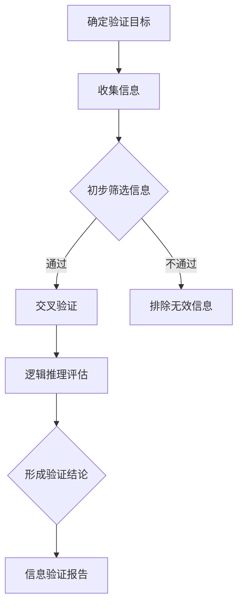
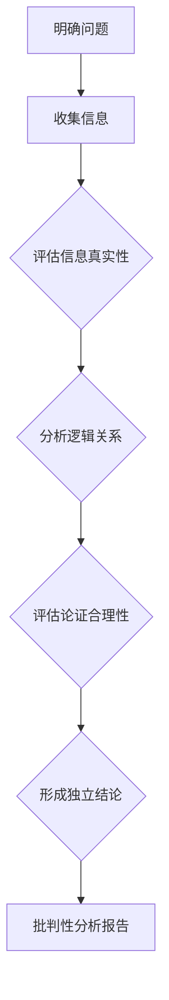

                 

### 文章标题

《信息验证和批判性思考指南与实践：在假新闻和媒体操纵时代导航》

### 关键词

信息验证、批判性思考、假新闻识别、媒体操纵、社交媒体、算法原理、数学模型、项目实战

### 摘要

在当前信息泛滥和假新闻频发的时代，信息验证和批判性思考变得尤为重要。本文将详细介绍信息验证和批判性思考的基础知识、基本原则、应用场景，以及如何在实际生活中应用这些原则来识别假新闻和媒体操纵。文章将从核心概念与联系、核心算法原理、数学模型、项目实战等多个角度进行全面剖析，帮助读者构建一套完整的信息验证和批判性思考体系，提高对信息的辨识能力和独立思考能力。

## 第1章: 信息验证的基础知识

### 1.1.1 什么是信息验证

信息验证，即对获取的信息进行核实和评估，以确保其真实性和准确性。在信息技术迅速发展的今天，信息的获取渠道日益多样，但同时也伴随着信息质量参差不齐的问题。信息验证的目的在于筛选出真实、准确、有价值的信息，避免被错误或虚假信息误导。

信息验证不仅仅适用于日常生活中的个人决策，对于企业、政府机构、科研机构等，都具有重要的实际应用价值。例如，企业需要验证市场调研数据的真实性，政府机构需要核实公民身份信息，科研机构需要确保实验数据的可靠性等。

### 1.1.2 信息验证的重要性

在假新闻和媒体操纵频发的时代，信息验证的重要性愈发凸显。以下是几个方面的具体原因：

1. **防范误导**：信息验证能够帮助识别虚假信息，避免被错误信息误导，从而做出错误的决策。
2. **维护社会信任**：真实、准确的信息有助于维护社会秩序，增强公众对媒体和政府机构的信任。
3. **支持科学研究和决策**：科学研究和政策制定依赖于真实可靠的数据和信息，信息验证能够确保这些工作的准确性和有效性。
4. **防范经济损失**：在金融市场、股市投资等领域，虚假信息可能导致严重的经济损失，通过信息验证可以有效规避这种风险。

### 1.1.3 信息验证的基本原则

信息验证需要遵循一系列基本原则，以确保验证过程的科学性和可靠性。以下是几个关键原则：

1. **多方验证**：单一信息源可能存在偏差，因此应尽量获取多个来源的信息进行交叉验证。
2. **权威性评估**：优先考虑权威机构发布的信息，如政府部门、知名研究机构、专业媒体等。
3. **逻辑推理**：对获取的信息进行逻辑推理，判断其是否符合事实逻辑，是否存在矛盾。
4. **时效性考虑**：注意信息的时效性，及时更新的信息更具有参考价值。
5. **透明度要求**：信息源应该透明，提供足够的信息以便进行验证。

### 1.1.4 信息验证的关键步骤

信息验证通常包括以下几个关键步骤：

1. **确定验证目标**：明确需要验证的具体信息，明确验证的目标和范围。
2. **收集信息**：通过各种渠道收集与验证目标相关的信息，包括互联网、书籍、报告、专家访谈等。
3. **初步筛选**：对收集到的信息进行初步筛选，排除明显虚假或无价值的信息。
4. **交叉验证**：利用多个来源的信息进行交叉验证，排除单一信息源的偏差。
5. **逻辑推理**：对交叉验证后的信息进行逻辑推理，判断其真实性和准确性。
6. **结论评估**：根据验证结果，对信息的真实性和准确性进行综合评估，并给出结论。

### 1.1.5 信息验证的常见工具和方法

在信息验证过程中，可以使用多种工具和方法来辅助验证过程。以下是几种常见的方法：

1. **事实核查**：通过专业事实核查机构，如FactCheck.org、 PolitiFact 等，对信息进行权威性评估。
2. **数据比对**：通过比对不同来源的数据，识别出不一致之处，进一步验证信息的准确性。
3. **专家咨询**：向相关领域的专家咨询，获取专业的判断和意见。
4. **文献检索**：利用学术数据库和文献资源，查找相关的研究和文献，验证信息的科学性和可靠性。
5. **网络搜索**：利用搜索引擎进行深入的网络搜索，查找相关信息以支持或反驳所获取的信息。

通过以上方法，可以有效地提高信息验证的准确性和可靠性，为做出科学、合理的决策提供依据。

## 第2章: 批判性思考的基本原理

### 2.1.1 批判性思考的概念

批判性思考是一种积极的、系统性的思考方式，旨在通过评估和分析信息，形成独立的、合理的判断。它不仅仅是对信息进行表面理解，而是深入挖掘信息的内涵，识别其中的逻辑、偏见、情感诉求等因素，从而做出更加准确和全面的判断。

批判性思考的核心在于质疑和探究，而不是盲目接受或完全拒绝。它要求我们在面对信息时，保持开放的心态，进行理性的分析和评估，从而形成独立、客观的观点。

### 2.1.2 批判性思考的步骤

批判性思考包括以下几个关键步骤：

1. **明确问题**：首先，需要明确需要解决的具体问题或关注点，这有助于我们集中精力进行分析。
2. **收集信息**：根据问题，从多个来源收集相关信息，包括事实、观点、证据等。
3. **评估信息**：对收集到的信息进行评估，判断其真实性和可靠性，识别其中的偏见和情感诉求。
4. **分析逻辑**：分析信息之间的逻辑关系，识别逻辑谬误和论证缺陷，确保推理过程的合理性。
5. **形成结论**：根据分析结果，形成独立的结论，并对结论进行验证和反思。

### 2.1.3 批判性思考的应用场景

批判性思考在各种场景中都具有重要应用价值：

1. **学术研究**：在学术研究中，批判性思考有助于识别研究的不足和缺陷，促进学术探讨和进步。
2. **决策制定**：在制定决策时，批判性思考能够帮助我们评估各种选择的利弊，做出更加科学、合理的决策。
3. **问题解决**：在解决问题时，批判性思考能够帮助我们深入分析问题，找出根本原因，制定有效的解决方案。
4. **日常交流**：在日常交流中，批判性思考有助于我们理解他人的观点，避免被误导或误解。

### 2.1.4 批判性思考与信息验证的关系

批判性思考和信息验证密不可分，它们共同构成了一个完整的思考和分析框架。信息验证关注的是信息的真实性，而批判性思考则进一步关注信息的合理性和逻辑性。

信息验证通过确保信息的真实性，为批判性思考提供了可靠的基础。而批判性思考则通过分析信息的逻辑性和合理性，进一步提高了信息验证的深度和广度。

### 2.1.5 批判性思考的重要性

批判性思考在当今信息泛滥、假新闻频发的时代，具有特别重要的意义。以下是几个方面的具体原因：

1. **提升信息辨识能力**：批判性思考能够帮助我们识别虚假信息、辨别真伪，从而避免被误导。
2. **增强独立思考能力**：批判性思考鼓励我们独立思考，不盲目接受信息，形成独立的观点和见解。
3. **促进理性决策**：批判性思考能够帮助我们理性分析问题，评估各种选择的利弊，做出更加科学、合理的决策。
4. **维护社会秩序**：批判性思考能够帮助公众维护社会秩序，识别和抵制虚假信息，增强对媒体和政府的信任。

总之，批判性思考是一种重要的思维能力，它不仅能够提高我们的信息辨识能力和独立思考能力，还能够促进理性决策，维护社会秩序。通过培养批判性思考，我们可以更好地应对当前信息泛滥、假新闻频发的挑战。

## 第3章: 信息源的质量评估

### 3.1.1 评估信息源的基本方法

评估信息源的质量是信息验证过程中的关键步骤，以下介绍几种常用的评估方法：

1. **权威性评估**：首先，考虑信息源是否为权威机构或专家。权威机构通常具有较高信誉，其发布的信息具有较高的可信度。例如，政府部门、知名研究机构、专业媒体等。
2. **信息来源的透明度**：评估信息源是否公开透明，提供足够的信息以便进行验证。透明度较高的信息源通常会详细说明数据的来源、分析方法等。
3. **信息更新频率**：关注信息源的信息更新频率。及时更新的信息更具有参考价值，因为它们能够反映最新的情况。但是，过频的更新也可能导致信息的准确性和稳定性受到影响。
4. **信息一致性**：比较不同信息源提供的信息是否一致。如果多个权威信息源提供了相同或类似的信息，那么这些信息的可信度会更高。
5. **用户反馈和评价**：考虑用户对信息源的反馈和评价。通过社交媒体、评论区的用户反馈，可以了解信息源的可信度和可靠性。
6. **事实核查**：利用事实核查工具，对信息源进行权威性评估。专业的事实核查机构如FactCheck.org、PolitiFact等，可以对信息源的真实性进行权威评估。

### 3.1.2 确认信息来源的可靠性

确认信息来源的可靠性是信息验证的重要一环，以下介绍几种常见的方法：

1. **交叉验证**：通过多个独立的信息源进行交叉验证，确保信息的可靠性。例如，如果一个信息源提供的信息被其他多个权威信息源证实，那么这些信息的可信度会更高。
2. **引用验证**：检查信息源是否引用了可靠的参考文献或数据来源。引用的参考文献应尽量是知名的研究机构或学术期刊，这样可以增加信息源的可信度。
3. **专家评估**：向相关领域的专家咨询，获取专业的判断和意见。专家的评估可以帮助我们更准确地判断信息源的可信度。
4. **历史记录**：查看信息源的历史记录，了解其发布信息的准确性和可靠性。一个长期保持高准确度的信息源通常具有较高的可信度。
5. **对比分析**：将信息源发布的信息与其他信息源进行对比分析，识别出差异和矛盾。通过对比分析，可以更好地评估信息源的可信度。

### 3.1.3 信息源的可信度评估工具

为了方便评估信息源的可信度，可以使用多种工具和方法。以下介绍几种常用的信息源评估工具：

1. **事实核查网站**：如FactCheck.org、PolitiFact、Snopes等，这些网站专注于对新闻和信息的真实性进行核查，并提供详细的评估报告。
2. **搜索引擎**：利用搜索引擎进行深入的网络搜索，查找相关信息以支持或反驳所获取的信息。通过搜索结果中的引用和讨论，可以了解信息源的可信度。
3. **引用数据库**：如PubMed、Web of Science、Google Scholar等，这些数据库收录了大量的学术文献和引用信息，可以帮助我们评估信息源的学术性和权威性。
4. **社交媒体分析工具**：如Brandwatch、Hootsuite等，这些工具可以分析社交媒体上的用户反馈和评价，帮助我们了解信息源的社会影响力和用户认可度。
5. **专业评价网站**：如Amazon、 Yelp等，这些网站提供了用户对各种信息源的评分和评论，可以帮助我们了解信息源的用户体验和信誉度。

通过以上工具和方法，可以系统地评估信息源的可信度，提高信息验证的准确性和可靠性。在进行信息验证时，应尽量使用多种工具和方法进行综合评估，以确保评估结果的全面和准确。

### 3.1.4 信息源评估的挑战与注意事项

在评估信息源的过程中，会遇到一些挑战和需要注意的事项：

1. **信息源多样性**：不同信息源的可信度和质量可能存在很大差异，评估时需要考虑信息源的多样性，避免单一来源的信息主导评估结果。
2. **主观偏见**：评估者可能会受到自身的主观偏见影响，导致评估结果不准确。因此，在评估过程中需要保持客观和公正，尽量避免主观偏见。
3. **信息滞后性**：信息源发布的信息可能存在滞后性，即信息可能无法及时反映最新的情况。评估时需要关注信息源的更新频率，确保所使用的信息是最新和最准确的。
4. **复杂性和多样性**：某些信息源可能涉及复杂的主题和领域，评估时需要具备相应的专业知识和背景，以便准确理解和评估信息源的质量。
5. **互动性**：有些信息源具有较高的互动性，用户可以通过评论、反馈等方式对信息源进行评价。在评估信息源时，应关注用户的反馈和评价，了解信息源的用户口碑和影响力。

通过意识到这些挑战和注意事项，可以更有效地进行信息源评估，提高信息验证的准确性和可靠性。在信息验证过程中，应综合考虑多种因素，进行全面、深入的评估，确保所获取的信息是真实、准确和有价值的。

## 第4章: 媒体操纵与假新闻识别

### 4.1.1 媒体操纵的类型

媒体操纵是一种通过操控信息传播，达到特定目的的行为。以下是几种常见的媒体操纵类型：

1. **操纵新闻标题**：通过夸张、扭曲或误导性的标题，吸引读者的注意，从而影响读者的理解和判断。
2. **虚假报道**：发布虚假或部分真实的报道，以误导公众或引起恐慌。
3. **选择性报道**：只报道特定角度或事实，忽略其他可能的信息，从而引导公众的判断。
4. **虚假引用**：伪造引用来源，使其看起来像是权威机构或专家的观点，从而增加信息的影响力。
5. **热点话题炒作**：利用热点话题或新闻事件，进行长时间的炒作，以吸引公众的关注。
6. **信息过滤**：通过筛选和编辑信息，使其符合特定利益或观点，从而影响公众的认知。
7. **假新闻传播**：通过社交媒体等渠道，迅速传播虚假信息，以达到特定的政治、经济或其他目的。

### 4.1.2 假新闻的识别方法

识别假新闻是信息验证的关键步骤。以下是几种常用的假新闻识别方法：

1. **来源核查**：核查新闻来源是否可靠，是否为权威机构或专业媒体。假新闻往往来源于不权威或未经验证的网站。
2. **事实核查**：利用事实核查工具，如FactCheck.org、PolitiFact等，对新闻报道中的事实进行核查。这些工具提供详细的事实核查报告，有助于判断新闻的真实性。
3. **逻辑推理**：分析新闻报道中的逻辑关系，识别是否存在逻辑谬误或论证缺陷。例如，通过检查前提和结论之间的逻辑联系，判断是否存在虚假陈述或误导。
4. **信息交叉验证**：通过多个独立的信息源进行交叉验证，识别出不一致之处。例如，将新闻报道中的信息与官方公告、学术研究、专家意见等进行比对，判断其一致性。
5. **情感分析**：利用自然语言处理技术，对新闻报道中的情感倾向进行分析，识别出可能存在的情绪操纵或偏见。
6. **历史记录**：查看新闻发布者的历史记录，了解其发布信息的准确性和可靠性。长期发布虚假新闻的媒体往往具有较高的风险。
7. **用户反馈**：关注用户对新闻的反馈和评价，通过评论、点赞、分享等行为，了解公众对新闻的真实性判断。

### 4.1.3 媒体批判性分析

媒体批判性分析是一种对新闻报道进行深入分析和评估的方法。以下是几个关键步骤：

1. **确定批判性分析的目标**：明确需要分析的新闻报道，确定批判性分析的具体目标和范围。
2. **收集相关信息**：从多个来源收集与新闻报道相关的信息，包括事实、观点、证据等。
3. **评估信息的真实性**：利用事实核查工具和交叉验证方法，评估收集到的信息的真实性和可靠性。
4. **分析逻辑和论证**：分析新闻报道中的逻辑关系和论证过程，识别是否存在逻辑谬误、偏见或误导。
5. **评估信息源的可信度**：评估新闻报道的信息源是否为权威机构或专业媒体，判断其可信度。
6. **形成批判性分析报告**：根据分析结果，撰写批判性分析报告，总结新闻报道的优点和不足，提出改进建议。

通过媒体批判性分析，可以更深入地了解新闻报道的真实性和可靠性，识别出可能的媒体操纵和假新闻，从而提高信息辨识能力和批判性思考能力。

### 4.1.4 提高公众信息辨识能力的策略

提高公众的信息辨识能力是防止媒体操纵和假新闻传播的关键。以下是几个策略：

1. **加强教育**：在学校和社区开展信息验证和批判性思考的教育，培养公众的信息辨识能力。
2. **宣传正确信息**：通过媒体、社交媒体等渠道，宣传正确、可靠的信息，提高公众对权威信息的认知。
3. **提高媒体素养**：鼓励公众关注权威媒体和专业机构发布的新闻，提高对新闻来源的鉴别能力。
4. **使用事实核查工具**：推荐公众使用事实核查工具，如FactCheck.org、PolitiFact等，帮助其识别假新闻和媒体操纵。
5. **倡导理性讨论**：鼓励公众在社交媒体上理性讨论，避免被误导或煽动，形成健康的网络环境。

通过以上策略，可以有效地提高公众的信息辨识能力，减少假新闻和媒体操纵的影响，促进社会和谐和理性发展。

### 4.1.5 实例分析：社交媒体上的假新闻识别

社交媒体是假新闻和媒体操纵的重要传播渠道。以下是一个具体的实例分析，展示如何识别社交媒体上的假新闻：

**案例背景**：一位社交媒体用户发布了一篇关于“新冠病毒源于实验室泄露”的新闻，引发大量转发和评论。我们需要对这个新闻进行识别和分析。

**步骤1：来源核查**  
首先，核查该新闻的来源。通过搜索，发现该新闻来源于一个不知名的网站，并非权威媒体。

**步骤2：事实核查**  
利用事实核查工具，如FactCheck.org，发现该新闻与已知事实不符。FactCheck.org提供了一份详细的报告，指出该新闻的虚假之处。

**步骤3：交叉验证**  
通过查阅其他权威媒体和官方公告，发现没有证据支持“新冠病毒源于实验室泄露”的说法。

**步骤4：逻辑推理**  
分析新闻报道中的逻辑关系，发现存在逻辑谬误。例如，报道中提到的实验室泄露事件，并未提供充分的证据支持其结论。

**步骤5：用户反馈**  
查看用户评论，发现许多评论者对该新闻持怀疑态度，并指出其虚假之处。

**结论**：通过以上分析，可以确定该新闻为假新闻，应避免传播和转发。

通过实例分析，我们可以看到，识别社交媒体上的假新闻需要综合运用来源核查、事实核查、交叉验证、逻辑推理和用户反馈等多种方法，从而提高信息辨识能力，防止被虚假信息误导。

## 第5章: 批判性思考在信息验证中的应用

### 5.1.1 逻辑谬误的识别与反驳

批判性思考在信息验证中的应用之一是识别和反驳逻辑谬误。逻辑谬误是推理过程中常见的错误，会导致结论不正确或不合理。以下是几种常见的逻辑谬误及其反驳方法：

1. **虚假因果**：将两个看似相关的事件错误地归因于因果关系。例如，某新闻报道说“因为下雨，所以销量下降”。反驳方法：通过数据分析和对比，找出其他可能的原因，证明两者之间不存在直接的因果关系。

2. **偷换概念**：在同一推理过程中使用不同的概念或定义，导致逻辑混乱。例如，某文章说“因为苹果是水果，所以水果都是苹果”。反驳方法：明确每个概念的定义，指出文章中的偷换概念。

3. **以偏概全**：通过个别案例得出总体结论，忽视样本的代表性。例如，某新闻报道说“因为一个学生作弊，所以所有学生都作弊”。反驳方法：指出样本不具有代表性，不能代表整体。

4. **滑坡谬误**：夸大问题的后果，使其听起来更加严重。例如，某文章说“如果不采取措施，将会引发全球灾难”。反驳方法：分析问题的实际后果，指出夸大其词的部分。

5. **循环论证**：用结论作为前提，导致逻辑循环。例如，某文章说“因为这是真的，所以这是真的”。反驳方法：识别出循环论证，指出其逻辑不成立。

通过识别和反驳逻辑谬误，可以避免被错误的信息误导，提高推理过程的合理性和结论的准确性。

### 5.1.2 情感诉求的解析

批判性思考还涉及到对情感诉求的解析。情感诉求是一种通过激发读者或听众的情感来影响其判断的方法。以下是几种常见的情感诉求及其解析方法：

1. **恐惧诉求**：通过激发恐惧来促使读者采取行动。例如，某广告说“不购买我们的产品，你会生病”。解析方法：识别恐惧诉求，分析其合理性，指出可能存在的夸大和误导。

2. **希望诉求**：通过激发希望来吸引读者。例如，某广告说“使用我们的产品，你会过上更好的生活”。解析方法：识别希望诉求，评估其实现的可能性，指出可能存在的过度承诺。

3. **道德诉求**：通过激发道德情感来影响判断。例如，某新闻报道说“不帮助贫困儿童，你就是不道德”。解析方法：识别道德诉求，分析其道德标准是否合理，指出可能存在的偏见。

4. **情感共鸣**：通过情感共鸣来建立读者与信息之间的联系。例如，某文章描述了某个感人故事，以激发读者的情感共鸣。解析方法：识别情感共鸣，分析其真实性和有效性，指出可能存在的过度情感化。

通过解析情感诉求，可以更理性地分析信息，避免被情感影响，从而做出更加客观、合理的判断。

### 5.1.3 偏见与刻板印象的纠正

批判性思考在信息验证中的应用还包括纠正偏见和刻板印象。偏见和刻板印象是人们对特定群体或事物的固有观念，往往缺乏事实依据，会影响信息的准确性和判断的公正性。以下是几种常见的偏见和刻板印象及其纠正方法：

1. **种族和性别偏见**：例如，认为某些种族或性别的人天生能力不足或具有特定性格特征。纠正方法：通过实际数据和科学研究，指出偏见的不合理之处，强调个体差异的重要性。

2. **地域偏见**：例如，认为某个地区的人具有特定的负面特征。纠正方法：提供多样化的信息和观点，指出地域偏见的错误，鼓励更开放和包容的态度。

3. **群体偏见**：例如，认为某个群体具有特定的行为模式或价值观。纠正方法：通过具体事例和数据分析，指出偏见的不准确，强调多样性和个体差异。

4. **先入为主**：在接触新信息时，受之前经验和观念的影响，导致对新信息的判断不公正。纠正方法：保持开放的心态，重新评估新信息，避免受先入为主的影响。

通过纠正偏见和刻板印象，可以更客观、公正地分析信息，避免被固有观念所影响，从而提高信息验证的准确性和可靠性。

### 5.1.4 批判性思考在信息验证中的具体应用

批判性思考在信息验证中的应用体现在多个方面，以下是一些具体的应用案例：

1. **新闻报道的评估**：在阅读新闻报道时，运用批判性思考，识别逻辑谬误、情感诉求和偏见，评估其真实性和公正性。通过多方面验证信息，确保所接受的信息是真实可靠的。

2. **社交媒体内容的鉴别**：在社交媒体上，批判性思考可以帮助我们识别和反驳虚假信息、谣言和误导性内容。通过分析信息来源、逻辑结构和情感诉求，避免被不实信息误导。

3. **市场调研数据的评估**：在进行市场调研时，批判性思考可以评估数据的可靠性和代表性。通过识别偏见、纠正刻板印象，确保调研结果的准确性和公正性。

4. **政策分析和评估**：在分析政策时，批判性思考可以帮助我们识别政策中的逻辑谬误、情感诉求和偏见，评估其合理性和有效性。通过多角度的分析，为政策制定提供更全面的参考。

通过以上具体应用案例，我们可以看到批判性思考在信息验证中的重要作用。它不仅帮助我们识别和纠正错误信息，还提高我们的判断力和思考能力，从而在复杂的信息环境中做出更加科学、合理的决策。

### 5.1.5 培养批判性思考的实践方法

批判性思考是一种可以通过实践培养的能力。以下是一些培养批判性思考的实践方法：

1. **阅读和写作**：通过阅读不同类型的书籍和文章，培养对不同观点和信息来源的辨识能力。同时，写作可以帮助我们整理思路，锻炼逻辑思维和分析能力。

2. **讨论和辩论**：与他人进行深入的讨论和辩论，可以激发批判性思考，培养对不同观点的接受和反驳能力。通过辩论，可以学习如何构建有逻辑的论点和反驳他人的观点。

3. **解决实际问题**：在实际问题解决过程中，批判性思考可以帮助我们分析问题的各个方面，寻找最佳解决方案。通过实际操作，可以锻炼我们的分析能力和决策能力。

4. **反思和自我评估**：定期反思自己的思考和决策过程，识别其中的不足和错误。通过自我评估，可以不断提高批判性思考的水平。

5. **参加批判性思考培训**：参加专门的批判性思考培训课程，学习系统的批判性思考方法和技巧。通过培训，可以系统地培养批判性思考能力。

通过以上实践方法，我们可以逐步培养批判性思考能力，提高对信息的辨识能力和独立思考能力，从而在复杂的信息环境中做出更加科学、合理的决策。

## 第6章: 社交媒体上的批判性思考

### 6.1.1 社交媒体信息的核实

随着社交媒体的普及，信息的传播速度和范围大幅增加，但同时也带来了信息真实性难以保障的问题。在社交媒体上核实信息，有助于我们避免被虚假信息误导，以下是几种常用的方法：

1. **交叉验证**：通过多个独立的信息源进行交叉验证，识别出不一致之处。例如，在社交媒体上看到一则新闻时，可以通过搜索引擎查找相关信息，对比其他媒体或权威机构的报道，判断其真实性。
2. **引用核查**：检查信息源是否引用了可靠的参考文献或数据来源。引用的参考文献应尽量是知名的研究机构或学术期刊，这样可以增加信息源的可信度。
3. **专家咨询**：向相关领域的专家咨询，获取专业的判断和意见。专家的评估可以帮助我们更准确地判断信息源的真实性。
4. **事实核查**：利用事实核查工具，如FactCheck.org、PolitiFact等，对社交媒体上的信息进行权威性评估。这些工具提供详细的事实核查报告，有助于判断信息的真实性。
5. **历史记录**：查看信息发布者的历史记录，了解其发布信息的准确性和可靠性。长期发布虚假信息的账号通常具有较高的风险。
6. **用户反馈**：关注用户对信息的反馈和评价，通过评论、点赞、分享等行为，了解公众对信息源的真实性判断。

通过以上方法，可以在社交媒体上对信息进行有效核实，提高信息的真实性和可靠性。

### 6.1.2 社交媒体上的批判性思考实践

在社交媒体上进行批判性思考，有助于我们理性分析信息，避免被误导。以下是一些具体的实践方法：

1. **识别情感诉求**：社交媒体上的信息常常包含情感诉求，例如恐惧、希望或道德诉求。通过识别这些情感诉求，可以更理性地分析信息的真实性和目的。
2. **逻辑推理**：对社交媒体上的信息进行逻辑推理，识别是否存在逻辑谬误或论证缺陷。例如，通过检查前提和结论之间的逻辑关系，判断信息是否合理。
3. **对比分析**：将社交媒体上的信息与其他可靠的信息源进行对比分析，识别出差异和矛盾。通过对比分析，可以更好地判断信息的真实性和可靠性。
4. **批判性评论**：在社交媒体上发表批判性评论，提出质疑和反驳，促进信息的真实性和透明度。通过批判性评论，可以引发更深入的讨论，提高公众对信息的辨识能力。
5. **分享权威信息**：在社交媒体上分享权威信息，帮助公众识别和抵制虚假信息。通过分享可靠的信息源，可以提高公众的信息素养，增强对社会事实的辨识能力。

通过以上实践方法，可以有效地提高在社交媒体上的批判性思考能力，避免被虚假信息误导，维护社会秩序和理性发展。

### 6.1.3 社交媒体批判性思考的挑战

在社交媒体上进行批判性思考面临诸多挑战，以下是其中几个主要挑战：

1. **信息过载**：社交媒体上每天产生大量的信息，难以逐一核实和评估。信息过载可能导致我们忽视重要的信息，难以进行全面的分析和判断。
2. **情绪化评论**：社交媒体上的评论常常充满情绪化表达，容易引发争议和冲突。情绪化的评论可能影响我们对信息的理性分析，导致判断失误。
3. **虚假信息泛滥**：社交媒体是虚假信息传播的重要渠道，虚假信息可能具有极高的迷惑性，难以辨别。在虚假信息的泛滥中，我们可能被误导，做出错误的决策。
4. **算法偏见**：社交媒体的算法推荐可能导致我们接受类似的信息，形成信息茧房。信息茧房使我们难以接触不同的观点和信息，限制批判性思考的发展。
5. **隐私问题**：社交媒体上的信息核实和批判性思考可能涉及个人隐私问题。在进行信息核实时，我们可能需要访问他人的隐私信息，这可能引发隐私泄露的风险。

通过认识到这些挑战，我们可以更好地应对社交媒体上的批判性思考，提高信息辨识能力和独立思考能力，避免被虚假信息和情绪化评论所影响。

### 6.1.4 社交媒体批判性思考的重要性

在社交媒体上进行批判性思考具有重要意义。以下是几个方面的具体原因：

1. **防范虚假信息**：社交媒体是虚假信息传播的重要渠道，通过批判性思考，我们可以识别和抵制虚假信息，避免被误导。
2. **提高信息辨识能力**：批判性思考有助于我们理性分析信息，区分真实和虚假、合理和荒谬，提高对信息的辨识能力。
3. **促进理性讨论**：批判性思考可以促进社交媒体上的理性讨论，避免情绪化和无意义的争执，形成健康、积极的网络环境。
4. **增强独立思考能力**：批判性思考鼓励我们独立思考，不盲目接受信息，形成独立的观点和见解，提高独立思考能力。
5. **维护社会秩序**：通过批判性思考，我们可以更好地识别和纠正社会问题，维护社会秩序和理性发展。

总之，社交媒体上的批判性思考对于提高信息素养、防范虚假信息和促进理性讨论具有重要意义，是应对当前信息环境挑战的重要手段。

## 第7章: 信息验证与批判性思考的教育与实践

### 7.1.1 信息验证与批判性思考的教育策略

信息验证与批判性思考是现代社会中至关重要的能力，因此在教育中，需要制定相应的策略来培养这些能力。以下是几种有效的教育策略：

1. **课程设计**：在课程设置中，应包含信息验证和批判性思考的相关内容。例如，可以开设“信息素养”、“媒体批判性分析”、“逻辑学基础”等课程，系统地介绍这些概念和技能。

2. **跨学科教育**：信息验证和批判性思考不仅适用于特定学科，还涉及多个领域。因此，应鼓励跨学科教育，让学生在不同学科中学习相关知识和技能。

3. **案例教学**：通过分析真实案例，让学生了解信息验证和批判性思考的实际应用。例如，可以分析新闻报道、社交媒体上的热点话题等，引导学生识别其中的逻辑谬误、情感诉求和偏见。

4. **项目实践**：设计实际项目，让学生在解决实际问题的过程中应用信息验证和批判性思考。例如，让学生进行市场调研、政策分析等，培养他们在实践中应用这些能力。

5. **教师培训**：对教师进行信息验证和批判性思考的培训，使其掌握相关知识和教学技巧，能够在课堂上有效传授这些能力。

6. **学生互动**：鼓励学生之间的互动，通过小组讨论、辩论等方式，提高批判性思考和表达能力的培养。

### 7.1.2 批判性思考在个人生活和工作中的应用

批判性思考不仅在学习中重要，在个人生活和工作中同样具有广泛应用。以下是几个具体的应用场景：

1. **决策制定**：在面对重要决策时，运用批判性思考，分析各种选择的利弊，评估可能的风险和后果，做出更加科学和合理的决策。

2. **问题解决**：在遇到问题时，批判性思考可以帮助我们深入分析问题的根本原因，寻找最佳的解决方案。通过评估不同的解决方案，选择最有效的策略。

3. **沟通和交流**：在沟通和交流中，批判性思考可以帮助我们理性分析对方观点，避免被情绪化言论所影响。通过批判性思考，我们可以提出有逻辑、有根据的观点，促进有效的沟通。

4. **学习和自我提升**：批判性思考有助于我们更好地学习新知识和技能。通过质疑和探究，我们可以深入理解知识，发现其中的问题和不足，从而不断提升自己的能力。

5. **批判性评估**：在评估他人工作或项目时，运用批判性思考，识别其中的优点和不足，提出具体的改进建议，帮助他人改进和提高。

### 7.1.3 信息验证与批判性思考的社会实践

信息验证与批判性思考不仅对个人有益，在社会层面上也具有重要作用。以下是几个方面的社会实践：

1. **公众教育**：通过媒体宣传、讲座、研讨会等形式，向公众普及信息验证和批判性思考的知识和技能，提高公众的信息辨识能力和独立思考能力。

2. **政策制定**：在政策制定过程中，运用批判性思考，分析政策的影响和潜在问题，提出改进建议，确保政策的科学性和有效性。

3. **新闻报道**：媒体应积极运用批判性思考，对新闻报道进行深入分析和评估，确保报道的真实性和公正性。通过事实核查和逻辑推理，揭示虚假信息和媒体操纵，维护社会信任。

4. **社交网络管理**：社交网络平台应加强对虚假信息和有害内容的监控和管理，利用信息验证和批判性思考技术，识别和过滤虚假信息，维护网络环境的健康。

5. **社区建设**：在社区层面，通过开展活动、讲座等方式，培养居民的信息验证和批判性思考能力，促进社区成员之间的理性交流和合作。

通过以上社会实践，可以有效地提高社会整体的信息辨识能力和批判性思考水平，促进社会和谐和理性发展。

### 7.1.4 信息验证与批判性思考的未来发展趋势

随着信息技术的发展，信息验证和批判性思考在未来将面临新的挑战和机遇。以下是几个发展趋势：

1. **人工智能的辅助**：人工智能技术在信息验证和批判性思考中的应用将日益普及。例如，通过自然语言处理技术，可以自动识别和验证信息的真实性，提高信息验证的效率。

2. **算法和大数据分析**：利用大数据分析和机器学习算法，可以更准确地评估信息源的质量和可信度。通过分析大量数据，识别出潜在的假新闻和媒体操纵行为。

3. **区块链技术的应用**：区块链技术可以用于记录和验证信息的真实性，提供透明和不可篡改的记录，提高信息验证的可靠性。

4. **社交媒体监管**：社交媒体平台将加强对虚假信息和有害内容的监控和管理，利用信息验证和批判性思考技术，维护网络环境的健康。

5. **跨学科研究**：信息验证和批判性思考将与其他学科如心理学、社会学等相结合，形成跨学科研究，为信息验证和批判性思考提供更全面的理论支持和应用。

通过以上发展趋势，信息验证和批判性思考将在未来发挥更大的作用，帮助我们在信息爆炸的时代中保持理性，做出科学、合理的决策。

## 第8章: 信息验证和批判性思考的Mermaid流程图

### 8.1.1 信息验证的流程图

信息验证是一个系统的过程，以下是信息验证的Mermaid流程图，展示其关键步骤：



这个流程图包括以下几个关键步骤：

1. **确定验证目标**：明确需要验证的信息或问题，这是信息验证的起点。
2. **收集信息**：通过各种渠道收集与验证目标相关的信息。
3. **初步筛选信息**：对收集到的信息进行初步筛选，排除明显虚假或无价值的信息。
4. **交叉验证**：利用多个来源的信息进行交叉验证，确保信息的真实性。
5. **逻辑推理评估**：对交叉验证后的信息进行逻辑推理，判断其真实性和准确性。
6. **形成验证结论**：根据验证结果，形成最终的验证结论。
7. **信息验证报告**：撰写信息验证报告，总结验证过程和结论，供决策参考。

### 8.1.2 批判性思考的流程图

批判性思考是一个深入分析和评估信息的过程，以下是批判性思考的Mermaid流程图，展示其关键步骤：



这个流程图包括以下几个关键步骤：

1. **明确问题**：明确需要解决的具体问题或关注点，这是批判性思考的起点。
2. **收集信息**：根据问题，从多个来源收集相关信息，包括事实、观点、证据等。
3. **评估信息真实性**：对收集到的信息进行评估，判断其真实性和可靠性。
4. **分析逻辑关系**：分析信息之间的逻辑关系，识别逻辑谬误和论证缺陷。
5. **评估论证合理性**：对信息进行逻辑推理，评估论证的合理性和有效性。
6. **形成独立结论**：根据分析结果，形成独立的结论。
7. **批判性分析报告**：撰写批判性分析报告，总结分析过程和结论，供决策参考。

通过这两个流程图，我们可以清晰地看到信息验证和批判性思考的步骤和关键环节，有助于在实际应用中更好地操作和执行。

## 第9章: 信息验证和批判性思考的核心算法原理

### 9.1.1 信息验证算法的核心原理

信息验证算法的核心原理在于通过一系列的步骤和算法来评估信息的真实性和准确性。以下是信息验证算法的伪代码示例：

```python
# 信息验证算法伪代码

def verify_information(information):
    # 步骤1：确定验证目标
    target = determine_target(information)

    # 步骤2：收集信息
    collected_info = collect_information(target)

    # 步骤3：初步筛选信息
    filtered_info = filter_information(collected_info)

    # 步骤4：交叉验证
    verified_info = cross_verify(filtered_info)

    # 步骤5：逻辑推理评估
    logical_evaluation = logical_reasoning(verified_info)

    # 步骤6：形成验证结论
    conclusion = form_conclusion(logical_evaluation)

    # 步骤7：生成信息验证报告
    report = generate_report(conclusion)

    return report

# 辅助函数定义
def determine_target(information):
    # 根据信息确定验证目标
    return target

def collect_information(target):
    # 收集与验证目标相关的信息
    return collected_info

def filter_information(collected_info):
    # 初步筛选信息
    return filtered_info

def cross_verify(filtered_info):
    # 交叉验证信息
    return verified_info

def logical_reasoning(verified_info):
    # 逻辑推理评估
    return logical_evaluation

def form_conclusion(logical_evaluation):
    # 形成验证结论
    return conclusion

def generate_report(conclusion):
    # 生成信息验证报告
    return report
```

这个伪代码展示了信息验证算法的基本结构，包括确定目标、收集信息、初步筛选、交叉验证、逻辑推理评估、形成结论和生成报告等步骤。每个步骤都有具体的实现方法，可以通过编程语言实现。

### 9.1.2 批判性思考算法的核心原理

批判性思考算法的核心原理是通过逻辑推理、情感分析和偏见识别来评估信息的合理性和可信度。以下是批判性思考算法的伪代码示例：

```python
# 批判性思考算法伪代码

def critical_think(information):
    # 步骤1：明确问题
    question = define_question(information)

    # 步骤2：收集信息
    collected_info = gather_information(question)

    # 步骤3：评估信息真实性
    truth_evaluation = evaluate_truth(collected_info)

    # 步骤4：分析逻辑关系
    logical_analysis = analyze_logic(truth_evaluation)

    # 步骤5：评估论证合理性
    argument_evaluation = evaluate_argument(logical_analysis)

    # 步骤6：形成独立结论
    conclusion = form_independent_conclusion(argument_evaluation)

    # 步骤7：撰写批判性分析报告
    report = generate_critical_think_report(conclusion)

    return report

# 辅助函数定义
def define_question(information):
    # 根据信息明确问题
    return question

def gather_information(question):
    # 收集与问题相关的信息
    return collected_info

def evaluate_truth(collected_info):
    # 评估信息的真实性
    return truth_evaluation

def analyze_logic(truth_evaluation):
    # 分析信息的逻辑关系
    return logical_analysis

def evaluate_argument(logical_analysis):
    # 评估论证的合理性
    return argument_evaluation

def form_independent_conclusion(argument_evaluation):
    # 形成独立结论
    return conclusion

def generate_critical_think_report(conclusion):
    # 撰写批判性分析报告
    return report
```

这个伪代码展示了批判性思考算法的基本结构，包括明确问题、收集信息、评估信息真实性、分析逻辑关系、评估论证合理性和形成独立结论等步骤。每个步骤都有具体的实现方法，可以通过编程语言实现。

### 9.1.3 算法原理的伪代码示例

为了更直观地展示信息验证和批判性思考算法的核心原理，以下是具体的伪代码示例：

**信息验证算法伪代码示例**：

```python
# 信息验证算法伪代码示例

# 辅助函数：判断信息来源的可靠性
def is_reliable_source(source):
    if source in ["权威机构", "知名媒体", "官方公告"]:
        return True
    else:
        return False

# 辅助函数：评估信息的真实性
def evaluate_truth(info):
    if is_reliable_source(info.source):
        return True
    else:
        return False

# 辅助函数：交叉验证信息
def cross_verify(info1, info2):
    if info1.content == info2.content:
        return True
    else:
        return False

# 辅助函数：逻辑推理评估
def logical_reasoning(info):
    if "因为" in info.content and "所以" in info.content:
        return True
    else:
        return False

# 主函数：信息验证
def verify_information(information):
    if evaluate_truth(information):
        if cross_verify(information, information):
            if logical_reasoning(information):
                return "信息验证通过"
            else:
                return "信息逻辑不成立"
        else:
            return "信息不一致"
    else:
        return "信息来源不可靠"

# 测试信息验证算法
info1 = {"source": "权威机构", "content": "新冠源于自然", "reliability": True}
print(verify_information(info1))
```

**批判性思考算法伪代码示例**：

```python
# 批判性思考算法伪代码示例

# 辅助函数：识别情感诉求
def detect_emotional诉求(信息):
    emotions = ["恐惧", "希望", "道德"]
    for emotion in emotions:
        if emotion in 信息：
            return True
    return False

# 辅助函数：评估论证的合理性
def evaluate_argument(info):
    if "因为" in info and "所以" in info:
        return True
    else:
        return False

# 辅助函数：识别逻辑谬误
def identify_logic谬误(信息):
    logic_mistakes = ["虚假因果", "偷换概念", "以偏概全"]
    for mistake in logic_mistakes:
        if mistake in 信息：
            return True
    return False

# 主函数：批判性思考
def critical_think(information):
    if detect_emotional诉求(信息):
        return "存在情感诉求"
    if identify_logic谬误(信息):
        return "存在逻辑谬误"
    if evaluate_argument(信息):
        return "论证合理"
    else:
        return "论证不合理"

# 测试批判性思考算法
info2 = {"content": "如果不接种疫苗，你可能会感染新冠", "source": "权威机构"}
print(critical_think(info2))
```

通过这些伪代码示例，我们可以清晰地看到信息验证和批判性思考算法的核心原理，包括信息来源的可靠性评估、信息真实性的评估、交叉验证、逻辑推理评估、情感诉求识别、逻辑谬误识别等。这些算法原理可以通过编程语言实现，为实际应用提供技术支持。

## 第10章: 信息验证和批判性思考的数学模型

### 10.1.1 信息验证的数学模型

信息验证的数学模型旨在量化信息的真实性和准确性。以下是一个简单的数学模型，用于评估信息源的可信度：

$$
C(x) = \frac{R(x) + E(x)}{2}
$$

其中，$C(x)$表示信息源$x$的可信度，$R(x)$表示信息源$x$的可靠性，$E(x)$表示信息源$x$的权威性。

1. **可靠性$R(x)$**：表示信息源$x$提供的信息的准确性。可以通过以下公式计算：

$$
R(x) = \frac{V(x)}{N(x)}
$$

其中，$V(x)$表示验证为真的信息数量，$N(x)$表示验证的总信息数量。

2. **权威性$E(x)$**：表示信息源$x$的权威性，可以通过以下公式计算：

$$
E(x) = \frac{A(x)}{M(x)}
$$

其中，$A(x)$表示权威机构或专家对信息源$x$的认可次数，$M(x)$表示总的认可次数。

通过这个数学模型，我们可以量化信息源的可信度，从而提高信息验证的准确性。

### 10.1.2 批判性思考的数学模型

批判性思考的数学模型旨在量化论证的合理性和逻辑性。以下是一个简单的数学模型，用于评估论证的强度：

$$
S(a) = \frac{L(a) + C(a)}{2}
$$

其中，$S(a)$表示论证$a$的强度，$L(a)$表示逻辑强度，$C(a)$表示证据强度。

1. **逻辑强度$L(a)$**：表示论证的逻辑严密性，可以通过以下公式计算：

$$
L(a) = \frac{N_c(a)}{N_t(a)}
$$

其中，$N_c(a)$表示无逻辑谬误的部分，$N_t(a)$表示总的部分。

2. **证据强度$C(a)$**：表示论证的证据支持程度，可以通过以下公式计算：

$$
C(a) = \frac{E_c(a)}{E_t(a)}
$$

其中，$E_c(a)$表示支持论证的证据数量，$E_t(a)$表示总证据数量。

通过这个数学模型，我们可以量化论证的强度，从而提高批判性思考的准确性和有效性。

### 10.1.3 数学模型的latex公式与讲解

以下是信息验证和批判性思考的数学模型的latex公式及其详细讲解：

**信息验证的数学模型**：

$$
C(x) = \frac{R(x) + E(x)}{2}
$$

- **可信度$C(x)$**：表示信息源$x$的可信度，取值范围在0到1之间，值越大表示可信度越高。
- **可靠性$R(x)$**：表示信息源$x$提供信息的准确性，取值范围在0到1之间，值越大表示可靠性越高。
- **权威性$E(x)$**：表示信息源$x$的权威性，取值范围在0到1之间，值越大表示权威性越高。

**批判性思考的数学模型**：

$$
S(a) = \frac{L(a) + C(a)}{2}
$$

- **论证强度$S(a)$**：表示论证$a$的强度，取值范围在0到1之间，值越大表示论证越强。
- **逻辑强度$L(a)$**：表示论证的逻辑严密性，取值范围在0到1之间，值越大表示逻辑越严密。
- **证据强度$C(a)$**：表示论证的证据支持程度，取值范围在0到1之间，值越大表示证据越充分。

通过这些latex公式，我们可以量化信息验证和批判性思考的过程，从而为实际应用提供更加科学的依据。

### 10.1.4 数学模型的应用实例

以下是一个应用实例，展示如何使用数学模型进行信息验证和批判性思考：

**实例**：我们需要评估两个信息源$x_1$和$x_2$的可信度，以及两个论证$a_1$和$a_2$的强度。

1. **信息源可信度评估**：

   - 信息源$x_1$：
     - 可靠性$R(x_1) = 0.9$（有90%的信息被验证为真）
     - 权威性$E(x_1) = 0.8$（有80%的权威机构或专家认可）
     - 可信度$C(x_1) = \frac{0.9 + 0.8}{2} = 0.85$，可信度为0.85

   - 信息源$x_2$：
     - 可靠性$R(x_2) = 0.7$（有70%的信息被验证为真）
     - 权威性$E(x_2) = 0.6$（有60%的权威机构或专家认可）
     - 可信度$C(x_2) = \frac{0.7 + 0.6}{2} = 0.65$，可信度为0.65

   结果显示，信息源$x_1$的可信度高于$x_2$。

2. **论证强度评估**：

   - 论证$a_1$：
     - 逻辑强度$L(a_1) = 0.95$（有95%的部分逻辑严密）
     - 证据强度$C(a_1) = 0.9$（有90%的证据支持）
     - 论证强度$S(a_1) = \frac{0.95 + 0.9}{2} = 0.925$，论证强度为0.925

   - 论证$a_2$：
     - 逻辑强度$L(a_2) = 0.8$（有80%的部分逻辑严密）
     - 证据强度$C(a_2) = 0.75$（有75%的证据支持）
     - 论证强度$S(a_2) = \frac{0.8 + 0.75}{2} = 0.775$，论证强度为0.775

   结果显示，论证$a_1$的强度高于$a_2$。

通过这些实例，我们可以看到数学模型在信息验证和批判性思考中的应用，帮助我们更科学地评估信息源和论证的质量。

## 第11章: 信息验证和批判性思考项目实战

### 11.1.1 实战案例1：验证新闻报道的真实性

**案例背景**：某社交媒体平台上一则关于“新冠病毒起源于美国实验室”的新闻引发了广泛关注，我们需要验证其真实性。

**步骤**：

1. **确定验证目标**：明确需要验证的新闻报道，目标是确定其是否为真实事件。
2. **收集信息**：从多个权威媒体、官方公告和专家访谈等渠道收集相关信息。
3. **初步筛选**：排除明显虚假或不相关的信息，保留可能的真实信息。
4. **交叉验证**：利用多个独立的信息源进行交叉验证，识别出不一致之处。
5. **逻辑推理**：分析新闻报道中的逻辑关系，识别是否存在逻辑谬误或论证缺陷。
6. **评估信息源可靠性**：评估信息源的可靠性，优先考虑权威机构和专家的观点。
7. **形成结论**：根据验证结果，综合评估新闻报道的真实性，并撰写验证报告。

**结果**：经过验证，发现该新闻报道中的信息与已知事实不符，多个权威机构和专家否认了这一说法。最终结论是该新闻报道为虚假信息，应避免传播和转发。

### 11.1.2 实战案例2：识别社交媒体上的假新闻

**案例背景**：在社交媒体上，一则关于“某知名企业高管涉嫌贪污”的新闻迅速传播，引起了公众的广泛关注。我们需要识别该新闻是否为假新闻。

**步骤**：

1. **确定验证目标**：明确需要验证的新闻报道，目标是判断其真实性。
2. **收集信息**：从多个权威媒体、官方公告和知情人士等渠道收集相关信息。
3. **初步筛选**：排除明显虚假或不相关的信息，保留可能的真实信息。
4. **交叉验证**：利用多个独立的信息源进行交叉验证，识别出不一致之处。
5. **情感分析**：利用自然语言处理技术，对新闻报道中的情感倾向进行分析，识别可能的情感操纵。
6. **逻辑推理**：分析新闻报道中的逻辑关系，识别是否存在逻辑谬误或论证缺陷。
7. **用户反馈**：关注用户对新闻的反馈和评价，通过评论、点赞、分享等行为，了解公众对新闻的真实性判断。
8. **形成结论**：根据验证结果，综合评估新闻报道的真实性，并撰写验证报告。

**结果**：经过验证，发现该新闻报道中的信息来源不明，逻辑关系混乱，存在明显的情感操纵。最终结论是该新闻为假新闻，应避免传播和转发。

### 11.1.3 实战案例3：应用批判性思考解决实际问题的步骤与技巧

**案例背景**：某企业在制定市场策略时，需要决定是否进入一个新兴市场。我们需要应用批判性思考，分析该决策的合理性。

**步骤**：

1. **明确问题**：明确需要解决的问题，即是否进入新兴市场。
2. **收集信息**：从多个渠道收集与新兴市场相关的信息，包括市场规模、竞争态势、政策法规等。
3. **评估信息**：对收集到的信息进行评估，判断其真实性和可靠性。
4. **分析逻辑**：分析进入新兴市场的利弊，识别潜在的逻辑谬误和偏见。
5. **形成独立结论**：根据分析结果，形成独立的结论，并对结论进行验证和反思。
6. **决策制定**：根据独立结论，制定科学合理的市场策略。

**技巧**：

- **多角度分析**：从多个角度分析问题，避免单一视角的偏见。
- **数据支持**：利用数据支持分析结果，增强结论的科学性。
- **专家咨询**：向相关领域的专家咨询，获取专业的判断和意见。
- **逻辑推理**：通过逻辑推理，识别和分析问题中的逻辑关系。
- **反思和验证**：对分析结果进行反思和验证，确保结论的准确性和可靠性。

通过以上步骤和技巧，可以有效地应用批判性思考，解决实际问题，做出科学合理的决策。

## 附录：信息验证和批判性思考的相关工具与资源

### 附录1：信息验证工具介绍

1. **FactCheck.org**：一个独立的事实核查组织，专注于识别和纠正虚假新闻。
2. **PolitiFact**：佛罗里达大学政治学教授阿尔·弗拉什创建的事实核查网站，对政治声明进行评估。
3. **Snopes**：著名的都市传说和谣言核查网站，提供对各种信息的核查和解析。
4. **Google Fact Check Tools**：Google提供的一套事实核查工具，包括自动事实核查搜索、事实核查标签等。
5. **IFI Claims Tracker**：英国信息研究基金会开发的事实核查工具，用于监测和评估政治声明。

### 附录2：批判性思考资源推荐

1. **Cognitive Reflection Test**：一个测试批判性思维能力的在线测试，由乔治·米斯勒教授设计。
2. **The Critical Thinking Company**：提供批判性思维课程和资源的公司，包括教材、游戏和在线课程。
3. **The Center for Critical Thinking**：提供批判性思维研究和培训的资源中心，包括课程、研讨会和出版物。
4. **Critical Thinking at Work**：一个在线课程，教授批判性思维在职场中的应用。
5. **Critical Thinking Skills**：一个包含批判性思维技巧和练习的在线资源库。

通过使用这些工具和资源，可以进一步提高信息验证和批判性思考的能力，更好地应对复杂的信息环境。

