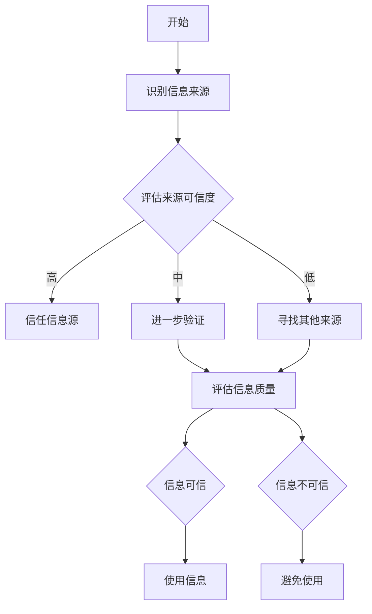
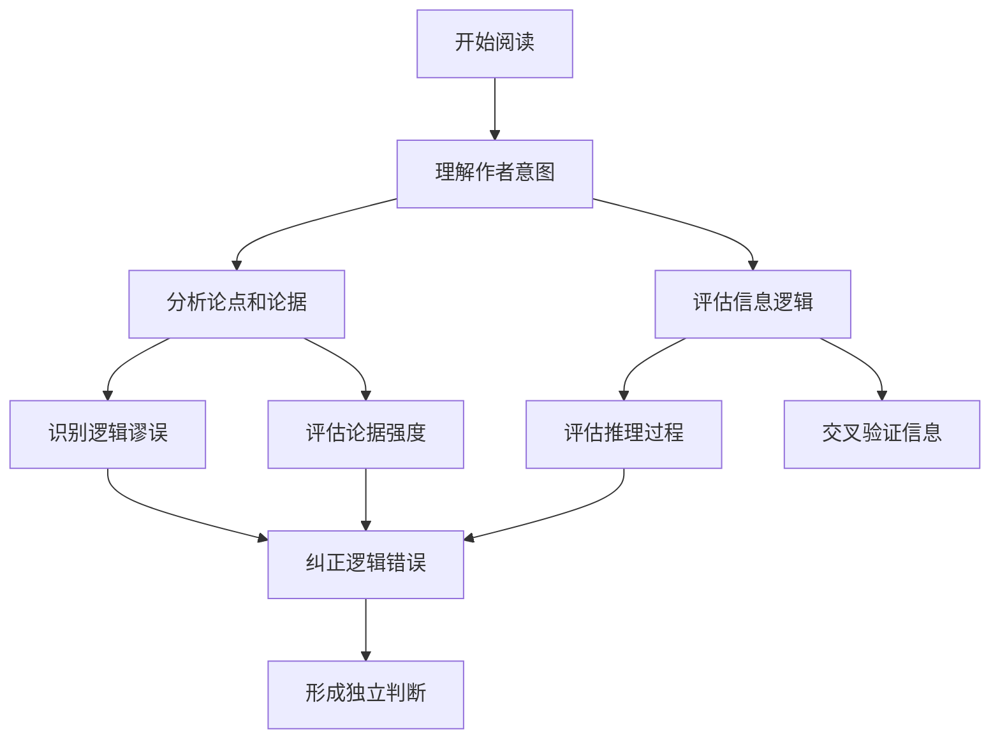

                 

## 文章标题: 信息验证和批判性阅读策略：在假新闻和媒体操纵时代导航

### 关键词：信息验证、批判性阅读、假新闻、媒体操纵、信息素养

#### 摘要：
在信息爆炸和假新闻泛滥的时代，正确地验证信息和培养批判性阅读能力变得至关重要。本文旨在探讨信息验证的重要性、基础方法和批判性阅读策略，帮助读者在假新闻和媒体操纵的环境中导航。文章将从信息验证的定义与意义、信息来源与可信度评估、批判性阅读技巧、信息筛选与辨别、媒体素养的培养、社交网络中的信息验证以及假新闻案例分析等方面进行详细阐述，并通过实际案例展示如何应用这些策略。通过阅读本文，读者将掌握在信息泛滥的社会中如何保持理性、辨别真伪，并培养良好的媒体素养。

---

## 《信息验证和批判性阅读策略：在假新闻和媒体操纵时代导航》目录大纲

### 第一部分：信息验证基础

#### 第1章：信息验证的重要性

##### 1.1 信息验证的定义与意义
##### 1.2 信息泛滥时代的信息验证需求
##### 1.3 信息验证与批判性思维的关联

#### 第2章：信息来源与可信度评估

##### 2.1 识别信息来源
##### 2.2 评估信息来源的可信度
##### 2.3 媒体偏见与信息验证

#### 第3章：批判性阅读技巧

##### 3.1 批判性阅读的定义
##### 3.2 理解作者观点与目的
##### 3.3 分析信息逻辑与论据

### 第二部分：批判性阅读策略

#### 第4章：信息筛选与辨别

##### 4.1 事实与观点的区分
##### 4.2 识别虚假信息与谣言
##### 4.3 搜索引擎与信息验证工具的应用

#### 第5章：媒体素养的培养

##### 5.1 媒体素养的概念与内容
##### 5.2 媒体素养教育的实施
##### 5.3 培养个人的媒体素养

#### 第6章：社交网络中的信息验证

##### 6.1 社交网络的信息传播特点
##### 6.2 社交网络中的信息验证策略
##### 6.3 社交媒体责任与伦理

### 第三部分：案例分析与实战演练

#### 第7章：假新闻案例分析

##### 7.1 典型假新闻案例介绍
##### 7.2 假新闻的危害与影响
##### 7.3 如何应对假新闻

#### 第8章：批判性阅读实践

##### 8.1 实践项目：创建批判性阅读笔记
##### 8.2 实践项目：编写信息验证报告
##### 8.3 实践项目：社交媒体上的信息验证挑战

### 附录

#### 附录A：批判性阅读工具与资源

##### A.1 评估信息来源的在线工具
##### A.2 批判性阅读资源推荐
##### A.3 信息验证与媒体素养教育机构介绍

#### 附录B：信息验证与批判性阅读思维导图

##### B.1 信息验证流程思维导图
##### B.2 批判性阅读策略思维导图

---

## 第一部分：信息验证基础

### 第1章：信息验证的重要性

#### 1.1 信息验证的定义与意义

信息验证是指对获取的信息进行真实性、准确性和可靠性的判断和核实的过程。在数字时代，信息量以惊人的速度增长，互联网和社交媒体的普及使得信息传播变得更加迅速和广泛。然而，这也带来了一个严重的问题：信息的真实性难以保证，假新闻、误导性信息和虚假信息层出不穷，对社会造成了严重的负面影响。

信息验证的重要性主要体现在以下几个方面：

1. **防止误导和错误传播**：通过信息验证，可以确保我们获取的信息是真实和准确的，避免因错误信息而做出错误的决策或行为。
2. **维护个人和社会稳定**：虚假信息的传播可能导致恐慌、信任危机和社会动荡，信息验证有助于维护社会的稳定。
3. **提升媒体素养**：通过学习信息验证的方法和技巧，可以提高公众对媒体信息的辨识能力，培养批判性思维。
4. **增强信息可信度**：在进行信息发布时，如果信息经过严格的验证，可以提升信息本身的可信度，增加受众的信任。

#### 1.2 信息泛滥时代的信息验证需求

在信息泛滥的时代，信息验证的需求尤为迫切。以下是一些主要的原因：

1. **假新闻泛滥**：随着互联网的发展，假新闻的传播速度和范围都大大增加。许多虚假信息通过社交媒体迅速扩散，对公众产生误导和恐慌。
2. **信息真实性和准确性难以保证**：互联网上的信息来源多样，包括个人博客、论坛、新闻报道等，这些信息的真实性和准确性难以一一核实。
3. **谣言传播**：谣言往往具有煽动性和吸引力，容易在社交网络中快速传播，给社会带来不良影响。
4. **媒体操纵**：一些媒体或组织可能出于政治、商业或其他目的，故意传播虚假信息或歪曲事实，这需要公众具备信息验证的能力。

#### 1.3 信息验证与批判性思维的关联

信息验证与批判性思维密切相关。批判性思维是一种审视、分析、评估信息的思维方式，它要求我们不仅仅是接受信息，而是要主动思考、质疑、推理和判断。信息验证正是批判性思维在信息处理过程中的具体应用。

批判性思维在信息验证中的作用主要体现在以下几个方面：

1. **提高信息辨识能力**：批判性思维可以帮助我们识别信息的真伪，判断信息的来源和可信度。
2. **避免盲从和误解**：通过批判性思维，我们可以避免因缺乏信息验证而盲目接受或传播错误信息。
3. **培养理性分析能力**：批判性思维要求我们理性地分析信息，理解信息的逻辑结构和论据，从而做出更准确的判断。
4. **提升信息素养**：通过批判性思维，我们可以提高对信息处理和利用的能力，成为更有素养的数字公民。

综上所述，信息验证是数字时代的重要能力，它不仅关乎个人决策的准确性，也关乎社会整体的稳定和进步。通过培养批判性思维，我们可以更好地进行信息验证，确保我们获取的信息是真实和可靠的。

---

### 第2章：信息来源与可信度评估

#### 2.1 识别信息来源

在信息泛滥的时代，识别信息的来源是信息验证的重要一步。了解信息的来源有助于评估信息的真实性和可靠性。以下是一些关键步骤和方法：

1. **查看来源的域名和URL**：通过查看信息来源的域名和URL，我们可以初步判断其可信度。通常，官方网站或知名媒体的域名结构清晰、简洁，且域名后缀通常为“.com”、“.org”或“.net”。例如，知名媒体如CNN、BBC等域名通常较短且易记。

2. **搜索来源信息**：通过搜索引擎搜索信息来源的名称，可以了解其背景、历史和声誉。例如，输入“纽约时报网站”可以找到相关的新闻发布和评论，帮助我们判断其权威性和专业性。

3. **查看来源的联系方式**：一个可信的信息来源通常会在其网站提供清晰的联系方式，如电子邮件、电话号码或地址。通过联系信息，我们可以进一步核实来源的真实性。

4. **了解来源的立场和价值观**：了解信息来源的立场和价值观有助于评估其报道的客观性和公正性。例如，一些媒体可能具有特定的政治倾向，这可能会影响其报道的立场和内容。

#### 2.2 评估信息来源的可信度

评估信息来源的可信度是信息验证的核心环节。以下是一些常用的方法和指标：

1. **声誉和知名度**：一个具有良好声誉和知名度的信息来源通常具有较高的可信度。例如，知名的新闻机构如《纽约时报》、《华尔街日报》等在全球范围内享有较高声誉。

2. **专业性和权威性**：信息来源的专业性和权威性是评估其可信度的重要指标。例如，科学研究机构、专业协会和学术期刊等通常具有较高的专业性和权威性。

3. **透明度和可追溯性**：一个可信的信息来源通常具有较高的透明度和可追溯性。例如，新闻机构会在其网站上公开编辑政策、记者资质和报道标准，以便受众监督和核实。

4. **多方验证**：通过多个独立来源验证信息，可以提高其可信度。如果多个权威来源报道同一事件，那么该信息更有可能是真实的。

5. **历史记录**：查看信息来源的历史记录，包括过去的报道和事件，可以评估其报道的准确性和可靠性。一个一贯准确报道的媒体通常具有较高的可信度。

#### 2.3 媒体偏见与信息验证

媒体偏见是指媒体在报道新闻和信息时，由于各种因素（如政治、经济、文化等）导致的倾向性和偏向性。识别和应对媒体偏见是信息验证的重要部分。

1. **识别媒体偏见**：
   - **主题频率**：通过分析媒体报道的主题频率，可以识别其倾向性。例如，如果某媒体频繁报道某一特定主题，可能表明其对该主题有特定的关注或偏见。
   - **语言表达**：通过分析媒体使用的语言和表达方式，可以识别其情感倾向和价值观。例如，使用强烈情感色彩的词汇可能表明媒体有特定的立场。
   - **对比分析**：通过对比不同媒体的报道，可以发现各自的偏见和差异，从而更全面地理解事件。

2. **应对媒体偏见**：
   - **多源信息**：通过获取多个来源的信息，可以减少单一媒体偏见的影响，提高整体信息的准确性。
   - **批判性阅读**：培养批判性阅读技巧，分析媒体的立场、观点和论据，识别可能的偏见和误导。
   - **独立思考**：不盲目接受媒体报道，保持独立思考，综合多方面信息做出判断。

通过识别信息来源、评估其可信度和应对媒体偏见，我们可以更好地进行信息验证，确保获取的信息是真实、准确和可靠的。这不仅是个人素养的体现，也是社会整体信息健康发展的基石。

---

### 第3章：批判性阅读技巧

#### 3.1 批判性阅读的定义

批判性阅读是一种积极的阅读方式，它不仅仅是理解文本内容，更是一种深入思考、质疑、分析和评估信息的过程。批判性阅读要求读者不仅仅是被动地接受作者的观点和信息，而是要主动地评估其合理性、真实性和可靠性。这种阅读方式的核心在于培养批判性思维，使读者能够理性地分析信息，避免盲目接受或传播错误的信息。

批判性阅读的定义可以从以下几个方面进行理解：

1. **理解作者意图**：批判性阅读要求读者深入理解作者的写作意图和目的。作者的观点和论据可能受到特定背景、文化、价值观等因素的影响，读者需要通过批判性阅读来挖掘这些潜在的影响因素。

2. **评估信息准确性**：批判性阅读不仅仅是理解信息，更重要的是评估信息的准确性。这包括检查信息的来源、数据、逻辑和证据，判断其是否可靠和真实。

3. **分析信息逻辑**：批判性阅读要求读者分析信息的逻辑结构，包括论点、论据和推理过程。通过识别逻辑错误、断言和假设，读者可以更全面地理解信息的真实性和有效性。

4. **培养独立思考**：批判性阅读鼓励读者独立思考，不盲目接受作者的观点和信息。通过质疑和反思，读者可以形成自己的见解和判断，避免盲从和误解。

#### 3.2 理解作者观点与目的

理解作者的观点和目的是批判性阅读的关键一步。作者的观点和目的是信息的核心，它们决定了信息的方向和深度。以下是一些方法可以帮助读者更好地理解作者的观点和目的：

1. **分析文本结构**：通过分析文本的结构，可以初步了解作者的意图。例如，文章的开头和结尾往往包含作者的核心观点和结论。

2. **识别论点和论据**：在文本中识别作者的主要论点和论据，可以帮助读者理解其观点的依据。通过分析论据的强度和逻辑性，读者可以评估观点的可靠性。

3. **背景知识辅助**：了解作者的背景、文化、价值观等信息可以帮助读者更好地理解其观点。例如，如果一个作者在讨论某个社会问题，了解其文化和社会背景可以提供更全面的视角。

4. **比较分析**：通过对比不同作者的观点和目的，读者可以更全面地理解问题的多面性。比较分析不仅有助于识别偏见，还可以丰富读者的观点。

#### 3.3 分析信息逻辑与论据

分析信息逻辑与论据是批判性阅读的核心技巧。一个逻辑严密、论据充分的论点更有说服力和可信度。以下是一些方法可以帮助读者分析信息的逻辑和论据：

1. **识别逻辑谬误**：逻辑谬误是指推理过程中的错误，常见的逻辑谬误包括偷换概念、以偏概全、归因错误等。通过识别这些谬误，读者可以判断论点的有效性。

2. **评估论据的强度**：评估论据的强度是判断论点可靠性的关键。论据的强度取决于其来源、质量和相关性。读者需要分析论据是否基于可靠的数据、事实和证据。

3. **分析推理过程**：分析信息之间的逻辑关系和推理过程，可以帮助读者理解论点的连贯性和逻辑性。通过识别因果关系、递进关系等，读者可以评估推理的有效性。

4. **交叉验证**：通过交叉验证，即使用其他来源的信息来验证论据和结论，读者可以增强论点的可信度。交叉验证是批判性阅读的重要方法，它有助于识别单一来源可能存在的偏见和错误。

通过批判性阅读，读者不仅可以更深入地理解信息，还可以培养独立思考的能力，提高信息的辨识和评估能力。在信息泛滥的时代，批判性阅读技巧是读者保持理性、辨别真伪的重要武器。

---

### 第二部分：批判性阅读策略

#### 第4章：信息筛选与辨别

在信息爆炸的时代，正确筛选和辨别信息成为一项至关重要的能力。信息筛选是指从大量信息中挑选出真实、准确、有用的信息；信息辨别则是通过分析和评估，判断信息的真实性和可靠性。以下是一些关键策略，帮助读者在信息海洋中导航，保持清醒的头脑。

#### 4.1 事实与观点的区分

在批判性阅读中，区分事实与观点是理解信息的基础。事实是客观存在的真实情况，可以通过观察和验证得到；而观点是作者的主观看法、推测和评价。

1. **识别事实**：
   - **具体数据**：事实通常包含具体的数据、时间、地点等详细信息。例如，“2022年，全球二氧化碳排放量增加了3.5%”是一个具体的事实。
   - **权威引用**：事实往往有权威的引用或来源，例如科学研究、官方统计或知名媒体的报道。
   - **可验证性**：事实可以通过第三方来源进行验证，其真实性和准确性相对较高。

2. **识别观点**：
   - **主观性词汇**：观点往往使用主观性较强的词汇，如“我认为”、“似乎”、“可能”等。
   - **情感色彩**：观点通常带有强烈的情感色彩，如“令人担忧”、“令人兴奋”等。
   - **缺乏具体证据**：观点通常缺乏具体的证据和数据支持，更多地是作者的个人看法或推测。

#### 4.2 识别虚假信息与谣言

虚假信息和谣言在互联网和社交媒体上广泛传播，对公众造成误导和恐慌。以下是一些方法帮助读者识别和避免虚假信息和谣言：

1. **来源检查**：
   - **核实来源**：检查信息的来源是否可靠。通过搜索引擎或专业数据库验证来源的真实性和权威性。
   - **避免未知来源**：不轻信来自未知或可疑来源的信息。

2. **事实核对**：
   - **交叉验证**：通过多个权威来源验证信息，判断其一致性。如果多个来源都报道同一事件，则该信息更有可能是真实的。
   - **引用查证**：检查引用的证据和资料是否真实可靠。如果引用来源不可信或无法验证，则该信息可能是虚假的。

3. **逻辑分析**：
   - **识别逻辑谬误**：分析信息的逻辑结构，识别可能的逻辑谬误，如偷换概念、以偏概全等。
   - **评估论据强度**：评估信息提供的论据是否充分和可靠。缺乏充分论据的信息可能是虚假的。

4. **社交媒体验证**：
   - **避免轻信**：在社交媒体上，信息传播速度快，容易引发恐慌。对于未经证实的信息，保持怀疑态度，不轻易转发或传播。
   - **核实信息**：对于社交媒体上的信息，可以借助社交媒体平台提供的核实工具，如Twitter的“事实核查”功能。

#### 4.3 搜索引擎与信息验证工具的应用

搜索引擎和信息验证工具是现代信息验证的有力工具。以下是一些常用的工具和方法：

1. **搜索引擎**：
   - **关键词筛选**：通过使用合适的关键词，可以在海量信息中快速定位到相关信息。例如，使用“疫情最新数据”可以找到最新的疫情统计信息。
   - **来源筛选**：通过设置搜索过滤器，可以限定搜索结果来自特定的网站或媒体，提高信息的可信度。

2. **信息验证工具**：
   - **事实核查网站**：如“事实核查网”（FactCheck.org）提供专业的信息核查服务，帮助读者识别虚假信息和谣言。
   - **交叉验证工具**：如“引文核查”（Citation猎人）可以帮助读者验证引用的真实性和可靠性。

3. **数据库和学术资源**：
   - **专业数据库**：如PubMed、Google Scholar等提供权威的学术资源和研究成果，有助于读者获取可靠的信息。
   - **官方数据**：官方发布的统计数据和报告是可靠的信息来源，例如世界卫生组织（WHO）发布的全球健康数据。

通过有效利用搜索引擎和信息验证工具，读者可以更高效地筛选和辨别信息，确保获取的信息是真实、准确和可靠的。在信息泛滥的时代，这些策略和方法是保护个人和社会不受虚假信息侵害的重要手段。

---

#### 第5章：媒体素养的培养

在数字和信息化的时代，媒体素养已经成为公民必备的基本素养之一。媒体素养不仅关乎个人的信息辨识能力和批判性思维能力，更关乎社会整体的稳定和发展。以下从概念、教育实施和个人素养培养三个方面，探讨如何培养和提升媒体素养。

#### 5.1 媒体素养的概念与内容

媒体素养是指个人在面对各种媒介信息时，能够有效地理解、分析、评价和利用这些信息的能力。具体来说，媒体素养包括以下几个方面：

1. **信息辨识能力**：能够识别信息的来源、作者、发布时间和目的，判断信息的真实性和可靠性。
2. **批判性思维能力**：能够批判性地分析媒体信息的逻辑、论据和观点，识别可能的偏见和误导。
3. **信息筛选与评估能力**：能够有效地筛选和评估信息，从海量信息中挑选出真实、准确、有用的信息。
4. **媒体使用技能**：能够熟练地使用各种媒介工具，如搜索引擎、社交媒体、新闻网站等，获取和利用信息。
5. **媒体伦理与法律知识**：了解媒体伦理和法律法规，遵循正确的信息传播和使用规范。

#### 5.2 媒体素养教育的实施

媒体素养教育是提升公众媒体素养的重要手段。以下是一些实施媒体素养教育的关键步骤和策略：

1. **学校教育**：将媒体素养教育纳入学校课程体系，从小学到大学逐步培养学生的媒体素养。通过阅读、写作、讨论等形式，让学生掌握批判性思维和信息辨识技巧。
2. **社会教育**：利用社区、媒体机构和公共教育平台，开展媒体素养宣传活动和培训课程。例如，通过社区讲座、在线课程和媒体素养工作坊，提升公众的媒体素养。
3. **家庭培养**：家长在家庭生活中要积极培养孩子的媒体素养。例如，与孩子一起阅读新闻、讨论热点话题，培养孩子的批判性思维和信息辨识能力。
4. **专业培训**：为新闻从业人员和相关职业人员提供专业的媒体素养培训，提高其专业水平和信息处理能力。

#### 5.3 培养个人的媒体素养

个人在日常生活中可以通过以下方法培养和提升自己的媒体素养：

1. **批判性阅读**：培养批判性阅读习惯，不仅理解文章内容，还要分析其逻辑结构和观点依据，识别潜在的偏见和误导。
2. **信息验证**：在获取信息时，进行信息验证，核实来源、数据、论据和证据，确保信息的真实性和可靠性。
3. **持续学习**：通过阅读书籍、参加培训课程、关注专业媒体等途径，不断更新自己的媒体知识和技能。
4. **社交媒体使用**：在社交媒体上，保持理性和批判性，不盲目转发和传播未经证实的信息，避免参与虚假信息和谣言的传播。
5. **参与公共讨论**：积极参与公共讨论和辩论，通过与他人交流，提升自己的信息辨识能力和批判性思维能力。

通过培养和提升媒体素养，个人可以更好地应对信息爆炸和假新闻泛滥的时代，理性地处理信息，形成独立、全面的见解，为社会的稳定和发展贡献力量。

---

#### 第6章：社交网络中的信息验证

在社交媒体时代，信息的传播速度和范围前所未有地扩大，这为假新闻和谣言的传播提供了肥沃的土壤。社交网络中的信息验证成为一个重要的课题，它关系到个人认知的准确性、社会的稳定性和公共利益的维护。以下从信息传播特点、验证策略和社交媒体责任与伦理三个方面探讨社交网络中的信息验证。

##### 6.1 社交网络的信息传播特点

社交网络具有以下几个显著的信息传播特点：

1. **速度极快**：信息在社交网络中可以迅速传播，一条新闻或消息在几分钟内就能传播到全球各地。
2. **广度广泛**：社交网络用户众多，信息可以迅速触达大量的受众，无论是好友、粉丝还是广泛的社交圈。
3. **传播链条复杂**：信息在社交网络中的传播链条通常非常复杂，一条信息可能经过多个节点转发和修改，使得其原始信息变得难以追溯。
4. **用户参与度高**：社交网络的互动性强，用户可以轻易地分享、评论和转发信息，这使得信息传播更加迅速和广泛。

这些特点使得社交网络成为假新闻和谣言传播的理想场所。因此，信息验证在社交网络中显得尤为重要。

##### 6.2 社交网络中的信息验证策略

在社交网络中，以下策略有助于有效进行信息验证：

1. **源头验证**：首先，要核实信息的源头，包括发布者的身份、发布平台和发布时间。通过搜索发布者的历史记录和背景，可以初步判断其可信度。
2. **交叉验证**：通过多个权威来源交叉验证信息，提高信息的可靠性。如果多个来源都报道了同一事件，并且信息一致，那么该信息更有可能是真实的。
3. **事实核查**：利用事实核查网站（如“事实核查网”）和专业工具进行信息核查，这些网站通常提供专业的事实核查服务，可以帮助识别虚假信息和谣言。
4. **逻辑分析**：对信息进行逻辑分析，识别可能的逻辑谬误和断言。通过分析信息的论点和论据，可以评估其合理性和可靠性。
5. **公众意见**：参考公众的意见和反馈，了解信息在社交媒体上的反响。如果大量用户指出信息存在疑点或错误，那么该信息可能需要进一步核实。
6. **避免轻信**：在社交网络中，不轻易相信未经证实的消息，尤其是那些具有情感煽动性的信息。保持理性和批判性，避免盲目转发和传播。

##### 6.3 社交媒体责任与伦理

社交媒体平台作为信息传播的重要渠道，有责任确保信息的真实性和可靠性。以下是一些社交媒体责任和伦理的要点：

1. **平台责任**：社交媒体平台应建立和完善信息验证机制，包括用户身份验证、内容审核和虚假信息举报系统。平台应积极处理虚假信息和谣言，防止其扩散。
2. **透明度**：社交媒体平台应提高透明度，向用户公开其内容审核标准和流程，增强用户对平台的信任。
3. **用户教育**：平台应开展用户教育活动，提高用户的媒体素养和信息辨识能力。通过培训课程、宣传活动和指南，帮助用户更好地进行信息验证。
4. **合作机制**：社交媒体平台应与事实核查机构和专业媒体合作，建立信息验证的合作伙伴关系。通过共同协作，提高信息验证的效率和准确性。
5. **伦理规范**：社交媒体平台应制定并遵守伦理规范，确保信息传播的公正、公平和诚实。平台应反对恶意攻击、虚假信息和谣言，维护良好的网络环境。

通过采取有效的信息验证策略和负责任的社交媒体管理，我们可以减少假新闻和谣言的传播，维护社交网络的健康发展，为公众提供真实、准确和可靠的信息。

---

#### 第7章：假新闻案例分析

假新闻，即虚假新闻，指的是那些故意传播的、没有事实依据的、误导公众的信息。假新闻的危害极大，不仅误导公众，还可能引发社会恐慌、破坏社会秩序，甚至对个人和组织造成经济损失。以下通过典型假新闻案例，分析其危害与影响，并提出应对策略。

##### 7.1 典型假新闻案例介绍

**案例一：新冠病毒源头谎言**

在新冠病毒（COVID-19）疫情初期，多个假新闻宣称病毒源于实验室泄漏或特定国家。例如，有报道称病毒来自中国武汉的某实验室。这些虚假信息迅速传播，导致公众对中国和武汉产生误解和恐慌，严重破坏了国际社会的团结与合作。

**案例二：疫苗副作用谣言**

随着疫苗研发和接种的推进，一些假新闻声称疫苗会导致严重的副作用，甚至死亡。这些谣言导致部分公众对疫苗产生恐惧心理，拒绝接种，从而影响了疫苗的接种效果，增加了社会防控的难度。

**案例三：选举舞弊假消息**

在选举期间，假新闻可能宣称某个候选人存在舞弊行为，试图影响选民的投票决策。例如，有报道称某候选人购买了选票或操控了选举结果。这些假消息可能导致选民产生不信任，破坏选举的公正性。

##### 7.2 假新闻的危害与影响

**社会层面**：

1. **社会恐慌**：假新闻往往具有煽动性，容易引发公众的恐慌和不安。例如，关于疫情和自然灾害的假新闻可能导致公众大量囤积物资，造成市场混乱。
2. **信任危机**：假新闻的传播破坏了公众对媒体的信任，加剧了社会的不信任情绪，影响了社会的和谐稳定。
3. **社会动荡**：假新闻可能引发社会冲突和动荡，影响社会的正常秩序。例如，种族歧视谣言可能导致种族冲突，政治谣言可能引发政治动荡。

**经济层面**：

1. **市场波动**：假新闻可能导致资本市场波动，影响投资者的信心，进而影响整个经济体系的稳定性。
2. **商业损失**：一些假新闻可能直接导致企业的声誉受损，从而影响其商业运营和盈利能力。

**个人层面**：

1. **心理压力**：假新闻可能给公众带来极大的心理压力，导致焦虑、恐慌和抑郁等心理问题。
2. **信息偏差**：长期接触假新闻可能导致公众对信息的辨识能力下降，形成错误的信息认知。

##### 7.3 如何应对假新闻

**公众层面**：

1. **增强媒体素养**：通过教育和培训，提高公众的媒体素养和信息辨识能力。培养批判性思维，学会识别和质疑假新闻。
2. **信息验证**：在接收信息时，进行信息验证，核实信息的来源、数据、论据和证据。
3. **理性传播**：在社交媒体上，不轻易转发未经证实的信息，避免参与假新闻的传播。

**政府层面**：

1. **立法和监管**：制定相关法律法规，加强对假新闻的打击和惩罚力度。建立监管机构，对媒体和社交媒体平台进行监管。
2. **信息公开**：及时公开真实信息，提供权威的数据和资料，防止公众被假新闻误导。
3. **宣传教育**：开展宣传教育活动，提高公众的媒体素养和信息辨识能力。

**媒体层面**：

1. **自律和责任**：媒体应自律，加强内容审核，避免发布虚假信息和谣言。媒体应承担社会责任，提供真实、准确和全面的信息。
2. **事实核查**：建立事实核查机制，对重要新闻进行事实核查，确保信息的准确性和可靠性。
3. **公众互动**：与公众建立互动机制，及时回应公众关切，提高媒体的透明度和公信力。

通过公众、政府和媒体三方的共同努力，我们可以有效应对假新闻的挑战，维护社会的稳定和健康发展。

---

#### 第8章：批判性阅读实践

批判性阅读不仅是一种理论知识，更需要在实践中加以应用和巩固。以下通过三个实践项目，详细讲解如何创建批判性阅读笔记、编写信息验证报告以及应对社交媒体上的信息验证挑战，帮助读者在实际情境中运用批判性阅读策略。

##### 8.1 实践项目：创建批判性阅读笔记

批判性阅读笔记是记录和分析文本内容的重要工具。以下是一个创建批判性阅读笔记的示例步骤：

1. **选择阅读材料**：选择一篇具有争议性的新闻文章或学术论文作为阅读材料。例如，选择一篇关于气候变化影响的新闻。

2. **理解文本内容**：首先阅读全文，理解文章的主要观点、论据和论点。记录下作者的主要论点和支持这些论点的证据。

3. **记录问题与质疑**：在阅读过程中，记录下任何疑问或反驳点。例如，作者在论述气候变化的影响时，是否提供了充分的数据支持？

4. **分析文本逻辑**：分析文章的论证逻辑，识别可能的逻辑谬误。例如，是否出现了以偏概全、因果错误等逻辑问题？

5. **评价信息可信度**：评估文章的信息来源、数据质量和逻辑结构。例如，检查引用的资料是否权威可靠，数据是否准确。

6. **撰写阅读笔记**：将上述分析整理成书面笔记，包括以下内容：
   - 文章摘要：简要概括文章的主要内容和论点。
   - 问题与质疑：列出阅读过程中遇到的问题和质疑点。
   - 逻辑分析：分析文章的论证逻辑和可能存在的逻辑谬误。
   - 可信度评价：评价文章的信息来源和数据质量。

以下是一个批判性阅读笔记的示例：

**批判性阅读笔记：关于气候变化影响的新闻**

**摘要**：
本文讨论了全球气候变化的影响，特别是对农业和水资源的影响。作者引用了多项研究数据，指出气候变化导致农作物减产和水资源短缺。

**问题与质疑**：
- 数据来源是否权威可靠？
- 是否考虑了其他潜在因素，如气候变化之外的自然灾害？
- 论据是否充分支持结论？

**逻辑分析**：
- 文章采用了因果论证，但缺乏长期数据支持。
- 文章未考虑气候变化与其他因素的交互作用。

**可信度评价**：
- 作者引用的研究数据较为权威，但需要进一步核实。
- 文章的论证逻辑较为清晰，但需要补充更多证据。

通过创建批判性阅读笔记，读者可以更深入地理解文本内容，培养批判性思维，提高信息辨识和评估能力。

##### 8.2 实践项目：编写信息验证报告

编写信息验证报告是对信息源进行深入分析和验证的重要手段。以下是一个编写信息验证报告的示例步骤：

1. **选择信息源**：选择一个具有争议性的信息源，例如一篇关于健康产品的文章。

2. **收集信息**：收集关于该信息源的详细信息，包括作者背景、发布时间、内容摘要、引用资料等。

3. **验证信息源**：
   - 核实作者背景：通过搜索引擎或社交媒体查询作者的相关信息，判断其专业性和信誉。
   - 检查发布时间：确保信息源是最新或近期的，避免过时的信息。
   - 分析内容摘要：简要概括文章的主要内容，识别关键信息和观点。
   - 检查引用资料：验证引用资料的真实性和权威性，确保数据来源可靠。

4. **评估信息可信度**：
   - 评估内容质量：分析文章的结构、论点、论据和论证逻辑。
   - 评估数据来源：检查数据是否真实可靠，是否具有权威性。
   - 评估引用资料：评估引用资料的真实性和权威性。

5. **撰写报告**：
   - 报告摘要：简要概括报告的目的、信息源和主要发现。
   - 评估结果：详细描述对信息源的评估过程和结果。
   - 结论和建议：总结报告的主要发现，提出改进建议。

以下是一个信息验证报告的示例：

**信息验证报告：关于健康产品的文章**

**摘要**：
本文讨论了一种名为“XXX”的健康产品，宣称其具有显著的保健效果。作者引用了多项研究数据，支持其观点。

**评估结果**：
- 作者背景：作者为某知名健康杂志的编辑，具有相关领域的研究背景。
- 发布时间：文章发表于2023年，属于近期内容。
- 内容摘要：文章讨论了“XXX”健康产品的多种保健效果，包括提高免疫力、降低血压等。
- 引用资料：引用了5项研究，其中3项为权威研究机构发布。

**评估结论**：
- 信息源整体可信度较高，但需要进一步验证引用资料的真实性和权威性。
- 论证逻辑较为清晰，但需要更多实际数据支持。

**建议**：
- 建议读者进一步查阅相关研究，特别是权威机构的结论。
- 建议作者在文章中提供更多实际数据和案例，以增强说服力。

通过编写信息验证报告，读者可以系统性地分析和验证信息源，提高信息的辨识和评估能力，确保获取的信息是真实和可靠的。

##### 8.3 实践项目：社交媒体上的信息验证挑战

在社交媒体上，信息验证面临诸多挑战。以下是一个社交媒体上的信息验证挑战的示例：

**案例：新冠病毒疫苗有效性谣言**

背景：一条社交媒体帖子声称，新冠病毒疫苗的有效性只有10%，并附有相关研究链接。

**步骤**：

1. **核实信息源**：检查帖子中的研究链接，发现研究作者并非权威机构，且研究发表在非主流学术期刊上。

2. **交叉验证**：通过搜索引擎和学术数据库查找更多相关研究，发现多数权威机构的研究表明，疫苗的有效性在80%以上。

3. **评估研究质量**：对比权威研究和其他研究，评估研究设计、样本数量、数据分析等方面的质量，发现权威研究更可靠。

4. **撰写验证报告**：撰写验证报告，总结核实结果，包括信息源的评估、交叉验证结果和研究质量的评估。

5. **发布反驳声明**：在社交媒体上发布验证报告，反驳谣言，并提供权威研究的链接。

**结论**：

通过上述步骤，我们成功验证了社交媒体上关于新冠病毒疫苗有效性的谣言，并提供了权威研究的依据。这有助于纠正错误信息，维护公众对疫苗的信任。

通过这些实践项目，读者可以在实际情境中运用批判性阅读策略，提高信息辨识和评估能力，有效应对社交媒体上的信息验证挑战。

---

### 附录A：批判性阅读工具与资源

批判性阅读不仅需要理论知识，更需要实际工具和资源的支持。以下是一些评估信息来源、进行批判性阅读和媒体素养培养的工具和资源推荐，帮助读者在实际应用中提升信息辨识和评估能力。

#### A.1 评估信息来源的在线工具

1. **Google Scholar**：
   - 描述：Google Scholar 是一个免费的学术搜索引擎，可以帮助用户查找学术论文、学术出版物和研究报告。
   - 用途：用于核实学术论文和研究报告的权威性和可靠性。
   - 网址：https://scholar.google.com/

2. **FactCheck.org**：
   - 描述：FactCheck.org 是一家独立的事实核查组织，提供对虚假信息和误导性信息的核查和评估。
   - 用途：用于验证新闻报道和社交媒体上的信息的真实性。
   - 网址：https://www.factcheck.org/

3. **Whois**：
   - 描述：Whois 是一个查询域名注册信息的在线工具，可以获取网站的注册者、注册时间和注册机构等信息。
   - 用途：用于评估网站的可信度和历史记录。
   - 网址：https://www.whois.com/

4. **Media Bias/Fact Check**：
   - 描述：Media Bias/Fact Check 是一个评估媒体偏见和可靠性的网站，提供对多个媒体机构的评价。
   - 用途：用于识别媒体偏见，进行批判性分析。
   - 网址：https://mediabiasfactcheck.com/

#### A.2 批判性阅读资源推荐

1. **《批判性思维工具》**：
   - 描述：这本书提供了许多批判性思维的实用工具和方法，帮助读者提升分析、评估和推理能力。
   - 作者：Michael Scriven 和 Richard Paul
   - 网址：https://www.criticalthinking.org/content/critical-thinking- tools

2. **《信息素养基础教程》**：
   - 描述：这本书系统地介绍了信息素养的概念、方法和实践，适合广大读者学习。
   - 作者：李华
   - 网址：https://www.info-literacy.org/book/

3. **《新闻学概论》**：
   - 描述：这本书涵盖了新闻学的基本理论和实践，帮助读者理解新闻的来源、编写和传播。
   - 作者：刘明华
   - 网址：https://book.douban.com/subject/25896769/

#### A.3 信息验证与媒体素养教育机构介绍

1. **美国批判性思维协会**：
   - 描述：美国批判性思维协会（American Association for Critical Thinking）是一个致力于推广批判性思维的全球性组织。
   - 网站：https://www.criticalthinking.org/

2. **美国媒体素养教育中心**：
   - 描述：美国媒体素养教育中心（Center for Media Literacy）是一个提供媒体素养教育和资源的教育机构。
   - 网站：https://www.media literacy.org/

3. **中国新闻素养教育联盟**：
   - 描述：中国新闻素养教育联盟是一个致力于推动新闻素养教育和研究的联盟，成员包括高校、研究机构和媒体。
   - 网站：http://cmue.org/

通过利用这些工具和资源，读者可以系统地学习和实践批判性阅读和媒体素养，提高信息辨识和评估能力，更好地应对信息泛滥和假新闻泛滥的时代挑战。

---

### 附录B：信息验证与批判性阅读思维导图

思维导图是一种有效的信息组织和可视化工具，可以帮助读者清晰地理解和记忆信息验证与批判性阅读的关键概念和步骤。以下展示了两个重要的思维导图：信息验证流程思维导图和批判性阅读策略思维导图。

#### B.1 信息验证流程思维导图

**解读**：

- **A（开始）**：信息验证从识别信息来源开始。
- **B（识别信息来源）**：确定信息的出处，包括作者、出版日期和来源网站。
- **C（评估来源可信度）**：根据来源的声誉、专业性和透明度评估其可信度。
- **D（信任信息源）**：如果来源可信，则可信任该信息。
- **E（进一步验证）**：如果来源中等可信，则需进一步验证信息的真实性。
- **F（寻找其他来源）**：如果来源不可信，则寻找其他可靠来源。
- **G（评估信息质量）**：对信息内容进行批判性分析，包括逻辑结构、论据和证据。
- **H（信息可信）**：如果信息可信，则可使用。
- **I（信息不可信）**：如果信息不可信，则避免使用。
- **J（使用信息）**：如果信息可信，则使用这些信息进行决策。
- **K（避免使用）**：如果信息不可信，则避免使用这些信息。

#### B.2 批判性阅读策略思维导图

**解读**：

- **A（开始阅读）**：批判性阅读从开始阅读文本开始。
- **B（理解作者意图）**：深入理解作者的写作意图和目的。
- **C（分析论点和论据）**：分析文本中的主要论点和支持这些论点的论据。
- **D（评估信息逻辑）**：评估文本的逻辑结构和推理过程。
- **E（识别逻辑谬误）**：识别文本中可能存在的逻辑谬误，如偷换概念、以偏概全等。
- **F（评估论据强度）**：评估论据的强度，包括来源、质量和相关性。
- **G（评估推理过程）**：评估信息的推理过程，包括论点之间的逻辑关系。
- **H（交叉验证信息）**：通过其他来源验证信息，确保信息的准确性。
- **I（形成独立判断）**：基于上述分析，形成独立的判断和见解。

通过这两个思维导图，读者可以系统地理解和应用信息验证与批判性阅读的策略，提升信息辨识和评估能力，更好地应对数字时代的信息挑战。

