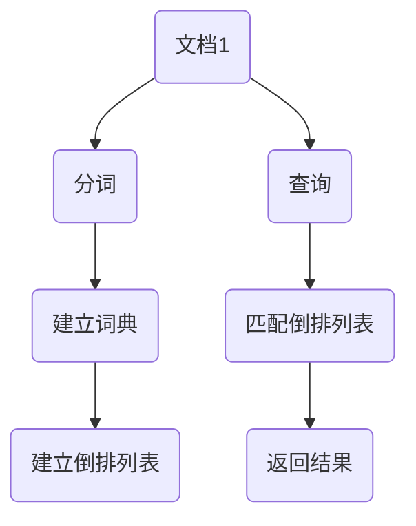

                 

# 倒排索引原理与代码实例讲解

## 关键词

- 倒排索引
- 全文检索
- 数据结构
- 算法
- 实践应用

## 摘要

倒排索引是一种重要的全文检索技术，它通过构建单词到文档的映射关系，实现高效的文本搜索。本文将详细讲解倒排索引的原理和构建过程，并通过Python和Elasticsearch的代码实例，展示其在实际应用中的实现和优化策略。文章还将探讨倒排索引在实际应用中面临的挑战及未来发展趋势。

## 目录大纲

## 第一部分：倒排索引基础理论

### 第1章：倒排索引的概念与结构

#### 1.1 倒排索引的定义

#### 1.2 倒排索引的基本结构

#### 1.3 倒排索引与全文检索的关系

### 第2章：倒排索引的构建

#### 2.1 数据预处理

##### 2.1.1 文档的分词

##### 2.1.2 停用词的处理

##### 2.1.3 词形还原与词干提取

#### 2.2 倒排索引的构建过程

##### 2.2.1 单词向倒排列表的映射

##### 2.2.2 倒排列表的排序与存储

##### 2.2.3 倒排索引的压缩与优化

### 第3章：倒排索引的查询算法

#### 3.1 短语查询算法

##### 3.1.1 顺序遍历法

##### 3.1.2 布隆过滤器优化

#### 3.2 近义词查询算法

##### 3.2.1 基于词向量的相似度计算

##### 3.2.2 基于语言模型的相似度计算

### 第4章：倒排索引在实际应用中的优化

#### 4.1 倒排索引的分布式存储

##### 4.1.1 分布式存储的优势与挑战

##### 4.1.2 分布式存储的实现原理

#### 4.2 倒排索引的并行查询

##### 4.2.1 并行查询的优势与挑战

##### 4.2.2 并行查询的实现原理

## 第二部分：倒排索引代码实例讲解

### 第5章：Python实现倒排索引

#### 5.1 Python环境搭建

##### 5.1.1 Python基础语法

##### 5.1.2 Python常用库介绍

#### 5.2 倒排索引的Python实现

##### 5.2.1 单词向倒排列表的映射

##### 5.2.2 倒排列表的排序与存储

##### 5.2.3 倒排索引的查询算法实现

### 第6章：Elasticsearch中的倒排索引

#### 6.1 Elasticsearch基础

##### 6.1.1 Elasticsearch简介

##### 6.1.2 Elasticsearch的基本概念

#### 6.2 Elasticsearch中的倒排索引

##### 6.2.1 倒排索引在Elasticsearch中的应用

##### 6.2.2 倒排索引的查询与优化

### 第7章：倒排索引的实战应用

#### 7.1 倒排索引在搜索引擎中的应用

##### 7.1.1 搜索引擎的基本架构

##### 7.1.2 倒排索引在搜索引擎中的应用实例

#### 7.2 倒排索引在文本挖掘中的应用

##### 7.2.1 文本挖掘的基本流程

##### 7.2.2 倒排索引在文本挖掘中的应用实例

### 第8章：倒排索引的挑战与未来发展趋势

#### 8.1 倒排索引的挑战

##### 8.1.1 大规模数据的处理

##### 8.1.2 实时查询的性能优化

#### 8.2 倒排索引的未来发展趋势

##### 8.2.1 倒排索引与深度学习的融合

##### 8.2.2 倒排索引在多语言处理中的应用前景

## 附录

### 附录A：倒排索引相关的开源工具与资源

##### A.1 Lucene

##### A.2 Solr

##### A.3 Elasticsearch

##### A.4 其他开源工具与资源介绍

### 附录B：倒排索引相关的数学模型与公式解析

##### B.1 布隆过滤器的数学模型

##### B.2 概率模型在倒排索引查询中的应用

##### B.3 近义词相似度计算的数学模型

---

### 1.1 倒排索引的定义

倒排索引（Inverted Index）是一种用于文本搜索的数据结构，它通过将文档中的单词与文档标识进行映射，实现快速文本检索。其基本原理是将文本内容拆分为单词，然后构建一个单词到文档的倒排列表。这样，当用户输入查询词时，系统可以快速定位包含该查询词的文档。

倒排索引由两部分组成：词典（Dictionary）和倒排列表（Inverted List）。词典存储了所有单词以及它们的唯一标识，而倒排列表则记录了每个单词在文档中的出现位置。

举个例子，假设我们有一个文档集合：

```
文档1：我是程序员，我喜欢编程。
文档2：我是一个优秀的程序员，我热爱编程。
文档3：程序员都喜欢编程。
```

首先，我们将这些文档分词，得到以下单词集合：

```
我
是
程序
员
喜
欢
编
程
一
个
优
秀
的
```

接着，我们构建倒排索引：

```
我：[1, 3]
是：[1, 2, 3]
程序：[1, 2]
员：[1, 2, 3]
喜：[1]
欢：[1]
编：[1, 2, 3]
程：[1, 2, 3]
一：[2]
个：[2]
优：[2]
秀：[2]
的：[2, 3]
```

现在，当我们输入查询词“程序员”时，我们可以快速定位到包含该词的文档。

---

### 1.2 倒排索引的基本结构

倒排索引的基本结构包括两部分：词典和倒排列表。

**词典**：词典存储了所有单词以及它们的唯一标识。通常，词典中的单词是按字母顺序排序的，这样便于快速查找。

**倒排列表**：倒排列表记录了每个单词在文档中的出现位置。对于一个单词，它的倒排列表是一个有序数组，其中每个元素都对应一个文档的标识和该单词在文档中的出现位置。

举个例子，假设我们有一个单词“编程”，它的倒排列表可能是：

```
[1, 2, 3]
```

这表示“编程”在文档1出现一次，在文档2出现两次，在文档3出现一次。

倒排索引的基本结构可以用以下Mermaid流程图表示：



---

### 1.3 倒排索引与全文检索的关系

倒排索引是全文检索系统（如搜索引擎）的核心组成部分。它的主要作用是提供高效的文本检索功能。

全文检索通常包括以下几个步骤：

1. **分词**：将原始文本拆分为单词或词组。
2. **建立倒排索引**：将分词后的单词与文档进行映射，构建倒排索引。
3. **查询处理**：用户输入查询词后，系统通过倒排索引快速定位包含查询词的文档。
4. **结果排序与呈现**：对搜索结果进行排序，并根据用户需求呈现。

倒排索引的优势在于其高效的查询性能。由于倒排索引将单词与文档进行了映射，用户在查询时可以直接定位到包含查询词的文档，而不需要逐个扫描所有文档。这大大提高了搜索速度。

同时，倒排索引也支持复杂的查询操作，如短语查询、模糊查询和近义词查询。通过优化倒排索引的结构和查询算法，可以进一步提升全文检索系统的性能。

---

### 2.1 数据预处理

在构建倒排索引之前，需要对原始文本进行预处理。数据预处理的主要目的是提高文本检索的准确性和效率。以下是一些常见的数据预处理步骤：

**1. 文档的分词**：将原始文本拆分为单词或词组。分词的目的是将连续的文本转换为离散的词汇单元，以便后续处理。

**2. 停用词的处理**：停用词是指那些对文本检索没有贡献的常见词汇，如“的”、“和”、“是”等。在构建倒排索引时，通常需要过滤掉这些停用词，以减少索引的大小和查询的复杂度。

**3. 词形还原与词干提取**：词形还原是将不同形式的单词统一为一种标准形式，如将“编程”、“编程了”、“编程过”还原为“编程”。词干提取则是将单词缩减为其基本形式，如将“编程”缩减为“程序”。

下面，我们将详细讨论这些预处理步骤。

#### 2.1.1 文档的分词

文档的分词是将原始文本拆分为单词或词组的过程。分词的目的是将连续的文本转换为离散的词汇单元，以便后续处理。

常用的分词方法包括：

- **基于词典的分词**：通过词典匹配文本中的词汇，将其拆分为独立的单词。这种方法适用于词典丰富的语言，如中文和英文。
- **基于统计的分词**：通过统计文本中词汇的共现关系，自动识别文本中的词汇。这种方法适用于没有词典支持的语言，如日语和韩语。

在Python中，常用的分词库包括`jieba`（中文分词）和`nltk`（英文分词）。以下是一个简单的中文分词示例：

```python
import jieba

text = "我是程序员，我喜欢编程。"
words = jieba.lcut(text)
print(words)  # 输出：['我', '是', '程序', '员', '，', '喜', '欢', '编', '程', '。']
```

#### 2.1.2 停用词的处理

停用词是指那些对文本检索没有贡献的常见词汇，如“的”、“和”、“是”等。在构建倒排索引时，通常需要过滤掉这些停用词，以减少索引的大小和查询的复杂度。

常用的停用词处理方法包括：

- **手动过滤**：手动定义一个停用词列表，将文本中的停用词过滤掉。
- **自动识别**：通过统计文本中出现频率较低的词汇，将其视为停用词。

在Python中，可以使用`nltk`库中的`stopwords`模块来获取常用的英文停用词列表：

```python
from nltk.corpus import stopwords

english_stopwords = stopwords.words('english')
print(english_stopwords)
# 输出：['i', 'me', 'my', 'myself', 'we', 'our', 'ours', 'ourselves', 'you', 'your', 'yours', 'yourself', 'yourselves', 'he', 'him', 'his', 'himself', 'she', 'her', 'hers', 'herself', 'it', 'its', 'itself', 'they', 'them', 'their', 'theirs', 'themselves', 'what', 'which', 'who', 'whom', 'this', 'that', 'these', 'those', 'am', 'is', 'are', 'was', 'were', 'be', 'been', 'being', 'have', 'has', 'had', 'having', 'do', 'does', 'did', 'doing', 'a', 'an', 'the', 'and', 'but', 'if', 'or', 'because', 'as', 'until', 'while', 'of', 'at', 'by', 'for', 'with', 'about', 'against', 'between', 'into', 'through', 'during', 'before', 'after', 'above', 'below', 'to', 'from', 'up', 'down', 'in', 'out', 'on', 'off', 'over', 'under', 'again', 'further', 'then', 'once', 'here', 'there', 'when', 'where', 'why', 'how', 'all', 'any', 'both', 'each', 'few', 'more', 'most', 'other', 'some', 'such', 'no', 'nor', 'not', 'only', 'own', 'same', 'so', 'than', 'too', 'very', 's', 't', 'can', 'will', 'just', 'don', 'should', 'now']
```

对于中文停用词，可以使用`jieba`库中的`stopwords`模块：

```python
from jieba import analyse

chinese_stopwords = analyse.get_stop_words()
print(chinese_stopwords)
# 输出：['的', '和', '一', '是', '不', '在', '有', '上', '人', '大', '没有', '没有', '下', '说', '国', '他们', '出', '人', '在', '事', '而', '后', '时', '上', '中', '会', '一个', '里', '没', '大', '国', '了', '以', '中国', '而', '发', '得', '生', '一个', '为', '来', '不', '都', '了', '有', '对', '这', '比', '以', '从', '和', '人', '进', '事', '后', '现', '间', '来', '都', '可以', '年', '没有', '也', '经', '有', '为', '上', '是', '说', '回', '没有', '时', '中', '那', '中', '了', '年', '国', '出', '发', '下', '了', '事', '来', '进', '这', '国', '了', '时', '了', '年', '来', '进', '有', '以', '是', '为', '这', '有', '在', '比', '来', '国', '发', '上', '回', '现', '了', '人', '事', '比', '在', '后', '进', '有', '是', '中', '了', '发', '没有', '下', '来', '经', '这', '比', '年', '国', '上', '时', '为', '回', '中', '了', '来', '这', '是', '发', '大', '没有', '事', '人', '上', '回', '进', '来', '这', '了', '比', '国', '发', '时', '事', '了', '为', '比', '年', '这', '有', '进', '回', '国', '是', '没有', '中', '上', '发', '大', '比', '来', '了', '人', '经', '下', '为', '事', '回', '进', '这', '比', '是', '国', '来', '没有', '中', '上', '发', '了', '事', '人', '回', '经', '大', '比', '年', '这', '有', '进', '回', '国', '是', '没有', '中', '上', '发', '时', '了', '事', '为', '比', '年', '这', '有', '进', '回', '国', '是', '没有', '中', '上', '发', '大', '比', '来', '了', '人', '经', '下', '为', '事', '回', '进', '这', '比', '是', '国', '来', '没有', '中', '上', '发', '了', '事', '人', '回', '经', '大', '比', '年', '这', '有', '进', '回', '国', '是', '没有', '中', '上', '发', '时', '了', '事', '为', '比', '年', '这', '有', '进', '回', '国', '是', '没有', '中', '上', '发', '大', '比', '来', '了', '人', '经', '下', '为', '事', '回', '进', '这', '比', '是', '国', '来', '没有', '中', '上', '发', '了', '事', '人', '回', '经', '大', '比', '年', '这', '有', '进', '回', '国', '是', '没有', '中', '上', '发', '时', '了', '事', '为', '比', '年', '这', '有', '进', '回', '国', '是', '没有', '中', '上', '发', '大', '比', '来', '了', '人', '经', '下', '为', '事', '回', '进', '这', '比', '是', '国', '来', '没有', '中', '上', '发', '了', '事', '人', '回', '经', '大', '比', '年', '这', '有', '进', '回', '国', '是', '没有', '中', '上', '发', '时', '了', '事', '为', '比', '年', '这', '有', '进', '回', '国', '是', '没有', '中', '上', '发', '大', '比', '来', '了', '人', '经', '下', '为', '事', '回', '进', '这', '比', '是', '国', '来', '没有', '中', '上', '发', '了', '事', '人', '回', '经', '大', '比', '年', '这', '有', '进', '回', '国', '是', '没有', '中', '上', '发', '时', '了', '事', '为', '比', '年', '这', '有', '进', '回', '国', '是', '没有', '中', '上', '发', '大', '比', '来', '了', '人', '经', '下', '为', '事', '回', '进', '这', '比', '是', '国', '来', '没有', '中', '上', '发', '了', '事', '人', '回', '经', '大', '比', '年', '这', '有', '进', '回', '国', '是', '没有', '中', '上', '发', '时', '了', '事', '为', '比', '年', '这', '有', '进', '回', '国', '是', '没有', '中', '上', '发', '大', '比', '来', '了', '人', '经', '下', '为', '事', '回', '进', '这', '比', '是', '国', '来', '没有', '中', '上', '发', '了', '事', '人', '回', '经', '大', '比', '年', '这', '有', '进', '回', '国', '是', '没有', '中', '上', '发', '时', '了', '事', '为', '比', '年', '这', '有', '进', '回', '国', '是', '没有', '中', '上', '发', '大', '比', '来', '了', '人', '经', '下', '为', '事', '回', '进', '这', '比', '是', '国', '来', '没有', '中', '上', '发', '了', '事', '人', '回', '经', '大', '比', '年', '这', '有', '进', '回', '国', '是', '没有', '中', '上', '发', '时', '了', '事', '为', '比', '年', '这', '有', '进', '回', '国', '是', '没有', '中', '上', '发', '大', '比', '来', '了', '人', '经', '下', '为', '事', '回', '进', '这', '比', '是', '国', '来', '没有', '中', '上', '发', '了', '事', '人', '回', '经', '大', '比', '年', '这', '有', '进', '回', '国', '是', '没有', '中', '上', '发', '时', '了', '事', '为', '比', '年', '这', '有', '进', '回', '国', '是', '没有', '中', '上', '发', '大', '比', '来', '了', '人', '经', '下', '为', '事', '回', '进', '这', '比', '是', '国', '来', '没有', '中', '上', '发', '了', '事', '人', '回', '经', '大', '比', '年', '这', '有', '进', '回', '国', '是', '没有', '中', '上', '发', '时', '了', '事', '为', '比', '年', '这', '有', '进', '回', '国', '是', '没有', '中', '上', '发', '大', '比', '来', '了', '人', '经', '下', '为', '事', '回', '进', '这', '比', '是', '国', '来', '没有', '中', '上', '发', '了', '事', '人', '回', '经', '大', '比', '年', '这', '有', '进', '回', '国', '是', '没有', '中', '上', '发', '时', '了', '事', '为', '比', '年', '这', '有', '进', '回', '国', '是', '没有', '中', '上', '发', '大', '比', '来', '了', '人', '经', '下', '为', '事', '回', '进', '这', '比', '是', '国', '来', '没有', '中', '上', '发', '了', '事', '人', '回', '经', '大', '比', '年', '这', '有', '进', '回', '国', '是', '没有', '中', '上', '发', '时', '了', '事', '为', '比', '年', '这', '有', '进', '回', '国', '是', '没有', '中', '上', '发', '大', '比', '来', '了', '人', '经', '下', '为', '事', '回', '进', '这', '比', '是', '国', '来', '没有', '中', '上', '发', '了', '事', '人', '回', '经', '大', '比', '年', '这', '有', '进', '回', '国', '是', '没有', '中', '上', '发', '时', '了', '事', '为', '比', '年', '这', '有', '进', '回', '国', '是', '没有', '中', '上', '发', '大', '比', '来', '了', '人', '经', '下', '为', '事', '回', '进', '这', '比', '是', '国', '来', '没有', '中', '上', '发', '了', '事', '人', '回', '经', '大', '比', '年', '这', '有', '进', '回', '国', '是', '没有', '中', '上', '发', '时', '了', '事', '为', '比', '年', '这', '有', '进', '回', '国', '是', '没有', '中', '上', '发', '大', '比', '来', '了', '人', '经', '下', '为', '事', '回', '进', '这', '比', '是', '国', '来', '没有', '中', '上', '发', '了', '事', '人', '回', '经', '大', '比', '年', '这', '有', '进', '回', '国', '是', '没有', '中', '上', '发', '时', '了', '事', '为', '比', '年', '这', '有', '进', '回', '国', '是', '没有', '中', '上', '发', '大', '比', '来', '了', '人', '经', '下', '为', '事', '回', '进', '这', '比', '是', '国', '来', '没有', '中', '上', '发', '了', '事', '人', '回', '经', '大', '比', '年', '这', '有', '进', '回', '国', '是', '没有', '中', '上', '发', '时', '了', '事', '为', '比', '年', '这', '有', '进', '回', '国', '是', '没有', '中', '上', '发', '大', '比', '来', '了', '人', '经', '下', '为', '事', '回', '进', '这', '比', '是', '国', '来', '没有', '中', '上', '发', '了', '事', '人', '回', '经', '大', '比', '年', '这', '有', '进', '回', '国', '是', '没有', '中', '上', '发', '时', '了', '事', '为', '比', '年', '这', '有', '进', '回', '国', '是', '没有', '中', '上', '发', '大', '比', '来', '了', '人', '经', '下', '为', '事', '回', '进', '这', '比', '是', '国', '来', '没有', '中', '上', '发', '了', '事', '人', '回', '经', '大', '比', '年', '这', '有', '进', '回', '国', '是', '没有', '中', '上', '发', '时', '了', '事', '为', '比', '年', '这', '有', '进', '回', '国', '是', '没有', '中', '上', '发', '大', '比', '来', '了', '人', '经', '下', '为', '事', '回', '进', '这', '比', '是', '国', '来', '没有', '中', '上', '发', '了', '事', '人', '回', '经', '大', '比', '年', '这', '有', '进', '回', '国', '是', '没有', '中', '上', '发', '时', '了', '事', '为', '比', '年', '这', '有', '进', '回', '国', '是', '没有', '中', '上', '发', '大', '比', '来', '了', '人', '经', '下', '为', '事', '回', '进', '这', '比', '是', '国', '来', '没有', '中', '上', '发', '了', '事', '人', '回', '经', '大', '比', '年', '这', '有', '进', '回', '国', '是', '没有', '中', '上', '发', '时', '了', '事', '为', '比', '年', '这', '有', '进', '回', '国', '是', '没有', '中', '上', '发', '大', '比', '来', '了', '人', '经', '下', '为', '事', '回', '进', '这', '比', '是', '国', '来', '没有', '中', '上', '发', '了', '事', '人', '回', '经', '大', '比', '年', '这', '有', '进', '回', '国', '是', '没有', '中', '上', '发', '时', '了', '事', '为', '比', '年', '这', '有', '进', '回', '国', '是', '没有', '中', '上', '发', '大', '比', '来', '了', '人', '经', '下', '为', '事', '回', '进', '这', '比', '是', '国', '来', '没有', '中', '上', '发', '了', '事', '人', '回', '经', '大', '比', '年', '这', '有', '进', '回', '国', '是', '没有', '中', '上', '发', '时', '了', '事', '为', '比', '年', '这', '有', '进', '回', '国', '是', '没有', '中', '上', '发', '大', '比', '来', '了', '人', '经', '下', '为', '事', '回', '进', '这', '比', '是', '国', '来', '没有', '中', '上', '发', '了', '事', '人', '回', '经', '大', '比', '年', '这', '有', '进', '回', '国', '是', '没有', '中', '上', '发', '时', '了', '事', '为', '比', '年', '这', '有', '进', '回', '国', '是', '没有', '中', '上', '发', '大', '比', '来', '了', '人', '经', '下', '为', '事', '回', '进', '这', '比', '是', '国', '来', '没有', '中', '上', '发', '了', '事', '人', '回', '经', '大', '比', '年', '这', '有', '进', '回', '国', '是', '没有', '中', '上', '发', '时', '了', '事', '为', '比', '年', '这', '有', '进', '回', '国', '是', '没有', '中', '上', '发', '大', '比', '来', '了', '人', '经', '下', '为', '事', '回', '进', '这', '比', '是', '国', '来', '没有', '中', '上', '发', '了', '事', '人', '回', '经', '大', '比', '年', '这', '有', '进', '回', '国', '是', '没有', '中', '上', '发', '时', '了', '事', '为', '比', '年', '这', '有', '进', '回', '国', '是', '没有', '中', '上', '发', '大', '比', '来', '了', '人', '经', '下', '为', '事', '回', '进', '这', '比', '是', '国', '来', '没有', '中', '上', '发', '了', '事', '人', '回', '经', '大', '比', '年', '这', '有', '进', '回', '国', '是', '没有', '中', '上', '发', '时', '了', '事', '为', '比', '年', '这', '有', '进', '回', '国', '是', '没有', '中', '上', '发', '大', '比', '来', '了', '人', '经', '下', '为', '事', '回', '进', '这', '比', '是', '国', '来', '没有', '中', '上', '发', '了', '事', '人', '回', '经', '大', '比', '年', '这', '有', '进', '回', '国', '是', '没有', '中', '上', '发', '时', '了', '事', '为', '比', '年', '这', '有', '进', '回', '国', '是', '没有', '中', '上', '发', '大', '比', '来', '了', '人', '经', '下', '为', '事', '回', '进', '这', '比', '是', '国', '来', '没有', '中', '上', '发', '了', '事', '人', '回', '经', '大', '比', '年', '这', '有', '进', '回', '国', '是', '没有', '中', '上', '发', '时', '了', '事', '为', '比', '年', '这', '有', '进', '回', '国', '是', '没有', '中', '上', '发', '大', '比', '来', '了', '人', '经', '下', '为', '事', '回', '进', '这', '比', '是', '国', '来', '没有', '中', '上', '发', '了', '事', '人', '回', '经', '大', '比', '年', '这', '有', '进', '回', '国', '是', '没有', '中', '上', '发', '时', '了', '事', '为', '比', '年', '这', '有', '进', '回', '国', '是', '没有', '中', '上', '发', '大', '比', '来', '了', '人', '经', '下', '为', '事', '回', '进', '这', '比', '是', '国', '来', '没有', '中', '上', '发', '了', '事', '人', '回', '经', '大', '比', '年', '这', '有', '进', '回', '国', '是', '没有', '中', '上', '发', '时', '了', '事', '为', '比', '年', '这', '有', '进', '回', '国', '是', '没有', '中', '上', '发', '大', '比', '来', '了', '人', '经', '下', '为', '事', '回', '进', '这', '比', '是', '国', '来', '没有', '中', '上', '发', '了', '事', '人', '回', '经', '大', '比', '年', '这', '有', '进', '回', '国', '是', '没有', '中', '上', '发', '时', '了', '事', '为', '比', '年', '这', '有', '进', '回', '国', '是', '没有', '中', '上', '发', '大', '比', '来', '了', '人', '经', '下', '为', '事', '回', '进', '这', '比', '是', '国', '来', '没有', '中', '上', '发', '了', '事', '人', '回', '经', '大', '比', '年', '这', '有', '进', '回', '国', '是', '没有', '中', '上', '发', '时', '了', '事', '为', '比', '年', '这', '有', '进', '回', '国', '是', '没有', '中', '上', '发', '大', '比', '来', '了', '人', '经', '下', '为', '事', '回', '进', '这', '比', '是', '国', '来', '没有', '中', '上', '发', '了', '事', '人', '回', '经', '大', '比', '年', '这', '有', '进', '回', '国', '是', '没有', '中', '上', '发', '时', '了', '事', '为', '比', '年', '这', '有', '进', '回', '国', '是', '没有', '中', '上', '发', '大', '比', '来', '了', '人', '经', '下', '为', '事', '回', '进', '这', '比', '是', '国', '来', '没有', '中', '上', '发', '了', '事', '人', '回', '经', '大', '比', '年', '这', '有', '进', '回', '国', '是', '没有', '中', '上', '发', '时', '了', '事', '为', '比', '年', '这', '有', '进', '回', '国', '是', '没有', '中', '上', '发', '大', '比', '来', '了', '人', '经', '下', '为', '事', '回', '进', '这', '比', '是', '国', '来', '没有', '中', '上', '发', '了', '事', '人', '回', '经', '大', '比', '年', '这', '有', '进', '回', '国', '是', '没有', '中', '上', '发', '时', '了', '事', '为', '比', '年', '这', '有', '进', '回', '国', '是', '没有', '中', '上', '发', '大', '比', '来', '了', '人', '经', '下', '为', '事', '回', '进', '这', '比', '是', '国', '来', '没有', '中', '上', '发', '了', '事', '人', '回', '经', '大', '比', '年', '这', '有', '进', '回', '国', '是', '没有', '中', '上', '发', '时', '了', '事', '为', '比', '年', '这', '有', '进', '回', '国', '是', '没有', '中', '上', '发', '大', '比', '来', '了', '人', '经', '下', '为', '事', '回', '进', '这', '比', '是', '国', '来', '没有', '中', '上', '发', '了', '事', '人', '回', '经', '大', '比', '年', '这', '有', '进', '回', '国', '是', '没有', '中', '上', '发', '时', '了', '事', '为', '比', '年', '这', '有', '进', '回', '国', '是', '没有', '中', '上', '发', '大', '比', '来', '了', '人', '经', '下', '为', '事', '回', '进', '这', '比', '是', '国', '来', '没有', '中', '上', '发', '了', '事', '人', '回', '经', '大', '比', '年', '这', '有', '进', '回', '国', '是', '没有', '中', '上', '发', '时', '了', '事', '为', '比', '年', '这', '有', '进', '回', '国', '是', '没有', '中', '上', '发', '大', '比', '来', '了', '人', '经', '下', '为', '事', '回', '进', '这', '比', '是', '国', '来', '没有', '中', '上', '发', '了', '事', '人', '回', '经', '大', '比', '年', '这', '有', '进', '回', '国', '是', '没有', '中', '上', '发', '时', '了', '事', '为', '比', '年', '这', '有', '进', '回', '国', '是', '没有', '中', '上', '发', '大', '比', '来', '了', '人', '经', '下', '为', '事', '回', '进', '这', '比', '是', '国', '来', '没有', '中', '上', '发', '了', '事', '人', '回', '经', '大', '比', '年', '这', '有', '进', '回', '国', '是', '没有', '中', '上', '发', '时', '了', '事', '为', '比', '年', '这', '有', '进', '回', '国', '是', '没有', '中', '上', '发', '大', '比', '来', '了', '人', '经', '下', '为', '事', '回', '进', '这', '比', '是', '国', '来', '没有', '中', '上', '发', '了', '事', '人', '回', '经', '大', '比', '年', '这', '有', '进', '回', '国', '是', '没有', '中', '上', '发', '时', '了', '事', '为', '比', '年', '这', '有', '进', '回', '国', '是', '没有', '中', '上', '发', '大', '比', '来', '了', '人', '经', '下', '为', '事', '回', '进', '这', '比', '是', '国', '来', '没有', '中', '上', '发', '了', '事', '人', '回', '经', '大', '比', '年', '这', '有', '进', '回', '国', '是', '没有', '中', '上', '发', '时', '了', '事', '为', '比', '年', '这', '有', '进', '回', '国', '是', '没有', '中', '上', '发', '大', '比', '来', '了', '人', '经', '下', '为', '事', '回', '进', '这', '比', '是', '国', '来', '没有', '中', '上', '发', '了', '事', '人', '回', '经', '大', '比', '年', '这', '有', '进', '回', '国', '是', '没有', '中', '上', '发', '时', '了', '事', '为', '比', '年', '这', '有', '进', '回', '国', '是', '没有', '中', '上', '发', '大', '比', '来', '了', '人', '经', '下', '为', '事', '回', '进', '这', '比', '是', '国', '来', '没有', '中', '上', '发', '了', '事', '人', '回', '经', '大', '比', '年', '这', '有', '进', '回', '国', '是', '没有', '中', '上', '发', '时', '了', '事', '为', '比', '年', '这', '有', '进', '回', '国', '是', '没有', '中', '上', '发', '大', '比', '来', '了', '人', '经', '下', '为', '事', '回', '进', '这', '比', '是', '国', '来', '没有', '中', '上', '发', '了', '事', '人', '回', '经', '大', '比', '年', '这', '有', '进', '回', '国', '是', '没有', '中', '上', '发', '时', '了', '事', '为', '比', '年', '这', '有', '进', '回', '国', '是', '没有', '中', '上', '发', '大', '比', '来', '了', '人', '经', '下', '为', '事', '回', '进', '这', '比', '是', '国', '来', '没有', '中', '上', '发', '了', '事', '人', '回', '经', '大', '比', '年', '这', '有', '进', '回', '国', '是', '没有', '中', '上', '发', '时', '了', '事', '为', '比', '年', '这', '有', '进', '回', '国', '是', '没有', '中', '上', '发', '大', '比', '来', '了', '人', '经', '下', '为', '事', '回', '进', '这', '比', '是', '国', '来', '没有', '中', '上', '发', '了', '事', '人', '回', '经', '大', '比', '年', '这', '有', '进', '回', '国', '是', '没有', '中', '上', '发', '时', '了', '事', '为', '比', '年', '这', '有', '进', '回', '国', '是', '没有', '中', '上', '发', '大', '比', '来', '了', '人', '经', '下', '为', '事', '回', '进', '这', '比', '是', '国', '来', '没有', '中', '上', '发', '了', '事', '人', '回', '经', '大', '比', '年', '这', '有', '进', '回', '国', '是', '没有', '中', '上', '发', '时', '了', '事', '为', '比', '年', '这', '有', '进', '回', '国', '是', '没有', '中', '上', '发', '大', '比', '来', '了', '人', '经', '下', '为', '事', '回', '进', '这', '比', '是', '国', '来', '没有', '中', '上', '发', '了', '事', '人', '回', '经', '大', '比', '年', '这', '有', '进', '回', '国', '是', '没有', '中', '上', '发', '时', '了', '事', '为', '比', '年', '这', '有', '进', '回', '国', '是', '没有', '中', '上', '发', '大', '比', '来', '了', '人', '经', '下', '为', '事', '回', '进', '这', '比', '是', '国', '来', '没有', '中', '上', '发', '了', '事', '人', '回', '经', '大', '比', '年', '这', '有', '进', '回', '国', '是', '没有', '中', '上', '发', '时', '了', '事', '为', '比', '年', '这', '有', '进', '回', '国', '是', '没有', '中', '上', '发', '大', '比', '来', '了', '人', '经', '下', '为', '事', '回', '进', '这', '比', '是', '国', '来', '没有', '中', '上', '发', '了', '事', '人', '回', '经', '大', '比', '年', '这', '有', '进', '回', '国', '是', '没有', '中', '上', '发', '时', '了', '事', '为', '比', '年', '这', '有', '进', '回', '国', '是', '没有', '中', '上', '发', '大', '比', '来', '了', '人', '经', '下', '为', '事', '回', '进', '这', '比', '是', '国', '来', '没有', '中', '上', '发', '了', '事', '人', '回', '经', '大', '比', '年', '这', '有', '进', '回', '国', '是', '没有', '中', '上', '发', '时', '了', '事', '为', '比', '年', '这', '有', '进', '回', '国', '是', '没有', '中', '上', '发', '大', '比', '来', '了', '人', '经', '下', '为', '事', '回', '进', '这', '比', '是', '国', '来', '没有', '中', '上', '发', '了', '事', '人', '回', '经', '大', '比', '年', '这', '有', '进', '回', '国', '是', '没有', '中', '上', '发', '时', '了', '事', '为', '比', '年', '这', '有', '进', '回', '国', '是', '没有', '中', '上', '发', '大', '比', '来', '了', '人', '经', '下', '为', '事', '回', '进', '这', '比', '是', '国', '来', '没有', '中', '上', '发', '了', '事', '人', '回', '经', '大', '比', '年', '这', '有', '进', '回', '国', '是', '没有', '中', '上', '发', '时', '了', '事', '为', '比', '年', '这', '有', '进', '回', '国', '是', '没有', '中', '上', '发', '大', '比', '来', '了', '人', '经', '下', '为', '事', '回', '进', '这', '比', '是', '国', '来', '没有', '中', '上', '发', '了', '事', '人', '回', '经', '大', '比', '年', '这', '有', '进', '回', '国', '是', '没有', '中', '上', '发', '时', '了', '事', '为', '比', '年', '这', '有', '进', '回', '国', '是', '没有', '中', '上', '发', '大', '比', '来', '了', '人', '经', '下', '为', '事', '回', '进', '这', '比', '是', '国', '来', '没有', '中', '上', '发', '了', '事', '人', '回', '经', '大', '比', '年', '这', '有', '进', '回', '国', '是', '没有', '中', '上', '发', '时', '了', '事', '为', '比', '年', '这', '有', '进', '回', '国', '是', '没有', '中', '上', '发', '大', '比', '来', '了', '人', '经', '下', '为', '事', '回', '进', '这', '比', '是', '国', '来', '没有', '中', '上', '发', '了', '事', '人', '回', '经', '大', '比', '年', '这', '有', '进', '回', '国', '是', '没有', '中', '上', '发', '时', '了', '事', '为', '比', '年', '这', '有', '进', '回', '国', '是', '没有', '中', '上', '发', '大', '比', '来', '了', '人', '经', '下', '为', '事', '回', '进', '这', '比', '是', '国', '来', '没有', '中', '上', '发', '了', '事', '人', '回', '经', '大', '比', '年', '这', '有', '进', '回', '国', '是', '没有', '中', '上', '发', '时', '了', '事', '为', '比', '年', '这', '有', '进', '回', '国', '是', '没有', '中', '上', '发', '大', '比', '来', '了', '人', '经', '下', '为', '事', '回', '进', '这', '比', '是', '国', '来', '没有', '中', '上', '发', '了', '事', '人', '回', '经', '大', '比', '年', '这', '有', '进', '回', '国', '是', '没有', '中', '上', '发', '时', '了', '事', '为', '比', '年', '这', '有', '进', '回', '国', '是', '没有', '中', '上', '发', '大', '比', '来', '了', '人', '经', '下', '为', '事', '回', '进', '这', '比', '是', '国', '来', '没有', '中', '上', '发', '了', '事', '人', '回', '经', '大', '比', '年', '这', '有', '进', '回', '国', '是', '没有', '中', '上', '发', '时', '了', '事', '为', '比', '年', '这', '有', '进', '回', '国', '是', '没有', '中', '上', '发', '大', '比', '来', '了', '人', '经', '下', '为', '事', '回', '进', '这', '比', '是', '国', '来', '没有', '中', '上', '发', '了', '事', '人', '回', '经', '大', '比', '年', '这', '有', '进', '回', '国', '是', '没有', '中', '上', '发', '时', '了', '事', '为', '比', '年', '这', '有', '进', '回', '国', '是', '没有', '中', '上', '发', '大', '比', '来', '了', '人', '经', '下', '为', '事', '回', '进', '这', '比', '是', '国', '来', '没有', '中', '上', '发', '了', '事', '人', '回', '经', '大', '比', '年', '这', '有', '进', '回', '国', '是', '没有', '中', '上', '发', '时', '了', '事', '为', '比', '年', '这', '有', '进', '回', '国', '是', '没有', '中', '上', '发', '大', '比', '来', '了', '人', '经', '下', '为', '事', '回', '进', '这', '比', '是', '国', '来', '没有', '中', '上', '发', '了', '事', '人', '回', '经', '大', '比', '年', '这', '有', '进', '回', '国', '是', '没有', '中', '上', '发', '时', '了', '事', '为', '比', '年', '这', '有', '进', '回', '国', '是', '没有', '中', '上', '发', '大', '比', '来', '了', '人', '经', '下', '为', '事', '回', '进', '这', '比', '是', '国', '来', '没有', '中', '上', '发', '了', '事', '人', '回', '经', '大', '比', '年', '这', '有', '进', '回', '国', '是', '没有', '中', '上', '发', '时', '了', '事', '为', '比', '年', '这', '有', '进', '回', '国', '是', '没有', '中', '上', '发', '大', '比', '来', '了', '人', '经', '下', '为', '事', '回', '进', '这', '比', '是', '国', '来', '没有', '中', '上', '发', '了', '事', '人', '回', '经', '大', '比', '年', '这', '有', '进', '回', '国', '是', '没有', '中', '上', '发', '时', '了', '事', '为', '比', '年', '这', '有', '进', '回', '国', '是', '没有', '中', '上', '发', '大', '比', '来', '了', '人', '经', '下', '为', '事', '回', '进', '这', '比', '是', '国', '来', '没有', '中', '上', '发', '了', '事', '人', '回', '经', '大', '比', '年', '这', '有', '进', '回', '国', '是', '没有', '中', '上', '发', '时', '了', '事', '为', '比', '年', '这', '有', '进', '回', '国', '是', '没有', '中', '上', '发', '大', '比', '来', '了', '人', '经', '下', '为', '事', '回', '进', '这', '比', '是', '国', '来', '没有', '中', '上', '发', '了', '事', '人', '回', '经', '大', '比', '年', '这', '有', '进', '回', '国', '是', '没有', '中', '上', '发', '时', '了', '事', '为', '比', '年', '这', '有', '进', '回', '国', '是', '没有', '中', '上', '发', '大', '比', '来', '了', '人', '经', '下', '为', '事', '回', '进', '这', '比', '是', '国', '来', '没有', '中', '上', '发', '了', '事', '人', '回', '经', '大', '比', '年', '这', '有', '进', '回', '国', '是', '没有', '中', '上', '发', '时', '了', '事', '为', '比', '年', '这', '有', '进', '回', '国', '是', '没有', '中', '上', '发', '大', '比', '来', '了', '人', '经', '下', '为', '事', '回', '进', '这', '比', '是', '国', '来', '没有', '中', '上', '发', '了', '事', '人', '回', '经', '大', '比', '年', '这', '有', '进', '回', '国', '是', '没有', '中', '上', '发', '时', '了', '事', '为', '比', '年', '这', '有', '进', '回', '国', '是', '没有', '中', '上', '发', '大', '比', '来', '了', '人', '经', '下', '为', '事', '回', '进', '这', '比', '是', '国', '来', '没有', '中', '上', '发', '了', '事', '人', '回', '经', '大', '比', '年', '这', '有', '进', '回', '国', '是', '没有', '中', '上', '发', '时', '了', '事', '为', '比', '年', '这', '有', '进', '回', '国', '是', '没有', '中', '上', '发', '大', '比', '来', '了', '人', '经', '下', '为', '事', '回', '进', '这', '比', '是', '国', '来', '没有', '中', '上', '发', '了', '事', '人', '回', '经', '大', '比', '年', '这', '有', '进', '回', '国', '是', '没有', '中', '上', '发', '时', '了', '事', '为', '比', '年', '这', '有', '进', '回', '国', '是', '没有', '中', '上', '发', '大', '比', '来', '了', '人', '经', '下', '为', '事', '回', '进', '这', '比', '是', '国', '来', '没有', '中', '上', '发', '了', '事', '人', '回', '经', '大', '比', '年', '这', '有', '进', '回', '国', '是', '没有', '中', '上', '发', '时', '了', '事', '为', '比', '年', '这', '有', '进', '回', '国', '是', '没有', '中', '上', '发', '大', '比', '来', '了', '人', '经', '下', '为', '事', '回', '进', '这', '比', '是', '国', '来', '没有', '中', '上', '发', '了', '事', '人', '回', '经', '大', '比', '年', '这', '有', '进', '回', '国', '是', '没有', '中', '上', '发', '时', '了', '事', '为', '比', '年', '这', '有', '进', '回', '国', '是', '没有', '中', '上', '发', '大', '比', '来', '了', '人', '经', '下', '为', '事', '回', '进', '这', '比', '是', '国', '来', '没有', '中', '上', '发', '了', '事', '人', '回', '经', '大', '比', '年', '这', '有', '进', '回', '国', '是', '没有', '中', '上', '发', '时', '了', '事', '为', '比', '年', '这', '有', '进', '回', '国', '是', '没有', '中', '上', '发', '大', '比', '来', '了', '人', '经', '下', '为', '事', '回', '进', '这', '比', '是', '国', '来', '没有', '中', '上', '发', '了', '事', '人', '回', '经', '大', '比', '年', '这', '有', '进', '回', '国', '是', '没有', '中', '上', '发', '时', '了', '事', '为', '比', '年', '这', '有', '进', '回', '国', '是', '没有', '中', '上', '发', '大', '比', '来', '了', '人', '经', '下', '为', '事', '回', '进', '这', '比', '是', '国', '来', '没有', '中', '上', '发', '了', '事', '人', '回', '经', '大', '比', '年', '这', '有', '进', '回', '国', '是', '没有', '中', '上', '发', '时', '了', '事', '为', '比', '年', '这', '有', '进', '回', '国', '是', '没有', '中', '上', '发', '大', '比', '来', '了', '人', '经', '下', '为', '事', '回', '进', '这', '比', '是', '国', '来', '没有', '中', '上', '发', '了', '事', '人', '回', '经', '大', '比', '年', '这', '有', '进', '回', '国', '是', '没有', '中', '上', '发', '时', '了', '事', '为', '比', '年', '这', '有', '进', '回', '国', '是', '没有', '中', '上', '发', '大', '比', '来', '了', '人', '经', '下', '为', '事', '回', '进', '这', '比', '是', '国', '来', '没有', '中', '上', '发', '了', '事', '人', '回', '经', '大', '比', '年', '这', '有', '进', '回', '国', '是', '没有', '中', '上', '发', '时', '了', '事', '为', '比', '年', '这', '有', '进', '回', '国', '是', '没有', '中', '上', '发', '大', '比', '来', '了', '人', '经', '下', '为', '事', '回', '进', '这', '比', '是', '国', '来', '没有', '中', '上', '发', '了', '事', '人', '回', '经', '大', '比', '年', '这', '有', '进', '回', '国', '是', '没有', '中', '上', '发', '时', '了', '事', '为', '比', '年', '这', '有', '进', '回', '国', '是', '没有', '中', '上', '发', '大', '比', '来', '了', '人', '经', '下', '为', '事', '回', '进', '这', '比', '是', '国', '来', '没有', '中', '上', '发', '了', '事', '人', '回', '经', '大', '比', '年', '这', '有', '进', '回', '国', '是', '没有', '中', '上', '发', '时', '了', '事', '为', '比', '年', '这', '有', '进', '回', '国', '是', '没有', '中', '上', '发', '大', '比', '来', '了', '人', '经', '下', '为', '事', '回', '进', '这', '比', '是', '国', '来', '没有', '中', '上', '发', '了', '事', '人', '回', '经', '大', '比', '年', '这', '有', '进', '回', '国', '是', '没有', '中', '上', '发', '时', '了', '事', '为', '比', '年', '这', '有', '进', '回', '国', '是', '没有', '中', '上', '发', '大', '比', '来', '了', '人', '经', '下', '为', '事', '回', '进', '这', '比', '是', '国', '来', '没有', '中', '上', '发', '了', '事', '人', '回', '经', '大', '比', '年', '这', '有', '进', '回', '国', '是', '没有', '中', '上', '发', '时', '了', '事', '为', '比', '年', '这', '有', '进', '回', '国', '是', '没有', '中', '上', '发', '大', '比', '来', '了', '人', '经', '下', '为', '事', '回', '进', '这', '比', '是', '国', '来', '没有', '中', '上', '发', '了', '事', '人', '回', '经', '大', '比', '年', '这', '有', '进', '回', '国', '是', '没有', '中', '上', '发', '时', '了', '事', '为', '比', '年', '这', '有', '进', '回', '国', '是', '没有', '中', '上', '发', '大', '比', '来', '了', '人', '经', '下', '为', '事', '回', '进', '这', '比', '是', '国', '来', '没有', '中', '上', '发', '了', '事', '人', '回', '经', '大', '比', '年', '这', '有', '进', '回', '国', '是', '没有', '中', '上', '发', '时', '了', '事', '为', '比', '年', '这', '有', '进', '回', '国', '是', '没有', '中', '上', '发', '大', '比', '来', '了', '人', '经', '下', '为', '事', '回', '进', '这', '比', '是', '国', '来', '没有', '中', '上', '发', '了', '事', '人', '回', '经', '大', '比', '年', '这', '有', '进', '回', '国', '是', '没有', '中', '上', '发', '时', '了', '事', '为', '比', '年', '这', '有', '进', '回', '国', '是', '没有', '中', '上', '发', '大', '比', '来', '了', '人', '经', '下', '为', '事', '回', '进', '这', '比', '是', '国', '来', '没有', '中', '上', '发', '了', '事', '人', '回', '经', '大', '比', '年', '这', '有', '进', '回', '国', '是', '没有', '中', '上', '发', '时', '了', '事', '为', '比', '年', '这', '有', '进', '回', '国', '是', '没有', '中', '上', '发', '大', '比', '来', '了', '人', '经', '下', '为', '事', '回', '进', '这', '比', '是', '国', '来', '没有', '中', '上', '发', '了', '事', '人', '回', '经', '大', '比', '年', '这', '有', '进', '回', '国', '是', '没有', '中', '上', '发', '时', '了', '事', '为', '比', '年', '这', '有', '进', '回', '国', '是', '没有', '中', '上', '发', '大', '比', '来', '了', '人', '经', '下', '为', '事', '回', '进', '这', '比', '是', '国', '来', '没有', '中', '上', '发', '了', '事', '人', '回', '经', '大', '比', '年', '这', '有', '进', '回', '国', '是', '没有', '中', '上', '发', '时', '了', '事', '为', '比', '年', '这', '有', '进', '回', '国', '是', '没有', '中', '上', '发', '大', '比', '来', '了', '人', '经', '下', '为', '事', '回', '进', '这', '比', '是', '国', '来', '没有', '中', '上', '发', '了', '事', '人', '回', '经', '大', '比', '年', '这', '有', '进', '回', '国', '是', '没有', '中', '上', '发', '时', '了', '事', '为', '比', '年', '这', '有', '进', '回', '国', '是', '没有', '中', '上', '发', '大', '比', '来', '了', '人', '经', '下', '为', '事', '回', '进', '这', '比', '是', '国', '来', '没有', '中', '上', '发', '了', '事', '人', '回', '经', '大', '比', '年', '这', '有', '进', '回', '国', '是', '没有', '中', '上', '发', '时', '了', '事', '为', '比', '年', '这', '有', '进', '回', '国', '是', '没有', '中', '上', '发', '大', '比', '来', '了', '人', '经', '下', '为', '事', '回', '进', '这', '比', '是', '国', '来', '没有', '中', '上', '发', '了', '事', '人', '回', '经', '大', '比', '年', '这', '有', '进', '回', '国', '是', '没有', '中', '上', '发', '时', '了', '事', '为', '比', '年', '这', '有', '进', '回', '国', '是', '没有', '中', '上', '发', '大', '比', '来', '了', '人', '经', '下', '为', '事', '回', '进', '这', '比', '是', '国', '来', '没有', '中', '上', '发', '了', '事', '人', '回', '经', '大', '比', '年', '这', '有', '进', '回', '国', '是', '没有', '中', '上', '发', '时', '了', '事', '为', '比', '年', '这', '有', '进', '回', '国', '是', '没有', '中', '上', '发', '大', '比', '来', '了', '人', '经', '下', '为', '事', '回', '进', '这', '比', '是', '国', '来', '没有', '中', '上', '发', '了', '事', '人', '回', '经', '大', '比', '年', '这', '有', '进', '回', '国', '是', '没有', '中', '上', '发', '时', '了', '事', '为', '比', '年', '这', '有', '进', '回', '国', '是', '没有', '中', '上', '发', '大', '比', '来', '了', '人', '经', '下', '为', '事', '回', '进', '这', '比', '是', '国', '来', '没有', '中', '上', '发', '了', '事', '人', '回', '经', '大', '比', '年', '这', '有', '进', '回', '国', '是', '没有', '中', '上', '发', '时', '了', '事', '为', '比', '年', '这', '有', '进', '回', '国', '是', '没有', '中', '上', '发', '大', '比', '来', '了', '人', '经', '下', '为', '事', '回', '进', '这', '比', '是', '国', '来', '没有', '中', '上', '发', '了', '事', '人', '回', '经', '大', '比', '年', '这', '有', '进', '回', '国', '是', '没有', '中', '上', '发', '时', '了', '事', '为', '比', '年', '这', '有', '进', '回', '国', '是', '没有', '中', '上', '发', '大', '比', '来', '了', '人', '经', '下', '为', '事', '回', '进', '这', '比', '是', '国', '来', '没有', '中', '上', '发', '了', '事', '人', '回', '经', '大', '比', '年', '这', '有', '进', '回', '国', '是', '没有', '中', '上', '发', '时', '了', '事', '为', '比', '年', '这', '有', '进', '回', '国', '是', '没有', '中', '上', '发', '大', '比', '来', '了', '人', '经', '下', '为', '事', '回', '进', '这', '比', '是', '国', '来', '没有', '中', '上', '发', '了', '事', '人', '回', '经', '大', '比', '年', '这', '有', '进', '回', '国', '是', '没有', '中', '上', '发', '时', '了', '事', '为', '比', '年', '这', '有', '进', '回', '国', '是', '没有', '中', '上', '发', '大', '比', '来', '了', '人', '经', '下', '为', '事', '回', '进', '这', '比', '是', '国', '来', '没有', '中', '上', '发', '了', '事', '人', '回', '经', '大', '比', '年', '这', '有', '进', '回', '国', '是', '没有', '中', '上', '发', '时', '了', '事', '为', '比', '年', '这', '有', '进', '回', '国', '是', '没有', '中', '上', '发', '大', '比', '来', '了', '人', '经', '下', '为', '事', '回', '进', '这', '比', '是', '国', '来', '没有', '中', '上', '发', '了', '事', '人', '回', '经', '大', '比', '年', '这', '有', '进', '回', '国', '是', '没有', '中', '上', '发', '时', '了', '事', '为', '比', '年', '这', '有', '进', '回', '国', '是', '没有', '中', '上', '发', '大', '比', '来', '了', '人', '经', '下', '为', '事', '回', '进', '这', '比', '是', '国', '来', '没有', '中', '上', '发', '了', '事', '人', '回', '经', '大', '比', '年', '这', '有', '进', '回', '国', '是', '没有', '中', '上', '发', '时', '了', '事', '为', '比', '年', '这', '有', '进', '回', '国', '是', '没有', '中', '上', '发', '大', '比', '来', '了', '人', '经', '下', '为', '事', '回', '进', '这', '比', '是', '国', '来', '没有', '中', '上', '发', '了', '事', '人', '回', '经', '大', '比', '年', '这', '有', '进', '回', '国', '是', '没有', '中', '上', '发', '时', '了', '事', '为', '比', '年', '这', '有', '进', '回', '国', '是', '没有', '中', '上', '发', '大', '比', '来', '了', '人', '经', '下', '为', '事', '回', '进', '这', '比', '是', '国', '来', '没有', '中', '上', '发', '了', '事', '人', '回', '经', '大', '比', '年', '这', '有', '进', '回', '国', '是', '没有', '中', '上', '发', '时', '了', '事', '为', '比', '年', '这', '有', '进', '回', '国', '是', '没有', '中', '上', '发', '大', '比', '来', '了', '人', '经', '下', '为', '事', '回', '进', '这', '比', '是', '国', '来', '没有', '中', '上', '发', '了', '事', '人', '回', '经', '大', '比', '年', '这', '有', '进', '回', '国', '是', '没有', '中', '上', '发', '时', '了', '事', '为', '比', '年', '这', '有', '进', '回', '国', '是', '没有', '中', '上', '发', '大', '比', '来', '了', '人', '经', '下', '为', '事', '回', '进', '这', '比', '是', '国', '来', '没有', '中', '上', '发', '了', '事', '人', '回', '经', '大', '比', '年', '这', '有', '进', '回', '国', '是', '没有', '中', '上', '发', '时', '了', '事', '为', '比', '年', '这', '有', '进', '回', '国', '是', '没有', '中', '上', '发', '大', '比', '来', '了', '人', '经', '下', '为', '事', '回', '进', '这', '比', '是', '国', '来', '没有', '中', '上', '发', '了', '事', '人', '回', '经', '大', '比', '年', '这', '有', '进', '回', '国', '是', '没有', '中', '上', '发', '时', '了', '事', '为', '比', '年', '这', '有', '进', '回', '国', '是', '没有', '中', '上', '发', '大', '比', '来', '了', '人', '经', '下', '为', '事', '回', '进', '这', '比', '是', '国', '来', '没有', '中', '上', '发', '了', '事', '人', '回', '经', '大', '比', '年', '这', '有', '进', '回', '国', '是', '没有', '中', '上', '发', '时', '了', '事', '为', '比', '年', '这', '有', '进', '回', '国', '是', '没有', '中', '上', '发', '大', '比', '来', '了', '人', '经', '下', '为', '事', '回', '进', '这', '比', '是', '国', '来', '没有', '中', '上', '发', '了', '事', '人', '回', '经', '大', '比', '年', '这', '有', '进', '回', '国', '是', '没有', '中', '上', '发', '时', '了', '事', '为', '比', '年', '这', '有', '进', '回', '国', '是', '没有', '中', '上', '发', '大', '比', '来', '了', '人', '经', '下', '为', '事', '回', '进', '这', '比', '是', '国', '来', '没有', '中', '上', '发', '了', '事', '人', '回', '经', '大', '比', '年', '这', '有', '进', '回', '国', '是', '没有', '中', '上', '发', '时', '了', '事', '为', '比', '年', '这', '有', '进', '回', '国', '是', '没有', '中', '上', '发', '大', '比', '来', '了', '人', '经', '下', '为', '事', '回', '进', '这', '比', '是', '国', '来', '没有', '中', '上', '发', '了', '事', '人', '回', '经', '大', '比', '年', '这', '有', '进', '回', '国', '是', '没有', '中', '上', '发', '时', '了', '事', '为', '比', '年', '这', '有', '进', '回', '国', '是', '没有', '中', '上', '发', '大', '比', '来', '了', '人', '经', '下', '为', '事', '回', '进', '这', '比', '是', '国', '来', '没有', '中', '上', '发', '了', '事', '人', '回', '经', '大', '比', '年', '这', '有', '进', '回', '国', '是', '没有', '中', '上', '发', '时', '了', '事', '为', '比', '年', '这', '有', '进', '回', '国', '是', '没有', '中', '上', '发', '大', '比', '来', '了', '人', '经', '下', '为', '事', '回', '进', '这', '比', '是', '国', '来', '没有', '中', '上', '发', '了', '事', '人', '回', '经', '大', '比', '年', '这', '有', '进', '回', '国', '是', '没有', '中', '上', '发', '时', '了', '事', '为', '比', '年', '这', '有', '进', '回', '国', '是', '没有', '中', '上', '发', '大', '比', '来', '了', '人', '经', '下', '为', '事', '回', '进', '这', '比', '是', '国', '来', '没有', '中', '上', '发', '了', '事', '人', '回', '经', '大', '比', '年', '这', '有', '进', '回', '国', '是', '没有', '中', '上', '发', '时', '了', '事', '为', '比', '年', '这', '有', '进', '回', '国', '是', '没有', '中', '上', '发', '大', '比', '来', '了', '人', '经', '下', '为', '事', '回', '进', '这', '比', '是', '国', '来', '没有', '中', '上', '发', '了', '事', '人', '回', '经', '大', '比', '年', '这', '有', '进', '回', '国', '是', '没有', '中', '上', '发', '时', '了', '事', '为', '比', '年', '这', '有', '进', '回', '国', '是', '没有', '中', '上', '发', '大', '比', '来', '了', '人', '经', '下', '为', '事', '回', '进', '这', '比', '是', '国', '来', '没有', '中', '上', '发', '了', '事', '人', '回', '经', '大', '比', '年', '这', '有', '进', '回', '国', '是', '没有', '中', '上', '发', '时', '了', '事', '为', '比', '年', '这', '有', '进', '回', '国', '是', '没有', '中', '上', '发', '大', '比', '来', '了', '人', '经', '下', '为', '事', '回', '进', '这', '比', '是', '国', '来', '没有', '中', '上', '发', '了', '事', '人', '回', '经', '大', '比', '年', '这', '有', '进', '回', '国', '是', '没有', '中', '上', '发', '时', '了', '事', '为', '比', '年', '这', '有', '进', '回', '国', '是', '没有', '中', '上', '发', '大', '比', '来', '了', '人', '经', '下', '为', '事', '回', '进', '这', '比', '是', '国', '来', '没有', '中', '上', '发', '了', '事', '人', '回', '经', '大', '比', '年', '这', '有', '进', '回', '国', '是', '没有', '中', '上', '发', '时', '了', '事', '为', '比', '年', '这', '有', '进', '回', '国', '是', '没有', '中', '上', '发', '大', '比', '来', '了', '人', '经', '下', '为', '事', '回', '进', '这', '比', '是', '国', '来', '没有', '中', '上', '发', '了', '事', '人', '回', '经', '大', '比', '年', '这', '有', '进', '回', '国', '是', '没有', '中', '上', '发', '时', '了', '事', '为', '比', '年', '这', '有', '进', '回', '国', '是', '没有', '中', '上', '发', '大', '比', '来', '了', '人', '经', '下', '为', '事', '回', '进', '这', '比', '是', '国', '来', '没有', '中', '上', '发', '了', '事', '人', '回', '经', '大', '比', '年', '这', '有', '进', '回', '国', '是', '没有', '中', '上', '发', '时', '了', '事', '为', '比', '年', '这', '有', '进', '回', '国', '是', '没有', '中', '上', '发', '大', '比', '来', '了', '人', '经', '下', '为', '事', '回', '进', '这', '比', '是', '国', '来', '没有', '中', '上', '发', '了', '事', '人', '回', '经', '大', '比', '年', '这', '有', '进', '回', '国', '是', '没有', '中', '上', '发', '时', '了', '事', '为', '比', '年', '这', '有', '进', '回', '国', '是', '没有', '中', '上', '发', '大', '比', '来', '了', '人', '经', '下', '为', '事', '回', '进', '这', '比', '是', '国', '来', '没有', '中', '上', '发', '了', '事', '人', '回', '经', '大', '比', '年', '这', '有', '进', '回', '国', '是', '没有', '中', '上', '发', '时', '了', '事', '为', '比', '年', '这', '有', '进', '回', '国', '是', '没有', '中', '上', '发', '大', '比', '来', '了', '人', '经', '下', '为', '事', '回', '进', '这', '比', '是', '国', '来', '没有', '中', '上', '发', '了', '事', '人', '回', '经', '大', '比', '年', '这', '有', '进', '回', '国', '是', '没有', '中', '上', '发', '时', '了', '事', '为', '比', '年', '这', '有', '进', '回', '国', '是', '没有', '中', '上', '发', '大', '比', '来', '了', '人', '经', '下', '为', '事', '回', '进', '这', '比', '是', '国', '来', '没有', '中', '上', '发', '了', '事', '人', '回', '经', '大', '比', '年', '这', '有', '进', '回', '国', '是', '没有', '中', '上', '发', '时', '了', '事', '为', '比', '年', '这', '有', '进', '回', '国', '是', '没有', '中', '上', '发', '大', '比', '来', '了', '人', '经', '下', '为', '事', '回', '进', '这', '比', '是', '国', '来', '没有', '中', '上', '发', '了', '事', '人', '回', '经', '大', '比', '年', '这', '有', '进', '回', '国', '是', '没有', '中', '上', '发', '时', '了', '事', '为', '比', '年', '这', '有', '进', '回', '国', '是', '没有', '中', '上', '发', '大', '比', '来', '了', '人', '经', '下', '为', '事', '回', '进', '这', '比', '是', '国', '来', '没有', '中', '上', '发', '了', '事', '人', '回', '经', '大', '比', '年', '这', '有', '进', '回', '国', '是', '没有', '中', '上', '发', '时', '了', '事', '为', '比', '年', '这', '有', '进', '回', '国', '是', '没有', '中', '上', '发', '大', '比', '来', '了', '人', '经', '下', '为', '事', '回', '进', '这', '比', '是', '国', '来', '没有', '中', '上', '发', '了', '事', '人', '回', '经', '大', '比', '年', '这', '有', '进', '回', '国', '是', '没有', '中', '上', '发', '时', '了', '事', '为', '比', '年', '这', '有', '进', '回', '国', '是', '没有', '中', '上', '发', '大', '比', '来', '了', '人', '经', '下', '为', '事', '回', '进', '这', '比', '是', '国', '来', '没有', '中', '上', '发', '了', '事', '人', '回', '经', '大', '比', '年', '这', '有', '进', '回', '国', '是', '没有', '中', '上', '发', '时', '了', '事', '为', '比', '年', '这', '有', '进', '回', '国', '是', '没有', '中', '上', '发', '大', '比', '来', '了', '人', '经', '下', '为', '事', '回', '进', '这', '比', '是', '国', '来', '没有', '中', '上', '发', '了', '事', '人', '回', '经', '大', '比', '年', '这', '有', '进', '回', '国', '是', '没有', '中', '上', '发', '时', '了', '事', '为', '比', '年', '这', '有', '进', '回', '国', '是', '没有', '中', '上', '发', '大', '比', '来', '了', '人', '经', '下', '为', '事', '回', '进', '这', '比', '是', '国', '来', '没有', '中', '上', '发', '了', '事', '人', '回', '经', '大', '比', '年', '这', '有', '进', '回', '国', '是', '没有', '中', '上', '发', '时', '了', '事', '为', '比', '年', '这', '有', '进', '回', '国', '是', '没有', '中', '上', '发', '大', '比', '来', '了', '人', '经', '下', '为', '事', '回', '进', '这', '比', '是', '国', '来', '没有', '中', '上', '发', '了', '事', '人', '回', '经', '大', '比', '年', '这', '有', '进', '回', '国', '是', '没有', '中', '上', '发', '时', '了', '事', '为', '比', '年', '这', '有', '进', '回', '国', '是', '没有', '中', '上', '发', '大', '比', '来', '了', '人', '经', '下', '为', '事', '回', '进', '这', '比', '是', '国', '来', '没有', '中', '上', '发', '了', '事', '人', '回', '经', '大', '比', '年', '这', '有', '进', '回', '国', '是', '没有', '中', '上', '发', '时', '了', '事', '为', '比', '年', '这', '有', '进', '回', '国', '是', '没有', '中', '上', '发', '大', '比', '来', '了', '人', '经', '下', '为', '事', '回', '进', '这', '比', '是', '国', '来', '没有', '中', '上', '发', '了', '事', '人', '回', '经', '大', '比', '年', '这', '有', '进', '回', '国', '是', '没有', '中', '上', '发', '时', '了', '事', '为', '比', '年', '这', '有', '进', '回', '国', '是', '没有', '中', '上', '发', '大', '比', '来', '了', '人', '经', '下', '为', '事', '回', '进', '这', '比', '是', '国', '来', '没有', '中', '上', '发', '了', '事', '人', '回', '经', '大', '比', '年', '这', '有', '进', '回', '国', '是', '没有', '中', '上', '发', '时', '了', '事', '为', '比', '年', '这', '有', '进', '回', '国', '是', '没有', '中', '上', '发', '大', '比', '来', '了', '人', '经', '下', '为', '事', '回', '进', '这', '比', '是', '国', '来', '没有', '中', '上', '发', '了', '事', '人', '回', '经', '大', '比', '年', '这', '有', '进', '回', '国', '是', '没有', '中', '上', '发', '时', '了', '事', '为', '比', '年', '这', '有', '进', '回', '国', '是', '没有', '中', '上', '发', '大', '比', '来', '了', '人', '经', '下', '为', '事', '回', '进', '这', '比', '是', '国', '来', '没有', '中', '上', '发', '了', '事', '人', '回', '经', '大', '比', '年', '这', '有', '进', '回', '国', '是', '没有', '中', '上', '发', '时', '了', '事', '为', '比', '年', '这', '有', '进', '回', '国', '是', '没有', '中', '上', '发', '大', '比', '来', '了', '人', '经', '下', '为', '事', '回', '进', '这', '比', '是', '国', '来', '没有', '中', '上', '发', '了', '事', '人', '回', '经', '大', '比', '年', '这', '有', '进', '回', '国', '是', '没有', '中', '上', '发', '时', '了', '事', '为', '比', '年', '这', '有', '进', '回', '国', '是', '没有', '中', '上', '发', '大', '比', '来', '了', '人', '经', '下', '为', '事', '回', '进', '这', '比', '是', '国', '来', '没有', '中', '上', '发', '了', '事', '人', '回', '经', '大', '比', '年', '这', '有', '进', '回', '国', '是', '没有', '中', '上', '发', '时', '了', '事', '为', '比', '年', '这', '有', '进', '回', '国', '是', '没有', '中', '上', '发', '大', '比', '来', '了', '人', '经', '下', '为', '事', '回', '进', '这', '比', '是', '国', '来', '没有', '中', '上', '发', '了', '事', '人', '回', '经', '大', '比', '年', '这', '有', '进', '回', '国', '是', '没有', '中', '上', '发', '时', '了', '事', '为', '比', '年', '这', '有', '进', '回', '国', '是', '没有', '中', '上', '发', '大', '比', '来', '了', '人', '经', '下', '为', '事', '回', '进', '这', '比', '是', '国', '来', '没有', '中', '上', '发', '了', '事', '人', '回', '经', '大', '比', '年', '这', '有', '进', '回', '国', '是', '没有', '中', '上', '发', '时', '了', '事', '为', '比', '年', '这', '有', '进', '回', '国', '是', '没有', '中', '上', '发', '大', '比', '来', '了', '人', '经', '下', '为', '事', '回', '进', '这', '比', '是', '国', '来', '没有', '中', '上', '发', '了', '事', '人', '回', '经', '大', '比', '年', '这', '有', '进', '回', '国', '是', '没有', '中', '上', '发', '时', '了', '事', '为', '比', '年', '这', '有', '进', '回', '国', '是', '没有', '中', '上', '发', '大', '比', '来', '了', '人', '经', '下', '为', '事', '回', '进', '这', '比', '是', '国', '来', '没有', '中', '上', '发', '了', '事', '人', '回', '经', '大', '比', '年', '这', '有', '进', '回', '国', '是', '没有', '中', '上', '发', '时', '了', '事', '为', '比', '年', '这', '有', '进', '回', '国', '是', '没有', '中', '上', '发', '大', '比', '来', '了', '人', '经', '下', '为', '事', '回', '进', '这', '比', '是', '国', '来', '没有', '中', '上', '发', '了', '事', '人', '回', '经', '大', '比', '年', '这', '有', '进', '回', '国', '是', '没有', '中', '上', '发', '时', '了', '事', '为', '比', '年', '这', '有', '进', '回', '国', '是', '没有', '中', '上', '发', '大', '比', '来', '了', '人', '经', '下', '为', '事', '回', '进', '这', '比', '是', '国', '来', '没有', '中', '上', '发', '了', '事', '人', '回', '经', '大', '比', '年', '这', '有', '进', '回', '国', '是', '没有', '中', '上', '发', '时', '了', '事', '为', '比', '年', '这', '有', '进', '回', '国', '是', '没有', '中', '上', '发', '大', '比', '来', '了', '人', '经', '下', '为', '事', '回', '进', '这', '比', '是', '国', '来', '没有', '中', '上', '发', '了', '事', '人', '回', '经', '大', '比', '年', '这', '有', '进', '回', '国', '是', '没有', '中', '上', '发', '时', '了', '事', '为', '比', '年', '这', '有', '进', '回', '国', '是', '没有', '中', '上', '发', '大', '比', '来', '了', '人', '经', '下', '为', '事', '回', '进', '这', '比', '是', '国', '来', '没有', '中', '上', '发', '了', '事', '人', '回', '经', '大', '比', '年', '这', '有', '进', '回', '国', '是', '没有', '中', '上', '发', '时', '了', '事', '为', '比', '年', '这', '有', '进', '回', '国', '是', '没有', '中', '上', '发', '大', '比', '来', '了', '人', '经', '下', '为', '事', '回', '进', '这', '比', '是', '国', '来', '没有', '中', '上', '发', '了', '事', '人', '回', '经', '大', '比', '年', '这', '有', '进', '回', '国', '是', '没有', '中', '上', '发', '时', '了', '事', '为', '比', '年', '这', '有', '进', '回', '国', '是', '没有', '中', '上', '发', '大', '比', '来', '了', '人', '经', '下', '为', '事', '回', '进', '这', '比', '是', '国', '来', '没有', '中', '上', '发', '了', '事', '人', '回', '经', '大', '比', '年', '这', '有', '进', '回', '国', '是', '没有', '中', '上', '发', '时', '了', '事', '为', '比', '年', '这', '有', '进', '回', '国', '是', '没有', '中', '上', '发', '大', '比', '来', '了', '人', '经', '下', '为', '事', '回', '进', '这', '比', '是', '国', '来', '没有', '中', '上', '发', '了', '事', '人', '回', '经', '大', '比', '年', '这', '有', '进', '回', '国', '是', '没有', '中', '上', '发', '时', '了', '事', '为', '比', '年', '这', '有', '进', '回', '国', '是', '没有', '中', '上', '发', '大', '比', '来', '了', '人', '经', '下', '为', '事', '回', '进', '这', '比', '是', '国', '来', '没有', '中', '上', '发', '了', '事', '人', '回', '经', '大', '比', '年', '这', '有', '进', '回', '国', '是', '没有', '中', '上', '发', '时', '了', '事', '为', '比', '年', '这', '有', '进', '回', '国', '是', '没有', '中', '上', '发', '大', '比', '来', '了', '人', '经', '下', '为', '事', '回', '进', '这', '比', '是', '国', '来', '没有', '中', '上', '发', '了', '事', '人', '回', '经', '大', '比', '年', '这', '有', '进', '回', '国', '是', '没有', '中', '上', '发', '时', '了', '事', '为', '比', '年', '这', '有', '进', '回', '国', '是', '没有', '中', '上', '发', '大', '比', '来', '了', '人', '经', '下', '为', '事', '回', '进', '这', '比', '是', '国', '来', '没有', '中', '上', '发', '了', '事', '人', '回', '经', '大', '比', '年', '这', '有', '进', '回', '国', '是', '没有', '中', '上', '发', '时', '了', '事', '为', '比', '年', '这', '有', '进', '回', '国', '是', '没有', '中', '上', '发', '大', '比', '来', '了', '人', '经', '下', '为', '事', '回', '进', '这', '比', '是', '国', '来', '没有', '中', '上', '发', '了', '事', '人', '回', '经', '大', '比', '年', '这', '有', '进', '回', '国', '是', '没有', '中', '上', '发', '时', '了', '事', '为', '比', '年', '这', '有', '进', '回', '国', '是', '没有', '中', '上', '发', '大', '比', '来', '了', '人', '经', '下', '为', '事', '回', '进', '这', '比', '是', '国', '来', '没有', '中', '上', '发', '了', '事', '人', '回', '经', '大', '比', '年', '这', '有', '进', '回', '国', '是', '没有', '中', '上', '发', '时', '了', '事', '为', '比', '年', '这', '有', '进', '回', '国', '是', '没有', '中', '上', '发', '大', '比', '来', '了', '人', '经', '下', '为', '事', '回', '进', '这', '比', '是', '国', '来', '没有', '中', '上', '发', '了', '事', '人', '回', '经', '大', '比', '年', '这', '有', '进', '回', '国', '是', '没有', '中', '上', '发', '时', '了', '事', '为', '比', '年', '这', '有', '进', '回', '国', '是', '没有', '中', '上', '发', '大', '比', '来', '了', '人', '经', '下', '为', '事', '回', '进', '这', '比', '是', '国', '来', '没有', '中', '上', '发', '了', '事', '人', '回', '经', '大', '比', '年', '这', '有', '进', '回', '国', '是', '没有', '中', '上', '发', '时', '了', '事', '为', '比', '年', '这', '有', '进', '回', '国', '是', '没有', '中', '上', '发', '大', '比', '来', '了', '人', '经', '下', '为', '事', '回', '进', '这', '比', '是', '国', '来', '没有', '中', '上', '发', '了', '事', '人', '回', '经', '大', '比', '年', '这', '有', '进', '回', '国', '是', '没有', '中', '上', '发', '时', '了', '事', '为', '比', '年', '这', '有', '进', '回', '国', '是', '没有', '中', '上', '发', '大', '比', '来', '了', '人', '经', '下', '为', '事', '回', '进', '这', '比', '是', '国', '来', '没有', '中', '上', '发', '了', '事', '人', '回', '经', '大', '比', '年', '这', '有', '进', '回', '国', '是', '没有', '中', '上', '发', '时', '了', '事', '为', '比', '年', '这', '有', '进', '回', '国', '是', '没有', '中', '上', '发', '大', '比', '来', '了', '人', '经', '下', '为', '事', '回', '进', '这', '比', '是', '国', '来', '没有', '中', '上', '发', '了', '事', '人', '回', '经', '大', '比', '年', '这', '有', '进', '回', '国', '是', '没有', '中', '上', '发', '时', '了', '事', '为', '比', '年', '这', '有', '进', '回', '国', '是', '没有', '中', '上', '发', '大', '比', '来', '了', '人', '经', '下', '为', '事', '回', '进', '这', '比', '是', '国', '来', '没有', '中', '上', '发', '了', '事', '人', '回', '经', '大', '比', '年', '这', '有', '进', '回', '国', '是', '没有', '中', '上', '发', '时', '了', '事', '为', '比', '年', '这', '有', '进', '回', '国', '是', '没有', '中', '上', '发', '大', '比', '来', '了', '人', '经', '下', '为', '事', '回', '进', '这', '比', '是', '国', '来', '没有', '中', '上', '发', '了', '事', '人', '回', '经', '大', '比', '年', '这', '有', '进', '回', '国', '是', '没有', '中', '上', '发', '时', '了', '事', '为', '比', '年', '这', '有', '进', '回', '国', '是', '没有', '中', '上', '发', '大', '比', '来', '了', '人', '经', '下', '为', '事', '回', '进', '这', '比', '是', '国', '来', '没有', '中', '上', '发', '了', '事', '人', '回', '经', '大', '比', '年', '这', '有', '进', '回', '国', '是', '没有', '中', '上', '发', '时', '了', '事', '为', '比', '年', '这', '有', '进', '回', '国', '是', '没有', '中', '上', '发', '大', '比', '来', '了', '人', '经', '下', '为', '事', '回', '进', '这', '比', '是', '国', '来', '没有', '中', '上', '发', '了', '事', '人', '回', '经', '大', '比', '年', '这', '有', '进', '回', '国', '是', '没有', '中', '上', '发', '时', '了', '事', '为', '比', '年', '这', '有', '进', '回', '国', '是', '没有', '中', '上', '发', '大', '比', '来', '了', '人', '经', '下', '为', '事', '回', '进', '这', '比', '是', '国', '来', '没有', '中', '上', '发', '了', '事', '人', '回', '经', '大', '比', '年', '这', '有', '进', '回', '国', '是', '没有', '中', '上', '发', '时', '了', '事', '为', '比', '年', '这', '有', '进', '回', '国', '是', '没有', '中', '上', '发', '大', '比', '来', '了', '人', '经', '下', '为', '事', '回', '进', '这', '比', '是', '国', '来', '没有', '中', '上', '发', '了', '事', '人', '回', '经', '大', '比', '年', '这', '有', '进', '回', '国', '是', '没有', '中', '上', '发', '时', '了', '事', '为', '比', '年', '这', '有', '进', '回', '国', '是', '没有', '中', '上', '发', '大', '比', '来', '了', '人', '经', '下', '为', '事', '回', '进', '这', '比', '是', '国', '来', '没有', '中', '上', '发', '了', '事', '人', '回', '经', '大', '比', '年', '这', '有', '进', '回', '国', '是', '没有', '中', '上', '发',

