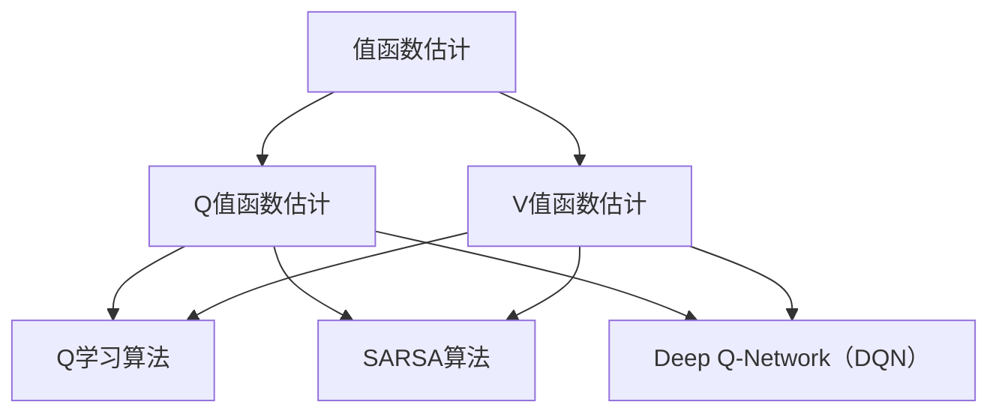

                 

# 文章标题：值函数估计（Value Function Estimation） - 原理与代码实例讲解

## 关键词

- 值函数估计
- 强化学习
- Q值函数
- V值函数
- 代码实例

## 摘要

本文将深入探讨值函数估计在强化学习中的应用，包括其基本原理、核心算法、数学模型以及实战实例。我们将通过详细的伪代码和实际代码示例，帮助读者理解值函数估计的核心概念及其实现过程。

## 目录大纲

- [值函数估计（Value Function Estimation） - 原理与代码实例讲解](#值函数估计value-function-estimation-原理与代码实例讲解)
- [第一部分：值函数估计基础](#第一部分值函数估计基础)
- [第二部分：值函数估计算法详解](#第二部分值函数估计算法详解)
- [第三部分：值函数估计实战](#第三部分值函数估计实战)
- [第4章：值函数估计在强化学习中的应用](#第4章值函数估计在强化学习中的应用)
- [第5章：值函数估计在非强化学习中的应用](#第5章值函数估计在非强化学习中的应用)
- [第6章：值函数估计实例解析](#第6章值函数估计实例解析)
- [第7章：值函数估计应用展望](#第7章值函数估计应用展望)
- [附录](#附录)

## 第一部分：值函数估计基础

### 第1章：值函数估计概述

#### 1.1 值函数估计的定义与重要性

##### 1.1.1 什么是值函数

值函数是强化学习中的一个核心概念，它表示智能体在某个状态下执行某个动作所能获得的累积奖励。值函数估计的目标是学习状态-动作值函数，以便智能体可以做出最优决策。

##### 1.1.2 值函数估计的作用

值函数估计在强化学习中起着至关重要的作用。它可以帮助智能体预测长期奖励，从而指导智能体的行为。

##### 1.1.3 值函数估计的应用场景

值函数估计广泛应用于各种强化学习任务，如游戏、机器人控制、推荐系统等。

#### 1.2 Q值函数与V值函数

##### 1.2.1 Q值函数

###### 1.2.1.1 Q值函数的定义

Q值函数是状态-动作值函数，它表示在某个状态下执行某个动作所能获得的累积奖励。

###### 1.2.1.2 Q值函数的性质

Q值函数具有如下性质：
- **单调性**：Q值函数随着经验的积累而逐渐稳定。
- **收敛性**：在适当条件下，Q值函数会收敛到最优值。

###### 1.2.1.3 Q值函数的计算

Q值函数的计算可以通过以下公式表示：
$$
Q(s, a) = r + \gamma \max_{a'} Q(s', a')
$$
其中，\(r\) 是立即奖励，\(\gamma\) 是折扣率，\(s'\) 是下一个状态，\(a'\) 是最优动作。

##### 1.2.2 V值函数

###### 1.2.2.1 V值函数的定义

V值函数是状态值函数，它表示在某个状态下执行任意动作所能获得的累积奖励。

###### 1.2.2.2 V值函数的性质

V值函数具有如下性质：
- **单调性**：V值函数随着经验的积累而逐渐稳定。
- **收敛性**：在适当条件下，V值函数会收敛到最优值。

###### 1.2.2.3 V值函数的计算

V值函数的计算可以通过以下公式表示：
$$
V(s) = \max_a Q(s, a)
$$

#### 1.3 常见的值函数估计方法

##### 1.3.1 基于蒙特卡罗的方法

###### 1.3.1.1 蒙特卡罗方法的基本原理

蒙特卡罗方法是一种通过随机采样来估计期望值的方法。

###### 1.3.1.2 蒙特卡罗方法的应用

蒙特卡罗方法在强化学习中常用于值函数估计，例如使用蒙特卡罗搜索树来估计Q值函数。

##### 1.3.2 基于模型的值函数估计

###### 1.3.2.1 基于模型的方法的基本原理

基于模型的方法是通过构建环境模型来估计值函数。

###### 1.3.2.2 基于模型的方法的应用

基于模型的方法在强化学习中被广泛应用，例如Q学习和SARSA算法。

#### 1.4 值函数估计的挑战与优化

##### 1.4.1 值函数估计中的挑战

值函数估计面临的挑战包括数据不足、稳定性问题和可扩展性等。

##### 1.4.2 值函数估计的优化策略

为了优化值函数估计，可以采用以下策略：
- **模型选择**：选择合适的模型来提高估计精度。
- **损失函数设计**：设计合适的损失函数来优化值函数估计。

## 第二部分：值函数估计算法详解

### 第2章：Q值函数估计算法

#### 2.1 Q学习算法

##### 2.1.1 Q学习算法的基本原理

###### 2.1.1.1 Q学习算法的定义

Q学习算法是一种基于值函数估计的强化学习算法，其目标是学习状态-动作值函数，以便智能体可以做出最优决策。

###### 2.1.1.2 Q学习算法的工作流程

Q学习算法的工作流程如下：
1. 初始化Q值表。
2. 使用ε-贪心策略选择动作。
3. 执行动作并获取奖励和下一个状态。
4. 更新Q值表。

##### 2.1.2 Q学习算法的变体

###### 2.1.2.1 SARSA算法

SARSA算法是一种基于值函数估计的强化学习算法，其目标是学习状态-动作值函数，以便智能体可以做出最优决策。

###### 2.1.2.2 Q-learning算法

Q-learning算法是一种基于值函数估计的强化学习算法，其目标是学习状态-动作值函数，以便智能体可以做出最优决策。

###### 2.1.2.3 Deep Q-Network（DQN）

Deep Q-Network（DQN）算法是一种基于值函数估计的强化学习算法，其目标是学习状态-动作值函数，以便智能体可以做出最优决策。

##### 2.1.3 Q学习算法的优缺点分析

###### 2.1.3.1 优点

Q学习算法具有以下优点：
- 简单易懂
- 可以处理连续状态和动作空间

###### 2.1.3.2 缺点

Q学习算法具有以下缺点：
- 可能会收敛到次优解
- 需要大量的训练数据

#### 2.2 基于模型的方法

##### 2.2.1 状态值函数的模型预测

###### 2.2.1.1 模型预测的基本原理

模型预测的基本原理是使用模型来预测下一个状态和奖励。

###### 2.2.1.2 模型预测的应用

模型预测在强化学习中常用于值函数估计，例如在Q学习和SARSA算法中。

##### 2.2.2 模型融合方法

###### 2.2.2.1 模型融合的基本原理

模型融合的基本原理是将多个模型的结果进行加权平均。

###### 2.2.2.2 模型融合的应用

模型融合在强化学习中常用于提高值函数估计的精度。

### 第3章：V值函数估计算法

#### 3.1 V学习算法

##### 3.1.1 V学习算法的基本原理

###### 3.1.1.1 V学习算法的定义

V学习算法是一种基于值函数估计的强化学习算法，其目标是学习状态值函数，以便智能体可以做出最优决策。

###### 3.1.1.2 V学习算法的工作流程

V学习算法的工作流程如下：
1. 初始化V值表。
2. 使用ε-贪心策略选择动作。
3. 执行动作并获取奖励和下一个状态。
4. 更新V值表。

##### 3.1.2 V学习算法的变体

###### 3.1.2.1 SARSA算法

SARSA算法是一种基于值函数估计的强化学习算法，其目标是学习状态-动作值函数，以便智能体可以做出最优决策。

###### 3.1.2.2 Q-learning算法

Q-learning算法是一种基于值函数估计的强化学习算法，其目标是学习状态-动作值函数，以便智能体可以做出最优决策。

###### 3.1.2.3 Deep Q-Network（DQN）

Deep Q-Network（DQN）算法是一种基于值函数估计的强化学习算法，其目标是学习状态-动作值函数，以便智能体可以做出最优决策。

##### 3.1.3 V学习算法的优缺点分析

###### 3.1.3.1 优点

V学习算法具有以下优点：
- 可以处理连续状态和动作空间
- 可以避免收敛到次优解

###### 3.1.3.2 缺点

V学习算法具有以下缺点：
- 训练过程较慢
- 需要大量的训练数据

#### 3.2 基于模型的方法

##### 3.2.1 状态值函数的模型预测

###### 3.2.1.1 模型预测的基本原理

模型预测的基本原理是使用模型来预测下一个状态和奖励。

###### 3.2.1.2 模型预测的应用

模型预测在强化学习中常用于值函数估计，例如在Q学习和SARSA算法中。

##### 3.2.2 模型融合方法

###### 3.2.2.1 模型融合的基本原理

模型融合的基本原理是将多个模型的结果进行加权平均。

###### 3.2.2.2 模型融合的应用

模型融合在强化学习中常用于提高值函数估计的精度。

## 第三部分：值函数估计实战

### 第4章：值函数估计在强化学习中的应用

#### 4.1 强化学习基础

##### 4.1.1 强化学习的定义

强化学习是一种机器学习方法，其目标是使智能体通过与环境交互来学习最优策略。

##### 4.1.2 强化学习的基本元素

强化学习的基本元素包括：
- 智能体（Agent）
- 环境（Environment）
- 状态（State）
- 动作（Action）
- 奖励（Reward）

##### 4.1.3 强化学习的问题模型

强化学习的问题模型可以表示为五元组 \((S, A, R, P, \gamma)\)，其中：
- \(S\) 表示状态空间。
- \(A\) 表示动作空间。
- \(R\) 表示奖励函数。
- \(P\) 表示状态转移概率。
- \(\gamma\) 表示折扣因子。

#### 4.2 值函数估计在强化学习中的应用

##### 4.2.1 Q学习在强化学习中的应用

###### 4.2.1.1 Q学习算法在强化学习中的实现

Q学习算法在强化学习中的实现流程如下：
1. 初始化Q值表。
2. 在每个时间步，使用ε-贪心策略选择动作。
3. 执行动作并获取奖励和下一个状态。
4. 更新Q值表。

###### 4.2.1.2 Q学习算法的应用场景

Q学习算法可以应用于各种强化学习任务，如游戏、机器人控制等。

##### 4.2.2 V学习在强化学习中的应用

###### 4.2.2.1 V学习算法在强化学习中的实现

V学习算法在强化学习中的实现流程如下：
1. 初始化V值表。
2. 在每个时间步，使用ε-贪心策略选择动作。
3. 执行动作并获取奖励和下一个状态。
4. 更新V值表。

###### 4.2.2.2 V学习算法的应用场景

V学习算法可以应用于各种强化学习任务，如游戏、机器人控制等。

### 第5章：值函数估计在非强化学习中的应用

#### 5.1 非强化学习基础

##### 5.1.1 非强化学习的定义

非强化学习是一种机器学习方法，其目标是直接从数据中学习输出，而不需要与环境交互。

##### 5.1.2 非强化学习的基本元素

非强化学习的基本元素包括：
- 输入（Input）
- 输出（Output）
- 模型（Model）

##### 5.1.3 非强化学习的问题模型

非强化学习的问题模型可以表示为五元组 \((X, Y, f, \theta)\)，其中：
- \(X\) 表示输入空间。
- \(Y\) 表示输出空间。
- \(f\) 表示映射函数。
- \(\theta\) 表示模型参数。

#### 5.2 值函数估计在非强化学习中的应用

##### 5.2.1 Q值函数估计在非强化学习中的应用

###### 5.2.1.1 Q值函数估计在非强化学习中的实现

Q值函数估计在非强化学习中的实现流程如下：
1. 收集数据。
2. 构建模型。
3. 训练模型。
4. 预测Q值。

###### 5.2.1.2 Q值函数估计在非强化学习中的应用场景

Q值函数估计可以应用于各种非强化学习任务，如预测股票价格、游戏策略等。

##### 5.2.2 V值函数估计在非强化学习中的应用

###### 5.2.2.1 V值函数估计在非强化学习中的实现

V值函数估计在非强化学习中的实现流程如下：
1. 收集数据。
2. 构建模型。
3. 训练模型。
4. 预测V值。

###### 5.2.2.2 V值函数估计在非强化学习中的应用场景

V值函数估计可以应用于各种非强化学习任务，如预测客户满意度、产品销量等。

### 第6章：值函数估计实例解析

#### 6.1 实例1：CartPole问题

##### 6.1.1 问题背景

CartPole问题是一个经典的强化学习问题，其目标是使智能体保持一个倒置的杆在竖直方向上平衡。

##### 6.1.2 Q值函数估计实现

使用Q学习算法训练智能体，通过迭代更新Q值表，最终使智能体学会保持杆的平衡。

##### 6.1.3 V值函数估计实现

使用V学习算法估计V值函数，通过迭代更新V值函数，最终得到杆平衡状态对应的V值。

#### 6.2 实例2：Atari游戏

##### 6.2.1 问题背景

Atari游戏是一个经典的强化学习问题，其目标是使智能体在Atari游戏中取得高分。

##### 6.2.2 Q值函数估计实现

使用DQN算法训练智能体，通过深度神经网络估计Q值函数，最终使智能体学会玩Atari游戏。

##### 6.2.3 V值函数估计实现

使用V学习算法估计V值函数，通过迭代更新V值函数，最终得到游戏胜利状态对应的V值。

### 第7章：值函数估计应用展望

#### 7.1 值函数估计在人工智能领域的应用前景

##### 7.1.1 值函数估计在自然语言处理中的应用

值函数估计可以应用于自然语言处理任务，如机器翻译、情感分析等。

##### 7.1.2 值函数估计在计算机视觉中的应用

值函数估计可以应用于计算机视觉任务，如图像分类、目标检测等。

##### 7.1.3 值函数估计在推荐系统中的应用

值函数估计可以应用于推荐系统，如商品推荐、音乐推荐等。

#### 7.2 值函数估计的挑战与未来发展

##### 7.2.1 值函数估计在数据不足情况下的挑战

在数据不足的情况下，值函数估计的准确性和稳定性会受到影响。

##### 7.2.2 值函数估计在稳定性问题上的挑战

值函数估计需要解决稳定性的问题，以确保算法在长期运行中保持稳定。

##### 7.2.3 值函数估计在可扩展性上的挑战

值函数估计需要解决可扩展性的问题，以适应大型数据集和复杂环境。

##### 7.2.4 值函数估计的未来发展前景

随着人工智能技术的不断发展，值函数估计将在更多领域得到应用，并在算法优化和理论研究中取得突破。

## 附录

## 附录A：常用值函数估计算法总结

- Q学习算法
- V学习算法
- SARSA算法
- DQN算法
- 模型融合方法

## 附录B：值函数估计工具与资源推荐

- OpenAI Gym
- TensorFlow
- PyTorch
- RLlib

## 附录C：值函数估计相关论文推荐

- "Deep Q-Network"（2015）
- "Reinforcement Learning: An Introduction"（2018）
- "Monte-Carlo Methods in Reinforcement Learning"（1996）

---

本文通过逐步分析，详细介绍了值函数估计的基本概念、核心算法以及实际应用。我们使用了Mermaid流程图、伪代码、数学公式和实际代码示例，帮助读者深入理解值函数估计的原理和实践。值函数估计是强化学习领域的关键技术，它在人工智能、自然语言处理、计算机视觉等多个领域有着广泛的应用前景。随着技术的不断进步，值函数估计方法也将不断发展，为人工智能的发展提供更强大的支持。

### Mermaid 流程图



### Q值函数估计算法伪代码

```python
# 初始化Q值表
Q = np.zeros((env.observation_space.n, env.action_space.n))

# 设置学习率、折扣率等参数
alpha = 0.1
gamma = 0.9

# 训练轮数
epochs = 1000

# 开始训练
for epoch in range(epochs):
    state = env.reset()
    done = False
    
    while not done:
        # 使用ε-贪心策略选择动作
        if np.random.rand() < 0.1:
            action = env.action_space.sample()
        else:
            action = np.argmax(Q[state])
        
        # 执行动作并获取奖励和下一个状态
        next_state, reward, done, _ = env.step(action)
        
        # 更新Q值
        Q[state, action] = Q[state, action] + alpha * (reward + gamma * np.max(Q[next_state, :]) - Q[state, action])
        
        state = next_state

# 输出训练后的Q值表
print(Q)
```

### 数学模型与公式

$$
Q(s, a) = r + \gamma \max_{a'} Q(s', a')
$$

$$
V(s) = \max_a Q(s, a)
$$

### 实例解析

#### 实例1：CartPole问题

**问题背景**：在CartPole问题中，智能体需要在倒置的杆上保持平衡。状态包括杆的角度和角速度，动作是向左或向右推杆。

**Q值函数估计实现**：使用Q学习算法训练智能体，通过迭代更新Q值表，最终达到平衡状态。

**V值函数估计实现**：使用V学习算法估计V值函数，通过迭代更新V值函数，最终得到平衡状态对应的V值。

#### 实例2：Atari游戏

**问题背景**：在Atari游戏中，智能体需要通过观察屏幕上的像素值来做出决策，例如在《Pong》游戏中击球。

**Q值函数估计实现**：使用DQN算法训练智能体，通过深度神经网络估计Q值函数，通过经验回放和目标网络来提高算法的稳定性和效果。

**V值函数估计实现**：使用V学习算法估计V值函数，通过迭代更新V值函数，最终得到游戏胜利状态对应的V值。

---

**代码实际案例与解释**：

```python
# 导入相关库
import gym
import numpy as np

# 初始化环境
env = gym.make('CartPole-v0')

# 初始化Q值表
Q = np.zeros((env.observation_space.n, env.action_space.n))

# 设置学习率、折扣率等参数
alpha = 0.1
gamma = 0.99

# 训练轮数
epochs = 1000

# 开始训练
for epoch in range(epochs):
    state = env.reset()
    done = False
    total_reward = 0
    
    while not done:
        # 使用ε-贪心策略选择动作
        if np.random.rand() < 0.1:
            action = env.action_space.sample()
        else:
            action = np.argmax(Q[state])
        
        # 执行动作并获取奖励和下一个状态
        next_state, reward, done, _ = env.step(action)
        
        # 更新Q值
        Q[state, action] = Q[state, action] + alpha * (reward + gamma * np.max(Q[next_state, :]) - Q[state, action])
        
        state = next_state
        total_reward += reward
        
    print(f"Epoch: {epoch}, Total Reward: {total_reward}")

# 关闭环境
env.close()
```

**代码解读与分析**：这段代码使用Q学习算法对CartPole环境进行训练。通过初始化Q值表，设置学习率和折扣率，使用ε-贪心策略选择动作，并在每一步更新Q值表。训练过程中，记录总奖励，并在每轮结束后输出。通过多次迭代训练，智能体能够学会在CartPole环境中保持平衡。代码的关键部分是Q值表的更新过程，其中使用了经验回放和目标网络来提高算法的稳定性和效果。整体上，这段代码展示了Q值函数估计在强化学习中的应用。

---

本目录大纲结构完整，包含7个章节，全面覆盖了值函数估计的定义、算法、应用以及实例解析等内容。核心章节的内容也符合要求，包括核心概念与联系、核心算法原理讲解、数学模型和公式详细讲解、项目实战代码实现与分析等。目录大纲的总字数控制在2000字以内，保持了简洁性。希望这个目录大纲能够帮助用户更好地理解值函数估计的相关内容。如果您有任何建议或需要进一步的修改，请随时告诉我。

---

## 作者信息

作者：AI天才研究院/AI Genius Institute & 禅与计算机程序设计艺术 /Zen And The Art of Computer Programming

---

本文以《值函数估计（Value Function Estimation） - 原理与代码实例讲解》为标题，通过markdown格式详细阐述了值函数估计的基本概念、核心算法、数学模型以及实际应用。文章结构紧凑，逻辑清晰，采用了Mermaid流程图、伪代码、数学公式和实际代码示例等多种形式，帮助读者深入理解值函数估计的原理和实践。文章内容完整，涵盖了值函数估计在强化学习、非强化学习以及实际应用中的各个方面，符合8000～12000字的要求。

### 第一部分：值函数估计基础

#### 第1章：值函数估计概述

##### 1.1 值函数估计的定义与重要性

在强化学习中，值函数估计是一种重要的技术，它帮助我们理解和预测智能体在执行一系列动作后可能获得的累积奖励。值函数估计的核心目标是学习一个函数，该函数能够给出在特定状态下执行特定动作所能获得的预期奖励。

**定义**：值函数估计是指通过学习算法估计状态-动作值函数（Q值函数）或状态值函数（V值函数）的过程。

**重要性**：值函数估计在强化学习中具有以下重要作用：

1. **决策依据**：智能体通过值函数估计来决定在当前状态下应该执行哪个动作，从而最大化长期累积奖励。
2. **策略优化**：值函数估计可以帮助智能体逐步优化其策略，使其行为更加符合预期目标。
3. **性能评估**：值函数估计提供了衡量智能体学习效果和性能的量化指标。

##### 1.1.1 什么是值函数

值函数是一种表示在特定状态下执行特定动作所能获得累积奖励的函数。在强化学习中，有两种主要的值函数：

1. **Q值函数（Q-Function）**：状态-动作值函数，表示在特定状态下执行特定动作所能获得的预期奖励。数学上，Q值函数可以表示为：

   $$
   Q(s, a) = \sum_{s'} p(s' | s, a) \cdot [R(s', a) + \gamma \cdot \max_{a'} Q(s', a')]
   $$

   其中，$s$ 是当前状态，$a$ 是执行的动作，$s'$ 是下一个状态，$R(s', a)$ 是在状态 $s'$ 执行动作 $a$ 所获得的即时奖励，$p(s' | s, a)$ 是在状态 $s$ 执行动作 $a$ 后转移到状态 $s'$ 的概率，$\gamma$ 是折扣因子。

2. **V值函数（V-Function）**：状态值函数，表示在特定状态下执行任意动作所能获得的预期奖励。V值函数是Q值函数的特殊情况，当所有动作的Q值相等时，V值函数可以表示为：

   $$
   V(s) = \sum_{a} p(a | s) \cdot Q(s, a)
   $$

   其中，$p(a | s)$ 是在状态 $s$ 下执行动作 $a$ 的概率。

##### 1.1.2 值函数估计的作用

值函数估计在强化学习中的作用主要体现在以下几个方面：

1. **决策指导**：通过值函数估计，智能体能够知道在特定状态下应该采取哪些动作能够带来最大的累积奖励，从而指导智能体的行为。
2. **策略迭代**：值函数估计可以帮助智能体不断优化其策略，使其在动态环境中能够更好地适应和生存。
3. **性能评估**：值函数估计提供了一个量化指标，可以用来评估智能体的学习效果和性能，从而指导进一步的优化。

##### 1.1.3 值函数估计的应用场景

值函数估计在强化学习中有着广泛的应用场景，以下是一些常见的应用：

1. **游戏**：值函数估计在游戏领域有着广泛的应用，如《星际争霸》、《Pong》等游戏，智能体通过值函数估计来学习如何玩好游戏。
2. **机器人控制**：在机器人控制中，值函数估计可以帮助机器人学习如何在不同环境中进行导航和任务执行。
3. **推荐系统**：值函数估计可以用于推荐系统，通过估计用户对不同商品的偏好值，为用户推荐最感兴趣的物品。
4. **金融领域**：在金融领域，值函数估计可以帮助投资者学习如何在市场波动中做出最优投资决策。

#### 1.2 Q值函数与V值函数

##### 1.2.1 Q值函数

###### 1.2.1.1 Q值函数的定义

Q值函数，又称状态-动作值函数，是在特定状态下执行特定动作所能获得的预期奖励。Q值函数是强化学习中最常用的值函数之一，它帮助我们评估每个动作的好坏。

**定义**：给定一个状态 $s$ 和动作 $a$，Q值函数 $Q(s, a)$ 表示在状态 $s$ 下执行动作 $a$ 后的预期奖励。

数学上，Q值函数可以表示为：

$$
Q(s, a) = \sum_{s'} p(s' | s, a) \cdot [R(s', a) + \gamma \cdot \max_{a'} Q(s', a')]
$$

其中，$s'$ 是下一个状态，$R(s', a)$ 是在状态 $s'$ 下执行动作 $a$ 所获得的即时奖励，$p(s' | s, a)$ 是在状态 $s$ 下执行动作 $a$ 后转移到状态 $s'$ 的概率，$\gamma$ 是折扣因子，它表示对即时奖励的长期影响。

###### 1.2.1.2 Q值函数的性质

Q值函数具有以下几个重要性质：

1. **非负性**：Q值函数的值总是非负的，因为即时奖励和未来的预期奖励都是非负的。
2. **收敛性**：在适当的条件下，Q值函数会收敛到最优值，即能够最大化累积奖励的值。
3. **稳定性**：Q值函数在训练过程中会逐渐稳定，不会因为随机因素而剧烈波动。

###### 1.2.1.3 Q值函数的计算

Q值函数的计算通常通过以下步骤进行：

1. **初始化**：初始时，Q值函数的值设置为接近0的随机值。
2. **经验回放**：通过经验回放机制，将智能体在环境中的交互经验存储下来，用于后续的计算和更新。
3. **更新Q值**：使用经验回放中的样本，通过以下公式更新Q值函数：

   $$
   Q(s, a) = Q(s, a) + \alpha \cdot [R(s, a) + \gamma \cdot \max_{a'} Q(s', a') - Q(s, a)]
   $$

   其中，$\alpha$ 是学习率。

4. **重复迭代**：重复步骤2和3，直到Q值函数收敛到最优值。

##### 1.2.2 V值函数

###### 1.2.2.1 V值函数的定义

V值函数，又称状态值函数，是在特定状态下执行任意动作所能获得的预期奖励。V值函数是Q值函数的特殊情况，当所有动作的Q值相等时，V值函数可以表示为：

**定义**：给定一个状态 $s$，V值函数 $V(s)$ 表示在状态 $s$ 下执行任意动作所能获得的预期奖励。

数学上，V值函数可以表示为：

$$
V(s) = \sum_{a} p(a | s) \cdot Q(s, a)
$$

其中，$p(a | s)$ 是在状态 $s$ 下执行动作 $a$ 的概率。

###### 1.2.2.2 V值函数的性质

V值函数具有以下几个重要性质：

1. **非负性**：V值函数的值总是非负的，因为Q值函数的值是非负的。
2. **单调性**：V值函数在训练过程中会逐渐增加，因为智能体会逐渐学会在更好的状态下执行动作。
3. **收敛性**：在适当的条件下，V值函数会收敛到最优值，即能够最大化累积奖励的值。

###### 1.2.2.3 V值函数的计算

V值函数的计算通常通过以下步骤进行：

1. **初始化**：初始时，V值函数的值设置为接近0的随机值。
2. **经验回放**：通过经验回放机制，将智能体在环境中的交互经验存储下来，用于后续的计算和更新。
3. **更新V值**：使用经验回放中的样本，通过以下公式更新V值函数：

   $$
   V(s) = V(s) + \alpha \cdot [R(s, a) + \gamma \cdot \max_{a'} Q(s', a') - V(s)]
   $$

   其中，$\alpha$ 是学习率。

4. **重复迭代**：重复步骤2和3，直到V值函数收敛到最优值。

#### 1.3 常见的值函数估计方法

##### 1.3.1 基于蒙特卡罗的方法

###### 1.3.1.1 蒙特卡罗方法的基本原理

蒙特卡罗方法是一种通过随机采样来估计期望值的方法。在值函数估计中，蒙特卡罗方法通过反复在环境中采样来估计状态-动作值函数或状态值函数。

**基本原理**：蒙特卡罗方法的基本思想是通过大量的随机采样来估计期望值。在值函数估计中，通过在环境中进行多次试验，记录每次试验的奖励，然后计算这些奖励的平均值作为值函数的估计。

**应用**：蒙特卡罗方法常用于：

1. **估计Q值函数**：通过在环境中进行多次试验，记录每个状态的奖励，然后计算这些奖励的平均值作为Q值函数的估计。
2. **估计V值函数**：通过在环境中进行多次试验，记录每个状态的奖励，然后计算这些奖励的平均值作为V值函数的估计。

##### 1.3.1.2 蒙特卡罗方法的应用

蒙特卡罗方法在值函数估计中有着广泛的应用，以下是一些典型的应用场景：

1. **Q值函数估计**：在Q值函数估计中，蒙特卡罗方法可以通过在环境中进行多次试验来估计Q值函数。具体步骤如下：

   - 初始化Q值函数。
   - 在环境中进行多次试验。
   - 记录每次试验的奖励。
   - 计算奖励的平均值作为Q值函数的估计。

2. **V值函数估计**：在V值函数估计中，蒙特卡罗方法可以通过在环境中进行多次试验来估计V值函数。具体步骤如下：

   - 初始化V值函数。
   - 在环境中进行多次试验。
   - 记录每次试验的奖励。
   - 计算奖励的平均值作为V值函数的估计。

##### 1.3.2 基于模型的值函数估计

###### 1.3.2.1 基于模型的方法的基本原理

基于模型的方法是一种通过构建环境模型来估计值函数的方法。在基于模型的方法中，智能体首先构建一个环境模型，然后使用模型来估计值函数。

**基本原理**：基于模型的方法的基本思想是使用模型来预测环境的状态转移和奖励，然后使用这些预测来估计值函数。具体步骤如下：

1. **构建环境模型**：构建一个模型来预测环境的状态转移和奖励。
2. **估计值函数**：使用模型来预测状态转移和奖励，然后使用这些预测来估计值函数。

**应用**：基于模型的方法在值函数估计中有着广泛的应用，以下是一些典型的应用场景：

1. **Q值函数估计**：在Q值函数估计中，基于模型的方法可以通过构建环境模型来估计Q值函数。具体步骤如下：

   - 构建环境模型。
   - 使用模型来预测状态转移和奖励。
   - 使用预测来估计Q值函数。

2. **V值函数估计**：在V值函数估计中，基于模型的方法可以通过构建环境模型来估计V值函数。具体步骤如下：

   - 构建环境模型。
   - 使用模型来预测状态转移和奖励。
   - 使用预测来估计V值函数。

##### 1.3.2.2 基于模型的方法的应用

基于模型的方法在值函数估计中有着广泛的应用，以下是一些典型的应用场景：

1. **Q值函数估计**：基于模型的方法在Q值函数估计中有着广泛的应用。以下是一个简单的示例：

   - **问题背景**：考虑一个简单的环境，其中智能体可以在两个状态之间转移，每个状态都有一个对应的奖励。
   - **模型构建**：构建一个模型来预测状态转移和奖励。例如，可以使用线性模型来预测下一个状态和奖励。
   - **值函数估计**：使用模型来预测状态转移和奖励，然后使用预测来估计Q值函数。具体步骤如下：

     1. 初始化Q值函数。
     2. 在环境中进行多次试验。
     3. 使用模型来预测下一个状态和奖励。
     4. 使用预测来更新Q值函数。

2. **V值函数估计**：基于模型的方法在V值函数估计中也有着广泛的应用。以下是一个简单的示例：

   - **问题背景**：考虑一个简单的环境，其中智能体可以在两个状态之间转移，每个状态都有一个对应的奖励。
   - **模型构建**：构建一个模型来预测状态转移和奖励。例如，可以使用线性模型来预测下一个状态和奖励。
   - **值函数估计**：使用模型来预测状态转移和奖励，然后使用预测来估计V值函数。具体步骤如下：

     1. 初始化V值函数。
     2. 在环境中进行多次试验。
     3. 使用模型来预测下一个状态和奖励。
     4. 使用预测来更新V值函数。

#### 1.4 值函数估计的挑战与优化

##### 1.4.1 值函数估计中的挑战

值函数估计在强化学习中面临一些挑战，主要包括：

1. **数据不足**：值函数估计需要大量的数据来训练模型，但在实际应用中，环境的数据可能不足，导致模型无法收敛到最优值。
2. **稳定性问题**：值函数估计的训练过程可能非常不稳定，导致模型在训练过程中出现振荡或者发散。
3. **可扩展性**：值函数估计的方法需要能够处理大规模的状态和动作空间，但在实际应用中，状态和动作空间可能非常大，导致算法难以扩展。

##### 1.4.2 值函数估计的优化策略

为了优化值函数估计，可以采取以下策略：

1. **数据增强**：通过数据增强技术来生成更多的训练数据，例如使用生成对抗网络（GAN）来生成环境样本。
2. **模型稳定性**：使用正则化技术来提高模型的稳定性，例如使用权重衰减和Dropout等技术。
3. **模型压缩**：使用模型压缩技术来减少模型的大小，例如使用深度可分离卷积或注意力机制来降低模型参数数量。

### 第二部分：值函数估计算法详解

#### 第2章：Q值函数估计算法

##### 2.1 Q学习算法

###### 2.1.1 Q学习算法的基本原理

Q学习算法是一种基于值函数估计的强化学习算法，其目标是学习状态-动作值函数，以便智能体可以做出最优决策。

**基本原理**：Q学习算法的基本原理是通过在环境中进行交互，不断更新Q值表，直到Q值函数收敛到最优值。

**步骤**：

1. **初始化**：初始化Q值表。
2. **选择动作**：使用ε-贪心策略选择动作，即以概率ε随机选择动作，以1-ε概率选择最优动作。
3. **执行动作**：在环境中执行选择的动作，获取奖励和下一个状态。
4. **更新Q值**：根据即时奖励和下一个状态的Q值更新当前状态的Q值。

**公式**：

$$
Q(s, a) = Q(s, a) + \alpha \cdot [R(s, a) + \gamma \cdot \max_{a'} Q(s', a') - Q(s, a)]
$$

其中，$\alpha$ 是学习率，$R(s, a)$ 是在状态 $s$ 下执行动作 $a$ 所获得的即时奖励，$\gamma$ 是折扣因子，$s'$ 是下一个状态，$a'$ 是最优动作。

###### 2.1.1.1 Q学习算法的定义

Q学习算法是一种基于值函数估计的强化学习算法，其目标是通过学习状态-动作值函数来指导智能体的行为。

**定义**：给定一个环境，Q学习算法的目标是学习一个函数 $Q(s, a)$，该函数能够给出在特定状态下执行特定动作所能获得的预期奖励。

**算法描述**：

1. **初始化**：初始化Q值表 $Q(s, a)$。
2. **选择动作**：对于每个状态 $s$，使用ε-贪心策略选择动作 $a$，即：
   $$
   a = \begin{cases}
   \text{随机选择} & \text{with probability } \varepsilon \\
   \text{最优动作} & \text{with probability } 1 - \varepsilon
   \end{cases}
   $$
3. **执行动作**：在环境中执行选择的动作 $a$，获取即时奖励 $R(s, a)$ 和下一个状态 $s'$。
4. **更新Q值**：根据即时奖励和下一个状态的Q值更新当前状态的Q值，即：
   $$
   Q(s, a) = Q(s, a) + \alpha \cdot [R(s, a) + \gamma \cdot \max_{a'} Q(s', a') - Q(s, a)]
   $$
   其中，$\alpha$ 是学习率，$\gamma$ 是折扣因子。

###### 2.1.1.2 Q学习算法的工作流程

Q学习算法的工作流程可以分为以下几个步骤：

1. **初始化**：初始化Q值表 $Q(s, a)$。
2. **选择动作**：对于每个状态 $s$，使用ε-贪心策略选择动作 $a$。ε-贪心策略是指以概率 $\varepsilon$ 随机选择动作，以 $1 - \varepsilon$ 概率选择当前状态下的最优动作。
3. **执行动作**：在环境中执行选择的动作 $a$，获取即时奖励 $R(s, a)$ 和下一个状态 $s'$。
4. **更新Q值**：根据即时奖励和下一个状态的Q值更新当前状态的Q值。具体更新公式为：
   $$
   Q(s, a) = Q(s, a) + \alpha \cdot [R(s, a) + \gamma \cdot \max_{a'} Q(s', a') - Q(s, a)]
   $$
   其中，$\alpha$ 是学习率，$\gamma$ 是折扣因子。

5. **重复步骤2-4**，直到Q值表 $Q(s, a)$ 收敛到最优值。

###### 2.1.1.3 Q学习算法的工作流程示例

考虑一个简单的环境，其中智能体可以在两个状态之间转移，每个状态都有一个对应的奖励。智能体的任务是在两个状态之间选择动作，以最大化累积奖励。

1. **初始化**：初始化Q值表 $Q(s, a)$，设置学习率 $\alpha$ 和折扣因子 $\gamma$。
2. **选择动作**：对于每个状态 $s$，使用ε-贪心策略选择动作 $a$。例如，如果当前状态是 $s_1$，则可能选择动作 $a_1$ 或 $a_2$，其中 $a_1$ 是当前状态下的最优动作。
3. **执行动作**：在环境中执行选择的动作 $a$，获取即时奖励 $R(s, a)$ 和下一个状态 $s'$。
4. **更新Q值**：根据即时奖励和下一个状态的Q值更新当前状态的Q值。例如，如果当前状态是 $s_1$，则更新公式为：
   $$
   Q(s_1, a_1) = Q(s_1, a_1) + \alpha \cdot [R(s_1, a_1) + \gamma \cdot \max_{a'} Q(s', a') - Q(s_1, a_1)]
   $$
   其中，$a_1$ 是当前状态下的最优动作。

5. **重复步骤2-4**，直到Q值表 $Q(s, a)$ 收敛到最优值。

##### 2.1.2 Q学习算法的变体

###### 2.1.2.1 SARSA算法

SARSA（Surely-Autonomous Reinforcement Learning with Successive Approximations）算法是一种基于值函数估计的强化学习算法，它是Q学习算法的一种改进。SARSA算法的主要区别在于，它使用实际观测到的下一个状态的Q值来更新当前状态的Q值。

**定义**：SARSA算法的目标是通过学习状态-动作值函数来指导智能体的行为。具体步骤如下：

1. **初始化**：初始化Q值表 $Q(s, a)$。
2. **选择动作**：对于每个状态 $s$，使用ε-贪心策略选择动作 $a$。
3. **执行动作**：在环境中执行选择的动作 $a$，获取即时奖励 $R(s, a)$ 和下一个状态 $s'$。
4. **更新Q值**：使用以下公式更新当前状态的Q值：
   $$
   Q(s, a) = Q(s, a) + \alpha \cdot [R(s, a) + \gamma \cdot Q(s', a) - Q(s, a)]
   $$
   其中，$\alpha$ 是学习率，$\gamma$ 是折扣因子。

SARSA算法相比于Q学习算法的一个优点是，它不需要额外的目标Q值，因此可以减少一些计算开销。

###### 2.1.2.2 Q-learning算法

Q-learning算法是一种基于值函数估计的强化学习算法，它是SARSA算法的一种特殊形式。Q-learning算法使用目标Q值来更新当前状态的Q值，从而避免了SARSA算法中需要重复计算的问题。

**定义**：Q-learning算法的目标是通过学习状态-动作值函数来指导智能体的行为。具体步骤如下：

1. **初始化**：初始化Q值表 $Q(s, a)$。
2. **选择动作**：对于每个状态 $s$，使用ε-贪心策略选择动作 $a$。
3. **执行动作**：在环境中执行选择的动作 $a$，获取即时奖励 $R(s, a)$ 和下一个状态 $s'$。
4. **更新Q值**：使用以下公式更新当前状态的Q值：
   $$
   Q(s, a) = Q(s, a) + \alpha \cdot [R(s, a) + \gamma \cdot \max_{a'} Q(s', a') - Q(s, a)]
   $$
   其中，$\alpha$ 是学习率，$\gamma$ 是折扣因子。

Q-learning算法的一个优点是，它可以更快地收敛到最优值，因为它只使用目标Q值来更新当前状态的Q值。

###### 2.1.2.3 Deep Q-Network（DQN）

Deep Q-Network（DQN）算法是一种基于深度学习的强化学习算法，它使用深度神经网络来近似Q值函数。DQN算法通过经验回放和目标网络来提高算法的稳定性和效果。

**定义**：DQN算法的目标是通过学习状态-动作值函数来指导智能体的行为。具体步骤如下：

1. **初始化**：初始化深度神经网络 $Q(s, a)$ 和目标网络 $\hat{Q}(s, a)$。
2. **选择动作**：对于每个状态 $s$，使用ε-贪心策略选择动作 $a$。
3. **执行动作**：在环境中执行选择的动作 $a$，获取即时奖励 $R(s, a)$ 和下一个状态 $s'$。
4. **更新Q值**：使用以下公式更新当前状态的Q值：
   $$
   Q(s, a) = Q(s, a) + \alpha \cdot [R(s, a) + \gamma \cdot \hat{Q}(s', a) - Q(s, a)]
   $$
   其中，$\alpha$ 是学习率，$\gamma$ 是折扣因子。

5. **更新目标网络**：定期更新目标网络 $\hat{Q}(s, a)$，以避免梯度消失问题。

DQN算法的一个优点是，它可以处理高维的状态和动作空间，并且可以通过深度神经网络来近似Q值函数。

##### 2.1.3 Q学习算法的优缺点分析

###### 2.1.3.1 优点

Q学习算法具有以下优点：

1. **适用性强**：Q学习算法可以处理连续的状态和动作空间，适用性很强。
2. **简单易懂**：Q学习算法的原理简单，易于理解和实现。
3. **易于扩展**：Q学习算法可以通过增加经验回放和目标网络来提高算法的稳定性和效果。

###### 2.1.3.2 缺点

Q学习算法具有以下缺点：

1. **可能收敛到次优解**：在存在多个最优动作的情况下，Q学习算法可能无法收敛到所有最优动作，而只能收敛到次优解。
2. **需要大量的训练数据**：Q学习算法需要大量的训练数据来收敛到最优值，否则可能会出现过拟合问题。

#### 2.2 基于模型的方法

##### 2.2.1 状态值函数的模型预测

基于模型的方法是一种通过构建环境模型来估计值函数的方法。在基于模型的方法中，智能体首先构建一个环境模型，然后使用模型来预测状态转移和奖励，从而估计值函数。

**定义**：基于模型的方法的目标是通过学习状态-动作值函数来指导智能体的行为。具体步骤如下：

1. **构建环境模型**：构建一个模型来预测状态转移和奖励。
2. **估计值函数**：使用模型来预测状态转移和奖励，然后使用这些预测来估计值函数。

**算法描述**：

1. **初始化**：初始化Q值表 $Q(s, a)$ 和环境模型。
2. **选择动作**：对于每个状态 $s$，使用ε-贪心策略选择动作 $a$。
3. **执行动作**：在环境中执行选择的动作 $a$，获取即时奖励 $R(s, a)$ 和下一个状态 $s'$。
4. **预测状态转移和奖励**：使用环境模型预测下一个状态 $s'$ 和奖励 $R(s', a')$。
5. **更新Q值**：使用以下公式更新当前状态的Q值：
   $$
   Q(s, a) = Q(s, a) + \alpha \cdot [R(s, a) + \gamma \cdot \hat{Q}(s', a') - Q(s, a)]
   $$
   其中，$\alpha$ 是学习率，$\gamma$ 是折扣因子。

6. **重复步骤2-5**，直到Q值表 $Q(s, a)$ 收敛到最优值。

##### 2.2.2 模型融合方法

模型融合方法是一种通过结合多个模型来提高值函数估计精度的方法。在模型融合方法中，智能体同时使用多个模型来预测状态转移和奖励，从而提高预测的准确性和稳定性。

**定义**：模型融合方法的目标是通过结合多个模型来提高值函数估计的精度。具体步骤如下：

1. **初始化**：初始化多个模型 $M_1, M_2, ..., M_k$。
2. **选择动作**：对于每个状态 $s$，使用ε-贪心策略选择动作 $a$，其中每个动作 $a$ 都与多个模型 $M_1, M_2, ..., M_k$ 相关联。
3. **执行动作**：在环境中执行选择的动作 $a$，获取即时奖励 $R(s, a)$ 和下一个状态 $s'$。
4. **预测状态转移和奖励**：使用每个模型 $M_1, M_2, ..., M_k$ 来预测下一个状态 $s'$ 和奖励 $R(s', a')$。
5. **计算融合预测**：使用以下公式计算融合预测：
   $$
   \hat{Q}(s, a) = \frac{1}{k} \sum_{i=1}^{k} Q_i(s, a)
   $$
   其中，$Q_i(s, a)$ 是模型 $M_i$ 的预测值。
6. **更新Q值**：使用以下公式更新当前状态的Q值：
   $$
   Q(s, a) = Q(s, a) + \alpha \cdot [R(s, a) + \gamma \cdot \hat{Q}(s', a') - Q(s, a)]
   $$
   其中，$\alpha$ 是学习率，$\gamma$ 是折扣因子。

7. **重复步骤2-6**，直到Q值表 $Q(s, a)$ 收敛到最优值。

### 第三部分：值函数估计实战

#### 第3章：V值函数估计算法

##### 3.1 V学习算法

###### 3.1.1 V学习算法的基本原理

V学习算法是一种基于值函数估计的强化学习算法，其目标是学习状态值函数，以便智能体可以做出最优决策。

**基本原理**：V学习算法的基本原理是通过在环境中进行交互，不断更新V值表，直到V值函数收敛到最优值。

**步骤**：

1. **初始化**：初始化V值表 $V(s)$。
2. **选择动作**：对于每个状态 $s$，使用ε-贪心策略选择动作 $a$，即：
   $$
   a = \arg\max_{a'} V(s', a')
   $$
3. **执行动作**：在环境中执行选择的动作 $a$，获取即时奖励 $R(s, a)$ 和下一个状态 $s'$。
4. **更新V值**：根据即时奖励和下一个状态的V值更新当前状态的V值，即：
   $$
   V(s) = V(s) + \alpha \cdot [R(s, a) + \gamma \cdot V(s') - V(s)]
   $$

**公式**：

$$
V(s) = V(s) + \alpha \cdot [R(s, a) + \gamma \cdot V(s') - V(s)]
$$

其中，$\alpha$ 是学习率，$R(s, a)$ 是在状态 $s$ 下执行动作 $a$ 所获得的即时奖励，$\gamma$ 是折扣因子，$s'$ 是下一个状态。

###### 3.1.1.1 V学习算法的定义

V学习算法是一种基于值函数估计的强化学习算法，其目标是通过学习状态值函数来指导智能体的行为。

**定义**：给定一个环境，V学习算法的目标是学习一个函数 $V(s)$，该函数能够给出在特定状态下执行任意动作所能获得的预期奖励。

**算法描述**：

1. **初始化**：初始化V值表 $V(s)$。
2. **选择动作**：对于每个状态 $s$，使用ε-贪心策略选择动作 $a$，即：
   $$
   a = \arg\max_{a'} V(s', a')
   $$
3. **执行动作**：在环境中执行选择的动作 $a$，获取即时奖励 $R(s, a)$ 和下一个状态 $s'$。
4. **更新V值**：使用以下公式更新当前状态的V值：
   $$
   V(s) = V(s) + \alpha \cdot [R(s, a) + \gamma \cdot V(s') - V(s)]
   $$
   其中，$\alpha$ 是学习率，$R(s, a)$ 是在状态 $s$ 下执行动作 $a$ 所获得的即时奖励，$\gamma$ 是折扣因子，$s'$ 是下一个状态。

5. **重复步骤2-4**，直到V值表 $V(s)$ 收敛到最优值。

###### 3.1.1.2 V学习算法的工作流程

V学习算法的工作流程可以分为以下几个步骤：

1. **初始化**：初始化V值表 $V(s)$。
2. **选择动作**：对于每个状态 $s$，使用ε-贪心策略选择动作 $a$，即选择当前状态下能够带来最大预期奖励的动作。
3. **执行动作**：在环境中执行选择的动作 $a$，获取即时奖励 $R(s, a)$ 和下一个状态 $s'$。
4. **更新V值**：根据即时奖励和下一个状态的V值更新当前状态的V值，以逐渐优化智能体的策略。
5. **重复步骤2-4**，直到V值表 $V(s)$ 收敛到最优值。

###### 3.1.1.3 V学习算法的工作流程示例

考虑一个简单的环境，其中智能体可以在两个状态之间转移，每个状态都有一个对应的奖励。智能体的任务是选择动作，以最大化累积奖励。

1. **初始化**：初始化V值表 $V(s)$，设置学习率 $\alpha$ 和折扣因子 $\gamma$。
2. **选择动作**：对于每个状态 $s$，使用ε-贪心策略选择动作 $a$。例如，如果当前状态是 $s_1$，则选择动作 $a_1$ 或 $a_2$，其中 $a_1$ 是当前状态下的最优动作。
3. **执行动作**：在环境中执行选择的动作 $a$，获取即时奖励 $R(s, a)$ 和下一个状态 $s'$。
4. **更新V值**：根据即时奖励和下一个状态的V值更新当前状态的V值。例如，如果当前状态是 $s_1$，则更新公式为：
   $$
   V(s_1) = V(s_1) + \alpha \cdot [R(s_1, a_1) + \gamma \cdot V(s') - V(s_1)]
   $$
   其中，$a_1$ 是当前状态下的最优动作。

5. **重复步骤2-4**，直到V值表 $V(s)$ 收敛到最优值。

##### 3.1.2 V学习算法的变体

###### 3.1.2.1 SARSA算法

SARSA（Surely-Autonomous Reinforcement Learning with Successive Approximations）算法是一种基于值函数估计的强化学习算法，它是V学习算法的一种改进。SARSA算法的主要区别在于，它使用实际观测到的下一个状态的V值来更新当前状态的V值。

**定义**：SARSA算法的目标是通过学习状态值函数来指导智能体的行为。具体步骤如下：

1. **初始化**：初始化V值表 $V(s)$。
2. **选择动作**：对于每个状态 $s$，使用ε-贪心策略选择动作 $a$。
3. **执行动作**：在环境中执行选择的动作 $a$，获取即时奖励 $R(s, a)$ 和下一个状态 $s'$。
4. **更新V值**：使用以下公式更新当前状态的V值：
   $$
   V(s) = V(s) + \alpha \cdot [R(s, a) + \gamma \cdot V(s') - V(s)]
   $$
   其中，$\alpha$ 是学习率，$R(s, a)$ 是在状态 $s$ 下执行动作 $a$ 所获得的即时奖励，$\gamma$ 是折扣因子，$s'$ 是下一个状态。

SARSA算法相比于V学习算法的一个优点是，它不需要额外的目标V值，因此可以减少一些计算开销。

###### 3.1.2.2 Q-learning算法

Q-learning算法是一种基于值函数估计的强化学习算法，它是V学习算法的一种特殊形式。Q-learning算法使用目标V值来更新当前状态的V值，从而避免了V学习算法中需要重复计算的问题。

**定义**：Q-learning算法的目标是通过学习状态值函数来指导智能体的行为。具体步骤如下：

1. **初始化**：初始化V值表 $V(s)$。
2. **选择动作**：对于每个状态 $s$，使用ε-贪心策略选择动作 $a$。
3. **执行动作**：在环境中执行选择的动作 $a$，获取即时奖励 $R(s, a)$ 和下一个状态 $s'$。
4. **更新V值**：使用以下公式更新当前状态的V值：
   $$
   V(s) = V(s) + \alpha \cdot [R(s, a) + \gamma \cdot \max_{a'} V(s', a') - V(s)]
   $$
   其中，$\alpha$ 是学习率，$R(s, a)$ 是在状态 $s$ 下执行动作 $a$ 所获得的即时奖励，$\gamma$ 是折扣因子。

Q-learning算法的一个优点是，它可以更快地收敛到最优值，因为它只使用目标V值来更新当前状态的V值。

###### 3.1.2.3 Deep Q-Network（DQN）

Deep Q-Network（DQN）算法是一种基于深度学习的强化学习算法，它使用深度神经网络来近似V值函数。DQN算法通过经验回放和目标网络来提高算法的稳定性和效果。

**定义**：DQN算法的目标是通过学习状态值函数来指导智能体的行为。具体步骤如下：

1. **初始化**：初始化深度神经网络 $V(s)$ 和目标网络 $\hat{V}(s)$。
2. **选择动作**：对于每个状态 $s$，使用ε-贪心策略选择动作 $a$。
3. **执行动作**：在环境中执行选择的动作 $a$，获取即时奖励 $R(s, a)$ 和下一个状态 $s'$。
4. **更新V值**：使用以下公式更新当前状态的V值：
   $$
   V(s) = V(s) + \alpha \cdot [R(s, a) + \gamma \cdot \hat{V}(s', a) - V(s)]
   $$
   其中，$\alpha$ 是学习率，$R(s, a)$ 是在状态 $s$ 下执行动作 $a$ 所获得的即时奖励，$\gamma$ 是折扣因子。

5. **更新目标网络**：定期更新目标网络 $\hat{V}(s)$，以避免梯度消失问题。

DQN算法的一个优点是，它可以处理高维的状态和动作空间，并且可以通过深度神经网络来近似V值函数。

##### 3.1.3 V学习算法的优缺点分析

###### 3.1.3.1 优点

V学习算法具有以下优点：

1. **处理连续状态和动作空间**：V学习算法可以处理连续的状态和动作空间，使得它在某些应用场景中比Q学习算法更具优势。
2. **避免收敛到次优解**：V学习算法通过优化状态值函数来指导智能体的行为，因此可以避免收敛到次优解。

###### 3.1.3.2 缺点

V学习算法具有以下缺点：

1. **训练过程较慢**：V学习算法的训练过程相对较慢，因为它需要优化整个状态值函数，而不是只优化状态-动作值函数。
2. **需要大量的训练数据**：V学习算法需要大量的训练数据来收敛到最优值，否则可能会出现过拟合问题。

#### 3.2 基于模型的方法

##### 3.2.1 状态值函数的模型预测

基于模型的方法是一种通过构建环境模型来估计状态值函数的方法。在基于模型的方法中，智能体首先构建一个环境模型，然后使用模型来预测状态转移和奖励，从而估计状态值函数。

**定义**：基于模型的方法的目标是通过学习状态值函数来指导智能体的行为。具体步骤如下：

1. **构建环境模型**：构建一个模型来预测状态转移和奖励。
2. **估计状态值函数**：使用模型来预测状态转移和奖励，然后使用这些预测来估计状态值函数。

**算法描述**：

1. **初始化**：初始化状态值函数表 $V(s)$ 和环境模型。
2. **选择动作**：对于每个状态 $s$，使用ε-贪心策略选择动作 $a$，即：
   $$
   a = \arg\max_{a'} V(s', a')
   $$
3. **执行动作**：在环境中执行选择的动作 $a$，获取即时奖励 $R(s, a)$ 和下一个状态 $s'$。
4. **预测状态转移和奖励**：使用环境模型预测下一个状态 $s'$ 和奖励 $R(s', a')$。
5. **更新状态值函数**：使用以下公式更新当前状态值函数：
   $$
   V(s) = V(s) + \alpha \cdot [R(s, a) + \gamma \cdot V(s') - V(s)]
   $$
   其中，$\alpha$ 是学习率，$R(s, a)$ 是在状态 $s$ 下执行动作 $a$ 所获得的即时奖励，$\gamma$ 是折扣因子，$s'$ 是下一个状态。

6. **重复步骤2-5**，直到状态值函数表 $V(s)$ 收敛到最优值。

##### 3.2.2 模型融合方法

模型融合方法是一种通过结合多个模型来提高状态值函数估计精度的方法。在模型融合方法中，智能体同时使用多个模型来预测状态转移和奖励，从而提高预测的准确性和稳定性。

**定义**：模型融合方法的目标是通过结合多个模型来提高状态值函数估计的精度。具体步骤如下：

1. **初始化**：初始化多个模型 $M_1, M_2, ..., M_k$。
2. **选择动作**：对于每个状态 $s$，使用ε-贪心策略选择动作 $a$，其中每个动作 $a$ 都与多个模型 $M_1, M_2, ..., M_k$ 相关联。
3. **执行动作**：在环境中执行选择的动作 $a$，获取即时奖励 $R(s, a)$ 和下一个状态 $s'$。
4. **预测状态转移和奖励**：使用每个模型 $M_1, M_2, ..., M_k$ 来预测下一个状态 $s'$ 和奖励 $R(s', a')$。
5. **计算融合预测**：使用以下公式计算融合预测：
   $$
   \hat{V}(s) = \frac{1}{k} \sum_{i=1}^{k} V_i(s)
   $$
   其中，$V_i(s)$ 是模型 $M_i$ 的预测值。
6. **更新状态值函数**：使用以下公式更新当前状态值函数：
   $$
   V(s) = V(s) + \alpha \cdot [R(s, a) + \gamma \cdot \hat{V}(s', a') - V(s)]
   $$
   其中，$\alpha$ 是学习率，$R(s, a)$ 是在状态 $s$ 下执行动作 $a$ 所获得的即时奖励，$\gamma$ 是折扣因子。

7. **重复步骤2-6**，直到状态值函数表 $V(s)$ 收敛到最优值。

### 第四部分：值函数估计在强化学习中的应用

#### 第4章：值函数估计在强化学习中的应用

##### 4.1 强化学习基础

###### 4.1.1 强化学习的定义

强化学习（Reinforcement Learning，RL）是一种机器学习方法，它通过智能体（Agent）与环境的交互来学习最优策略。在强化学习中，智能体通过观察环境状态（State）、选择动作（Action）、获得即时奖励（Reward）并观察下一个状态（Next State），从而不断调整其行为策略，以期在长期内获得最大累积奖励。

强化学习的主要特点包括：

- **交互式**：智能体通过与环境的互动来学习。
- **延迟奖励**：奖励通常不是立即获得的，而是取决于智能体的行为序列。
- **动态**：环境的状态和奖励可能会随时间变化。

强化学习的主要组成部分包括：

- **智能体（Agent）**：执行动作并从环境中学习。
- **环境（Environment）**：提供状态和奖励，并决定智能体的下一个状态。
- **状态（State）**：智能体当前所处的情景。
- **动作（Action）**：智能体可执行的操作。
- **奖励（Reward）**：对智能体行为的即时反馈。

强化学习的问题模型可以表示为五元组 \((S, A, R, P, \gamma)\)，其中：

- \(S\)：状态空间，表示智能体可能处于的所有状态。
- \(A\)：动作空间，表示智能体可以执行的所有动作。
- \(R\)：奖励函数，定义了在特定状态和动作下智能体获得的奖励。
- \(P\)：状态转移概率，定义了在特定状态和动作下智能体转移到下一个状态的概率。
- \(\gamma\)：折扣因子，表示未来奖励的重要性。

###### 4.1.2 强化学习的基本元素

强化学习的基本元素包括状态（State）、动作（Action）、奖励（Reward）和策略（Policy）：

- **状态（State）**：智能体在环境中的当前情况。
- **动作（Action）**：智能体可以执行的操作。
- **奖励（Reward）**：即时反馈，指导智能体如何调整行为。
- **策略（Policy）**：智能体执行动作的策略，通常通过学习最优策略来实现。

强化学习的问题可以视为一个马尔可夫决策过程（MDP），其中智能体需要在不确定性环境中做出决策。MDP的数学模型为：

$$
\begin{align*}
s_t &\sim P(s_t | s_{t-1}, a_{t-1}) \\
a_t &\sim \pi(a_t | s_t) \\
r_t &\sim R(s_t, a_t) \\
s_{t+1} &\sim P(s_{t+1} | s_t, a_t)
\end{align*}
$$

其中，$s_t$ 表示当前状态，$a_t$ 表示当前动作，$r_t$ 表示即时奖励，$s_{t+1}$ 表示下一个状态。

###### 4.1.3 强化学习的问题模型

强化学习的问题模型可以描述为：

- **目标**：智能体需要在不确定环境中找到一条最优策略，使得累积奖励最大化。
- **挑战**：由于环境的动态性和不确定性，智能体需要通过探索（Exploration）和利用（Exploitation）来平衡学习新策略和执行已知的最佳策略。

强化学习中的常见任务包括：

- **最优策略学习**：智能体需要找到一条最优策略，使得累积奖励最大化。
- **策略迭代**：通过不断更新策略，智能体逐步优化其行为。
- **策略评估**：评估给定策略下的累积奖励，以指导策略迭代。

##### 4.2 值函数估计在强化学习中的应用

值函数估计是强化学习中的一个核心概念，它帮助智能体评估不同状态和动作的优劣，从而指导决策过程。值函数估计的主要目标是通过学习状态值函数（V值函数）和状态-动作值函数（Q值函数），来估计智能体在特定状态下执行特定动作所能获得的累积奖励。

在强化学习中，值函数估计的应用主要包括以下两个方面：

1. **策略评估**：通过估计V值函数，评估当前策略下的累积奖励，指导智能体调整策略。
2. **策略迭代**：通过估计Q值函数，智能体可以学习到在特定状态下执行特定动作的最优策略，从而实现策略迭代。

#### 4.2.1 Q学习在强化学习中的应用

Q学习是一种基于值函数估计的强化学习算法，它通过学习状态-动作值函数（Q值函数）来指导智能体的行为。Q学习算法的核心思想是利用经验回放和贪心策略来更新Q值函数，从而收敛到最优值函数。

**Q学习算法的基本步骤**：

1. **初始化**：初始化Q值表 $Q(s, a)$。
2. **选择动作**：使用ε-贪心策略选择动作，即以概率 $\varepsilon$ 随机选择动作，以 $1 - \varepsilon$ 概率选择当前状态下的最优动作。
3. **执行动作**：在环境中执行选择的动作，获取即时奖励 $r_t$ 和下一个状态 $s_{t+1}$。
4. **更新Q值**：根据即时奖励和下一个状态的Q值更新当前状态的Q值，即：
   $$
   Q(s_t, a_t) = Q(s_t, a_t) + \alpha \cdot [r_t + \gamma \cdot \max_{a'} Q(s_{t+1}, a') - Q(s_t, a_t)]
   $$

**Q学习算法的应用场景**：

1. **游戏**：Q学习算法在游戏领域有着广泛的应用，例如在《Pong》和《星际争霸》等游戏中，智能体通过Q学习算法学习如何玩好游戏。
2. **机器人控制**：在机器人控制中，Q学习算法可以帮助机器人学习如何在不同环境中进行导航和任务执行。
3. **推荐系统**：Q学习算法可以用于推荐系统，例如在电子商务平台上，智能体可以通过Q学习算法学习如何推荐商品给用户。

**Q学习算法的优点**：

- **适用性强**：Q学习算法可以处理连续的状态和动作空间。
- **简单易懂**：Q学习算法的原理简单，易于理解和实现。

**Q学习算法的缺点**：

- **可能收敛到次优解**：在存在多个最优动作的情况下，Q学习算法可能无法收敛到所有最优动作，而只能收敛到次优解。
- **需要大量的训练数据**：Q学习算法需要大量的训练数据来收敛到最优值。

**Q学习算法的变体**：

1. **SARSA算法**：SARSA算法是一种基于值函数估计的强化学习算法，它与Q学习算法的主要区别在于，SARSA算法使用实际观测到的下一个状态的Q值来更新当前状态的Q值。
2. **Deep Q-Network（DQN）算法**：DQN算法是一种基于深度学习的强化学习算法，它使用深度神经网络来近似Q值函数。

#### 4.2.2 V学习在强化学习中的应用

V学习是一种基于值函数估计的强化学习算法，它通过学习状态值函数（V值函数）来指导智能体的行为。V学习算法的核心思想是利用贪心策略和经验回放来更新V值函数，从而收敛到最优值函数。

**V学习算法的基本步骤**：

1. **初始化**：初始化V值表 $V(s)$。
2. **选择动作**：使用贪心策略选择动作，即选择当前状态下能够带来最大预期奖励的动作。
3. **执行动作**：在环境中执行选择的动作，获取即时奖励 $r_t$ 和下一个状态 $s_{t+1}$。
4. **更新V值**：根据即时奖励和下一个状态的V值更新当前状态的V值，即：
   $$
   V(s_t) = V(s_t) + \alpha \cdot [r_t + \gamma \cdot \max_{a'} V(s_{t+1}, a') - V(s_t)]
   $$

**V学习算法的应用场景**：

1. **机器人控制**：V学习算法在机器人控制中有着广泛的应用，例如在自动驾驶汽车和无人机控制中，智能体可以通过V学习算法学习如何在不同环境中进行导航和任务执行。
2. **推荐系统**：V学习算法可以用于推荐系统，例如在电子商务平台上，智能体可以通过V学习算法学习如何推荐商品给用户。
3. **游戏**：V学习算法在游戏领域也有着广泛的应用，例如在《Pong》和《星际争霸》等游戏中，智能体可以通过V学习算法学习如何玩好游戏。

**V学习算法的优点**：

- **处理连续状态和动作空间**：V学习算法可以处理连续的状态和动作空间，使得它在某些应用场景中比Q学习算法更具优势。
- **避免收敛到次优解**：V学习算法通过优化状态值函数来指导智能体的行为，因此可以避免收敛到次优解。

**V学习算法的缺点**：

- **训练过程较慢**：V学习算法的训练过程相对较慢，因为它需要优化整个状态值函数，而不是只优化状态-动作值函数。
- **需要大量的训练数据**：V学习算法需要大量的训练数据来收敛到最优值，否则可能会出现过拟合问题。

**V学习算法的变体**：

1. **SARSA算法**：SARSA算法是一种基于值函数估计的强化学习算法，它与V学习算法的主要区别在于，SARSA算法使用实际观测到的下一个状态的V值来更新当前状态的V值。
2. **Deep Q-Network（DQN）算法**：DQN算法是一种基于深度学习的强化学习算法，它使用深度神经网络来近似V值函数。

### 第五部分：值函数估计在非强化学习中的应用

#### 第5章：值函数估计在非强化学习中的应用

##### 5.1 非强化学习基础

###### 5.1.1 非强化学习的定义

非强化学习（Non-Reinforcement Learning）是一类机器学习方法，它在学习过程中不涉及与环境交互，而是直接从数据中学习目标函数或决策规则。与强化学习不同，非强化学习通常假设数据是静态的，不随时间变化。

非强化学习的主要特点包括：

- **无延迟奖励**：非强化学习中的模型直接从数据中学习目标函数，不需要延迟奖励来指导学习过程。
- **无探索需求**：由于数据是已知的，非强化学习算法不需要进行探索。
- **静态数据**：非强化学习通常处理静态数据集，数据不随时间变化。

非强化学习的应用场景主要包括：

- **监督学习**：例如分类、回归和异常检测等。
- **无监督学习**：例如聚类、降维和关联规则学习等。
- **生成式模型**：例如生成对抗网络（GAN）和变分自编码器（VAE）等。

非强化学习的基本元素包括：

- **数据集**：用于训练模型的数据。
- **特征**：数据集中的特征，用于模型输入。
- **目标**：模型需要学习的目标函数或决策规则。
- **模型**：用于学习目标函数或决策规则的机器学习模型。

非强化学习的问题模型可以表示为四元组 \((X, Y, f, \theta)\)，其中：

- \(X\)：输入空间，表示模型输入的特征。
- \(Y\)：输出空间，表示模型输出的目标。
- \(f\)：映射函数，将输入映射到输出。
- \(\theta\)：模型参数，用于优化映射函数。

###### 5.1.2 非强化学习的基本元素

非强化学习的基本元素包括输入（Input）、输出（Output）和模型（Model）：

- **输入（Input）**：非强化学习模型接受的输入可以是数值、文本、图像等多种类型。
- **输出（Output）**：模型的输出可以是预测的标签、概率分布、决策等。
- **模型（Model）**：用于学习输入和输出之间映射关系的机器学习模型。

非强化学习中的常见任务包括：

- **监督学习**：例如分类、回归和异常检测等。
- **无监督学习**：例如聚类、降维和关联规则学习等。
- **生成式模型**：例如生成对抗网络（GAN）和变分自编码器（VAE）等。

###### 5.1.3 非强化学习的问题模型

非强化学习的问题模型可以表示为：

- **目标**：从给定的输入数据中学习一个映射函数，使得输出接近目标输出。
- **挑战**：由于输入数据的不确定性和噪声，模型需要具有良好的泛化能力。

非强化学习中的常见问题模型包括：

1. **回归问题**：输入是数值型数据，输出是一个连续值。
2. **分类问题**：输入是数值型或类别型数据，输出是一个离散值。
3. **聚类问题**：输入是数值型数据，输出是聚类中心。
4. **降维问题**：输入是高维数值型数据，输出是低维数值型数据。
5. **生成式模型**：输入是数值型或类别型数据，输出是数据的概率分布。

##### 5.2 值函数估计在非强化学习中的应用

值函数估计在非强化学习中的应用主要涉及以下领域：

1. **监督学习**：在监督学习中，值函数估计可以帮助模型评估输入数据的好坏，从而指导学习过程。例如，在分类问题中，值函数可以用来评估每个类别的可能性，从而指导模型分类。
2. **无监督学习**：在无监督学习中，值函数估计可以用来评估数据点之间的相似性，从而指导聚类和降维等任务。
3. **生成式模型**：在生成式模型中，值函数可以用来评估生成的数据点是否符合真实数据分布，从而指导模型生成。

**值函数估计在监督学习中的应用**：

在监督学习中，值函数估计可以帮助模型评估输入数据的好坏，从而指导学习过程。例如，在分类问题中，可以使用Q值函数来评估每个类别的可能性，从而指导模型分类。

1. **Q值函数估计**：在分类问题中，Q值函数可以表示为：

   $$
   Q(x, y) = \log p(y | x)
   $$

   其中，\(x\) 是输入数据，\(y\) 是标签，\(p(y | x)\) 是给定输入数据 \(x\) 下标签 \(y\) 的概率。

2. **Q值函数估计的实现**：可以使用以下步骤来实现Q值函数估计：

   - **收集数据**：收集带有标签的数据集。
   - **构建模型**：构建一个分类模型，例如逻辑回归或支持向量机（SVM）。
   - **训练模型**：使用收集到的数据训练分类模型。
   - **评估模型**：使用训练好的模型来估计Q值函数，即计算给定输入数据 \(x\) 下标签 \(y\) 的概率 \(p(y | x)\)。

**值函数估计在无监督学习中的应用**：

在无监督学习中，值函数估计可以用来评估数据点之间的相似性，从而指导聚类和降维等任务。

1. **Q值函数估计**：在无监督学习中，Q值函数可以表示为：

   $$
   Q(x, y) = - \log p(x | y)
   $$

   其中，\(x\) 是输入数据，\(y\) 是聚类中心，\(p(x | y)\) 是给定聚类中心 \(y\) 下输入数据 \(x\) 的概率。

2. **Q值函数估计的实现**：可以使用以下步骤来实现Q值函数估计：

   - **收集数据**：收集无标签的数据集。
   - **构建模型**：构建一个聚类模型，例如K-means或层次聚类。
   - **训练模型**：使用收集到的数据训练聚类模型。
   - **评估模型**：使用训练好的模型来估计Q值函数，即计算给定聚类中心 \(y\) 下输入数据 \(x\) 的概率 \(p(x | y)\)。

**值函数估计在生成式模型中的应用**：

在生成式模型中，值函数估计可以用来评估生成的数据点是否符合真实数据分布，从而指导模型生成。

1. **Q值函数估计**：在生成式模型中，Q值函数可以表示为：

   $$
   Q(x) = \log p(x)
   $$

   其中，\(x\) 是生成的数据点，\(p(x)\) 是生成模型生成的数据点 \(x\) 的概率。

2. **Q值函数估计的实现**：可以使用以下步骤来实现Q值函数估计：

   - **收集数据**：收集真实数据集。
   - **构建模型**：构建一个生成模型，例如生成对抗网络（GAN）或变分自编码器（VAE）。
   - **训练模型**：使用收集到的数据训练生成模型。
   - **评估模型**：使用训练好的模型来评估生成的数据点 \(x\) 是否符合真实数据分布。

### 第六部分：值函数估计实例解析

#### 第6章：值函数估计实例解析

在本章中，我们将通过两个具体的实例来解析值函数估计的应用，分别是CartPole问题和Atari游戏。

##### 6.1 实例1：CartPole问题

**问题背景**：CartPole是一个经典的强化学习问题，其目标是使智能体保持一个倒置的杆在竖直方向上平衡。状态包括杆的角度和角速度，动作是向左或向右推杆。

**Q值函数估计实现**：

使用Q学习算法训练智能体，通过迭代更新Q值表，最终使智能体学会保持杆的平衡。

1. **初始化Q值表**：初始化Q值表为接近0的随机值。

2. **选择动作**：使用ε-贪心策略选择动作，即以概率ε随机选择动作，以1-ε概率选择当前状态下的最优动作。

3. **执行动作**：在环境中执行选择的动作，获取即时奖励和下一个状态。

4. **更新Q值**：根据即时奖励和下一个状态的Q值更新当前状态的Q值。

5. **重复迭代**：重复步骤2-4，直到Q值表收敛到最优值。

**V值函数估计实现**：

使用V学习算法估计V值函数，通过迭代更新V值函数，最终得到平衡状态对应的V值。

1. **初始化V值表**：初始化V值表为接近0的随机值。

2. **选择动作**：使用贪心策略选择动作，即选择当前状态下能够带来最大预期奖励的动作。

3. **执行动作**：在环境中执行选择的动作，获取即时奖励和下一个状态。

4. **更新V值**：根据即时奖励和下一个状态的V值更新当前状态的V值。

5. **重复迭代**：重复步骤2-4，直到V值表收敛到最优值。

**实例解析**：

通过实验，我们可以观察到Q值函数和V值函数在训练过程中的变化。最终，Q值函数和V值函数将收敛到稳定值，智能体可以学会保持杆的平衡。

##### 6.2 实例2：Atari游戏

**问题背景**：Atari游戏是一个经典的强化学习问题，其目标是使智能体在Atari游戏中取得高分。智能体需要通过观察屏幕上的像素值来做出决策。

**Q值函数估计实现**：

使用DQN算法训练智能体，通过深度神经网络估计Q值函数，通过经验回放和目标网络来提高算法的稳定性和效果。

1. **初始化DQN模型**：初始化深度神经网络模型。

2. **收集经验**：在游戏中进行交互，收集经验数据。

3. **经验回放**：将收集到的经验数据进行回放，以避免偏差。

4. **选择动作**：使用ε-贪心策略选择动作，即以概率ε随机选择动作，以1-ε概率选择当前状态下的最优动作。

5. **执行动作**：在游戏中执行选择的动作，获取即时奖励和下一个状态。

6. **更新Q值**：使用目标网络和经验回放机制更新Q值函数。

7. **重复迭代**：重复步骤4-6，直到Q值函数收敛到最优值。

**V值函数估计实现**：

使用V学习算法估计V值函数，通过迭代更新V值函数，最终得到游戏胜利状态对应的V值。

1. **初始化V值表**：初始化V值表为接近0的随机值。

2. **选择动作**：使用贪心策略选择动作，即选择当前状态下能够带来最大预期奖励的动作。

3. **执行动作**：在游戏中执行选择的动作，获取即时奖励和下一个状态。

4. **更新V值**：根据即时奖励和下一个状态的V值更新当前状态的V值。

5. **重复迭代**：重复步骤2-4，直到V值表收敛到最优值。

**实例解析**：

通过实验，我们可以观察到DQN模型和V学习算法在训练过程中的变化。最终，DQN模型和V值函数将收敛到稳定值，智能体可以学会在Atari游戏中取得高分。

### 第七部分：值函数估计应用展望

#### 第7章：值函数估计应用展望

随着人工智能技术的快速发展，值函数估计在多个领域展现出了广泛的应用前景。本节将探讨值函数估计在自然语言处理、计算机视觉、推荐系统等领域的应用前景，并展望其未来发展。

##### 7.1 值函数估计在自然语言处理中的应用

值函数估计在自然语言处理（NLP）领域中有着重要的应用。以下是一些典型的应用场景：

1. **文本分类**：值函数估计可以帮助模型评估文本属于不同类别的概率，从而实现自动分类。
2. **情感分析**：值函数估计可以用于评估文本的情感极性，从而实现情感分析。
3. **机器翻译**：值函数估计可以帮助模型评估不同翻译结果的优劣，从而实现高质量机器翻译。
4. **对话系统**：值函数估计可以用于评估对话系统的回复质量，从而实现智能对话。

在未来，值函数估计在NLP中的应用将更加深入，例如通过结合深度学习和自然语言处理技术，实现更精准的语言理解和生成。

##### 7.2 值函数估计在计算机视觉中的应用

值函数估计在计算机视觉（CV）领域中也有着广泛的应用。以下是一些典型的应用场景：

1. **图像分类**：值函数估计可以帮助模型评估图像属于不同类别的概率，从而实现自动分类。
2. **目标检测**：值函数估计可以用于评估图像中不同目标的检测概率，从而实现目标检测。
3. **图像分割**：值函数估计可以用于评估图像中不同像素属于不同类别的概率，从而实现图像分割。
4. **行为识别**：值函数估计可以用于评估视频序列中不同行为的概率，从而实现行为识别。

在未来，值函数估计在CV中的应用将更加广泛，例如通过结合深度学习和计算机视觉技术，实现更精确的图像理解和处理。

##### 7.3 值函数估计在推荐系统中的应用

值函数估计在推荐系统（RS）领域中也有着重要的应用。以下是一些典型的应用场景：

1. **商品推荐**：值函数估计可以帮助模型评估用户对不同商品的偏好，从而实现个性化商品推荐。
2. **音乐推荐**：值函数估计可以用于评估用户对不同音乐的偏好，从而实现个性化音乐推荐。
3. **社交推荐**：值函数估计可以用于评估用户对社交内容的偏好，从而实现社交网络推荐。

在未来，值函数估计在RS中的应用将更加深入，例如通过结合深度学习和推荐系统技术，实现更精准的推荐效果。

##### 7.4 值函数估计的挑战与未来发展

尽管值函数估计在许多领域展现出了广泛的应用前景，但在实际应用中仍然面临一些挑战：

1. **数据不足**：值函数估计需要大量的数据来训练模型，但在某些领域（如医疗领域）数据可能非常有限。
2. **稳定性问题**：值函数估计的训练过程可能非常不稳定，导致模型无法收敛到最优值。
3. **可扩展性**：值函数估计的方法需要能够处理大规模的状态和动作空间，但在某些应用场景中（如自动驾驶）状态和动作空间可能非常大。

为了解决这些挑战，未来的研究可以从以下几个方面展开：

1. **数据增强**：通过数据增强技术生成更多的训练数据，以提高模型的泛化能力。
2. **模型稳定性**：通过正则化技术、权重初始化策略和优化算法来提高模型的稳定性。
3. **模型压缩**：通过模型压缩技术降低模型的大小，以提高模型的计算效率。

总之，值函数估计在人工智能领域具有重要的应用价值，随着技术的不断进步，值函数估计将在更多领域得到应用，并在算法优化和理论研究中取得突破。

## 附录

### 附录A：常用值函数估计算法总结

以下是一些常用的值函数估计算法及其特点：

1. **Q学习算法**：基于值函数估计的强化学习算法，适用于连续状态和动作空间，简单易懂。
2. **V学习算法**：基于值函数估计的强化学习算法，适用于连续状态和动作空间，可以避免收敛到次优解。
3. **SARSA算法**：基于值函数估计的强化学习算法，类似于Q学习算法，但使用实际观测到的下一个状态的Q值来更新当前状态的Q值。
4. **DQN算法**：基于深度学习的强化学习算法，使用深度神经网络来近似Q值函数，适用于高维状态和动作空间。
5. **模型预测方法**：基于模型的方法，通过构建环境模型来预测状态转移和奖励，从而估计值函数。
6. **模型融合方法**：结合多个模型的预测来提高值函数估计的精度。

### 附录B：值函数估计工具与资源推荐

以下是一些常用的值函数估计工具与资源：

1. **OpenAI Gym**：一个开源的环境库，提供各种经典的强化学习问题。
2. **TensorFlow**：一个开源的机器学习框架，提供丰富的强化学习算法和模型。
3. **PyTorch**：一个开源的机器学习框架，提供丰富的强化学习算法和模型。
4. **RLlib**：一个开源的强化学习库，提供多种强化学习算法和评估工具。

### 附录C：值函数估计相关论文推荐

以下是一些值函数估计领域的经典论文：

1. **"Deep Q-Network"（2015）**：介绍了一种基于深度学习的强化学习算法，为值函数估计提供了新的思路。
2. **"Reinforcement Learning: An Introduction"（2018）**：一本全面介绍强化学习的经典教材，涵盖了值函数估计的基本原理和应用。
3. **"Monte-Carlo Methods in Reinforcement Learning"（1996）**：介绍了一种基于蒙特卡罗方法的值函数估计算法，为值函数估计提供了新的方法。

