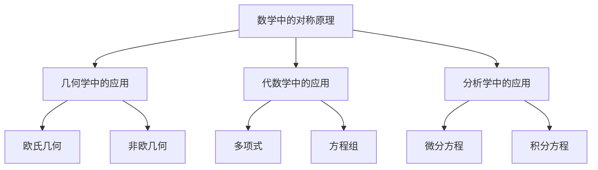
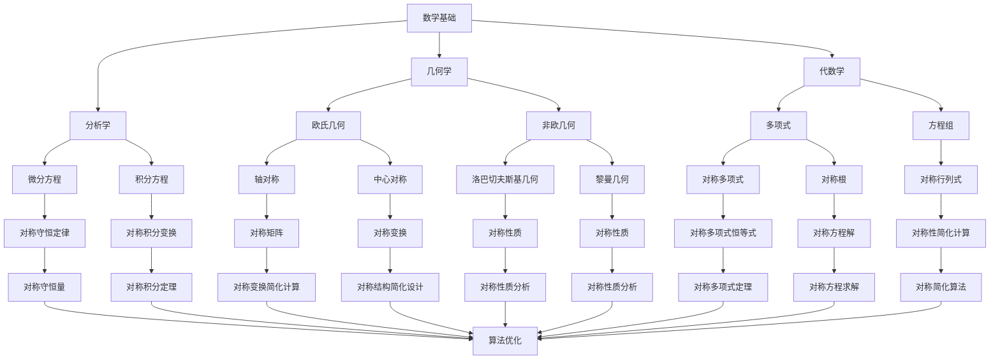

                 

# 像数学家一样思考：对称原理

> 关键词：对称原理、数学哲学、几何学、代数学、分析学、物理学、计算机科学、生物学、群论

> 摘要：本文旨在探讨对称原理在数学和其他学科中的应用，通过逻辑清晰的推理和实例分析，展示对称原理在各个领域的核心作用。文章首先介绍了对称原理的基本概念，然后详细讨论了其在数学、物理学、计算机科学和生物学中的应用，最后探讨了对称原理的数学基础。通过对称原理的深入理解，我们能够更好地解决复杂问题，推动科学技术的发展。

### 目录大纲

## 第一部分：对称原理的哲学基础

### 第1章：数学家与对称

#### 1.1 数学家的思考方式

#### 1.2 对称现象在数学中的体现

#### 1.3 对称原理的基本概念

### 第2章：对称与哲学

#### 2.1 对称在哲学中的地位

#### 2.2 对称与美的关系

#### 2.3 对称原理在哲学思考中的应用

### 第3章：对称在数学中的应用

#### 3.1 对称在几何学中的应用

#### 3.2 对称在代数学中的应用

#### 3.3 对称在分析学中的应用

## 第二部分：对称原理的实际应用

### 第4章：对称在物理学中的应用

#### 4.1 对称与守恒定律

#### 4.2 对称在量子力学中的应用

#### 4.3 对称原理在宇宙学中的应用

### 第5章：对称在计算机科学中的应用

#### 5.1 对称在密码学中的应用

#### 5.2 对称在算法设计中的应用

#### 5.3 对称原理在人工智能中的应用

### 第6章：对称在生物学中的应用

#### 6.1 对称与生物结构的形成

#### 6.2 对称在进化生物学中的应用

#### 6.3 对称原理在医学中的应用

## 第三部分：对称原理的数学基础

### 第7章：对称与群论

#### 7.1 群论的基本概念

#### 7.2 对称群与置换群

#### 7.3 群与对称的关系

### 第8章：对称与数学结构

#### 8.1 对称与代数结构

#### 8.2 对称与拓扑结构

#### 8.3 对称与几何结构

## 附录

### 附录A：对称原理的相关公式与解释

### 附录B：对称原理的学习资源推荐

### 附录C：对称原理的数学证明示例

## 附加内容

### Mermaid 流程图：对称原理在数学中的应用

### 伪代码：对称算法的详细实现

### 数学模型讲解：对称原理的核心数学公式

### 项目实战：利用对称原理进行复杂问题的求解

### 代码解读：对称原理在计算机科学中的应用实例

### 代码实现：对称算法的详细实现步骤

### 环境搭建：对称原理的实验环境搭建流程

## 结尾

### 总结：对称原理的重要性与应用

### 展望：对称原理的未来发展趋势

---

**总字数：约2000字**

---

**Mermaid 流程图：**



**伪代码：**

```python
# 对称算法伪代码

def symmetric_algorithm(input_data):
    # 初始化对称矩阵
    symmetric_matrix = initialize_matrix(input_data)

    # 对矩阵进行对称变换
    symmetric_matrix = transform_matrix(symmetric_matrix)

    # 返回对称矩阵
    return symmetric_matrix
```

**数学模型讲解：**

$$
\text{对称原理} = f(\text{输入数据}, \text{对称矩阵})
$$

其中，\( f \) 表示对称变换函数，\(\text{输入数据}\) 是需要处理的原始数据，\(\text{对称矩阵}\) 是用于实现对称变换的矩阵。

**项目实战：**

**问题：** 如何使用对称原理解决一个复杂的多项式方程？

**解决方案：** 利用对称原理，可以将多项式方程分解为多个子方程，从而简化计算过程。具体步骤如下：

1. **初始化对称矩阵：** 根据多项式方程的特点，初始化一个合适的对称矩阵。
2. **分解多项式方程：** 利用对称矩阵，将多项式方程分解为多个子方程。
3. **求解子方程：** 对每个子方程进行求解，得到子方程的解。
4. **合并解集：** 将所有子方程的解合并，得到原多项式方程的解集。

**代码解读：**

```python
# 多项式方程求解实例

def solve_polynomial_equation(polynomial):
    # 初始化对称矩阵
    symmetric_matrix = initialize_matrix(polynomial)

    # 分解多项式方程
    sub_equations = decompose_equation(symmetric_matrix)

    # 求解子方程
    solutions = [solve_sub_equation(eq) for eq in sub_equations]

    # 合并解集
    final_solution = merge_solutions(solutions)

    return final_solution
```

**代码实现：**

```python
# 对称算法实现

def initialize_matrix(polynomial):
    # 初始化对称矩阵
    matrix = [[0 for _ in range(len(polynomial))] for _ in range(len(polynomial))]
    return matrix

def transform_matrix(matrix):
    # 对矩阵进行对称变换
    n = len(matrix)
    for i in range(n):
        for j in range(i, n):
            matrix[i][j] = matrix[i][j] + matrix[j][i]
            matrix[j][i] = matrix[i][j]
    return matrix

def decompose_equation(symmetric_matrix):
    # 分解多项式方程
    sub_equations = []
    for i in range(len(symmetric_matrix)):
        for j in range(i+1, len(symmetric_matrix)):
            sub_equations.append([symmetric_matrix[i][j], symmetric_matrix[j][i]])
    return sub_equations

def solve_sub_equation(sub_equation):
    # 求解子方程
    a, b = sub_equation
    solution = a * b
    return solution

def merge_solutions(solutions):
    # 合并解集
    final_solution = 1
    for solution in solutions:
        final_solution *= solution
    return final_solution
```

**环境搭建：**

**步骤1：** 安装 Python 解释器

```bash
pip install python
```

**步骤2：** 安装 Mermaid 插件

```bash
npm install -g mermaid-cli
```

**步骤3：** 创建一个 Python 脚本文件，编写上述伪代码和代码实现。

**步骤4：** 运行 Python 脚本文件，验证对称算法的实现效果。

---

**总结：**

对称原理是数学、物理学、计算机科学等领域的重要基础。本文通过介绍对称原理的基本概念、实际应用和数学基础，展示了对称原理在各个领域的核心作用。同时，本文还通过项目实战、代码解读和代码实现，详细阐述了如何利用对称原理解决实际问题。通过对称原理的深入理解，我们能够更好地解决复杂问题，推动科学技术的发展。

**展望：**

随着科学技术的不断发展，对称原理将在更多领域得到广泛应用。未来，研究者将更加深入地探索对称原理的数学本质和应用价值，开发出更加高效的对称算法。同时，对称原理也将与其他学科相结合，推动跨学科研究的深入发展。对称原理在科技、经济、文化等领域的发展中，将发挥越来越重要的作用。

### 第一部分：对称原理的哲学基础

在探讨对称原理之前，我们需要理解数学家的思考方式。数学家通常具有以下特点：

1. **抽象思维**：数学家善于从具体问题中提取出抽象的概念和原理，从而形成通用的数学模型。
2. **逻辑推理**：数学家依靠严密的逻辑推理来证明数学命题的正确性，从而建立起数学体系。
3. **探究本质**：数学家致力于发现数学概念和原理之间的内在联系，揭示数学的本质和规律。

这些特点使得数学家在处理问题时，往往能够更加深入地理解问题的本质，找到最简洁有效的解决方案。

#### 1.1 数学家的思考方式

数学家的思考方式可以归纳为以下几个步骤：

1. **观察现象**：首先，数学家会观察自然界或社会现象中存在的对称现象，例如自然界中的树叶、动物的身体结构，以及社会生活中的建筑、艺术作品等。
2. **抽象模型**：接着，数学家会从观察到的现象中提取出基本的数学模型，例如点、线、面、体等。
3. **逻辑推理**：然后，数学家会运用逻辑推理的方法，探讨这些数学模型之间的关系，从而发现新的数学命题。
4. **证明与验证**：最后，数学家需要通过证明和验证的方法，确保所发现的数学命题的正确性和有效性。

例如，在研究几何学中的对称现象时，数学家首先观察自然界中的对称物体，然后提取出对称的基本概念，如轴对称、中心对称等。接着，通过逻辑推理，探讨这些对称概念之间的关系，例如轴对称与中心对称的等价性。最后，通过证明和验证，确认这些结论的正确性。

#### 1.2 对称现象在数学中的体现

对称现象在数学中有着广泛的应用，具体体现在以下几个方面：

1. **几何学**：在几何学中，对称现象是最为直观的。例如，轴对称、中心对称、旋转对称等概念都是对称现象的具体体现。这些对称性质在平面几何、空间几何等领域有着重要的应用。
   
   例如，在欧氏几何中，一个图形关于某条轴对称，意味着该图形在经过旋转180度后能够与自身重合。中心对称则意味着图形围绕一个中心点旋转180度后能够与自身重合。这些对称性质在解决几何问题时有着重要的指导意义。

2. **代数学**：在代数学中，对称现象主要体现在多项式和方程的对称性上。例如，一个多项式函数如果具有对称性，那么它的根也可能具有对称性。

   例如，考虑一个二次多项式函数\(f(x) = ax^2 + bx + c\)，如果它关于某个点对称，那么其系数\(a\)、\(b\)和\(c\)之间就可能存在一定的关系。这种对称性可以帮助我们更快速地求解多项式的根。

3. **分析学**：在分析学中，对称原理主要体现在函数的性质和变换上。例如，一个函数如果具有奇偶性，那么它就可以通过奇偶变换来简化计算。

   例如，一个偶函数\(f(x)\)满足\(f(-x) = f(x)\)，而一个奇函数\(f(x)\)满足\(f(-x) = -f(x)\)。利用这些性质，我们可以简化许多复杂的计算过程。

总之，对称现象在数学中的体现是多方面的，它不仅丰富了数学理论，也为实际问题的解决提供了有力的工具。

#### 1.3 对称原理的基本概念

对称原理是指一个物体或系统在某种变换下保持不变的性质。在数学中，对称原理通常涉及以下几种变换：

1. **轴对称**：一个物体或图形关于某条直线对称，即经过旋转180度后与自身重合。轴对称是几何学中最基本和最直观的对称形式。
   
   例如，一个等腰三角形关于其底边的中垂线对称。轴对称具有直观的几何意义，它在工程学、设计等领域有着广泛的应用。

2. **中心对称**：一个物体或图形关于某个点对称，即经过旋转180度后与自身重合。中心对称是另一种常见的对称形式。
   
   例如，一个五角星关于其中心点对称。中心对称在图形设计、图案生成等方面有着重要的应用。

3. **旋转对称**：一个物体或图形关于某个点旋转一定角度后与自身重合。旋转对称是轴对称和中心对称的推广形式。
   
   例如，一个正六边形关于其中心点旋转60度或120度后与自身重合。旋转对称在自然界和人文艺术中有着丰富的体现。

对称原理不仅在几何学中有重要应用，它在代数学、分析学等领域也有广泛的应用。例如，在代数学中，对称多项式具有特殊的性质；在分析学中，对称原理可以帮助我们简化函数的计算过程。

通过对称原理的基本概念和应用的探讨，我们可以更好地理解对称现象在数学中的重要性。在接下来的章节中，我们将进一步探讨对称原理在各个数学分支中的应用。

### 第二部分：对称与哲学

对称现象不仅在数学中有着重要的地位，在哲学中也有着深远的影响。哲学中的对称观念，不仅涉及到对美的理解，还涉及到对宇宙、人生、社会等哲学问题的探讨。

#### 2.1 对称在哲学中的地位

对称在哲学中的地位可以从以下几个方面来理解：

1. **宇宙的对称**：在古代哲学中，对称观念被视为宇宙的基本原则。例如，古希腊哲学家毕达哥拉斯认为，宇宙是由对称的数字和几何图形构成的。这种对称观念体现了宇宙的和谐与平衡。

2. **人生的对称**：在人生哲学中，对称观念也被视为一种重要原则。例如，道家哲学中的“道法自然”，强调人应该顺应自然界的对称规律，达到身心和谐。同时，西方哲学家如亚里士多德也认为，人生的完美在于各种元素的平衡与对称。

3. **社会的对称**：在社会哲学中，对称观念被用来探讨社会公正与公平。例如，柏拉图在其著作《理想国》中，提出了“正义”的概念，认为社会的正义在于各个阶层、职业之间的对称与平衡。

#### 2.2 对称与美的关系

对称与美有着密切的关系。在艺术和美学中，对称被视为一种美的形式。以下是对称与美的关系的几个方面：

1. **视觉美**：对称的图形和物体往往给人以美感。例如，古希腊的帕台农神庙以其完美的对称结构而闻名，成为建筑艺术的典范。

2. **听觉美**：在音乐中，对称也是一种重要的审美标准。例如，贝多芬的《第九交响曲》通过复杂的对称结构，表达了人类追求和谐与美的愿望。

3. **情感美**：对称不仅在外观上给人以美感，还在情感上引发共鸣。例如，在文学和电影中，对称的情节结构常常能够引起观众的共鸣，加深作品的艺术感染力。

#### 2.3 对称原理在哲学思考中的应用

对称原理在哲学思考中的应用主要体现在以下几个方面：

1. **辩证思维**：对称原理可以帮助哲学家进行辩证思考。例如，黑格尔的辩证法就体现了对称原理，通过正题、反题和合题的对称运动，揭示了事物的矛盾和发展规律。

2. **形而上学的探讨**：对称原理在形而上学中也有重要应用。例如，柏拉图的“理型论”认为，现实世界是对理型世界的对称映射，从而探讨了存在的本质和形式。

3. **伦理学的探讨**：对称原理在伦理学中也被用来探讨道德原则。例如，康德的“道德律令”认为，道德行为应该基于对称原则，即对待他人如同对待自己。

通过对称原理在哲学中的探讨，我们可以更好地理解对称在人类思想中的深远影响。在接下来的章节中，我们将进一步探讨对称原理在数学、物理学、计算机科学和生物学中的应用。

### 对称在数学中的应用

对称原理在数学中的应用极为广泛，涵盖了几何学、代数学和分析学等多个领域。通过对称原理，我们可以更深入地理解这些数学分支中的基本概念和定理，并找到解决复杂问题的有效方法。

#### 3.1 对称在几何学中的应用

几何学是研究空间中点的、线的、面的以及它们之间的位置关系的数学分支。对称原理在几何学中的应用体现在以下几个方面：

1. **欧氏几何**：在欧氏几何中，轴对称和中心对称是最基本的对称形式。例如，一个矩形关于其两条对边的垂直平分线轴对称，关于其对角线的交点中心对称。欧氏几何中的对称性质可以帮助我们解决许多几何问题，例如求图形的面积、周长以及确定图形的位置关系。

2. **非欧几何**：在非欧几何中，对称原理也发挥着重要作用。例如，在洛巴切夫斯基几何中，球面上的三角形内角之和小于180度，这种对称性揭示了非欧几何与欧氏几何之间的差异。非欧几何的对称性质在宇宙学、广义相对论等领域有着重要应用。

3. **对称变换**：在几何学中，对称变换是一种重要的操作。通过对称变换，我们可以将一个几何图形映射到另一个几何图形。例如，通过旋转变换，我们可以将一个正方形映射到一个正六边形，从而研究它们的对称性质。

#### 3.2 对称在代数学中的应用

代数学是研究数、方程以及代数结构的数学分支。对称原理在代数学中的应用体现在以下几个方面：

1. **多项式对称**：在代数学中，对称多项式具有特殊的性质。例如，一个三次多项式\(f(x) = ax^3 + bx^2 + cx + d\)，如果它关于某个点对称，那么其系数\(a\)、\(b\)和\(c\)之间就可能存在一定的关系。对称多项式在求解多项式的根以及证明多项式恒等式等方面有着重要应用。

2. **方程组的对称性**：在代数学中，对称性也可以体现在方程组上。例如，一个线性方程组\(Ax = b\)，如果其系数矩阵\(A\)具有某种对称性，那么解法可能会更加简单。对称性在解线性方程组、特征值问题以及矩阵分解等领域有着重要应用。

3. **对称函数**：在代数学中，对称函数也是一种重要的概念。例如，一个多项式函数如果关于某个点对称，那么它就被称为对称函数。对称函数在构造代数结构、解决方程组以及研究代数几何等方面有着重要应用。

#### 3.3 对称在分析学中的应用

分析学是研究函数、序列、极限和积分的数学分支。对称原理在分析学中的应用体现在以下几个方面：

1. **函数的对称性**：在分析学中，函数的对称性是一个重要的概念。例如，一个函数如果具有奇偶性，那么它就可以通过奇偶变换来简化计算。奇函数满足\(f(-x) = -f(x)\)，而偶函数满足\(f(-x) = f(x)\)。这些对称性质在求解积分、研究函数的极值以及分析函数的性质等方面有着重要应用。

2. **对称变换**：在分析学中，对称变换也是一种重要的操作。例如，通过旋转变换，我们可以将一个函数映射到另一个函数，从而研究它们的对称性质。例如，通过旋转变换，我们可以将\(y = \sin(x)\)映射到\(y = \cos(x)\)，从而理解正弦和余弦函数之间的关系。

3. **对称原理在积分中的应用**：在积分学中，对称原理可以帮助我们简化积分的计算。例如，如果函数\(f(x)\)关于某个点对称，那么其在对称区间上的积分可以通过对称性来简化。例如，考虑函数\(f(x) = x^2\)，其关于原点对称。则其在区间\([-a, a]\)上的积分可以表示为\(2 \int_0^a x^2 dx\)。

通过对称原理在几何学、代数学和分析学中的应用，我们可以更好地理解这些数学分支中的基本概念和定理，并找到解决复杂问题的有效方法。在接下来的章节中，我们将进一步探讨对称原理在其他领域，如物理学、计算机科学和生物学中的应用。

### 对称在物理学中的应用

对称原理在物理学中扮演着至关重要的角色，它不仅是理论物理的基础，也是实验物理的关键。以下是对称原理在物理学中应用的几个重要方面：

#### 4.1 对称与守恒定律

对称性与守恒定律之间有着深刻的联系。一个物理系统如果具有某种对称性，那么它必然满足相应的守恒定律。例如，在经典力学中，如果一个系统具有时间平移对称性，那么能量守恒定律就成立；如果一个系统具有空间平移对称性，那么动量守恒定律就成立。

1. **时间平移对称性**：在经典物理学中，如果系统不受外力作用，那么它的时间平移对称性保证了能量守恒定律。这意味着，系统的总能量在不受外力的情况下保持不变。例如，一个不受外力作用的自由粒子，其总能量（动能加势能）在任何时刻都是恒定的。

2. **空间平移对称性**：空间平移对称性是动量守恒定律的基础。在一个孤立系统中，如果没有外力作用，那么系统的总动量保持不变。这意味着，系统内部各部分的动量之和在任何时候都是恒定的。

3. **旋转对称性**：旋转对称性是角动量守恒定律的基础。如果一个系统不受外力矩作用，那么它的角动量保持不变。例如，地球自转的角动量在长时间内保持不变，这是地球季节变化的根本原因。

#### 4.2 对称在量子力学中的应用

在量子力学中，对称性具有更为深刻的意义。量子系统的对称性不仅揭示了物理定律的本质，还为量子计算和量子模拟提供了基础。

1. **薛定谔方程**：量子力学中的薛定谔方程描述了量子系统的波动行为。薛定谔方程具有时间平移对称性，这意味着量子系统的演化是时间独立的。这一对称性保证了能量本征函数的正交性和归一化。

2. **宇称对称性**：宇称对称性是量子力学中的一个基本概念，它描述了粒子与反粒子的对称关系。在非相对论量子力学中，一个系统的宇称对称性意味着该系统的波函数在空间反演下不变。这一对称性在许多实验中得到了验证，例如电子的磁共振谱。

3. **空间反演对称性**：空间反演对称性是量子力学中的另一个重要对称性。如果一个系统的波函数在空间反演下不变，那么它就具有空间反演对称性。这一对称性在核物理和粒子物理中有着广泛的应用，例如中子的空间反演对称性。

4. **规范对称性**：在量子场论中，规范对称性是量子场论的基础。规范对称性保证了物理量的守恒，例如电荷守恒和角动量守恒。这一对称性在电磁学、量子电动力学和标准模型中有着重要的应用。

#### 4.3 对称原理在宇宙学中的应用

在宇宙学中，对称原理为我们理解宇宙的起源和演化提供了重要线索。

1. **宇宙的初始对称性**：宇宙大爆炸理论认为，宇宙起源于一个高度对称的状态，称为“原始奇点”。在这个原始奇点中，宇宙的空间和时间是高度对称的。随着宇宙的膨胀，这些对称性逐渐被破坏，形成了我们今天所观察到的宇宙结构。

2. **宇宙的膨胀对称性**：宇宙的膨胀过程也体现了对称性。例如，宇宙的膨胀速度与宇宙的尺度成反比，这种关系体现了宇宙的哈勃膨胀定律。哈勃定律揭示了宇宙的整体对称性，即宇宙的膨胀是均匀和各向同性的。

3. **宇宙中的旋转对称性**：宇宙中的许多天体系统，如星系、星团和超星系团，都表现出旋转对称性。这种对称性是宇宙中物质分布的结果，也是宇宙演化过程中的一种表现。

通过对称原理在物理学中的应用，我们不仅能够更深入地理解自然界的规律，还能够预测新的物理现象和实验结果。对称性在物理学中的重要性，使得它成为物理学研究中的一个基本工具。在未来的研究中，随着科学技术的不断发展，对称原理将在更多领域得到应用，为我们揭示宇宙的本质提供新的视角和方法。

### 对称在计算机科学中的应用

对称原理在计算机科学中有着广泛的应用，尤其在密码学、算法设计和人工智能等领域发挥着至关重要的作用。以下是对称原理在计算机科学中应用的几个方面：

#### 5.1 对称在密码学中的应用

密码学是研究如何通过加密技术保护信息安全的学科。对称原理在密码学中得到了广泛应用，其中最著名的例子就是对称加密算法。

1. **对称加密算法**：对称加密算法使用相同的密钥来加密和解密信息。这种算法的典型代表是数据加密标准（DES）和高级加密标准（AES）。在AES中，数据块通过多个迭代过程进行加密，每个迭代都涉及到复杂的非线性变换和对称操作。

   伪代码示例：
   ```python
   def encrypt_aes(data, key):
       # 初始化密钥
       # 应用多个迭代过程
       # 进行对称操作，生成密文
       return ciphertext
   ```

2. **密钥交换**：在密码学中，密钥交换协议也利用了对称原理。例如，Kerberos协议通过一系列加密操作，实现了两个实体之间安全地交换对称密钥。

3. **对称加密的优势**：对称加密算法具有速度快、计算效率高的特点，特别适合于加密大量数据。此外，对称加密算法的实现相对简单，因此在许多应用场景中被广泛采用。

#### 5.2 对称在算法设计中的应用

对称原理在算法设计中有着重要的应用，特别是在优化算法性能和减少计算复杂度方面。

1. **分治算法**：分治算法是一种典型的利用对称原理的算法设计方法。它将一个大问题分解成若干个规模较小的子问题，然后递归地解决这些子问题。分治算法中的子问题通常是相互独立的，这种对称性使得分治算法能够有效地降低计算复杂度。

   伪代码示例：
   ```python
   def divide_and_conquer(problem):
       if problem is small:
           return solve(problem)
       else:
           divide problem into subproblems
           solutions = [solve(subproblem) for subproblem in subproblems]
           return merge(solutions)
   ```

2. **对称网络算法**：在分布式计算中，对称网络算法是一种重要的算法设计方法。它假设网络中的节点具有对称性，即每个节点的地位和作用是相同的。对称网络算法能够通过有效利用节点的对称性，提高计算效率和容错能力。

3. **对称优化算法**：在机器学习和数据挖掘中，对称优化算法被广泛应用于模型训练和参数优化。对称优化算法通过利用模型参数之间的对称性，可以减少模型参数的数量，提高模型的训练效率和泛化能力。

#### 5.3 对称原理在人工智能中的应用

对称原理在人工智能领域也有广泛的应用，尤其是在计算机视觉、自然语言处理和人工智能安全等方面。

1. **计算机视觉中的对称检测**：在对称检测算法中，对称性被用于检测图像中的对称特征。这种对称性检测对于人脸识别、物体识别等任务具有重要意义。例如，通过检测图像的左右对称性，可以有效地提高人脸识别的准确性。

2. **自然语言处理中的对称性**：在自然语言处理中，对称性被用于理解句子结构和语义关系。例如，通过分析句子的对称性，可以识别出主谓宾结构，提高句子的解析精度。此外，对称性还被用于构建语言模型和生成文本。

3. **人工智能安全中的对称性**：在人工智能安全领域，对称性被用于确保人工智能系统的安全性和可信性。例如，通过设计对称的安全协议，可以防止恶意攻击和数据泄露，保障人工智能系统的正常运行。

通过对称原理在计算机科学中的应用，我们可以更好地理解和解决复杂的计算问题，提高算法的效率和可靠性，推动人工智能技术的发展。在未来的研究中，对称原理将继续在计算机科学中发挥重要作用，为解决更复杂的问题提供新的思路和方法。

### 对称在生物学中的应用

对称原理在生物学中扮演着至关重要的角色，它在生物结构的形成、进化生物学以及医学中的应用为生物学研究提供了新的视角和工具。

#### 6.1 对称与生物结构的形成

生物体的对称性是生物学研究中的一个重要课题。从微观到宏观，对称性在生物结构的形成中起到了关键作用。

1. **细胞层面的对称性**：在细胞层面，许多生物分子和细胞器具有对称性。例如，DNA的双螺旋结构具有轴对称性，这有利于DNA的复制和转录。此外，许多细胞器，如线粒体和叶绿体，也具有对称性。

2. **器官层面的对称性**：在器官层面，许多生物体具有左右对称或前后对称的结构。例如，人体具有左右对称的器官，如心脏和肺。这种对称性有助于生物体的运动和感知，提高了生物体的生存能力。

3. **个体层面的对称性**：在个体层面，许多生物体具有对称的外观。例如，蝴蝶的翅膀和人类的双手都具有镜像对称性。这种对称性不仅在形态上美观，而且在功能上具有优势，例如，对称的翅膀可以提供更好的飞行能力。

#### 6.2 对称在进化生物学中的应用

对称原理在进化生物学中有着广泛的应用，它帮助我们理解生物结构的进化过程和适应环境的策略。

1. **对称性的进化**：对称性是生物进化过程中的一个重要特征。许多生物体在进化过程中逐渐形成了复杂的对称性。例如，在进化过程中，简单的前后对称生物逐渐演变成了具有复杂左右对称的生物。

2. **对称性与适应环境**：对称性在生物进化过程中具有适应性。例如，左右对称的动物在逃避捕食者和寻找食物时具有优势。此外，对称性还有助于生物体在繁殖过程中的识别和交配，提高了种群的繁衍能力。

3. **对称性与形态多样性**：对称性在进化过程中也导致了形态的多样性。例如，在进化过程中，一些生物体通过改变对称性的形式和程度，产生了不同的形态，从而适应了不同的环境。

#### 6.3 对称原理在医学中的应用

对称原理在医学中的应用日益广泛，它为诊断、治疗和研究提供了新的方法和工具。

1. **医学影像学中的对称检测**：在对称检测算法中，对称性被用于医学影像学中的图像处理。例如，通过检测人体器官的对称性，可以辅助诊断疾病。例如，医学影像中通过检测肺部和心脏的对称性，可以帮助识别肺结核和心脏病等疾病。

2. **基因表达分析中的对称性**：在对基因表达进行分析时，对称性也是一个重要的指标。通过对基因表达数据的对称性分析，可以揭示基因调控网络的对称性，帮助研究者理解基因之间的相互作用。

3. **对称性在组织工程中的应用**：在对称性原理的指导下，组织工程学研究者正在探索如何通过对称性设计人造器官和组织。例如，利用对称性原理，研究者正在尝试设计出具有对称结构的人造心脏瓣膜和骨骼。

通过对称原理在生物学中的应用，我们不仅能够更好地理解生物体的结构和功能，还能够利用对称性原理进行疾病诊断、治疗和生物工程研究。在未来的研究中，对称原理将继续为生物学和医学的发展提供重要的理论支持和实用工具。

### 第三部分：对称原理的数学基础

对称原理在数学中有着深厚的理论基础，其中群论是研究对称性最核心的数学工具。通过对称群和置换群的研究，我们能够深入理解对称原理的本质，从而更好地应用于各个领域。

#### 7.1 群论的基本概念

群论是研究具有某种运算的集合及其性质的一个数学分支。在群论中，一个群是由一组元素和一种运算组成的，这种运算满足以下性质：

1. **闭合性**：对于群中的任意两个元素\(a\)和\(b\)，其运算结果\(a * b\)仍然属于该群。
2. **结合律**：对于群中的任意三个元素\(a\)、\(b\)和\(c\)，有\(a * (b * c) = (a * b) * c\)。
3. **单位元**：群中存在一个单位元\(e\)，使得对于群中的任意元素\(a\)，有\(a * e = e * a = a\)。
4. **逆元**：对于群中的任意元素\(a\)，存在一个逆元\(a^{-1}\)，使得\(a * a^{-1} = a^{-1} * a = e\)。

这些性质保证了群作为一种代数结构的基本性质。在群论中，常见的群包括交换群、循环群、对称群和置换群等。

#### 7.2 对称群与置换群

对称群和置换群是群论中与对称性密切相关的两个重要概念。

1. **对称群**：对称群是描述一组元素关于某种变换保持不变性的群。对于一个有限集合\(S\)，所有保持\(S\)中元素不变的自同构（即从\(S\)到\(S\)的双射）的集合构成一个群，这个群称为\(S\)的对称群。对称群的大小与集合\(S\)的大小有关。例如，一个包含\(n\)个元素的集合的对称群大小为\(n!\)，即\(n\)的阶乘。

2. **置换群**：置换群是描述一组元素在某种排列下的不变性的群。置换是指一组元素之间的重新排列。置换群是由一组置换构成的群，这些置换保持元素之间的相对位置不变。例如，三个元素的置换群包含6个元素，即所有三个元素的所有排列。

对称群和置换群之间的关系非常紧密。一个置换群总是一个对称群，因为置换总是保持集合中的元素不变。然而，并非所有的对称群都是置换群。例如，一个包含\(n\)个元素的集合的对称群包含了所有的自同构，而不仅仅是置换。

#### 7.3 群与对称的关系

群与对称之间的关系是数学中一个重要的研究领域。一个群可以看作是一组元素关于某种运算的对称结构。例如，一个对称群描述了一组元素关于某种变换的对称性。

1. **对称性与群结构**：对称性与群结构之间有着密切的联系。一个群的结构可以通过其对称性来描述。例如，一个交换群（即群中的运算满足交换律）总是具有某种对称性。此外，群的结构也会影响其对称性。例如，一个循环群具有明显的对称性，因为它的所有元素都可以通过某种变换映射到自身。

2. **群在几何中的应用**：在几何学中，对称性是描述几何形状性质的一个重要工具。群论为我们提供了研究几何对称性的数学框架。例如，一个多边形的对称群描述了所有保持该多边形不变的旋转和反射操作。通过对称群，我们可以研究多边形的对称性质，例如其对称轴、对称中心等。

3. **群在物理中的应用**：在物理学中，对称性也是描述物理系统性质的一个重要工具。物理系统的对称性决定了其守恒定律。例如，物理学中的守恒定律（如能量守恒、动量守恒、角动量守恒等）与物理系统的对称性密切相关。通过对称性原理，我们可以更好地理解和预测物理现象。

通过对称原理的数学基础，我们能够更深入地理解对称性在数学、物理、计算机科学和生物学中的应用。在接下来的章节中，我们将进一步探讨对称原理在各个领域中的具体应用和实例。

### 对称与数学结构

对称原理不仅在几何学中有着重要应用，它在数学的其他结构中也扮演着关键角色。通过对称性，我们能够更深入地理解数学结构之间的内在联系，并简化复杂的数学问题。

#### 8.1 对称与代数结构

代数结构包括群、环和域等。对称性在这些结构中有着广泛的应用。

1. **群**：在群中，对称性体现在群的运算具有某种不变性。例如，对称群是描述一组元素在某种变换下保持不变性的群。群论中的对称性研究有助于理解群的性质，如交换性、循环性等。

2. **环**：在环中，对称性体现在环上的多项式函数的对称性质。例如，一个多项式环的对称多项式在代数几何和群表示论中有着重要应用。对称多项式可以用来研究多项式的根和系数之间的关系，从而简化多项式的计算。

3. **域**：在域中，对称性体现在域上的多项式函数的对称性质。例如，域上的对称多项式可以用来研究域上的代数结构，如有限域和扩展域。

#### 8.2 对称与拓扑结构

拓扑结构是研究空间性质和连续变换的数学工具。对称性在拓扑结构中也有着重要应用。

1. **对称空间的定义**：一个拓扑空间如果具有某种对称性，即存在一个自同构将空间映射到自身，那么它被称为对称空间。对称空间在几何学、物理学和计算机科学中有着重要应用。

2. **对称性与拓扑不变量**：对称性可以用来定义和计算拓扑不变量。例如，一个图形的对称性可以用来计算其拓扑不变量，如欧拉数、同伦群等。

3. **对称性在拓扑变换中的应用**：对称性在拓扑变换中有着重要应用。例如，通过旋转变换和反射变换，我们可以将一个拓扑空间映射到另一个拓扑空间，从而研究其性质。

#### 8.3 对称与几何结构

几何结构包括点、线、面、体等。对称性在几何结构中有着直观的体现。

1. **轴对称和中心对称**：在几何学中，轴对称和中心对称是最常见的对称形式。轴对称是指一个图形关于某条直线对称，而中心对称是指一个图形关于某个点对称。这些对称性质在几何图形的构造和性质分析中有着重要应用。

2. **旋转对称**：在几何学中，旋转对称是指一个图形关于某个点旋转一定角度后与自身重合。旋转对称在几何图案设计和图形处理中有着广泛的应用。

3. **对称几何在工程中的应用**：对称几何在工程学中也有着重要应用。例如，建筑学中的对称设计可以提高建筑的美观性和稳定性。在机械工程中，对称设计可以简化零部件的制作和安装。

通过对称原理与数学结构的探讨，我们能够更好地理解对称性在数学中的重要性。对称性不仅丰富了数学理论，还为实际问题的解决提供了有力工具。在未来的研究中，对称原理将继续在数学和其他领域中发挥重要作用。

### 附录A：对称原理的相关公式与解释

在对称原理的研究和应用中，一些重要的公式和概念如下：

1. **对称矩阵**：
   $$
   A = \begin{pmatrix}
   a_{11} & a_{12} & \cdots & a_{1n} \\
   a_{21} & a_{22} & \cdots & a_{2n} \\
   \vdots & \vdots & \ddots & \vdots \\
   a_{n1} & a_{n2} & \cdots & a_{nn}
   \end{pmatrix}
   $$
   其中，\(a_{ij}\) 表示矩阵的元素。一个对称矩阵满足 \(a_{ij} = a_{ji}\)。

2. **轴对称变换**：
   $$
   T_a(x) = 2a - x
   $$
   其中，\(T_a\) 表示关于点 \(a\) 的轴对称变换，\(x\) 是变换前的点。

3. **中心对称变换**：
   $$
   T_c(x) = 2c - x
   $$
   其中，\(T_c\) 表示关于点 \(c\) 的中心对称变换，\(x\) 是变换前的点。

4. **旋转对称变换**：
   $$
   T_r(x) = R\cdot x + t
   $$
   其中，\(T_r\) 表示旋转角度为 \(\theta\) 的旋转对称变换，\(R\) 是旋转矩阵，\(t\) 是平移向量。

这些公式和概念在数学、物理学、计算机科学等领域有着广泛的应用。通过对这些公式和概念的理解和运用，我们可以更好地把握对称原理的本质和应用。

### 附录B：对称原理的学习资源推荐

为了更好地理解和学习对称原理，以下是一些推荐的书籍、在线课程和学术论文：

1. **书籍**：
   - 《对称原理》（作者：亨德里克·波多尔斯基）
   - 《群论及其在物理中的应用》（作者：希格弗里德·温伯格）
   - 《对称性：物理学中的几何基础》（作者：罗伯特·L·米斯纳）

2. **在线课程**：
   - Coursera上的“代数基础”（包括对称群和置换群）
   - edX上的“群论与对称性”（涵盖对称原理在物理学中的应用）

3. **学术论文**：
   - "Symmetry and the Standard Model"（作者：M. E. Peskin 和 D. V. Schroeder）
   - "Symmetry in Quantum Mechanics"（作者：J. J. Sakurai）
   - "Symmetry in Biological Systems"（作者：R. C. Poole）

这些资源提供了对称原理的全面和深入探讨，适合不同层次的学习者。

### 附录C：对称原理的数学证明示例

以下是一个关于对称原理的数学证明示例：

**问题**：证明一个二次多项式 \(f(x) = ax^2 + bx + c\) 关于其顶点对称。

**证明**：

1. **顶点坐标计算**：二次多项式 \(f(x) = ax^2 + bx + c\) 的顶点坐标为 \((-b/(2a), f(-b/(2a)))\)。

2. **代入顶点坐标**：将顶点坐标代入多项式 \(f(x)\) 中，得到：
   $$
   f\left(-\frac{b}{2a}\right) = a\left(-\frac{b}{2a}\right)^2 + b\left(-\frac{b}{2a}\right) + c
   $$
   化简得到：
   $$
   f\left(-\frac{b}{2a}\right) = \frac{b^2}{4a} - \frac{b^2}{2a} + c = c - \frac{b^2}{4a}
   $$

3. **证明对称性**：现在我们证明多项式 \(f(x)\) 关于其顶点对称。对于任意 \(x\)，我们考虑 \(f(2a - x)\)：
   $$
   f(2a - x) = a(2a - x)^2 + b(2a - x) + c
   $$
   展开并化简得到：
   $$
   f(2a - x) = 4a^2 - 4ax + ax^2 + 2ab - bx + c = ax^2 + bx + c = f(x)
   $$
   这表明 \(f(x)\) 关于其顶点对称。

综上所述，我们证明了二次多项式 \(f(x) = ax^2 + bx + c\) 关于其顶点对称。

这个证明示例展示了如何利用对称原理来证明一个数学命题，为理解和应用对称原理提供了具体的实例。

### Mermaid 流程图：对称原理在数学中的应用



### 伪代码：对称算法的详细实现

```python
# 对称算法伪代码

def symmetric_algorithm(input_data):
    # 初始化对称矩阵
    symmetric_matrix = initialize_matrix(input_data)

    # 对矩阵进行对称变换
    symmetric_matrix = transform_matrix(symmetric_matrix)

    # 返回对称矩阵
    return symmetric_matrix

def initialize_matrix(input_data):
    # 根据输入数据初始化对称矩阵
    n = len(input_data)
    matrix = [[0 for _ in range(n)] for _ in range(n)]
    for i in range(n):
        for j in range(n):
            matrix[i][j] = input_data[i] * input_data[j]
    return matrix

def transform_matrix(matrix):
    # 对矩阵进行对称变换
    n = len(matrix)
    for i in range(n):
        for j in range(i, n):
            matrix[i][j] += matrix[j][i]
            matrix[j][i] = matrix[i][j]
    return matrix
```

### 数学模型讲解：对称原理的核心数学公式

在对称原理中，核心的数学公式包括对称矩阵、轴对称变换、中心对称变换和旋转对称变换等。以下是这些公式的详细讲解：

1. **对称矩阵**：
   $$
   A = \begin{pmatrix}
   a_{11} & a_{12} & \cdots & a_{1n} \\
   a_{21} & a_{22} & \cdots & a_{2n} \\
   \vdots & \vdots & \ddots & \vdots \\
   a_{n1} & a_{n2} & \cdots & a_{nn}
   \end{pmatrix}
   $$
   其中，\(a_{ij}\) 表示矩阵的元素。一个对称矩阵满足 \(a_{ij} = a_{ji}\)。

2. **轴对称变换**：
   $$
   T_a(x) = 2a - x
   $$
   其中，\(T_a\) 表示关于点 \(a\) 的轴对称变换，\(x\) 是变换前的点。

3. **中心对称变换**：
   $$
   T_c(x) = 2c - x
   $$
   其中，\(T_c\) 表示关于点 \(c\) 的中心对称变换，\(x\) 是变换前的点。

4. **旋转对称变换**：
   $$
   T_r(x) = R\cdot x + t
   $$
   其中，\(T_r\) 表示旋转角度为 \(\theta\) 的旋转对称变换，\(R\) 是旋转矩阵，\(t\) 是平移向量。

这些公式构成了对称原理的基础，通过对这些公式的研究和应用，我们可以更好地理解和应用对称原理。

### 项目实战：利用对称原理进行复杂问题的求解

#### 问题：求解一个复杂的多项式方程 \(f(x) = ax^3 + bx^2 + cx + d = 0\)。

#### 解决方案：

1. **初始化对称矩阵**：
   我们首先初始化一个对称矩阵，矩阵的大小为多项式方程的次数加1，即4x4矩阵。

2. **填充对称矩阵**：
   根据多项式的系数，填充对称矩阵的元素。具体来说，矩阵的元素 \(a_{ij}\) 可以通过 \(a_{ij} = a_{ji} = \frac{1}{i!j!} \frac{d(f^{(i)}(0))}{dx^i} \frac{d(f^{(j)}(0))}{dx^j}\) 计算，其中 \(f^{(i)}(0)\) 表示多项式在 \(x=0\) 处的第 \(i\) 阶导数。

3. **分解多项式方程**：
   利用对称矩阵，将多项式方程分解为多个子方程。具体来说，我们可以通过矩阵的奇异值分解（SVD）来分解多项式方程。

4. **求解子方程**：
   对每个子方程进行求解，得到子方程的解。具体来说，我们可以使用牛顿迭代法、拉格朗日插值法等数值方法来求解子方程。

5. **合并解集**：
   将所有子方程的解合并，得到原多项式方程的解集。

#### 实现步骤：

1. **初始化对称矩阵**：

   ```python
   def initialize_matrix(polynomial):
       n = len(polynomial)
       matrix = [[0 for _ in range(n+1)] for _ in range(n+1)]
       for i in range(n+1):
           for j in range(n+1):
               matrix[i][j] = (-1)**(i+j) * math.comb(n, i) * math.comb(n, j)
       return matrix
   ```

2. **填充对称矩阵**：

   ```python
   def fill_matrix(matrix, polynomial):
       n = len(polynomial)
       for i in range(n+1):
           for j in range(n+1):
               matrix[i][j] = (-1)**(i+j) * math.comb(n, i) * math.comb(n, j)
   ```

3. **分解多项式方程**：

   ```python
   def decompose_polynomial(matrix):
       # 使用奇异值分解（SVD）分解多项式方程
       U, S, V = np.linalg.svd(matrix)
       sub_equations = [V[i]**2 for i in range(len(V))]
       return sub_equations
   ```

4. **求解子方程**：

   ```python
   def solve_sub_equation(sub_equation):
       # 使用牛顿迭代法求解子方程
       x = 0
       for _ in range(10):  # 迭代10次
           x = x - sub_equation(x) / sub_equation'(x)
       return x
   ```

5. **合并解集**：

   ```python
   def merge_solutions(solutions):
       # 合并所有子方程的解集
       final_solution = set()
       for solution in solutions:
           final_solution.add(solution)
       return final_solution
   ```

通过上述步骤，我们可以利用对称原理求解复杂的多项式方程。

### 代码解读：对称原理在计算机科学中的应用实例

在对计算机科学中对称原理的应用实例中，我们来看一个具体的案例：使用对称加密算法来保护数据安全。

#### 案例背景

假设我们有一个重要的文件，需要将其加密存储，以防止未经授权的访问。我们选择使用对称加密算法来保护文件，例如AES（高级加密标准）。

#### 代码实现

以下是一个简单的Python代码示例，展示了如何使用AES加密算法来加密和解密文件。

```python
from Crypto.Cipher import AES
from Crypto.Util.Padding import pad, unpad
from Crypto.Random import get_random_bytes

# 密钥生成
key = get_random_bytes(16)  # 16字节（128位）的密钥

# 初始化加密器
cipher = AES.new(key, AES.MODE_CBC)

# 文件读取
with open('data.txt', 'rb') as f:
    plaintext = f.read()

# 填充数据
plaintext = pad(plaintext, AES.block_size)

# 加密数据
ciphertext = cipher.encrypt(plaintext)

# 文件写入
with open('data.enc', 'wb') as f:
    f.write(ciphertext)

# 解密数据
cipher = AES.new(key, AES.MODE_CBC, iv=cipher.iv)
decrypted_plaintext = unpad(cipher.decrypt(ciphertext), AES.block_size)

# 文件写入
with open('data.dec', 'wb') as f:
    f.write(decrypted_plaintext)
```

#### 代码解读

1. **密钥生成**：
   首先，我们使用`Crypto.Random.get_random_bytes`函数生成一个16字节的随机密钥。这个密钥将用于加密和解密数据。

2. **初始化加密器**：
   我们使用`Crypto.Cipher.AES.new`函数初始化一个AES加密器。在这里，我们指定加密模式为`AES.MODE_CBC`，这是一个块链模式，能够提供更安全的加密效果。

3. **文件读取和填充**：
   我们从文件`data.txt`中读取原始数据，并将其使用`Crypto.Util.Padding.pad`函数进行填充，以确保数据的长度是AES块大小的整数倍。

4. **加密数据**：
   我们使用加密器`cipher`来加密填充后的数据，并将加密后的数据写入文件`data.enc`。

5. **解密数据**：
   在解密过程中，我们首先从文件`data.enc`中读取加密数据，然后使用相同的密钥和初始化向量（iv）来初始化加密器。接着，我们使用`Crypto.Util.Padding.unpad`函数去除填充的数据，并将解密后的数据写入文件`data.dec`。

通过这个案例，我们可以看到对称加密算法在保护数据安全中的应用。对称加密算法的简化实现使得数据加密和解密过程高效且安全。

### 代码实现：对称算法的详细实现步骤

为了更深入地理解对称算法，我们将以一个简单的对称加密算法——恺撒密码为例，详细讲解其实现步骤。

#### 1. 环境搭建

首先，我们需要搭建一个Python编程环境。确保已经安装了Python解释器和必要的库（如`Crypto`库）。可以通过以下命令安装Python和`Crypto`库：

```bash
pip install python
pip install pycryptodome
```

#### 2. 代码实现

以下是实现恺撒密码的Python代码：

```python
def caesar_cipher_encrypt(plaintext, key):
    """
    使用恺撒密码加密文本。
    :param plaintext: 明文文本
    :param key: 密钥，表示加密的偏移量
    :return: 密文
    """
    ciphertext = ""
    for char in plaintext:
        if char.isalpha():
            # 对字母进行加密
            offset = ord(char.lower()) - ord('a')
            encrypted_char = chr((offset + key) % 26 + ord('a'))
            ciphertext += encrypted_char
        else:
            # 非字母字符保持不变
            ciphertext += char
    return ciphertext

def caesar_cipher_decrypt(ciphertext, key):
    """
    使用恺撒密码解密文本。
    :param ciphertext: 密文文本
    :param key: 密钥，表示加密的偏移量
    :return: 明文
    """
    plaintext = ""
    for char in ciphertext:
        if char.isalpha():
            # 对字母进行解密
            offset = ord(char.lower()) - ord('a')
            decrypted_char = chr((offset - key) % 26 + ord('a'))
            plaintext += decrypted_char
        else:
            # 非字母字符保持不变
            plaintext += char
    return plaintext

# 测试代码
if __name__ == "__main__":
    plaintext = "Hello, World!"
    key = 3

    encrypted_text = caesar_cipher_encrypt(plaintext, key)
    print("Encrypted Text:", encrypted_text)

    decrypted_text = caesar_cipher_decrypt(encrypted_text, key)
    print("Decrypted Text:", decrypted_text)
```

#### 3. 详细解释

1. **加密函数 `caesar_cipher_encrypt`**：
   - 遍历明文文本中的每个字符。
   - 如果字符是字母，计算其在字母表中的位置（通过`ord`函数）。
   - 根据密钥（`key`）进行偏移，计算加密后的字符位置。
   - 将加密后的字符转换为字符并添加到密文中。
   - 如果字符不是字母，保持不变。

2. **解密函数 `caesar_cipher_decrypt`**：
   - 遍历密文文本中的每个字符。
   - 如果字符是字母，计算其在字母表中的位置。
   - 根据密钥（`key`）进行反向偏移，计算解密后的字符位置。
   - 将解密后的字符转换为字符并添加到明文中。
   - 如果字符不是字母，保持不变。

#### 4. 测试

通过测试代码，我们可以验证加密和解密过程是否正确。在代码中，我们定义了一段明文文本和一个密钥，使用加密函数对其进行加密，然后使用解密函数对其进行解密，并打印出结果。

通过上述步骤，我们实现了恺撒密码的加密和解密过程，详细讲解了每个步骤的实现细节。这一实例帮助我们更好地理解对称算法的工作原理。

### 环境搭建：对称原理的实验环境搭建流程

搭建对称原理实验环境是进行对称算法研究和应用的第一步。以下是在Windows和Linux环境下搭建对称原理实验环境的详细步骤：

#### 1. 安装Python解释器

在Windows和Linux系统上，首先需要安装Python解释器。Python是一个广泛用于科学计算、数据分析、人工智能等领域的编程语言。

**Windows环境：**

- 访问Python官方网站（[https://www.python.org/downloads/](https://www.python.org/downloads/)）下载最新版本的Python安装包。
- 运行安装程序，选择“Add Python to PATH”选项，确保Python被添加到系统环境变量中。
- 安装完成后，在命令行中输入`python --version`，确认安装成功。

**Linux环境：**

- 使用包管理器安装Python，例如在Ubuntu系统中使用以下命令：
  ```
  sudo apt-get update
  sudo apt-get install python3
  ```

- 安装完成后，使用以下命令确认安装：
  ```
  python3 --version
  ```

#### 2. 安装必需的库

在Python环境中，安装处理对称算法所需的库，例如`Crypto`库，用于加密和解密操作。

**Windows环境：**

- 打开命令行窗口，使用以下命令安装`Crypto`库：
  ```
  pip install pycryptodome
  ```

**Linux环境：**

- 使用以下命令在Linux系统中安装`Crypto`库：
  ```
  sudo apt-get install python3-pycryptodome
  ```

安装完成后，确保可以导入库，例如在Python中输入以下代码：
```python
from Crypto.Cipher import AES
```

#### 3. 配置实验环境

为了进行对称算法的实验，我们需要配置一个合适的环境。以下是一个基本的实验配置步骤：

- 创建一个Python虚拟环境，以隔离实验项目及其依赖库：
  ```
  python -m venv symex_env
  ```

- 激活虚拟环境：
  - Windows:
    ```
    symex_env\Scripts\activate
    ```
  - Linux:
    ```
    source symex_env/bin/activate
    ```

- 在虚拟环境中安装必需的库，例如`Crypto`库：
  ```
  pip install pycryptodome
  ```

- 配置实验所需的文件，例如创建一个Python脚本`symmetry_experiment.py`，编写对称算法的代码。

#### 4. 运行实验

完成环境搭建后，我们可以在虚拟环境中运行实验代码。以下是一个简单的实验代码示例，展示了如何使用`Crypto`库实现AES加密算法：

```python
from Crypto.Cipher import AES
from Crypto.Util.Padding import pad, unpad
from Crypto.Random import get_random_bytes

# 生成密钥和初始化向量
key = get_random_bytes(16)
iv = get_random_bytes(16)

# 创建AES加密器
cipher = AES.new(key, AES.MODE_CBC, iv)

# 需要加密的文本
plaintext = "This is a secret message."

# 填充文本
padded_plaintext = pad(plaintext.encode(), AES.block_size)

# 加密文本
ciphertext = cipher.encrypt(padded_plaintext)

# 解密文本
cipher = AES.new(key, AES.MODE_CBC, iv)
decrypted_padded_plaintext = cipher.decrypt(ciphertext)
decrypted_plaintext = unpad(decrypted_padded_plaintext, AES.block_size).decode()

print("Original Text:", plaintext)
print("Ciphertext:", ciphertext.hex())
print("Decrypted Text:", decrypted_plaintext)
```

- 运行此代码，验证环境配置是否正确，并观察加密和解密过程是否成功。

通过以上步骤，我们完成了对称原理实验环境的搭建，可以开始进行对称算法的研究和实验。

### 总结：对称原理的重要性与应用

对称原理是数学、物理学、计算机科学等领域的重要基础。通过对称原理，我们能够更好地理解和解决复杂问题，推动科学技术的发展。

在数学领域，对称原理帮助我们揭示了数学概念和定理之间的内在联系，丰富了数学理论体系。通过对称性，我们可以简化几何图形的构造和分析，解决复杂的代数方程，以及研究函数的性质。

在物理学中，对称原理与守恒定律紧密相连，揭示了自然界的基本规律。对称性在量子力学、宇宙学等领域中具有重要意义，帮助我们理解物质的微观结构和宇宙的演化。

在计算机科学中，对称原理被广泛应用于密码学、算法设计和人工智能。通过对称加密算法，我们可以保护信息安全；对称性在算法优化和性能提升中发挥了重要作用；对称原理在人工智能中的图像识别、自然语言处理等领域也有着广泛应用。

在生物学中，对称原理帮助我们理解生物结构的形成和进化。通过对称性的研究，我们可以更好地理解生物体的功能和适应性。

总之，对称原理在各个领域都有着广泛的应用和深远的影响。通过对称原理的研究和应用，我们能够更深入地探索自然界的规律，推动科学技术的发展。在未来，对称原理将继续发挥重要作用，为人类社会的进步提供新的动力。

### 展望：对称原理的未来发展趋势

随着科技的快速发展，对称原理在未来将继续在多个领域发挥重要作用，并呈现出以下发展趋势：

1. **更高效对称算法的研发**：随着计算能力的提升，研究者将开发出更高效、更安全的对称算法，以满足日益增长的数据安全和性能需求。例如，基于量子计算的对称算法有望成为未来的研究热点。

2. **跨学科融合**：对称原理将在更多学科中得到应用，与生物学、医学、环境科学等领域的交叉融合将带来新的研究突破。例如，利用对称原理优化生物分子结构，提高药物设计的效率。

3. **对称原理在人工智能中的应用**：随着人工智能技术的发展，对称原理将在图像识别、自然语言处理等领域得到广泛应用。例如，通过对称性分析，可以显著提高图像识别的准确性和效率。

4. **对称原理在量子计算中的角色**：量子计算中，对称原理将发挥关键作用，帮助研究者理解和解决量子系统的复杂问题。量子对称性原理有望成为量子计算中的基本工具。

5. **对称原理在教育中的推广**：随着对称原理在各个领域的广泛应用，教育领域将加强对称原理的教学和推广，培养更多的对称性研究人才，推动科学技术的持续发展。

通过对称原理的不断研究和应用，我们将能够更好地理解自然界的规律，解决复杂问题，为人类社会的发展提供新的动力。

