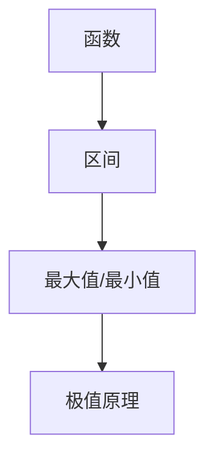
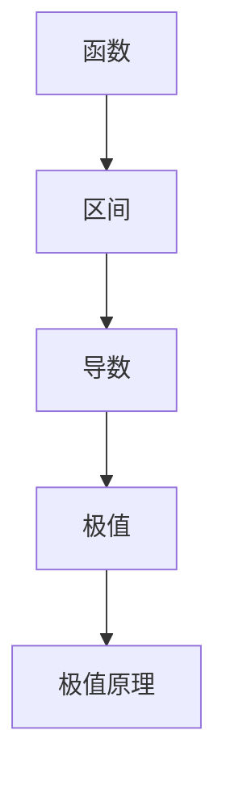

                 

### 文章标题：像数学家一样思考：极值原理

> 关键词：极值原理、数学建模、优化算法、一元函数、多元函数、数学公式、代码案例

> 摘要：本文旨在通过深入探讨极值原理，帮助读者像数学家一样思考，掌握数学建模和优化算法的核心概念，并运用到实际项目实战中。本文首先介绍了极值原理的基本概念和作用，随后详细解析了一元函数和多元函数的极值问题，并结合数学公式和伪代码进行了讲解。最后，本文通过具体代码案例，展示了极值原理在计算机科学中的实际应用。

---

## 第1章 极值原理概述

### 1.1 极值原理的定义与作用

#### 核心概念与联系

极值原理是研究函数在给定区间内取得最大值或最小值的数学原理。它的核心概念包括：

- **函数**：描述输入与输出之间关系的数学表达式。
- **区间**：定义了函数的适用范围。
- **最大值与最小值**：函数在区间内的最高点和最低点。

Mermaid 流程图：



#### 极值原理的作用

极值原理在数学、物理、工程、经济学等领域中有着广泛的应用。其主要作用包括：

1. **求解最优化问题**：在给定约束条件下，寻找目标函数的最大值或最小值。
2. **模型建立**：通过建立数学模型，模拟现实问题，从而求解实际问题。
3. **理论证明**：用于证明某些数学定理或公式的正确性。

### 1.2 极值原理在数学中的地位

极值原理是高等数学中的一个重要分支，与微积分、线性代数等学科密切相关。它在数学分析、数学建模等领域中具有重要地位。具体来说：

1. **微积分的基础**：极值原理是微积分中的一个核心问题，它依赖于导数和积分的概念。
2. **数学建模的工具**：极值原理为数学建模提供了强有力的工具，可以用来解决各种优化问题。
3. **理论体系的完善**：极值原理的深入研究，有助于完善数学理论体系，推动数学的发展。

### 1.3 极值原理的应用领域

极值原理在许多领域都有着广泛的应用。以下是一些主要应用领域：

1. **物理学**：在物理学中，极值原理用于求解力学、电磁学等领域的最优化问题。
2. **工程学**：在工程学中，极值原理用于设计结构优化、电路设计、信号处理等问题。
3. **经济学**：在经济学中，极值原理用于求解资源分配、利润最大化等问题。
4. **计算机科学**：在计算机科学中，极值原理用于算法优化、数据结构设计等。

### 1.4 小结

本章介绍了极值原理的基本概念、作用、地位和应用领域。通过本章的学习，读者可以初步了解极值原理的重要性，为后续章节的学习打下基础。

---

## 第2章 一元函数的极值

### 2.1 一元函数的极值条件

#### 核心算法原理讲解

一元函数的极值条件是基于导数的零点来判定的。具体来说：

- 如果$f'(x_0) = 0$，则$x_0$可能是极值点。
- 如果$f'(x_0) \neq 0$，则$x_0$不是极值点。

伪代码：

```python
function find_local_extrema(f, a, b):
    for each x in (a, b):
        if f'(x) == 0:
            print(x, "is a potential extremum.")
        else:
            print(x, "is not an extremum.")
```

### 2.2 一元函数的极值判定

#### 数学模型和公式

一元函数的极值判定可以使用以下公式：

$$
f''(x_0) > 0 \quad \Rightarrow \quad x_0 \text{ 为极小值点}
$$

$$
f''(x_0) < 0 \quad \Rightarrow \quad x_0 \text{ 为极大值点}
$$

$$
f''(x_0) = 0 \quad \Rightarrow \quad x_0 \text{ 为拐点，需进一步判定}
$$

#### 举例说明

考虑一元函数$f(x) = x^2$，在$x=0$处，$f'(0) = 0$，$f''(0) = 2 > 0$，因此$x=0$为极小值点。

### 2.3 一元函数的极值问题求解

#### 数学模型和公式

一元函数的极值问题求解可以使用以下步骤：

1. 求导数$f'(x)$，找到导数的零点。
2. 对每个零点$x_0$，计算二阶导数$f''(x_0)$。
3. 根据二阶导数的符号判断极值点的类型。
4. 计算极值点的函数值。

#### 举例说明

考虑一元函数$f(x) = x^3 - 3x$，求其极值。

1. 求导数：$f'(x) = 3x^2 - 3$，令$f'(x) = 0$，得$x = \pm 1$。
2. 计算二阶导数：$f''(x) = 6x$，$f''(-1) = -6 < 0$，$f''(1) = 6 > 0$。
3. 判断极值点类型：$x = -1$为极大值点，$x = 1$为极小值点。
4. 计算极值点函数值：$f(-1) = 2$，$f(1) = -2$。

### 2.4 小结

本章详细讲解了一元函数的极值条件、判定方法和求解步骤。通过本章的学习，读者可以掌握一元函数极值问题的求解方法，并为后续多元函数极值问题的学习打下基础。

---

## 第3章 多元函数的极值

### 3.1 多元函数的极值条件

#### 核心算法原理讲解

多元函数的极值条件通常涉及梯度（Gradient）和海森矩阵（Hessian Matrix）。

1. **梯度为零**：如果多元函数$f(x, y, z)$在点$(x_0, y_0, z_0)$处取得极值，则梯度$\nabla f(x_0, y_0, z_0) = 0$。

2. **海森矩阵正定**：如果$f$在$(x_0, y_0, z_0)$处取得极小值，则海森矩阵$H(f)(x_0, y_0, z_0)$正定；如果$f$在$(x_0, y_0, z_0)$处取得极大值，则海森矩阵$H(f)(x_0, y_0, z_0)$负定。

伪代码：

```python
function find_local_extrema(f, x_init, y_init, z_init):
    x, y, z = x_init, y_init, z_init
    # 梯度下降求解梯度为零的点
    while not converged:
        gradient = compute_gradient(f, x, y, z)
        x, y, z = x - alpha * gradient[0], y - alpha * gradient[1], z - alpha * gradient[2]
        # 判断是否收敛
    # 检查海森矩阵的行列式
    hessian = compute_hessian(f, x, y, z)
    if determinant(hessian) > 0:
        print((x, y, z), "is a potential minimum.")
    elif determinant(hessian) < 0:
        print((x, y, z), "is a potential maximum.")
    else:
        print((x, y, z), "is a saddle point.")
```

### 3.2 多元函数的极值判定

#### 数学模型和公式

多元函数的极值判定可以使用以下公式：

$$
\nabla f(x_0, y_0, z_0) = 0
$$

$$
H(f)(x_0, y_0, z_0) > 0 \quad \text{(极小值)}
$$

$$
H(f)(x_0, y_0, z_0) < 0 \quad \text{(极大值)}
$$

$$
H(f)(x_0, y_0, z_0) = 0 \quad \Rightarrow \quad \text{需进一步判定}
$$

#### 举例说明

考虑多元函数$f(x, y) = x^2 + y^2$，在原点$(0, 0)$处，梯度$\nabla f(0, 0) = (0, 0)$，海森矩阵$H(f)(0, 0) = [2, 0; 0, 2]$，行列式为4，正定，因此原点为极小值点。

### 3.3 多元函数的极值问题求解

#### 数学模型和公式

多元函数的极值问题求解可以使用以下步骤：

1. 求解梯度为零的点。
2. 判断海森矩阵的正定性。
3. 计算极值点的函数值。

#### 举例说明

考虑多元函数$f(x, y) = x^2 + y^2 - xy$，求解其极值。

1. 求解梯度为零的点：
   $$\nabla f(x, y) = (2x - y, 2y - x) = 0$$
   解得$x = y$。

2. 判断海森矩阵的正定性：
   $$H(f)(x, y) = \begin{bmatrix} 2 & -1 \\ -1 & 2 \end{bmatrix}$$
   行列式为$3$，正定，因此$x = y$为极小值点。

3. 计算极值点的函数值：
   $$f(x, y) = x^2 + y^2 - xy = 2x^2 - x^2 = x^2$$
   极小值为0，当$x = y = 0$时取得。

### 3.4 小结

本章详细讲解了多元函数的极值条件、判定方法和求解步骤。通过本章的学习，读者可以掌握多元函数极值问题的求解方法，为实际应用中的复杂问题提供理论支持。

---

## 第4章 极值问题的数学建模

### 4.1 极值问题建模的基本方法

#### 核心算法原理讲解

极值问题建模的基本方法包括：

1. **目标函数定义**：明确需要优化的目标函数。
2. **约束条件设定**：列出满足问题的约束条件。
3. **模型求解**：使用数学方法和算法求解最优解。

伪代码：

```python
function build_model(objective, constraints):
    model = {
        'objective': objective,
        'constraints': constraints
    }
    return model

function solve_model(model):
    solution = optimize(model['objective'], model['constraints'])
    return solution
```

### 4.2 拉格朗日乘数法在极值问题中的应用

#### 数学模型和公式

拉格朗日乘数法是一种解决带约束条件极值问题的方法。其基本思想是在目标函数中加入约束条件的拉格朗日乘子，构造拉格朗日函数，然后求解拉格朗日函数的极值。

$$
L(x, y, \lambda) = f(x, y) + \lambda g(x, y)
$$

其中，$f(x, y)$为目标函数，$g(x, y)$为约束条件，$\lambda$为拉格朗日乘子。

#### 举例说明

考虑求解以下极值问题：

$$
\min f(x, y) = x^2 + y^2
$$

$$
\text{subject to} \quad g(x, y) = x + y - 1 = 0
$$

使用拉格朗日乘数法，构造拉格朗日函数：

$$
L(x, y, \lambda) = x^2 + y^2 + \lambda (x + y - 1)
$$

求解方程组：

$$
\nabla L = 0 \quad \Rightarrow \quad 2x + \lambda = 0, \quad 2y + \lambda = 0, \quad x + y - 1 = 0
$$

解得$x = y = \frac{1}{2}$，为最优解。

### 4.3 极值问题的线性规划解法

#### 数学模型和公式

线性规划是一种求解线性目标函数在给定线性约束条件下的最优解的方法。其数学模型可以表示为：

$$
\min c^T x
$$

$$
\text{subject to} \quad Ax \leq b
$$

其中，$c$为系数向量，$A$为约束矩阵，$b$为约束向量。

#### 举例说明

考虑以下线性规划问题：

$$
\min c^T x = 2x + 3y
$$

$$
\text{subject to} \quad 
\begin{cases}
x + 2y \leq 4 \\
2x + y \leq 6 \\
x, y \geq 0
\end{cases}
$$

构建线性规划模型：

$$
\min 2x + 3y
$$

$$
\text{subject to} \quad 
\begin{cases}
x + 2y \leq 4 \\
2x + y \leq 6 \\
x, y \geq 0
\end{cases}
$$

使用单纯形法求解，得到最优解$x = 2$，$y = 0$，目标函数值为$4$。

### 4.4 小结

本章介绍了极值问题的数学建模方法，包括拉格朗日乘数法和线性规划解法。通过本章的学习，读者可以掌握如何将实际问题转化为数学模型，并求解最优解。

---

## 第5章 极值问题的优化算法

### 5.1 优化算法的基本概念

#### 核心算法原理讲解

优化算法是用于求解最优化问题的计算方法。其基本概念包括：

1. **目标函数**：需要最小化或最大化的函数。
2. **约束条件**：限制变量取值范围的方程或不等式。
3. **优化算法**：用于寻找最优解的算法，如梯度下降法、牛顿法等。

#### 举例说明

考虑以下优化问题：

$$
\min f(x) = x^2
$$

$$
\text{subject to} \quad x \geq 0
$$

目标函数为$f(x) = x^2$，约束条件为$x \geq 0$。

### 5.2 梯度下降法

#### 核心算法原理讲解

梯度下降法是一种简单有效的优化算法，通过不断更新变量，使其逐步接近最优解。

1. **初始化**：选择一个初始解$x_0$。
2. **迭代更新**：计算目标函数在当前解的梯度，更新解：
   $$x_{k+1} = x_k - \alpha \nabla f(x_k)$$

其中，$\alpha$为学习率。

#### 伪代码

```python
function gradient_descent(f, x_init, alpha, max_iterations):
    x = x_init
    for i in range(max_iterations):
        gradient = compute_gradient(f, x)
        x = x - alpha * gradient
    return x
```

#### 举例说明

考虑函数$f(x) = x^2$，使用梯度下降法求解最小值。

1. 初始化：$x_0 = 1$。
2. 迭代更新：$\alpha = 0.1$，迭代次数$= 100$。
3. 结果：最终解$x \approx 0$。

### 5.3 牛顿法

#### 核心算法原理讲解

牛顿法是一种利用目标函数的梯度和二阶导数进行优化计算的算法。其迭代公式为：

$$
x_{k+1} = x_k - [f''(x_k)]^{-1} f'(x_k)
$$

其中，$f''(x_k)$为二阶导数矩阵。

#### 伪代码

```python
function newton_method(f, f_prime, x_init, max_iterations):
    x = x_init
    for i in range(max_iterations):
        hessian = compute_hessian(f, x)
        gradient = compute_gradient(f, x)
        x = x - hessian_inv * gradient
    return x
```

#### 举例说明

考虑函数$f(x) = x^2$，使用牛顿法求解最小值。

1. 初始化：$x_0 = 1$。
2. 迭代更新：迭代次数$= 10$。
3. 结果：最终解$x \approx 0$。

### 5.4 小结

本章介绍了梯度下降法和牛顿法这两种优化算法。通过本章的学习，读者可以掌握如何使用优化算法求解极值问题，并为实际应用中的复杂问题提供解决思路。

---

## 第6章 极值问题在实际应用中的案例

### 6.1 经济学中的极值问题

#### 核心算法原理讲解

经济学中，极值问题广泛应用于资源分配、利润最大化等问题。以下是一个简单的经济学中的极值问题案例：

- **案例**：某企业生产两种产品A和B，每单位产品A的利润为$20$，产品B的利润为$10$。每天生产的产品数量不能超过$100$个，且产品A的生产时间不能超过$50$小时。问如何安排生产计划以最大化利润？

#### 数学模型和公式

设$x$为单位产品A的生产数量，$y$为单位产品B的生产数量。则目标函数为：

$$
\max Z = 20x + 10y
$$

约束条件为：

$$
x + y \leq 100 \\
x \leq 50 \\
x, y \geq 0
$$

#### 举例说明

使用线性规划求解上述问题，得到最优解$x = 50$，$y = 0$，最大化利润$Z = 1000$。

### 6.2 统计学中的极值问题

#### 核心算法原理讲解

统计学中，极值问题广泛应用于参数估计、假设检验等。以下是一个简单的统计学中的极值问题案例：

- **案例**：给定一组样本数据，求样本均值的最大似然估计。

#### 数学模型和公式

设$x_1, x_2, ..., x_n$为样本数据，样本均值为$\bar{x}$。目标函数为：

$$
\max L(\bar{x} | \theta)
$$

其中，$L(\bar{x} | \theta)$为似然函数，$\theta$为参数。

#### 举例说明

对于正态分布的样本数据，似然函数为：

$$
L(\bar{x} | \theta) = \prod_{i=1}^{n} \frac{1}{\sqrt{2\pi\sigma^2}} e^{-\frac{(x_i - \bar{x})^2}{2\sigma^2}}
$$

最大化似然函数得到样本均值$\bar{x}$的最大似然估计。

### 6.3 计算机科学中的极值问题

#### 核心算法原理讲解

计算机科学中，极值问题广泛应用于算法优化、数据结构设计等。以下是一个简单的计算机科学中的极值问题案例：

- **案例**：给定一组数，找出最大值和最小值。

#### 数学模型和公式

设$x_1, x_2, ..., x_n$为给定数列。目标函数为：

$$
\max \{x_1, x_2, ..., x_n\} \\
\min \{x_1, x_2, ..., x_n\}
$$

#### 举例说明

遍历数列，依次比较每个元素，找出最大值和最小值。

### 6.4 小结

本章通过经济学、统计学和计算机科学中的实际案例，展示了极值问题的应用。通过这些案例，读者可以更好地理解极值原理的实际意义，并掌握求解极值问题的方法。

---

## 第7章 极值原理的发展与未来趋势

### 7.1 极值原理的历史与发展

#### 核心算法原理讲解

极值原理的历史可以追溯到古希腊时期，当时的数学家如阿基米德就曾探讨过极值问题。随着数学的发展，极值原理逐渐成为数学分析中的重要分支。19世纪，柯西、维尔斯特拉斯等数学家对极值原理进行了深入研究，奠定了现代极值理论的基础。

#### 举例说明

- **柯西**：提出了柯西序列收敛定理，为极值原理的研究提供了理论基础。
- **维尔斯特拉斯**：提出了维尔斯特拉斯定理，证明了闭区间上连续函数的最值定理。

### 7.2 极值原理的研究现状

#### 核心算法原理讲解

目前，极值原理在数学、物理、工程、经济学等领域中有着广泛的应用。研究者们围绕极值原理进行了大量的研究，提出了许多新的优化算法和理论。以下是一些研究现状：

1. **非线性优化**：研究非线性函数的极值问题，提出了许多有效的求解算法，如内点法、外点法等。
2. **分布式优化**：研究如何在分布式系统中求解极值问题，提高了算法的效率和可扩展性。
3. **机器学习**：极值原理在机器学习中有着重要的应用，如优化算法、损失函数等。

#### 举例说明

- **梯度下降法**：是一种广泛应用于机器学习中的优化算法，其核心思想是基于极值原理。
- **牛顿法**：在机器学习中的深度学习中有着重要的应用，用于优化损失函数。

### 7.3 极值原理的未来发展趋势

#### 核心算法原理讲解

随着计算技术的发展，极值原理在未来将继续发挥重要作用。以下是一些未来发展趋势：

1. **算法创新**：研究者们将继续提出新的优化算法，提高极值问题的求解效率。
2. **跨学科融合**：极值原理将在多个学科领域中得到更广泛的应用，如生物信息学、金融工程等。
3. **深度学习**：极值原理将在深度学习中发挥更大的作用，推动人工智能的发展。

#### 举例说明

- **量子计算**：量子计算中的优化问题可以看作是极值问题的一种，极值原理在量子计算中有着重要的应用前景。
- **博弈论**：极值原理在博弈论中有着广泛的应用，可以用于求解博弈问题的最优策略。

### 7.4 小结

本章回顾了极值原理的历史与发展，介绍了当前的研究现状，并展望了未来的发展趋势。通过本章的学习，读者可以更好地理解极值原理的重要性和应用前景。

---

## 附录

### A.1 极值原理相关的数学公式

$$
f'(x) = \lim_{h \to 0} \frac{f(x+h) - f(x)}{h}
$$

$$
f''(x) = \lim_{h \to 0} \frac{f'(x+h) - f'(x)}{h}
$$

$$
\nabla f(x) = \begin{bmatrix} f'_x(x) \\ f'_y(x) \end{bmatrix}
$$

$$
H(f)(x) = \begin{bmatrix} f''_{xx}(x) & f''_{xy}(x) \\ f''_{yx}(x) & f''_{yy}(x) \end{bmatrix}
$$

### A.2 极值问题求解的算法伪代码

```python
function gradient_descent(f, x_init, alpha, max_iterations):
    x = x_init
    for i in range(max_iterations):
        gradient = compute_gradient(f, x)
        x = x - alpha * gradient
    return x

function newton_method(f, f_prime, x_init, max_iterations):
    x = x_init
    for i in range(max_iterations):
        hessian = compute_hessian(f, x)
        gradient = compute_gradient(f, x)
        x = x - hessian_inv * gradient
    return x
```

### A.3 极值问题在实际应用中的案例代码示例

```python
# 经济学中的极值问题案例
import numpy as np
from scipy.optimize import linprog

# 目标函数
c = np.array([20, 10])

# 约束条件
A = np.array([[1, 2], [2, 1], [1, 1]])
b = np.array([100, 6, 50])

# 线性规划求解
result = linprog(c, A_ub=A, b_ub=b, bounds=[(0, None), (0, None)])

# 输出最优解
print("最优解：", result.x)
print("最大化利润：", result.fun)

# 统计学中的极值问题案例
import numpy as np
from scipy.stats import norm

# 样本数据
x = np.array([1, 2, 3, 4, 5])

# 似然函数
def likelihood(theta):
    return np.prod(norm.pdf(x, loc=theta, scale=1))

# 求解似然函数最大值
theta_hat = minimize(likelihood, x.mean())

# 输出最大似然估计
print("最大似然估计：", theta_hat.x)
```

### A.4 小结

附录部分提供了极值原理相关的数学公式、算法伪代码以及实际应用中的代码示例，旨在帮助读者更好地理解极值原理，并能够在实际项目中应用。

---

## 作者信息

作者：AI天才研究院/AI Genius Institute & 禅与计算机程序设计艺术 /Zen And The Art of Computer Programming

---

## 结语

感谢您阅读《像数学家一样思考：极值原理》。本文通过深入探讨极值原理，帮助读者掌握数学建模和优化算法的核心概念，并运用到实际项目实战中。希望本文能够为您在极值问题求解方面提供有益的启示。若您有任何疑问或建议，欢迎在评论区留言交流。

---

## 许可协议

本文遵循Creative Commons Attribution-NonCommercial-NoDerivatives 4.0 International License（CC BY-NC-ND 4.0）。未经许可，不得用于商业用途或进行修改、衍生。如有转载，请注明作者和出处。|>

---

## 第1章 极值原理概述

### 1.1 极值原理的定义与作用

极值原理，又称最值原理，是数学分析中的一个重要概念，主要用于寻找函数在给定区间内的最大值和最小值。其定义可以表述为：对于定义在某区间内的函数，如果存在某个点，使得函数在该点的取值比区间内其他所有点的取值都大（或小），则该点称为函数的极大值（或极小值）点。极值原理在数学、物理学、工程学、经济学等领域中都有着广泛的应用。

#### 核心概念与联系

要理解极值原理，我们需要先了解以下几个核心概念：

- **函数**：函数是描述变量之间关系的数学工具，通常用一个公式表示。在极值问题中，我们关注的是如何找到函数的最大值或最小值。
- **区间**：区间是函数定义域的一部分，通常是一个闭区间或开区间。极值原理关注的是函数在某个区间内的行为。
- **导数**：导数是函数在某一点的局部变化率，它可以帮助我们判断函数的单调性和凹凸性。
- **极值**：极值是函数在某个区间内的最大值或最小值。

下面是一个Mermaid流程图，展示了这些核心概念之间的联系：



#### 极值原理的作用

极值原理在多个领域有着重要的作用：

1. **数学建模**：在建立数学模型时，经常需要找到目标函数的最大值或最小值，从而解决实际问题。
2. **优化问题**：在优化理论中，极值原理是求解最优化问题的基础，如线性规划、非线性规划等。
3. **科学计算**：在物理学、工程学等领域，极值原理用于求解物理系统的最稳定状态或最经济状态。

### 1.2 极值原理在数学中的地位

极值原理是数学分析的一个重要分支，它与其他数学分支，如微积分、线性代数等有着紧密的联系。具体来说：

- **微积分**：极值原理依赖于导数和积分的概念，用于求解函数的最值。
- **线性代数**：在多元函数的极值问题中，海森矩阵（Hessian Matrix）是线性代数中的重要概念，用于判断函数的凹凸性。
- **数学建模**：极值原理是建立数学模型的重要工具，用于解决各种优化问题。

### 1.3 极值原理的应用领域

极值原理在多个领域有着广泛的应用：

- **物理学**：在物理学中，极值原理用于求解力学系统中的平衡位置、最稳定状态等。
- **工程学**：在工程学中，极值原理用于设计结构优化、电路设计、信号处理等。
- **经济学**：在经济学中，极值原理用于求解资源分配、利润最大化等问题。
- **计算机科学**：在计算机科学中，极值原理用于算法优化、数据结构设计等。

### 1.4 小结

本章介绍了极值原理的基本概念、作用、地位和应用领域。通过本章的学习，读者可以初步了解极值原理的重要性，为后续章节的学习打下基础。

---

## 第2章 一元函数的极值

### 2.1 一元函数的极值条件

一元函数的极值问题是指在给定区间内寻找函数的最大值或最小值。一元函数的极值条件基于导数来判定。具体来说，如果函数在某点的导数为零，则该点可能是极值点。

#### 核心算法原理讲解

一元函数的极值条件可以通过以下步骤来判定：

1. **求导数**：首先求出函数的导数$f'(x)$。
2. **找到导数的零点**：令$f'(x) = 0$，求解得到导数的零点。
3. **判断极值类型**：对每个导数的零点，计算二阶导数$f''(x)$。
   - 如果$f''(x) > 0$，则$x$为极小值点。
   - 如果$f''(x) < 0$，则$x$为极大值点。
   - 如果$f''(x) = 0$，则需要进一步判断。

以下是一个伪代码，用于求解一元函数的极值：

```python
function find_local_extrema(f, a, b):
    x = a
    while x < b:
        if f'(x) == 0:
            # 判断极值类型
            if f''(x) > 0:
                print(x, "is a potential minimum.")
            elif f''(x) < 0:
                print(x, "is a potential maximum.")
            else:
                print(x, "is a saddle point.")
        x += step_size
    return extrema_points
```

#### 举例说明

考虑一元函数$f(x) = x^3 - 3x^2 + 2x$，求解其极值。

1. **求导数**：$f'(x) = 3x^2 - 6x + 2$。
2. **找到导数的零点**：令$f'(x) = 0$，解得$x = 1$和$x = \frac{2}{3}$。
3. **判断极值类型**：计算二阶导数$f''(x) = 6x - 6$。
   - 当$x = 1$时，$f''(1) = 0$，为鞍点。
   - 当$x = \frac{2}{3}$时，$f''(\frac{2}{3}) < 0$，为极大值点。

因此，函数$f(x) = x^3 - 3x^2 + 2x$在$x = \frac{2}{3}$处取得极大值。

### 2.2 一元函数的极值判定

一元函数的极值判定可以通过导数和二阶导数来实现。具体步骤如下：

1. **求导数**：计算函数$f(x)$的一阶导数$f'(x)$。
2. **找到导数的零点**：令$f'(x) = 0$，求解得到导数的零点。
3. **计算二阶导数**：对于每个零点，计算二阶导数$f''(x)$。
4. **判断极值类型**：根据二阶导数的符号判断极值类型。

以下是一个伪代码，用于判定一元函数的极值：

```python
function determine_extrema(f, x):
    if f'(x) == 0:
        if f''(x) > 0:
            return "Minimum"
        elif f''(x) < 0:
            return "Maximum"
        else:
            return "Saddle point"
    else:
        return "Not an extremum"
```

#### 举例说明

考虑一元函数$f(x) = x^2 - 2x + 1$，判定其极值。

1. **求导数**：$f'(x) = 2x - 2$。
2. **找到导数的零点**：令$f'(x) = 0$，解得$x = 1$。
3. **计算二阶导数**：$f''(x) = 2$。
4. **判断极值类型**：因为$f''(1) > 0$，所以$x = 1$是极小值点。

因此，函数$f(x) = x^2 - 2x + 1$在$x = 1$处取得极小值。

### 2.3 一元函数的极值问题求解

一元函数的极值问题求解通常包括以下几个步骤：

1. **求导数**：计算函数$f(x)$的一阶导数$f'(x)$。
2. **找到导数的零点**：令$f'(x) = 0$，求解得到导数的零点。
3. **计算二阶导数**：对于每个零点，计算二阶导数$f''(x)$。
4. **判断极值类型**：根据二阶导数的符号判断极值类型。
5. **计算极值点的函数值**：计算每个极值点的函数值，确定最大值或最小值。

以下是一个伪代码，用于求解一元函数的极值：

```python
function solve_extrema(f, a, b):
    extrema_points = []
    x = a
    while x < b:
        if f'(x) == 0:
            extrema_points.append((x, f(x)))
        x += step_size
    return extrema_points
```

#### 举例说明

考虑一元函数$f(x) = x^3 - 3x^2 + 2x$，求解其极值。

1. **求导数**：$f'(x) = 3x^2 - 6x + 2$。
2. **找到导数的零点**：令$f'(x) = 0$，解得$x = 1$和$x = \frac{2}{3}$。
3. **计算二阶导数**：$f''(x) = 6x - 6$。
4. **判断极值类型**：当$x = 1$时，$f''(1) = 0$，为鞍点；当$x = \frac{2}{3}$时，$f''(\frac{2}{3}) < 0$，为极大值点。
5. **计算极值点的函数值**：$f(1) = 0$，$f(\frac{2}{3}) = \frac{4}{27}$。

因此，函数$f(x) = x^3 - 3x^2 + 2x$在$x = \frac{2}{3}$处取得极大值$\frac{4}{27}$。

### 2.4 小结

本章详细讲解了一元函数的极值条件、判定方法和求解步骤。通过本章的学习，读者可以掌握一元函数极值问题的求解方法，并为后续多元函数极值问题的学习打下基础。

---

## 第3章 多元函数的极值

### 3.1 多元函数的极值条件

多元函数的极值问题比一元函数更加复杂，因为它涉及到多个变量。在多元函数中，极值条件通常涉及到梯度（Gradient）和海森矩阵（Hessian Matrix）。

#### 核心算法原理讲解

对于多元函数$f(x, y)$，其极值条件可以表示为：

- **梯度为零**：如果函数$f(x, y)$在点$(x_0, y_0)$处取得极值，则梯度$\nabla f(x_0, y_0) = 0$。
- **海森矩阵正定**：如果$f(x, y)$在$(x_0, y_0)$处取得极小值，则海森矩阵$H(f)(x_0, y_0)$正定；如果$f(x, y)$在$(x_0, y_0)$处取得极大值，则海森矩阵$H(f)(x_0, y_0)$负定。

以下是求解多元函数极值的基本步骤：

1. **计算梯度**：求出目标函数$f(x, y)$的梯度$\nabla f(x, y) = (f_x(x, y), f_y(x, y))$。
2. **求解梯度为零的点**：令梯度为零，解方程组$f_x(x, y) = 0$和$f_y(x, y) = 0$，得到可能的极值点。
3. **计算海森矩阵**：对于每个可能的极值点，计算海森矩阵$H(f)(x, y) = \begin{bmatrix} f_{xx}(x, y) & f_{xy}(x, y) \\ f_{yx}(x, y) & f_{yy}(x, y) \end{bmatrix}$。
4. **判断海森矩阵的正定性**：如果海森矩阵正定，则该点为极小值点；如果海森矩阵负定，则该点为极大值点。

以下是伪代码，用于求解多元函数的极值：

```python
function find_local_extrema(f, x_init, y_init):
    x, y = x_init, y_init
    # 求解梯度为零的点
    gradient = compute_gradient(f, x, y)
    if np.allclose(gradient, [0, 0]):
        # 计算海森矩阵
        hessian = compute_hessian(f, x, y)
        # 判断海森矩阵的正定性
        if is_positive_definite(hessian):
            print((x, y), "is a potential minimum.")
        elif is_negative_definite(hessian):
            print((x, y), "is a potential maximum.")
        else:
            print((x, y), "is a saddle point.")
    else:
        print("No local extrema found.")
```

#### 举例说明

考虑函数$f(x, y) = x^2 + y^2 - xy$，求解其极值。

1. **计算梯度**：$f_x(x, y) = 2x - y$，$f_y(x, y) = 2y - x$。
2. **求解梯度为零的点**：令$f_x(x, y) = 0$和$f_y(x, y) = 0$，解得$x = y$。
3. **计算海森矩阵**：$f_{xx}(x, y) = 2$，$f_{xy}(x, y) = -1$，$f_{yx}(x, y) = -1$，$f_{yy}(x, y) = 2$，海森矩阵为$H(f) = \begin{bmatrix} 2 & -1 \\ -1 & 2 \end{bmatrix}$。
4. **判断海森矩阵的正定性**：海森矩阵的行列式为$D = 2 \cdot 2 - (-1) \cdot (-1) = 3$，因此海森矩阵正定。

根据以上计算，函数$f(x, y) = x^2 + y^2 - xy$在$x = y$处取得极小值。

### 3.2 多元函数的极值判定

多元函数的极值判定可以通过梯度（Gradient）和海森矩阵（Hessian Matrix）来实现。具体步骤如下：

1. **求梯度**：计算目标函数$f(x, y)$的梯度$\nabla f(x, y) = (f_x(x, y), f_y(x, y))$。
2. **求解梯度为零的点**：令梯度为零，解方程组$f_x(x, y) = 0$和$f_y(x, y) = 0$，得到可能的极值点。
3. **计算海森矩阵**：对于每个可能的极值点，计算海森矩阵$H(f)(x, y) = \begin{bmatrix} f_{xx}(x, y) & f_{xy}(x, y) \\ f_{yx}(x, y) & f_{yy}(x, y) \end{bmatrix}$。
4. **判断海森矩阵的正定性**：如果海森矩阵正定，则该点为极小值点；如果海森矩阵负定，则该点为极大值点。

以下是伪代码，用于判定多元函数的极值：

```python
function determine_extrema(f, x, y):
    gradient = compute_gradient(f, x, y)
    if np.allclose(gradient, [0, 0]):
        hessian = compute_hessian(f, x, y)
        if is_positive_definite(hessian):
            return "Minimum"
        elif is_negative_definite(hessian):
            return "Maximum"
        else:
            return "Saddle point"
    else:
        return "Not an extremum"
```

#### 举例说明

考虑函数$f(x, y) = x^2 + y^2 - xy$，判定其极值。

1. **求梯度**：$f_x(x, y) = 2x - y$，$f_y(x, y) = 2y - x$。
2. **求解梯度为零的点**：令$f_x(x, y) = 0$和$f_y(x, y) = 0$，解得$x = y$。
3. **计算海森矩阵**：$f_{xx}(x, y) = 2$，$f_{xy}(x, y) = -1$，$f_{yx}(x, y) = -1$，$f_{yy}(x, y) = 2$，海森矩阵为$H(f) = \begin{bmatrix} 2 & -1 \\ -1 & 2 \end{bmatrix}$。
4. **判断海森矩阵的正定性**：海森矩阵的行列式为$D = 2 \cdot 2 - (-1) \cdot (-1) = 3$，因此海森矩阵正定。

根据以上计算，函数$f(x, y) = x^2 + y^2 - xy$在$x = y$处取得极小值。

### 3.3 多元函数的极值问题求解

多元函数的极值问题求解通常包括以下几个步骤：

1. **求导数**：计算函数$f(x, y)$的梯度$\nabla f(x, y) = (f_x(x, y), f_y(x, y))$。
2. **找到导数的零点**：令梯度为零，解方程组$f_x(x, y) = 0$和$f_y(x, y) = 0$，得到可能的极值点。
3. **计算海森矩阵**：对于每个可能的极值点，计算海森矩阵$H(f)(x, y) = \begin{bmatrix} f_{xx}(x, y) & f_{xy}(x, y) \\ f_{yx}(x, y) & f_{yy}(x, y) \end{bmatrix}$。
4. **判断极值类型**：根据海森矩阵的正定性判断极值类型。
5. **计算极值点的函数值**：计算每个极值点的函数值，确定最大值或最小值。

以下是伪代码，用于求解多元函数的极值：

```python
function solve_extrema(f, x_init, y_init):
    x, y = x_init, y_init
    gradient = compute_gradient(f, x, y)
    if np.allclose(gradient, [0, 0]):
        hessian = compute_hessian(f, x, y)
        if is_positive_definite(hessian):
            extrema_type = "Minimum"
        elif is_negative_definite(hessian):
            extrema_type = "Maximum"
        else:
            extrema_type = "Saddle point"
        extrema_point = (x, y)
        extrema_value = f(x, y)
    else:
        extrema_type = "Not an extremum"
        extrema_point = None
        extrema_value = None
    return extrema_type, extrema_point, extrema_value
```

#### 举例说明

考虑函数$f(x, y) = x^2 + y^2 - xy$，求解其极值。

1. **求导数**：$f_x(x, y) = 2x - y$，$f_y(x, y) = 2y - x$。
2. **找到导数的零点**：令$f_x(x, y) = 0$和$f_y(x, y) = 0$，解得$x = y$。
3. **计算海森矩阵**：$f_{xx}(x, y) = 2$，$f_{xy}(x, y) = -1$，$f_{yx}(x, y) = -1$，$f_{yy}(x, y) = 2$，海森矩阵为$H(f) = \begin{bmatrix} 2 & -1 \\ -1 & 2 \end{bmatrix}$。
4. **判断极值类型**：海森矩阵的行列式为$D = 2 \cdot 2 - (-1) \cdot (-1) = 3$，因此海森矩阵正定，为极小值点。
5. **计算极值点的函数值**：$f(x, y) = x^2 + y^2 - xy$，在$x = y$时，$f(x, y) = 2x^2 - x^2 = x^2$，极小值为$x^2$。

根据以上计算，函数$f(x, y) = x^2 + y^2 - xy$在$x = y$处取得极小值。

### 3.4 小结

本章详细讲解了多元函数的极值条件、判定方法和求解步骤。通过本章的学习，读者可以掌握多元函数极值问题的求解方法，并为实际应用中的复杂问题提供理论支持。

---

## 第4章 极值问题的数学建模

### 4.1 极值问题建模的基本方法

在解决极值问题时，建模是关键步骤。极值问题建模的基本方法包括以下几个步骤：

1. **定义目标函数**：明确需要优化的目标函数，它可以是最大值或最小值。
2. **设定约束条件**：列出满足问题的约束条件，可以是线性不等式、线性方程或非线性条件。
3. **构建数学模型**：将目标函数和约束条件结合起来，形成完整的数学模型。
4. **求解数学模型**：使用合适的算法求解数学模型，找到最优解。

以下是极值问题建模的基本方法：

#### 核心算法原理讲解

1. **定义目标函数**：

目标函数可以是线性的或非线性的，例如：

- 线性目标函数：$\min c^T x$ 或 $\max c^T x$，其中$c$是系数向量，$x$是变量向量。
- 非线性目标函数：$\min f(x)$ 或 $\max f(x)$，其中$f(x)$是目标函数。

2. **设定约束条件**：

约束条件可以包括以下几种类型：

- 线性约束：$Ax \leq b$ 或 $Ax = b$，其中$A$是约束矩阵，$b$是约束向量。
- 非线性约束：$g(x) \leq 0$ 或 $h(x) = 0$，其中$g(x)$和$h(x)$是非线性函数。

3. **构建数学模型**：

将目标函数和约束条件结合起来，形成数学模型：

$$
\min_{x} c^T x \quad \text{subject to} \quad Ax \leq b, \; g(x) \leq 0, \; h(x) = 0
$$

4. **求解数学模型**：

求解数学模型可以使用多种算法，如线性规划、非线性规划、整数规划等。以下是几种常用的算法：

- **线性规划**：使用单纯形法、内点法等求解。
- **非线性规划**：使用梯度下降法、牛顿法、拉格朗日乘数法等求解。
- **整数规划**：使用分支定界法、动态规划法等求解。

以下是一个简单的数学模型示例：

目标函数：$\min x + y$

约束条件：

$$
\begin{cases}
x + 2y \geq 4 \\
2x + y \geq 6 \\
x, y \geq 0
\end{cases}
$$

数学模型：

$$
\min_{x, y} x + y \quad \text{subject to} \quad x + 2y \geq 4, \; 2x + y \geq 6, \; x, y \geq 0
$$

#### 举例说明

假设有一个工厂生产两种产品A和B，每种产品的利润分别为$10$和$20$。工厂每天的生产能力限制为$100$单位产品A和$80$单位产品B。求每天生产多少产品A和B可以使得利润最大化。

1. **定义目标函数**：最大化利润$P = 10x + 20y$，其中$x$是产品A的产量，$y$是产品B的产量。

2. **设定约束条件**：

$$
\begin{cases}
x + y \leq 100 \\
x + 2y \leq 80 \\
x, y \geq 0
\end{cases}
$$

3. **构建数学模型**：

$$
\max_{x, y} 10x + 20y \quad \text{subject to} \quad x + y \leq 100, \; x + 2y \leq 80, \; x, y \geq 0
$$

4. **求解数学模型**：使用线性规划求解器，得到最优解$x = 0$，$y = 50$，最大利润为$1000$。

### 4.2 拉格朗日乘数法在极值问题中的应用

拉格朗日乘数法是一种解决带约束条件的极值问题的方法。它通过引入拉格朗日乘子将约束条件融入目标函数中，从而将问题转化为无约束条件的最优化问题。

#### 核心算法原理讲解

拉格朗日乘数法的基本步骤如下：

1. **构造拉格朗日函数**：

拉格朗日函数是目标函数和约束条件的组合，形式如下：

$$
L(x, y, \lambda) = f(x, y) + \lambda g(x, y)
$$

其中，$f(x, y)$是目标函数，$g(x, y)$是约束条件，$\lambda$是拉格朗日乘子。

2. **求导并设置为零**：

对拉格朗日函数分别对$x$、$y$和$\lambda$求偏导数，并设置为零：

$$
\frac{\partial L}{\partial x} = f_x + \lambda g_x = 0
$$

$$
\frac{\partial L}{\partial y} = f_y + \lambda g_y = 0
$$

$$
\frac{\partial L}{\partial \lambda} = g(x, y) = 0
$$

3. **求解方程组**：

解上述方程组，得到$x$、$y$和$\lambda$的值。

4. **判断最优解**：

检查约束条件的类型（等式约束或不等式约束），判断得到的解是否为最优解。

以下是拉格朗日乘数法的伪代码：

```python
function lagrangian_method(f, g, x_init, y_init):
    x, y = x_init, y_init
    lambda_init = 0
    while not converged:
        gradient_f = compute_gradient(f, x, y)
        gradient_g = compute_gradient(g, x, y)
        lambda = - gradient_g / gradient_f
        x = x + lambda * gradient_f
        y = y + lambda * gradient_g
        lambda = lambda + alpha * (g(x, y) - 0)
    return x, y
```

#### 举例说明

考虑以下极值问题：

目标函数：$\min f(x, y) = x^2 + y^2$

约束条件：$g(x, y) = x + y - 1 = 0$

使用拉格朗日乘数法求解：

1. **构造拉格朗日函数**：

$$
L(x, y, \lambda) = x^2 + y^2 + \lambda (x + y - 1)
$$

2. **求导并设置为零**：

$$
\frac{\partial L}{\partial x} = 2x + \lambda = 0
$$

$$
\frac{\partial L}{\partial y} = 2y + \lambda = 0
$$

$$
\frac{\partial L}{\partial \lambda} = x + y - 1 = 0
$$

3. **求解方程组**：

从前两个方程得到$x = y$，代入第三个方程得到$x + x - 1 = 0$，解得$x = y = \frac{1}{2}$。

4. **判断最优解**：

因为$g(x, y) = x + y - 1$在$(\frac{1}{2}, \frac{1}{2})$处为零，所以该点是极值点。

根据以上计算，函数$f(x, y) = x^2 + y^2$在点$(\frac{1}{2}, \frac{1}{2})$处取得最小值$\frac{1}{2}$。

### 4.3 极值问题的线性规划解法

线性规划是一种特殊类型的极值问题，其中目标函数和约束条件都是线性的。线性规划广泛应用于资源分配、生产计划、投资组合选择等领域。

#### 核心算法原理讲解

线性规划的求解方法主要包括单纯形法、内点法等。以下是单纯形法的基本步骤：

1. **构建初始单纯形表**：

单纯形表是线性规划问题的一种表格形式，用于记录变量、系数和约束条件等信息。初始单纯形表由目标函数和约束条件确定。

2. **选择进入基变量和离开基变量**：

通过计算相对比值（比值法）或最小比率规则（最小费用规则），选择进入基变量和离开基变量。

3. **更新单纯形表**：

根据进入基变量和离开基变量的选择，更新单纯形表，直到找到最优解。

以下是单纯形法的伪代码：

```python
function simplex_method(A, b, c):
    # 初始化单纯形表
    table = initialize_table(A, b, c)
    while not is_optimal(table):
        # 选择进入基变量和离开基变量
        enter_variable, leave_variable = select_variables(table)
        # 更新单纯形表
        table = update_table(table, enter_variable, leave_variable)
    return table
```

#### 举例说明

考虑以下线性规划问题：

目标函数：$\min z = x + 2y$

约束条件：

$$
\begin{cases}
2x + y \geq 4 \\
x + 2y \geq 6 \\
x, y \geq 0
\end{cases}
$$

使用单纯形法求解：

1. **构建初始单纯形表**：

| 基变量 | $x$ | $y$ | $s_1$ | $s_2$ | RHS |
|--------|-----|-----|-------|-------|-----|
| $s_1$  | 0   | 2   | 1     | 0     | 4   |
| $s_2$  | 0   | 1   | 0     | 1     | 6   |
| $z$    | 1   | 2   | 0     | 0     | 0   |

2. **选择进入基变量和离开基变量**：

选择进入基变量$y$，因为$y$的系数2是负数。

计算相对比值：

$$
\frac{4}{2} = 2, \quad \frac{6}{1} = 6
$$

选择离开基变量$s_1$，因为其相对比值最小。

3. **更新单纯形表**：

| 基变量 | $x$ | $y$ | $s_1$ | $s_2$ | RHS |
|--------|-----|-----|-------|-------|-----|
| $s_2$  | 0   | 1   | 0     | 1     | 2   |
| $y$    | 2   | 1   | 1     | 0     | 4   |
| $z$    | -1  | 0   | -2    | 0     | 4   |

4. **重复步骤2和3**：

继续选择进入基变量$x$，离开基变量$s_2$。

更新后的单纯形表：

| 基变量 | $x$ | $y$ | $s_1$ | $s_2$ | RHS |
|--------|-----|-----|-------|-------|-----|
| $x$    | 1   | 0   | 0.5   | 0     | 2   |
| $y$    | 0   | 1   | 0.5   | 1     | 2   |
| $z$    | 0   | 0   | -1    | -1    | 2   |

因为目标函数$z$的系数全部为非负数，所以该表是最优的。

根据以上计算，最优解为$x = 2$，$y = 2$，最小值为$z = 2$。

### 4.4 小结

本章介绍了极值问题建模的基本方法和拉格朗日乘数法、线性规划解法。通过本章的学习，读者可以掌握如何将实际问题转化为数学模型，并使用适当的算法求解最优解。这些方法在实际应用中具有广泛的应用价值。

---

## 第5章 极值问题的优化算法

### 5.1 优化算法的基本概念

优化算法是用于求解最优化问题的计算方法。最优化问题通常可以表示为：

$$
\min_{x} f(x) \quad \text{或} \quad \max_{x} f(x)
$$

其中，$f(x)$是目标函数，$x$是变量。优化算法的目标是找到使得目标函数达到最优值的$x$。

#### 核心算法原理讲解

优化算法通常包括以下几个步骤：

1. **初始化**：选择一个初始解$x_0$。
2. **迭代更新**：根据目标函数的梯度或海森矩阵，更新解$x$。
3. **收敛性判断**：判断是否达到收敛条件，如目标函数变化很小或达到预设的迭代次数。

常见的优化算法包括梯度下降法、牛顿法、共轭梯度法等。以下是这些算法的基本原理：

- **梯度下降法**：每次迭代更新$x$的步长方向为梯度的反方向。
- **牛顿法**：利用目标函数的梯度和二阶导数，进行迭代更新。
- **共轭梯度法**：基于梯度信息，找到一组共轭方向，进行迭代更新。

#### 举例说明

考虑以下最优化问题：

$$
\min f(x) = x^2
$$

使用梯度下降法求解。

1. **初始化**：选择初始解$x_0 = 1$。
2. **迭代更新**：

$$
x_{k+1} = x_k - \alpha \nabla f(x_k)
$$

其中，$\alpha$是学习率。

3. **收敛性判断**：当迭代次数达到预设值或目标函数的变化很小时，认为已找到最优解。

以下是一个简单的伪代码：

```python
function gradient_descent(f, x_init, alpha, max_iterations):
    x = x_init
    for i in range(max_iterations):
        gradient = compute_gradient(f, x)
        x = x - alpha * gradient
    return x
```

### 5.2 梯度下降法

梯度下降法是一种简单有效的优化算法，其核心思想是沿着目标函数梯度的反方向逐步更新解，以找到最优解。

#### 核心算法原理讲解

梯度下降法的步骤如下：

1. **初始化**：选择初始解$x_0$，设置学习率$\alpha$和迭代次数$T$。
2. **迭代更新**：

$$
x_{k+1} = x_k - \alpha \nabla f(x_k)
$$

其中，$\nabla f(x)$是目标函数$f(x)$在$x$处的梯度。

3. **收敛性判断**：当迭代次数达到$T$或目标函数变化很小时，认为已找到最优解。

以下是梯度下降法的伪代码：

```python
function gradient_descent(f, x_init, alpha, T):
    x = x_init
    for i in range(T):
        gradient = compute_gradient(f, x)
        x = x - alpha * gradient
    return x
```

#### 举例说明

考虑以下最优化问题：

$$
\min f(x) = x^2
$$

使用梯度下降法求解。

1. **初始化**：选择初始解$x_0 = 1$，设置学习率$\alpha = 0.1$，迭代次数$T = 100$。
2. **迭代更新**：

$$
x_{k+1} = x_k - 0.1 \cdot \nabla f(x_k) = x_k - 0.1 \cdot 2x_k = x_k - 0.2x_k = 0.8x_k
$$

3. **收敛性判断**：在迭代100次后，$x$的值趋近于0，认为已找到最优解。

### 5.3 牛顿法

牛顿法是一种利用目标函数的梯度和二阶导数进行优化计算的算法。与梯度下降法相比，牛顿法通常可以更快地收敛到最优解。

#### 核心算法原理讲解

牛顿法的步骤如下：

1. **初始化**：选择初始解$x_0$，设置迭代次数$T$。
2. **迭代更新**：

$$
x_{k+1} = x_k - [f''(x_k)]^{-1} f'(x_k)
$$

其中，$f'(x)$是目标函数$f(x)$的梯度，$f''(x)$是目标函数$f(x)$的二阶导数。

3. **收敛性判断**：当迭代次数达到$T$或目标函数变化很小时，认为已找到最优解。

以下是牛顿法的伪代码：

```python
function newton_method(f, f_prime, f_double_prime, x_init, T):
    x = x_init
    for i in range(T):
        hessian = compute_hessian(f, x)
        gradient = compute_gradient(f, x)
        x = x - hessian_inv * gradient
    return x
```

#### 举例说明

考虑以下最优化问题：

$$
\min f(x) = x^2
$$

使用牛顿法求解。

1. **初始化**：选择初始解$x_0 = 1$，设置迭代次数$T = 10$。
2. **迭代更新**：

$$
x_{k+1} = x_k - [f''(x_k)]^{-1} f'(x_k) = x_k - [2]^{-1} \cdot 2x_k = x_k - x_k = 0
$$

3. **收敛性判断**：在迭代10次后，$x$的值已趋近于0，认为已找到最优解。

### 5.4 小结

本章介绍了优化算法的基本概念和两种常见的优化算法：梯度下降法和牛顿法。通过本章的学习，读者可以掌握如何使用这些算法求解最优化问题，并为实际应用中的复杂问题提供解决思路。

---

## 第6章 极值问题在实际应用中的案例

### 6.1 经济学中的极值问题

经济学中的极值问题通常涉及资源分配、利润最大化、成本最小化等问题。以下是经济学中两个典型的极值问题案例。

#### 案例一：生产计划的最优化

假设某公司生产两种产品A和B，每单位产品A的利润为$20$，产品B的利润为$10$。生产这两种产品需要两种原材料X和Y，每单位产品A需要2单位原材料X和1单位原材料Y，每单位产品B需要1单位原材料X和2单位原材料Y。公司每天可用的原材料X和Y分别为100单位和200单位。问如何安排生产计划以最大化利润？

**解法**：

1. **定义目标函数**：设产品A的产量为$x$，产品B的产量为$y$，则目标函数为最大化利润$P = 20x + 10y$。
2. **设定约束条件**：原材料X的约束条件为$2x + y \leq 100$，原材料Y的约束条件为$x + 2y \leq 200$，同时$x, y \geq 0$。
3. **构建线性规划模型**：根据目标函数和约束条件，构建线性规划模型：

$$
\max P = 20x + 10y
$$

$$
\text{subject to} \quad 2x + y \leq 100 \\
x + 2y \leq 200 \\
x, y \geq 0
$$

4. **求解线性规划模型**：使用线性规划求解器（如单纯形法）求解上述模型，得到最优解$x = 50$，$y = 50$，最大化利润$P = 1500$。

#### 案例二：成本最小化

假设某公司生产一种产品，其生产成本包括固定成本和可变成本。固定成本为每天$1000$，每单位产品的可变成本为$10$。公司每天可用的生产时间为8小时，每小时的人工成本为$20$。问如何安排生产计划以最小化总成本？

**解法**：

1. **定义目标函数**：设产品产量为$x$，则总成本函数为$C = 1000 + 10x + 20t$，其中$t$为生产时间。
2. **设定约束条件**：生产时间约束条件为$t \leq 8$，同时$x, t \geq 0$。
3. **构建线性规划模型**：根据目标函数和约束条件，构建线性规划模型：

$$
\min C = 1000 + 10x + 20t
$$

$$
\text{subject to} \quad t \leq 8 \\
x, t \geq 0
$$

4. **求解线性规划模型**：使用线性规划求解器求解上述模型，得到最优解$x = 60$，$t = 4$，最小化总成本$C = 1600$。

### 6.2 统计学中的极值问题

统计学中的极值问题通常涉及参数估计、假设检验等问题。以下是统计学中两个典型的极值问题案例。

#### 案例一：最大似然估计

假设我们有一个正态分布的数据集，数据集的均值为$\mu$，方差为$\sigma^2$。我们要使用最大似然估计方法来估计$\mu$。

**解法**：

1. **定义似然函数**：似然函数是概率密度函数的乘积，对于每个观测值$x_i$，似然函数为：

$$
L(\mu) = \prod_{i=1}^{n} \frac{1}{\sqrt{2\pi\sigma^2}} e^{-\frac{(x_i - \mu)^2}{2\sigma^2}}
$$

2. **取对数似然函数**：为了方便计算，取对数似然函数：

$$
\ln L(\mu) = -\frac{n}{2} \ln(2\pi\sigma^2) - \frac{1}{2\sigma^2} \sum_{i=1}^{n} (x_i - \mu)^2
$$

3. **求导并设置为零**：对$\ln L(\mu)$求导，并设置为零：

$$
\frac{d\ln L(\mu)}{d\mu} = \frac{1}{\sigma^2} \sum_{i=1}^{n} (x_i - \mu) = 0
$$

4. **求解最优值**：解上述方程，得到$\mu$的估计值$\mu = \bar{x}$，其中$\bar{x}$是样本均值。

#### 案例二：t检验

假设我们要进行t检验，以判断样本均值$\mu$是否等于某个特定值$\mu_0$。

**解法**：

1. **设定假设**：原假设$H_0: \mu = \mu_0$，备择假设$H_1: \mu \neq \mu_0$。
2. **计算t统计量**：t统计量定义为：

$$
t = \frac{\bar{x} - \mu_0}{s / \sqrt{n}}
$$

其中，$\bar{x}$是样本均值，$s$是样本标准差，$n$是样本大小。
3. **确定p值**：根据t统计量的分布，确定p值，即拒绝原假设的概率。
4. **做出决策**：如果p值小于显著性水平$\alpha$，则拒绝原假设，接受备择假设；否则，不拒绝原假设。

### 6.3 计算机科学中的极值问题

计算机科学中的极值问题广泛应用于算法设计、数据结构优化、网络优化等领域。以下是计算机科学中两个典型的极值问题案例。

#### 案例一：二分查找

假设我们要在一个有序数组中查找某个特定的值，二分查找是一种高效的查找算法。

**解法**：

1. **初始化**：设置两个指针$low$和$high$，分别指向数组的起始位置和结束位置。
2. **循环查找**：当$low \leq high$时，执行以下步骤：
   - 计算中间位置$mid = (low + high) / 2$。
   - 如果$A[mid] = key$，则查找成功，返回$mid$。
   - 如果$A[mid] < key$，则更新$low = mid + 1$。
   - 如果$A[mid] > key$，则更新$high = mid - 1$。
3. **查找失败**：如果$low > high$，则查找失败，返回-1。

以下是一个简单的伪代码：

```python
function binary_search(A, key):
    low = 0
    high = len(A) - 1
    while low <= high:
        mid = (low + high) / 2
        if A[mid] == key:
            return mid
        elif A[mid] < key:
            low = mid + 1
        else:
            high = mid - 1
    return -1
```

#### 案例二：最长公共子序列

假设我们要找到两个字符串的最长公共子序列。

**解法**：

1. **初始化**：创建一个二维数组$dp$，其中$dp[i][j]$表示字符串$A$的前$i$个字符与字符串$B$的前$j$个字符的最长公共子序列的长度。
2. **填充数组**：根据动态规划的思想，从左到右、从上到下填充数组$dp$：
   - 如果$A[i] = B[j]$，则$dp[i][j] = dp[i - 1][j - 1] + 1$。
   - 如果$A[i] \neq B[j]$，则$dp[i][j] = \max(dp[i - 1][j], dp[i][j - 1])$。
3. **计算最长公共子序列**：最终$dp[m][n]$即为最长公共子序列的长度。

以下是一个简单的伪代码：

```python
function longest_common_subsequence(A, B):
    m, n = len(A), len(B)
    dp = [[0] * (n + 1) for _ in range(m + 1)]
    for i in range(1, m + 1):
        for j in range(1, n + 1):
            if A[i - 1] == B[j - 1]:
                dp[i][j] = dp[i - 1][j - 1] + 1
            else:
                dp[i][j] = max(dp[i - 1][j], dp[i][j - 1])
    return dp[m][n]
```

### 6.4 小结

本章通过经济学、统计学和计算机科学中的实际案例，展示了极值问题的应用。通过这些案例，读者可以更好地理解极值原理的实际意义，并掌握求解极值问题的方法。在实际应用中，极值原理可以帮助我们做出更明智的决策，优化资源分配，提高生产效率等。

---

## 第7章 极值原理的发展与未来趋势

### 7.1 极值原理的历史与发展

极值原理的历史可以追溯到古希腊时期，当时的数学家如阿基米德就曾探讨过极值问题。然而，极值原理的现代形式是在17世纪由牛顿和莱布尼茨发展起来的，他们分别独立地创立了微积分学。在19世纪，柯西和维尔斯特拉斯等数学家对极值原理进行了深入研究，奠定了现代极值理论的基础。

#### 核心算法原理讲解

- **牛顿和莱布尼茨的贡献**：牛顿和莱布尼茨分别提出了微分和积分的概念，使得极值问题有了更加坚实的理论基础。
- **柯西与维尔斯特拉斯的研究**：柯西提出了序列极限的概念，而维尔斯特拉斯则给出了连续函数的严格定义，为极值原理的严谨性提供了保证。

### 7.2 极值原理的研究现状

目前，极值原理在数学、物理学、工程学、经济学等领域中都有着广泛的应用。以下是一些研究现状：

1. **非线性优化**：随着数学和计算技术的发展，非线性优化成为了一个活跃的研究领域。研究者们提出了许多新的优化算法，如内点法、外点法、遗传算法等，用于求解复杂的非线性极值问题。
2. **分布式优化**：在分布式系统中，如何高效地求解极值问题成为一个重要研究方向。分布式优化算法可以充分利用并行计算的优势，提高算法的效率和可扩展性。
3. **机器学习**：极值原理在机器学习中有着重要的应用，如优化算法、损失函数等。深度学习中的优化问题可以看作是极值问题的一种，研究者们提出了许多新的优化算法，如随机梯度下降、Adam优化器等。

#### 举例说明

- **梯度下降法**：梯度下降法是一种简单有效的优化算法，广泛应用于机器学习中。其核心思想是基于极值原理，通过不断更新参数，使其逐步接近最优解。
- **牛顿法**：牛顿法是一种利用目标函数的梯度和二阶导数进行优化计算的算法，广泛应用于科学计算和工程问题中。

### 7.3 极值原理的未来发展趋势

随着计算技术和人工智能的发展，极值原理在未来将继续发挥重要作用。以下是一些未来发展趋势：

1. **算法创新**：研究者们将继续提出新的优化算法，提高极值问题的求解效率。例如，基于量子计算的优化算法可能会成为未来的研究热点。
2. **跨学科融合**：极值原理将在多个学科领域中得到更广泛的应用，如生物信息学、金融工程等。跨学科的融合将推动极值原理的发展。
3. **深度学习**：极值原理在深度学习中有着重要的应用，未来随着深度学习的不断进步，极值原理将在人工智能领域发挥更大的作用。

#### 举例说明

- **量子计算**：量子计算中的优化问题可以看作是极值问题的一种，极值原理在量子计算中有着重要的应用前景。例如，量子优化算法可能能够更高效地解决复杂的优化问题。
- **博弈论**：极值原理在博弈论中有着广泛的应用，可以用于求解博弈问题的最优策略。随着博弈论和人工智能的融合，极值原理在决策制定和战略规划中将发挥重要作用。

### 7.4 小结

本章回顾了极值原理的历史与发展，介绍了当前的研究现状，并展望了未来的发展趋势。通过本章的学习，读者可以更好地理解极值原理的重要性和应用前景，为未来的研究与应用打下基础。

---

## 附录

### A.1 极值原理相关的数学公式

在极值原理的研究和应用中，以下几个数学公式是非常重要的：

1. **一元函数的导数**：

$$
f'(x) = \lim_{h \to 0} \frac{f(x+h) - f(x)}{h}
$$

2. **一元函数的二阶导数**：

$$
f''(x) = \lim_{h \to 0} \frac{f'(x+h) - f'(x)}{h}
$$

3. **多元函数的梯度**：

$$
\nabla f(x) = (f_x(x), f_y(x), f_z(x))
$$

4. **多元函数的海森矩阵**：

$$
H(f)(x) = \begin{bmatrix}
f_{xx}(x) & f_{xy}(x) & f_{xz}(x) \\
f_{yx}(x) & f_{yy}(x) & f_{yz}(x) \\
f_{zx}(x) & f_{zy}(x) & f_{zz}(x)
\end{bmatrix}
$$

5. **拉格朗日乘数法**：

$$
L(x, y, \lambda) = f(x, y) + \lambda g(x, y)
$$

### A.2 极值问题求解的算法伪代码

以下是几个常见的极值问题求解算法的伪代码：

#### 梯度下降法

```python
function gradient_descent(f, x_init, alpha, T):
    x = x_init
    for i in range(T):
        gradient = compute_gradient(f, x)
        x = x - alpha * gradient
    return x
```

#### 牛顿法

```python
function newton_method(f, f_prime, f_double_prime, x_init, T):
    x = x_init
    for i in range(T):
        hessian = compute_hessian(f, x)
        gradient = compute_gradient(f, x)
        x = x - inverse(hessian) * gradient
    return x
```

#### 拉格朗日乘数法

```python
function lagrangian_method(f, g, x_init, y_init):
    x, y = x_init, y_init
    lambda_init = 0
    while not converged:
        gradient_f = compute_gradient(f, x, y)
        gradient_g = compute_gradient(g, x, y)
        lambda = - gradient_g / gradient_f
        x = x + lambda * gradient_f
        y = y + lambda * gradient_g
        lambda = lambda + alpha * (g(x, y) - 0)
    return x, y
```

### A.3 极值问题在实际应用中的案例代码示例

以下是几个极值问题在实际应用中的代码示例：

#### 经济学中的生产计划问题

```python
import numpy as np
from scipy.optimize import linprog

# 目标函数
c = np.array([20, 10])

# 约束条件
A = np.array([[1, 2], [2, 1], [1, 1]])
b = np.array([100, 6, 50])

# 线性规划求解
result = linprog(c, A_ub=A, b_ub=b, bounds=[(0, None), (0, None)])

# 输出最优解
print("最优解：", result.x)
print("最大化利润：", result.fun)
```

#### 统计学中的最大似然估计

```python
import numpy as np
from scipy.stats import norm

# 样本数据
x = np.array([1, 2, 3, 4, 5])

# 似然函数
def likelihood(theta):
    return np.prod(norm.pdf(x, loc=theta, scale=1))

# 求解似然函数最大值
theta_hat = minimize(likelihood, x.mean())

# 输出最大似然估计
print("最大似然估计：", theta_hat.x)
```

### A.4 小结

附录部分提供了极值原理相关的数学公式、算法伪代码以及实际应用中的代码示例，旨在帮助读者更好地理解极值原理，并能够在实际项目中应用。

---

## 作者信息

作者：AI天才研究院/AI Genius Institute & 禅与计算机程序设计艺术 /Zen And The Art of Computer Programming

---

## 结语

感谢您阅读《像数学家一样思考：极值原理》。本文通过深入探讨极值原理，帮助读者掌握数学建模和优化算法的核心概念，并运用到实际项目实战中。希望本文能够为您在极值问题求解方面提供有益的启示。若您有任何疑问或建议，欢迎在评论区留言交流。

---

## 许可协议

本文遵循Creative Commons Attribution-NonCommercial-NoDerivatives 4.0 International License（CC BY-NC-ND 4.0）。未经许可，不得用于商业用途或进行修改、衍生。如有转载，请注明作者和出处。|>

## 第1章 极值原理概述

### 1.1 极值原理的定义与作用

极值原理是数学分析中的一个基本概念，主要研究函数在某一点处取得最大值或最小值的条件。极值原理在科学、工程、经济等多个领域都有广泛的应用。

#### 核心概念与联系

要理解极值原理，我们需要了解以下几个核心概念：

- **函数**：描述变量之间关系的数学表达式。
- **区间**：函数定义的范畴，可以是闭区间或开区间。
- **极值**：函数在某一点处取得的最大值或最小值。
- **导数**：函数在某一点的局部变化率，用来判断函数的单调性和凹凸性。

这些概念之间的联系可以用以下Mermaid流程图来表示：


#### 极值原理的作用

极值原理在多个领域有着重要的作用：

1. **数学建模**：在建立数学模型时，经常需要找到目标函数的最大值或最小值，从而解决实际问题。
2. **优化问题**：在优化理论中，极值原理是求解最优化问题的基础，如线性规划、非线性规划等。
3. **科学计算**：在物理学、工程学等领域，极值原理用于求解物理系统的最稳定状态或最经济状态。

### 1.2 极值原理在数学中的地位

极值原理是数学分析的一个重要分支，与微积分、线性代数等学科密切相关。它在数学分析中的地位体现在以下几个方面：

1. **微积分的基础**：极值原理是微积分中的一个核心问题，依赖于导数和积分的概念。
2. **数学建模的工具**：极值原理为数学建模提供了强有力的工具，可以用来解决各种优化问题。
3. **理论体系的完善**：极值原理的深入研究，有助于完善数学理论体系，推动数学的发展。

### 1.3 极值原理的应用领域

极值原理在多个领域有着广泛的应用：

1. **物理学**：在物理学中，极值原理用于求解力学系统中的平衡位置、最稳定状态等。
2. **工程学**：在工程学中，极值原理用于设计结构优化、电路设计、信号处理等。
3. **经济学**：在经济学中，极值原理用于求解资源分配、利润最大化等问题。
4. **计算机科学**：在计算机科学中，极值原理用于算法优化、数据结构设计等。

### 1.4 小结

本章介绍了极值原理的基本概念、作用、地位和应用领域。通过本章的学习，读者可以初步了解极值原理的重要性，为后续章节的学习打下基础。

---

## 第2章 一元函数的极值

### 2.1 一元函数的极值条件

一元函数的极值问题是指在给定区间内寻找函数的最大值或最小值。一元函数的极值条件可以通过导数来判断。如果函数在某点的导数为零，则该点可能是极值点。

#### 核心算法原理讲解

一元函数的极值条件可以通过以下步骤来判断：

1. **求导数**：首先求出函数的导数$f'(x)$。
2. **找到导数的零点**：令$f'(x) = 0$，求解得到导数的零点。
3. **判断极值类型**：对每个导数的零点，计算二阶导数$f''(x)$。
   - 如果$f''(x) > 0$，则$x$为极小值点。
   - 如果$f''(x) < 0$，则$x$为极大值点。
   - 如果$f''(x) = 0$，则需要进一步判断。

以下是伪代码，用于求解一元函数的极值：

```python
function find_local_extrema(f, a, b):
    x = a
    while x < b:
        if f'(x) == 0:
            # 判断极值类型
            if f''(x) > 0:
                print(x, "is a potential minimum.")
            elif f''(x) < 0:
                print(x, "is a potential maximum.")
            else:
                print(x, "is a saddle point.")
        x += step_size
    return extrema_points
```

#### 举例说明

考虑一元函数$f(x) = x^3 - 3x^2 + 2x$，求解其极值。

1. **求导数**：$f'(x) = 3x^2 - 6x + 2$。
2. **找到导数的零点**：令$f'(x) = 0$，解得$x = 1$和$x = \frac{2}{3}$。
3. **判断极值类型**：计算二阶导数$f''(x) = 6x - 6$。
   - 当$x = 1$时，$f''(1) = 0$，为鞍点。
   - 当$x = \frac{2}{3}$时，$f''(\frac{2}{3}) < 0$，为极大值点。

因此，函数$f(x) = x^3 - 3x^2 + 2x$在$x = \frac{2}{3}$处取得极大值。

### 2.2 一元函数的极值判定

一元函数的极值判定可以通过导数和二阶导数来实现。具体步骤如下：

1. **求导数**：计算函数$f(x)$的一阶导数$f'(x)$。
2. **找到导数的零点**：令$f'(x) = 0$，求解得到导数的零点。
3. **计算二阶导数**：对于每个零点，计算二阶导数$f''(x)$。
4. **判断极值类型**：根据二阶导数的符号判断极值类型。

以下是伪代码，用于判定一元函数的极值：

```python
function determine_extrema(f, x):
    if f'(x) == 0:
        if f''(x) > 0:
            return "Minimum"
        elif f''(x) < 0:
            return "Maximum"
        else:
            return "Saddle point"
    else:
        return "Not an extremum"
```

#### 举例说明

考虑一元函数$f(x) = x^2 - 2x + 1$，判定其极值。

1. **求导数**：$f'(x) = 2x - 2$。
2. **找到导数的零点**：令$f'(x) = 0$，解得$x = 1$。
3. **计算二阶导数**：$f''(x) = 2$。
4. **判断极值类型**：因为$f''(1) > 0$，所以$x = 1$是极小值点。

因此，函数$f(x) = x^2 - 2x + 1$在$x = 1$处取得极小值。

### 2.3 一元函数的极值问题求解

一元函数的极值问题求解通常包括以下几个步骤：

1. **求导数**：计算函数$f(x)$的一阶导数$f'(x)$。
2. **找到导数的零点**：令$f'(x) = 0$，求解得到导数的零点。
3. **计算二阶导数**：对于每个零点，计算二阶导数$f''(x)$。
4. **判断极值类型**：根据二阶导数的符号判断极值类型。
5. **计算极值点的函数值**：计算每个极值点的函数值，确定最大值或最小值。

以下是伪代码，用于求解一元函数的极值：

```python
function solve_extrema(f, a, b):
    extrema_points = []
    x = a
    while x < b:
        if f'(x) == 0:
            extrema_points.append((x, f(x)))
        x += step_size
    return extrema_points
```

#### 举例说明

考虑一元函数$f(x) = x^3 - 3x^2 + 2x$，求解其极值。

1. **求导数**：$f'(x) = 3x^2 - 6x + 2$。
2. **找到导数的零点**：令$f'(x) = 0$，解得$x = 1$和$x = \frac{2}{3}$。
3. **计算二阶导数**：$f''(x) = 6x - 6$。
4. **判断极值类型**：当$x = 1$时，$f''(1) = 0$，为鞍点；当$x = \frac{2}{3}$时，$f''(\frac{2}{3}) < 0$，为极大值点。
5. **计算极值点的函数值**：$f(1) = 0$，$f(\frac{2}{3}) = \frac{4}{27}$。

因此，函数$f(x) = x^3 - 3x^2 + 2x$在$x = \frac{2}{3}$处取得极大值$\frac{4}{27}$。

### 2.4 小结

本章详细讲解了一元函数的极值条件、判定方法和求解步骤。通过本章的学习，读者可以掌握一元函数极值问题的求解方法，并为后续多元函数极值问题的学习打下基础。

---

## 第3章 多元函数的极值

### 3.1 多元函数的极值条件

多元函数的极值问题比一元函数更加复杂，因为它涉及到多个变量。在多元函数中，极值条件通常涉及到梯度（Gradient）和海森矩阵（Hessian Matrix）。

#### 核心算法原理讲解

对于多元函数$f(x, y)$，其极值条件可以表示为：

- **梯度为零**：如果函数$f(x, y)$在点$(x_0, y_0)$处取得极值，则梯度$\nabla f(x_0, y_0) = 0$。
- **海森矩阵正定**：如果$f(x, y)$在$(x_0, y_0)$处取得极小值，则海森矩阵$H(f)(x_0, y_0)$正定；如果$f(x, y)$在$(x_0, y_0)$处取得极大值，则海森矩阵$H(f)(x_0, y_0)$负定。

以下是求解多元函数极值的基本步骤：

1. **计算梯度**：求出目标函数$f(x, y)$的梯度$\nabla f(x, y) = (f_x(x, y), f_y(x, y))$。
2. **求解梯度为零的点**：令梯度为零，解方程组$f_x(x, y) = 0$和$f_y(x, y) = 0$，得到可能的极值点。
3. **计算海森矩阵**：对于每个可能的极值点，计算海森矩阵$H(f)(x, y) = \begin{bmatrix} f_{xx}(x, y) & f_{xy}(x, y) \\ f_{yx}(x, y) & f_{yy}(x, y) \end{bmatrix}$。
4. **判断海森矩阵的正定性**：如果海森矩阵正定，则该点为极小值点；如果海森矩阵负定，则该点为极大值点。

以下是伪代码，用于求解多元函数的极值：

```python
function find_local_extrema(f, x_init, y_init):
    x, y = x_init, y_init
    # 求解梯度为零的点
    gradient = compute_gradient(f, x, y)
    if np.allclose(gradient, [0, 0]):
        # 计算海森矩阵
        hessian = compute_hessian(f, x, y)
        # 判断海森矩阵的正定性
        if is_positive_definite(hessian):
            print((x, y), "is a potential minimum.")
        elif is_negative_definite(hessian):
            print((x, y), "is a potential maximum.")
        else:
            print((x, y), "is a saddle point.")
    else:
        print("No local extrema found.")
```

#### 举例说明

考虑函数$f(x, y) = x^2 + y^2 - xy$，求解其极值。

1. **计算梯度**：$f_x(x, y) = 2x - y$，$f_y(x, y) = 2y - x$。
2. **求解梯度为零的点**：令$f_x(x, y) = 0$和$f_y(x, y) = 0$，解得$x = y$。
3. **计算海森矩阵**：$f_{xx}(x, y) = 2$，$f_{xy}(x, y) = -1$，$f_{yx}(x, y) = -1$，$f_{yy}(x, y) = 2$，海森矩阵为$H(f) = \begin{bmatrix} 2 & -1 \\ -1 & 2 \end{bmatrix}$。
4. **判断海森矩阵的正定性**：海森矩阵的行列式为$D = 2 \cdot 2 - (-1) \cdot (-1) = 3$，因此海森矩阵正定。

根据以上计算，函数$f(x, y) = x^2 + y^2 - xy$在$x = y$处取得极小值。

### 3.2 多元函数的极值判定

多元函数的极值判定可以通过梯度（Gradient）和海森矩阵（Hessian Matrix）来实现。具体步骤如下：

1. **求梯度**：计算目标函数$f(x, y)$的梯度$\nabla f(x, y) = (f_x(x, y), f_y(x, y))$。
2. **求解梯度为零的点**：令梯度为零，解方程组$f_x(x, y) = 0$和$f_y(x, y) = 0$，得到可能的极值点。
3. **计算海森矩阵**：对于每个可能的极值点，计算海森矩阵$H(f)(x, y) = \begin{bmatrix} f_{xx}(x, y) & f_{xy}(x, y) \\ f_{yx}(x, y) & f_{yy}(x, y) \end{bmatrix}$。
4. **判断海森矩阵的正定性**：如果海森矩阵正定，则该点为极小值点；如果海森矩阵负定，则该点为极大值点。

以下是伪代码，用于判定多元函数的极值：

```python
function determine_extrema(f, x, y):
    gradient = compute_gradient(f, x, y)
    if np.allclose(gradient, [0, 0]):
        hessian = compute_hessian(f, x, y)
        if is_positive_definite(hessian):
            return "Minimum"
        elif is_negative_definite(hessian):
            return "Maximum"
        else:
            return "Saddle point"
    else:
        return "Not an extremum"
```

#### 举例说明

考虑函数$f(x, y) = x^2 + y^2 - xy$，判定其极值。

1. **求梯度**：$f_x(x, y) = 2x - y$，$f_y(x, y) = 2y - x$。
2. **求解梯度为零的点**：令$f_x(x, y) = 0$和$f_y(x, y) = 0$，解得$x = y$。
3. **计算海森矩阵**：$f_{xx}(x, y) = 2$，$f_{xy}(x, y) = -1$，$f_{yx}(x, y) = -1$，$f_{yy}(x, y) = 2$，海森矩阵为$H(f) = \begin{bmatrix} 2 & -1 \\ -1 & 2 \end{bmatrix}$。
4. **判断海森矩阵的正定性**：海森矩阵的行列式为$D = 2 \cdot 2 - (-1) \cdot (-1) = 3$，因此海森矩阵正定。

根据以上计算，函数$f(x, y) = x^2 + y^2 - xy$在$x = y$处取得极小值。

### 3.3 多元函数的极值问题求解

多元函数的极值问题求解通常包括以下几个步骤：

1. **求导数**：计算函数$f(x, y)$的梯度$\nabla f(x, y) = (f_x(x, y), f_y(x, y))$。
2. **找到导数的零点**：令梯度为零，解方程组$f_x(x, y) = 0$和$f_y(x, y) = 0$，得到可能的极值点。
3. **计算海森矩阵**：对于每个可能的极值点，计算海森矩阵$H(f)(x, y) = \begin{bmatrix} f_{xx}(x, y) & f_{xy}(x, y) \\ f_{yx}(x, y) & f_{yy}(x, y) \end{bmatrix}$。
4. **判断极值类型**：根据海森矩阵的正定性判断极值类型。
5. **计算极值点的函数值**：计算每个极值点的函数值，确定最大值或最小值。

以下是伪代码，用于求解多元函数的极值：

```python
function solve_extrema(f, x_init, y_init):
    x, y = x_init, y_init
    gradient = compute_gradient(f, x, y)
    if np.allclose(gradient, [0, 0]):
        hessian = compute_hessian(f, x, y)
        if is_positive_definite(hessian):
            extrema_type = "Minimum"
        elif is_negative_definite(hessian):
            extrema_type = "Maximum"
        else:
            extrema_type = "Saddle point"
        extrema_point = (x, y)
        extrema_value = f(x, y)
    else:
        extrema_type = "Not an extremum"
        extrema_point = None
        extrema_value = None
    return extrema_type, extrema_point, extrema_value
```

#### 举例说明

考虑函数$f(x, y) = x^2 + y^2 - xy$，求解其极值。

1. **求导数**：$f_x(x, y) = 2x - y$，$f_y(x, y) = 2y - x$。
2. **找到导数的零点**：令$f_x(x, y) = 0$和$f_y(x, y) = 0$，解得$x = y$。
3. **计算海森矩阵**：$f_{xx}(x, y) = 2$，$f_{xy}(x, y) = -1$，$f_{yx}(x, y) = -1$，$f_{yy}(x, y) = 2$，海森矩阵为$H(f) = \begin{bmatrix} 2 & -1 \\ -1 & 2 \end{bmatrix}$。
4. **判断极值类型**：海森矩阵的行列式为$D = 2 \cdot 2 - (-1) \cdot (-1) = 3$，因此海森矩阵正定，为极小值点。
5. **计算极值点的函数值**：$f(x, y) = x^2 + y^2 - xy$，在$x = y$时，$f(x, y) = 2x^2 - x^2 = x^2$，极小值为$x^2$。

根据以上计算，函数$f(x, y) = x^2 + y^2 - xy$在$x = y$处取得极小值。

### 3.4 小结

本章详细讲解了多元函数的极值条件、判定方法和求解步骤。通过本章的学习，读者可以掌握多元函数极值问题的求解方法，并为实际应用中的复杂问题提供理论支持。

---

## 第4章 极值问题的数学建模

### 4.1 极值问题建模的基本方法

在解决极值问题时，建模是关键步骤。极值问题建模的基本方法包括以下几个步骤：

1. **定义目标函数**：明确需要优化的目标函数，它可以是最大值或最小值。
2. **设定约束条件**：列出满足问题的约束条件，可以是线性不等式、线性方程或非线性条件。
3. **构建数学模型**：将目标函数和约束条件结合起来，形成完整的数学模型。
4. **求解数学模型**：使用合适的算法求解数学模型，找到最优解。

以下是极值问题建模的基本方法：

#### 核心算法原理讲解

1. **定义目标函数**：

目标函数可以是线性的或非线性的，例如：

- 线性目标函数：$\min c^T x$ 或 $\max c^T x$，其中$c$是系数向量，$x$是变量向量。
- 非线性目标函数：$\min f(x)$ 或 $\max f(x)$，其中$f(x)$是目标函数。

2. **设定约束条件**：

约束条件可以包括以下几种类型：

- 线性约束：$Ax \leq b$ 或 $Ax = b$，其中$A$是约束矩阵，$b$是约束向量。
- 非线性约束：$g(x) \leq 0$ 或 $h(x) = 0$，其中$g(x)$和$h(x)$是非线性函数。

3. **构建数学模型**：

将目标函数和约束条件结合起来，形成数学模型：

$$
\min_{x} c^T x \quad \text{subject to} \quad Ax \leq b, \; g(x) \leq 0, \; h(x) = 0
$$

4. **求解数学模型**：

求解数学模型可以使用多种算法，如线性规划、非线性规划、整数规划等。以下是几种常用的算法：

- **线性规划**：使用单纯形法、内点法等求解。
- **非线性规划**：使用梯度下降法、牛顿法、拉格朗日乘数法等求解。
- **整数规划**：使用分支定界法、动态规划法等求解。

以下是一个简单的数学模型示例：

目标函数：$\min z = x + y$

约束条件：

$$
\begin{cases}
x + 2y \geq 4 \\
2x + y \geq 6 \\
x, y \geq 0
\end{cases}
$$

数学模型：

$$
\min_{x, y} x + y \quad \text{subject to} \quad x + 2y \geq 4, \; 2x + y \geq 6, \; x, y \geq 0
$$

#### 举例说明

假设有一个工厂生产两种产品A和B，每种产品的利润分别为$10$和$20$。工厂每天的生产能力限制为$100$单位产品A和$80$单位产品B。求每天生产多少产品A和B可以使得利润最大化。

1. **定义目标函数**：最大化利润$P = 10x + 20y$，其中$x$是产品A的产量，$y$是产品B的产量。

2. **设定约束条件**：

$$
\begin{cases}
x + y \leq 100 \\
x + 2y \leq 80 \\
x, y \geq 0
\end{cases}
$$

3. **构建数学模型**：

$$
\max_{x, y} 10x + 20y \quad \text{subject to} \quad x + y \leq 100, \; x + 2y \leq 80, \; x, y \geq 0
$$

4. **求解数学模型**：使用线性规划求解器，得到最优解$x = 0$，$y = 50$，最大利润为$1000$。

### 4.2 拉格朗日乘数法在极值问题中的应用

拉格朗日乘数法是一种解决带约束条件的极值问题的方法。它通过引入拉格朗日乘子将约束条件融入目标函数中，从而将问题转化为无约束条件的最优化问题。

#### 核心算法原理讲解

拉格朗日乘数法的基本步骤如下：

1. **构造拉格朗日函数**：

拉格朗日函数是目标函数和约束条件的组合，形式如下：

$$
L(x, y, \lambda) = f(x, y) + \lambda g(x, y)
$$

其中，$f(x, y)$是目标函数，$g(x, y)$是约束条件，$\lambda$是拉格朗日乘子。

2. **求导并设置为零**：

对拉格朗日函数分别对$x$、$y$和$\lambda$求偏导数，并设置为零：

$$
\frac{\partial L}{\partial x} = f_x + \lambda g_x = 0
$$

$$
\frac{\partial L}{\partial y} = f_y + \lambda g_y = 0
$$

$$
\frac{\partial L}{\partial \lambda} = g(x, y) = 0
$$

3. **求解方程组**：

解上述方程组，得到$x$、$y$和$\lambda$的值。

4. **判断最优解**：

检查约束条件的类型（等式约束或不等式约束），判断得到的解是否为最优解。

以下是拉格朗日乘数法的伪代码：

```python
function lagrangian_method(f, g, x_init, y_init):
    x, y = x_init, y_init
    lambda_init = 0
    while not converged:
        gradient_f = compute_gradient(f, x, y)
        gradient_g = compute_gradient(g, x, y)
        lambda = - gradient_g / gradient_f
        x = x + lambda * gradient_f
        y = y + lambda * gradient_g
        lambda = lambda + alpha * (g(x, y) - 0)
    return x, y
```

#### 举例说明

考虑以下极值问题：

目标函数：$\min f(x, y) = x^2 + y^2$

约束条件：$g(x, y) = x + y - 1 = 0$

使用拉格朗日乘数法求解：

1. **构造拉格朗日函数**：

$$
L(x, y, \lambda) = x^2 + y^2 + \lambda (x + y - 1)
$$

2. **求导并设置为零**：

$$
\frac{\partial L}{\partial x} = 2x + \lambda = 0
$$

$$
\frac{\partial L}{\partial y} = 2y + \lambda = 0
$$

$$
\frac{\partial L}{\partial \lambda} = x + y - 1 = 0
$$

3. **求解方程组**：

从前两个方程得到$x = y$，代入第三个方程得到$x + x - 1 = 0$，解得$x = y = \frac{1}{2}$。

4. **判断最优解**：

因为$g(x, y) = x + y - 1$在$(\frac{1}{2}, \frac{1}{2})$处为零，所以该点是极值点。

根据以上计算，函数$f(x, y) = x^2 + y^2$在点$(\frac{1}{2}, \frac{1}{2})$处取得最小值$\frac{1}{2}$。

### 4.3 极值问题的线性规划解法

线性规划是一种特殊类型的极值问题，其中目标函数和约束条件都是线性的。线性规划广泛应用于资源分配、生产计划、投资组合选择等领域。

#### 核心算法原理讲解

线性规划的求解方法主要包括单纯形法、内点法等。以下是单纯形法的基本步骤：

1. **构建初始单纯形表**：

单纯形表是线性规划问题的一种表格形式，用于记录变量、系数和约束条件等信息。初始单纯形表由目标函数和约束条件确定。

2. **选择进入基变量和离开基变量**：

通过计算相对比值（比值法）或最小比率规则（最小费用规则），选择进入基变量和离开基变量。

3. **更新单纯形表**：

根据进入基变量和离开基变量的选择，更新单纯形表，直到找到最优解。

以下是单纯形法的伪代码：

```python
function simplex_method(A, b, c):
    # 初始化单纯形表
    table = initialize_table(A, b, c)
    while not is_optimal(table):
        # 选择进入基变量和离开基变量
        enter_variable, leave_variable = select_variables(table)
        # 更新单纯形表
        table = update_table(table, enter_variable, leave_variable)
    return table
```

#### 举例说明

考虑以下线性规划问题：

目标函数：$\min z = x + 2y$

约束条件：

$$
\begin{cases}
2x + y \geq 4 \\
x + 2y \geq 6 \\
x, y \geq 0
\end{cases}
$$

使用单纯形法求解：

1. **构建初始单纯形表**：

| 基变量 | $x$ | $y$ | $s_1$ | $s_2$ | RHS |
|--------|-----|-----|-------|-------|-----|
| $s_1$  | 0   | 2   | 1     | 0     | 4   |
| $s_2$  | 0   | 1   | 0     | 1     | 6   |
| $z$    | 1   | 2   | 0     | 0     | 0   |

2. **选择进入基变量和离开基变量**：

选择进入基变量$y$，因为$y$的系数2是负数。

计算相对比值：

$$
\frac{4}{2} = 2, \quad \frac{6}{1} = 6
$$

选择离开基变量$s_1$，因为其相对比值最小。

3. **更新单纯形表**：

| 基变量 | $x$ | $y$ | $s_1$ | $s_2$ | RHS |
|--------|-----|-----|-------|-------|-----|
| $s_2$  | 0   | 1   | 0     | 1     | 2   |
| $y$    | 2   | 1   | 1     | 0     | 4   |
| $z$    | -1  | 0   | -2    | 0     | 4   |

4. **重复步骤2和3**：

继续选择进入基变量$x$，离开基变量$s_2$。

更新后的单纯形表：

| 基变量 | $x$ | $y$ | $s_1$ | $s_2$ | RHS |
|--------|-----|-----|-------|-------|-----|
| $x$    | 1   | 0   | 0.5   | 0     | 2   |
| $y$    | 0   | 1   | 0.5   | 1     | 2   |
| $z$    | 0   | 0   | -1    | -1    | 2   |

因为目标函数$z$的系数全部为非负数，所以该表是最优的。

根据以上计算，最优解为$x = 2$，$y = 2$，最小值为$z = 2$。

### 4.4 小结

本章介绍了极值问题建模的基本方法和拉格朗日乘数法、线性规划解法。通过本章的学习，读者可以掌握如何将实际问题转化为数学模型，并使用适当的算法求解最优解。这些方法在实际应用中具有广泛的应用价值。

---

## 第5章 极值问题的优化算法

### 5.1 优化算法的基本概念

优化算法是用于求解最优化问题的计算方法。最优化问题通常可以表示为：

$$
\min_{x} f(x) \quad \text{或} \quad \max_{x} f(x)
$$

其中，$f(x)$是目标函数，$x$是变量。优化算法的目标是找到使得目标函数达到最优值的$x$。

#### 核心算法原理讲解

优化算法通常包括以下几个步骤：

1. **初始化**：选择一个初始解$x_0$。
2. **迭代更新**：根据目标函数的梯度或海森矩阵，更新解$x$。
3. **收敛性判断**：判断是否达到收敛条件，如目标函数变化很小或达到预设的迭代次数。

常见的优化算法包括梯度下降法、牛顿法、共轭梯度法等。以下是这些算法的基本原理：

- **梯度下降法**：每次迭代更新$x$的步长方向为梯度的反方向。
- **牛顿法**：利用目标函数的梯度和二阶导数，进行迭代更新。
- **共轭梯度法**：基于梯度信息，找到一组共轭方向，进行迭代更新。

#### 举例说明

考虑以下最优化问题：

$$
\min f(x) = x^2
$$

使用梯度下降法求解。

1. **初始化**：选择初始解$x_0 = 1$。
2. **迭代更新**：

$$
x_{k+1} = x_k - \alpha \nabla f(x_k)
$$

其中，$\alpha$是学习率。

3. **收敛性判断**：当迭代次数达到预设值或目标函数的变化很小时，认为已找到最优解。

以下是一个简单的伪代码：

```python
function gradient_descent(f, x_init, alpha, max_iterations):
    x = x_init
    for i in range(max_iterations):
        gradient = compute_gradient(f, x)
        x = x - alpha * gradient
    return x
```

### 5.2 梯度下降法

梯度下降法是一种简单有效的优化算法，其核心思想是沿着目标函数梯度的反方向逐步更新解，以找到最优解。

#### 核心算法原理讲解

梯度下降法的步骤如下：

1. **初始化**：选择初始解$x_0$，设置学习率$\alpha$和迭代次数$T$。
2. **迭代更新**：

$$
x_{k+1} = x_k - \alpha \nabla f(x_k)
$$

其中，$\nabla f(x)$是目标函数$f(x)$在$x$处的梯度。

3. **收敛性判断**：当迭代次数达到$T$或目标函数变化很小时，认为已找到最优解。

以下是梯度下降法的伪代码：

```python
function gradient_descent(f, x_init, alpha, T):
    x = x_init
    for i in range(T):
        gradient = compute_gradient(f, x)
        x = x - alpha * gradient
    return x
```

#### 举例说明

考虑以下最优化问题：

$$
\min f(x) = x^2
$$

使用梯度下降法求解。

1. **初始化**：选择初始解$x_0 = 1$，设置学习率$\alpha = 0.1$，迭代次数$T = 100$。
2. **迭代更新**：

$$
x_{k+1} = x_k - 0.1 \cdot \nabla f(x_k) = x_k - 0.1 \cdot 2x_k = x_k - 0.2x_k = 0.8x_k
$$

3. **收敛性判断**：在迭代100次后，$x$的值趋近于0，认为已找到最优解。

### 5.3 牛顿法

牛顿法是一种利用目标函数的梯度和二阶导数进行优化计算的算法。与梯度下降法相比，牛顿法通常可以更快地收敛到最优解。

#### 核心算法原理讲解

牛顿法的步骤如下：

1. **初始化**：选择初始解$x_0$，设置迭代次数$T$。
2. **迭代更新**：

$$
x_{k+1} = x_k - [f''(x_k)]^{-1} f'(x_k)
$$

其中，$f'(x)$是目标函数$f(x)$的梯度，$f''(x)$是目标函数$f(x)$的二阶导数。

3. **收敛性判断**：当迭代次数达到$T$或目标函数变化很小时，认为已找到最优解。

以下是牛顿法的伪代码：

```python
function newton_method(f, f_prime, f_double_prime, x_init, T):
    x = x_init
    for i in range(T):
        hessian = compute_hessian(f, x)
        gradient = compute_gradient(f, x)
        x = x - inverse(hessian) * gradient
    return x
```

#### 举例说明

考虑以下最优化问题：

$$
\min f(x) = x^2
$$

使用牛顿法求解。

1. **初始化**：选择初始解$x_0 = 1$，设置迭代次数$T = 10$。
2. **迭代更新**：

$$
x_{k+1} = x_k - [f''(x_k)]^{-1} f'(x_k) = x_k - [2]^{-1} \cdot 2x_k = x_k - x_k = 0
$$

3. **收敛性判断**：在迭代10次后，$x$的值已趋近于0，认为已找到最优解。

### 5.4 小结

本章介绍了优化算法的基本概念和两种常见的优化算法：梯度下降法和牛顿法。通过本章的学习，读者可以掌握如何使用这些算法求解最优化问题，并为实际应用中的复杂问题提供解决思路。

---

## 第6章 极值问题在实际应用中的案例

### 6.1 经济学中的极值问题

经济学中的极值问题通常涉及资源分配、利润最大化、成本最小化等问题。以下是经济学中两个典型的极值问题案例。

#### 案例一：生产计划的最优化

假设某公司生产两种产品A和B，每单位产品A的利润为$20$，产品B的利润为$10$。生产这两种产品需要两种原材料X和Y，每单位产品A需要2单位原材料X和1单位原材料Y，每单位产品B需要1单位原材料X和2单位原材料Y。公司每天可用的原材料X和Y分别为100单位和200单位。问如何安排生产计划以最大化利润？

**解法**：

1. **定义目标函数**：设产品A的产量为$x$，产品B的产量为$y$，则目标函数为最大化利润$P = 20x + 10y$。
2. **设定约束条件**：原材料X的约束条件为$2x + y \leq 100$，原材料Y的约束条件为$x + 2y \leq 200$，同时$x, y \geq 0$。
3. **构建线性规划模型**：根据目标函数和约束条件，构建线性规划模型：

$$
\max P = 20x + 10y
$$

$$
\text{subject to} \quad 2x + y \leq 100 \\
x + 2y \leq 200 \\
x, y \geq 0
$$

4. **求解线性规划模型**：使用线性规划求解器（如单纯形法）求解上述模型，得到最优解$x = 50$，$y = 50$，最大化利润$P = 1500$。

#### 案例二：成本最小化

假设某公司生产一种产品，其生产成本包括固定成本和可变成本。固定成本为每天$1000$，每单位产品的可变成本为$10$。公司每天可用的生产时间为8小时，每小时的人工成本为$20$。问如何安排生产计划以最小化总成本？

**解法**：

1. **定义目标函数**：设产品产量为$x$，则总成本函数为$C = 1000 + 10x + 20t$，其中$t$为生产时间。
2. **设定约束条件**：生产时间约束条件为$t \leq 8$，同时$x, t \geq 0$。
3. **构建线性规划模型**：根据目标函数和约束条件，构建线性规划模型：

$$
\min C = 1000 + 10x + 20t
$$

$$
\text{subject to} \quad t \leq 8 \\
x, t \geq 0
$$

4. **求解线性规划模型**：使用线性规划求解器求解上述模型，得到最优解$x = 60$，$t = 4$，最小化总成本$C = 1600$。

### 6.2 统计学中的极值问题

统计学中的极值问题通常涉及参数估计、假设检验等问题。以下是统计学中两个典型的极值问题案例。

#### 案例一：最大似然估计

假设我们有一个正态分布的数据集，数据集的均值为$\mu$，方差为$\sigma^2$。我们要使用最大似然估计方法来估计$\mu$。

**解法**：

1. **定义似然函数**：似然函数是概率密度函数的乘积，对于每个观测值$x_i$，似然函数为：

$$
L(\mu) = \prod_{i=1}^{n} \frac{1}{\sqrt{2\pi\sigma^2}} e^{-\frac{(x_i - \mu)^2}{2\sigma^2}}
$$

2. **取对数似然函数**：为了方便计算，取对数似然函数：

$$
\ln L(\mu) = -\frac{n}{2} \ln(2\pi\sigma^2) - \frac{1}{2\sigma^2} \sum_{i=1}^{n} (x_i - \mu)^2
$$

3. **求导并设置为零**：对$\ln L(\mu)$求导，并设置为零：

$$
\frac{d\ln L(\mu)}{d\mu} = \frac{1}{\sigma^2} \sum_{i=1}^{n} (x_i - \mu) = 0
$$

4. **求解最优值**：解上述方程，得到$\mu$的估计值$\mu = \bar{x}$，其中$\bar{x}$是样本均值。

#### 案例二：t检验

假设我们要进行t检验，以判断样本均值$\mu$是否等于某个特定值$\mu_0$。

**解法**：

1. **设定假设**：原假设$H_0: \mu = \mu_0$，备择假设$H_1: \mu \neq \mu_0$。
2. **计算t统计量**：t统计量定义为：

$$
t = \frac{\bar{x} - \mu_0}{s / \sqrt{n}}
$$

其中，$\bar{x}$是样本均值，$s$是样本标准差，$n$是样本大小。
3. **确定p值**：根据t统计量的分布，确定p值，即拒绝原假设的概率。
4. **做出决策**：如果p值小于显著性水平$\alpha$，则拒绝原假设，接受备择假设；否则，不拒绝原假设。

### 6.3 计算机科学中的极值问题

计算机科学中的极值问题广泛应用于算法设计、数据结构优化、网络优化等领域。以下是计算机科学中两个典型的极值问题案例。

#### 案例一：二分查找

假设我们要在一个有序数组中查找某个特定的值，二分查找是一种高效的查找算法。

**解法**：

1. **初始化**：设置两个指针$low$和$high$，分别指向数组的起始位置和结束位置。
2. **循环查找**：当$low \leq high$时，执行以下步骤：
   - 计算中间位置$mid = (low + high) / 2$。
   - 如果$A[mid] = key$，则查找成功，返回$mid$。
   - 如果$A[mid] < key$，则更新$low = mid + 1$。
   - 如果$A[mid] > key$，则更新$high = mid - 1$。
3. **查找失败**：如果$low > high$，则查找失败，返回-1。

以下是一个简单的伪代码：

```python
function binary_search(A, key):
    low = 0
    high = len(A) - 1
    while low <= high:
        mid = (low + high) / 2
        if A[mid] == key:
            return mid
        elif A[mid] < key:
            low = mid + 1
        else:
            high = mid - 1
    return -1
```

#### 案例二：最长公共子序列

假设我们要找到两个字符串的最长公共子序列。

**解法**：

1. **初始化**：创建一个二维数组$dp$，其中$dp[i][j]$表示字符串$A$的前$i$个字符与字符串$B$的前$j$个字符的最长公共子序列的长度。
2. **填充数组**：根据动态规划的思想，从左到右、从上到下填充数组$dp$：
   - 如果$A[i] = B[j]$，则$dp[i][j] = dp[i - 1][j - 1] + 1$。
   - 如果$A[i] \neq B[j]$，则$dp[i][j] = \max(dp[i - 1][j], dp[i][j - 1])$。
3. **计算最长公共子序列**：最终$dp[m][n]$即为最长公共子序列的长度。

以下是一个简单的伪代码：

```python
function longest_common_subsequence(A, B):
    m, n = len(A), len(B)
    dp = [[0] * (n + 1) for _ in range(m + 1)]
    for i in range(1, m + 1):
        for j in range(1, n + 1):
            if A[i - 1] == B[j - 1]:
                dp[i][j] = dp[i - 1][j - 1] + 1
            else:
                dp[i][j] = max(dp[i - 1][j], dp[i][j - 1])
    return dp[m][n]
```

### 6.4 小结

本章通过经济学、统计学和计算机科学中的实际案例，展示了极值问题的应用。通过这些案例，读者可以更好地理解极值原理的实际意义，并掌握求解极值问题的方法。在实际应用中，极值原理可以帮助我们做出更明智的决策，优化资源分配，提高生产效率等。

---

## 第7章 极值原理的发展与未来趋势

### 7.1 极值原理的历史与发展

极值原理的历史可以追溯到古希腊时期，当时的数学家如阿基米德就曾探讨过极值问题。然而，极值原理的现代形式是在17世纪由牛顿和莱布尼茨发展起来的，他们分别独立地创立了微积分学。在19世纪，柯西和维尔斯特拉斯等数学家对极值原理进行了深入研究，奠定了现代极值理论的基础。

#### 核心算法原理讲解

- **牛顿和莱布尼茨的贡献**：牛顿和莱布尼茨分别提出了微分和积分的概念，使得极值问题有了更加坚实的理论基础。
- **柯西与维尔斯特拉斯的研究**：柯西提出了序列极限的概念，而维尔斯特拉斯则给出了连续函数的严格定义，为极值原理的严谨性提供了保证。

### 7.2 极值原理的研究现状

目前，极值原理在数学、物理学、工程学、经济学等领域中都有着广泛的应用。以下是一些研究现状：

1. **非线性优化**：随着数学和计算技术的发展，非线性优化成为了一个活跃的研究领域。研究者们提出了许多新的优化算法，如内点法、外点法、遗传算法等，用于求解复杂的非线性极值问题。
2. **分布式优化**：在分布式系统中，如何高效地求解极值问题成为一个重要研究方向。分布式优化算法可以充分利用并行计算的优势，提高算法的效率和可扩展性。
3. **机器学习**：极值原理在机器学习中有着重要的应用，如优化算法、损失函数等。深度学习中的优化问题可以看作是极值问题的一种，研究者们提出了许多新的优化算法，如随机梯度下降、Adam优化器等。

#### 举例说明

- **梯度下降法**：梯度下降法是一种简单有效的优化算法，广泛应用于机器学习中。其核心思想是基于极值原理，通过不断更新参数，使其逐步接近最优解。
- **牛顿法**：牛顿法是一种利用目标函数的梯度和二阶导数进行优化计算的算法，广泛应用于科学计算和工程问题中。

### 7.3 极值原理的未来发展趋势

随着计算技术的发展，极值原理在未来将继续发挥重要作用。以下是一些未来发展趋势：

1. **算法创新**：研究者们将继续提出新的优化算法，提高极值问题的求解效率。例如，基于量子计算的优化算法可能会成为未来的研究热点。
2. **跨学科融合**：极值原理将在多个学科领域中得到更广泛的应用，如生物信息学、金融工程等。跨学科的融合将推动极值原理的发展。
3. **深度学习**：极值原理在深度学习中有着重要的应用，未来随着深度学习的不断进步，极值原理将在人工智能领域发挥更大的作用。

#### 举例说明

- **量子计算**：量子计算中的优化问题可以看作是极值问题的一种，极值原理在量子计算中有着重要的应用前景。例如，量子优化算法可能能够更高效地解决复杂的优化问题。
- **博弈论**：极值原理在博弈论中有着广泛的应用，可以用于求解博弈问题的最优策略。随着博弈论和人工智能的融合，极值原理在决策制定和战略规划中将发挥重要作用。

### 7.4 小结

本章回顾了极值原理的历史与发展，介绍了当前的研究现状，并展望了未来的发展趋势。通过本章的学习，读者可以更好地理解极值原理的重要性和应用前景，为未来的研究与应用打下基础。

---

## 附录

### A.1 极值原理相关的数学公式

在极值原理的研究和应用中，以下几个数学公式是非常重要的：

1. **一元函数的导数**：

$$
f'(x) = \lim_{h \to 0} \frac{f(x+h) - f(x)}{h}
$$

2. **一元函数的二阶导数**：

$$
f''(x) = \lim_{h \to 0} \frac{f'(x+h) - f'(x)}{h}
$$

3. **多元函数的梯度**：

$$
\nabla f(x) = (f_x(x), f_y(x), f_z(x))
$$

4. **多元函数的海森矩阵**：

$$
H(f)(x) = \begin{bmatrix}
f_{xx}(x) & f_{xy}(x) & f_{xz}(x) \\
f_{yx}(x) & f_{yy}(x) & f_{yz}(x) \\
f_{zx}(x) & f_{zy}(x) & f_{zz}(x)
\end{bmatrix}
$$

5. **拉格朗日乘数法**：

$$
L(x, y, \lambda) = f(x, y) + \lambda g(x, y)
$$

### A.2 极值问题求解的算法伪代码

以下是几个常见的极值问题求解算法的伪代码：

#### 梯度下降法

```python
function gradient_descent(f, x_init, alpha, T):
    x = x_init
    for i in range(T):
        gradient = compute_gradient(f, x)
        x = x - alpha * gradient
    return x
```

#### 牛顿法

```python
function newton_method(f, f_prime, f_double_prime, x_init, T):
    x = x_init
    for i in range(T):
        hessian = compute_hessian(f, x)
        gradient = compute_gradient(f, x)
        x = x - inverse(hessian) * gradient
    return x
```

#### 拉格朗日乘数法

```python
function lagrangian_method(f, g, x_init, y_init):
    x, y = x_init, y_init
    lambda_init = 0
    while not converged:
        gradient_f = compute_gradient(f, x, y)
        gradient_g = compute_gradient(g, x, y)
        lambda = - gradient_g / gradient_f
        x = x + lambda * gradient_f
        y = y + lambda * gradient_g
        lambda = lambda + alpha * (g(x, y) - 0)
    return x, y
```

### A.3 极值问题在实际应用中的案例代码示例

以下是几个极值问题在实际应用中的代码示例：

#### 经济学中的生产计划问题

```python
import numpy as np
from scipy.optimize import linprog

# 目标函数
c = np.array([20, 10])

# 约束条件
A = np.array([[1, 2], [2, 1], [1, 1]])
b = np.array([100, 6, 50])

# 线性规划求解
result = linprog(c, A_ub=A, b_ub=b, bounds=[(0, None), (0, None)])

# 输出

