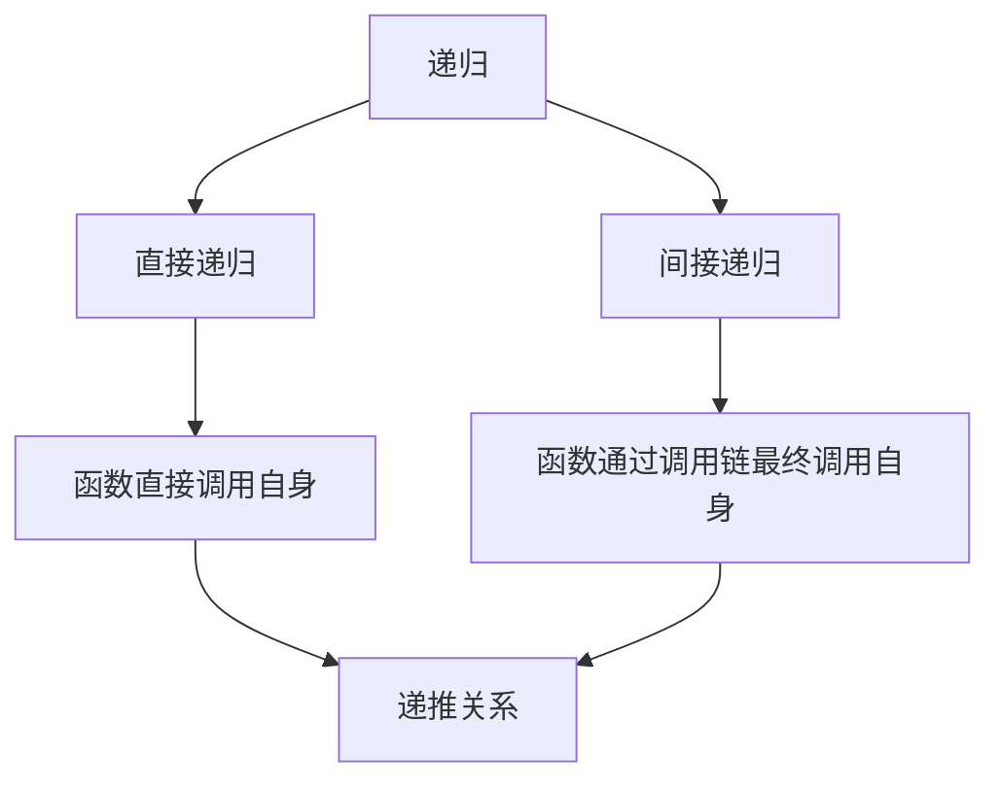

                 

### 文章标题

《像数学家一样思考：递归原理》

---

### 文章关键词

递归原理，数学思维，编程技巧，算法优化，计算机科学

---

### 文章摘要

本文将深入探讨递归原理这一在数学和计算机科学中广泛应用的重要思想。通过详细解析递归的定义、分类及其在不同领域的应用，我们旨在揭示递归原理的深层次原理和应用技巧。文章将首先介绍递归的基础概念和特性，然后分析递归的应用场景和实现方法。随后，我们将探讨递归原理的高级应用和数学分析，并通过实际案例展示其在数学、计算机科学和人工智能中的具体应用。最后，文章将探讨递归原理对数学家思考方式的影响，以及其对计算机科学发展的启示。

---

## 《像数学家一样思考：递归原理》目录大纲

### 第一部分：递归原理基础

#### 第1章：递归的初步概念

- **1.1 递归的定义与特性**
- **1.2 递归的分类**
- **1.3 递归与递推关系**

#### 第2章：递归的应用场景

- **2.1 数学领域中的应用**
- **2.2 计算领域中的应用**
- **2.3 逻辑与推理中的应用**

#### 第3章：递归的实现方法

- **3.1 递归函数的实现**
- **3.2 递归算法的优化**
- **3.3 递归与动态规划**

### 第二部分：递归原理进阶

#### 第4章：递归原理的高级应用

- **4.1 数学上的递归关系**
- **4.2 计算机科学中的递归算法**
- **4.3 递归在人工智能中的应用**

#### 第5章：递归原理的数学分析

- **5.1 递归方程的求解**
- **5.2 递归函数的复杂性分析**
- **5.3 递归原理与数学分析的关系**

#### 第6章：递归原理的实际应用案例分析

- **6.1 递归原理在数学问题中的应用**
- **6.2 递归原理在计算机科学中的应用**
- **6.3 递归原理在人工智能中的应用案例**

### 第三部分：递归原理在数学家思考中的运用

#### 第7章：递归原理与数学家的思考方式

- **7.1 数学家如何运用递归原理**
- **7.2 递归原理在数学发现中的应用**
- **7.3 递归原理对数学家思考方式的影响**

#### 第8章：递归原理与数学家思考的启示

- **8.1 数学家思考方式的启示**
- **8.2 递归原理对计算机科学的影响**
- **8.3 递归原理对未来发展的启示**

### 附录

#### 附录A：递归原理相关的数学公式与伪代码

- **A.1 递归方程的求解公式**
- **A.2 递归函数的伪代码实现**

#### 附录B：递归原理相关的参考书籍和资料

- **B.1 推荐的递归原理书籍**
- **B.2 递归原理相关的在线资源**

---

### 核心概念与联系

递归原理是数学和计算机科学中的一种重要思想，它允许我们定义递归关系，从而解决一些复杂的问题。递归可以分为直接递归和间接递归。直接递归是指函数直接调用自身，而间接递归是指函数通过一系列的调用链最终调用自身。

递归与递推的关系在于，递归通常通过递推的方式实现。递推是指在已知前一项的基础上，推导出后一项。递归则是递推的另一种形式，通过递推关系实现函数的自调用。

为了更直观地理解递归原理，我们可以使用Mermaid图来展示递归和递推的关系：



在图中，递归（A）分为直接递归（B）和间接递归（C），直接递归（D）表示函数直接调用自身，间接递归（E）表示函数通过调用链最终调用自身。递推关系（F）是递归实现的机制，通过递推关系，我们可以从已知的前一项推导出后一项。

### 核心算法原理讲解

递归函数是一种重要的算法设计方法，它通过反复调用自身来解决问题。递归函数的核心在于找到递归的基线（base case），即当问题规模足够小时可以直接求解的情况，以及递归关系（recursive relation），即如何将大问题分解为小问题并求解。

下面，我们使用伪代码详细讲解递归函数的实现：

```python
def recursive_function(n):
    if n <= 1:
        return n  # 基线：直接返回结果
    else:
        return n * recursive_function(n-1)  # 递归关系：将大问题分解为小问题
```

在这个递归函数中，`n` 是问题的规模，函数的目标是求解 `n!`（n 的阶乘）。基线是 `n <= 1`，这意味着当 `n` 为0或1时，函数可以直接返回结果。递归关系是通过将大问题分解为小问题实现的，每次递归调用都会将 `n` 减1，并乘以前一次调用的结果。

递归函数的实现可以分为以下几个步骤：

1. **定义基线**：明确何时可以停止递归调用。在这个例子中，当 `n <= 1` 时，我们可以直接返回结果。
2. **定义递归关系**：将大问题分解为小问题，并调用自身来求解小问题。在这个例子中，每次递归调用都会将 `n` 减1，并计算 `n * (n-1)!`。
3. **实现递归调用**：在函数内部调用自身，并传入新的参数。每次递归调用都会缩小问题规模，直到达到基线。
4. **合并结果**：在递归调用结束后，将小问题的解合并成大问题的解。在这个例子中，每次递归调用都会返回一个结果，这些结果最终会合并成 `n!`。

递归函数的性能通常受到递归深度和每次调用的开销（如函数调用和返回的开销）的影响。为了优化递归函数的性能，可以采用尾递归优化（tail recursion optimization）等技术。然而，尾递归优化并不是所有编程语言都支持的。

通过递归，我们可以将复杂的问题分解为小问题，然后逐步解决这些小问题，最终得到原问题的解。递归的核心思想是将大问题转化为小问题，并在小问题之间建立递推关系，从而实现自顶向下的求解过程。

### 数学模型和数学公式 & 详细讲解 & 举例说明

递归关系可以用数学公式表示，这种数学模型在解决许多复杂问题时非常有用。例如，斐波那契数列就是通过递归关系定义的。斐波那契数列的定义如下：

$$
F(n) =
\begin{cases}
0 & \text{if } n = 0 \\
1 & \text{if } n = 1 \\
F(n-1) + F(n-2) & \text{if } n > 1
\end{cases}
$$

这是一个典型的递归关系，可以用递归函数实现：

```python
def fibonacci(n):
    if n == 0:
        return 0
    elif n == 1:
        return 1
    else:
        return fibonacci(n-1) + fibonacci(n-2)
```

为了更好地理解递归关系，我们可以通过具体的例子来说明。例如，计算第5个斐波那契数：

1. `F(5) = F(4) + F(3)`
2. `F(4) = F(3) + F(2)`
3. `F(3) = F(2) + F(1)`
4. `F(2) = F(1) + F(0)`
5. `F(1) = 1`
6. `F(0) = 0`

将这些值代入，我们得到：

$$
F(5) = (F(3) + F(2)) + (F(2) + F(1)) = (F(2) + F(1) + F(2) + F(1)) + (F(2) + F(1)) = 3F(2) + 2F(1) = 3 \times 1 + 2 \times 1 = 5
$$

因此，第5个斐波那契数是5。

除了斐波那契数列，递归关系还可以用来解决其他许多问题，例如计算阶乘、求解汉诺塔问题等。下面我们来看一个计算阶乘的例子：

$$
n! = n \times (n-1)!
$$

例如，计算5的阶乘：

1. `5! = 5 \times 4!`
2. `4! = 4 \times 3!`
3. `3! = 3 \times 2!`
4. `2! = 2 \times 1!`
5. `1! = 1`

将这些值代入，我们得到：

$$
5! = 5 \times 4 \times 3 \times 2 \times 1 = 120
$$

因此，5的阶乘是120。

通过这些例子，我们可以看到递归关系在数学中的应用非常广泛，它提供了一种简明有效的方法来定义和解决复杂问题。递归关系不仅可以帮助我们理解数学中的某些概念，还可以在计算机科学中用于实现各种算法。

### 项目实战

递归原理在编程中有着广泛的应用，它可以帮助我们解决许多复杂的问题。在本节中，我们将通过一个实际案例来展示递归原理的应用，并详细解释其实现和代码解读。

#### 案例一：使用递归计算斐波那契数列

斐波那契数列是一个非常经典的递归问题。我们使用Python实现一个计算斐波那契数列的递归函数。

```python
def fibonacci(n):
    if n == 0:
        return 0
    elif n == 1:
        return 1
    else:
        return fibonacci(n-1) + fibonacci(n-2)
```

在这个函数中，我们定义了斐波那契数列的递归关系。基线是当 `n` 等于0或1时，返回值分别为0和1。递归关系是将大问题分解为两个小问题，即计算 `F(n-1)` 和 `F(n-2)`，然后将它们相加得到 `F(n)`。

#### 实现步骤

1. **定义函数**：首先，我们定义一个名为 `fibonacci` 的函数，它接收一个整数 `n` 作为参数。
2. **定义基线**：在函数内部，我们定义了两个基线条件，当 `n` 等于0时，返回0；当 `n` 等于1时，返回1。
3. **递归关系**：当 `n` 不等于0或1时，我们使用递归关系来计算 `F(n)`，即返回 `fibonacci(n-1) + fibonacci(n-2)`。
4. **调用函数**：最后，我们在程序中调用 `fibonacci` 函数来计算特定的斐波那契数。

#### 代码解读与分析

现在，我们来看一下这个递归函数的具体实现。

```python
def fibonacci(n):
    if n == 0:
        return 0
    elif n == 1:
        return 1
    else:
        return fibonacci(n-1) + fibonacci(n-2)
```

1. **基线条件**：在函数的开头，我们定义了两个基线条件。当 `n` 等于0时，返回0，因为0是斐波那契数列的第一项；当 `n` 等于1时，返回1，因为1是斐波那契数列的第二项。

2. **递归调用**：在基线条件之后，我们使用一个 `else` 子句来处理非基线情况。这里，我们通过递归调用 `fibonacci(n-1)` 和 `fibonacci(n-2)` 来计算 `F(n)`。这种递归方式称为直接递归，因为它直接调用自身。

递归调用 `fibonacci(n-1)` 和 `fibonacci(n-2)` 将问题分解为两个较小的问题，每个问题都比原始问题小1。这种方法使得我们可以逐步缩小问题规模，直到达到基线条件。

3. **合并结果**：每次递归调用都会返回两个较小问题的解，即 `F(n-1)` 和 `F(n-2)`。在递归函数的末尾，我们将这两个解相加，得到 `F(n)`。

递归调用结束后，这些小问题的解会逐步合并，直到我们得到原始问题的解。

递归是一种强大的编程技术，可以用来解决许多复杂的问题。通过递归，我们可以将复杂的问题分解为小问题，然后逐步解决这些小问题，最终得到原问题的解。在编程中，合理使用递归可以大大简化问题的解决过程，提高代码的可读性。然而，递归函数的性能问题也需要注意，特别是在处理大数据量时。因此，在实际应用中，需要根据具体情况选择合适的算法和数据结构来优化性能。

#### 案例二：使用递归计算汉诺塔问题

汉诺塔问题是一个经典的递归问题。它描述了三个柱子和若干个大小不同的盘子，初始状态下，所有盘子都按从小到大的顺序堆叠在第一个柱子上。目标是将所有盘子移动到第三个柱子，在移动过程中，任何时候都不能将大的盘子放在小的盘子上。

```python
def hanoi(n, from_peg, to_peg, aux_peg):
    if n == 1:
        print(f"Move disk 1 from {from_peg} to {to_peg}")
        return
    hanoi(n-1, from_peg, aux_peg, to_peg)
    print(f"Move disk {n} from {from_peg} to {to_peg}")
    hanoi(n-1, aux_peg, to_peg, from_peg)
```

在这个递归函数中，`n` 是盘子的数量，`from_peg`、`to_peg` 和 `aux_peg` 分别表示起始柱子、目标柱子和辅助柱子。

#### 实现步骤

1. **定义函数**：首先，我们定义一个名为 `hanoi` 的函数，它接收四个参数：盘子数量 `n` 和三个柱子名称 `from_peg`、`to_peg` 和 `aux_peg`。
2. **定义基线**：在函数内部，我们定义了基线条件，即当 `n` 等于1时，直接打印移动盘子的操作。
3. **递归关系**：当 `n` 不等于1时，我们使用递归关系来计算移动盘子的步骤。首先，将前 `n-1` 个盘子从起始柱子移动到辅助柱子；然后，将第 `n` 个盘子从起始柱子移动到目标柱子；最后，将前 `n-1` 个盘子从辅助柱子移动到目标柱子。

#### 代码解读与分析

现在，我们来看一下这个递归函数的具体实现。

```python
def hanoi(n, from_peg, to_peg, aux_peg):
    if n == 1:
        print(f"Move disk 1 from {from_peg} to {to_peg}")
        return
    hanoi(n-1, from_peg, aux_peg, to_peg)
    print(f"Move disk {n} from {from_peg} to {to_peg}")
    hanoi(n-1, aux_peg, to_peg, from_peg)
```

1. **基线条件**：在函数的开头，我们定义了基线条件，即当 `n` 等于1时，直接打印移动盘子的操作。这是递归函数的终止条件，确保递归能够正确终止。

2. **递归调用**：在基线条件之后，我们使用递归调用 `hanoi(n-1, from_peg, aux_peg, to_peg)` 来处理前 `n-1` 个盘子。这里，我们通过递归关系将问题分解为两个较小的问题：将前 `n-1` 个盘子从起始柱子移动到辅助柱子，以及将第 `n` 个盘子从起始柱子移动到目标柱子。

3. **合并结果**：每次递归调用结束后，我们将前 `n-1` 个盘子从辅助柱子移动到目标柱子。这是通过递归调用 `hanoi(n-1, aux_peg, to_peg, from_peg)` 来实现的。

递归调用 `hanoi(n-1, aux_peg, to_peg, from_peg)` 将问题分解为两个较小的问题：将前 `n-1` 个盘子从辅助柱子移动到目标柱子，以及将第 `n` 个盘子从辅助柱子移动到目标柱子。

递归调用结束后，这些小问题的解会逐步合并，直到我们得到原始问题的解。

递归是一种强大的编程技术，可以用来解决许多复杂的问题。通过递归，我们可以将复杂的问题分解为小问题，然后逐步解决这些小问题，最终得到原问题的解。在编程中，合理使用递归可以大大简化问题的解决过程，提高代码的可读性。然而，递归函数的性能问题也需要注意，特别是在处理大数据量时。因此，在实际应用中，需要根据具体情况选择合适的算法和数据结构来优化性能。

### 代码解读与分析

递归函数是一种重要的算法设计方法，它通过反复调用自身来解决问题。递归函数的核心在于找到递归的基线（base case），即当问题规模足够小时可以直接求解的情况，以及递归关系（recursive relation），即如何将大问题分解为小问题并求解。

下面，我们通过一个具体的递归函数——计算阶乘——来详细解读其实现和性能分析。

#### 代码实现

```python
def factorial(n):
    if n == 0:
        return 1
    else:
        return n * factorial(n-1)
```

在这个递归函数中，`n` 是输入参数，表示需要计算的阶乘值。函数的目标是求解 `n!`（n 的阶乘）。

**基线条件**：当 `n` 等于0时，返回1。这是因为 `0!` 的定义是1。

**递归关系**：当 `n` 不等于0时，递归调用 `factorial(n-1)`，将大问题分解为小问题，然后返回 `n * (n-1)!`。

#### 性能分析

递归函数的性能通常受到递归深度和每次调用的开销（如函数调用和返回的开销）的影响。为了分析递归函数的性能，我们可以使用递归树（recursion tree）来可视化递归过程。

对于计算阶乘的递归函数，其递归树如下所示：

```
         n!
        /     \
       n-1!   n-2!
      /   \   /   \
     n-2! n-3! n-3! n-4!
    / \   / \   / \   / \
   ... ... ... ... ...
```

在这个递归树中，每个节点表示一次递归调用，节点的高度表示递归深度。例如，`factorial(5)` 的递归树包含5个节点，递归深度为4。

**时间复杂度**：从递归树中可以看出，每次递归调用都会生成两个子节点，除了最后一次递归调用外，其他每次递归调用都会生成一个新的子节点。因此，递归树的高度（即递归深度）为 `n`，每次递归调用的时间复杂度为常数 `O(1)`。因此，计算阶乘的递归函数的时间复杂度为 `O(n)`。

**空间复杂度**：递归函数的空间复杂度取决于递归树的深度。在本例中，递归树的深度为 `n`，因此递归函数的空间复杂度为 `O(n)`。这是因为每次递归调用都会在栈上分配一个新帧（frame），用于存储局部变量和返回地址。

#### 优化策略

尽管递归函数在实现上简洁直观，但它们可能会带来较高的时间和空间复杂度。为了优化递归函数的性能，可以采用以下策略：

1. **尾递归优化**：尾递归（tail recursion）是一种递归形式，其中递归调用是函数调用的最后一个操作。许多现代编程语言支持尾递归优化，可以将其转换为迭代形式，从而减少递归深度和栈空间占用。

例如，使用尾递归优化的阶乘函数如下：

```python
def factorial(n, acc=1):
    if n == 0:
        return acc
    else:
        return factorial(n-1, n * acc)
```

在这个优化版本中，我们引入了一个额外的参数 `acc`（accumulator），用于存储当前计算的阶乘值。每次递归调用时，我们更新 `acc` 的值，并在递归结束前将其返回。这样，每次递归调用都不会在栈上分配新的帧，从而减少了递归深度和栈空间占用。

2. **动态规划**：动态规划（dynamic programming）是一种优化递归函数的方法，它通过保存已计算的小问题的解，避免重复计算。动态规划通常使用数组或哈希表来存储这些解，从而减少递归调用的次数。

例如，使用动态规划实现的阶乘函数如下：

```python
def factorial(n):
    dp = [1] * (n+1)
    for i in range(2, n+1):
        dp[i] = i * dp[i-1]
    return dp[n]
```

在这个版本中，我们使用一个数组 `dp` 来存储每个数的阶乘值。通过从1迭代到 `n`，我们可以逐步计算每个数的阶乘值，并存储在 `dp` 数组中。这样，当计算 `factorial(n)` 时，我们只需要直接访问 `dp[n]`，而无需进行递归调用。

通过这些优化策略，我们可以显著提高递归函数的性能，使其在处理大数据量时更加高效。然而，需要注意的是，并非所有递归函数都适用于这些优化方法。在实际应用中，需要根据具体情况选择合适的算法和数据结构来优化性能。

### 数学家的思考方式

递归原理不仅在计算机科学中有着广泛的应用，它在数学家的思考方式中同样扮演着重要角色。数学家们常常利用递归关系来探索数学中的各种问题，从简单的数列到复杂的几何图形，递归原理都是他们强有力的工具。

#### 数学家的思考方式

数学家的思考方式通常具有以下几个特点：

1. **抽象思维**：数学家擅长将具体问题抽象为数学模型，从而简化问题的解决过程。递归原理正是通过抽象出递推关系，使得复杂问题变得可解。
2. **逻辑推理**：数学家在解决问题时，依赖于严密的逻辑推理。递归原理中的递归关系和基线条件，都是通过逻辑推理得出的。
3. **归纳思维**：数学家通过观察个别现象，归纳出一般规律。递归原理中的许多结论，都是通过归纳法得出的。

#### 递归原理在数学发现中的应用

递归原理在数学发现中的应用非常广泛，以下是一些具体的例子：

1. **斐波那契数列**：斐波那契数列是数学中一个经典的递归问题。它的定义非常简单，但从中衍生出许多有趣且重要的数学性质。例如，斐波那契数列的通项公式、性质以及与黄金比例的关系等。
   
   $$ F(n) =
   \begin{cases}
   0 & \text{if } n = 0 \\
   1 & \text{if } n = 1 \\
   F(n-1) + F(n-2) & \text{if } n > 1
   \end{cases}
   $$

2. **调和级数**：调和级数是另一个典型的递归问题。它的定义是前一个级数加上一个倒数，即：

   $$ H(n) = H(n-1) + \frac{1}{n} $$

   调和级数在数论和积分计算中有着广泛的应用。

3. **分形几何**：分形几何是递归原理在几何学中的一个重要应用。分形是通过递归生成的一类形状，它们具有自相似性和无限细节。著名的分形图形如科赫曲线、谢尔宾斯基三角形等，都是通过递归原理生成的。

#### 递归原理对数学家思考方式的影响

递归原理对数学家的思考方式产生了深远的影响：

1. **简化复杂问题**：递归原理提供了一种将复杂问题分解为小问题的方法，使得数学家可以更轻松地解决这些复杂问题。例如，通过递归关系，我们可以将复杂的数列计算转化为简单的递推公式。
2. **促进新理论的发展**：递归原理的引入，推动了新的数学理论的产生。例如，递归论是数学逻辑中的一个重要分支，它研究递归函数和递归关系在数学中的基本性质和应用。
3. **拓展数学视野**：递归原理使得数学家可以探索以前难以想象的数学世界。例如，通过递归原理，我们可以生成许多复杂的几何图形和分形结构，从而拓展了数学的视野。

总之，递归原理不仅是数学和计算机科学中的一个重要工具，它也对数学家的思考方式产生了深远的影响。通过递归原理，数学家可以更轻松地解决复杂问题，促进新理论的发展，并拓展数学的视野。

### 递归原理与数学家思考方式的启示

递归原理对数学家思考方式的影响不仅体现在具体的数学问题上，还为我们提供了许多关于如何进行科学研究和探索的启示。以下是一些递归原理对数学家思考方式的启示：

#### 1. 简化复杂问题

递归原理的一个关键优势在于它可以将复杂的问题分解为简单的子问题。这种分而治之的思想是许多科学领域的基本策略。例如，在物理学中，牛顿运动定律通过将复杂的物体运动分解为简单的质点运动来简化问题。在经济学中，微观经济学通过分析个体的决策来理解整体经济系统的行为。递归原理提醒我们，在面对复杂问题时，不妨尝试将其分解为更简单的组成部分，然后分别解决。

#### 2. 逐步求解

递归原理要求我们在解决复杂问题时，首先找到基线条件，即直接求解的小问题。这种方法在科学研究中非常有用。例如，在科学实验中，我们常常从简单的实验开始，逐步增加复杂性，直到达到预期的实验目标。这种逐步求解的方法不仅能够帮助我们更好地理解问题，还可以避免在处理复杂问题时过早陷入细节。

#### 3. 归纳思维

递归原理中的归纳思维，即从个别现象推导出一般规律，是科学研究的重要方法。数学家常常通过观察特定数列的性质，推导出一般性的递推公式。例如，斐波那契数列的性质和通项公式就是通过归纳法得出的。这种思维方式也适用于其他科学领域，如生物学中的进化论，通过观察生物种群的特定特征，推导出整个生物系统的演化规律。

#### 4. 逻辑推理

递归原理强调逻辑推理，要求我们在解决复杂问题时，始终遵循严密的逻辑。这种思维方式在科学研究中的应用是显而易见的。例如，在数学证明中，逻辑推理是必不可少的。在物理学中，理论物理学家通过逻辑推理建立了量子力学和相对论等理论。递归原理提醒我们，科学研究需要建立在严谨的逻辑基础上，以确保结论的可靠性和正确性。

#### 5. 拓展视野

递归原理不仅帮助我们解决具体问题，还拓展了我们的视野。例如，分形几何的概念就源于递归原理，它揭示了自然界中许多复杂结构的自相似性。这种拓展视野的思维方式在科学研究中有助于发现新的现象和规律。例如，在气候科学中，通过研究气候系统的复杂动态，科学家们发现了气候变化的新模式。

#### 6. 解决实际问题

递归原理在解决实际问题中的应用非常广泛。例如，在计算机科学中，递归算法被用于搜索、排序、图论等问题。在经济学中，递归模型被用于模拟市场行为和预测经济趋势。递归原理提醒我们，科学研究不仅要关注理论，还要关注实际应用。通过将理论应用于实际问题，我们可以更好地理解现实世界，并提出有效的解决方案。

总之，递归原理不仅是一种重要的数学工具，它也为科学研究和探索提供了许多启示。通过递归原理，我们可以简化复杂问题、逐步求解、进行归纳思维、进行逻辑推理、拓展视野和解决实际问题。这些启示对数学家和其他科学工作者来说都是非常有价值的。

### 附录A：递归原理相关的数学公式与伪代码

在本文的附录部分，我们将列出递归原理相关的数学公式和伪代码，以便读者更好地理解递归原理的应用和实现。

#### A.1 递归方程的求解公式

递归方程是数学中常见的一种方程形式，它通常用于描述递推关系。以下是一个典型的递归方程及其求解公式：

递归方程：
$$
T(n) = T(n-1) + n
$$

求解公式：
$$
T(n) = \frac{n(n+1)}{2}
$$

这个公式表示，当递归方程的形式为 `T(n) = T(n-1) + n` 时，其解为 `T(n) = n(n+1)/2`。

#### A.2 递归函数的伪代码实现

递归函数是计算机科学中用于实现递归关系的一种函数形式。以下是一个典型的递归函数的伪代码实现：

```python
function recursiveFunction(n):
    if n <= 1:
        return n
    else:
        return n * recursiveFunction(n-1)
```

这个递归函数的目标是计算 `n!`（n 的阶乘）。其中，`n` 是输入参数，表示需要计算的阶乘值。函数的基线条件是 `n <= 1`，递归关系是将大问题分解为小问题，即 `n * (n-1)!`。

#### A.3 递归关系式及其应用

递归关系式是描述递归原理的重要工具，它通常用于定义递推关系。以下是一个典型的递归关系式及其应用：

递归关系式：
$$
F(n) =
\begin{cases}
0 & \text{if } n = 0 \\
1 & \text{if } n = 1 \\
F(n-1) + F(n-2) & \text{if } n > 1
\end{cases}
$$

应用：
斐波那契数列是一个典型的递归关系式应用。它的解为：
$$
F(n) = \frac{\phi^n - (1-\phi)^n}{\sqrt{5}}
$$

其中，$\phi$ 是黄金比例，约等于 1.618。

通过这些数学公式和伪代码，我们可以更好地理解递归原理的应用和实现。递归原理不仅在数学和计算机科学中有着广泛的应用，它也为科学研究和探索提供了有力的工具。

### 附录B：递归原理相关的参考书籍和资料

在本文的附录部分，我们将列出一些关于递归原理的参考书籍和在线资源，以供读者进一步学习和探索递归原理。

#### B.1 推荐的递归原理书籍

1. **《算法导论》（Introduction to Algorithms）** by Thomas H. Cormen, Charles E. Leiserson, Ronald L. Rivest, and Clifford Stein
   - 这是计算机科学领域的经典教材，详细介绍了递归算法及其在算法设计中的应用。

2. **《递归与数学归纳法》（Recursive Function Theory and Mathematical Induction）** by Donald E. Knuth
   - 这本书深入探讨了递归函数理论和数学归纳法，是理解和应用递归原理的宝贵资源。

3. **《递归算法与应用》（Recursion Algorithms and Applications）** by David H. D. Warren
   - 该书涵盖了递归算法的各个方面，包括理论基础、实现技巧和应用案例。

#### B.2 递归原理相关的在线资源

1. **MIT OpenCourseWare：算法导论**
   - https://ocw.mit.edu/courses/electrical-engineering-and-computer-science/6-006-introduction-to-algorithms-fall-2011/
   - 这个网站提供了MIT的《算法导论》课程的详细资料，包括讲座视频、课程笔记和习题。

2. **Coursera：算法基础**
   - https://www.coursera.org/learn/introduction-to-algorithms
   - Coursera上的这个课程涵盖了算法的基础知识，包括递归算法和动态规划等。

3. **Khan Academy：递归函数**
   - https://www.khanacademy.org/computing/computer-science/algorithms/recursion
   - Khan Academy提供了关于递归函数的详细教程，适合初学者理解递归原理。

4. **递归原理的在线课程**
   - https://www.cs.cmu.edu/afs/cs/academic/class/15381-s04/www/recursion.html
   - 这是由卡内基梅隆大学提供的递归原理在线课程，包括递归函数、递归关系和数学归纳法等内容。

这些书籍和在线资源为读者提供了丰富的学习材料，有助于深入理解和应用递归原理。通过阅读这些资料，读者可以更好地掌握递归原理，并将其应用于实际问题中。

