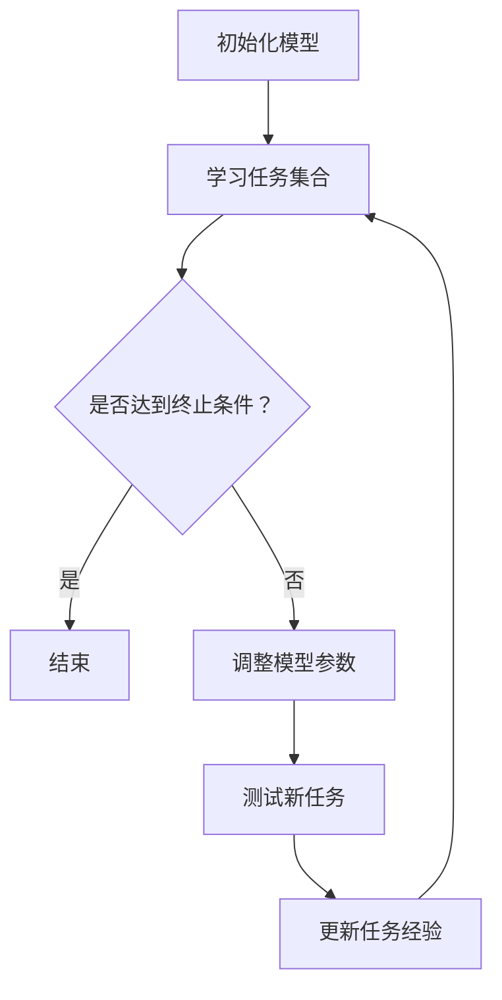
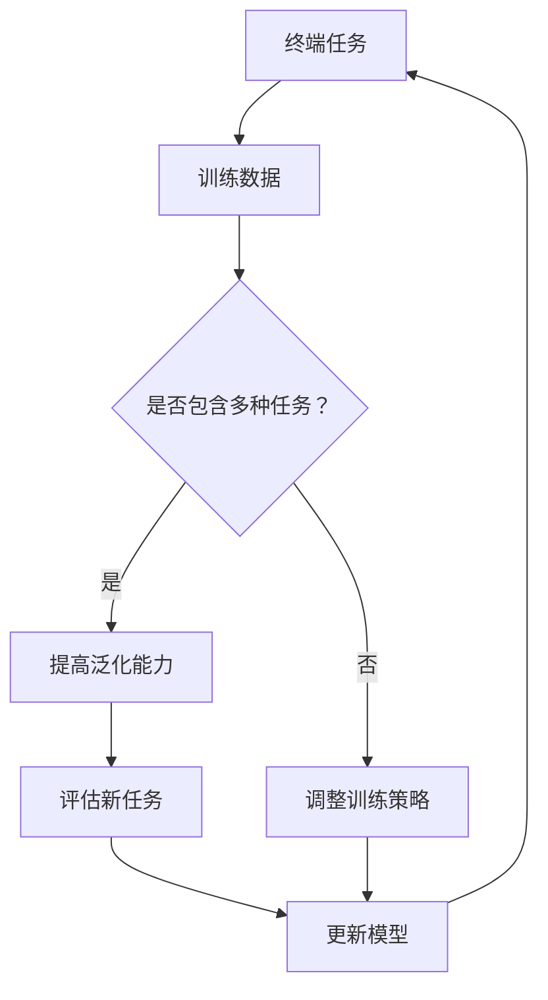
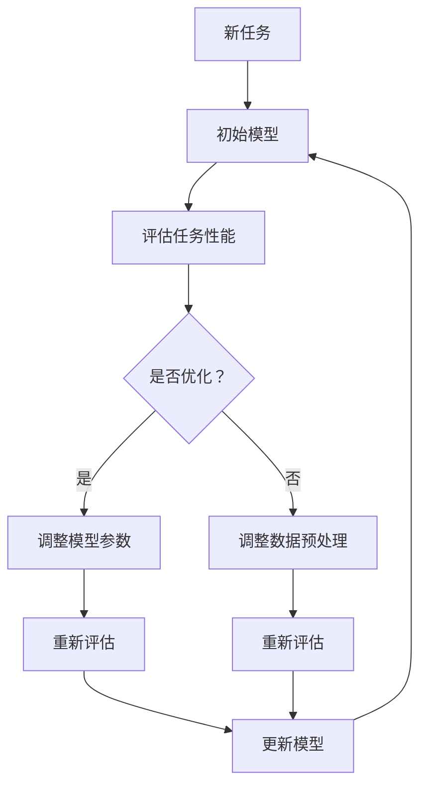
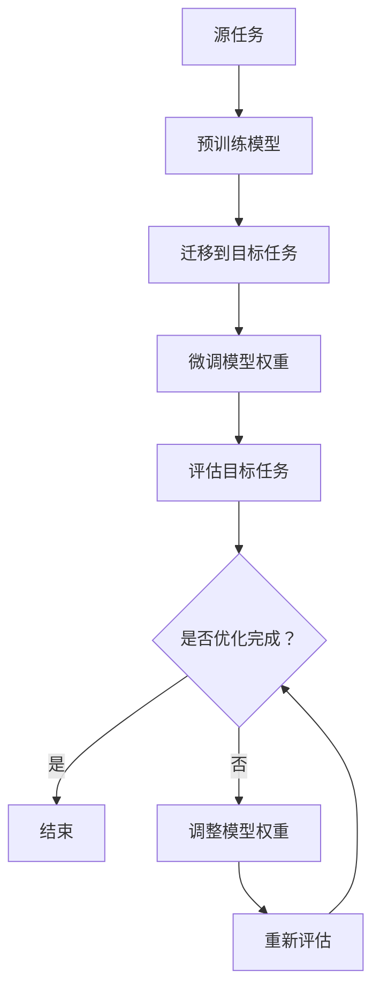

                 

### 文章标题

《元学习 原理与代码实例讲解》

关键词：元学习、模型聚合、梯度反转、对抗性学习、神经网络架构搜索（NAS）

摘要：本文将深入探讨元学习的原理与方法，通过代码实例详细讲解监督元学习、无监督元学习、半监督元学习、强化学习元学习等核心算法，同时介绍基于模型聚合、梯度反转和对抗性学习的元学习方法。文章最后通过神经架构搜索（NAS）的实例，展示神经网络在元学习中的应用。文章旨在为读者提供全面而系统的元学习理论知识和实际应用指导。

---

### 《元学习 原理与代码实例讲解》目录大纲

## 第一部分：元学习基本概念与理论

### 第1章：元学习的定义与背景

- 1.1 元学习的概念与基本原理
- 1.2 元学习与传统机器学习的异同
- 1.3 元学习的应用领域与前景

### 第2章：元学习的关键概念

- 2.1 终端任务与泛化能力
- 2.2 任务适应性
- 2.3 任务迁移与迁移学习

### 第3章：元学习的主要方法

- 3.1 监督元学习
- 3.2 无监督元学习
- 3.3 半监督元学习
- 3.4 强化学习元学习

## 第二部分：元学习算法原理与实现

### 第4章：基于模型聚合的元学习

- 4.1 模型聚合的概念与机制
- 4.2 模型聚合算法：模型选择与模型融合
- 4.3 代码实例：模型聚合在图像分类中的应用

### 第5章：基于梯度的元学习

- 5.1 梯度提升算法
- 5.2 梯度反转算法
- 5.3 代码实例：梯度反转在强化学习中的应用

### 第6章：基于对抗的元学习

- 6.1 对抗性学习的基本原理
- 6.2 对抗性元学习算法：自然进化算法与遗传算法
- 6.3 代码实例：对抗性元学习在游戏AI中的应用

### 第7章：基于神经网络的元学习

- 7.1 神经网络在元学习中的应用
- 7.2 神经架构搜索（NAS）的基本原理
- 7.3 代码实例：NAS在图像识别中的应用

### 第8章：元学习的优化策略

- 8.1 搜索空间优化
- 8.2 模型优化与正则化
- 8.3 代码实例：基于优化策略的元学习模型训练

### 第9章：元学习的评估与验证

- 9.1 元学习性能评估指标
- 9.2 评估方法与实验设计
- 9.3 代码实例：元学习模型性能评估与验证

## 第三部分：元学习项目实战与应用

### 第10章：元学习在实际应用中的挑战与解决方案

- 10.1 元学习在自动驾驶中的应用
- 10.2 元学习在医疗诊断中的应用
- 10.3 元学习在自然语言处理中的应用

### 第11章：元学习项目实战

- 11.1 项目背景与需求分析
- 11.2 项目技术方案与设计
- 11.3 代码实现与测试
- 11.4 项目总结与反思

### 第12章：元学习的发展趋势与未来方向

- 12.1 元学习的研究进展
- 12.2 元学习在行业中的应用前景
- 12.3 元学习的未来发展趋势与挑战

---

接下来，我们将逐步展开对元学习的深入讲解，从基本概念到具体算法，再到实际应用，全面剖析元学习的原理与实践。

---

## 第1章：元学习的定义与背景

### 1.1 元学习的概念与基本原理

元学习（Meta-Learning），又称“学习的学习”，是机器学习中的一个重要分支，主要关注如何让机器快速、有效地从数据中学习，并在新的任务上迅速适应。与传统的机器学习方法不同，元学习侧重于学习一个能够快速泛化的学习策略，而不是直接在特定任务上取得最佳性能。

**基本原理**

元学习的基本原理可以概括为以下三点：

1. **快速泛化能力**：元学习旨在通过学习一系列任务，提炼出一个通用的学习策略，从而在新的任务上实现快速泛化。这一过程通常涉及任务自适应性和知识迁移。

2. **任务自适应**：元学习方法能够在新的任务上自动调整其学习策略，以最大化性能。这种自适应能力是元学习与传统机器学习的显著区别。

3. **模型优化**：元学习通过优化学习策略的参数，实现对学习过程的精细调控，从而提高模型在新任务上的表现。

**定义**

元学习可以定义为一种学习范式，其中机器首先学习一系列相关任务，然后利用这些经验来解决新的、未见过的问题。其核心目标是通过少量示例快速掌握新任务，减少对新数据的依赖。

**Mermaid 流程图**



在上面的流程图中，模型首先通过一系列任务（A -> B）进行学习，然后测试新任务（F），并根据测试结果（G）调整模型参数，重复这一过程，直至达到终止条件（C）。

### 1.2 元学习与传统机器学习的异同

**相同点**

- 两者都是基于数据驱动的学习过程，旨在提高模型的预测能力和泛化能力。

**不同点**

1. **目标不同**：传统机器学习侧重于在特定任务上取得最佳性能，而元学习则强调通过学习一系列任务，提高模型对新任务的快速适应能力。

2. **方法不同**：传统机器学习方法通常依赖于大量标注数据，而元学习则通过迁移学习、模型聚合等方法，在少量数据上实现高效学习。

3. **应用场景不同**：传统机器学习适用于有明确标注数据的场景，而元学习则更适用于数据稀缺、任务多变的环境。

### 1.3 元学习的应用领域与前景

元学习在多个领域显示出巨大的应用潜力：

1. **自动驾驶**：自动驾驶系统需要快速适应不同道路和环境条件，元学习能够帮助汽车在短时间内学会处理复杂的交通状况。

2. **医疗诊断**：医疗数据通常稀缺且标注复杂，元学习有助于从少量数据中提炼出通用的诊断模型，提高诊断准确性。

3. **自然语言处理**：元学习在自然语言处理中应用于语言模型训练，能够通过少量数据快速生成高质量的语言模型。

4. **强化学习**：元学习在强化学习中用于快速调整策略，提高智能体在复杂环境中的适应性。

**前景**

随着人工智能技术的发展，元学习将在更多领域得到应用，其前景广阔。未来，元学习有望成为解决复杂任务、提高模型适应性的一种核心技术。

---

在下一章中，我们将进一步探讨元学习中的关键概念，如终端任务、任务适应性、任务迁移等，并深入分析这些概念在元学习中的作用和重要性。

---

## 第2章：元学习的关键概念

在理解了元学习的基本概念之后，我们需要深入探讨元学习中的关键概念，这些概念是构建高效元学习系统的基础。以下是元学习中的几个关键概念：终端任务与泛化能力、任务适应性、任务迁移与迁移学习。

### 2.1 终端任务与泛化能力

**终端任务（Terminal Task）**

终端任务是指模型需要最终解决的具体任务。在元学习中，终端任务通常涉及不同的数据集和任务类型，例如图像分类、目标检测或文本分类等。终端任务的多样性是元学习研究的一个重要方面，因为元学习系统的目标之一是能够在不同的任务上表现出优异的性能。

**泛化能力（Generalization Ability）**

泛化能力是指模型在未见过的数据上的表现。传统机器学习模型往往在特定任务上表现出色，但在新任务上的性能可能不佳。元学习旨在通过学习一系列相关任务，提高模型在新任务上的泛化能力。这种能力使得元学习系统能够在未知环境中迅速适应，减少了对新数据的依赖。

**关系与重要性**

终端任务和泛化能力是密不可分的。终端任务定义了模型的训练和应用场景，而泛化能力则决定了模型在新的、未知任务上的表现。一个高效的元学习系统需要在各种终端任务上具备强大的泛化能力，以便在实际应用中灵活应对各种情况。

**Mermaid 流程图**



在上面的流程图中，终端任务（A）通过训练数据（B）进行学习，如果训练数据包含多种任务（C），则系统会提高泛化能力（D），在新任务上评估模型（E），并根据评估结果更新模型（F）。如果训练数据不包含多种任务，则系统会调整训练策略（G），以优化模型性能。

### 2.2 任务适应性

**任务适应性（Task Adaptation）**

任务适应性是指模型在新任务上自动调整其学习策略的能力。元学习系统通过学习一系列相关任务，提炼出一个通用的学习策略，从而在新任务上实现快速适应。这种适应性是元学习与传统机器学习的显著区别之一。

**自适应机制**

任务适应性通常涉及以下几种机制：

1. **模型参数调整**：模型在新任务上通过调整参数，以优化其在新数据上的性能。
2. **数据预处理**：对新的数据集进行预处理，以匹配模型的预期输入。
3. **策略更新**：通过策略网络或优化器，动态调整模型的学习策略。

**重要性**

任务适应性使得元学习系统能够在未见过的情况下快速适应新任务，这对于数据稀缺或任务多变的应用场景尤为重要。通过任务适应性，元学习系统能够减少对新数据的依赖，提高模型的鲁棒性和灵活性。

**Mermaid 流程图**



在上面的流程图中，新任务（A）通过初始模型（B）进行评估（C），根据评估结果决定是否进行优化（D）。如果需要优化，则调整模型参数（E），重新评估（F），并更新模型（G）。如果不需要优化，则调整数据预处理（H），重新评估（I），并更新模型（G）。

### 2.3 任务迁移与迁移学习

**任务迁移（Task Transfer）**

任务迁移是指将一个任务上的学习经验应用于另一个任务的过程。在元学习中，任务迁移是提高模型泛化能力和适应性的一种有效手段。

**迁移学习（Transfer Learning）**

迁移学习是任务迁移的一种具体实现方法，其核心思想是将一个在源任务上预训练的模型应用于新的目标任务。通过迁移学习，模型可以利用在源任务上积累的知识，提高在目标任务上的表现。

**迁移学习机制**

1. **模型共享**：在迁移学习中，模型的不同部分（如卷积层、全连接层）可以在不同的任务间共享，从而减少对新数据的依赖。
2. **特征重用**：迁移学习利用源任务的特征提取能力，将其应用于目标任务，从而提高模型在新任务上的性能。
3. **权重迁移**：将源任务的模型权重迁移到目标任务，通过微调权重，优化模型在目标任务上的性能。

**重要性**

任务迁移和迁移学习在数据稀缺、任务多变的环境中尤为重要。通过迁移学习，模型能够利用在源任务上积累的知识，快速适应新任务，提高模型的泛化能力和适应性。

**Mermaid 流程图**



在上面的流程图中，源任务（A）通过预训练模型（B）迁移到目标任务（C），通过微调模型权重（D），评估目标任务（E），并根据评估结果决定是否优化完成（F）。如果需要进一步优化，则调整模型权重（H），重新评估（I），并继续优化（F）。

通过深入探讨终端任务与泛化能力、任务适应性和任务迁移与迁移学习，我们可以更好地理解元学习的核心概念。在接下来的章节中，我们将详细探讨元学习的主要方法，包括监督元学习、无监督元学习、半监督元学习和强化学习元学习。

---

在了解了元学习的关键概念之后，我们将在接下来的章节中深入探讨元学习的主要方法。这些方法包括监督元学习、无监督元学习、半监督元学习和强化学习元学习，每种方法都有其独特的原理和应用场景。我们将逐步分析这些方法，并通过代码实例展示其实际应用。

---

## 第3章：元学习的主要方法

元学习有多种实现方法，每种方法都有其独特的原理和应用场景。本章节将详细介绍以下几种主要方法：

- **监督元学习**
- **无监督元学习**
- **半监督元学习**
- **强化学习元学习**

我们将通过理论讲解和代码实例，帮助读者深入理解这些方法的工作原理。

### 3.1 监督元学习

**定义**

监督元学习（Supervised Meta-Learning）是一种在监督环境下进行元学习的方法，其核心思想是通过学习一系列不同的监督学习任务，提取一个通用的学习策略。监督元学习的目标是在新的任务上快速适应并取得良好的性能。

**原理**

监督元学习的基本原理可以概括为以下几步：

1. **任务学习**：模型首先学习一系列不同的监督学习任务，例如分类或回归。
2. **策略提炼**：模型从这些任务中提取出一个通用的学习策略，例如快速收敛的优化算法。
3. **泛化测试**：模型在新任务上进行泛化测试，评估其泛化能力和适应性。

**代码实例**

以下是一个简单的监督元学习算法的实现，使用Python和PyTorch框架：

```python
import torch
import torch.nn as nn
import torch.optim as optim

# 定义监督元学习模型
class MetaLearner(nn.Module):
    def __init__(self):
        super(MetaLearner, self).__init__()
        self.fc1 = nn.Linear(in_features=784, out_features=128)
        self.fc2 = nn.Linear(in_features=128, out_features=64)
        self.fc3 = nn.Linear(in_features=64, out_features=10)

    def forward(self, x):
        x = torch.relu(self.fc1(x))
        x = torch.relu(self.fc2(x))
        x = self.fc3(x)
        return x

# 初始化模型和优化器
model = MetaLearner()
optimizer = optim.Adam(model.parameters(), lr=0.001)

# 定义损失函数
criterion = nn.CrossEntropyLoss()

# 模型训练过程
for epoch in range(100):
    for task in tasks:
        # 学习任务
        inputs, labels = task
        optimizer.zero_grad()
        outputs = model(inputs)
        loss = criterion(outputs, labels)
        loss.backward()
        optimizer.step()

        # 记录任务性能
        print(f"Epoch {epoch}, Task {task_idx}, Loss: {loss.item()}")

# 泛化测试
test_inputs, test_labels = get_test_data()
with torch.no_grad():
    test_outputs = model(test_inputs)
    test_loss = criterion(test_outputs, test_labels)
print(f"Test Loss: {test_loss.item()}")
```

在上面的代码中，我们首先定义了一个简单的神经网络模型，然后通过一系列不同的任务进行训练。在每个任务上，我们使用交叉熵损失函数进行优化，并记录任务性能。在训练完成后，我们对模型进行泛化测试，评估其在新任务上的性能。

### 3.2 无监督元学习

**定义**

无监督元学习（Unsupervised Meta-Learning）是在无监督环境下进行元学习的方法，其目标是通过学习未标注的数据，提取出一个通用的学习策略。无监督元学习在数据稀缺的情况下尤为重要。

**原理**

无监督元学习的基本原理可以概括为以下几步：

1. **数据预处理**：对无监督学习任务进行预处理，例如数据增强、特征提取等。
2. **策略提炼**：从无监督学习任务中提取出一个通用的学习策略，例如自监督学习算法。
3. **泛化测试**：在新数据集上测试提取出的策略，评估其泛化能力和适应性。

**代码实例**

以下是一个简单的无监督元学习算法的实现，使用Python和PyTorch框架：

```python
import torch
import torch.nn as nn
import torch.optim as optim

# 定义无监督元学习模型
class UnsupervisedMetaLearner(nn.Module):
    def __init__(self):
        super(UnsupervisedMetaLearner, self).__init__()
        self.conv1 = nn.Conv2d(in_channels=1, out_channels=32, kernel_size=3, stride=1, padding=1)
        self.fc1 = nn.Linear(in_features=32 * 28 * 28, out_features=128)
        self.fc2 = nn.Linear(in_features=128, out_features=10)

    def forward(self, x):
        x = torch.relu(self.conv1(x))
        x = torch.relu(self.fc1(x.flatten(start_dim=1)))
        x = self.fc2(x)
        return x

# 初始化模型和优化器
model = UnsupervisedMetaLearner()
optimizer = optim.Adam(model.parameters(), lr=0.001)

# 定义损失函数
criterion = nn.CrossEntropyLoss()

# 模型训练过程
for epoch in range(100):
    for batch in data_loader:
        # 学习数据
        inputs, _ = batch
        optimizer.zero_grad()
        outputs = model(inputs)
        loss = criterion(outputs, labels)
        loss.backward()
        optimizer.step()

        # 记录任务性能
        print(f"Epoch {epoch}, Batch {batch_idx}, Loss: {loss.item()}")

# 泛化测试
test_data_loader = get_test_data_loader()
with torch.no_grad():
    for batch in test_data_loader:
        inputs, _ = batch
        outputs = model(inputs)
        loss = criterion(outputs, labels)
        print(f"Test Loss: {loss.item()}")
```

在上面的代码中，我们定义了一个简单的卷积神经网络模型，用于无监督学习。我们首先对数据进行预处理，然后通过模型训练过程学习数据。在每个批次上，我们使用交叉熵损失函数进行优化，并记录任务性能。在训练完成后，我们对模型进行泛化测试，评估其在新数据集上的性能。

### 3.3 半监督元学习

**定义**

半监督元学习（Semi-Supervised Meta-Learning）是一种结合了监督学习和无监督学习的方法，其目标是通过利用少量标注数据和大量未标注数据，提高模型在新任务上的泛化能力。

**原理**

半监督元学习的基本原理可以概括为以下几步：

1. **标注数据学习**：模型首先使用少量标注数据进行监督学习。
2. **未标注数据学习**：模型接着利用大量未标注数据进行无监督学习。
3. **模型融合**：通过将监督学习和无监督学习的经验进行融合，提高模型在新任务上的性能。

**代码实例**

以下是一个简单的半监督元学习算法的实现，使用Python和PyTorch框架：

```python
import torch
import torch.nn as nn
import torch.optim as optim

# 定义半监督元学习模型
class SemiSupervisedMetaLearner(nn.Module):
    def __init__(self):
        super(SemiSupervisedMetaLearner, self).__init__()
        self.fc1 = nn.Linear(in_features=784, out_features=128)
        self.fc2 = nn.Linear(in_features=128, out_features=64)
        self.fc3 = nn.Linear(in_features=64, out_features=10)

    def forward(self, x):
        x = torch.relu(self.fc1(x))
        x = torch.relu(self.fc2(x))
        x = self.fc3(x)
        return x

# 初始化模型和优化器
model = SemiSupervisedMetaLearner()
optimizer = optim.Adam(model.parameters(), lr=0.001)

# 定义损失函数
criterion = nn.CrossEntropyLoss()

# 模型训练过程
for epoch in range(100):
    for task in tasks:
        # 学习标注数据
        inputs, labels = task
        optimizer.zero_grad()
        outputs = model(inputs)
        loss = criterion(outputs, labels)
        loss.backward()
        optimizer.step()

        # 学习未标注数据
        unlabelled_inputs = get_unlabelled_data()
        optimizer.zero_grad()
        outputs = model(unlabelled_inputs)
        loss = criterion(outputs, labels)
        loss.backward()
        optimizer.step()

        # 记录任务性能
        print(f"Epoch {epoch}, Task {task_idx}, Loss: {loss.item()}")

# 泛化测试
test_inputs, test_labels = get_test_data()
with torch.no_grad():
    test_outputs = model(test_inputs)
    test_loss = criterion(test_outputs, test_labels)
print(f"Test Loss: {test_loss.item()}")
```

在上面的代码中，我们定义了一个简单的神经网络模型，用于半监督学习。我们首先使用少量标注数据进行监督学习，然后使用大量未标注数据进行无监督学习。在每个任务上，我们使用交叉熵损失函数进行优化，并记录任务性能。在训练完成后，我们对模型进行泛化测试，评估其在新任务上的性能。

### 3.4 强化学习元学习

**定义**

强化学习元学习（Reinforcement Learning Meta-Learning）是一种结合了强化学习和元学习的方法，其目标是通过学习一系列强化学习任务，提取出一个通用的学习策略。

**原理**

强化学习元学习的基本原理可以概括为以下几步：

1. **任务学习**：模型首先学习一系列强化学习任务，例如机器人控制或游戏玩
```

