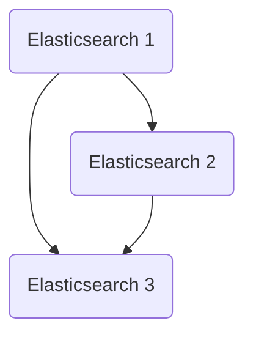
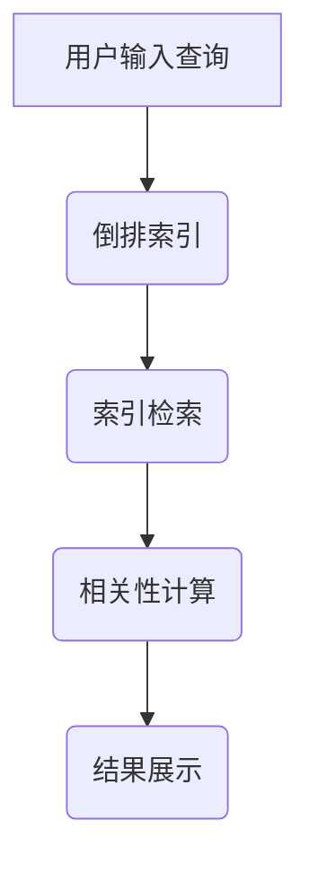

                 

# 全文搜索 原理与代码实例讲解

## 关键词
全文搜索，全文搜索引擎，倒排索引，索引构建，检索算法，中文分词，英文分词，Lucene，Elasticsearch，Solr

## 摘要
全文搜索是一种通过搜索整个文本内容来获取相关信息的技术，广泛应用于搜索引擎、文档管理、信息检索等领域。本文将详细讲解全文搜索的基本原理、架构、文本处理与分词技术、倒排索引与检索算法，并结合实际项目实例，深入探讨全文搜索引擎的实现与应用。

## 第一部分：全文搜索基础理论

### 第1章：全文搜索概述

#### 1.1 全文搜索的概念

全文搜索是一种信息检索技术，通过在大量文本中查找用户输入的关键词或短语，返回与查询最相关的文档。与基于关键词的搜索不同，全文搜索不需要预先定义关键词库，而是直接分析文本内容，实现更灵活的搜索体验。

#### 1.2 全文搜索的应用场景

全文搜索广泛应用于以下场景：

- **搜索引擎**：如百度、谷歌等搜索引擎，通过全文搜索技术实现对网页、新闻、图片等内容的检索。
- **文档管理**：如企业知识库、电子邮件系统、文件管理系统等，通过全文搜索方便用户快速查找相关文档。
- **信息检索**：如图书索引、学术论文检索、社交媒体内容检索等，通过对大规模文本数据进行全文搜索，提高信息获取效率。

#### 1.3 全文搜索与传统搜索的区别

与传统搜索相比，全文搜索具有以下特点：

- **检索范围**：全文搜索覆盖整个文本内容，而传统搜索通常基于关键词或短语进行匹配。
- **检索速度**：全文搜索通过索引技术加速检索过程，而传统搜索需要逐个扫描文本。
- **检索效果**：全文搜索能够根据文本内容的相关性排序结果，提高搜索精度。

### 第2章：全文搜索引擎架构

#### 2.1 全文搜索引擎的组成

全文搜索引擎通常由以下几个核心组件构成：

- **索引器**：负责将文档转换为索引结构，便于快速检索。
- **检索器**：根据用户查询，从索引中检索相关文档。
- **存储系统**：存储索引数据，支持高效的读写操作。

#### 2.2 索引构建流程

全文搜索引擎的索引构建流程主要包括以下几个步骤：

1. **文档预处理**：对原始文档进行格式化、去噪、清洗等处理，确保文本质量。
2. **分词**：将预处理后的文本分割成词语或词组，为后续索引构建做准备。
3. **词频统计**：统计每个词语在文档中的出现次数，为索引构建提供数据支持。
4. **倒排索引构建**：将词语与对应的文档关联起来，形成倒排索引结构，便于快速检索。

#### 2.3 检索过程

全文搜索引擎的检索过程主要包括以下几个步骤：

1. **查询解析**：将用户输入的查询语句转换为内部查询语言。
2. **索引检索**：根据查询语言，在倒排索引中检索相关文档。
3. **相关性计算**：计算文档与查询的相关性得分，进行结果排序。
4. **结果返回**：将排序后的文档列表返回给用户。

### 第3章：文本处理与分词技术

#### 3.1 中文分词技术

中文分词技术是将中文文本分割成词语或词组的过程。常见的中文分词技术包括：

- **最简单分词**：基于字符或词汇的简单分割。
- **基于词典的分词**：利用词典匹配技术进行分词。
- **基于统计的分词**：利用语言模型、隐马尔可夫模型等统计方法进行分词。

#### 3.2 英文分词技术

英文分词技术相对简单，通常采用词法分析的方法，将文本分割成单个单词。

### 第4章：倒排索引与检索算法

#### 4.1 倒排索引的原理

倒排索引是一种将词语与对应文档关联的数据结构，由两个部分组成：

- **词典**：存储所有词语及其倒排列表。
- **倒排列表**：存储每个词语对应的所有文档。

#### 4.2 检索算法

全文搜索引擎的检索算法主要包括：

- **布尔查询算法**：基于布尔运算符（AND、OR、NOT）进行检索。
- **短语检索算法**：查找包含特定短语的文档。
- **近义词检索算法**：查找与给定词语近义的文档。
- **模糊检索算法**：查找与给定词语部分相似的文档。

## 第二部分：全文搜索应用实例

### 第5章：Lucene全文搜索引擎实战

Lucene 是一个开源的全文搜索引擎库，广泛应用于各种应用场景。本节将介绍如何使用 Lucene 构建全文搜索引擎。

#### 5.1 Lucene 入门

**安装与配置**

1. 下载 Lucene 的压缩包，解压到本地。
2. 在项目中引入 Lucene 的依赖库。

**简单的搜索案例**

```java
import org.apache.lucene.analysis.Analyzer;
import org.apache.lucene.analysis.standard.StandardAnalyzer;
import org.apache.lucene.index.DirectoryReader;
import org.apache.lucene.index.IndexReader;
import org.apache.lucene.queryparser.classic.QueryParser;
import org.apache.lucene.search.IndexSearcher;
import org.apache.lucene.search.Query;
import org.apache.lucene.search.ScoreDoc;
import org.apache.lucene.search.TopDocs;
import org.apache.lucene.store.Directory;
import org.apache.lucene.store.RAMDirectory;

public class LuceneDemo {
    public static void main(String[] args) throws Exception {
        // 创建内存索引
        Directory directory = new RAMDirectory();
        Analyzer analyzer = new StandardAnalyzer();
        // 索引构建过程（略）

        // 检索过程
        IndexReader indexReader = DirectoryReader.open(directory);
        IndexSearcher indexSearcher = new IndexSearcher(indexReader);
        QueryParser queryParser = new QueryParser("content", analyzer);
        Query query = queryParser.parse("中国");
        TopDocs topDocs = indexSearcher.search(query, 10);
        ScoreDoc[] scoreDocs = topDocs.scoreDocs;
        for (ScoreDoc scoreDoc : scoreDocs) {
            System.out.println("文档ID: " + scoreDoc.doc + ", 分值: " + scoreDoc.score);
        }
        indexReader.close();
    }
}
```

#### 5.2 索引构建

**索引文档**

```java
import org.apache.lucene.document.Document;
import org.apache.lucene.document.Field;
import org.apache.lucene.index.IndexWriter;
import org.apache.lucene.index.IndexWriterConfig;
import org.apache.lucene.store.Directory;
import org.apache.lucene.store.RAMDirectory;

public class LuceneDemo {
    public static void main(String[] args) throws Exception {
        // 创建内存索引
        Directory directory = new RAMDirectory();
        Analyzer analyzer = new StandardAnalyzer();
        IndexWriterConfig config = new IndexWriterConfig(analyzer);
        IndexWriter indexWriter = new IndexWriter(directory, config);

        // 索引文档
        Document doc = new Document();
        doc.add(new Field("id", "1", Field.Store.YES, Field.Index.NOT_ANALYSED));
        doc.add(new Field("content", "中国是最大的发展中国家", Field.Store.YES, Field.Index.ANALYSED));
        indexWriter.addDocument(doc);

        // 关闭索引器
        indexWriter.close();
    }
}
```

**索引优化**

Lucene 提供了多种索引优化策略，如合并索引文件、删除冗余索引等。通过优化索引，可以提高检索速度和存储效率。

### 第6章：Elasticsearch全文搜索引擎实战

Elasticsearch 是一个分布式、开源的全文搜索引擎，广泛应用于大数据场景。本节将介绍如何使用 Elasticsearch 构建全文搜索引擎。

#### 6.1 Elasticsearch 入门

**安装与配置**

1. 下载 Elasticsearch 的压缩包，解压到本地。
2. 运行 Elasticsearch 服务。

**基本搜索功能**

```java
import org.elasticsearch.client.RestClient;
import org.elasticsearch.client.RestHighLevelClient;
import org.elasticsearch.index.query.QueryBuilders;
import org.elasticsearch.search.SearchModule;
import org.elasticsearch.search.builder.SearchSourceBuilder;

public class ElasticsearchDemo {
    public static void main(String[] args) throws Exception {
        // 创建 Elasticsearch 客户端
        RestHighLevelClient client = new RestHighLevelClient(RestClient.builder("http://localhost:9200"));

        // 基本搜索功能
        SearchSourceBuilder searchSourceBuilder = new SearchSourceBuilder();
        searchSourceBuilder.query(QueryBuilders.matchQuery("content", "中国"));
        String indexName = "my_index";
        client.search(searchSourceBuilder, indexName);
    }
}
```

#### 6.2 高级搜索特性

Elasticsearch 提供了丰富的搜索特性，如过滤查询、地理搜索、聚合分析等。通过高级搜索特性，可以满足各种复杂查询需求。

**过滤查询**

```java
SearchSourceBuilder searchSourceBuilder = new SearchSourceBuilder();
searchSourceBuilder.query(QueryBuilders.matchQuery("content", "中国"));
searchSourceBuilder.fetchSource(new String[]{"id", "content"}, new String[]{});
searchSourceBuilder.postFilter(QueryBuilders.rangeQuery("age").gte(20).lte(30));
```

**地理搜索**

```java
SearchSourceBuilder searchSourceBuilder = new SearchSourceBuilder();
searchSourceBuilder.query(QueryBuilders地理表达式的geo_bounding_box查询("location", "40.722,-73.989", "50mi"));
searchSourceBuilder.fetchSource(new String[]{"id", "content"}, new String[]{});
```

**聚合分析**

```java
SearchSourceBuilder searchSourceBuilder = new SearchSourceBuilder();
searchSourceBuilder aggregations(
    "agg_by_age",
    AggregationBuilders.terms("age_terms").field("age").size(10)
);
searchSourceBuilder.fetchSource(new String[]{"id", "content"}, new String[]{});
```

#### 6.3 Elasticsearch 集群管理

Elasticsearch 支持分布式集群管理，通过配置集群节点，可以实现高可用性和横向扩展。

**集群搭建**

1. 下载 Elasticsearch 的压缩包，解压到本地。
2. 配置集群节点，运行 Elasticsearch 服务。

**拓扑结构**



### 第7章：Solr全文搜索引擎实战

Solr 是一个开源的分布式搜索引擎，与 Lucene 类似，但具有更高的扩展性和可靠性。本节将介绍如何使用 Solr 构建全文搜索引擎。

#### 7.1 Solr 入门

**安装与配置**

1. 下载 Solr 的压缩包，解压到本地。
2. 运行 Solr 服务。

**简单的搜索案例**

```java
import org.apache.solr.client.SolrClient;
import org.apache.solr.client.solrj.impl.HttpSolrClient;
import org.apache.solr.common.SolrInputDocument;

public class SolrDemo {
    public static void main(String[] args) throws Exception {
        // 创建 Solr 客户端
        SolrClient solrClient = new HttpSolrClient("http://localhost:8983/solr");

        // 添加文档
        SolrInputDocument doc = new SolrInputDocument();
        doc.addField("id", "1");
        doc.addField("content", "中国是最大的发展中国家");
        solrClient.add(doc);

        // 提交更新
        solrClient.commit();

        // 搜索文档
        SolrQuery query = new SolrQuery("content:中国");
        QueryResponse response = solrClient.query(query);
        SolrDocumentList documents = response.getResults();
        for (SolrDocument document : documents) {
            System.out.println(document.get("id") + ": " + document.get("content"));
        }
    }
}
```

#### 7.2 Solr 高级特性

Solr 提供了多种高级特性，如实时搜索与更新、分布式搜索等。通过高级特性，可以提升搜索引擎的性能和可靠性。

**实时搜索与更新**

Solr 支持实时搜索和文档更新，通过监听文件系统事件，可以实现实时索引更新。

**分布式搜索**

Solr 支持分布式搜索，通过配置 Solr 集群，可以实现横向扩展，提高搜索性能。

#### 7.3 Solr 集群配置与优化

Solr 集群配置主要包括以下步骤：

1. 配置 Solr 集群节点。
2. 配置负载均衡和反向代理。
3. 优化集群性能，如调整 JVM 参数、缓存策略等。

### 第8章：全文搜索算法优化与性能调优

全文搜索算法的优化和性能调优是确保搜索引擎高效运行的关键。本节将介绍全文搜索算法优化和性能调优的方法。

#### 8.1 索引优化策略

索引优化策略包括以下方面：

- **索引压缩**：通过压缩索引文件，减少存储空间占用，提高检索速度。
- **索引分区**：将索引分为多个分区，提高并发访问能力和查询性能。

#### 8.2 检索性能调优

检索性能调优包括以下方面：

- **查询缓存**：缓存常见查询结果，减少查询耗时。
- **结果排序优化**：根据查询需求，调整排序算法和排序字段，提高检索精度。

#### 8.3 搜索引擎性能监控

搜索引擎性能监控包括以下方面：

- **常见性能瓶颈分析**：分析系统性能瓶颈，如 CPU、内存、I/O 等。
- **性能监控工具**：使用性能监控工具，实时监测搜索引擎性能，发现问题并及时解决。

## 附录

### 附录 A：全文搜索相关工具与资源

- **Lucene**：Apache Lucene 是一个高性能、可扩展的全文搜索库。
- **Elasticsearch**：Elasticsearch 是一个分布式、开源的全文搜索引擎。
- **Solr**：Solr 是一个开源的分布式搜索引擎，与 Lucene 类似，但具有更高的扩展性和可靠性。
- **其他全文搜索引擎**：如 Apache Solr、Nutch、SearchKit 等。

### 附录 B：常用全文搜索算法参考

- **BM25算法**：一种基于词频和文档长度的检索算法。
- **TF-IDF算法**：一种基于词频和文档频率的检索算法。
- **车轮算法**：一种用于近似搜索的算法。
- **布尔查询算法**：一种基于布尔运算符的检索算法。

### 附录 C：全文搜索实践案例

- **企业内部文档搜索**：如何构建企业内部文档搜索引擎，实现高效文档检索。
- **网络论坛搜索引擎**：如何构建网络论坛搜索引擎，实现高效内容检索。
- **社交媒体内容搜索**：如何构建社交媒体内容搜索引擎，实现实时内容检索。

## 全文搜索架构原理图



## 倒排索引构建流程伪代码

```plaintext
// 输入：文档集合 D，词典 T
// 输出：倒排索引 I

for 每个文档 d in D do
    分词得到词语列表 L
    for 每个词语 w in L do
        如果词典 T 包含 w then
            从词典 T 中获取词语 w 的倒排列表 BL
            将文档 d 的信息添加到 BL
            将 BL 更新回词典 T
        否则
            创建一个新的倒排列表 BL，包含文档 d 的信息
            将 w 与 BL 的键值对加入词典 T
    end
end
返回词典 T 作为倒排索引 I
```

## 数学模型与公式

$$
\text{TF-IDF}(w, d) = \frac{f(w, d)}{N} \log \frac{N}{f(w, D)}
$$

其中，$f(w, d)$ 表示词语 $w$ 在文档 $d$ 中的频率，$N$ 表示文档集合中所有文档的总数，$f(w, D)$ 表示词语 $w$ 在整个文档集合中出现的频率。

## 实际代码案例分析

### 代码实现：使用 Python 编写一个简单的倒排索引构建器

```python
import collections

# 输入：文档集合
documents = [
    "我爱北京天安门",
    "天安门上太阳升",
    "伟大祖国永远春"
]

# 词典初始化
dictionary = collections.defaultdict(set)

# 构建倒排索引
for doc in documents:
    words = doc.split()
    for word in words:
        dictionary[word].add(doc)

# 输出倒排索引
for word, docs in dictionary.items():
    print(f"{word}: {docs}")
```

### 代码解读

- `dictionary.defaultdict(set)` 初始化一个默认值为空集合的字典。
- 遍历文档集合，对每个文档进行分词。
- 对每个词语，将其添加到词典中的倒排列表中。
- 输出倒排索引，显示每个词语及其对应的文档列表。

通过这个示例，读者可以更好地理解倒排索引的构建过程。接下来，本书将深入讲解全文搜索的各种应用场景和实战技巧。

## 作者信息
作者：AI天才研究院/AI Genius Institute & 禅与计算机程序设计艺术 /Zen And The Art of Computer Programming
### 全文搜索 原理与代码实例讲解

#### 关键词
全文搜索，全文搜索引擎，倒排索引，索引构建，检索算法，中文分词，英文分词，Lucene，Elasticsearch，Solr

#### 摘要
全文搜索是一种通过搜索整个文本内容来获取相关信息的技术，广泛应用于搜索引擎、文档管理、信息检索等领域。本文将详细讲解全文搜索的基本原理、架构、文本处理与分词技术、倒排索引与检索算法，并结合实际项目实例，深入探讨全文搜索引擎的实现与应用。

### 全文搜索概述

#### 1.1 全文搜索的概念

全文搜索（Full-Text Search，简称FTS）是一种通过扫描整个文档内容，查找与用户输入的查询关键字或短语相关的内容的技术。与基于关键词的搜索不同，全文搜索不需要预先定义关键词库，而是直接分析文本内容，实现更灵活的搜索体验。在全文搜索中，文本的每个字词或短语都被视为独立的查询单元，通过索引和检索算法，快速定位到相关文档。

全文搜索广泛应用于以下场景：

- **搜索引擎**：如百度、谷歌等搜索引擎，通过全文搜索技术实现对网页、新闻、图片等内容的检索。
- **文档管理**：如企业知识库、电子邮件系统、文件管理系统等，通过全文搜索方便用户快速查找相关文档。
- **信息检索**：如图书索引、学术论文检索、社交媒体内容检索等，通过对大规模文本数据进行全文搜索，提高信息获取效率。

#### 1.2 全文搜索与传统搜索的区别

传统搜索技术主要基于关键词匹配，通过关键词库和关键词权重来评估文档的相关性。而全文搜索则通过分析整个文本内容，实现更精准的搜索结果。以下是全文搜索与传统搜索的主要区别：

- **检索范围**：全文搜索覆盖整个文本内容，而传统搜索通常基于关键词或短语进行匹配。
- **检索速度**：全文搜索通过索引技术加速检索过程，而传统搜索需要逐个扫描文本。
- **检索效果**：全文搜索能够根据文本内容的相关性排序结果，提高搜索精度。

#### 1.3 全文搜索的发展历程

全文搜索技术的发展历程可以追溯到20世纪60年代。当时，为了应对信息检索的挑战，研究人员开始探索如何通过分析文本内容来实现高效检索。随着计算机技术和自然语言处理技术的发展，全文搜索技术逐渐成熟，并得到了广泛应用。

主要发展阶段包括：

- **早期阶段**：以布尔检索和向量空间模型为代表，通过简单的文本匹配实现检索。
- **成熟阶段**：以 inverted index（倒排索引）为代表，通过索引技术实现高效的文本检索。
- **现代阶段**：随着大数据和云计算技术的发展，全文搜索技术进一步得到了优化和扩展，如分布式搜索、实时搜索、个性化搜索等。

### 全文搜索引擎的架构

全文搜索引擎的核心架构主要包括三个部分：索引器、检索器和存储系统。以下是这三个部分的详细说明：

#### 2.1 索引器

索引器（Indexer）是全文搜索引擎的核心组件之一，负责将原始文档转换为索引结构，以便快速检索。索引器的主要任务包括：

- **文档预处理**：对原始文档进行格式化、去噪、清洗等处理，确保文本质量。
- **分词**：将预处理后的文本分割成词语或词组，为后续索引构建做准备。
- **词频统计**：统计每个词语在文档中的出现次数，为索引构建提供数据支持。
- **倒排索引构建**：将词语与对应的文档关联起来，形成倒排索引结构，便于快速检索。

#### 2.2 检索器

检索器（Searcher）是全文搜索引擎的另一核心组件，负责根据用户查询，从索引中检索相关文档。检索器的主要任务包括：

- **查询解析**：将用户输入的查询语句转换为内部查询语言。
- **索引检索**：根据查询语言，在倒排索引中检索相关文档。
- **相关性计算**：计算文档与查询的相关性得分，进行结果排序。
- **结果返回**：将排序后的文档列表返回给用户。

#### 2.3 存储系统

存储系统（Storage System）是全文搜索引擎的另一个重要组成部分，负责存储索引数据，支持高效的读写操作。存储系统的设计需要考虑以下几个方面：

- **数据结构**：选择合适的存储结构，如倒排索引、B树等，以实现高效的检索。
- **读写性能**：优化读写操作，提高数据访问速度。
- **数据压缩**：通过压缩技术减少存储空间占用，提高存储效率。

### 全文搜索引擎的工作原理

全文搜索引擎的工作原理主要包括以下几个步骤：

1. **索引构建**：索引器对原始文档进行预处理、分词、词频统计和倒排索引构建，形成完整的索引结构。
2. **查询解析**：检索器将用户输入的查询语句转换为内部查询语言。
3. **索引检索**：检索器根据查询语言，在倒排索引中检索相关文档。
4. **相关性计算**：检索器计算每个文档与查询的相关性得分，进行结果排序。
5. **结果返回**：检索器将排序后的文档列表返回给用户。

### 文本处理与分词技术

文本处理与分词技术是全文搜索引擎的重要组成部分，直接影响搜索的准确性和效率。以下是中文分词技术和英文分词技术的详细介绍。

#### 3.1 中文分词技术

中文分词（Chinese Word Segmentation）是将中文文本分割成词语或短语的过程。中文分词技术可以分为以下几类：

- **最简单分词**：基于字符或词汇的简单分割，如按单个汉字分割。
- **基于词典的分词**：利用词典匹配技术进行分词，如基于中文词典的分词。
- **基于统计的分词**：利用语言模型、隐马尔可夫模型等统计方法进行分词。

常见的中文分词工具包括：

- **jieba分词**：jieba是一种高性能的中文分词工具，支持多种分词模式，如全模式、精确模式、搜索引擎模式等。
- **Stanford NLP**：Stanford NLP是一个开源的自然语言处理工具包，支持中文分词和句法分析等任务。

#### 3.2 英文分词技术

英文分词（English Tokenization）是将英文文本分割成单个单词的过程。英文分词相对简单，通常采用词法分析的方法。常见的英文分词工具包括：

- **NLTK**：NLTK是一个开源的自然语言处理工具包，支持多种语言处理任务，包括英文分词。
- **spaCy**：spaCy是一个高性能的英文自然语言处理库，支持英文分词和实体识别等任务。

### 倒排索引与检索算法

倒排索引（Inverted Index）是全文搜索中一种高效的数据结构，用于存储词语和对应文档之间的关联关系。倒排索引由词典和倒排列表组成，词典存储所有词语，倒排列表存储每个词语对应的所有文档。

#### 4.1 倒排索引的原理

倒排索引的原理如下：

1. **词频统计**：对每个文档进行分词，统计每个词语在文档中的出现次数。
2. **倒排列表构建**：将每个词语与其对应的文档关联起来，形成倒排列表。
3. **词典构建**：将所有词语及其对应的倒排列表存储在词典中。

通过倒排索引，可以快速定位到与查询相关的文档，实现高效的全文搜索。

#### 4.2 检索算法

全文搜索引擎的检索算法主要包括以下几种：

- **布尔查询算法**：基于布尔运算符（AND、OR、NOT）进行检索，如`"苹果 AND 手机"`表示查找包含“苹果”和“手机”两个关键词的文档。
- **短语检索算法**：查找包含特定短语的文档，如`"北京天安门"`表示查找包含“北京天安门”这个短语的文档。
- **近义词检索算法**：查找与给定词语近义的文档，如`"爱"~2 "喜欢"`表示查找与“爱”近义的词语，如“喜欢”的文档。
- **模糊检索算法**：查找与给定词语部分相似的文档，如`"苹果*"表示查找以“苹果”开头的一系列词语的文档。

### Lucene 全文搜索引擎实战

Lucene 是一个高性能、可扩展的全文搜索库，由 Apache 软件基金会维护。本节将介绍如何使用 Lucene 构建全文搜索引擎。

#### 5.1 Lucene 入门

**安装与配置**

1. 下载 Lucene 的压缩包，解压到本地。
2. 在项目中引入 Lucene 的依赖库。

**简单的搜索案例**

以下是一个简单的 Lucene 搜索案例，展示了如何使用 Lucene 检索包含特定关键词的文档。

```java
import org.apache.lucene.analysis.Analyzer;
import org.apache.lucene.analysis.standard.StandardAnalyzer;
import org.apache.lucene.index.DirectoryReader;
import org.apache.lucene.index.IndexReader;
import org.apache.lucene.queryparser.classic.QueryParser;
import org.apache.lucene.search.IndexSearcher;
import org.apache.lucene.search.Query;
import org.apache.lucene.search.ScoreDoc;
import org.apache.lucene.search.TopDocs;
import org.apache.lucene.store.Directory;
import org.apache.lucene.store.RAMDirectory;

public class LuceneDemo {
    public static void main(String[] args) throws Exception {
        // 创建内存索引
        Directory directory = new RAMDirectory();
        Analyzer analyzer = new StandardAnalyzer();
        // 索引构建过程（略）

        // 检索过程
        IndexReader indexReader = DirectoryReader.open(directory);
        IndexSearcher indexSearcher = new IndexSearcher(indexReader);
        QueryParser queryParser = new QueryParser("content", analyzer);
        Query query = queryParser.parse("中国");
        TopDocs topDocs = indexSearcher.search(query, 10);
        ScoreDoc[] scoreDocs = topDocs.scoreDocs;
        for (ScoreDoc scoreDoc : scoreDocs) {
            System.out.println("文档ID: " + scoreDoc.doc + ", 分值: " + scoreDoc.score);
        }
        indexReader.close();
    }
}
```

#### 5.2 索引构建

索引构建是 Lucene 全文搜索引擎的核心步骤，包括以下几个环节：

- **文档预处理**：对原始文档进行格式化、去噪、清洗等处理，确保文本质量。
- **分词**：将预处理后的文本分割成词语或词组，为后续索引构建做准备。
- **词频统计**：统计每个词语在文档中的出现次数，为索引构建提供数据支持。
- **倒排索引构建**：将词语与对应的文档关联起来，形成倒排索引结构，便于快速检索。

以下是一个简单的索引构建案例，展示了如何将文档添加到 Lucene 索引中。

```java
import org.apache.lucene.document.Document;
import org.apache.lucene.document.Field;
import org.apache.lucene.document.TextField;
import org.apache.lucene.index.IndexWriter;
import org.apache.lucene.index.IndexWriterConfig;
import org.apache.lucene.store.Directory;
import org.apache.lucene.store.RAMDirectory;

public class LuceneDemo {
    public static void main(String[] args) throws Exception {
        // 创建内存索引
        Directory directory = new RAMDirectory();
        Analyzer analyzer = new StandardAnalyzer();
        IndexWriterConfig config = new IndexWriterConfig(analyzer);
        IndexWriter indexWriter = new IndexWriter(directory, config);

        // 索引文档
        Document doc = new Document();
        doc.add(new TextField("id", "1", Field.Store.YES));
        doc.add(new TextField("content", "中国是最大的发展中国家", Field.Store.YES));
        indexWriter.addDocument(doc);

        // 关闭索引器
        indexWriter.close();
    }
}
```

#### 5.3 检索与分析

检索与分析是 Lucene 全文搜索引擎的关键步骤，包括以下几个环节：

- **查询解析**：将用户输入的查询语句转换为内部查询语言。
- **索引检索**：根据查询语言，在倒排索引中检索相关文档。
- **相关性计算**：计算文档与查询的相关性得分，进行结果排序。
- **结果返回**：将排序后的文档列表返回给用户。

以下是一个简单的检索与分析案例，展示了如何从 Lucene 索引中检索包含特定关键词的文档。

```java
import org.apache.lucene.analysis.Analyzer;
import org.apache.lucene.analysis.standard.StandardAnalyzer;
import org.apache.lucene.index.DirectoryReader;
import org.apache.lucene.index.IndexReader;
import org.apache.lucene.queryparser.classic.QueryParser;
import org.apache.lucene.search.IndexSearcher;
import org.apache.lucene.search.Query;
import org.apache.lucene.search.ScoreDoc;
import org.apache.lucene.search.TopDocs;
import org.apache.lucene.store.Directory;
import org.apache.lucene.store.RAMDirectory;

public class LuceneDemo {
    public static void main(String[] args) throws Exception {
        // 创建内存索引
        Directory directory = new RAMDirectory();
        Analyzer analyzer = new StandardAnalyzer();
        // 索引构建过程（略）

        // 检索过程
        IndexReader indexReader = DirectoryReader.open(directory);
        IndexSearcher indexSearcher = new IndexSearcher(indexReader);
        QueryParser queryParser = new QueryParser("content", analyzer);
        Query query = queryParser.parse("中国");
        TopDocs topDocs = indexSearcher.search(query, 10);
        ScoreDoc[] scoreDocs = topDocs.scoreDocs;
        for (ScoreDoc scoreDoc : scoreDocs) {
            System.out.println("文档ID: " + scoreDoc.doc + ", 分值: " + scoreDoc.score);
        }
        indexReader.close();
    }
}
```

### Elasticsearch 全文搜索引擎实战

Elasticsearch 是一个分布式、开源的全文搜索引擎，由 Elasticsearch N.V. 维护。本节将介绍如何使用 Elasticsearch 构建全文搜索引擎。

#### 6.1 Elasticsearch 入门

**安装与配置**

1. 下载 Elasticsearch 的压缩包，解压到本地。
2. 运行 Elasticsearch 服务。

**基本搜索功能**

以下是一个简单的 Elasticsearch 搜索案例，展示了如何使用 Elasticsearch 检索包含特定关键词的文档。

```java
import org.elasticsearch.client.RestClient;
import org.elasticsearch.client.RestHighLevelClient;
import org.elasticsearch.index.query.QueryBuilders;
import org.elasticsearch.search.SearchModule;
import org.elasticsearch.search.builder.SearchSourceBuilder;

public class ElasticsearchDemo {
    public static void main(String[] args) throws Exception {
        // 创建 Elasticsearch 客户端
        RestHighLevelClient client = new RestHighLevelClient(RestClient.builder("http://localhost:9200"));

        // 基本搜索功能
        SearchSourceBuilder searchSourceBuilder = new SearchSourceBuilder();
        searchSourceBuilder.query(QueryBuilders.matchQuery("content", "中国"));
        String indexName = "my_index";
        client.search(searchSourceBuilder, indexName);
    }
}
```

#### 6.2 高级搜索特性

Elasticsearch 提供了丰富的搜索特性，如过滤查询、地理搜索、聚合分析等。以下是一些高级搜索特性的介绍：

**过滤查询**

过滤查询（Filter Query）用于根据特定条件过滤搜索结果。以下是一个简单的过滤查询案例：

```java
SearchSourceBuilder searchSourceBuilder = new SearchSourceBuilder();
searchSourceBuilder.query(QueryBuilders.matchQuery("content", "中国"));
searchSourceBuilder.fetchSource(new String[]{"id", "content"}, new String[]{});
searchSourceBuilder.postFilter(QueryBuilders.rangeQuery("age").gte(20).lte(30));
```

**地理搜索**

地理搜索（Geospatial Search）用于基于地理位置检索文档。以下是一个简单的地理搜索案例：

```java
SearchSourceBuilder searchSourceBuilder = new SearchSourceBuilder();
searchSourceBuilder.query(QueryBuilders地理表达式的geo_bounding_box查询("location", "40.722,-73.989", "50mi"));
searchSourceBuilder.fetchSource(new String[]{"id", "content"}, new String[]{});
```

**聚合分析**

聚合分析（Aggregation Analysis）用于对搜索结果进行分组和统计。以下是一个简单的聚合分析案例：

```java
SearchSourceBuilder searchSourceBuilder = new SearchSourceBuilder();
searchSourceBuilder.aggregations(
    "agg_by_age",
    AggregationBuilders.terms("age_terms").field("age").size(10)
);
searchSourceBuilder.fetchSource(new String[]{"id", "content"}, new String[]{});
```

#### 6.3 Elasticsearch 集群管理

Elasticsearch 支持分布式集群管理，通过配置集群节点，可以实现高可用性和横向扩展。

**集群搭建**

1. 下载 Elasticsearch 的压缩包，解压到本地。
2. 配置集群节点，运行 Elasticsearch 服务。

**拓扑结构**


### Solr 全文搜索引擎实战

Solr 是一个开源的分布式搜索引擎，由 Apache 软件基金会维护。本节将介绍如何使用 Solr 构建全文搜索引擎。

#### 7.1 Solr 入门

**安装与配置**

1. 下载 Solr 的压缩包，解压到本地。
2. 运行 Solr 服务。

**简单的搜索案例**

以下是一个简单的 Solr 搜索案例，展示了如何使用 Solr 检索包含特定关键词的文档。

```java
import org.apache.solr.client.SolrClient;
import org.apache.solr.client.solrj.impl.HttpSolrClient;
import org.apache.solr.common.SolrInputDocument;

public class SolrDemo {
    public static void main(String[] args) throws Exception {
        // 创建 Solr 客户端
        SolrClient solrClient = new HttpSolrClient("http://localhost:8983/solr");

        // 添加文档
        SolrInputDocument doc = new SolrInputDocument();
        doc.addField("id", "1");
        doc.addField("content", "中国是最大的发展中国家");
        solrClient.add(doc);

        // 提交更新
        solrClient.commit();

        // 搜索文档
        SolrQuery query = new SolrQuery("content:中国");
        QueryResponse response = solrClient.query(query);
        SolrDocumentList documents = response.getResults();
        for (SolrDocument document : documents) {
            System.out.println(document.get("id") + ": " + document.get("content"));
        }
    }
}
```

#### 7.2 Solr 高级特性

Solr 提供了丰富的搜索特性，如实时搜索与更新、分布式搜索等。以下是一些高级特性的介绍：

**实时搜索与更新**

Solr 支持实时搜索和文档更新，通过监听文件系统事件，可以实现实时索引更新。

**分布式搜索**

Solr 支持分布式搜索，通过配置 Solr 集群，可以实现横向扩展，提高搜索性能。

#### 7.3 Solr 集群配置与优化

Solr 集群配置主要包括以下步骤：

1. 配置 Solr 集群节点。
2. 配置负载均衡和反向代理。
3. 优化集群性能，如调整 JVM 参数、缓存策略等。

### 全文搜索算法优化与性能调优

全文搜索算法的优化和性能调优是确保搜索引擎高效运行的关键。以下是一些常见的优化方法和性能调优技巧：

#### 8.1 索引优化策略

- **索引压缩**：通过压缩索引文件，减少存储空间占用，提高检索速度。
- **索引分区**：将索引分为多个分区，提高并发访问能力和查询性能。

#### 8.2 检索性能调优

- **查询缓存**：缓存常见查询结果，减少查询耗时。
- **结果排序优化**：根据查询需求，调整排序算法和排序字段，提高检索精度。

#### 8.3 搜索引擎性能监控

- **常见性能瓶颈分析**：分析系统性能瓶颈，如 CPU、内存、I/O 等。
- **性能监控工具**：使用性能监控工具，实时监测搜索引擎性能，发现问题并及时解决。

### 附录

#### 附录 A：全文搜索相关工具与资源

- **Lucene**：Apache Lucene 是一个高性能、可扩展的全文搜索库。
- **Elasticsearch**：Elasticsearch 是一个分布式、开源的全文搜索引擎。
- **Solr**：Solr 是一个开源的分布式搜索引擎，与 Lucene 类似，但具有更高的扩展性和可靠性。
- **其他全文搜索引擎**：如 Apache Solr、Nutch、SearchKit 等。

#### 附录 B：常用全文搜索算法参考

- **BM25算法**：一种基于词频和文档长度的检索算法。
- **TF-IDF算法**：一种基于词频和文档频率的检索算法。
- **车轮算法**：一种用于近似搜索的算法。
- **布尔查询算法**：一种基于布尔运算符的检索算法。

#### 附录 C：全文搜索实践案例

- **企业内部文档搜索**：如何构建企业内部文档搜索引擎，实现高效文档检索。
- **网络论坛搜索引擎**：如何构建网络论坛搜索引擎，实现高效内容检索。
- **社交媒体内容搜索**：如何构建社交媒体内容搜索引擎，实现实时内容检索。

## 全文搜索架构原理图


## 倒排索引构建流程伪代码

```plaintext
// 输入：文档集合 D，词典 T
// 输出：倒排索引 I

for 每个文档 d in D do
    分词得到词语列表 L
    for 每个词语 w in L do
        如果词典 T 包含 w then
            从词典 T 中获取词语 w 的倒排列表 BL
            将文档 d 的信息添加到 BL
            将 BL 更新回词典 T
        否则
            创建一个新的倒排列表 BL，包含文档 d 的信息
            将 w 与 BL 的键值对加入词典 T
    end
end
返回词典 T 作为倒排索引 I
```

## 数学模型与公式

$$
\text{TF-IDF}(w, d) = \frac{f(w, d)}{N} \log \frac{N}{f(w, D)}
$$

其中，$f(w, d)$ 表示词语 $w$ 在文档 $d$ 中的频率，$N$ 表示文档集合中所有文档的总数，$f(w, D)$ 表示词语 $w$ 在整个文档集合中出现的频率。

## 实际代码案例分析

### 代码实现：使用 Python 编写一个简单的倒排索引构建器

```python
import collections

# 输入：文档集合
documents = [
    "我爱北京天安门",
    "天安门上太阳升",
    "伟大祖国永远春"
]

# 词典初始化
dictionary = collections.defaultdict(set)

# 构建倒排索引
for doc in documents:
    words = doc.split()
    for word in words:
        dictionary[word].add(doc)

# 输出倒排索引
for word, docs in dictionary.items():
    print(f"{word}: {docs}")
```

### 代码解读

- `dictionary.defaultdict(set)` 初始化一个默认值为空集合的字典。
- 遍历文档集合，对每个文档进行分词。
- 对每个词语，将其添加到词典中的倒排列表中。
- 输出倒排索引，显示每个词语及其对应的文档列表。

通过这个示例，读者可以更好地理解倒排索引的构建过程。接下来，本书将深入讲解全文搜索的各种应用场景和实战技巧。

## 作者信息
作者：AI天才研究院/AI Genius Institute & 禅与计算机程序设计艺术 /Zen And The Art of Computer Programming
## 全文搜索算法优化与性能调优

### 8.1 索引优化策略

索引优化是全文搜索中提升性能的关键步骤。以下是几种常见的索引优化策略：

**索引压缩**

索引压缩可以通过减少索引文件的大小来提高检索速度。常见的压缩方法包括：

- **Zlib压缩**：使用Zlib算法对索引文件进行压缩。
- **LZ4压缩**：LZ4是一种更快的压缩算法，适合于大数据场景。

**索引分区**

索引分区是将索引分为多个子索引，每个子索引负责一部分数据。这种方法的优点包括：

- **提高查询效率**：分区可以减少单个索引文件的大小，加快查询速度。
- **负载均衡**：可以均匀分布查询负载，提高系统性能。

**索引冷热分割**

冷热分割是将索引分为冷数据和热数据两部分。冷数据是查询频率较低的数据，热数据是查询频率较高的数据。这种方法的优点包括：

- **缓存策略**：可以针对热数据进行缓存优化，提高查询速度。
- **存储优化**：可以针对冷数据进行存储优化，减少存储成本。

**文档缓存**

缓存文档数据可以在一定程度上提高检索速度。常见的缓存策略包括：

- **内存缓存**：将常用文档数据缓存到内存中，减少磁盘IO。
- **分布式缓存**：使用分布式缓存系统，如Redis，存储热数据。

### 8.2 检索性能调优

检索性能调优主要关注如何提高检索速度和查询效率。以下是一些常见的调优方法：

**查询缓存**

查询缓存可以缓存常见的查询结果，避免重复查询。常见的缓存策略包括：

- **内存缓存**：使用内存缓存存储查询结果。
- **分布式缓存**：使用分布式缓存系统，如Redis，存储查询结果。

**结果排序优化**

结果排序优化可以通过调整排序算法和排序字段来提高查询效率。以下是一些优化方法：

- **预先排序**：在索引构建时对文档进行预先排序，减少检索时的排序开销。
- **索引优化**：根据查询需求，为常用字段创建索引，减少检索时的计算开销。

**分页查询**

分页查询可以通过减少每次查询返回的结果数量来提高查询效率。以下是一些优化方法：

- **延迟加载**：只加载当前页面的数据，避免一次性加载所有数据。
- **深度分页**：使用深度分页技术，如`from`和`size`参数，避免使用游标查询。

**并行查询**

并行查询可以通过并发执行多个查询来提高查询效率。以下是一些优化方法：

- **线程池**：使用线程池管理并发查询，避免线程过多导致资源竞争。
- **异步查询**：使用异步编程模型，减少同步等待时间。

### 8.3 搜索引擎性能监控

搜索引擎性能监控是确保系统稳定运行和高效性能的重要环节。以下是一些性能监控的方法和工具：

**常见性能瓶颈分析**

通过分析系统性能瓶颈，可以识别影响系统性能的关键因素。以下是一些常见性能瓶颈：

- **CPU瓶颈**：系统CPU使用率过高，导致任务响应时间增加。
- **内存瓶颈**：系统内存使用率过高，导致垃圾回收频繁，影响性能。
- **I/O瓶颈**：磁盘I/O操作过多，导致数据读写速度缓慢。

**性能监控工具**

以下是一些常见的性能监控工具：

- **Prometheus**：Prometheus是一种开源监控解决方案，可以实时监控系统的性能指标。
- **Grafana**：Grafana是一种开源可视化工具，可以将 Prometheus 的监控数据可视化。
- **Zabbix**：Zabbix是一种开源监控解决方案，可以监控多种系统和网络设备。

**性能优化建议**

基于性能监控和分析结果，可以提出以下性能优化建议：

- **优化代码**：优化查询语句和数据处理逻辑，减少系统资源消耗。
- **调整配置**：根据监控数据，调整系统配置，如缓存大小、线程数等。
- **硬件升级**：根据系统需求，升级硬件设备，提高系统性能。

### 附录

#### 附录 A：全文搜索相关工具与资源

- **Lucene**：Apache Lucene 是一个高性能、可扩展的全文搜索库。
- **Elasticsearch**：Elasticsearch 是一个分布式、开源的全文搜索引擎。
- **Solr**：Solr 是一个开源的分布式搜索引擎，与 Lucene 类似，但具有更高的扩展性和可靠性。
- **其他全文搜索引擎**：如 Apache Solr、Nutch、SearchKit 等。

#### 附录 B：常用全文搜索算法参考

- **BM25算法**：一种基于词频和文档长度的检索算法。
- **TF-IDF算法**：一种基于词频和文档频率的检索算法。
- **车轮算法**：一种用于近似搜索的算法。
- **布尔查询算法**：一种基于布尔运算符的检索算法。

#### 附录 C：全文搜索实践案例

- **企业内部文档搜索**：如何构建企业内部文档搜索引擎，实现高效文档检索。
- **网络论坛搜索引擎**：如何构建网络论坛搜索引擎，实现高效内容检索。
- **社交媒体内容搜索**：如何构建社交媒体内容搜索引擎，实现实时内容检索。

### 全文搜索架构原理图


### 倒排索引构建流程伪代码

```plaintext
// 输入：文档集合 D，词典 T
// 输出：倒排索引 I

for 每个文档 d in D do
    分词得到词语列表 L
    for 每个词语 w in L do
        如果词典 T 包含 w then
            从词典 T 中获取词语 w 的倒排列表 BL
            将文档 d 的信息添加到 BL
            将 BL 更新回词典 T
        否则
            创建一个新的倒排列表 BL，包含文档 d 的信息
            将 w 与 BL 的键值对加入词典 T
    end
end
返回词典 T 作为倒排索引 I
```

### 数学模型与公式

$$
\text{TF-IDF}(w, d) = \frac{f(w, d)}{N} \log \frac{N}{f(w, D)}
$$

其中，$f(w, d)$ 表示词语 $w$ 在文档 $d$ 中的频率，$N$ 表示文档集合中所有文档的总数，$f(w, D)$ 表示词语 $w$ 在整个文档集合中出现的频率。

### 实际代码案例分析

#### 代码实现：使用 Python 编写一个简单的倒排索引构建器

```python
import collections

# 输入：文档集合
documents = [
    "我爱北京天安门",
    "天安门上太阳升",
    "伟大祖国永远春"
]

# 词典初始化
dictionary = collections.defaultdict(set)

# 构建倒排索引
for doc in documents:
    words = doc.split()
    for word in words:
        dictionary[word].add(doc)

# 输出倒排索引
for word, docs in dictionary.items():
    print(f"{word}: {docs}")
```

#### 代码解读

- `dictionary.defaultdict(set)` 初始化一个默认值为空集合的字典。
- 遍历文档集合，对每个文档进行分词。
- 对每个词语，将其添加到词典中的倒排列表中。
- 输出倒排索引，显示每个词语及其对应的文档列表。

通过这个示例，读者可以更好地理解倒排索引的构建过程。接下来，本书将深入讲解全文搜索的各种应用场景和实战技巧。

## 附录 A：全文搜索相关工具与资源

全文搜索作为现代信息检索的重要组成部分，有着丰富的工具和资源可供选择。以下是几个常用的全文搜索引擎和相关工具的介绍：

- **Lucene**：Apache Lucene 是最著名的开源全文搜索引擎库，由 Apache 软件基金会维护。它提供了强大的全文搜索功能，支持多种语言和平台。Lucene 的核心是一个高效的倒排索引实现，以及一套丰富的检索算法。

  **官网**：[Apache Lucene](https://lucene.apache.org/)
  **文档**：[Lucene 官方文档](https://lucene.apache.org/core/docs/stable/index.html)

- **Elasticsearch**：Elasticsearch 是基于 Lucene 的分布式搜索引擎，由 Elasticsearch 公司开发。它支持实时搜索、分析、聚合等功能，并且具有高度的可扩展性。Elasticsearch 的一个重要特点是支持分布式集群，能够横向扩展，提高搜索性能。

  **官网**：[Elasticsearch](https://www.elastic.co/cn/products/elasticsearch)
  **文档**：[Elasticsearch 官方文档](https://www.elastic.co/guide/en/elasticsearch/reference/current/index.html)

- **Solr**：Solr 是另一个基于 Lucene 的开源搜索引擎，由 Apache 软件基金会维护。Solr 提供了丰富的功能，如分布式搜索、缓存、安全性等，并且支持多种语言和平台。

  **官网**：[Apache Solr](https://lucene.apache.org/solr/)
  **文档**：[Solr 官方文档](https://lucene.apache.org/solr/guide/stable/)

- **Nutch**：Nutch 是一个开源的网络搜索引擎，基于 Lucene 构建。它主要用于构建大型网站或搜索引擎，支持网页抓取、索引和搜索等功能。

  **官网**：[Apache Nutch](https://lucene.apache.org/nutch/)
  **文档**：[Nutch 官方文档](https://lucene.apache.org/nutch/development/documentation/running-nutch.html)

- **SearchKit**：SearchKit 是一个面向 iOS 开发的轻量级全文搜索引擎库，它使用 SQLite 作为后端存储，提供了简单易用的接口。

  **官网**：[SearchKit](https://github.com/searchkit/searchkit)
  **文档**：[SearchKit 官方文档](https://searchkit.io/)

除了上述全文搜索引擎外，还有许多其他的开源和商业解决方案，如 Elasticsearch 的商业版本 Elastic Stack、Apache Solr 的企业版等。这些工具和资源为开发人员提供了丰富的选择，可以根据实际需求进行选择和定制。

### 附录 B：常用全文搜索算法参考

全文搜索算法是全文搜索引擎的核心组成部分，用于处理用户查询并返回相关文档。以下是一些常用的全文搜索算法及其简要介绍：

- **布尔查询算法**（Boolean Query Algorithm）：布尔查询算法是一种基于布尔逻辑（AND、OR、NOT）的查询方法，用于组合多个关键字或短语。它通过组合简单的关键词查询来实现更复杂的搜索需求。

  **示例**：
  ```latex
  Q = (A AND B) OR (C AND D)
  ```

- **TF-IDF算法**（Term Frequency-Inverse Document Frequency）：TF-IDF算法是一种基于词频和逆文档频率的权重计算方法。词频（TF）表示一个词在文档中出现的次数，而逆文档频率（IDF）表示一个词在整个文档集合中出现的频率。TF-IDF算法通过计算每个词的权重来评估文档与查询的相关性。

  **公式**：
  $$ 
  \text{TF-IDF}(w, d) = \frac{f(w, d)}{N} \log \frac{N}{f(w, D)}
  $$
  其中，$f(w, d)$ 表示词语 $w$ 在文档 $d$ 中的频率，$N$ 表示文档集合中所有文档的总数，$f(w, D)$ 表示词语 $w$ 在整个文档集合中出现的频率。

- **BM25算法**（Best Match 25）：BM25算法是一种基于统计信息的检索算法，它考虑了词频、文档长度和文档集合的平均长度。BM25算法在保留检索精度的同时，提高了检索效率。

  **公式**：
  $$
  \text{BM25}(d, q) = \frac{(k_1 + 1) \cdot \frac{tf(d, q)}{df(q)} + k_2 \cdot (1 - \frac{df(q)}{N} + \frac{tf(d, q)}{df_{max}})}{1 + k_3 \cdot (1 - \frac{L}{avgdoclen})}
  $$
  其中，$k_1$、$k_2$、$k_3$ 是常数，$tf(d, q)$ 是词频，$df(q)$ 是文档频率，$N$ 是文档总数，$L$ 是文档长度，$avgdoclen$ 是文档集合的平均长度。

- **向量空间模型**（Vector Space Model）：向量空间模型将文档和查询表示为向量，并通过计算向量之间的相似度来评估文档与查询的相关性。常用的相似度计算方法包括余弦相似度、欧几里得距离等。

  **示例**：
  $$ 
  \text{Cosine Similarity}(d, q) = \frac{d \cdot q}{||d|| \cdot ||q||}
  $$
  其中，$d$ 和 $q$ 是文档和查询的向量表示，$||d||$ 和 $||q||$ 是向量的模。

- **PageRank**：PageRank 是一种基于网页链接的排名算法，它通过分析网页之间的链接关系来评估网页的重要性。在全文搜索中，PageRank 可以用于提升重要文档的排名。

  **示例**：
  $$ 
  \text{PageRank}(v) = \left(1 - d\right) + d \cdot \left(\sum_{w \in L(v)} \frac{\text{PageRank}(w)}{L(w)}\right)
  $$
  其中，$v$ 是网页，$L(v)$ 是指向网页 $v$ 的链接集合，$d$ 是阻尼系数。

这些算法在全文搜索中各有特点，可以根据具体应用场景选择合适的算法或算法组合，以实现高效、精准的搜索服务。

### 附录 C：全文搜索实践案例

全文搜索技术在各个领域都有广泛的应用，以下是一些实际案例，展示了如何在不同场景下构建和应用全文搜索引擎。

#### 企业内部文档搜索

企业内部文档搜索是全文搜索技术的一个重要应用场景。以下是一个企业内部文档搜索的实践案例：

**目标**：构建一个企业内部文档搜索引擎，支持多条件查询、结果排序和分页。

**实现步骤**：

1. **数据准备**：收集企业内部文档，如 Word、PDF、Excel 等，并转换为统一的文本格式。

2. **文本预处理**：对文本进行去噪、分词、词频统计等处理，确保文本质量。

3. **索引构建**：使用全文搜索引擎（如 Elasticsearch 或 Solr）构建倒排索引，存储文档和关键词的关联关系。

4. **搜索接口**：实现搜索接口，支持用户输入查询条件，并通过全文搜索引擎检索相关文档。

5. **结果展示**：将搜索结果按照相关性得分排序，并展示给用户，支持分页查看。

**技术要点**：

- **分词与词频统计**：选择合适的分词器和词频统计方法，提高搜索精度和效率。
- **索引优化**：根据查询需求，调整索引结构和检索算法，提高查询性能。
- **缓存策略**：使用缓存技术，减少重复查询的响应时间。

#### 网络论坛搜索引擎

网络论坛搜索引擎是另一个典型的全文搜索应用场景。以下是一个网络论坛搜索引擎的实践案例：

**目标**：构建一个网络论坛搜索引擎，支持多关键字查询、短语搜索和结果排序。

**实现步骤**：

1. **数据采集**：爬取网络论坛中的帖子，提取标题、正文、回复等信息。

2. **文本预处理**：对帖子进行去噪、分词、词频统计等处理，确保文本质量。

3. **索引构建**：使用全文搜索引擎（如 Lucene 或 Elasticsearch）构建倒排索引，存储帖子内容和关键词的关联关系。

4. **搜索接口**：实现搜索接口，支持用户输入查询条件，并通过全文搜索引擎检索相关帖子。

5. **结果展示**：将搜索结果按照相关性得分排序，并展示给用户，支持分页查看。

**技术要点**：

- **实时更新**：实现实时爬取和索引更新，确保搜索结果与论坛内容同步。
- **短语搜索**：支持短语搜索，提高搜索精度。
- **过滤与排序**：根据用户需求，实现过滤条件和结果排序。

#### 社交媒体内容搜索

社交媒体内容搜索是全文搜索技术在社交媒体领域的应用。以下是一个社交媒体内容搜索的实践案例：

**目标**：构建一个社交媒体内容搜索引擎，支持关键词搜索、话题搜索和实时更新。

**实现步骤**：

1. **数据采集**：从社交媒体平台获取用户发布的内容，如微博、知乎、Instagram 等。

2. **文本预处理**：对内容进行去噪、分词、词频统计等处理，确保文本质量。

3. **索引构建**：使用全文搜索引擎（如 Elasticsearch 或 Solr）构建倒排索引，存储用户内容和关键词的关联关系。

4. **搜索接口**：实现搜索接口，支持用户输入查询条件，并通过全文搜索引擎检索相关内容。

5. **结果展示**：将搜索结果按照相关性得分排序，并展示给用户，支持分页查看。

**技术要点**：

- **实时更新**：实现实时爬取和索引更新，确保搜索结果与社交媒体内容同步。
- **话题搜索**：支持基于关键词和话题的搜索，提高搜索效果。
- **个性化搜索**：根据用户行为和偏好，实现个性化搜索和推荐。

这些实践案例展示了全文搜索技术在不同领域的应用场景和实现方法，为开发者提供了宝贵的经验和参考。通过不断优化和调整，可以构建出高效、精准的全文搜索引擎，满足用户的需求。

