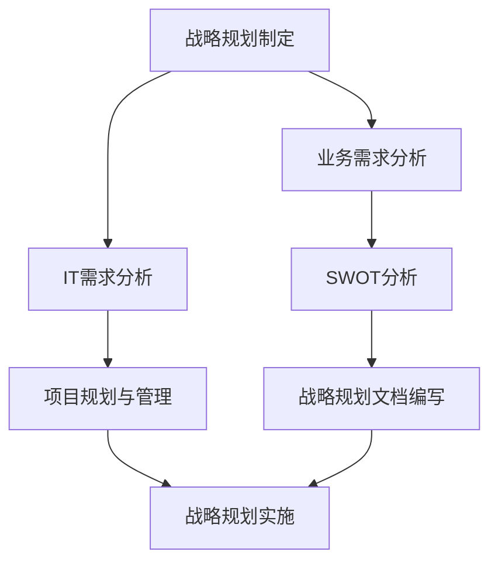

                 

# 文章标题：公司IT战略规划的制定、实施

> 关键词：IT战略规划、业务需求分析、IT需求分析、项目规划与管理、实施策略、评估与优化

> 摘要：本文将系统地探讨公司IT战略规划的制定、实施以及评估与优化过程。通过详细的分析和实例，揭示IT战略规划的核心概念、原理和实施步骤，帮助企业和组织更好地规划、管理和优化其IT战略，提升企业竞争力。

----------------------------------------------------------------

## 第一部分：IT战略规划概述

### 第1章：IT战略规划的定义与重要性

#### 1.1 IT战略规划的基本概念

IT战略规划是指企业或组织对其信息技术（IT）的发展和运用所制定的战略性计划和行动方案。它涉及到企业业务需求与IT资源的整合，旨在通过有效的IT战略规划，提升企业的运营效率、降低成本、提高市场竞争力。

**IT战略规划的定义**：IT战略规划是指企业在战略层面上，根据业务需求、市场环境和技术发展趋势，对IT资源进行系统规划和管理的过程。

**IT战略规划的目的和意义**：

- **提升企业竞争力**：通过IT战略规划，企业可以更好地把握市场机遇，提升自身的核心竞争力。
- **降低运营成本**：通过优化IT资源，减少冗余和浪费，降低企业的运营成本。
- **提高运营效率**：通过IT技术的有效运用，提升企业的运营效率，提高业务流程的自动化水平。
- **确保IT与业务目标一致**：IT战略规划有助于确保IT发展与企业业务目标的一致性，避免资源浪费和重复投资。

#### 1.2 IT战略规划的核心要素

**业务目标与IT目标的融合**：IT战略规划的关键在于将企业的业务目标和IT目标相结合，确保IT资源的配置和运用能够支撑业务的发展。

**IT资源优化与管理**：IT战略规划需要对企业现有的IT资源进行评估和优化，确保资源的有效利用，同时考虑未来可能的需求变化。

### 第2章：IT战略规划的步骤与方法

#### 2.1 IT战略规划流程

**分析现状**：对企业的现有IT基础设施、技术应用、业务流程等进行全面评估，找出存在的问题和不足。

**确定目标和策略**：根据分析结果，明确企业的IT战略目标和策略，确定IT发展的方向和重点。

**制定实施计划**：制定详细的IT战略实施计划，包括时间表、资源配置、关键里程碑等。

**监控与评估**：对IT战略规划的执行过程进行监控和评估，确保规划目标的实现，并根据实际情况进行调整。

#### 2.2 IT战略规划方法

**SWOT分析**：通过SWOT分析（Strengths, Weaknesses, Opportunities, Threats），评估企业的内部优势、劣势以及外部机遇和威胁，为IT战略规划提供基础数据。

**波士顿矩阵**：利用波士顿矩阵（Boston Matrix），对企业的产品或业务单位进行市场增长率和市场份额的划分，为IT资源的优先级排序提供依据。

**市场需求分析**：通过市场需求分析，了解市场的需求和趋势，为企业制定IT战略提供方向。

## 第二部分：IT战略规划制定

### 第3章：业务需求分析

#### 3.1 业务需求分析的方法

**用户访谈**：通过与用户进行面对面交流，了解用户的需求、痛点和期望，获取第一手资料。

**市场调研**：通过问卷调查、访谈、数据分析等方式，了解市场的需求和竞争状况。

**竞争对手分析**：分析竞争对手的产品、市场策略、竞争优势等，为企业制定业务需求提供参考。

#### 3.2 业务需求分析的工具

**业务流程图**：通过业务流程图，展示企业的业务流程和关键节点，分析流程的优化空间。

**用例图**：用例图（Use Case Diagram）用于描述系统与外部用户（Actor）的交互关系，明确系统的功能需求。

**价值流图**：价值流图（Value Stream Map）用于分析企业的价值创造过程，识别浪费和改进点。

### 第4章：IT需求分析

#### 4.1 IT需求分析的方法

**功能需求分析**：明确系统需要实现的功能，包括业务流程自动化、数据管理、系统集成等。

**非功能需求分析**：分析系统需要满足的非功能性需求，如性能、安全性、可扩展性等。

#### 4.2 IT需求分析的工具

**功能需求文档**：功能需求文档（Functional Requirements Document）详细记录系统的功能需求，为开发提供依据。

**非功能需求文档**：非功能需求文档（Non-functional Requirements Document）记录系统的非功能需求，如性能、安全性、可维护性等。

**用户故事地图**：用户故事地图（User Story Map）用于展示用户需求、功能和故事，确保开发团队和用户对需求的一致理解。

### 第5章：IT战略规划文档编写

#### 5.1 IT战略规划文档的结构

**引言**：介绍IT战略规划的目的、背景和重要性。

**背景与目标**：阐述企业的业务背景、当前IT状况以及规划的目标和预期效果。

**分析结果**：总结业务需求分析和IT需求分析的结果，包括优势和劣势、市场需求和竞争状况等。

**战略规划**：制定IT战略规划的具体内容和行动方案，包括技术选型、系统架构、资源配置等。

**实施计划**：详细描述IT战略规划的执行计划，包括时间表、关键里程碑、资源需求等。

**风险与应对措施**：分析IT战略规划实施过程中可能遇到的风险和挑战，并提出相应的应对措施。

#### 5.2 IT战略规划文档的撰写技巧

**清晰性**：确保文档内容清晰、简洁，避免冗长的描述和模糊的概念。

**简洁性**：避免过多不必要的细节，重点突出关键信息和结论。

**可操作性**：确保文档内容具有可操作性，能够指导实际工作。

## 第三部分：IT战略规划实施

### 第6章：IT项目规划与管理

#### 6.1 IT项目规划

**项目范围定义**：明确项目的目标和范围，确保项目团队对项目的理解和目标一致。

**项目时间规划**：制定项目的时间表，包括关键里程碑、任务进度等，确保项目按计划进行。

**项目资源分配**：根据项目需求和优先级，合理分配资源，确保项目资源的充分利用。

#### 6.2 IT项目管理

**进度控制**：监控项目进度，确保项目按计划进行，及时发现和解决问题。

**成本控制**：监控项目成本，确保项目在预算范围内完成。

**质量控制**：确保项目的质量达到预期标准，通过测试、审查等方式确保系统的稳定性和可靠性。

### 第7章：IT战略规划实施策略

#### 7.1 人力资源策略

**人员招聘与培训**：根据项目需求，招聘合适的人员，并提供培训，确保团队的专业技能和知识水平。

**人员激励与考核**：建立激励机制，激励团队成员的积极性和创造力，通过考核评估团队的表现和成果。

#### 7.2 技术实施策略

**技术选型与研发**：根据项目需求和现有技术条件，选择合适的技术方案，并进行研发和测试。

**技术迁移与整合**：将新技术的应用逐步迁移到现有系统中，确保系统的稳定性和兼容性。

#### 7.3 运营管理策略

**运维体系构建**：建立完善的运维体系，确保系统的稳定运行和持续优化。

**服务质量管理**：建立服务质量管理体系，确保用户满意度，持续提升服务水平。

## 第四部分：IT战略规划评估与优化

### 第8章：IT战略规划评估

#### 8.1 评估指标体系

**业务指标**：评估IT战略规划对企业业务目标的实现程度，如销售额、客户满意度等。

**IT指标**：评估IT系统的性能、稳定性、安全性等指标，如系统响应时间、故障率等。

**成本效益分析**：通过成本效益分析，评估IT战略规划的成本投入与收益，确定其经济效益。

#### 8.2 评估方法与工具

**成本效益分析**：通过计算项目投入与收益的比率，评估IT战略规划的经济效益。

**柯普兰战略地图**：利用柯普兰战略地图，分析企业的战略目标和关键绩效指标，评估IT战略规划的实施效果。

**平衡计分卡**：通过平衡计分卡，评估企业的业务绩效、客户满意度、内部流程、学习与成长等方面，评估IT战略规划的影响。

### 第9章：IT战略规划优化

#### 9.1 优化原则与策略

**灵活调整**：根据实际情况，及时调整IT战略规划，确保其与业务目标的一致性。

**持续改进**：通过持续改进，不断提升IT系统的性能和用户体验，优化业务流程。

**风险管理**：加强风险管理，识别和应对潜在的IT风险，确保IT战略规划的安全和稳定。

#### 9.2 优化实施步骤

**制定优化方案**：根据评估结果，制定详细的优化方案，明确优化目标和措施。

**实施优化方案**：按照优化方案，逐步实施优化措施，确保优化目标的实现。

**监控与评估优化效果**：对优化实施过程进行监控和评估，确保优化效果达到预期，并根据实际情况进行调整。

## 附录

### 附录A：常用IT战略规划工具

**SWOT分析模板**：提供SWOT分析的基本框架和模板，帮助企业更好地进行内部和外部因素的分析。

**波士顿矩阵模板**：提供波士顿矩阵的基本框架和模板，帮助企业进行业务单位和市场的分类和优先级排序。

**价值流图模板**：提供价值流图的基本框架和模板，帮助企业分析价值创造过程和优化业务流程。

**项目管理工具介绍**：介绍常用的项目管理工具，如Microsoft Project、Jira、Trello等，帮助企业更好地进行项目规划和管理。

### 附录B：案例分析

**某公司IT战略规划案例分析**：详细分析某公司的IT战略规划过程，包括业务需求分析、IT需求分析、项目规划与实施等，探讨成功的关键因素和经验教训。

**某行业IT战略规划成功案例分析**：分析某行业中的成功案例，探讨IT战略规划在该行业中的应用和实践，为企业提供借鉴和启示。

---

**核心概念与联系：**

以下是公司IT战略规划的Mermaid流程图：



**核心算法原理讲解：**

IT战略规划的核心算法包括SWOT分析和波士顿矩阵。以下是SWOT分析的伪代码：

```python
def SWOT_analysis(strategic_objectives, internal_factors, external_factors):
    # 确定战略目标
    strategic_objectives = analyze_business_requirements()

    # 内部因素分析
    internal_factors = analyze_internal_strengths_and_weaknesses()

    # 外部因素分析
    external_factors = analyze_external_opportunities_and_threats()

    # SWOT矩阵生成
    SWOT_matrix = create_SWOT_matrix(strategic_objectives, internal_factors, external_factors)

    return SWOT_matrix
```

**数学模型和数学公式：**

以下是波士顿矩阵的数学公式，用于划分业务单位：

$$
\text{市场增长率} \times \text{市场份额} = \text{业务单位得分}
$$

其中，市场增长率越高、市场份额越大的业务单位将被划分到高增长高份额象限，反之则被划分到低增长低份额象限。

**项目实战：**

以下是IT战略规划实施的一个实际案例。

**案例背景：**
某公司希望实施一个新的客户关系管理系统（CRM），以提高销售效率和客户满意度。

**开发环境搭建：**
- 使用Python和Django框架搭建后端开发环境。
- 使用JavaScript和React框架搭建前端开发环境。

**源代码详细实现：**
- 后端：使用Django框架搭建CRM系统的基础架构，包括用户认证、数据存储和API接口。
- 前端：使用React框架搭建CRM系统的用户界面，包括表单、表格和图表等。

**代码解读与分析：**
- 代码主要分为三个模块：用户模块、数据模块和接口模块。
- 用户模块负责用户认证和权限管理。
- 数据模块负责数据存储和查询。
- 接口模块负责提供RESTful API接口。

**测试与部署：**
- 进行单元测试和集成测试，确保系统的稳定性和可靠性。
- 将系统部署到公司的服务器上，并进行监控和运维。

**总结：**
该案例展示了IT战略规划实施的全过程，从开发环境搭建、源代码实现、测试与部署，到最终的上线运行。通过详细的代码解读与分析，可以帮助读者更好地理解和实践IT战略规划的实施过程。

**作者：**
AI天才研究院/AI Genius Institute & 禅与计算机程序设计艺术 /Zen And The Art of Computer Programming

----------------------------------------------------------------

### 总结与展望

通过本文的探讨，我们系统地阐述了公司IT战略规划的制定、实施、评估与优化过程。从业务需求分析、IT需求分析，到项目规划与实施，再到评估与优化，每一个环节都至关重要，它们共同构成了一个完整的IT战略规划体系。

首先，业务需求分析是IT战略规划的基础。通过对用户、市场和竞争对手的深入研究，我们可以准确地把握企业的需求，为后续的IT需求分析提供明确的指导。在这个过程中，业务流程图、用例图和价值流图等工具能够帮助我们更好地理解业务流程，找出优化点。

接着，IT需求分析进一步明确了系统的功能需求和非功能需求。功能需求文档、非功能需求文档和用户故事地图等工具，为我们提供了详细的文档支持，确保开发团队和用户对需求的一致理解。

在战略规划文档编写阶段，我们需要将分析结果转化为具体的战略规划。清晰的结构、简洁的表述和可操作性的内容，是编写优质战略规划文档的关键。

实施阶段，项目规划与管理至关重要。通过明确项目范围、时间规划和资源分配，我们能够确保项目按计划进行。同时，项目管理中的进度控制、成本控制和质量控制，确保了项目的成功实施。

在战略规划实施后，评估与优化是持续改进的关键。通过设定评估指标体系，我们能够全面评估IT战略规划的实施效果。柯普兰战略地图和平衡计分卡等工具，为我们提供了有效的评估方法。根据评估结果，我们可以制定优化方案，不断优化IT战略规划。

展望未来，随着技术的不断进步和市场环境的变化，IT战略规划也将面临新的挑战和机遇。企业需要持续关注市场动态，及时调整IT战略规划，确保其与业务目标的一致性。同时，灵活调整、持续改进和风险管理，将成为IT战略规划成功的关键。

总之，公司IT战略规划的制定、实施、评估与优化，是一个动态、持续的过程。通过本文的探讨，我们希望能够为企业和组织提供有价值的参考和指导，帮助他们在IT战略规划的道路上取得成功。让我们携手共进，迎接未来的挑战，共同创造更美好的未来。

