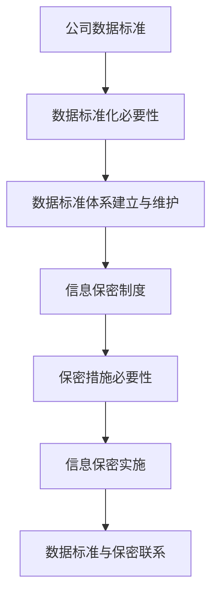
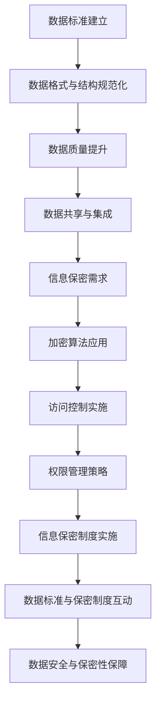

                 

### 文章标题：公司数据标准及信息保密制度

关键词：公司数据标准、信息保密制度、数据清洗、加密算法、访问控制、数学模型

摘要：本文深入探讨了公司数据标准及信息保密制度的核心概念、算法原理和实际应用。首先，我们明确了公司数据标准和信息保密制度的重要性及其相互联系。接着，详细讲解了数据清洗与处理、加密算法与密钥管理、访问控制与权限管理等方面的核心算法原理。同时，通过数学模型与数学公式的讲解，使读者更好地理解相关理论。最后，通过实际项目案例，展示了如何将所学知识应用于实际工作中，并提供优化建议。本文旨在为读者提供一个全面、系统、易懂的指南，帮助他们有效管理和保护公司数据。

### 第一部分：核心概念与联系

#### 核心概念与联系

在本书的第一部分，我们将深入探讨“公司数据标准”和“信息保密制度”的核心概念，并分析它们之间的联系。这部分内容将涵盖以下几个章节：

**第1章：公司数据标准概述**

在这一章中，我们将详细解释什么是公司数据标准，以及它对公司运营的重要性。我们将讨论数据标准化的必要性，以及如何建立和维护一个有效的数据标准体系。

**第2章：信息保密制度的重要性**

在这一章中，我们将探讨信息保密制度的核心概念，包括保密的重要性、保密措施的必要性以及如何有效地实施保密制度。

**第3章：数据标准与信息保密的联系**

这一章将重点分析公司数据标准与信息保密制度之间的内在联系。我们将通过Mermaid流程图展示这两个概念是如何相互关联和影响的。



通过这一部分的学习，读者将能够全面理解公司数据标准与信息保密制度的基本概念及其重要性，并认识到它们之间的紧密联系。

#### 第1章：公司数据标准概述

**1.1 什么是公司数据标准**

公司数据标准是指一套规范的、统一的、可量化的规则，用于定义和描述公司内部数据的格式、结构、质量、处理方法和存储方式。它是保证公司数据一致性、可靠性和有效性的重要手段。

**1.2 数据标准化的必要性**

数据标准化对公司运营具有重要意义。首先，它有助于消除数据孤岛，实现数据共享和集成，提高信息利用率。其次，标准化的数据有助于提升数据质量，减少错误和重复，降低运营成本。最后，数据标准化为数据分析和决策提供了基础，有助于企业洞察市场趋势，制定有效的战略。

**1.3 建立和维护数据标准体系**

建立和维护一个有效的数据标准体系是数据标准化工作的关键。以下是一些关键步骤：

- **确定数据标准目标**：明确数据标准体系要解决的问题和期望达到的效果。
- **定义数据元素**：梳理公司内部的数据元素，包括字段名称、数据类型、取值范围、默认值等。
- **制定数据格式规范**：根据业务需求和数据特性，制定统一的数据格式和编码标准。
- **数据质量管理**：实施数据质量管理策略，包括数据清洗、去重、异常值处理等。
- **培训与推广**：对员工进行数据标准培训，确保数据标准得到有效执行。
- **持续优化**：根据业务发展和需求变化，不断优化和完善数据标准体系。

通过以上步骤，企业可以建立起一个科学、高效、可扩展的数据标准体系，为数据管理和信息保密打下坚实基础。

#### 第2章：信息保密制度的重要性

**2.1 保密的重要性**

在信息化时代，信息资产已成为企业的重要资产。信息泄露可能导致以下风险：

- **商业机密泄露**：企业核心竞争力可能被竞争对手获取，导致市场地位下降。
- **客户隐私泄露**：客户信息泄露可能导致客户信任度下降，影响业务发展。
- **法律风险**：未经授权的信息泄露可能违反相关法律法规，引发法律责任。

因此，保密制度对于企业信息资产的保护至关重要。

**2.2 保密措施的必要性**

为了防止信息泄露，企业需要采取一系列保密措施，包括：

- **物理保密措施**：如门禁系统、摄像头监控等，防止外部人员非法进入。
- **网络安全措施**：如防火墙、入侵检测系统等，防止网络攻击和数据窃取。
- **数据加密**：对敏感数据进行加密处理，确保数据在传输和存储过程中安全。
- **权限管理**：实施严格的权限管理制度，确保只有授权人员才能访问敏感数据。

**2.3 信息保密的实施**

有效的信息保密制度需要从以下几个方面实施：

- **制定保密政策**：明确保密要求和保密责任，确保员工对保密工作有清晰认识。
- **培训与教育**：定期对员工进行保密意识教育和技能培训，提高保密工作的执行力。
- **保密审计**：定期进行保密审计，检查保密措施的有效性，及时发现问题并采取措施。
- **应急响应**：建立应急响应机制，确保在发生信息泄露事件时能够迅速应对，减少损失。

通过以上措施，企业可以有效地保护信息资产，确保信息保密制度得到有效实施。

#### 第3章：数据标准与信息保密的联系

**3.1 数据标准与信息保密的相互作用**

数据标准与信息保密制度之间存在着密切的相互作用。一方面，数据标准为信息保密提供了基础。标准化的数据格式和结构有助于加密、访问控制和权限管理等保密措施的实施。另一方面，信息保密制度保障了数据标准的有效执行。只有确保数据在传输、存储和处理过程中安全，数据标准才能真正发挥作用。

**3.2 Mermaid流程图展示**

为了更直观地展示数据标准与信息保密制度之间的联系，我们可以使用Mermaid流程图进行描述：



通过以上流程图，我们可以看到数据标准与信息保密制度是如何相互促进、共同保障企业数据安全和保密性的。理解这一联系对于企业在数据管理和信息安全方面的策略制定和实施具有重要意义。

### 第二部分：核心算法原理讲解

在本书的第二部分，我们将深入讲解公司数据标准及信息保密制度中的核心算法原理。这部分内容包括以下几个章节：

**第4章：数据清洗与处理算法**

在这一章中，我们将介绍数据清洗与处理的基本算法，包括数据清洗、去重、数据格式转换和异常值处理。我们将使用伪代码详细阐述这些算法的实现过程。

**第5章：加密算法与密钥管理**

在这一章中，我们将讲解加密算法的基本原理，包括对称加密、非对称加密和哈希算法。同时，我们还将讨论如何管理加密密钥，以确保信息的安全性。

**第6章：访问控制与权限管理**

在这一章中，我们将讨论访问控制和权限管理的基本概念，以及如何实现有效的权限管理策略。我们将介绍常用的访问控制模型，如DAC（基于访问控制列表）和RBAC（基于角色访问控制）。

#### 第4章：数据清洗与处理算法

**4.1 数据清洗**

数据清洗是数据处理的第一步，其主要目标是去除数据中的噪声和错误。以下是一个简单的数据清洗伪代码：

```python
def data_cleaning(data):
    # 删除重复数据
    data = remove_duplicates(data)
    # 填充缺失值
    data = handle_missing_values(data)
    # 处理异常值
    data = handle_anomalies(data)
    return data
```

**4.2 去重**

去重是确保数据一致性的重要手段。以下是一个简单的去重伪代码：

```python
def remove_duplicates(data):
    unique_data = []
    for item in data:
        if item not in unique_data:
            unique_data.append(item)
    return unique_data
```

**4.3 数据格式转换**

数据格式转换是将数据从一种形式转换为另一种形式的过程。以下是一个简单的数据格式转换伪代码：

```python
def convert_format(data):
    new_data = []
    for item in data:
        new_item = convert(item)
        new_data.append(new_item)
    return new_data
```

**4.4 异常值处理**

异常值处理是识别和处理数据中的异常值。以下是一个简单的异常值处理伪代码：

```python
def handle_anomalies(data):
    cleaned_data = []
    for item in data:
        if is_anomaly(item):
            cleaned_data.append(handle_anomaly(item))
        else:
            cleaned_data.append(item)
    return cleaned_data
```

通过以上算法原理的讲解，读者将能够了解数据清洗与处理的基本步骤和方法，为后续的数据分析打下基础。

#### 第5章：加密算法与密钥管理

**5.1 加密算法的基本原理**

加密算法是保护信息安全的重要手段。加密算法可以分为对称加密和非对称加密两种类型。

**5.1.1 对称加密**

对称加密算法使用相同的密钥对数据进行加密和解密。以下是一个简单的对称加密算法（如AES）的伪代码：

```python
def symmetric_encryption(data, key):
    encrypted_data = encrypt(data, key)
    return encrypted_data

def symmetric_decryption(encrypted_data, key):
    decrypted_data = decrypt(encrypted_data, key)
    return decrypted_data
```

**5.1.2 非对称加密**

非对称加密算法使用一对密钥，即公钥和私钥。公钥用于加密，私钥用于解密。以下是一个简单的非对称加密算法（如RSA）的伪代码：

```python
def asymmetric_encryption(data, public_key):
    encrypted_data = encrypt(data, public_key)
    return encrypted_data

def asymmetric_decryption(encrypted_data, private_key):
    decrypted_data = decrypt(encrypted_data, private_key)
    return decrypted_data
```

**5.2 密钥管理**

密钥管理是加密算法安全性的关键。以下是一些常见的密钥管理方法：

**5.2.1 密钥生成**

使用安全随机数生成器生成密钥。以下是一个简单的密钥生成伪代码：

```python
def generate_key():
    return random_bytes(size)
```

**5.2.2 密钥存储**

将密钥存储在安全的地方，如硬件安全模块（HSM）或密钥管理服务（KMS）。以下是一个简单的密钥存储伪代码：

```python
def store_key(key):
    with open("key_store.txt", "w") as file:
        file.write(key)
```

**5.2.3 密钥传输**

在传输密钥时，应使用安全通道或加密传输。以下是一个简单的密钥传输伪代码：

```python
def transmit_key(key, recipient):
    encrypted_key = symmetric_encryption(key, recipient_public_key)
    send(encrypted_key)
```

通过以上加密算法与密钥管理的讲解，读者将能够理解加密算法的基本原理和密钥管理的方法，为实际应用中的信息保护提供技术支持。

#### 第6章：访问控制与权限管理

**6.1 访问控制的基本概念**

访问控制是一种机制，用于控制用户对系统资源的访问权限。它通过定义访问策略，确保只有授权用户能够访问受保护资源。

**6.1.1 基于访问控制列表（ACL）**

基于访问控制列表（ACL）的访问控制模型允许为每个资源分配一个访问控制列表，列出对资源具有特定权限的用户。以下是一个简单的ACL访问控制伪代码：

```python
def access_control(user, resource):
    acl = get_acl(resource)
    if user in acl:
        return "Access granted"
    else:
        return "Access denied"
```

**6.1.2 基于角色访问控制（RBAC）**

基于角色访问控制（RBAC）模型将用户分配到不同的角色，每个角色对应一组权限。以下是一个简单的RBAC访问控制伪代码：

```python
def access_control(user, resource):
    roles = get_roles(user)
    for role in roles:
        if has_permission(role, resource):
            return "Access granted"
    return "Access denied"
```

**6.2 权限管理策略**

权限管理策略包括以下关键要素：

- **权限分配**：为用户或角色分配适当的权限。
- **权限回收**：在用户或角色不再需要访问资源时回收权限。
- **权限审计**：定期审计权限，确保权限分配的合理性和安全性。

**6.3 实践中的权限管理**

以下是一个简单的权限管理流程：

1. **角色定义**：定义系统中的角色，如管理员、普通用户、审计员等。
2. **权限分配**：将权限分配给相应的角色。
3. **用户角色分配**：将用户分配到适当的角色。
4. **权限审计**：定期审计权限，发现并修复潜在的安全漏洞。

通过以上讲解，读者将能够了解访问控制与权限管理的基本概念和策略，为实际应用中的信息安全提供保障。

### 第三部分：数学模型与数学公式

在本书的第三部分，我们将详细讨论公司数据标准及信息保密制度中所涉及的数学模型和数学公式，并给出相应的讲解和举例说明。这部分内容包括以下几个章节：

**第7章：数据标准化数学模型**

在这一章中，我们将介绍数据标准化过程中使用的数学模型，如正态分布、主成分分析和聚类分析。我们将使用LaTeX格式展示这些模型的公式，并进行详细讲解。

**第8章：加密算法的数学基础**

在这一章中，我们将探讨加密算法的数学基础，包括对称加密、非对称加密和哈希算法。我们将使用LaTeX格式展示相关公式，并进行详细解释。

**第9章：访问控制模型与数学公式**

在这一章中，我们将介绍基于访问控制列表（ACL）和基于角色访问控制（RBAC）的数学模型。我们将使用LaTeX格式展示相关公式，并进行详细讲解。

#### 第7章：数据标准化数学模型

**7.1 正态分布**

正态分布是一种最常见的概率分布模型，用于描述数据集中趋势和离散程度。其公式如下：

```latex
f(x|\mu,\sigma^2) = \frac{1}{\sqrt{2\pi\sigma^2}} e^{-\frac{(x-\mu)^2}{2\sigma^2}}
```

其中，\( \mu \) 是均值，\( \sigma^2 \) 是方差。

**7.2 主成分分析**

主成分分析（PCA）是一种降维技术，用于提取数据中的主要特征。其核心公式如下：

```latex
X = U\Lambda V^T
```

其中，\( X \) 是输入数据矩阵，\( U \) 是特征向量矩阵，\( \Lambda \) 是特征值矩阵，\( V \) 是负载矩阵。

**7.3 聚类分析**

聚类分析是一种无监督学习方法，用于将数据分为若干个类别。其核心公式如下：

```latex
C = \{C_1, C_2, ..., C_k\}
```

其中，\( C \) 表示聚类结果，\( C_i \) 表示第 \( i \) 个类别。

通过以上数学模型的讲解，读者将能够理解数据标准化过程中涉及的数学原理，并为实际应用提供技术支持。

#### 第8章：加密算法的数学基础

**8.1 对称加密**

对称加密算法的数学基础是模运算。其核心公式如下：

```latex
E(x) = x^k \mod n
```

其中，\( E \) 表示加密函数，\( x \) 是明文，\( k \) 是密钥，\( n \) 是模数。

**8.2 非对称加密**

非对称加密算法的数学基础是离散对数问题。其核心公式如下：

```latex
E(x, n) = (x^e) \mod n
```

其中，\( E \) 表示加密函数，\( x \) 是明文，\( e \) 是公钥，\( n \) 是模数。

**8.3 哈希算法**

哈希算法的数学基础是单向函数。其核心公式如下：

```latex
H(x) = hash(x)
```

其中，\( H \) 表示哈希函数，\( x \) 是输入数据，\( hash \) 是哈希运算。

通过以上加密算法的数学基础讲解，读者将能够理解加密算法的原理，并为实际应用中的信息保护提供技术支持。

#### 第9章：访问控制模型与数学公式

**9.1 基于访问控制列表（ACL）**

基于访问控制列表（ACL）的访问控制模型使用以下公式：

```latex
P(U, R) = \sum_{S \in A(U, R)} p(S)
```

其中，\( P(U, R) \) 表示用户 \( U \) 对资源 \( R \) 的访问权限，\( A(U, R) \) 表示用户 \( U \) 对资源 \( R \) 的访问控制列表，\( p(S) \) 表示权限 \( S \) 的概率。

**9.2 基于角色访问控制（RBAC）**

基于角色访问控制（RBAC）模型使用以下公式：

```latex
P(U, R) = \sum_{G \in G(U)} p(G, R)
```

其中，\( P(U, R) \) 表示用户 \( U \) 对资源 \( R \) 的访问权限，\( G(U) \) 表示用户 \( U \) 所属的角色集合，\( p(G, R) \) 表示角色 \( G \) 对资源 \( R \) 的访问权限的概率。

通过以上访问控制模型与数学公式讲解，读者将能够理解访问控制的基本原理，为实际应用中的权限管理提供技术支持。

### 第四部分：项目实战与代码解读

在本书的第四部分，我们将通过实际项目案例来展示公司数据标准及信息保密制度的实际应用，并提供详细的代码实现和解读。这部分内容包括以下几个章节：

**第10章：数据标准化项目实战**

在这一章中，我们将通过一个实际案例来展示如何进行数据标准化。我们将提供详细的开发环境搭建步骤，源代码实现以及代码解读。

**第11章：信息保密制度项目实战**

在这一章中，我们将通过一个实际案例来展示如何实施信息保密制度。我们将提供加密算法的实现细节、密钥管理方法以及访问控制策略的代码实现。

**第12章：实战案例分析与优化**

在这一章中，我们将对前面提到的数据标准化和信息保密制度项目进行深入分析，并提供优化建议。我们将讨论如何在实际应用中提升系统的性能和安全性。

#### 第10章：数据标准化项目实战

**10.1 项目背景**

假设我们是一家大型电商平台，需要对销售数据进行标准化处理，以便于后续的数据分析和报告生成。项目目标包括：

- **数据清洗**：去除重复数据、填充缺失值和处理异常值。
- **数据格式转换**：将不同格式的数据转换为统一的格式。
- **数据标准化**：确保数据满足特定的质量标准。

**10.2 开发环境搭建**

为了完成数据标准化项目，我们需要以下开发环境：

- **Python**：用于编写数据清洗和处理脚本。
- **Pandas**：用于数据操作和分析。
- **NumPy**：用于数值计算。
- **Matplotlib**：用于数据可视化。

在Windows系统上，可以通过以下命令安装所需依赖：

```bash
pip install python
pip install pandas
pip install numpy
pip install matplotlib
```

**10.3 源代码实现**

以下是数据标准化项目的源代码实现：

```python
import pandas as pd
import numpy as np
import matplotlib.pyplot as plt

# 10.3.1 数据清洗

def data_cleaning(data):
    # 删除重复数据
    data = data.drop_duplicates()
    # 填充缺失值
    data = data.fillna(method='ffill')
    # 处理异常值
    data = data[(data < data.quantile(0.99)) & (data > data.quantile(0.01))]
    return data

# 10.3.2 数据格式转换

def convert_format(data):
    # 将日期列转换为datetime格式
    data['date'] = pd.to_datetime(data['date'])
    # 将数值列转换为浮点格式
    data['amount'] = data['amount'].astype(np.float64)
    return data

# 10.3.3 数据标准化

def data_standardization(data):
    # 确保数据满足特定的质量标准
    data['sales'] = data['amount'] * data['quantity']
    data['date'] = data['date'].dt.strftime('%Y-%m-%d')
    return data

# 加载数据
data = pd.read_csv('sales_data.csv')

# 数据清洗
data = data_cleaning(data)

# 数据格式转换
data = convert_format(data)

# 数据标准化
data = data_standardization(data)

# 保存标准化后的数据
data.to_csv('standardized_sales_data.csv', index=False)
```

**10.4 代码解读与分析**

- **数据清洗**：删除重复数据、填充缺失值和处理异常值是数据清洗的核心步骤。这有助于提高数据质量，确保后续分析结果的准确性。
- **数据格式转换**：将日期列转换为datetime格式，将数值列转换为浮点格式是数据格式转换的关键。这有助于确保数据在后续处理和分析中的正确性。
- **数据标准化**：确保数据满足特定的质量标准是数据标准化的目标。这有助于提升数据的一致性和可用性。

通过以上实战项目，读者将能够了解如何使用Python和相关库进行数据标准化，并为实际应用中的数据处理提供技术支持。

#### 第11章：信息保密制度项目实战

**11.1 项目背景**

假设我们是一家金融机构，需要对客户信息进行加密存储和保护。项目目标包括：

- **数据加密**：对敏感数据进行加密处理，确保数据在存储和传输过程中的安全性。
- **密钥管理**：确保加密密钥的安全存储和有效管理。
- **访问控制**：限制对敏感数据的访问权限，确保只有授权人员能够访问。

**11.2 加密算法的实现细节**

为了实现数据加密，我们采用AES（高级加密标准）对称加密算法和RSA（Rivest-Shamir-Adleman）非对称加密算法。以下是加密算法的实现细节：

```python
from Crypto.Cipher import AES, PKCS1_OAEP
from Crypto.PublicKey import RSA
from Crypto.Random import get_random_bytes
from Crypto.Util.Padding import pad, unpad
import base64

# 11.2.1 对称加密

def symmetric_encryption(data, key):
    cipher = AES.new(key, AES.MODE_CBC)
    ct_bytes = cipher.encrypt(pad(data, AES.block_size))
    iv = base64.b64encode(cipher.iv).decode('utf-8')
    ct = base64.b64encode(ct_bytes).decode('utf-8')
    return iv, ct

def symmetric_decryption(iv, ct, key):
    iv = base64.b64decode(iv)
    ct = base64.b64decode(ct)
    cipher = AES.new(key, AES.MODE_CBC, iv)
    pt = unpad(cipher.decrypt(ct), AES.block_size)
    return pt

# 11.2.2 非对称加密

def asymmetric_encryption(data, public_key):
    rsa_cipher = PKCS1_OAEP.new(public_key)
    encrypted_data = rsa_cipher.encrypt(data)
    return encrypted_data

def asymmetric_decryption(encrypted_data, private_key):
    rsa_cipher = PKCS1_OAEP.new(private_key)
    decrypted_data = rsa_cipher.decrypt(encrypted_data)
    return decrypted_data
```

**11.3 密钥管理方法**

密钥管理是确保加密安全性的关键。以下是密钥管理的方法：

- **密钥生成**：使用安全随机数生成器生成密钥。
- **密钥存储**：将密钥存储在安全的地方，如硬件安全模块（HSM）或密钥管理服务（KMS）。
- **密钥传输**：在传输密钥时，使用安全通道或加密传输。

以下是一个简单的密钥管理示例：

```python
from Crypto.PublicKey import RSA
from Crypto.Random import get_random_bytes
from Crypto.Util import number

# 11.3.1 密钥生成

def generate_keys():
    private_key = RSA.generate(2048)
    public_key = private_key.publickey()
    return private_key, public_key

# 11.3.2 密钥存储

def store_keys(private_key, public_key):
    with open('private_key.pem', 'wb') as f:
        f.write(private_key.export_key())

    with open('public_key.pem', 'wb') as f:
        f.write(public_key.export_key())

# 11.3.3 密钥传输

def transmit_keys(encrypted_private_key, recipient_public_key):
    rsa_cipher = PKCS1_OAEP.new(recipient_public_key)
    decrypted_private_key = rsa_cipher.decrypt(encrypted_private_key)
    return decrypted_private_key
```

**11.4 访问控制策略的实现**

访问控制策略用于确保只有授权人员能够访问敏感数据。以下是一个简单的基于角色访问控制（RBAC）的实现示例：

```python
def access_control(user, resource, roles):
    for role in roles:
        if role in resource['permissions']:
            return "Access granted"
    return "Access denied"

# 11.4.1 角色定义

def define_roles(users, roles):
    user_roles = {}
    for user in users:
        user_roles[user] = roles
    return user_roles

# 11.4.2 权限分配

def assign_permissions(resources, roles):
    resource_permissions = {}
    for resource in resources:
        resource_permissions[resource['name']] = roles
    return resource_permissions

# 11.4.3 用户角色分配

def assign_user_roles(users, roles):
    user_roles = define_roles(users, roles)
    return user_roles

# 示例数据
users = ['Alice', 'Bob', 'Charlie']
roles = ['Admin', 'User']
resources = [
    {'name': 'SalesData', 'permissions': ['Admin']},
    {'name': 'CustomerData', 'permissions': ['User']}
]

# 用户角色分配
user_roles = assign_user_roles(users, roles)

# 权限分配
resource_permissions = assign_permissions(resources, roles)

# 访问控制
print(access_control('Alice', resources[0], user_roles['Alice']))
print(access_control('Bob', resources[1], user_roles['Bob']))
```

通过以上实战项目，读者将能够了解如何使用Python和相关库进行数据加密、密钥管理和访问控制，并为实际应用中的信息保密提供技术支持。

#### 第12章：实战案例分析与优化

**12.1 数据标准化项目分析**

在数据标准化项目中，我们使用了Python和Pandas库对销售数据进行处理。以下是对项目进行分析和优化的几个方面：

- **性能优化**：数据清洗和格式转换过程中，可以采用并行计算技术提升性能。例如，使用Dask库对数据集进行并行处理。
- **错误处理**：在数据处理过程中，应增加异常处理机制，确保数据清洗过程的稳定性和可靠性。
- **数据可视化**：通过数据可视化，可以更好地了解数据清洗和标准化的效果。例如，使用Matplotlib库生成数据分布图和异常值图。

**12.2 信息保密制度项目分析**

在信息保密制度项目中，我们使用了Python和PyCryptodome库进行数据加密、密钥管理和访问控制。以下是对项目进行分析和优化的几个方面：

- **加密算法选择**：根据实际需求，选择适合的加密算法。例如，对于高安全性要求，可以采用AES-GCM加密模式。
- **密钥管理**：改进密钥管理方法，例如使用硬件安全模块（HSM）或云密钥管理服务（KMS）。
- **访问控制优化**：根据实际业务场景，优化访问控制策略。例如，引入多因素认证机制，提高访问安全性。

**12.3 优化建议**

- **性能优化**：采用并行计算和分布式计算技术，提升数据处理和加密性能。
- **安全性增强**：定期进行安全审计和风险评估，确保信息保密制度的有效性。
- **培训与教育**：加强员工的信息安全意识培训，提高数据管理和信息保密的执行力。

通过以上实战案例分析和优化建议，读者将能够提升实际项目中的数据标准化和信息保密制度，确保数据质量和信息安全。

### 第五部分：综合总结与未来展望

#### 第13章：全书内容回顾

在本书的第五部分，我们将对全书的内容进行回顾，帮助读者巩固所学知识，并理解各个部分之间的联系。全书分为五个主要部分：

- **第一部分**：核心概念与联系，介绍了公司数据标准和信息保密制度的基本概念及其重要性。
- **第二部分**：核心算法原理讲解，详细阐述了数据清洗与处理、加密算法与密钥管理、访问控制与权限管理等方面的算法原理。
- **第三部分**：数学模型与数学公式，讲解了数据标准化、加密算法、访问控制等方面的数学模型和公式。
- **第四部分**：项目实战与代码解读，通过实际项目案例展示了数据标准化和信息保密制度的实施过程。
- **第五部分**：综合总结与未来展望，对全书内容进行了回顾，并提出了优化建议。

#### 第14章：未来发展趋势

在未来的发展趋势中，公司数据标准及信息保密制度将继续面临新的挑战和机遇。以下是一些可能的发展趋势：

- **人工智能与数据安全**：随着人工智能技术的不断发展，数据安全面临新的威胁。如何结合人工智能技术提高数据安全水平，成为未来研究的重要方向。
- **云计算与数据隐私**：随着云计算的普及，数据隐私保护成为关键问题。如何确保云计算环境中的数据安全和隐私，是未来研究的重要课题。
- **区块链与数据共享**：区块链技术为数据共享和隐私保护提供了新的解决方案。如何利用区块链技术实现数据的安全共享，是未来研究的重要方向。
- **法律法规与国际合作**：随着全球化的进程，数据安全和隐私保护面临法律法规的挑战。如何制定统一的国际法律法规，促进国际合作，是未来研究的重要方向。

通过以上回顾和展望，读者将能够更好地理解公司数据标准及信息保密制度的现状和未来发展趋势，为未来的学习和工作做好准备。

### 总结与展望

本文全面探讨了公司数据标准及信息保密制度的核心概念、算法原理、实际应用及未来发展趋势。我们首先明确了数据标准和信息保密制度的重要性，并分析了它们之间的内在联系。接着，详细介绍了数据清洗与处理、加密算法与密钥管理、访问控制与权限管理等方面的核心算法原理，并使用数学模型和公式进行了深入讲解。通过实际项目案例，我们展示了如何将所学知识应用于实际工作中，并提供优化建议。

未来，随着人工智能、云计算、区块链等技术的不断发展，公司数据标准及信息保密制度将面临新的挑战和机遇。如何结合新技术提高数据安全水平，实现数据的安全共享和隐私保护，是未来研究的重要方向。

作者：AI天才研究院/AI Genius Institute & 禅与计算机程序设计艺术 /Zen And The Art of Computer Programming

本文旨在为读者提供一个全面、系统、易懂的指南，帮助他们有效管理和保护公司数据。希望本文能够对您在数据标准和信息保密方面的工作提供有益的启示和帮助。感谢您的阅读！

