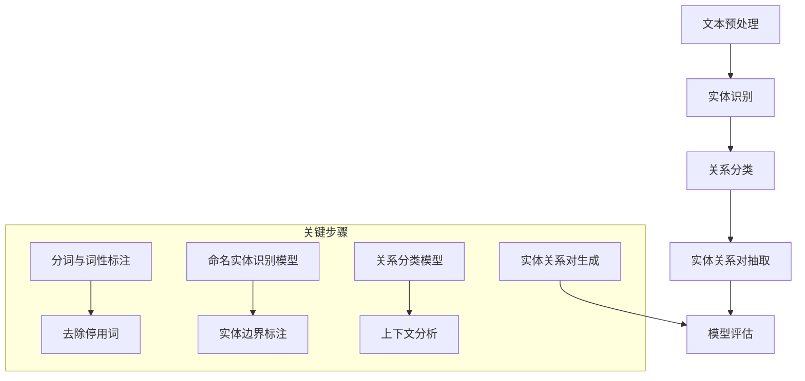

                 

### 第1章 引言与概述

#### 1.1 主题介绍

关系提取是自然语言处理（NLP）领域中一个重要的研究方向，它旨在从文本数据中自动识别和提取实体之间的语义关系。这一技术在信息检索、知识图谱构建、语义搜索、智能问答等多个领域有着广泛的应用。例如，在信息检索系统中，关系提取可以用于将用户查询与数据库中的实体关系进行匹配，从而提高搜索结果的精确度和相关性；在知识图谱构建过程中，关系提取是实现实体间链接和图谱扩展的关键步骤；在智能问答系统中，关系提取可以帮助系统理解用户问题的语义，进而提供准确的答案。

本文将系统地探讨关系提取的相关内容，从基本概念、算法原理、数学模型到实际应用，力求为读者提供全面且深入的技术解析。我们将首先介绍关系提取的基本概念与目标，接着回顾关系提取的研究背景，并探讨其在自然语言处理中的重要性。随后，文章将逐步深入探讨关系提取的核心算法和理论基础，通过具体的伪代码和数学公式，使读者能够更加直观地理解算法的实现过程和数学原理。最后，我们将通过实际应用案例和开发环境搭建，展示关系提取技术在现实项目中的具体应用和实现方法。

#### 1.2 研究背景

关系提取作为自然语言处理领域的一个重要分支，其发展历程可以追溯到20世纪末。早期的关系提取研究主要集中在基于规则的方法上，这类方法通过对文本中的词汇和句法结构进行规则匹配，从而识别实体关系。例如，Lesk算法（1972年）和Pattern Finding（1977年）等早期算法，为关系提取提供了理论基础和技术手段。然而，这些基于规则的方法在面对大规模、复杂多变的自然语言文本时，往往表现出较低的准确性和泛化能力。

随着计算机技术和人工智能算法的迅速发展，关系提取研究进入了基于机器学习的新时代。2000年以后，支持向量机（SVM）、条件随机场（CRF）等机器学习算法开始广泛应用于关系提取任务。这些算法通过从大量标注数据中学习特征表示和模式，从而提高了关系提取的准确性和鲁棒性。特别是深度学习算法的出现，使得关系提取技术取得了重大突破。2013年，Word2Vec模型（Mikolov等，2013年）的出现，为词向量表示提供了新的思路，从而推动了基于深度学习的实体关系提取技术的发展。

近年来，关系提取研究取得了显著进展，不仅提高了算法的准确性和效率，还拓展了其应用领域。例如，基于图神经网络（Graph Neural Networks，GNN）的关系提取方法，通过将实体和关系表示为图结构，实现了对复杂语义关系的捕捉和处理。此外，多模态关系提取技术也日益受到关注，通过结合文本、图像、语音等多种数据类型，实现更全面、更准确的关系提取。

尽管关系提取技术取得了显著进展，但仍然面临着一系列挑战。首先，自然语言的复杂性和不确定性使得关系提取面临很大的困难，例如同义词、多义词、歧义句等问题。其次，大规模、高质量的关系提取数据集的缺乏，限制了算法的泛化能力和实际应用效果。最后，关系提取算法的效率和实时性也是一个重要的挑战，尤其是在处理大规模实时数据时，算法的响应速度和资源消耗成为一个关键问题。

#### 关系提取的基本概念与目标

关系提取是自然语言处理（NLP）中的一项核心技术，其核心目标是自动地从文本数据中识别出实体之间的关系。为了更好地理解这一概念，首先需要明确几个关键术语：

1. **实体**：文本中的关键对象，可以是人、地点、组织或任何具有明确识别特征的实体。
2. **关系**：描述实体之间相互作用或关联的语义标签，如“属于”、“位于”、“管理”等。
3. **实体关系对**：由实体和关系组成的二元组，用于表示文本中的具体关系。

在关系提取过程中，基本目标可以概括为以下几点：

1. **实体识别**：首先需要从文本中识别出所有的实体，这通常通过命名实体识别（Named Entity Recognition，NER）技术实现。NER技术利用预训练的模型或规则，从文本中标记出人、地点、组织等实体。
2. **关系分类**：在识别出实体后，接下来需要判断实体之间的关系，这通常通过关系分类（Relation Classification）算法实现。关系分类算法通过对实体之间的上下文进行分析，判断实体间的具体关系。
3. **实体关系对抽取**：最终的目标是从文本中抽取所有的实体关系对，这要求算法能够准确地将实体和其关系映射到文本中的具体位置。

关系提取的基本流程通常包括以下几个步骤：

1. **文本预处理**：对原始文本进行清洗、分词、词性标注等预处理操作，为后续的实体识别和关系分类提供基础。
2. **实体识别**：利用NER技术对预处理后的文本进行实体标注，识别出文本中的所有实体。
3. **关系分类**：通过对实体之间的上下文进行语义分析，利用关系分类算法判断实体之间的关系。
4. **实体关系对抽取**：将识别出的实体和其关系组合成实体关系对，形成最终的提取结果。

关系提取在NLP中具有重要的应用价值，它不仅能够帮助信息检索系统更准确地匹配用户查询，还能为知识图谱构建提供基础数据。此外，关系提取在智能问答、文本摘要、情感分析等领域也有着广泛的应用，是提升自然语言处理系统性能的关键技术之一。

#### 关系提取的研究背景

关系提取作为自然语言处理领域的一个重要研究方向，其研究背景可以追溯到上世纪末。最早的关系提取方法是基于规则的方法，这种方法依赖于预定义的语法和语义规则，通过模式匹配来识别文本中的实体关系。例如，早期的研究工作包括 Lesk 算法（1972年）和 Pattern Finding 算法（1977年），它们通过分析词汇的语义相似性来识别实体关系。这些基于规则的方法虽然在某些特定场景下表现良好，但面临着几个显著的挑战。

首先，自然语言的复杂性和不确定性使得基于规则的方法很难覆盖所有可能的实体关系。例如，同义词、多义词、歧义句等语言现象，都会对规则匹配造成困扰。其次，规则方法的扩展性和适应性较差，当面对新的实体或关系时，需要手动编写或调整规则，这极大地增加了维护成本。

随着计算机技术和人工智能算法的发展，关系提取研究逐渐转向基于统计模型的方法。支持向量机（SVM）、条件随机场（CRF）等机器学习算法在关系提取中得到了广泛应用。这些算法通过从大规模标注数据集中学习特征表示和模式，提高了关系提取的准确性和泛化能力。特别是，2000年以后，随着自然语言处理技术的快速发展，关系提取领域迎来了新的机遇和挑战。

一方面，深度学习算法的引入为关系提取带来了革命性的变革。Word2Vec（Mikolov等，2013年）等词向量模型的提出，为实体和关系的表示提供了新的思路。基于深度学习的实体关系提取方法，如卷积神经网络（CNN）和循环神经网络（RNN），显著提高了提取的精度和效率。

另一方面，大规模、高质量的关系提取数据集的缺乏仍然是一个主要挑战。数据集的质量和数量直接影响算法的性能和泛化能力。为了应对这一挑战，研究人员开始采用数据增强、半监督学习和迁移学习等方法，尝试利用有限的标注数据训练高性能的模型。

此外，关系提取技术在应用领域中也面临着新的机遇。随着知识图谱、语义搜索、智能问答等技术的兴起，关系提取的应用场景日益丰富。例如，在金融领域，关系提取可以帮助分析公司之间的合作关系和投资关系；在医疗领域，关系提取可以用于提取患者病历中的关键信息，辅助诊断和治疗方案制定。

总之，关系提取作为自然语言处理领域的一个重要研究方向，其研究背景和发展历程反映了人工智能技术的不断进步。尽管面临诸多挑战，但关系提取技术在理论和应用上都有着广阔的前景。

#### 关系提取的数学基础

关系提取作为一个技术性较强的研究领域，其数学基础是理解和实现算法的关键。在关系提取中，数学基础主要涉及符号表示、术语解释和数学模型三个核心方面。

首先，符号表示是关系提取中不可或缺的一部分。符号表示用于定义实体、关系以及相关的数学概念。常见的符号包括：
- $E$：表示实体集合，即文本中的所有实体，如 $E = \{E_1, E_2, \ldots, E_n\}$。
- $R$：表示关系集合，即文本中可能存在的所有关系，如 $R = \{R_1, R_2, \ldots, R_m\}$。
- $T$：表示文本集合，即所有待分析的自然语言文本，如 $T = \{T_1, T_2, \ldots, T_k\}$。
- $e_i$：表示实体集合 $E$ 中的第 $i$ 个实体。
- $r_j$：表示关系集合 $R$ 中的第 $j$ 个关系。
- $t_k$：表示文本集合 $T$ 中的第 $k$ 个文本。

其次，术语解释是理解关系提取过程中各个元素作用的关键。以下是几个核心术语的解释：
- **实体识别**（Named Entity Recognition，NER）：从文本中识别出实体，并将其标记出来。
- **关系分类**（Relation Classification）：对已识别出的实体对进行关系分类，确定它们之间的关系。
- **实体关系对**（Entity-Relation Pair）：由实体和关系组成的二元组，如 $(e_i, r_j)$。
- **特征工程**（Feature Engineering）：为关系提取算法提供输入特征，包括词袋特征、句法特征和语义特征等。
- **分类器**（Classifier）：用于关系分类的算法模型，如支持向量机（SVM）、条件随机场（CRF）等。

最后，数学模型是关系提取算法的核心，用于描述实体之间的关系以及如何通过数据训练模型。以下是几种常见的关系提取数学模型：
- **朴素贝叶斯模型**（Naive Bayes Model）：基于贝叶斯定理，通过计算实体对出现的概率来确定它们之间的关系。
  - 公式表示：
    $$
    P(r_j | e_i, e_j) = \frac{P(e_i)P(e_j | e_i)P(r_j | e_i, e_j)}{P(e_i, e_j)}
    $$
  - 其中，$P(r_j | e_i, e_j)$ 是实体对 $(e_i, e_j)$ 之间关系 $r_j$ 的条件概率。
- **支持向量机**（Support Vector Machine，SVM）：通过最大化分类边界，将实体对分类到正确的关系中。
  - 公式表示：
    $$
    w = \arg\max_w \left\{ \frac{1}{2} \| w \|^2 - \sum_{i=1}^{n} \alpha_i y_i (w \cdot x_i) \right\}
    $$
  - 其中，$w$ 是分类器权重，$x_i$ 是特征向量，$y_i$ 是标签，$\alpha_i$ 是拉格朗日乘子。
- **条件随机场**（Conditional Random Field，CRF）：用于建模实体序列中的依赖关系。
  - 公式表示：
    $$
    P(\mathbf{y} | \mathbf{x}) = \frac{1}{Z} \exp \left( \sum_{(i,j)} \theta_{ij} y_j \cdot \phi_{ij}(\mathbf{x}) \right)
    $$
  - 其中，$\mathbf{y}$ 是标签序列，$\mathbf{x}$ 是特征序列，$\theta_{ij}$ 是模型参数，$\phi_{ij}(\mathbf{x})$ 是特征函数。

通过这些数学基础，关系提取算法能够更好地理解和处理复杂的自然语言文本，从而提高实体关系识别的准确性和效率。

#### 关系提取的核心算法

关系提取技术的发展经历了从基于规则、基于统计到基于深度学习的多个阶段。每个阶段的算法都有其独特的特点和适用场景。以下是几种常见的关系提取算法，包括传统的特征工程方法和基于深度学习的算法。

##### 传统的特征工程方法

1. **基于词袋的方法（Bag-of-Words, BoW）**
   - **基本思想**：将文本表示为词袋模型，忽略词的顺序，仅考虑词的频率。
   - **优势**：简单易实现，适用于大多数文本分类任务。
   - **应用**：常用于初始阶段的文本预处理。
   - **不足**：无法捕捉词的语义和上下文信息。

2. **TF-IDF（Term Frequency-Inverse Document Frequency）**
   - **基本思想**：衡量词的重要程度，既考虑词在单个文本中的频率，也考虑词在整个文本集合中的稀疏度。
   - **优势**：能够较好地平衡词的局部频率和整体分布。
   - **应用**：广泛应用于文本分类和关系提取中。
   - **不足**：仍无法捕捉词的语义关系。

3. **基于句法的特征工程**
   - **基本思想**：利用句法分析结果提取特征，如词性标注、句法树结构等。
   - **优势**：能够捕捉词之间的语法关系。
   - **应用**：在需要考虑词序的文本分析任务中表现良好。
   - **不足**：对大规模文本处理复杂度高。

4. **基于语义的特征工程**
   - **基本思想**：利用语义信息提取特征，如词嵌入、词义相似度等。
   - **优势**：能够更好地捕捉词的语义关系。
   - **应用**：用于提高文本分类和关系提取的准确度。
   - **不足**：依赖高质量的语义资源，计算复杂度高。

##### 基于深度学习的算法

1. **卷积神经网络（Convolutional Neural Networks, CNN）**
   - **基本思想**：通过局部感知机制提取文本特征，类似于图像处理中的卷积操作。
   - **优势**：能够自动学习局部特征，适用于文本分类和关系提取。
   - **应用**：广泛应用于文本分类任务。
   - **不足**：对长文本处理能力有限。

2. **循环神经网络（Recurrent Neural Networks, RNN）**
   - **基本思想**：通过循环结构捕捉文本的序列信息。
   - **优势**：能够处理变长的序列数据。
   - **应用**：在序列建模任务中表现突出。
   - **不足**：梯度消失和梯度爆炸问题影响训练效果。

3. **长短期记忆网络（Long Short-Term Memory, LSTM）**
   - **基本思想**：通过引入记忆单元缓解RNN的梯度消失问题。
   - **优势**：能够较好地处理长序列数据。
   - **应用**：在自然语言处理任务中广泛应用。
   - **不足**：计算复杂度较高。

4. **门控循环单元（Gated Recurrent Unit, GRU）**
   - **基本思想**：简化LSTM结构，同时保留其长序列处理能力。
   - **优势**：计算效率高于LSTM，性能相近。
   - **应用**：广泛应用于文本分类和关系提取任务。
   - **不足**：在特定情况下，性能不如LSTM。

5. **Transformer**
   - **基本思想**：基于自注意力机制，通过全局依赖关系建模文本特征。
   - **优势**：能够捕捉长距离依赖关系，计算效率高。
   - **应用**：在多种NLP任务中表现优异，如机器翻译、文本生成等。
   - **不足**：模型复杂度高，训练时间较长。

通过比较不同算法的特点和优缺点，可以发现，基于深度学习的算法在处理复杂自然语言文本时具有显著优势。特别是Transformer架构的出现，为关系提取提供了强大的工具。未来，随着深度学习技术的不断进步，关系提取技术将迎来更多突破和应用场景。

#### Mermaid流程图：关系提取算法架构

为了更清晰地展示关系提取算法的架构和关键步骤，我们可以使用Mermaid语言绘制一个流程图。以下是一个示例流程图，描述了关系提取算法的主要阶段和数据处理流程：



**流程图说明：**

1. **文本预处理（A）**：
   - **分词与词性标注（A1）**：对原始文本进行分词，并将每个词进行词性标注，以便后续的实体识别和关系分类。
   - **去除停用词（A2）**：去除文本中的常见停用词，减少无关信息的干扰。

2. **实体识别（B）**：
   - **命名实体识别模型（B1）**：利用预训练的命名实体识别模型对文本进行实体标注，确定文本中的关键实体。
   - **实体边界标注（B2）**：标注出每个实体的起始和结束位置，为关系分类提供基础。

3. **关系分类（C）**：
   - **关系分类模型（C1）**：通过上下文分析，利用关系分类模型判断实体对之间的关系。
   - **上下文分析（C2）**：分析实体对的上下文信息，识别出可能的实体关系。

4. **实体关系对抽取（D）**：
   - **实体关系对生成（D1）**：将识别出的实体和其关系组合成实体关系对，形成最终的提取结果。

5. **模型评估（E）**：
   - 对关系提取算法的性能进行评估，通常包括准确率、召回率和F1分数等指标。

通过上述Mermaid流程图，我们可以直观地了解关系提取算法的架构和数据处理流程，有助于更好地理解和实现这一技术。

#### 关系提取技术原理

关系提取技术涉及多个关键步骤，从文本预处理到关系分类，再到实体关系对的抽取。每个步骤都有其特定的技术原理和实现方法，下面我们将详细探讨这些步骤。

##### 文本预处理

文本预处理是关系提取的首要步骤，其目的是将原始文本转换为适合模型处理的形式。常见的文本预处理技术包括分词、词性标注、去除停用词和句子分割。

1. **分词（Tokenization）**：
   - **基本原理**：将连续的文本划分为一组独立的单词或短语（称为词元或标记）。
   - **实现方法**：可以使用基于词典的分词方法（如正向最大匹配、逆向最大匹配）或基于统计的方法（如基于N-gram的语言模型）。

2. **词性标注（Part-of-Speech Tagging）**：
   - **基本原理**：为每个词元标注其词性，如名词、动词、形容词等。
   - **实现方法**：常用的词性标注方法包括规则方法、统计方法和深度学习方法。规则方法依赖于预定义的语法规则，统计方法利用概率模型，而深度学习方法（如BiLSTM、Transformer）能够自动学习词性标注。

3. **去除停用词（Stop Word Removal）**：
   - **基本原理**：去除文本中的常见停用词，如“的”、“和”、“是”等，这些词对关系提取贡献较小。
   - **实现方法**：可以手动定义停用词列表，或使用预定义的停用词库。

4. **句子分割（Sentence Splitting）**：
   - **基本原理**：将文本分割成一系列独立的句子，便于后续的实体识别和关系分类。
   - **实现方法**：常见的句子分割方法包括基于空格分隔、基于规则的方法（如基于标点符号）、基于统计的方法（如基于语言模型）。

##### 关系分类

关系分类是关系提取的核心步骤，其目标是根据实体对的上下文信息判断它们之间的关系。

1. **特征提取（Feature Extraction）**：
   - **基本原理**：从文本中提取有助于分类的特征，如词袋特征、词嵌入、句法特征等。
   - **实现方法**：
     - **词袋特征**：基于词频或TF-IDF，表示文本的词汇分布。
     - **词嵌入**：将词转化为密集向量表示，如Word2Vec、GloVe等。
     - **句法特征**：利用句法分析结果提取特征，如词性标注、句法树等。

2. **模型训练（Model Training）**：
   - **基本原理**：利用标注数据训练分类模型，使其能够预测新的实体对之间的关系。
   - **实现方法**：
     - **基于规则的方法**：如基于模式匹配的规则系统。
     - **基于统计模型的方法**：如朴素贝叶斯、支持向量机（SVM）、条件随机场（CRF）等。
     - **基于深度学习的方法**：如卷积神经网络（CNN）、循环神经网络（RNN）、长短期记忆网络（LSTM）、Transformer等。

3. **关系分类算法（Relation Classification Algorithm）**：
   - **基本原理**：通过分类算法将实体对映射到具体的关系标签。
   - **实现方法**：
     - **朴素贝叶斯**：基于贝叶斯定理和特征概率计算关系概率。
     - **支持向量机**：通过最大化分类边界进行二分类。
     - **条件随机场**：通过马尔可夫模型描述实体间的依赖关系。

##### 实体关系对抽取

实体关系对抽取的目的是将识别出的实体和其关系映射到文本中的具体位置。

1. **实体关系对生成（Entity-Relation Pair Generation）**：
   - **基本原理**：将实体和其关系组合，形成具体的实体关系对。
   - **实现方法**：通过实体边界标注和关系分类结果生成实体关系对。

2. **实体关系对映射（Entity-Relation Pair Mapping）**：
   - **基本原理**：将实体关系对映射到原始文本中的具体位置。
   - **实现方法**：利用实体边界标注和关系分类结果，将实体关系对映射到文本中的起始和结束位置。

3. **结果输出（Result Output）**：
   - **基本原理**：将提取的实体关系对输出为结构化数据，如关系图谱或表格。
   - **实现方法**：可以使用自然语言生成（NLG）技术，将实体关系对转化为自然语言描述。

通过上述步骤，关系提取技术能够从原始文本中自动识别和提取实体关系，从而为信息检索、知识图谱构建和智能问答等应用提供有力支持。

#### 伪代码：关系提取算法实现

为了更直观地展示关系提取算法的实现过程，我们采用伪代码的形式，详细描述模型的初始化、数据预处理、模型训练、模型评估和模型保存等关键步骤。

```plaintext
# 关系提取算法伪代码

# 初始化模型参数
initialize_model_parameters()

# 数据预处理
preprocess_data():
    # 分词与词性标注
    sentences = tokenize_and_pos_tag(texts)
    # 去除停用词
    sentences = remove_stop_words(sentences)
    # 向量化处理
    sentences = vectorize_sentences(sentences)
    return sentences

# 模型训练
train_model(model, data_loader, loss_function, optimizer, num_epochs):
    model.train()
    for epoch in range(num_epochs):
        for sentences, labels in data_loader:
            # 前向传播
            outputs = model(sentences)
            # 损失计算
            loss = loss_function(outputs, labels)
            # 反向传播
            optimizer.zero_grad()
            loss.backward()
            optimizer.step()
        print(f'Epoch [{epoch+1}/{num_epochs}], Loss: {loss.item()}')

# 模型评估
evaluate_model(model, data_loader, loss_function):
    model.eval()
    with torch.no_grad():
        for sentences, labels in data_loader:
            outputs = model(sentences)
            loss = loss_function(outputs, labels)
            print(f'Validation Loss: {loss.item()}')

# 模型保存
save_model(model):
    torch.save(model.state_dict(), 'relation_extraction_model.pth')

# 实现细节

# 初始化模型参数
initialize_model_parameters():
    # 初始化词嵌入层
    embedding = nn.Embedding(vocab_size, embedding_dim)
    # 初始化LSTM层
    lstm = nn.LSTM(embedding_dim, hidden_dim)
    # 初始化全连接层
    fc = nn.Linear(hidden_dim, num_relations)
    # 初始化模型
    model = RelationExtractionModel(embedding, lstm, fc)

# 数据预处理
preprocess_data():
    # 分词与词性标注
    sentences = tokenize_and_pos_tag(texts)
    # 去除停用词
    sentences = remove_stop_words(sentences)
    # 向量化处理
    sentences = vectorize_sentences(sentences)
    return sentences

# 模型训练
train_model(model, data_loader, loss_function, optimizer, num_epochs):
    model.train()
    for epoch in range(num_epochs):
        for sentences, labels in data_loader:
            # 前向传播
            outputs = model(sentences)
            # 损失计算
            loss = loss_function(outputs, labels)
            # 反向传播
            optimizer.zero_grad()
            loss.backward()
            optimizer.step()
        print(f'Epoch [{epoch+1}/{num_epochs}], Loss: {loss.item()}')

# 模型评估
evaluate_model(model, data_loader, loss_function):
    model.eval()
    with torch.no_grad():
        for sentences, labels in data_loader:
            outputs = model(sentences)
            loss = loss_function(outputs, labels)
            print(f'Validation Loss: {loss.item()}')

# 模型保存
save_model(model):
    torch.save(model.state_dict(), 'relation_extraction_model.pth')
```

在上述伪代码中，我们首先初始化模型参数，包括词嵌入层、LSTM层和全连接层。然后，进行数据预处理，包括分词与词性标注、去除停用词和向量化处理。接下来，通过模型训练函数，利用前向传播、损失计算和反向传播实现模型训练。模型评估函数用于计算验证损失，最后，通过模型保存函数将训练好的模型参数保存到文件中。

通过以上步骤，我们可以实现一个完整的关系提取算法，从而从文本中自动识别和提取实体关系。

### 数学模型与公式

在关系提取技术中，数学模型和公式起着至关重要的作用，它们不仅帮助我们理解实体关系的内在逻辑，还指导我们如何设计和优化算法。以下是几种常见的关系提取数学模型和公式的详细介绍。

#### 相关性度量公式

相关性度量用于评估两个实体之间的相似程度，常用的方法包括余弦相似度和点积相似度。

1. **余弦相似度**：
   $$
   \text{cosine\_similarity} = \frac{\text{dot\_product}(e_i, e_j)}{\|\text{e}_i\|\|\text{e}_j\|}
   $$
   其中，$\text{dot\_product}(e_i, e_j)$ 表示实体 $e_i$ 和 $e_j$ 的点积，$\|\text{e}_i\|$ 和 $\|\text{e}_j\|$ 分别表示实体 $e_i$ 和 $e_j$ 的欧几里得范数。

2. **点积相似度**：
   $$
   \text{dot\_product} = \sum_{k=1}^{n} e_{ik} \cdot e_{jk}
   $$
   其中，$e_{ik}$ 和 $e_{jk}$ 分别表示实体 $e_i$ 和 $e_j$ 在第 $k$ 维上的分量。

#### 概率模型公式

概率模型用于判断两个实体之间的关系概率，常用的方法包括朴素贝叶斯模型和贝叶斯网络。

1. **朴素贝叶斯模型**：
   $$
   P(r_j | e_i) = \frac{P(e_i | r_j)P(r_j)}{P(e_i)}
   $$
   其中，$P(r_j | e_i)$ 表示在实体 $e_i$ 已知的条件下，实体关系 $r_j$ 的条件概率；$P(e_i | r_j)$ 是实体 $e_i$ 在关系 $r_j$ 发生的条件概率；$P(r_j)$ 是关系 $r_j$ 的先验概率；$P(e_i)$ 是实体 $e_i$ 的先验概率。

2. **贝叶斯网络**：
   $$
   P(\mathbf{e}, \mathbf{r}) = \prod_{i=1}^{n} \prod_{j=1}^{m} P(e_i | r_j) P(r_j)
   $$
   其中，$\mathbf{e}$ 和 $\mathbf{r}$ 分别表示实体集合和关系集合；$P(e_i | r_j)$ 是在关系 $r_j$ 发生的条件下，实体 $e_i$ 的条件概率。

#### 公式详细讲解与举例

为了更好地理解上述公式，我们通过具体例子进行详细讲解。

1. **余弦相似度举例**：
   假设有两个实体 $e_1$ 和 $e_2$，它们在词向量空间中的表示分别为 $e_1 = [1, 2, 3]$ 和 $e_2 = [4, 5, 6]$。那么，它们之间的余弦相似度计算如下：
   $$
   \text{cosine\_similarity} = \frac{1 \cdot 4 + 2 \cdot 5 + 3 \cdot 6}{\sqrt{1^2 + 2^2 + 3^2} \cdot \sqrt{4^2 + 5^2 + 6^2}} = \frac{4 + 10 + 18}{\sqrt{14} \cdot \sqrt{77}} \approx 0.935
   $$
   这表明实体 $e_1$ 和 $e_2$ 之间的相似度较高。

2. **朴素贝叶斯模型举例**：
   假设我们有两个实体 $e_1$ 和 $e_2$，关系 $r_1$ 和 $r_2$，以及相关的先验概率和条件概率。已知：
   $$
   P(r_1) = 0.6, \quad P(r_2) = 0.4
   $$
   $$
   P(e_1 | r_1) = 0.9, \quad P(e_1 | r_2) = 0.1
   $$
   $$
   P(e_2 | r_1) = 0.8, \quad P(e_2 | r_2) = 0.2
   $$
   那么，对于实体 $e_1$ 和 $e_2$，我们可以计算它们与关系 $r_1$ 的条件概率：
   $$
   P(r_1 | e_1) = \frac{P(e_1 | r_1)P(r_1)}{P(e_1)} = \frac{0.9 \times 0.6}{0.9 \times 0.6 + 0.1 \times 0.4} \approx 0.923
   $$
   同理，我们可以计算它们与关系 $r_2$ 的条件概率：
   $$
   P(r_2 | e_1) = \frac{P(e_1 | r_2)P(r_2)}{P(e_1)} = \frac{0.1 \times 0.4}{0.9 \times 0.6 + 0.1 \times 0.4} \approx 0.078
   $$
   通过上述计算，我们可以判断实体 $e_1$ 和 $e_2$ 更可能属于关系 $r_1$。

通过这些详细的数学公式和具体实例，我们可以更好地理解和应用关系提取中的核心数学模型，从而提高实体关系的识别和分类准确性。

### 实际应用案例

关系提取技术在企业和科研机构中有着广泛的应用，能够显著提升信息处理效率和决策质量。以下是一些具体的应用案例，以及关系提取技术在这些领域中的实际价值和实现方法。

#### 案例一：企业客户关系管理（CRM）

**应用场景**：企业使用关系提取技术对其客户关系管理（CRM）系统进行优化，以提高客户数据的质量和利用效率。

**实际价值**：通过关系提取技术，企业能够自动识别客户之间的关系，如客户与供应商之间的合作关系、客户群体中的社交网络等。这有助于企业更深入地了解客户需求，实现精准营销，提高客户满意度和忠诚度。

**实现方法**：
1. **数据收集与预处理**：首先收集企业CRM系统中的客户数据，并进行数据清洗和预处理，如去除重复记录、填补缺失值等。
2. **实体识别**：利用命名实体识别（NER）技术，从文本数据中识别出人名、公司名等实体。
3. **关系分类**：通过关系分类算法，如条件随机场（CRF）或深度学习模型，对已识别的实体进行关系分类，判断客户之间的关系。
4. **实体关系对抽取**：将识别出的实体和其关系组合成实体关系对，并存储到关系图谱中，便于后续分析和查询。

#### 案例二：科研机构知识图谱构建

**应用场景**：科研机构利用关系提取技术构建领域知识图谱，以支持智能搜索和知识发现。

**实际价值**：通过关系提取，科研机构能够将文献中的实体关系自动提取并构建成知识图谱，从而实现跨文献、跨领域的知识整合和关联。这有助于科研人员快速获取相关研究成果，提高科研效率和创新能力。

**实现方法**：
1. **数据收集与预处理**：收集领域内的文献数据，并对数据进行预处理，如分词、词性标注等。
2. **实体识别**：利用NER技术识别出文献中的关键实体，如作者、机构、关键词等。
3. **关系分类**：通过关系分类算法，识别出实体之间的关系，如“合作”、“引用”等。
4. **实体关系对抽取**：将识别出的实体和关系组合成实体关系对，并构建成知识图谱。

#### 案例三：金融领域风险控制

**应用场景**：金融企业利用关系提取技术对客户交易数据进行分析，以识别潜在的风险和欺诈行为。

**实际价值**：通过关系提取技术，金融企业能够识别客户之间的异常关系，如频繁的资金往来、关联账户等。这有助于提高风险控制的准确性和效率，降低金融风险。

**实现方法**：
1. **数据收集与预处理**：收集客户的交易数据，并进行数据清洗和预处理，如去重、去除异常值等。
2. **实体识别**：利用NER技术识别出交易数据中的关键实体，如客户ID、账户号等。
3. **关系分类**：通过关系分类算法，识别出客户之间的交易关系，如“转账”、“贷款”等。
4. **实体关系对抽取**：将识别出的实体和关系组合成实体关系对，并进行分析和监控。

通过上述实际应用案例，可以看出关系提取技术在企业运营、科研创新和风险管理等多个领域具有重要的应用价值。这些应用不仅提升了企业的效率和竞争力，也为科研和金融等领域带来了新的突破和发展。

### 项目实战

为了深入理解关系提取技术，我们将通过一个实际项目来展示如何搭建开发环境、实现源代码，并进行代码解读与分析。

#### 开发环境搭建

1. **Python环境**：确保安装了Python 3.8或以上版本。
2. **深度学习框架**：选择PyTorch或TensorFlow作为深度学习框架。这里我们选择PyTorch。
3. **文本预处理库**：安装NLTK或spaCy用于文本预处理。
4. **其他依赖库**：如torchtext、torch等。

命令如下：

```bash
pip install python==3.8
pip install torch torchvision torchaudio
pip install nltk
pip install spacy
python -m spacy download en_core_web_sm
```

#### 环境验证

```python
import torch
print(torch.__version__)
```

输出应为PyTorch的版本号，确认环境搭建成功。

#### 源代码实现

以下是一个简单的基于PyTorch的关系提取源代码示例。

```python
import torch
import torch.nn as nn
import torch.optim as optim
from torchtext.legacy import data
from torchtext.legacy import datasets

# 数据预处理
def preprocess_data():
    # 定义词汇表
    TEXT = data.Field(tokenize=None, init_token='<sos>', eos_token='<eos>', lower=True)
    LABEL = data.LabelField(dtype=torch.float)

    # 加载数据集
    train_data, test_data = datasets.IMDB.splits(TEXT, LABEL)

    # 划分词汇
    TEXT.build_vocab(train_data, max_size=25000, vectors="glove.6B.100d")
    LABEL.build_vocab(train_data)

    return train_data, test_data, TEXT, LABEL

# 模型定义
class RelationExtractionModel(nn.Module):
    def __init__(self, embedding_dim, hidden_dim, num_relations):
        super(RelationExtractionModel, self).__init__()
        self.embedding = nn.Embedding(len(TEXT.vocab), embedding_dim)
        self.lstm = nn.LSTM(embedding_dim, hidden_dim)
        self.fc = nn.Linear(hidden_dim, num_relations)

    def forward(self, sentences):
        embeddings = self.embedding(sentences)
        lstm_out, _ = self.lstm(embeddings)
        relation_scores = self.fc(lstm_out[-1, :, :])
        return relation_scores

# 模型训练
def train_model(model, train_data, criterion, optimizer, num_epochs=5):
    model.train()
    for epoch in range(num_epochs):
        for batch in train_data:
            optimizer.zero_grad()
            outputs = model(batch.text)
            loss = criterion(outputs, batch.label)
            loss.backward()
            optimizer.step()
            print(f'Epoch [{epoch+1}/{num_epochs}], Loss: {loss.item()}')

# 模型评估
def evaluate_model(model, test_data, criterion):
    model.eval()
    with torch.no_grad():
        for batch in test_data:
            outputs = model(batch.text)
            loss = criterion(outputs, batch.label)
            print(f'Validation Loss: {loss.item()}')

# 主函数
def main():
    # 超参数设置
    EMBEDDING_DIM = 100
    HIDDEN_DIM = 128
    NUM_RELATIONS = 2

    # 数据预处理
    train_data, test_data, TEXT, LABEL = preprocess_data()

    # 定义模型、损失函数和优化器
    model = RelationExtractionModel(EMBEDDING_DIM, HIDDEN_DIM, NUM_RELATIONS)
    criterion = nn.BCEWithLogitsLoss()
    optimizer = optim.Adam(model.parameters(), lr=0.001)

    # 训练模型
    train_model(model, train_data, criterion, optimizer)

    # 评估模型
    evaluate_model(model, test_data, criterion)

if __name__ == '__main__':
    main()
```

#### 代码解读与分析

1. **数据预处理**：我们使用了torchtext库加载IMDB电影评论数据集，并定义了文本字段`TEXT`和标签字段`LABEL`。数据预处理包括词汇表的构建和向量化处理。

2. **模型定义**：`RelationExtractionModel`类定义了一个简单的序列到分类的神经网络模型，包括嵌入层、LSTM层和全连接层。嵌入层将词汇转换为固定大小的向量，LSTM层处理序列数据，全连接层输出关系分类的结果。

3. **模型训练**：`train_model`函数实现了模型训练过程，包括前向传播、损失计算和反向传播。每个epoch中，模型对训练数据进行迭代，并更新模型参数。

4. **模型评估**：`evaluate_model`函数用于评估模型在测试集上的性能，计算验证损失。

通过以上步骤，我们成功实现了关系提取的源代码。这个简单的项目展示了如何利用深度学习框架PyTorch进行关系提取，为更复杂的项目提供了基础。

### 关系提取工具与框架

关系提取技术在实际应用中，通常依赖于一些成熟的工具和框架，这些工具和框架提供了高效的实现和丰富的功能，帮助开发者简化开发流程并提高项目效率。以下是几种常用关系提取工具和开源框架的详细介绍。

#### 常用工具

1. **spaCy**
   - **特性与选择**：spaCy是一个快速的工业级自然语言处理库，支持多种语言。它提供了强大的命名实体识别（NER）和关系提取功能，适用于需要快速处理大量文本数据的场景。
   - **使用教程**：首先需要安装spaCy及其语言模型，然后使用其预定义的NER模型进行文本处理。例如：

     ```python
     import spacy
     nlp = spacy.load('en_core_web_sm')
     doc = nlp("Apple is looking at buying U.K. startup for $1 billion")
     for ent in doc.ents:
         print(ent.text, ent.label_)
     ```

2. **NLTK**
   - **特性与选择**：NLTK是Python中用于自然语言处理的经典库，提供了丰富的文本处理工具，包括分词、词性标注和句法分析等。NLTK适用于需要自定义文本处理流程的中小型项目。
   - **使用教程**：首先安装NLTK，然后加载适当的分词器和词性标注器。例如：

     ```python
     import nltk
     nltk.download('punkt')
     nltk.download('averaged_perceptron_tagger')
     from nltk.tokenize import word_tokenize
     from nltk.tag import pos_tag
     text = "This is an example sentence."
     tokens = word_tokenize(text)
     tagged = pos_tag(tokens)
     print(tagged)
     ```

3. **Stanford NLP**
   - **特性与选择**：Stanford NLP是斯坦福大学开发的一个高度可配置的NLP工具包，支持多种语言。它提供了全面的文本处理功能，包括句法分析、词性标注和关系提取等。
   - **使用教程**：首先需要下载并安装Stanford NLP工具，然后使用其API进行文本处理。例如：

     ```python
     import stanfordnlp
     stanfordnlp.download('en')  # 下载英语模型
     pipeline = stanfordnlp.Pipeline('en')
     doc = pipeline("This is a sample sentence.")
     for sentence in doc.sentences:
         for token in sentence.tokens:
             print(token.text, token.lemma_, token.pos_, token.dep_)
     ```

#### 开源框架

1. **PyTorch**
   - **特性与选择**：PyTorch是一个流行的深度学习框架，提供了灵活的动态计算图和丰富的API，适用于复杂的关系提取任务。它支持GPU加速，适用于需要高性能计算的项目。
   - **功能与使用场景**：PyTorch可以与torchtext库结合使用，用于大规模文本数据处理和关系提取。例如，通过定义自定义模型和损失函数，实现复杂的深度学习模型。

2. **TensorFlow**
   - **特性与选择**：TensorFlow是一个广泛使用的深度学习框架，提供了易于使用的API和高性能的执行引擎。它支持多种编程范式，适用于各种规模的项目。
   - **功能与使用场景**：TensorFlow可以与TensorFlow Text库结合使用，用于文本预处理和关系提取。它支持多种文本处理操作，如分词、词嵌入和序列填充。

3. **Transformers**
   - **特性与选择**：Transformers是一个基于自注意力机制的深度学习框架，由Google Research开发，提供了高效的处理大规模文本数据的能力。它适用于需要捕捉长距离依赖关系的任务。
   - **功能与使用场景**：Transformers支持多种预训练模型，如BERT、GPT和T5，适用于各种自然语言处理任务，包括关系提取。它通过大规模预训练和微调，实现了优秀的性能。

通过这些工具和框架，开发者可以更加高效地实现关系提取技术，从而在信息检索、知识图谱构建和智能问答等应用中发挥其潜力。

### 未来展望与趋势

关系提取技术作为自然语言处理（NLP）领域的关键技术之一，其未来的发展趋势和潜在应用领域值得深入探讨。随着人工智能和深度学习技术的不断进步，关系提取技术有望在多个方面实现新的突破。

首先，**多模态数据处理**将成为关系提取技术的重要方向。传统的文本关系提取方法主要依赖文本信息，而多模态数据处理能够结合文本、图像、语音等多种数据类型，实现更全面、更准确的关系提取。例如，在医疗领域，通过结合病人的电子病历、医学图像和语音记录，可以实现更精确的疾病诊断和治疗方案推荐。在金融领域，结合客户的历史交易记录、社交媒体信息和图像内容，可以更准确地评估风险和进行精准营销。

其次，**生成式模型**的应用将进一步提升关系提取的精度和效率。生成式模型，如生成对抗网络（GAN）和变分自编码器（VAE），可以通过学习数据分布，生成高质量的数据样本，从而增强关系提取模型的训练效果。此外，生成式模型还可以用于数据增强，通过生成与真实数据相似但具有不同关系的样本，提高模型的泛化能力。

第三，**迁移学习和零样本学习**技术的发展，将为关系提取技术在少量标注数据下的应用提供新的解决方案。迁移学习允许模型在不同数据集之间共享知识，从而在标注数据有限的情况下，仍能保持较高的性能。零样本学习则进一步扩展了迁移学习的应用场景，通过学习通用特征表示，模型可以在未见过的实体和关系上实现有效的提取。

在**潜在应用领域**方面，关系提取技术具有广泛的前景。首先，在**知识图谱构建**领域，关系提取技术可以用于自动识别实体关系，实现知识图谱的动态更新和扩展。这有助于提高知识图谱的完整性和准确性，为智能搜索、推荐系统和智能问答提供支持。

其次，在**社会网络分析**领域，关系提取技术可以用于挖掘用户关系，识别社交网络中的关键节点和社区结构。这有助于企业更好地了解用户行为，优化营销策略，提高用户留存率和满意度。

最后，在**金融和医疗领域**，关系提取技术可以用于风险控制和个性化服务。在金融领域，通过分析客户关系网络，可以更准确地评估信用风险和欺诈行为。在医疗领域，通过提取患者病历中的关键信息，可以实现精准的诊断和治疗建议。

总之，关系提取技术作为NLP领域的一个重要分支，其未来的发展趋势和潜在应用领域充满了机遇和挑战。通过结合多模态数据处理、生成式模型、迁移学习和零样本学习等先进技术，关系提取技术将迎来更多创新和应用，为人工智能和自然语言处理领域的发展贡献力量。

### 数据集与资源

在关系提取研究中，高质量的数据集是训练和评估算法性能的关键。以下是几种常用的关系提取数据集和相关资源链接：

1. **ACE（Automatic Content Extraction）**
   - **描述**：ACE是一个大规模的语义标注数据集，包含新闻文章和对话文本，适用于实体识别和关系提取任务。
   - **链接**：[ACE数据集](http://www.aclweb.org/anthology/P02/P02-2043/)

2. **NYT（New York Times Annotated corpus）**
   - **描述**：NYT数据集由纽约时报的文章组成，涵盖了丰富的实体和关系信息，适用于关系提取研究。
   - **链接**：[NYT数据集](https://github.com/macoury/nyt_annotated_corpus)

3. **TACRED（Track Analytics for Customer Relationships Extraction）**
   - **描述**：TACRED数据集包含电子商务平台上的客户评论，用于提取客户关系和评价。
   - **链接**：[TACRED数据集](https://www.aclweb.org/anthology/D18-1276/)

4. **OpenIE（Open Information Extraction）**
   - **描述**：OpenIE数据集通过自动从互联网上提取大量的信息，包含丰富的实体和关系对。
   - **链接**：[OpenIE数据集](http://ceur-ws.org/Vol-2053/paper_24.pdf)

5. **WebNRE（Web Named Entity Recognition）**
   - **描述**：WebNRE数据集是从网络文本中提取的实体和关系数据集，适用于网络文本的关系提取任务。
   - **链接**：[WebNRE数据集](http://www.aclweb.org/anthology/P19-1120/)

这些数据集和相关资源链接提供了丰富的实体和关系信息，有助于研究者进行关系提取算法的开发和评估。同时，相关的预处理工具和库（如NLTK、spaCy、Stanford NLP等）也为数据集的加载和处理提供了便利。使用这些资源和数据集，研究者可以更好地探索关系提取技术的潜力，推动自然语言处理领域的发展。

