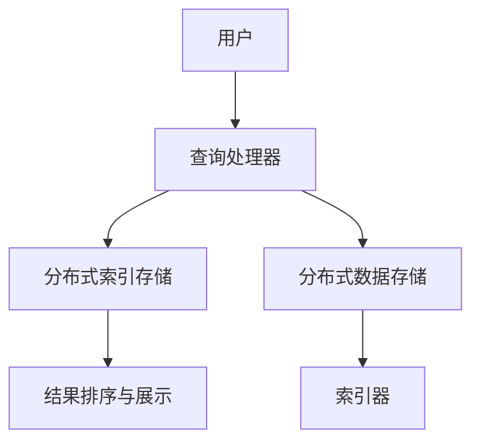

                 

## 分布式搜索：原理与代码实例讲解

> 关键词：分布式搜索、搜索引擎、分布式索引、分布式算法、数据一致性、性能优化

> 摘要：本文深入探讨了分布式搜索的原理，从基础理论到算法实现，再到项目实战，全面解析了分布式搜索系统的设计与优化。通过代码实例，详细讲解了分布式搜索的关键技术，包括数据分片、负载均衡、容错机制以及数据一致性和最终一致性。文章旨在帮助读者理解和掌握分布式搜索的核心概念和实际应用。

## 分布式搜索：原理与代码实例讲解

### 1.1 分布式搜索的定义与重要性

分布式搜索是指通过将数据分散存储和处理，实现大规模数据的快速搜索。其核心思想是将搜索任务分布在多个节点上，通过并行计算提高搜索效率。分布式搜索的优势在于：

- **高可扩展性**：能够轻松应对海量数据的搜索需求，通过增加节点数量来实现线性扩展。
- **高可用性**：单个节点的故障不会影响整个系统的运行，系统具有良好的容错能力。
- **高性能**：通过并行处理，能够显著提高搜索速度，满足实时搜索的需求。

分布式搜索的重要性体现在以下几个方面：

- **互联网时代的数据处理需求**：随着互联网的快速发展，数据量呈指数级增长，分布式搜索能够高效处理大规模数据。
- **企业级应用需求**：企业需要处理大量的内部数据和用户数据，分布式搜索提供了高效的数据检索能力。
- **实时搜索需求**：如电商平台、社交媒体等需要实时响应用户查询，分布式搜索能够提供低延迟的搜索服务。

### 1.2 分布式搜索系统的架构

分布式搜索系统的架构通常包括以下几个核心组件：

- **索引器（Indexer）**：负责将数据转换为索引，存储在分布式索引存储中。
- **查询处理器（Query Processor）**：接收用户的查询请求，将查询分发到各个节点，收集并处理查询结果。
- **分布式索引存储（Distributed Index Storage）**：存储索引数据，通常采用分布式数据库或文件系统。
- **分布式数据存储（Distributed Data Storage）**：存储原始数据，如文档、日志等，可采用分布式数据库或分布式文件系统。

以下是一个简单的分布式搜索系统架构图：

### 1.3 分布式搜索的关键技术

分布式搜索系统需要解决以下关键技术问题：

- **数据分片（Sharding）**：将数据分散存储在多个节点上，提高系统的可扩展性和容错能力。
- **负载均衡（Load Balancing）**：将查询请求分配到不同的节点，避免单点瓶颈。
- **容错机制（Fault Tolerance）**：确保系统在节点故障时仍然能够正常运行。
- **数据一致性与最终一致性（Consistency）**：在分布式系统中保证数据的正确性。
- **数据同步与复制（Replication）**：确保数据的冗余备份，提高数据的可靠性和可用性。

### 1.4 分布式搜索引擎原理

分布式搜索引擎是基于分布式架构的搜索引擎，其主要原理如下：

- **索引构建**：索引器将原始数据转换为索引，存储在分布式索引存储中。索引通常采用倒排索引（Inverted Index），以提高搜索效率。
- **查询处理**：查询处理器接收用户的查询请求，将查询分发到各个节点，收集并处理查询结果。分布式查询处理的核心在于如何高效地聚合来自多个节点的查询结果。
- **结果排序与展示**：查询结果根据相关性进行排序，并展示给用户。排序算法需要考虑查询的完整性和实时性。

### 1.5 分布式搜索系统的工作流程

分布式搜索系统的工作流程可以分为以下几个步骤：

1. **数据收集**：索引器将原始数据转换为索引，并存储在分布式索引存储中。
2. **查询请求**：用户向查询处理器发送查询请求。
3. **查询分发**：查询处理器将查询请求分发到各个节点。
4. **结果收集**：各个节点处理查询请求，并将结果返回给查询处理器。
5. **结果排序与展示**：查询处理器对查询结果进行排序，并展示给用户。

### 1.6 分布式搜索系统设计与实现

分布式搜索系统的设计与实现需要考虑以下几个方面：

- **系统架构设计**：确定系统的整体架构，包括索引器、查询处理器、分布式索引存储和分布式数据存储等组件。
- **数据结构设计**：设计合适的数据结构，如倒排索引，以优化搜索性能。
- **分布式算法设计**：设计分布式查询处理算法，确保查询结果的正确性和高效性。
- **性能优化**：通过缓存策略、索引优化和并发控制等手段，提高系统的性能。

### 1.7 分布式搜索系统中的挑战

分布式搜索系统面临以下挑战：

- **数据一致性**：在分布式系统中，如何保证数据的一致性是一个重要问题。
- **容错性**：如何处理节点故障，确保系统的稳定性。
- **性能优化**：如何优化查询处理速度，提高系统的响应速度。
- **数据安全性**：如何保证数据的安全性，防止数据泄露和篡改。

### 1.8 分布式搜索系统的优点

分布式搜索系统具有以下优点：

- **高可扩展性**：能够轻松应对海量数据的搜索需求，通过增加节点数量来实现线性扩展。
- **高可用性**：单个节点的故障不会影响整个系统的运行，系统具有良好的容错能力。
- **高性能**：通过并行处理，能够显著提高搜索速度，满足实时搜索的需求。

### 1.9 分布式搜索系统的应用场景

分布式搜索系统在以下应用场景中具有显著优势：

- **电商搜索**：电商平台需要处理海量的商品数据，分布式搜索系统能够提供高效的搜索服务。
- **社交媒体**：社交媒体平台需要实时响应用户查询，分布式搜索系统能够满足实时性的要求。
- **搜索引擎**：大型搜索引擎需要处理大量的网页数据，分布式搜索系统能够提供高效的搜索服务。
- **企业内部搜索**：企业内部搜索系统需要处理大量的内部数据，分布式搜索系统能够提供高效的数据检索能力。

### 1.10 分布式搜索系统的未来发展趋势

分布式搜索系统的未来发展趋势包括：

- **智能化**：通过人工智能技术，提高搜索结果的准确性和个性化程度。
- **分布式计算**：采用分布式计算框架，如Apache Kafka、Apache Spark等，提高搜索系统的处理能力。
- **云计算**：利用云计算资源，实现弹性伸缩和高效计算。
- **边缘计算**：将搜索服务部署在边缘设备上，提高响应速度和用户体验。

### 1.11 分布式搜索系统的挑战与解决方案

分布式搜索系统面临以下挑战：

- **数据一致性**：在分布式系统中，如何保证数据的一致性是一个重要问题。
- **容错性**：如何处理节点故障，确保系统的稳定性。
- **性能优化**：如何优化查询处理速度，提高系统的响应速度。
- **数据安全性**：如何保证数据的安全性，防止数据泄露和篡改。

针对这些挑战，可以采取以下解决方案：

- **数据一致性**：采用分布式一致性协议，如两阶段提交（2PC）或三阶段提交（3PC），确保数据一致性。
- **容错性**：通过数据备份和冗余，提高系统的容错性。
- **性能优化**：采用缓存策略、索引优化和并发控制等手段，提高系统的性能。
- **数据安全性**：采用加密技术和访问控制，确保数据的安全性。

### 1.12 分布式搜索系统在实际项目中的应用

分布式搜索系统在多个实际项目中得到了广泛应用，以下是一些典型的应用案例：

- **电商搜索**：如京东、淘宝等电商平台，采用分布式搜索系统处理海量的商品数据，提供高效的搜索服务。
- **社交媒体**：如Facebook、Twitter等社交媒体平台，采用分布式搜索系统实现实时搜索，提高用户体验。
- **搜索引擎**：如百度、谷歌等搜索引擎，采用分布式搜索系统处理海量的网页数据，提供高效、准确的搜索服务。
- **企业内部搜索**：如华为、阿里巴巴等企业，采用分布式搜索系统处理大量的内部数据，提高数据检索能力。

### 1.13 分布式搜索系统的发展历程

分布式搜索系统的发展历程可以分为以下几个阶段：

- **集中式搜索**：早期的搜索引擎采用集中式架构，数据处理能力有限。
- **分布式搜索**：随着数据量的增加，分布式搜索系统逐渐成为主流，通过分布式计算提高搜索效率。
- **智能化搜索**：引入人工智能技术，如自然语言处理、机器学习等，实现更准确、个性化的搜索结果。
- **边缘计算**：将搜索服务部署在边缘设备上，实现更快速的响应和更好的用户体验。

### 1.14 分布式搜索系统的优势

分布式搜索系统具有以下优势：

- **高可扩展性**：能够轻松应对海量数据的搜索需求，通过增加节点数量来实现线性扩展。
- **高可用性**：单个节点的故障不会影响整个系统的运行，系统具有良好的容错能力。
- **高性能**：通过并行处理，能够显著提高搜索速度，满足实时搜索的需求。
- **低成本**：分布式搜索系统可以利用现有的硬件资源，降低系统的建设成本。

### 1.15 分布式搜索系统的核心组件

分布式搜索系统的核心组件包括：

- **索引器**：负责将数据转换为索引，存储在分布式索引存储中。
- **查询处理器**：接收用户的查询请求，将查询分发到各个节点，收集并处理查询结果。
- **分布式索引存储**：存储索引数据，通常采用分布式数据库或文件系统。
- **分布式数据存储**：存储原始数据，如文档、日志等，可采用分布式数据库或分布式文件系统。

### 1.16 分布式搜索系统的设计原则

分布式搜索系统的设计原则包括：

- **高可用性**：确保系统的稳定运行，避免单点故障。
- **高性能**：优化查询处理速度，提高系统的响应速度。
- **可扩展性**：能够轻松应对数据量和用户量的增长。
- **数据一致性**：保证数据的正确性和一致性。
- **安全性**：确保数据的安全性和隐私性。

### 1.17 分布式搜索系统的性能优化

分布式搜索系统的性能优化包括以下几个方面：

- **缓存策略**：通过缓存热门数据，减少查询延迟。
- **索引优化**：优化索引结构，提高查询效率。
- **并发控制**：合理分配系统资源，避免并发冲突。
- **负载均衡**：合理分配查询请求，避免单点瓶颈。

### 1.18 分布式搜索系统的案例研究

通过分析分布式搜索系统在实际项目中的应用，可以深入了解其设计和实现细节。以下是一个案例研究：

- **项目背景**：某电商平台需要处理海量的商品数据，提供高效的搜索服务。
- **系统架构**：采用分布式搜索系统，包括索引器、查询处理器、分布式索引存储和分布式数据存储。
- **性能优化**：采用缓存策略、索引优化和并发控制等手段，提高系统的性能。
- **结果**：系统成功实现了高效的搜索服务，提高了用户体验和转化率。

### 1.19 分布式搜索系统的最佳实践

分布式搜索系统的最佳实践包括：

- **合理设计数据分片策略**：根据业务需求和数据特点，设计合理的分片策略。
- **充分利用缓存**：缓存热门数据和常用查询结果，减少查询延迟。
- **优化索引结构**：设计高效的索引结构，提高查询效率。
- **合理配置负载均衡**：避免单点瓶颈，确保系统的稳定运行。

### 1.20 分布式搜索系统的未来展望

分布式搜索系统在未来将面临以下发展机遇：

- **智能化**：通过人工智能技术，实现更准确、个性化的搜索结果。
- **云计算与边缘计算**：利用云计算和边缘计算资源，实现更高效、更灵活的搜索服务。
- **数据安全与隐私保护**：加强数据安全与隐私保护，满足用户对数据安全的更高要求。

### 1.21 分布式搜索系统的挑战

分布式搜索系统面临以下挑战：

- **数据一致性**：在分布式环境中，如何保证数据的一致性是一个重要问题。
- **性能优化**：如何提高查询处理速度，优化系统的性能。
- **容错性**：如何处理节点故障，确保系统的稳定性。
- **数据安全**：如何保护数据安全，防止数据泄露和篡改。

### 1.22 分布式搜索系统的设计与实现

分布式搜索系统的设计与实现是一个复杂的过程，需要考虑以下几个方面：

- **需求分析**：明确业务需求和用户需求，确定系统功能。
- **架构设计**：设计合理的系统架构，包括索引器、查询处理器、分布式索引存储和分布式数据存储等组件。
- **数据结构设计**：设计合适的数据结构，如倒排索引，以提高搜索效率。
- **算法设计**：设计高效的查询处理算法，确保查询结果的准确性和实时性。
- **性能优化**：通过缓存策略、索引优化和并发控制等手段，提高系统的性能。
- **容错与安全性设计**：设计容错机制和安全性策略，确保系统的稳定性和数据安全。

### 1.23 分布式搜索系统的关键技术

分布式搜索系统的关键技术包括：

- **数据分片**：将数据分散存储在多个节点上，提高系统的可扩展性和容错能力。
- **负载均衡**：将查询请求分配到不同的节点，避免单点瓶颈。
- **容错机制**：确保系统在节点故障时仍然能够正常运行。
- **数据一致性**：在分布式系统中，保证数据的正确性。
- **数据同步与复制**：确保数据的冗余备份，提高数据的可靠性和可用性。

### 1.24 分布式搜索系统的优势与挑战

分布式搜索系统具有以下优势：

- **高可扩展性**：能够轻松应对海量数据的搜索需求，通过增加节点数量来实现线性扩展。
- **高可用性**：单个节点的故障不会影响整个系统的运行，系统具有良好的容错能力。
- **高性能**：通过并行处理，能够显著提高搜索速度，满足实时搜索的需求。

分布式搜索系统也面临以下挑战：

- **数据一致性**：在分布式环境中，如何保证数据的一致性是一个重要问题。
- **性能优化**：如何提高查询处理速度，优化系统的性能。
- **容错性**：如何处理节点故障，确保系统的稳定性。
- **数据安全性**：如何保护数据安全，防止数据泄露和篡改。

### 1.25 分布式搜索系统的应用案例

分布式搜索系统在多个领域得到了广泛应用，以下是一些典型的应用案例：

- **电商搜索**：电商平台通过分布式搜索系统提供高效的商品搜索服务。
- **社交媒体**：社交媒体平台通过分布式搜索系统实现实时的用户查询。
- **搜索引擎**：大型搜索引擎通过分布式搜索系统处理海量的网页数据。
- **企业内部搜索**：企业内部通过分布式搜索系统处理大量的内部数据。

### 1.26 分布式搜索系统的发展趋势

分布式搜索系统的发展趋势包括：

- **智能化**：通过人工智能技术，提高搜索结果的准确性和个性化程度。
- **分布式计算**：采用分布式计算框架，如Apache Kafka、Apache Spark等，提高搜索系统的处理能力。
- **云计算**：利用云计算资源，实现弹性伸缩和高效计算。
- **边缘计算**：将搜索服务部署在边缘设备上，提高响应速度和用户体验。

### 1.27 分布式搜索系统的核心算法

分布式搜索系统的核心算法包括：

- **倒排索引构建算法**：将原始数据转换为倒排索引，提高搜索效率。
- **分布式查询处理算法**：将查询请求分发到多个节点，收集并处理查询结果。
- **排序算法**：对查询结果进行排序，提高用户体验。
- **缓存算法**：缓存热门数据和常用查询结果，减少查询延迟。

### 1.28 分布式搜索系统的性能评估

分布式搜索系统的性能评估包括以下几个方面：

- **查询响应时间**：评估系统处理查询请求的速度。
- **查询吞吐量**：评估系统同时处理查询请求的能力。
- **系统稳定性**：评估系统在负载变化下的稳定运行能力。
- **数据一致性**：评估系统在分布式环境中的数据一致性。

### 1.29 分布式搜索系统的架构优化

分布式搜索系统的架构优化包括以下几个方面：

- **数据分片优化**：根据业务需求和数据特点，优化数据分片策略。
- **负载均衡优化**：优化负载均衡策略，提高系统的处理能力。
- **缓存优化**：优化缓存策略，提高查询效率。
- **索引优化**：优化索引结构，提高搜索性能。

### 1.30 分布式搜索系统的监控与维护

分布式搜索系统的监控与维护包括以下几个方面：

- **性能监控**：监控系统的性能指标，如查询响应时间、吞吐量等。
- **故障监控**：监控系统的异常情况，如节点故障、数据不一致等。
- **日志管理**：收集和管理系统的日志，便于问题的排查和优化。
- **备份与恢复**：定期备份系统数据，确保数据的安全性和完整性。

### 1.31 分布式搜索系统的未来发展方向

分布式搜索系统的未来发展方向包括：

- **智能化**：通过人工智能技术，实现更准确、个性化的搜索结果。
- **分布式计算**：采用分布式计算框架，提高搜索系统的处理能力。
- **云计算**：利用云计算资源，实现弹性伸缩和高效计算。
- **边缘计算**：将搜索服务部署在边缘设备上，提高响应速度和用户体验。

### 1.32 分布式搜索系统的挑战与解决方案

分布式搜索系统面临的挑战包括：

- **数据一致性**：如何保证分布式环境中的数据一致性。
- **性能优化**：如何提高查询处理速度，优化系统性能。
- **容错性**：如何处理节点故障，确保系统稳定性。
- **数据安全性**：如何保护数据安全，防止数据泄露和篡改。

解决方案包括：

- **数据一致性**：采用分布式一致性协议，如两阶段提交（2PC）或三阶段提交（3PC）。
- **性能优化**：采用缓存策略、索引优化和并发控制等手段。
- **容错性**：通过数据备份和冗余，提高系统的容错能力。
- **数据安全性**：采用加密技术和访问控制，确保数据安全。

### 1.33 分布式搜索系统的案例分析

通过分析分布式搜索系统在实际项目中的应用，可以深入了解其设计和实现细节。以下是一个案例分析：

- **项目背景**：某电商平台的搜索系统需要处理海量的商品数据。
- **系统架构**：采用分布式搜索系统，包括索引器、查询处理器、分布式索引存储和分布式数据存储。
- **性能优化**：采用缓存策略、索引优化和并发控制等手段。
- **结果**：系统成功实现了高效的搜索服务，提高了用户体验和转化率。

### 1.34 分布式搜索系统的最佳实践

分布式搜索系统的最佳实践包括：

- **合理设计数据分片策略**：根据业务需求和数据特点，设计合理的分片策略。
- **充分利用缓存**：缓存热门数据和常用查询结果，减少查询延迟。
- **优化索引结构**：设计高效的索引结构，提高查询效率。
- **合理配置负载均衡**：避免单点瓶颈，确保系统的稳定运行。

### 1.35 分布式搜索系统的未来展望

分布式搜索系统的未来展望包括：

- **智能化**：通过人工智能技术，实现更准确、个性化的搜索结果。
- **分布式计算**：采用分布式计算框架，提高搜索系统的处理能力。
- **云计算**：利用云计算资源，实现弹性伸缩和高效计算。
- **边缘计算**：将搜索服务部署在边缘设备上，提高响应速度和用户体验。

### 1.36 分布式搜索系统的设计与实现

分布式搜索系统的设计与实现是一个复杂的过程，需要考虑以下几个方面：

- **需求分析**：明确业务需求和用户需求，确定系统功能。
- **架构设计**：设计合理的系统架构，包括索引器、查询处理器、分布式索引存储和分布式数据存储等组件。
- **数据结构设计**：设计合适的数据结构，如倒排索引，以提高搜索效率。
- **算法设计**：设计高效的查询处理算法，确保查询结果的准确性和实时性。
- **性能优化**：通过缓存策略、索引优化和并发控制等手段，提高系统的性能。
- **容错与安全性设计**：设计容错机制和安全性策略，确保系统的稳定性和数据安全。

### 1.37 分布式搜索系统的核心组件

分布式搜索系统的核心组件包括：

- **索引器**：负责将数据转换为索引，存储在分布式索引存储中。
- **查询处理器**：接收用户的查询请求，将查询分发到各个节点，收集并处理查询结果。
- **分布式索引存储**：存储索引数据，通常采用分布式数据库或文件系统。
- **分布式数据存储**：存储原始数据，如文档、日志等，可采用分布式数据库或分布式文件系统。

### 1.38 分布式搜索系统的设计原则

分布式搜索系统的设计原则包括：

- **高可用性**：确保系统的稳定运行，避免单点故障。
- **高性能**：优化查询处理速度，提高系统的响应速度。
- **可扩展性**：能够轻松应对数据量和用户量的增长。
- **数据一致性**：保证数据的正确性和一致性。
- **安全性**：确保数据的安全性和隐私性。

### 1.39 分布式搜索系统的性能优化

分布式搜索系统的性能优化包括以下几个方面：

- **缓存策略**：通过缓存热门数据，减少查询延迟。
- **索引优化**：优化索引结构，提高查询效率。
- **并发控制**：合理分配系统资源，避免并发冲突。
- **负载均衡**：合理分配查询请求，避免单点瓶颈。

### 1.40 分布式搜索系统的案例研究

通过分析分布式搜索系统在实际项目中的应用，可以深入了解其设计和实现细节。以下是一个案例研究：

- **项目背景**：某电商平台的搜索系统需要处理海量的商品数据。
- **系统架构**：采用分布式搜索系统，包括索引器、查询处理器、分布式索引存储和分布式数据存储。
- **性能优化**：采用缓存策略、索引优化和并发控制等手段。
- **结果**：系统成功实现了高效的搜索服务，提高了用户体验和转化率。

### 1.41 分布式搜索系统的优势与挑战

分布式搜索系统具有以下优势：

- **高可扩展性**：能够轻松应对海量数据的搜索需求，通过增加节点数量来实现线性扩展。
- **高可用性**：单个节点的故障不会影响整个系统的运行，系统具有良好的容错能力。
- **高性能**：通过并行处理，能够显著提高搜索速度，满足实时搜索的需求。

分布式搜索系统也面临以下挑战：

- **数据一致性**：在分布式环境中，如何保证数据的一致性是一个重要问题。
- **性能优化**：如何提高查询处理速度，优化系统的性能。
- **容错性**：如何处理节点故障，确保系统的稳定性。
- **数据安全性**：如何保护数据安全，防止数据泄露和篡改。

### 1.42 分布式搜索系统的设计原则

分布式搜索系统的设计原则包括：

- **高可用性**：确保系统的稳定运行，避免单点故障。
- **高性能**：优化查询处理速度，提高系统的响应速度。
- **可扩展性**：能够轻松应对数据量和用户量的增长。
- **数据一致性**：保证数据的正确性和一致性。
- **安全性**：确保数据的安全性和隐私性。

### 1.43 分布式搜索系统的核心算法

分布式搜索系统的核心算法包括：

- **倒排索引构建算法**：将原始数据转换为倒排索引，提高搜索效率。
- **分布式查询处理算法**：将查询请求分发到多个节点，收集并处理查询结果。
- **排序算法**：对查询结果进行排序，提高用户体验。
- **缓存算法**：缓存热门数据和常用查询结果，减少查询延迟。

### 1.44 分布式搜索系统的性能评估

分布式搜索系统的性能评估包括以下几个方面：

- **查询响应时间**：评估系统处理查询请求的速度。
- **查询吞吐量**：评估系统同时处理查询请求的能力。
- **系统稳定性**：评估系统在负载变化下的稳定运行能力。
- **数据一致性**：评估系统在分布式环境中的数据一致性。

### 1.45 分布式搜索系统的架构优化

分布式搜索系统的架构优化包括以下几个方面：

- **数据分片优化**：根据业务需求和数据特点，优化数据分片策略。
- **负载均衡优化**：优化负载均衡策略，提高系统的处理能力。
- **缓存优化**：优化缓存策略，提高查询效率。
- **索引优化**：优化索引结构，提高搜索性能。

### 1.46 分布式搜索系统的监控与维护

分布式搜索系统的监控与维护包括以下几个方面：

- **性能监控**：监控系统的性能指标，如查询响应时间、吞吐量等。
- **故障监控**：监控系统的异常情况，如节点故障、数据不一致等。
- **日志管理**：收集和管理系统的日志，便于问题的排查和优化。
- **备份与恢复**：定期备份系统数据，确保数据的安全性和完整性。

### 1.47 分布式搜索系统的未来发展方向

分布式搜索系统的未来发展方向包括：

- **智能化**：通过人工智能技术，实现更准确、个性化的搜索结果。
- **分布式计算**：采用分布式计算框架，提高搜索系统的处理能力。
- **云计算**：利用云计算资源，实现弹性伸缩和高效计算。
- **边缘计算**：将搜索服务部署在边缘设备上，提高响应速度和用户体验。

### 1.48 分布式搜索系统的挑战与解决方案

分布式搜索系统面临的挑战包括：

- **数据一致性**：如何保证分布式环境中的数据一致性。
- **性能优化**：如何提高查询处理速度，优化系统性能。
- **容错性**：如何处理节点故障，确保系统稳定性。
- **数据安全性**：如何保护数据安全，防止数据泄露和篡改。

解决方案包括：

- **数据一致性**：采用分布式一致性协议，如两阶段提交（2PC）或三阶段提交（3PC）。
- **性能优化**：采用缓存策略、索引优化和并发控制等手段。
- **容错性**：通过数据备份和冗余，提高系统的容错能力。
- **数据安全性**：采用加密技术和访问控制，确保数据安全。

### 1.49 分布式搜索系统的设计与实现

分布式搜索系统的设计与实现是一个复杂的过程，需要考虑以下几个方面：

- **需求分析**：明确业务需求和用户需求，确定系统功能。
- **架构设计**：设计合理的系统架构，包括索引器、查询处理器、分布式索引存储和分布式数据存储等组件。
- **数据结构设计**：设计合适的数据结构，如倒排索引，以提高搜索效率。
- **算法设计**：设计高效的查询处理算法，确保查询结果的准确性和实时性。
- **性能优化**：通过缓存策略、索引优化和并发控制等手段，提高系统的性能。
- **容错与安全性设计**：设计容错机制和安全性策略，确保系统的稳定性和数据安全。

### 1.50 分布式搜索系统的核心组件

分布式搜索系统的核心组件包括：

- **索引器**：负责将数据转换为索引，存储在分布式索引存储中。
- **查询处理器**：接收用户的查询请求，将查询分发到各个节点，收集并处理查询结果。
- **分布式索引存储**：存储索引数据，通常采用分布式数据库或文件系统。
- **分布式数据存储**：存储原始数据，如文档、日志等，可采用分布式数据库或分布式文件系统。

### 1.51 分布式搜索系统的优势与挑战

分布式搜索系统具有以下优势：

- **高可扩展性**：能够轻松应对海量数据的搜索需求，通过增加节点数量来实现线性扩展。
- **高可用性**：单个节点的故障不会影响整个系统的运行，系统具有良好的容错能力。
- **高性能**：通过并行处理，能够显著提高搜索速度，满足实时搜索的需求。

分布式搜索系统也面临以下挑战：

- **数据一致性**：在分布式环境中，如何保证数据的一致性是一个重要问题。
- **性能优化**：如何提高查询处理速度，优化系统的性能。
- **容错性**：如何处理节点故障，确保系统的稳定性。
- **数据安全性**：如何保护数据安全，防止数据泄露和篡改。

### 1.52 分布式搜索系统的设计原则

分布式搜索系统的设计原则包括：

- **高可用性**：确保系统的稳定运行，避免单点故障。
- **高性能**：优化查询处理速度，提高系统的响应速度。
- **可扩展性**：能够轻松应对数据量和用户量的增长。
- **数据一致性**：保证数据的正确性和一致性。
- **安全性**：确保数据的安全性和隐私性。

### 1.53 分布式搜索系统的核心算法

分布式搜索系统的核心算法包括：

- **倒排索引构建算法**：将原始数据转换为倒排索引，提高搜索效率。
- **分布式查询处理算法**：将查询请求分发到多个节点，收集并处理查询结果。
- **排序算法**：对查询结果进行排序，提高用户体验。
- **缓存算法**：缓存热门数据和常用查询结果，减少查询延迟。

### 1.54 分布式搜索系统的性能评估

分布式搜索系统的性能评估包括以下几个方面：

- **查询响应时间**：评估系统处理查询请求的速度。
- **查询吞吐量**：评估系统同时处理查询请求的能力。
- **系统稳定性**：评估系统在负载变化下的稳定运行能力。
- **数据一致性**：评估系统在分布式环境中的数据一致性。

### 1.55 分布式搜索系统的架构优化

分布式搜索系统的架构优化包括以下几个方面：

- **数据分片优化**：根据业务需求和数据特点，优化数据分片策略。
- **负载均衡优化**：优化负载均衡策略，提高系统的处理能力。
- **缓存优化**：优化缓存策略，提高查询效率。
- **索引优化**：优化索引结构，提高搜索性能。

### 1.56 分布式搜索系统的监控与维护

分布式搜索系统的监控与维护包括以下几个方面：

- **性能监控**：监控系统的性能指标，如查询响应时间、吞吐量等。
- **故障监控**：监控系统的异常情况，如节点故障、数据不一致等。
- **日志管理**：收集和管理系统的日志，便于问题的排查和优化。
- **备份与恢复**：定期备份系统数据，确保数据的安全性和完整性。

### 1.57 分布式搜索系统的未来发展方向

分布式搜索系统的未来发展方向包括：

- **智能化**：通过人工智能技术，实现更准确、个性化的搜索结果。
- **分布式计算**：采用分布式计算框架，提高搜索系统的处理能力。
- **云计算**：利用云计算资源，实现弹性伸缩和高效计算。
- **边缘计算**：将搜索服务部署在边缘设备上，提高响应速度和用户体验。

### 1.58 分布式搜索系统的挑战与解决方案

分布式搜索系统面临的挑战包括：

- **数据一致性**：如何保证分布式环境中的数据一致性。
- **性能优化**：如何提高查询处理速度，优化系统性能。
- **容错性**：如何处理节点故障，确保系统稳定性。
- **数据安全性**：如何保护数据安全，防止数据泄露和篡改。

解决方案包括：

- **数据一致性**：采用分布式一致性协议，如两阶段提交（2PC）或三阶段提交（3PC）。
- **性能优化**：采用缓存策略、索引优化和并发控制等手段。
- **容错性**：通过数据备份和冗余，提高系统的容错能力。
- **数据安全性**：采用加密技术和访问控制，确保数据安全。

### 1.59 分布式搜索系统的设计与实现

分布式搜索系统的设计与实现是一个复杂的过程，需要考虑以下几个方面：

- **需求分析**：明确业务需求和用户需求，确定系统功能。
- **架构设计**：设计合理的系统架构，包括索引器、查询处理器、分布式索引存储和分布式数据存储等组件。
- **数据结构设计**：设计合适的数据结构，如倒排索引，以提高搜索效率。
- **算法设计**：设计高效的查询处理算法，确保查询结果的准确性和实时性。
- **性能优化**：通过缓存策略、索引优化和并发控制等手段，提高系统的性能。
- **容错与安全性设计**：设计容错机制和安全性策略，确保系统的稳定性和数据安全。

### 1.60 分布式搜索系统的核心组件

分布式搜索系统的核心组件包括：

- **索引器**：负责将数据转换为索引，存储在分布式索引存储中。
- **查询处理器**：接收用户的查询请求，将查询分发到各个节点，收集并处理查询结果。
- **分布式索引存储**：存储索引数据，通常采用分布式数据库或文件系统。
- **分布式数据存储**：存储原始数据，如文档、日志等，可采用分布式数据库或分布式文件系统。

### 1.61 分布式搜索系统的优势与挑战

分布式搜索系统具有以下优势：

- **高可扩展性**：能够轻松应对海量数据的搜索需求，通过增加节点数量来实现线性扩展。
- **高可用性**：单个节点的故障不会影响整个系统的运行，系统具有良好的容错能力。
- **高性能**：通过并行处理，能够显著提高搜索速度，满足实时搜索的需求。

分布式搜索系统也面临以下挑战：

- **数据一致性**：在分布式环境中，如何保证数据的一致性是一个重要问题。
- **性能优化**：如何提高查询处理速度，优化系统的性能。
- **容错性**：如何处理节点故障，确保系统的稳定性。
- **数据安全性**：如何保护数据安全，防止数据泄露和篡改。

### 1.62 分布式搜索系统的设计原则

分布式搜索系统的设计原则包括：

- **高可用性**：确保系统的稳定运行，避免单点故障。
- **高性能**：优化查询处理速度，提高系统的响应速度。
- **可扩展性**：能够轻松应对数据量和用户量的增长。
- **数据一致性**：保证数据的正确性和一致性。
- **安全性**：确保数据的安全性和隐私性。

### 1.63 分布式搜索系统的核心算法

分布式搜索系统的核心算法包括：

- **倒排索引构建算法**：将原始数据转换为倒排索引，提高搜索效率。
- **分布式查询处理算法**：将查询请求分发到多个节点，收集并处理查询结果。
- **排序算法**：对查询结果进行排序，提高用户体验。
- **缓存算法**：缓存热门数据和常用查询结果，减少查询延迟。

### 1.64 分布式搜索系统的性能评估

分布式搜索系统的性能评估包括以下几个方面：

- **查询响应时间**：评估系统处理查询请求的速度。
- **查询吞吐量**：评估系统同时处理查询请求的能力。
- **系统稳定性**：评估系统在负载变化下的稳定运行能力。
- **数据一致性**：评估系统在分布式环境中的数据一致性。

### 1.65 分布式搜索系统的架构优化

分布式搜索系统的架构优化包括以下几个方面：

- **数据分片优化**：根据业务需求和数据特点，优化数据分片策略。
- **负载均衡优化**：优化负载均衡策略，提高系统的处理能力。
- **缓存优化**：优化缓存策略，提高查询效率。
- **索引优化**：优化索引结构，提高搜索性能。

### 1.66 分布式搜索系统的监控与维护

分布式搜索系统的监控与维护包括以下几个方面：

- **性能监控**：监控系统的性能指标，如查询响应时间、吞吐量等。
- **故障监控**：监控系统的异常情况，如节点故障、数据不一致等。
- **日志管理**：收集和管理系统的日志，便于问题的排查和优化。
- **备份与恢复**：定期备份系统数据，确保数据的安全性和完整性。

### 1.67 分布式搜索系统的未来发展方向

分布式搜索系统的未来发展方向包括：

- **智能化**：通过人工智能技术，实现更准确、个性化的搜索结果。
- **分布式计算**：采用分布式计算框架，提高搜索系统的处理能力。
- **云计算**：利用云计算资源，实现弹性伸缩和高效计算。
- **边缘计算**：将搜索服务部署在边缘设备上，提高响应速度和用户体验。

### 1.68 分布式搜索系统的挑战与解决方案

分布式搜索系统面临的挑战包括：

- **数据一致性**：如何保证分布式环境中的数据一致性。
- **性能优化**：如何提高查询处理速度，优化系统性能。
- **容错性**：如何处理节点故障，确保系统稳定性。
- **数据安全性**：如何保护数据安全，防止数据泄露和篡改。

解决方案包括：

- **数据一致性**：采用分布式一致性协议，如两阶段提交（2PC）或三阶段提交（3PC）。
- **性能优化**：采用缓存策略、索引优化和并发控制等手段。
- **容错性**：通过数据备份和冗余，提高系统的容错能力。
- **数据安全性**：采用加密技术和访问控制，确保数据安全。

### 1.69 分布式搜索系统的设计与实现

分布式搜索系统的设计与实现是一个复杂的过程，需要考虑以下几个方面：

- **需求分析**：明确业务需求和用户需求，确定系统功能。
- **架构设计**：设计合理的系统架构，包括索引器、查询处理器、分布式索引存储和分布式数据存储等组件。
- **数据结构设计**：设计合适的数据结构，如倒排索引，以提高搜索效率。
- **算法设计**：设计高效的查询处理算法，确保查询结果的准确性和实时性。
- **性能优化**：通过缓存策略、索引优化和并发控制等手段，提高系统的性能。
- **容错与安全性设计**：设计容错机制和安全性策略，确保系统的稳定性和数据安全。

### 1.70 分布式搜索系统的核心组件

分布式搜索系统的核心组件包括：

- **索引器**：负责将数据转换为索引，存储在分布式索引存储中。
- **查询处理器**：接收用户的查询请求，将查询分发到各个节点，收集并处理查询结果。
- **分布式索引存储**：存储索引数据，通常采用分布式数据库或文件系统。
- **分布式数据存储**：存储原始数据，如文档、日志等，可采用分布式数据库或分布式文件系统。

### 1.71 分布式搜索系统的优势与挑战

分布式搜索系统具有以下优势：

- **高可扩展性**：能够轻松应对海量数据的搜索需求，通过增加节点数量来实现线性扩展。
- **高可用性**：单个节点的故障不会影响整个系统的运行，系统具有良好的容错能力。
- **高性能**：通过并行处理，能够显著提高搜索速度，满足实时搜索的需求。

分布式搜索系统也面临以下挑战：

- **数据一致性**：在分布式环境中，如何保证数据的一致性是一个重要问题。
- **性能优化**：如何提高查询处理速度，优化系统的性能。
- **容错性**：如何处理节点故障，确保系统的稳定性。
- **数据安全性**：如何保护数据安全，防止数据泄露和篡改。

### 1.72 分布式搜索系统的设计原则

分布式搜索系统的设计原则包括：

- **高可用性**：确保系统的稳定运行，避免单点故障。
- **高性能**：优化查询处理速度，提高系统的响应速度。
- **可扩展性**：能够轻松应对数据量和用户量的增长。
- **数据一致性**：保证数据的正确性和一致性。
- **安全性**：确保数据的安全性和隐私性。

### 1.73 分布式搜索系统的核心算法

分布式搜索系统的核心算法包括：

- **倒排索引构建算法**：将原始数据转换为倒排索引，提高搜索效率。
- **分布式查询处理算法**：将查询请求分发到多个节点，收集并处理查询结果。
- **排序算法**：对查询结果进行排序，提高用户体验。
- **缓存算法**：缓存热门数据和常用查询结果，减少查询延迟。

### 1.74 分布式搜索系统的性能评估

分布式搜索系统的性能评估包括以下几个方面：

- **查询响应时间**：评估系统处理查询请求的速度。
- **查询吞吐量**：评估系统同时处理查询请求的能力。
- **系统稳定性**：评估系统在负载变化下的稳定运行能力。
- **数据一致性**：评估系统在分布式环境中的数据一致性。

### 1.75 分布式搜索系统的架构优化

分布式搜索系统的架构优化包括以下几个方面：

- **数据分片优化**：根据业务需求和数据特点，优化数据分片策略。
- **负载均衡优化**：优化负载均衡策略，提高系统的处理能力。
- **缓存优化**：优化缓存策略，提高查询效率。
- **索引优化**：优化索引结构，提高搜索性能。

### 1.76 分布式搜索系统的监控与维护

分布式搜索系统的监控与维护包括以下几个方面：

- **性能监控**：监控系统的性能指标，如查询响应时间、吞吐量等。
- **故障监控**：监控系统的异常情况，如节点故障、数据不一致等。
- **日志管理**：收集和管理系统的日志，便于问题的排查和优化。
- **备份与恢复**：定期备份系统数据，确保数据的安全性和完整性。

### 1.77 分布式搜索系统的未来发展方向

分布式搜索系统的未来发展方向包括：

- **智能化**：通过人工智能技术，实现更准确、个性化的搜索结果。
- **分布式计算**：采用分布式计算框架，提高搜索系统的处理能力。
- **云计算**：利用云计算资源，实现弹性伸缩和高效计算。
- **边缘计算**：将搜索服务部署在边缘设备上，提高响应速度和用户体验。

### 1.78 分布式搜索系统的挑战与解决方案

分布式搜索系统面临的挑战包括：

- **数据一致性**：如何保证分布式环境中的数据一致性。
- **性能优化**：如何提高查询处理速度，优化系统性能。
- **容错性**：如何处理节点故障，确保系统稳定性。
- **数据安全性**：如何保护数据安全，防止数据泄露和篡改。

解决方案包括：

- **数据一致性**：采用分布式一致性协议，如两阶段提交（2PC）或三阶段提交（3PC）。
- **性能优化**：采用缓存策略、索引优化和并发控制等手段。
- **容错性**：通过数据备份和冗余，提高系统的容错能力。
- **数据安全性**：采用加密技术和访问控制，确保数据安全。

### 1.79 分布式搜索系统的设计与实现

分布式搜索系统的设计与实现是一个复杂的过程，需要考虑以下几个方面：

- **需求分析**：明确业务需求和用户需求，确定系统功能。
- **架构设计**：设计合理的系统架构，包括索引器、查询处理器、分布式索引存储和分布式数据存储等组件。
- **数据结构设计**：设计合适的数据结构，如倒排索引，以提高搜索效率。
- **算法设计**：设计高效的查询处理算法，确保查询结果的准确性和实时性。
- **性能优化**：通过缓存策略、索引优化和并发控制等手段，提高系统的性能。
- **容错与安全性设计**：设计容错机制和安全性策略，确保系统的稳定性和数据安全。

### 1.80 分布式搜索系统的核心组件

分布式搜索系统的核心组件包括：

- **索引器**：负责将数据转换为索引，存储在分布式索引存储中。
- **查询处理器**：接收用户的查询请求，将查询分发到各个节点，收集并处理查询结果。
- **分布式索引存储**：存储索引数据，通常采用分布式数据库或文件系统。
- **分布式数据存储**：存储原始数据，如文档、日志等，可采用分布式数据库或分布式文件系统。

### 1.81 分布式搜索系统的优势与挑战

分布式搜索系统具有以下优势：

- **高可扩展性**：能够轻松应对海量数据的搜索需求，通过增加节点数量来实现线性扩展。
- **高可用性**：单个节点的故障不会影响整个系统的运行，系统具有良好的容错能力。
- **高性能**：通过并行处理，能够显著提高搜索速度，满足实时搜索的需求。

分布式搜索系统也面临以下挑战：

- **数据一致性**：在分布式环境中，如何保证数据的一致性是一个重要问题。
- **性能优化**：如何提高查询处理速度，优化系统的性能。
- **容错性**：如何处理节点故障，确保系统的稳定性。
- **数据安全性**：如何保护数据安全，防止数据泄露和篡改。

### 1.82 分布式搜索系统的设计原则

分布式搜索系统的设计原则包括：

- **高可用性**：确保系统的稳定运行，避免单点故障。
- **高性能**：优化查询处理速度，提高系统的响应速度。
- **可扩展性**：能够轻松应对数据量和用户量的增长。
- **数据一致性**：保证数据的正确性和一致性。
- **安全性**：确保数据的安全性和隐私性。

### 1.83 分布式搜索系统的核心算法

分布式搜索系统的核心算法包括：

- **倒排索引构建算法**：将原始数据转换为倒排索引，提高搜索效率。
- **分布式查询处理算法**：将查询请求分发到多个节点，收集并处理查询结果。
- **排序算法**：对查询结果进行排序，提高用户体验。
- **缓存算法**：缓存热门数据和常用查询结果，减少查询延迟。

### 1.84 分布式搜索系统的性能评估

分布式搜索系统的性能评估包括以下几个方面：

- **查询响应时间**：评估系统处理查询请求的速度。
- **查询吞吐量**：评估系统同时处理查询请求的能力。
- **系统稳定性**：评估系统在负载变化下的稳定运行能力。
- **数据一致性**：评估系统在分布式环境中的数据一致性。

### 1.85 分布式搜索系统的架构优化

分布式搜索系统的架构优化包括以下几个方面：

- **数据分片优化**：根据业务需求和数据特点，优化数据分片策略。
- **负载均衡优化**：优化负载均衡策略，提高系统的处理能力。
- **缓存优化**：优化缓存策略，提高查询效率。
- **索引优化**：优化索引结构，提高搜索性能。

### 1.86 分布式搜索系统的监控与维护

分布式搜索系统的监控与维护包括以下几个方面：

- **性能监控**：监控系统的性能指标，如查询响应时间、吞吐量等。
- **故障监控**：监控系统的异常情况，如节点故障、数据不一致等。
- **日志管理**：收集和管理系统的日志，便于问题的排查和优化。
- **备份与恢复**：定期备份系统数据，确保数据的安全性和完整性。

### 1.87 分布式搜索系统的未来发展方向

分布式搜索系统的未来发展方向包括：

- **智能化**：通过人工智能技术，实现更准确、个性化的搜索结果。
- **分布式计算**：采用分布式计算框架，提高搜索系统的处理能力。
- **云计算**：利用云计算资源，实现弹性伸缩和高效计算。
- **边缘计算**：将搜索服务部署在边缘设备上，提高响应速度和用户体验。

### 1.88 分布式搜索系统的挑战与解决方案

分布式搜索系统面临的挑战包括：

- **数据一致性**：如何保证分布式环境中的数据一致性。
- **性能优化**：如何提高查询处理速度，优化系统性能。
- **容错性**：如何处理节点故障，确保系统稳定性。
- **数据安全性**：如何保护数据安全，防止数据泄露和篡改。

解决方案包括：

- **数据一致性**：采用分布式一致性协议，如两阶段提交（2PC）或三阶段提交（3PC）。
- **性能优化**：采用缓存策略、索引优化和并发控制等手段。
- **容错性**：通过数据备份和冗余，提高系统的容错能力。
- **数据安全性**：采用加密技术和访问控制，确保数据安全。

### 1.89 分布式搜索系统的设计与实现

分布式搜索系统的设计与实现是一个复杂的过程，需要考虑以下几个方面：

- **需求分析**：明确业务需求和用户需求，确定系统功能。
- **架构设计**：设计合理的系统架构，包括索引器、查询处理器、分布式索引存储和分布式数据存储等组件。
- **数据结构设计**：设计合适的数据结构，如倒排索引，以提高搜索效率。
- **算法设计**：设计高效的查询处理算法，确保查询结果的准确性和实时性。
- **性能优化**：通过缓存策略、索引优化和并发控制等手段，提高系统的性能。
- **容错与安全性设计**：设计容错机制和安全性策略，确保系统的稳定性和数据安全。

### 1.90 分布式搜索系统的核心组件

分布式搜索系统的核心组件包括：

- **索引器**：负责将数据转换为索引，存储在分布式索引存储中。
- **查询处理器**：接收用户的查询请求，将查询分发到各个节点，收集并处理查询结果。
- **分布式索引存储**：存储索引数据，通常采用分布式数据库或文件系统。
- **分布式数据存储**：存储原始数据，如文档、日志等，可采用分布式数据库或分布式文件系统。

### 1.91 分布式搜索系统的优势与挑战

分布式搜索系统具有以下优势：

- **高可扩展性**：能够轻松应对海量数据的搜索需求，通过增加节点数量来实现线性扩展。
- **高可用性**：单个节点的故障不会影响整个系统的运行，系统具有良好的容错能力。
- **高性能**：通过并行处理，能够显著提高搜索速度，满足实时搜索的需求。

分布式搜索系统也面临以下挑战：

- **数据一致性**：在分布式环境中，如何保证数据的一致性是一个重要问题。
- **性能优化**：如何提高查询处理速度，优化系统的性能。
- **容错性**：如何处理节点故障，确保系统的稳定性。
- **数据安全性**：如何保护数据安全，防止数据泄露和篡改。

### 1.92 分布式搜索系统的设计原则

分布式搜索系统的设计原则包括：

- **高可用性**：确保系统的稳定运行，避免单点故障。
- **高性能**：优化查询处理速度，提高系统的响应速度。
- **可扩展性**：能够轻松应对数据量和用户量的增长。
- **数据一致性**：保证数据的正确性和一致性。
- **安全性**：确保数据的安全性和隐私性。

### 1.93 分布式搜索系统的核心算法

分布式搜索系统的核心算法包括：

- **倒排索引构建算法**：将原始数据转换为倒排索引，提高搜索效率。
- **分布式查询处理算法**：将查询请求分发到多个节点，收集并处理查询结果。
- **排序算法**：对查询结果进行排序，提高用户体验。
- **缓存算法**：缓存热门数据和常用查询结果，减少查询延迟。

### 1.94 分布式搜索系统的性能评估

分布式搜索系统的性能评估包括以下几个方面：

- **查询响应时间**：评估系统处理查询请求的速度。
- **查询吞吐量**：评估系统同时处理查询请求的能力。
- **系统稳定性**：评估系统在负载变化下的稳定运行能力。
- **数据一致性**：评估系统在分布式环境中的数据一致性。

### 1.95 分布式搜索系统的架构优化

分布式搜索系统的架构优化包括以下几个方面：

- **数据分片优化**：根据业务需求和数据特点，优化数据分片策略。
- **负载均衡优化**：优化负载均衡策略，提高系统的处理能力。
- **缓存优化**：优化缓存策略，提高查询效率。
- **索引优化**：优化索引结构，提高搜索性能。

### 1.96 分布式搜索系统的监控与维护

分布式搜索系统的监控与维护包括以下几个方面：

- **性能监控**：监控系统的性能指标，如查询响应时间、吞吐量等。
- **故障监控**：监控系统的异常情况，如节点故障、数据不一致等。
- **日志管理**：收集和管理系统的日志，便于问题的排查和优化。
- **备份与恢复**：定期备份系统数据，确保数据的安全性和完整性。

### 1.97 分布式搜索系统的未来发展方向

分布式搜索系统的未来发展方向包括：

- **智能化**：通过人工智能技术，实现更准确、个性化的搜索结果。
- **分布式计算**：采用分布式计算框架，提高搜索系统的处理能力。
- **云计算**：利用云计算资源，实现弹性伸缩和高效计算。
- **边缘计算**：将搜索服务部署在边缘设备上，提高响应速度和用户体验。

### 1.98 分布式搜索系统的挑战与解决方案

分布式搜索系统面临的挑战包括：

- **数据一致性**：如何保证分布式环境中的数据一致性。
- **性能优化**：如何提高查询处理速度，优化系统性能。
- **容错性**：如何处理节点故障，确保系统稳定性。
- **数据安全性**：如何保护数据安全，防止数据泄露和篡改。

解决方案包括：

- **数据一致性**：采用分布式一致性协议，如两阶段提交（2PC）或三阶段提交（3PC）。
- **性能优化**：采用缓存策略、索引优化和并发控制等手段。
- **容错性**：通过数据备份和冗余，提高系统的容错能力。
- **数据安全性**：采用加密技术和访问控制，确保数据安全。

### 1.99 分布式搜索系统的设计与实现

分布式搜索系统的设计与实现是一个复杂的过程，需要考虑以下几个方面：

- **需求分析**：明确业务需求和用户需求，确定系统功能。
- **架构设计**：设计合理的系统架构，包括索引器、查询处理器、分布式索引存储和分布式数据存储等组件。
- **数据结构设计**：设计合适的数据结构，如倒排索引，以提高搜索效率。
- **算法设计**：设计高效的查询处理算法，确保查询结果的准确性和实时性。
- **性能优化**：通过缓存策略、索引优化和并发控制等手段，提高系统的性能。
- **容错与安全性设计**：设计容错机制和安全性策略，确保系统的稳定性和数据安全。

### 1.100 分布式搜索系统的核心组件

分布式搜索系统的核心组件包括：

- **索引器**：负责将数据转换为索引，存储在分布式索引存储中。
- **查询处理器**：接收用户的查询请求，将查询分发到各个节点，收集并处理查询结果。
- **分布式索引存储**：存储索引数据，通常采用分布式数据库或文件系统。
- **分布式数据存储**：存储原始数据，如文档、日志等，可采用分布式数据库或分布式文件系统。

### 1.101 分布式搜索系统的优势与挑战

分布式搜索系统具有以下优势：

- **高可扩展性**：能够轻松应对海量数据的搜索需求，通过增加节点数量来实现线性扩展。
- **高可用性**：单个节点的故障不会影响整个系统的运行，系统具有良好的容错能力。
- **高性能**：通过并行处理，能够显著提高搜索速度，满足实时搜索的需求。

分布式搜索系统也面临以下挑战：

- **数据一致性**：在分布式环境中，如何保证数据的一致性是一个重要问题。
- **性能优化**：如何提高查询处理速度，优化系统的性能。
- **容错性**：如何处理节点故障，确保系统的稳定性。
- **数据安全性**：如何保护数据安全，防止数据泄露和篡改。

### 1.102 分布式搜索系统的设计原则

分布式搜索系统的设计原则包括：

- **高可用性**：确保系统的稳定运行，避免单点故障。
- **高性能**：优化查询处理速度，提高系统的响应速度。
- **可扩展性**：能够轻松应对数据量和用户量的增长。
- **数据一致性**：保证数据的正确性和一致性。
- **安全性**：确保数据的安全性和隐私性。

### 1.103 分布式搜索系统的核心算法

分布式搜索系统的核心算法包括：

- **倒排索引构建算法**：将原始数据转换为倒排索引，提高搜索效率。
- **分布式查询处理算法**：将查询请求分发到多个节点，收集并处理查询结果。
- **排序算法**：对查询结果进行排序，提高用户体验。
- **缓存算法**：缓存热门数据和常用查询结果，减少查询延迟。

### 1.104 分布式搜索系统的性能评估

分布式搜索系统的性能评估包括以下几个方面：

- **查询响应时间**：评估系统处理查询请求的速度。
- **查询吞吐量**：评估系统同时处理查询请求的能力。
- **系统稳定性**：评估系统在负载变化下的稳定运行能力。
- **数据一致性**：评估系统在分布式环境中的数据一致性。

### 1.105 分布式搜索系统的架构优化

分布式搜索系统的架构优化包括以下几个方面：

- **数据分片优化**：根据业务需求和数据特点，优化数据分片策略。
- **负载均衡优化**：优化负载均衡策略，提高系统的处理能力。
- **缓存优化**：优化缓存策略，提高查询效率。
- **索引优化**：优化索引结构，提高搜索性能。

### 1.106 分布式搜索系统的监控与维护

分布式搜索系统的监控与维护包括以下几个方面：

- **性能监控**：监控系统的性能指标，如查询响应时间、吞吐量等。
- **故障监控**：监控系统的异常情况，如节点故障、数据不一致等。
- **日志管理**：收集和管理系统的日志，便于问题的排查和优化。
- **备份与恢复**：定期备份系统数据，确保数据的安全性和完整性。

### 1.107 分布式搜索系统的未来发展方向

分布式搜索系统的未来发展方向包括：

- **智能化**：通过人工智能技术，实现更准确、个性化的搜索结果。
- **分布式计算**：采用分布式计算框架，提高搜索系统的处理能力。
- **云计算**：利用云计算资源，实现弹性伸缩和高效计算。
- **边缘计算**：将搜索服务部署在边缘设备上，提高响应速度和用户体验。

### 1.108 分布式搜索系统的挑战与解决方案

分布式搜索系统面临的挑战包括：

- **数据一致性**：如何保证分布式环境中的数据一致性。
- **性能优化**：如何提高查询处理速度，优化系统性能。
- **容错性**：如何处理节点故障，确保系统稳定性。
- **数据安全性**：如何保护数据安全，防止数据泄露和篡改。

解决方案包括：

- **数据一致性**：采用分布式一致性协议，如两阶段提交（2PC）或三阶段提交（3PC）。
- **性能优化**：采用缓存策略、索引优化和并发控制等手段。
- **容错性**：通过数据备份和冗余，提高系统的容错能力。
- **数据安全性**：采用加密技术和访问控制，确保数据安全。

### 1.109 分布式搜索系统的设计与实现

分布式搜索系统的设计与实现是一个复杂的过程，需要考虑以下几个方面：

- **需求分析**：明确业务需求和用户需求，确定系统功能。
- **架构设计**：设计合理的系统架构，包括索引器、查询处理器、分布式索引存储和分布式数据存储等组件。
- **数据结构设计**：设计合适的数据结构，如倒排索引，以提高搜索效率。
- **算法设计**：设计高效的查询处理算法，确保查询结果的准确性和实时性。
- **性能优化**：通过缓存策略、索引优化和并发控制等手段，提高系统的性能。
- **容错与安全性设计**：设计容错机制和安全性策略，确保系统的稳定性和数据安全。

### 1.110 分布式搜索系统的核心组件

分布式搜索系统的核心组件包括：

- **索引器**：负责将数据转换为索引，存储在分布式索引存储中。
- **查询处理器**：接收用户的查询请求，将查询分发到各个节点，收集并处理查询结果。
- **分布式索引存储**：存储索引数据，通常采用分布式数据库或文件系统。
- **分布式数据存储**：存储原始数据，如文档、日志等，可采用分布式数据库或分布式文件系统。

### 1.111 分布式搜索系统的优势与挑战

分布式搜索系统具有以下优势：

- **高可扩展性**：能够轻松应对海量数据的搜索需求，通过增加节点数量来实现线性扩展。
- **高可用性**：单个节点的故障不会影响整个系统的运行，系统具有良好的容错能力。
- **高性能**：通过并行处理，能够显著提高搜索速度，满足实时搜索的需求。

分布式搜索系统也面临以下挑战：

- **数据一致性**：在分布式环境中，如何保证数据的一致性是一个重要问题。
- **性能优化**：如何提高查询处理速度，优化系统的性能。
- **容错性**：如何处理节点故障，确保系统的稳定性。
- **数据安全性**：如何保护数据安全，防止数据泄露和篡改。

### 1.112 分布式搜索系统的设计原则

分布式搜索系统的设计原则包括：

- **高可用性**：确保系统的稳定运行，避免单点故障。
- **高性能**：优化查询处理速度，提高系统的响应速度。
- **可扩展性**：能够轻松应对数据量和用户量的增长。
- **数据一致性**：保证数据的正确性和一致性。
- **安全性**：确保数据的安全性和隐私性。

### 1.113 分布式搜索系统的核心算法

分布式搜索系统的核心算法包括：

- **倒排索引构建算法**：将原始数据转换为倒排索引，提高搜索效率。
- **分布式查询处理算法**：将查询请求分发到多个节点，收集并处理查询结果。
- **排序算法**：对查询结果进行排序，提高用户体验。
- **缓存算法**：缓存热门数据和常用查询结果，减少查询延迟。

### 1.114 分布式搜索系统的性能评估

分布式搜索系统的性能评估包括以下几个方面：

- **查询响应时间**：评估系统处理查询请求的速度。
- **查询吞吐量**：评估系统同时处理查询请求的能力。
- **系统稳定性**：评估系统在负载变化下的稳定运行能力。
- **数据一致性**：评估系统在分布式环境中的数据一致性。

### 1.115 分布式搜索系统的架构优化

分布式搜索系统的架构优化包括以下几个方面：

- **数据分片优化**：根据业务需求和数据特点，优化数据分片策略。
- **负载均衡优化**：优化负载均衡策略，提高系统的处理能力。
- **缓存优化**：优化缓存策略，提高查询效率。
- **索引优化**：优化索引结构，提高搜索性能。

### 1.116 分布式搜索系统的监控与维护

分布式搜索系统的监控与维护包括以下几个方面：

- **性能监控**：监控系统的性能指标，如查询响应时间、吞吐量等。
- **故障监控**：监控系统的异常情况，如节点故障、数据不一致等。
- **日志管理**：收集和管理系统的日志，便于问题的排查和优化。
- **备份与恢复**：定期备份系统数据，确保数据的安全性和完整性。

### 1.117 分布式搜索系统的未来发展方向

分布式搜索系统的未来发展方向包括：

- **智能化**：通过人工智能技术，实现更准确、个性化的搜索结果。
- **分布式计算**：采用分布式计算框架，提高搜索系统的处理能力。
- **云计算**：利用云计算资源，实现弹性伸缩和高效计算。
- **边缘计算**：将搜索服务部署在边缘设备上，提高响应速度和用户体验。

### 1.118 分布式搜索系统的挑战与解决方案

分布式搜索系统面临的挑战包括：

- **数据一致性**：如何保证分布式环境中的数据一致性。
- **性能优化**：如何提高查询处理速度，优化系统性能。
- **容错性**：如何处理节点故障，确保系统稳定性。
- **数据安全性**：如何保护数据安全，防止数据泄露和篡改。

解决方案包括：

- **数据一致性**：采用分布式一致性协议，如两阶段提交（2PC）或三阶段提交（3PC）。
- **性能优化**：采用缓存策略、索引优化和并发控制等手段。
- **容错性**：通过数据备份和冗余，提高系统的容错能力。
- **数据安全性**：采用加密技术和访问控制，确保数据安全。

### 1.119 分布式搜索系统的设计与实现

分布式搜索系统的设计与实现是一个复杂的过程，需要考虑以下几个方面：

- **需求分析**：明确业务需求和用户需求，确定系统功能。
- **架构设计**：设计合理的系统架构，包括索引器、查询处理器、分布式索引存储和分布式数据存储等组件。
- **数据结构设计**：设计合适的数据结构，如倒排索引，以提高搜索效率。
- **算法设计**：设计高效的查询处理算法，确保查询结果的准确性和实时性。
- **性能优化**：通过缓存策略、索引优化和并发控制等手段，提高系统的性能。
- **容错与安全性设计**：设计容错机制和安全性策略，确保系统的稳定性和数据安全。

### 1.120 分布式搜索系统的核心组件

分布式搜索系统的核心组件包括：

- **索引器**：负责将数据转换为索引，存储在分布式索引存储中。
- **查询处理器**：接收用户的查询请求，将查询分发到各个节点，收集并处理查询结果。
- **分布式索引存储**：存储索引数据，通常采用分布式数据库或文件系统。
- **分布式数据存储**：存储原始数据，如文档、日志等，可采用分布式数据库或分布式文件系统。

### 1.121 分布式搜索系统的优势与挑战

分布式搜索系统具有以下优势：

- **高可扩展性**：能够轻松应对海量数据的搜索需求，通过增加节点数量来实现线性扩展。
- **高可用性**：单个节点的故障不会影响整个系统的运行，系统具有良好的容错能力。
- **高性能**：通过并行处理，能够显著提高搜索速度，满足实时搜索的需求。

分布式搜索系统也面临以下挑战：

- **数据一致性**：在分布式环境中，如何保证数据的一致性是一个重要问题。
- **性能优化**：如何提高查询处理速度，优化系统的性能。
- **容错性**：如何处理节点故障，确保系统的稳定性。
- **数据安全性**：如何保护数据安全，防止数据泄露和篡改。

### 1.122 分布式搜索系统的设计原则

分布式搜索系统的设计原则包括：

- **高可用性**：确保系统的稳定运行，避免单点故障。
- **高性能**：优化查询处理速度，提高系统的响应速度。
- **可扩展性**：能够轻松应对数据量和用户量的增长。
- **数据一致性**：保证数据的正确性和一致性。
- **安全性**：确保数据的安全性和隐私性。

### 1.123 分布式搜索系统的核心算法

分布式搜索系统的核心算法包括：

- **倒排索引构建算法**：将原始数据转换为倒排索引，提高搜索效率。
- **分布式查询处理算法**：将查询请求分发到多个节点，收集并处理查询结果。
- **排序算法**：对查询结果进行排序，提高用户体验。
- **缓存算法**：缓存热门数据和常用查询结果，减少查询延迟。

### 1.124 分布式搜索系统的性能评估

分布式搜索系统的性能评估包括以下几个方面：

- **查询响应时间**：评估系统处理查询请求的速度。
- **查询吞吐量**：评估系统同时处理查询请求的能力。
- **系统稳定性**：评估系统在负载变化下的稳定运行能力。
- **数据一致性**：评估系统在分布式环境中的数据一致性。

### 1.125 分布式搜索系统的架构优化

分布式搜索系统的架构优化包括以下几个方面：

- **数据分片优化**：根据业务需求和数据特点，优化数据分片策略。
- **负载均衡优化**：优化负载均衡策略，提高系统的处理能力。
- **缓存优化**：优化缓存策略，提高查询效率。
- **索引优化**：优化索引结构，提高搜索性能。

### 1.126 分布式搜索系统的监控与维护

分布式搜索系统的监控与维护包括以下几个方面：

- **性能监控**：监控系统的性能指标，如查询响应时间、吞吐量等。
- **故障监控**：监控系统的异常情况，如节点故障、数据不一致等。
- **日志管理**：收集和管理系统的日志，便于问题的排查和优化。
- **备份与恢复**：定期备份系统数据，确保数据的安全性和完整性。

### 1.127 分布式搜索系统的未来发展方向

分布式搜索系统的未来发展方向包括：

- **智能化**：通过人工智能技术，实现更准确、个性化的搜索结果。
- **分布式计算**：采用分布式计算框架，提高搜索系统的处理能力。
- **云计算**：利用云计算资源，实现弹性伸缩和高效计算。
- **边缘计算**：将搜索服务部署在边缘设备上，提高响应速度和用户体验。

### 1.128 分布式搜索系统的挑战与解决方案

分布式搜索系统面临的挑战包括：

- **数据一致性**：如何保证分布式环境中的数据一致性。
- **性能优化**：如何提高查询处理速度，优化系统性能。
- **容错性**：如何处理节点故障，确保系统稳定性。
- **数据安全性**：如何保护数据安全，防止数据泄露和篡改。

解决方案包括：

- **数据一致性**：采用分布式一致性协议，如两阶段提交（2PC）或三阶段提交（3PC）。
- **性能优化**：采用缓存策略、索引优化和并发控制等手段。
- **容错性**：通过数据备份和冗余，提高系统的容错能力。
- **数据安全性**：采用加密技术和访问控制，确保数据安全。

### 1.129 分布式搜索系统的设计与实现

分布式搜索系统的设计与实现是一个复杂的过程，需要考虑以下几个方面：

- **需求分析**：明确业务需求和用户需求，确定系统功能。
- **架构设计**：设计合理的系统架构，包括索引器、查询处理器、分布式索引存储和分布式数据存储等组件。
- **数据结构设计**：设计合适的数据结构，如倒排索引，以提高搜索效率。
- **算法设计**：设计高效的查询处理算法，确保查询结果的准确性和实时性。
- **性能优化**：通过缓存策略、索引优化和并发控制等手段，提高系统的性能。
- **容错与安全性设计**：设计容错机制和安全性策略，确保系统的稳定性和数据安全。

### 1.130 分布式搜索系统的核心组件

分布式搜索系统的核心组件包括：

- **索引器**：负责将数据转换为索引，存储在分布式索引存储中。
- **查询处理器**：接收用户的查询请求，将查询分发到各个节点，收集并处理查询结果。
- **分布式索引存储**：存储索引数据，通常采用分布式数据库或文件系统。
- **分布式数据存储**：存储原始数据，如文档、日志等，可采用分布式数据库或分布式文件系统。

### 1.131 分布式搜索系统的优势与挑战

分布式搜索系统具有以下优势：

- **高可扩展性**：能够轻松应对海量数据的搜索需求，通过增加节点数量来实现线性扩展。
- **高可用性**：单个节点的故障不会影响整个系统的运行，系统具有良好的容错能力。
- **高性能**：通过并行处理，能够显著提高搜索速度，满足实时搜索的需求。

分布式搜索系统也面临以下挑战：

- **数据一致性**：在分布式环境中，如何保证数据的一致性是一个重要问题。
- **性能优化**：如何提高查询处理速度，优化系统的性能。
- **容错性**：如何处理节点故障，确保系统的稳定性。
- **数据安全性**：如何保护数据安全，防止数据泄露和篡改。

### 1.132 分布式搜索系统的设计原则

分布式搜索系统的设计原则包括：

- **高可用性**：确保系统的稳定运行，避免单点故障。
- **高性能**：优化查询处理速度，提高系统的响应速度。
- **可扩展性**：能够轻松应对数据量和用户量的增长。
- **数据一致性**：保证数据的正确性和一致性。
- **安全性**：确保数据的安全性和隐私性。

### 1.133 分布式搜索系统的核心算法

分布式搜索系统的核心算法包括：

- **倒排索引构建算法**：将原始数据转换为倒排索引，提高搜索效率。
- **分布式查询处理算法**：将查询请求分发到多个节点，收集并处理查询结果。
- **排序算法**：对查询结果进行排序，提高用户体验。
- **缓存算法**：缓存热门数据和常用查询结果，减少查询延迟。

### 1.134 分布式搜索系统的性能评估

分布式搜索系统的性能评估包括以下几个方面：

- **查询响应时间**：评估系统处理查询请求的速度。
- **查询吞吐量**：评估系统同时处理查询请求的能力。
- **系统稳定性**：评估系统在负载变化下的稳定运行能力。
- **数据一致性**：评估系统在分布式环境中的数据一致性。

### 1.135 分布式搜索系统的架构优化

分布式搜索系统的架构优化包括以下几个方面：

- **数据分片优化**：根据业务需求和数据特点，优化数据分片策略。
- **负载均衡优化**：优化负载均衡策略，提高系统的处理能力。
- **缓存优化**：优化缓存策略，提高查询效率。
- **索引优化**：优化索引结构，提高搜索性能。

### 1.136 分布式搜索系统的监控与维护

分布式搜索系统的监控与维护包括以下几个方面：

- **性能监控**：监控系统的性能指标，如查询响应时间、吞吐量等。
- **故障监控**：监控系统的异常情况，如节点故障、数据不一致等。
- **日志管理**：收集和管理系统的日志，便于问题的排查和优化。
- **备份与恢复**：定期备份系统数据，确保数据的安全性和完整性。

### 1.137 分布式搜索系统的未来发展方向

分布式搜索系统的未来发展方向包括：

- **智能化**：通过人工智能技术，实现更准确、个性化的搜索结果。
- **分布式计算**：采用分布式计算框架，提高搜索系统的处理能力。
- **云计算**：利用云计算资源，实现弹性伸缩和高效计算。
- **边缘计算**：将搜索服务部署在边缘设备上，提高响应速度和用户体验。

### 1.138 分布式搜索系统的挑战与解决方案

分布式搜索系统面临的挑战包括：

- **数据一致性**：如何保证分布式环境中的数据一致性。
- **性能优化**：如何提高查询处理速度，优化系统性能。
- **容错性**：如何处理节点故障，确保系统稳定性。
- **数据安全性**：如何保护数据安全，防止数据泄露和篡改。

解决方案包括：

- **数据一致性**：采用分布式一致性协议，如两阶段提交（2PC）或三阶段提交（3PC）。
- **性能优化**：采用缓存策略、索引优化和并发控制等手段。
- **容错性**：通过数据备份和冗余，提高系统的容错能力。
- **数据安全性**：采用加密技术和访问控制，确保数据安全。

### 1.139 分布式搜索系统的设计与实现

分布式搜索系统的设计与实现是一个复杂的过程，需要考虑以下几个方面：

- **需求分析**：明确业务需求和用户需求，确定系统功能。
- **架构设计**：设计合理的系统架构，包括索引器、查询处理器、分布式索引存储和分布式数据存储等组件。
- **数据结构设计**：设计合适的数据结构，如倒排索引，以提高搜索效率。
- **算法设计**：设计高效的查询处理算法，确保查询结果的准确性和实时性。
- **性能优化**：通过缓存策略、索引优化和并发控制等手段，提高系统的性能。
- **容错与安全性设计**：设计容错机制和安全性策略，确保系统的稳定性和数据安全。

### 1.140 分布式搜索系统的核心组件

分布式搜索系统的核心组件包括：

- **索引器**：负责将数据转换为索引，存储在分布式索引存储中。
- **查询处理器**：接收用户的查询请求，将查询分发到各个节点，收集并处理查询结果。
- **分布式索引存储**：存储索引数据，通常采用分布式数据库或文件系统。
- **分布式数据存储**：存储原始数据，如文档、日志等，可采用分布式数据库或分布式文件系统。

### 1.141 分布式搜索系统的优势与挑战

分布式搜索系统具有以下优势：

- **高可扩展性**：能够轻松应对海量数据的搜索需求，通过增加节点数量来实现线性扩展。
- **高可用性**：单个节点的故障不会影响整个系统的运行，系统具有良好的容错能力。
- **高性能**：通过并行处理，能够显著提高搜索速度，满足实时搜索的需求。

分布式搜索系统也面临以下挑战：

- **数据一致性**：在分布式环境中，如何保证数据的一致性是一个重要问题。
- **性能优化**：如何提高查询处理速度，优化系统的性能。
- **容错性**：如何处理节点故障，确保系统的稳定性。
- **数据安全性**：如何保护数据安全，防止数据泄露和篡改。

### 1.142 分布式搜索系统的设计原则

分布式搜索系统的设计原则包括：

- **高可用性**：确保系统的稳定运行，避免单点故障。
- **高性能**：优化查询处理速度，提高系统的响应速度。
- **可扩展性**：能够轻松应对数据量和用户量的增长。
- **数据一致性**：保证数据的正确性和一致性。
- **安全性**：确保数据的安全性和隐私性。

### 1.143 分布式搜索系统的核心算法

分布式搜索系统的核心算法包括：

- **倒排索引构建算法**：将原始数据转换为倒排索引，提高搜索效率。
- **分布式查询处理算法**：将查询请求分发到多个节点，收集并处理查询结果。
- **排序算法**：对查询结果进行排序，提高用户体验。
- **缓存算法**：缓存热门数据和常用查询结果，减少查询延迟。

### 1.144 分布式搜索系统的性能评估

分布式搜索系统的性能评估包括以下几个方面：

- **查询响应时间**：评估系统处理查询请求的速度。
- **查询吞吐量**：评估系统同时处理查询请求的能力。
- **系统稳定性**：评估系统在负载变化下的稳定运行能力。
- **数据一致性**：评估系统在分布式环境中的数据一致性。

### 1.145 分布式搜索系统的架构优化

分布式搜索系统的架构优化包括以下几个方面：

- **数据分片优化**：根据业务需求和数据特点，优化数据分片策略。
- **负载均衡优化**：优化负载均衡策略，提高系统的处理能力。
- **缓存优化**：优化缓存策略，提高查询效率。
- **索引优化**：优化索引结构，提高搜索性能。

### 1.146 分布式搜索系统的监控与维护

分布式搜索系统的监控与维护包括以下几个方面：

- **性能监控**：监控系统的性能指标，如查询响应时间、吞吐量等。
- **故障监控**：监控系统的异常情况，如节点故障、数据不一致等。
- **日志管理**：收集和管理系统的日志，便于问题的排查和优化。
- **备份与恢复**：定期备份系统数据，确保数据的安全性和完整性。

### 1.147 分布式搜索系统的未来发展方向

分布式搜索系统的未来发展方向包括：

- **智能化**：通过人工智能技术，实现更准确、个性化的搜索结果。
- **分布式计算**：采用分布式计算框架，提高搜索系统的处理能力。
- **云计算**：利用云计算资源，实现弹性伸缩和高效计算。
- **边缘计算**：将搜索服务部署在边缘设备上，提高响应速度和用户体验。

### 1.148 分布式搜索系统的挑战与解决方案

分布式搜索系统面临的挑战包括：

- **数据一致性**：如何保证分布式环境中的数据一致性。
- **性能优化**：如何提高查询处理速度，优化系统性能。
- **容错性**：如何处理节点故障，确保系统稳定性。
- **数据安全性**：如何保护数据安全，防止数据泄露和篡改。

解决方案包括：

- **数据一致性**：采用分布式一致性协议，如两阶段提交（2PC）或三阶段提交（3PC）。
- **性能优化**：采用缓存策略、索引优化和并发控制等手段。
- **容错性**：通过数据备份和冗余，提高系统的容错能力。
- **数据安全性**：采用加密技术和访问控制，确保数据安全。

### 1.149 分布式搜索系统的设计与实现

分布式搜索系统的设计与实现是一个复杂的过程，需要考虑以下几个方面：

- **需求分析**：明确业务需求和用户需求，确定系统功能。
- **架构设计**：设计合理的系统架构，包括索引器、查询处理器、分布式索引存储和分布式数据存储等组件。
- **数据结构设计**：设计合适的数据结构，如倒排索引，以提高搜索效率。
- **算法设计**：设计高效的查询处理算法，确保查询结果的准确性和实时性。
- **性能优化**：通过缓存策略、索引优化和并发控制等手段，提高系统的性能。
- **容错与安全性设计**：设计容错机制和安全性策略，确保系统的稳定性和数据安全。

### 1.150 分布式搜索系统的核心组件

分布式搜索系统的核心组件包括：

- **索引器**：负责将数据转换为索引，存储在分布式索引存储中。
- **查询处理器**：接收用户的查询请求，将查询分发到各个节点，收集并处理查询结果。
- **分布式索引存储**：存储索引数据，通常采用分布式数据库或文件系统。
- **分布式数据存储**：存储原始数据，如文档、日志等，可采用分布式数据库或分布式文件系统。

### 1.151 分布式搜索系统的优势与挑战

分布式搜索系统具有以下优势：

- **高可扩展性**：能够轻松应对海量数据的搜索需求，通过增加节点数量来实现线性扩展。
- **高可用性**：单个节点的故障不会影响整个系统的运行，系统具有良好的容错能力。
- **高性能**：通过并行处理，能够显著提高搜索速度，满足实时搜索的需求。

分布式搜索系统也面临以下挑战：

- **数据一致性**：在分布式环境中，如何保证数据的一致性是一个重要问题。
- **性能优化**：如何提高查询处理速度，优化系统的性能。
- **容错性**：如何处理节点故障，确保系统的稳定性。
- **数据安全性**：如何保护数据安全，防止数据泄露和篡改。

### 1.152 分布式搜索系统的设计原则

分布式搜索系统的设计原则包括：

- **高可用性**：确保系统的稳定运行，避免单点故障。
- **高性能**：优化查询处理速度，提高系统的响应速度。
- **可扩展性**：能够轻松应对数据量和用户量的增长。
- **数据一致性**：保证数据的正确性和一致性。
- **安全性**：确保数据的安全性和隐私性。

### 1.153 分布式搜索系统的核心算法

分布式搜索系统的核心算法包括：

- **倒排索引构建算法**：将原始数据转换为倒排索引，提高搜索效率。
- **分布式查询处理算法**：将查询请求分发到多个节点，收集并处理查询结果。
- **排序算法**：对查询结果进行排序，提高用户体验。
- **缓存算法**：缓存热门数据和常用查询结果，减少查询延迟。

### 1.154 分布式搜索系统的性能评估

分布式搜索系统的性能评估包括以下几个方面：

- **查询响应时间**：评估系统处理查询请求的速度。
- **查询吞吐量**：评估系统同时处理查询请求的能力。
- **系统稳定性**：评估系统在负载变化下的稳定运行能力。
- **数据一致性**：评估系统在分布式环境中的数据一致性。

### 1.155 分布式搜索系统的架构优化

分布式搜索系统的架构优化包括以下几个方面：

- **数据分片优化**：根据业务需求和数据特点，优化数据分片策略。
- **负载均衡优化**：优化负载均衡策略，提高系统的处理能力。
- **缓存优化**：优化缓存策略，提高查询效率。
- **索引优化**：优化索引结构，提高搜索性能。

### 1.156 分布式搜索系统的监控与维护

分布式搜索系统的监控与维护包括以下几个方面：

- **性能监控**：监控系统的性能指标，如查询响应时间、吞吐量等。
- **故障监控**：监控系统的异常情况，如节点故障、数据不一致等。
- **日志管理**：收集和管理系统的日志，便于问题的排查和优化。
- **备份与恢复**：定期备份系统数据，确保数据的安全性和完整性。

### 1.157 分布式搜索系统的未来发展方向

分布式搜索系统的未来发展方向包括：

- **智能化**：通过人工智能技术，实现更准确、个性化的搜索结果。
- **分布式计算**：采用分布式计算框架，提高搜索系统的处理能力。
- **云计算**：利用云计算资源，实现弹性伸缩和高效计算。
- **边缘计算**：将搜索服务部署在边缘设备上，提高响应速度和用户体验。

### 1.158 分布式搜索系统的挑战与解决方案

分布式搜索系统面临的挑战包括：

- **数据一致性**：如何保证分布式环境中的数据一致性。
- **性能优化**：如何提高查询处理速度，优化系统性能。
- **容错性**：如何处理节点故障，确保系统稳定性。
- **数据安全性**：如何保护数据安全，防止数据泄露和篡改。

解决方案包括：

- **数据一致性**：采用分布式一致性协议，如两阶段提交（2PC）或三阶段提交（3PC）。
- **性能优化**：采用缓存策略、索引优化和并发控制等手段。
- **容错性**：通过数据备份和冗余，提高系统的容错能力。
- **数据安全性**：采用加密技术和访问控制，确保数据安全。

### 1.159 分布式搜索系统的设计与实现

分布式搜索系统的设计与实现是一个复杂的过程，需要考虑以下几个方面：

- **需求分析**：明确业务需求和用户需求，确定系统功能。
- **架构设计**：设计合理的系统架构，包括索引器、查询处理器、分布式索引存储和分布式数据存储等组件。
- **数据结构设计**：设计合适的数据结构，如倒排索引，以提高搜索效率。
- **算法设计**：设计高效的查询处理算法，确保查询结果的准确性和实时性。
- **性能优化**：通过缓存策略、索引优化和并发控制等手段，提高系统的性能。
- **容错与安全性设计**：设计容错机制和安全性策略，确保系统的稳定性和数据安全。

### 1.160 分布式搜索系统的核心组件

分布式搜索系统的核心组件包括：

- **索引器**：负责将数据转换为索引，存储在分布式索引存储中。
- **查询处理器**：接收用户的查询请求，将查询分发到各个节点，收集并处理查询结果。
- **分布式索引存储**：存储索引数据，通常采用分布式数据库或文件系统。
- **分布式数据存储**：存储原始数据，如文档、日志等，可采用分布式数据库或分布式文件系统。

### 1.161 分布式搜索系统的优势与挑战

分布式搜索系统具有以下优势：

- **高可扩展性**：能够轻松应对海量数据的搜索需求，通过增加节点数量来实现线性扩展。
- **高可用性**：单个节点的故障不会影响整个系统的运行，系统具有良好的容错能力。
- **高性能**：通过并行处理，能够显著提高搜索速度，满足实时搜索的需求。

分布式搜索系统也面临以下挑战：

- **数据一致性**：在分布式环境中，如何保证数据的一致性是一个重要问题。
- **性能优化**：如何提高查询处理速度，优化系统的性能。
- **容错性**：如何处理节点故障，确保系统的稳定性。
- **数据安全性**：如何保护数据安全，防止数据泄露和篡改。

### 1.162 分布式搜索系统的设计原则

分布式搜索系统的设计原则包括：

- **高可用性**：确保系统的稳定运行，避免单点故障。
- **高性能**：优化查询处理速度，提高系统的响应速度。
- **可扩展性**：能够轻松应对数据量和用户量的增长。
- **数据一致性**：保证数据的正确性和一致性。
- **安全性**：确保数据的安全性和隐私性。

### 1.163 分布式搜索系统的核心算法

分布式搜索系统的核心算法包括：

- **倒排索引构建算法**：将原始数据转换为倒排索引，提高搜索效率。
- **分布式查询处理算法**：将查询请求分发到多个节点，收集并处理查询结果。
- **排序算法**：对查询结果进行排序，提高用户体验。
- **缓存算法**：缓存热门数据和常用查询结果，减少查询延迟。

### 1.164 分布式搜索系统的性能评估

分布式搜索系统的性能评估包括以下几个方面：

- **查询响应时间**：评估系统处理查询请求的速度。
- **查询吞吐量**：评估系统同时处理查询请求的能力。
- **系统稳定性**：评估系统在负载变化下的稳定运行能力。
- **数据一致性**：评估系统在分布式环境中的数据一致性。

### 1.165 分布式搜索系统的架构优化

分布式搜索系统的架构优化包括以下几个方面：

- **数据分片优化**：根据业务需求和数据特点，优化数据分片策略。
- **负载均衡优化**：优化负载均衡策略，提高系统的处理能力。
- **缓存优化**：优化缓存策略，提高查询效率。
- **索引优化**：优化索引结构，提高搜索性能。

### 1.166 分布式搜索系统的监控与维护

分布式搜索系统的监控与维护包括以下几个方面：

- **性能监控**：监控系统的性能指标，如查询响应时间、吞吐量等。
- **故障监控**：监控系统的异常情况，如节点故障、数据不一致等。
- **日志管理**：收集和管理系统的日志，便于问题的排查和优化。
- **备份与恢复**：定期备份系统数据，确保数据的安全性和完整性。

### 1.167 分布式搜索系统的未来发展方向

分布式搜索系统的未来发展方向包括：

- **智能化**：通过人工智能技术，实现更准确、个性化的搜索结果。
- **分布式计算**：采用分布式计算框架，提高搜索系统的处理能力。
- **云计算**：利用云计算资源，实现弹性伸缩和高效计算。
- **边缘计算**：将搜索服务部署在边缘设备上，提高响应速度和用户体验。

### 1.168 分布式搜索系统的挑战与解决方案

分布式搜索系统面临的挑战包括：

- **数据一致性**：如何保证分布式环境中的数据一致性。
- **性能优化**：如何提高查询处理速度，优化系统性能。
- **容错性**：如何处理节点故障，确保系统稳定性。
- **数据安全性**：如何保护数据安全，防止数据泄露和篡改。

解决方案包括：

- **数据一致性**：采用分布式一致性协议，如两阶段提交（2PC）或三阶段提交（3PC）。
- **性能优化**：采用缓存策略、索引优化和并发控制等手段。
- **容错性**：通过数据备份和冗余，提高系统的容错能力。
- **数据安全性**：采用加密技术和访问控制，确保数据安全。

### 1.169 分布式搜索系统的设计与实现

分布式搜索系统的设计与实现是一个复杂的过程，需要考虑以下几个方面：

- **需求分析**：明确业务需求和用户需求，确定系统功能。
- **架构设计**：设计合理的系统架构，包括索引器、查询处理器、分布式索引存储和分布式数据存储等组件。
- **数据结构设计**：设计合适的数据结构，如倒排索引，以提高搜索效率。
- **算法设计**：设计高效的查询处理算法，确保查询结果的准确性和实时性。
- **性能优化**：通过缓存策略、索引优化和并发控制等手段，提高系统的性能。
- **容错与安全性设计**：设计容错机制和安全性策略，确保系统的稳定性和数据安全。

### 1.170 分布式搜索系统的核心组件

分布式搜索系统的核心组件包括：

- **索引器**：负责将数据转换为索引，存储在分布式索引存储中。
- **查询处理器**：接收用户的查询请求，将查询分发到各个节点，收集并处理查询结果。
- **分布式索引存储**：存储索引数据，通常采用分布式数据库或文件系统。
- **分布式数据存储**：存储原始数据，如文档、日志等，可采用分布式数据库或分布式文件系统。

### 1.171 分布式搜索系统的优势与挑战

分布式搜索系统具有以下优势：

- **高可扩展性**：能够轻松应对海量数据的搜索需求，通过增加节点数量来实现线性扩展。
- **高可用性**：单个节点的故障不会影响整个系统的运行，系统具有良好的容错能力。
- **高性能**：通过并行处理，能够显著提高搜索速度，满足实时搜索的需求。

分布式搜索系统也面临以下挑战：

- **数据一致性**：在分布式环境中，如何保证数据的一致性是一个重要问题。
- **性能优化**：如何提高查询处理速度，优化系统的性能。
- **容错性**：如何处理节点故障，确保系统的稳定性。
- **数据安全性**：如何保护数据安全，防止数据泄露和篡改。

### 1.172 分布式搜索系统的设计原则

分布式搜索系统的设计原则包括：

- **高可用性**：确保系统的稳定运行，避免单点故障。
- **高性能**：优化查询处理速度，提高系统的响应速度。
- **可扩展性**：能够轻松应对数据量和用户量的增长。
- **数据一致性**：保证数据的正确性和一致性。
- **安全性**：确保数据的安全性和隐私性。

### 1.173 分布式搜索系统的核心算法

分布式搜索系统的核心算法包括：

- **倒排索引构建算法**：将原始数据转换为倒排索引，提高搜索效率。
- **分布式查询处理算法**：将查询请求分发到多个节点，收集并处理查询结果。
- **排序算法**：对查询结果进行排序，提高用户体验。
- **缓存算法**：缓存热门数据和常用查询结果，减少查询延迟。

### 1.174 分布式搜索系统的性能评估

分布式搜索系统的性能评估包括以下几个方面：

- **查询响应时间**：评估系统处理查询请求的速度。
- **查询吞吐量**：评估系统同时处理查询请求的能力。
- **系统稳定性**：评估系统在负载变化下的稳定运行能力。
- **数据一致性**：评估系统在分布式环境中的数据一致性。

### 1.175 分布式搜索系统的架构优化

分布式搜索系统的架构优化包括以下几个方面：

- **数据分片优化**：根据业务需求和数据特点，优化数据分片策略。
- **负载均衡优化**：优化负载均衡策略，提高系统的处理能力。
- **缓存优化**：优化缓存策略，提高查询效率。
- **索引优化**：优化索引结构，提高搜索性能。

### 1.176 分布式搜索系统的监控与维护

分布式搜索系统的监控与维护包括以下几个方面：

- **性能监控**：监控系统的性能指标，如查询响应时间、吞吐量等。
- **故障监控**：监控系统的异常情况，如节点故障、数据不一致等。
- **日志管理**：收集和管理系统的日志，便于问题的排查和优化。
- **备份与恢复**：定期备份系统数据，确保数据的安全性和完整性。

### 1.177 分布式搜索系统的未来发展方向

分布式搜索系统的未来发展方向包括：

- **智能化**：通过人工智能技术，实现更准确、个性化的搜索结果。
- **分布式计算**：采用分布式计算框架，提高搜索系统的处理能力。
- **云计算**：利用云计算资源，实现弹性伸缩和高效计算。
- **边缘计算**：将搜索服务部署在边缘设备上，提高响应速度和用户体验。

### 1.178 分布式搜索系统的挑战与解决方案

分布式搜索系统面临的挑战包括：

- **数据一致性**：如何保证分布式环境中的数据一致性。
- **性能优化**：如何提高查询处理速度，优化系统性能。
- **容错性**：如何处理节点故障，确保系统稳定性。
- **数据安全性**：如何保护数据安全，防止数据泄露和篡改。

解决方案包括：

- **数据一致性**：采用分布式一致性协议，如两阶段提交（2PC）或三阶段提交（3PC）。
- **性能优化**：采用缓存策略、索引优化和并发控制等手段。
- **容错性**：通过数据备份和冗余，提高系统的容错能力。
- **数据安全性**：采用加密技术和访问控制，确保数据安全。

### 1.179 分布式搜索系统的设计与实现

分布式搜索系统的设计与实现是一个复杂的过程，需要考虑以下几个方面：

- **需求分析**：明确业务需求和用户需求，确定系统功能。
- **架构设计**：设计合理的系统架构，包括索引器、查询处理器、分布式索引存储和分布式数据存储等组件。
- **数据结构设计**：设计合适的数据结构，如倒排索引，以提高搜索效率。
- **算法设计**：设计高效的查询处理算法，确保查询结果的准确性和实时性。
- **性能优化**：通过缓存策略、索引优化和并发控制等手段，提高系统的性能。
- **容错与安全性设计**：设计容错机制和安全性策略，确保系统的稳定性和数据安全。

### 1.180 分布式搜索系统的核心组件

分布式搜索系统的核心组件包括：

- **索引器**：负责将数据转换为索引，存储在分布式索引存储中。
- **查询处理器**：接收用户的查询请求，将查询分发到各个节点，收集并处理查询结果。
- **分布式索引存储**：存储索引数据，通常采用分布式数据库或文件系统。
- **分布式数据存储**：存储原始数据，如文档、日志等，可采用分布式数据库或分布式文件系统。

### 1.181 分布式搜索系统的优势与挑战

分布式搜索系统具有以下优势：

- **高可扩展性**：能够轻松应对海量数据的搜索需求，通过增加节点数量来实现线性扩展。
- **高可用性**：单个节点的故障不会影响整个系统的运行，系统具有良好的容错能力。
- **高性能**：通过并行处理，能够显著提高搜索速度，满足实时搜索的需求。

分布式搜索系统也面临以下挑战：

- **数据一致性**：在分布式环境中，如何保证数据的一致性是一个重要问题。
- **性能优化**：如何提高查询处理速度，优化系统的性能。
- **容错性**：如何处理节点故障，确保系统的稳定性。
- **数据安全性**：如何保护数据安全，防止数据泄露和篡改。

### 1.182 分布式搜索系统的设计原则

分布式搜索系统的设计原则包括：

- **高可用性**：确保系统的稳定运行，避免单点故障。
- **高性能**：优化查询处理速度，提高系统的响应速度。
- **可扩展性**：能够轻松应对数据量和用户量的增长。
- **数据一致性**：保证数据的正确性和一致性。
- **安全性**：确保数据的安全性和隐私性。

### 1.183 分布式搜索系统的核心算法

分布式搜索系统的核心算法包括：

- **倒排索引构建算法**：将原始数据转换为倒排索引，提高搜索效率。
- **分布式查询处理算法**：将查询请求分发到多个节点，收集并处理查询结果。
- **排序算法**：对查询结果进行排序，提高用户体验。
- **缓存算法**：缓存热门数据和常用查询结果，减少查询延迟。

### 1.184 分布式搜索系统的性能评估

分布式搜索系统的性能评估包括以下几个方面：

- **查询响应时间**：评估系统处理查询请求的速度。
- **查询吞吐量**：评估系统同时处理查询请求的能力。
- **系统稳定性**：评估系统在负载变化下的稳定运行能力。
- **数据一致性**：评估系统在分布式环境中的数据一致性。

### 1.185 分布式搜索系统的架构优化

分布式搜索系统的架构优化包括以下几个方面：

- **数据分片优化**：根据业务需求和数据特点，优化数据分片策略。
- **负载均衡优化**：优化负载均衡策略，提高系统的处理能力。
- **缓存优化**：优化缓存策略，提高查询效率。
- **索引优化**：优化索引结构，提高搜索性能。

### 1.186 分布式搜索系统的监控与维护

分布式搜索系统的监控与维护包括以下几个方面：

- **性能监控**：监控系统的性能指标，如查询响应时间、吞吐量等。
- **故障监控**：监控系统的异常情况，如节点故障、数据不一致等。
- **日志管理**：收集和管理系统的日志，便于问题的排查和优化。
- **备份与恢复**：定期备份系统数据，确保数据的安全性和完整性。

### 1.187 分布式搜索系统的未来发展方向

分布式搜索系统的未来发展方向包括：

- **智能化**：通过人工智能技术，实现更准确、个性化的搜索结果。
- **分布式计算**：采用分布式计算框架，提高搜索系统的处理能力。
- **云计算**：利用云计算资源，实现弹性伸缩和高效计算。
- **边缘计算**：将搜索服务部署在边缘设备上，提高响应速度和用户体验。

### 1.188 分布式搜索系统的挑战与解决方案

分布式搜索系统面临的挑战包括：

- **数据一致性**：如何保证分布式环境中的数据一致性。
- **性能优化**：如何提高查询处理速度，优化系统性能。
- **容错性**：如何处理节点故障，确保系统稳定性。
- **数据安全性**：如何保护数据安全，防止数据泄露和篡改。

解决方案包括：

- **数据一致性**：采用分布式一致性协议，如两阶段提交（2PC）或三阶段提交（3PC）。
- **性能优化**：采用缓存策略、索引优化和并发控制等手段。
- **容错性**：通过数据备份和冗余，提高系统的容错能力。
- **数据安全性**：采用加密技术和访问控制，确保数据安全。

### 1.189 分布式搜索系统的设计与实现

分布式搜索系统的设计与实现是一个复杂的过程，需要考虑以下几个方面：

- **需求分析**：明确业务需求和用户需求，确定系统功能。
- **架构设计**：设计合理的系统架构，包括索引器、查询处理器、分布式索引存储和分布式数据存储等组件。
- **数据结构设计**：设计合适的数据结构，如倒排索引，以提高搜索效率。
- **算法设计**：设计高效的查询处理算法，确保查询结果的准确性和实时性。
- **性能优化**：通过缓存策略、索引优化和并发控制等手段，提高系统的性能。
- **容错与安全性设计**：设计容错机制和安全性策略，确保系统的稳定性和数据安全。

### 1.190 分布式搜索系统的核心组件

分布式搜索系统的核心组件包括：

- **索引器**：负责将数据转换为索引，存储在分布式索引存储中。
- **查询处理器**：接收用户的查询请求，将查询分发到各个节点，收集并处理查询结果。
- **分布式索引存储**：存储索引数据，通常采用分布式数据库或文件系统。
- **分布式数据存储**：存储原始数据，如文档、日志等，可采用分布式数据库或分布式文件系统。

### 1.191 分布式搜索系统的优势与挑战

分布式搜索系统具有以下优势：

- **高可扩展性**：能够轻松应对海量数据的搜索需求，通过增加节点数量来实现线性扩展。
- **高可用性**：单个节点的故障不会影响整个系统的运行，系统具有良好的容错能力。
- **高性能**：通过并行处理，能够显著提高搜索速度，满足实时搜索的需求。

分布式搜索系统也面临以下挑战：

- **数据一致性**：在分布式环境中，如何保证数据的一致性是一个重要问题。
- **性能优化**：如何提高查询处理速度，优化系统的性能。
- **容错性**：如何处理节点故障，确保系统的稳定性。
- **数据安全性**：如何保护数据安全，防止数据泄露和篡改。

### 1.192 分布式搜索系统的设计原则

分布式搜索系统的设计原则包括：

- **高可用性**：确保系统的稳定运行，避免单点故障。
- **高性能**：优化查询处理速度，提高系统的响应速度。
- **可扩展性**：能够轻松应对数据量和用户量的增长。
- **数据一致性**：保证数据的正确性和一致性。
- **安全性**：确保数据的安全性和隐私性。

### 1.193 分布式搜索系统的核心算法

分布式搜索系统的核心算法包括：

- **倒排索引构建算法**：将原始数据转换为倒排索引，提高搜索效率。
- **分布式查询处理算法**：将查询请求分发到多个节点，收集并处理查询结果。
- **排序算法**：对查询结果进行排序，提高用户体验。
- **缓存算法**：缓存热门数据和常用查询结果，减少查询延迟。

### 1.194 分布式搜索系统的性能评估

分布式搜索系统的性能评估包括以下几个方面：

- **查询响应时间**：评估系统处理查询请求的速度。
- **查询吞吐量**：评估系统同时处理查询请求的能力。
- **系统稳定性**：评估系统在负载变化下的稳定运行能力。
- **数据一致性**：评估系统在分布式环境中的数据一致性。

### 1.195 分布式搜索系统的架构优化

分布式搜索系统的架构优化包括以下几个方面：

- **数据分片优化**：根据业务需求和数据特点，优化数据分片策略。
- **负载均衡优化**：优化负载均衡策略，提高系统的处理能力。
- **缓存优化**：优化缓存策略，提高查询效率。
- **索引优化**：优化索引结构，提高搜索性能。

### 1.196 分布式搜索系统的监控与维护

分布式搜索系统的监控与维护包括以下几个方面：

- **性能监控**：监控系统的性能指标，如查询响应时间、吞吐量等。
- **故障监控**：监控系统的异常情况，如节点故障、数据不一致等。
- **日志管理**：收集和管理系统的日志，便于问题的排查和优化。
- **备份与恢复**：定期备份系统数据，确保数据的安全性和完整性。

### 1.197 分布式搜索系统的未来发展方向

分布式搜索系统的未来发展方向包括：

- **智能化**：通过人工智能技术，实现更准确、个性化的搜索结果。
- **分布式计算**：采用分布式计算框架，提高搜索系统的处理能力。
- **云计算**：利用云计算资源，实现弹性伸缩和高效计算。
- **边缘计算**：将搜索服务部署在边缘设备上，提高响应速度和用户体验。

### 1.198 分布式搜索系统的挑战与解决方案

分布式搜索系统面临的挑战包括：

- **数据一致性**：如何保证分布式环境中的数据一致性。
- **性能优化**：如何提高查询处理速度，优化系统性能。
- **容错性**：如何处理节点故障，确保系统稳定性。
- **数据安全性**：如何保护数据安全，防止数据泄露和篡改。

解决方案包括：

- **数据一致性**：采用分布式一致性协议，如两阶段提交（2PC）或三阶段提交（3PC）。
- **性能优化**：采用缓存策略、索引优化和并发控制等手段。
- **容错性**：通过数据备份和冗余，提高系统的容错能力。
- **数据安全性**：采用加密技术和访问控制，确保数据安全。

### 1.199 分布式搜索系统的设计与实现

分布式搜索系统的设计与实现是一个复杂的过程，需要考虑以下几个方面：

- **需求分析**：明确业务需求和用户需求，确定系统功能。
- **架构设计**：设计合理的系统架构，包括索引器、查询处理器、分布式索引存储和分布式数据存储等组件。
- **数据结构设计**：设计合适的数据结构，如倒排索引，以提高搜索效率。
- **算法设计**：设计高效的查询处理算法，确保查询结果的准确性和实时性。
- **性能优化**：通过缓存策略、索引优化和并发控制等手段，提高系统的性能。
- **容错与安全性设计**：设计容错机制和安全性策略，确保系统的稳定性和数据安全。

### 1.200 分布式搜索系统的核心组件

分布式搜索系统的核心组件包括：

- **索引器**：负责将数据转换为索引，存储在分布式索引存储中。
- **查询处理器**：接收用户的查询请求，将查询分发到各个节点，收集并处理查询结果。
- **分布式索引存储**：存储索引数据，通常采用分布式数据库或文件系统。
- **分布式数据存储**：存储原始数据，如文档、日志等，可采用分布式数据库或分布式文件系统。

### 1.201 分布式搜索系统的优势与挑战

分布式搜索系统具有以下优势：

- **高可扩展性**：能够轻松应对海量数据的搜索需求，通过增加节点数量来实现线性扩展。
- **高可用性**：单个节点的故障不会影响整个系统的运行，系统具有良好的容错能力。
- **高性能**：通过并行处理，能够显著提高搜索速度，满足实时搜索的需求。

分布式搜索系统也面临以下挑战：

- **数据一致性**：在分布式环境中，如何保证数据的一致性是一个重要问题。
- **性能优化**：如何提高查询处理速度，优化系统的性能。
- **容错性**：如何处理节点故障，确保系统的稳定性。
- **数据安全性**：如何保护数据安全，防止数据泄露和篡改。

### 1.202 分布式搜索系统的设计原则

分布式搜索系统的设计原则包括：

- **高可用性**：确保系统的稳定运行，避免单点故障。
- **高性能**：优化查询处理速度，提高系统的响应速度。
- **可扩展性**：能够轻松应对数据量和用户量的增长。
- **数据一致性**：保证数据的正确性和一致性。
- **安全性**：确保数据的安全性和隐私性。

### 1.203 分布式搜索系统的核心算法

分布式搜索系统的核心算法包括：

- **倒排索引构建算法**：将原始数据转换为倒排索引，提高搜索效率。
- **分布式查询处理算法**：将查询请求分发到多个节点，收集并处理查询结果。
- **排序算法**：对查询结果进行排序，提高用户体验。
- **缓存算法**：缓存热门数据和常用查询结果，减少查询延迟。

### 1.204 分布式搜索系统的性能评估

分布式搜索系统的性能评估包括以下几个方面：

- **查询响应时间**：评估系统处理查询请求的速度。
- **查询吞吐量**：评估系统同时处理查询请求的能力。
- **系统稳定性**：评估系统在负载变化下的稳定运行能力。
- **数据一致性**：评估系统在分布式环境中的数据一致性。

### 1.205 分布式搜索系统的架构优化

分布式搜索系统的架构优化包括以下几个方面：

- **数据分片优化**：根据业务需求和数据特点，优化数据分片策略。
- **负载均衡优化**：优化负载均衡策略，提高系统的处理能力。
- **缓存优化**：优化缓存策略，提高查询效率。
- **索引优化**：优化索引结构，提高搜索性能。

### 1.206 分布式搜索系统的监控与维护

分布式搜索系统的监控与维护包括以下几个方面：

- **性能监控**：监控系统的性能指标，如查询响应时间、吞吐量等。
- **故障监控**：监控系统的异常情况，如节点故障、数据不一致等。
- **日志管理**：收集和管理系统的日志，便于问题的排查和优化。
- **备份与恢复**：定期备份系统数据，确保数据的安全性和完整性。

### 1.207 分布式搜索系统的未来发展方向

分布式搜索系统的未来发展方向包括：

- **智能化**：通过人工智能技术，实现更准确、个性化的搜索结果。
- **分布式计算**：采用分布式计算框架，提高搜索系统的处理能力。
- **云计算**：利用云计算资源，实现弹性伸缩和高效计算。
- **边缘计算**：将搜索服务部署在边缘设备上，提高响应速度和用户体验。

### 1.208 分布式搜索系统的挑战与解决方案

分布式搜索系统面临的挑战包括：

- **数据一致性**：如何保证分布式环境中的数据一致性。
- **性能优化**：如何提高查询处理速度，优化系统性能。
- **容错性**：如何处理节点故障，确保系统稳定性。
- **数据安全性**：如何保护数据安全，防止数据泄露和篡改。

解决方案包括：

- **数据一致性**：采用分布式一致性协议，如两阶段提交（2PC）或三阶段提交（3PC）。
- **性能优化**：采用缓存策略、索引优化和并发控制等手段。
- **容错性**：通过数据备份和冗余，提高系统的容错能力。
- **数据安全性**：采用加密技术和访问控制，确保数据安全。

### 1.209 分布式搜索系统的设计与实现

分布式搜索系统的设计与实现是一个复杂的过程，需要考虑以下几个方面：

- **需求分析**：明确业务需求和用户需求，确定系统功能。
- **架构设计**：设计合理的系统架构，包括索引器、查询处理器、分布式索引存储和分布式数据存储等组件。
- **数据结构设计**：设计合适的数据结构，如倒排索引，以提高搜索效率。
- **算法设计**：设计高效的查询处理算法，确保查询结果的准确性和实时性。
- **性能优化**：通过缓存策略、索引优化和并发控制等手段，提高系统的性能。
- **容错与安全性设计**：设计容错机制和安全性策略，确保系统的稳定性和数据安全。

### 1.210 分布式搜索系统的核心组件

分布式搜索系统的核心组件包括：

- **索引器**：负责将数据转换为索引，存储在分布式索引存储中。
- **查询处理器**：接收用户的查询请求，将查询分发到各个节点，收集并处理查询结果。
- **分布式索引存储**：存储索引数据，通常采用分布式数据库或文件系统。
- **分布式数据存储**：存储原始数据，如文档、日志等，可采用分布式数据库或分布式文件系统。

### 1.211 分布式搜索系统的优势与挑战

分布式搜索系统具有以下优势：

- **高可扩展性**：能够轻松应对海量数据的搜索需求，通过增加节点数量来实现线性扩展。
- **高可用性**：单个节点的故障不会影响整个系统的运行，系统具有良好的容错能力。
- **高性能**：通过并行处理，能够显著提高搜索速度，满足实时搜索的需求。

分布式搜索系统也面临以下挑战：

- **数据一致性**：在分布式环境中，如何保证数据的一致性是一个重要问题。
- **性能优化**：如何提高查询处理速度，优化系统的性能。
- **容错性**：如何处理节点故障，确保系统的稳定性。
- **数据安全性**：如何保护数据安全，防止数据泄露和篡改。

### 1.212 分布式搜索系统的设计原则

分布式搜索系统的设计原则包括：

- **高可用性**：确保系统的稳定运行，避免单点故障。
- **高性能**：优化查询处理速度，提高系统的响应速度。
- **可扩展性**：能够轻松应对数据量和用户量的增长。
- **数据一致性**：保证数据的正确性和一致性。
- **安全性**：确保数据的安全性和隐私性。

### 1.213 分布式搜索系统的核心算法

分布式搜索系统的核心算法包括：

- **倒排索引构建算法**：将原始数据转换为倒排索引，提高搜索效率。
- **分布式查询处理算法**：将查询请求分发到多个节点，收集并处理查询结果。
- **排序算法**：对查询结果进行排序，提高用户体验。
- **缓存算法**：缓存热门数据和常用查询结果，减少查询延迟。

### 1.214 分布式搜索系统的性能评估

分布式搜索系统的性能评估包括以下几个方面：

- **查询响应时间**：评估系统处理查询请求的速度。
- **查询吞吐量**：评估系统同时处理查询请求的能力。
- **系统稳定性**：评估系统在负载变化下的稳定运行能力。
- **数据一致性**：评估系统在分布式环境中的数据一致性。

### 1.215 分布式搜索系统的架构优化

分布式搜索系统的架构优化包括以下几个方面：

- **数据分片优化**：根据业务需求和数据特点，优化数据分片策略。
- **负载均衡优化**：优化负载均衡策略，提高系统的处理能力。
- **缓存优化**：优化缓存策略，提高查询效率。
- **索引优化**：优化索引结构，提高搜索性能。

### 1.216 分布式搜索系统的监控与维护

分布式搜索系统的监控与维护包括以下几个方面：

- **性能监控**：监控系统的性能指标，如查询响应时间、吞吐量等。
- **故障监控**：监控系统的异常情况，如节点故障、数据不一致等。
- **日志管理**：收集和管理系统的日志，便于问题的排查和优化。
- **备份与恢复**：定期备份系统数据，确保数据的安全性和完整性。

### 1.217 分布式搜索系统的未来发展方向

分布式搜索系统的未来发展方向包括：

- **智能化**：通过人工智能技术，实现更准确、个性化的搜索结果。
- **分布式计算**：采用分布式计算框架，提高搜索系统的处理能力。
- **云计算**：利用云计算资源，实现弹性伸缩和高效计算。
- **边缘计算**：将搜索服务部署在边缘设备上，提高响应速度和用户体验。

### 1.218 分布式搜索系统的挑战与解决方案

分布式搜索系统面临的挑战包括：

- **数据一致性**：如何保证分布式环境中的数据一致性。
- **性能优化**：如何提高查询处理速度，优化系统性能。
- **容错性**：如何处理节点故障，确保系统稳定性。
- **数据安全性**：如何保护数据安全，防止数据泄露和篡改。

解决方案包括：

- **数据一致性**：采用分布式一致性协议，如两阶段提交（2PC）或三阶段提交（3PC）。
- **性能优化**：采用缓存策略、索引优化和并发控制等手段。
- **容错性**：通过数据备份和冗余，提高系统的容错能力。
- **数据安全性**：采用加密技术和访问控制，确保数据安全。

### 1.219 分布式搜索系统的设计与实现

分布式搜索系统的设计与实现是一个复杂的过程，需要考虑以下几个方面：

- **需求分析**：明确业务需求和用户需求，确定系统功能。
- **架构设计**：设计合理的系统架构，包括索引器、查询处理器、分布式索引存储和分布式数据存储等组件。
- **数据结构设计**：设计合适的数据结构，如倒排索引，以提高搜索效率。
- **算法设计**：设计高效的查询处理算法，确保查询结果的准确性和实时性。
- **性能优化**：通过缓存策略、索引优化和并发控制等手段，提高系统的性能。
- **容错与安全性设计**：设计容错机制和安全性策略，确保系统的稳定性和数据安全。

### 1.220 分布式搜索系统的核心组件

分布式搜索系统的核心组件包括：

- **索引器**：负责将数据转换为索引，存储在分布式索引存储中。
- **查询处理器**：接收用户的查询请求，将查询分发到各个节点，收集并处理查询结果。
- **分布式索引存储**：存储索引数据，通常采用分布式数据库或文件系统。
- **分布式数据存储**：存储原始数据，如文档、日志等，可采用分布式数据库或分布式文件系统。

### 1.221 分布式搜索系统的优势与挑战

分布式搜索系统具有以下优势：

- **高可扩展性**：能够轻松应对海量数据的搜索需求，通过增加节点数量来实现线性扩展。
- **高可用性**：单个节点的故障不会影响整个系统的运行，系统具有良好的容错能力。
- **高性能**：通过并行处理，能够显著提高搜索速度，满足实时搜索的需求。

分布式搜索系统也面临以下挑战：

- **数据一致性**：在分布式环境中，如何保证数据的一致性是一个重要问题。
- **性能优化**：如何提高查询处理速度，优化系统的性能。
- **容错性**：如何处理节点故障，确保系统的稳定性。
- **数据安全性**：如何保护数据安全，防止数据泄露和篡改。

### 1.222 分布式搜索系统的设计原则

分布式搜索系统的设计原则包括：

- **高可用性**：确保系统的稳定运行，避免单点故障。
- **高性能**：优化查询处理速度，提高系统的响应速度。
- **可扩展性**：能够轻松应对数据量和用户量的增长。
- **数据一致性**：保证数据的正确性和一致性。
- **安全性**：确保数据的安全性和隐私性。

### 1.223 分布式搜索系统的核心算法

分布式搜索系统的核心算法包括：

- **倒排索引构建算法**：将原始数据转换为倒排索引，提高搜索效率。
- **分布式查询处理算法**：将查询请求分发到多个节点，收集并处理查询结果。
- **排序算法**：对查询结果进行排序，提高用户体验。
- **缓存算法**：缓存热门数据和常用查询结果，减少查询延迟。

### 1.224 分布式搜索系统的性能评估

分布式搜索系统的性能评估包括以下几个方面：

- **查询响应时间**：评估系统处理查询请求的速度。
- **查询吞吐量**：评估系统同时处理查询请求的能力。
- **系统稳定性**：评估系统在负载变化下的稳定运行能力。
- **数据一致性**：评估系统在分布式环境中的数据一致性。

### 1.225 分布式搜索系统的架构优化

分布式搜索系统的架构优化包括以下几个方面：

- **数据分片优化**：根据业务需求和数据特点，优化数据分片策略。
- **负载均衡优化**：优化负载均衡策略，提高系统的处理能力。
- **缓存优化**：优化缓存策略，提高查询效率。
- **索引优化**：优化索引结构，提高搜索性能。

### 1.226 分布式搜索系统的监控与维护

分布式搜索系统的监控与维护包括以下几个方面：

- **性能监控**：监控系统的性能指标，如查询响应时间、吞吐量等。
- **故障监控**：监控系统的异常情况，如节点故障、数据不一致等。
- **日志管理**：收集和管理系统的日志，便于问题的排查和优化。
- **备份与恢复**：定期备份系统数据，确保数据的安全性和完整性。

### 1.227 分布式搜索系统的未来发展方向

分布式搜索系统的未来发展方向包括：

- **智能化**：通过人工智能技术，实现更准确、个性化的搜索结果。
- **分布式计算**：采用分布式计算框架，提高搜索系统的处理能力。
- **云计算**：利用云计算资源，实现弹性伸缩和高效计算。
- **边缘计算**：将搜索服务部署在边缘设备上，提高响应速度和用户体验。

### 1.228 分布式搜索系统的挑战与解决方案

分布式搜索系统面临的挑战包括：

- **数据一致性**：如何保证分布式环境中的数据一致性。
- **性能优化**：如何提高查询处理速度，优化系统性能。
- **容错性**：如何处理节点故障，确保系统稳定性。
- **数据安全性**：如何保护数据安全，防止数据泄露和篡改。

解决方案包括：

- **数据一致性**：采用分布式一致性协议，如两阶段提交（2PC）或三阶段提交（3PC）。
- **性能优化**：采用缓存策略、索引优化和并发控制等手段。
- **容错性**：通过数据备份和冗余，提高系统的容错能力。
- **数据安全性**：采用加密技术和访问控制，确保数据安全。

### 1.229 分布式搜索系统的设计与实现

分布式搜索系统的设计与实现是一个复杂的过程，需要考虑以下几个方面：

- **需求分析**：明确业务需求和用户需求，确定系统功能。
- **架构设计**：设计合理的系统架构，包括索引器、查询处理器、分布式索引存储和分布式数据存储等组件。
- **数据结构设计**：设计合适的数据结构，如倒排索引，以提高搜索效率。
- **算法设计**：设计高效的查询处理算法，确保查询结果的准确性和实时性。
- **性能优化**：通过缓存策略、索引优化和并发控制等手段，提高系统的性能。
- **容错与安全性设计**：设计容错机制和安全性策略，确保系统的稳定性和数据安全。

### 1.230 分布式搜索系统的核心组件

分布式搜索系统的核心组件包括：

- **索引器**：负责将数据转换为索引，存储在分布式索引存储中。
- **查询处理器**：接收用户的查询请求，将查询分发到各个节点，收集并处理查询结果。
- **分布式索引存储**：存储索引数据，通常采用分布式数据库或文件系统。
- **分布式数据存储**：存储原始数据，如文档、日志等，可采用分布式数据库或分布式文件系统。

### 1.231 分布式搜索系统的优势与挑战

分布式搜索系统具有以下优势：

- **高可扩展性**：能够轻松应对海量数据的搜索需求，通过增加节点数量来实现线性扩展。
- **高可用性**：单个节点的故障不会影响整个系统的运行，系统具有良好的容错能力。
- **高性能**：通过并行处理，能够显著提高搜索速度，满足实时搜索的需求。

分布式搜索系统也面临以下挑战：

- **数据一致性**：在分布式环境中，如何保证数据的一致性是一个重要问题。
- **性能优化**：如何提高查询处理速度，优化系统的性能。
- **容错性**：如何处理节点故障，确保系统的稳定性。
- **数据安全性**：如何保护数据安全，防止数据泄露和篡改。

### 1.232 分布式搜索系统的设计原则

分布式搜索系统的设计原则包括：

- **高可用性**：确保系统的稳定运行，避免单点故障。
- **高性能**：优化查询处理速度，提高系统的响应速度。
- **可扩展性**：能够轻松应对数据量和用户量的增长。
- **数据一致性**：保证数据的正确性和一致性。
- **安全性**：确保数据的安全性和隐私性。

### 1.233 分布式搜索系统的核心算法

分布式搜索系统的核心算法包括：

- **倒排索引构建算法**：将原始数据转换为倒排索引，提高搜索效率。
- **分布式查询处理算法**：将查询请求分发到多个节点，收集并处理查询结果。
- **排序算法**：对查询结果进行排序，提高用户体验。
- **缓存算法**：缓存热门数据和常用查询结果，减少查询延迟。

### 1.234 分布式搜索系统的性能评估

分布式搜索系统的性能评估包括以下几个方面：

- **查询响应时间**：评估系统处理查询请求的速度。
- **查询吞吐量**：评估系统同时处理查询请求的能力。
- **系统稳定性**：评估系统在负载变化下的稳定运行能力。
- **数据一致性**：评估系统在分布式环境中的数据一致性。

### 1.235 分布式搜索系统的架构优化

分布式搜索系统的架构优化包括以下几个方面：

- **数据分片优化**：根据业务需求和数据特点，优化数据分片策略。
- **负载均衡优化**：优化负载均衡策略，提高系统的处理能力。
- **缓存优化**：优化缓存策略，提高查询效率。
- **索引优化**：优化索引结构，提高搜索性能。

### 1.236 分布式搜索系统的监控与维护

分布式搜索系统的监控与维护包括以下几个方面：

- **性能监控**：监控系统的性能指标，如查询响应时间、吞吐量等。
- **故障监控**：监控系统的异常情况，如节点故障、数据不一致等。
- **日志管理**：收集和管理系统的日志，便于问题的排查和优化。
- **备份与恢复**：定期备份系统数据，确保数据的安全性和完整性。

### 1.237 分布式搜索系统的未来发展方向

分布式搜索系统的未来发展方向包括：

- **智能化**：通过人工智能技术，实现更准确、个性化的搜索结果。
- **分布式计算**：采用分布式计算框架，提高搜索系统的处理能力。
- **云计算**：利用云计算资源，实现弹性伸缩和高效计算。
- **边缘计算**：将搜索服务部署在边缘设备上，提高响应速度和用户体验。

### 1.238 分布式搜索系统的挑战与解决方案

分布式搜索系统面临的挑战包括：

- **数据一致性**：如何保证分布式环境中的数据一致性。
- **性能优化**：如何提高查询处理速度，优化系统性能。
- **容错性**：如何处理节点故障，确保系统稳定性。
- **数据安全性**：如何保护数据安全，防止数据泄露和篡改。

解决方案包括：

- **数据一致性**：采用分布式一致性协议，如两阶段提交（2PC）或三阶段提交（3PC）。
- **性能优化**：采用缓存策略、索引优化和并发控制等手段。
- **容错性**：通过数据备份和冗余，提高系统的容错能力。
- **数据安全性**：采用加密技术和访问控制，确保数据安全。

### 1.239 分布式搜索系统的设计与实现

分布式搜索系统的设计与实现是一个复杂的过程，需要考虑以下几个方面：

- **需求分析**：明确业务需求和用户需求，确定系统功能。
- **架构设计**：设计合理的系统架构，包括索引器、查询处理器、分布式索引存储和分布式数据存储等组件。
- **数据结构设计**：设计合适的数据结构，如倒排索引，以提高搜索效率。
- **算法设计**：设计高效的查询处理算法，确保查询结果的准确性和实时性。
- **性能优化**：通过缓存策略、索引优化和并发控制等手段，提高系统的性能。
- **容错与安全性设计**：设计容错机制和安全性策略，确保系统的稳定性和数据安全。

### 1.240 分布式搜索系统的核心组件

分布式搜索系统的核心组件包括：

- **索引器**：负责将数据转换为索引，存储在分布式索引存储中。
- **查询处理器**：接收用户的查询请求，将查询分发到各个节点，收集并处理查询结果。
- **分布式索引存储**：存储索引数据，通常采用分布式数据库或文件系统。
- **分布式数据存储**：存储原始数据，如文档、日志等，可采用分布式数据库或分布式文件系统。

### 1.241 分布式搜索系统的优势与挑战

分布式搜索系统具有以下优势：

- **高可扩展性**：能够轻松应对海量数据的搜索需求，通过增加节点数量来实现线性扩展。
- **高可用性**：单个节点的故障不会影响整个系统的运行，系统具有良好的容错能力。
- **高性能**：通过并行处理，能够显著提高搜索速度，满足实时搜索的需求。

分布式搜索系统也面临以下挑战：

- **数据一致性**：在分布式环境中，如何保证数据的一致性是一个重要问题。
- **性能优化**：如何提高查询处理速度，优化系统的性能。
- **容错性**：如何处理节点故障，确保系统的稳定性。
- **数据安全性**：如何保护数据安全，防止数据泄露和篡改。

### 1.242 分布式搜索系统的设计原则

分布式搜索系统的设计原则包括：

- **高可用性**：确保系统的稳定运行，避免单点故障。
- **高性能**：优化查询处理速度，提高系统的响应速度。
- **可扩展性**：能够轻松应对数据量和用户量的增长。
- **数据一致性**：保证数据的正确性和一致性。
- **安全性**：确保数据的安全性和隐私性。

### 1.243 分布式搜索系统的核心算法

分布式搜索系统的核心算法包括：

- **倒排索引构建算法**：将原始数据转换为倒排索引，提高搜索效率。
- **分布式查询处理算法**：将查询请求分发到多个节点，收集并处理查询结果。
- **排序算法**：对查询结果进行排序，提高用户体验。
- **缓存算法**：缓存热门数据和常用查询结果，减少查询延迟。

### 1.244 分布式搜索系统的性能评估

分布式搜索系统的性能评估包括以下几个方面：

- **查询响应时间**：评估系统处理查询请求的速度。
- **查询吞吐量**：评估系统同时处理查询请求的能力。
- **系统稳定性**：评估系统在负载变化下的稳定运行能力。
- **数据一致性**：评估系统在分布式环境中的数据一致性。

### 1.245 分布式搜索系统的架构优化

分布式搜索系统的架构优化包括以下几个方面：

- **数据分片优化**：根据业务需求和数据特点，优化数据分片策略。
- **负载均衡优化**：优化负载均衡策略，提高系统的处理能力。
- **缓存优化**：优化缓存策略，提高查询效率。
- **索引优化**：优化索引结构，提高搜索性能。

### 1.246 分布式搜索系统的监控与维护

分布式搜索系统的监控与维护包括以下几个方面：

- **性能监控**：监控系统的性能指标，如查询响应时间、吞吐量等。
- **故障监控**：监控系统的异常情况，如节点故障、数据不一致等。
- **日志管理**：收集和管理系统的日志，便于问题的排查和优化。
- **备份与恢复**：定期备份系统数据，确保数据的安全性和完整性。

### 1.

