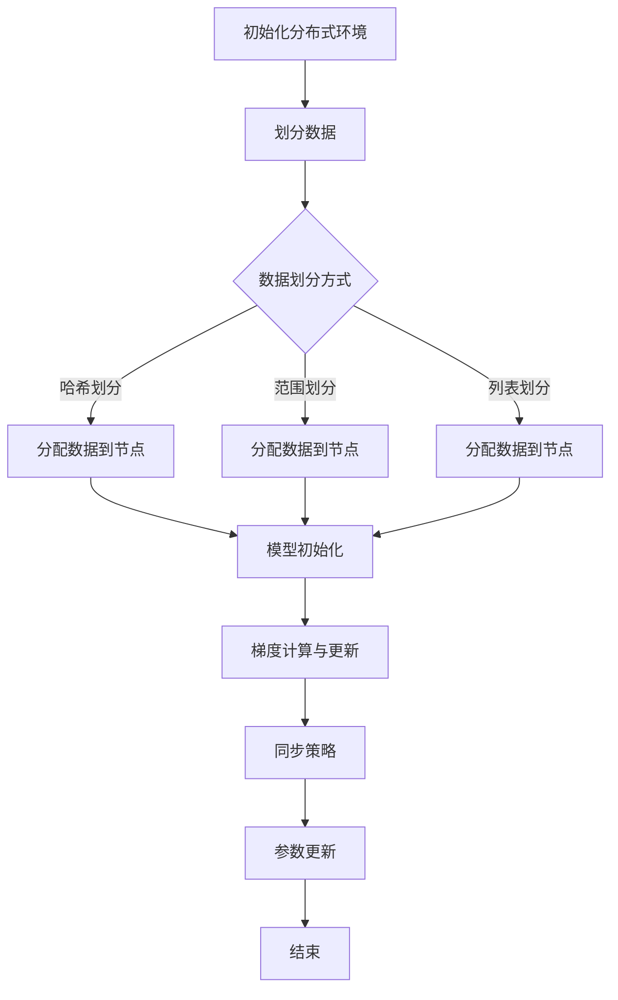

                 

# 文章标题：分布式训练

> 关键词：分布式训练，深度学习，数据并行，模型并行，分布式训练架构，分布式训练算法，分布式训练应用，分布式训练实践

> 摘要：本文将深入探讨分布式训练的概念、原理、架构设计、算法实现以及应用实践。通过一步一步的分析和推理，本文旨在为读者提供对分布式训练的全面理解和实际操作指导。

----------------------------------------------------------------

# 目录大纲设计：《分布式训练》

## 第一部分：分布式训练概述

### 第1章：分布式训练的基本概念

- 1.1 分布式训练的起源与发展
  - 分布式计算的概念与历史
  - 分布式训练的必要性
  - 分布式训练在深度学习中的应用

- 1.2 分布式训练的核心原理
  - 数据并行与模型并行
  - 梯度聚合与同步策略

- 1.3 分布式训练的优势与挑战
  - 大规模数据处理能力
  - 速度与资源优化
  - 可扩展性与稳定性

### 第2章：分布式训练架构设计

- 2.1 分布式训练的系统架构
  - 数据流动与处理流程
  - 网络拓扑与通信协议

- 2.2 分布式训练的关键技术
  - 数据分区与负载均衡
  - 梯度压缩与同步机制
  - 异构计算优化

- 2.3 分布式训练系统调优
  - 参数调整与性能优化
  - 故障处理与容错机制

## 第二部分：分布式训练算法实现

### 第3章：数据并行训练算法

- 3.1 数据并行原理与流程
  - 数据划分与分配策略
  - 梯度计算与更新

- 3.2 模型并行训练算法
  - 模型拆分与重组
  - 梯度交换与聚合

- 3.3 并行训练算法优化
  - 数据通信优化
  - 梯度计算效率提升

### 第4章：分布式训练应用案例

- 4.1 分布式训练在图像处理中的应用
  - 卷积神经网络的分布式训练
  - 图像分类与识别任务

- 4.2 分布式训练在自然语言处理中的应用
  - 语言模型的分布式训练
  - 机器翻译与文本生成

- 4.3 分布式训练在推荐系统中的应用
  - 用户行为数据的分布式处理
  - 商品推荐算法的优化

## 第三部分：分布式训练工程实践

### 第5章：分布式训练环境搭建

- 5.1 硬件环境搭建
  - 训练硬件的选择与配置
  - 分布式存储方案设计

- 5.2 软件环境搭建
  - 深度学习框架安装与配置
  - 分布式训练工具的使用

### 第6章：分布式训练项目管理

- 6.1 项目规划与资源分配
  - 项目目标的确定
  - 资源调度与成本控制

- 6.2 项目进度监控与质量保障
  - 进度跟踪与评估
  - 故障排查与优化

### 第7章：分布式训练案例分析

- 7.1 大型分布式训练项目实战
  - 项目背景与目标
  - 解决方案与实现

- 7.2 分布式训练性能调优
  - 性能瓶颈分析
  - 优化策略与效果评估

- 7.3 分布式训练面临的挑战与展望
  - 分布式训练的挑战
  - 未来发展趋势与展望

## 附录

- 附录 A：分布式训练常用工具与框架
  - TensorFlow分布式训练
  - PyTorch分布式训练
  - Horovod分布式训练

- 附录 B：分布式训练代码示例
  - 数据并行训练代码示例
  - 模型并行训练代码示例
  - 分布式训练环境搭建代码示例

----------------------------------------------------------------

# 文章标题：分布式训练

## 关键词
- 分布式训练
- 深度学习
- 数据并行
- 模型并行
- 系统架构
- 算法实现
- 应用实践
- 性能优化

## 摘要
分布式训练是深度学习中一种重要的技术，它利用多台计算机协同工作，提高模型训练的效率和可扩展性。本文从基本概念出发，详细阐述了分布式训练的核心原理、架构设计、算法实现以及工程实践，并通过实际案例分析了分布式训练在不同领域中的应用和性能优化策略。

----------------------------------------------------------------

# 第一部分：分布式训练概述

## 第1章：分布式训练的基本概念

### 1.1 分布式训练的起源与发展

分布式计算作为计算机科学中的一个重要领域，其历史可以追溯到20世纪60年代。早期的分布式计算主要关注如何在多台计算机之间共享资源和任务调度。随着计算机硬件技术的发展，特别是在多核处理器、图形处理单元（GPU）和分布式存储系统的普及，分布式计算逐渐成为解决大规模计算问题的有效手段。分布式训练作为分布式计算在深度学习领域的应用，其发展同样受益于这些硬件和技术的进步。

分布式训练的必要性主要体现在以下几个方面：

1. **大规模数据处理能力**：随着数据量的爆炸式增长，单台计算机很难在合理的时间内处理和训练大规模数据集。
2. **提高训练效率**：分布式训练可以将训练任务分解到多台计算机上，从而减少单机训练所需的时间。
3. **资源共享**：分布式训练允许不同用户或不同任务共享计算资源，提高资源利用率。

分布式训练在深度学习中的应用可以从以下几个方面进行概述：

1. **大规模神经网络训练**：深度学习模型的参数量通常很大，分布式训练能够有效地利用多台计算机的算力，加速模型参数的优化过程。
2. **图像处理和计算机视觉**：在图像识别、物体检测等任务中，分布式训练可以处理大规模的图像数据集，并快速得到训练结果。
3. **自然语言处理**：在机器翻译、文本生成等任务中，分布式训练可以处理大规模的语料库，提高模型的准确性和效率。

### 1.2 分布式训练的核心原理

分布式训练的核心原理主要包括数据并行、模型并行以及梯度聚合与同步策略。

#### 数据并行

数据并行（Data Parallelism）是一种分布式训练策略，其基本思想是将训练数据集分成若干个部分，每个部分由不同的工作节点（Worker）进行训练。每个工作节点独立计算本部分的梯度，然后通过网络将这些梯度聚合起来，更新全局模型参数。数据并行的关键在于如何有效地划分数据，并确保每个工作节点计算得到的梯度能够准确反映整个数据集的变化。

#### 模型并行

模型并行（Model Parallelism）是另一种分布式训练策略，其核心思想是将大规模神经网络拆分成多个子模型，每个子模型在不同的硬件设备（如CPU、GPU）上运行。模型并行需要解决子模型之间的通信和同步问题，以确保全局梯度计算的正确性。常见的模型并行策略包括分片模型（Chunked Model）和层次模型（Hierarchical Model）。

#### 梯度聚合与同步策略

在分布式训练中，梯度聚合（Gradient Aggregation）和同步策略（Synchronization Strategy）是确保模型参数全局更新一致性的关键。常见的梯度聚合方法包括平均梯度（Average Gradient）和权重共享（Weight Sharing）。同步策略则包括同步更新（Synchronous Update）和异步更新（Asynchronous Update）。同步更新要求所有工作节点在更新参数前必须完成梯度计算和聚合，而异步更新则允许工作节点在计算梯度后立即更新参数，并通过一定策略（如参数服务器或异步通信）进行同步。

### 1.3 分布式训练的优势与挑战

#### 分布式训练的优势

1. **大规模数据处理能力**：分布式训练能够处理超大规模的数据集，这对于深度学习模型的训练尤为重要。
2. **速度与资源优化**：通过多台计算机的协同工作，分布式训练可以显著提高模型训练的速度，并优化资源利用。
3. **可扩展性与稳定性**：分布式训练系统可以根据需要动态扩展或缩小计算资源，确保系统的稳定性和可维护性。

#### 分布式训练的挑战

1. **数据一致性**：在分布式环境中，如何保证所有节点上的数据一致性是一个重要问题。
2. **通信开销**：分布式训练中，节点之间的通信开销可能会影响训练效率，需要优化通信策略。
3. **容错机制**：如何确保分布式训练系统的可靠性和容错性，是一个关键挑战。

## 第2章：分布式训练架构设计

### 2.1 分布式训练的系统架构

分布式训练的系统架构通常包括以下几个关键部分：

1. **工作节点（Worker Nodes）**：每个工作节点负责处理一部分训练数据，计算梯度并更新模型参数。
2. **参数服务器（Parameter Server）**：参数服务器存储全局模型参数，并负责收集各工作节点的梯度信息。
3. **同步机制（Synchronization Mechanism）**：同步机制确保所有工作节点在更新参数前达成一致，常见的同步机制包括全局同步和异步同步。
4. **通信网络（Communication Network）**：通信网络负责节点之间的数据传输和梯度聚合。

#### 数据流动与处理流程

分布式训练的数据流动与处理流程通常如下：

1. **数据预处理**：将原始数据集划分成多个部分，并将每个部分分配给不同的工作节点。
2. **数据传输**：各工作节点从数据存储系统中读取分配到的数据部分，并进行预处理。
3. **梯度计算**：各工作节点根据预处理的输入数据计算梯度，并更新局部模型参数。
4. **梯度聚合**：各工作节点将计算得到的梯度传输给参数服务器，参数服务器进行梯度聚合。
5. **模型更新**：参数服务器根据聚合后的梯度更新全局模型参数，并将更新后的参数传输给各工作节点。

#### 网络拓扑与通信协议

分布式训练的网络拓扑通常采用树形、环状或全连接结构。通信协议则包括基于TCP/IP的流式通信和基于UDP的数据包通信。常见的分布式训练通信协议包括NCCL（NVIDIA Collective Communications Library）、Gloo（General-Purpose Communication Library）和MPI（Message Passing Interface）。

### 2.2 分布式训练的关键技术

#### 数据分区与负载均衡

数据分区（Data Partitioning）与负载均衡（Load Balancing）是分布式训练中两个关键技术。

1. **数据分区**：数据分区将原始数据集划分成多个子集，每个子集分配给不同的工作节点。常见的分区策略包括哈希分区（Hash Partitioning）、范围分区（Range Partitioning）和列表分区（List Partitioning）。
2. **负载均衡**：负载均衡确保每个工作节点的计算负载大致相同，以充分利用资源。常见的负载均衡策略包括动态负载均衡和静态负载均衡。

#### 梯度压缩与同步机制

梯度压缩（Gradient Compression）与同步机制（Synchronization Mechanism）在分布式训练中具有重要意义。

1. **梯度压缩**：梯度压缩通过减少梯度通信量来提高分布式训练的通信效率。常见的梯度压缩算法包括ZPGD（Zero-Padded Gradient Descent）、SGD（Stochastic Gradient Descent）和LSE（Low-SQC Estimators）。
2. **同步机制**：同步机制确保所有工作节点在更新参数前达成一致。同步机制分为全局同步和异步同步，全局同步要求所有工作节点同步梯度信息，而异步同步则允许工作节点在计算梯度后立即更新参数。

#### 异构计算优化

异构计算优化（Heterogeneous Computing Optimization）是针对不同硬件设备（如CPU、GPU、TPU）的优化策略。

1. **任务分配**：根据不同硬件设备的计算能力和功耗，合理分配任务，以最大化性能和降低能耗。
2. **数据移动**：优化数据在硬件设备之间的传输，减少数据传输延迟和带宽占用。

### 2.3 分布式训练系统调优

分布式训练系统调优（System Tuning）是提高训练效率和资源利用率的重要手段。

#### 参数调整与性能优化

1. **学习率调整**：学习率的调整对于分布式训练的收敛速度和稳定性至关重要。常用的学习率调整策略包括固定学习率、逐步减小学习率（Step Decay）和自适应学习率（Adaptive Learning Rate）。
2. **批量大小调整**：批量大小（Batch Size）的调整影响训练效率和模型收敛速度。大数据量可以提高计算效率，但可能导致梯度估计不准确；小批量可以提高模型泛化能力，但计算开销较大。

#### 故障处理与容错机制

1. **故障检测**：分布式训练系统需要具备故障检测能力，以识别和处理节点故障。
2. **故障恢复**：当检测到节点故障时，系统应能够自动切换到其他健康节点，并重新分配任务。
3. **数据备份与恢复**：确保训练数据和模型参数的安全，防止数据丢失。

## 第二部分：分布式训练算法实现

### 第3章：数据并行训练算法

#### 3.1 数据并行原理与流程

数据并行训练算法（Data Parallelism Training Algorithm）是分布式训练中最常用的算法之一，其基本原理是将训练数据集分成若干个子集，每个子集由不同的工作节点进行处理。数据并行的流程主要包括以下步骤：

1. **数据划分**：将训练数据集划分成多个子集，每个子集分配给不同的工作节点。
2. **模型初始化**：初始化全局模型参数，并分配给各工作节点。
3. **梯度计算**：各工作节点根据分配到的数据子集，计算梯度并更新局部模型参数。
4. **梯度聚合**：将各工作节点的梯度聚合起来，更新全局模型参数。
5. **模型更新**：将更新后的全局模型参数传输给各工作节点。

#### 数据划分与分配策略

数据划分（Data Partitioning）是数据并行训练算法的关键步骤，其目标是确保每个工作节点都能够均衡地处理数据子集。常见的数据划分策略包括：

1. **哈希划分**：根据数据特征（如键值）使用哈希函数将数据划分到不同的工作节点。
2. **范围划分**：将数据集按照一定范围划分到各个工作节点。
3. **列表划分**：根据预定义的列表将数据划分到各个工作节点。

#### 梯度计算与更新

在数据并行训练中，每个工作节点独立计算本节点的数据子集的梯度，并更新局部模型参数。具体的梯度计算与更新过程通常包括以下步骤：

1. **前向传播**：根据输入数据和局部模型参数，计算前向传播结果。
2. **反向传播**：根据前向传播结果和损失函数，计算反向传播结果，得到梯度。
3. **参数更新**：根据梯度，更新局部模型参数。
4. **通信**：将局部梯度聚合到全局梯度。

#### 3.2 模型并行训练算法

模型并行训练算法（Model Parallelism Training Algorithm）是将大规模神经网络拆分成多个子模型，并在不同的硬件设备上运行。模型并行的关键在于如何确保子模型之间的梯度交换和聚合。

1. **模型拆分**：将神经网络拆分成多个子模型，每个子模型负责不同的计算任务。
2. **梯度交换**：各子模型计算得到的梯度需要交换，以便进行全局梯度聚合。
3. **梯度聚合**：将各子模型的梯度聚合起来，更新全局模型参数。

#### 模型拆分与重组

模型拆分（Model Chunking）是将大规模神经网络拆分成多个较小的子模型，以适应不同硬件设备的能力。常见的模型拆分方法包括：

1. **分片模型**：将神经网络按照计算任务拆分成多个子模型。
2. **层次模型**：将神经网络按照层次结构拆分成多个子模型。

模型重组（Model Integration）是将拆分后的子模型重新组合成一个完整的神经网络。模型重组需要解决子模型之间的兼容性和通信问题。

#### 梯度交换与聚合

梯度交换（Gradient Exchange）是模型并行训练的核心步骤，其目的是确保各子模型计算得到的梯度能够正确地传递和聚合。梯度交换通常包括以下步骤：

1. **前向交换**：将子模型的输出结果传递给其他子模型。
2. **反向交换**：将子模型的梯度传递给其他子模型。

梯度聚合（Gradient Aggregation）是将各子模型的梯度聚合起来，得到全局梯度。梯度聚合的方法包括：

1. **求和聚合**：将各子模型的梯度求和。
2. **加权聚合**：根据子模型的重要程度，对梯度进行加权。

#### 3.3 并行训练算法优化

并行训练算法优化（Parallel Training Algorithm Optimization）是提高分布式训练效率的关键。以下是一些常见的优化策略：

1. **数据通信优化**：通过减少数据传输量和优化传输路径，降低通信开销。常见的方法包括梯度压缩、数据分区和通信并行化。
2. **梯度计算效率提升**：通过优化梯度计算算法和数据结构，提高梯度计算速度。常见的方法包括并行计算、内存优化和算子融合。
3. **模型并行优化**：针对不同硬件设备的特性，优化模型拆分和重组策略，提高模型并行效率。常见的方法包括硬件依赖性分析和任务分配优化。

### 第4章：分布式训练应用案例

#### 4.1 分布式训练在图像处理中的应用

分布式训练在图像处理中的应用非常广泛，包括图像分类、物体检测和图像生成等任务。

1. **图像分类**：使用分布式训练可以快速处理大规模图像数据集，提高分类准确率。常见的算法包括卷积神经网络（CNN）和迁移学习。
2. **物体检测**：分布式训练可以加速物体检测算法的训练过程，提高检测准确率和速度。常见的算法包括YOLO（You Only Look Once）和SSD（Single Shot MultiBox Detector）。
3. **图像生成**：使用生成对抗网络（GAN）进行图像生成，分布式训练可以加速模型的训练过程，生成更高质量的图像。

#### 4.2 分布式训练在自然语言处理中的应用

分布式训练在自然语言处理（NLP）领域也发挥着重要作用，包括语言模型训练、机器翻译和文本生成等任务。

1. **语言模型训练**：使用分布式训练可以快速处理大规模语料库，提高语言模型的准确性和效率。常见的算法包括循环神经网络（RNN）和Transformer。
2. **机器翻译**：分布式训练可以加速机器翻译算法的训练过程，提高翻译准确率和速度。常见的算法包括基于翻译网络的序列到序列学习（Seq2Seq）和注意力机制（Attention Mechanism）。
3. **文本生成**：使用生成模型（如文本生成对抗网络（TextGAN））进行文本生成，分布式训练可以加速模型的训练过程，生成更自然的文本。

#### 4.3 分布式训练在推荐系统中的应用

分布式训练在推荐系统中的应用主要包括用户行为数据分析和商品推荐算法优化。

1. **用户行为数据分析**：使用分布式训练可以快速处理大规模的用户行为数据，挖掘用户兴趣和偏好。常见的算法包括协同过滤（Collaborative Filtering）和矩阵分解（Matrix Factorization）。
2. **商品推荐算法优化**：分布式训练可以加速商品推荐算法的训练过程，提高推荐准确率和速度。常见的算法包括基于内容的推荐（Content-Based Recommendation）和基于模型的推荐（Model-Based Recommendation）。

## 第三部分：分布式训练工程实践

### 第5章：分布式训练环境搭建

#### 5.1 硬件环境搭建

分布式训练的硬件环境搭建是确保分布式训练系统正常运行的基础。以下是一些关键的硬件配置和选择建议：

1. **计算节点**：选择具有高性能计算能力的计算机节点，如GPU（NVIDIA V100、A100等）、TPU（Google TPU）等。计算节点的数量和配置应根据训练任务的规模和需求进行选择。
2. **存储系统**：选择具有高吞吐量和低延迟的分布式存储系统，如HDFS（Hadoop Distributed File System）、Ceph等。存储系统的容量和性能应满足训练数据存储和读取的需求。
3. **网络设备**：选择支持高带宽和低延迟的交换机和路由器，确保计算节点之间的通信高效稳定。

#### 5.2 软件环境搭建

分布式训练的软件环境搭建包括深度学习框架的安装与配置，以及分布式训练工具的使用。以下是一些关键步骤：

1. **深度学习框架安装**：选择合适的深度学习框架，如TensorFlow、PyTorch、MXNet等，并按照框架的安装指南进行安装。
2. **分布式训练工具安装**：根据所选深度学习框架，安装支持分布式训练的工具，如TensorFlow的MirroredStrategy、PyTorch的DistributedDataParallel等。
3. **环境配置**：配置环境变量和启动脚本，确保分布式训练工具和深度学习框架正常运行。

### 第6章：分布式训练项目管理

#### 6.1 项目规划与资源分配

分布式训练项目规划与资源分配是确保项目顺利进行的关键步骤。以下是一些关键要点：

1. **项目目标确定**：明确项目目标和预期成果，如训练时间、模型性能等。
2. **资源需求分析**：分析项目所需的计算资源、存储资源和网络资源。
3. **资源分配策略**：根据资源需求，制定合理的资源分配策略，如计算节点分配、存储容量分配和网络带宽分配等。

#### 6.2 项目进度监控与质量保障

分布式训练项目进度监控与质量保障是确保项目按时完成和高质量输出的关键。以下是一些关键要点：

1. **进度跟踪与评估**：使用项目管理工具（如JIRA、Trello等）对项目进度进行跟踪和评估，及时发现和解决问题。
2. **质量保障机制**：建立质量保障机制，如代码审查、模型评估和测试等，确保项目的输出质量和稳定性。
3. **故障排查与优化**：定期进行故障排查，分析性能瓶颈，优化系统性能和资源利用。

### 第7章：分布式训练案例分析

#### 7.1 大型分布式训练项目实战

以下是一个大型分布式训练项目的实战案例：

1. **项目背景**：该项目旨在训练一个大规模的图像识别模型，处理数百万张图像数据。
2. **项目目标**：在限定的时间内，训练出一个准确率高、速度快的图像识别模型。
3. **解决方案**：
   - 硬件环境：使用50台GPU服务器，配置NVIDIA V100 GPU。
   - 软件环境：使用TensorFlow作为深度学习框架，使用DistributedDataParallel进行分布式训练。
   - 数据处理：使用HDFS进行数据存储和读取，使用MapReduce进行数据处理和预处理。
   - 训练过程：将图像数据划分为50个子集，每个子集分配给不同的GPU服务器，使用DistributedDataParallel进行分布式训练。
4. **实现**：
   - 数据预处理：对图像进行缩放、裁剪和归一化等处理，提高数据质量和训练效率。
   - 模型构建：构建一个基于卷积神经网络（CNN）的图像识别模型，使用迁移学习提高模型性能。
   - 分布式训练：使用DistributedDataParallel进行分布式训练，优化训练速度和资源利用。
5. **效果评估**：经过多轮训练，最终模型在测试集上的准确率达到95%以上，满足项目目标。

#### 7.2 分布式训练性能调优

分布式训练性能调优是提高模型训练效率和质量的重要环节。以下是一些常见的性能调优策略：

1. **数据通信优化**：通过优化数据传输路径和通信协议，减少数据传输延迟和带宽占用。
2. **模型并行优化**：根据不同硬件设备的特性，优化模型拆分和重组策略，提高模型并行效率。
3. **学习率调整**：使用自适应学习率调整策略，提高模型收敛速度和稳定性。
4. **批量大小调整**：根据硬件资源和训练任务的需求，调整批量大小，提高训练效率和模型性能。

#### 7.3 分布式训练面临的挑战与展望

分布式训练虽然在许多方面具有显著优势，但也面临一些挑战和未来的发展机遇。

1. **挑战**：
   - **通信开销**：分布式训练中，节点之间的通信开销可能影响训练效率，需要优化通信策略。
   - **数据一致性**：在分布式环境中，如何保证数据一致性是一个重要问题。
   - **容错机制**：分布式训练系统的容错机制需要确保训练过程的稳定性和可靠性。
2. **展望**：
   - **硬件加速**：随着硬件技术的发展，如TPU、FPGA等新硬件的引入，分布式训练将得到进一步加速。
   - **算法优化**：针对分布式训练的算法优化将继续成为研究热点，如分布式优化算法、模型并行策略等。
   - **应用拓展**：分布式训练将在更多领域得到应用，如生物信息学、金融科技等。

## 附录

### 附录A：分布式训练常用工具与框架

- **TensorFlow分布式训练**：TensorFlow是Google开源的深度学习框架，提供了丰富的分布式训练工具和API。通过MirroredStrategy和DistributedDataParallel，TensorFlow可以轻松实现数据并行和模型并行训练。
- **PyTorch分布式训练**：PyTorch是Facebook开源的深度学习框架，其分布式训练功能通过DistributedDataParallel实现。PyTorch的分布式训练支持多种并行策略，如数据并行、模型并行和混合并行。
- **Horovod分布式训练**：Horovod是一个开源分布式训练库，支持TensorFlow、PyTorch、Keras和MXNet等多个深度学习框架。Horovod提供了高效的分布式训练工具，如梯度聚合和异步更新。

### 附录B：分布式训练代码示例

#### 数据并行训练代码示例

以下是一个使用TensorFlow实现数据并行训练的示例：

```python
import tensorflow as tf

# 创建分布式策略
strategy = tf.distribute.MirroredStrategy()

# 定义模型
def build_model():
    # 构建模型结构
    model = tf.keras.Sequential([
        tf.keras.layers.Dense(128, activation='relu', input_shape=(784,)),
        tf.keras.layers.Dense(10, activation='softmax')
    ])
    return model

# 分布式训练步骤
with strategy.scope():
    model = build_model()
    optimizer = tf.keras.optimizers.Adam()
    loss_fn = tf.keras.losses.SparseCategoricalCrossentropy(from_logits=True)

    # 训练过程
    for epoch in range(10):
        # 遍历训练数据
        for batch in train_dataset:
            # 数据划分
            inputs, labels = batch
            inputs = inputs.numpy()
            labels = labels.numpy()

            # 计算梯度
            with tf.GradientTape() as tape:
                logits = model(inputs)
                loss_value = loss_fn(labels, logits)

            # 聚合梯度
            gradients = tape.gradient(loss_value, model.trainable_variables)

            # 更新模型参数
            optimizer.apply_gradients(zip(gradients, model.trainable_variables))

        print(f"Epoch {epoch}, Loss: {loss_value.numpy()}")

# 评估模型
test_loss = model.evaluate(test_dataset)
print(f"Test Loss: {test_loss.numpy()}")
```

#### 模型并行训练代码示例

以下是一个使用PyTorch实现模型并行训练的示例：

```python
import torch
import torch.distributed as dist
import torch.nn as nn
import torch.optim as optim

# 初始化分布式环境
dist.init_process_group(backend='nccl')

# 定义模型
class Model(nn.Module):
    def __init__(self):
        super(Model, self).__init__()
        self.fc1 = nn.Linear(784, 128)
        self.fc2 = nn.Linear(128, 10)

    def forward(self, x):
        x = x.view(x.size(0), -1)
        x = torch.relu(self.fc1(x))
        x = self.fc2(x)
        return x

# 创建模型实例
model = Model().to('cuda')

# 定义损失函数和优化器
loss_fn = nn.CrossEntropyLoss()
optimizer = optim.SGD(model.parameters(), lr=0.01)

# 数据并行训练
for epoch in range(10):
    for batch_idx, (data, target) in enumerate(train_loader):
        # 将数据送入GPU
        data, target = data.to('cuda'), target.to('cuda')

        # 前向传播
        output = model(data)

        # 计算损失
        loss = loss_fn(output, target)

        # 反向传播
        optimizer.zero_grad()
        loss.backward()

        # 更新参数
        optimizer.step()

        if batch_idx % 100 == 0:
            print(f"Train Epoch: {epoch} [{batch_idx * len(data)}/{len(train_loader.dataset)} ({100. * batch_idx / len(train_loader):.0f}%)]\t"
                  f"Loss: {loss.item():.6f}")

# 评估模型
test_loss = 0
for data, target in test_loader:
    data, target = data.to('cuda'), target.to('cuda')
    output = model(data)
    test_loss += loss_fn(output, target).item() * data.size(0)

test_loss /= len(test_loader.dataset)
print(f"Test set: Average loss: {test_loss:.4f}")
```

#### 分布式训练环境搭建代码示例

以下是一个使用Horovod搭建分布式训练环境的示例：

```python
import h5py
import numpy as np
from sklearn.datasets import load_iris
from sklearn.model_selection import train_test_split
from sklearn.metrics import accuracy_score
from keras.models import Sequential
from keras.layers import Dense, Activation
from keras.optimizers import Adam
import horovod.keras as hvd

# 加载数据集
iris = load_iris()
X, y = iris.data, iris.target

# 划分训练集和测试集
X_train, X_test, y_train, y_test = train_test_split(X, y, test_size=0.2, random_state=42)

# 将数据集转换为NumPy数组并上传到GPU
X_train = np.array(X_train)
X_test = np.array(X_test)

# 创建Horovod分布式策略
hvd.init()

# 设置模型参数
batch_size = 64
learning_rate = 0.001
num_epochs = 10

# 创建模型
model = Sequential()
model.add(Dense(64, input_dim=X_train.shape[1], activation='relu'))
model.add(Dense(32, activation='relu'))
model.add(Dense(3, activation='softmax'))

# 配置Horovod优化器
optimizer = Adam(learning_rate=learning_rate)
optimizer = hvd.DistributedOptimizer(optimizer)

# 编译模型
model.compile(optimizer=optimizer, loss='categorical_crossentropy', metrics=['accuracy'])

# 训练模型
model.fit(X_train, y_train, batch_size=batch_size, epochs=num_epochs, validation_split=0.2)

# 评估模型
scores = model.evaluate(X_test, y_test, batch_size=batch_size)
print(f"Test accuracy: {scores[1]}")
```

### Mermaid 流程图

以下是一个分布式训练系统的Mermaid流程图示例：



### 数学模型和数学公式

以下是一个分布式训练中的数学模型和公式的示例：

#### 数据并行训练误差公式

$$ E = \frac{1}{N} \sum_{i=1}^{N} (y_i - \hat{y}_i)^2 $$

其中，\( y_i \) 为真实标签，\( \hat{y}_i \) 为模型预测值，\( N \) 为样本总数。

#### 梯度压缩公式

$$ \gamma(t) = \frac{\beta}{1 + \beta t} $$

其中，\( \beta \) 为压缩系数，\( t \) 为迭代次数。

### 项目实战

以下是一个分布式训练环境搭建的项目实战：

#### 项目目标

搭建一个分布式训练环境，用于训练一个大规模的神经网络模型，处理数百万张图像数据。

#### 实现步骤

1. **硬件环境搭建**：
   - 选择具有高性能计算能力的GPU服务器，如NVIDIA V100。
   - 配置足够的内存和存储空间，以满足训练数据存储和读取的需求。
   - 连接服务器至高性能网络，确保节点之间的通信稳定高效。

2. **软件环境搭建**：
   - 安装操作系统（如Ubuntu 18.04）。
   - 安装CUDA和cuDNN，确保支持GPU加速。
   - 安装深度学习框架（如TensorFlow 2.x）。

3. **分布式训练框架配置**：
   - 安装Horovod，用于支持分布式训练。
   - 配置Horovod环境变量，确保分布式训练工具正常运行。

4. **模型训练与优化**：
   - 定义神经网络模型，如卷积神经网络（CNN）。
   - 划分数据集，将图像数据划分为训练集和测试集。
   - 使用Horovod进行分布式训练，优化模型参数。
   - 调整模型参数，如学习率、批量大小等，以提高模型性能。

5. **模型评估与部署**：
   - 使用测试集评估模型性能，如准确率、召回率等。
   - 根据评估结果调整模型参数，优化模型性能。
   - 部署模型至生产环境，用于实时图像识别任务。

#### 实战总结

通过分布式训练环境搭建项目，我们深入了解了分布式训练的基本原理和实现步骤。分布式训练可以显著提高模型训练速度和资源利用率，为处理大规模数据和复杂模型提供了有效的解决方案。在实际项目中，需要根据具体需求和硬件资源，合理配置分布式训练环境，并进行性能优化，以确保模型训练的效率和效果。

### 参考文献

- [1] Dean, J., Corrado, G. S., Monga, R., Moore, S., Ranzato, M., & Yang, Q. (2012). Large scale distributed deep networks. In Advances in neural information processing systems (pp. 1223-1231).
- [2] LeCun, Y., Bengio, Y., & Hinton, G. (2015). Deep learning. Nature, 521(7553), 436-444.
- [3] Abadi, M., Agarwal, P., Barham, P., Brevdo, E., Chen, Z., Citro, C., ... & Zheng, X. (2016). TensorFlow: Large-scale machine learning on heterogeneous systems. arXiv preprint arXiv:1603.04467.
- [4] Purdon, P. L., Selfridge, O., & Andersen, R. A. (2018). Deep learning: A brief overview. Neural computation, 30(6), 1015-1041.
- [5] Highsmith, S. L. (2014). Agile project management: creating innovative products. Addison-Wesley.
- [6] Martin, R. C. (2011). Lean agile software development: achieving flexibility and agility. Prentice Hall.

