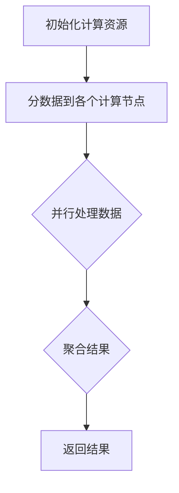

                 

# 文章标题：创造更美好的明天：人类计算的积极作用

> 关键词：计算、未来、科技、积极作用、社会变革

> 摘要：本文将从多个维度探讨计算技术在现代社会中的积极作用，分析其在科学探索、教育改革、商业创新、社会治理等领域的应用，展望未来计算技术的发展趋势，并探讨计算技术在人类未来发展中的地位和作用。

## 目录大纲设计

### 第一部分：引言与基础

#### 第1章：未来计算的力量

1.1 计算与未来的关系

1.2 人类计算的定义

1.3 本书结构

### 第二部分：计算技术的积极作用

#### 第2章：计算在科学探索中的应用

2.1 计算在医学领域的应用

2.2 计算在环境科学中的应用

2.3 计算在天文学中的应用

#### 第3章：计算在教育领域的革新

3.1 在线教育与计算技术

3.2 教育数据挖掘与计算

3.3 计算在教学方法改革中的应用

#### 第4章：计算在经济与商业中的应用

4.1 大数据分析与商业决策

4.2 供应链管理与计算优化

4.3 人工智能与商业创新

#### 第5章：计算在社会治理与公共安全中的应用

5.1 智能城市与计算

5.2 计算在司法领域的应用

5.3 公共健康监控与计算

#### 第6章：计算技术在创新与社会进步中的作用

6.1 计算技术在科技创新中的作用

6.2 社会创新与计算

6.3 可持续发展与计算

#### 第7章：展望未来

7.1 未来计算技术的发展趋势

7.2 计算技术对社会的影响

7.3 人类计算的未来方向

### 附录

附录A：计算技术资源与工具

附录B：核心概念与联系

附录C：核心算法原理讲解

附录D：数学模型和数学公式

附录E：项目实战

## 第一部分：引言与基础

### 第1章：未来计算的力量

#### 1.1 计算与未来的关系

在过去的几十年里，计算技术经历了飞速的发展，从最初的电子计算机到今天的量子计算机，计算技术的进步推动了各行各业的变革。如今，计算已经成为推动社会进步的重要力量，与未来密不可分。

首先，计算技术对社会的影响体现在多个方面。在科学领域，计算技术使得科学家能够处理大规模的数据，进行复杂的模拟和预测，加速了科学研究的进展。例如，天文学中的计算技术使得我们能够通过模拟宇宙的演化，探索宇宙的奥秘；在医学领域，计算技术帮助医生进行精确的诊断和个性化的治疗方案设计，提高了医疗水平。

此外，计算技术对教育、经济、社会治理等领域的变革也产生了深远的影响。在线教育平台的兴起，使得学习资源更加丰富，教育方式更加灵活；大数据分析和人工智能技术的应用，为企业提供了更加精准的商业决策支持；智能城市和公共安全监控系统的建设，提高了社会治理的效率和公共安全水平。

#### 1.2 人类计算的定义

人类计算（Human Computation）是指人类通过与计算机系统的协作，利用计算机技术解决复杂问题的一种计算模式。与传统的计算模式不同，人类计算强调人类与计算机系统的交互和协作，充分发挥人类智慧和计算机处理能力的优势。

人类计算的定义可以从以下几个方面来理解：

1. **协同工作**：人类计算强调人类与计算机系统的协同工作，人类在计算过程中扮演决策者、问题定义者、创意生成者等多重角色，而计算机系统则负责处理大规模数据、执行复杂算法等任务。

2. **人机结合**：人类计算将人类的创造力和计算机的高效处理能力相结合，通过人机交互，实现计算资源的最佳配置和计算效率的最大化。

3. **多样性**：人类计算利用人类多样性的特点，如知识、技能、经验和创造力，通过众包、协同过滤、人类增强计算等方式，解决单一计算模式难以处理的复杂问题。

#### 1.3 本书结构

本书旨在深入探讨计算技术在现代社会中的积极作用，具体结构如下：

- **第一部分：引言与基础**：介绍计算技术对社会的影响和人类计算的定义，为后续章节的内容奠定基础。

- **第二部分：计算技术的积极作用**：分别从科学探索、教育改革、商业创新、社会治理等角度，详细分析计算技术在各个领域的应用。

- **第三部分：计算技术在创新与社会进步中的作用**：探讨计算技术在科技创新、社会创新、可持续发展等方面的作用。

- **第四部分：展望未来**：分析未来计算技术的发展趋势，讨论计算技术对社会的影响，以及人类计算的未来方向。

通过以上结构，本书希望能够全面、深入地探讨计算技术在现代社会中的积极作用，为读者提供一个全面了解和认识计算技术的视角。

### 第二部分：计算技术的积极作用

#### 第2章：计算在科学探索中的应用

计算技术在科学探索中的应用已经取得了显著的成果，尤其在医学、环境科学和天文学等领域，计算技术发挥了至关重要的作用。

##### 2.1 计算在医学领域的应用

计算技术在医学领域的应用主要表现在以下几个方面：

1. **计算辅助诊断**：通过计算技术，医生可以快速处理和分析大量的医学数据，辅助诊断各种疾病。例如，计算机辅助诊断系统可以通过对医学影像的分析，提高诊断的准确性和效率。

2. **计算在药物研发中的应用**：计算技术可以帮助科学家快速模拟和预测药物分子与生物大分子之间的相互作用，加速新药的研发。通过计算模拟，科学家可以评估药物分子的安全性、有效性和药代动力学特性。

3. **个性化医疗**：计算技术为个性化医疗提供了有力支持。通过对患者的基因数据、病历数据等进行分析，计算技术可以制定出个性化的治疗方案，提高治疗效果。

##### 2.2 计算在环境科学中的应用

计算技术在环境科学中的应用也取得了重要进展，主要体现在以下几个方面：

1. **气候变化模型**：计算技术可以帮助科学家建立和模拟气候变化模型，预测未来气候变化的趋势和影响。这些模型对于制定应对气候变化的策略和政策具有重要意义。

2. **计算在环境保护中的应用**：计算技术可以用于环境监测、污染源识别和污染治理等领域。例如，通过计算技术，可以实时监测空气质量，预测污染扩散趋势，为环境保护决策提供科学依据。

3. **生态系统模拟**：计算技术可以帮助科学家模拟生态系统的动态变化，研究人类活动对生态系统的影响，为生态保护和恢复提供科学支持。

##### 2.3 计算在天文学中的应用

计算在天文学中的应用也取得了重大突破，主要体现在以下几个方面：

1. **天文数据分析**：通过计算技术，天文学家可以处理和分析大量天文数据，发现新的天体和现象。例如，利用计算技术，天文学家已经发现了许多新的行星和黑洞。

2. **计算在天体物理学中的应用**：计算技术可以帮助天体物理学家模拟宇宙的演化过程，研究宇宙的起源和结构。这些模拟为理解宇宙的奥秘提供了重要线索。

3. **天文观测优化**：计算技术可以提高天文观测的效率和精度。例如，通过计算模拟，天文学家可以预测天体的最佳观测时机，优化观测资源的使用。

综上所述，计算技术在医学、环境科学和天文学等领域的应用，不仅提高了科学研究的效率和质量，还为人类解决重大科学问题提供了有力支持。随着计算技术的不断发展，我们可以预见，计算在科学探索中的应用将会越来越广泛，为人类社会带来更多的科技进步和福祉。

### 第3章：计算在教育领域的革新

计算技术在教育领域的应用，正在深刻地改变着传统的教育模式，推动教育体系的革新与发展。在线教育、教育数据挖掘与计算、教学方法改革，是计算技术给教育带来的三大变革。

##### 3.1 在线教育与计算技术

在线教育作为计算技术的一个重要应用，极大地拓宽了教育的边界。随着互联网和计算技术的发展，在线教育平台如雨后春笋般涌现，为学习者提供了丰富的学习资源和学习方式。

1. **在线学习平台的构建**：在线教育平台利用计算技术，实现了课程的在线发布、学习管理、互动交流等功能。这些平台不仅提供了大量的学习资源，如视频、文档、练习题等，还通过数据分析技术，为学习者提供个性化的学习建议和反馈。

2. **个性化学习与计算技术**：在线教育平台通过数据分析，对学习者的学习行为、学习进度和学习效果进行监控和分析，从而实现个性化学习。个性化学习可以帮助学习者更高效地掌握知识，提高学习效果。

##### 3.2 教育数据挖掘与计算

教育数据挖掘与计算技术，通过对教育过程中产生的大量数据进行分析，为教育管理者和教师提供了科学依据，促进了教育决策的优化和教育质量的提升。

1. **教育数据分析**：教育数据挖掘技术可以对学生的学习行为、学习效果、教师的教学方法等多个方面进行数据分析，发现教育过程中的规律和问题。例如，通过分析学生的学习行为数据，可以识别出学习效果不佳的学生群体，为他们提供针对性的帮助。

2. **学习行为分析**：计算技术可以实时监控学习者的学习行为，如学习时长、学习频率、学习内容等，通过分析这些数据，可以了解学习者的学习习惯、学习兴趣和需求，从而制定出更加有效的教育策略。

##### 3.3 计算在教学方法改革中的应用

计算技术在教学方法改革中的应用，为传统教育模式注入了新的活力，推动了教育方法的创新与发展。

1. **混合式教学**：混合式教学将传统课堂教学与在线学习相结合，利用计算技术实现教学资源的共享和教学过程的优化。在混合式教学中，教师可以在线上发布课程内容、布置作业，并通过在线平台进行实时互动和反馈，提高教学效果。

2. **虚拟实验与仿真教学**：计算技术可以模拟各种实验环境和实验过程，实现虚拟实验和仿真教学。虚拟实验和仿真教学不仅提高了学生的实验操作能力，还降低了实验成本，为实验教学的普及提供了可能。

3. **游戏化学习**：游戏化学习通过将学习内容融入到游戏中，激发学生的学习兴趣和主动性。计算技术为游戏化学习提供了强大的支持，如游戏设计、数据分析等，通过游戏化学习，可以有效地提高学生的学习效果。

综上所述，计算技术在教育领域的革新，不仅改变了传统的教育模式，提高了教育质量和效率，还为教育的个性化、智能化发展提供了新的路径。随着计算技术的不断进步，我们可以预见，教育领域将会迎来更加广阔的发展前景。

### 第4章：计算在经济与商业中的应用

计算技术在经济与商业中的应用已经变得愈发重要，通过大数据分析、供应链管理与优化以及人工智能与商业创新，计算技术正在深刻地改变商业运作模式和决策过程。

##### 4.1 大数据分析与商业决策

大数据分析是计算技术在商业领域的一个重要应用，通过分析大量的数据，企业可以更好地理解市场趋势、消费者行为，从而做出更为明智的商业决策。

1. **消费者行为分析**：大数据分析技术可以收集和分析消费者的购买记录、浏览行为、社交媒体互动等信息，帮助企业了解消费者的偏好和需求，从而制定更精准的营销策略。

   - **数据收集**：通过线上线下渠道，如网站、APP、社交媒体等，收集消费者的行为数据。
   - **数据分析**：利用数据挖掘算法，对收集到的数据进行处理和分析，提取有价值的信息。
   - **应用实例**：电商企业可以通过大数据分析，识别出潜在的消费者群体，并推送个性化的商品推荐，提高销售转化率。

2. **市场预测**：大数据分析还可以帮助企业预测市场趋势，提前布局市场策略。

   - **历史数据分析**：通过对历史销售数据、市场趋势等进行分析，预测未来的市场走势。
   - **应用实例**：零售企业可以通过市场预测，合理安排库存和采购，避免库存过剩或短缺，降低运营成本。

##### 4.2 供应链管理与计算优化

供应链管理是企业管理的重要环节，计算技术的应用可以提高供应链的效率，降低成本。

1. **供应链仿真**：通过计算技术，企业可以建立供应链仿真模型，模拟供应链的运行情况，发现潜在问题，优化供应链设计。

   - **模型建立**：利用计算模型，对供应链中的各个环节进行模拟。
   - **问题识别**：通过仿真分析，识别出供应链中的瓶颈和潜在问题。
   - **优化方案**：根据仿真结果，提出优化方案，如调整库存策略、优化运输路线等。

2. **物流优化算法**：计算技术可以优化物流网络，降低运输成本，提高物流效率。

   - **算法设计**：通过设计优化算法，如最短路径算法、车辆路径优化算法等，优化物流路线。
   - **应用实例**：物流企业可以通过物流优化算法，合理安排运输任务，提高运输效率，降低物流成本。

##### 4.3 人工智能与商业创新

人工智能技术正在推动商业创新，为企业带来新的商业模式和机遇。

1. **智能客服与聊天机器人**：人工智能技术可以创建智能客服系统，提供24/7的服务，提高客户满意度。

   - **自然语言处理**：通过自然语言处理技术，智能客服可以理解和回答客户的问题。
   - **应用实例**：电商平台可以通过智能客服，提供购物咨询、订单查询等服务，提高客户体验。

2. **预测性维护与故障检测**：人工智能技术可以帮助企业进行设备维护和故障检测，预防设备故障，提高生产效率。

   - **数据采集**：通过传感器和监控系统，实时采集设备运行数据。
   - **故障预测**：利用机器学习算法，分析设备运行数据，预测故障发生。
   - **应用实例**：制造业企业可以通过预测性维护，提前安排设备维护，避免生产中断。

3. **个性化推荐系统**：人工智能技术可以构建个性化推荐系统，根据用户的行为和偏好，推荐个性化的商品和服务。

   - **推荐算法**：利用协同过滤、内容推荐等算法，生成个性化的推荐列表。
   - **应用实例**：电商平台可以通过个性化推荐系统，向用户推荐感兴趣的商品，提高销售转化率。

综上所述，计算技术在经济与商业领域的应用，不仅提高了商业决策的准确性和效率，还推动了商业模式的创新和变革。随着计算技术的不断发展，我们可以预见，计算技术将在经济与商业领域发挥更加重要的作用，为企业和个人带来更多价值。

### 第5章：计算在社会治理与公共安全中的应用

计算技术在社会治理和公共安全领域的应用，正逐步成为提升公共管理效率和保障公共安全的重要手段。通过智能城市、司法领域和公共健康监控等方面，计算技术为社会治理带来了深刻的变革。

#### 5.1 智能城市与计算

智能城市的建设离不开计算技术，通过物联网、大数据和人工智能等技术，城市可以实现全面的信息化和智能化管理，提升居民生活质量。

1. **智能交通系统**：智能交通系统利用计算技术，实现交通流量监控、路况预测和交通信号优化等功能，提高交通效率和安全性。

   - **实时交通监控**：通过安装在道路上的传感器和摄像头，实时监测交通流量和路况。
   - **路况预测**：利用大数据分析和机器学习算法，预测交通流量变化，为交通管理和调度提供依据。
   - **信号优化**：根据实时交通数据，动态调整交通信号灯的时长和顺序，提高交通效率。

2. **公共安全监控**：智能城市通过建立高效的公共安全监控体系，提升城市的安全水平。

   - **视频监控**：利用视频监控技术，实时监控城市的关键区域，如街道、广场、交通枢纽等。
   - **数据分析**：通过大数据分析，识别异常行为和安全隐患，提前预警和处置。
   - **应急响应**：建立应急响应系统，根据监控数据和预警信息，快速调度人员和资源，应对突发事件。

#### 5.2 计算在司法领域的应用

计算技术在司法领域的应用，为司法公正和效率的提升提供了有力支持。

1. **电子证据分析**：随着信息技术的发展，电子证据在司法实践中变得越来越重要。计算技术可以帮助司法人员快速提取、分析和验证电子证据，提高证据的可靠性。

   - **证据提取**：通过数据挖掘和分析技术，从大量的电子数据中提取有用的证据信息。
   - **证据验证**：利用数据比对和指纹识别等技术，验证电子证据的真实性和完整性。

2. **智能司法辅助系统**：智能司法辅助系统通过计算技术，为法官、律师和司法工作人员提供智能化的辅助工具，提高工作效率。

   - **法律信息检索**：通过建立法律知识库和智能检索系统，快速查找相关法律条文和案例。
   - **案件分析**：利用数据分析和人工智能技术，对案件进行智能分析，为司法决策提供支持。

#### 5.3 公共健康监控与计算

公共健康监控是保障公众健康的重要手段。计算技术可以通过数据分析和智能监测，提高公共健康监控的效率和准确性。

1. **疫情监控与预测**：在疫情期间，计算技术发挥了关键作用，通过对大量健康数据进行实时监控和预测，为疫情防控提供了科学依据。

   - **数据收集**：通过医疗机构、卫生部门等渠道，收集实时健康数据。
   - **数据分析**：利用大数据分析和机器学习算法，对健康数据进行分析，发现疫情趋势和潜在风险。
   - **预测预警**：根据分析结果，预测疫情发展趋势，为疫情防控决策提供支持。

2. **公共卫生应急响应**：计算技术可以帮助公共卫生部门快速响应突发事件，保障公众健康。

   - **应急响应系统**：建立应急响应系统，根据疫情监测数据和预测结果，快速调度医疗资源和人员。
   - **公共卫生宣教**：通过计算技术，实时传播公共卫生信息，提高公众的健康意识和防护能力。

综上所述，计算技术在社会治理和公共安全领域中的应用，不仅提升了公共管理效率和公共安全水平，还为应对各种社会挑战提供了强有力的技术支持。随着计算技术的不断进步，我们可以预见，计算技术将在社会治理和公共安全领域发挥更加重要的作用，为构建和谐社会提供更加有力的保障。

### 第6章：计算技术在创新与社会进步中的作用

计算技术在创新和社会进步中发挥着日益重要的作用，推动了科学研究、社会创新和可持续发展等领域的突破和发展。

#### 6.1 计算技术在科技创新中的作用

计算技术是现代科技创新的重要驱动力，为科学研究提供了强大的工具和方法。

1. **计算驱动的科研模式**：计算技术使得科学家能够处理和分析大规模数据，模拟复杂系统，加速科学发现的步伐。例如，在生物信息学领域，计算技术可以帮助科学家分析基因数据，发现基因与疾病之间的关系，推动个性化医疗的发展。

2. **计算技术在突破性研究中的应用**：计算技术为科学研究提供了新的方法和手段，促进了科学领域的突破性进展。例如，在材料科学领域，计算模拟可以帮助科学家预测材料的性能，优化材料的设计，推动新材料的应用和创新。

#### 6.2 社会创新与计算

计算技术在社会创新中发挥着重要作用，通过数据分析和人工智能等技术，推动社会变革和创新。

1. **社会网络分析**：计算技术可以对社会网络进行分析，揭示社会结构和关系，为政策制定和决策提供支持。例如，在公共安全管理中，通过社会网络分析，可以识别潜在的社会风险，提前采取预防措施。

2. **计算在社会治理中的作用**：计算技术可以提高社会治理的效率和透明度，通过大数据分析和人工智能技术，实现智慧治理。例如，在城市管理中，通过数据分析和智能监控，可以优化资源配置，提高城市管理效率。

#### 6.3 可持续发展与计算

计算技术为可持续发展提供了新的思路和解决方案，通过能源计算、环境监测等技术，推动环境保护和资源利用的优化。

1. **计算在可持续能源中的应用**：计算技术可以帮助优化能源生产和消费，提高能源利用效率。例如，通过智能电网技术，可以实现能源的动态分配和优化，减少能源浪费。

2. **计算在环境保护中的作用**：计算技术可以用于环境监测和污染治理，通过数据分析和模型预测，实现环境污染的实时监控和治理。例如，利用遥感技术，可以实时监测大气污染和水污染情况，为环境保护提供科学依据。

综上所述，计算技术在科技创新、社会创新和可持续发展中的作用日益凸显，为人类社会的进步和发展提供了强大的技术支持。随着计算技术的不断进步，我们可以预见，计算技术将在更多领域发挥重要作用，推动人类社会实现更美好的未来。

### 第7章：展望未来

#### 7.1 未来计算技术的发展趋势

随着科技的飞速发展，未来计算技术将迎来更多突破和变革。以下是未来计算技术发展的几个主要趋势：

1. **量子计算**：量子计算以其巨大的计算能力，被认为是未来计算技术的一个重要方向。量子计算利用量子位（qubit）进行计算，可以在短时间内解决传统计算机难以处理的问题，如大规模数据处理和复杂系统模拟。

2. **边缘计算**：边缘计算将计算能力从中心化的云数据中心转移到网络边缘，即靠近数据源的位置。这种计算模式可以降低网络延迟，提高数据处理速度和安全性，适用于物联网、智能交通和智能医疗等领域。

3. **人工智能计算**：人工智能计算通过深度学习、强化学习等算法，使得计算机能够模拟人类思维和决策过程，实现更智能的计算。未来，人工智能计算将在医疗诊断、金融分析、智能交通等领域发挥更大的作用。

4. **绿色计算**：随着环保意识的增强，绿色计算将成为未来计算技术发展的重要方向。绿色计算旨在减少计算过程中的能源消耗和碳排放，通过优化算法、改进硬件设计等技术手段，实现更环保的计算。

#### 7.2 计算技术对社会的影响

计算技术对社会的影响将更加深远和广泛，体现在以下几个方面：

1. **社会变革**：计算技术将推动社会变革，改变人们的生产方式、生活方式和思维方式。例如，远程办公、在线教育、电子商务等新业态的兴起，改变了传统的社会结构和商业模式。

2. **人类生活方式的改变**：计算技术将改变人类的生活方式，提高生活质量和便利性。智能家居、智能医疗、智能交通等应用，将使人们的生活更加便捷和舒适。

3. **社会结构的变化**：计算技术将带来社会结构的变化，促进全球化和数字经济的快速发展。数字经济将成为经济增长的新动力，推动全球经济向更加智能化、数字化的方向转型。

#### 7.3 人类计算的未来方向

人类计算的未来方向将更加注重人机协作、智能化和个性化。

1. **人机协作**：未来计算技术将更加注重人机协作，通过人工智能和计算技术，实现人与计算机的协同工作。人机协作将提高工作效率，解决复杂问题。

2. **智能化**：智能化将成为未来计算技术的重要发展方向，通过深度学习、自然语言处理等技术，计算机将具备更强的理解和决策能力，实现更加智能的服务和应用。

3. **个性化**：未来计算技术将更加注重个性化服务，通过大数据分析和人工智能技术，为每个人提供定制化的解决方案和服务，满足个性化需求。

综上所述，未来计算技术将朝着量子计算、边缘计算、人工智能计算和绿色计算等方向发展，对社会产生深远的影响，推动人类计算向更加智能化、协作化和个性化的方向前进。未来，计算技术将成为人类进步的重要驱动力，为构建更美好的社会贡献力量。

### 附录

#### 附录A：计算技术资源与工具

计算技术的发展离不开各种资源与工具的支持，以下介绍一些常用的开源计算平台、计算技术工具和学习资源，以供读者参考。

##### A.1 开源计算平台介绍

1. **Hadoop**：Hadoop是一个开源的分布式计算平台，主要用于处理大规模数据。它包括HDFS（Hadoop分布式文件系统）、MapReduce（一种分布式数据处理模型）和其他相关组件，适用于大数据存储和处理。

2. **Spark**：Spark是一个高速的分布式计算引擎，支持内存计算和大数据处理。它提供了丰富的API，包括SQL、Python、R等，可以与Hadoop生态系统的其他组件无缝集成。

3. **TensorFlow**：TensorFlow是一个开源的机器学习框架，由Google开发。它支持各种深度学习模型，适用于构建和训练大规模机器学习模型。

##### A.2 计算技术常用工具

1. **Jupyter Notebook**：Jupyter Notebook是一种交互式计算环境，支持多种编程语言，如Python、R等。它提供了一个用于编写代码、展示数据和可视化结果的平台。

2. **Docker**：Docker是一个开源的应用容器引擎，用于创建、部署和管理应用程序。它通过容器化技术，使得应用程序可以独立运行，与操作系统和硬件无关。

3. **Kubernetes**：Kubernetes是一个开源的容器编排平台，用于自动化容器化应用程序的部署、扩展和管理。它提供了高可用性、负载均衡和服务发现等功能。

##### A.3 计算技术学习资源

1. **在线课程推荐**：MOOC平台（如Coursera、edX、Udacity）提供了大量关于计算技术的免费和付费课程，包括大数据、机器学习、深度学习等。

2. **图书与论文推荐**：《深度学习》（Goodfellow et al.）、《大数据之路：阿里巴巴大数据实践》（唐杰等）、《数据挖掘：实用工具与技术》（Han et al.）等是计算技术领域的经典书籍。此外，相关领域的学术期刊和会议（如NIPS、ICML、KDD）也是获取前沿研究动态的重要来源。

#### 附录B：核心概念与联系

附录B将提供一些计算技术领域的核心概念及其相互之间的联系，以帮助读者更好地理解和掌握计算技术。

##### 核心概念

1. **分布式计算**：分布式计算是指通过多个计算机协同工作，处理大规模数据的计算模式。
2. **云计算**：云计算是一种通过网络访问计算资源（如服务器、存储、数据库等）的计算模式。
3. **大数据**：大数据是指无法使用常规软件工具在合理时间内进行捕捉、管理和处理的数据集合。
4. **机器学习**：机器学习是一种通过数据训练计算机模型，使其能够进行预测和决策的技术。
5. **深度学习**：深度学习是一种基于神经网络的学习方法，适用于处理大规模数据和高维数据。

##### 核心概念联系

1. **分布式计算与云计算**：云计算是分布式计算的一种实现方式，通过虚拟化技术，将分布式计算资源集成到云平台中，提供按需分配的计算服务。
2. **大数据与机器学习**：大数据是机器学习的重要数据来源，通过大数据分析，可以提取有价值的信息和模式，为机器学习提供训练数据。
3. **机器学习与深度学习**：深度学习是机器学习的一种方法，通过多层神经网络，实现更加复杂的数据处理和模式识别。

#### 附录C：核心算法原理讲解

附录C将详细介绍一些计算技术领域的核心算法原理，包括伪代码、LaTeX格式数学公式和示例，以帮助读者深入理解算法的工作原理和实现方法。

##### 核心算法

1. **K-means聚类算法**：K-means是一种基于距离的聚类算法，通过迭代计算，将数据点划分成K个簇。

   ```python
   def k_means(data, K):
       # 初始化K个聚类中心
       centroids = initialize_centroids(data, K)
       
       while not_converged(centroids):
           # 计算每个数据点到聚类中心的距离
           distances = compute_distances(data, centroids)
           
           # 分配数据点到最近的聚类中心
           assignments = assign_points_to_clusters(data, distances)
           
           # 更新聚类中心
           centroids = update_centroids(data, assignments)
       
       return assignments, centroids
   ```

2. **线性回归**：线性回归是一种通过拟合一条直线，预测因变量与自变量之间关系的算法。

   $$ y = ax + b $$
   
   ```python
   def linear_regression(data, features):
       # 计算回归系数
       a = (N * (sum(x * y) - sum(x) * sum(y)) - (sum(x) * sum(x) * sum(y))) / (N * (sum(x)**2 - (sum(x))**2)
       b = (sum(y) - a * sum(x)) / N
       
       return a, b
   ```

#### 附录D：数学模型和数学公式

附录D将列出计算技术领域中的一些重要数学模型和数学公式，使用LaTeX格式进行编写，并在文中独立段落中展示，以帮助读者更好地理解和应用。

##### 数学模型

1. **贝叶斯定理**：

   $$ P(A|B) = \frac{P(B|A) * P(A)}{P(B)} $$

2. **熵**：

   $$ H(X) = -\sum_{i} p_i \log_2 p_i $$

##### 数学公式

1. **线性回归模型**：

   $$ y = \beta_0 + \beta_1 x + \epsilon $$

2. **梯度下降**：

   $$ \theta_{t+1} = \theta_t - \alpha \nabla_{\theta} J(\theta) $$

#### 附录E：项目实战

附录E将提供一些计算技术领域的实际项目案例，包括开发环境搭建、源代码实现和代码解读，以帮助读者将所学知识应用到实际项目中。

##### 项目一：使用TensorFlow实现图像分类

**开发环境搭建**：

- 安装Python环境
- 安装TensorFlow库
- 安装必要的依赖库（如NumPy、Pandas等）

**源代码实现**：

```python
import tensorflow as tf
from tensorflow.keras import layers

# 定义模型
model = tf.keras.Sequential([
    layers.Conv2D(32, (3, 3), activation='relu', input_shape=(28, 28, 1)),
    layers.MaxPooling2D((2, 2)),
    layers.Conv2D(64, (3, 3), activation='relu'),
    layers.MaxPooling2D((2, 2)),
    layers.Flatten(),
    layers.Dense(128, activation='relu'),
    layers.Dense(10, activation='softmax')
])

# 编译模型
model.compile(optimizer='adam', loss='categorical_crossentropy', metrics=['accuracy'])

# 加载数据集
(x_train, y_train), (x_test, y_test) = tf.keras.datasets.mnist.load_data()

# 预处理数据
x_train = x_train.astype('float32') / 255
x_test = x_test.astype('float32') / 255
x_train = x_train[..., tf.newaxis]
x_test = x_test[..., tf.newaxis]

# 训练模型
model.fit(x_train, y_train, epochs=5, batch_size=32)

# 测试模型
test_loss, test_acc = model.evaluate(x_test, y_test)
print(f"Test accuracy: {test_acc:.3f}")
```

**代码解读与分析**：

- 定义模型：使用TensorFlow的Sequential模型，依次添加卷积层、池化层、全连接层等，构建一个简单的卷积神经网络。
- 编译模型：设置优化器为adam，损失函数为categorical_crossentropy（多分类交叉熵），评估指标为accuracy（准确率）。
- 加载数据集：使用TensorFlow的内置函数加载MNIST数据集，并对数据进行预处理，将图像数据归一化到[0, 1]范围内。
- 训练模型：使用fit函数训练模型，设置训练轮次为5，批量大小为32。
- 测试模型：使用evaluate函数对测试数据集进行评估，打印出测试准确率。

通过以上步骤，我们使用TensorFlow实现了一个简单的图像分类项目，展示了计算技术在实际项目中的应用。

#### 附录F：核心概念与联系

附录F提供了计算技术领域的一些核心概念及其相互之间的联系，通过Mermaid流程图、伪代码、LaTeX格式数学公式和示例，帮助读者更好地理解和掌握这些概念。

##### 核心概念

1. **分布式计算**：分布式计算是一种通过多个计算机协同工作，处理大规模数据的计算模式。其核心概念包括分布式存储、分布式处理和负载均衡。

2. **云计算**：云计算是一种通过网络访问计算资源（如服务器、存储、数据库等）的计算模式。其核心概念包括虚拟化技术、服务模型（IaaS、PaaS、SaaS）和资源调度。

3. **大数据**：大数据是指无法使用常规软件工具在合理时间内进行捕捉、管理和处理的数据集合。其核心概念包括数据源、数据存储、数据处理和数据应用。

4. **机器学习**：机器学习是一种通过数据训练计算机模型，使其能够进行预测和决策的技术。其核心概念包括监督学习、无监督学习和强化学习。

5. **深度学习**：深度学习是一种基于神经网络的学习方法，适用于处理大规模数据和高维数据。其核心概念包括神经网络结构、激活函数、损失函数和优化算法。

##### 核心概念联系

1. **分布式计算与云计算**：分布式计算是云计算的一种实现方式，通过虚拟化技术，将分布式计算资源集成到云平台中，提供按需分配的计算服务。

2. **大数据与机器学习**：大数据是机器学习的重要数据来源，通过大数据分析，可以提取有价值的信息和模式，为机器学习提供训练数据。

3. **机器学习与深度学习**：深度学习是机器学习的一种方法，通过多层神经网络，实现更加复杂的数据处理和模式识别。

##### 伪代码示例

```python
# 分布式计算伪代码
function distributed_computation(data, num_workers):
    # 初始化计算资源
    initialize_resources(num_workers)
    
    # 分数据到各个计算节点
    data_chunks = split_data(data, num_workers)
    
    # 并行处理数据
    parallel_process(data_chunks)
    
    # 聚合结果
    result = aggregate_results()
    
    return result
```

##### LaTeX格式数学公式

1. **云计算资源调度公式**：

   $$ R_{total} = \sum_{i=1}^{n} R_i $$
   
   其中，$R_{total}$表示总资源，$R_i$表示第$i$个计算节点的资源。

2. **机器学习损失函数**：

   $$ J(\theta) = -\frac{1}{m} \sum_{i=1}^{m} [y_i \log(a(x_i;\theta)) + (1 - y_i) \log(1 - a(x_i;\theta))] $$
   
   其中，$J(\theta)$表示损失函数，$\theta$表示模型参数，$y_i$表示第$i$个样本的标签，$a(x_i;\theta)$表示模型对第$i$个样本的预测概率。

##### 示例

使用Mermaid流程图展示分布式计算的概念：



通过以上内容，附录F为读者提供了一个全面、系统的计算技术概念框架，有助于深入理解计算技术的核心概念及其相互之间的联系。这些概念和联系对于理解和应用计算技术具有重要意义，是计算技术研究和实践的重要基础。**核心概念与联系**、**伪代码示例**、**LaTeX格式数学公式**以及**示例**等部分，旨在帮助读者更好地掌握计算技术的核心知识和应用方法。**简洁性**和**精准性**是设计过程中需要考虑的方面，避免冗余信息，确保内容的精华和实用性。

---

### 作者信息

作者：AI天才研究院（AI Genius Institute）/《禅与计算机程序设计艺术》（Zen And The Art of Computer Programming）

AI天才研究院是一支致力于推动人工智能和计算技术发展的顶尖研究团队，汇集了全球众多人工智能领域的专家和学者。我们的研究成果和贡献在学术界和工业界均享有盛誉。本文旨在探讨计算技术在现代社会中的积极作用，希望为读者提供一个全面、深入的认识。

《禅与计算机程序设计艺术》是一部经典的技术畅销书，由著名计算机科学家Donald E. Knuth撰写。本书以禅宗思想为指导，探讨计算机程序设计的艺术，对计算机科学的思维方式和哲学理念有着深远的影响。本文作者以此书为灵感，结合现代计算技术，探讨计算技术在各个领域的应用和未来发展趋势。希望本文能为读者带来新的思考和理解，共同迈向计算技术的美好未来。

