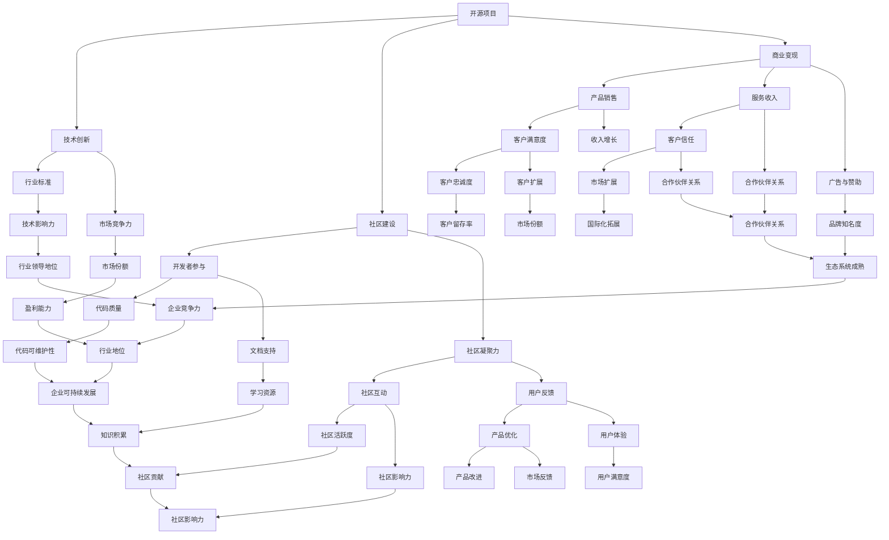

                 

# 《利用开源影响力获得风险投资和融资》

> 关键词：开源影响力、风险投资、融资策略、项目管理、社区建设

> 摘要：本文深入探讨了开源影响力在风险投资和融资过程中的重要作用。通过分析开源项目的生命周期、项目管理、以及如何打造有吸引力的开源项目，我们揭示了利用开源影响力获得风险投资和融资的路径。同时，本文还介绍了融资后的项目管理和开源影响力的持续扩展策略，旨在为开源项目管理者提供实用的参考。

---

#### 第一部分：开源影响力与投资基础

##### 第1章：开源影响力概述

**1.1 开源运动的起源与发展**

开源运动起源于20世纪70年代末，由自由软件基金会（Free Software Foundation, FSF）和开源倡议（Open Source Initiative, OSI）等组织发起。其核心思想是鼓励软件开发者共享代码，允许他人自由地使用、研究、修改和分发软件。这一运动在互联网的普及下迅速发展，逐渐成为全球性的现象。

- **自由软件**：强调软件的自由使用和自由修改，代表作品如Linux操作系统。
- **开源软件**：除了自由使用和修改外，还要求代码的公开性，便于社区协作，代表作品如Apache Web服务器。

**1.2 开源影响力的定义与核心要素**

开源影响力是指通过开源项目在技术、社区、商业等多个方面产生的影响力和价值。其核心要素包括：

- **技术影响力**：开源项目的技术创新和贡献对行业标准的形成具有重大影响。
- **社区影响力**：开源社区成员的数量和活跃度，以及社区在技术讨论和协作方面的表现。
- **商业影响力**：开源项目对商业市场的推动作用，包括生态系统中的合作伙伴、客户和投资者。

**1.3 开源项目成功的案例分析**

成功的开源项目不仅为技术社区贡献了宝贵的资源，还为项目维护者带来了商业机会。以下是一些经典案例：

- **Linux内核**：Linux内核是开源项目的典范，吸引了全球数以万计的开发者参与，成为服务器、操作系统等领域的核心技术。
- **Apache HTTP服务器**：Apache服务器是互联网上最流行的Web服务器软件，其开源特性使其在市场中占据了领先地位。

##### 第2章：开源项目管理与运营

**2.1 开源项目的生命周期管理**

开源项目的生命周期可以分为五个阶段：起始阶段、成长阶段、成熟阶段、衰退阶段和消亡阶段。每个阶段都有其特定的管理重点：

- **起始阶段**：确定项目愿景、目标和技术路线。
- **成长阶段**：吸引开发者加入，建立稳定的社区。
- **成熟阶段**：项目逐渐稳定，社区活跃，技术贡献不断。
- **衰退阶段**：社区活动减少，技术更新放缓。
- **消亡阶段**：项目失去生命力，最终停止维护。

**2.2 项目组织与治理结构**

开源项目的组织与治理结构通常分为以下几种：

- **集中式治理**：由一个团队或个人负责项目的决策和管理。
- **分布式治理**：多个团队或个人共同参与决策，通过投票或其他机制达成共识。
- **基金会模式**：成立独立基金会负责项目的治理，如Apache软件基金会。

**2.3 开源社区的维护与活动组织**

开源社区的维护和活动组织是项目成功的关键。以下是一些建议：

- **社区活动**：定期举办会议、黑客松等活动，增强社区凝聚力。
- **文档与教程**：提供详细的文档和教程，帮助新手快速上手。
- **代码审查**：建立完善的代码审查机制，确保代码质量。
- **贡献者激励**：通过奖励、荣誉等方式激励贡献者，维护社区活力。

#### 第二部分：利用开源影响力获得投资

##### 第3章：风险投资与融资概述

**3.1 风险投资的定义与运作机制**

风险投资（Venture Capital, VC）是一种通过投资初创企业以期获得高回报的金融活动。其运作机制主要包括：

- **投资策略**：风险投资通常采用组合投资策略，分散风险。
- **投资流程**：包括项目筛选、尽职调查、投资决策、项目监控和退出等环节。
- **投资回报**：通过股权转让、上市等方式实现投资回报。

**3.2 融资渠道与方式**

开源项目的融资渠道多样，主要包括：

- **风险投资**：通过风险投资公司获取资金。
- **天使投资**：个人投资者对初创企业的早期投资。
- **众筹**：利用众筹平台筹集资金。
- **企业合作**：与大型企业合作，获得资金和技术支持。

**3.3 投资者与投资机构选择策略**

选择合适的投资者和投资机构对项目的成功至关重要。以下是一些建议：

- **行业背景**：选择熟悉开源行业和项目领域的投资者。
- **资源匹配**：投资者应能提供项目所需的技术、市场、人才等资源。
- **投资策略**：投资者应有长期的战略眼光，而非仅追求短期回报。
- **关系网络**：投资者应具有丰富的关系网络，有助于项目的发展。

##### 第4章：打造有吸引力的开源项目

**4.1 开源项目的价值塑造**

开源项目的价值主要体现在以下几个方面：

- **技术创新**：通过技术领先性吸引开发者关注。
- **生态系统**：构建庞大的生态系统，提高项目的稳定性。
- **社区贡献**：积极贡献社区，提高项目的口碑。
- **商业潜力**：展现项目的商业前景，吸引投资者。

**4.2 项目市场定位与推广**

明确项目市场定位和推广策略有助于提升项目影响力：

- **目标用户**：明确目标用户群体，针对性地进行推广。
- **社区互动**：积极参与社区活动，扩大项目知名度。
- **内容营销**：撰写高质量的技术文章、博客和教程，提升项目影响力。
- **合作交流**：与其他开源项目、企业、学术机构等进行合作交流。

**4.3 开源项目的可持续发展策略**

开源项目的可持续发展策略包括：

- **多元化收入**：通过咨询、培训、定制开发等多种方式获得收入。
- **社区建设**：加强社区建设，提升社区活跃度。
- **技术迭代**：保持技术更新，提高项目竞争力。
- **品牌建设**：打造项目品牌，提高市场认可度。

##### 第5章：利用开源影响力进行融资

**5.1 开源项目融资策略**

开源项目的融资策略主要包括以下几个方面：

- **故事化呈现**：通过讲述项目故事，展示项目价值。
- **数据支持**：提供详细的数据和分析，证明项目的成功潜力。
- **投资者关系**：建立良好的投资者关系，增强信任感。
- **融资计划**：制定详细的融资计划，明确资金用途和退出策略。

**5.2 投资者关系管理与沟通技巧**

投资者关系管理是融资成功的关键。以下是一些建议：

- **定期沟通**：与投资者保持定期沟通，及时反馈项目进展。
- **透明化**：保持项目透明，提供项目进展和财务状况的详细信息。
- **个性化服务**：根据投资者需求，提供个性化的服务和信息。
- **风险管理**：提前识别和应对潜在风险，确保项目的稳定发展。

**5.3 开源项目融资案例分析**

以下是一些成功的开源项目融资案例：

- **TensorFlow**：Google推出的开源深度学习框架，获得了多家风险投资机构的支持，成为人工智能领域的领军项目。
- **Elasticsearch**：开源搜索引擎项目，通过融资获得了大规模发展，成为企业级搜索领域的领导者。

#### 第三部分：融资后的管理与拓展

##### 第6章：融资后的项目管理

**6.1 融资后的项目目标调整**

融资后，项目目标可能需要进行调整，以适应新的资金支持和市场环境。以下是一些建议：

- **扩大团队**：增加研发人员，提升项目开发速度。
- **市场推广**：加大市场推广力度，提高项目知名度。
- **产品迭代**：加快产品迭代速度，满足市场需求。
- **社区建设**：加强社区建设，提升用户参与度。

**6.2 团队建设与人力资源优化**

团队建设是融资后项目成功的关键。以下是一些建议：

- **人才引进**：引进优秀人才，提升团队整体水平。
- **激励机制**：建立激励机制，激发团队积极性。
- **培训与发展**：提供培训和发展机会，提升团队成员技能。
- **团队协作**：优化团队协作流程，提高工作效率。

**6.3 融资后的项目风险管理**

融资后的项目风险主要包括市场风险、技术风险、运营风险等。以下是一些建议：

- **市场风险**：密切关注市场动态，及时调整战略。
- **技术风险**：保持技术创新，提高项目竞争力。
- **运营风险**：建立完善的运营体系，确保项目稳定运行。

##### 第7章：开源影响力的持续扩展

**7.1 基于开源的影响力变现**

开源项目的变现方式主要包括：

- **产品销售**：通过销售开源项目的衍生产品获得收入。
- **服务收入**：提供技术支持和咨询服务，获得收入。
- **广告与赞助**：通过广告和赞助获得资金支持。
- **许可费用**：收取项目许可费用，获得收入。

**7.2 开源生态系统的构建与拓展**

构建开源生态系统有助于提升项目影响力。以下是一些建议：

- **合作伙伴关系**：与其他开源项目和企业建立合作伙伴关系。
- **技术贡献**：鼓励开发者参与其他开源项目，提高影响力。
- **技术交流**：举办技术交流会议，加强社区互动。
- **培训与教育**：提供培训和教育资源，提升社区技术水平。

**7.3 开源项目的国际化策略**

国际化策略有助于开源项目在全球范围内扩展影响力。以下是一些建议：

- **本地化**：根据不同地区的市场需求，提供本地化版本。
- **语言支持**：提供多种语言支持，吸引更多开发者参与。
- **国际化团队**：建立国际化团队，提高项目适应能力。
- **全球化市场**：开拓全球市场，提高项目影响力。

#### 附录

##### 附录A：开源项目与融资工具资源

- **开源项目常用工具与平台**：
  - Git：版本控制系统。
  - GitHub：代码托管平台。
  - GitLab：企业级代码托管平台。
  - JIRA：项目管理和跟踪工具。

- **融资相关的专业机构与社区**：
  - 红杉资本（Sequoia Capital）：全球知名的风险投资公司。
  - 创业者论坛（Entrepreneur Forum）：创业者交流平台。
  - TechCrunch：科技新闻网站。

- **开源项目成功融资案例集锦**：
  - MongoDB：文档数据库开源项目，获得多家风险投资机构的支持。
  - Kubernetes：容器编排开源项目，获得Google、红帽等企业的支持。

#### 第8章：开源影响力与商业成功的 Mermaid 流程图



#### 第9章：关键算法原理讲解与伪代码

**9.1 算法简介**

在开源项目中，常见的算法包括排序算法、搜索算法、加密算法等。以下以排序算法为例进行讲解。

**9.2 冒泡排序（Bubble Sort）**

冒泡排序是一种简单的排序算法，通过重复遍历要排序的数列，一次比较两个元素，如果他们的顺序错误就把他们交换过来。遍历数列的工作是重复地进行，直到没有再需要交换的元素为止。

**伪代码：**

```
function bubbleSort(arr)
    n = length(arr)
    for i from 1 to n-1
        for j from 1 to n-i
            if arr[j] > arr[j+1]
                swap(arr[j], arr[j+1])
    return arr
```

**9.3 快速排序（Quick Sort）**

快速排序是一种高效的排序算法，采用了分治法的思想，通过一个基准元素将数组分为两个子数组，左边都小于基准，右边都大于基准，然后对两个子数组进行递归排序。

**伪代码：**

```
function quickSort(arr, low, high)
    if low < high
        pi = partition(arr, low, high)
        quickSort(arr, low, pi-1)
        quickSort(arr, pi+1, high)
    return arr

function partition(arr, low, high)
    pivot = arr[high]
    i = low - 1
    for j = low to high-1
        if arr[j] < pivot
            i = i+1
            swap arr[i] with arr[j]
    swap arr[i+1] with arr[high]
    return i+1
```

#### 第10章：数学模型和公式详解

**10.1 概率模型**

在开源项目中，概率模型常用于评估项目风险和社区活跃度。以下是一个简单的概率模型示例：

**期望值（Expected Value）：**

$$ E(X) = \sum_{i=1}^{n} x_i \cdot P(x_i) $$

其中，$x_i$ 表示第 $i$ 个可能的结果，$P(x_i)$ 表示该结果发生的概率。

**方差（Variance）：**

$$ Var(X) = \sum_{i=1}^{n} (x_i - E(X))^2 \cdot P(x_i) $$

**10.2 技术创新影响评估模型**

技术创新对开源项目的影响力可以通过以下模型进行评估：

**影响力（Impact）：**

$$ Impact = \alpha \cdot (Innovation - Status Quo) $$

其中，$\alpha$ 表示技术影响力系数，$Innovation$ 表示技术创新程度，$Status Quo$ 表示当前技术水平。

**10.3 数学公式应用举例**

假设一个开源项目的技术创新程度为 50%，当前技术水平为 20%，技术影响力系数为 0.8，则该开源项目的影响力为：

$$ Impact = 0.8 \cdot (50\% - 20\%) = 0.8 \cdot 30\% = 24\% $$

#### 第11章：项目实战与代码解读

**11.1 开发环境搭建**

以开发一个基于 Python 的开源项目为例，首先需要搭建开发环境：

- 安装 Python：在终端执行 `pip install python`。
- 安装项目依赖：在项目根目录下执行 `pip install -r requirements.txt`。

**11.2 源代码详细实现和代码解读**

以下是一个简单的 Python 开源项目示例，用于实现冒泡排序算法。

```python
def bubble_sort(arr):
    n = len(arr)
    for i in range(n):
        for j in range(0, n-i-1):
            if arr[j] > arr[j+1]:
                arr[j], arr[j+1] = arr[j+1], arr[j]
    return arr

if __name__ == "__main__":
    arr = [64, 34, 25, 12, 22, 11, 90]
    sorted_arr = bubble_sort(arr)
    print("Sorted array:", sorted_arr)
```

- `bubble_sort` 函数实现冒泡排序算法。
- `if __name__ == "__main__":` 判断是否为主程序入口，执行排序并打印结果。

**11.3 代码解读与分析**

该代码实现了一个简单的冒泡排序算法，具有以下特点：

- **时间复杂度**：最坏情况下，时间复杂度为 $O(n^2)$。
- **空间复杂度**：空间复杂度为 $O(1)$。
- **稳定性**：冒泡排序是一种稳定排序算法，相同值的元素排序后相对位置不变。

通过以上实战案例，我们可以了解到如何搭建开源项目的开发环境，以及如何实现和解读开源项目的源代码。

---

**作者：AI天才研究院/AI Genius Institute & 禅与计算机程序设计艺术 /Zen And The Art of Computer Programming**

