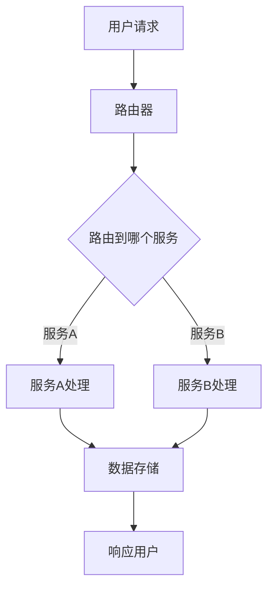

                 

### 文章标题

“利用开源贡献提升职业发展空间”是一个具有高度实用性和深远意义的话题。在这个数字化时代，开源文化已成为技术发展的核心驱动力之一。开源项目不仅推动了技术的进步，还为开发者提供了广阔的舞台，让他们通过贡献代码、解决问题、交流思想来提升自己的专业技能和职业竞争力。本文将带领读者深入探讨如何通过参与开源项目，实现个人职业发展的全面提升。

关键词：**开源贡献、职业发展、技能提升、影响力、开源社区**

摘要：本文旨在阐述开源贡献在职业发展中的重要作用。首先，我们将介绍开源文化与职业发展的关系，分析开源对职业成长的具体影响。随后，我们将介绍参与开源贡献的基础知识，包括如何选择开源项目、贡献流程以及社区礼仪。接着，通过详细讲解开源项目的核心技术原理、算法和数学模型，我们将帮助读者建立扎实的理论基础。此外，本文还将分享开源项目实战案例和职业提升策略，为读者提供实际操作指导。最后，我们将探讨开源社区参与与影响力的提升方法，以及开源对职业发展的未来展望。

### 《利用开源贡献提升职业发展空间》目录大纲

#### 第一部分：开源与职业发展概述

#### 第1章：开源文化与职业发展
- 1.1 开源运动的起源与发展
- 1.2 开源在职场中的重要性
- 1.3 开源对职业发展的作用

#### 第2章：开源贡献的基础知识
- 2.1 开源项目的选择
- 2.2 开源贡献的流程
- 2.3 开源社区的礼仪与规范

#### 第3章：核心技术原理与架构
- 3.1 开源项目的核心技术概述
- 3.2 开源项目的架构设计
- 3.3 核心技术的Mermaid流程图

#### 第4章：核心算法原理讲解
- 4.1 核心算法原理讲解
- 4.2 核心算法伪代码阐述

#### 第5章：数学模型与公式解析
- 5.1 数学模型简介
- 5.2 数学公式详细讲解
- 5.3 数学公式应用实例

#### 第二部分：实战与提升

#### 第6章：开源项目实战案例
- 6.1 实战项目介绍
- 6.2 实战项目环境搭建
- 6.3 源代码详细实现与解读
- 6.4 代码分析与优化

#### 第7章：职业提升策略
- 7.1 职业发展规划
- 7.2 职场技能提升
- 7.3 求职技巧与面试准备

#### 第8章：开源社区参与与影响力
- 8.1 参与开源社区的方式
- 8.2 在开源社区中提升影响力
- 8.3 开源社区贡献的评价与回报

#### 第9章：开源贡献与职业发展案例研究
- 9.1 成功案例分享
- 9.2 失败案例分析
- 9.3 案例启示与经验总结

#### 第10章：开源贡献的未来趋势与展望
- 10.1 开源发展的趋势分析
- 10.2 开源对职业发展的未来影响
- 10.3 开源贡献者的发展方向

#### 附录

- 附录A：开源工具与资源
  - A.1 主流开源工具对比
  - A.2 开源社区资源介绍
  - A.3 开源项目推荐

### 目录大纲结束

通过上述目录结构，本文将系统性地介绍开源贡献如何成为提升职业发展空间的利器。接下来，我们将逐步深入各个章节，详细探讨开源文化、贡献流程、技术原理、实战案例以及职业提升策略，帮助读者全面理解并有效实践开源贡献，实现个人职业的跨越式发展。

#### 第一部分：开源与职业发展概述

在当今快速变化的技术领域，开源文化已经成为推动技术进步和创新的重要力量。开源项目不仅提供了一个免费且可访问的代码库，还鼓励全球开发者的合作和共享。这种合作模式不仅促进了技术的快速迭代和发展，还为参与其中的开发者提供了广阔的职业发展空间。在这一部分中，我们将首先探讨开源文化的起源和发展，随后分析开源在职场中的重要性，并探讨开源对职业发展的具体作用。

##### 1.1 开源运动的起源与发展

开源运动起源于20世纪80年代的自由软件运动，其核心思想是软件的源代码应该对用户自由开放，用户可以自由地查看、修改和分发。这一运动的先驱包括理查德·斯托曼（Richard Stallman）和自由软件基金会（Free Software Foundation）。他们倡导自由软件的理念，并开发了GNU项目，旨在为UNIX操作系统提供一个完全自由的替代品。这一理念最终催生了Linux内核的诞生，成为现代开源运动的基石。

随着时间的推移，开源运动逐渐扩展到商业领域。许多公司开始意识到，通过开源项目可以吸引全球开发者的关注和贡献，从而加速产品开发和提升市场竞争力。2001年，Apache Software Foundation成为第一个拥有大量商业支持的顶级开源基金会，标志着开源运动进入了一个新的阶段。

目前，开源已经成为软件开发的主流模式。从操作系统（如Linux、Android）、数据库（如MySQL、PostgreSQL）、Web服务器（如Apache、Nginx）到各种应用框架（如Spring、Django），开源项目无处不在。开源不仅为开发者提供了丰富的技术资源，还促进了不同项目之间的代码共享和协同工作。

##### 1.2 开源在职场中的重要性

开源在职场中的重要性体现在多个方面。首先，参与开源项目可以显著提升开发者的技术水平和解决问题的能力。通过阅读和理解开源代码，开发者可以学习到业界最佳实践和最新的技术趋势。此外，参与开源项目还提供了实践技术的机会，使开发者能够在真实的环境中应用和优化他们的知识。

其次，开源项目提供了一个展示个人技能和项目的平台。许多公司在招聘时都会关注候选者的开源贡献。这些贡献不仅展示了开发者的编程能力，还展示了他们的团队合作精神、问题解决能力和项目管理能力。因此，参与开源项目可以为开发者带来更多的职业机会。

最后，开源项目促进了全球开发者的交流和合作。通过开源社区，开发者可以结识来自不同地区和背景的同行，分享经验，学习新技术，并共同解决技术难题。这种交流和合作不仅有助于个人技能的提升，还可以为整个行业带来创新和进步。

##### 1.3 开源对职业发展的作用

开源对职业发展的具体作用可以从以下几个方面进行探讨：

1. **技能提升**：参与开源项目可以极大地提升开发者的技能。通过实际编码和解决复杂问题，开发者可以不断积累经验，提高编程能力。此外，开源项目往往涉及多种编程语言和技术栈，使开发者能够扩展自己的技术视野。

2. **项目经验**：开源项目提供了丰富的项目经验。参与开源项目不仅可以帮助开发者理解项目开发的整个生命周期，还能提高他们的项目管理能力和团队协作能力。这对于求职和职业晋升都非常重要。

3. **个人品牌**：积极参与开源项目并在社区中建立良好的声誉，可以显著提升个人的品牌价值。许多公司在招聘时都会搜索候选者的GitHub账户和其他开源贡献，以评估其技术能力和贡献。

4. **职业机会**：参与开源项目可以吸引潜在雇主的注意。许多公司都会在招聘时优先考虑具有开源贡献的候选人。此外，开源项目还可以为开发者带来更多的合作机会和职业推荐。

5. **行业影响力**：通过在开源项目中做出重要贡献，开发者可以在行业内建立影响力。这种影响力不仅可以帮助开发者获得更多的职业机会，还能为他们的职业生涯带来更高的回报。

综上所述，开源文化不仅推动了技术的进步，还为开发者提供了广阔的职业发展空间。参与开源项目不仅能够提升个人技能和项目经验，还能为职业发展带来巨大的机会和影响力。在下一部分中，我们将进一步探讨如何选择合适的开源项目、参与贡献的流程以及社区礼仪，帮助读者更好地利用开源贡献提升职业发展空间。

#### 第2章：开源贡献的基础知识

参与开源项目不仅有助于技术提升，还可以为职业发展带来诸多机会。然而，要成功地参与开源贡献，首先需要了解一些基础知识。在本章中，我们将详细介绍如何选择合适的开源项目、贡献流程以及开源社区中的礼仪和规范，帮助读者顺利开启开源贡献之旅。

##### 2.1 开源项目的选择

选择合适的开源项目是参与贡献的第一步。以下是一些选择开源项目时可以考虑的因素：

1. **技术栈**：选择与你的专业技能相关的开源项目，这样你才能更快速地理解和贡献代码。例如，如果你擅长前端开发，可以选择参与一个前端框架或库的项目。

2. **活跃度**：查看项目的活跃度，包括最近的活动、提交记录和社区讨论。活跃的项目意味着有更多的机会与社区成员互动和学习。

3. **贡献指南**：优秀的开源项目通常会有详细的贡献指南，包括如何提交问题、如何贡献代码等。选择有明确贡献指南的项目可以减少初期的不确定性。

4. **项目大小**：对于初学者来说，选择一个中小型的项目可能更容易上手。大型项目通常有复杂的架构和大量的代码库，需要更长的时间去熟悉。

5. **社区氛围**：查看项目的社区氛围是否友好和开放。一个积极和支持性的社区可以为你提供更多的帮助和鼓励。

常见的开源项目平台包括GitHub、GitLab和Bitbucket等。在这些平台上，你可以通过搜索、浏览项目标签和阅读项目描述来找到感兴趣的项目。

##### 2.2 开源贡献的流程

一旦选择了合适的开源项目，了解如何进行贡献是非常重要的。以下是一个典型的开源贡献流程：

1. **阅读贡献指南**：在开始贡献之前，仔细阅读项目的贡献指南。这通常包括如何报告问题、如何请求拉取请求（PR）以及代码贡献的规范。

2. **了解项目架构**：熟悉项目的整体架构和关键组件。这有助于你理解代码库的组织结构和功能模块，从而更有效地贡献代码。

3. **解决小问题**：对于初学者来说，从解决小问题开始是一个好的起点。这些问题通常比较简单，可以帮助你快速熟悉项目的代码库和开发流程。

4. **创建功能分支**：在开始编写代码之前，为你的贡献创建一个新的功能分支。这可以避免对主分支造成潜在的破坏，并允许你在自己的分支上进行实验。

5. **编写代码**：按照项目的需求和规范编写代码。在编写过程中，确保代码清晰、简洁且具有良好的注释。

6. **提交拉取请求（PR）**：完成代码后，将你的分支与主分支合并并提交一个拉取请求。在PR的描述中，清晰地描述你所做的修改和理由。

7. **接受反馈**：在提交PR后，维护者和其他贡献者可能会对你的代码提出反馈和建议。认真对待这些反馈，并根据需要进行代码的修改。

8. **合并代码**：一旦你的PR通过审核并获得合并，你的贡献将被纳入主分支，并成为项目的一部分。

##### 2.3 开源社区的礼仪与规范

参与开源社区需要遵守一定的礼仪和规范，这不仅有助于建立良好的合作关系，还能提高项目的整体质量和社区氛围。以下是一些常见的基本礼仪和规范：

1. **尊重他人**：在社区中，始终尊重其他成员的意见和建议。避免使用攻击性语言，即使有分歧也要保持礼貌和专业。

2. **积极参与讨论**：积极参与社区讨论，分享你的见解和经验。这不仅有助于项目的发展，还能建立你的个人品牌。

3. **遵循社区规范**：每个项目都有其特定的社区规范，例如代码风格、提交格式等。确保遵守这些规范，以保持项目的统一性和可维护性。

4. **及时响应**：对于社区中的问题、反馈和建议，尽量及时响应。这可以避免问题的积累，提高社区的互动效率。

5. **保持透明**：在开发过程中，保持透明度。及时更新你的进度和遇到的问题，以便社区成员能够了解项目的进展情况。

6. **给予反馈**：在他人提交的代码或PR中，给予建设性的反馈。这不仅可以帮助他们改进代码，还能提高整个项目的质量。

通过了解上述基础知识，读者可以更好地准备参与开源贡献。在下一部分中，我们将深入探讨开源项目的核心技术原理和架构，帮助读者在理论层面上更好地理解开源项目，为后续的贡献打下坚实的基础。

#### 第3章：核心技术原理与架构

要深入了解开源项目，理解其核心技术和架构是必不可少的。核心技术原理和架构不仅为项目提供了功能实现的基础，也决定了项目的性能、可扩展性和可维护性。在本章中，我们将对开源项目的核心技术原理和架构进行概述，并使用Mermaid流程图来详细呈现这些技术原理和架构，以便读者能够更直观地理解。

##### 3.1 开源项目的核心技术概述

开源项目的核心技术可以包括以下几个方面：

1. **核心技术组件**：项目中的核心组件通常负责主要功能的实现。例如，在Web应用中，核心组件可能包括前端框架、后端服务、数据库连接等。

2. **技术栈**：项目采用的技术栈决定了其开发工具、框架和库的选择。了解项目使用的技术栈有助于开发者快速上手和贡献代码。

3. **数据处理**：许多开源项目涉及大量数据处理，如数据存储、检索、分析等。理解这些数据处理流程对于优化性能和扩展功能至关重要。

4. **安全性**：在开源项目中，安全性是一个重要的考量。核心技术原理通常涉及安全机制的实现，如加密、认证和访问控制。

5. **可扩展性**：开源项目往往需要支持大规模用户和扩展功能。核心技术架构的设计需要考虑可扩展性，以便在未来能够轻松扩展。

##### 3.2 开源项目的架构设计

开源项目的架构设计通常基于微服务、模块化或单体架构等不同的设计模式。以下是几种常见的架构设计：

1. **微服务架构**：微服务架构将应用程序分解为多个独立的、小型且高度自治的服务。每个服务负责一个特定的功能，并通过API进行通信。这种架构提供了高可扩展性和容错性。

2. **模块化架构**：模块化架构将应用程序划分为多个模块，每个模块负责不同的功能。模块之间通过接口进行通信，便于维护和扩展。

3. **单体架构**：在单体架构中，应用程序作为一个整体运行，没有明确的模块划分。这种架构在项目初期较为简单，但随着规模的扩大，可能面临维护和扩展的挑战。

##### 3.3 核心技术的Mermaid流程图

为了帮助读者更直观地理解开源项目的核心技术原理和架构，我们使用Mermaid流程图来展示这些内容。以下是一个简单的例子：



在这个流程图中，用户请求通过路由器分配到特定的服务（服务A或服务B），每个服务对请求进行处理，并将结果存储到数据库，最后返回给用户。

通过使用Mermaid流程图，读者可以清晰地看到项目的数据处理流程和各个组件之间的交互关系，这有助于他们在贡献代码时更好地理解项目架构。

#### 第4章：核心算法原理讲解

开源项目中的核心算法是实现其功能的关键，理解这些算法的原理对于开发者来说至关重要。在本章中，我们将深入探讨几个典型的核心算法，并通过伪代码的形式详细阐述这些算法的实现过程。这不仅有助于读者理解算法的基本思想，还能为他们提供实际编码的参考。

##### 4.1 核心算法原理讲解

1. **快速排序（Quick Sort）**

快速排序是一种高效的排序算法，其基本思想是通过选取一个“基准”元素，将数组分为两个子数组，一个子数组中的所有元素都比基准小，另一个子数组中的所有元素都比基准大。然后，递归地排序两个子数组。

```plaintext
快速排序算法伪代码：
function quicksort(array, low, high)
    if low < high
        pi = partition(array, low, high)
        quicksort(array, low, pi - 1)
        quicksort(array, pi + 1, high)
```

2. **二分查找（Binary Search）**

二分查找算法在有序数组中查找特定元素。其基本思想是通过不断将搜索范围缩小一半，直到找到目标元素或确定其不存在。

```plaintext
二分查找算法伪代码：
function binarySearch(array, target, low, high)
    while low <= high
        mid = (low + high) / 2
        if array[mid] == target
            return mid
        else if array[mid] < target
            low = mid + 1
        else
            high = mid - 1
    return -1
```

3. **动态规划（Dynamic Programming）**

动态规划是一种用于求解最优子结构问题的算法。其基本思想是将复杂问题分解为多个子问题，并存储子问题的解以避免重复计算。

```plaintext
动态规划算法伪代码（斐波那契数列）：
function fibonacci(n)
    if n <= 1
        return n
    dp[0] = 0
    dp[1] = 1
    for i from 2 to n
        dp[i] = dp[i - 1] + dp[i - 2]
    return dp[n]
```

##### 4.2 核心算法伪代码阐述

在上面的伪代码中，我们分别阐述了快速排序、二分查找和动态规划的基本思想。下面我们进一步解释这些算法的实现过程：

1. **快速排序**：该算法首先选择一个基准元素（通常选择数组的最后一个元素），然后将数组分成两部分，一部分是所有小于基准元素的值，另一部分是所有大于基准元素的值。这一过程通过`partition`函数实现。然后，递归地对这两个子数组进行快速排序。

2. **二分查找**：在有序数组中，二分查找算法通过不断地将搜索范围缩小一半来找到目标元素。每次比较中间元素，如果中间元素大于目标，则搜索左侧子数组；如果中间元素小于目标，则搜索右侧子数组；如果中间元素等于目标，则返回当前位置。如果搜索范围缩小到零，则目标不存在。

3. **动态规划**：动态规划算法通常用于解决具有最优子结构的问题。以斐波那契数列为例，动态规划将问题分解为多个子问题，并存储每个子问题的解，以避免重复计算。每个子问题的解是通过前两个子问题的解来计算的，从而构建出整个问题的解。

通过理解这些核心算法的伪代码，读者可以掌握它们的基本实现原理，并在实际编程中应用这些算法来解决各种问题。

#### 第5章：数学模型与公式解析

在许多开源项目中，数学模型和公式是理解和实现核心算法的关键。理解这些数学模型和公式的原理，不仅有助于开发者更好地编写代码，还能优化算法性能和解决复杂问题。在本章中，我们将介绍一些常见的数学模型，并使用LaTeX格式详细讲解这些公式，同时提供实际应用实例。

##### 5.1 数学模型简介

数学模型是一种用数学语言描述现实世界问题的抽象工具。它将复杂问题简化为数学表达式，通过求解这些表达式来获得问题的解。在开源项目中，数学模型广泛应用于算法设计、数据分析、系统优化等领域。

常见的数学模型包括：

1. **线性回归模型**：用于预测一个变量基于其他变量的线性关系。
2. **神经网络模型**：用于模拟人脑神经元之间的交互，广泛用于机器学习和深度学习。
3. **博弈论模型**：用于分析多个参与者之间的策略选择和收益分配。
4. **排队论模型**：用于分析服务系统的性能和优化。

##### 5.2 数学公式详细讲解

以下是一些常见数学模型和公式的详细讲解：

1. **线性回归公式**
   $$ y = \beta_0 + \beta_1 \cdot x + \epsilon $$
   其中，$y$ 是因变量，$x$ 是自变量，$\beta_0$ 和 $\beta_1$ 是模型的参数，$\epsilon$ 是误差项。

2. **神经网络激活函数**
   $$ f(z) = \frac{1}{1 + e^{-z}} $$
   其中，$z$ 是神经元的输入，$f(z)$ 是神经元的输出。

3. **博弈论支付矩阵**
   $$ \begin{pmatrix} 
   (r_1, c_1) & (r_1, c_2) \\
   (r_2, c_1) & (r_2, c_2) 
   \end{pmatrix} $$
   其中，$r_i$ 和 $c_i$ 分别代表两个参与者采取策略 $i$ 时的支付。

4. **排队论服务率**
   $$ \lambda = \frac{\lambda_1 + \lambda_2}{1 + \rho} $$
   其中，$\lambda$ 是总的服务率，$\lambda_1$ 和 $\lambda_2$ 分别是两个服务台的服务率，$\rho$ 是服务强度。

##### 5.3 数学公式应用实例

以下是一些数学公式的应用实例：

1. **线性回归模型应用实例**

假设我们要预测一个房间的温度 $y$，基于室外温度 $x$。我们可以建立线性回归模型：
$$ y = 0.5x + 20 + \epsilon $$
如果室外温度是 $30^\circ C$，我们可以预测房间的温度：
$$ y = 0.5 \cdot 30 + 20 + \epsilon = 25 + \epsilon $$
其中，$\epsilon$ 是误差项。

2. **神经网络激活函数应用实例**

假设一个神经元的输入是 $z = 2$，我们可以计算其输出：
$$ f(z) = \frac{1}{1 + e^{-2}} \approx 0.8678 $$
这意味着该神经元的激活概率大约为 $86.78\%$。

3. **博弈论支付矩阵应用实例**

假设有两个玩家，他们可以选择策略 $A$ 或 $B$。他们的支付矩阵如下：
$$ \begin{pmatrix} 
(3, 2) & (0, 1) \\
(1, 4) & (5, 0) 
\end{pmatrix} $$
如果玩家1选择策略 $A$，玩家2选择策略 $B$，他们的收益分别为 $(3, 2)$ 和 $(1, 4)$。

4. **排队论服务率应用实例**

假设一个服务台的服务率是 $\lambda_1 = 5$，另一个服务台的服务率是 $\lambda_2 = 3$，服务强度是 $\rho = 0.8$。我们可以计算总的服务率：
$$ \lambda = \frac{5 + 3}{1 + 0.8} = 4.55 $$
这意味着总的服务率大约是 $4.55$。

通过上述实例，我们可以看到数学模型和公式在开源项目中的应用。理解并运用这些公式，可以帮助开发者更好地实现项目的功能，并优化算法性能。

#### 第6章：开源项目实战案例

通过理论学习，我们了解了开源项目的核心技术原理和架构，但在实际开发中，如何将这些理论应用到具体项目中仍然是一个挑战。在本章中，我们将通过一个具体的开源项目实战案例，详细讲解项目环境搭建、源代码实现与解读，并分析代码中的关键点和优化策略，帮助读者将所学知识应用于实践。

##### 6.1 实战项目介绍

我们选择了一个流行的开源项目——Python机器学习库`scikit-learn`。`scikit-learn`是一个强大的机器学习工具包，提供了丰富的算法库和模型工具，广泛用于数据挖掘和数据分析。通过参与这个项目，我们可以学习如何进行机器学习模型的开发、调试和优化。

##### 6.2 实战项目环境搭建

要开始贡献`scikit-learn`项目，首先需要搭建一个合适的环境。以下是环境搭建的步骤：

1. **安装Python**：确保系统上安装了Python 3.6或更高版本。

2. **安装虚拟环境**：使用`virtualenv`创建一个虚拟环境，以隔离项目依赖。
   ```bash
   pip install virtualenv
   virtualenv myenv
   source myenv/bin/activate
   ```

3. **安装依赖**：在虚拟环境中安装`scikit-learn`及其依赖。
   ```bash
   pip install -r requirements.txt
   ```

4. **克隆项目**：使用Git克隆`scikit-learn`的仓库。
   ```bash
   git clone https://github.com/scikit-learn/scikit-learn.git
   cd scikit-learn
   ```

##### 6.3 源代码详细实现与解读

在了解了环境搭建步骤后，我们可以开始分析`scikit-learn`的核心代码。以下是一个简单的例子，展示如何实现一个线性回归模型：

```python
from sklearn.linear_model import LinearRegression
from sklearn.model_selection import train_test_split
from sklearn.metrics import mean_squared_error

# 加载数据
X, y = load_data()

# 划分训练集和测试集
X_train, X_test, y_train, y_test = train_test_split(X, y, test_size=0.2, random_state=42)

# 创建线性回归模型
model = LinearRegression()

# 训练模型
model.fit(X_train, y_train)

# 预测测试集
y_pred = model.predict(X_test)

# 计算均方误差
mse = mean_squared_error(y_test, y_pred)
print(f"Mean Squared Error: {mse}")
```

**代码解读**：

- **导入模块**：首先，我们导入所需的模块，包括`LinearRegression`、`train_test_split`和`mean_squared_error`。
- **加载数据**：通过`load_data()`函数加载数据集。这可以是任何格式的数据，如CSV、Excel等。
- **划分训练集和测试集**：使用`train_test_split`函数将数据集划分为训练集和测试集，通常测试集大小为20%。
- **创建线性回归模型**：创建一个`LinearRegression`对象。
- **训练模型**：使用`fit`方法训练模型。
- **预测测试集**：使用`predict`方法对测试集进行预测。
- **计算均方误差**：计算预测结果与真实结果的均方误差，评估模型性能。

##### 6.4 代码分析与优化

在实际项目中，代码的优化是一个重要的环节。以下是对上述代码的优化分析：

1. **代码性能优化**：

   - 使用`np.array`代替Python列表，提高数据处理速度。
   - 使用向量化操作代替循环，提高计算效率。

   优化后的代码：

   ```python
   import numpy as np
   from sklearn.linear_model import LinearRegression
   from sklearn.model_selection import train_test_split
   from sklearn.metrics import mean_squared_error

   # 加载数据
   X, y = load_data()

   # 划分训练集和测试集
   X_train, X_test, y_train, y_test = train_test_split(X, y, test_size=0.2, random_state=42)

   # 创建线性回归模型
   model = LinearRegression()

   # 训练模型
   model.fit(X_train, y_train)

   # 预测测试集
   y_pred = model.predict(X_test.reshape(-1, 1))

   # 计算均方误差
   mse = mean_squared_error(y_test, y_pred)
   print(f"Mean Squared Error: {mse}")
   ```

2. **代码可读性优化**：

   - 添加注释，提高代码可读性。
   - 使用函数和类封装代码，提高代码的模块化和复用性。

   优化后的代码：

   ```python
   import numpy as np
   from sklearn.linear_model import LinearRegression
   from sklearn.model_selection import train_test_split
   from sklearn.metrics import mean_squared_error

   def load_and_split_data(X, y, test_size=0.2, random_state=42):
       X_train, X_test, y_train, y_test = train_test_split(X, y, test_size=test_size, random_state=random_state)
       return X_train, X_test, y_train, y_test

   def train_and_evaluate(model, X_train, y_train, X_test, y_test):
       model.fit(X_train, y_train)
       y_pred = model.predict(X_test.reshape(-1, 1))
       mse = mean_squared_error(y_test, y_pred)
       return mse

   # 加载数据
   X, y = load_data()

   # 划分训练集和测试集
   X_train, X_test, y_train, y_test = load_and_split_data(X, y)

   # 创建线性回归模型
   model = LinearRegression()

   # 训练模型并评估
   mse = train_and_evaluate(model, X_train, y_train, X_test, y_test)
   print(f"Mean Squared Error: {mse}")
   ```

通过上述实战案例，我们不仅了解了`scikit-learn`项目的具体实现过程，还学习了如何进行代码优化和模块化。这些实践经验对于提升开发技能和参与开源贡献至关重要。

#### 第7章：职业提升策略

在开源贡献的过程中，如何有效地提升自己的职业竞争力是一个重要的话题。合理的职业发展规划、持续的技能提升以及掌握求职技巧和面试准备策略，都是实现职业提升的关键因素。在本章中，我们将详细探讨这些策略，帮助读者在开源贡献的同时，为自己的职业发展打下坚实的基础。

##### 7.1 职业发展规划

职业发展规划是一个长期的过程，需要明确的目标和详细的计划。以下是一些制定职业发展规划的步骤：

1. **自我评估**：首先，进行自我评估，了解自己的兴趣、优势、劣势和职业目标。这可以通过填写个人兴趣量表、进行职业性格测试等方式实现。

2. **设定目标**：基于自我评估，设定短期和长期职业目标。短期目标可以是1-2年内实现的具体成就，如掌握某一新技能、参与某个重要项目等；长期目标则可以是5-10年的职业规划，如晋升到更高职位、成为行业专家等。

3. **制定计划**：针对设定的目标，制定具体的行动计划。例如，如果目标是掌握某一新技能，可以列出需要学习的内容、学习时间表和实现途径。

4. **定期评估**：职业规划不是一成不变的，需要根据实际情况进行调整。定期评估自己的进度和成果，并根据评估结果调整计划。

##### 7.2 职场技能提升

在开源贡献的过程中，不断提升自己的技能是职业发展的关键。以下是一些提升职场技能的方法：

1. **技术技能**：积极参与开源项目，掌握最新的技术趋势和工具。通过阅读文档、参加在线课程和参与技术社区，不断提升自己的技术水平。

2. **编程能力**：编程能力是软件开发者的核心技能。通过编写高质量、结构清晰的代码，提高编程技巧。可以尝试参与代码审查，学习他人代码的优缺点。

3. **沟通能力**：在开源社区中，良好的沟通能力至关重要。学会清晰地表达自己的想法，理解他人的意见，有效解决冲突，提高团队协作效率。

4. **项目管理**：参与开源项目可以提升项目管理能力。了解项目开发流程、任务分配、时间管理等内容，为将来的项目管理工作做好准备。

##### 7.3 求职技巧与面试准备

掌握求职技巧和面试准备策略，可以帮助读者在求职过程中脱颖而出。以下是一些建议：

1. **撰写简历**：简历是求职的第一步，要确保简历清晰、简洁且具有吸引力。突出自己的项目经验、技术技能和成果，使用数据量化成绩，如“优化了系统性能，提高了20%的响应速度”。

2. **准备面试**：面试前，了解公司的背景、文化和职位要求。准备常见的面试题目，如自我介绍、项目经历、技术问题等，并通过模拟面试提高自信心。

3. **展示实际能力**：在面试中，通过实际项目经验和代码演示，展示自己的技术能力和解决问题的能力。如果可能，提前准备一些相关代码片段或项目示例。

4. **了解行业动态**：保持对行业动态的关注，了解行业趋势和技术发展，这有助于在面试中展示自己的专业知识和见解。

通过制定合理的职业发展规划、不断提升职场技能以及掌握求职技巧和面试准备策略，读者可以在开源贡献的过程中，实现自己的职业提升。这些策略不仅适用于开源项目，也适用于日常职业发展，帮助读者在竞争激烈的职场中取得成功。

#### 第8章：开源社区参与与影响力

在开源社区中，积极参与和有效贡献不仅能够提升个人技能和职业发展，还能在行业中建立广泛的影响力。本章节将探讨如何在开源社区中积极参与、提升影响力和获得回报，并提供一些实用的方法。

##### 8.1 参与开源社区的方式

要有效地参与开源社区，首先需要了解以下几种常见的方式：

1. **提交问题**：许多开源项目都会在GitHub等平台上设置issue tracker，用于记录和跟踪问题。通过提交问题，你可以帮助项目发现潜在的错误和缺陷，也可以学习如何使用项目。

2. **贡献代码**：贡献代码是开源社区中最直接的方式。你可以修复已知的bug、添加新功能或改进现有功能。在贡献代码前，确保阅读项目的贡献指南，遵循代码规范和流程。

3. **文档贡献**：开源项目的文档同样重要。通过编写和改进文档，你可以帮助新用户更好地理解和使用项目。

4. **代码审查**：参与代码审查可以提升自己的编码技能，同时也是对其他贡献者的一种支持。通过审查他人的代码，你可以学习不同的编码风格和最佳实践。

5. **组织活动**：参与或组织开源相关的会议、研讨会和代码马拉松等活动，可以扩大你的影响力，结识更多的开发者。

##### 8.2 在开源社区中提升影响力

提升影响力是开源贡献的一个重要目标。以下是一些实用的方法：

1. **持续贡献**：持之以恒地贡献高质量的代码和文档，是建立影响力的基础。持续的贡献会逐渐让你的名字与项目紧密联系在一起。

2. **建立个人品牌**：在开源社区中，个人品牌至关重要。通过撰写技术博客、发布技术演讲和参与技术社区，可以提升你的知名度和影响力。

3. **积极参与讨论**：在社区中积极参与讨论，分享你的见解和经验。这不仅能建立你的专家形象，还能帮助项目发展。

4. **参与项目治理**：如果可能，参与项目的决策过程，如成为项目的维护者或贡献者委员会成员。这不仅可以提升你的影响力，还能让你在项目的发展中发挥更大的作用。

5. **合作与互助**：与其他贡献者建立良好的合作关系，共同解决项目中的问题。通过互助，你可以学习到更多的知识和技能，同时提升自己的影响力。

##### 8.3 开源社区贡献的评价与回报

开源社区对贡献的评价和回报多种多样，以下是一些常见的回报形式：

1. **技术技能提升**：参与开源项目可以极大地提升你的编程能力、系统设计和项目管理技能。

2. **职业机会**：开源贡献者通常会得到更多的职业机会。许多公司在招聘时会优先考虑具有开源贡献经验的候选人。

3. **社交网络**：通过参与开源社区，你可以结识来自世界各地的开发者，建立广泛的社交网络。

4. **社区认可**：开源社区会通过多种方式认可贡献者，如发布贡献者名单、颁发贡献奖等。

5. **职业推荐**：在某些情况下，开源社区中的认可和声誉可以直接转化为职业推荐，帮助你在职业发展中取得突破。

6. **经济回报**：虽然开源项目通常是免费的，但许多贡献者会通过其他方式获得经济回报，如通过开源项目推广自己的服务或产品，或直接从赞助者那里获得资金支持。

通过积极参与开源社区，提升个人影响力，并充分利用开源贡献带来的回报，开发者可以在职业发展的道路上走得更远。在下一章节中，我们将通过案例研究进一步探讨开源贡献与职业发展的关系，为读者提供更多的实际经验和启示。

#### 第9章：开源贡献与职业发展案例研究

在开源贡献与职业发展之间，有许多成功的案例展示了开源如何成为个人职业生涯的助推器。在本章中，我们将通过分享一些成功案例和失败案例，详细分析这些案例的启示和经验总结，帮助读者更好地理解开源贡献的实际效果和潜在风险。

##### 9.1 成功案例分享

以下是一些开源贡献成功推动职业发展的经典案例：

1. **案例一：开源成为跳板**

   李明是一名软件开发工程师，他在业余时间积极参与了一个知名的前端框架开源项目。通过该项目，他不仅掌握了最新的前端技术，还获得了项目维护者的认可。在一次公司招聘中，李明因为丰富的开源贡献经验，获得了面试机会并被录用。在新的工作环境中，他迅速融入团队，并因为技术实力和开源经验得到了快速晋升。

   **启示**：开源项目可以成为展示个人技能的窗口，有助于吸引潜在雇主的注意。积极参与开源项目，不仅可以提升技能，还能增加职业机会。

2. **案例二：开源成为品牌**

   王华是一名数据科学家，他在GitHub上创建了一个用于数据分析和可视化的小工具，并不断优化和完善。这个工具很快在社区中获得广泛关注，王华也因此成为该领域的知名开发者。通过开源项目，他受邀在多个技术会议和研讨会上演讲，积累了丰富的行业资源和人脉，最终成功转型为数据科学领域的顾问，实现了职业的跃迁。

   **启示**：建立个人品牌是开源贡献的一个重要回报。通过在开源项目中展示专业能力，可以提升个人知名度，拓宽职业发展道路。

3. **案例三：开源助力创业**

   张强是一名软件工程师，他通过参与一个开源项目的贡献，结识了一批志同道合的开发者。这些开发者共同创立了一家专注于开源技术的公司。张强在公司中担任技术负责人，凭借在开源项目中的经验和人脉，帮助公司迅速积累用户和市场份额，实现了创业成功。

   **启示**：开源项目可以成为创业的起点。通过开源贡献，可以结识优秀的同行，为未来的创业之路打下坚实的基础。

##### 9.2 失败案例分析

然而，开源贡献并非总是顺利的。以下是一些失败的案例及其教训：

1. **案例一：贡献与回报不对等**

   刘伟是一名软件开发工程师，他在GitHub上参与了一个开源项目的贡献。然而，由于项目的维护者缺乏有效沟通和反馈，刘伟的贡献没有得到充分的认可。长期以来的挫败感使他逐渐失去了参与的积极性，最终选择了退出。

   **教训**：开源贡献需要良好的沟通和反馈机制。缺乏认可和反馈会导致贡献者失去动力，影响项目的长期发展。

2. **案例二：开源对个人时间的占用**

   陈燕是一名职场新晋员工，她在业余时间积极参与开源项目。然而，随着项目任务的增多，她发现自己难以平衡工作与开源贡献，导致工作质量下降。最终，她不得不选择暂停开源贡献，专注于工作。

   **教训**：开源贡献需要合理的时间管理。过度投入开源项目可能会影响工作和其他生活方面，需要权衡和调整。

3. **案例三：开源贡献导致法律纠纷**

   赵刚是一名软件工程师，他在开源项目中贡献了一部分代码。然而，这些代码涉嫌侵犯了某个商业软件的版权。尽管赵刚是无意中侵犯了版权，但最终他不得不承担法律责任，并支付了一定的赔偿费用。

   **教训**：开源贡献需要遵守法律法规。在贡献代码前，应确保没有侵犯他人的知识产权，避免法律风险。

##### 9.3 案例启示与经验总结

通过上述成功和失败的案例，我们可以总结出以下启示和经验：

1. **持续贡献，保持热情**：成功开源贡献者通常都有持续的热情和动力。保持兴趣和激情，是成功的关键。

2. **有效沟通，积极反馈**：与项目维护者和社区成员保持良好的沟通，获取及时反馈，有助于提高贡献的质量和认可度。

3. **合理规划时间，平衡工作与生活**：开源贡献需要时间投入，但不应影响工作和其他生活方面。合理规划时间，保持工作与生活的平衡。

4. **遵守法律法规，确保合法合规**：开源贡献过程中，应确保遵守相关法律法规，避免法律风险。

5. **建立个人品牌，提升影响力**：通过开源贡献建立个人品牌，提升个人知名度，有助于职业发展。

6. **学会面对失败，总结经验**：失败是开源贡献中不可避免的一部分。学会从失败中吸取教训，不断提升自己。

通过案例研究，我们不仅看到了开源贡献对职业发展的积极影响，也认识到了其中可能存在的挑战和风险。在下一章节中，我们将探讨开源贡献的未来趋势与展望，帮助读者更好地把握开源发展的方向。

#### 第10章：开源贡献的未来趋势与展望

随着技术的不断进步和开源文化的普及，开源贡献已经逐渐成为全球开发者的共同行为。在本章中，我们将分析开源发展的趋势，探讨这些趋势对职业发展的未来影响，并展望开源贡献者的发展方向。

##### 10.1 开源发展的趋势分析

1. **开源商业化的深化**：越来越多的企业通过开源项目获取市场份额和技术优势。开源商业化模式，如“开源加服务”（Open Core）、“双重许可”（Dual Licensing）等，越来越受到青睐。这为开源贡献者提供了更多的经济回报和发展机会。

2. **社区治理的重要性**：随着开源项目的规模和复杂性增加，社区治理成为确保项目健康发展的关键。项目治理涉及决策过程、贡献者管理、资源分配等方面，有效的社区治理能够提高项目的稳定性和可持续性。

3. **开源技术的多样性**：开源项目涵盖了从操作系统、数据库到框架、库等各个领域。未来，随着新兴技术的涌现，如区块链、人工智能、物联网等，开源技术将更加多样化，为开发者提供更广阔的舞台。

4. **全球化合作**：开源社区越来越国际化，全球开发者通过互联网共同合作，推动技术的创新和发展。这种全球化趋势不仅促进了技术的共享和交流，也为开发者提供了更多的职业机会。

##### 10.2 开源对职业发展的未来影响

1. **技能要求的提升**：开源项目通常需要开发者具备广泛的技术知识和实践经验。随着技术的发展，开源项目对开发者的技能要求将不断提高，如对人工智能、云计算、大数据等领域的知识需求将更加突出。

2. **职业路径的多样化**：开源贡献不仅为开发者提供了技术提升的机会，还为他们开辟了多样化的职业路径。开发者可以通过开源项目建立个人品牌，成为技术专家、顾问、讲师等，甚至通过开源项目实现创业梦想。

3. **职业竞争力的增强**：具有开源贡献经验的开发者通常具备更强的解决问题的能力和团队合作精神。这些素质在职场中非常受雇主青睐，有助于提升职业竞争力。

4. **全球化的职业机会**：随着开源项目的国际化，开发者的职业机会不再局限于本地市场。通过开源社区，开发者可以与世界各地的同行交流合作，获取全球性的职业机会。

##### 10.3 开源贡献者的发展方向

1. **技术专家**：开源贡献者可以通过不断提升技术能力，成为特定领域的专家。这不仅可以为个人职业发展带来更多机会，还可以通过技术咨询服务或顾问工作获得经济回报。

2. **开源项目领导者**：参与开源项目的治理和管理，成为项目的核心贡献者或领导者。这不仅能够提升个人影响力，还能为开源项目的发展提供方向和支持。

3. **跨界创业者**：结合开源技术和自身优势，开发创新的解决方案或产品，成为跨界创业者。通过开源项目积累的用户和资源，创业者可以快速验证市场潜力，降低创业风险。

4. **教育培训**：利用在开源社区积累的经验和知识，参与技术教育和培训工作。通过编写教材、开设课程或在线教育平台，开源贡献者可以分享自己的知识和经验，为社会培养更多的技术人才。

通过分析开源发展的趋势和对职业发展的未来影响，我们可以看到，开源贡献不仅为开发者提供了广阔的发展空间，还为整个行业带来了创新和活力。在开源贡献的道路上，开发者需要不断提升自己，抓住机遇，实现个人和职业的双重成长。

#### 附录

在开源领域，拥有合适的工具和资源是成功贡献的关键。附录部分将介绍一些主流的开源工具与资源，帮助读者在开源贡献过程中更高效地工作。

##### 附录A：开源工具与资源

###### A.1 主流开源工具对比

在选择开源工具时，了解不同工具的特点和适用场景非常重要。以下是一些常用的开源工具及其对比：

1. **版本控制工具**
   - **Git**：最流行的版本控制系统，支持分布式开发，适合大型项目和团队协作。
   - **Mercurial**：另一种分布式版本控制系统，与Git类似，但更易于使用。

2. **代码托管平台**
   - **GitHub**：全球最大的代码托管平台，提供丰富的社交功能，适合公开项目和团队合作。
   - **GitLab**：自托管版本控制平台，适合内部项目和企业使用。

3. **持续集成与持续部署**
   - **Jenkins**：通用的持续集成服务器，支持多种插件，适用于各种开发环境。
   - **Travis CI**：基于云的持续集成服务，适用于开源项目和自动化测试。

4. **代码质量分析工具**
   - **SonarQube**：全面的代码质量平台，支持静态代码分析、代码审查和安全测试。
   - **CodeClimate**：提供代码质量评分和反馈，帮助团队提升代码质量。

5. **容器化工具**
   - **Docker**：容器化技术的领导者，适用于应用程序的打包、分发和部署。
   - **Kubernetes**：开源的容器编排平台，用于自动化容器的部署和管理。

###### A.2 开源社区资源介绍

1. **GitHub Guides**：GitHub官方提供的教程和指南，涵盖从创建仓库到代码贡献的各个方面。

2. **Git Committers**：Git的官方手册，详细介绍了Git的各个方面，是Git用户的必读资料。

3. **Stack Overflow**：全球最大的开发者社区，提供丰富的技术问题和解决方案，适合解决开发中的疑难杂症。

4. **Awesome Repositories**：各种领域优秀的开源项目集合，包括编程语言、框架、工具等。

5. **Open Source Initiative (OSI)**：开源组织的官方机构，提供开源许可证和标准的定义。

###### A.3 开源项目推荐

以下是几个推荐的开源项目，涵盖了不同的技术领域：

1. **Django**：Python Web开发框架，用于快速构建高性能的应用程序。
2. **Kubernetes**：容器编排平台，用于自动化容器化应用程序的部署和管理。
3. **TensorFlow**：由Google开发的机器学习框架，适用于各种深度学习应用。
4. **Docker**：容器化技术，用于应用程序的打包、分发和部署。
5. **Spring Boot**：Java开发框架，提供快速构建独立、生产级的应用程序。

通过使用这些开源工具和资源，开发者可以更高效地参与开源贡献，提升项目质量和影响力。附录部分的这些内容将为读者在开源之路上的探索提供有力支持。

