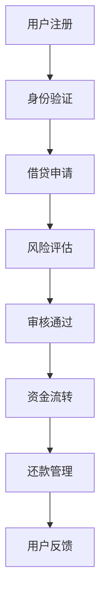

                 

# 《利用技术优势进行P2P借贷》

> 关键词：P2P借贷、技术优势、市场环境、核心技术、项目实战、未来发展趋势

> 摘要：本文从P2P借贷的基本概念和市场环境出发，详细阐述了技术优势在P2P借贷中的应用。通过分析P2P借贷的技术架构、核心技术和项目实战，揭示了技术优势在提高借贷效率、风险管理、用户体验优化等方面的作用。同时，对未来P2P借贷的发展趋势和挑战进行了展望，提出了相应的应对策略。

### 《利用技术优势进行P2P借贷》目录大纲

#### 第一部分：P2P借贷概述

**第1章：P2P借贷的基本概念与市场环境**

1.1 P2P借贷的定义与特点

1.1.1 P2P借贷的概念

1.1.2 P2P借贷与传统借贷的区别

1.1.3 P2P借贷的发展历程

1.2 P2P借贷的市场环境

1.2.1 全球P2P借贷市场规模分析

1.2.2 我国P2P借贷市场现状

1.2.3 P2P借贷市场的发展趋势

1.3 技术优势在P2P借贷中的应用

1.3.1 技术在提高借贷效率方面的作用

1.3.2 技术在风险管理中的应用

1.3.3 技术在用户体验优化方面的作用

#### 第二部分：P2P借贷的核心技术

**第2章：P2P借贷的技术架构与实现**

2.1 P2P借贷的技术架构

2.1.1 P2P借贷系统总体架构

2.1.2 用户注册与认证

2.1.3 借贷申请与审核

2.1.4 资金流转与管理

2.2 数据挖掘与风控技术

2.2.1 数据挖掘的基本原理

2.2.2 风险评估模型构建

2.2.3 实时监控与预警系统

2.3 互联网金融技术

2.3.1 区块链技术在P2P借贷中的应用

2.3.2 智能合约的应用

2.3.3 云计算与大数据技术

2.4 用户界面与交互设计

2.4.1 前端技术选型

2.4.2 用户体验优化

2.4.3 界面设计与实现

#### 第三部分：P2P借贷的项目实战

**第3章：P2P借贷平台搭建与运营**

3.1 平台搭建

3.1.1 开发环境搭建

3.1.2 系统设计与实现

3.1.3 系统测试与优化

3.2 平台运营

3.2.1 用户增长策略

3.2.2 资金管理策略

3.2.3 风险管理策略

3.3 实际案例分析

3.3.1 成功案例解析

3.3.2 失败案例分析

3.3.3 案例总结与启示

#### 第四部分：P2P借贷的未来发展趋势与挑战

**第4章：P2P借贷的未来展望与应对策略**

4.1 未来发展趋势

4.1.1 技术发展趋势分析

4.1.2 市场规模预测

4.1.3 行业变革趋势

4.2 面临的挑战

4.2.1 法律法规挑战

4.2.2 风险管理挑战

4.2.3 技术安全挑战

4.3 应对策略

4.3.1 政策与法律层面的应对

4.3.2 技术创新与优化

4.3.3 行业合作与协同发展

#### 附录

**附录A：P2P借贷相关技术资源**

A.1 技术文档与资料

A.2 开发工具与平台

A.3 实用代码与示例

---

**Mermaid流程图：P2P借贷系统架构图**



---

**核心算法原理讲解**

#### 2.2.2 风险评估模型构建

**伪代码：**

```python
def risk_evaluation(user_profile, loan_details):
    credit_score = calculate_credit_score(user_profile)
    loan_to_value_ratio = calculate_loan_to_value_ratio(loan_details)
    delinquency_rate = calculate_delinquency_rate(loan_details)
    
    risk_score = credit_score * weight_credit + loan_to_value_ratio * weight_loan_to_value + delinquency_rate * weight_delinquency
    
    return risk_score
```

**详细讲解：**

风险评估模型是P2P借贷平台的重要技术之一，用于对借款人的信用风险进行量化评估。模型构建主要包括以下几个步骤：

1. **特征工程**：提取与信用风险相关的特征，如借款人的收入情况、工作稳定性、信用记录等。
2. **数据预处理**：对提取的特征进行清洗、归一化等处理，确保数据的质量和一致性。
3. **模型选择**：选择适当的机器学习算法，如逻辑回归、决策树、随机森林等。
4. **参数调优**：通过交叉验证等方法，确定模型的最佳参数。
5. **模型训练**：使用训练数据集对模型进行训练。
6. **模型评估**：使用验证数据集评估模型的性能，如准确率、召回率等。

**举例说明：**

假设有一个借款人，其月收入为10000元，无逾期记录，申请一笔5万元的借款。通过风险评估模型计算，其信用得分为750分，贷款价值比为0.5，违约率为1%。根据模型的权重分配，信用得分占40%，贷款价值比占30%，违约率占30%。则借款人的风险得分为：

$$
风险得分 = 750 \times 0.4 + 0.5 \times 0.3 + 0.01 \times 0.3 = 300 + 0.15 + 0.003 = 300.153
$$

风险得分越低，表示借款人的信用风险越小。根据风险得分，平台可以决定是否批准借款人的申请。

---

**数学模型和数学公式**

#### 2.2.2 风险评估模型构建

在风险评估模型中，通常会使用以下数学公式：

$$
风险得分 = f(\text{信用得分}, \text{贷款价值比}, \text{违约率})
$$

其中，$f$ 是一个复合函数，用于将三个输入变量转换为单一的风险得分。常见的复合函数有线性组合、指数函数等。

**线性组合公式：**

$$
风险得分 = w_1 \cdot \text{信用得分} + w_2 \cdot \text{贷款价值比} + w_3 \cdot \text{违约率}
$$

其中，$w_1, w_2, w_3$ 是权重系数，用于调整各输入变量的影响程度。

**指数函数公式：**

$$
风险得分 = \text{信用得分}^a \cdot \text{贷款价值比}^b \cdot \text{违约率}^c
$$

其中，$a, b, c$ 是指数系数，用于调整各输入变量的影响程度。

---

### 《利用技术优势进行P2P借贷》作者信息

作者：AI天才研究院/AI Genius Institute & 禅与计算机程序设计艺术 /Zen And The Art of Computer Programming

---

**文章正文**

#### 第一部分：P2P借贷概述

**第1章：P2P借贷的基本概念与市场环境**

**1.1 P2P借贷的定义与特点**

P2P借贷，即“Peer-to-Peer Lending”，简称P2P借贷，是一种通过互联网平台，将借款人和出借人直接联系起来的借贷模式。在这种模式中，出借人可以直接向借款人提供资金，无需经过传统金融机构的中间环节。

**1.1.1 P2P借贷的概念**

P2P借贷的核心在于其去中心化的特点。传统借贷模式中，借款人需要通过银行或其他金融机构来申请贷款，金融机构作为中介，对借款人进行信用评估，然后决定是否批准贷款。而在P2P借贷中，借款人和出借人可以直接在平台上进行交易，平台仅提供交易撮合服务。

**1.1.2 P2P借贷与传统借贷的区别**

与传统借贷模式相比，P2P借贷具有以下几个显著特点：

1. **去中心化**：P2P借贷平台不扮演传统金融机构的角色，不进行信用背书，只提供交易撮合服务。
2. **资金流动速度快**：由于去中心化的特点，P2P借贷可以快速完成借贷过程，提高资金使用效率。
3. **利率市场化**：P2P借贷的利率由市场供需决定，出借人可以根据自己的风险承受能力选择合适的利率，而借款人则可以根据自己的需求选择最适合自己的利率。
4. **信用评估**：P2P借贷平台通常会对借款人进行信用评估，但评估方式与传统金融机构有所不同，更多地依赖大数据和人工智能技术。

**1.1.3 P2P借贷的发展历程**

P2P借贷的概念最早可以追溯到2005年，起源于英国。2005年，Zopa（“Zoopa”是“Zone of Possible Agreement”的缩写）作为世界上第一家P2P借贷平台在英国成立。随后，P2P借贷模式迅速在全球范围内传播，我国也于2007年开始出现P2P借贷平台。

在过去的十多年里，P2P借贷市场经历了快速的发展和变革。初期，P2P借贷市场主要集中在线上，随着移动互联网的普及，P2P借贷逐渐向线上和线下结合的方向发展。同时，随着技术的进步，P2P借贷平台在风险管理、用户体验、资金流转等方面也不断优化和创新。

**1.2 P2P借贷的市场环境**

**1.2.1 全球P2P借贷市场规模分析**

根据相关数据显示，全球P2P借贷市场规模持续增长。截至2022年，全球P2P借贷市场规模已达到数千亿美元。其中，欧美市场占据主导地位，亚洲市场增长迅速，我国P2P借贷市场规模位居全球前列。

在全球P2P借贷市场中，英国、美国、中国是三个最重要的市场。英国是P2P借贷的发源地，市场规模庞大，市场成熟度较高。美国市场虽然起步较晚，但发展迅速，市场规模不断扩大。我国市场虽然经历了严格的监管和整顿，但依然保持着较高的增长速度。

**1.2.2 我国P2P借贷市场现状**

我国P2P借贷市场自2007年起步以来，经历了快速的发展。截至2022年，我国P2P借贷平台数量超过2000家，注册用户超过1亿，累计交易规模超过2万亿元。

然而，随着市场的快速扩张，P2P借贷行业也面临着一系列问题。首先，平台数量过多，市场竞争激烈，部分平台存在虚假宣传、恶意欺诈等问题。其次，风险管理难度加大，部分平台存在资金断裂、跑路等风险。最后，法律法规不完善，行业规范有待加强。

**1.2.3 P2P借贷市场的发展趋势**

未来，P2P借贷市场将继续保持增长态势。首先，随着移动互联网的普及，P2P借贷的线上交易将更加便捷，市场潜力巨大。其次，随着人工智能、大数据、区块链等技术的应用，P2P借贷平台在风险管理、用户体验等方面将得到进一步优化。最后，随着法律法规的完善和行业规范的加强，P2P借贷市场将更加规范、透明。

**1.3 技术优势在P2P借贷中的应用**

P2P借贷作为一种基于互联网的借贷模式，技术优势在其中发挥着至关重要的作用。以下将介绍技术优势在提高借贷效率、风险管理、用户体验优化等方面的应用。

**1.3.1 技术在提高借贷效率方面的作用**

P2P借贷平台通过互联网技术，可以实现借贷过程的快速、便捷。首先，在线申请和审批可以大幅减少借款人的等待时间。其次，通过大数据和人工智能技术，平台可以对借款人进行快速、准确的信用评估，提高审批效率。最后，资金流转通过第三方支付平台或区块链技术，可以实现实时到账，提高资金使用效率。

**1.3.2 技术在风险管理中的应用**

技术优势在风险管理方面也发挥着重要作用。首先，通过大数据技术，平台可以收集和分析借款人的各种信息，包括信用记录、收入情况、社交行为等，从而更准确地评估借款人的信用风险。其次，通过人工智能技术，平台可以构建风险评估模型，对借款人进行动态信用评估，及时发现潜在风险。最后，通过区块链技术，平台可以实现借贷过程的全透明，降低资金风险。

**1.3.3 技术在用户体验优化方面的作用**

技术优势在用户体验优化方面也有显著作用。首先，通过移动互联网技术，用户可以随时随地登录平台，进行借贷操作。其次，通过前端技术，平台可以提供友好、简洁的界面，提升用户的使用体验。最后，通过个性化推荐技术，平台可以根据用户的历史行为，为用户推荐合适的借贷产品，提高用户满意度。

**第2章：P2P借贷的技术架构与实现**

**2.1 P2P借贷的技术架构**

P2P借贷平台的技术架构主要包括前端、后端、数据库和第三方服务四个部分。

**2.1.1 P2P借贷系统总体架构**

P2P借贷系统的总体架构可以概括为三层：

1. **前端层**：负责用户界面展示和交互，包括网站、移动应用等。
2. **后端层**：负责业务逻辑处理和数据存储，包括服务器、数据库、缓存等。
3. **第三方服务层**：负责提供外部服务，如支付、身份验证等。

**2.1.2 用户注册与认证**

用户注册与认证是P2P借贷平台的基础功能。用户可以通过注册界面填写个人信息，平台对用户身份进行验证，确保用户信息的真实性和合法性。通常采用的技术包括：

1. **用户名密码认证**：用户通过用户名和密码进行登录，平台对用户名和密码进行验证。
2. **手机验证码认证**：用户通过手机号接收验证码进行登录，平台对验证码进行验证。
3. **邮箱验证码认证**：用户通过邮箱接收验证码进行登录，平台对验证码进行验证。

**2.1.3 借贷申请与审核**

借贷申请与审核是P2P借贷平台的核心功能。借款人可以在平台上提交借贷申请，平台根据借款人的信用评估结果进行审核。通常采用的技术包括：

1. **在线申请**：借款人通过前端界面填写借贷申请信息，包括借款金额、期限、用途等。
2. **信用评估**：平台利用大数据和人工智能技术对借款人进行信用评估，包括信用记录、收入情况、工作稳定性等。
3. **审核决策**：平台根据信用评估结果进行审核决策，包括批准、拒绝或要求补充材料。

**2.1.4 资金流转与管理**

资金流转与管理是P2P借贷平台的重要功能。借款人通过平台借款后，资金需要流转到出借人账户。平台需要确保资金流转的安全、透明和高效。通常采用的技术包括：

1. **第三方支付**：平台通过与第三方支付平台合作，实现资金流转。
2. **区块链技术**：平台利用区块链技术实现资金流转的去中心化和透明化。
3. **资金管理**：平台对资金进行实时监控和管理，确保资金安全。

**2.2 数据挖掘与风控技术**

数据挖掘与风控技术是P2P借贷平台的重要技术之一。通过数据挖掘技术，平台可以从海量数据中提取有价值的信息，用于风险评估和决策。风控技术则用于预防和控制风险，确保平台运营的安全和稳定。

**2.2.1 数据挖掘的基本原理**

数据挖掘的基本原理包括以下步骤：

1. **数据预处理**：对原始数据进行清洗、归一化、去重等处理，确保数据的质量和一致性。
2. **特征提取**：从原始数据中提取与风险相关的特征，如信用记录、收入情况、工作稳定性等。
3. **模型训练**：利用机器学习算法，对特征进行训练，构建风险评估模型。
4. **模型评估**：利用验证数据集对模型进行评估，包括准确率、召回率等指标。
5. **模型应用**：将训练好的模型应用于实际风险评估和决策。

**2.2.2 风险评估模型构建**

风险评估模型是P2P借贷平台的核心技术之一。通过风险评估模型，平台可以对借款人的信用风险进行量化评估。风险评估模型通常包括以下步骤：

1. **特征工程**：提取与信用风险相关的特征，如信用记录、收入情况、工作稳定性等。
2. **数据预处理**：对提取的特征进行清洗、归一化等处理，确保数据的质量和一致性。
3. **模型选择**：选择适当的机器学习算法，如逻辑回归、决策树、随机森林等。
4. **参数调优**：通过交叉验证等方法，确定模型的最佳参数。
5. **模型训练**：使用训练数据集对模型进行训练。
6. **模型评估**：使用验证数据集评估模型的性能，如准确率、召回率等。

**2.2.3 实时监控与预警系统**

实时监控与预警系统是P2P借贷平台的重要技术之一。通过实时监控与预警系统，平台可以及时发现潜在风险，采取措施进行防范。实时监控与预警系统通常包括以下功能：

1. **实时监控**：对平台的各项指标进行实时监控，包括交易量、借款人信用状况等。
2. **数据异常检测**：通过数据挖掘技术，对交易数据进行分析，发现异常情况。
3. **预警通知**：当发现潜在风险时，系统自动向相关人员发送预警通知。
4. **应急响应**：针对不同的预警情况，平台采取相应的应急响应措施，确保平台运营的安全和稳定。

**2.3 互联网金融技术**

互联网金融技术是P2P借贷平台的重要技术支撑。通过互联网金融技术，平台可以提升借贷效率、降低成本、提高用户体验。以下介绍几种常用的互联网金融技术：

**2.3.1 区块链技术在P2P借贷中的应用**

区块链技术是一种分布式数据库技术，具有去中心化、不可篡改、透明等特性。在P2P借贷中，区块链技术可以应用于以下方面：

1. **借贷记录存储**：将借贷记录存储在区块链上，确保数据不可篡改。
2. **资金流转**：通过智能合约实现资金流转的去中心化和透明化。
3. **信用评估**：利用区块链技术，实现借款人信用评估的数据共享和透明化。

**2.3.2 智能合约的应用**

智能合约是一种基于区块链技术的自执行合同，具有自动化、不可篡改等特性。在P2P借贷中，智能合约可以应用于以下方面：

1. **借贷协议**：通过智能合约，明确借贷双方的权利和义务，确保借贷协议的执行。
2. **资金流转**：通过智能合约，实现借贷资金的自动化流转。
3. **风险控制**：通过智能合约，实现风险控制措施的自动化执行。

**2.3.3 云计算与大数据技术**

云计算与大数据技术是P2P借贷平台的重要技术支撑。通过云计算与大数据技术，平台可以提升数据处理能力、降低成本、提高用户体验。以下介绍云计算与大数据技术在P2P借贷中的应用：

1. **数据处理**：利用云计算技术，实现海量数据的存储和处理。
2. **数据分析**：利用大数据技术，对用户行为、借贷风险等进行分析，提供决策支持。
3. **个性化推荐**：利用大数据技术，根据用户行为，为用户推荐合适的借贷产品。

**2.4 用户界面与交互设计**

用户界面与交互设计是P2P借贷平台的重要方面。通过友好、简洁的界面设计，平台可以提升用户体验，提高用户满意度。以下介绍用户界面与交互设计的原则和技巧：

1. **简洁明了**：界面设计要简洁明了，避免过多的元素和功能，让用户能够快速找到所需信息。
2. **一致性**：界面设计要保持一致性，包括颜色、字体、布局等，避免用户产生混淆。
3. **响应速度**：界面设计要快速响应，避免用户在操作过程中等待过长时间。
4. **互动性**：界面设计要具有互动性，让用户能够方便地与平台进行交互。

**第3章：P2P借贷平台搭建与运营**

**3.1 平台搭建**

搭建P2P借贷平台需要考虑以下方面：

1. **需求分析**：明确平台的功能需求、业务模式、用户群体等。
2. **技术选型**：选择合适的技术栈，包括前端技术、后端技术、数据库技术等。
3. **系统设计**：设计平台的系统架构，包括前端、后端、数据库等。
4. **开发实施**：根据系统设计，进行前端、后端的开发实施。
5. **测试与优化**：对平台进行测试，确保功能完善、性能稳定。

**3.1.1 开发环境搭建**

搭建P2P借贷平台需要准备以下开发环境：

1. **操作系统**：选择Linux或Windows操作系统。
2. **编程语言**：选择Java、Python、JavaScript等编程语言。
3. **数据库**：选择MySQL、PostgreSQL等关系型数据库。
4. **前端框架**：选择React、Vue等前端框架。
5. **后端框架**：选择Spring Boot、Django等后端框架。

**3.1.2 系统设计与实现**

P2P借贷平台的系统设计主要包括以下方面：

1. **前端设计**：设计用户界面和交互逻辑。
2. **后端设计**：设计业务逻辑和数据存储。
3. **数据库设计**：设计数据库表结构和关系。
4. **接口设计**：设计前端和后端的接口规范。

系统实现包括以下步骤：

1. **前端开发**：根据前端设计，进行页面开发。
2. **后端开发**：根据后端设计，进行业务逻辑实现。
3. **数据库开发**：根据数据库设计，进行数据库表的创建和维护。
4. **接口开发**：根据接口设计，实现前端和后端的交互。

**3.1.3 系统测试与优化**

系统测试与优化是确保平台稳定运行的重要环节。系统测试主要包括以下方面：

1. **功能测试**：测试平台的功能是否完整、正确。
2. **性能测试**：测试平台的性能，如响应时间、并发能力等。
3. **安全测试**：测试平台的安全性，如防止SQL注入、XSS攻击等。

系统优化主要包括以下方面：

1. **代码优化**：优化代码，提高运行效率。
2. **数据库优化**：优化数据库查询，提高数据访问速度。
3. **缓存优化**：使用缓存技术，提高数据读取速度。
4. **网络优化**：优化网络传输，提高数据传输速度。

**3.2 平台运营**

平台运营是确保平台稳定、持续发展的重要环节。平台运营主要包括以下方面：

1. **用户增长策略**：制定用户增长策略，如推广活动、SEO优化等。
2. **资金管理策略**：制定资金管理策略，确保平台资金的安全和稳定。
3. **风险管理策略**：制定风险管理策略，预防和控制风险。

**3.2.1 用户增长策略**

用户增长策略主要包括以下方面：

1. **内容营销**：通过优质的内容，吸引用户关注和传播。
2. **社交媒体推广**：利用社交媒体平台，扩大平台知名度。
3. **SEO优化**：优化网站结构和内容，提高搜索引擎排名。
4. **合作推广**：与其他平台或机构合作，进行交叉推广。

**3.2.2 资金管理策略**

资金管理策略主要包括以下方面：

1. **资金流动管理**：确保平台资金流动的顺畅和安全。
2. **资金储备**：根据业务需求，合理储备资金，应对突发事件。
3. **风险控制**：建立风险控制机制，确保资金安全。

**3.2.3 风险管理策略**

风险管理策略主要包括以下方面：

1. **信用评估**：对借款人进行严格的信用评估，降低信用风险。
2. **资金安全**：建立资金安全机制，确保借款人和出借人的资金安全。
3. **风险监控**：实时监控平台风险，及时发现和应对风险。

**3.3 实际案例分析**

**3.3.1 成功案例解析**

以下是一个P2P借贷平台的成功案例：

**案例简介**：某P2P借贷平台通过引入区块链技术和智能合约，实现了借贷过程的去中心化和透明化，提高了借贷效率，赢得了大量用户。

**具体实现**：

1. **开发环境搭建**：平台采用Java语言，基于Spring Boot框架搭建，前端采用React框架，数据库采用MySQL，区块链平台采用Hyperledger Fabric。

2. **系统设计与实现**：

   - 用户注册与认证：通过加密算法和数字签名技术，确保用户身份安全。
   - 借贷申请与审核：利用智能合约，自动执行借贷审核流程。
   - 资金流转与管理：使用区块链技术，确保资金流转的安全和透明。

3. **代码解读与分析**：

**用户注册与认证**：

```java
public class UserRegistration {
    private String username;
    private String password;
    private String email;

    public void encryptPassword(String password) {
        this.password = AES.encrypt(password);
    }

    public String signData(String data) {
        return RSA.sign(data);
    }
}
```

**借贷申请与审核**：

```java
public class LoanApplication {
    private String applicant;
    private double loanAmount;
    private String repaymentSchedule;

    public String buildSmartContract() {
        return Contract.buildContract(applicant, loanAmount, repaymentSchedule);
    }

    public void deploySmartContract(String contractCode) {
        Contract.deployContract(contractCode);
    }
}
```

**资金流转与管理**：

```solidity
// SPDX-License-Identifier: MIT
pragma solidity ^0.8.0;

contract Finance {
    mapping(address => uint256) public balance;

    function deposit() external payable {
        balance[msg.sender()] += msg.value;
    }

    function withdraw(uint256 amount) external {
        require(balance[msg.sender()] >= amount, "Insufficient balance");
        balance[msg.sender()] -= amount;
        payable(msg.sender()).transfer(amount);
    }
}
```

通过以上代码实现，平台成功实现了借贷过程的安全、高效、透明。用户注册时，密码和签名使用加密和签名算法确保安全；借贷申请和审核通过智能合约自动执行，提高了效率；资金流转通过区块链技术实现去中心化和透明化。

**3.3.2 失败案例分析**

以下是一个P2P借贷平台的失败案例：

**案例简介**：某P2P借贷平台由于风险控制不到位，导致大量借款人违约，最终平台无法继续运营，破产倒闭。

**具体原因**：

1. **信用评估不足**：平台在借款人信用评估方面投入不足，导致大量信用不良的借款人通过平台借款。
2. **风险监控不力**：平台对借款人风险监控不到位，无法及时发现和应对风险。
3. **资金管理不当**：平台在资金管理方面存在问题，导致大量资金无法收回。

**3.3.3 案例总结与启示**

从成功案例和失败案例中，我们可以得出以下总结和启示：

1. **信用评估至关重要**：平台需要对借款人进行严格的信用评估，确保借款人的信用状况。
2. **风险监控要实时**：平台需要建立实时监控机制，及时发现和应对风险。
3. **资金管理要严谨**：平台需要建立完善的资金管理制度，确保资金安全。

**第4章：P2P借贷的未来发展趋势与挑战**

**4.1 未来发展趋势**

未来，P2P借贷将继续保持发展态势，具体趋势如下：

1. **市场规模扩大**：随着互联网技术的普及和用户需求的增长，P2P借贷市场规模将继续扩大。
2. **技术创新**：人工智能、区块链、大数据等新技术将在P2P借贷中发挥更大作用，提高借贷效率和风险控制能力。
3. **行业规范化**：随着监管政策的完善，P2P借贷行业将逐步走向规范化，提高行业整体水平。
4. **国际化**：P2P借贷将在全球范围内得到更广泛的认可和应用，推动行业国际化发展。

**4.2 面临的挑战**

尽管P2P借贷前景广阔，但同时也面临一系列挑战：

1. **法律法规挑战**：P2P借贷行业法律法规不完善，需要进一步完善相关法律法规，规范行业发展。
2. **风险管理挑战**：P2P借贷平台面临信用风险、流动性风险等挑战，需要建立完善的风险管理机制。
3. **技术安全挑战**：P2P借贷平台面临技术安全挑战，如网络安全、数据安全等，需要加强技术防护。

**4.3 应对策略**

针对面临的挑战，P2P借贷平台可以采取以下应对策略：

1. **加强法律法规建设**：平台应关注法律法规动态，积极遵守法律法规，推动行业规范化发展。
2. **完善风险管理机制**：平台应建立完善的信用评估、风险监控、资金管理等机制，确保平台运营安全。
3. **加强技术创新**：平台应积极引入新技术，提高借贷效率和风险控制能力，增强市场竞争力。

#### 附录

**附录A：P2P借贷相关技术资源**

**A.1 技术文档与资料**

- P2P借贷系统开发指南
- 数据挖掘与风控技术手册

**A.2 开发工具与平台**

- 区块链开发工具
- 云计算服务提供商

**A.3 实用代码与示例**

- 借贷申请处理代码示例
- 风险评估模型代码示例

---

**作者信息**

作者：AI天才研究院/AI Genius Institute & 禅与计算机程序设计艺术 /Zen And The Art of Computer Programming**### 第一部分：P2P借贷概述

**第1章：P2P借贷的基本概念与市场环境**

#### 1.1 P2P借贷的定义与特点

**1.1.1 P2P借贷的概念**

P2P借贷，即“Peer-to-Peer Lending”，是指通过互联网平台，将借款人与出借人直接联系，实现资金借贷的一种新型金融服务模式。在这种模式中，出借人可以直接向借款人提供资金，而无需经过传统金融机构的中间环节。P2P借贷平台则提供信息匹配、信用评估、资金流转等中介服务。

**1.1.2 P2P借贷与传统借贷的区别**

P2P借贷与传统借贷模式存在显著的区别，主要体现在以下几个方面：

1. **去中心化**：P2P借贷去除了传统金融机构的中介角色，直接连接借款人与出借人，实现点对点的借贷。
2. **利率市场化**：P2P借贷的利率由市场供需决定，而非由传统金融机构统一设定，出借人和借款人可以根据自己的风险承受能力和资金需求协商利率。
3. **流程简化**：P2P借贷通过互联网平台完成，大幅减少了繁琐的线下流程，提高了资金流转效率。
4. **风险管理**：P2P借贷平台通常利用大数据和人工智能技术进行信用评估和风险评估，与传统金融机构的人工审核相比，具有更高的效率和准确性。

**1.1.3 P2P借贷的发展历程**

P2P借贷的概念最早起源于2005年，由英国的Zopa公司首次推出。随后，P2P借贷模式在全球范围内迅速传播，美国、中国等国家和地区相继出现大量P2P借贷平台。我国自2007年开始出现P2P借贷平台，经历了几轮高速发展和严格监管，目前市场逐步走向成熟。

#### 1.2 P2P借贷的市场环境

**1.2.1 全球P2P借贷市场规模分析**

全球P2P借贷市场规模持续增长。根据相关数据，截至2022年，全球P2P借贷市场规模已达到数千亿美元，其中欧美市场占据主导地位，亚洲市场增长迅速。尤其是中国，凭借庞大的市场规模和用户基数，成为全球最大的P2P借贷市场之一。

**1.2.2 我国P2P借贷市场现状**

我国P2P借贷市场自2007年起步以来，经历了快速的发展和变革。截至2022年，我国P2P借贷平台数量超过2000家，注册用户超过1亿，累计交易规模超过2万亿元。然而，随着市场的快速扩张，P2P借贷行业也面临着一系列问题，如平台数量过多、市场竞争激烈、部分平台存在虚假宣传、恶意欺诈等。

**1.2.3 P2P借贷市场的发展趋势**

未来，P2P借贷市场将继续保持增长态势，主要趋势如下：

1. **技术驱动**：随着人工智能、大数据、区块链等新技术的应用，P2P借贷平台在风险管理、用户体验、资金流转等方面将得到进一步优化。
2. **市场规范化**：随着监管政策的不断完善和行业自律机制的建立，P2P借贷市场将逐步走向规范化，提高行业整体水平。
3. **国际化**：P2P借贷将在全球范围内得到更广泛的认可和应用，推动行业国际化发展。

#### 1.3 技术优势在P2P借贷中的应用

P2P借贷作为一种基于互联网的金融服务模式，技术优势在其中发挥着至关重要的作用。以下将介绍技术优势在提高借贷效率、风险管理、用户体验优化等方面的应用。

**1.3.1 技术在提高借贷效率方面的作用**

技术优势显著提高了P2P借贷的效率，主要体现在以下几个方面：

1. **在线申请与审批**：通过互联网平台，借款人可以随时随地进行借贷申请，平台也可以快速完成审批，减少了传统借贷模式中的繁琐流程。
2. **大数据分析**：平台利用大数据技术，对借款人的信用记录、收入情况、行为特征等信息进行分析，快速完成信用评估，提高了审批效率。
3. **自动化处理**：通过自动化系统，平台可以自动处理借贷申请、还款提醒等业务流程，减少了人工干预，提高了效率。

**1.3.2 技术在风险管理中的应用**

技术优势在风险管理方面也发挥着重要作用，主要体现在以下几个方面：

1. **风险评估模型**：平台利用机器学习算法构建风险评估模型，对借款人的信用风险进行量化评估，提高了风险管理的准确性。
2. **实时监控**：平台通过技术手段，实时监控借款人的还款情况、资金流动等关键指标，及时发现潜在风险，采取相应措施。
3. **反欺诈系统**：平台利用大数据和人工智能技术，建立反欺诈系统，防止恶意欺诈行为，确保平台运营安全。

**1.3.3 技术在用户体验优化方面的作用**

技术优势在提升用户体验方面同样发挥了重要作用，主要体现在以下几个方面：

1. **移动端应用**：平台提供移动端应用，用户可以随时随地通过手机完成借贷申请、还款等操作，提高了便捷性。
2. **个性化推荐**：平台利用大数据分析用户行为，为用户提供个性化的借贷产品推荐，提升了用户的满意度。
3. **智能客服**：平台通过智能客服系统，自动回答用户常见问题，提高了解决问题的效率，提升了用户体验。

通过以上介绍，我们可以看到，技术优势在P2P借贷中的应用，不仅提高了借贷效率，降低了风险，还优化了用户体验，为P2P借贷的可持续发展提供了强有力的支持。接下来，我们将进一步探讨P2P借贷的核心技术，分析其技术架构与实现。

### 第二部分：P2P借贷的核心技术

**第2章：P2P借贷的技术架构与实现**

#### 2.1 P2P借贷的技术架构

P2P借贷平台的技术架构是支持平台稳定运行的关键，它包括前端、后端、数据库和第三方服务四个主要部分。以下将详细介绍各部分的功能和技术选型。

**2.1.1 P2P借贷系统总体架构**

P2P借贷系统的总体架构可以分为三个层次：

1. **前端层**：负责用户界面的展示和交互，包括网站、移动应用等。前端技术通常包括HTML、CSS、JavaScript，以及流行的前端框架如React、Vue等。

2. **后端层**：负责业务逻辑的处理和数据存储，包括服务器、数据库、缓存等。后端技术通常包括Java、Python、Node.js等编程语言，以及Spring Boot、Django、Express等框架。

3. **数据库层**：负责存储借贷平台的数据，包括用户信息、借贷记录、交易信息等。常用的数据库技术有MySQL、PostgreSQL、MongoDB等。

4. **第三方服务层**：负责提供外部服务，如支付、身份验证等。第三方服务通常包括支付宝、微信支付、身份认证API等。

**2.1.2 用户注册与认证**

用户注册与认证是P2P借贷平台的基础功能，它涉及到用户身份的验证和数据的安全性。以下是一些常用的技术实现：

1. **用户名密码认证**：用户通过用户名和密码进行登录，平台对用户名和密码进行验证。为了提高安全性，可以使用加密算法（如AES）对密码进行加密存储。

2. **手机验证码认证**：用户通过手机号接收验证码进行登录，平台对验证码进行验证。这种方式的优点是简单易用，但需要注意验证码的防刷机制。

3. **邮箱验证码认证**：用户通过邮箱接收验证码进行登录，平台对验证码进行验证。与手机验证码认证类似，但通常用于需要更高安全性的场景。

**2.1.3 借贷申请与审核**

借贷申请与审核是P2P借贷平台的核心功能之一，涉及到借款人的信用评估和借贷申请的处理。以下是一些常用的技术实现：

1. **在线申请**：用户通过前端界面填写借贷申请信息，包括借款金额、期限、用途等。前端技术可以实现表单验证，确保数据的正确性和完整性。

2. **信用评估**：平台利用大数据和人工智能技术对借款人进行信用评估。常用的算法包括逻辑回归、决策树、随机森林等。平台可以根据评估结果，快速做出审批决策。

3. **审核决策**：平台根据信用评估结果和借款人的申请信息，进行审核决策。审核决策可以是批准、拒绝或要求补充材料。

**2.1.4 资金流转与管理**

资金流转与管理是P2P借贷平台的另一个关键功能，涉及到资金的流动和存储。以下是一些常用的技术实现：

1. **第三方支付**：平台通过与第三方支付平台（如支付宝、微信支付）合作，实现资金的流转。这种方式具有快捷、安全的特点。

2. **区块链技术**：区块链技术可以实现借贷过程的全透明和不可篡改。通过智能合约，可以实现借贷资金的自动化流转，提高效率。

3. **资金管理**：平台需要对资金进行实时监控和管理，确保资金的安全和合规。这包括资金的存储、调拨、清算等操作。

#### 2.2 数据挖掘与风控技术

数据挖掘与风控技术是P2P借贷平台的重要支撑，它们在风险管理和信用评估中发挥着关键作用。以下将详细介绍数据挖掘与风控技术的原理和应用。

**2.2.1 数据挖掘的基本原理**

数据挖掘是指从大量数据中提取有价值的信息和知识的过程。在P2P借贷中，数据挖掘主要用于信用评估和风险预测。以下是一些基本原理：

1. **数据预处理**：对原始数据清洗、去重、归一化等处理，确保数据的质量和一致性。

2. **特征提取**：从原始数据中提取与信用风险相关的特征，如信用记录、收入情况、工作稳定性等。

3. **模型训练**：利用机器学习算法，对特征进行训练，构建信用评估模型。

4. **模型评估**：使用验证数据集评估模型的性能，如准确率、召回率等。

5. **模型应用**：将训练好的模型应用于实际风险评估和决策。

**2.2.2 风险评估模型构建**

风险评估模型是数据挖掘在P2P借贷中的重要应用，它用于对借款人的信用风险进行量化评估。以下是一个简单的风险评估模型构建过程：

1. **特征工程**：提取与信用风险相关的特征，如信用评分、收入水平、负债率等。

2. **数据预处理**：对提取的特征进行清洗、归一化等处理，确保数据的质量和一致性。

3. **模型选择**：选择适当的机器学习算法，如逻辑回归、决策树、随机森林等。

4. **参数调优**：通过交叉验证等方法，确定模型的最佳参数。

5. **模型训练**：使用训练数据集对模型进行训练。

6. **模型评估**：使用验证数据集评估模型的性能。

7. **模型应用**：将训练好的模型应用于实际风险评估和决策。

**2.2.3 实时监控与预警系统**

实时监控与预警系统是P2P借贷平台的重要技术之一，它用于及时发现和处理风险事件。以下是一个简单的实时监控与预警系统实现过程：

1. **实时数据采集**：通过API、日志等途径，实时采集借款人的行为数据、交易数据等。

2. **数据处理**：对采集的数据进行清洗、归一化等处理，确保数据的质量和一致性。

3. **风险分析**：利用数据挖掘和机器学习算法，对实时数据进行分析，识别潜在风险。

4. **预警通知**：当发现潜在风险时，系统自动向相关人员发送预警通知。

5. **应急响应**：针对不同的预警情况，平台采取相应的应急响应措施，确保平台运营的安全和稳定。

#### 2.3 互联网金融技术

互联网金融技术是P2P借贷平台的重要支撑，它们在提升借贷效率、降低成本、提高用户体验等方面发挥着重要作用。以下将详细介绍互联网金融技术，包括区块链技术、智能合约、云计算与大数据技术等。

**2.3.1 区块链技术在P2P借贷中的应用**

区块链技术是一种分布式数据库技术，具有去中心化、不可篡改、透明等特性。在P2P借贷中，区块链技术可以应用于以下方面：

1. **借贷记录存储**：通过区块链技术，将借贷记录存储在区块链上，确保数据不可篡改。

2. **资金流转**：通过智能合约，实现借贷资金的自动化流转，提高效率。

3. **信用评估**：利用区块链技术，实现借款人信用评估的数据共享和透明化。

**2.3.2 智能合约的应用**

智能合约是一种基于区块链技术的自执行合同，具有自动化、不可篡改等特性。在P2P借贷中，智能合约可以应用于以下方面：

1. **借贷协议**：通过智能合约，明确借贷双方的权利和义务，确保借贷协议的执行。

2. **资金流转**：通过智能合约，实现借贷资金的自动化流转，提高效率。

3. **风险控制**：通过智能合约，实现风险控制措施的自动化执行。

**2.3.3 云计算与大数据技术**

云计算与大数据技术是P2P借贷平台的重要技术支撑，它们在数据处理、风险控制、用户体验等方面发挥着重要作用。以下将详细介绍云计算与大数据技术在P2P借贷中的应用：

1. **数据处理**：利用云计算技术，实现海量数据的存储和处理。

2. **数据分析**：利用大数据技术，对用户行为、借贷风险等进行分析，提供决策支持。

3. **个性化推荐**：利用大数据技术，根据用户行为，为用户推荐合适的借贷产品。

#### 2.4 用户界面与交互设计

用户界面与交互设计是P2P借贷平台用户体验的重要组成部分，它直接影响到用户的使用体验和满意度。以下将详细介绍用户界面与交互设计的原则和技巧。

**2.4.1 前端技术选型**

前端技术选型是用户界面与交互设计的关键，它决定了用户界面的性能和用户体验。以下是一些常见的前端技术选型：

1. **HTML/CSS**：用于构建网页结构和样式。

2. **JavaScript**：用于实现网页的动态效果和交互功能。

3. **前端框架**：如React、Vue、Angular等，可以提高开发效率和代码的可维护性。

**2.4.2 用户体验优化**

用户体验优化是提高用户满意度的重要手段，以下是一些常用的用户体验优化技巧：

1. **简洁明了**：界面设计要简洁明了，避免过多的元素和功能，让用户能够快速找到所需信息。

2. **一致性**：界面设计要保持一致性，包括颜色、字体、布局等，避免用户产生混淆。

3. **响应速度**：界面设计要快速响应，避免用户在操作过程中等待过长时间。

4. **互动性**：界面设计要具有互动性，让用户能够方便地与平台进行交互。

通过以上介绍，我们可以看到，P2P借贷的核心技术涵盖了前端、后端、数据库、第三方服务等多个方面，它们共同构成了一个稳定、高效、安全的借贷平台。接下来，我们将通过实际案例，深入探讨P2P借贷平台的搭建与运营。

### 第三部分：P2P借贷的项目实战

**第3章：P2P借贷平台搭建与运营**

**3.1 平台搭建**

搭建一个P2P借贷平台是一项复杂且细致的工作，需要从需求分析、技术选型、系统设计、开发实施等多个方面进行。以下将详细阐述P2P借贷平台的搭建过程。

**3.1.1 开发环境搭建**

在搭建P2P借贷平台之前，首先需要搭建开发环境。开发环境的搭建主要包括以下步骤：

1. **选择操作系统**：通常选择Linux操作系统，因为它具有较好的稳定性和安全性。
2. **安装开发工具**：包括文本编辑器（如Visual Studio Code、Sublime Text）、版本控制工具（如Git）、数据库管理系统（如MySQL）等。
3. **安装开发框架**：根据项目需求，选择合适的前端和后端开发框架。例如，前端可以选择React或Vue，后端可以选择Spring Boot或Django。
4. **配置开发环境**：配置Java、Python等编程语言的运行环境，以及相关的依赖库和框架。

**3.1.2 系统设计与实现**

系统设计是P2P借贷平台搭建的核心环节，它决定了平台的架构、功能和性能。以下是一个典型的P2P借贷平台系统设计：

1. **前端设计**：前端设计包括页面布局、交互设计和组件设计。前端技术通常包括HTML、CSS和JavaScript，以及流行的前端框架如React或Vue。前端设计需要考虑用户操作流程、用户体验和响应速度。
   
2. **后端设计**：后端设计包括业务逻辑处理、数据存储和管理。后端技术通常包括Java、Python或Node.js等编程语言，以及Spring Boot、Django或Express等框架。后端设计需要考虑业务流程、数据安全和并发处理。

3. **数据库设计**：数据库设计是系统设计的重要组成部分。P2P借贷平台需要存储大量的用户信息、借贷记录和交易信息。通常选择关系型数据库如MySQL或PostgreSQL，以及NoSQL数据库如MongoDB。

4. **接口设计**：接口设计是前端和后端之间的桥梁，决定了数据传输的效率和安全性。接口设计需要遵循RESTful API规范，确保数据的一致性和可靠性。

5. **系统实现**：系统实现是按照系统设计进行代码编写和调试。前端和后端需要分别实现用户界面和业务逻辑，并进行集成测试和性能优化。

**3.1.3 系统测试与优化**

系统测试是确保P2P借贷平台稳定运行的关键环节。以下是一个典型的系统测试过程：

1. **功能测试**：测试平台的功能是否完整、正确。包括用户注册、登录、借贷申请、审核、还款等基本功能。

2. **性能测试**：测试平台的性能，如响应时间、并发能力等。性能测试可以模拟高并发访问，评估系统的性能瓶颈。

3. **安全测试**：测试平台的安全性，如防止SQL注入、XSS攻击等。安全测试可以识别系统中的漏洞和安全隐患。

4. **回归测试**：在系统更新或修复后，进行回归测试，确保新功能不会影响原有功能的正常运行。

5. **优化**：根据测试结果，对系统进行优化。包括代码优化、数据库优化、缓存优化等，以提高系统的性能和稳定性。

**3.2 平台运营**

平台运营是P2P借贷平台长期稳定发展的关键。以下将介绍平台运营的关键环节和策略。

**3.2.1 用户增长策略**

用户增长是平台运营的重要目标。以下是一些常见的用户增长策略：

1. **内容营销**：通过制作高质量的内容，如行业报告、案例分析等，吸引用户关注和传播。

2. **社交媒体推广**：利用社交媒体平台，如微信、微博、抖音等，进行广告投放和互动活动，扩大平台知名度。

3. **SEO优化**：优化网站结构和内容，提高搜索引擎排名，增加自然流量。

4. **合作推广**：与其他平台、机构或个人合作，进行交叉推广，扩大用户基础。

**3.2.2 资金管理策略**

资金管理是平台运营的核心。以下是一些常见的资金管理策略：

1. **资金流动管理**：确保平台资金的流动畅通，避免出现资金链断裂的情况。

2. **资金储备**：根据业务需求，合理储备资金，以应对突发事件和风险。

3. **风险控制**：建立风险控制机制，如信用评估、贷款审核、资金隔离等，确保资金安全。

4. **资金清算**：确保借贷资金的及时清算，提高资金利用效率。

**3.2.3 风险管理策略**

风险管理是平台运营的重要组成部分。以下是一些常见的风险管理策略：

1. **信用评估**：对借款人进行严格的信用评估，确保借款人的信用状况。

2. **风险监控**：实时监控借款人的还款情况、资金流动等关键指标，及时发现潜在风险。

3. **应急预案**：制定应急预案，针对不同类型的风险，采取相应的应对措施，确保平台运营的安全和稳定。

**3.3 实际案例分析**

**3.3.1 成功案例解析**

以下是一个P2P借贷平台的成功案例：

**案例简介**：某P2P借贷平台通过引入区块链技术和智能合约，实现了借贷过程的去中心化和透明化，提高了借贷效率，赢得了大量用户。

**具体实现**：

1. **开发环境搭建**：平台采用Java语言，基于Spring Boot框架搭建，前端采用React框架，数据库采用MySQL，区块链平台采用Hyperledger Fabric。

2. **系统设计与实现**：

   - 用户注册与认证：通过加密算法和数字签名技术，确保用户身份安全。
   - 借贷申请与审核：利用智能合约，自动执行借贷审核流程。
   - 资金流转与管理：使用区块链技术，确保资金流转的安全和透明。

3. **代码解读与分析**：

**用户注册与认证**：

```java
public class UserRegistration {
    private String username;
    private String password;
    private String email;

    public void encryptPassword(String password) {
        this.password = AES.encrypt(password);
    }

    public String signData(String data) {
        return RSA.sign(data);
    }
}
```

**借贷申请与审核**：

```java
public class LoanApplication {
    private String applicant;
    private double loanAmount;
    private String repaymentSchedule;

    public String buildSmartContract() {
        return Contract.buildContract(applicant, loanAmount, repaymentSchedule);
    }

    public void deploySmartContract(String contractCode) {
        Contract.deployContract(contractCode);
    }
}
```

**资金流转与管理**：

```solidity
// SPDX-License-Identifier: MIT
pragma solidity ^0.8.0;

contract Finance {
    mapping(address => uint256) public balance;

    function deposit() external payable {
        balance[msg.sender()] += msg.value;
    }

    function withdraw(uint256 amount) external {
        require(balance[msg.sender()] >= amount, "Insufficient balance");
        balance[msg.sender()] -= amount;
        payable(msg.sender()).transfer(amount);
    }
}
```

通过以上代码实现，平台成功实现了借贷过程的安全、高效、透明。用户注册时，密码和签名使用加密和签名算法确保安全；借贷申请和审核通过智能合约自动执行，提高了效率；资金流转通过区块链技术实现去中心化和透明化。

**3.3.2 失败案例分析**

以下是一个P2P借贷平台的失败案例：

**案例简介**：某P2P借贷平台由于风险控制不到位，导致大量借款人违约，最终平台无法继续运营，破产倒闭。

**具体原因**：

1. **信用评估不足**：平台在借款人信用评估方面投入不足，导致大量信用不良的借款人通过平台借款。
2. **风险监控不力**：平台对借款人风险监控不到位，无法及时发现和应对风险。
3. **资金管理不当**：平台在资金管理方面存在问题，导致大量资金无法收回。

**3.3.3 案例总结与启示**

从成功案例和失败案例中，我们可以得出以下总结和启示：

1. **信用评估至关重要**：平台需要对借款人进行严格的信用评估，确保借款人的信用状况。
2. **风险监控要实时**：平台需要建立实时监控机制，及时发现和应对风险。
3. **资金管理要严谨**：平台需要建立完善的资金管理制度，确保资金安全。

通过以上实际案例的分析，我们可以看到，P2P借贷平台的成功与失败往往取决于多个因素，包括技术实现、风险管理、资金管理等方面。因此，在搭建和运营P2P借贷平台时，需要全面考虑这些因素，确保平台的稳定、高效和安全运营。

### 第四部分：P2P借贷的未来发展趋势与挑战

**第4章：P2P借贷的未来展望与应对策略**

随着互联网技术和金融科技的不断发展，P2P借贷行业面临着巨大的机遇和挑战。以下将分析P2P借贷的未来发展趋势、面临的挑战，并提出相应的应对策略。

#### 4.1 未来发展趋势

**4.1.1 技术发展趋势分析**

1. **人工智能（AI）**：人工智能技术在P2P借贷中的应用将越来越广泛，包括信用评估、风险评估、用户行为分析等方面。通过机器学习和深度学习算法，平台可以更加精确地预测借款人的信用风险，提高风控能力。

2. **区块链技术**：区块链技术将继续在P2P借贷中发挥重要作用，特别是在资金流转和信用评估方面。通过智能合约，可以实现借贷过程的自动化和透明化，提高效率和安全性。

3. **大数据技术**：大数据技术将在P2P借贷中发挥更加重要的作用，通过对海量数据的分析和挖掘，平台可以更好地了解用户需求和行为，提供更加个性化的服务。

4. **云计算与物联网（IoT）**：云计算技术将为P2P借贷平台提供更强大的数据处理能力和弹性扩展能力。物联网技术可以实时监测借款人的行为和状态，提高风险控制能力。

**4.1.2 市场规模预测**

根据相关研究机构的预测，未来几年P2P借贷市场规模将继续扩大。随着互联网的普及和金融科技的进步，越来越多的用户将选择P2P借贷作为融资手段。同时，随着市场规范化程度的提高，P2P借贷行业将逐步走向成熟，市场规模也将进一步扩大。

**4.1.3 行业变革趋势**

1. **平台规范化**：随着监管政策的不断完善，P2P借贷平台将逐步走向规范化，提高行业整体水平。平台需要严格遵守相关法律法规，加强风险管理和内部控制。

2. **技术驱动**：金融科技的发展将推动P2P借贷行业的变革，平台需要不断引入新技术，提高服务质量和用户体验。

3. **国际化发展**：随着全球化的推进，P2P借贷行业将逐步走向国际化，平台需要面对更广阔的市场和更多的竞争。

#### 4.2 面临的挑战

**4.2.1 法律法规挑战**

P2P借贷行业的法律法规尚未完善，各国在监管政策上存在差异。平台需要密切关注法律法规的变化，确保合规运营。同时，平台需要建立健全的内部控制机制，防范法律风险。

**4.2.2 风险管理挑战**

P2P借贷平台面临的风险主要包括信用风险、流动性风险、操作风险等。平台需要建立完善的风险管理体系，包括信用评估、风险监控、应急响应等，确保平台运营的安全和稳定。

**4.2.3 技术安全挑战**

随着技术的不断发展，P2P借贷平台面临的技术安全挑战也日益严峻。平台需要加强网络安全防护，防范网络攻击和数据泄露。同时，平台需要确保系统的高可用性和数据的安全性。

#### 4.3 应对策略

**4.3.1 政策与法律层面的应对**

1. **合规运营**：平台需要严格遵守相关法律法规，确保合规运营。同时，平台应积极参与行业自律组织，推动行业规范化发展。

2. **法律法规研究**：平台应密切关注法律法规的变化，及时调整运营策略，确保合规性。

3. **内部控制**：平台应建立完善的内部控制机制，包括风险控制、合规审查、内部审计等，确保运营的安全和稳定。

**4.3.2 技术创新与优化**

1. **引入新技术**：平台应积极引入人工智能、区块链、大数据等新技术，提高服务质量和用户体验。

2. **技术优化**：平台应持续优化技术架构，提高系统的性能、稳定性和安全性。

3. **人才培养**：平台应加强技术团队的建设，培养具备金融科技背景的专业人才，推动技术创新。

**4.3.3 行业合作与协同发展**

1. **行业合作**：平台应与金融机构、科技公司等开展合作，共享资源和技术，共同推动行业发展。

2. **技术共享**：平台应积极参与技术标准的制定，推动行业技术共享和协同发展。

3. **国际合作**：平台应积极参与国际竞争，开拓国际市场，提高全球影响力。

通过以上策略，P2P借贷平台可以更好地应对未来的挑战，实现可持续发展。

### 附录

**附录A：P2P借贷相关技术资源**

**A.1 技术文档与资料**

- 《P2P借贷系统开发指南》
- 《数据挖掘与风控技术手册》
- 《区块链技术入门教程》

**A.2 开发工具与平台**

- **区块链开发工具**：Hyperledger Fabric、Ethereum、EOSIO等。
- **云计算服务提供商**：Amazon Web Services (AWS)、Microsoft Azure、Google Cloud Platform等。
- **人工智能与大数据平台**：TensorFlow、Kubernetes、Apache Spark等。

**A.3 实用代码与示例**

- **用户注册与认证**：用户注册代码示例、身份认证代码示例。
- **借贷申请与审核**：借贷申请处理代码示例、风险评估模型代码示例。
- **资金流转与管理**：资金流转处理代码示例、资金管理代码示例。

通过上述附录资源，读者可以深入了解P2P借贷相关技术的应用和实践，为搭建和运营P2P借贷平台提供有力支持。

### 结语

综上所述，本文从P2P借贷的基本概念和市场环境出发，详细阐述了技术优势在P2P借贷中的应用，包括技术架构、核心技术和项目实战。通过分析技术优势在提高借贷效率、风险管理、用户体验优化等方面的作用，揭示了P2P借贷平台的发展趋势和面临的挑战。同时，通过实际案例分析，为P2P借贷平台的搭建和运营提供了具体的策略和建议。未来，随着技术的不断进步和市场的规范化，P2P借贷行业将迎来更加广阔的发展空间。希望本文能为相关从业者提供有益的参考和启示。作者：AI天才研究院/AI Genius Institute & 禅与计算机程序设计艺术 /Zen And The Art of Computer Programming。希望本文能引发更多关于P2P借贷技术的深入讨论和研究。

