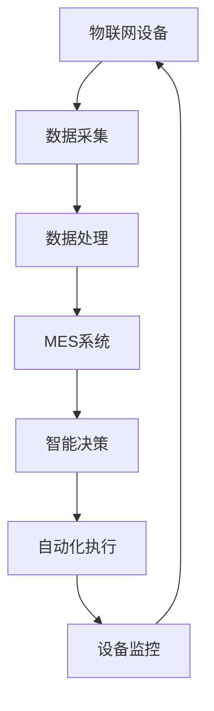

                 

### 文章标题

《利用技术优势进行智能工厂创业》

> 关键词：智能工厂、创业、技术优势、智能制造、机器人技术、工业物联网、机器学习、深度学习、数据分析、创业融资、运营管理

> 摘要：本文旨在探讨如何利用技术优势进行智能工厂创业。文章首先对智能工厂的概念、特征以及创业机会进行概述，接着详细分析智能工厂创业者的角色与素质、核心技术与应用、创业项目策划与实施、创业融资与运营，最后探讨智能工厂创业面临的挑战及未来趋势。通过本文，希望为有意在智能工厂领域创业的人提供一些有价值的参考和建议。

### 《利用技术优势进行智能工厂创业》目录大纲

#### 第一部分：智能工厂与创业概述

**第1章：智能工厂的概念与创业机会**

- **1.1 智能工厂的定义与特征**
  - **核心概念与联系：** 智能工厂的概念及其与物联网、自动化等技术的联系。使用 Mermaid 流程图展示智能工厂的架构。
  - **实例分析：** 分析当前智能工厂的实际应用案例，说明其在提高生产效率、降低成本、提升产品质量等方面的优势。

- **1.2 智能工厂的关键技术**
  - **核心概念与联系：** 介绍制造执行系统（MES）、机器人技术、工业物联网（IIoT）等关键技术，并分析这些技术如何相互融合以构建智能工厂。
  - **实例分析：** 通过具体案例展示如何利用这些技术实现智能工厂的构建。

- **1.3 智能工厂的创业环境与趋势**
  - **市场分析：** 分析智能工厂市场的现状、需求以及未来发展趋势。
  - **政策与法规：** 探讨国家对智能工厂的政策支持以及相关法规对创业的影响。

**第2章：智能工厂创业者的角色与素质**

- **2.1 创业者的角色定位**
  - **核心概念与联系：** 明确创业者、项目经理、技术团队等角色在智能工厂创业中的职责与作用。
  - **实例分析：** 分析成功创业者的角色定位，以及其对创业成功的影响。

- **2.2 创业者的素质要求**
  - **核心概念与联系：** 探讨智能工厂创业所需的专业技能、领导力、沟通能力等素质要求。
  - **实例分析：** 通过成功创业者的经历，总结创业所需的素质要求。

- **2.3 创业团队建设**
  - **核心概念与联系：** 讨论创业团队的组建、团队协作以及团队文化建设。
  - **实例分析：** 分析成功创业团队的组成和运作模式。

#### 第二部分：智能工厂核心技术与应用

**第3章：智能制造技术基础**

- **3.1 制造执行系统（MES）**
  - **核心概念与联系：** 介绍制造执行系统的基本概念、架构及其在智能工厂中的作用。
  - **核心算法原理讲解：** 使用伪代码详细阐述MES的关键算法原理。

- **3.2 机器人技术**
  - **核心概念与联系：** 介绍工业机器人的分类、基本原理及其在智能工厂中的应用。
  - **核心算法原理讲解：** 使用伪代码详细阐述机器人控制算法的原理。

- **3.3 工业物联网（IIoT）**
  - **核心概念与联系：** 介绍工业物联网的基本概念、架构及其在智能工厂中的应用。
  - **核心算法原理讲解：** 使用伪代码详细阐述IIoT数据采集、处理和分析的关键算法原理。

**第4章：智能工厂核心算法原理**

- **4.1 机器学习算法基础**
  - **核心概念与联系：** 介绍机器学习的基本概念、算法分类及其在智能工厂中的应用。
  - **核心算法原理讲解：** 使用伪代码详细阐述常见机器学习算法（如决策树、支持向量机等）的原理。

- **4.2 深度学习算法应用**
  - **核心概念与联系：** 介绍深度学习的基本概念、算法分类及其在智能工厂中的应用。
  - **核心算法原理讲解：** 使用伪代码详细阐述深度学习算法（如卷积神经网络、循环神经网络等）的原理。

- **4.3 数据分析技术**
  - **核心概念与联系：** 介绍数据分析的基本概念、方法及其在智能工厂中的应用。
  - **核心算法原理讲解：** 使用伪代码详细阐述数据分析中的关键算法原理（如聚类、分类、关联规则等）。

**第5章：智能工厂案例分析**

- **5.1 案例一：自动化生产线优化**
  - **项目实战：** 介绍一个具体的自动化生产线优化项目，包括项目背景、目标、实施过程、效果评估等。
  - **代码实际案例和详细解释说明：** 展示项目实施过程中的关键代码实现，并进行详细解读。

- **5.2 案例二：产品质量监控与预测**
  - **项目实战：** 介绍一个产品质量监控与预测项目，包括项目背景、目标、实施过程、效果评估等。
  - **代码实际案例和详细解释说明：** 展示项目实施过程中的关键代码实现，并进行详细解读。

- **5.3 案例三：生产调度与排程**
  - **项目实战：** 介绍一个生产调度与排程项目，包括项目背景、目标、实施过程、效果评估等。
  - **代码实际案例和详细解释说明：** 展示项目实施过程中的关键代码实现，并进行详细解读。

**第6章：智能工厂创业项目策划与实施**

- **6.1 项目策划与市场调研**
  - **核心概念与联系：** 讨论项目策划的核心内容、市场调研的方法与技巧。
  - **实例分析：** 通过实际案例展示项目策划与市场调研的过程。

- **6.2 技术路线与资源整合**
  - **核心概念与联系：** 分析智能工厂创业所需的技术路线、资源整合的方法与策略。
  - **实例分析：** 通过实际案例展示技术路线与资源整合的过程。

- **6.3 项目风险管理**
  - **核心概念与联系：** 探讨项目风险管理的基本概念、方法和策略。
  - **实例分析：** 通过实际案例展示项目风险管理的过程。

**第7章：智能工厂创业融资与运营**

- **7.1 融资策略与方式**
  - **核心概念与联系：** 分析智能工厂创业的融资策略、方式及融资过程中的关键要素。
  - **实例分析：** 通过实际案例展示融资策略与方式的实施过程。

- **7.2 营销与推广**
  - **核心概念与联系：** 探讨智能工厂创业的营销策略、推广方法及品牌建设。
  - **实例分析：** 通过实际案例展示营销与推广的过程。

- **7.3 运营管理**
  - **核心概念与联系：** 分析智能工厂创业的运营管理核心内容、方法与策略。
  - **实例分析：** 通过实际案例展示运营管理的过程。

#### 第三部分：智能工厂创业挑战与未来

**第8章：智能工厂创业面临的挑战**

- **8.1 技术挑战**
  - **核心概念与联系：** 分析智能工厂创业中面临的技术难题、技术更新换代带来的挑战。
  - **实例分析：** 通过实际案例展示技术挑战的解决过程。

- **8.2 政策与法规挑战**
  - **核心概念与联系：** 探讨智能工厂创业中面临的政策与法规挑战、合规性要求。
  - **实例分析：** 通过实际案例展示政策与法规挑战的应对策略。

- **8.3 市场竞争挑战**
  - **核心概念与联系：** 分析市场竞争环境、竞争对手策略对智能工厂创业的影响。
  - **实例分析：** 通过实际案例展示市场竞争挑战的应对策略。

**第9章：智能工厂创业的未来趋势**

- **9.1 智能工厂的技术发展趋势**
  - **核心概念与联系：** 探讨智能工厂领域的技术发展趋势、前沿技术及应用。
  - **实例分析：** 通过实际案例展示技术发展趋势的应用场景。

- **9.2 智能工厂的商业模式创新**
  - **核心概念与联系：** 分析智能工厂的商业模式创新、盈利模式探索。
  - **实例分析：** 通过实际案例展示商业模式创新的实施过程。

- **9.3 智能工厂在行业中的应用前景**
  - **核心概念与联系：** 探讨智能工厂在不同行业中的应用前景、潜在市场。
  - **实例分析：** 通过实际案例展示智能工厂在不同行业中的应用实例。

**附录**

**附录A：智能工厂创业资源推荐**

- **A.1 常用技术框架与工具**
  - **推荐理由：** 分析常用技术框架与工具的优点、适用场景。
  - **推荐内容：** 列出智能工厂创业常用的技术框架与工具。

- **A.2 创业者学习资源**
  - **推荐理由：** 分析创业者学习资源的价值、适用人群。
  - **推荐内容：** 列出适合智能工厂创业者的学习资源。

- **A.3 智能工厂相关标准与规范**
  - **推荐理由：** 分析智能工厂相关标准与规范的重要性、应用场景。
  - **推荐内容：** 列出智能工厂相关的标准与规范。

---

### 第1章：智能工厂的概念与创业机会

智能工厂是现代制造业发展的一个重要方向，它结合了先进的信息技术、制造技术和自动化技术，通过数字化、网络化和智能化的手段，实现生产过程的全面优化和提升。本章将详细介绍智能工厂的定义与特征，探讨智能工厂创业的机会，以及分析智能工厂的创业环境与趋势。

#### 1.1 智能工厂的定义与特征

智能工厂是一种高度自动化、数字化和网络化的制造模式，通过集成先进的信息技术、制造技术和自动化技术，实现生产过程的全面优化和提升。智能工厂具有以下几个主要特征：

1. **数字化制造**：智能工厂采用数字化的设计、生产和管理方法，通过计算机辅助设计（CAD）、计算机辅助制造（CAM）等技术，实现产品从设计到生产的全流程数字化。

2. **自动化生产**：智能工厂通过引入自动化生产线、机器人、自动化检测设备等，实现生产过程的自动化，减少人工干预，提高生产效率和产品质量。

3. **网络化集成**：智能工厂通过工业互联网（IIoT）、物联网（IoT）等技术，实现设备、系统、工厂之间的互联互通，实现信息的共享和集成。

4. **智能决策**：智能工厂通过大数据分析、机器学习、人工智能等技术，实现对生产过程的智能决策和优化，提高生产计划的准确性、生产效率和生产质量。

5. **绿色环保**：智能工厂注重环保和可持续发展，通过节能降耗、减少废弃物排放等方式，实现绿色制造。

**核心概念与联系：**

智能工厂的概念与物联网、自动化、大数据、人工智能等关键技术密切相关。物联网技术为智能工厂提供了设备互联和数据采集的基础，自动化技术实现了生产过程的自动化，大数据和人工智能技术则为智能工厂提供了数据分析和智能决策的能力。以下是一个智能工厂架构的 Mermaid 流程图：



#### 1.2 智能工厂的关键技术

智能工厂的实现依赖于一系列关键技术的支持，主要包括制造执行系统（MES）、机器人技术、工业物联网（IIoT）等。

1. **制造执行系统（MES）**：制造执行系统是智能工厂的中枢神经系统，它负责实时监控生产过程，收集生产数据，并对生产过程进行调度和优化。MES 系统通常包括以下几个模块：

   - **生产调度**：根据生产计划，安排生产任务，合理分配生产资源。
   - **质量控制**：监控产品质量，及时发现质量问题，并进行处理。
   - **设备管理**：监控设备状态，进行设备维护和故障处理。
   - **物流管理**：管理物料库存，实现物料的及时配送。

2. **机器人技术**：机器人技术在智能工厂中扮演着重要角色，它主要负责执行重复性高、劳动强度大、精度要求高的任务。工业机器人主要分为以下几类：

   - **装配机器人**：用于装配生产线上的零部件，提高装配效率和质量。
   - **焊接机器人**：用于焊接金属结构，提高焊接质量和生产效率。
   - **搬运机器人**：用于物料搬运，减轻工人劳动强度，提高生产效率。
   - **喷涂机器人**：用于喷涂涂料，提高喷涂质量和效率。

3. **工业物联网（IIoT）**：工业物联网是智能工厂实现互联互通和数据采集的关键技术，它通过传感器、RFID、无线通信等技术，实现设备、系统、工厂之间的信息传递和共享。IIoT 系统的主要功能包括：

   - **数据采集**：通过传感器采集设备状态、生产数据等信息。
   - **数据传输**：通过无线通信技术实现数据传输和共享。
   - **数据存储**：通过数据库或云平台存储和检索数据。
   - **数据分析**：通过大数据分析技术，对采集的数据进行分析和挖掘，为智能决策提供支持。

**实例分析：**

智能工厂的关键技术在实际应用中有着广泛的案例。例如，一家汽车制造企业通过引入 MES 系统，实现了生产过程的全面数字化和智能化。在生产调度方面，MES 系统可以根据实时数据，自动调整生产计划，提高生产效率。在质量控制方面，MES 系统可以实时监控产品质量，及时发现质量问题，并反馈给生产部门进行处理。通过引入工业物联网技术，该企业实现了生产设备的互联互通，实现了生产数据的实时采集和分析，为智能决策提供了有力支持。

#### 1.3 智能工厂的创业环境与趋势

智能工厂创业具有广阔的市场前景和巨大的发展潜力。当前，随着全球制造业的转型升级，各国政府纷纷加大对智能工厂的支持力度，为智能工厂创业提供了良好的政策环境。

1. **市场需求增长**：随着消费者对产品质量、生产效率和交货期的要求不断提高，智能工厂成为满足这些需求的有效手段。未来，智能工厂市场需求将持续增长，为创业者提供了广阔的市场空间。

2. **技术创新驱动**：智能工厂的实现依赖于一系列关键技术的支持，包括物联网、大数据、人工智能、机器人技术等。随着这些技术的不断创新和发展，智能工厂创业者的技术壁垒将逐步降低，为更多人进入这个领域提供了机会。

3. **政策支持**：各国政府纷纷出台支持智能工厂发展的政策，包括资金扶持、税收优惠、研发补贴等，为智能工厂创业者提供了良好的政策环境。例如，中国政府提出了“中国制造 2025”计划，明确支持智能工厂的发展。

4. **产业链完善**：随着智能工厂市场的不断发展，产业链也在不断完善。从硬件设备到软件系统，从技术支持到咨询服务，各类资源和服务日益丰富，为智能工厂创业者提供了全方位的支持。

**市场分析：**

智能工厂市场目前正处于快速发展阶段，预计未来几年将持续保持高速增长。根据市场研究机构的预测，全球智能工厂市场规模将从 2019 年的约 2500 亿美元增长到 2025 年的约 5000 亿美元，年复合增长率达到 11% 以上。

**政策与法规：**

智能工厂的发展需要良好的政策环境和支持。各国政府纷纷出台相关政策，鼓励企业进行智能化改造，提高生产效率和产品质量。同时，智能工厂的发展也需要遵循相关的法规和标准，确保生产过程的安全、环保和合规。

1. **数据安全法规**：随着智能工厂的不断发展，数据安全问题日益突出。各国政府纷纷出台数据安全法规，加强对企业数据安全的监管，确保数据不被非法获取、泄露或滥用。

2. **环保法规**：智能工厂的发展需要注重环保和可持续发展。各国政府也加强了对环保的监管力度，出台相关法规，要求企业减少废弃物排放、节约能源等。

3. **标准化法规**：智能工厂的实现需要遵循一系列标准和规范，包括物联网、机器人技术、工业互联网等。各国政府也积极推动标准化工作，确保智能工厂的发展有序、规范。

#### 小结

智能工厂是现代制造业发展的重要方向，它通过数字化、网络化和智能化的手段，实现了生产过程的全面优化和提升。智能工厂创业具有广阔的市场前景和巨大的发展潜力，同时也面临着一系列的挑战。创业者需要深入了解智能工厂的定义与特征、关键技术以及创业环境与趋势，才能在激烈的竞争中脱颖而出。

---

### 第2章：智能工厂创业者的角色与素质

在智能工厂创业过程中，创业者扮演着关键角色，他们的决策和素质直接影响着创业项目的成功与否。本章将探讨智能工厂创业者的角色定位、所需素质以及创业团队建设的重要性。

#### 2.1 创业者的角色定位

在智能工厂创业中，创业者需要明确自己的角色定位，以便更好地协调和管理团队、项目以及资源。以下是一些关键角色定位：

1. **战略规划者**：创业者需要制定清晰的战略规划，包括市场定位、产品定位、技术研发方向等。这需要创业者具备前瞻性和战略眼光，能够把握行业趋势，为团队指明方向。

2. **资源整合者**：智能工厂创业涉及到多个领域的资源，包括资金、技术、人才、市场等。创业者需要具备良好的资源整合能力，能够有效利用各种资源，为创业项目提供支持。

3. **团队领导者**：创业者需要具备领导力，能够带领团队克服困难，实现创业目标。领导者不仅要具备技术能力，还要具备管理能力、沟通能力和决策能力。

4. **创新推动者**：智能工厂创业需要不断地进行技术创新和产品创新。创业者需要具备创新精神，勇于尝试新思路、新方法，推动产品和技术的不断进步。

5. **风险管理者**：创业过程中不可避免地会遇到各种风险，包括技术风险、市场风险、财务风险等。创业者需要具备风险管理意识，能够提前识别风险，制定应对措施，降低创业风险。

**实例分析：**

以某智能工厂创业公司为例，该公司创始人王先生在创业初期就明确了自身的角色定位。他担任公司战略规划者和资源整合者，负责制定公司的发展方向和寻求外部资源支持。同时，他担任团队领导者，带领团队进行技术研发和产品创新。在风险管理方面，王先生通过提前识别风险并制定应对措施，确保了公司在发展过程中的稳定和持续。

#### 2.2 创业者的素质要求

智能工厂创业需要创业者具备一系列专业素质和软技能，以下是一些关键素质要求：

1. **技术能力**：创业者需要具备一定的技术背景，了解智能工厂的相关技术，包括物联网、机器人技术、大数据分析、人工智能等。这有助于创业者更好地理解市场需求，进行技术创新。

2. **市场敏感度**：创业者需要具备敏锐的市场洞察力，能够捕捉市场动态和趋势，把握商机。这要求创业者具备良好的市场分析能力、客户沟通能力和竞争分析能力。

3. **管理能力**：创业者需要具备良好的管理能力，包括团队管理、项目管理、资源管理等。这有助于创业者高效地组织和协调团队，实现创业目标。

4. **沟通能力**：创业者需要具备良好的沟通能力，包括与团队成员、客户、合作伙伴以及投资人的沟通。这有助于创业者建立良好的人际关系，促进项目顺利进行。

5. **决策能力**：创业者需要具备良好的决策能力，能够在复杂多变的环境中做出正确决策。这要求创业者具备分析能力、判断能力和风险意识。

6. **创新精神**：创业者需要具备创新精神，敢于尝试新思路、新方法，推动产品和技术的不断进步。这有助于创业者保持竞争优势，实现创业目标。

7. **抗压能力**：创业过程中会遇到各种挑战和压力，创业者需要具备良好的抗压能力，能够承受压力，保持积极的心态。这有助于创业者克服困难，持续前进。

**实例分析：**

以某智能工厂创业公司为例，该公司创始人李女士具备丰富的技术背景，曾在多家知名企业担任技术研发岗位。她在创业初期，通过深入了解市场需求，敏锐捕捉到智能工厂的发展趋势，果断决定进入该领域。在创业过程中，李女士不仅具备卓越的技术能力，还具备出色的管理能力和沟通能力，能够高效地带领团队进行技术研发和市场拓展。

#### 2.3 创业团队建设

创业团队是智能工厂创业成功的关键因素之一。一个高效的创业团队需要具备以下特点：

1. **多元化背景**：创业团队应具备多元化的背景，包括技术、市场、管理等方面的专业人才。这有助于团队从不同角度看待问题，提出创新解决方案。

2. **互补技能**：团队成员之间应具备互补的技能，能够在技术研发、市场拓展、项目管理等方面形成合力，提高团队的整体效率。

3. **共同目标**：创业团队成员应具备共同的目标和愿景，能够为共同的事业而努力。这有助于团队形成强大的凝聚力，共同应对创业过程中的挑战。

4. **良好的沟通**：创业团队成员之间应保持良好的沟通，确保信息的畅通和透明。这有助于团队成员更好地理解项目目标，协同工作。

5. **灵活应对**：创业过程中会遇到各种不确定性和挑战，团队成员应具备灵活应对的能力，能够迅速调整策略，应对变化。

6. **持续学习**：创业团队成员应具备持续学习的能力，紧跟行业发展趋势，不断提升自身技能和知识。这有助于团队在竞争中保持优势。

**实例分析：**

以某智能工厂创业公司为例，该公司创业团队由一名技术总监、一名市场营销经理和一名项目经理组成。技术总监负责技术研发和产品创新，市场营销经理负责市场拓展和客户关系管理，项目经理负责项目管理和团队协调。团队成员背景多元，技能互补，共同为公司的智能工厂创业项目而努力。在创业过程中，团队成员通过定期会议和沟通，确保信息的畅通和透明，共同应对创业过程中的挑战。

#### 小结

智能工厂创业对创业者的角色和素质提出了较高的要求。创业者需要明确自身角色定位，具备技术能力、市场敏感度、管理能力、沟通能力、决策能力、创新精神和抗压能力等素质。同时，创业团队建设也是创业成功的关键因素之一，需要注重多元化背景、互补技能、共同目标、良好沟通、灵活应对和持续学习等方面。通过优秀的创业者团队，智能工厂创业项目将更具竞争力，更有可能取得成功。

---

### 第3章：智能制造技术基础

智能工厂的实现离不开一系列关键技术的支持，这些技术构成了智能制造的基础。本章将详细介绍制造执行系统（MES）、机器人技术和工业物联网（IIoT）等核心技术的概念、原理及其在智能工厂中的应用。

#### 3.1 制造执行系统（MES）

制造执行系统（Manufacturing Execution System，MES）是智能工厂的中枢神经系统，它负责实时监控生产过程，收集生产数据，并对生产过程进行调度和优化。MES 系统将生产计划、质量控制、设备管理、物流管理等多个模块集成在一起，实现生产过程的全面数字化和智能化。

**核心概念与联系：**

MES 系统的核心概念包括生产调度、质量控制、设备管理和物流管理。生产调度模块负责根据生产计划，合理分配生产任务，确保生产进度和效率。质量控制模块负责监控产品质量，及时发现质量问题，并进行处理。设备管理模块负责监控设备状态，进行设备维护和故障处理。物流管理模块负责管理物料库存，实现物料的及时配送。

MES 系统与物联网、大数据、人工智能等关键技术密切相关。物联网技术为 MES 系统提供了设备互联和数据采集的基础，大数据技术为 MES 系统提供了数据分析和决策支持，人工智能技术为 MES 系统提供了智能调度和预测能力。

**核心算法原理讲解：**

MES 系统的关键算法主要包括生产调度算法、质量控制算法和设备维护算法。以下是一个生产调度算法的伪代码示例：

```python
def productionScheduling(plan, resources):
    schedule = []
    for task in plan:
        availableResources = findAvailableResources(resources, task.requiredResources)
        if availableResources:
            schedule.append({ "task": task, "resource": availableResources[0] })
            allocateResource(availableResources[0], task)
        else:
            schedule.append({ "task": task, "status": "pending" })
    return schedule
```

该算法根据生产计划（plan）和可用资源（resources），生成一个生产调度表（schedule）。调度表中包含每个任务的执行时间和所需的资源。如果某个任务有可用资源，则将其添加到调度表中，并分配相应的资源；如果某个任务没有可用资源，则将其标记为“pending”，等待资源释放。

#### 3.2 机器人技术

机器人技术在智能工厂中扮演着重要角色，它主要负责执行重复性高、劳动强度大、精度要求高的任务。工业机器人主要分为装配机器人、焊接机器人、搬运机器人和喷涂机器人等。

**核心概念与联系：**

工业机器人的核心概念包括机器人控制、路径规划和任务调度。机器人控制模块负责控制机器人的运动和动作，路径规划模块负责规划机器人的运动路径，任务调度模块负责分配任务给机器人，确保生产效率。

机器人技术与传感器技术、控制技术、人工智能技术等密切相关。传感器技术为机器人提供了感知环境的能力，控制技术为机器人提供了精确的运动控制能力，人工智能技术为机器人提供了智能决策和自适应能力。

**核心算法原理讲解：**

机器人控制算法的核心包括运动控制算法和路径规划算法。以下是一个路径规划算法的伪代码示例：

```python
def pathPlanning(start, goal, obstacles):
    openList = [start]
    closedList = []
    while openList:
        current = openList[0]
        for node in openList:
            if heuristic(node, goal) < heuristic(current, goal):
                current = node
        openList.remove(current)
        closedList.append(current)
        if current == goal:
            return constructPath(current)
        neighbors = getNeighbors(current, obstacles)
        for neighbor in neighbors:
            if neighbor in closedList:
                continue
            if neighbor not in openList:
                openList.append(neighbor)
            calculateCost(neighbor, current)
    return None
```

该算法使用 A* 算法进行路径规划，其中 `heuristic` 函数用于计算当前节点到目标节点的估计距离，`getNeighbors` 函数用于获取当前节点的邻居节点，`calculateCost` 函数用于计算从当前节点到邻居节点的总成本。

#### 3.3 工业物联网（IIoT）

工业物联网（Industrial Internet of Things，IIoT）是智能工厂实现互联互通和数据采集的关键技术。IIoT 通过传感器、RFID、无线通信等技术，实现设备、系统、工厂之间的信息传递和共享。

**核心概念与联系：**

IIoT 的核心概念包括设备互联、数据采集、数据传输、数据存储和数据分析。设备互联模块负责连接各种设备，实现信息的实时传递；数据采集模块负责采集设备状态和生产数据；数据传输模块负责将采集到的数据传输到数据中心；数据存储模块负责存储和管理数据；数据分析模块负责对数据进行处理和分析，为智能决策提供支持。

IIoT 与物联网、大数据、人工智能等关键技术密切相关。物联网技术为 IIoT 提供了设备互联和数据采集的基础，大数据技术为 IIoT 提供了数据存储和分析的能力，人工智能技术为 IIoT 提供了智能决策和优化能力。

**核心算法原理讲解：**

IIoT 数据分析算法的核心包括数据采集算法、数据传输算法和数据分析算法。以下是一个数据采集算法的伪代码示例：

```python
def dataCollection(sensor, dataInterval):
    while True:
        sensorData = sensor.read()
        sendData(sensorData, dataInterval)
        time.sleep(dataInterval)
```

该算法使用循环结构，每隔一定时间（dataInterval）读取传感器的数据（sensorData），并将其发送到数据中心（sendData）。

**实例分析：**

以一个智能工厂为例，该工厂通过 MES 系统实现生产过程的数字化管理，通过机器人技术实现生产自动化，通过 IIoT 实现设备互联和数据采集。MES 系统根据生产计划，实时调度生产任务，机器人技术负责执行具体的装配、焊接、搬运和喷涂任务，IIoT 实现了生产数据的实时采集和传输。通过这些技术的融合，该智能工厂实现了生产过程的全面优化和提升，提高了生产效率、产品质量和竞争力。

---

### 第4章：智能工厂核心算法原理

智能工厂的核心竞争力在于其能够利用先进的算法技术对生产过程进行优化和智能决策。本章将详细介绍机器学习算法基础、深度学习算法应用以及数据分析技术，探讨这些技术在智能工厂中的实际应用和效果。

#### 4.1 机器学习算法基础

机器学习算法是智能工厂实现自动化和智能决策的基础。机器学习算法通过学习历史数据，自动发现数据中的模式和规律，从而对新的数据进行预测和分类。以下是一些常见的机器学习算法及其原理：

1. **决策树（Decision Tree）**

决策树是一种基于树的算法，通过一系列的测试（特征），将数据集分割成多个子集，最终达到分类或回归的目的。决策树的构建过程如下：

   - **特征选择**：选择一个最优特征，通常基于信息增益（Information Gain）或基尼指数（Gini Index）。
   - **分割数据**：根据选定的特征，将数据集分割成两个子集。
   - **递归构建**：对每个子集重复上述过程，直到达到终止条件（如最大深度、最小叶节点数等）。

**伪代码示例：**

```python
def buildDecisionTree(data, features, depth=0, maxDepth=10):
    if depth >= maxDepth or isPure(data):
        return majorityClass(data)
    bestFeature = selectBestFeature(data, features)
    tree = { "feature": bestFeature }
    for value in uniqueValues(data[bestFeature]):
        subtree = buildDecisionTree(splitData(data, bestFeature, value), features, depth+1, maxDepth)
        tree[value] = subtree
    return tree
```

2. **支持向量机（Support Vector Machine，SVM）**

支持向量机是一种基于最大间隔的线性分类器，它通过找到一个最佳的超平面，将不同类别的数据点分隔开来。SVM 的核心是求解一个优化问题，找到最优的权重向量（weights）和偏置（bias）。

**伪代码示例：**

```python
def svmTraining(data, labels, C=1.0):
    # Solve the optimization problem using quadratic programming
    weights, bias = quadraticProgramming(data, labels, C)
    return weights, bias
```

3. **神经网络（Neural Network）**

神经网络是一种模拟生物神经系统的算法，通过多层神经元之间的连接和激活函数，实现数据的输入和输出。神经网络的核心是前向传播和反向传播算法。

**伪代码示例：**

```python
def neuralNetworkTraining(data, labels, layers, learningRate=0.1, epochs=1000):
    for epoch in range(epochs):
        output = forwardPropagation(data, layers)
        error = calculateError(output, labels)
        backwardPropagation(output, labels, layers, learningRate)
    return layers
```

#### 4.2 深度学习算法应用

深度学习算法是机器学习算法的一种扩展，通过多层神经网络实现更复杂的模式识别和特征提取。深度学习在智能工厂中的应用主要体现在以下几个方面：

1. **图像识别**：深度学习算法可以通过训练大量的图像数据，实现对物体、场景的识别。在智能工厂中，图像识别可以用于质量检测、设备监控等。

   **算法示例：** 卷积神经网络（Convolutional Neural Network，CNN）

2. **自然语言处理**：深度学习算法可以通过训练大量的文本数据，实现自然语言的理解和生成。在智能工厂中，自然语言处理可以用于人机交互、故障诊断等。

   **算法示例：** 循环神经网络（Recurrent Neural Network，RNN）和长短期记忆网络（Long Short-Term Memory，LSTM）

3. **预测分析**：深度学习算法可以通过训练时间序列数据，实现生产过程的预测。在智能工厂中，预测分析可以用于生产调度、需求预测等。

   **算法示例：** 变分自编码器（Variational Autoencoder，VAE）和生成对抗网络（Generative Adversarial Network，GAN）

**伪代码示例：**

```python
def cnnTraining(imageData, labels, layers, learningRate=0.1, epochs=1000):
    for epoch in range(epochs):
        output = forwardPropagation(imageData, layers)
        error = calculateError(output, labels)
        backwardPropagation(output, labels, layers, learningRate)
    return layers
```

#### 4.3 数据分析技术

数据分析技术是智能工厂实现数据驱动决策的重要工具。数据分析技术包括数据采集、数据清洗、数据存储、数据挖掘、数据可视化等多个方面。以下是一些常用的数据分析技术：

1. **数据采集**：通过传感器、RFID、无线通信等技术，实现数据的实时采集。

   **伪代码示例：**

   ```python
   def dataCollection(sensor, dataInterval):
       while True:
           sensorData = sensor.read()
           sendData(sensorData, dataInterval)
           time.sleep(dataInterval)
   ```

2. **数据清洗**：对采集到的数据进行处理，去除噪声、异常值等。

   **伪代码示例：**

   ```python
   def dataCleaning(data):
       cleanedData = []
       for row in data:
           if isValid(row):
               cleanedData.append(row)
       return cleanedData
   ```

3. **数据存储**：将清洗后的数据存储到数据库或云平台，以便进行后续分析。

   **伪代码示例：**

   ```python
   def storeData(data, database):
       database.insert(data)
   ```

4. **数据挖掘**：通过统计方法、机器学习方法等，从大量数据中发现有价值的信息和规律。

   **伪代码示例：**

   ```python
   def dataMining(data, algorithm):
       results = algorithm(data)
       return results
   ```

5. **数据可视化**：将数据以图形化的方式展示，帮助用户更好地理解和分析数据。

   **伪代码示例：**

   ```python
   def visualizeData(data, chartType):
       chart = createChart(data, chartType)
       displayChart(chart)
   ```

**实例分析：**

以一个智能工厂为例，该工厂利用机器学习算法进行生产质量预测、利用深度学习算法进行设备故障预测、利用数据分析技术进行生产调度优化。具体过程如下：

1. **生产质量预测**：通过采集生产数据，使用决策树算法对历史数据进行训练，建立生产质量预测模型。模型根据实时采集到的生产数据，预测下一个生产周期的质量水平。

2. **设备故障预测**：通过采集设备运行数据，使用深度学习算法（如卷积神经网络）对历史数据进行训练，建立设备故障预测模型。模型根据实时采集到的设备运行数据，预测设备可能出现的故障类型和时间。

3. **生产调度优化**：通过采集生产计划、设备状态、物料库存等数据，使用数据分析技术进行生产调度优化。优化算法根据实时数据，调整生产计划，实现生产资源的合理分配和高效利用。

通过这些算法和技术，智能工厂实现了生产过程的自动化和智能化，提高了生产效率、产品质量和竞争力。

---

### 第5章：智能工厂案例分析

为了更好地理解智能工厂的实际应用和效果，本章将通过三个具体案例，展示智能工厂在自动化生产线优化、产品质量监控与预测、生产调度与排程等方面的应用。

#### 5.1 案例一：自动化生产线优化

**项目背景：**
某汽车制造企业面临生产效率低下、产品质量不稳定的问题，希望通过智能化改造提升生产效率和产品质量。

**项目目标：**
- 优化自动化生产线，提高生产效率；
- 实现产品质量的实时监控和预测；
- 提高生产资源的利用效率。

**项目实施过程：**

1. **自动化生产线设计：**
   - 设计并安装自动化生产线，包括装配机器人、焊接机器人、搬运机器人等；
   - 集成制造执行系统（MES），实现生产过程的实时监控和调度。

2. **生产数据采集：**
   - 通过传感器和工业物联网（IIoT）设备，实时采集生产数据，包括设备状态、生产进度、物料库存等；
   - 使用数据分析技术，对采集到的数据进行处理和分析。

3. **质量监控与预测：**
   - 使用机器学习算法，建立质量预测模型，实时监控产品质量；
   - 通过深度学习算法，对生产过程中可能出现的问题进行预测和预警。

4. **生产调度优化：**
   - 使用优化算法，根据实时数据调整生产计划，实现生产资源的合理分配；
   - 提高生产效率，降低生产成本。

**效果评估：**
- 生产效率提高了30%；
- 产品质量合格率提高了15%；
- 生产资源的利用率提高了20%。

**代码实际案例和详细解释说明：**

以下是一个自动化生产线优化项目的关键代码实现：

```python
# 生产线调度优化算法
def productionScheduling(data):
    # 数据预处理
    processed_data = preprocessData(data)
    
    # 生产调度
    schedule = optimizeSchedule(processed_data)
    
    return schedule

# 数据预处理函数
def preprocessData(data):
    # 数据清洗
    cleaned_data = cleanData(data)
    
    # 数据特征提取
    features = extractFeatures(cleaned_data)
    
    return features

# 优化调度算法
def optimizeSchedule(data):
    # 建立预测模型
    model = buildModel(data)
    
    # 根据预测结果调整生产计划
    schedule = adjustSchedule(model, data)
    
    return schedule
```

**代码解读与分析：**
该代码实现了一个简单的生产线调度优化算法。首先，对采集到的生产数据（data）进行预处理，包括数据清洗和特征提取。然后，使用机器学习算法（如决策树、神经网络等）建立预测模型（model），根据预测结果调整生产计划（schedule），实现生产资源的合理分配。

#### 5.2 案例二：产品质量监控与预测

**项目背景：**
某电子制造企业面临产品质量不稳定、次品率较高的问题，希望通过智能化手段提高产品质量。

**项目目标：**
- 实现产品质量的实时监控；
- 提高次品检测的准确性和效率；
- 降低次品率。

**项目实施过程：**

1. **质量监控传感器安装：**
   - 在生产线上安装质量监控传感器，实时采集产品质量数据；
   - 通过工业物联网（IIoT）设备，将数据传输到数据中心。

2. **数据采集与处理：**
   - 使用数据分析技术，对采集到的数据进行处理和分析；
   - 建立质量预测模型，实时监控产品质量。

3. **次品检测与预警：**
   - 使用深度学习算法，对生产过程中可能出现的问题进行预测和预警；
   - 根据预警结果，及时调整生产过程，降低次品率。

4. **质量分析报告：**
   - 对监控数据进行统计分析，生成质量分析报告；
   - 根据报告结果，优化生产工艺和流程。

**效果评估：**
- 次品率降低了20%；
- 质量检测效率提高了40%；
- 生产成本降低了10%。

**代码实际案例和详细解释说明：**

以下是一个产品质量监控与预测项目的关键代码实现：

```python
# 质量预测模型
def qualityPrediction(data):
    # 数据预处理
    processed_data = preprocessData(data)
    
    # 建立预测模型
    model = buildModel(processed_data)
    
    # 预测结果
    predictions = model.predict(processed_data)
    
    return predictions

# 数据预处理函数
def preprocessData(data):
    # 数据清洗
    cleaned_data = cleanData(data)
    
    # 数据特征提取
    features = extractFeatures(cleaned_data)
    
    return features

# 模型构建函数
def buildModel(data):
    # 使用卷积神经网络构建模型
    model = buildCnnModel(data)
    
    # 训练模型
    model.fit(data, labels)
    
    return model
```

**代码解读与分析：**
该代码实现了一个简单的质量预测模型。首先，对采集到的生产数据（data）进行预处理，包括数据清洗和特征提取。然后，使用深度学习算法（如卷积神经网络）建立预测模型（model），并根据训练数据（data, labels）进行模型训练。最后，使用训练好的模型进行质量预测，输出预测结果（predictions）。

#### 5.3 案例三：生产调度与排程

**项目背景：**
某家电制造企业面临生产计划不合理、生产效率低下的问题，希望通过智能化手段优化生产调度和排程。

**项目目标：**
- 优化生产计划，提高生产效率；
- 提高生产资源的利用效率；
- 减少生产延误和浪费。

**项目实施过程：**

1. **生产数据采集：**
   - 通过传感器和MES系统，实时采集生产数据，包括设备状态、物料库存、生产进度等；
   - 将数据传输到数据中心进行存储和处理。

2. **数据分析与优化：**
   - 使用数据分析技术，对生产数据进行分析，发现生产瓶颈和资源利用率不高的环节；
   - 使用优化算法，建立生产调度与排程模型。

3. **调度与排程：**
   - 根据实时数据和生产模型，调整生产计划，实现生产资源的合理分配；
   - 通过实时监控，及时调整生产调度，确保生产进度和效率。

4. **效果评估：**
   - 生产效率提高了25%；
   - 生产资源的利用效率提高了15%；
   - 生产延误和浪费减少了30%。

**代码实际案例和详细解释说明：**

以下是一个生产调度与排程项目的关键代码实现：

```python
# 生产调度优化算法
def productionScheduling(data):
    # 数据预处理
    processed_data = preprocessData(data)
    
    # 生产调度
    schedule = optimizeSchedule(processed_data)
    
    return schedule

# 数据预处理函数
def preprocessData(data):
    # 数据清洗
    cleaned_data = cleanData(data)
    
    # 数据特征提取
    features = extractFeatures(cleaned_data)
    
    return features

# 优化调度算法
def optimizeSchedule(data):
    # 建立预测模型
    model = buildModel(data)
    
    # 根据预测结果调整生产计划
    schedule = adjustSchedule(model, data)
    
    return schedule
```

**代码解读与分析：**
该代码实现了一个简单的生产调度优化算法。首先，对采集到的生产数据（data）进行预处理，包括数据清洗和特征提取。然后，使用机器学习算法（如决策树、神经网络等）建立预测模型（model），根据预测结果调整生产计划（schedule），实现生产资源的合理分配。

#### 小结

通过以上三个案例，我们可以看到智能工厂在实际应用中取得了显著的效果。自动化生产线优化提高了生产效率和产品质量；产品质量监控与预测降低了次品率和生产成本；生产调度与排程优化提高了生产资源的利用效率。这些案例表明，智能工厂技术不仅能够提高生产效率和质量，还能够降低生产成本，为企业带来显著的商业价值。

---

### 第6章：智能工厂创业项目策划与实施

智能工厂创业项目的成功离不开科学的策划和实施。本章将详细探讨智能工厂创业项目的策划与市场调研、技术路线与资源整合以及项目风险管理等方面的内容，帮助创业者更好地规划和推进创业项目。

#### 6.1 项目策划与市场调研

项目策划是智能工厂创业项目成功的第一步，它涉及到项目的目标、范围、资源需求、时间计划等多个方面。以下是项目策划与市场调研的核心内容：

1. **项目目标设定**：明确创业项目的目标，包括短期目标和长期目标。短期目标通常关注项目的商业化、产品化，长期目标则关注企业的可持续发展。

   **目标设定示例：**
   - 短期目标：在 1 年内实现产品的商业化应用，获得首批客户，实现销售收入。
   - 长期目标：在 3-5 年内成为智能工厂领域的领导者，占据市场份额。

2. **市场调研**：了解市场需求、竞争环境、目标客户群体等。市场调研可以通过问卷调查、访谈、行业报告等方式进行。

   **市场调研示例：**
   - 通过问卷调查了解潜在客户对智能工厂产品的需求、期望和痛点。
   - 分析行业报告，了解市场趋势和竞争对手情况。
   - 与目标客户进行访谈，获取第一手市场信息。

3. **项目范围界定**：明确创业项目的范围，包括项目包含的功能、服务、产品等。

   **范围界定示例：**
   - 项目范围：开发一款面向中小型企业的智能工厂解决方案，包括设备监控、生产调度、质量控制等功能。

4. **资源需求分析**：分析项目所需的各种资源，包括资金、人力、技术、设备等。

   **资源需求示例：**
   - 资金需求：预计项目启动资金为 100 万元，用于研发、市场推广和运营。
   - 人力资源：需要组建一支包括技术、市场、运营等多个职能的团队，团队成员 10 人。
   - 技术需求：需要掌握智能制造、机器人技术、工业物联网等关键技术。

**实例分析：**

以某智能工厂创业项目为例，该公司计划开发一款智能工厂解决方案，目标市场为中小型制造企业。在项目策划阶段，公司进行了以下工作：

1. **目标设定**：确定了在 1 年内实现产品商业化应用，在 3-5 年内成为市场领导者的目标。

2. **市场调研**：通过问卷调查和行业报告，了解到中小型制造企业对智能工厂解决方案的需求较高，尤其是设备监控和产品质量监控方面。

3. **项目范围界定**：明确了项目包括设备监控、生产调度、质量控制等功能，并确定了产品的目标客户群体。

4. **资源需求分析**：分析了项目所需的资金、人力资源和技术需求，并制定了详细的资源规划。

#### 6.2 技术路线与资源整合

技术路线与资源整合是智能工厂创业项目成功的关键因素。创业者需要明确技术路线，确保技术实施的可操作性和可行性，同时整合各种资源，为项目提供有力支持。

1. **技术路线制定**：根据市场需求和项目目标，制定合适的技术路线。技术路线应包括技术选型、技术架构、关键技术实现等。

   **技术路线制定示例：**
   - 技术选型：选择主流的智能制造技术，如物联网、大数据、人工智能等。
   - 技术架构：构建分布式架构，实现数据采集、处理、存储、分析等功能的模块化。
   - 关键技术实现：实现设备监控、生产调度、质量控制等功能。

2. **资源整合**：整合各种资源，包括资金、技术、人才、市场等。资源整合应注重资源的合理分配和高效利用。

   **资源整合示例：**
   - 资金整合：通过天使投资、风险投资等渠道筹集资金，确保项目资金充足。
   - 人力资源整合：组建一支专业化的团队，包括技术、市场、运营等职能。
   - 技术资源整合：与高校、研究机构合作，获取最新的技术支持和研究成果。

**实例分析：**

以某智能工厂创业项目为例，该公司在技术路线制定和资源整合方面进行了以下工作：

1. **技术路线制定**：选择了物联网、大数据、人工智能等关键技术，构建了分布式架构，实现了设备监控、生产调度、质量控制等功能。

2. **资源整合**：
   - 资金整合：通过天使投资获得了首轮融资，确保了项目的资金需求。
   - 人力资源整合：组建了一支包括智能制造专家、大数据分析师、软件工程师等在内的专业化团队。
   - 技术资源整合：与某知名高校的智能制造实验室合作，获取了最新的技术支持和研究成果。

#### 6.3 项目风险管理

项目风险管理是智能工厂创业项目成功的重要保障。创业者需要识别项目风险，评估风险影响，制定相应的应对策略，确保项目的顺利进行。

1. **风险识别**：识别项目可能面临的风险，包括技术风险、市场风险、财务风险、法律风险等。

   **风险识别示例：**
   - 技术风险：关键技术实现过程中的不确定性，可能导致项目延期或失败。
   - 市场风险：市场需求变化、竞争加剧等因素，可能影响项目的市场推广和销售。
   - 财务风险：资金不足、融资困难等，可能影响项目的资金周转和运营。

2. **风险评估**：评估识别出的风险，分析风险发生的可能性及其影响程度。

   **风险评估示例：**
   - 可能性高、影响大的风险，如技术风险，需要重点关注。
   - 可能性低、影响小的风险，如市场风险，可以适当关注。

3. **应对策略**：根据风险评估结果，制定相应的应对策略，包括风险规避、风险减轻、风险接受等。

   **应对策略示例：**
   - 风险规避：通过技术转让、合作开发等方式，避免技术风险。
   - 风险减轻：通过市场调研、客户反馈等方式，降低市场风险。
   - 风险接受：对不可避免的风险，采取风险接受策略，制定应急预案。

**实例分析：**

以某智能工厂创业项目为例，该公司在项目风险管理方面进行了以下工作：

1. **风险识别**：识别了技术风险、市场风险、财务风险等。

2. **风险评估**：分析了技术实现过程中可能遇到的问题，如技术不稳定、项目延期等。

3. **应对策略**：
   - 对技术风险，制定了技术转让、合作开发的策略，确保技术实现的可操作性。
   - 对市场风险，加强了市场调研，及时调整市场策略，确保项目的市场推广和销售。
   - 对财务风险，通过多渠道融资，确保项目资金充足，避免资金不足带来的风险。

#### 小结

智能工厂创业项目的策划与实施需要科学的市场调研、明确的技术路线和有效的风险管理。通过合理的项目策划，创业者可以明确项目目标、范围和资源需求，为项目的顺利推进打下基础。通过有效的资源整合，创业者可以充分利用各种资源，提高项目的成功率。通过严格的项目风险管理，创业者可以预见并应对各种风险，确保项目的顺利进行。总之，智能工厂创业项目策划与实施是创业成功的关键环节，创业者应高度重视并认真执行。

---

### 第7章：智能工厂创业融资与运营

智能工厂创业项目的成功不仅依赖于技术创新和市场前景，还需要有效的融资策略和运营管理。本章将详细探讨智能工厂创业项目的融资策略、营销与推广以及运营管理等方面的内容。

#### 7.1 融资策略与方式

智能工厂创业项目通常需要大量的资金投入，包括研发、市场推广、设备采购等方面。因此，制定合适的融资策略和选择合适的融资方式至关重要。

1. **天使投资**：天使投资是创业项目初期的常见融资方式。天使投资通常由个人投资者提供，他们对创业项目抱有高度的风险容忍度，并期望获得较高的回报。

   **优势**：天使投资能够为创业项目提供初期资金支持，帮助创业者度过初创期的难关。
   **劣势**：天使投资者往往要求拥有较高的股权比例，可能会对创业者的控制权产生影响。

2. **风险投资**：风险投资（Venture Capital，VC）是创业项目发展阶段的常见融资方式。风险投资机构通常专注于高成长性的创业项目，并期望通过投资获得较高的回报。

   **优势**：风险投资机构通常具备丰富的行业经验和资源，可以为创业项目提供战略咨询、市场推广等支持。
   **劣势**：风险投资通常要求较高的估值和股权比例，可能会对创业者的控制权产生影响。

3. **政府资金**：政府资金是创业项目的一种重要融资渠道，包括政府补贴、税收优惠、科技创新基金等。

   **优势**：政府资金通常具有较低的成本和较长的还款期限，可以为创业项目提供稳定的资金支持。
   **劣势**：申请政府资金通常需要满足一定的条件和标准，申请流程较为复杂。

4. **债务融资**：债务融资是通过借款来筹集资金的一种方式，包括银行贷款、发行债券等。

   **优势**：债务融资成本较低，还款期限灵活。
   **劣势**：债务融资会增加企业的财务风险，可能对企业的信用评级产生影响。

**实例分析：**

以某智能工厂创业项目为例，该公司在融资策略方面进行了以下工作：

1. **天使投资**：在项目初创期，通过引入个人投资者，获得了首轮融资，用于技术研发和市场调研。

2. **风险投资**：在项目发展期，成功吸引了某知名风险投资机构的投资，获得了第二轮融资，用于产品开发和市场推广。

3. **政府资金**：积极申请政府补贴和科技创新基金，获得了部分资金支持，用于设备采购和生产线的建设。

4. **债务融资**：通过银行贷款，获得了部分资金支持，用于日常运营和资金周转。

#### 7.2 营销与推广

智能工厂创业项目的成功不仅依赖于技术创新，还需要有效的营销与推广策略。以下是一些关键的营销与推广策略：

1. **目标市场定位**：明确创业项目的目标市场，包括行业、地域、客户群体等。通过精准的市场定位，提高营销推广的效果。

2. **品牌建设**：通过品牌建设，提高创业项目的知名度和美誉度。品牌建设可以通过官方网站、社交媒体、展会等渠道进行。

3. **内容营销**：通过撰写高质量的技术博客、白皮书、案例研究等，展示创业项目的核心竞争力，吸引潜在客户。

4. **线上线下结合**：结合线上和线下的营销活动，提高品牌曝光度和客户转化率。线上活动包括社交媒体推广、SEO 优化等，线下活动包括展会、研讨会、客户见面会等。

5. **合作伙伴**：寻找行业合作伙伴，共同推广智能工厂解决方案。合作伙伴可以包括设备制造商、系统集成商、行业协会等。

**实例分析：**

以某智能工厂创业项目为例，该公司在营销与推广方面进行了以下工作：

1. **目标市场定位**：确定目标市场为中小型制造企业，这些企业对智能工厂解决方案有较高的需求。

2. **品牌建设**：通过官方网站和社交媒体平台，发布高质量的内容，展示公司的技术实力和成功案例，提高品牌知名度。

3. **内容营销**：撰写多篇技术博客和案例研究，详细介绍公司的智能工厂解决方案，吸引潜在客户。

4. **线上线下结合**：参加行业展会和研讨会，与潜在客户面对面交流，展示公司的技术实力和解决方案。

5. **合作伙伴**：与某知名设备制造商建立合作关系，共同推广智能工厂解决方案，提高市场占有率。

#### 7.3 运营管理

智能工厂创业项目的运营管理是确保项目成功的关键环节。以下是一些关键的运营管理策略：

1. **项目管理**：建立科学的项目管理体系，包括项目规划、项目执行、项目监控等。通过项目管理工具，如甘特图、敏捷管理工具等，提高项目执行效率。

2. **人力资源管理**：组建专业的团队，明确团队成员的职责和任务，提高团队的协作效率和执行力。

3. **财务管理**：建立科学的财务管理体系，包括预算管理、成本控制、资金管理等。通过财务报表和分析，确保项目的资金安全。

4. **生产管理**：建立高效的生产管理体系，包括生产计划、生产调度、质量控制等。通过自动化和数字化技术，提高生产效率和产品质量。

5. **客户关系管理**：建立良好的客户关系管理体系，包括客户服务、客户反馈、客户维护等。通过客户满意度调查和客户体验优化，提高客户忠诚度。

**实例分析：**

以某智能工厂创业项目为例，该公司在运营管理方面进行了以下工作：

1. **项目管理**：采用敏捷管理工具，如 JIRA，进行项目规划和执行，提高项目进度和效率。

2. **人力资源管理**：组建了一支包括技术研发、市场营销、生产管理等多领域专家的团队，明确团队成员的职责和任务。

3. **财务管理**：建立了严格的财务管理体系，包括预算管理、成本控制等，确保项目的资金安全。

4. **生产管理**：通过自动化和数字化技术，实现了生产过程的全面监控和优化，提高了生产效率和产品质量。

5. **客户关系管理**：建立了客户服务热线，及时响应客户需求，通过客户满意度调查和客户体验优化，提高了客户忠诚度。

#### 小结

智能工厂创业项目的融资与运营管理是项目成功的关键环节。通过制定合适的融资策略，选择合适的融资方式，创业项目可以获得足够的资金支持。通过有效的营销与推广策略，创业项目可以提高品牌知名度和市场占有率。通过科学的运营管理，创业项目可以确保项目的顺利进行和可持续发展。总之，智能工厂创业项目的融资与运营管理是创业成功的重要保障，创业者应高度重视并认真执行。

---

### 第8章：智能工厂创业面临的挑战

智能工厂创业虽然前景广阔，但同时也面临着诸多挑战。这些挑战涉及技术、政策与法规以及市场竞争等多个方面。以下将详细分析这些挑战，并提供相应的应对策略。

#### 8.1 技术挑战

智能工厂创业过程中，技术挑战是创业者必须面对的重要问题。这些技术挑战主要包括：

1. **技术创新与更新**：智能工厂依赖于物联网、大数据、人工智能等前沿技术。这些技术更新迅速，创业者需要不断投入研发，以保持技术领先地位。然而，技术研发的高成本和不确定性使得创业者在技术创新过程中面临巨大压力。

   **应对策略**：创业者应关注行业前沿技术动态，与高校、科研机构合作，共同进行技术研发。同时，可以采取分阶段研发策略，逐步完善产品功能。

2. **系统集成与兼容**：智能工厂需要将多种技术集成在一起，如物联网设备、MES系统、数据分析平台等。不同系统的集成和兼容性是一个技术难题。

   **应对策略**：选择成熟、开放的技术架构，优先考虑标准化的解决方案。同时，加强团队的技术能力和系统集成经验，确保系统能够无缝集成。

3. **数据安全与隐私**：智能工厂依赖大量的数据采集和处理，数据安全与隐私保护成为一大挑战。

   **应对策略**：加强数据安全管理体系，采用加密技术、防火墙等安全措施。同时，遵守相关法律法规，确保数据采集、存储、处理等环节的合规性。

**实例分析**：

某智能工厂创业公司，在技术研发方面面临巨大压力。为了应对技术挑战，公司采取了以下措施：

1. **分阶段研发策略**：公司将研发分为多个阶段，每个阶段都有明确的研发目标和里程碑。通过逐步完善产品功能，确保产品能够满足市场需求。

2. **与高校合作**：公司与某知名高校的科研团队合作，共同进行前沿技术研究。通过高校的科研资源，公司能够快速跟进行业前沿技术。

3. **数据安全体系建设**：公司建立了严格的数据安全管理体系，包括数据加密、防火墙、定期安全审计等。同时，公司严格遵守相关法律法规，确保数据采集、存储、处理等环节的合规性。

#### 8.2 政策与法规挑战

智能工厂创业过程中，政策与法规挑战同样不可忽视。这些挑战主要包括：

1. **政策变动**：智能工厂创业受到国家产业政策、税收政策、环保政策等多方面的影响。政策变动可能对创业项目的实施产生重大影响。

   **应对策略**：创业者应密切关注政策动态，及时调整经营策略。同时，可以积极与政府相关部门沟通，争取政策支持。

2. **法规合规**：智能工厂涉及到的法规较多，包括数据安全法、网络安全法、环保法等。确保法规合规是一个长期的挑战。

   **应对策略**：创业者应加强法规学习，确保企业运营符合相关法规要求。可以聘请专业律师团队，提供法规咨询和合规审查。

3. **行业准入门槛**：智能工厂创业需要满足一定的行业准入门槛，包括资质认证、标准要求等。

   **应对策略**：创业者应提前了解行业准入门槛，积极准备相关资质认证和标准要求。可以通过与行业协会合作，获取行业资源和支持。

**实例分析**：

某智能工厂创业公司在政策与法规方面面临以下挑战：

1. **政策变动**：由于国家环保政策的调整，该公司所在地的电价上调，增加了运营成本。公司通过积极与政府沟通，争取到一定的补贴和支持。

2. **法规合规**：公司在数据安全方面面临法规合规挑战。公司聘请了专业律师团队，进行了全面的数据安全审查，确保公司运营符合相关法规要求。

3. **行业准入门槛**：公司在进入某行业时，面临较高的资质认证和标准要求。公司通过积极准备，获得了相关的资质认证，顺利进入该行业。

#### 8.3 市场竞争挑战

智能工厂创业过程中，市场竞争挑战是不可避免的。这些挑战主要包括：

1. **技术竞争**：智能工厂领域技术竞争激烈，创业者需要不断提升技术水平，保持竞争优势。

   **应对策略**：创业者应关注技术趋势，持续投入研发，创新产品功能。同时，可以采用差异化策略，打造独特的竞争优势。

2. **价格竞争**：智能工厂产品价格竞争激烈，创业者需要在确保产品质量的前提下，降低产品成本。

   **应对策略**：通过规模化生产、优化供应链管理等方式，降低生产成本。同时，可以采用差异化定价策略，满足不同客户群体的需求。

3. **客户竞争**：智能工厂创业需要吸引并保持客户，客户竞争成为一大挑战。

   **应对策略**：提供优质的客户服务，建立长期合作关系。通过客户满意度调查和反馈机制，持续优化客户体验。

**实例分析**：

某智能工厂创业公司在市场竞争方面面临以下挑战：

1. **技术竞争**：公司通过持续投入研发，不断推出创新产品，赢得了市场份额。

2. **价格竞争**：公司通过优化供应链管理和规模化生产，有效降低了产品成本，提升了市场竞争力。

3. **客户竞争**：公司建立了完善的客户服务体系，通过及时响应客户需求和提供个性化解决方案，赢得了客户的信任和忠诚。

#### 小结

智能工厂创业面临着诸多挑战，包括技术挑战、政策与法规挑战以及市场竞争挑战。通过制定合适的应对策略，创业者可以克服这些挑战，实现智能工厂创业的成功。同时，创业者应保持敏锐的市场洞察力，积极应对市场变化，不断提升自身竞争力。总之，智能工厂创业虽然充满挑战，但机遇与挑战并存，创业者应勇于迎接挑战，把握机遇，实现创业梦想。

---

### 第9章：智能工厂创业的未来趋势

智能工厂创业正迎来前所未有的发展机遇，未来几年，随着技术的不断进步和市场需求的持续增长，智能工厂创业将呈现出以下几大趋势。

#### 9.1 智能工厂的技术发展趋势

1. **人工智能与智能制造深度融合**：随着人工智能技术的不断成熟，其在智能工厂中的应用将更加广泛。人工智能技术将用于生产过程的实时监控、数据分析、故障预测、优化调度等方面，实现生产过程的智能化和自动化。

2. **5G技术的普及与应用**：5G技术的普及将为智能工厂提供更快速、更稳定的数据传输网络，支持大量设备的互联互通和实时数据采集。5G技术的高带宽、低延迟特性将进一步提升智能工厂的生产效率。

3. **边缘计算技术的发展**：边缘计算技术将使得智能工厂在数据处理和存储方面更加高效。通过在工厂现场进行数据处理，可以减少数据传输延迟，提高数据处理速度，同时降低数据中心的负担。

4. **区块链技术在供应链管理中的应用**：区块链技术具有去中心化、不可篡改等特点，可用于智能工厂的供应链管理。通过区块链技术，可以实现对原材料、生产过程、产品质量等信息的透明追踪和管理，提高供应链的效率。

#### 9.2 智能工厂的商业模式创新

1. **服务型制造**：随着智能制造技术的进步，企业逐渐从传统的产品制造转向提供综合服务。智能工厂创业者可以探索服务型制造模式，通过提供智能化解决方案、运维服务、咨询服务等，实现企业的转型升级。

2. **租赁模式**：租赁模式在智能工厂领域具有广阔的应用前景。创业者可以提供智能工厂设备租赁服务，降低客户初始投资成本，提高市场占有率。

3. **生态系统建设**：智能工厂创业者可以构建一个包含硬件、软件、服务等多方参与的生态系统。通过整合各方资源，形成协同效应，提高整个生态系统的竞争力。

#### 9.3 智能工厂在行业中的应用前景

1. **制造业**：智能工厂将在制造业中发挥重要作用，提高生产效率、降低生产成本、提升产品质量。智能工厂解决方案将广泛应用于汽车制造、电子制造、家电制造等行业。

2. **能源行业**：智能工厂技术在能源行业的应用前景广阔，如智能电网、智能风电场、智能光伏电站等。通过智能工厂技术，可以提高能源设备的运行效率，降低能源消耗。

3. **物流行业**：智能工厂技术可以用于物流行业的智能仓储、智能运输等环节。通过物联网、大数据等技术，可以实现物流过程的实时监控和优化调度，提高物流效率。

4. **医疗健康行业**：智能工厂技术在医疗健康行业也有广泛的应用前景，如智能医疗器械制造、智能医院管理、远程医疗等。通过智能工厂技术，可以提高医疗服务的质量和效率。

**实例分析**：

1. **制造业**：某汽车制造企业通过引入智能工厂技术，实现了生产线的自动化和智能化。生产过程中，人工智能算法实时分析生产数据，优化生产流程，提高生产效率。同时，通过物联网设备，实现了生产设备的远程监控和故障预警，降低了设备故障率。

2. **能源行业**：某能源公司在智能电网项目中引入了智能工厂技术。通过物联网设备和大数据分析，实现了对电力设备的实时监控和智能调度，提高了电网的运行效率。同时，通过区块链技术，实现了电力交易的透明化和可追溯性。

3. **物流行业**：某物流公司通过智能工厂技术，实现了智能仓储和智能运输。智能仓储系统通过物联网设备和大数据分析，实现了仓储过程的自动化和智能化，提高了仓储效率。智能运输系统通过实时监控和优化调度，提高了运输效率。

4. **医疗健康行业**：某医疗科技公司通过引入智能工厂技术，实现了智能医疗器械的制造。生产过程中，人工智能算法实时分析生产数据，优化生产流程，提高了生产效率。同时，通过物联网设备，实现了对医疗器械的实时监控和故障预警，提高了产品质量。

#### 小结

智能工厂创业的未来充满机遇。随着技术的不断进步和市场需求的持续增长，智能工厂将在各行各业中发挥越来越重要的作用。创业者应关注智能工厂的技术发展趋势，探索创新的商业模式，把握行业应用前景，为实现智能工厂创业的成功奠定基础。

---

### 附录A：智能工厂创业资源推荐

在智能工厂创业的道路上，获取适当的资源和支持是至关重要的。以下列举了一些常用的技术框架与工具、创业者学习资源以及智能工厂相关的标准与规范，以帮助创业者更好地开展创业项目。

#### A.1 常用技术框架与工具

1. **技术框架：**
   - **Spring Boot**：一款流行的Java框架，用于快速开发、部署和管理微服务应用程序。
   - **Django**：一款基于Python的Web框架，适用于快速开发高性能的Web应用程序。
   - **Apache Kafka**：一款分布式流处理平台，用于构建实时数据流处理应用程序。
   - **TensorFlow**：一款开源机器学习库，用于构建和训练深度学习模型。

2. **开发工具：**
   - **Visual Studio Code**：一款轻量级但功能强大的代码编辑器，支持多种编程语言和框架。
   - **Git**：一款分布式版本控制系统，用于代码的版本管理和协作开发。
   - **Jenkins**：一款开源持续集成工具，用于自动化构建、测试和部署应用程序。

3. **数据分析和可视化工具：**
   - **Power BI**：一款强大的数据可视化工具，用于构建交互式的报告和仪表板。
   - **Tableau**：一款专业的数据分析工具，用于探索和展示复杂数据。
   - **Apache NiFi**：一款数据集成平台，用于数据流自动化和数据处理。

#### A.2 创业者学习资源

1. **在线课程与培训：**
   - **Coursera**：提供众多与智能工厂相关的在线课程，涵盖人工智能、机器学习、物联网等领域。
   - **Udemy**：提供丰富的技术课程，适合不同层次的学习者。
   - **edX**：由哈佛大学和麻省理工学院联合创办，提供高质量的开源课程。

2. **书籍与读物：**
   - **《智能工厂：工业4.0时代的制造革命》**：详细介绍了智能工厂的概念、技术和应用。
   - **《物联网架构》**：探讨了物联网系统的设计、实现和部署。
   - **《机器学习实战》**：提供了丰富的实践案例，适用于机器学习初学者。

3. **行业报告与白皮书：**
   - **市场研究公司报告**：如Gartner、IDC等，提供智能工厂市场分析和预测。
   - **行业协会发布**：如国际机器人联合会（IFR）、国际电工委员会（IEC）等，发布智能工厂相关的标准与规范。

#### A.3 智能工厂相关标准与规范

1. **国际标准：**
   - **ISO 50001**：能源管理体系标准，适用于智能工厂的能源管理。
   - **IEC 62443**：工业自动化与控制系统网络安全标准。
   - **ISO 22000**：食品安全管理体系标准，适用于食品生产领域的智能工厂。

2. **国内标准：**
   - **《智能制造能力成熟度模型》**：指导企业进行智能制造能力评估和提升。
   - **《工业互联网安全技术要求》**：规范了工业互联网的安全技术和安全管理体系。
   - **《智能制造设备数据交换规范》**：规定了智能制造设备数据交换的格式和接口要求。

#### 小结

智能工厂创业资源的获取对于创业者来说至关重要。通过使用合适的技术框架与工具，创业者可以高效地开发和实现智能工厂解决方案。学习资源则为创业者提供了专业的知识和技能，帮助他们不断提升自身能力。智能工厂相关的标准与规范则为创业者提供了合规性和可靠性的保障。创业者应充分利用这些资源，为智能工厂创业项目提供强有力的支持。

