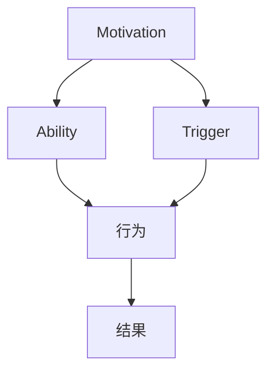

                 

# 利用福格行为模型改善团队习惯

## 关键词

团队管理、行为模型、动机、能力、障碍、习惯培养、团队协作

## 摘要

本文以福格行为模型为基础，探讨了如何利用这一模型改善团队习惯。首先，我们概述了福格行为模型的背景、定义及其三个核心要素，并分析了其应用范围。接着，我们详细介绍了福格行为模型在团队管理中的应用，包括确定团队目标与行动计划、提升团队动力以及构建正向反馈机制。随后，文章重点讨论了福格行为模型在团队习惯培养中的应用，包括确定习惯目标、提升动机、增强能力和减少障碍。此外，我们还探讨了福格行为模型在团队协作中的应用，包括促进团队沟通、提升团队决策效率和增强团队凝聚力。最后，通过案例分析，我们展示了如何利用福格行为模型改善团队工作习惯和提升团队协作效率。本文旨在为团队管理者提供一种系统化的方法，帮助其改善团队习惯，提高团队绩效。

### 目录大纲

1. 福格行为模型概述  
   1.1 福格行为模型的背景与定义  
   1.2 福格行为模型的三个要素  
   1.3 福格行为模型的应用范围

2. 福格行为模型在团队管理中的应用  
   2.1 确定团队目标与行动计划  
   2.2 提升团队动力  
   2.3 构建正向反馈机制

3. 福格行为模型在团队习惯培养中的应用  
   3.1 确定习惯目标  
   3.2 提升动机  
   3.3 增强能力  
   3.4 减少障碍

4. 福格行为模型在团队协作中的应用  
   4.1 促进团队沟通  
   4.2 提升团队决策效率  
   4.3 增强团队凝聚力

5. 案例分析与实战  
   5.1 案例一：如何利用福格行为模型改善团队工作习惯  
   5.2 案例二：如何利用福格行为模型提升团队协作效率

6. 实施策略与工具  
   6.1 实施策略  
   6.2 实施工具

7. 总结与展望  
   7.1 福格行为模型在团队管理中的价值  
   7.2 未来研究方向与展望  
   7.3 对团队的启示与实践指导

8. 附录  
   8.1 福格行为模型核心概念与联系  
   8.2 福格行为模型应用案例

### 福格行为模型概述

#### 1.1 福格行为模型的背景与定义

福格行为模型（Fogg Behavior Model），简称FBM，由行为科学家BJ福格（BJ Fogg）于2008年提出。该模型旨在解释人们的行为是如何形成的，以及如何通过设计来影响和改变这些行为。FBM以简洁明了的方式阐述了行为形成的三个核心要素：动机（Motivation）、能力（Ability）和触发（Trigger）。根据福格的行为模型，只有当这三个要素同时存在且满足一定条件时，行为才会发生。

#### 1.2 福格行为模型的三个要素

1. **动机（Motivation）**：动机是指一个人想要采取某种行为的内在驱动力。它可以是兴趣、需求、欲望、恐惧等。高动机意味着一个人对行为有强烈的欲望或需求。

2. **能力（Ability）**：能力是指一个人实际能够采取该行为的外在条件。这包括技能、资源、环境等因素。高能力意味着一个人有足够的资源和技能来执行某个行为。

3. **触发（Trigger）**：触发是指促使一个人采取行为的即时刺激。它可以是一个提醒、一个信号或一个事件。高触发意味着有足够的刺激来促使行为的发生。

#### 1.3 福格行为模型的应用范围

福格行为模型不仅适用于个人行为的改变，还可以广泛应用于团队管理和组织行为改进。以下是FBM在团队管理中的应用范围：

1. **团队目标设定**：通过分析团队动机、能力和触发因素，可以更科学地设定团队目标，确保目标的可实现性和激励性。

2. **团队动力提升**：通过增强团队动机、提高团队能力和减少行为障碍，可以提升团队的内在动力和工作效率。

3. **团队习惯培养**：通过识别不良习惯和设计新的行为模式，可以帮助团队成员养成健康的工作习惯。

4. **团队协作优化**：通过改善团队沟通、提升决策效率和增强团队凝聚力，可以优化团队协作，提高团队绩效。

接下来，我们将进一步探讨福格行为模型在团队管理中的具体应用。

### 福格行为模型在团队管理中的应用

#### 2.1 确定团队目标与行动计划

团队目标是团队努力的方向和最终要达成的成果。根据福格行为模型，一个有效的团队目标应该具备高动机、高能力和高触发三个要素。

1. **如何制定明确的团队目标**

   - **明确性原则**：团队目标应当具体、可衡量和有明确的时间限制。例如，“团队在下一个季度内提高产品销量30%”。

   - **相关性原则**：团队目标应当与团队成员的个人目标和组织目标保持一致。确保团队成员能够看到自己的努力是如何为团队和组织做出贡献的。

   - **激励性原则**：团队目标应当能够激发团队成员的内在动机，使其愿意为实现目标而努力。

2. **如何分解目标为可执行的行动**

   - **SMART原则**：将团队目标分解为具体的、可衡量的、可实现的、相关的和有时限的（SMART）行动。例如，将“提高产品销量”分解为“每周进行市场调研”、“每月举办一次产品推广活动”等具体行动。

   - **责任分配**：明确每个团队成员在实现目标过程中的职责和任务，确保每个人都知道自己需要做什么，并对其行为负责。

   - **进度监控**：定期检查和评估团队目标的实现情况，根据实际情况调整行动方案，确保团队能够按时、按质、按量地完成任务。

#### 2.2 提升团队动力

团队动力的提升是团队管理中至关重要的一环。根据福格行为模型，提升团队动力需要从动机、能力和触发三个维度进行综合考量。

1. **如何增强动机**

   - **内在激励**：通过让团队成员感受到工作的重要性、挑战性和成就感，激发其内在动机。例如，为团队成员提供有意义的项目任务，让他们感受到自己的工作对社会或组织有积极的影响。

   - **外部激励**：通过奖励和认可来激发团队的外在动机。例如，定期评选“优秀员工”，给予奖金或晋升机会。

   - **目标设置**：设定明确的、有挑战性的目标和奖励机制，激发团队成员的积极性。例如，设立“季度销售冠军”奖项，激励团队成员为实现目标而努力。

2. **如何提升能力**

   - **培训与发展**：为团队成员提供必要的技能培训和学习机会，提高其能力和工作效率。

   - **资源支持**：确保团队成员拥有完成任务所需的资源，如设备、工具和资料。

   - **工作环境**：营造一个积极、支持和有利于团队成员成长的工作环境。

3. **如何减少障碍**

   - **消除沟通障碍**：建立有效的沟通机制，确保团队成员之间的信息畅通无阻。

   - **优化流程**：简化工作流程，减少不必要的环节和手续，提高工作效率。

   - **提供反馈**：及时给予团队成员反馈，帮助他们了解自己的工作表现，及时纠正错误和改进。

#### 2.3 构建正向反馈机制

正向反馈机制是团队管理中的一种重要工具，它可以帮助团队不断优化和改进工作方法。根据福格行为模型，正向反馈机制应当具备以下特点：

1. **及时性**：反馈应当及时，以便团队成员能够迅速了解自己的工作表现，并及时进行调整。

2. **针对性**：反馈应当针对具体的行为和结果，而不是对人的攻击。例如，“你的市场调研报告提供了非常有价值的信息，但如果能在报告中加入更多数据支持，效果会更好。”

3. **建设性**：反馈应当具有建设性，帮助团队成员了解如何改进自己的工作。例如，“你的报告结构清晰，但可以考虑使用图表来更直观地展示数据。”

4. **互动性**：反馈应当是双向的，鼓励团队成员提出意见和建议，共同探讨改进方案。

通过以上措施，团队管理者可以更好地利用福格行为模型，提升团队动力，优化团队管理，从而实现更高的团队绩效。

### 福格行为模型在团队习惯培养中的应用

#### 3.1 确定习惯目标

在团队中培养良好的工作习惯是提高团队效率和绩效的关键。根据福格行为模型，要成功地培养新的习惯，首先需要明确习惯目标。以下是确定习惯目标的几个关键步骤：

1. **识别不良习惯**

   - **数据分析**：通过数据分析，了解团队中普遍存在的不足和问题，例如出勤率、任务完成率、沟通效率等。

   - **问卷调查**：设计问卷，收集团队成员对当前工作习惯的看法和反馈，了解存在的问题和改进的方向。

   - **访谈**：与团队成员进行一对一访谈，深入了解他们的工作习惯和挑战。

2. **分析习惯原因**

   - **需求分析**：分析不良习惯背后的需求和动机，例如缺乏动力、技能不足、环境不合适等。

   - **环境分析**：考察工作环境是否对不良习惯有促进作用，例如缺乏激励机制、工作流程繁琐等。

3. **设定新的习惯目标**

   - **明确性**：新习惯目标应当具体、可衡量，例如“每天早上9点前到办公室”、“每周进行一次团队会议”等。

   - **相关性**：新习惯目标应当与团队和组织的目标保持一致，有助于实现团队和组织的战略目标。

   - **挑战性**：新习惯目标应当具有适当的挑战性，能够激励团队成员努力改进，但不应过于苛刻。

   - **可行性**：新习惯目标应当是可行的，团队成员有足够的资源和能力去实现。

#### 3.2 提升动机

提升动机是培养新习惯的重要一环。根据福格行为模型，可以通过以下几个方面来提升团队成员的动机：

1. **激发兴趣**

   - **个性化任务**：根据团队成员的兴趣和特长，为他们分配具有挑战性和趣味性的任务，提升工作的吸引力。

   - **故事化讲解**：通过讲述团队的成功案例和团队成员的贡献，激发团队成员的成就感和自豪感。

2. **提高自我效能感**

   - **能力培养**：通过培训和教育，提高团队成员的技能和知识水平，增强其自信心和自我效能感。

   - **成功经历**：鼓励团队成员分享自己的成功经历，互相学习和鼓励。

3. **奖励机制**

   - **即时奖励**：对实现新习惯目标的团队成员给予即时奖励，例如奖金、表扬信等。

   - **长期奖励**：设立长期奖励机制，例如年终奖、晋升机会等，激励团队成员长期坚持新习惯。

#### 3.3 增强能力

增强能力是培养新习惯的基础。根据福格行为模型，可以通过以下几个方面来增强团队成员的能力：

1. **技能培训**

   - **基础技能**：为团队成员提供基础技能培训，例如沟通技巧、时间管理技巧等。

   - **专项技能**：为团队成员提供专项技能培训，例如编程技能、项目管理技巧等。

2. **资源支持**

   - **工具和设备**：确保团队成员有足够的工具和设备来完成任务，例如计算机、软件等。

   - **信息支持**：为团队成员提供必要的参考资料和信息，帮助他们更好地理解和执行任务。

3. **导师辅导**

   - **一对一辅导**：为团队成员安排导师，提供个性化的辅导和指导。

   - **团队交流**：鼓励团队成员之间进行交流和分享，互相学习和借鉴。

#### 3.4 减少障碍

减少障碍是培养新习惯的关键一步。根据福格行为模型，可以通过以下几个方面来减少障碍：

1. **简化流程**

   - **流程优化**：简化工作流程，减少不必要的环节和手续，提高工作效率。

   - **自动化**：利用自动化工具和技术，减少人工干预，降低工作复杂度。

2. **提供反馈**

   - **即时反馈**：为团队成员提供即时反馈，帮助他们了解自己的工作表现，及时纠正错误和改进。

   - **建设性反馈**：鼓励团队成员提出意见和建议，共同探讨改进方案。

3. **消除心理障碍**

   - **支持系统**：建立支持系统，为团队成员提供心理支持和帮助。

   - **鼓励尝试**：鼓励团队成员勇于尝试新事物，降低失败的风险和压力。

通过以上措施，团队管理者可以有效地利用福格行为模型，培养团队的新习惯，提高团队的整体效率和绩效。

### 福格行为模型在团队协作中的应用

#### 4.1 促进团队沟通

有效的团队沟通是团队协作的关键，它能够促进信息共享、增强团队凝聚力，并提高决策效率。根据福格行为模型，以下是促进团队沟通的几个关键步骤：

1. **建立有效的沟通渠道**

   - **确定沟通需求**：了解团队在不同阶段、不同任务中对沟通的需求，例如日常交流、项目讨论、问题反馈等。

   - **选择合适的沟通工具**：根据沟通需求，选择合适的沟通工具，如电子邮件、即时通讯、电话会议、视频会议等。

   - **制定沟通规范**：明确沟通的频率、格式和责任，确保团队成员了解如何在团队中有效沟通。

2. **提高团队成员的沟通技巧**

   - **培训与发展**：为团队成员提供沟通技巧培训，例如倾听技巧、表达技巧、非语言沟通等。

   - **实践与反馈**：鼓励团队成员在日常生活中实践沟通技巧，并通过定期反馈和讨论，不断提高沟通能力。

3. **鼓励双向沟通**

   - **开放性沟通**：营造一个开放、包容的沟通环境，鼓励团队成员表达自己的观点和意见。

   - **积极倾听**：培养团队成员积极倾听他人意见的习惯，确保沟通双方都能充分理解对方。

#### 4.2 提升团队决策效率

高效的团队决策能够加快项目进展，降低风险，提高团队绩效。根据福格行为模型，以下是提升团队决策效率的几个关键步骤：

1. **制定高效的决策流程**

   - **明确决策目标**：在决策前明确决策的目标和标准，确保决策方向正确。

   - **收集信息**：广泛收集与决策相关的信息，确保决策有充分的数据支持。

   - **分析评估**：对收集到的信息进行分析和评估，识别潜在的风险和机会。

   - **制定方案**：根据分析结果，制定多种可能的解决方案，并进行比较和评估。

   - **决策执行**：选择最佳方案，明确执行步骤和责任，确保决策能够得到有效执行。

2. **避免团队决策的常见陷阱**

   - **群体思维**：避免团队成员在没有充分讨论的情况下盲目跟随群体意见。

   - **过度自信**：避免团队成员因为自信过度而忽视潜在的风险。

   - **信息偏见**：确保团队成员在决策过程中能够客观、全面地分析信息，避免信息偏见。

3. **利用决策支持工具**

   - **数据分析工具**：利用数据分析工具，对决策相关的数据进行处理和分析，提供决策支持。

   - **模拟工具**：使用模拟工具，对决策方案进行模拟和测试，评估其可行性和效果。

#### 4.3 增强团队凝聚力

团队凝聚力是团队协作的重要保障，它能够提高团队成员的归属感和合作意愿，增强团队的稳定性。根据福格行为模型，以下是增强团队凝聚力的几个关键步骤：

1. **建立团队成员间的信任**

   - **透明沟通**：通过透明沟通，确保团队成员了解团队的目标、计划和进展，增强信任感。

   - **相互尊重**：尊重团队成员的意见和贡献，避免歧视和偏见。

   - **共同目标**：确保团队成员有共同的目标和愿景，增强团队凝聚力。

2. **促进团队精神**

   - **团队活动**：组织团队活动，如团队建设、团建旅行等，增强团队成员之间的情感联系。

   - **共同荣誉**：鼓励团队成员为团队的成功共同努力，分享团队的荣誉和成就。

   - **团队合作**：培养团队成员的团队合作精神，鼓励他们在困难面前相互支持、共同解决难题。

3. **提供心理支持**

   - **情感支持**：为团队成员提供情感支持，帮助他们缓解工作和生活中的压力。

   - **心理咨询**：提供心理咨询服务，帮助团队成员解决心理问题，提高心理健康水平。

通过以上措施，团队管理者可以有效地利用福格行为模型，促进团队沟通、提升决策效率和增强团队凝聚力，从而提高团队的整体绩效。

### 案例分析与实战

#### 5.1 案例一：如何利用福格行为模型改善团队工作习惯

**案例背景**：

某科技公司拥有一支由20名成员组成的研发团队，负责开发和维护一款关键业务系统。然而，该团队在项目管理、任务分配和工作流程方面存在诸多问题，导致项目进展缓慢、团队成员工作压力大。为了改善团队工作习惯，提高项目效率，团队管理者决定引入福格行为模型。

**案例分析与解决方案**：

1. **确定习惯目标**

   - **识别不良习惯**：通过问卷调查和访谈，发现团队存在以下不良习惯：任务分配不均、沟通效率低、工作流程不透明、依赖临时会议解决问题等。

   - **设定新习惯目标**：明确新习惯目标，如“每周进行一次项目进度会议”、“明确每个任务的责任人”、“建立标准化的工作流程”等。

2. **提升动机**

   - **激发兴趣**：为团队成员分配更具挑战性和有趣的任务，提高工作吸引力。

   - **提高自我效能感**：通过培训和指导，提高团队成员的技能和知识水平，增强其自信心。

   - **奖励机制**：对实现新习惯目标的团队成员给予奖励，如奖金、表彰等。

3. **增强能力**

   - **技能培训**：组织项目管理、沟通技巧等培训课程，提升团队成员的能力。

   - **资源支持**：提供必要的技术和资源，确保团队成员有足够的工具和设备来完成任务。

   - **导师辅导**：为团队成员安排经验丰富的导师，提供个性化的辅导和支持。

4. **减少障碍**

   - **简化流程**：优化工作流程，减少不必要的环节和手续，提高工作效率。

   - **提供反馈**：及时给予团队成员反馈，帮助他们了解自己的工作表现，及时纠正错误和改进。

   - **消除心理障碍**：建立支持系统，为团队成员提供心理支持和帮助。

**案例实施效果评估**：

通过实施福格行为模型，团队的工作习惯得到了显著改善：

- **任务分配更加均衡**：通过明确任务责任人和分配机制，避免了任务堆积和职责不清的问题。

- **沟通效率提高**：定期项目进度会议和标准化工作流程的建立，提高了团队成员之间的沟通效率。

- **工作压力减轻**：团队成员通过技能培训和资源支持，提高了工作效率，减轻了工作压力。

- **团队凝聚力增强**：通过奖励机制和团队活动，增强了团队成员的归属感和合作意愿。

#### 5.2 案例二：如何利用福格行为模型提升团队协作效率

**案例背景**：

某互联网公司拥有一支由15名成员组成的运营团队，负责产品的市场推广和用户运营。然而，由于团队成员之间沟通不畅、任务分配不明确、决策效率低下，团队协作效率一直较低。为了提升团队协作效率，公司决定引入福格行为模型。

**案例分析与解决方案**：

1. **确定协作目标**

   - **识别协作问题**：通过问卷调查和访谈，发现团队存在以下协作问题：沟通不畅、任务分配不明确、决策效率低下等。

   - **设定协作目标**：明确协作目标，如“提高团队成员之间的沟通效率”、“明确任务分配和责任”、“优化决策流程”等。

2. **提升团队动力**

   - **增强动机**：通过设定有挑战性的目标、提供奖励和表彰，激发团队成员的积极性和动力。

   - **提高自我效能感**：通过培训和学习，提高团队成员的技能和知识水平，增强其自信心。

   - **建立团队文化**：鼓励团队成员积极参与团队活动，增强团队凝聚力。

3. **增强协作能力**

   - **技能培训**：为团队成员提供沟通技巧、项目管理技巧等培训，提高协作能力。

   - **工具支持**：引入协作工具，如即时通讯、项目管理软件等，提高团队协作效率。

   - **角色定位**：明确团队成员的角色和责任，确保任务分配和协作顺畅。

4. **减少协作障碍**

   - **简化决策流程**：通过优化决策流程，减少不必要的环节和手续，提高决策效率。

   - **提供反馈**：及时给予团队成员反馈，帮助他们了解工作表现，及时纠正错误和改进。

   - **建立信任**：通过透明沟通、相互支持和共同目标，建立团队成员之间的信任。

**案例实施效果评估**：

通过实施福格行为模型，团队的协作效率得到了显著提升：

- **沟通效率提高**：通过建立有效的沟通渠道和优化沟通流程，团队成员之间的沟通更加顺畅。

- **任务分配更加明确**：通过明确任务责任人和角色定位，避免了任务重复和职责不清的问题。

- **决策效率提高**：通过优化决策流程和减少不必要的环节，决策过程更加高效。

- **团队凝聚力增强**：通过培训、团队活动和共同目标，增强了团队成员之间的信任和合作意愿。

通过以上案例分析，可以看出，福格行为模型在改善团队工作习惯和提升团队协作效率方面具有显著的成效。团队管理者可以借鉴这些经验，结合自身团队的实际状况，制定出适合的改进措施，从而提高团队的整体绩效。

### 实施策略与工具

#### 6.1 实施策略

为了有效地利用福格行为模型改善团队习惯，提升团队协作效率，以下是一些关键的策略：

1. **系统化规划**

   - **制定详细的计划**：在引入福格行为模型之前，团队管理者应制定详细的实施计划，包括目标设定、行动计划、时间表和预期成果。

   - **明确责任分工**：确保每个团队成员都清楚自己的角色和责任，为实施计划的顺利执行提供保障。

2. **逐步推进**

   - **分阶段实施**：将整个实施过程分为几个阶段，每个阶段专注于解决一个具体问题，逐步推进。

   - **评估与调整**：在每个阶段结束后，对实施效果进行评估，根据实际情况进行调整和优化。

3. **持续监督**

   - **建立监督机制**：制定监督机制，确保团队成员按照计划执行任务，及时发现和解决问题。

   - **定期检查**：定期检查团队工作习惯和协作效率，确保新习惯的养成和协作效率的提高。

4. **激励与支持**

   - **激励措施**：通过奖励和表彰，激励团队成员积极参与新习惯的培养和协作效率的提升。

   - **提供支持**：为团队成员提供必要的资源和支持，如培训、工具和技术支持等，帮助他们克服困难和挑战。

#### 6.2 实施工具

为了有效地实施福格行为模型，以下是一些实用的工具：

1. **数据收集与分析工具**

   - **问卷调查**：通过问卷调查，收集团队成员对当前工作习惯和协作效率的反馈，为制定改进措施提供依据。

   - **数据分析工具**：使用数据分析工具，对收集到的数据进行分析和可视化，帮助团队管理者了解实际情况，制定有针对性的改进方案。

2. **团队协作工具**

   - **即时通讯工具**：如Slack、Microsoft Teams等，用于实时沟通和协作。

   - **项目管理工具**：如Trello、JIRA等，用于任务分配、进度跟踪和协作管理。

   - **视频会议工具**：如Zoom、Microsoft Teams等，用于远程会议和协作。

3. **反馈与评估工具**

   - **反馈机制**：建立反馈机制，鼓励团队成员提出意见和建议，及时解决团队中的问题。

   - **评估工具**：使用评估工具，对团队工作习惯和协作效率进行定期评估，了解改进效果。

4. **培训与学习工具**

   - **在线学习平台**：如Coursera、Udemy等，提供丰富的在线培训课程，帮助团队成员提升技能和知识。

   - **内部培训**：组织内部培训，分享最佳实践和成功案例，提高团队成员的能力和知识水平。

通过以上实施策略和工具，团队管理者可以更好地利用福格行为模型，改善团队工作习惯，提升团队协作效率，从而实现更高的团队绩效。

### 总结与展望

#### 7.1 福格行为模型在团队管理中的价值

福格行为模型在团队管理中的应用具有显著的价值。首先，它为团队管理者提供了一种系统化的方法，通过分析动机、能力和触发三个要素，可以更科学地设定团队目标、提升团队动力和优化团队管理。其次，福格行为模型有助于识别和改善团队中的不良习惯，培养健康的工作习惯，提高团队的整体绩效。此外，该模型还可以应用于团队协作，促进团队沟通、提升决策效率和增强团队凝聚力。

#### 7.2 未来研究方向与展望

尽管福格行为模型在团队管理中取得了显著成效，但未来仍有许多研究方向值得探索。首先，可以进一步研究如何将福格行为模型与其他管理理论相结合，如领导力理论、组织行为学等，以形成更加综合和有效的管理方法。其次，可以开发更加精细和实用的工具，如基于大数据和人工智能的决策支持系统，以帮助团队管理者更准确地分析和预测团队行为。此外，未来研究还可以探讨福格行为模型在不同行业和组织的应用效果，为不同背景的团队提供有针对性的管理策略。

#### 7.3 对团队的启示与实践指导

对于团队管理者，福格行为模型提供了一种有效的工具和方法，帮助他们更好地理解和应对团队中的各种挑战。以下是一些建议和实践指导：

1. **深入理解行为模型**：团队管理者应深入理解福格行为模型的原理和应用，将其作为指导团队管理和决策的基础。

2. **持续关注团队动态**：通过定期收集和分析团队数据，了解团队动机、能力和触发因素的变化，及时调整管理策略。

3. **培养健康的工作习惯**：识别和改善团队中的不良习惯，设定明确的习惯目标，并通过提升动机、增强能力和减少障碍，培养健康的工作习惯。

4. **促进团队协作**：建立有效的沟通渠道和协作机制，提高团队成员的沟通技巧和协作能力，增强团队凝聚力。

5. **激励与支持**：通过激励措施和支持系统，激发团队成员的积极性和动力，帮助他们克服困难和挑战。

6. **持续学习和改进**：鼓励团队成员不断学习和成长，通过培训和实践，提高技能和知识水平，持续优化团队管理。

通过以上实践指导，团队管理者可以更好地利用福格行为模型，提升团队绩效，实现组织目标。

### 附录

#### 附录 A：福格行为模型核心概念与联系

福格行为模型（FBM）由动机（Motivation）、能力（Ability）和触发（Trigger）三个核心要素构成，其关系可以用以下Mermaid流程图表示：

- **动机（Motivation）**：个体内心想要采取某种行为的内在驱动力，如兴趣、需求、欲望等。
- **能力（Ability）**：个体实际能够采取该行为的外在条件，如技能、资源、环境等。
- **触发（Trigger）**：促使个体采取行为的即时刺激，如提醒、信号、事件等。
- **行为（Behavior）**：在动机、能力和触发共同作用下，个体实际采取的行动。
- **结果（Result）**：行为所带来的后果，可能是积极的，也可能是消极的。

#### 附录 B：福格行为模型应用案例

以下是两个利用福格行为模型进行团队管理和改进的案例。

##### 案例一：如何利用福格行为模型改善团队工作习惯

**背景**：

某科技公司的研发团队在项目执行过程中，发现团队成员的工作习惯存在问题，如任务分配不均、沟通效率低下、工作流程不规范等。为了提升团队的工作效率，团队管理者决定采用福格行为模型进行改进。

**分析与解决方案**：

1. **确定习惯目标**：

   - **识别不良习惯**：通过问卷调查和访谈，发现团队存在的主要不良习惯包括任务分配不均、沟通效率低下、工作流程不规范等。

   - **设定新习惯目标**：设定明确的新习惯目标，如“任务分配更加均衡”、“沟通效率提高30%”、“建立标准化的工作流程”。

2. **提升动机**：

   - **激发兴趣**：为团队成员分配具有挑战性和趣味性的任务，提高工作的吸引力。

   - **提高自我效能感**：通过培训和指导，提高团队成员的技能和知识水平，增强其自信心。

   - **奖励机制**：对实现新习惯目标的团队成员给予奖励，如奖金、表彰等。

3. **增强能力**：

   - **技能培训**：组织项目管理、沟通技巧等培训课程，提升团队成员的能力。

   - **资源支持**：提供必要的技术和资源，确保团队成员有足够的工具和设备来完成任务。

   - **导师辅导**：为团队成员安排经验丰富的导师，提供个性化的辅导和支持。

4. **减少障碍**：

   - **简化流程**：优化工作流程，减少不必要的环节和手续，提高工作效率。

   - **提供反馈**：及时给予团队成员反馈，帮助他们了解自己的工作表现，及时纠正错误和改进。

   - **消除心理障碍**：建立支持系统，为团队成员提供心理支持和帮助。

**实施效果评估**：

通过实施福格行为模型，团队的工作习惯得到了显著改善：

- **任务分配更加均衡**：通过明确任务责任人和分配机制，避免了任务堆积和职责不清的问题。

- **沟通效率提高**：定期项目进度会议和标准化工作流程的建立，提高了团队成员之间的沟通效率。

- **工作压力减轻**：团队成员通过技能培训和资源支持，提高了工作效率，减轻了工作压力。

- **团队凝聚力增强**：通过奖励机制和团队活动，增强了团队成员的归属感和合作意愿。

##### 案例二：如何利用福格行为模型提升团队协作效率

**背景**：

某互联网公司的运营团队在市场推广和用户运营过程中，发现团队协作效率较低，任务分配不明确，沟通不畅，决策效率低下。为了提升团队协作效率，公司决定采用福格行为模型进行改进。

**分析与解决方案**：

1. **确定协作目标**：

   - **识别协作问题**：通过问卷调查和访谈，发现团队存在的主要协作问题包括沟通不畅、任务分配不明确、决策效率低下等。

   - **设定协作目标**：设定明确的协作目标，如“提高团队成员之间的沟通效率”、“明确任务分配和责任”、“优化决策流程”。

2. **提升团队动力**：

   - **增强动机**：通过设定有挑战性的目标、提供奖励和表彰，激发团队成员的积极性和动力。

   - **提高自我效能感**：通过培训和学习，提高团队成员的技能和知识水平，增强其自信心。

   - **建立团队文化**：鼓励团队成员积极参与团队活动，增强团队凝聚力。

3. **增强协作能力**：

   - **技能培训**：为团队成员提供沟通技巧、项目管理技巧等培训，提高协作能力。

   - **工具支持**：引入协作工具，如即时通讯、项目管理软件等，提高团队协作效率。

   - **角色定位**：明确团队成员的角色和责任，确保任务分配和协作顺畅。

4. **减少协作障碍**：

   - **简化决策流程**：通过优化决策流程，减少不必要的环节和手续，提高决策效率。

   - **提供反馈**：及时给予团队成员反馈，帮助他们了解工作表现，及时纠正错误和改进。

   - **建立信任**：通过透明沟通、相互支持和共同目标，建立团队成员之间的信任。

**实施效果评估**：

通过实施福格行为模型，团队的协作效率得到了显著提升：

- **沟通效率提高**：通过建立有效的沟通渠道和优化沟通流程，团队成员之间的沟通更加顺畅。

- **任务分配更加明确**：通过明确任务责任人和角色定位，避免了任务重复和职责不清的问题。

- **决策效率提高**：通过优化决策流程和减少不必要的环节，决策过程更加高效。

- **团队凝聚力增强**：通过培训、团队活动和共同目标，增强了团队成员之间的信任和合作意愿。

通过以上案例分析，可以看出，福格行为模型在改善团队工作习惯和提升团队协作效率方面具有显著的成效。团队管理者可以借鉴这些经验，结合自身团队的实际状况，制定出适合的改进措施，从而提高团队的整体绩效。

