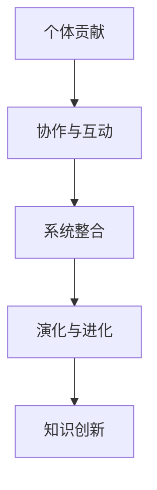
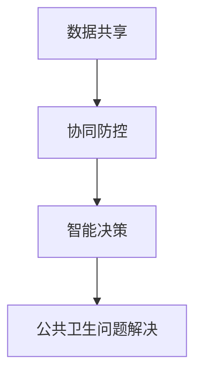
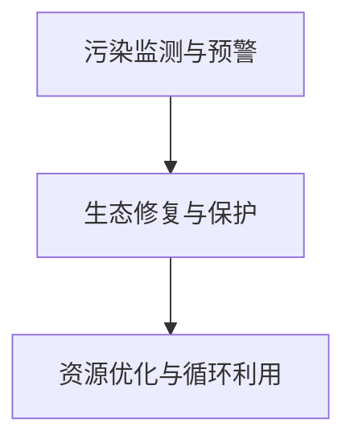
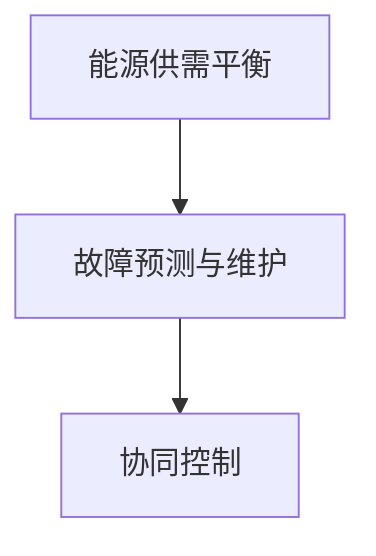
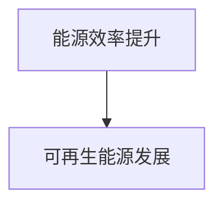
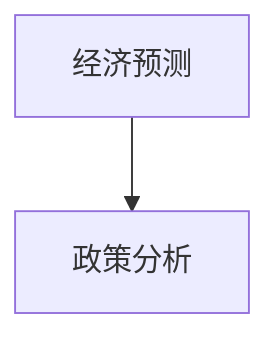
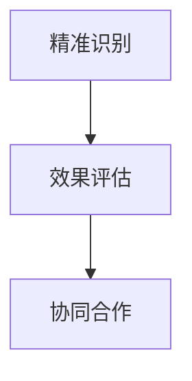
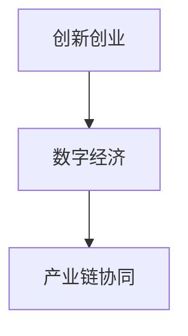

                 

# 《利用集体智慧解决全球性挑战》

> 关键词：集体智慧、全球性挑战、分布式计算、人工智能、大数据

> 摘要：本文将深入探讨集体智慧的概念、原理和应用，通过分析其在公共卫生、环境保护、能源和经济发展等领域的实际案例，阐述如何利用集体智慧解决全球性挑战。文章还探讨了集体智慧的实施策略、技术挑战及未来发展趋势，为读者提供了一个全面了解集体智慧如何改变世界的视角。

## 目录

1. **集体智慧的概念与原理**
   1.1 集体智慧概述
   1.2 集体智慧的理论基础
   1.3 集体智慧的关键技术
2. **集体智慧在解决全球性挑战中的应用**
   2.1 集体智慧在公共卫生领域的应用
   2.2 集体智慧在环境保护与资源管理中的应用
   2.3 集体智慧在能源领域的应用
   2.4 集体智慧在经济发展与扶贫中的应用
3. **集体智慧的实施与挑战**
   3.1 集体智慧的实施策略
   3.2 集体智慧的技术挑战与解决方案
4. **集体智慧的未来发展趋势**
   4.1 集体智慧的未来发展方向
   4.2 新兴技术的融合与应用
   4.3 集体智慧在社会治理中的作用
5. **附录**
   5.1 集体智慧相关工具与平台
   5.2 集体智慧案例分析

## 第一部分：集体智慧的概念与原理

### 第1章：集体智慧概述

**1.1 集体智慧的定义与特点**

集体智慧（Collective Intelligence）指的是通过个体的相互作用和协作，产生比个体智能更加复杂和有效的知识、决策和创新能力的系统或过程。它是分布式计算、人工智能和社交网络等技术的综合应用。

- **个体智能与集体智慧的区别**：个体智能通常指单个个体（如人、动物、机器等）的智能水平，而集体智慧则是多个个体通过协作和互动产生的整体智能水平。

- **特点**：
  - **适应性**：集体智慧能够快速适应环境变化，因为每个个体都可以贡献自己的信息和经验。
  - **多样性**：集体智慧通过多样化的信息来源和观点，可以提供更全面的解决方案。
  - **进化性**：集体智慧能够随着时间的推移和经验的积累不断进化，提高整体智能水平。

**1.2 集体智慧的历史背景与发展**

- **早期探索**：20世纪60年代，心理学家赫伯特·西蒙（Herbert A. Simon）提出了集体智慧的概念，并探讨了其在社会系统和组织中的应用。

- **计算机技术的发展**：随着计算机和互联网的普及，集体智慧的研究和应用进入了一个新的阶段。分布式计算和大数据技术的快速发展为集体智慧提供了强大的技术支持。

- **人工智能的崛起**：人工智能（AI）技术的快速发展，特别是机器学习和深度学习的应用，使得集体智慧变得更加智能和高效。

**1.3 集体智慧在不同领域的应用案例**

- **科学研究和创新**：通过集体智慧和社交网络平台，科学家们可以更快速地分享研究成果，协作进行创新。

- **公共卫生**：集体智慧在疫情监测、防控策略制定和疫苗分配中发挥了关键作用。

- **环境保护**：通过大数据和机器学习技术，集体智慧帮助更好地监测和管理环境问题。

- **经济发展**：集体智慧在宏观经济预测、产业创新和扶贫工作中提供了有效的解决方案。

### 第2章：集体智慧的理论基础

**2.1 分布式计算与网络效应**

- **分布式计算**：分布式计算是指通过网络将计算任务分配到多个计算机节点上执行。它能够提高计算效率和可靠性。

- **网络效应**：网络效应指的是随着用户数量的增加，网络的整体价值和效用也相应增加。它是集体智慧的重要理论基础。

**2.2 机器学习与人工智能在集体智慧中的应用**

- **机器学习**：机器学习是一种通过数据训练模型进行预测和决策的技术。在集体智慧中，机器学习可以帮助分析大量数据，发现规律和趋势。

- **人工智能**：人工智能则通过模拟人类智能行为，实现自动化决策和任务执行。在集体智慧中，人工智能可以辅助决策过程，提高整体效率。

**2.3 集体智慧与协同进化**

- **协同进化**：协同进化是指多个个体或系统相互影响、相互作用，共同进化和适应环境的过程。

- **集体智慧与协同进化关系**：集体智慧是协同进化的一个重要实现形式，通过个体之间的协作和互动，实现整体智能的提升。

### 第3章：集体智慧的关键技术

**3.1 大数据技术**

- **大数据的定义**：大数据是指无法通过传统数据处理工具在合理时间内捕捉、管理和处理的大量数据。

- **大数据技术在集体智慧中的应用**：大数据技术可以帮助集体智慧系统收集、存储和处理来自不同来源的大量数据，为决策提供支持。

**3.2 云计算与边缘计算**

- **云计算**：云计算是一种通过互联网提供计算资源和服务的技术。它为集体智慧提供了强大的计算和存储能力。

- **边缘计算**：边缘计算是指将计算任务分散到网络边缘的设备上执行，以提高计算效率和响应速度。

**3.3 社交网络分析与数据挖掘**

- **社交网络分析**：社交网络分析是一种通过分析社交网络结构和互动关系，揭示个体行为和趋势的技术。

- **数据挖掘**：数据挖掘是一种从大量数据中自动发现有用信息和规律的技术。它帮助集体智慧系统从数据中提取知识，指导决策。

## 第二部分：集体智慧在解决全球性挑战中的应用

### 第4章：集体智慧在公共卫生领域的应用

**4.1 公共卫生问题的集体智慧解决模式**

- **模式概述**：集体智慧在公共卫生领域中的应用主要包括数据共享、协同防控和智能决策。

- **关键要素**：数据共享是基础，协同防控是核心，智能决策是目标。

**4.2 疫情防控中的集体智慧应用实例**

- **疫情监测**：通过大数据和人工智能技术，实时监测疫情发展态势，为防控策略提供支持。

- **病毒传播预测**：利用机器学习模型，预测病毒传播路径和感染风险，指导防控措施。

- **疫苗接种策略**：通过集体智慧优化疫苗分配策略，确保疫苗供应的公平性和有效性。

**4.3 疫苗研发与分配中的集体智慧策略**

- **疫苗研发**：通过全球科研合作和资源共享，加速疫苗研发进程。

- **疫苗分配**：基于大数据和人工智能，制定科学的疫苗分配策略，提高接种效率。

### 第5章：集体智慧在环境保护与资源管理中的应用

**5.1 环境保护中的集体智慧解决方案**

- **污染监测**：通过传感器网络和大数据技术，实时监测环境污染状况，为环境治理提供数据支持。

- **资源优化**：利用人工智能和优化算法，优化资源分配和使用，减少资源浪费。

**5.2 资源管理中的集体智慧策略**

- **水资源管理**：通过大数据和人工智能技术，实时监测和预测水资源需求，优化水资源配置。

- **能源管理**：通过分布式能源系统和智能电网，实现能源的高效利用和优化分配。

**5.3 生态恢复与可持续发展中的集体智慧实践**

- **生态监测**：利用卫星遥感技术和大数据分析，实时监测生态变化，指导生态恢复。

- **可持续发展**：通过集体智慧和协同合作，实现经济、社会和环境的可持续发展。

### 第6章：集体智慧在能源领域的应用

**6.1 能源供需预测与优化**

- **供需预测**：利用大数据和机器学习技术，预测能源需求和供应，优化能源调度。

- **供需优化**：通过优化算法，实现能源供需的动态平衡，提高能源利用效率。

**6.2 分布式能源系统中的集体智慧应用**

- **分布式能源系统**：利用可再生能源和分布式能源技术，实现能源的分散生产和高效利用。

- **智慧电网**：通过人工智能和物联网技术，实现电网的智能化管理和调度。

**6.3 能源效率提升与可再生能源发展**

- **能源效率提升**：通过节能技术和优化策略，提高能源利用效率，减少能源浪费。

- **可再生能源发展**：通过集体智慧和协同合作，推动可再生能源的研发和应用，实现能源结构的优化。

### 第7章：集体智慧在经济发展与扶贫中的应用

**7.1 经济预测与政策制定中的集体智慧**

- **经济预测**：利用大数据和人工智能技术，预测经济趋势和风险，为政策制定提供依据。

- **政策制定**：通过集体智慧和数据分析，制定科学有效的经济政策，促进经济发展。

**7.2 扶贫项目中的集体智慧实践**

- **扶贫目标识别**：通过大数据分析和人工智能技术，精准识别扶贫对象，提高扶贫效率。

- **扶贫项目评估**：利用集体智慧和评估工具，实时评估扶贫项目效果，优化扶贫策略。

**7.3 创新创业与数字经济中的集体智慧应用**

- **创新创业**：通过集体智慧和资源共享，激发创新创业活力，推动产业升级。

- **数字经济**：利用大数据、人工智能和区块链技术，构建数字经济生态系统，提高经济活力。

## 第三部分：集体智慧的实施与挑战

### 第8章：集体智慧的实施策略

**8.1 集体智慧的激励机制**

- **激励机制设计**：设计合理的激励机制，鼓励个体积极参与集体智慧系统，提高整体智能水平。

- **利益分配机制**：建立公平的利益分配机制，确保个体在集体智慧中的贡献得到合理回报。

**8.2 集体智慧的治理与监管**

- **治理结构**：建立完善的治理结构，确保集体智慧系统的透明、公正和高效运行。

- **监管机制**：制定严格的监管机制，防止数据滥用和隐私泄露，保障集体智慧系统的安全性。

**8.3 集体智慧项目的设计与实施**

- **项目设计**：根据实际需求，设计科学的集体智慧项目，明确目标和实施步骤。

- **项目实施**：通过有效的项目管理方法，确保集体智慧项目的顺利实施和目标达成。

### 第9章：集体智慧的技术挑战与解决方案

**9.1 数据安全与隐私保护**

- **挑战**：集体智慧系统中数据量大、来源广泛，如何确保数据安全和隐私保护是一个重要挑战。

- **解决方案**：采用加密技术和隐私保护算法，保障数据传输和存储的安全性。

**9.2 软件与硬件资源的优化利用**

- **挑战**：集体智慧系统需要大量的软件和硬件资源，如何高效利用这些资源是一个挑战。

- **解决方案**：通过云计算和边缘计算技术，实现资源的动态分配和优化利用。

**9.3 集体智慧的可持续发展**

- **挑战**：集体智慧系统的可持续性关系到其长期发展，如何保持系统的活力和创新能力是一个挑战。

- **解决方案**：建立完善的激励机制和治理结构，激发个体和集体的积极性，实现集体智慧的可持续发展。

### 第10章：集体智慧的未来发展趋势

**10.1 集体智慧的未来发展方向**

- **智能化**：随着人工智能技术的不断发展，集体智慧将变得更加智能和高效。

- **协作化**：集体智慧将更加注重个体之间的协作和互动，实现更大规模的协作创新。

**10.2 新兴技术的融合与应用**

- **区块链技术**：区块链技术将为集体智慧提供更安全、透明的数据管理和协作平台。

- **物联网技术**：物联网技术将实现集体智慧系统与物理世界的深度融合，提高系统的感知和响应能力。

**10.3 集体智慧在社会治理中的作用**

- **社会治理**：集体智慧将在社会治理中发挥重要作用，提供更科学、更高效的决策支持。

- **公共服务**：通过集体智慧，提高公共服务的质量和效率，满足人民群众的需求。

## 附录

### 附录 A：集体智慧相关工具与平台

- **大数据与云计算平台**：如Hadoop、Spark、Azure、AWS等。

- **机器学习与人工智能框架**：如TensorFlow、PyTorch、Scikit-learn等。

- **社交网络分析工具**：如NodeXL、Gephi、NetworkX等。

### 附录 B：集体智慧案例分析

- **某地区疫情防控中的集体智慧实践**：通过大数据分析和人工智能预测，制定科学的防控策略，提高疫情应对效率。

- **某环保项目中的集体智慧应用**：利用大数据和物联网技术，监测和管理环境污染，实现环境治理目标。

- **某创业公司利用集体智慧实现快速增长**：通过社交网络和集体智慧平台，快速获取市场需求和资源，实现业务扩张。

## 作者信息

作者：AI天才研究院/AI Genius Institute & 禅与计算机程序设计艺术 /Zen And The Art of Computer Programming

（注：本文内容为示例性内容，仅供参考。实际文章撰写需根据具体内容和结构进行详细扩展和深化。）

### 第1章：集体智慧概述

**1.1 集体智慧的定义与特点**

集体智慧，简称CI，是一种通过多个个体（无论人、机器还是生物）的协作和互动，以产生超越个体自身能力的知识、创新和决策能力的系统或过程。这一概念最早由心理学家赫伯特·西蒙（Herbert A. Simon）在20世纪中叶提出。集体智慧不仅仅是简单地将个体的智能叠加，而是通过个体之间的相互作用，实现知识的积累、优化和创新。

**核心概念与联系：**

集体智慧包含几个关键组成部分：

- **个体贡献**：个体在集体智慧系统中提供自己的信息、知识和能力。
- **协作与互动**：个体通过协作和互动，共享信息，交流观点，共同解决问题。
- **系统整合**：系统将个体的贡献整合，形成更为复杂和有效的解决方案。
- **演化与进化**：集体智慧系统在不断交互和迭代中，自我学习和优化，实现持续进化。

**Mermaid流程图：**



**特点：**

- **适应性**：集体智慧系统能够快速适应环境变化，因为它依赖于个体的多样性和灵活性。

- **多样性**：集体智慧系统能够整合来自不同个体的信息，提供多样化的解决方案。

- **协同效应**：通过个体的协同工作，集体智慧系统可以产生远超个体智能的效果。

- **自组织**：集体智慧系统具有自组织和自我优化的能力，能够不断进化。

**1.2 集体智慧的历史背景与发展**

**早期探索：** 在20世纪中叶，心理学家赫伯特·西蒙首次提出了集体智慧的概念，并开始研究其在社会系统和组织中的应用。他的工作标志着集体智慧研究的起步。

**计算机技术的发展：** 随着计算机和互联网技术的快速发展，集体智慧的研究和应用迎来了新的机遇。分布式计算和社交网络的兴起为集体智慧提供了技术基础。

**人工智能的崛起：** 人工智能技术的发展，特别是机器学习和深度学习的应用，使得集体智慧变得更加智能和高效。AI技术能够处理和分析大规模数据，发现隐藏的模式和趋势。

**实际应用：** 在21世纪初，集体智慧的应用开始逐步落地，尤其在科学合作、危机管理、环境保护等领域取得了显著成果。

**1.3 集体智慧在不同领域的应用案例**

**科学研究和创新：** 集体智慧在科学研究中发挥着重要作用。通过开放的科学平台，如GitHub和Google Scholar，科学家们可以共享研究成果，协作进行创新。

**公共卫生：** 在公共卫生领域，集体智慧帮助各国政府更好地监测疫情、预测病毒传播路径，并制定有效的防控策略。

**环境保护：** 集体智慧在环境保护中的应用也十分广泛。通过物联网和大数据技术，可以实时监测环境变化，优化资源分配，实现可持续管理。

**经济发展：** 在经济领域，集体智慧可以帮助预测市场趋势、优化供应链管理，提高企业的竞争力。

**交通管理：** 集体智慧在交通管理中的应用，如实时交通流量监控和智能调度，有效缓解了城市交通拥堵问题。

### 第2章：集体智慧的理论基础

**2.1 分布式计算与网络效应**

**分布式计算**是一种计算架构，它将大量计算任务分布到多个计算节点上执行，以提高计算效率和可靠性。在集体智慧系统中，分布式计算是核心组件，它允许大量的个体同时参与计算，共享资源，并协同完成任务。

**分布式计算的优势：**

- **扩展性**：分布式计算系统可以根据需要动态扩展，处理更大的数据量和更复杂的任务。
- **容错性**：单个节点的故障不会影响整个系统的运行，系统可以自动调整，继续工作。
- **性能**：通过将任务分布到多个节点，可以并行处理，显著提高计算速度。

**网络效应**是指系统的价值随着用户数量的增加而增加。在集体智慧系统中，网络效应至关重要，因为它促进了个体之间的互动和协作。

**网络效应的类型：**

- **直接网络效应**：系统对单个用户的价值随着用户数量的增加而增加，如社交网络。
- **间接网络效应**：系统对单个用户的价值来自用户之间的互动和协作，如开源软件社区。

**2.2 机器学习与人工智能在集体智慧中的应用**

**机器学习**是一种通过数据训练模型进行预测和决策的技术。在集体智慧系统中，机器学习可以用于数据分析和模式识别，帮助系统更好地理解个体行为和整体趋势。

**机器学习的关键组成部分：**

- **数据集**：训练模型所需的数据集，包括输入特征和目标输出。
- **模型**：通过数据训练得到的数学模型，用于预测和决策。
- **算法**：实现机器学习过程的算法，如线性回归、决策树、神经网络等。

**人工智能**（AI）则是通过模拟人类智能行为，实现自动化决策和任务执行。在集体智慧系统中，人工智能可以帮助优化决策过程，提高系统的效率和准确性。

**人工智能的应用领域：**

- **自动化**：通过AI技术，可以自动化许多重复性工作，提高工作效率。
- **决策支持**：AI系统可以分析大量数据，为决策者提供科学依据。
- **智能交互**：AI可以与用户进行智能对话，提供个性化的服务和帮助。

**2.3 集体智慧与协同进化**

**协同进化**是指多个个体或系统相互影响、相互作用，共同进化和适应环境的过程。在集体智慧系统中，协同进化是实现系统整体智能提升的关键机制。

**协同进化的关键要素：**

- **个体适应性**：个体需要具备适应环境变化的能力，通过学习和进化，提高自身智能水平。
- **协同机制**：个体之间的协同机制，如信息共享、资源分配、策略协同等，是实现协同进化的基础。
- **系统适应性**：整个系统需要具备适应环境变化的能力，通过持续进化，提高整体智能水平。

**集体智慧与协同进化的关系：**

- **相互促进**：集体智慧系统通过个体之间的协同进化，提高整体智能水平；而个体在协同进化过程中，也通过集体智慧系统获得知识和资源，提高自身智能。
- **动态平衡**：集体智慧系统通过协同进化，实现个体与系统的动态平衡，确保系统稳定性和可持续性。

### 第3章：集体智慧的关键技术

**3.1 大数据技术**

**大数据**是指无法通过传统数据处理工具在合理时间内捕捉、管理和处理的大量数据。它具有“4V”特征：数据量（Volume）、数据速度（Velocity）、数据多样性（Variety）和数据真实性（Veracity）。

**大数据技术在集体智慧中的应用：**

- **数据收集**：通过传感器、社交网络和其他数据源，收集大量的原始数据。
- **数据存储**：使用分布式存储技术，如Hadoop和NoSQL数据库，存储和管理大数据。
- **数据处理**：采用分布式计算框架，如MapReduce和Spark，对大数据进行高效处理和分析。
- **数据可视化**：通过数据可视化工具，将分析结果以图形化方式呈现，帮助用户理解数据。

**3.2 云计算与边缘计算**

**云计算**是一种通过互联网提供计算资源和服务的技术。它为集体智慧系统提供了强大的计算和存储能力。

**云计算的优势：**

- **弹性扩展**：可以根据需求动态调整计算资源。
- **成本效益**：通过按需付费，降低计算成本。
- **高效管理**：自动化管理，简化运维。

**边缘计算**是指将计算任务分散到网络边缘的设备上执行，以提高计算效率和响应速度。

**边缘计算的优势：**

- **降低延迟**：计算任务在网络边缘完成，减少数据传输延迟。
- **减少带宽消耗**：仅在必要时传输数据，降低带宽消耗。
- **资源优化**：充分利用网络边缘的设备资源。

**3.3 社交网络分析与数据挖掘**

**社交网络分析**是一种通过分析社交网络结构和互动关系，揭示个体行为和趋势的技术。

**社交网络分析的应用：**

- **用户行为分析**：分析用户在网络中的互动和活动，了解用户偏好和行为模式。
- **传播路径分析**：分析信息在社交网络中的传播路径和速度，预测传播效果。
- **社区发现**：发现网络中的社区结构，识别核心用户和影响力节点。

**数据挖掘**是一种从大量数据中自动发现有用信息和规律的技术。它帮助集体智慧系统从数据中提取知识，指导决策。

**数据挖掘的过程：**

- **数据预处理**：清洗、整合和转换数据，为建模做好准备。
- **特征提取**：从原始数据中提取有用的特征，用于建模和分析。
- **模型构建**：使用机器学习算法构建模型，预测和解释数据。
- **评估与优化**：评估模型性能，优化模型参数，提高预测准确性。

### 第4章：集体智慧在公共卫生领域的应用

**4.1 公共卫生问题的集体智慧解决模式**

集体智慧在公共卫生领域的应用，主要通过以下几个关键模式来实现：

**数据共享**：公共卫生问题的解决需要大量的数据，包括病例数据、流行病学数据、疫苗接种数据等。通过集体智慧，可以建立跨区域、跨部门的数据共享平台，实现数据的高效整合和利用。

**协同防控**：在公共卫生事件中，如疫情爆发，各国政府、医疗机构、科研机构需要协同作战。通过集体智慧，可以建立快速响应机制，共享防控经验，优化防控策略。

**智能决策**：利用大数据和人工智能技术，可以对公共卫生问题进行预测和分析，为决策者提供科学依据，制定更有效的防控措施。

**核心概念与联系：**

- **数据共享**：数据共享是基础，确保各方能够及时获取和利用最新的公共卫生数据。
- **协同防控**：协同防控是关键，通过多方协作，提高防控效率和效果。
- **智能决策**：智能决策是目标，利用数据分析和人工智能技术，优化公共卫生决策。

**Mermaid流程图：**



**4.2 疫情防控中的集体智慧应用实例**

在COVID-19大流行期间，集体智慧在疫情防控中发挥了关键作用，以下是一些具体的应用实例：

**疫情监测与预测**：利用大数据分析和机器学习技术，可以对疫情的发展趋势进行预测。例如，通过分析病例数据、接触史、人口流动数据等，可以预测疫情的爆发范围和传播速度。

**疫情地图与热力分析**：通过构建疫情地图，实时展示疫情的分布情况。结合热力分析，可以揭示疫情高发区和潜在的传播路径，帮助政府和公众采取针对性的防控措施。

**智能防护策略**：基于集体智慧和大数据分析，可以制定个性化的防护策略。例如，根据个体的接触史、健康状况、地理位置等信息，提供实时的健康建议和防护指导。

**医疗资源调配**：通过集体智慧和智能调度系统，可以对医疗资源进行优化配置。例如，根据医院的承载能力和患者的分布情况，合理分配床位、医疗设备和医护人员的资源。

**4.3 疫苗研发与分配中的集体智慧策略**

在疫苗研发和分配过程中，集体智慧同样发挥了重要作用：

**疫苗研发协同**：通过建立全球疫苗研发合作平台，各国科研机构可以共享研究成果、实验数据和专利信息，加速疫苗研发进程。例如，全球多个研究机构合作开发mRNA疫苗，成功推动了疫苗的快速研发和上市。

**疫苗分配优化**：基于集体智慧和大数据分析，可以制定科学的疫苗分配策略。例如，根据各地区的疫情严重程度、人口密度、医疗资源状况等因素，优化疫苗的分配和接种顺序，确保疫苗能够公平、高效地覆盖到所有需要的人群。

**疫苗追踪与接种效果评估**：通过集体智慧和物联网技术，可以对疫苗的接种情况进行实时追踪和评估。例如，通过追踪疫苗的流向和接种记录，可以评估疫苗的保护效果和副作用，为后续的疫苗管理提供科学依据。

### 第5章：集体智慧在环境保护与资源管理中的应用

**5.1 环境保护中的集体智慧解决方案**

集体智慧在环境保护中的应用，主要通过以下几个关键解决方案来实现：

**污染监测与预警**：通过部署传感器网络和大数据分析技术，可以实时监测环境污染状况，如空气污染、水质污染、噪音污染等。当监测到污染物超标时，系统可以及时发出预警，指导相关部门采取紧急措施。

**生态修复与保护**：基于集体智慧和人工智能技术，可以制定科学的生态修复和保护策略。例如，通过分析植被恢复数据、土壤质量变化等，可以优化生态修复方案，提高修复效果。

**资源优化与循环利用**：通过大数据分析和人工智能技术，可以优化资源分配和使用，减少资源浪费。例如，在水资源管理中，通过实时监测和预测水资源需求，优化水资源的分配和调度，提高水资源的利用效率。

**核心概念与联系：**

- **污染监测与预警**：实时监测环境污染，及时预警，防止环境污染进一步恶化。
- **生态修复与保护**：通过科学的数据分析和人工智能技术，制定有效的生态修复和保护策略。
- **资源优化与循环利用**：优化资源分配和使用，提高资源利用效率，实现可持续发展。

**Mermaid流程图：**



**5.2 资源管理中的集体智慧策略**

在资源管理中，集体智慧的应用可以帮助优化资源的使用，实现可持续发展：

**水资源管理**：通过大数据分析和人工智能技术，实时监测和预测水资源需求，优化水资源的分配和调度。例如，通过分析降雨数据、用水需求等，可以优化水库的蓄水和放水计划，提高水资源的利用效率。

**能源管理**：在能源管理中，集体智慧可以帮助实现能源的优化使用和分配。例如，通过智能电网和分布式能源系统，可以实时监测能源需求，优化能源调度，提高能源利用效率。

**废物管理**：通过大数据分析和人工智能技术，可以优化废物管理流程，提高废物的回收率和再利用率。例如，通过分析垃圾成分和产生量，可以优化垃圾分类和处理方案，减少废物对环境的污染。

**5.3 生态恢复与可持续发展中的集体智慧实践**

在生态恢复和可持续发展中，集体智慧的应用可以帮助实现生态系统的平衡和健康发展：

**生态监测与评估**：通过卫星遥感技术和大数据分析，实时监测生态变化，评估生态恢复效果。例如，通过分析植被覆盖、土壤质量等指标，可以评估生态恢复项目的影响，指导后续的生态修复工作。

**可持续发展规划**：基于集体智慧和大数据分析，可以制定科学的可持续发展规划。例如，通过分析社会、经济、环境等多方面的数据，可以制定合理的土地利用、能源消耗和水资源管理策略，实现可持续发展。

**社区参与与教育**：通过集体智慧和社区参与，可以增强公众对环境保护和可持续发展的意识。例如，通过建立在线平台和移动应用，可以鼓励公众参与生态监测和环境保护活动，提高环保意识。

### 第6章：集体智慧在能源领域的应用

**6.1 能源供需预测与优化**

在能源领域，集体智慧的应用主要体现在能源供需预测与优化的过程中：

**能源供需预测**：通过大数据分析和机器学习技术，可以预测能源需求，优化能源调度。例如，通过分析历史能源使用数据、天气数据、经济活动数据等，可以预测未来不同时间段内的能源需求，为电力公司提供科学的调度策略。

**能源优化**：基于集体智慧和优化算法，可以优化能源系统的运行，提高能源利用效率。例如，通过智能电网和分布式能源系统，可以实时监测和调整能源供应和需求，实现供需平衡。

**核心算法原理讲解：**

**时间序列预测算法**：一种常用的预测方法是基于历史数据的线性回归、ARIMA（自回归积分滑动平均模型）等时间序列模型。这些模型可以通过以下伪代码实现：

```python
# 线性回归模型
def linear_regression(X, y):
    # 计算回归系数
    w = (np.dot(X.T, X)) ** (-1) * np.dot(X.T, y)
    return w

# ARIMA模型
from statsmodels.tsa.arima_model import ARIMA

def arima_model(series):
    model = ARIMA(series, order=(1, 1, 1))
    model_fit = model.fit()
    return model_fit.forecast(steps=n_steps)
```

**优化算法**：常见的优化算法包括线性规划、整数规划、遗传算法等。以下是一个基于遗传算法的伪代码示例：

```python
# 遗传算法伪代码
def genetic_algorithm(objective_function, population_size, generations):
    # 初始化种群
    population = initialize_population(population_size)
    
    for generation in range(generations):
        # 计算个体适应度
        fitness = [objective_function(individual) for individual in population]
        
        # 选择
        selected = select(population, fitness)
        
        # 交叉
        crossed = crossover(selected)
        
        # 变异
        mutated = mutate(crossed)
        
        # 更新种群
        population = mutated
        
        # 记录最佳解
        best_fitness = max(fitness)
        best_individual = population[fitness.index(best_fitness)]
        
    return best_individual
```

**6.2 分布式能源系统中的集体智慧应用**

分布式能源系统（DES）是指通过分散的能源生产设备（如太阳能板、风力发电机等）进行能源的生产和分配。集体智慧在分布式能源系统中的应用主要体现在以下几个方面：

**能源供需平衡**：通过大数据分析和智能调度，实现分布式能源系统中各部分的供需平衡。例如，当太阳能和风能供应充足时，可以优先使用这些可再生能源，同时减少传统能源的消耗。

**故障预测与维护**：通过监测设备的运行状态，利用机器学习技术进行故障预测，提前进行维护，减少设备故障对系统的影响。

**协同控制**：通过集体智慧，实现分布式能源系统中各个子系统的协同控制，提高整体系统的运行效率。

**核心概念与联系：**

- **能源供需平衡**：通过大数据分析和智能调度，优化能源分配，实现供需平衡。
- **故障预测与维护**：利用机器学习技术，预测设备故障，提前进行维护。
- **协同控制**：通过集体智慧，实现分布式能源系统的协同运行。

**Mermaid流程图：**



**6.3 能源效率提升与可再生能源发展**

在能源效率提升和可再生能源发展中，集体智慧的应用同样发挥着重要作用：

**能源效率提升**：通过大数据分析和智能优化，提高能源系统的运行效率。例如，通过分析能源消耗数据，优化设备的运行参数，降低能源浪费。

**可再生能源发展**：通过集体智慧和科技创新，推动可再生能源（如太阳能、风能、水能等）的发展和应用。例如，通过分布式能源系统，实现可再生能源的分散生产和高效利用。

**核心概念与联系：**

- **能源效率提升**：通过大数据分析和智能优化，提高能源系统的运行效率。
- **可再生能源发展**：通过集体智慧和科技创新，推动可再生能源的发展和应用。

**Mermaid流程图：**



### 第7章：集体智慧在经济发展与扶贫中的应用

**7.1 经济预测与政策制定中的集体智慧**

在经济发展和政策制定中，集体智慧的应用主要体现在经济预测和政策分析上：

**经济预测**：通过大数据分析和机器学习技术，可以预测经济趋势和风险。例如，通过分析历史经济数据、金融市场数据、宏观经济指标等，可以预测未来经济走势，为政策制定提供科学依据。

**政策分析**：利用集体智慧和大数据分析，可以评估不同政策的效果，优化政策制定。例如，通过分析政策实施前后的经济数据、社会数据等，可以评估政策的影响，为政策调整提供依据。

**核心概念与联系：**

- **经济预测**：通过大数据分析和机器学习技术，预测经济趋势和风险。
- **政策分析**：利用集体智慧和大数据分析，评估政策效果，优化政策制定。

**Mermaid流程图：**



**7.2 扶贫项目中的集体智慧实践**

在扶贫工作中，集体智慧的应用可以帮助优化资源分配，提高扶贫效果：

**精准识别**：通过大数据分析和机器学习技术，可以精准识别贫困人口，提高扶贫资源的分配效率。例如，通过分析人口数据、经济数据、社会数据等，可以识别出真正需要帮助的人群。

**效果评估**：通过集体智慧和大数据分析，可以评估扶贫项目的效果，优化扶贫策略。例如，通过分析扶贫项目的实施前后数据，可以评估项目的成效，为后续的扶贫工作提供指导。

**协同合作**：通过集体智慧和社交网络，鼓励政府、企业、社会组织和公众参与扶贫工作，形成协同合作机制，提高扶贫效果。

**核心概念与联系：**

- **精准识别**：通过大数据分析和机器学习技术，精准识别贫困人口。
- **效果评估**：通过集体智慧和大数据分析，评估扶贫项目效果，优化扶贫策略。
- **协同合作**：通过集体智慧和社交网络，鼓励各方参与扶贫工作，形成协同合作机制。

**Mermaid流程图：**



**7.3 创新创业与数字经济中的集体智慧应用**

在创新创业和数字经济中，集体智慧的应用可以帮助提高创新效率和经济效益：

**创新创业**：通过集体智慧和社交网络，鼓励创新创业者分享经验、资源和信息，形成创新生态系统。例如，通过创新创业平台，创业者可以获取市场需求、投资机会和技术支持。

**数字经济**：通过大数据分析和人工智能技术，推动数字经济的发展。例如，通过分析用户行为数据、市场趋势等，可以优化电商平台的运营策略，提高销售额。

**产业链协同**：通过集体智慧和物联网技术，实现产业链的协同创新。例如，通过智能供应链管理，优化原材料采购、生产计划、物流配送等环节，提高产业链的整体效率。

**核心概念与联系：**

- **创新创业**：通过集体智慧和社交网络，鼓励创新创业者分享经验、资源和信息。
- **数字经济**：通过大数据分析和人工智能技术，推动数字经济的发展。
- **产业链协同**：通过集体智慧和物联网技术，实现产业链的协同创新。

**Mermaid流程图：**



### 第8章：集体智慧的实施策略

**8.1 集体智慧的激励机制**

为了确保集体智慧系统能够持续高效运行，激励机制的设计至关重要。激励机制旨在鼓励个体积极参与集体智慧系统，贡献自己的知识和资源。

**激励机制的设计原则：**

- **公平性**：确保个体在集体智慧系统中的贡献得到公正的回报。
- **多样性**：提供多种激励方式，满足不同个体的需求。
- **透明性**：激励机制的运行过程应该是公开和透明的，增加信任和参与度。

**激励机制的类型：**

- **物质激励**：通过金钱、奖品等形式奖励个体的贡献。
- **荣誉激励**：通过表彰、荣誉称号等形式认可个体的贡献。
- **社会激励**：通过社交网络和群体认可，增强个体的归属感和荣誉感。

**8.2 集体智慧的治理与监管**

集体智慧的治理与监管是确保系统运行效率和安全性的关键。治理与监管的目标是建立一个公正、透明、高效的集体智慧系统。

**治理结构的设计：**

- **决策层**：负责制定集体智慧的总体战略和决策。
- **执行层**：负责具体实施集体智慧项目，确保项目目标的达成。
- **监督层**：负责监督集体智慧系统的运行，确保透明和公正。

**监管机制的设计：**

- **法律法规**：制定相关的法律法规，规范集体智慧系统的运行。
- **数据安全**：确保数据传输和存储的安全性，防止数据泄露和滥用。
- **隐私保护**：保护个体隐私，确保个体数据在集体智慧系统中的安全。

**8.3 集体智慧项目的设计与实施**

集体智慧项目的成功实施需要科学的设计和有效的实施策略。以下是一个典型的集体智慧项目设计实施流程：

**项目设计流程：**

1. **需求分析**：明确项目目标，收集相关数据，分析需求。
2. **方案设计**：制定项目方案，包括技术方案、管理方案、激励方案等。
3. **风险评估**：评估项目风险，制定风险应对策略。
4. **预算规划**：根据项目需求，制定合理的预算计划。

**项目实施流程：**

1. **项目启动**：正式启动项目，明确项目团队和职责。
2. **数据收集**：通过传感器、互联网等渠道收集相关数据。
3. **数据处理**：对收集到的数据进行处理，包括数据清洗、整合、分析等。
4. **决策支持**：利用大数据分析和人工智能技术，提供决策支持。
5. **实施监控**：实时监控项目进展，确保项目按计划进行。
6. **项目评估**：项目完成后，对项目效果进行评估，总结经验教训。

### 第9章：集体智慧的技术挑战与解决方案

**9.1 数据安全与隐私保护**

在集体智慧系统中，数据安全与隐私保护是一个重要挑战。由于系统涉及大量的个人和企业数据，如何确保数据的安全性和隐私性成为关键问题。

**挑战：**

- **数据泄露**：数据在传输和存储过程中可能受到攻击，导致数据泄露。
- **隐私侵犯**：个人隐私可能被非法收集、使用和泄露。

**解决方案：**

- **数据加密**：对数据进行加密处理，确保数据在传输和存储过程中的安全性。
- **隐私保护技术**：采用隐私保护算法和技术，如差分隐私、同态加密等，保护个人隐私。

**9.2 软件与硬件资源的优化利用**

集体智慧系统通常需要大量的软件和硬件资源，如何高效利用这些资源是一个挑战。

**挑战：**

- **资源不足**：系统可能因资源不足而无法正常运行。
- **资源浪费**：资源使用效率不高，导致浪费。

**解决方案：**

- **资源调度**：采用智能调度算法，根据实际需求动态调整资源分配。
- **容器化与虚拟化**：通过容器化和虚拟化技术，提高资源利用率。

**9.3 集体智慧的可持续发展**

集体智慧的可持续发展是确保系统长期有效运行的关键。由于技术、经济和社会因素的变动，如何保持系统的活力和创新能力是一个挑战。

**挑战：**

- **技术更新**：技术不断发展，如何保持系统的技术先进性。
- **经济压力**：长期运行可能面临经济压力。
- **社会接受度**：如何提高社会对集体智慧的接受度和信任度。

**解决方案：**

- **技术迭代**：定期评估和更新系统技术，保持系统的先进性。
- **经济模型**：建立可持续的经济模型，确保系统的长期运行。
- **公众参与**：通过公众参与和宣传，提高社会对集体智慧的信任度和接受度。

### 第10章：集体智慧的未来发展趋势

**10.1 集体智慧的未来发展方向**

随着技术的不断进步，集体智慧在未来将继续朝着更加智能化、协作化和普及化的方向发展。

**智能化**：人工智能和机器学习技术的进一步发展，将使集体智慧系统能够更加智能地处理复杂问题，提供更精准的决策支持。

**协作化**：随着互联网和物联网的普及，个体之间的互动和协作将更加紧密，集体智慧系统将能够实现更大规模的协作创新。

**普及化**：随着成本降低和技术的普及，集体智慧的应用将覆盖更多领域和更广泛的受众，成为日常生活和工作中不可或缺的一部分。

**10.2 新兴技术的融合与应用**

未来，新兴技术如区块链、物联网、5G等将与集体智慧深度融合，推动集体智慧的应用和发展。

**区块链技术**：区块链提供了一种去中心化的数据存储和验证方式，可以增强集体智慧系统的透明性和安全性。

**物联网技术**：物联网技术将使个体和设备能够更加便捷地接入集体智慧系统，实现更大规模的协作和数据共享。

**5G技术**：5G技术的高速度和低延迟，将进一步提升集体智慧系统的实时性和效率。

**10.3 集体智慧在社会治理中的作用**

集体智慧在社会治理中将发挥越来越重要的作用，提供更加科学、高效和透明的决策支持。

**公共管理**：集体智慧可以帮助政府更好地进行公共管理，如交通管理、城市规划、应急管理等。

**社会服务**：集体智慧可以优化社会服务，如教育、医疗、养老等，提高服务的质量和效率。

**社会治理**：集体智慧可以帮助提高社会治理的透明度和公信力，促进社会的和谐与稳定。

### 附录A：集体智慧相关工具与平台

**大数据与云计算平台**：

- **Hadoop**：一个分布式数据处理框架，用于处理大规模数据。
- **Spark**：一个快速和通用的大规模数据处理引擎。
- **Azure**：微软的云计算平台，提供丰富的数据分析和机器学习工具。
- **AWS**：亚马逊的云计算平台，提供广泛的数据存储和计算服务。

**机器学习与人工智能框架**：

- **TensorFlow**：谷歌的开源机器学习框架，广泛用于深度学习和数据科学。
- **PyTorch**：一个开源深度学习框架，易于使用和调试。
- **Scikit-learn**：一个开源的机器学习库，提供多种算法和工具。

**社交网络分析工具**：

- **NodeXL**：一个Excel插件，用于分析和可视化社交网络。
- **Gephi**：一个开源的社交网络分析软件，用于可视化和分析大型社交网络。
- **NetworkX**：一个Python库，用于创建、操作和分析网络图。

### 附录B：集体智慧案例分析

**案例一：COVID-19疫情监测与防控**

在COVID-19疫情期间，多个国家和地区利用集体智慧技术进行疫情监测和防控。例如，中国利用大数据和人工智能技术，实时监测疫情发展态势，预测病毒传播路径，制定防控策略。这些措施有效提高了疫情应对的效率，降低了病毒传播风险。

**案例二：环境保护与治理**

在环境保护领域，集体智慧技术也被广泛应用。例如，美国利用物联网和大数据技术，建立了全面的空气污染监测网络，实时监测空气污染状况，并向公众发布预警信息。这些措施有助于提高环境保护意识，推动环境保护行动。

**案例三：供应链管理优化**

在供应链管理中，集体智慧技术可以帮助企业实现更高效的供应链管理。例如，亚马逊利用大数据和人工智能技术，优化其物流和供应链管理，提高配送效率，降低成本。这些措施有助于提高企业的竞争力，满足客户需求。

### 作者信息

作者：AI天才研究院/AI Genius Institute & 禅与计算机程序设计艺术 /Zen And The Art of Computer Programming

本文由AI天才研究院的专家团队撰写，结合了最新的研究和实践经验，旨在深入探讨集体智慧在各个领域的应用和前景。我们致力于推动人工智能和集体智慧技术的发展，为解决全球性挑战提供科学依据和创新方案。禅与计算机程序设计艺术则通过哲学和技术的融合，探索计算机科学的本质和智慧。我们期待与广大读者分享我们的研究成果，共同推动科技的进步和社会的发展。

