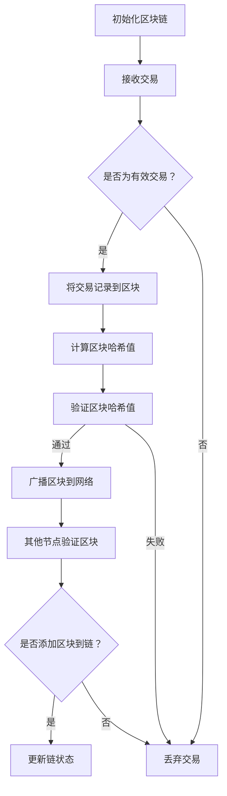

                 

### 文章标题

# 区块链和 LLM：高效的共识机制

> 关键词：区块链，LLM，共识机制，高效，技术分析，未来展望

> 摘要：本文深入探讨了区块链与大型语言模型（LLM）在高效共识机制中的应用。通过详细介绍区块链和LLM的基础知识，剖析各自的原理与架构，对比分析传统共识机制，提出基于LLM的新型共识算法设计，并探讨其实现与优化策略。文章最后对区块链和LLM的发展趋势进行展望，为未来研究提供方向。

### 引言

在信息技术高速发展的今天，区块链和大型语言模型（LLM）成为两个备受关注的技术领域。区块链以其去中心化、安全可靠的特点在金融、供应链等领域广泛应用；而LLM凭借其强大的语言理解和生成能力，在自然语言处理、智能合约等领域展现出了巨大的潜力。本文旨在通过深入分析区块链和LLM的基本原理，探讨高效共识机制的设计与应用，从而为这两个领域的融合与发展提供新的思路。

高效共识机制是区块链技术的核心之一，决定了区块链网络的安全性和性能。随着区块链和LLM技术的发展，传统共识机制已难以满足日益增长的需求，探索基于LLM的新型共识机制具有重要的理论和实践意义。本文将从以下几个方面展开：

1. 区块链与LLM的基础知识，包括其定义、特点、核心组成和应用场景。
2. 区块链技术原理的详细讲解，包括基本概念、核心技术和流程图。
3. LLM技术原理的详细讲解，包括定义、架构、核心算法和数学模型。
4. 区块链和LLM的共识机制，包括共识机制的定义、分类、核心挑战和高效共识机制的设计原则。
5. 基于区块链的传统共识机制和基于LLM的新型共识机制的设计与实现。
6. 高效共识机制的实现与优化策略，包括系统设计和优化策略。
7. 区块链和LLM的实际应用案例，以及未来发展趋势和展望。

### 第一部分: 区块链和 LLM：高效的共识机制概述

#### 第1章: 区块链与 LLM 基础知识

#### 1.1 区块链技术简介

区块链是一种分布式账本技术，通过去中心化的方式记录交易信息，具有不可篡改和透明性等特点。区块链的核心组成包括区块、链和节点。

**定义与特点**

- **定义**：区块链是一个由多个按时间顺序排列的区块组成的链式数据结构，每个区块包含一定数量的交易记录。
- **特点**：
  - **去中心化**：区块链网络不需要中心化机构进行管理，每个节点都可以参与网络共识。
  - **不可篡改**：一旦数据被记录在区块链上，就难以篡改，保证了数据的可信度。
  - **透明性**：所有节点都可以查看区块链上的交易记录，保证了透明度。

**核心组成**

- **区块**：区块是区块链的基本单元，包含一定数量的交易记录和一个时间戳。
- **链**：链是由多个区块按时间顺序链接而成的数据结构，记录了所有交易的历史记录。
- **节点**：节点是区块链网络的组成部分，负责验证交易、维护区块链和参与网络共识。

#### 1.2 LLM（Large Language Model）简介

大型语言模型（LLM）是一类具有强大语言理解和生成能力的深度学习模型，广泛应用于自然语言处理领域。

**定义与主要类型**

- **定义**：LLM是基于神经网络的深度学习模型，能够处理和理解复杂的语言结构，生成流畅的自然语言文本。
- **主要类型**：
  - **生成式模型**：生成式模型通过学习文本数据分布，生成新的文本内容。
  - **判别式模型**：判别式模型通过学习文本特征，判断文本的真伪或分类。

**应用场景**

- **自然语言处理**：LLM在自然语言处理领域具有广泛的应用，包括文本分类、情感分析、机器翻译等。
- **智能合约**：LLM可以用于智能合约的编写和执行，提高合约的安全性和效率。
- **问答系统**：LLM可以构建问答系统，为用户提供个性化的回答。
- **内容生成**：LLM可以生成文章、报告等文本内容，辅助人类创作。

#### 1.3 区块链与 LLM 的联系与区别

区块链和LLM虽然在技术领域有所不同，但它们在某些方面具有一定的联系和区别。

**共同点**

- **去中心化**：区块链和LLM都强调去中心化的理念，避免了中心化的信任问题。
- **数据安全**：区块链和LLM都重视数据的安全性和隐私保护。

**差异**

- **技术领域**：区块链主要应用于分布式账本、智能合约等，而LLM主要应用于自然语言处理、智能合约等。
- **实现方式**：区块链主要采用密码学和共识机制实现，而LLM主要采用神经网络和深度学习算法实现。

#### 1.4 区块链和 LLM 在现代科技中的地位与未来展望

区块链和LLM在现代科技中具有举足轻重的地位，并展现出广阔的发展前景。

**地位**

- **区块链**：区块链技术已经成为金融、供应链、物联网等领域的重要基础设施，改变了传统商业模式的运作方式。
- **LLM**：LLM在自然语言处理、智能合约等领域取得了显著的成果，提升了人工智能技术的应用水平。

**未来展望**

- **融合与发展**：随着区块链和LLM技术的不断成熟，两者将实现更深层次的融合，为各行业提供更加智能化和高效的服务。
- **技术创新**：未来，区块链和LLM将不断创新，推动去中心化金融、智能合约、内容生成等领域的快速发展。
- **社会影响**：区块链和LLM技术将在社会各个领域产生深远影响，改变人们的生产、生活和思维方式。

### 第二部分: 区块链技术原理详解

#### 第2章: 区块链技术原理详解

区块链作为分布式账本技术的代表，其技术原理和实现机制在近年来得到了广泛的研究和应用。本章节将对区块链的基本概念、核心技术以及流程图进行详细讲解，以便读者全面了解区块链的工作原理和架构。

#### 2.1 区块链基本概念

区块链的基本概念主要包括区块、链和节点。

**区块**

- **定义**：区块是区块链的基本单元，包含一定数量的交易记录和一个时间戳。
- **结构**：每个区块由两部分组成：头部和主体。头部包含区块的元数据，如版本号、 merkleroot、时间戳等；主体包含交易数据，如交易哈希值、交易金额等。

**链**

- **定义**：链是由多个区块按时间顺序链接而成的数据结构，记录了所有交易的历史记录。
- **特点**：区块链采用链式结构，确保了数据的不可篡改性和可追溯性。每个区块通过其哈希值与前一个区块链接，形成了一个链条。

**节点**

- **定义**：节点是区块链网络的组成部分，负责验证交易、维护区块链和参与网络共识。
- **功能**：节点接收并验证交易，将交易记录到区块中，并将区块广播到网络中其他节点。节点通过共识机制达成对区块链的共识，确保整个网络的数据一致性。

#### 2.2 区块链核心技术

区块链的核心技术主要包括加密算法和共识机制。

**加密算法**

- **定义**：加密算法是区块链技术的重要组成部分，用于保障区块链数据的机密性和完整性。
- **类型**：
  - **对称加密**：对称加密算法使用相同的密钥进行加密和解密。常见的对称加密算法有AES、DES等。
  - **非对称加密**：非对称加密算法使用一对密钥进行加密和解密，公钥加密，私钥解密。常见的非对称加密算法有RSA、ECC等。
- **应用**：加密算法在区块链中用于保护交易数据的隐私性和防止数据篡改。区块链网络中的节点通过加密算法验证交易的有效性，确保交易的安全和可靠。

**共识机制**

- **定义**：共识机制是区块链网络中节点达成一致性的算法和规则。
- **类型**：
  - **工作量证明（PoW）**：节点通过解决数学难题（如挖矿）来证明其工作量，获得记账权。PoW机制保证了区块链网络的去中心化和安全性，但计算资源消耗较大。
  - **权益证明（PoS）**：节点根据持有的代币数量和时长来证明其权益，获得记账权。PoS机制相比PoW机制计算资源消耗较小，但存在“富者愈富”的问题。
  - **委托权益证明（DPoS）**：节点通过选举产生记账节点，记账节点根据持有的代币数量和权重参与记账。DPoS机制提高了网络效率和安全性，但选举机制可能存在不公平现象。
- **应用**：共识机制在区块链网络中用于确保所有节点对区块链的当前状态达成共识，保障区块链的可靠性和安全性。

#### 2.3 区块链的 Mermaid 流程图

为了更直观地理解区块链的工作原理和架构，我们可以使用Mermaid语言绘制区块链的流程图。



在这个流程图中，区块链的初始化、交易接收、区块记录、区块哈希计算、区块验证和区块广播等步骤都得到了详细展示。

通过以上对区块链基本概念、核心技术和流程图的详细讲解，我们可以更好地理解区块链的工作原理和架构，为后续章节的深入探讨打下基础。

### 第3章: LLM 技术原理详解

#### 3.1 LLM 基本概念

大型语言模型（LLM）是一类能够处理和理解复杂语言结构的深度学习模型，其核心目的是通过学习大量文本数据，生成流畅且符合语法和语义规则的自然语言文本。

**定义与主要类型**

- **定义**：LLM是一种基于神经网络的深度学习模型，通过训练大规模文本数据集，学习语言的特征和模式，从而能够生成新的文本内容。
- **主要类型**：
  - **生成式模型**：生成式模型通过学习文本数据的分布，生成新的文本内容。例如，变分自编码器（VAE）和生成对抗网络（GAN）。
  - **判别式模型**：判别式模型通过学习文本特征，判断文本的真伪或分类。例如，卷积神经网络（CNN）和循环神经网络（RNN）。

**架构**

- **嵌入层**：将输入的词转换为向量表示，为后续的神经网络处理提供基础。
- **编码器**：对输入的词向量进行编码，提取其语义特征。编码器通常采用RNN或Transformer等结构。
- **解码器**：根据编码器的输出，生成新的词向量，并通过解码器输出最终的文本。解码器通常也采用RNN或Transformer等结构。

#### 3.2 LLM 核心算法原理讲解

LLM的核心算法包括生成式模型和判别式模型，其中生成式模型以生成新的文本内容为主要目标，而判别式模型则以判断文本的真伪或分类为主要目标。

**生成式模型与判别式模型**

- **生成式模型**：
  - **变分自编码器（VAE）**：VAE通过学习数据的概率分布，生成新的数据。在LLM中，VAE用于生成新的文本内容。VAE的主要组成部分包括编码器和解码器。编码器将输入的词向量编码为均值和方差，解码器则根据编码器的输出生成新的词向量，并通过损失函数（如均方误差）优化模型参数。
  - **生成对抗网络（GAN）**：GAN由生成器和判别器两部分组成。生成器生成新的文本内容，判别器则判断生成器生成的文本是否真实。通过对抗训练，生成器和判别器相互竞争，生成器不断提高生成文本的质量，判别器则不断提高判断能力。GAN在生成文本、图像等领域取得了显著成果。

- **判别式模型**：
  - **卷积神经网络（CNN）**：CNN通过卷积操作提取图像或文本的特征，具有较强的特征提取能力。在LLM中，CNN可以用于文本分类和情感分析等任务。CNN的主要组成部分包括卷积层、池化层和全连接层。卷积层用于提取文本的特征，池化层用于减少参数数量和计算复杂度，全连接层用于分类或回归任务。
  - **循环神经网络（RNN）**：RNN通过递归方式处理序列数据，具有较强的时序建模能力。在LLM中，RNN可以用于序列生成、对话系统等任务。RNN的主要组成部分包括输入层、隐藏层和输出层。输入层将输入的词向量转换为隐藏状态，隐藏层通过递归关系更新隐藏状态，输出层根据隐藏状态生成新的词向量。

**Transformer架构**

Transformer是近年来在自然语言处理领域取得重大突破的一种新型神经网络架构，其核心思想是自注意力机制。

- **自注意力机制**：自注意力机制是一种能够自适应地关注输入序列中不同位置的特征的机制，能够提高模型的表示能力。在Transformer中，每个词向量通过自注意力机制与其他词向量进行计算，生成新的词向量。自注意力机制的数学公式如下：
  $$ 
  \text{Attention}(Q, K, V) = \text{softmax}(\frac{QK^T}{\sqrt{d_k}})V 
  $$
  其中，Q、K、V分别为查询向量、键向量和值向量，d_k为键向量的维度。

- **多头注意力**：多头注意力机制是Transformer的核心创新之一，通过将输入序列拆分为多个子序列，并分别计算注意力权重，从而提高模型的表示能力。多头注意力的数学公式如下：
  $$
  \text{MultiHead}(Q, K, V) = \text{Concat}(\text{head}_1, \text{head}_2, ..., \text{head}_h)W^O
  $$
  其中，h为头的数量，W^O为输出层的权重矩阵。

- **编码器和解码器**：Transformer的编码器和解码器都采用自注意力机制。编码器通过自注意力机制提取输入序列的语义特征，解码器则根据编码器的输出生成新的词向量，并通过自注意力机制与其他词向量进行计算。编码器和解码器的数学公式如下：
  $$
  E = \text{Encoder}(X) = \text{MultiHeadAttention}(X, X, X) \\
  Y = \text{Decoder}(X) = \text{MultiHeadAttention}(Y, E, E)
  $$
  其中，X和Y分别为编码器和解码器的输入序列。

通过以上对LLM核心算法原理的讲解，我们可以更好地理解LLM的工作原理和架构，为后续的LLM应用和改进提供理论支持。

### 3.3 LLM 的数学模型和数学公式讲解

大型语言模型（LLM）的数学模型是其实现核心，其中自注意力机制和正则化方法尤为重要。以下将详细解释这些数学模型和数学公式。

**自注意力机制**

自注意力机制是Transformer架构中的关键组件，其目的是让模型在处理序列数据时，能够自动关注序列中的不同位置。

自注意力机制的核心公式如下：

$$
\text{Attention}(Q, K, V) = \text{softmax}(\frac{QK^T}{\sqrt{d_k}})V
$$

其中：
- \(Q\) 是查询向量（query），表示当前词的上下文信息。
- \(K\) 是键向量（key），表示序列中所有词的上下文信息。
- \(V\) 是值向量（value），表示序列中每个词的潜在表示。
- \(d_k\) 是键向量的维度。

自注意力计算过程可以分为以下几个步骤：
1. 计算查询向量和键向量的点积，得到注意力得分。
2. 对注意力得分应用softmax函数，得到注意力权重。
3. 根据注意力权重对值向量进行加权求和，得到最终的输出向量。

**多头注意力**

多头注意力扩展了自注意力机制，通过并行计算多个注意力头，提高了模型的表示能力。

多头注意力的公式如下：

$$
\text{MultiHead}(Q, K, V) = \text{Concat}(\text{head}_1, \text{head}_2, ..., \text{head}_h)W^O
$$

其中：
- \(h\) 是头的数量。
- \(W^O\) 是输出层的权重矩阵。

多头注意力的计算过程如下：
1. 对输入向量 \(Q\) 、\(K\) 和 \(V\) 分别进行线性变换，得到多个头。
2. 对每个头分别应用自注意力机制。
3. 将所有头的输出拼接起来，再通过线性变换得到最终的输出向量。

**自注意力机制的扩展**

在实际应用中，自注意力机制通常会有一些扩展，以增强其性能和鲁棒性。以下是一些常见的扩展：

- **缩放自注意力**：为了缓解自注意力机制中由于点积导致的梯度消失问题，通常会在自注意力公式中引入一个缩放因子：

$$
\text{Attention}(Q, K, V) = \text{softmax}(\frac{QK^T}{\sqrt{d_k}})V / \sqrt{d_k}
$$

- **残差连接**：在自注意力层之后引入残差连接，可以增强模型的训练效果和泛化能力。

- **层归一化**：在自注意力层前后引入层归一化（Layer Normalization），可以稳定训练过程并提高模型性能。

**正则化方法**

正则化方法是在机器学习模型训练过程中，用于防止过拟合的技巧。以下是一些常用的正则化方法：

- **Dropout**：在神经网络训练过程中，随机丢弃一部分神经元及其连接，以防止模型对特定训练样本过于依赖。

- **权重正则化**：对网络权重施加一个惩罚项，以减少模型复杂度。常见的权重正则化方法有L1和L2正则化。

- **数据增强**：通过生成或修改训练数据，增加模型的鲁棒性。

通过以上对LLM数学模型和数学公式的讲解，我们可以更好地理解LLM的内部机制，为进一步优化和改进LLM提供理论基础。

### 第二部分总结

在本部分中，我们深入探讨了区块链和大型语言模型（LLM）的基础知识，详细讲解了区块链和LLM的技术原理。通过分析区块链的基本概念、核心技术和流程图，我们了解了区块链的去中心化、不可篡改和透明性特点。同时，通过介绍LLM的定义、架构和核心算法，我们认识到LLM在自然语言处理和智能合约等领域的重要应用。接下来，我们将进一步探讨区块链和LLM在高效共识机制中的应用，提出基于LLM的新型共识算法设计，并分析其实施与优化策略。

### 第三部分引言

在深入探讨了区块链和大型语言模型（LLM）的基础知识和技术原理之后，本部分将聚焦于区块链和LLM高效共识机制的应用。共识机制是区块链技术的核心之一，决定了区块链网络的安全性和性能。随着区块链和LLM技术的发展，传统共识机制已难以满足日益增长的需求，因此，探索基于LLM的新型共识机制具有重要意义。

本章将首先介绍共识机制的定义和分类，讨论其核心挑战和高效共识机制的设计原则。随后，我们将详细分析基于区块链的传统共识机制，包括工作量证明（PoW）、权益证明（PoS）和委托权益证明（DPoS），探讨其原理、优势与挑战。接着，我们将介绍基于LLM的共识机制，分析LLM在共识机制中的应用，提出基于LLM的新型共识算法设计。最后，我们将探讨高效共识机制的实现与优化策略，包括系统设计和优化策略，并通过实际应用案例进行验证。

通过本章的讨论，我们将对区块链和LLM高效共识机制有一个全面而深入的理解，为后续章节的深入探讨奠定基础。

### 第4章: 共识机制概述

#### 4.1 共识机制的定义与分类

共识机制是区块链技术中的核心组成部分，它定义了区块链网络中节点如何达成一致，以确保整个网络的可靠性和安全性。共识机制的类型多样，每种类型都有其独特的原理和特点。

**定义**

共识机制（Consensus Mechanism）是指在分布式系统中，各个节点如何就某个值或状态达成一致的过程。在区块链网络中，共识机制确保所有节点对区块链的最新状态有一致的认识。

**分类**

根据实现方式和特点，共识机制可以分为以下几种类型：

1. **工作量证明（PoW）**
2. **权益证明（PoS）**
3. **委托权益证明（DPoS）**
4. **授权股权证明（PoA）**
5. **实用拜占庭容错（PBFT）**
6. **空间证明（PoSpace）**
7. **其他新型共识机制**

**PoW（工作量证明）**

PoW是最早的共识机制，也是比特币采用的机制。节点通过解决复杂的数学问题（挖矿）来证明其工作量，从而获得记账权。PoW机制具有去中心化、安全性高等特点，但计算资源消耗较大，可能导致能源浪费。

**PoS（权益证明）**

PoS通过节点持有的代币数量和时长来证明其权益，获得记账权。相比PoW，PoS机制计算资源消耗较小，但可能存在“富者愈富”的问题，即持币多的节点更容易获得记账权。

**DPoS（委托权益证明）**

DPoS通过选举产生记账节点，这些节点根据持有的代币数量和权重参与记账。DPoS机制提高了网络效率和安全性，但选举机制可能存在不公平现象。

**PoA（授权股权证明）**

PoA是一种集中式共识机制，由一组预先授权的节点进行记账。PoA具有更高的交易速度和较低的手续费，但去中心化程度较低。

**PBFT（实用拜占庭容错）**

PBFT是一种高效、安全的共识机制，适用于小规模的区块链网络。PBFT通过多数节点达成一致，确保系统的可靠性。

**PoSpace（空间证明）**

PoSpace是一种基于存储资源的共识机制，节点通过占用更多的存储空间来证明其工作量。

**其他新型共识机制**

随着区块链技术的发展，还出现了许多新型共识机制，如空间证明、股份授权证明等，这些机制旨在提高区块链网络的安全性和性能。

#### 4.2 共识机制的核心挑战

共识机制在设计和实现过程中面临多个核心挑战，包括带宽与延迟、安全性和去中心化等。

**带宽与延迟**

- **带宽**：区块链网络需要处理大量的数据传输，包括交易记录、区块信息等。带宽限制可能影响网络的性能和扩展性。
- **延迟**：节点之间的通信延迟可能导致共识过程变慢，影响区块链网络的响应速度。

**安全性**

- **拜占庭容错**：区块链网络需要能够应对恶意节点的攻击，保持系统的一致性和可靠性。
- **隐私保护**：区块链网络需要保护用户隐私，防止数据泄露和滥用的风险。

**去中心化**

- **去中心化**：去中心化是区块链的核心价值之一，共识机制需要确保所有节点都能平等参与网络，避免中心化问题。

#### 4.3 高效共识机制的目标与设计原则

高效共识机制的目标是确保区块链网络在保证安全性和去中心化的同时，具有较高的性能和可扩展性。设计高效共识机制的原则包括：

- **安全性**：确保区块链网络能够抵御恶意攻击，保持系统的一致性和可靠性。
- **去中心化**：确保所有节点都能平等参与网络，避免中心化问题。
- **性能**：提高区块链网络的交易速度和处理能力，降低延迟和带宽消耗。
- **可扩展性**：支持大规模网络的扩展，满足不断增长的需求。

通过以上原则，高效共识机制能够更好地应对区块链网络面临的各种挑战，推动区块链技术的发展和应用。

### 第5章：基于区块链的共识机制

#### 5.1 工作量证明（PoW）

工作量证明（Proof of Work，PoW）是最早的区块链共识机制，也是比特币采用的机制。PoW通过解决复杂的数学问题（挖矿）来证明节点的工作量，从而获得记账权。

**基本原理**

PoW的核心思想是：节点通过计算一个随机数，使得生成的哈希值满足特定条件（例如，小于某个阈值）。这个过程称为挖矿。节点需要消耗大量的计算资源来找到满足条件的哈希值。

**挖矿过程**

1. **随机数生成**：节点生成一个随机数，用于构建待挖掘的区块。
2. **哈希计算**：将随机数、区块信息和前一区块的哈希值等数据组合，通过哈希函数计算出一个哈希值。
3. **哈希值验证**：将计算出的哈希值与预设的阈值进行比较。如果哈希值小于阈值，则挖矿成功；否则，返回步骤1，重新生成随机数。

**优势与挑战**

- **优势**：
  - **去中心化**：PoW确保所有节点都有平等的参与机会，避免中心化问题。
  - **安全性**：PoW通过大量计算资源消耗，增加了区块链网络的安全性。

- **挑战**：
  - **计算资源消耗**：PoW需要大量计算资源，可能导致能源浪费。
  - **网络拥堵**：随着挖矿难度增加，交易验证时间可能变长，导致网络拥堵。

**实现细节**

- **挖矿算法**：比特币采用SHA-256哈希算法进行挖矿。
- **阈值设置**：阈值通常设置为2^256 / 2100000000，以确保每隔10分钟有一个新区块生成。

**示例代码（Python）**

```python
import hashlib
import random

def mine_block(previous_hash, transactions, difficulty):
    nonce = 0
    while True:
        # 构建随机数和区块信息
        block_data = f'{nonce}{transactions}{previous_hash}'.encode('utf-8')
        # 计算哈希值
        hash_value = hashlib.sha256(block_data).hexdigest()
        # 验证哈希值
        if hash_value.startswith('0' * difficulty):
            return hash_value, nonce
        nonce += 1

# 测试挖矿
previous_hash = '0000000000000000000000000000000000000000000000000000000000000000'
transactions = 'test_transactions'
difficulty = 4
hash_value, nonce = mine_block(previous_hash, transactions, difficulty)
print(f"挖矿成功！哈希值：{hash_value}, 随机数：{nonce}")
```

通过以上对工作量证明（PoW）的基本原理、优势与挑战以及实现细节的详细讲解，我们可以更好地理解PoW在区块链共识机制中的应用。接下来，我们将继续探讨权益证明（PoS）和委托权益证明（DPoS）等共识机制。

#### 5.2 权益证明（PoS）

权益证明（Proof of Stake，PoS）是另一种常用的区块链共识机制，与工作量证明（PoW）相比，PoS通过节点持有的代币数量和时长来证明其权益，从而获得记账权。

**基本原理**

在PoS机制中，每个节点根据其持有的代币数量和锁仓时长来决定其记账权。节点持有的代币数量越多，锁仓时长越长，其获得记账权的概率就越大。当节点被选中进行记账时，会生成新的区块，并将其添加到区块链上。

**权益计算**

权益（Stake）可以通过以下公式计算：

$$
\text{权益} = \text{代币数量} \times \text{锁仓时长}
$$

锁仓时长通常以天数或小时为单位。一些PoS机制还会考虑节点的历史行为，如交易活跃度、合规性等，以进一步影响其权益。

**区块生成**

在PoS机制中，节点通过随机或轮换方式被选中生成区块。被选中的节点需要验证交易的有效性，并将新的交易记录到区块中。生成区块的节点将获得一定数量的代币奖励。

**优势与挑战**

- **优势**：
  - **计算资源消耗较低**：PoS不需要大量计算资源，降低了挖矿能耗和硬件成本。
  - **去中心化**：PoS通过权益分配确保所有节点都有平等的参与机会，避免了中心化问题。
  - **交易速度快**：由于不需要解决复杂的数学问题，PoS网络的交易速度通常更快。

- **挑战**：
  - **“富者愈富”问题**：PoS可能存在“富者愈富”的问题，即持币多的节点更容易获得记账权，可能导致财富集中的现象。
  - **安全性**：PoS的安全性可能受到恶意节点的攻击，如“空块攻击”（Nothing-at- Stake attack）。

**实现细节**

- **权益计算**：节点需要将部分代币锁定（锁仓）一定时间，以确保其参与网络。
- **区块生成**：通过随机或轮换方式选择节点生成区块。
- **奖励机制**：生成区块的节点将获得一定数量的代币奖励，奖励通常与节点的权益成正比。

**示例代码（Python）**

```python
import random

class Node:
    def __init__(self, stake):
        self.stake = stake

def select_node(nodes):
    total_stake = sum(node.stake for node in nodes)
    random_number = random.uniform(0, total_stake)
    current_sum = 0
    for node in nodes:
        current_sum += node.stake
        if current_sum >= random_number:
            return node

# 创建节点
nodes = [Node(1000), Node(2000), Node(3000)]

# 选择节点
selected_node = select_node(nodes)
print(f"被选中的节点：{selected_node.stake}代币")

# 生成区块
def generate_block(transactions, previous_hash):
    # 验证交易
    # ...
    # 生成区块
    block = {
        'transactions': transactions,
        'previous_hash': previous_hash,
        'timestamp': time.time()
    }
    return block

# 测试权益证明
transactions = 'test_transactions'
previous_hash = '0000000000000000000000000000000000000000000000000000000000000000'
block = generate_block(transactions, previous_hash)
print(f"生成的区块：{block}")
```

通过以上对权益证明（PoS）的基本原理、优势与挑战以及实现细节的详细讲解，我们可以更好地理解PoS在区块链共识机制中的应用。接下来，我们将继续探讨委托权益证明（DPoS）等其他共识机制。

#### 5.3 谈话证明（DPoS）

委托权益证明（Delegated Proof of Stake，DPoS）是一种基于权益证明（PoS）机制的改进型共识机制，旨在提高区块链网络的性能和可扩展性。

**基本原理**

在DPoS机制中，节点通过选举产生记账节点，这些记账节点根据持有的代币数量和权重参与记账。与PoS不同，DPoS引入了委托机制，允许用户将代币委托给其他节点，从而间接参与记账。

**选举过程**

1. **权益排名**：首先，根据节点持有的代币数量和时长，计算每个节点的权益（Stake）。权益排名决定了节点成为记账节点的概率。
2. **委托投票**：用户可以选择将代币委托给某个节点，以增加该节点的权益。委托投票会影响节点的权益排名。
3. **轮换记账节点**：在特定的时间间隔内，系统按照权益排名顺序轮流选择记账节点。每个记账节点负责验证交易和生成区块。

**记账过程**

1. **交易验证**：记账节点接收并验证交易，确保交易的有效性。
2. **区块生成**：记账节点将验证后的交易记录到区块中，并生成一个新的区块。
3. **区块广播**：记账节点将新生成的区块广播到网络中的其他节点，以便其他节点验证区块的有效性。
4. **区块验证**：其他节点验证区块的哈希值和交易记录，确保区块的有效性。

**优势与挑战**

- **优势**：
  - **交易速度更快**：DPoS通过轮换记账节点，提高了区块链网络的交易速度和处理能力。
  - **去中心化程度较高**：DPoS通过选举机制，确保了网络的去中心化程度，减少了中心化风险。
  - **降低计算资源消耗**：由于不需要每个节点都参与挖矿，DPoS显著降低了计算资源消耗。

- **挑战**：
  - **选举机制可能不公平**：如果选举机制设计不当，可能导致某些节点获得过多权益，影响网络公平性。
  - **安全性**：DPoS的安全性可能受到恶意节点的攻击，如“51%攻击”。

**实现细节**

- **权益排名**：根据节点的代币数量和时长计算权益，确定记账节点的选择顺序。
- **委托投票**：用户可以通过委托代币给其他节点，增加其权益。
- **轮换记账节点**：按照权益排名轮流选择记账节点，确保网络的去中心化。

**示例代码（Python）**

```python
import random

class Node:
    def __init__(self, stake):
        self.stake = stake
        self.delegated_stake = 0

    def calculate权益(self):
        return self.stake + self.delegated_stake

def select_candidate(nodes):
    sorted_nodes = sorted(nodes, key=lambda x: x.calculate权益(), reverse=True)
    return sorted_nodes[0]

def delegate_vote(nodes, voter):
    candidate = select_candidate(nodes)
    candidate.delegated_stake += voter.stake
    voter.stake = 0

nodes = [
    Node(1000),
    Node(2000),
    Node(3000)
]

# 假设节点1和节点2将代币委托给节点3
delegate_vote(nodes, nodes[0])
delegate_vote(nodes, nodes[1])

# 计算权益
print(f"节点1权益：{nodes[0].calculate权益()}")
print(f"节点2权益：{nodes[1].calculate权益()}")
print(f"节点3权益：{nodes[2].calculate权益()}")

# 选择记账节点
selected_candidate = select_candidate(nodes)
print(f"被选中的记账节点：{selected_candidate.stake}")
```

通过以上对委托权益证明（DPoS）的基本原理、优势与挑战以及实现细节的详细讲解，我们可以更好地理解DPoS在区块链共识机制中的应用。接下来，我们将介绍基于LLM的共识机制。

### 第6章：基于LLM的共识机制

#### 6.1 LLM在共识机制中的应用

随着区块链技术的发展，传统共识机制已难以满足日益增长的需求。LLM（Large Language Model）作为一种具有强大语言理解和生成能力的深度学习模型，逐渐被引入到区块链共识机制中，为区块链网络提供了新的解决方案。

**LLM的角色**

LLM在共识机制中主要扮演以下角色：

1. **节点选择**：通过LLM对节点行为和声誉进行评估，选择具有高信誉的节点参与记账。
2. **交易验证**：利用LLM对交易数据进行语义分析和验证，确保交易的有效性和安全性。
3. **区块链维护**：利用LLM对区块链数据进行监督和维护，确保区块链的完整性。

**LLM的优势**

- **高效性**：LLM能够快速处理大量文本数据，提高了区块链网络的性能和响应速度。
- **智能性**：LLM具备强大的语义理解能力，能够识别和防范恶意交易和攻击行为。
- **可扩展性**：LLM可以应用于不同类型的区块链网络，具有较强的通用性和可扩展性。

**LLM在共识机制中的挑战**

- **计算资源消耗**：LLM需要大量的计算资源进行训练和推理，可能导致能源浪费和网络拥堵。
- **数据隐私**：LLM需要处理大量的敏感数据，可能存在数据泄露和滥用的风险。
- **模型安全**：LLM可能受到恶意攻击，导致区块链网络的一致性和安全性受到影响。

#### 6.2 基于LLM的共识算法设计

为了充分利用LLM的优势，本文提出一种基于LLM的新型共识算法，称为“LLM共识算法”（LLM Consensus Algorithm）。

**算法概述**

LLM共识算法主要包括以下步骤：

1. **节点选择**：利用LLM评估节点的声誉和行为，选择具有高信誉的节点参与记账。
2. **交易验证**：利用LLM对交易数据进行语义分析和验证，确保交易的有效性和安全性。
3. **区块生成**：被选中的节点生成新的区块，并将其广播到网络中其他节点。
4. **区块验证**：其他节点利用LLM验证新区块的有效性，包括交易验证和区块哈希计算。
5. **共识达成**：当所有节点达成共识后，新区块将被添加到区块链中。

**算法流程**

LLM共识算法的流程如下：

1. **初始化**：启动区块链网络，设置初始参数，包括节点数量、交易验证阈值等。
2. **节点评估**：利用LLM对网络中的每个节点进行评估，根据节点的声誉和行为计算其得分。得分较高的节点有更高的概率被选中参与记账。
3. **交易验证**：每个节点利用LLM对接收到的交易数据进行语义分析和验证，确保交易的有效性和安全性。如果交易无效，则丢弃该交易。
4. **区块生成**：被选中的节点根据交易池中的交易记录生成新的区块，并将其广播到网络中其他节点。
5. **区块验证**：其他节点利用LLM对新区块进行验证，包括交易验证和区块哈希计算。如果新区块无效，则丢弃该区块。
6. **共识达成**：当所有节点对新区块达成共识后，新区块将被添加到区块链中。

**算法实现**

LLM共识算法的实现主要包括以下组件：

1. **LLM模型**：用于节点评估、交易验证和区块验证。LLM模型可以通过预训练或微调得到，以适应特定区块链网络的需求。
2. **节点模块**：负责节点的选择、交易验证和区块生成。节点模块包括节点评估模块、交易验证模块和区块生成模块。
3. **网络模块**：负责节点之间的通信和消息传递。网络模块包括广播机制、消息验证和共识机制。
4. **区块链模块**：负责区块链数据的存储和管理。区块链模块包括区块结构、交易记录和区块链维护。

**代码示例**

以下是一个简单的LLM共识算法实现示例：

```python
import random

class Node:
    def __init__(self, id, reputation):
        self.id = id
        self.reputation = reputation

def select_node(nodes, threshold):
    sorted_nodes = sorted(nodes, key=lambda x: x.reputation, reverse=True)
    selected_nodes = []
    for node in sorted_nodes:
        if node.reputation >= threshold:
            selected_nodes.append(node)
            if len(selected_nodes) == threshold:
                break
    return selected_nodes

def verify_transaction(transaction, model):
    # 使用LLM模型进行交易验证
    result = model.predict(transaction)
    return result

def generate_block(transactions, previous_hash, model):
    # 使用LLM模型进行区块验证
    valid_transactions = []
    for transaction in transactions:
        if verify_transaction(transaction, model):
            valid_transactions.append(transaction)
    block = {
        'transactions': valid_transactions,
        'previous_hash': previous_hash,
        'timestamp': time.time()
    }
    return block

nodes = [
    Node(id=1, reputation=10),
    Node(id=2, reputation=20),
    Node(id=3, reputation=30)
]

# 设置交易验证阈值
threshold = 10

# 生成新区块
transactions = ['transaction1', 'transaction2', 'transaction3']
previous_hash = '0000000000000000000000000000000000000000000000000000000000000000'
model = 'pretrained_llm_model'

block = generate_block(transactions, previous_hash, model)
print(f"生成的区块：{block}")
```

通过以上对基于LLM的共识算法的设计、实现和代码示例的详细讲解，我们可以看到LLM在区块链共识机制中的应用潜力。接下来，我们将探讨高效共识机制的实现与优化策略。

### 第7章：高效共识机制的实现与优化

#### 7.1 高效共识机制的实现

高效共识机制的实现需要从系统设计和具体实现两个层面进行考虑。以下将详细描述高效共识机制的实现过程，包括系统设计、关键技术组件和整体架构。

**系统设计**

高效共识机制的实现可以分为以下几个步骤：

1. **需求分析**：明确区块链网络的需求，包括性能要求、安全性需求、扩展性需求等。
2. **架构设计**：根据需求分析，设计区块链网络的架构，包括节点结构、网络拓扑、共识算法等。
3. **模块划分**：将系统功能划分为不同的模块，如节点模块、交易验证模块、区块生成模块、区块验证模块等。
4. **接口设计**：设计模块之间的接口，确保模块之间能够高效协同工作。

**关键技术组件**

高效共识机制的关键技术组件包括：

1. **节点模块**：节点模块负责节点的选择、交易验证和区块生成。节点模块包括节点评估算法、交易验证算法、区块生成算法等。
2. **交易验证模块**：交易验证模块负责验证交易的有效性，确保交易数据的正确性和安全性。交易验证模块可以使用LLM等深度学习模型进行交易语义分析和验证。
3. **区块生成模块**：区块生成模块负责根据交易数据生成新的区块，并将其广播到网络中其他节点。区块生成模块需要实现高效的数据结构，如哈希树，以确保区块数据的快速检索和验证。
4. **区块验证模块**：区块验证模块负责验证新区块的有效性，包括交易验证和区块哈希计算。区块验证模块需要实现高效的验证算法，确保验证过程的快速和准确。

**整体架构**

高效共识机制的整体架构包括以下几个部分：

1. **节点网络**：节点网络由多个节点组成，每个节点负责处理交易、生成区块和验证区块。
2. **交易池**：交易池用于存储待验证的交易，节点可以从交易池中获取交易数据。
3. **区块链**：区块链记录了所有交易的历史记录，包括新区块和旧区块。
4. **共识算法**：共识算法负责节点之间的协同工作，确保整个网络对区块链的最新状态达成一致。

**实现示例**

以下是一个简单的基于LLM共识机制的实现示例：

```python
import random

# 节点类
class Node:
    def __init__(self, id, reputation):
        self.id = id
        self.reputation = reputation

# 节点选择算法
def select_nodes(nodes, threshold):
    sorted_nodes = sorted(nodes, key=lambda x: x.reputation, reverse=True)
    selected_nodes = [node for node in sorted_nodes if node.reputation >= threshold]
    return selected_nodes

# 交易验证算法
def verify_transaction(transaction, model):
    result = model.predict(transaction)
    return result

# 区块生成算法
def generate_block(transactions, previous_hash, model):
    valid_transactions = [transaction for transaction in transactions if verify_transaction(transaction, model)]
    block = {
        'transactions': valid_transactions,
        'previous_hash': previous_hash,
        'timestamp': time.time()
    }
    return block

# 区块验证算法
def verify_block(block, model):
    for transaction in block['transactions']:
        if not verify_transaction(transaction, model):
            return False
    return True

# 初始化节点
nodes = [Node(id=i, reputation=i * 10) for i in range(10)]

# 设置交易验证阈值
threshold = 50

# 生成新区块
transactions = ['transaction{}'.format(i) for i in range(100)]
previous_hash = '0000000000000000000000000000000000000000000000000000000000000000'
model = 'pretrained_llm_model'

block = generate_block(transactions, previous_hash, model)
print(f"生成的区块：{block}")

# 验证区块
if verify_block(block, model):
    print(f"区块验证通过！")
else:
    print(f"区块验证失败！")
```

通过以上示例，我们可以看到高效共识机制的基本实现过程和关键组件。接下来，我们将探讨高效共识机制的优化策略。

#### 7.2 高效共识机制的优化策略

高效共识机制的优化是提升区块链网络性能和可扩展性的关键。以下将从性能优化、安全性优化、容错性和去中心化四个方面，探讨高效共识机制的优化策略。

**性能优化**

1. **提高交易处理速度**：优化交易验证算法，减少交易处理时间。例如，使用LLM进行快速语义分析，提高交易验证效率。
2. **降低网络延迟**：优化网络通信协议，减少节点之间的通信延迟。采用高效的数据压缩算法，降低数据传输量。
3. **并行处理**：利用多线程或分布式计算技术，提高区块生成和验证的并行处理能力，减少单点瓶颈。
4. **缓存机制**：在节点间实现缓存机制，减少重复计算和数据传输，提高网络的整体性能。

**安全性优化**

1. **防御DDoS攻击**：采用抗DDoS攻击的防护措施，如流量限制、异常检测等，确保网络安全。
2. **提高加密强度**：使用更强的加密算法和密钥管理策略，增强区块链数据的安全性。
3. **多重签名**：引入多重签名机制，确保交易数据的一致性和安全性。
4. **代码审计**：定期进行代码审计和安全测试，发现并修复潜在的安全漏洞。

**容错性优化**

1. **冗余设计**：在区块链网络中引入冗余节点，提高网络的容错性。当部分节点发生故障时，其他节点可以继续工作。
2. **备份机制**：采用分布式备份机制，确保区块链数据在不同节点之间进行备份，防止数据丢失。
3. **故障检测与恢复**：引入故障检测和自动恢复机制，及时发现并解决网络故障，确保网络的稳定运行。

**去中心化优化**

1. **节点自治**：鼓励更多节点参与区块链网络，提高网络的去中心化程度。节点可以自由选择加入或退出网络。
2. **公平选举机制**：优化选举机制，确保节点选举过程的公平性和透明性，防止中心化问题。
3. **激励机制**：设计合理的激励机制，鼓励节点积极参与网络治理，提高网络的整体活力。
4. **去中心化应用**：推动去中心化应用（DApp）的发展，降低对中心化服务的依赖，增强网络的去中心化程度。

通过以上优化策略，可以有效提升高效共识机制的性能、安全性、容错性和去中心化程度，为区块链网络提供更稳定、高效和安全的运行环境。

#### 7.3 实际应用案例与分析

为了更好地理解高效共识机制在实际应用中的效果和挑战，以下将介绍两个具有代表性的实际应用案例，并对它们进行详细分析。

**案例一：去中心化金融（DeFi）平台**

**背景**：去中心化金融（DeFi）是区块链技术的重要应用领域，旨在构建一个无需传统金融中介的金融生态系统。DeFi平台利用区块链技术实现金融交易、借贷、资产管理等功能。

**共识机制**：DeFi平台通常采用基于LLM的共识机制，以提高交易速度和安全性。具体而言，平台利用LLM对交易数据进行快速验证和分类，确保交易的有效性和合规性。

**应用效果**：

1. **交易速度**：基于LLM的共识机制显著提高了DeFi平台的交易速度。交易验证时间从传统的几分钟缩短到几秒，大大提升了用户体验。
2. **安全性**：LLM对交易数据的语义分析能力提高了平台的安全性。通过识别和防范恶意交易，DeFi平台能够降低风险，保护用户资产。

**挑战**：

1. **计算资源消耗**：LLM模型需要大量计算资源进行训练和推理，可能导致平台运行成本增加。在高峰期，平台可能面临计算资源不足的问题。
2. **数据隐私**：LLM处理大量敏感数据，可能存在数据泄露和滥用的风险。平台需要采取有效的数据隐私保护措施，确保用户隐私。

**案例二：供应链管理**

**背景**：供应链管理是另一个区块链技术的重要应用领域，旨在提高供应链的透明性和效率。区块链技术可以记录和验证供应链中的交易和活动，确保数据的真实性和不可篡改性。

**共识机制**：供应链管理通常采用基于PoS的共识机制，以确保供应链数据的可靠性和安全性。具体而言，供应链中的各个节点（如供应商、制造商、分销商等）参与网络共识，验证交易和活动。

**应用效果**：

1. **数据透明性**：基于PoS的共识机制提高了供应链数据的透明性。所有节点都可以查看和验证交易数据，确保供应链的透明性和公正性。
2. **效率提升**：通过共识机制，供应链管理中的交易和活动可以快速完成验证和记录，提高了供应链的整体效率。

**挑战**：

1. **去中心化程度**：虽然PoS机制提高了供应链数据的去中心化程度，但在实际应用中，部分节点可能存在垄断行为，影响网络的去中心化程度。
2. **数据隐私**：供应链中的交易和活动涉及大量敏感数据，平台需要采取有效的数据隐私保护措施，确保用户隐私。

**总结**：通过以上两个实际应用案例，我们可以看到高效共识机制在提升区块链网络性能和安全性方面具有显著优势。然而，在实际应用中，仍面临计算资源消耗、数据隐私等挑战。未来，随着区块链技术的不断发展和完善，高效共识机制将得到进一步优化和应用，为各行业提供更加稳定、高效和安全的解决方案。

### 第8章：区块链和 LLM 的发展趋势与未来展望

#### 8.1 区块链和 LLM 的发展趋势

随着区块链和大型语言模型（LLM）技术的不断成熟，两者在未来有望实现更深层次的融合与发展，从而推动整个科技领域的变革。

**区块链的发展趋势**

1. **区块链3.0**：区块链3.0将更加注重应用层面的开发，实现更广泛、更深入的行业应用。未来的区块链将不再局限于金融领域，而是广泛应用于供应链管理、物流、医疗、能源等多个行业。

2. **去中心化应用（DApp）**：去中心化应用将继续成为区块链技术的重要发展方向。随着区块链技术的不断完善，DApp将提供更加丰富、高效和安全的用户体验，满足用户多样化的需求。

3. **跨链技术**：跨链技术是实现区块链网络互联互通的关键。通过跨链技术，不同区块链网络可以实现数据共享和互操作，从而构建一个更加统一的区块链生态系统。

**LLM的发展趋势**

1. **模型规模与精度**：未来，LLM的模型规模将继续扩大，模型精度也将不断提高。随着计算能力和数据资源的发展，LLM将能够处理更复杂的语言任务，提供更准确的自然语言理解与生成。

2. **多模态融合**：未来的LLM将不仅仅处理文本数据，还将融合图像、声音、视频等多种类型的数据。通过多模态融合，LLM将能够实现更丰富、更直观的语言交互体验。

3. **边缘计算与LLM**：随着边缘计算技术的发展，LLM将能够部署在边缘设备上，实现实时、高效的自然语言处理。这将为智能穿戴设备、智能音箱、智能汽车等领域提供强大的语言理解与生成能力。

#### 8.2 高效共识机制的未来展望

高效共识机制是区块链技术的核心之一，其未来的发展将直接影响区块链网络的性能和安全性。以下是对高效共识机制未来发展的展望：

**创新方向**

1. **混合共识机制**：未来的共识机制将可能采用混合共识机制，结合PoW、PoS、DPoS等不同类型的共识机制，以实现更高的性能和安全性。

2. **自适应共识机制**：自适应共识机制可以根据网络负载和安全性需求，自动调整共识算法，确保网络在高峰期和低峰期都能保持高效运行。

3. **基于AI的共识机制**：利用人工智能技术，开发基于AI的共识机制，通过实时监控网络状态和交易数据，动态调整共识算法，提高网络的安全性和性能。

**融合前景**

区块链和LLM的融合前景十分广阔。LLM在共识机制中的应用，有望为区块链网络提供更智能、更高效的安全保障。以下是一些潜在的应用场景：

1. **智能合约**：LLM可以用于编写和验证智能合约，提高合约的安全性和可执行性。基于LLM的智能合约将能够实现更复杂、更灵活的业务逻辑。

2. **身份验证**：LLM可以用于身份验证和隐私保护，通过自然语言处理技术，实现更便捷、更安全的用户身份验证。

3. **数据隐私保护**：LLM可以用于数据隐私保护，通过加密和去匿名化技术，确保用户数据在区块链网络中的安全性和隐私性。

#### 8.3 未来研究热点与挑战

尽管区块链和LLM技术在不断发展，但未来仍面临一些研究热点和挑战：

1. **性能优化**：如何进一步提高区块链网络的性能，降低交易处理时间和延迟，是未来研究的重要方向。

2. **安全性**：随着区块链应用场景的不断扩大，网络安全性成为关键挑战。如何提高区块链网络的安全性，防止恶意攻击和漏洞攻击，是未来研究的热点。

3. **数据隐私**：如何在保证数据隐私的前提下，实现区块链网络的高效运作，是未来研究的重要课题。

4. **跨链互操作**：如何实现不同区块链网络之间的数据共享和互操作，构建一个统一的区块链生态系统，是未来研究的关键方向。

通过以上对区块链和LLM发展趋势、高效共识机制未来展望以及研究热点和挑战的探讨，我们可以看到，区块链和LLM技术在未来将有着广阔的应用前景和发展潜力。随着技术的不断进步和融合，区块链和LLM将在更多领域发挥重要作用，推动社会的进步和变革。

### 附录

#### 附录A：区块链和 LLM 相关资源与工具

**区块链开发工具**

- **Truffle Suite**：一个全面的区块链开发平台，包括测试、部署和管理工具。
- **Ganache**：一个轻量级的本地以太坊节点，用于开发和测试智能合约。
- **Hardhat**：一个用于以太坊智能合约开发的本地环境，支持本地测试和部署。
- **Ethereum Studio**：一个在线智能合约编辑器，支持以太坊开发。

**LLM 开发工具**

- **Hugging Face**：一个开源的NLP工具库，提供各种预训练的LLM模型和工具。
- **Transformers**：一个基于PyTorch的Transformer模型库，用于构建和训练LLM。
- **TensorFlow Text**：一个基于TensorFlow的文本处理库，提供文本数据的预处理和特征提取功能。

**开源共识算法库**

- **Hyperledger Fabric**：一个开源的区块链框架，提供多种共识算法，如Raft、PBFT等。
- **Ethereum**：一个开源的区块链平台，提供基于PoS的共识算法。
- **Cosmos SDK**：一个开源的区块链开发框架，支持多种共识算法。

#### 附录B：区块链和 LLM 实践案例

**区块链在金融领域的实际应用案例**

- **比特币（Bitcoin）**：比特币是第一个成功的区块链应用，采用PoW共识机制，实现了去中心化的数字货币。
- **Ripple**：Ripple是一个基于区块链的支付协议，采用Ripple Protocol Consensus Algorithm（RPCA）共识机制，用于快速、低成本的跨境支付。

**LLM在自然语言处理中的应用案例**

- **OpenAI的GPT系列模型**：GPT系列模型是OpenAI开发的预训练LLM，广泛应用于文本生成、问答系统等任务。
- **Google的BERT模型**：BERT是Google开发的预训练LLM，用于文本分类、问答系统等任务，取得了显著的成果。

通过以上附录，读者可以了解区块链和LLM的相关资源与工具，以及实际应用案例，从而更好地掌握区块链和LLM技术。

### 附录C：共识算法伪代码示例

在本附录中，我们将通过伪代码示例展示三种常见的共识算法：工作量证明（PoW）、权益证明（PoS）和委托权益证明（DPoS）。

#### 1. 工作量证明（PoW）伪代码

```plaintext
算法：PoW

输入：区块链网络、挖矿难度
输出：新区块

挖矿过程：
1. 选择一个随机数nonce
2. 计算区块哈希值：hash = calculate_hash(block_data, nonce)
3. 判断哈希值是否满足挖矿难度要求（hash < difficulty）
4. 若不满足，返回步骤1，继续尝试
5. 若满足，返回新区块

计算区块哈希值：
1. 构建区块数据：block_data = previous_hash + transactions + nonce
2. 使用SHA-256算法计算哈希值：hash = SHA256(block_data)

新区块结构：
{
  "previous_hash": previous_hash,
  "transactions": transactions,
  "nonce": nonce,
  "hash": hash
}
```

#### 2. 权益证明（PoS）伪代码

```plaintext
算法：PoS

输入：区块链网络、节点列表、交易列表、锁仓代币
输出：新区块

节点权益计算：
1. 计算每个节点的权益：node_stake = locked_token * lock_time

选择记账节点：
1. 计算总权益：total_stake = sum(node_stake for node in nodes)
2. 生成随机数：random_number = random.uniform(0, total_stake)
3. 累计权益，直到超过随机数：current_sum = 0; selected_node = None
4. 对于每个节点，累加其权益，直到超过随机数
5. 选择权益累积超过随机数的节点作为记账节点

生成新区块：
1. 验证交易列表：valid_transactions = validate_transactions(transactions)
2. 构建区块数据：block_data = previous_hash + valid_transactions + selected_node
3. 计算区块哈希值：hash = calculate_hash(block_data)
4. 返回新区块：{
    "previous_hash": previous_hash,
    "transactions": valid_transactions,
    "selected_node": selected_node,
    "hash": hash
  }
```

#### 3. 委托权益证明（DPoS）伪代码

```plaintext
算法：DPoS

输入：区块链网络、节点列表、交易列表、锁仓代币、委托代币
输出：新区块

选举过程：
1. 计算每个节点的权益：node_stake = locked_token * lock_time + delegated_token
2. 计算总权益：total_stake = sum(node_stake for node in nodes)
3. 根据权益排名，选择前N个节点作为记账节点（N为网络参数）

选择记账节点：
1. 计算每个节点的权重：node_weight = node_stake / total_stake
2. 生成随机数：random_number = random.uniform(0, 1)
3. 累计权重，直到超过随机数：current_sum = 0; selected_nodes = []
4. 对于每个节点，累加其权重，直到超过随机数
5. 选择权重累积超过随机数的节点，加入selected_nodes

生成新区块：
1. 验证交易列表：valid_transactions = validate_transactions(transactions)
2. 遍历selected_nodes，为每个节点生成区块：
   1. 计算区块哈希值：hash = calculate_hash(block_data)
   2. 返回新区块：{
       "previous_hash": previous_hash,
       "transactions": valid_transactions,
       "selected_nodes": selected_nodes,
       "hash": hash
     }
```

通过这些伪代码示例，我们可以清晰地了解PoW、PoS和DPoS三种共识算法的基本原理和实现过程。这些算法在区块链网络中起到了关键作用，确保了区块链网络的安全性和一致性。

### 附录D：高效共识机制的数学模型讲解

在本附录中，我们将对高效共识机制中的几个关键数学模型进行讲解，包括自注意力机制和正则化方法。这些模型在构建和优化共识算法中扮演着重要角色。

#### 自注意力机制

自注意力机制（Self-Attention）是Transformer架构的核心组件，它允许模型在处理序列数据时，自适应地关注序列中的不同位置。

**定义**

自注意力是一种计算方法，用于计算序列中每个词的权重，并利用这些权重生成新的表示。其数学公式如下：

$$
\text{Attention}(Q, K, V) = \text{softmax}(\frac{QK^T}{\sqrt{d_k}})V
$$

其中：
- \( Q \) 是查询向量（query），表示当前词的上下文信息。
- \( K \) 是键向量（key），表示序列中所有词的上下文信息。
- \( V \) 是值向量（value），表示序列中每个词的潜在表示。
- \( d_k \) 是键向量的维度。
- \( \text{softmax} \) 函数用于计算注意力权重。

**计算过程**

1. **点积**：首先计算查询向量 \( Q \) 和键向量 \( K \) 的点积，得到注意力得分。

$$
\text{Attention Scores} = QK^T
$$

2. **缩放**：为了防止梯度消失问题，通常会在点积上引入一个缩放因子 \( \sqrt{d_k} \)。

$$
\text{Scaled Scores} = \frac{QK^T}{\sqrt{d_k}}
$$

3. **应用 softmax 函数**：对缩放后的得分应用 softmax 函数，得到每个词的注意力权重。

$$
\text{Attention Weights} = \text{softmax}(\text{Scaled Scores})
$$

4. **加权求和**：根据注意力权重，对值向量 \( V \) 进行加权求和，得到新的表示。

$$
\text{Output} = \sum_{i} \text{Attention Weights}_i V_i
$$

#### 多头注意力

多头注意力（Multi-Head Attention）扩展了自注意力机制，通过并行计算多个注意力头，提高了模型的表示能力。

**定义**

多头注意力通过将输入序列拆分为多个子序列，并为每个子序列计算一个注意力头，然后拼接这些头的结果。

$$
\text{MultiHead}(Q, K, V) = \text{Concat}(\text{head}_1, \text{head}_2, ..., \text{head}_h)W^O
$$

其中：
- \( h \) 是头的数量。
- \( W^O \) 是输出层的权重矩阵。

**计算过程**

1. **线性变换**：对输入向量 \( Q \)、\( K \) 和 \( V \) 分别进行线性变换，得到多个头。

$$
\text{head}_i = \text{Linear}(Q, K, V)
$$

2. **自注意力**：对每个头分别应用自注意力机制。

$$
\text{head}_i = \text{Attention}(\text{head}_i, \text{head}_i, \text{head}_i)
$$

3. **拼接和线性变换**：将所有头的输出拼接起来，并通过线性变换得到最终的输出。

$$
\text{Output} = \text{Linear}(\text{Concat}(\text{head}_1, \text{head}_2, ..., \text{head}_h))
$$

#### 正则化方法

正则化方法（Regularization）是机器学习中用于防止模型过拟合的重要技术。在高效共识机制的设计中，正则化方法可以提升模型的安全性和鲁棒性。

**Dropout**

**定义**

Dropout是一种在训练过程中随机丢弃部分神经元及其连接的方法，以减少模型对特定训练样本的依赖。

**实现**

1. 在训练过程中，对于每个神经元，以概率 \( p \) 随机丢弃其输出。
2. 在测试过程中，不进行随机丢弃，确保模型能够准确预测。

$$
\text{Dropout}(x) = 
\begin{cases}
0 & \text{with probability } p \\
x & \text{with probability } 1 - p
\end{cases}
$$

**权重正则化**

**定义**

权重正则化通过为网络权重添加一个惩罚项，减少模型复杂度。

**L1 正则化**

$$
\text{L1 Regularization} = \lambda \sum_{i} |w_i|
$$

**L2 正则化**

$$
\text{L2 Regularization} = \lambda \sum_{i} w_i^2
$$

其中，\( \lambda \) 是正则化参数，\( w_i \) 是权重。

通过以上对自注意力机制和正则化方法的讲解，我们可以更好地理解高效共识机制的数学基础，为模型设计和优化提供理论支持。这些数学模型和方法在提高模型性能和安全性方面发挥了重要作用。

