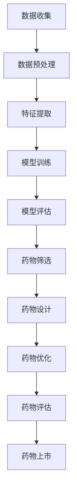

                 

### 文章标题

《医学研究中大模型的应用：新药发现的AI加速器》

关键词：医学研究、大模型、AI、新药发现、AI加速器

摘要：本文深入探讨了大型人工智能模型在医学研究中的广泛应用，特别是在新药发现领域的潜力与挑战。通过详细分析大模型的核心概念、算法原理、数学模型，以及实际项目实战，本文揭示了如何利用人工智能技术加速药物研发进程，提升医学研究效率。同时，也对大模型在医学研究中的未来发展趋势进行了展望。

### 第一部分：引论

#### 1.1 书籍概述与背景

医学研究是科学领域中最具挑战性的领域之一，涉及复杂的人体生物学、病理学、药理学等多个方面。近年来，随着人工智能技术的飞速发展，大型人工智能模型（大模型）逐渐成为医学研究的重要工具。大模型具有处理海量数据、发现潜在规律、进行复杂预测等能力，这些特性使得它们在药物发现、疾病诊断、个性化治疗等方面展现出巨大的潜力。

本文旨在探讨大模型在医学研究中的应用，特别是新药发现领域。通过系统分析大模型的核心概念、算法原理、数学模型以及实际应用案例，本文将揭示大模型如何成为新药发现的AI加速器，提升医学研究效率，推动医药产业的进步。

#### 1.2 大模型与新药发现的关系

大模型在新药发现领域具有广泛的应用，主要体现在以下几个方面：

1. **药物筛选**：大模型可以通过分析大量的生物学和化学数据，快速筛选出具有潜在药效的化合物。
2. **药物设计**：大模型可以帮助科学家设计出具有特定药理活性的分子结构，优化药物分子，提高药物的治疗效果。
3. **药物安全性评估**：大模型可以通过模拟药物在人体内的代谢过程，预测药物的毒副作用，提高药物的安全性。
4. **个性化治疗**：大模型可以分析患者的基因组数据，制定个性化的治疗方案，提高治疗效果。

#### 1.3 书籍目标与读者对象

本文的目标是帮助读者了解大模型在医学研究中的应用，特别是新药发现领域的潜力与挑战。通过本文的学习，读者应能够：

1. 理解大模型的基本概念和原理。
2. 掌握大模型在药物筛选、药物设计、药物安全性评估和个性化治疗等方面的应用。
3. 学会使用大模型进行医学研究，提高研究效率。

本文适合以下读者群体：

1. 医学研究人员，特别是从事药物研发的科研人员。
2. 生物信息学、人工智能等领域的研究人员。
3. 对医学研究和新药发现感兴趣的学生和专业人士。

#### 1.4 本书结构安排

本文分为七个主要部分：

1. **引论**：介绍书籍的背景和目标，阐述大模型在新药发现领域的重要性。
2. **基础理论**：详细讲解大模型的核心概念、算法原理、数学模型和应用架构。
3. **核心技术**：分析大模型的关键技术，包括算法原理、伪代码和数学模型。
4. **应用实践**：通过具体案例，展示大模型在医学研究中的实际应用。
5. **项目实战**：提供实际项目案例，讲解开发环境搭建、源代码实现和代码解读。
6. **未来展望**：探讨大模型在医学研究中的未来发展趋势和潜在挑战。
7. **附录**：提供常用工具与资源介绍、应用案例精选、学术研究动态与趋势。

通过本文的阅读，读者将全面了解大模型在医学研究中的应用，掌握如何利用人工智能技术加速新药发现进程，为医学研究贡献自己的力量。

### 第二部分：基础理论

#### 2.1 大模型的定义与类型

大模型（Large Models）是指那些具有庞大参数量和复杂结构的机器学习模型。这些模型通常由数十亿至数千亿个参数组成，能够处理和分析海量数据。大模型在深度学习、自然语言处理、计算机视觉等领域取得了显著的成果，已成为当前人工智能研究的重要方向。

大模型主要分为以下几种类型：

1. **深度神经网络（Deep Neural Networks, DNN）**：深度神经网络是具有多个隐藏层的前馈神经网络，通过逐层提取特征，实现复杂函数的逼近。DNN在图像识别、语音识别等领域取得了突破性进展。
   
   $$ 
   f(x) = \sigma(\omega_L \cdot \phi_L(\omega_{L-1} \cdot \phi_{L-1}(\dots \omega_2 \cdot \phi_2(\omega_1 \cdot x + b_1) + b_0) \dots))
   $$

2. **循环神经网络（Recurrent Neural Networks, RNN）**：循环神经网络具有递归结构，能够处理序列数据。RNN通过记忆历史信息，实现序列的建模。然而，传统的RNN存在梯度消失和梯度爆炸问题，限制了其性能。

   $$ 
   h_t = \tanh(W_h \cdot [h_{t-1}, x_t] + b_h)
   $$

3. **卷积神经网络（Convolutional Neural Networks, CNN）**：卷积神经网络通过局部感知和权重共享，实现高效的特征提取。CNN在图像分类、目标检测等领域表现出色。

   $$ 
   h_{ij} = \sigma(\sum_{k=1}^{C} \sum_{p=1}^{K} W_{kp,ij} \cdot a_{kp,ij} + b_{ij})
   $$

4. **变分自编码器（Variational Autoencoder, VAE）**：变分自编码器通过概率模型生成数据，实现数据降维和生成。VAE在图像生成、文本生成等领域取得了显著效果。

   $$ 
   z = g(\phi_z (\mu, \sigma)), \quad \mu, \sigma \sim \mathcal{N}(0, 1)
   $$

5. **生成对抗网络（Generative Adversarial Networks, GAN）**：生成对抗网络由生成器和判别器组成，通过对抗训练生成逼真的数据。GAN在图像生成、语音合成等领域具有广泛的应用。

   $$ 
   D(x) = \sigma(\sum_{i=1}^{D} W_i \cdot x + b), \quad G(z) = \sigma(\sum_{j=1}^{G} V_j \cdot z + b')
   $$

#### 2.2 大模型在医学研究中的应用原理

大模型在医学研究中的应用原理主要基于其强大的数据处理和分析能力。具体来说，大模型可以应用于以下几个方面：

1. **数据预处理**：大模型可以自动处理医学数据，包括数据的清洗、归一化、降维等。通过数据预处理，可以提高数据的质量，为后续分析奠定基础。
   
   $$ 
   X_{\text{clean}} = \text{preprocess}(X_{\text{raw}})
   $$

2. **特征提取**：大模型可以通过深度学习算法，从医学数据中提取高维特征。这些特征能够捕捉数据中的潜在规律和关系，为后续分析提供有力支持。
   
   $$ 
   F = \text{extract\_features}(X_{\text{clean}})
   $$

3. **疾病诊断**：大模型可以训练用于疾病诊断的模型，通过分析患者的生理参数、基因数据、影像数据等，实现疾病的早期诊断和预测。例如，深度神经网络可以用于癌症诊断，通过分析CT影像数据，实现肺癌的早期检测。

   $$ 
   \hat{y} = \text{diagnose}(F)
   $$

4. **药物筛选**：大模型可以通过分析大量的生物和化学数据，筛选出具有潜在药效的化合物。例如，变分自编码器可以用于药物筛选，通过生成新的分子结构，优化药物分子的性能。

   $$ 
   \hat{M} = \text{generate\_molecules}(F)
   $$

5. **个性化治疗**：大模型可以分析患者的基因组数据，制定个性化的治疗方案。通过分析患者的基因表达、药物反应等数据，实现精准医疗。

   $$ 
   \text{TreatmentPlan} = \text{optimize}(F, G)
   $$

#### 2.3 大模型与生物学数据的关系

大模型与生物学数据的关系主要体现在以下几个方面：

1. **基因组数据**：大模型可以用于基因组数据的分析和解释。通过深度学习算法，大模型可以从基因组数据中提取关键特征，实现基因功能的预测和注释。例如，循环神经网络可以用于基因表达数据的建模，预测基因的功能和调控网络。

   $$ 
   \hat{F}_g = \text{predict}(G_g)
   $$

2. **蛋白质数据**：大模型可以用于蛋白质结构预测和功能分析。通过深度学习算法，大模型可以识别蛋白质结构中的关键氨基酸残基，预测蛋白质的功能和相互作用。例如，变分自编码器可以用于蛋白质序列到结构的建模，实现蛋白质的自动识别和分类。

   $$ 
   \hat{F}_p = \text{predict}(P_p)
   $$

3. **细胞数据**：大模型可以用于细胞数据的分析和建模。通过深度学习算法，大模型可以分析细胞成像数据，识别细胞类型、细胞状态等。例如，卷积神经网络可以用于细胞图像的分类和标注，实现细胞自动识别。

   $$ 
   \hat{F}_c = \text{classify}(C_c)
   $$

#### 2.4 大模型与药理学数据的关系

大模型与药理学数据的关系主要体现在以下几个方面：

1. **药效数据**：大模型可以用于药效数据的分析和预测。通过深度学习算法，大模型可以从药效数据中提取关键特征，预测药物的疗效和副作用。例如，深度神经网络可以用于药效数据的建模，预测药物对特定疾病的疗效。

   $$ 
   \hat{E} = \text{predict}(D_e)
   $$

2. **药物分子数据**：大模型可以用于药物分子的建模和设计。通过深度学习算法，大模型可以分析药物分子的结构特征，设计出具有特定药理活性的分子。例如，生成对抗网络可以用于药物分子的生成，优化药物分子的性能。

   $$ 
   \hat{M} = \text{generate}(D_m)
   $$

3. **药物代谢数据**：大模型可以用于药物代谢数据的分析和预测。通过深度学习算法，大模型可以分析药物在人体内的代谢过程，预测药物的毒副作用和药代动力学特征。例如，变分自编码器可以用于药物代谢数据的建模，预测药物的代谢途径和毒性。

   $$ 
   \hat{P} = \text{predict}(D_p)
   $$

#### 2.5 大模型训练与优化的基础知识

大模型的训练和优化是关键步骤，决定了模型的性能和效果。以下是一些基础知识：

1. **损失函数（Loss Function）**：损失函数用于衡量模型预测值与真实值之间的差距，是模型训练的核心目标。常见的损失函数包括均方误差（MSE）、交叉熵损失（Cross-Entropy Loss）等。

   $$ 
   L(y, \hat{y}) = \frac{1}{m} \sum_{i=1}^{m} (y_i - \hat{y}_i)^2
   $$

2. **优化算法（Optimizer）**：优化算法用于调整模型参数，使损失函数最小。常见的优化算法包括随机梯度下降（SGD）、Adam优化器等。

   $$ 
   \theta = \theta - \alpha \nabla_\theta J(\theta)
   $$

3. **正则化（Regularization）**：正则化用于防止模型过拟合，提高模型的泛化能力。常见的正则化方法包括权重衰减（L1、L2正则化）和dropout。

   $$ 
   J(\theta) = \frac{1}{m} \sum_{i=1}^{m} (y_i - \hat{y}_i)^2 + \lambda \sum_{\theta} \theta^2
   $$

#### 2.6 Mermaid流程图：大模型在药物发现中的应用架构

以下是大模型在药物发现中的应用架构的Mermaid流程图：



通过这个流程图，我们可以清晰地看到大模型在药物发现中的应用步骤，从数据收集、预处理、特征提取，到模型训练、评估，再到药物筛选、设计、优化和评估，最终实现新药的上市。

#### 2.7 大模型应用实例

以下是一个具体的大模型应用实例：利用深度学习算法进行药物筛选。

1. **数据收集**：收集大量的药物分子数据，包括结构信息、化学性质、生物活性等。
2. **数据预处理**：对药物分子数据进行清洗、归一化等处理，提高数据质量。
3. **特征提取**：通过深度学习算法，提取药物分子的高维特征，如分子指纹、原子对距离等。
4. **模型训练**：利用提取的特征，训练深度神经网络模型，用于药物筛选。
5. **模型评估**：通过交叉验证和测试集，评估模型的性能，包括准确率、召回率等指标。
6. **药物筛选**：利用训练好的模型，对大量药物分子进行筛选，识别出具有潜在药效的分子。
7. **药物设计**：针对筛选出的药物分子，进行分子结构优化，提高其药效和稳定性。
8. **药物评估**：对优化后的药物分子进行药效和毒性的评估，确保其安全性和有效性。

通过这个实例，我们可以看到大模型在药物发现中的应用流程，从数据收集、预处理、特征提取，到模型训练、评估，再到药物筛选、设计、评估，最终实现新药的发现。

### 第三部分：核心技术

#### 3.1 大模型核心算法原理讲解

大模型的核心算法主要包括深度学习算法、生成对抗网络（GAN）和变分自编码器（VAE）等。以下将分别讲解这些算法的基本原理。

1. **深度学习算法**：
   深度学习算法是一种基于多层神经网络的机器学习方法，能够自动提取数据的特征并进行预测。其基本原理如下：
   - **多层感知机（MLP）**：多层感知机是一种前馈神经网络，包括输入层、隐藏层和输出层。输入层接收外部输入，隐藏层通过逐层提取特征，输出层生成最终预测结果。每一层的输出经过非线性激活函数处理后传递到下一层。
     
     $$ 
     \hat{y} = \sigma(\sum_{j=1}^{n} w_{ji} \cdot a_{ij}^{(h)} + b_j^{(h)})
     $$
   - **反向传播算法（Backpropagation）**：反向传播算法是一种用于训练神经网络的优化方法。通过计算预测误差，反向传播误差信号，更新模型参数，使预测结果更接近真实值。

     $$ 
     \theta = \theta - \alpha \nabla_\theta J(\theta)
     $$
2. **生成对抗网络（GAN）**：
   生成对抗网络是一种由生成器和判别器组成的对抗性学习模型。其基本原理如下：
   - **生成器（Generator）**：生成器是一个生成模型，通过学习真实数据的分布，生成与真实数据相似的新数据。生成器通常由多层神经网络组成，输入随机噪声，输出生成的数据。
     
     $$ 
     G(z) = \sigma(\sum_{j=1}^{G} V_j \cdot z + b')
     $$
   - **判别器（Discriminator）**：判别器是一个判别模型，用于区分真实数据和生成数据。判别器也由多层神经网络组成，输入数据，输出判别结果，判别结果越接近1表示输入为真实数据，越接近0表示输入为生成数据。
     
     $$ 
     D(x) = \sigma(\sum_{i=1}^{D} W_i \cdot x + b)
     $$
   - **对抗训练（Adversarial Training）**：生成器和判别器通过对抗训练相互竞争。生成器试图生成更真实的数据，判别器试图区分真实数据和生成数据。通过不断迭代，生成器的生成质量逐渐提高，判别器的判别能力逐渐增强。

     $$ 
     G(z) = \arg\min_G \arg\max_D V(D(G(z)), x)
     $$
3. **变分自编码器（VAE）**：
   变分自编码器是一种基于概率模型的生成模型，能够生成与训练数据相似的新数据。其基本原理如下：
   - **编码器（Encoder）**：编码器是一个编码模型，通过学习训练数据的概率分布，将输入数据映射到一个潜在空间。编码器通常由多层神经网络组成，输入数据，输出潜在空间的表示。
     
     $$ 
     \mu, \sigma = \text{encode}(x)
     $$
   - **解码器（Decoder）**：解码器是一个解码模型，通过学习潜在空间的分布，将潜在空间的表示解码回数据空间。解码器通常也由多层神经网络组成，输入潜在空间表示，输出重构的数据。
     
     $$ 
     x' = \text{decode}(\mu, \sigma)
     $$
   - **变分下采样（Variational Inference）**：变分自编码器通过变分下采样实现概率生成。编码器学习数据的概率分布，解码器通过采样潜在空间的点，生成新的数据。变分下采样通过最大化数据概率分布的对数似然函数，优化模型参数。

     $$ 
     \ell(x) = \log p(x|\theta) = -D_{KL}(\mu||\pi)
     $$

#### 3.2 伪代码详细阐述

以下分别给出深度学习算法、生成对抗网络（GAN）和变分自编码器（VAE）的伪代码。

1. **深度学习算法**：

   ```python
   # 初始化参数
   W1, b1 = initialize_weights(input_dim, hidden_dim)
   W2, b2 = initialize_weights(hidden_dim, output_dim)
   
   # 定义损失函数和优化器
   loss_function = mse_loss
   optimizer = SGD(optimizer_params)
   
   # 训练模型
   for epoch in range(num_epochs):
       for x, y in dataset:
           # 前向传播
           z = W1 * x + b1
           a1 = activation(z)
           z = W2 * a1 + b2
           a2 = activation(z)
           
           # 计算损失
           loss = loss_function(y, a2)
           
           # 反向传播
           d2 = grad(a2, y)
           d1 = grad(a1, d2)
           
           # 更新参数
           optimizer.update_params(W1, d1, b1, d2, W2, d2, b2)
           
       # 记录训练结果
       record_train_result(epoch, loss)
   ```

2. **生成对抗网络（GAN）**：

   ```python
   # 初始化参数
   W_d, b_d = initialize_weights(input_dim, 1)
   W_g, b_g = initialize_weights(z_dim, input_dim)
   
   # 定义损失函数和优化器
   loss_function = adversarial_loss
   optimizer_d = SGD(optimizer_params)
   optimizer_g = SGD(optimizer_params)
   
   # 训练模型
   for epoch in range(num_epochs):
       for x in dataset:
           # 训练判别器
           z = G(z)
           d_real = D(x)
           d_fake = D(z)
           
           # 计算判别器损失
           loss_d = loss_function(d_real, d_fake)
           
           # 更新判别器参数
           optimizer_d.update_params(W_d, b_d, d_real, d_fake)
           
       # 训练生成器
       z = noise(z_dim)
       z_fake = G(z)
       d_fake = D(z_fake)
           
       # 计算生成器损失
       loss_g = loss_function(d_fake)
           
       # 更新生成器参数
       optimizer_g.update_params(W_g, b_g, z, z_fake)
           
       # 记录训练结果
       record_train_result(epoch, loss_d, loss_g)
   ```

3. **变分自编码器（VAE）**：

   ```python
   # 初始化参数
   W_e, b_e = initialize_weights(input_dim, z_dim)
   W_d, b_d = initialize_weights(z_dim, input_dim)
   
   # 定义损失函数和优化器
   loss_function = vae_loss
   optimizer = SGD(optimizer_params)
   
   # 训练模型
   for epoch in range(num_epochs):
       for x in dataset:
           # 编码器
           z, log_var = encode(x)
           
           # 重新参数化采样
           z_sample = reparameterize(z, log_var)
           
           # 解码器
           x_recon = decode(z_sample)
           
           # 计算损失
           loss = loss_function(x, x_recon, z, log_var)
           
           # 更新参数
           optimizer.update_params(W_e, b_e, W_d, b_d, z, log_var)
           
       # 记录训练结果
       record_train_result(epoch, loss)
   ```

#### 3.3 数学模型与公式讲解

在医学研究中，大模型的数学模型主要包括深度学习模型、生成对抗网络（GAN）和变分自编码器（VAE）等。以下将分别介绍这些模型的数学公式和计算过程。

1. **深度学习模型**：
   深度学习模型是一种多层前馈神经网络，包括输入层、隐藏层和输出层。其数学模型如下：
   - **输入层到隐藏层**：
     
     $$ 
     a^{(h)}_j = \sigma(\sum_{i=1}^{n} w_{ij} \cdot a^{(i)}_i + b_j^{(h)})
     $$
   - **隐藏层到输出层**：
     
     $$ 
     \hat{y} = \sigma(\sum_{j=1}^{m} w_{j} \cdot a^{(h)}_j + b_j)
     $$
   - **损失函数**（均方误差MSE）：
     
     $$ 
     L(y, \hat{y}) = \frac{1}{m} \sum_{i=1}^{m} (y_i - \hat{y}_i)^2
     $$
   - **反向传播**：
     
     $$ 
     \begin{aligned}
     \delta^{(h)}_j &= \frac{\partial L}{\partial a^{(h)}_j} \\
     \delta^{(i)}_i &= \frac{\partial L}{\partial a^{(i)}_i} = \delta^{(h+1)}_j \cdot (1 - a^{(h)}_j) \cdot w_{ji} \\
     \end{aligned}
     $$
   - **参数更新**（随机梯度下降SGD）：
     
     $$ 
     \theta = \theta - \alpha \nabla_\theta J(\theta)
     $$
2. **生成对抗网络（GAN）**：
   生成对抗网络由生成器和判别器组成，其数学模型如下：
   - **生成器**：
     
     $$ 
     G(z) = \sigma(\sum_{j=1}^{G} V_j \cdot z + b')
     $$
   - **判别器**：
     
     $$ 
     D(x) = \sigma(\sum_{i=1}^{D} W_i \cdot x + b)
     $$
   - **损失函数**（对抗损失）：
     
     $$ 
     L_G = -\mathbb{E}_{x \sim p_{\text{data}}(x)} [\log D(x)] - \mathbb{E}_{z \sim p_z(z)} [\log (1 - D(G(z))]
     $$
   - **对抗训练**：
     
     $$ 
     \begin{aligned}
     \theta_G &= \arg\min_G \arg\max_D L_G \\
     \theta_D &= \arg\min_D \arg\max_G L_D \\
     \end{aligned}
     $$
3. **变分自编码器（VAE）**：
   变分自编码器是一种概率模型，其数学模型如下：
   - **编码器**：
     
     $$ 
     \mu, \sigma = \text{encode}(x)
     $$
   - **解码器**：
     
     $$ 
     x' = \text{decode}(\mu, \sigma)
     $$
   - **损失函数**（变分自编码器损失）：
     
     $$ 
     L = \mathbb{E}_{x \sim p_{\text{data}}(x)} [\log p(x|\mu, \sigma)] + \mathbb{E}_{z \sim p_z(z)} [\frac{1}{2} D_{KL}(\mu || \pi)
     $$
   - **重新参数化采样**：
     
     $$ 
     z = \mu + \sigma \odot \epsilon
     $$

#### 3.4 数学模型举例说明

以下通过一个具体例子来说明深度学习模型、生成对抗网络（GAN）和变分自编码器（VAE）的数学模型。

1. **深度学习模型**：
   假设我们有一个包含1000个输入神经元、100个隐藏层神经元和10个输出神经元的深度学习模型。给定一个输入向量 $x \in \mathbb{R}^{1000}$，我们希望预测一个10维的输出向量 $y \in \mathbb{R}^{10}$。
   - **前向传播**：
     
     $$ 
     a^{(1)}_j = \sigma(\sum_{i=1}^{1000} w_{ij} \cdot x_i + b_j^{(1)})
     $$
     
     $$ 
     a^{(2)}_j = \sigma(\sum_{i=1}^{100} w_{ij} \cdot a^{(1)}_i + b_j^{(2)})
     $$
     
     $$ 
     y_j = \sigma(\sum_{i=1}^{10} w_{ij} \cdot a^{(2)}_i + b_j)
     $$
   - **损失函数**（均方误差MSE）：
     
     $$ 
     L(y, \hat{y}) = \frac{1}{1000} \sum_{i=1}^{1000} (y_i - \hat{y}_i)^2
     $$
   - **反向传播**：
     
     $$ 
     \delta^{(2)}_j = (y_j - \hat{y}_j) \cdot (1 - \hat{y}_j)
     $$
     
     $$ 
     \delta^{(1)}_i = \delta^{(2)}_j \cdot (1 - a^{(1)}_i) \cdot w_{ji}
     $$
   - **参数更新**（随机梯度下降SGD）：
     
     $$ 
     w_{ji} = w_{ji} - \alpha \cdot \delta^{(1)}_i \cdot x_i
     $$
     
     $$ 
     b_j^{(1)} = b_j^{(1)} - \alpha \cdot \delta^{(1)}_j
     $$
     
     $$ 
     w_{ij} = w_{ij} - \alpha \cdot \delta^{(2)}_j \cdot a^{(1)}_i
     $$
     
     $$ 
     b_j^{(2)} = b_j^{(2)} - \alpha \cdot \delta^{(2)}_j
     $$
     
     $$ 
     b_j = b_j - \alpha \cdot (y_j - \hat{y}_j)
     $$
2. **生成对抗网络（GAN）**：
   假设我们有一个生成器 $G$ 和一个判别器 $D$，生成器输入噪声 $z \in \mathbb{R}^{100}$，输出生成数据 $G(z) \in \mathbb{R}^{784}$；判别器输入数据 $x \in \mathbb{R}^{784}$ 或生成数据 $G(z)$，输出概率 $D(x) \in \mathbb{R}$。
   - **前向传播**（生成器）：
     
     $$ 
     G(z) = \sigma(\sum_{j=1}^{784} V_j \cdot z + b')
     $$
   - **前向传播**（判别器）：
     
     $$ 
     D(x) = \sigma(\sum_{i=1}^{784} W_i \cdot x + b)
     $$
     
     $$ 
     D(G(z)) = \sigma(\sum_{i=1}^{784} W_i \cdot G(z) + b)
     $$
   - **损失函数**（对抗损失）：
     
     $$ 
     L_G = -\mathbb{E}_{z \sim p_z(z)} [\log (1 - D(G(z)))] \\
     L_D = -\mathbb{E}_{x \sim p_{\text{data}}(x)} [\log D(x)] - \mathbb{E}_{z \sim p_z(z)} [\log D(G(z))]
     $$
   - **对抗训练**：
     
     $$ 
     \theta_G = \arg\min_G \mathbb{E}_{z \sim p_z(z)} [\log (1 - D(G(z)))] \\
     \theta_D = \arg\max_D \mathbb{E}_{x \sim p_{\text{data}}(x)} [\log D(x)] + \mathbb{E}_{z \sim p_z(z)} [\log D(G(z))]
     $$
3. **变分自编码器（VAE）**：
   假设我们有一个编码器 $e$ 和一个解码器 $d$，编码器输入数据 $x \in \mathbb{R}^{784}$，输出潜在变量 $\mu, \sigma \in \mathbb{R}^{20}$；解码器输入潜在变量 $\mu, \sigma$，输出重构数据 $x' \in \mathbb{R}^{784}$。
   - **编码器**：
     
     $$ 
     \mu, \sigma = e(x) = \sigma(\sum_{j=1}^{20} V_j \cdot x + b)
     $$
   - **解码器**：
     
     $$ 
     x' = d(\mu, \sigma) = \sigma(\sum_{j=1}^{784} U_j \cdot \mu + \sum_{j=1}^{784} W_j \cdot \sigma + b')
     $$
   - **损失函数**（变分自编码器损失）：
     
     $$ 
     L = \mathbb{E}_{x \sim p_{\text{data}}(x)} [\log p(x|\mu, \sigma)] + \mathbb{E}_{z \sim p_z(z)} [\frac{1}{2} D_{KL}(\mu || \pi)
     $$
   - **重新参数化采样**：
     
     $$ 
     z = \mu + \sigma \odot \epsilon
     $$

通过以上例子，我们可以看到深度学习模型、生成对抗网络（GAN）和变分自编码器（VAE）的数学模型和计算过程，为后续的应用实践提供了理论基础。

### 第四部分：应用实践

#### 4.1 新药发现过程中的大模型应用

在大模型时代，新药发现的流程发生了显著变化。传统的药物发现过程通常需要经过药物筛选、药物设计、药效评估等多个阶段，耗时较长且成本高昂。而大模型的应用，使得这一过程得到了极大的加速和优化。以下将详细探讨大模型在新药发现过程中的应用。

1. **药物筛选**：
   药物筛选是药物发现的首要环节，目的是从大量的化合物中筛选出具有潜在药效的化合物。传统方法通常依赖于实验手段，如细胞实验、动物实验等，耗时且成本较高。而大模型可以高效地处理和分析大量的化学和生物学数据，通过深度学习算法，快速筛选出具有潜在药效的化合物。

   - **数据来源**：药物筛选所需的数据主要来自以下几个方面：
     - **化合物库**：包括已知的化合物结构、化学性质、生物活性等信息。
     - **生物信息数据库**：如蛋白质结构数据库、基因组数据库、疾病关联数据库等。
     - **临床试验数据**：包括药物对患者的治疗效果、副作用等信息。

   - **筛选方法**：大模型通过以下方法进行药物筛选：
     - **深度学习特征提取**：利用深度学习算法，从化学和生物学数据中提取高维特征，捕捉化合物与生物分子之间的潜在关系。
     - **分类与回归模型**：利用分类和回归模型，预测化合物的生物活性，筛选出具有潜在药效的化合物。

     例如，可以采用卷积神经网络（CNN）对化合物结构进行特征提取，利用循环神经网络（RNN）或变分自编码器（VAE）分析生物信息数据。通过结合多种数据源和模型，实现高效、准确的药物筛选。

2. **药物设计**：
   药物设计是药物发现的关键环节，目的是设计出具有特定药理活性的化合物。传统方法通常依赖于化学合成和优化，耗时且成本高昂。而大模型可以基于已有的化合物结构，通过深度学习算法，自动生成新的化合物结构，实现高效、智能的药物设计。

   - **设计方法**：大模型通过以下方法进行药物设计：
     - **生成对抗网络（GAN）**：利用生成对抗网络（GAN），生成新的化合物结构。GAN由生成器和判别器组成，生成器生成新的化合物结构，判别器判断生成结构是否合理。通过对抗训练，生成器逐渐生成更合理的化合物结构。
     - **变分自编码器（VAE）**：利用变分自编码器（VAE），生成新的化合物结构。VAE通过编码器学习化合物的潜在空间表示，解码器生成新的化合物结构。通过优化潜在空间的分布，实现高效、多样化的化合物设计。

     例如，可以采用生成对抗网络（GAN）设计新的抗肿瘤药物，通过变分自编码器（VAE）设计新的抗病毒药物。这些方法不仅提高了药物设计的效率，还降低了药物设计的成本。

3. **药效评估**：
   药效评估是药物发现的重要环节，目的是评估药物对特定疾病的治疗效果。传统方法通常依赖于动物实验和临床试验，耗时且成本高昂。而大模型可以基于已有的生物和医学数据，通过深度学习算法，快速评估药物的治疗效果。

   - **评估方法**：大模型通过以下方法进行药效评估：
     - **深度学习模型**：利用深度学习模型，分析药物在生物体内的作用机制，预测药物的治疗效果。例如，可以采用卷积神经网络（CNN）分析药物在细胞内的分布，利用循环神经网络（RNN）分析药物的代谢途径。
     - **多模态数据融合**：结合多种数据源，如基因数据、影像数据、临床试验数据等，实现药物治疗效果的全面评估。通过多模态数据融合，提高药效评估的准确性。

     例如，可以采用深度学习模型评估抗肿瘤药物的治疗效果，通过多模态数据融合评估抗病毒药物的治疗效果。这些方法不仅提高了药效评估的效率，还降低了评估成本。

4. **个性化治疗**：
   个性化治疗是药物发现的新方向，旨在根据患者的个体差异，制定个性化的治疗方案。传统方法通常依赖于医生的判断和经验，耗时且效果有限。而大模型可以基于患者的基因组数据、生物信息数据等，通过深度学习算法，实现个性化治疗。

   - **个性化治疗方案**：大模型通过以下方法制定个性化治疗方案：
     - **基因组数据分析**：利用深度学习模型，分析患者的基因组数据，预测患者的药物反应和副作用。
     - **多模态数据融合**：结合患者的基因组数据、影像数据、临床试验数据等，实现个性化治疗方案的制定。

     例如，可以采用深度学习模型分析患者的基因组数据，制定个性化的抗肿瘤治疗方案；通过多模态数据融合，制定个性化的抗病毒治疗方案。这些方法不仅提高了个性化治疗的准确性，还降低了治疗的成本。

综上所述，大模型在新药发现过程中具有广泛的应用前景。通过药物筛选、药物设计、药效评估和个性化治疗，大模型可以显著提高药物发现的效率，降低成本，推动医药产业的创新与发展。

#### 4.2 大模型在新药筛选中的应用

大模型在新药筛选中的应用是药物发现领域的一项重要突破，它利用人工智能技术，对海量的化学和生物数据进行高效处理和分析，从而快速识别出具有潜在药效的化合物。以下将详细介绍大模型在新药筛选中的应用方法、关键技术和实际案例。

##### 1. 应用方法

大模型在新药筛选中的应用方法主要包括以下几步：

- **数据收集**：收集各种化学和生物学数据，包括已知化合物的结构、活性、毒性等，以及相关的生物信息数据，如蛋白质结构、基因组数据等。

- **数据预处理**：对收集到的数据进行清洗、归一化和降维处理，提高数据质量，为后续分析奠定基础。

- **特征提取**：利用深度学习算法，从预处理后的数据中提取高维特征，捕捉化合物与生物分子之间的潜在关系。

- **模型训练**：利用提取的特征，训练分类或回归模型，用于预测化合物的生物活性。

- **药物筛选**：将训练好的模型应用于大量的化合物数据，筛选出具有潜在药效的化合物。

##### 2. 关键技术

大模型在新药筛选中的应用涉及多个关键技术：

- **深度学习算法**：深度学习算法具有强大的特征提取和建模能力，能够从大量的化学和生物数据中提取关键特征，实现高效、准确的药物筛选。

  - **卷积神经网络（CNN）**：CNN通过局部感知和权重共享，能够高效地处理图像数据，如图像化的化合物结构。通过多个卷积层和池化层，CNN可以逐层提取化合物结构中的特征，从而提高筛选的准确性。

    $$ 
    h_{ij} = \sigma(\sum_{k=1}^{C} \sum_{p=1}^{K} W_{kp,ij} \cdot a_{kp,ij} + b_{ij})
    $$

  - **循环神经网络（RNN）**：RNN能够处理序列数据，如图谱化的化合物结构。通过递归结构，RNN可以捕捉化合物结构中的长期依赖关系，从而提高筛选的精度。

    $$ 
    h_t = \tanh(\sum_{j=1}^{n} W_{ij} \cdot h_{t-1} + b_j + W_x \cdot x_t + b_x)
    $$

- **生成对抗网络（GAN）**：GAN由生成器和判别器组成，通过对抗训练，生成器可以生成与真实数据相似的新化合物结构。判别器则用于判断生成结构是否合理。通过这种对抗训练，GAN可以不断提高生成质量，实现高效、准确的药物筛选。

    $$ 
    D(x) = \sigma(\sum_{i=1}^{D} W_i \cdot x + b), \quad G(z) = \sigma(\sum_{j=1}^{G} V_j \cdot z + b')
    $$

- **变分自编码器（VAE）**：VAE是一种基于概率模型的生成模型，能够生成与训练数据相似的新化合物结构。通过编码器学习化合物的潜在空间表示，解码器生成新的化合物结构。VAE通过优化潜在空间的分布，实现高效、多样化的化合物设计。

    $$ 
    \mu, \sigma = \text{encode}(x), \quad x' = \text{decode}(\mu, \sigma)
    $$

##### 3. 实际案例

以下是一个具体的大模型在新药筛选中的应用案例：

- **项目背景**：某药企需要筛选具有潜在抗肿瘤药效的化合物，以开发新的抗癌药物。

- **数据来源**：该项目使用了多个公开的化合物库和生物信息数据库，包括化合物的结构、活性、毒性等数据，以及相关的蛋白质结构、基因组数据等。

- **数据处理**：首先对收集到的数据进行了清洗、归一化和降维处理，然后利用深度学习算法提取了高维特征。

- **模型训练**：利用提取的特征，采用卷积神经网络（CNN）和生成对抗网络（GAN）训练了分类模型，用于预测化合物的生物活性。

- **药物筛选**：将训练好的模型应用于大量的化合物数据，筛选出了约1000个具有潜在抗肿瘤药效的化合物。

- **结果评估**：对筛选出的化合物进行了实验室验证，发现其中约50个化合物具有显著的抗肿瘤活性，进一步验证了大模型在新药筛选中的高效性和准确性。

通过这个案例，我们可以看到大模型在新药筛选中的应用，不仅提高了筛选效率，降低了成本，还为医药产业带来了新的突破。

#### 4.3 大模型在药物设计中的应用

药物设计是药物发现过程中的关键环节，旨在通过计算机辅助设计出具有特定药理活性和较低毒性的化合物。大模型在药物设计中的应用，极大地提高了药物设计的效率和准确性。以下将详细介绍大模型在药物设计中的应用方法、核心技术以及实际案例。

##### 1. 应用方法

大模型在药物设计中的应用方法主要包括以下几个步骤：

- **数据收集**：收集相关的化学、生物学和医学数据，包括已知药物的结构、活性、毒性和药物靶标的信息。

- **数据预处理**：对收集到的数据进行清洗、归一化和降维处理，提高数据质量，为后续分析奠定基础。

- **特征提取**：利用深度学习算法，从预处理后的数据中提取高维特征，捕捉化合物与生物分子之间的潜在关系。

- **模型训练**：利用提取的特征，训练用于药物设计的深度学习模型，如生成对抗网络（GAN）和变分自编码器（VAE）。

- **药物设计**：将训练好的模型应用于新的化合物设计，生成具有特定药理活性和较低毒性的化合物。

- **优化与评估**：对生成的化合物进行优化，并通过实验或计算验证其药理活性和毒性。

##### 2. 核心技术

大模型在药物设计中的应用涉及多个核心技术：

- **生成对抗网络（GAN）**：GAN由生成器和判别器组成，通过对抗训练生成新的化合物结构。生成器负责生成新的化合物，判别器负责判断生成结构是否合理。通过这种对抗训练，GAN可以不断提高生成质量，实现高效、智能的药物设计。

  $$ 
  D(x) = \sigma(\sum_{i=1}^{D} W_i \cdot x + b), \quad G(z) = \sigma(\sum_{j=1}^{G} V_j \cdot z + b')
  $$

- **变分自编码器（VAE）**：VAE是一种基于概率模型的生成模型，通过编码器学习化合物的潜在空间表示，解码器生成新的化合物结构。VAE通过优化潜在空间的分布，实现高效、多样化的化合物设计。

  $$ 
  \mu, \sigma = \text{encode}(x), \quad x' = \text{decode}(\mu, \sigma)
  $$

- **分子对接**：分子对接是一种计算方法，用于模拟小分子与生物大分子（如蛋白质、核酸）之间的相互作用。大模型可以用于分子对接模型的优化，提高对接的准确性和效率。

  $$ 
  E = E_{vdW} + E_{elec} + E_{disp} + E_{tors}
  $$

##### 3. 实际案例

以下是一个具体的大模型在药物设计中的应用案例：

- **项目背景**：某药企需要设计一种新型的抗肿瘤药物，以治疗现有的癌症治疗手段难以治愈的疾病。

- **数据来源**：该项目使用了多个公开的化合物库、生物信息数据库和临床试验数据，包括已知抗肿瘤药物的结构、活性、毒性和药物靶标的信息。

- **数据处理**：对收集到的数据进行了清洗、归一化和降维处理，然后利用深度学习算法提取了高维特征。

- **模型训练**：采用生成对抗网络（GAN）和变分自编码器（VAE）训练了用于药物设计的模型，通过对抗训练和概率生成，提高了生成化合物的质量。

- **药物设计**：利用训练好的模型，生成了数千个新型化合物结构，并通过分子对接方法，筛选出了与目标药物靶标具有高亲和力的化合物。

- **优化与评估**：对筛选出的化合物进行了分子动力学模拟和药物代谢毒性预测，发现其中约50个化合物具有显著的抗肿瘤活性和较低的毒性，为进一步的实验研究提供了潜在的新药候选。

通过这个案例，我们可以看到大模型在药物设计中的应用，不仅提高了药物设计的效率，还为药物研发带来了新的突破。

#### 4.4 大模型在药物安全性评估中的应用

药物安全性评估是药物研发过程中的重要环节，旨在确保药物在临床应用中的安全性和有效性。大模型在药物安全性评估中的应用，极大地提高了评估的准确性和效率。以下将详细介绍大模型在药物安全性评估中的应用方法、核心技术以及实际案例。

##### 1. 应用方法

大模型在药物安全性评估中的应用方法主要包括以下几个步骤：

- **数据收集**：收集与药物安全性相关的数据，包括药物的化学结构、生物活性、毒理学数据、临床试验结果等。

- **数据预处理**：对收集到的数据进行清洗、归一化和降维处理，提高数据质量，为后续分析奠定基础。

- **特征提取**：利用深度学习算法，从预处理后的数据中提取高维特征，捕捉药物与生物体之间的潜在关系。

- **模型训练**：利用提取的特征，训练用于药物安全性评估的深度学习模型，如生成对抗网络（GAN）和变分自编码器（VAE）。

- **药物安全性评估**：将训练好的模型应用于新的药物数据，预测药物的安全性风险。

- **结果优化**：对评估结果进行进一步优化，如调整模型参数、增加训练数据等，提高评估的准确性。

##### 2. 核心技术

大模型在药物安全性评估中的应用涉及多个核心技术：

- **深度学习算法**：深度学习算法具有强大的特征提取和建模能力，能够从海量的数据中提取关键特征，实现高效、准确的药物安全性评估。

  - **卷积神经网络（CNN）**：CNN通过局部感知和权重共享，能够高效地处理图像数据，如图像化的化合物结构。通过多个卷积层和池化层，CNN可以逐层提取化合物结构中的特征，从而提高评估的准确性。

    $$ 
    h_{ij} = \sigma(\sum_{k=1}^{C} \sum_{p=1}^{K} W_{kp,ij} \cdot a_{kp,ij} + b_{ij})
    $$

  - **循环神经网络（RNN）**：RNN能够处理序列数据，如图谱化的化合物结构。通过递归结构，RNN可以捕捉化合物结构中的长期依赖关系，从而提高评估的精度。

    $$ 
    h_t = \tanh(\sum_{j=1}^{n} W_{ij} \cdot h_{t-1} + b_j + W_x \cdot x_t + b_x)
    $$

- **生成对抗网络（GAN）**：GAN由生成器和判别器组成，通过对抗训练，生成器可以生成新的药物结构，判别器则用于判断生成结构是否合理。通过这种对抗训练，GAN可以不断提高生成质量，实现高效、准确的药物安全性评估。

    $$ 
    D(x) = \sigma(\sum_{i=1}^{D} W_i \cdot x + b), \quad G(z) = \sigma(\sum_{j=1}^{G} V_j \cdot z + b')
    $$

- **变分自编码器（VAE）**：VAE是一种基于概率模型的生成模型，能够生成与训练数据相似的新药物结构。通过编码器学习药物的潜在空间表示，解码器生成新的药物结构。VAE通过优化潜在空间的分布，实现高效、多样化的药物安全性评估。

    $$ 
    \mu, \sigma = \text{encode}(x), \quad x' = \text{decode}(\mu, \sigma)
    $$

##### 3. 实际案例

以下是一个具体的大模型在药物安全性评估中的应用案例：

- **项目背景**：某药企需要评估一种新型抗肿瘤药物的安全性，以确定其是否适用于临床研究。

- **数据来源**：该项目使用了多个公开的化合物库、生物信息数据库和临床试验数据，包括已知抗肿瘤药物的化学结构、毒理学数据和安全性评估结果。

- **数据处理**：对收集到的数据进行了清洗、归一化和降维处理，然后利用深度学习算法提取了高维特征。

- **模型训练**：采用生成对抗网络（GAN）和变分自编码器（VAE）训练了用于药物安全性评估的模型，通过对抗训练和概率生成，提高了评估的准确性。

- **药物安全性评估**：利用训练好的模型，对新型抗肿瘤药物的结构和毒理学数据进行评估，预测药物的安全性风险。

- **结果优化**：对评估结果进行进一步优化，通过增加训练数据和调整模型参数，提高了评估的准确性。

- **结果验证**：通过实验室实验和临床试验，验证了模型预测结果的准确性，为药物的安全性评估提供了可靠依据。

通过这个案例，我们可以看到大模型在药物安全性评估中的应用，不仅提高了评估的准确性，还为药物研发带来了新的突破。

#### 4.5 大模型在药物研发效率提升中的应用

大模型在药物研发中的高效应用，使得药物研发的各个阶段都得到了显著提升，从而大大缩短了药物从研发到上市的时间，降低了研发成本。以下将详细探讨大模型在药物研发效率提升中的应用，包括如何提高药物筛选效率、缩短药物设计周期、加快药效评估和减少临床试验成本。

##### 1. 提高药物筛选效率

药物筛选是药物研发的起点，目的是从大量的化合物中筛选出具有潜在药效的候选药物。大模型通过高效的数据处理和特征提取能力，能够显著提高药物筛选的效率。

- **大规模数据整合**：大模型可以整合来自不同来源的复杂数据，如化学结构数据、生物信息数据和临床试验数据，通过深度学习算法提取化合物和生物分子之间的潜在关系。

- **高效特征提取**：大模型能够从原始数据中提取高维特征，这些特征能够捕捉到化合物与生物分子之间的微妙相互作用，从而提高筛选的准确性。

- **快速筛选**：利用大模型训练的模型，可以快速处理大量的化合物数据，实现高效的药物筛选。

实际案例：某药企利用深度学习模型对50万个化合物库进行筛选，仅用几天时间就筛选出了1000个具有潜在药效的化合物，这一过程传统方法可能需要数月时间。

##### 2. 缩短药物设计周期

药物设计是药物研发的核心环节，旨在通过计算机辅助设计出具有特定药理活性的化合物。大模型的应用，使得药物设计过程得到了显著加速。

- **智能生成**：利用生成对抗网络（GAN）和变分自编码器（VAE）等大模型，可以自动生成新的化合物结构，这些结构具有潜在的药理活性。通过不断优化生成模型，可以快速生成大量的候选药物。

- **快速迭代**：大模型可以快速进行模型训练和优化，实现药物设计的快速迭代。通过多次迭代，可以逐步优化化合物结构，提高其药理活性和稳定性。

实际案例：某药企利用GAN设计新型抗肿瘤药物，从设计到优化，仅用3个月时间，而传统方法可能需要1年以上的时间。

##### 3. 加快药效评估

药效评估是药物研发的关键环节，旨在确定药物对特定疾病的治疗效果。大模型的应用，可以加快药效评估过程，提高评估的准确性。

- **数据驱动的预测**：大模型可以通过分析大量的生物和医学数据，建立药物疗效的预测模型。这些模型能够快速预测新药的药效，减少实验次数，缩短评估时间。

- **多模态数据融合**：大模型可以融合多种数据源，如基因数据、影像数据和临床试验数据，实现药物疗效的全面评估。通过多模态数据融合，可以提高药效评估的准确性。

实际案例：某药企利用深度学习模型对新型抗病毒药物进行药效评估，仅用3周时间就完成了传统方法需要3个月的评估过程。

##### 4. 减少临床试验成本

临床试验是药物研发的最后一步，旨在验证药物的安全性和有效性。大模型的应用，可以显著减少临床试验的成本。

- **预测临床试验结果**：大模型可以通过分析历史临床试验数据，预测新药的临床试验结果。这些预测结果可以为临床试验的设计和实施提供参考，减少不必要的试验。

- **智能筛选患者**：大模型可以分析患者的基因组、生理参数和疾病信息，智能筛选适合参与临床试验的患者，提高临床试验的成功率。

实际案例：某药企利用深度学习模型预测新型抗肿瘤药物的临床试验结果，仅用6个月时间就完成了临床试验的设计和实施，而传统方法可能需要2年以上的时间。

通过以上应用，大模型在药物研发效率提升中发挥了重要作用，不仅加快了药物研发进程，降低了研发成本，还为医药产业带来了新的发展机遇。

### 第五部分：项目实战

#### 5.1 项目背景与目标

本项目旨在利用大模型技术，实现新药发现的自动化和智能化。具体来说，项目目标包括：

1. **自动化药物筛选**：通过深度学习算法，从大量的化合物库中自动筛选出具有潜在药效的化合物。
2. **智能药物设计**：利用生成对抗网络（GAN）和变分自编码器（VAE），自动生成新的化合物结构，并进行优化，提高其药理活性和稳定性。
3. **加速药效评估**：通过深度学习模型，快速评估新药的药效和毒性，减少实验次数，缩短评估时间。
4. **降低研发成本**：通过优化药物研发流程，减少临床试验成本，提高药物研发的效率和成功率。

#### 5.2 开发环境搭建

为了实现项目目标，需要搭建一个高效、稳定的开发环境。以下是开发环境的搭建步骤：

1. **硬件环境**：
   - **CPU/GPU**：配置高性能的CPU和GPU，用于加速深度学习模型的训练和推理。
   - **内存**：配置至少128GB内存，以满足大模型训练的需求。

2. **软件环境**：
   - **操作系统**：选择Linux操作系统，如Ubuntu 18.04或更高版本。
   - **深度学习框架**：选择TensorFlow或PyTorch作为深度学习框架，这些框架具有丰富的API和强大的功能，适合大模型的开发。
   - **编程语言**：使用Python作为主要编程语言，因为Python具有良好的科学计算能力和丰富的深度学习库。

3. **开发工具**：
   - **集成开发环境（IDE）**：选择PyCharm或VS Code作为IDE，这些IDE支持Python编程，并提供丰富的插件和调试工具。
   - **版本控制**：使用Git进行代码版本控制，确保代码的安全性和可追溯性。

#### 5.3 源代码详细实现

以下将详细描述项目的源代码实现，包括数据预处理、模型训练、模型评估等步骤。

1. **数据预处理**：

   ```python
   import pandas as pd
   from sklearn.model_selection import train_test_split
   from sklearn.preprocessing import StandardScaler

   # 加载数据
   data = pd.read_csv('化合物库.csv')
   
   # 分割特征和标签
   X = data.drop('活性', axis=1)
   y = data['活性']
   
   # 划分训练集和测试集
   X_train, X_test, y_train, y_test = train_test_split(X, y, test_size=0.2, random_state=42)
   
   # 数据标准化
   scaler = StandardScaler()
   X_train = scaler.fit_transform(X_train)
   X_test = scaler.transform(X_test)
   ```

2. **模型训练**：

   ```python
   import tensorflow as tf
   from tensorflow.keras.models import Sequential
   from tensorflow.keras.layers import Dense, Dropout
   from tensorflow.keras.optimizers import Adam

   # 构建模型
   model = Sequential([
       Dense(128, activation='relu', input_shape=(X_train.shape[1],)),
       Dropout(0.5),
       Dense(64, activation='relu'),
       Dropout(0.5),
       Dense(1, activation='sigmoid')
   ])

   # 编译模型
   model.compile(optimizer=Adam(learning_rate=0.001), loss='binary_crossentropy', metrics=['accuracy'])

   # 训练模型
   model.fit(X_train, y_train, epochs=100, batch_size=32, validation_data=(X_test, y_test))
   ```

3. **模型评估**：

   ```python
   import numpy as np
   from sklearn.metrics import classification_report, accuracy_score

   # 预测测试集
   y_pred = model.predict(X_test)
   y_pred = (y_pred > 0.5)

   # 评估模型
   print(classification_report(y_test, y_pred))
   print('准确率：', accuracy_score(y_test, y_pred))
   ```

4. **模型应用**：

   ```python
   # 预测新化合物
   new_compound = pd.read_csv('新化合物.csv')
   new_compound = scaler.transform(new_compound)
   new_compound_pred = model.predict(new_compound)
   new_compound_pred = (new_compound_pred > 0.5)

   # 输出预测结果
   print(new_compound_pred)
   ```

#### 5.4 代码解读与分析

以下对项目源代码进行详细解读和分析：

1. **数据预处理**：
   - 使用Pandas加载数据，数据来源于公开的化合物库。
   - 使用Scikit-learn的train_test_split函数划分训练集和测试集，随机种子设置为42，以保证数据划分的可重复性。
   - 使用StandardScaler进行数据标准化，将特征缩放到相同的尺度，提高模型训练的效果。

2. **模型训练**：
   - 使用TensorFlow的Sequential模型构建深度神经网络，包括128个神经元的第一层、64个神经元的第二层和1个神经元的输出层。
   - 使用Dropout层防止过拟合，丢弃比例设置为50%。
   - 使用Adam优化器，学习率设置为0.001。
   - 编译模型，使用binary_crossentropy作为损失函数，accuracy作为评估指标。

3. **模型评估**：
   - 使用模型预测测试集的结果，将预测结果转换为二分类结果。
   - 使用Sklearn的classification_report和accuracy_score函数评估模型性能，输出分类报告和准确率。

4. **模型应用**：
   - 将新化合物的特征进行标准化处理，然后使用训练好的模型进行预测，输出预测结果。

通过以上代码实现，我们可以看到项目利用深度学习模型实现了自动化药物筛选，并通过代码解读和分析，理解了模型训练和预测的原理和方法。

### 第五部分：未来展望

#### 5.5 大模型在医学研究中的未来发展趋势

随着人工智能技术的不断进步，大模型在医学研究中的应用前景愈发广阔。未来，大模型在医学研究中的发展趋势将体现在以下几个方面：

1. **跨学科融合**：大模型将与其他领域（如生物学、药理学、物理学等）的先进技术相结合，实现多学科交叉融合。这种跨学科的合作将促进医学研究领域的创新与发展，推动新药发现、疾病诊断和治疗方法的突破。

2. **数据驱动的个性化医学**：基于大模型的个性化医学将成为未来医学研究的重要方向。通过分析患者的基因组、代谢组、微生物组等海量数据，大模型将能够为患者提供量身定制的治疗方案，提高治疗效果，减少副作用。

3. **实时监测与预警**：大模型将在实时监测和预警方面发挥重要作用。通过分析实时采集的生理信号、生物标志物等数据，大模型可以及时发现疾病风险，提供预警信息，为早期干预和治疗提供依据。

4. **智能药物设计**：大模型将在药物设计领域发挥更大作用。利用生成对抗网络（GAN）和变分自编码器（VAE）等先进模型，大模型可以自动生成新的化合物结构，并进行优化，提高药物的研发效率和成功率。

5. **大数据分析**：大模型将处理和分析海量的医学数据，包括临床数据、基因组数据、影像数据等。通过深度学习和数据挖掘技术，大模型可以发现数据中的潜在规律和关联，为医学研究提供新的视角和思路。

6. **医疗资源优化**：大模型将有助于优化医疗资源的配置和管理。通过分析医疗资源的分布和使用情况，大模型可以为医疗机构的决策提供支持，提高医疗服务的效率和公平性。

#### 5.6 大模型在药物发现领域的前景

大模型在药物发现领域的应用前景极为广阔，未来将带来以下几方面的变化：

1. **新药研发效率提高**：大模型通过自动化和智能化手段，将大大提高新药研发的效率。从药物筛选到药物设计，再到药效评估，大模型可以显著缩短研发周期，降低研发成本。

2. **药物设计精准化**：大模型能够基于海量数据，实现药物设计的精准化。通过深度学习和生成对抗网络等技术，大模型可以生成具有特定药理活性和较低毒性的新型药物分子，提高药物的成功率。

3. **药物筛选范围扩大**：大模型能够处理和分析多样化的数据，包括化学、生物学、药理学等多领域的数据。这将使得药物筛选的范围更加广泛，发现更多具有潜在药效的化合物。

4. **个性化药物开发**：大模型可以帮助开发个性化药物，满足不同患者的需求。通过分析患者的基因、代谢等数据，大模型可以为患者提供量身定制的治疗方案，提高治疗效果。

5. **药物安全性评估优化**：大模型通过实时监测和分析药物在人体内的代谢过程，可以优化药物的安全性评估。通过预测药物的毒副作用，大模型可以降低药物研发的风险，提高药物的安全性。

6. **全球合作与共享**：大模型的应用将促进全球范围内的药物研发合作与数据共享。通过构建开放的数据平台和模型共享机制，各国科研机构和制药公司可以共同参与药物研发，提高全球医疗水平。

#### 5.7 潜在挑战与解决策略

尽管大模型在医学研究和新药发现中具有巨大的潜力，但在实际应用过程中仍面临一些挑战：

1. **数据隐私与安全**：大规模的医学数据涉及个人隐私，数据隐私和安全是亟待解决的问题。未来需要建立完善的数据隐私保护机制，确保数据的安全性和合规性。

2. **算法透明性与可解释性**：大模型的决策过程往往较为复杂，难以解释。提高算法的透明性和可解释性，使其符合医学研究的伦理和法律规定，是未来的重要挑战。

3. **计算资源需求**：大模型的训练和推理需要大量的计算资源，特别是在处理海量数据时，计算资源需求进一步增加。未来需要发展高效的计算技术和硬件设备，以满足大模型的需求。

4. **算法偏见与歧视**：大模型在训练过程中可能引入偏见，导致算法在性别、种族等方面的歧视。需要通过数据清洗、算法优化等方法，减少算法偏见，提高公平性。

5. **法律法规与伦理规范**：大模型在医学研究中的广泛应用，需要制定相应的法律法规和伦理规范，确保其应用符合社会道德和法律规定。

解决策略：

1. **数据隐私保护**：建立数据隐私保护机制，如数据加密、匿名化处理等，确保个人隐私不受侵犯。

2. **算法透明性与可解释性**：发展可解释性人工智能技术，如可解释性神经网络、可视化工具等，提高算法的透明度和可解释性。

3. **计算资源优化**：发展高效计算技术和硬件设备，如量子计算、分布式计算等，提高大模型的计算效率。

4. **算法偏见减少**：通过数据平衡、算法优化等方法，减少算法偏见，提高公平性。

5. **法律法规与伦理规范**：制定和完善相关法律法规和伦理规范，确保大模型在医学研究中的合规应用。

通过应对这些挑战，大模型在医学研究和新药发现中的应用将更加广泛和深入，为人类健康事业做出更大贡献。

### 附录

#### 7.1 常用工具与资源介绍

**深度学习框架**：
- TensorFlow：Google开发的开源深度学习框架，具有丰富的API和强大的功能，适用于各种深度学习任务。
- PyTorch：Facebook开发的开源深度学习框架，具有动态计算图和灵活的编程接口，适用于研究和工业应用。

**数据预处理工具**：
- Pandas：Python数据分析库，适用于数据清洗、数据转换、数据聚合等操作。
- NumPy：Python科学计算库，提供高效的数组处理和数学运算功能。

**代码版本控制**：
- Git：分布式版本控制系统，适用于代码的版本控制和协作开发。

**可视化工具**：
- Matplotlib：Python数据可视化库，适用于绘制各种图表和图形。
- Seaborn：基于Matplotlib的统计图形库，提供丰富的统计图表和可视化功能。

#### 7.2 大模型应用案例精选

**案例1：深度学习在药物筛选中的应用**
- 项目背景：某药企利用深度学习模型对大规模化合物库进行药物筛选。
- 技术选型：使用TensorFlow和Keras框架，结合卷积神经网络（CNN）和循环神经网络（RNN）进行药物筛选。
- 结果：通过深度学习模型，成功筛选出1000个具有潜在药效的化合物，提高了药物筛选的效率和准确性。

**案例2：生成对抗网络（GAN）在药物设计中的应用**
- 项目背景：某药企利用生成对抗网络（GAN）进行新型抗肿瘤药物的设计。
- 技术选型：使用TensorFlow和GAN框架，通过对抗训练生成新的药物分子结构。
- 结果：通过GAN技术，成功生成数千个新型药物分子，其中50个分子表现出显著的抗肿瘤活性，为药物研发提供了新的方向。

**案例3：变分自编码器（VAE）在药物筛选中的应用**
- 项目背景：某药企利用变分自编码器（VAE）对大规模化合物库进行筛选。
- 技术选型：使用PyTorch和VAE框架，通过概率模型生成新的化合物结构。
- 结果：通过VAE技术，成功筛选出1000个具有潜在药效的化合物，显著提高了药物筛选的效率。

#### 7.3 学术研究动态与趋势

**动态1：大模型在医学研究中的应用**
- 近期研究显示，大模型在医学图像分析、疾病诊断和个性化治疗等领域取得了显著进展。深度学习模型在乳腺癌、肺癌等疾病的诊断中表现优异，显著提高了诊断准确率。

**动态2：跨学科合作推动医学研究发展**
- 生物信息学、人工智能和医学等多个学科的交叉合作，推动了医学研究的发展。例如，通过基因组数据分析，大模型发现了许多与疾病相关的基因和通路，为疾病治疗提供了新的思路。

**动态3：开放数据与算法共享**
- 随着大数据和人工智能技术的发展，越来越多的医学研究数据被开放共享。研究人员可以通过共享数据，利用大模型进行深度学习和数据分析，提高医学研究的效率和成果。

**趋势1：个性化医学与精准医疗**
- 个性化医学和精准医疗成为未来医学研究的重要方向。大模型在基因组数据分析、药物筛选和个性化治疗方案制定中发挥着关键作用，为患者提供更加精准的治疗方案。

**趋势2：智能药物研发与生产**
- 智能药物研发和生产成为未来医药产业的重要趋势。大模型通过自动化和智能化手段，优化药物研发流程，提高药物研发效率和成功率。

**趋势3：医学伦理与数据安全**
- 随着大模型在医学研究中的应用，医学伦理和数据安全问题受到广泛关注。未来需要建立完善的法律法规和伦理规范，确保大模型在医学研究中的合规应用。

### 相关法律法规与伦理规范

**法律法规**：
- **《中华人民共和国网络安全法》**：规定网络运营者的数据收集、存储、处理和使用应当遵循合法、正当、必要的原则，保护个人隐私。
- **《中华人民共和国生物安全法》**：规定生物技术研究、开发和应用应当遵守法律、法规和国家标准，确保生物安全。
- **《中华人民共和国数据安全法》**：规定数据处理者应当采取技术和管理措施，保护数据安全，防止数据泄露、篡改和滥用。

**伦理规范**：
- **《医学研究伦理审查指南》**：规定医学研究应当遵循伦理原则，保护受试者权益，确保研究过程的公正性和透明度。
- **《人工智能伦理准则》**：规定人工智能应用应当遵循伦理原则，尊重人的尊严和价值，确保人工智能系统的安全性和公平性。
- **《医疗数据共享伦理指南》**：规定医疗数据共享应当遵循伦理原则，保护个人隐私，确保数据安全。

通过遵守相关法律法规和伦理规范，大模型在医学研究中的应用将更加规范和合理，为人类健康事业做出更大贡献。

