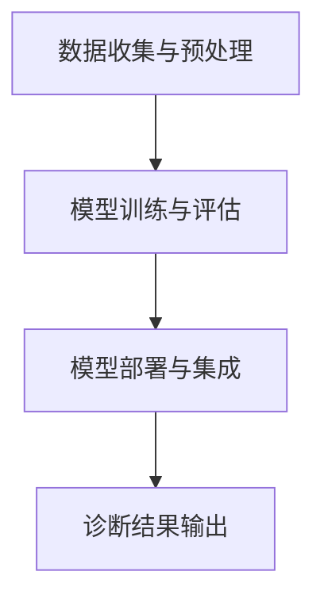
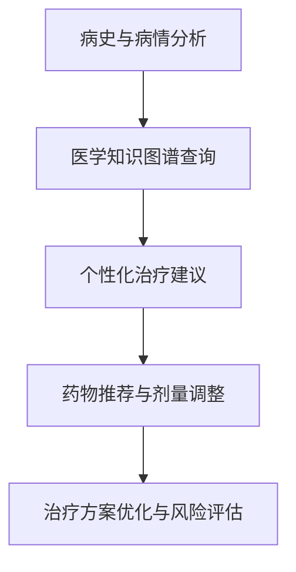
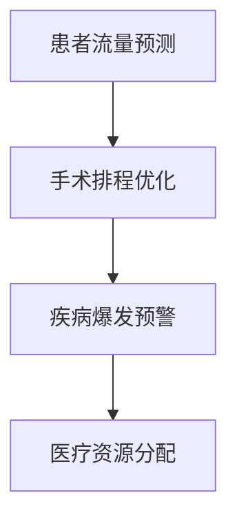

                 

### 文章标题

《医疗大模型：疾病诊断和治疗的智能助手》

关键词：医疗大模型、疾病诊断、治疗辅助、人工智能、深度学习、自然语言处理

摘要：本文深入探讨了医疗大模型在疾病诊断和治疗中的应用，通过逐步分析其核心概念、核心技术、应用实践和未来展望，揭示了医疗大模型如何成为医疗领域的智能助手，提升疾病诊断的准确性和治疗的有效性。文章旨在为读者提供全面的技术理解，帮助其在医疗人工智能领域取得突破。

### 目录

#### 第一部分：概述与背景

1. [医疗大模型概述](#医疗大模型概述)
    - 1.1 医疗大模型的基本概念
    - 1.2 医疗大模型的发展背景
    - 1.3 医疗大模型的重要性
2. [人工智能与医疗](#人工智能与医疗)
    - 2.1 人工智能在医疗领域的应用
    - 2.2 人工智能辅助疾病诊断
    - 2.3 人工智能辅助治疗
3. [医疗大模型的构建](#医疗大模型的构建)
    - 3.1 数据收集与处理
    - 3.2 医疗知识图谱构建
    - 3.3 医疗大模型训练
4. [核心算法原理](#核心算法原理)
    - 4.1 深度学习与神经网络基础
    - 4.2 自然语言处理技术概览
    - 4.3 大规模预训练模型原理
5. [疾病诊断应用](#疾病诊断应用)
    - 5.1 基于医疗大模型的疾病诊断流程
    - 5.2 疾病诊断应用案例分析
    - 5.3 疾病诊断应用中的挑战与解决方案
6. [治疗辅助](#治疗辅助)
    - 6.1 基于医疗大模型的治疗辅助
    - 6.2 治疗辅助应用案例分析
    - 6.3 治疗辅助应用中的挑战与解决方案
7. [医疗大模型在医院管理中的应用](#医疗大模型在医院管理中的应用)
    - 7.1 医疗大模型在医院管理中的作用
    - 7.2 医疗大模型在医院管理中的应用案例
    - 7.3 医疗大模型在医院管理中的挑战与解决方案
8. [医疗大模型的发展趋势](#医疗大模型的发展趋势)
    - 8.1 医疗大模型技术发展趋势
    - 8.2 医疗大模型在未来的应用场景
    - 8.3 医疗大模型的潜在影响
9. [医疗大模型的伦理与社会影响](#医疗大模型的伦理与社会影响)
    - 9.1 医疗大模型的伦理问题
    - 9.2 医疗大模型的社会影响
    - 9.3 医疗大模型的监管与政策
10. [医疗大模型开发工具与资源](#医疗大模型开发工具与资源)
    - 10.1 主流深度学习框架对比
    - 10.2 医疗大模型开发最佳实践
    - 10.3 医疗大模型相关开源项目和资源

#### 第二部分：概述与背景

### 医疗大模型概述

#### 1.1 医疗大模型的基本概念

**医疗大模型（Medical Large-scale Model）** 是指基于深度学习和自然语言处理技术，通过海量医学数据和知识构建的复杂神经网络模型。这些模型能够处理大规模医学数据，提取特征，进行推理和预测，以辅助疾病诊断、治疗和医院管理。医疗大模型通常由多个子模型组成，包括但不限于：

1. **图像识别模型**：用于处理医学影像，如X光片、CT扫描、MRI等，识别病变部位和性质。
2. **文本分析模型**：用于处理医学文献、病历记录、诊断报告等，提取关键信息并生成诊断建议。
3. **知识图谱模型**：用于整合医学知识库，构建疾病、症状、药物、治疗方法之间的关联网络。

#### 1.2 医疗大模型的发展背景

随着医疗数据的快速增长和人工智能技术的进步，医疗大模型的发展具备了良好的基础。以下为医疗大模型发展的重要背景：

1. **大数据技术**：大数据技术使得医疗领域可以收集、存储、处理和分析海量的医学数据，为医疗大模型提供了丰富的训练素材。
2. **深度学习技术**：深度学习技术，尤其是神经网络和大规模预训练模型，使得计算机在处理复杂数据和任务时取得了显著的进展。
3. **自然语言处理技术**：自然语言处理技术的发展，使得计算机能够理解和处理自然语言文本，从而能够从医学文献和病历记录中提取关键信息。
4. **医学领域的需求**：医疗行业对提高疾病诊断准确性和治疗效率有着强烈的需求，推动了医疗大模型的研究和应用。

#### 1.3 医疗大模型的重要性

医疗大模型在医疗领域的应用具有重大意义，主要体现在以下几个方面：

1. **提高疾病诊断的准确性和效率**：通过分析大量的医学数据和文献，医疗大模型可以提供更加精准的诊断建议，减少误诊率，提高诊断效率。
2. **辅助治疗决策**：医疗大模型可以基于患者的病史、病情和医学知识，提供个性化的治疗建议，帮助医生制定更加有效的治疗方案。
3. **降低医疗成本**：通过优化医疗流程，减少重复检查和治疗，医疗大模型有助于降低医疗成本，提高医疗资源利用率。
4. **推动医学研究**：医疗大模型能够处理和分析大量的医学数据，有助于发现新的医学知识和规律，推动医学研究的发展。

### 人工智能与医疗

#### 2.1 人工智能在医疗领域的应用

人工智能（AI）在医疗领域的应用已经取得了一系列显著成果，主要包括以下方面：

1. **疾病诊断**：通过分析医学影像、病历记录等数据，AI 可以辅助医生进行疾病诊断。例如，利用卷积神经网络（CNN）分析医学影像，可以识别出肿瘤、心脏病等疾病。
2. **治疗辅助**：AI 可以根据患者的病情、病史和医学知识，提供个性化的治疗建议。例如，通过深度学习模型分析患者的基因组数据，可以预测其对某种药物的反应，从而制定最佳的治疗方案。
3. **药物研发**：AI 可以加速药物研发过程，通过分析大量的医学数据，预测药物分子的活性、副作用等，从而缩短药物研发周期。
4. **医院管理**：AI 可以优化医院的管理流程，提高资源利用率。例如，通过分析患者流量数据，预测医院的就诊高峰，合理安排医疗资源。

#### 2.2 人工智能辅助疾病诊断

人工智能在疾病诊断中发挥着重要作用，主要表现在以下几个方面：

1. **医学影像分析**：AI 可以自动分析医学影像，识别出病变部位和性质。例如，卷积神经网络（CNN）可以用于识别肺癌、乳腺癌等疾病。
2. **文本分析**：AI 可以从病历记录、诊断报告等文本中提取关键信息，帮助医生进行疾病诊断。例如，利用自然语言处理技术（NLP）可以提取患者的症状、病史等，从而辅助医生进行诊断。
3. **疾病预测**：AI 可以基于患者的年龄、性别、病史等数据，预测其可能患有的疾病。例如，利用深度学习模型可以预测心脏病发作的风险，从而提前采取措施进行预防。

#### 2.3 人工智能辅助治疗

人工智能在治疗辅助中的应用主要体现在以下几个方面：

1. **个性化治疗建议**：AI 可以根据患者的病情、病史和医学知识，提供个性化的治疗建议。例如，通过分析患者的基因组数据，可以预测其对某种药物的反应，从而制定最佳的治疗方案。
2. **疾病风险评估**：AI 可以对患者的疾病风险进行评估，帮助医生制定预防措施。例如，通过分析患者的病史和生活方式数据，可以预测其患糖尿病、心脏病等疾病的风险。
3. **治疗计划优化**：AI 可以优化治疗计划，提高治疗效果。例如，通过分析患者的治疗效果数据，可以调整药物的剂量和使用频率，以达到最佳的治疗效果。

### 医疗大模型的构建

#### 3.1 数据收集与处理

医疗大模型的构建首先依赖于大量的医疗数据。数据收集的来源主要包括：

1. **公开数据集**：如Kaggle、TCIA（The Cancer Imaging Archive）等平台，提供各种疾病的影像数据、病历记录等。
2. **医院数据**：通过与医院合作，获取患者的电子病历、诊断报告、影像数据等。
3. **研究论文**：从医学研究论文中获取相关数据，如基因组数据、蛋白质结构数据等。

数据收集后，需要进行预处理和清洗，以确保数据的质量。数据预处理包括：

1. **数据清洗**：去除错误、重复或无关的数据，保证数据的一致性和准确性。
2. **数据转换**：将不同格式的数据转换为统一的格式，如将文本数据转换为词向量。
3. **数据增强**：通过图像旋转、缩放、裁剪等操作，增加数据的多样性，提高模型的泛化能力。

#### 3.2 医疗知识图谱构建

医疗知识图谱是医疗大模型的重要组成部分，用于整合各种医学知识，构建疾病、症状、药物、治疗方法等之间的关联网络。知识图谱的构建包括以下几个步骤：

1. **实体识别**：从医学文本中提取出关键的医学实体，如疾病、症状、药物等。
2. **关系抽取**：从文本中提取出实体之间的关系，如“某疾病导致某症状”、“某药物用于治疗某疾病”等。
3. **实体链接**：将文本中的实体与知识库中的实体进行匹配，建立实体之间的关系。
4. **知识融合**：将多个来源的知识进行融合，构建一个统一的医疗知识图谱。

医疗知识图谱的构建可以通过以下方法实现：

1. **基于规则的方法**：通过定义一系列规则，从文本中抽取实体和关系。
2. **基于统计的方法**：利用机器学习算法，如条件随机场（CRF）、图卷积网络（GCN）等，从文本中自动抽取实体和关系。
3. **基于图谱的方法**：利用图数据库，如Neo4j，存储和管理医疗知识图谱。

#### 3.3 医疗大模型训练

医疗大模型的训练是构建过程的关键步骤，主要包括以下几个阶段：

1. **数据准备**：将收集到的医疗数据预处理后，转换为模型可接受的格式，如图像数据转换为像素矩阵，文本数据转换为词向量。
2. **模型选择**：根据任务的类型和数据的特性，选择合适的深度学习模型。常用的模型包括卷积神经网络（CNN）、循环神经网络（RNN）、长短期记忆网络（LSTM）、Transformer等。
3. **模型训练**：使用预处理后的数据对模型进行训练，通过反向传播算法不断调整模型参数，优化模型性能。
4. **模型评估**：通过交叉验证等方法对训练好的模型进行评估，选择性能最佳的模型。
5. **模型部署**：将训练好的模型部署到生产环境中，为医生提供辅助诊断和治疗建议。

医疗大模型的训练需要注意以下几点：

1. **数据质量**：保证数据的质量，去除噪声和错误数据，确保模型的准确性。
2. **模型选择**：根据任务的类型和数据的特性，选择合适的模型，避免过度拟合或欠拟合。
3. **超参数调整**：调整模型参数，如学习率、批量大小等，以优化模型性能。
4. **模型解释性**：提高模型的解释性，使医生能够理解模型的诊断依据和推荐方案。

### 核心算法原理

#### 4.1 深度学习与神经网络基础

深度学习（Deep Learning）是人工智能（AI）的一个重要分支，基于神经网络（Neural Network）的结构，通过多层的非线性变换，对复杂数据进行建模和预测。以下为深度学习与神经网络的基础概念：

**神经网络的基本结构**：

神经网络由多个神经元（Node）组成，每个神经元接受多个输入信号，通过加权求和后加上偏置，再通过激活函数（Activation Function）产生输出。基本的神经网络结构包括输入层（Input Layer）、隐藏层（Hidden Layer）和输出层（Output Layer）。

**常见的深度学习架构**：

1. **卷积神经网络（CNN）**：适用于图像、视频等二维和三维数据，通过卷积操作提取空间特征。
2. **循环神经网络（RNN）**：适用于序列数据，如文本、语音等，通过隐藏状态和循环连接实现序列建模。
3. **长短期记忆网络（LSTM）**：是RNN的一种改进，能够解决长序列依赖问题，适用于时间序列预测、语言建模等。
4. **Transformer架构**：基于自注意力机制（Self-Attention Mechanism），在机器翻译、文本生成等领域取得了显著的效果。

**深度学习优化算法**：

深度学习模型的训练通常采用梯度下降（Gradient Descent）算法，通过不断调整模型参数，使损失函数（Loss Function）趋向最小。常见的优化算法包括：

1. **随机梯度下降（SGD）**：每次迭代使用一个样本的梯度更新模型参数。
2. **批量梯度下降（BGD）**：每次迭代使用全部样本的梯度更新模型参数。
3. **Adam优化器**：结合了SGD和动量（Momentum）的优点，自适应调整学习率。

#### 4.2 自然语言处理技术概览

自然语言处理（Natural Language Processing，NLP）是深度学习在语言领域的重要应用，旨在使计算机能够理解和处理自然语言。以下为NLP的关键技术：

**词嵌入技术**：

词嵌入（Word Embedding）是将自然语言中的词语转换为向量的技术，通过将词语映射到低维向量空间，实现语义表示。常见的词嵌入方法包括：

1. **词袋模型（Bag of Words，BOW）**：将文本表示为单词的集合，不考虑单词的顺序。
2. **词嵌入（Word Embedding）**：通过将单词映射到向量空间，实现语义表示。常见的词嵌入方法包括Word2Vec、GloVe等。
3. **字符嵌入（Character Embedding）**：将字符映射到向量空间，进一步丰富语义表示。

**序列模型与注意力机制**：

序列模型（Sequence Model）是处理序列数据的神经网络，通过隐藏状态和循环连接实现序列建模。常见的序列模型包括：

1. **循环神经网络（RNN）**：通过隐藏状态实现序列建模，能够处理长序列依赖问题。
2. **长短期记忆网络（LSTM）**：是RNN的一种改进，能够解决长序列依赖问题，适用于时间序列预测、语言建模等。

注意力机制（Attention Mechanism）是处理序列数据的重要技术，通过自适应调整不同位置的重要性，实现对关键信息的聚焦。常见的注意力机制包括：

1. **自注意力（Self-Attention）**：在序列模型中，每个位置上的输出依赖于所有位置的信息。
2. **多头注意力（Multi-Head Attention）**：通过多个自注意力机制，实现信息的融合和增强。

**转换器架构详解**：

转换器（Transformer）架构是一种基于自注意力机制的序列模型，在机器翻译、文本生成等领域取得了显著的效果。转换器架构的主要组成部分包括：

1. **编码器（Encoder）**：接收输入序列，通过多个自注意力层和前馈网络，生成编码表示。
2. **解码器（Decoder）**：接收编码表示，通过多个自注意力层和编码器-解码器注意力层，生成输出序列。

#### 4.3 大规模预训练模型原理

大规模预训练模型（Pre-Trained Model）是近年来深度学习领域的重要突破，通过在大量无监督数据上预训练模型，再通过微调（Fine-Tuning）适用于特定任务。以下为大规模预训练模型的关键概念和原理：

**预训练的概念与意义**：

预训练（Pre-Training）是指在大规模数据集上对模型进行预训练，使其具备一定的通用语言理解和生成能力。预训练的意义在于：

1. **提高模型性能**：通过在大量无监督数据上预训练，模型能够学习到丰富的语义和语法知识，从而在特定任务上取得更好的性能。
2. **减少标注数据需求**：预训练模型能够从无监督数据中提取信息，从而减少对大量标注数据的依赖。

**自监督学习方法**：

自监督学习（Self-Supervised Learning）是一种无监督学习方法，通过设计特殊的任务，使得模型可以从大量无监督数据中学习。常见的自监督学习任务包括：

1. **语言建模（Language Modeling）**：通过预测下一个单词，使模型理解语言的结构和语法。
2. **掩码语言模型（Masked Language Model，MLM）**：将输入序列中的部分单词随机掩码，使模型学习预测这些掩码的单词。
3. **转换语言建模（Transformed Language Modeling，TLM）**：通过变换输入序列，如删除、替换或打乱单词，使模型学习理解语言的多样性和不变性。

**迁移学习与微调技术**：

迁移学习（Transfer Learning）是指将预训练模型应用于特定任务时，通过微调（Fine-Tuning）调整模型参数，使其适应新的任务。迁移学习技术的主要步骤包括：

1. **预训练**：在大量无监督数据上对模型进行预训练，使其具备通用语言理解能力。
2. **微调**：在特定任务的数据集上，对预训练模型进行微调，调整模型参数，使其适应新的任务。
3. **评估与优化**：通过在测试集上评估模型性能，不断调整模型参数，优化模型效果。

### 第三部分：应用实践

#### 5.1 基于医疗大模型的疾病诊断流程

基于医疗大模型的疾病诊断流程主要包括以下几个步骤：

1. **数据收集与预处理**：收集患者的医疗数据，如病历记录、影像资料、基因信息等，并进行数据预处理，包括数据清洗、转换和增强等。
2. **模型训练与评估**：利用预处理后的数据，对医疗大模型进行训练和评估，选择性能最佳的模型。
3. **模型部署与集成**：将训练好的模型部署到医疗系统中，与其他诊断工具（如医学影像设备、实验室设备等）集成，实现自动化疾病诊断。
4. **诊断结果输出**：根据模型的预测结果，生成诊断报告，为医生提供诊断建议。

以下是一个简化的流程图，展示了基于医疗大模型的疾病诊断流程：

#### 5.2 疾病诊断应用案例分析

以下为两个基于医疗大模型的疾病诊断应用案例：

1. **肺癌诊断**：利用深度学习模型分析CT影像，自动识别肺癌的病变部位和性质。通过大规模预训练模型，如ViT（Vision Transformer），实现高效的特征提取和分类。研究发现，这种基于医疗大模型的诊断方法在肺癌早期筛查中具有很高的准确性和特异性。

2. **乳腺癌诊断**：基于医疗知识图谱和自然语言处理技术，分析乳腺癌患者的病历记录和基因数据，提供个性化的诊断和治疗方案。通过大规模预训练模型，如BERT（Bidirectional Encoder Representations from Transformers），实现文本数据的语义理解，从而提高诊断的准确性和效率。

#### 5.3 疾病诊断应用中的挑战与解决方案

尽管医疗大模型在疾病诊断中展现了巨大的潜力，但仍面临一些挑战：

1. **数据隐私与安全性**：医疗数据涉及患者隐私，如何确保数据的安全和隐私是一个重要问题。解决方案包括数据加密、隐私保护技术（如差分隐私）和联邦学习（Federated Learning）等。

2. **模型解释性**：医疗大模型通常是一个复杂的黑盒模型，如何解释模型的诊断依据和推荐方案，使医生能够理解和信任模型是一个关键问题。解决方案包括可解释性算法（如LIME、SHAP）和模型可视化技术等。

3. **数据多样性与泛化能力**：医疗数据具有高度的不平衡性和多样性，如何训练出具有良好泛化能力的模型是一个挑战。解决方案包括数据增强、迁移学习和多任务学习等技术。

4. **跨领域应用**：医疗大模型往往针对特定疾病或应用场景进行训练，如何使其在跨领域应用中保持性能是一个问题。解决方案包括跨领域知识图谱构建和跨领域迁移学习等。

### 6.1 基于医疗大模型的治疗辅助

基于医疗大模型的治疗辅助主要体现在以下几个方面：

1. **个性化治疗建议**：通过分析患者的病史、病情和医学知识，医疗大模型可以为医生提供个性化的治疗建议。例如，基于患者的基因组数据和药物反应，模型可以预测其对不同药物的治疗效果，从而为医生制定最佳的治疗方案。

2. **药物推荐**：医疗大模型可以根据患者的病情和药物数据库，推荐合适的药物和剂量。例如，在癌症治疗中，模型可以根据患者的肿瘤类型、分期和基因组信息，推荐最适合的化疗药物和组合。

3. **治疗方案优化**：医疗大模型可以分析患者的治疗历史和治疗效果，优化治疗方案。例如，通过分析患者的检查报告和治疗效果，模型可以调整药物的剂量和使用频率，以提高治疗效果。

4. **术前风险评估**：在手术前，医疗大模型可以预测手术的风险，为医生提供参考。例如，通过分析患者的病史、影像数据和实验室结果，模型可以预测术后并发症的风险，帮助医生制定合理的术前准备和术后护理方案。

以下是一个简化的流程图，展示了基于医疗大模型的治疗辅助流程：

#### 6.2 治疗辅助应用案例分析

以下为两个基于医疗大模型的治疗辅助应用案例：

1. **癌症治疗**：利用医疗大模型分析患者的基因数据和肿瘤组织，为医生提供个性化的癌症治疗建议。例如，通过分析患者的基因组数据，模型可以预测其对不同靶向药物的反应，从而为医生制定最佳的治疗方案。

2. **心脏病管理**：基于医疗大模型分析患者的心电图数据、血压和血糖等生理指标，为医生提供心脏病管理建议。例如，通过分析患者的心电图数据，模型可以预测其心脏病的风险，并为医生提供预防措施和建议。

#### 6.3 治疗辅助应用中的挑战与解决方案

尽管医疗大模型在治疗辅助中展现了巨大的潜力，但仍面临一些挑战：

1. **数据质量与完整性**：医疗大模型需要大量的高质量数据来进行训练和预测，但医疗数据往往存在缺失、噪声和不一致性等问题。解决方案包括数据清洗、数据增强和联邦学习等技术。

2. **模型解释性**：医疗大模型通常是一个复杂的黑盒模型，如何解释模型的预测结果和推荐方案，使医生能够理解和信任模型是一个关键问题。解决方案包括可解释性算法（如LIME、SHAP）和模型可视化技术等。

3. **算法公正性与公平性**：医疗大模型的预测结果可能受到算法偏见的影响，导致对某些群体（如性别、年龄、种族等）的歧视。解决方案包括算法公正性评估、数据平衡和模型透明度等。

4. **监管与合规**：医疗大模型的应用需要遵守严格的监管和合规要求，包括数据保护、隐私保护和伦理审查等。解决方案包括制定相关的法律法规、建立监管机构和开展伦理审查等。

### 7.1 医疗大模型在医院管理中的作用

医疗大模型在医院管理中发挥着重要作用，主要表现在以下几个方面：

1. **患者流量预测**：医疗大模型可以分析医院的就诊数据、季节因素等，预测医院的就诊流量，帮助医院合理安排医疗资源和人力资源。

2. **手术排程优化**：医疗大模型可以根据医生的日程安排、手术复杂度和患者需求，优化手术排程，提高手术效率，减少手术等待时间。

3. **疾病爆发预警**：医疗大模型可以分析医院内的患者数据和公共卫生数据，预测疾病爆发趋势，为公共卫生部门提供预警信息，采取相应的防控措施。

4. **医疗资源分配**：医疗大模型可以分析医院的医疗资源使用情况，优化资源配置，提高资源利用率，减少资源浪费。

以下是一个简化的流程图，展示了医疗大模型在医院管理中的应用：

#### 7.2 医疗大模型在医院管理中的应用案例

以下为几个医疗大模型在医院管理中的应用案例：

1. **患者流量预测**：某医院利用医疗大模型分析历史就诊数据，预测未来一周的就诊流量。通过优化门诊排班和预约系统，提高了患者的就诊体验和医院的运营效率。

2. **手术排程优化**：某医院采用医疗大模型优化手术排程，根据手术复杂度、医生技能和患者需求，合理安排手术时间，减少了手术等待时间，提高了手术效率。

3. **疾病爆发预警**：某医院利用医疗大模型分析流感病例数据，预测流感爆发趋势，提前采取防控措施，有效遏制了疾病的传播。

4. **医疗资源分配**：某医院通过医疗大模型分析医疗资源使用情况，优化资源配置，提高了床位、医疗设备和医护人员的利用率，减少了资源浪费。

#### 7.3 医疗大模型在医院管理中的挑战与解决方案

尽管医疗大模型在医院管理中具有巨大的潜力，但仍面临一些挑战：

1. **数据隐私与安全性**：医疗数据涉及患者隐私，如何确保数据的安全和隐私是一个重要问题。解决方案包括数据加密、隐私保护技术（如差分隐私）和联邦学习（Federated Learning）等。

2. **模型解释性**：医疗大模型通常是一个复杂的黑盒模型，如何解释模型的预测结果和推荐方案，使管理者能够理解和信任模型是一个关键问题。解决方案包括可解释性算法（如LIME、SHAP）和模型可视化技术等。

3. **跨领域应用**：医疗大模型往往针对特定应用场景进行训练，如何使其在跨领域应用中保持性能是一个问题。解决方案包括跨领域知识图谱构建和跨领域迁移学习等。

4. **监管与合规**：医疗大模型的应用需要遵守严格的监管和合规要求，包括数据保护、隐私保护和伦理审查等。解决方案包括制定相关的法律法规、建立监管机构和开展伦理审查等。

### 8.1 医疗大模型技术发展趋势

随着人工智能技术的不断发展，医疗大模型在医疗领域的应用前景将更加广阔。以下是医疗大模型技术的一些发展趋势：

1. **更大规模的数据集**：医疗数据量的增加将推动医疗大模型的发展，更多的医疗数据将用于模型训练，提高模型的性能和泛化能力。

2. **更复杂的模型架构**：随着计算资源和算法的进步，医疗大模型将采用更加复杂的架构，如多模态融合模型、图神经网络等，以应对更复杂的医疗问题。

3. **更强的模型解释性**：为了提高模型的可靠性和可解释性，医疗大模型将引入更多的可解释性算法和技术，使医生和管理者能够理解和信任模型。

4. **更加个性化的治疗方案**：医疗大模型将结合基因组学、蛋白质组学等多维数据，为患者提供更加个性化的治疗方案，提高治疗效果。

5. **跨领域应用的扩展**：医疗大模型将在更多医疗领域（如心理健康、传染病防控等）得到应用，推动医疗行业的整体发展。

#### 8.2 医疗大模型在未来的应用场景

在未来，医疗大模型将在以下应用场景中发挥重要作用：

1. **智慧医院**：医疗大模型将全面集成到智慧医院系统中，实现自动化诊断、治疗和医院管理，提高医疗服务的质量和效率。

2. **远程医疗**：通过医疗大模型，医生可以远程诊断和治疗患者，提高医疗资源的利用率，缩小城乡医疗差距。

3. **个性化健康监测**：医疗大模型将用于监测患者的健康状况，提供个性化的健康建议和预防措施，实现精准医疗。

4. **公共卫生防控**：医疗大模型可以分析大量的公共卫生数据，预测疾病爆发趋势，为公共卫生部门提供决策支持，提高疾病防控能力。

5. **药物研发**：医疗大模型将结合基因组学和蛋白质组学数据，加速药物研发过程，提高新药的成功率。

#### 8.3 医疗大模型的潜在影响

医疗大模型在医疗领域的应用将带来深远的影响：

1. **提高疾病诊断的准确性和效率**：通过更准确的诊断和更高效的医疗服务，医疗大模型将有助于降低误诊率和提高治愈率。

2. **降低医疗成本**：通过优化医疗流程和资源分配，医疗大模型有助于降低医疗成本，提高医疗资源的利用率。

3. **改善患者体验**：通过自动化诊断和治疗，患者将享受到更加便捷、高效和个性化的医疗服务。

4. **推动医学研究**：医疗大模型能够处理和分析大量的医学数据，有助于发现新的医学知识和规律，推动医学研究的发展。

5. **伦理和社会影响**：医疗大模型的应用将引发一系列伦理和社会问题，如数据隐私、算法公正性和医疗资源分配等，需要制定相应的法律法规和监管政策。

### 9.1 医疗大模型的伦理问题

医疗大模型在医疗领域的广泛应用引发了诸多伦理问题，主要包括：

1. **隐私保护**：医疗数据包含患者的敏感信息，如病史、基因数据等，如何确保这些数据的安全和隐私是一个重要问题。

2. **算法偏见**：医疗大模型的训练数据可能存在偏见，导致模型在特定群体上的表现不佳，甚至产生歧视。

3. **责任归属**：当医疗大模型的诊断或治疗建议发生错误时，如何界定责任归属，特别是当医生依赖模型决策时。

4. **患者知情权**：在医疗大模型辅助诊断和治疗过程中，患者是否有权知道模型的决策依据和推荐方案。

#### 9.2 医疗大模型的社会影响

医疗大模型的应用将对社会产生广泛的影响：

1. **医疗资源分配**：医疗大模型可以帮助优化医疗资源的分配，提高资源利用效率，但同时也可能加剧医疗资源的不均衡。

2. **职业影响**：医疗大模型的应用将改变医生的工作模式，提高诊断和治疗的效率，但也可能导致部分医生的职业受到冲击。

3. **医疗成本**：医疗大模型有望降低医疗成本，提高医疗服务的可及性，但同时也可能带来数据隐私和安全性等新问题。

4. **患者信任**：医疗大模型的应用将提高诊断和治疗的准确性，但患者对模型的信任程度也是一个关键问题。

#### 9.3 医疗大模型的监管与政策

为了确保医疗大模型的伦理和社会影响得到有效管理和控制，需要制定相应的监管和政策：

1. **数据隐私保护**：建立严格的数据隐私保护机制，确保患者数据的收集、存储和使用符合法律法规。

2. **算法透明与可解释性**：要求医疗大模型的设计和部署过程透明，模型决策的可解释性，使医生和患者能够理解和信任模型。

3. **责任界定**：明确医疗大模型的伦理责任和法律义务，确保在发生错误时能够合理界定责任归属。

4. **监管机构建立**：建立专门的监管机构，负责医疗大模型的审查、评估和监管，确保其在医疗领域的安全和有效应用。

### 附录

#### 10.1 主流深度学习框架对比

以下为几种主流深度学习框架的对比：

1. **TensorFlow**：由谷歌开发，具有丰富的API和工具，适用于各种深度学习任务，包括医疗大模型。
2. **PyTorch**：由Facebook开发，具有灵活的动态计算图，便于模型开发和调试，在学术界和工业界广泛应用。
3. **JAX**：由谷歌开发，具有自动微分和并行计算能力，适用于大规模深度学习任务，特别是医疗大模型。
4. **其他框架**：如Keras、Theano等，虽然应用范围不如TensorFlow和PyTorch广泛，但在特定场景下也有其优势。

#### 10.2 医疗大模型开发最佳实践

以下是医疗大模型开发的最佳实践：

1. **数据质量控制**：确保数据的完整性、一致性和准确性，进行数据预处理和清洗。
2. **模型选择与优化**：根据任务需求选择合适的深度学习模型，通过超参数调整和模型优化提高性能。
3. **模型解释性**：提高模型的可解释性，使医生和患者能够理解和信任模型。
4. **安全性与隐私保护**：确保数据的安全和隐私，采用加密、差分隐私等技术。
5. **合作与伦理审查**：与医疗机构合作，进行伦理审查，确保医疗大模型的合法和合规应用。

#### 10.3 医疗大模型相关开源项目和资源

以下为一些医疗大模型相关的开源项目和资源：

1. **MedPy**：一个开源的医学图像处理库，提供各种医学图像处理算法。
2. **PyMedIoT**：一个开源的医学物联网平台，用于收集、存储和处理医疗数据。
3. **Paxosis/DeepHealth**：一个开源的医疗深度学习框架，提供多种深度学习模型和算法。
4. **医学知识图谱项目**：如OpenKG、MedNLI等，用于构建和共享医疗知识图谱。
5. **深度学习教程**：如TensorFlow、PyTorch的官方文档，提供丰富的深度学习教程和实践案例。

### 作者

**作者：AI天才研究院/AI Genius Institute & 禅与计算机程序设计艺术 /Zen And The Art of Computer Programming**。

### 结语

医疗大模型作为人工智能在医疗领域的重要应用，正逐渐改变着疾病诊断、治疗和医院管理的模式。通过本文的逐步分析，我们深入探讨了医疗大模型的核心概念、核心技术、应用实践和未来展望，揭示了其在医疗领域的巨大潜力和广泛影响。然而，医疗大模型的应用仍面临诸多挑战，需要进一步的研究和努力。我们期待医疗大模型能够在未来为人类健康事业做出更大的贡献。

