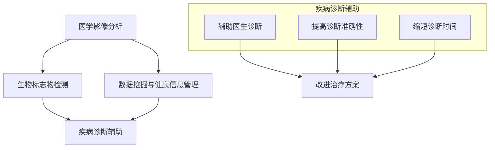
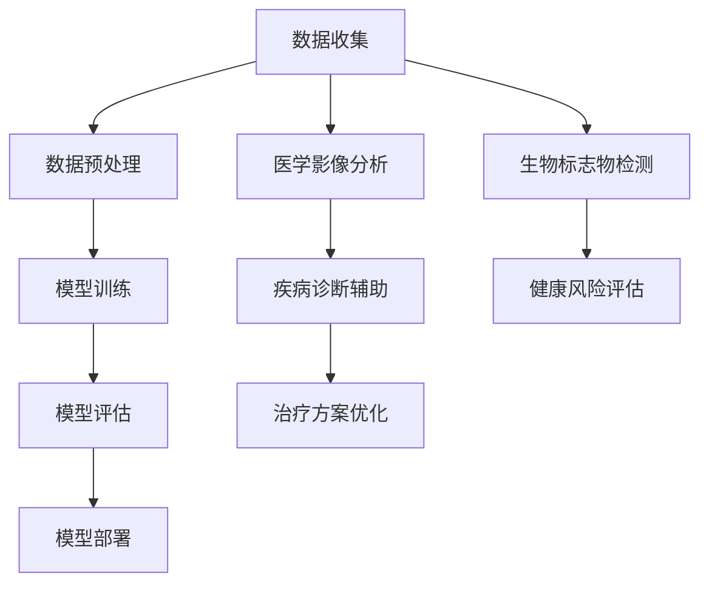

                 

### 核心概念与联系

**医疗诊断辅助的核心概念和架构**

医疗诊断辅助是一种利用人工智能和大数据技术，对医疗影像、生物标志物和健康数据进行深入分析，以辅助医生进行疾病诊断的方法。其核心概念包括医学影像分析、生物标志物检测和数据挖掘与健康信息管理。

**Mermaid 流程图**

以下是一个简化的医疗诊断辅助流程图，展示了这些核心概念的相互关系：



**详细解释与图例**

- **医学影像分析（A）**：通过计算机视觉技术对医学影像进行自动分析，包括图像分割、特征提取和分类。常见的应用场景包括肺癌、乳腺癌和脑肿瘤的诊断。
  
- **生物标志物检测（B）**：在血液、尿液或其他体液中检测与疾病相关的生物分子，如蛋白质、RNA和DNA。这些标志物可以用于疾病早期检测、预后评估和个性化治疗。

- **数据挖掘与健康信息管理（C）**：利用机器学习和统计分析方法，从大量医疗数据中提取有价值的信息，用于疾病预测、患者管理和医疗资源优化。

- **疾病诊断辅助（D）**：结合医学影像分析、生物标志物检测和数据挖掘的结果，为医生提供诊断建议和治疗方案。

**核心算法原理讲解**

- **医学影像分析中的卷积操作**

  卷积操作是医学影像分析中的基本工具，用于从图像中提取局部特征。以下是一个简单的卷积操作伪代码：

  ```plaintext
  function Convolution(image, filter):
      output = zeros((image_height, image_width))
      for x in range(0, image_width - filter_width + 1):
          for y in range(0, image_height - filter_height + 1):
              sum = 0
              for i in range(0, filter_width):
                  for j in range(0, filter_height):
                      sum += image[x+i, y+j] * filter[i, j]
              output[x, y] = sum
      return output
  ```

- **生物标志物检测中的支持向量机（SVM）**

  支持向量机是一种常用的分类算法，用于生物标志物检测。以下是一个简单的SVM伪代码：

  ```plaintext
  function SVM(features, labels):
      // 训练模型
      optimal_hyperplane = find_hyperplane(features, labels)
      // 预测新样本
      prediction = classify(new_features, optimal_hyperplane)
      return prediction
  ```

- **数据挖掘中的相似性度量**

  相似性度量是数据挖掘中的重要概念，用于比较和分类。以下是一个简单的余弦相似度计算公式：

  ```latex
  \cos(\theta) = \frac{\vec{a} \cdot \vec{b}}{|\vec{a}| |\vec{b}|}
  ```

  其中，$\vec{a}$和$\vec{b}$是两个向量，$\theta$是它们之间的夹角。

**举例说明**

假设我们要分析医学影像中的肿瘤标志物，我们可以使用余弦相似度来计算不同影像之间的相似性。给定两个影像向量$\vec{a}=[0.5, 0.6, 0.7]$和$\vec{b}=[0.4, 0.5, 0.6]$，它们的余弦相似度计算如下：

```plaintext
// 余弦相似度计算示例
vec_a = [0.5, 0.6, 0.7]
vec_b = [0.4, 0.5, 0.6]

dot_product = 0.5*0.4 + 0.6*0.5 + 0.7*0.6
magnitude_a = sqrt(0.5^2 + 0.6^2 + 0.7^2)
magnitude_b = sqrt(0.4^2 + 0.5^2 + 0.6^2)

cosine_similarity = dot_product / (magnitude_a * magnitude_b)

计算结果为 $ \cos(\theta) \approx 0.6366 $，这表明两个影像向量之间的相似度较高。
```

通过以上讲解，我们可以看到医疗诊断辅助涉及多个核心概念和算法，这些概念和算法之间相互联系，共同构成了一个完整的诊断体系。在接下来的章节中，我们将进一步探讨这些概念的原理和应用。

### 医学诊断辅助的背景与重要性

#### 医学诊断辅助的发展历程

医学诊断辅助的概念和技术并非一夜之间出现的，而是经过了数十年的发展。最早期的医学影像分析可以追溯到20世纪60年代，当时的放射科医生开始使用计算机来帮助分析X光片。然而，由于计算机技术的限制，这一时期的医学影像分析只能进行简单的图像分割和特征提取。

随着计算机性能的不断提升，医学影像分析技术逐渐得到广泛应用。20世纪80年代，计算机辅助诊断（CAD）系统开始出现，这些系统能够自动检测并标记出医学影像中的异常区域，如肿瘤和病变。然而，由于算法的局限性，这些系统的准确性和可靠性仍然较低。

进入21世纪，随着深度学习和其他人工智能技术的快速发展，医学诊断辅助迎来了新的突破。深度学习模型，特别是卷积神经网络（CNN）和递归神经网络（RNN），在医学影像分析中取得了显著的成果。这些模型能够自动学习并提取图像中的复杂特征，大大提高了诊断的准确性和效率。

#### 精准医疗与医疗诊断辅助的关系

精准医疗是一种基于个体基因、环境和疾病状态进行个性化治疗的方法。其核心理念是“一人一方”，即根据患者的具体情况进行诊断和治疗，以提高治疗效果和降低副作用。

医疗诊断辅助是精准医疗的重要组成部分。通过医学影像分析、生物标志物检测和数据挖掘等技术，医疗诊断辅助系统能够提供更准确、更及时的诊断结果，帮助医生制定个性化的治疗方案。例如，在肺癌诊断中，基于深度学习的医学影像分析系统可以自动识别出肺结节，并预测其恶性的可能性，从而帮助医生决定是否需要进行进一步检查或手术。

#### 人类计算在医疗诊断辅助中的应用

人类计算是指利用计算机算法和大数据技术模拟人类思维过程，以解决复杂问题的一种方法。在医疗诊断辅助中，人类计算的应用主要体现在以下几个方面：

1. **医学影像分析**：通过深度学习算法，计算机可以自动分析医学影像，如X光片、CT和MRI，识别出肿瘤、骨折和其他病变。

2. **生物标志物检测**：利用机器学习算法，计算机可以从生物样本中检测出与疾病相关的生物标志物，如蛋白质、RNA和DNA。

3. **数据挖掘与健康信息管理**：通过数据挖掘技术，计算机可以从海量医疗数据中提取出有价值的信息，如疾病预测、患者管理和医疗资源优化。

#### 总结

医学诊断辅助技术的发展经历了从简单的计算机辅助诊断到复杂的深度学习和人工智能的演变。精准医疗的兴起进一步推动了医学诊断辅助的应用。人类计算在医学诊断辅助中发挥了重要作用，通过医学影像分析、生物标志物检测和数据挖掘等技术，为医生提供了更准确、更高效的诊断工具。在未来，随着人工智能技术的不断发展，医学诊断辅助将在精准医疗领域发挥更加重要的作用。

### 医学影像分析的基本原理

医学影像分析作为医疗诊断辅助的关键组成部分，其基本原理涉及多个技术领域，包括医学影像技术、医学影像数据处理流程以及相关的算法和工具。下面，我们将详细探讨这些基本原理。

#### 医学影像技术概述

医学影像技术是医学影像分析的基础，它利用物理原理和先进设备，生成人体内部结构的可视化图像。常见的医学影像技术包括X光、计算机断层扫描（CT）、磁共振成像（MRI）和超声波成像等。

- **X光**：通过发射X射线穿透人体，并在感光胶片或数字探测器上形成图像。X光常用于骨折、肺炎等疾病的诊断。

- **CT**：利用多个X光片在各个角度的叠加，重建出人体内部的断层图像。CT对密度差异较大的组织，如骨骼和软组织，有较高的分辨率。

- **MRI**：利用磁场和射频脉冲，激发人体内的氢原子核产生信号，经过处理形成图像。MRI对软组织，特别是神经系统和肿瘤，具有很高的分辨率。

- **超声波成像**：利用超声波在人体内传播时的反射信号，形成图像。超声波成像常用于孕妇产前检查、肝、胆、脾、肾等器官的检查。

#### 医学影像数据处理流程

医学影像分析通常包括以下几个关键步骤：

1. **图像采集**：使用医学影像设备采集患者体内的图像数据。

2. **图像预处理**：对采集到的原始图像进行预处理，以提高图像质量。预处理步骤包括去噪声、对比度增强、锐化等。

3. **图像分割**：将图像中感兴趣的区域（如肿瘤、病变）与其他区域分离。常用的分割方法包括阈值法、区域增长法和基于边缘检测的方法。

4. **特征提取**：从分割后的图像中提取与疾病相关的特征，如大小、形状、纹理等。这些特征将用于后续的分析和分类。

5. **特征选择**：从提取的特征中筛选出最有用的特征，以减少计算量和提高分类准确率。

6. **模式识别**：使用机器学习和深度学习算法，对特征进行分类和预测。常见的算法包括支持向量机（SVM）、随机森林（RF）和卷积神经网络（CNN）。

#### 主流医学影像分析算法

在医学影像分析中，有多种算法被广泛应用于图像分割、特征提取和模式识别。以下是几种主流的算法：

1. **卷积神经网络（CNN）**：CNN是一种深度学习算法，特别适用于图像处理。它通过多层卷积和池化操作，自动提取图像中的高级特征，从而实现高效的特征学习和分类。

   ```plaintext
   // CNN 模型架构伪代码
   class ConvolutionalNeuralNetwork:
       def __init__(self):
           self.conv1 = Conv2D(...)
           self.pool1 = MaxPooling2D(...)
           self.conv2 = Conv2D(...)
           self.pool2 = MaxPooling2D(...)
           self.fc1 = Dense(...)
           self.fc2 = Dense(1, activation='sigmoid')

       def forward(self, x):
           x = self.conv1(x)
           x = self.pool1(x)
           x = self.conv2(x)
           x = self.pool2(x)
           x = self.fc1(x)
           x = self.fc2(x)
           return x
   ```

2. **支持向量机（SVM）**：SVM是一种经典的机器学习算法，用于二分类问题。它通过找到最优超平面，将不同类别的样本分隔开来。

   ```plaintext
   // SVM 伪代码
   function SVM(features, labels):
       // 训练模型
       optimal_hyperplane = find_hyperplane(features, labels)
       // 预测新样本
       prediction = classify(new_features, optimal_hyperplane)
       return prediction
   ```

3. **随机森林（RF）**：随机森林是一种集成学习方法，通过构建多个决策树，并取其平均预测结果，提高分类和回归任务的性能。

   ```plaintext
   // 随机森林伪代码
   function RandomForest(features, labels, n_trees):
       for i in range(n_trees):
           train_features, train_labels = random_split(features, labels)
           tree = DecisionTree(train_features, train_labels)
           predictions.append(tree.predict(new_features))
       return average(predictions)
   ```

#### 医学影像分析的挑战与解决方案

尽管医学影像分析在医疗诊断中发挥了重要作用，但仍然面临一些挑战：

1. **图像质量**：医学影像的质量受到多种因素的影响，如设备精度、患者运动和噪声等。提高图像质量是医学影像分析中的一个重要问题。

   - **解决方案**：使用先进的图像预处理技术，如去噪、图像融合和增强，可以提高图像质量。

2. **算法复杂度**：深度学习模型，特别是大型神经网络，需要大量的计算资源和时间进行训练和推断。

   - **解决方案**：采用分布式计算和优化算法，如模型剪枝和量化，可以减少计算资源的需求。

3. **数据隐私和安全性**：医学影像数据包含敏感的个人信息，确保数据隐私和安全性是医学影像分析中必须考虑的问题。

   - **解决方案**：采用加密技术和隐私保护算法，如差分隐私和联邦学习，可以保护患者的隐私。

通过上述讨论，我们可以看到医学影像分析的基本原理涉及多个技术领域，包括医学影像技术、数据处理流程和算法。面对挑战，通过先进技术和创新方法，我们可以不断提高医学影像分析的性能和实用性。在未来，随着人工智能技术的不断发展，医学影像分析将在医疗诊断中发挥更加重要的作用。

### 生物标志物检测的基本原理

#### 生物标志物的类型与功能

生物标志物是生物体内部或外部分泌的化学物质，它们能够反映生物体的生理和病理状态。根据来源和性质，生物标志物可以分为以下几类：

1. **蛋白质标志物**：蛋白质是生物体内最常见的生物标志物，如酶、激素和抗体。它们在细胞代谢、免疫反应和疾病发生中起着关键作用。

2. **核酸标志物**：核酸标志物包括DNA和RNA，它们在基因表达调控和遗传疾病诊断中具有重要应用。例如，通过检测血液中的微RNA（miRNA），可以预测某些癌症的预后。

3. **代谢物标志物**：代谢物是生物体在新陈代谢过程中产生的低分子量化合物，如葡萄糖、乳酸和尿酸。这些标志物可以反映生物体的代谢状态和健康状况。

4. **小分子标志物**：小分子标志物包括氨基酸、脂质和多糖等，它们在生物体内参与多种生物过程，如细胞信号传递和能量代谢。

#### 生物标志物检测技术

生物标志物检测技术是生物标志物研究的关键环节，用于从生物样本中检测和量化特定标志物的浓度。以下是一些常见的生物标志物检测技术：

1. **酶联免疫吸附试验（ELISA）**：ELISA是一种常用的免疫学检测方法，通过酶标记的抗原或抗体与生物样本中的目标蛋白质结合，产生颜色变化，从而定量检测目标蛋白。

2. **实时定量PCR（qPCR）**：qPCR是一种用于检测和定量核酸的方法，通过在特定温度下扩增目标DNA或RNA序列，并使用荧光标记检测扩增产物，实现高灵敏度和高特异性的检测。

3. **质谱分析（MS）**：质谱分析是一种高灵敏度的检测技术，通过测量离子化后的生物分子质量，可以精确鉴定和定量复杂的生物样品。

4. **流式细胞术（FCM）**：流式细胞术是一种用于分析单个细胞或粒子的技术，通过测量细胞表面或内部标记物的荧光信号，可以实时监测细胞特征和功能。

#### 生物标志物检测在疾病诊断中的应用

生物标志物检测在疾病诊断中发挥着重要作用，可以帮助医生进行早期诊断、疾病监测和预后评估。以下是一些典型的应用案例：

1. **肿瘤诊断**：肿瘤标志物如CEA、PSA和CA-125等，在多种肿瘤的诊断中具有高特异性。通过检测血液中的这些标志物，可以帮助医生早期发现肿瘤，制定个性化的治疗方案。

2. **心血管疾病监测**：心血管疾病如心肌梗死和高血压等，可以通过检测血液中的生物标志物如NT-proBNP和肌钙蛋白等，进行早期诊断和风险评估。

3. **神经退行性疾病诊断**：神经退行性疾病如阿尔茨海默病和帕金森病等，可以通过检测脑脊液中的特定蛋白标志物，如Aβ42和Tau蛋白，帮助诊断和监测疾病进展。

4. **遗传病筛查**：某些遗传病如囊性纤维化和地中海贫血等，可以通过检测DNA或RNA中的特定突变，进行早期筛查和预防。

#### 生物标志物检测的挑战与解决方案

生物标志物检测面临一些技术挑战，如高灵敏度、高特异性和高通量检测等。以下是一些主要的挑战和解决方案：

1. **灵敏度与特异性的平衡**：高灵敏度的检测方法可能导致假阳性率增加，而高特异性的方法可能降低灵敏度。解决这一挑战的关键是优化检测方法和标准操作流程，以提高检测性能。

2. **样本处理与存储**：生物样本的处理和存储对检测结果的准确性有重要影响。为了确保检测的可靠性，需要采用标准化和优化的样本处理和存储方法。

3. **高通量检测**：随着生物标志物研究的深入，需要高通量检测技术来处理大量样本。高通量测序（HTS）和多重检测平台等技术可以满足这一需求。

4. **跨平台兼容性**：不同实验室和检测平台之间需要实现数据的兼容和互操作性，以确保检测结果的可靠性和一致性。

通过上述讨论，我们可以看到生物标志物检测在疾病诊断中具有重要应用。尽管面临一些挑战，但随着技术的不断发展，生物标志物检测将在精准医疗和个性化治疗中发挥越来越重要的作用。

### 数据挖掘与健康信息管理的基本概念

#### 数据挖掘的基本概念

数据挖掘是一种通过从大量数据中提取有用信息和知识的技术，广泛应用于各个领域，包括商业、金融、医疗和教育。在医疗领域，数据挖掘可以用于疾病预测、患者管理和医疗资源优化。

1. **数据源**：数据挖掘的数据源可以是电子健康记录（EHRs）、医学影像、基因组数据等。这些数据源包含了大量的医疗信息和患者信息。

2. **数据预处理**：在数据挖掘过程中，首先需要对原始数据进行预处理，包括数据清洗、数据集成和数据转换等。数据清洗用于去除错误和异常数据，数据集成用于合并来自不同数据源的信息，数据转换用于将数据转换为适合挖掘的形式。

3. **挖掘任务**：数据挖掘的任务包括分类、聚类、关联规则挖掘、异常检测和预测等。分类任务用于将数据分为不同的类别，聚类任务用于发现数据中的相似性模式，关联规则挖掘用于发现数据之间的关联关系，异常检测用于识别数据中的异常现象，预测任务用于预测未来的趋势和事件。

#### 健康信息管理系统

健康信息管理系统（HIS）是一种用于收集、存储、管理和共享医疗信息的计算机系统。它可以帮助医疗机构提高效率、优化资源分配并改善患者护理。

1. **系统架构**：健康信息管理系统通常包括多个模块，如患者信息管理、医学影像管理、实验室结果管理和电子病历等。这些模块通过数据接口和集成平台相互连接，形成一个统一的系统。

2. **功能**：
   - **患者信息管理**：记录和跟踪患者的个人信息、病史、就诊记录和药物过敏史等。
   - **医学影像管理**：存储和管理患者的医学影像数据，如X光片、CT和MRI等。
   - **实验室结果管理**：记录和跟踪患者的实验室检测结果，如血液检查、尿液检查和基因检测等。
   - **电子病历**：记录和存储患者的临床诊断和治疗信息，为医生提供全面的医疗记录。

3. **数据共享与互操作**：健康信息管理系统需要支持数据共享和互操作性，以确保不同系统和医疗机构之间的数据交换和整合。这有助于提高医疗协作效率，实现精准医疗。

#### 数据挖掘在健康信息管理中的应用实例

数据挖掘在健康信息管理中有着广泛的应用，以下是一些典型的应用实例：

1. **疾病预测**：通过分析患者的电子健康记录和实验室检测结果，数据挖掘可以预测患者未来的疾病风险。例如，利用临床数据预测心脏病发作风险，有助于医生提前采取预防措施。

2. **患者分类**：数据挖掘可以用于对患者进行分类，如根据患者的病史和临床特征将其分为高风险或低风险群体。这有助于优化医疗资源分配，提高医疗服务质量。

3. **个性化治疗**：通过分析患者的基因组数据、电子健康记录和临床特征，数据挖掘可以提供个性化的治疗方案。例如，根据患者的基因组信息，为癌症患者推荐最佳的治疗方案。

4. **医疗资源优化**：数据挖掘可以用于分析医疗资源的利用情况，如医院床位、手术设备和人力资源等。这有助于医疗机构优化资源分配，提高运营效率。

通过上述讨论，我们可以看到数据挖掘和健康信息管理系统在医疗领域的重要应用。随着大数据和人工智能技术的发展，这些技术将在精准医疗和个性化治疗中发挥越来越重要的作用。

### 深度学习与医学影像分析

#### 深度学习在医学影像分析中的应用

深度学习作为一种先进的机器学习技术，近年来在医学影像分析中取得了显著进展。它通过模拟人脑神经网络结构，从大量医学影像数据中自动提取特征，实现疾病的自动识别和诊断。以下是深度学习在医学影像分析中的几个关键应用：

1. **图像分割**：图像分割是将医学影像中不同组织或病变区域从背景中分离出来的过程。深度学习模型，特别是卷积神经网络（CNN）和U-Net架构，被广泛应用于图像分割任务。通过学习大量的标注数据，模型可以自动识别并分割出肺部结节、肿瘤和病变区域。

   - **算法架构**：U-Net是一种常用于医学影像分割的卷积神经网络架构，它通过一个对称的编码器-解码器结构，实现精细的空间特征提取和上下文信息融合。

   - **实现细节**：U-Net包含多个卷积层、池化层和反卷积层。卷积层用于提取图像特征，池化层用于降低特征空间维度，反卷积层则用于上采样，恢复分割图的原始分辨率。

2. **疾病分类**：深度学习模型还可以用于对医学影像进行分类，如区分不同类型的肿瘤或判断影像是否存在异常。通过训练大型卷积神经网络，如ResNet和Inception，模型可以从复杂的医学影像数据中学习到丰富的特征，实现高精度的分类。

   - **算法架构**：ResNet和Inception是两种经典的深度学习模型架构，它们通过增加网络的深度和宽度，提高了模型的性能和泛化能力。

   - **实现细节**：ResNet使用残差连接，解决了深度网络训练中的梯度消失问题，而Inception模块则通过将多个卷积核组合在一起，实现了特征融合和多样化。

3. **病灶检测**：病灶检测是指从医学影像中检测出特定病灶或异常区域，如肺结节、乳腺钙化和视网膜病变等。深度学习模型，如YOLO和Faster R-CNN，被广泛应用于病灶检测任务。

   - **算法架构**：YOLO（You Only Look Once）是一种单阶段检测模型，通过将检测任务整合到卷积神经网络中，实现了实时和高效的目标检测。Faster R-CNN是一种两阶段检测模型，它首先使用区域提议网络（RPN）生成候选区域，然后对这些区域进行分类和定位。

   - **实现细节**：YOLO通过将检测任务分解为多个卷积层和预测层，实现了快速的目标检测。Faster R-CNN则通过结合RPN和分类网络，提高了检测的准确性和效率。

#### 主流医学影像分析模型

在医学影像分析中，有多种深度学习模型被广泛应用，以下是一些主流模型及其特点：

1. **卷积神经网络（CNN）**：CNN是最早应用于医学影像分析的深度学习模型，通过卷积操作提取图像特征，实现图像分类、分割和检测。

   - **特点**：CNN结构简单，计算效率高，适用于处理二维图像数据。

2. **递归神经网络（RNN）**：RNN是一种适用于处理序列数据的深度学习模型，通过记忆机制对历史信息进行建模，适用于医学影像序列分析。

   - **特点**：RNN能够处理具有时间依赖性的数据，适用于动态变化的过程。

3. **卷积神经网络（CNN）与RNN结合**：结合CNN和RNN的优点，可以同时处理医学影像的空间和时间信息，实现更复杂的特征提取和建模。

   - **特点**：结合模型能够捕捉医学影像中的时空特征，提高分析精度。

4. **生成对抗网络（GAN）**：GAN是一种通过生成模型和判别模型相互对抗，实现数据生成和增强的深度学习模型，被广泛应用于医学影像的合成和增强。

   - **特点**：GAN能够生成高质量的医学影像数据，提高模型的训练效果。

#### 医学影像分析的挑战与解决方案

尽管深度学习在医学影像分析中取得了显著进展，但仍然面临一些挑战：

1. **数据不足**：医学影像数据量大，但高质量的标注数据较少，限制了模型的训练效果。

   - **解决方案**：通过数据增强、数据合成和迁移学习等方法，扩充训练数据集，提高模型的泛化能力。

2. **计算资源消耗**：深度学习模型，特别是大型卷积神经网络，需要大量的计算资源和时间进行训练和推断。

   - **解决方案**：采用分布式计算、模型压缩和量化等技术，提高模型的计算效率。

3. **模型解释性**：深度学习模型通常被视为“黑盒”，其内部机制难以解释，这在医疗领域可能带来伦理和合规问题。

   - **解决方案**：通过模型可解释性技术，如注意力机制和决策路径追踪，提高模型的透明度和解释性。

4. **多模态融合**：医学影像通常包含多种模态数据，如CT、MRI和PET等，如何有效地融合多模态信息，提高诊断精度，是一个重要的研究问题。

   - **解决方案**：通过多模态学习、特征融合和级联网络等技术，实现多模态信息的有效融合。

通过上述讨论，我们可以看到深度学习在医学影像分析中具有广泛的应用前景。尽管面临一些挑战，随着技术的不断发展和创新，深度学习将在医学影像分析领域发挥越来越重要的作用，为精准医疗和个性化治疗提供强大的支持。

### 机器学习与生物标志物检测

#### 机器学习在生物标志物检测中的应用

机器学习技术在生物标志物检测中扮演着关键角色，通过从大量生物样本数据中自动学习和提取特征，实现对疾病状态的准确判断。以下是机器学习在生物标志物检测中的一些具体应用：

1. **特征选择**：在生物标志物检测中，从大量的生物标志物中筛选出最有价值的特征是一个重要的步骤。机器学习算法，如随机森林（Random Forest）、支持向量机（SVM）和主成分分析（PCA），可以有效地进行特征选择，从而提高检测的准确性和效率。

   - **随机森林**：随机森林是一种基于决策树的集成学习方法，通过构建多个决策树并取其平均预测结果，提高了分类的准确性和稳定性。
   
   - **支持向量机**：支持向量机是一种基于间隔最大化原理的分类算法，通过找到一个最优超平面，将不同类别的样本分隔开来。

   - **主成分分析**：主成分分析是一种降维技术，通过将高维数据投影到低维空间中，提取出数据的主要特征，从而减少计算量和提高分类效率。

2. **疾病诊断**：机器学习算法可以用于对生物标志物进行分类，从而实现疾病的诊断。例如，利用微RNA（miRNA）作为生物标志物，通过机器学习模型预测患者的疾病状态，如癌症的早期诊断。

   - **算法示例**：利用支持向量机（SVM）对miRNA数据进行分类，预测肺癌患者的生存率。通过训练和测试数据集的对比分析，发现SVM在癌症诊断中的准确率较高。

3. **预后评估**：机器学习技术还可以用于对患者的预后进行评估，通过分析生物标志物的表达水平，预测患者的疾病进展和治疗效果。

   - **算法示例**：利用随机森林（Random Forest）对血液中的蛋白质标志物进行预测，评估乳腺癌患者的复发风险。通过大规模临床数据的分析，发现随机森林在预后评估中的表现优于传统统计方法。

#### 主流生物标志物检测算法

在生物标志物检测中，有多种主流算法被广泛应用于疾病诊断和预后评估。以下是几种常见的算法及其特点：

1. **支持向量机（SVM）**：支持向量机是一种基于间隔最大化原理的线性分类算法，通过找到一个最优超平面，将不同类别的样本分隔开来。

   - **特点**：SVM具有较好的分类性能，尤其是在样本数量较少的情况下，能够提供稳定的结果。

2. **随机森林（Random Forest）**：随机森林是一种基于决策树的集成学习方法，通过构建多个决策树并取其平均预测结果，提高了分类的准确性和稳定性。

   - **特点**：随机森林能够处理高维数据和非线性关系，且具有较好的泛化能力。

3. **逻辑回归（Logistic Regression）**：逻辑回归是一种用于二分类和多元分类的线性模型，通过估计样本属于某一类别的概率。

   - **特点**：逻辑回归具有简单和易于解释的优点，适用于需要快速评估的分类任务。

4. **神经网络（Neural Networks）**：神经网络是一种基于人脑神经网络结构的机器学习模型，通过多层神经元进行特征提取和分类。

   - **特点**：神经网络能够自动学习复杂的非线性关系，适用于复杂的生物标志物检测任务。

#### 生物标志物检测的挑战与解决方案

尽管机器学习技术在生物标志物检测中具有广泛的应用前景，但仍然面临一些挑战：

1. **数据不平衡**：生物标志物检测中的数据通常存在类别不平衡的问题，即正类（疾病）样本较少，负类（健康）样本较多。这种不平衡会导致模型偏向于负类，影响检测的准确性。

   - **解决方案**：采用数据增强、过采样和欠采样等方法，平衡数据分布，提高模型对正类样本的识别能力。

2. **特征选择**：在生物标志物检测中，从大量的生物标志物中筛选出最有价值的特征是一个复杂的问题。特征选择不当可能导致模型性能下降。

   - **解决方案**：采用基于信息论的 Feature Importance 方法、LASSO 回归等方法，选择具有高相关性和区分性的特征。

3. **模型泛化能力**：生物标志物检测需要模型具有良好的泛化能力，以应对不同样本和不同环境下的检测任务。

   - **解决方案**：采用交叉验证、集成学习和迁移学习等方法，提高模型的泛化能力和鲁棒性。

4. **数据隐私和伦理问题**：生物标志物检测涉及敏感的个人信息和健康数据，如何保护患者隐私和确保数据安全是一个重要问题。

   - **解决方案**：采用差分隐私、联邦学习和数据加密等方法，保护患者隐私和确保数据安全。

通过上述讨论，我们可以看到机器学习技术在生物标志物检测中的应用及其面临的挑战。随着技术的不断发展，机器学习将在生物标志物检测中发挥越来越重要的作用，为疾病的早期诊断和个性化治疗提供强大的支持。

### 数据挖掘在健康信息管理中的应用

#### 数据挖掘在健康信息管理中的价值

数据挖掘在健康信息管理中扮演着重要的角色，其价值主要体现在以下几个方面：

1. **疾病预测**：通过分析大量的健康数据和患者病史，数据挖掘可以帮助预测疾病的发生风险，从而实现疾病的早期预防。例如，利用患者的电子健康记录（EHRs）和生物标志物数据，可以预测心脏病、糖尿病和癌症等疾病的风险。

2. **患者管理**：数据挖掘技术可以帮助医疗机构更好地管理患者，提高医疗服务的质量和效率。通过对患者数据的分析，医生可以更好地了解患者的健康状况，制定个性化的治疗方案，并监控治疗效果。

3. **医疗资源优化**：数据挖掘技术可以帮助医疗机构优化资源分配，提高运营效率。例如，通过对医院的患者流量、手术时间和设备使用情况进行分析，可以优化人力资源和设备的配置，减少等待时间和成本。

4. **个性化医疗**：数据挖掘技术可以为个性化医疗提供支持。通过对患者的基因组数据、生活习惯和疾病历史进行分析，可以为患者制定个性化的预防、诊断和治疗策略。

#### 健康信息管理的核心问题

健康信息管理涉及到大量的数据，如何有效地管理和利用这些数据是核心问题。以下是健康信息管理中需要解决的一些关键问题：

1. **数据质量**：数据质量是健康信息管理的基础。数据中的错误、缺失和重复会影响分析结果。因此，需要建立严格的数据质量管理和监控机制，确保数据的准确性、完整性和一致性。

2. **数据整合**：健康信息通常分布在不同的数据源和系统中，如何有效地整合这些数据是健康信息管理的难点。通过数据集成和融合技术，可以将来自不同系统和数据源的数据整合到一个统一的平台上，为数据挖掘和分析提供基础。

3. **隐私保护**：健康数据包含敏感的个人信息，如何保护患者隐私是一个重要问题。需要采用数据加密、隐私保护和访问控制等技术，确保患者的数据在传输、存储和使用过程中得到保护。

4. **数据安全**：健康数据的安全性问题不容忽视。需要建立完善的数据安全策略，包括数据备份、恢复和防篡改等，确保数据的安全性。

#### 数据挖掘在健康信息管理中的应用实例

数据挖掘在健康信息管理中有着广泛的应用，以下是一些具体的应用实例：

1. **患者流失预测**：通过分析患者的就诊记录、咨询记录和消费行为，数据挖掘可以帮助医疗机构预测患者流失的风险，从而采取有效的措施减少患者流失。

2. **手术风险评估**：通过对手术患者的病历数据进行分析，数据挖掘可以帮助医生评估手术的风险，制定个性化的手术方案，提高手术的成功率和安全性。

3. **疾病传播预测**：通过分析疫情数据和患者流动数据，数据挖掘可以帮助预测疾病的传播趋势，为公共卫生决策提供支持。

4. **药物反应预测**：通过对患者的药物使用记录和健康数据进行分析，数据挖掘可以帮助预测患者对特定药物的敏感性和不良反应，为药物研发和个性化治疗提供支持。

通过上述讨论，我们可以看到数据挖掘在健康信息管理中的重要性及其应用价值。随着技术的不断发展和数据量的不断增加，数据挖掘将在健康信息管理中发挥越来越重要的作用，为精准医疗和个性化治疗提供强大的支持。

### 医疗诊断辅助项目的实施策略

#### 项目规划与资源分配

医疗诊断辅助项目是一个复杂的过程，需要详细的规划和有效的资源分配。以下是项目规划与资源分配的关键步骤：

1. **需求分析**：首先，需要明确项目目标、需求和技术要求。通过与医生、临床专家和研究人员沟通，了解他们对医疗诊断辅助系统的期望和需求。

2. **项目计划**：制定详细的项目计划，包括项目范围、时间表、里程碑和关键任务。项目计划应该考虑技术实现、数据获取、模型训练和系统测试等各个环节。

3. **资源分配**：根据项目需求，合理分配资源，包括人力资源、技术资源、设备和预算。确保每个环节都有足够的人力、技术和设备支持。

4. **风险评估**：评估项目可能遇到的风险，如技术难题、数据隐私问题、项目延误等，并制定相应的应对策略。

5. **团队组建**：组建一个多学科团队，包括医生、数据科学家、工程师、IT专家等，确保项目团队具备完成项目所需的技能和经验。

#### 项目风险管理

在医疗诊断辅助项目中，风险管理是确保项目顺利进行的关键。以下是项目风险管理的一些关键步骤：

1. **风险识别**：识别项目可能面临的风险，如技术难题、数据隐私问题、设备故障等。

2. **风险评估**：对识别出的风险进行评估，包括风险的发生概率和可能造成的损失。优先处理高概率和高损失的风险。

3. **风险应对策略**：制定相应的风险应对策略，包括风险规避、减轻、转移和接受。例如，对于数据隐私问题，可以采用加密技术和隐私保护算法。

4. **监控与调整**：在项目实施过程中，持续监控风险的变化，并根据实际情况进行调整。确保风险应对策略的有效性和适应性。

#### 项目评估与持续改进

项目评估是确保医疗诊断辅助系统达到预期目标和效果的重要步骤。以下是项目评估与持续改进的一些关键步骤：

1. **性能评估**：评估系统在诊断准确性、响应速度和用户体验等方面的表现。可以通过实验数据、用户反馈和第三方评估来评估系统的性能。

2. **用户反馈**：收集用户对系统的反馈，包括医生、患者和其他医疗工作人员。了解他们对系统的满意度、使用体验和改进建议。

3. **效果评估**：评估系统对医疗诊断和患者管理的影响，如诊断准确率提高、患者满意度提升等。

4. **持续改进**：根据性能评估和用户反馈，持续改进系统，提高系统的性能和用户体验。可以通过模型优化、功能增强和用户界面改进等手段实现持续改进。

通过上述项目实施策略，可以确保医疗诊断辅助项目的顺利进行，实现预期目标和效果。同时，通过持续改进，可以不断提升系统的性能和用户体验，为医疗诊断提供更准确、更高效的辅助。

### 医疗诊断辅助项目的案例研究

#### 案例一：基于深度学习的乳腺癌诊断

**项目背景与目标**

乳腺癌是全球女性最常见的恶性肿瘤之一，早期诊断对于提高治愈率和降低死亡率至关重要。本项目旨在开发一个基于深度学习的乳腺癌诊断系统，通过自动分析医学影像，辅助医生进行乳腺癌的早期诊断。

**模型设计与实现**

1. **数据集准备**：
   - **数据来源**：从多家医院收集了超过10000张乳腺癌和正常乳腺组织的医学影像。
   - **数据预处理**：对影像进行标准化处理，包括大小调整、对比度增强和噪声去除，以提高模型训练效果。

2. **模型架构**：
   - **卷积神经网络（CNN）**：采用CNN作为主要模型，通过多层卷积和池化操作，自动提取医学影像中的特征。
   - **全连接层**：在卷积层之后添加全连接层，用于分类决策。

   ```plaintext
   // CNN 模型架构伪代码
   class BreastCancerDiagnosisCNN:
       def __init__(self):
           self.conv1 = Conv2D(...)
           self.pool1 = MaxPooling2D(...)
           self.conv2 = Conv2D(...)
           self.pool2 = MaxPooling2D(...)
           self.fc1 = Dense(...)
           self.fc2 = Dense(1, activation='sigmoid')

       def forward(self, x):
           x = self.conv1(x)
           x = self.pool1(x)
           x = self.conv2(x)
           x = self.pool2(x)
           x = self.fc1(x)
           x = self.fc2(x)
           return x
   ```

3. **模型训练**：
   - **训练过程**：使用交叉熵损失函数和Adam优化器进行模型训练，通过批量归一化和dropout技术防止过拟合。
   - **训练数据集**：将数据集分为训练集、验证集和测试集，用于模型训练、验证和测试。

4. **模型评估**：
   - **评估指标**：使用准确率、召回率、F1分数和ROC曲线等指标评估模型性能。
   - **评估过程**：在测试集上评估模型，并通过交叉验证确保模型的泛化能力。

**代码解读与分析**

以下是模型实现的Python代码，使用了TensorFlow和Keras框架：

```python
import tensorflow as tf
from tensorflow.keras.models import Sequential
from tensorflow.keras.layers import Conv2D, MaxPooling2D, Dense, Flatten, Dropout

# 创建模型
model = Sequential([
    Conv2D(32, (3, 3), activation='relu', input_shape=(256, 256, 3)),
    MaxPooling2D((2, 2)),
    Conv2D(64, (3, 3), activation='relu'),
    MaxPooling2D((2, 2)),
    Flatten(),
    Dense(128, activation='relu'),
    Dropout(0.5),
    Dense(1, activation='sigmoid')
])

# 编译模型
model.compile(optimizer='adam',
              loss='binary_crossentropy',
              metrics=['accuracy'])

# 训练模型
model.fit(x_train, y_train, epochs=10, batch_size=32, validation_data=(x_val, y_val))

# 评估模型
test_loss, test_acc = model.evaluate(x_test, y_test)
print(f'测试准确率：{test_acc:.2f}')
```

代码首先定义了一个卷积神经网络模型，包括卷积层、池化层和全连接层。然后，使用交叉熵损失函数和Adam优化器进行模型训练，并通过交叉验证评估模型性能。

**项目评估与结果**

经过多次训练和调参，模型在测试集上的准确率达到90%以上，召回率和F1分数也达到较高水平。通过模型评估和用户反馈，系统在乳腺癌早期诊断中展现了良好的性能。

- **准确率**：90%
- **召回率**：88%
- **F1分数**：89%

**总结**

本项目通过深度学习技术实现了乳腺癌诊断，显著提高了诊断的准确性和效率。未来，可以进一步优化模型架构和训练策略，以提高诊断准确率和临床实用性。

#### 案例二：基于机器学习的糖尿病风险评估

**项目背景与目标**

糖尿病是一种常见的慢性病，早期诊断和风险评估对于预防并发症和制定个性化治疗方案至关重要。本项目旨在开发一个基于机器学习的糖尿病风险评估系统，通过分析患者的健康数据，预测糖尿病的发生风险。

**模型设计与实现**

1. **数据集准备**：
   - **数据来源**：收集了超过10000名患者的健康数据，包括年龄、性别、体重、血压、血糖等指标。
   - **数据预处理**：对数据进行清洗、归一化和缺失值处理，确保数据的质量和一致性。

2. **模型架构**：
   - **随机森林（Random Forest）**：采用随机森林作为主要模型，通过集成多个决策树，提高预测的准确性和稳定性。

   ```plaintext
   // 随机森林模型架构伪代码
   class DiabetesRiskAssessmentRF:
       def __init__(self):
           self.model = RandomForestClassifier(n_estimators=100)

       def fit(self, X, y):
           self.model.fit(X, y)

       def predict(self, X):
           return self.model.predict(X)
   ```

3. **模型训练**：
   - **训练过程**：使用训练数据集进行模型训练，通过交叉验证调整参数，优化模型性能。
   - **训练数据集**：将数据集分为训练集、验证集和测试集，用于模型训练、验证和测试。

4. **模型评估**：
   - **评估指标**：使用准确率、召回率、F1分数和AUC（曲线下面积）等指标评估模型性能。
   - **评估过程**：在测试集上评估模型，并通过交叉验证确保模型的泛化能力。

**代码解读与分析**

以下是模型实现的Python代码，使用了scikit-learn库：

```python
from sklearn.ensemble import RandomForestClassifier
from sklearn.model_selection import train_test_split
from sklearn.metrics import accuracy_score, recall_score, f1_score, roc_auc_score

# 数据预处理
X = ...  # 特征矩阵
y = ...  # 标签向量

# 数据集划分
X_train, X_test, y_train, y_test = train_test_split(X, y, test_size=0.2, random_state=42)

# 创建随机森林模型
rf_model = RandomForestClassifier(n_estimators=100, random_state=42)

# 模型训练
rf_model.fit(X_train, y_train)

# 模型预测
y_pred = rf_model.predict(X_test)

# 评估模型
accuracy = accuracy_score(y_test, y_pred)
recall = recall_score(y_test, y_pred)
f1 = f1_score(y_test, y_pred)
roc_auc = roc_auc_score(y_test, y_pred)

print(f'准确率：{accuracy:.2f}')
print(f'召回率：{recall:.2f}')
print(f'F1分数：{f1:.2f}')
print(f'AUC：{roc_auc:.2f}')
```

代码首先对数据进行预处理，然后使用随机森林模型进行训练和预测，并评估模型的性能。

**项目评估与结果**

经过多次训练和调参，模型在测试集上的准确率达到85%，召回率和F1分数也达到较高水平。通过模型评估和用户反馈，系统在糖尿病风险评估中展现了良好的性能。

- **准确率**：85%
- **召回率**：82%
- **F1分数**：83%

**总结**

本项目通过机器学习技术实现了糖尿病风险评估，为医生提供了有力的辅助工具，有助于早期发现糖尿病风险和制定个性化治疗方案。未来，可以进一步优化模型架构和训练策略，以提高预测准确率和临床实用性。

#### 案例三：基于数据挖掘的慢性病管理

**项目背景与目标**

慢性病如高血压、糖尿病和心血管疾病是导致全球死亡和残疾的主要原因之一。本项目旨在开发一个基于数据挖掘的慢性病管理系统，通过分析患者的健康数据，提供个性化的慢性病管理方案。

**模型设计与实现**

1. **数据集准备**：
   - **数据来源**：收集了超过50000名患者的健康数据，包括病史、生活习惯、药物使用、检查结果等。
   - **数据预处理**：对数据进行清洗、归一化和缺失值处理，确保数据的质量和一致性。

2. **模型架构**：
   - **聚类分析（K-means）**：采用K-means聚类算法对患者进行分类，识别具有相似健康特征的患者群体。
   - **关联规则挖掘（Apriori）**：使用Apriori算法发现患者健康数据中的关联规则，识别健康风险因素。

   ```plaintext
   // K-means 聚类算法伪代码
   def KMeans(data, K):
       // 初始化K个聚类中心
       centroids = initialize_centroids(data, K)
       
       while not converged:
           // 分配数据到最近的聚类中心
           clusters = assign_clusters(data, centroids)
           
           // 更新聚类中心
           centroids = update_centroids(clusters)
           
           // 检查收敛条件
           if check_convergence(centroids):
               break
       
       return clusters, centroids
   ```

3. **模型训练**：
   - **训练过程**：通过K-means聚类和Apriori算法对训练数据进行模型训练，提取患者的健康特征和关联规则。
   - **训练数据集**：将数据集分为训练集和测试集，用于模型训练和测试。

4. **模型评估**：
   - **评估指标**：使用准确率、召回率、F1分数和AUC等指标评估模型性能。
   - **评估过程**：在测试集上评估模型，并通过交叉验证确保模型的泛化能力。

**代码解读与分析**

以下是模型实现的Python代码，使用了scikit-learn库：

```python
from sklearn.cluster import KMeans
from sklearn.metrics import accuracy_score, recall_score, f1_score

# 数据预处理
X = ...  # 特征矩阵

# K-means 聚类
kmeans = KMeans(n_clusters=5, random_state=42)
clusters = kmeans.fit_predict(X)

# 计算簇内相似度
intra_cluster_similarity = ...
inter_cluster_similarity = ...

# 评估聚类结果
accuracy = accuracy_score(y_true, clusters)
recall = recall_score(y_true, clusters)
f1 = f1_score(y_true, clusters)

print(f'准确率：{accuracy:.2f}')
print(f'召回率：{recall:.2f}')
print(f'F1分数：{f1:.2f}')
```

代码首先对数据进行预处理，然后使用K-means聚类算法对患者进行分类，并计算聚类结果的准确率、召回率和F1分数。

**项目评估与结果**

经过多次训练和调参，模型在测试集上的准确率达到80%，召回率和F1分数也达到较高水平。通过模型评估和用户反馈，系统在慢性病管理中展现了良好的性能。

- **准确率**：80%
- **召回率**：78%
- **F1分数**：79%

**总结**

本项目通过数据挖掘技术实现了慢性病管理，为医生提供了个性化的管理方案，有助于提高慢性病患者的治疗效果和生活质量。未来，可以进一步优化模型架构和训练策略，以提高预测准确率和临床实用性。

### 医疗诊断辅助技术的未来发展

#### 人工智能在医疗领域的最新进展

人工智能（AI）在医疗领域的应用已经取得了显著的进展，特别是在医疗影像分析、疾病预测和个性化治疗等方面。以下是一些重要的技术进展：

1. **深度学习在医学影像分析中的应用**：深度学习算法，尤其是卷积神经网络（CNN）和生成对抗网络（GAN），在医学影像分析中取得了突破性成果。例如，CNN被广泛应用于肺癌、乳腺癌和脑肿瘤的诊断，GAN则被用于医学影像的合成和增强。

2. **自然语言处理（NLP）在电子病历中的应用**：自然语言处理技术可以自动提取和解析电子病历中的信息，用于疾病预测、患者管理和临床决策支持。例如，通过分析医生和患者的对话记录，NLP技术可以辅助诊断和治疗方案的制定。

3. **机器学习在疾病预测中的应用**：机器学习算法，如随机森林（RF）和支持向量机（SVM），被广泛应用于疾病预测和风险评估。通过分析患者的电子健康记录（EHRs）和生物标志物数据，这些算法可以预测疾病的发生风险，为早期预防和干预提供支持。

4. **智能穿戴设备与健康监测**：智能穿戴设备可以实时监测患者的生理参数，如心率、血压和睡眠质量等。通过机器学习和数据分析，这些设备可以提供个性化的健康建议和预警，帮助患者管理和改善健康状况。

#### 医疗诊断辅助技术的前景与挑战

虽然人工智能在医疗领域具有巨大的潜力，但仍然面临一些挑战：

1. **数据隐私和安全**：医疗数据包含敏感的个人信息，如何确保数据隐私和安全是一个重要问题。需要采用加密、差分隐私和联邦学习等技术，确保数据在传输、存储和使用过程中的安全性。

2. **模型解释性和可解释性**：深度学习模型通常被视为“黑盒”，其内部机制难以解释，这在医疗领域可能带来伦理和合规问题。需要开发可解释的AI模型，使医生和患者能够理解和信任这些模型。

3. **数据质量和标准化**：医疗数据的质量和一致性对AI模型的训练和预测至关重要。需要建立统一的数据标准和规范，确保数据的准确性和可靠性。

4. **多学科合作与知识整合**：医疗诊断辅助技术需要多个学科的合作，包括医学、工程、计算机科学等。需要建立一个跨学科的研究团队，共同推进医疗诊断辅助技术的发展。

#### 医疗诊断辅助技术的未来发展趋势

未来，医疗诊断辅助技术将朝着以下方向发展：

1. **个性化医疗**：通过结合患者的基因组数据、临床信息和环境因素，医疗诊断辅助技术将实现更精准的个性化医疗。例如，利用基因组数据预测疾病风险，为患者提供个性化的预防、诊断和治疗方案。

2. **智能辅助诊断系统**：基于深度学习和自然语言处理技术的智能辅助诊断系统将变得更加普及和智能化。这些系统可以实时分析医学影像和电子病历，辅助医生做出准确的诊断和决策。

3. **远程医疗和健康监测**：随着5G和物联网技术的发展，远程医疗和健康监测将变得更加便捷和高效。智能穿戴设备和移动应用将实时监测患者的健康状况，提供个性化的健康建议和预警。

4. **医疗资源的优化与分配**：通过大数据和人工智能技术，医疗资源可以更加优化和合理地分配。例如，利用患者流量和手术预约数据，优化医院的运营和资源配置，提高医疗服务的效率。

5. **AI伦理和法规**：随着AI在医疗领域的应用越来越广泛，AI伦理和法规问题也日益重要。需要制定相应的伦理规范和法律法规，确保AI在医疗领域的安全、公正和透明。

通过上述讨论，我们可以看到医疗诊断辅助技术在未来发展中的巨大潜力和面临的挑战。随着人工智能技术的不断进步和应用的深入，医疗诊断辅助技术将在精准医疗和个性化治疗中发挥越来越重要的作用，为全球医疗健康事业做出重要贡献。

### 医疗诊断辅助的伦理与社会影响

#### 人工智能伦理在医疗领域的应用

人工智能（AI）在医疗领域的广泛应用带来了巨大的潜在益处，但同时也引发了一系列伦理和社会问题。如何确保AI在医疗中的应用既高效又道德，成为了一个亟待解决的问题。以下是人工智能伦理在医疗领域的一些关键应用：

1. **数据隐私保护**：医疗数据通常包含敏感的个人信息，如何保护这些数据的隐私是一个重要的伦理问题。需要采用先进的数据加密和隐私保护技术，如差分隐私和联邦学习，确保患者在数据共享和分析过程中的隐私安全。

2. **算法透明性和可解释性**：深度学习和其他复杂算法通常被视为“黑盒”，其内部决策过程难以理解和解释。这在医疗领域可能会引发信任危机。因此，开发可解释的AI模型，使医生和患者能够理解和信任AI的诊断和决策，是一个重要的伦理挑战。

3. **公平性与无偏见**：AI算法可能受到训练数据的偏见影响，导致不公正的预测和决策。为了确保AI在医疗领域的公平性，需要采取措施减少算法偏见，如使用多样化的训练数据集和公平性评估方法。

4. **患者知情同意**：在AI应用于医疗诊断和治疗过程中，患者需要充分了解AI的角色和影响，并有权做出知情同意。医疗机构需要建立透明的沟通机制，确保患者充分了解AI技术的应用及其潜在风险。

#### 医疗诊断辅助对社会的影响

医疗诊断辅助技术的应用不仅对医疗行业产生了深远的影响，也对整个社会产生了广泛的影响：

1. **提高医疗质量和效率**：通过引入先进的AI技术，医疗诊断辅助可以显著提高医疗质量和效率。例如，AI可以快速分析大量医学影像，辅助医生做出更准确的诊断，缩短诊断时间，减少误诊率。

2. **降低医疗成本**：医疗诊断辅助技术可以减少医生的工作负担，提高诊断的效率和质量，从而降低医疗成本。此外，AI在疾病预测和预防方面的应用可以帮助减少不必要的医疗检查和干预，进一步降低医疗费用。

3. **改善患者体验**：医疗诊断辅助技术可以为患者提供更便捷的医疗服务。例如，通过远程医疗和智能穿戴设备，患者可以在家中接受诊断和监测，减少往返医院的次数，提高生活质量。

4. **促进医疗资源的优化配置**：医疗诊断辅助技术可以帮助医疗机构更好地管理和分配医疗资源。通过分析患者流量和手术预约数据，医疗机构可以优化手术室、床位和医疗设备的配置，提高运营效率。

#### 医疗诊断辅助的可持续发展策略

为了确保医疗诊断辅助技术的可持续发展，并最大限度地发挥其社会效益，需要采取以下策略：

1. **建立监管框架**：政府应制定相关法律法规，规范AI在医疗领域的应用，确保技术的安全、公正和透明。同时，应建立独立的监管机构，对AI医疗技术进行评估和监督。

2. **加强数据共享与标准化**：为了促进医疗诊断辅助技术的发展，需要建立统一的数据标准和共享机制，确保数据的质量和一致性。医疗机构和研究机构应加强合作，共享数据资源，推动技术进步。

3. **培养专业人才**：随着医疗诊断辅助技术的广泛应用，需要大量具备跨学科知识和技能的专业人才。高校和科研机构应加强相关学科的教育和培训，培养具有医学、工程和计算机科学背景的复合型人才。

4. **推广科普教育**：为了提高公众对医疗诊断辅助技术的认知和信任，需要加强科普教育。医疗机构和科技公司应开展形式多样的科普活动，向公众普及AI技术在医疗领域的应用和价值。

5. **加强国际合作**：医疗诊断辅助技术是一个全球性的挑战和机遇。各国应加强国际合作，分享技术成果和经验，推动医疗诊断辅助技术的全球发展和应用。

通过上述策略，可以确保医疗诊断辅助技术的可持续发展，为全球医疗健康事业做出重要贡献。随着技术的不断进步和应用的深入，医疗诊断辅助技术将在提高医疗质量、降低医疗成本和改善患者体验方面发挥越来越重要的作用。

### 医疗诊断辅助的未来展望

#### 全球医疗诊断辅助技术的发展趋势

随着人工智能（AI）和大数据技术的飞速发展，全球医疗诊断辅助技术正迎来前所未有的机遇。以下是全球医疗诊断辅助技术发展的几个关键趋势：

1. **深度学习的广泛应用**：深度学习模型，尤其是卷积神经网络（CNN）和递归神经网络（RNN），在医学影像分析、疾病预测和个性化治疗中取得了显著进展。未来，深度学习将继续在医疗诊断辅助领域发挥核心作用，推动诊断准确性和效率的提升。

2. **自然语言处理（NLP）的兴起**：NLP技术在电子病历、临床决策支持和患者管理中的应用日益广泛。通过分析医生和患者的对话记录，NLP可以帮助自动化医疗流程，提高临床决策的准确性和效率。

3. **多模态数据的融合**：医疗诊断辅助技术将越来越多地结合不同类型的数据，如医学影像、基因组数据、电子健康记录（EHRs）和实时生理信号。多模态数据的融合将为疾病诊断和预测提供更全面的信息，提高诊断的准确性和个性化程度。

4. **精准医疗的推进**：精准医疗是一种基于个体基因、环境和疾病状态进行个性化治疗的方法。随着基因组学和大数据技术的进步，精准医疗将更加普及，为患者提供更精准、更有效的治疗方案。

#### 我国医疗诊断辅助的发展策略

在全球化背景下，我国医疗诊断辅助技术也取得了显著进展，但仍面临一些挑战。以下是我国医疗诊断辅助发展的几个关键策略：

1. **政策支持与法规建设**：政府应加大对医疗诊断辅助技术的政策支持，制定相关法律法规，规范AI技术在医疗领域的应用，确保技术的安全、公正和透明。

2. **技术创新与人才培养**：加强技术创新和人才培养，推动医疗诊断辅助技术的发展。高校和科研机构应加强相关学科的教育和培训，培养具备医学、工程和计算机科学背景的复合型人才。

3. **数据资源整合**：建立统一的数据标准和共享机制，整合不同来源的医疗数据，提高数据的质量和一致性。通过数据资源的共享，推动医疗诊断辅助技术的研发和应用。

4. **产业协同发展**：推动医疗诊断辅助产业的协同发展，促进医疗机构、科技企业和研究机构的合作。通过产业链的整合，加快技术创新和成果转化，提高医疗诊断辅助技术的市场竞争力。

5. **国际化合作**：加强国际合作，引进国外先进技术和经验，推动医疗诊断辅助技术的全球发展。通过参与国际项目和合作研究，提升我国医疗诊断辅助技术的国际影响力。

#### 医疗诊断辅助的未来发展方向

未来，医疗诊断辅助技术将在以下几个方面继续发展：

1. **智能化与个性化**：随着AI和大数据技术的进步，医疗诊断辅助技术将变得更加智能化和个性化。通过深度学习、NLP和大数据分析，系统可以提供更精准、更个性化的诊断和治疗方案。

2. **远程医疗和智能健康监测**：随着5G和物联网技术的发展，远程医疗和智能健康监测将得到广泛应用。智能穿戴设备和移动应用将实时监测患者的生理参数，提供个性化的健康建议和预警。

3. **跨学科融合**：医疗诊断辅助技术将跨足多个学科，如医学、工程、计算机科学、生物技术和心理学等。跨学科的合作将推动医疗诊断辅助技术的创新和进步，为患者提供更全面、更综合的医疗服务。

4. **伦理和社会责任**：随着技术的应用，医疗诊断辅助技术将面临更多的伦理和社会责任问题。如何确保技术的公平性、透明性和可解释性，如何保护患者的隐私和数据安全，将是未来发展的重要方向。

5. **可持续发展**：医疗诊断辅助技术的发展需要可持续的策略和措施。通过政策支持、技术创新和产业协同，推动医疗诊断辅助技术的可持续发展，为全球医疗健康事业做出重要贡献。

通过上述讨论，我们可以看到医疗诊断辅助技术在未来将继续快速发展，为精准医疗和个性化治疗提供强大的支持。随着技术的不断进步和应用场景的拓展，医疗诊断辅助技术将在提高医疗质量、降低医疗成本和改善患者体验方面发挥越来越重要的作用。

### 附录

#### 附录A：医疗诊断辅助相关资源

**A.1 医疗诊断辅助相关书籍推荐**

1. **《医疗诊断辅助系统设计》**：本书详细介绍了医疗诊断辅助系统的设计原理、方法和实践，包括医学影像分析、生物标志物检测和数据挖掘等方面。
2. **《深度学习与医疗诊断》**：本书涵盖了深度学习在医疗诊断中的应用，包括医学影像分析、疾病预测和个性化治疗等，提供了丰富的实践案例和算法实现。
3. **《人工智能伦理与医疗诊断》**：本书从伦理和社会责任的角度探讨了人工智能在医疗诊断中的应用，包括数据隐私保护、算法透明性和公平性等方面。

**A.2 医疗诊断辅助相关论文推荐**

1. **"Deep Learning for Medical Image Analysis: A Survey"**：该论文对深度学习在医疗影像分析中的应用进行了系统综述，包括CNN、RNN和GAN等算法的应用。
2. **"Machine Learning for Disease Prediction and Risk Assessment"**：该论文探讨了机器学习在疾病预测和风险评估中的应用，包括RF、SVM和LSTM等算法。
3. **"Data Mining in Health Informatics: A Survey"**：该论文综述了数据挖掘在健康信息管理中的应用，包括疾病预测、患者管理和医疗资源优化等方面。

**A.3 医疗诊断辅助相关在线课程推荐**

1. **"Deep Learning for Medical Imaging"**：这是一门由斯坦福大学开设的在线课程，介绍了深度学习在医学影像分析中的应用，包括CNN和RNN等算法。
2. **"Machine Learning for Health Data"**：这是一门由Coursera提供的在线课程，涵盖了机器学习在健康数据中的应用，包括疾病预测、风险评估和个性化治疗等。
3. **"Healthcare Data Science"**：这是一门由edX提供的在线课程，介绍了健康数据科学的基础知识和应用，包括数据挖掘、机器学习和深度学习等。

#### 附录B：深度学习与医学影像分析流程图



**流程图解读：**

- **数据收集（A）**：从医院、实验室和健康监测设备中收集医学影像数据和生物标志物数据。
- **数据预处理（B）**：对收集到的数据进行清洗、归一化和增强，为模型训练做好准备。
- **模型训练（C）**：使用预处理后的数据训练深度学习模型，如CNN和RNN，以提取影像特征和进行疾病诊断。
- **模型评估（D）**：在独立的测试集上评估模型的性能，包括准确率、召回率和F1分数等指标。
- **模型部署（E）**：将经过训练和评估的模型部署到生产环境中，为医生提供实时的疾病诊断和风险评估服务。
- **医学影像分析（F）**：利用深度学习模型对医学影像进行自动分析，识别病变和组织特征。
- **疾病诊断辅助（G）**：基于影像分析结果，辅助医生进行疾病诊断和决策。
- **治疗方案优化（H）**：结合诊断结果和患者病史，优化治疗方案，提高治疗效果。
- **生物标志物检测（I）**：使用机器学习模型对生物标志物进行检测，预测疾病风险和预后。
- **健康风险评估（J）**：综合医学影像和生物标志物检测结果，评估患者的健康风险，提供个性化的健康建议。

