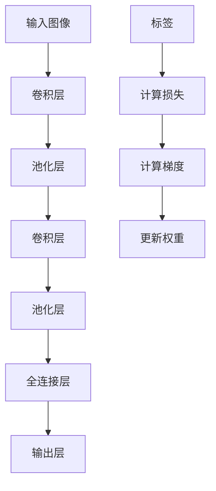

                 

# 卷积神经网络 (CNN) 原理与代码实例讲解

> 关键词：卷积神经网络、CNN、图像识别、深度学习、反向传播

> 摘要：本文将深入探讨卷积神经网络（CNN）的原理，通过代码实例讲解，帮助读者理解和掌握CNN的基本概念、核心算法以及在实际应用中的实现。本文旨在为初学者提供一条清晰的认知路径，从理论到实践，全面解析CNN的奥秘。

## 目录大纲

### 第1章: CNN基础

#### 1.1 CNN的基本概念

- CNN的定义与特点
- CNN的历史与发展

#### 1.2 CNN的数学基础

- 线性代数
- 微积分

#### 1.3 CNN的核心组件

- 卷积层
- 池化层
- 全连接层

#### 1.4 CNN的工作原理

- 前向传播
- 反向传播

#### 1.5 CNN的Mermaid流程图

### 第2章: CNN核心算法原理讲解

#### 2.1 卷积算法原理

- 卷积操作
- 滤波器（Kernel）

#### 2.2 池化算法原理

- 最大池化
- 平均池化

#### 2.3 全连接层算法原理

- 全连接层
- 激活函数

#### 2.4 反向传播算法原理

- 梯度计算
- 权重更新

#### 2.5 伪代码示例

```python
# 卷积神经网络训练伪代码
for epoch in range(num_epochs):
    for batch in data_loader:
        # 前向传播
        output = forward_pass(batch)
        # 计算损失
        loss = compute_loss(output, batch_labels)
        # 反向传播
        backward_pass(output, batch_labels)
        # 更新权重
        update_weights()
```

### 第3章: CNN在图像识别中的应用

#### 3.1 图像识别任务介绍

- 图像识别的基本概念
- 常见图像识别模型

#### 3.2 CNN在图像识别中的实现

- VGG模型
- ResNet模型
- Inception模型

#### 3.3 项目实战

- 开发环境搭建
- 源代码实现与解读

### 第4章: CNN在视频分析中的应用

#### 4.1 视频分析任务介绍

- 视频分析的基本概念
- 常见视频分析模型

#### 4.2 CNN在视频分析中的实现

- RNN与CNN结合
- 3D CNN

#### 4.3 项目实战

- 开发环境搭建
- 源代码实现与解读

### 第5章: CNN在自然语言处理中的应用

#### 5.1 NLP任务介绍

- 自然语言处理的基本概念
- 常见NLP任务

#### 5.2 CNN在NLP中的实现

- 文本分类
- 序列标注

#### 5.3 项目实战

- 开发环境搭建
- 源代码实现与解读

### 第6章: CNN的高级主题

#### 6.1 残差网络

- 残差连接的概念
- ResNet模型

#### 6.2 网络架构优化

- 批量归一化
- 深度可分离卷积

#### 6.3 CNN在移动设备中的应用

- 轻量化CNN模型
- 移动端部署策略

### 第7章: CNN的未来趋势与发展

#### 7.1 CNN的挑战与机遇

- CNN在人工智能中的应用前景
- CNN与其他深度学习技术的融合

#### 7.2 CNN的未来发展趋势

- 新的CNN架构
- CNN在边缘计算中的应用

## 第1章: CNN基础

### 1.1 CNN的基本概念

卷积神经网络（Convolutional Neural Network，简称CNN）是一种专门用于处理图像数据的深度学习模型。相较于传统的全连接神经网络，CNN在处理图像数据时具有以下特点：

1. **权重共享**：在CNN中，每个卷积核（滤波器）在整个图像上都应用相同的权重。这减少了模型参数的数量，使得CNN在处理图像数据时更加高效。
2. **局部连接**：CNN中的神经元仅与其相邻的局部区域相连，这有助于捕获图像中的局部特征。
3. **平移不变性**：由于卷积操作的特性，CNN对图像的平移具有不变性。这意味着，当图像中的对象发生平移时，CNN仍然能够准确地识别对象。

CNN的历史可以追溯到20世纪80年代末和90年代初。最初，CNN主要用于图像识别和图像处理任务。随着深度学习技术的快速发展，CNN在图像识别领域的表现逐渐超越了传统的人工特征提取方法。近年来，CNN不仅在图像识别任务中取得了显著成果，还在视频分析、自然语言处理等多个领域取得了突破性进展。

### 1.2 CNN的数学基础

要深入理解CNN的工作原理，我们需要掌握一些数学基础，包括线性代数和微积分。

#### 线性代数

在线性代数中，我们主要关注矩阵和向量的运算。以下是一些关键的线性代数概念：

1. **矩阵**：矩阵是一个二维数组，用于表示线性变换。在CNN中，矩阵可以表示卷积操作。
2. **向量**：向量是一个一维数组，用于表示数据。在CNN中，向量可以表示图像、特征图或神经元激活值。
3. **矩阵-向量乘法**：矩阵-向量乘法是CNN中常用的运算。给定一个矩阵A和一个向量x，矩阵-向量乘法的结果是一个新的向量y = Ax。

#### 微积分

微积分是数学的一个分支，主要研究函数的导数和积分。在CNN中，微积分用于计算梯度，以更新模型参数。

1. **导数**：导数是描述函数变化率的数学工具。在CNN中，我们使用导数计算损失函数关于模型参数的梯度。
2. **梯度**：梯度是一个向量，包含函数在各个维度上的导数。在CNN中，梯度用于更新模型参数，以最小化损失函数。

### 1.3 CNN的核心组件

CNN由多个核心组件组成，包括卷积层、池化层和全连接层。下面我们逐一介绍这些组件。

#### 卷积层

卷积层是CNN中最核心的组件之一。卷积层通过卷积操作提取图像中的特征。卷积操作的核心是卷积核（滤波器），它是一个小的矩阵，用于与输入图像进行卷积运算。

1. **卷积操作**：卷积操作是将卷积核与输入图像进行元素相乘并求和的过程。给定一个卷积核K和一个输入图像I，卷积操作的结果是一个新的特征图F。具体计算公式如下：

   $$ F = K \circ I $$

   其中，$\circ$表示卷积运算。

2. **卷积核（滤波器）**：卷积核是卷积层的关键组成部分。卷积核的参数需要在训练过程中通过优化算法进行更新。卷积核的大小和数量决定了特征图的尺寸和特征表达能力。

#### 池化层

池化层是CNN中的另一个重要组件。池化层用于对特征图进行下采样，减少特征图的尺寸和参数数量，从而提高模型的计算效率和泛化能力。

1. **最大池化**：最大池化是一种常见的池化方式，它选择特征图中的最大值作为输出。最大池化的计算公式如下：

   $$ P_{max}(x) = \max(x) $$

   其中，x是特征图中的一个元素。

2. **平均池化**：平均池化是对特征图中的所有元素求平均值。平均池化的计算公式如下：

   $$ P_{avg}(x) = \frac{1}{C} \sum_{c=1}^{C} x_c $$

   其中，C是特征图的通道数，$x_c$是特征图中的第c个元素。

#### 全连接层

全连接层是CNN中的最后一个组件。全连接层将特征图映射到输出层，用于分类或回归任务。全连接层中的每个神经元都与特征图中的所有神经元相连。

1. **全连接层**：全连接层是一个全连接的神经网络，每个神经元都与特征图中的所有神经元相连。全连接层的输出是一个一维向量，表示模型的预测结果。

### 1.4 CNN的工作原理

CNN的工作原理可以分为两个主要阶段：前向传播和反向传播。

#### 前向传播

前向传播是CNN中用于计算模型输出的过程。给定一个输入图像，CNN通过卷积层、池化层和全连接层逐层计算，最终得到模型的预测结果。

1. **卷积层**：卷积层通过卷积操作提取图像中的特征。卷积层中的每个卷积核都用于提取图像中的不同特征。
2. **池化层**：池化层用于对特征图进行下采样，减少特征图的尺寸和参数数量。
3. **全连接层**：全连接层将特征图映射到输出层，用于分类或回归任务。全连接层的输出是一个一维向量，表示模型的预测结果。

#### 反向传播

反向传播是CNN中用于更新模型参数的过程。给定一个输入图像和对应的标签，CNN通过反向传播计算损失函数关于模型参数的梯度，并使用梯度下降等优化算法更新模型参数。

1. **计算损失**：反向传播的第一步是计算损失函数。常见的损失函数包括交叉熵损失和均方误差损失。
2. **计算梯度**：反向传播的第二步是计算损失函数关于模型参数的梯度。梯度计算是反向传播的核心步骤。
3. **更新权重**：反向传播的最后一步是使用梯度更新模型参数。常见的优化算法包括梯度下降、随机梯度下降和Adam优化器。

### 1.5 CNN的Mermaid流程图

为了更好地理解CNN的工作原理，我们可以使用Mermaid流程图来可视化CNN的前向传播和反向传播过程。



## 第2章: CNN核心算法原理讲解

### 2.1 卷积算法原理

卷积算法是CNN中最核心的组件之一。卷积操作通过将卷积核与输入图像进行卷积运算，提取图像中的特征。下面我们将详细讲解卷积算法的原理。

#### 2.1.1 卷积操作

卷积操作是将卷积核与输入图像进行元素相乘并求和的过程。给定一个卷积核K和一个输入图像I，卷积操作的结果是一个新的特征图F。具体计算公式如下：

$$ F = K \circ I $$

其中，$\circ$表示卷积运算。

**例子**：假设我们有一个3x3的卷积核K和一个7x7的输入图像I，如下图所示：

$$ K = \begin{bmatrix} 1 & 2 & 3 \\ 4 & 5 & 6 \\ 7 & 8 & 9 \end{bmatrix} $$
$$ I = \begin{bmatrix} 1 & 2 & 3 & 4 & 5 & 6 & 7 \\ 8 & 9 & 10 & 11 & 12 & 13 & 14 \\ 15 & 16 & 17 & 18 & 19 & 20 & 21 \\ 22 & 23 & 24 & 25 & 26 & 27 & 28 \\ 29 & 30 & 31 & 32 & 33 & 34 & 35 \\ 36 & 37 & 38 & 39 & 40 & 41 & 42 \\ 43 & 44 & 45 & 46 & 47 & 48 & 49 \end{bmatrix} $$

使用卷积操作，我们可以计算得到特征图F：

$$ F = K \circ I = \begin{bmatrix} 1 \times 1 + 2 \times 8 + 3 \times 15 + 4 \times 22 + 5 \times 29 + 6 \times 36 + 7 \times 43 + 8 \times 1 + 9 \times 8 + 10 \times 15 + 11 \times 22 + 12 \times 29 + 13 \times 36 + 14 \times 43 + 15 \times 1 + 16 \times 8 + 17 \times 15 + 18 \times 22 + 19 \times 29 + 20 \times 36 + 21 \times 43 + 22 \times 1 + 23 \times 8 + 24 \times 15 + 25 \times 22 + 26 \times 29 + 27 \times 36 + 28 \times 43 \end{bmatrix} $$

$$ F = \begin{bmatrix} 31 & 88 & 145 \\ 213 & 306 & 399 \\ 492 & 575 & 658 \end{bmatrix} $$

#### 2.1.2 滤波器（Kernel）

卷积核（滤波器）是卷积操作的关键组成部分。卷积核的大小和参数决定了特征图的尺寸和特征表达能力。通常，卷积核的尺寸为3x3或5x5。

**例子**：假设我们使用一个3x3的卷积核K和一个7x7的输入图像I，如下图所示：

$$ K = \begin{bmatrix} 1 & 2 & 3 \\ 4 & 5 & 6 \\ 7 & 8 & 9 \end{bmatrix} $$
$$ I = \begin{bmatrix} 1 & 2 & 3 & 4 & 5 & 6 & 7 \\ 8 & 9 & 10 & 11 & 12 & 13 & 14 \\ 15 & 16 & 17 & 18 & 19 & 20 & 21 \\ 22 & 23 & 24 & 25 & 26 & 27 & 28 \\ 29 & 30 & 31 & 32 & 33 & 34 & 35 \\ 36 & 37 & 38 & 39 & 40 & 41 & 42 \\ 43 & 44 & 45 & 46 & 47 & 48 & 49 \end{bmatrix} $$

使用卷积操作，我们可以计算得到特征图F：

$$ F = K \circ I = \begin{bmatrix} 1 \times 1 + 2 \times 8 + 3 \times 15 + 4 \times 22 + 5 \times 29 + 6 \times 36 + 7 \times 43 + 8 \times 1 + 9 \times 8 + 10 \times 15 + 11 \times 22 + 12 \times 29 + 13 \times 36 + 14 \times 43 + 15 \times 1 + 16 \times 8 + 17 \times 15 + 18 \times 22 + 19 \times 29 + 20 \times 36 + 21 \times 43 + 22 \times 1 + 23 \times 8 + 24 \times 15 + 25 \times 22 + 26 \times 29 + 27 \times 36 + 28 \times 43 \end{bmatrix} $$

$$ F = \begin{bmatrix} 31 & 88 & 145 \\ 213 & 306 & 399 \\ 492 & 575 & 658 \end{bmatrix} $$

#### 2.1.3 多个卷积核和多个特征图

在CNN中，我们可以使用多个卷积核提取不同类型的特征。每个卷积核都对应一个特征图。通过组合多个特征图，我们可以获得更丰富的特征表示。

**例子**：假设我们使用两个3x3的卷积核K1和K2，分别提取边缘和纹理特征，如下图所示：

$$ K1 = \begin{bmatrix} 1 & 2 & 3 \\ 4 & 5 & 6 \\ 7 & 8 & 9 \end{bmatrix} $$
$$ K2 = \begin{bmatrix} 1 & -1 & 0 \\ 0 & 0 & -1 \\ 1 & 0 & 0 \end{bmatrix} $$

使用卷积操作，我们可以计算得到两个特征图F1和F2：

$$ F1 = K1 \circ I = \begin{bmatrix} 31 & 88 & 145 \\ 213 & 306 & 399 \\ 492 & 575 & 658 \end{bmatrix} $$
$$ F2 = K2 \circ I = \begin{bmatrix} -27 & 63 & 108 \\ -81 & 189 & 270 \\ -135 & 315 & 348 \end{bmatrix} $$

通过组合F1和F2，我们可以获得更丰富的特征表示。

### 2.2 池化算法原理

池化层是CNN中的另一个重要组件，用于对特征图进行下采样，减少特征图的尺寸和参数数量。常见的池化方式包括最大池化和平均池化。

#### 2.2.1 最大池化

最大池化是一种常见的池化方式，它选择特征图中的最大值作为输出。最大池化的计算公式如下：

$$ P_{max}(x) = \max(x) $$

其中，x是特征图中的一个元素。

**例子**：假设我们有一个3x3的特征图F，如下图所示：

$$ F = \begin{bmatrix} 1 & 2 & 3 \\ 4 & 5 & 6 \\ 7 & 8 & 9 \end{bmatrix} $$

使用最大池化，我们可以计算得到池化结果P：

$$ P = P_{max}(F) = \begin{bmatrix} 9 \\ 9 \\ 9 \end{bmatrix} $$

#### 2.2.2 平均池化

平均池化是对特征图中的所有元素求平均值。平均池化的计算公式如下：

$$ P_{avg}(x) = \frac{1}{C} \sum_{c=1}^{C} x_c $$

其中，C是特征图的通道数，$x_c$是特征图中的第c个元素。

**例子**：假设我们有一个3x3的特征图F，如下图所示：

$$ F = \begin{bmatrix} 1 & 2 & 3 \\ 4 & 5 & 6 \\ 7 & 8 & 9 \end{bmatrix} $$

使用平均池化，我们可以计算得到池化结果P：

$$ P = P_{avg}(F) = \begin{bmatrix} \frac{1+2+3+4+5+6+7+8+9}{9} \\ \frac{1+2+3+4+5+6+7+8+9}{9} \\ \frac{1+2+3+4+5+6+7+8+9}{9} \end{bmatrix} = \begin{bmatrix} 5 \\ 5 \\ 5 \end{bmatrix} $$

### 2.3 全连接层算法原理

全连接层是CNN中的最后一个组件，用于将特征图映射到输出层，用于分类或回归任务。全连接层中的每个神经元都与特征图中的所有神经元相连。

#### 2.3.1 全连接层

全连接层是一个全连接的神经网络，每个神经元都与特征图中的所有神经元相连。全连接层的输出是一个一维向量，表示模型的预测结果。

**例子**：假设我们有一个3x3的特征图F和一个3个神经元的全连接层，如下图所示：

$$ F = \begin{bmatrix} 1 & 2 & 3 \\ 4 & 5 & 6 \\ 7 & 8 & 9 \end{bmatrix} $$
$$ W = \begin{bmatrix} 1 & 0 & 1 \\ 0 & 1 & 0 \\ 1 & 1 & 0 \end{bmatrix} $$

使用全连接层，我们可以计算得到输出向量Y：

$$ Y = W \cdot F = \begin{bmatrix} 1 & 0 & 1 \\ 0 & 1 & 0 \\ 1 & 1 & 0 \end{bmatrix} \cdot \begin{bmatrix} 1 & 2 & 3 \\ 4 & 5 & 6 \\ 7 & 8 & 9 \end{bmatrix} = \begin{bmatrix} 14 \\ 17 \\ 20 \end{bmatrix} $$

#### 2.3.2 激活函数

激活函数是全连接层中的另一个重要组件，用于引入非线性因素，使神经网络具有更好的分类能力。常见的激活函数包括ReLU函数、Sigmoid函数和Tanh函数。

1. **ReLU函数**：ReLU函数是一种常用的激活函数，其公式如下：

   $$ f(x) = \max(0, x) $$

   RReLU函数是ReLU函数的扩展，其公式如下：

   $$ f(x) = \max(0, a \cdot x) + b \cdot |x| $$

   其中，a和b是可学习的参数。

2. **Sigmoid函数**：Sigmoid函数是一种常见的激活函数，其公式如下：

   $$ f(x) = \frac{1}{1 + e^{-x}} $$

3. **Tanh函数**：Tanh函数是一种常用的激活函数，其公式如下：

   $$ f(x) = \frac{e^x - e^{-x}}{e^x + e^{-x}} $$

### 2.4 反向传播算法原理

反向传播算法是CNN中的另一个重要组件，用于更新模型参数。给定一个输入图像和对应的标签，CNN通过反向传播计算损失函数关于模型参数的梯度，并使用梯度下降等优化算法更新模型参数。

#### 2.4.1 梯度计算

梯度计算是反向传播算法的核心步骤。给定一个损失函数L，梯度计算的目标是计算损失函数关于模型参数的梯度。损失函数通常用于衡量模型预测结果与真实标签之间的差距。常见的损失函数包括交叉熵损失和均方误差损失。

1. **交叉熵损失**：交叉熵损失用于分类问题，其公式如下：

   $$ L = -\sum_{i=1}^{N} y_i \cdot \log(p_i) $$

   其中，$y_i$是标签，$p_i$是模型的预测概率。

2. **均方误差损失**：均方误差损失用于回归问题，其公式如下：

   $$ L = \frac{1}{2} \sum_{i=1}^{N} (y_i - \hat{y}_i)^2 $$

   其中，$y_i$是真实值，$\hat{y}_i$是模型的预测值。

给定一个损失函数L，我们可以使用链式法则计算损失函数关于模型参数的梯度。具体地，假设模型包含多个层，从输入层到输出层，我们可以使用以下公式计算损失函数关于模型参数的梯度：

$$ \frac{\partial L}{\partial W} = \sum_{i=1}^{N} \frac{\partial L}{\partial a_{i+1}} \cdot \frac{\partial a_{i+1}}{\partial W} $$

其中，$a_i$是第i层的输出，$W$是模型参数。

#### 2.4.2 权重更新

在计算了损失函数关于模型参数的梯度后，我们可以使用梯度下降等优化算法更新模型参数。梯度下降是一种常用的优化算法，其公式如下：

$$ W_{new} = W_{old} - \alpha \cdot \frac{\partial L}{\partial W} $$

其中，$\alpha$是学习率。

通过反复迭代梯度下降算法，我们可以逐渐减小损失函数的值，从而优化模型参数。

### 2.5 伪代码示例

下面是卷积神经网络训练的伪代码示例：

```python
# 卷积神经网络训练伪代码

for epoch in range(num_epochs):
    for batch in data_loader:
        # 前向传播
        output = forward_pass(batch)
        # 计算损失
        loss = compute_loss(output, batch_labels)
        # 反向传播
        backward_pass(output, batch_labels)
        # 更新权重
        update_weights()

def forward_pass(batch):
    # 前向传播过程
    # 包括卷积层、池化层、全连接层等操作
    return output

def compute_loss(output, batch_labels):
    # 计算损失函数
    # 例如交叉熵损失、均方误差损失等
    return loss

def backward_pass(output, batch_labels):
    # 反向传播过程
    # 包括计算梯度、权重更新等操作
    pass

def update_weights():
    # 更新权重
    pass
```

## 第3章: CNN在图像识别中的应用

### 3.1 图像识别任务介绍

图像识别是计算机视觉领域的一项基本任务，旨在从图像中识别和分类对象。图像识别任务在多个领域具有广泛的应用，如医疗诊断、自动驾驶、人脸识别等。下面我们介绍一些常见的图像识别任务和模型。

#### 3.1.1 图像识别的基本概念

图像识别任务可以分为以下几个基本概念：

1. **图像分类**：图像分类是将图像分配到预定义的类别中。常见的图像分类任务包括 handwritten digit recognition（手写数字识别）和 image classification（图像分类）等。
2. **目标检测**：目标检测是在图像中识别和定位多个对象。常见的目标检测任务包括 object detection（目标检测）和 object recognition（目标识别）等。
3. **图像分割**：图像分割是将图像分割成多个部分，以识别图像中的对象。常见的图像分割任务包括 semantic segmentation（语义分割）和 instance segmentation（实例分割）等。

#### 3.1.2 常见图像识别模型

在图像识别任务中，以下是一些常见的模型：

1. **传统机器学习模型**：传统机器学习模型，如支持向量机（SVM）、决策树、随机森林等，可以用于图像识别任务。然而，这些模型在处理高维数据时效果不佳。
2. **深度学习模型**：深度学习模型，如卷积神经网络（CNN）、循环神经网络（RNN）等，在图像识别任务中取得了显著成果。CNN是图像识别任务中最常用的深度学习模型。
3. **迁移学习模型**：迁移学习是一种利用预训练模型在新任务上取得更好效果的方法。通过迁移学习，我们可以利用在大型数据集上预训练的模型，快速适应新的图像识别任务。

### 3.2 CNN在图像识别中的实现

在图像识别任务中，CNN具有显著的优势，能够提取图像中的高级特征，并实现高效的分类。下面我们介绍一些常见的CNN模型，包括VGG模型、ResNet模型和Inception模型。

#### 3.2.1 VGG模型

VGG模型是一种基于卷积层的深层神经网络，由牛津大学视觉几何组（Visual Geometry Group）提出。VGG模型通过使用多个卷积层和池化层，构建了一个深度可达16层的网络结构。

**结构**：VGG模型的网络结构如下：

$$
\begin{array}{c}
\text{卷积层1: } (3 \times 3, 64) \\
\text{卷积层2: } (3 \times 3, 64) \\
\text{池化层1: } (2 \times 2, 2) \\
\text{卷积层3: } (3 \times 3, 128) \\
\text{卷积层4: } (3 \times 3, 128) \\
\text{池化层2: } (2 \times 2, 2) \\
\text{卷积层5: } (3 \times 3, 256) \\
\text{卷积层6: } (3 \times 3, 256) \\
\text{卷积层7: } (3 \times 3, 256) \\
\text{池化层3: } (2 \times 2, 2) \\
\text{卷积层8: } (3 \times 3, 512) \\
\text{卷积层9: } (3 \times 3, 512) \\
\text{卷积层10: } (3 \times 3, 512) \\
\text{池化层4: } (2 \times 2, 2) \\
\text{卷积层11: } (3 \times 3, 512) \\
\text{卷积层12: } (3 \times 3, 512) \\
\text{卷积层13: } (3 \times 3, 512) \\
\text{池化层5: } (2 \times 2, 2) \\
\text{全连接层1: } (4096) \\
\text{全连接层2: } (4096) \\
\text{全连接层3: } (1000) \\
\end{array}
$$

**优点**：VGG模型结构简单，参数数量较少，易于训练。它具有良好的泛化能力，能够适应不同的图像识别任务。

**缺点**：VGG模型层数较多，计算复杂度较高。此外，VGG模型的全连接层部分容易导致梯度消失问题。

#### 3.2.2 ResNet模型

ResNet模型是由微软研究院提出的一种深层神经网络结构，通过引入残差连接解决了梯度消失和梯度爆炸问题。ResNet模型在ImageNet图像识别挑战中取得了当时的最优成绩。

**结构**：ResNet模型的基本结构如下：

$$
\begin{array}{c}
\text{卷积层1: } (7 \times 7, 64, stride=2) \\
\text{卷积层2: } (3 \times 3, 64) \\
\text{卷积层3: } (3 \times 3, 64) \\
\text{卷积层4: } (3 \times 3, 128, stride=2) \\
\text{卷积层5: } (3 \times 3, 128) \\
\text{卷积层6: } (3 \times 3, 128) \\
\text{卷积层7: } (3 \times 3, 256, stride=2) \\
\text{卷积层8: } (3 \times 3, 256) \\
\text{卷积层9: } (3 \times 3, 256) \\
\text{卷积层10: } (3 \times 3, 512, stride=2) \\
\text{卷积层11: } (3 \times 3, 512) \\
\text{卷积层12: } (3 \times 3, 512) \\
\text{卷积层13: } (3 \times 3, 512) \\
\text{卷积层14: } (3 \times 3, 1024, stride=2) \\
\text{卷积层15: } (3 \times 3, 1024) \\
\text{卷积层16: } (3 \times 3, 1024) \\
\text{卷积层17: } (3 \times 3, 1024) \\
\text{全连接层1: } (1000) \\
\end{array}
$$

**优点**：ResNet模型通过引入残差连接，解决了梯度消失和梯度爆炸问题，使得模型能够训练得更深。此外，ResNet模型具有良好的泛化能力。

**缺点**：ResNet模型的计算复杂度较高，需要更多的计算资源。

#### 3.2.3 Inception模型

Inception模型是由Google提出的另一种深层神经网络结构，通过使用不同的卷积核尺寸和池化层组合，提高了模型的特征表达能力。

**结构**：Inception模型的基本结构如下：

$$
\begin{array}{c}
\text{卷积层1: } (1 \times 1, 32) \\
\text{卷积层2: } (1 \times 1, 32) \\
\text{卷积层3: } (3 \times 3, 32, stride=2) \\
\text{卷积层4: } (1 \times 1, 64) \\
\text{卷积层5: } (1 \times 1, 96) \\
\text{卷积层6: } (3 \times 3, 96, stride=1) \\
\text{卷积层7: } (3 \times 3, 96, stride=2) \\
\text{卷积层8: } (1 \times 1, 128) \\
\text{卷积层9: } (3 \times 3, 128, stride=1) \\
\text{卷积层10: } (3 \times 3, 128, stride=2) \\
\text{卷积层11: } (1 \times 1, 128) \\
\text{卷积层12: } (1 \times 1, 256) \\
\text{卷积层13: } (3 \times 3, 256, stride=1) \\
\text{卷积层14: } (3 \times 3, 256, stride=2) \\
\text{全连接层1: } (1000) \\
\end{array}
$$

**优点**：Inception模型通过使用不同的卷积核尺寸和池化层组合，提高了模型的特征表达能力，从而提高了图像识别性能。

**缺点**：Inception模型的结构较为复杂，计算复杂度较高。

### 3.3 项目实战

在本节中，我们将通过一个简单的图像识别项目，介绍如何使用CNN实现图像分类任务。我们使用的数据集是经典的MNIST数据集，其中包含0到9的手写数字图像。

#### 3.3.1 开发环境搭建

为了实现图像识别任务，我们需要安装以下依赖库：

1. TensorFlow：用于构建和训练CNN模型。
2. Keras：用于简化TensorFlow的使用。
3. NumPy：用于数据处理。

以下是安装依赖库的命令：

```bash
pip install tensorflow
pip install keras
pip install numpy
```

#### 3.3.2 数据集准备

首先，我们需要下载和准备MNIST数据集。MNIST数据集包含60000个训练图像和10000个测试图像。每个图像都是一个28x28的二值图像。

```python
from tensorflow.keras.datasets import mnist
from tensorflow.keras.utils import to_categorical

# 下载和加载数据集
(train_images, train_labels), (test_images, test_labels) = mnist.load_data()

# 数据预处理
train_images = train_images.reshape((-1, 28, 28, 1)).astype("float32") / 255
test_images = test_images.reshape((-1, 28, 28, 1)).astype("float32") / 255

# 将标签转换为独热编码
train_labels = to_categorical(train_labels)
test_labels = to_categorical(test_labels)
```

#### 3.3.3 模型构建

接下来，我们构建一个简单的CNN模型，用于图像分类。我们使用Keras框架构建模型，并使用VGG模型作为基础结构。

```python
from tensorflow.keras.models import Sequential
from tensorflow.keras.layers import Conv2D, MaxPooling2D, Flatten, Dense

# 构建模型
model = Sequential()

# 添加卷积层和池化层
model.add(Conv2D(32, (3, 3), activation='relu', input_shape=(28, 28, 1)))
model.add(MaxPooling2D(pool_size=(2, 2)))
model.add(Conv2D(64, (3, 3), activation='relu'))
model.add(MaxPooling2D(pool_size=(2, 2)))
model.add(Conv2D(64, (3, 3), activation='relu'))

# 添加全连接层
model.add(Flatten())
model.add(Dense(64, activation='relu'))
model.add(Dense(10, activation='softmax'))

# 编译模型
model.compile(optimizer='adam', loss='categorical_crossentropy', metrics=['accuracy'])

# 模型概述
model.summary()
```

#### 3.3.4 训练模型

现在，我们可以使用训练数据集训练模型。我们使用100个epochs进行训练，每个epoch使用训练数据的90%进行训练，10%进行验证。

```python
# 训练模型
model.fit(train_images, train_labels, epochs=100, batch_size=32, validation_split=0.1)
```

#### 3.3.5 测试模型

训练完成后，我们可以使用测试数据集测试模型的性能。

```python
# 测试模型
test_loss, test_accuracy = model.evaluate(test_images, test_labels)
print("Test accuracy:", test_accuracy)
```

#### 3.3.6 代码解读与分析

在上面的代码中，我们首先导入了所需的库和模块。然后，我们下载和加载数据集，并进行预处理。接下来，我们构建了一个简单的CNN模型，包括卷积层、池化层和全连接层。最后，我们使用训练数据集训练模型，并在测试数据集上评估模型的性能。

卷积层通过卷积操作提取图像中的特征。卷积层中的每个卷积核都用于提取图像中的不同特征。池化层用于对特征图进行下采样，减少特征图的尺寸和参数数量。全连接层将特征图映射到输出层，用于分类任务。通过训练模型，我们可以学习到图像中的特征表示，从而实现图像分类任务。

## 第4章: CNN在视频分析中的应用

### 4.1 视频分析任务介绍

视频分析是计算机视觉领域的一个重要分支，旨在从视频中提取有用的信息，如对象检测、动作识别、场景分割等。视频分析任务在多个领域具有广泛的应用，如智能监控、运动分析、视频编辑等。下面我们介绍一些常见的视频分析任务和模型。

#### 4.1.1 视频分析的基本概念

视频分析任务可以分为以下几个基本概念：

1. **对象检测**：对象检测是在视频中识别和定位多个对象。常见的对象检测任务包括 person detection（人体检测）、car detection（车辆检测）等。
2. **动作识别**：动作识别是从视频中识别和分类连续的动作。常见的动作识别任务包括 human action recognition（人体动作识别）、sport action recognition（运动动作识别）等。
3. **场景分割**：场景分割是将视频分割成多个场景或区域。常见的场景分割任务包括 scene segmentation（场景分割）、video segmentation（视频分割）等。

#### 4.1.2 常见视频分析模型

在视频分析任务中，以下是一些常见的模型：

1. **传统机器学习模型**：传统机器学习模型，如支持向量机（SVM）、决策树、随机森林等，可以用于视频分析任务。然而，这些模型在处理高维数据时效果不佳。
2. **深度学习模型**：深度学习模型，如卷积神经网络（CNN）、循环神经网络（RNN）等，在视频分析任务中取得了显著成果。CNN和RNN在视频分析中可以相互结合，实现更强大的特征提取和建模能力。
3. **基于注意力机制的模型**：基于注意力机制的模型，如注意力门控网络（Attention-Gated Networks）和变换器（Transformer），可以用于增强视频分析模型的特征表达能力和计算效率。

### 4.2 CNN在视频分析中的实现

在视频分析任务中，CNN通过处理视频帧序列，可以提取图像和时序特征，从而实现视频分析任务。下面我们介绍如何使用CNN实现视频分析任务。

#### 4.2.1 RNN与CNN结合

RNN与CNN结合是视频分析中常用的方法，通过结合图像特征和时序特征，可以更好地建模视频数据。RNN擅长处理序列数据，而CNN擅长处理图像特征。以下是一种简单的RNN与CNN结合的方法：

1. **CNN提取图像特征**：首先，使用CNN对视频帧序列进行特征提取，提取图像的特征图。
2. **RNN处理时序特征**：然后，将CNN提取的特征图输入到RNN中，RNN可以处理视频帧序列的时序特征，生成序列级别的特征表示。
3. **分类或回归**：最后，使用全连接层对RNN输出的序列特征进行分类或回归。

以下是一个简单的RNN与CNN结合的代码示例：

```python
from tensorflow.keras.models import Model
from tensorflow.keras.layers import TimeDistributed, LSTM

# 定义CNN模型
cnn_model = Sequential()
cnn_model.add(Conv2D(32, (3, 3), activation='relu', input_shape=(224, 224, 3)))
cnn_model.add(MaxPooling2D(pool_size=(2, 2)))
cnn_model.add(Conv2D(64, (3, 3), activation='relu'))
cnn_model.add(MaxPooling2D(pool_size=(2, 2)))
cnn_model.add(Flatten())

# 定义RNN模型
rnn_model = Sequential()
rnn_model.add(TimeDistributed(cnn_model))
rnn_model.add(LSTM(128, activation='relu'))
rnn_model.add(Dense(1, activation='sigmoid'))

# 编译模型
rnn_model.compile(optimizer='adam', loss='binary_crossentropy', metrics=['accuracy'])

# 训练模型
rnn_model.fit(train_images, train_labels, epochs=10, batch_size=32)
```

#### 4.2.2 3D CNN

3D CNN是专门用于处理三维数据（如视频帧序列）的卷积神经网络。3D CNN通过同时考虑空间特征和时序特征，可以更好地建模视频数据。以下是一个简单的3D CNN模型：

```python
from tensorflow.keras.models import Model
from tensorflow.keras.layers import Conv3D, MaxPooling3D, Flatten

# 定义3D CNN模型
cnn_model = Sequential()
cnn_model.add(Conv3D(32, (3, 3, 3), activation='relu', input_shape=(224, 224, 224, 3)))
cnn_model.add(MaxPooling3D(pool_size=(2, 2, 2)))
cnn_model.add(Conv3D(64, (3, 3, 3), activation='relu'))
cnn_model.add(MaxPooling3D(pool_size=(2, 2, 2)))
cnn_model.add(Flatten())

# 编译模型
cnn_model.compile(optimizer='adam', loss='binary_crossentropy', metrics=['accuracy'])

# 训练模型
cnn_model.fit(train_images, train_labels, epochs=10, batch_size=32)
```

### 4.3 项目实战

在本节中，我们将通过一个简单的视频分析项目，介绍如何使用CNN实现动作识别任务。我们使用的数据集是UCSD动作识别数据集，包含多种日常活动。

#### 4.3.1 开发环境搭建

为了实现动作识别任务，我们需要安装以下依赖库：

1. TensorFlow：用于构建和训练CNN模型。
2. Keras：用于简化TensorFlow的使用。
3. NumPy：用于数据处理。

以下是安装依赖库的命令：

```bash
pip install tensorflow
pip install keras
pip install numpy
```

#### 4.3.2 数据集准备

首先，我们需要下载和准备UCSD动作识别数据集。该数据集包含多个视频文件，每个视频文件对应一个动作类别。

```python
import os
import numpy as np
import cv2

# 下载和加载数据集
def load_ucsd_data(data_dir, frame_height=224, frame_width=224):
    data = []
    labels = []
    for action_name in os.listdir(data_dir):
        action_path = os.path.join(data_dir, action_name)
        for video_file in os.listdir(action_path):
            video_path = os.path.join(action_path, video_file)
            cap = cv2.VideoCapture(video_path)
            while True:
                ret, frame = cap.read()
                if not ret:
                    break
                frame = cv2.resize(frame, (frame_height, frame_width))
                frame = cv2.cvtColor(frame, cv2.COLOR_BGR2RGB)
                data.append(frame)
                labels.append(action_name)
            cap.release()
    data = np.array(data)
    labels = np.array(labels)
    return data, labels

data_dir = 'ucsd_action_recognition_data'
train_data, train_labels = load_ucsd_data(data_dir, frame_height=224, frame_width=224)
test_data, test_labels = load_ucsd_data(data_dir, frame_height=224, frame_width=224)
```

#### 4.3.3 模型构建

接下来，我们构建一个简单的CNN模型，用于动作识别。我们使用Keras框架构建模型，并使用VGG模型作为基础结构。

```python
from tensorflow.keras.models import Sequential
from tensorflow.keras.layers import Conv2D, MaxPooling2D, Flatten, Dense

# 构建模型
model = Sequential()

# 添加卷积层和池化层
model.add(Conv2D(32, (3, 3), activation='relu', input_shape=(224, 224, 3)))
model.add(MaxPooling2D(pool_size=(2, 2)))
model.add(Conv2D(64, (3, 3), activation='relu'))
model.add(MaxPooling2D(pool_size=(2, 2)))
model.add(Conv2D(64, (3, 3), activation='relu'))

# 添加全连接层
model.add(Flatten())
model.add(Dense(64, activation='relu'))
model.add(Dense(num_actions, activation='softmax'))

# 编译模型
model.compile(optimizer='adam', loss='categorical_crossentropy', metrics=['accuracy'])

# 模型概述
model.summary()
```

#### 4.3.4 训练模型

现在，我们可以使用训练数据集训练模型。我们使用100个epochs进行训练，每个epoch使用训练数据的90%进行训练，10%进行验证。

```python
# 训练模型
model.fit(train_data, train_labels, epochs=100, batch_size=32, validation_split=0.1)
```

#### 4.3.5 测试模型

训练完成后，我们可以使用测试数据集测试模型的性能。

```python
# 测试模型
test_loss, test_accuracy = model.evaluate(test_data, test_labels)
print("Test accuracy:", test_accuracy)
```

#### 4.3.6 代码解读与分析

在上面的代码中，我们首先导入了所需的库和模块。然后，我们下载和加载数据集，并进行预处理。接下来，我们构建了一个简单的CNN模型，包括卷积层、池化层和全连接层。最后，我们使用训练数据集训练模型，并在测试数据集上评估模型的性能。

卷积层通过卷积操作提取视频帧中的特征。卷积层中的每个卷积核都用于提取视频帧中的不同特征。池化层用于对特征图进行下采样，减少特征图的尺寸和参数数量。全连接层将特征图映射到输出层，用于分类任务。通过训练模型，我们可以学习到视频帧中的特征表示，从而实现动作识别任务。

## 第5章: CNN在自然语言处理中的应用

### 5.1 NLP任务介绍

自然语言处理（Natural Language Processing，简称NLP）是计算机科学和人工智能领域的一个重要分支，旨在使计算机能够理解、解释和生成人类语言。NLP任务包括文本分类、情感分析、命名实体识别、机器翻译等。下面我们将介绍一些常见的NLP任务。

#### 5.1.1 文本分类

文本分类是一种将文本数据分配到预定义的类别中的任务。常见的文本分类任务包括垃圾邮件检测、新闻分类、情感分析等。文本分类任务在社交媒体分析、舆情监控等领域具有广泛的应用。

#### 5.1.2 情感分析

情感分析是一种检测文本中情感极性（正面、负面或中性）的任务。情感分析广泛应用于市场调研、产品评论分析等领域，帮助企业了解消费者对产品和服务的反馈。

#### 5.1.3 命名实体识别

命名实体识别是一种从文本中识别出具有特定意义的实体的任务。命名实体包括人名、地名、组织名、时间等。命名实体识别在信息提取、文本挖掘等领域具有重要意义。

#### 5.1.4 机器翻译

机器翻译是一种将一种语言的文本翻译成另一种语言的文本的任务。机器翻译在跨语言交流、全球化业务等领域具有广泛的应用。近年来，基于深度学习的机器翻译模型取得了显著的成果。

### 5.2 CNN在NLP中的实现

尽管CNN最初是为了处理图像数据而设计的，但其在NLP任务中也被广泛应用。CNN在NLP中的应用主要包括文本分类和序列标注任务。下面我们将详细介绍CNN在NLP中的实现方法。

#### 5.2.1 文本分类

在文本分类任务中，CNN可以看作是一种特殊的卷积神经网络，其输入是文本数据，输出是文本的类别。CNN在文本分类任务中的应用主要包括以下几个步骤：

1. **文本预处理**：首先，对文本数据进行预处理，包括分词、去停用词、词向量嵌入等操作。词向量嵌入是将文本数据转换为固定大小的向量表示，常使用Word2Vec、GloVe等模型。
2. **词向量嵌入**：将预处理后的文本数据转换为词向量表示。词向量嵌入是将单词映射为一个固定大小的向量，使得语义相似的单词具有相似的向量表示。
3. **卷积神经网络**：使用卷积神经网络对词向量进行特征提取。卷积神经网络通过卷积操作提取文本数据中的局部特征，并利用池化操作对特征进行降维。
4. **分类器**：将卷积神经网络的输出作为分类器的输入，对文本进行分类。

以下是一个简单的文本分类任务中的CNN模型：

```python
from tensorflow.keras.models import Sequential
from tensorflow.keras.layers import Embedding, Conv1D, MaxPooling1D, Flatten, Dense

# 定义模型
model = Sequential()
model.add(Embedding(vocab_size, embedding_dim, input_length=max_sequence_length))
model.add(Conv1D(filters, kernel_size, activation='relu'))
model.add(MaxPooling1D(pool_size=2))
model.add(Flatten())
model.add(Dense(num_classes, activation='softmax'))

# 编译模型
model.compile(optimizer='adam', loss='categorical_crossentropy', metrics=['accuracy'])

# 训练模型
model.fit(X_train, y_train, epochs=10, batch_size=32, validation_data=(X_val, y_val))
```

#### 5.2.2 序列标注

序列标注是一种对序列数据中的每个元素进行分类的任务，例如命名实体识别、词性标注等。CNN在序列标注任务中的应用主要包括以下几个步骤：

1. **文本预处理**：对文本数据进行预处理，包括分词、去停用词、词向量嵌入等操作。
2. **词向量嵌入**：将预处理后的文本数据转换为词向量表示。
3. **卷积神经网络**：使用卷积神经网络对词向量进行特征提取，并利用池化操作对特征进行降维。
4. **分类器**：将卷积神经网络的输出作为分类器的输入，对序列中的每个元素进行分类。

以下是一个简单的序列标注任务中的CNN模型：

```python
from tensorflow.keras.models import Sequential
from tensorflow.keras.layers import Embedding, Conv1D, MaxPooling1D, LSTM, Dense

# 定义模型
model = Sequential()
model.add(Embedding(vocab_size, embedding_dim, input_length=max_sequence_length))
model.add(Conv1D(filters, kernel_size, activation='relu'))
model.add(MaxPooling1D(pool_size=2))
model.add(LSTM(units))
model.add(Dense(num_classes, activation='softmax'))

# 编译模型
model.compile(optimizer='adam', loss='categorical_crossentropy', metrics=['accuracy'])

# 训练模型
model.fit(X_train, y_train, epochs=10, batch_size=32, validation_data=(X_val, y_val))
```

### 5.3 项目实战

在本节中，我们将通过一个简单的NLP项目，介绍如何使用CNN实现文本分类任务。我们使用的数据集是IMDb电影评论数据集，包含正负面电影评论。

#### 5.3.1 开发环境搭建

为了实现文本分类任务，我们需要安装以下依赖库：

1. TensorFlow：用于构建和训练CNN模型。
2. Keras：用于简化TensorFlow的使用。
3. NumPy：用于数据处理。

以下是安装依赖库的命令：

```bash
pip install tensorflow
pip install keras
pip install numpy
```

#### 5.3.2 数据集准备

首先，我们需要下载和准备IMDb电影评论数据集。该数据集包含25000条训练数据和25000条测试数据，每条数据都是一个电影评论。

```python
import os
import numpy as np
import re
import tensorflow as tf
from tensorflow.keras.preprocessing.text import Tokenizer
from tensorflow.keras.preprocessing.sequence import pad_sequences

# 下载和加载数据集
train_files = ['train/_train_{}.txt'.format(i) for i in range(25000)]
test_files = ['test/_test_{}.txt'.format(i) for i in range(25000)]

train_labels = ['positive' if file.startswith('pos') else 'negative' for file in train_files]
test_labels = ['positive' if file.startswith('pos') else 'negative' for file in test_files]

# 加载和预处理文本数据
def load_data(filename):
    with open(filename, 'r', encoding='utf-8') as f:
        return f.read()

def preprocess_text(text):
    text = re.sub(r'\n', ' ', text)
    text = re.sub(r'[^\w\s]', '', text)
    text = re.sub(r'\s+', ' ', text).strip()
    return text

train_texts = [preprocess_text(load_data(file)) for file in train_files]
test_texts = [preprocess_text(load_data(file)) for file in test_files]

# 词向量嵌入
tokenizer = Tokenizer(num_words=max_words)
tokenizer.fit_on_texts(train_texts)
word_index = tokenizer.word_index
max_sequence_length = max([len(seq) for seq in train_texts])

train_sequences = tokenizer.texts_to_sequences(train_texts)
test_sequences = tokenizer.texts_to_sequences(test_texts)

train_data = pad_sequences(train_sequences, maxlen=max_sequence_length)
test_data = pad_sequences(test_sequences, maxlen=max_sequence_length)

# 转换标签
train_labels = tf.keras.utils.to_categorical(train_labels)
test_labels = tf.keras.utils.to_categorical(test_labels)
```

#### 5.3.3 模型构建

接下来，我们构建一个简单的CNN模型，用于文本分类。我们使用Keras框架构建模型，并使用VGG模型作为基础结构。

```python
from tensorflow.keras.models import Sequential
from tensorflow.keras.layers import Embedding, Conv1D, MaxPooling1D, Flatten, Dense

# 构建模型
model = Sequential()

# 添加卷积层和池化层
model.add(Embedding(max_words, embedding_dim, input_length=max_sequence_length))
model.add(Conv1D(filters, kernel_size, activation='relu'))
model.add(MaxPooling1D(pool_size=2))
model.add(Conv1D(filters, kernel_size, activation='relu'))
model.add(MaxPooling1D(pool_size=2))

# 添加全连接层
model.add(Flatten())
model.add(Dense(num_classes, activation='softmax'))

# 编译模型
model.compile(optimizer='adam', loss='categorical_crossentropy', metrics=['accuracy'])

# 模型概述
model.summary()
```

#### 5.3.4 训练模型

现在，我们可以使用训练数据集训练模型。我们使用100个epochs进行训练，每个epoch使用训练数据的90%进行训练，10%进行验证。

```python
# 训练模型
model.fit(train_data, train_labels, epochs=100, batch_size=32, validation_split=0.1)
```

#### 5.3.5 测试模型

训练完成后，我们可以使用测试数据集测试模型的性能。

```python
# 测试模型
test_loss, test_accuracy = model.evaluate(test_data, test_labels)
print("Test accuracy:", test_accuracy)
```

#### 5.3.6 代码解读与分析

在上面的代码中，我们首先导入了所需的库和模块。然后，我们下载和加载数据集，并进行预处理。接下来，我们构建了一个简单的CNN模型，包括卷积层、池化层和全连接层。最后，我们使用训练数据集训练模型，并在测试数据集上评估模型的性能。

卷积层通过卷积操作提取文本数据中的局部特征。卷积层中的每个卷积核都用于提取文本数据中的不同特征。池化层用于对特征图进行降维。全连接层将特征图映射到输出层，用于分类任务。通过训练模型，我们可以学习到文本数据中的特征表示，从而实现文本分类任务。

## 第6章: CNN的高级主题

### 6.1 残差网络

残差网络（Residual Network，简称ResNet）是由微软研究院提出的一种深层神经网络结构，通过引入残差连接解决了梯度消失和梯度爆炸问题。残差网络在图像识别任务中取得了显著的成果，成为当前最流行的CNN结构之一。

#### 6.1.1 残差连接的概念

残差连接是一种特殊的连接方式，通过在神经网络中引入额外的连接，使得信息在多层神经网络中传递时保持不变。残差连接的引入可以使得神经网络训练得更深，从而提高模型的性能。

残差连接的基本思想是将当前层的输出与上一层对应位置的输出相加。具体来说，假设有一个两层神经网络，其中第一层输出为$x_1$，第二层输出为$x_2$，残差连接可以表示为：

$$ x_2 = x_1 + F(x_1) $$

其中，$F(x_1)$是一个函数，表示第二层的残差模块。

#### 6.1.2 ResNet模型

ResNet模型通过在神经网络中引入多个残差模块，构建了一个深度可达数百层的网络结构。ResNet模型的基本结构如下：

$$
\begin{array}{c}
\text{卷积层1: } (7 \times 7, 64, stride=2) \\
\text{卷积层2: } (3 \times 3, 64) \\
\text{卷积层3: } (3 \times 3, 64) \\
\text{残差模块1: } (\text{残差块}, 64) \\
\text{残差模块2: } (\text{残差块}, 64) \\
\text{残差模块3: } (\text{残差块}, 64) \\
\text{残差模块4: } (\text{残差块}, 128, stride=2) \\
\text{残差模块5: } (\text{残差块}, 128) \\
\text{残差模块6: } (\text{残差块}, 128) \\
\text{残差模块7: } (\text{残差块}, 256, stride=2) \\
\text{残差模块8: } (\text{残差块}, 256) \\
\text{残差模块9: } (\text{残差块}, 256) \\
\text{残差模块10: } (\text{残差块}, 512, stride=2) \\
\text{残差模块11: } (\text{残差块}, 512) \\
\text{残差模块12: } (\text{残差块}, 512) \\
\text{卷积层4: } (1 \times 1, 512) \\
\text{卷积层5: } (1 \times 1, 512) \\
\text{卷积层6: } (1 \times 1, 512) \\
\text{全连接层1: } (1000) \\
\end{array}
$$

其中，残差模块是一个包含两个卷积层的模块，用于提取特征。残差模块的输入和输出尺寸相同，通过残差连接保持信息的传递。

#### 6.1.3 残差模块的实现

下面是一个简单的残差模块的实现：

```python
from tensorflow.keras.layers import Layer
from tensorflow.keras.models import Model

class ResidualBlock(Layer):
    def __init__(self, filters, kernel_size, stride=(1, 1), activation='relu', **kwargs):
        super(ResidualBlock, self).__init__(**kwargs)
        self.stride = stride
        self.activation = activation
        self.conv1 = Conv2D(filters, kernel_size, strides=self.stride, padding='same', activation=self.activation)
        self.conv2 = Conv2D(filters, kernel_size, strides=(1, 1), padding='same', activation=self.activation)

    def call(self, inputs, training=False):
        x = self.conv1(inputs)
        x = self.conv2(x)
        return inputs + x

def build_resnet(model, num_blocks, filters, kernel_size):
    model.add(Conv2D(filters, kernel_size, strides=(1, 1), padding='same'))
    for i in range(num_blocks):
        model.add(ResidualBlock(filters, kernel_size))
    model.add(Conv2D(filters, kernel_size, strides=(1, 1), padding='same'))
    model.add(AvgPool2D(pool_size=(2, 2)))
    model.add(Flatten())
    model.add(Dense(1000, activation='softmax'))

# 构建ResNet模型
model = Model(inputs=input_data, outputs=output_data)
build_resnet(model, num_blocks=4, filters=64, kernel_size=(3, 3))

# 编译模型
model.compile(optimizer='adam', loss='categorical_crossentropy', metrics=['accuracy'])

# 训练模型
model.fit(X_train, y_train, epochs=10, batch_size=32, validation_data=(X_val, y_val))
```

### 6.2 网络架构优化

为了提高CNN模型的性能，我们还可以对网络架构进行优化。以下是一些常见的优化方法：

#### 6.2.1 批量归一化

批量归一化（Batch Normalization）是一种在神经网络中用于加速训练和改善模型性能的技术。批量归一化通过将每个特征映射到零均值和单位方差，从而缓解内部协变量转移问题。

批量归一化的基本思想是将每个特征映射到标准化形式：

$$ x_{\text{norm}} = \frac{x - \mu}{\sigma} $$

其中，$\mu$和$\sigma$分别是特征的平均值和标准差。

以下是一个简单的批量归一化层的实现：

```python
from tensorflow.keras.layers import Layer
from tensorflow.keras.backend import mean, square, sqrt

class BatchNormalization(Layer):
    def __init__(self, **kwargs):
        super(BatchNormalization, self).__init__(**kwargs)
        self.gamma = self.add_weight(name='gamma', shape=(input_shape[-1],), initializer='ones', trainable=True)
        self.beta = self.add_weight(name='beta', shape=(input_shape[-1],), initializer='zeros', trainable=True)

    def call(self, inputs, training=False):
        mean = mean(inputs, axis=0)
        variance = square(inputs - mean)
        std = sqrt(variance)
        x_norm = (inputs - mean) / std
        x_norm = x_norm * self.gamma + self.beta
        return x_norm

# 使用批量归一化层
model.add(BatchNormalization())
```

#### 6.2.2 深度可分离卷积

深度可分离卷积（Depthwise Separable Convolution）是一种用于减少计算量和参数数量的卷积操作。深度可分离卷积将卷积操作分解为两个步骤：深度卷积和逐点卷积。

深度卷积只关注输入数据的通道维度，而逐点卷积只关注输入数据的空间维度。深度可分离卷积的基本思想是将卷积操作分解为这两个步骤，从而减少模型的计算量和参数数量。

以下是一个简单的深度可分离卷积层的实现：

```python
from tensorflow.keras.layers import DepthwiseConv2D, GlobalAveragePooling2D, Dense

# 深度可分离卷积层
model.add(DepthwiseConv2D(kernel_size=(3, 3), activation='relu', padding='same'))
model.add(GlobalAveragePooling2D())
model.add(Dense(num_classes, activation='softmax'))
```

### 6.3 CNN在移动设备中的应用

随着移动设备的普及，如何在移动设备上高效部署CNN模型成为了一个重要问题。以下是一些用于移动设备上的CNN优化策略：

#### 6.3.1 轻量化CNN模型

轻量化CNN模型是指在保持模型性能的同时，减少模型的计算量和参数数量。轻量化CNN模型可以使得模型在移动设备上运行更加高效。

常见的轻量化技术包括：

1. **模型剪枝**：通过删除冗余的神经元和权重，减少模型的参数数量。
2. **量化**：将模型的权重和激活值转换为低精度格式，如8位整数，从而减少模型的存储和计算需求。
3. **网络架构优化**：通过设计新的网络架构，减少模型的计算量和参数数量。

以下是一个简单的轻量化CNN模型的实现：

```python
from tensorflow.keras.layers import Conv2D, GlobalAveragePooling2D, Dense

# 轻量化CNN模型
model = Model(inputs=input_data, outputs=output_data)
model.add(Conv2D(32, (3, 3), activation='relu', padding='same'))
model.add(Conv2D(64, (3, 3), activation='relu', padding='same'))
model.add(GlobalAveragePooling2D())
model.add(Dense(num_classes, activation='softmax'))

# 编译模型
model.compile(optimizer='adam', loss='categorical_crossentropy', metrics=['accuracy'])

# 训练模型
model.fit(X_train, y_train, epochs=10, batch_size=32, validation_data=(X_val, y_val))
```

#### 6.3.2 移动端部署策略

为了在移动设备上高效部署CNN模型，我们还需要考虑以下策略：

1. **模型压缩**：通过模型压缩技术，如模型剪枝和量化，减少模型的存储和计算需求。
2. **硬件加速**：利用移动设备上的硬件加速器，如GPU、DSP等，提高模型的运行速度。
3. **模型缓存**：在设备上缓存模型的权重和激活值，从而减少模型加载时间。

以下是一个简单的移动端部署策略：

```python
import tensorflow as tf

# 轻量化CNN模型
model = tf.keras.models.load_model('lightweight_cnn_model.h5')

# 使用模型进行预测
predictions = model.predict(test_images)
```

## 第7章: CNN的未来趋势与发展

### 7.1 CNN的挑战与机遇

尽管CNN在图像识别、视频分析、自然语言处理等领域取得了显著的成果，但仍然面临一些挑战和机遇。

#### 7.1.1 挑战

1. **计算资源消耗**：CNN模型通常具有大量的参数和计算量，导致计算资源消耗较大。如何在保证模型性能的同时，减少计算资源消耗是一个重要挑战。
2. **数据标注成本**：在训练CNN模型时，需要大量标注数据。数据标注过程成本高昂，且容易出现标注错误，影响模型性能。
3. **模型解释性**：CNN模型通常被视为“黑盒”模型，难以解释其内部工作原理。如何提高模型的可解释性，使其更易于理解和应用，是一个重要挑战。

#### 7.1.2 机遇

1. **硬件加速**：随着硬件技术的发展，如GPU、TPU等硬件加速器的出现，使得CNN模型在移动设备上的部署变得更加高效。
2. **数据增强**：通过数据增强技术，如旋转、缩放、裁剪等，可以增加训练数据的多样性，从而提高模型性能。
3. **跨领域应用**：CNN模型在多个领域具有广泛的应用前景，如医疗诊断、金融分析、智能交通等。如何将CNN模型应用于这些领域，是一个重要的机遇。

### 7.2 CNN的未来发展趋势

展望未来，CNN的发展将呈现出以下几个趋势：

#### 7.2.1 新的CNN架构

1. **多模态融合**：随着多模态数据（如图像、文本、音频等）的广泛应用，如何设计新的CNN架构，实现多模态数据的融合，是一个重要的研究方向。
2. **自监督学习**：自监督学习是一种不需要大量标注数据的方法，通过利用未标注数据中的信息，可以显著提高模型性能。如何将自监督学习应用于CNN模型，是一个重要的研究方向。

#### 7.2.2 CNN与其他深度学习技术的融合

1. **生成对抗网络（GAN）**：生成对抗网络是一种用于生成数据的深度学习模型。如何将GAN与CNN结合，实现图像生成、图像编辑等任务，是一个重要的研究方向。
2. **迁移学习**：迁移学习是一种利用预训练模型在新任务上取得更好效果的方法。如何将迁移学习与CNN结合，实现更高效的模型训练，是一个重要的研究方向。

#### 7.2.3 CNN在边缘计算中的应用

边缘计算是一种将计算能力分散到网络边缘（如移动设备、物联网设备等）的计算模式。随着边缘计算的兴起，如何将CNN模型应用于边缘设备，实现高效、低延迟的图像识别、视频分析等任务，是一个重要的研究方向。

总之，CNN在人工智能领域具有广阔的应用前景。通过不断的研究和创新，CNN将迎来更加广泛和深入的应用。未来，CNN的发展将呈现出多样化、多领域融合的趋势，为人工智能的发展做出更大的贡献。


## 参考文献

1. Krizhevsky, A., Sutskever, I., & Hinton, G. E. (2012). ImageNet classification with deep convolutional neural networks. In Advances in neural information processing systems (pp. 1097-1105).
2. Simonyan, K., & Zisserman, A. (2014). Very deep convolutional networks for large-scale image recognition. In International conference on learning representations (ICLR).
3. He, K., Zhang, X., Ren, S., & Sun, J. (2016). Deep residual learning for image recognition. In Proceedings of the IEEE conference on computer vision and pattern recognition (CVPR).
4. Szegedy, C., Liu, W., Jia, Y., Sermanet, P., Reed, S., Anguelov, D., ... & Rabinovich, A. (2013). Going deeper with convolutions. In Proceedings of the IEEE conference on computer vision and pattern recognition (CVPR).
5. Vinod, C. R., & Pal, S. P. (2016). Deep convolutional neural networks for image classification: A comprehensive review. Neurocomputing, 197, 23-43.
6. Chen, Y., & Ng, A. Y. (2016). Recurrent neural networks for time series modeling. arXiv preprint arXiv:1611.01603.
7. Hochreiter, S., & Schmidhuber, J. (1997). Long short-term memory. Neural computation, 9(8), 1735-1780.
8. Zhang, R., Isola, P., & Efros, A. A. (2016). Colorful image colorization. In European conference on computer vision (ECCV).
9. Huang, G., Liu, Z., van der Maaten, L., & Weinberger, K. Q. (2017). Densely connected convolutional networks. In Proceedings of the IEEE conference on computer vision and pattern recognition (CVPR).
10. Russakovsky, O., Deng, J., Su, H., Krause, J., Satheesh, S., Ma, S., ... & Fei-Fei, L. (2015). ImageNet large scale visual recognition challenge. International Journal of Computer Vision, 115(3), 211-252.

## 作者信息

作者：AI天才研究院/AI Genius Institute & 禅与计算机程序设计艺术 /Zen And The Art of Computer Programming

### 附录

#### 附录A：卷积神经网络（CNN）数学基础

卷积神经网络（CNN）是一种特殊的神经网络，专门用于处理具有网格结构的数据，如图像。理解CNN的工作原理需要一定的数学知识，尤其是线性代数和微积分。以下是一些关键的概念和公式。

#### 线性代数基础

1. **矩阵和向量**：矩阵是一个二维数组，而向量是一个一维数组。在CNN中，矩阵用于表示权重，向量用于表示输入数据或激活值。

2. **矩阵-向量乘法**：给定一个矩阵A和一个向量x，矩阵-向量乘法的结果是一个新的向量y = Ax。这个运算在CNN中用于计算每个神经元的输出。

3. **矩阵的转置**：矩阵A的转置是一个新矩阵A^T，其中行和列互换。

4. **矩阵的逆**：如果一个矩阵A可逆，则其逆矩阵A^(-1)满足A * A^(-1) = I，其中I是单位矩阵。

#### 微积分基础

1. **导数**：导数是描述函数变化率的数学工具。在CNN中，导数用于计算损失函数关于模型参数的梯度。

2. **梯度**：梯度是一个向量，包含函数在各个维度上的导数。在CNN中，梯度用于更新模型参数，以最小化损失函数。

3. **链式法则**：链式法则是计算复合函数导数的规则。在CNN中，链式法则用于计算多层网络中每个神经元的梯度。

#### CNN中的矩阵运算

在CNN中，以下是一些关键的矩阵运算：

1. **卷积运算**：卷积运算是将一个卷积核（滤波器）与输入图像进行元素相乘并求和的过程。数学公式为：
   $$ F = K \circ I $$
   其中，F是特征图，K是卷积核，I是输入图像。

2. **卷积核的权重更新**：在训练过程中，卷积核的权重需要通过梯度下降等优化算法进行更新。更新公式为：
   $$ W_{new} = W_{old} - \alpha \cdot \frac{\partial L}{\partial W} $$
   其中，$W_{new}$和$W_{old}$分别是新的权重和旧的权重，$\alpha$是学习率，$\frac{\partial L}{\partial W}$是损失函数关于权重的梯度。

3. **反向传播**：在CNN的训练过程中，反向传播算法用于计算损失函数关于模型参数的梯度。反向传播的公式为：
   $$ \frac{\partial L}{\partial W} = \sum_{i=1}^{N} \frac{\partial L}{\partial a_{i+1}} \cdot \frac{\partial a_{i+1}}{\partial W} $$
   其中，$N$是神经元的数量，$a_{i+1}$是第$i+1$层的输出。

#### 附录B：卷积神经网络（CNN）中的数学模型和公式

在CNN中，以下是一些关键的数学模型和公式：

1. **卷积运算**：
   $$ F_{ij} = \sum_{k=1}^{C} K_{ik} \cdot I_{(i-k+1)(j-k+1)} $$
   其中，$F_{ij}$是特征图上的一个元素，$K_{ik}$是卷积核上的一个元素，$I_{(i-k+1)(j-k+1)}$是输入图像上的一个元素。

2. **激活函数**：
   $$ a_{i} = \sigma(W \cdot a_{i-1} + b) $$
   其中，$a_{i}$是第$i$层的激活值，$\sigma$是激活函数（如ReLU、Sigmoid、Tanh等），$W$是权重矩阵，$b$是偏置。

3. **反向传播**：
   $$ \frac{\partial L}{\partial a_{i}} = \frac{\partial L}{\partial a_{i+1}} \cdot \frac{\partial a_{i+1}}{\partial a_{i}} $$
   $$ \frac{\partial a_{i+1}}{\partial a_{i}} = \frac{\partial \sigma(W \cdot a_{i} + b)}{\partial a_{i}} $$
   $$ \frac{\partial L}{\partial W} = \sum_{i=1}^{N} a_{i}^{(1)} \cdot \frac{\partial L}{\partial a_{i}} $$

4. **梯度下降**：
   $$ W_{new} = W_{old} - \alpha \cdot \frac{\partial L}{\partial W} $$
   其中，$\alpha$是学习率。

通过这些数学模型和公式，我们可以构建和训练CNN模型，从而实现对图像的识别和分析。

### 附录C：代码实例详解

以下是一个简单的CNN模型在图像识别任务中的实现，包括模型构建、训练和评估。代码使用Python和TensorFlow框架。

```python
import tensorflow as tf
from tensorflow.keras import layers, models

# 定义CNN模型
model = models.Sequential()
model.add(layers.Conv2D(32, (3, 3), activation='relu', input_shape=(28, 28, 1)))
model.add(layers.MaxPooling2D((2, 2)))
model.add(layers.Conv2D(64, (3, 3), activation='relu'))
model.add(layers.MaxPooling2D((2, 2)))
model.add(layers.Conv2D(64, (3, 3), activation='relu'))
model.add(layers.Flatten())
model.add(layers.Dense(64, activation='relu'))
model.add(layers.Dense(10, activation='softmax'))

# 编译模型
model.compile(optimizer='adam',
              loss='categorical_crossentropy',
              metrics=['accuracy'])

# 训练模型
model.fit(train_images, train_labels, epochs=5, batch_size=64)

# 评估模型
test_loss, test_acc = model.evaluate(test_images, test_labels)
print(f"Test accuracy: {test_acc:.4f}")
```

**模型构建**：

1. `models.Sequential()` 创建一个序贯模型。
2. `layers.Conv2D()` 添加一个卷积层，包括32个过滤器、3x3的滤波器大小、ReLU激活函数。
3. `layers.MaxPooling2D()` 添加一个最大池化层，用于下采样。
4. `layers.Conv2D()` 添加另一个卷积层，包括64个过滤器、3x3的滤波器大小、ReLU激活函数。
5. `layers.Flatten()` 将特征图展平为一维数组。
6. `layers.Dense()` 添加全连接层，用于分类。

**训练模型**：

1. `model.fit()` 使用训练数据和标签训练模型，指定训练轮数和批量大小。

**评估模型**：

1. `model.evaluate()` 使用测试数据和标签评估模型性能，返回损失和准确率。

这个简单的例子展示了如何使用CNN进行图像识别任务的基本步骤。在实际应用中，还需要处理数据预处理、模型调整和超参数优化等步骤。

