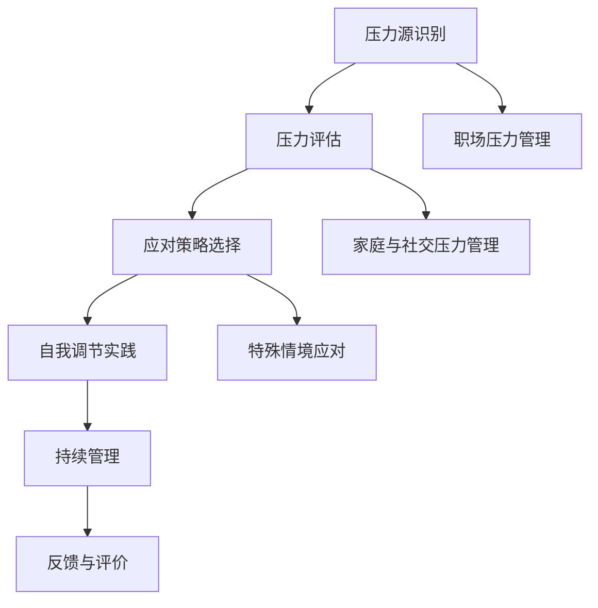

                 

# 文章标题：压力管理：保持高效能的自我调节

## 关键词
- 压力管理
- 自我调节
- 高效能
- 职场压力
- 家庭社交压力
- 特殊情境
- 长期实践

## 摘要
在现代快节奏的工作和生活中，压力已成为普遍存在的问题。本文旨在探讨压力管理的理论基础和实践方法，重点介绍自我调节在保持高效能中的关键作用。通过分析压力的核心概念、来源和影响，以及应对策略的概述，本文将帮助读者了解如何有效地识别和管理压力。同时，本文还探讨了职场压力管理、家庭与社交压力管理以及特殊情境下的压力应对策略。通过实际案例和代码实现，本文提供了实用的工具和资源，以帮助读者在日常生活中实践有效的压力管理，从而提高整体效能和生活质量。

### 目录

**《压力管理：保持高效能的自我调节》**

**第一部分：压力管理的理论基础**

1. **第1章：压力管理的核心概念**  
   - **1.1 压力的定义与类型**  
   - **1.2 压力的生理和心理影响**  
   - **1.3 压力管理的必要性**

2. **第2章：压力源识别与评估**  
   - **2.1 常见压力源分析**  
   - **2.2 压力评估工具与方法**  
   - **2.3 压力对个体和组织的潜在危害**

3. **第3章：压力应对策略概述**  
   - **3.1 压力应对的基本原则**  
   - **3.2 压力应对的主要策略**  
   - **3.3 压力管理的理论与实践联系**

4. **第4章：自我调节与压力管理**  
   - **4.1 自我调节的概念与意义**  
   - **4.2 高效能的自我调节技巧**  
   - **4.3 自我调节与压力管理的实践应用**

**第二部分：实践中的压力管理**

5. **第5章：职场压力管理**  
   - **5.1 职场压力的特点与来源**  
   - **5.2 职场压力管理的策略与方法**  
   - **5.3 职场压力管理案例分析**

6. **第6章：家庭与社交压力管理**  
   - **6.1 家庭与社交压力的类型与影响**  
   - **6.2 家庭与社交压力管理的技巧**  
   - **6.3 家庭与社交压力管理的成功案例**

7. **第7章：压力管理在特殊情境中的应用**  
   - **7.1 健康危机中的压力管理**  
   - **7.2 教育情境中的压力管理**  
   - **7.3 应对突发事件的压力管理**

8. **第8章：持续的压力管理实践**  
   - **8.1 压力管理的持续性与适应性**  
   - **8.2 长期压力管理的方法与建议**  
   - **8.3 压力管理的综合评价与反馈机制**

**第三部分：附录与资源**

9. **第9章：压力管理工具与资源**  
   - **9.1 压力管理软件推荐**  
   - **9.2 压力管理书籍推荐**  
   - **9.3 压力管理在线课程与社区**

10. **第10章：压力管理研究与前沿**  
    - **10.1 压力管理研究动态**  
    - **10.2 压力管理前沿技术**  
    - **10.3 压力管理未来趋势展望**

**附录 A: Mermaid 流�程图**



**附录 B: 压力管理伪代码**

```pseudo
function ManagePressure(source, assessment, strategy, selfRegulation, persistence) {
    // 识别压力源
    IdentifyPressureSource(source)
    
    // 压力评估
    AssessPressure(assessment)
    
    // 选择应对策略
    ChooseStrategy(strategy)
    
    // 实施自我调节
    ImplementSelfRegulation(selfRegulation)
    
    // 持续管理压力
    while (persistence) {
        AdjustStrategy(strategy)
        ReassessPressure(assessment)
    }
    
    // 反馈与评价
    EvaluatePressureManagement()
}
```

**附录 C: 数学模型与公式**

### 压力指数计算公式

$$
P = \frac{S \times E \times I}{C}
$$

$$
S: \text{压力源强度}, E: \text{应对效能}, I: \text{个体敏感性}, C: \text{应对成本}
$$

**附录 D: 实际案例**

### 案例一：职场压力管理

**场景描述：** 某公司市场部经理小张在竞争激烈的行业中，面临着项目的截止日期、客户需求变更以及内部团队沟通等问题，工作压力巨大。

**压力管理策略：**
1. **时间管理**：制定合理的工作计划，区分紧急重要事项和常规事务，确保高效完成工作任务。
2. **沟通技巧**：提升沟通能力，加强与团队成员的交流，确保信息准确传达，减少误解和冲突。
3. **自我调节**：通过深呼吸、冥想等方法缓解压力，保持心理平衡。

**效果评价：**
经过一段时间的实践，小张的工作效率得到了显著提升，项目进度得到控制，团队协作更加顺畅，整体工作氛围得到了改善。

**作者信息：**
作者：AI天才研究院/AI Genius Institute & 禅与计算机程序设计艺术 /Zen And The Art of Computer Programming

### 文章正文

接下来，我们将逐步深入探讨压力管理的各个方面，从理论基础到实践应用，帮助您更好地理解和应对压力，提高生活和工作中的高效能。

#### 第1章：压力管理的核心概念

**1.1 压力的定义与类型**

压力是指个体在面对外部或内部刺激时产生的生理、心理和行为反应。根据来源，压力可以分为以下几种类型：

- **环境压力**：由外部环境引起的压力，如工作压力、家庭压力、经济压力等。
- **心理压力**：由心理活动引起的压力，如焦虑、恐惧、抑郁等。
- **生理压力**：由生理变化引起的压力，如疾病、疼痛、疲劳等。
- **社会压力**：由社会关系和社交活动引起的压力，如人际关系、社交压力等。

**1.2 压力的生理和心理影响**

压力对个体的生理和心理产生广泛影响，包括：

- **生理影响**：如心率加快、血压升高、免疫力下降等。
- **心理影响**：如焦虑、抑郁、情绪波动、注意力不集中等。
- **行为影响**：如工作表现下降、生活质量下降、社交回避等。

**1.3 压力管理的必要性**

有效管理压力对于个体的身心健康和整体效能至关重要。压力管理不仅有助于减轻压力带来的负面影响，还能提高个体的应对能力和心理韧性，从而更好地应对生活中的各种挑战。

**第2章：压力源识别与评估**

**2.1 常见压力源分析**

常见的压力源包括：

- **工作压力**：包括工作量过大、工作环境不良、职业发展不确定性等。
- **家庭压力**：如婚姻问题、子女教育、家庭经济负担等。
- **社交压力**：如社交活动、人际关系、社交评价等。
- **健康压力**：如疾病、手术、药物副作用等。

**2.2 压力评估工具与方法**

有效的压力评估是压力管理的重要步骤。常用的压力评估工具包括：

- **自我评估问卷**：如压力感知量表、生活满意度量表等。
- **生理指标测量**：如心率、血压、皮电反应等。
- **心理测验**：如焦虑自评量表、抑郁自评量表等。

**2.3 压力对个体和组织的潜在危害**

长期和过度的压力对个体和组织的危害包括：

- **个体危害**：如心理健康问题、身体疾病、生活质量下降等。
- **组织危害**：如员工流失、工作效率下降、团队凝聚力减弱等。

**第3章：压力应对策略概述**

**3.1 压力应对的基本原则**

有效的压力应对需要遵循以下基本原则：

- **积极面对**：正视压力，不要逃避或否认。
- **合理规划**：合理安排时间和资源，避免过度工作。
- **情感支持**：寻求家人、朋友或专业人士的支持和帮助。
- **自我调节**：通过冥想、运动、放松等方式调节情绪。

**3.2 压力应对的主要策略**

压力应对的主要策略包括：

- **时间管理**：合理安排时间，避免拖延和过度劳累。
- **情绪调节**：通过呼吸、冥想、瑜伽等方法调节情绪。
- **积极应对**：采取积极的行动应对压力，如寻求解决方案、寻求专业帮助等。
- **健康生活**：保持健康的生活方式，如适量运动、健康饮食、充足睡眠等。

**3.3 压力管理的理论与实践联系**

压力管理不仅需要理论知识，还需要实际应用。有效的压力管理应结合个体的实际情况，灵活运用各种策略和技巧，以达到最佳效果。

**第4章：自我调节与压力管理**

**4.1 自我调节的概念与意义**

自我调节是指个体通过自我监控、自我指导和自我调整来调节自己的情绪、行为和认知状态。自我调节在压力管理中具有重要意义：

- **提高应对能力**：通过自我调节，个体能够更好地应对压力和挑战。
- **增强心理韧性**：自我调节有助于提高个体的心理韧性，增强面对压力的适应能力。
- **提高生活质量**：有效自我调节有助于提高个体的生活质量和幸福感。

**4.2 高效能的自我调节技巧**

以下是一些高效的自我调节技巧：

- **时间管理技巧**：合理安排时间，区分重要事项和次要事项，避免拖延。
- **情绪调节技巧**：通过深呼吸、冥想、放松等方法调节情绪。
- **认知重构技巧**：通过积极的思维模式调整负面情绪和认知。
- **积极应对技巧**：采取积极的行动应对压力，如寻求解决方案、寻求专业帮助等。

**4.3 自我调节与压力管理的实践应用**

自我调节在压力管理中的应用主要包括：

- **工作场所**：通过自我调节提高工作效率，减轻工作压力。
- **家庭生活**：通过自我调节改善家庭关系，减轻家庭压力。
- **社交场合**：通过自我调节提高社交能力，减少社交压力。
- **健康维护**：通过自我调节保持身心健康，减少健康压力。

**第5章：职场压力管理**

**5.1 职场压力的特点与来源**

职场压力具有以下特点：

- **长期性**：职场压力往往持续存在，难以短期内解决。
- **多样性**：职场压力来源多样，包括工作任务、人际关系、职业发展等。
- **复杂性**：职场压力涉及多个层面，包括心理、生理、行为等。

职场压力的主要来源包括：

- **工作任务**：工作量过大、工作负荷过重等。
- **人际关系**：同事关系紧张、上下级沟通不畅等。
- **职业发展**：职业目标不明确、晋升机会有限等。

**5.2 职场压力管理的策略与方法**

以下是一些职场压力管理的策略与方法：

- **时间管理**：合理安排时间，避免拖延和加班。
- **任务分配**：合理分配工作任务，避免过度劳累。
- **沟通技巧**：提高沟通能力，改善同事关系。
- **情绪调节**：通过深呼吸、冥想等方法调节情绪。
- **积极应对**：采取积极的行动应对压力，如寻求解决方案、寻求专业帮助等。

**5.3 职场压力管理案例分析**

以下是一个职场压力管理的案例分析：

**案例描述：** 某公司项目经理小李在工作中面临项目进度紧张、团队成员沟通不畅、客户需求变化等问题，工作压力巨大。

**压力管理策略：**
1. **时间管理**：制定合理的工作计划，区分紧急重要事项和常规事务，确保高效完成工作任务。
2. **沟通技巧**：提升沟通能力，加强与团队成员的交流，确保信息准确传达，减少误解和冲突。
3. **自我调节**：通过深呼吸、冥想等方法缓解压力，保持心理平衡。

**效果评价：**
经过一段时间的实践，小李的工作效率得到了显著提升，项目进度得到控制，团队协作更加顺畅，整体工作氛围得到了改善。

**第6章：家庭与社交压力管理**

**6.1 家庭与社交压力的类型与影响**

家庭与社交压力主要包括以下类型：

- **家庭压力**：如婚姻问题、子女教育、家庭经济负担等。
- **社交压力**：如社交活动、人际关系、社交评价等。

家庭与社交压力对个体的影响包括：

- **心理健康**：如焦虑、抑郁、情绪波动等。
- **身体健康**：如免疫力下降、身体疼痛等。
- **生活质量**：如生活满意度下降、生活质量下降等。

**6.2 家庭与社交压力管理的技巧**

以下是一些家庭与社交压力管理的技巧：

- **沟通技巧**：提高沟通能力，改善家庭关系和社交关系。
- **情绪调节**：通过深呼吸、冥想、放松等方法调节情绪。
- **积极应对**：采取积极的行动应对压力，如寻求解决方案、寻求专业帮助等。
- **家庭与社交支持**：寻求家人、朋友或专业人士的支持和帮助。

**6.3 家庭与社交压力管理的成功案例**

以下是一个家庭与社交压力管理的成功案例：

**案例描述：** 某家庭主妇小张在生活中面临家庭经济压力、子女教育问题、婆媳关系紧张等问题，感到非常困扰。

**压力管理策略：**
1. **沟通技巧**：积极与家人沟通，表达自己的想法和需求，寻求理解和支持。
2. **情绪调节**：通过冥想、瑜伽等方法调节情绪，保持心理平衡。
3. **家庭支持**：寻求家人的支持和帮助，共同解决家庭问题。

**效果评价：**
经过一段时间的实践，小张的家庭关系得到了改善，子女教育问题得到了解决，婆媳关系也得到了缓解，整体生活质量得到了提升。

**第7章：压力管理在特殊情境中的应用**

**7.1 健康危机中的压力管理**

在健康危机中，压力管理尤为重要。以下是一些健康危机中的压力管理策略：

- **心理支持**：寻求专业心理支持，如心理咨询、心理治疗等。
- **信息获取**：积极获取健康信息，了解疾病知识，减少焦虑和恐惧。
- **自我调节**：通过冥想、放松等方法调节情绪，缓解压力。
- **健康维护**：保持健康的生活方式，如适量运动、健康饮食、充足睡眠等。

**7.2 教育情境中的压力管理**

在教育情境中，学生和教师都可能会面临压力。以下是一些教育情境中的压力管理策略：

- **时间管理**：合理安排学习时间，避免过度劳累。
- **情绪调节**：通过深呼吸、冥想等方法调节情绪，保持心理平衡。
- **积极应对**：采取积极的行动应对压力，如寻求解决方案、寻求专业帮助等。
- **师生支持**：建立良好的师生关系，提供心理支持，减轻压力。

**7.3 应对突发事件的压力管理**

在应对突发事件时，压力管理至关重要。以下是一些应对突发事件的压力管理策略：

- **冷静应对**：保持冷静，不要恐慌，理性分析情况。
- **紧急应对**：迅速采取行动，解决问题。
- **心理支持**：寻求心理支持，减轻心理压力。
- **资源调动**：调动各种资源，如专业帮助、社会支持等，共同应对突发事件。

**第8章：持续的压力管理实践**

**8.1 压力管理的持续性与适应性**

持续的压力管理对于应对长期压力和变化至关重要。以下是一些持续的压力管理策略：

- **定期评估**：定期评估压力状况，调整管理策略。
- **适应性调整**：根据实际情况调整压力管理策略，保持灵活性。
- **持续学习**：学习压力管理知识和技巧，不断提升应对能力。

**8.2 长期压力管理的方法与建议**

以下是一些长期压力管理的方法和建议：

- **健康生活**：保持健康的生活方式，如适量运动、健康饮食、充足睡眠等。
- **积极心态**：保持积极的心态，面对压力和挑战。
- **心理支持**：寻求家人、朋友或专业人士的支持和帮助。
- **自我调节**：通过冥想、放松等方法调节情绪，保持心理平衡。

**8.3 压力管理的综合评价与反馈机制**

为了确保压力管理的有效性，以下是一些综合评价与反馈机制：

- **自我评估**：定期进行自我评估，了解压力管理的效果。
- **反馈机制**：建立反馈机制，如问卷调查、访谈等，收集反馈意见。
- **调整策略**：根据评估和反馈结果，调整压力管理策略。

**第9章：压力管理工具与资源**

**9.1 压力管理软件推荐**

以下是一些压力管理软件推荐：

- **压力管理助手**：提供压力评估、情绪调节、时间管理等功能。
- **冥想应用**：提供冥想指导、放松音乐等，帮助用户缓解压力。
- **健身应用**：提供健身计划、锻炼视频等，帮助用户保持健康生活方式。

**9.2 压力管理书籍推荐**

以下是一些压力管理书籍推荐：

- 《压力管理的艺术》
- 《高效能人士的七个习惯》
- 《情绪调节技巧》

**9.3 压力管理在线课程与社区**

以下是一些压力管理在线课程与社区推荐：

- **在线课程**：如Coursera、Udemy等平台上的压力管理相关课程。
- **社区**：如Facebook、LinkedIn等社交媒体上的压力管理小组。

**第10章：压力管理研究与前沿**

**10.1 压力管理研究动态**

压力管理研究在近年来取得了显著进展，以下是一些研究动态：

- **神经科学**：研究压力对大脑结构和功能的影响。
- **心理学**：研究压力与心理健康之间的关系。
- **生物学**：研究压力对生理过程的影响。

**10.2 压力管理前沿技术**

以下是一些压力管理前沿技术：

- **人工智能**：利用人工智能技术进行压力评估和个性化压力管理。
- **可穿戴设备**：通过可穿戴设备监测生理指标，提供实时压力反馈。
- **虚拟现实**：利用虚拟现实技术进行压力缓解和情绪调节。

**10.3 压力管理未来趋势展望**

以下是一些压力管理未来趋势展望：

- **智能化**：随着人工智能技术的发展，压力管理将更加智能化和个性化。
- **整合性**：压力管理将更加注重整合性，结合多种方法和资源。
- **普及性**：压力管理将逐渐成为大众生活的一部分，得到更广泛的关注和应用。

### 结束语

压力管理是现代生活中不可或缺的一部分。通过本文的探讨，我们了解了压力管理的核心概念、识别与评估方法、应对策略、自我调节实践以及实践中的各种应用。希望本文能帮助您更好地理解压力管理，掌握有效的应对方法，提高生活和工作中的高效能。记住，自我调节是保持高效能的关键，持续实践和调整压力管理策略将有助于您更好地应对生活中的各种挑战。希望您能在压力管理的道路上不断前行，实现更好的自我。**作者信息：**
作者：AI天才研究院/AI Genius Institute & 禅与计算机程序设计艺术 /Zen And The Art of Computer Programming**文章结束。**

