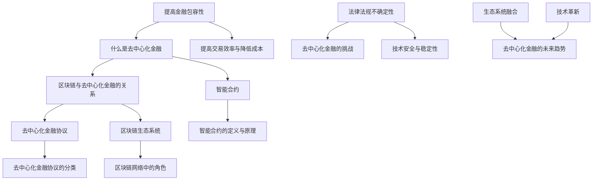

                 


# 文章标题：去中心化金融：LLM 的应用

> 关键词：去中心化金融（DeFi）、大型语言模型（LLM）、智能合约、区块链、安全性

> 摘要：本文全面探讨了去中心化金融（DeFi）与大型语言模型（LLM）的结合应用。首先介绍了DeFi的基本概念、架构和优势，接着详细解析了区块链、智能合约和DeFi协议的工作原理。随后，文章深入分析了LLM的基本概念、发展历程以及其在DeFi领域的应用场景。最后，本文提出了DeFi的安全性问题及解决方案，展望了LLM在DeFi中的未来发展趋势。

----------------------------------------------------------------

## 第一部分：去中心化金融概述

### 第1章：去中心化金融基础

#### 1.1 什么是去中心化金融

#### 1.1.1 去中心化金融的定义与背景

去中心化金融（DeFi）是一种基于区块链技术构建的金融系统，它通过智能合约实现金融服务，从而去除传统金融中介。去中心化金融的主要特点包括：无需第三方中介、提高透明度、降低交易成本、以及更高的金融包容性。

去中心化金融的起源可以追溯到2008年的比特币白皮书。随着比特币的成功，越来越多的开发者开始关注区块链技术在金融领域的应用。2017年以太坊的智能合约功能发布，标志着去中心化金融的快速发展。

#### 1.1.2 区块链与去中心化金融的关系

区块链是一种分布式数据库技术，通过密码学确保数据不可篡改。区块链的去中心化特性使得数据分散存储，提高了系统的抗攻击能力和安全性。去中心化金融正是基于区块链技术的这些特点而发展起来的一种新型金融模式。

#### 1.1.3 去中心化金融的核心概念与架构

去中心化金融的核心概念包括智能合约、去中心化金融协议（DeFi Protocols）和区块链生态系统。

- **智能合约**：智能合约是一种在区块链上自动执行、控制或文档化法律合同条款的计算机程序。智能合约通过编程实现合同条款的执行，确保交易过程自动化且不可篡改。
- **去中心化金融协议（DeFi Protocols）**：去中心化金融协议可以分为稳定币、借贷平台、衍生品交易平台等多个类别。每种协议都有其独特的功能和应用场景。
- **区块链生态系统**：区块链生态系统包括矿工、验证者、用户等多种角色，各角色在生态系统中扮演不同角色，共同维护网络运行。

#### 1.1.4 去中心化金融的优势与挑战

去中心化金融的优势包括：

- **提高金融包容性**：去中心化金融降低了进入金融系统的门槛，让更多人享受到金融服务。
- **提高交易效率与降低成本**：区块链技术去除了传统金融中介，减少了交易环节，降低了成本。

然而，去中心化金融也面临一些挑战：

- **法律法规不确定性**：去中心化金融在全球范围内的法律法规尚不明确，增加了法律风险。
- **技术安全与稳定性**：区块链技术虽然具有较高的安全性，但仍面临黑客攻击、网络拥堵等技术挑战。

#### 图 1.1 去中心化金融的核心概念与架构



#### 1.2 去中心化金融的历史与发展

去中心化金融的发展历程可以分为几个重要阶段：

1. **初期阶段**（2010-2016）：比特币等加密货币的兴起，激发了人们对于去中心化金融的思考。
2. **发展阶段**（2017-2019）：以太坊等区块链平台推出智能合约功能，去中心化金融项目如雨后春笋般涌现。
3. **成熟阶段**（2020至今）：去中心化金融逐渐成熟，吸引了大量传统金融公司和投资者的关注。

在未来，随着技术的不断进步和法律法规的完善，去中心化金融有望在更广泛的领域得到应用，实现真正的金融自由。

### 第2章：区块链基础

#### 2.1 区块链基本原理

#### 2.1.1 区块链的定义与核心特性

区块链是一种去中心化的分布式数据库技术，通过密码学确保数据不可篡改。区块链的核心特性包括：

- **去中心化**：区块链不依赖于中央机构，所有节点共同维护数据的一致性。
- **不可篡改**：区块链上的数据一旦被记录，就不可篡改，提高了数据的可信度。
- **去信任**：区块链通过密码学和共识算法，实现无需信任的协作。

#### 2.1.2 区块链的基本结构

区块链的基本结构包括区块和链。

- **区块**：区块是区块链的基本单元，包含一系列交易数据。
- **链**：区块链通过区块的链接形成一条长链，新产生的区块链接到链的尾部。

#### 2.1.3 共识算法

共识算法是区块链网络中的节点达成一致的方法，确保数据的一致性和安全性。常见的共识算法包括：

- **工作量证明（PoW）**：通过解决计算难题证明节点的权益。
- **权益证明（PoS）**：根据节点持有的代币数量和时长来决定权益。
- **软分叉与硬分叉**：通过修改区块链的协议规则来适应新需求。

#### 2.2 分布式账本技术

分布式账本技术是一种去中心化的数据库系统，多个节点共同维护同一份数据。分布式账本的作用包括：

- **提高数据透明度和可追溯性**：所有节点都可以查看和验证数据，提高了数据的可信度。
- **降低数据篡改的风险**：由于数据分散存储，篡改数据的难度大大增加。

#### 2.3 区块链与分布式账本的区别

区块链与分布式账本的区别主要体现在以下几个方面：

- **去中心化程度**：区块链是完全去中心化的，而分布式账本可以是部分中心化的。
- **应用场景**：区块链适用于需要高安全性和高透明度的应用场景，而分布式账本适用于多种应用场景，不一定需要共识算法。

#### 2.4 区块链网络安全

区块链网络攻击类型主要包括：

- **51%攻击**：通过控制超过一半的区块链网络节点，攻击者可以篡改区块链数据。
- **拒绝服务攻击（DDoS）**：通过大量无效请求使区块链网络节点过载，导致网络服务中断。

防御区块链网络攻击的方法包括：

- **提高共识算法的难度**：通过提高共识算法的难度，增加攻击成本，减少51%攻击的风险。
- **多重签名与分片技术**：多重签名增加交易授权的复杂度，分片技术降低单个节点的负载。

#### 2.5 区块链技术的未来发展趋势

区块链技术的未来发展趋势包括：

- **技术革新**：通过第2层解决方案、零知识证明等技术，提高区块链网络的性能和安全性。
- **应用拓展**：区块链技术在供应链管理、身份验证、智能合约等领域得到广泛应用。
- **去中心化金融与数字货币**：去中心化金融与数字货币将继续推动区块链技术的创新与发展。

#### 2.6 区块链与人工智能的融合

区块链与人工智能的融合为去中心化金融带来了新的机遇：

- **区块链在人工智能中的应用**：区块链技术可以提高人工智能训练数据的安全性和隐私性，智能合约可以与AI模型结合，实现自动化决策与执行。
- **人工智能在区块链中的应用**：人工智能技术可以用于优化共识算法，提高区块链网络性能，辅助区块链系统的风险管理和监管。

#### 图 2.1 区块链基本原理与共识算法

```mermaid
graph TD
    A[区块链基本原理] --> B[区块链定义与核心特性]
    B --> C[区块链的基本结构]
    C --> D[区块与链]
    A --> E[共识算法]
    E --> F[工作量证明（PoW）]
    E --> G[权益证明（PoS）]
    E --> H[软分叉与硬分叉]
    I[分布式账本技术] --> J[分布式账本的定义与作用]
    J --> K[共识机制]
    K --> L[数据存储]
    I --> M[区块链与分布式账本的区别]
    N[区块链网络安全] --> O[区块链网络攻击类型]
    O --> P[51%攻击]
    O --> Q[拒绝服务攻击（DDoS）]
    N --> R[防御区块链网络攻击的方法]
    R --> S[提高共识算法的难度]
    R --> T[多重签名与分片技术]
    N --> U[法律法规与区块链安全]
    U --> V[区块链安全法规的重要性]
    U --> W[国际合作与法规协调]
    X[区块链技术的未来发展趋势] --> Y[Z[技术革新]]
    Y --> Z1[第2层解决方案]
    Y --> Z2[零知识证明]
    X --> AA[应用拓展]
    AA --> BB[跨行业应用]
    AA --> CC[去中心化金融与数字货币]
    X --> DD[区块链与人工智能的融合]
    DD --> EE[区块链在人工智能中的应用]
    EE --> FF[数据安全与隐私保护]
    EE --> GG[智能合约与AI]
    DD --> HH[人工智能在区块链中的应用]
    HH --> II[共识算法优化]
    HH --> JJ[风险管理与监管]
```

### 第3章：智能合约基础

#### 3.1 智能合约基本概念

#### 3.1.1 智能合约的定义与特点

智能合约是一种运行在区块链上的程序，可以自动执行、控制和文档化法律合同条款。智能合约的特点包括：

- **自动执行**：当触发特定条件时，智能合约自动执行预定操作。
- **去中心化**：智能合约在区块链上运行，不受单一实体控制。
- **可追溯性**：智能合约的执行过程透明可查，提高了合同执行的公信力。

#### 3.1.2 智能合约的工作原理

智能合约的工作原理包括以下几个步骤：

1. **编写智能合约代码**：使用Solidity等编程语言编写智能合约代码。
2. **编译智能合约代码**：将智能合约代码编译为以太坊虚拟机（EVM）可识别的字节码。
3. **部署智能合约**：将编译后的字节码部署到区块链上，生成合约地址。
4. **调用智能合约**：通过区块链网络调用智能合约的函数，执行预定的操作。

#### 3.2 编写智能合约

#### 3.2.1 智能合约开发环境

选择合适的开发环境，如Truffle、Hardhat、Remix等。安装Node.js和所选开发环境所需的依赖。

#### 3.2.2 编写智能合约代码

智能合约代码的基本结构包括：

- **pragma**：指定智能合约编译器的版本。
- **contract**：定义智能合约的名称和结构。
- **function**：定义智能合约的函数，包括输入参数和返回值。

示例智能合约：简单的存储合约，用于存储和检索数据。

```solidity
pragma solidity ^0.8.0;

contract SimpleStorage {
    uint256 storedData;

    function store(uint256 data) public {
        storedData = data;
    }

    function retrieve() public view returns (uint256) {
        return storedData;
    }
}
```

#### 3.2.3 部署智能合约

使用开发环境部署智能合约到以太坊网络。创建钱包账户，使用MetaMask等钱包工具。

```javascript
const { ethers } = require("hardhat");

async function deployContract() {
    const [deployer] = await ethers.getSigners();
    const ContractFactory = await ethers.getContractFactory("SimpleStorage");
    const contract = await ContractFactory.deploy();
    await contract.deployed();
    console.log("Contract deployed to:", contract.address);
}

deployContract().catch((error) => {
    console.error(error);
});
```

#### 3.3 智能合约的调用与交互

#### 3.3.1 调用智能合约函数

准备调用交易，设置交易参数，如发送者地址、接收者地址、价值等。通过钱包或开发环境发送交易，调用智能合约的函数。

```javascript
async function callFunction() {
    const contract = await ethers.getContractAt("SimpleStorage", "0x123..."); // 合约地址
    const tx = await contract.retrieve();
    console.log("Retrieved value:", tx);
}

callFunction().catch((error) => {
    console.error(error);
});
```

#### 3.3.2 智能合约与前端交互

使用Web3.js库与智能合约进行交互。

```javascript
const web3 = new Web3("http://localhost:7545");

const contractAddress = "0x123...";
const contractABI = [/* 合约ABI */];

const contract = new web3.eth.Contract(contractABI, contractAddress);

async function interactWithContract() {
    const result = await contract.methods.retrieve().call();
    console.log("Retrieved value:", result);
}

interactWithContract().catch((error) => {
    console.error(error);
});
```

#### 3.4 智能合约的测试与调试

#### 3.4.1 单元测试

使用Truffle框架编写和运行智能合约的单元测试。

```javascript
const { assert } = require("chai");
const { deployContract } = require("../scripts/deploy.js");

describe("SimpleStorage", function () {
    before(async function ()

