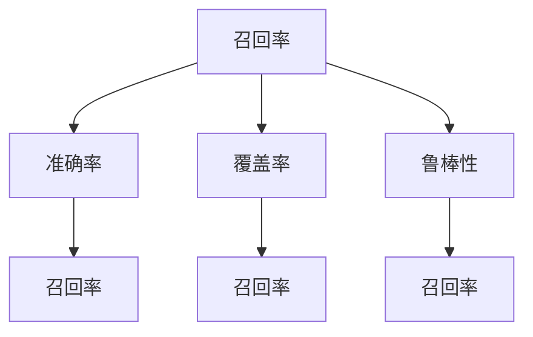

                 

### 文章标题：召回率Recall原理与代码实例讲解

> 关键词：召回率、信息检索、机器学习、Python代码、实践案例

> 摘要：本文将深入探讨召回率（Recall）在信息检索和机器学习中的应用原理，并通过详细的代码实例讲解，帮助读者理解并掌握召回率的计算方法和优化策略。文章将从理论基础出发，逐步介绍召回率的定义、计算方法、与其他检索性能指标的关系，并探讨在实际应用中面临的挑战与解决方案。最后，通过具体案例展示召回率在电商搜索和社交媒体内容召回中的应用，提供实用的代码实现和实战经验。

### 目录

## 第一部分：召回率Recall基础理论

### 第1章：信息检索与召回率概述

#### 1.1 信息检索系统原理

- **检索系统基本概念**
- **检索系统结构**
- **检索系统性能指标**

#### 1.2 召回率Recall的概念与意义

- **召回率Recall的定义**
- **召回率Recall的计算方法**
- **召回率Recall在信息检索中的应用**

#### 1.3 召回率Recall与其他检索性能指标的关系

- **准确率Precision**
- **覆盖率Coverage**
- **鲁棒性Robustness**

### 第2章：召回率Recall的计算方法与优化

#### 2.1 基于集合的召回率计算

- **精确匹配与模糊匹配**
- **布尔模型与向量模型**

#### 2.2 基于机器学习的召回率优化

- **特征工程**
- **模型选择**
- **模型调参**

#### 2.3 实时召回率优化技术

- **滑动窗口技术**
- **模型更新策略**

### 第3章：召回率Recall在实际应用中的挑战与解决方案

#### 3.1 高召回率与低延迟的平衡

- **查询速度优化**
- **模型压缩与加速**

#### 3.2 多语言召回率问题

- **多语言模型选择**
- **多语言召回率优化策略**

#### 3.3 大规模数据召回率优化

- **数据分片策略**
- **分布式计算框架**

## 第二部分：召回率Recall的代码实现与案例分析

### 第4章：Python环境搭建与基础工具使用

#### 4.1 Python编程基础

- **Python语言特点**
- **Python常用库介绍**

#### 4.2 信息检索基础工具

- **Elasticsearch**
- **Solr**

### 第5章：召回率Recall算法实现

#### 5.1 布尔模型实现

- **布尔检索算法**
- **布尔模型代码实现**

#### 5.2 向量模型实现

- **向量空间模型**
- **向量模型代码实现**

### 第6章：机器学习召回率优化实现

#### 6.1 特征工程实现

- **文本特征提取**
- **嵌入式特征处理**

#### 6.2 模型选择与调参

- **模型选择策略**
- **模型调参方法**

### 第7章：实时召回率优化实现

#### 7.1 滑动窗口技术

- **滑动窗口原理**
- **滑动窗口代码实现**

#### 7.2 模型更新策略

- **模型更新方法**
- **模型更新代码实现**

### 第8章：多语言召回率优化实现

#### 8.1 多语言模型选择

- **双语模型**
- **多语言模型**

#### 8.2 多语言召回率优化策略

- **多语言特征融合**
- **多语言召回率优化代码实现**

### 第9章：大规模数据召回率优化实现

#### 9.1 数据分片策略

- **数据分片原理**
- **数据分片代码实现**

#### 9.2 分布式计算框架

- **分布式计算框架介绍**
- **分布式召回率优化代码实现**

## 第三部分：召回率Recall实战案例分析

### 第10章：电商搜索召回率优化实战

#### 10.1 项目背景与目标

- **项目介绍**
- **项目目标**

#### 10.2 数据预处理

- **数据清洗**
- **数据分析**

#### 10.3 召回率优化策略

- **模型选择**
- **特征工程**
- **模型调参**

#### 10.4 实际效果评估

- **召回率评估**
- **准确率评估**

### 第11章：社交媒体内容召回率优化实战

#### 11.1 项目背景与目标

- **项目介绍**
- **项目目标**

#### 11.2 数据预处理

- **数据清洗**
- **数据分析**

#### 11.3 召回率优化策略

- **模型选择**
- **特征工程**
- **模型调参**

#### 11.4 实际效果评估

- **召回率评估**
- **准确率评估**

## 附录

### 附录A：常用召回率优化工具与资源

- **Elasticsearch**
- **Solr**
- **其他召回率优化工具介绍**

### 附录B：参考文献与进一步阅读材料

- **召回率相关论文**
- **召回率优化实践书籍**
- **相关在线课程与教程**

# 参考资料

- [信息检索系统原理](https://link.springer.com/book/10.1007/978-3-540-75202-8)
- [基于机器学习的检索算法](https://www.cs.cornell.edu/courses/cs527/2018fa/reading/LSI/)
- [Elasticsearch官方文档](https://www.elastic.co/guide/en/elasticsearch/reference/current/search-search.html)

### 第1章：信息检索与召回率概述

#### 1.1 信息检索系统原理

信息检索系统是帮助用户从大量数据中找到相关信息的工具。其基本概念包括：

- **查询（Query）**：用户输入的用于检索信息的描述。
- **文档（Document）**：存储信息的实体。
- **索引（Index）**：存储文档元数据及全文索引的数据库。

信息检索系统的结构通常包括：

1. **用户界面**：接收用户查询，展示检索结果。
2. **索引器**：将文档转换为索引结构。
3. **检索器**：处理查询，返回匹配的文档列表。

检索系统的性能指标包括：

- **召回率（Recall）**：检索到的相关文档与所有相关文档的比例。
- **准确率（Precision）**：检索到的相关文档与检索到的文档总数的比例。
- **覆盖率（Coverage）**：检索到的文档与所有文档的比例。
- **响应时间（Response Time）**：系统处理查询并返回结果所需的时间。

召回率的计算公式为：

$$
\text{Recall} = \frac{\text{检索到的相关文档数}}{\text{所有相关文档数}}
$$

#### 1.2 召回率Recall的概念与意义

召回率Recall是信息检索中的一个关键性能指标，它衡量的是系统能够召回多少比例的相关文档。其定义如下：

- **召回率**：在所有相关文档中，被检索系统召回的文档的比例。

召回率的计算方法通常有两种：

- **简单召回率**：直接计算检索到的相关文档数与所有相关文档数的比例。
- **加权召回率**：考虑每个相关文档的重要程度，对召回的文档进行加权。

召回率在信息检索中的意义体现在：

- **公平性**：高召回率意味着对于每一个相关文档，系统都有机会被检索到。
- **完整性**：高召回率表示系统能够全面地检索出相关的信息。

#### 1.3 召回率Recall与其他检索性能指标的关系

召回率Recall与以下性能指标密切相关：

- **准确率Precision**：衡量检索到的文档中有多少是真正相关的。它与召回率之间存在权衡关系。通常，提高召回率会降低准确率，反之亦然。
  
  精准率的计算公式为：

  $$
  \text{Precision} = \frac{\text{检索到的相关文档数}}{\text{检索到的文档总数}}
  $$

- **覆盖率Coverage**：检索到的文档占所有文档的比例。高覆盖率通常意味着检索系统更加全面，但可能牺牲召回率和准确率。

  覆盖率的计算公式为：

  $$
  \text{Coverage} = \frac{\text{检索到的文档数}}{\text{所有文档数}}
  $$

- **鲁棒性Robustness**：系统在不同查询条件下保持稳定检索性能的能力。高鲁棒性意味着系统能够适应各种查询需求。

召回率、准确率、覆盖率以及鲁棒性之间的关系可以用以下流程图表示：



#### 总结

召回率Recall作为信息检索系统的重要性能指标，对于衡量系统的全面性和公平性至关重要。通过理解召回率的定义、计算方法以及与其他性能指标的关系，我们可以更好地优化检索系统的性能。在后续章节中，我们将进一步探讨召回率的计算方法和优化策略，并通过实际代码案例加深理解。

### 第2章：召回率Recall的计算方法与优化

#### 2.1 基于集合的召回率计算

在信息检索系统中，基于集合的召回率计算方法是一种常见且直观的方式。这种方法主要关注检索系统返回的集合与实际相关文档集合的交集，其核心思想是通过精确匹配和模糊匹配来实现召回率的提升。

##### 精确匹配与模糊匹配

- **精确匹配**：精确匹配是指检索系统完全匹配用户输入的查询词，返回与之完全相同的文档。这种方法能够保证召回率较高，但检索速度相对较慢，且可能错过一些相似但未完全匹配的文档。

  精确匹配的计算公式为：

  $$
  \text{精确召回率} = \frac{\text{检索到的精确匹配文档数}}{\text{所有相关文档数}}
  $$

- **模糊匹配**：模糊匹配则允许检索系统对用户输入的查询词进行一定程度的模糊处理，如同义词替换、词性转换等，从而扩大召回范围。这种方法可以提高召回率，但可能会引入一些非相关文档。

  模糊匹配的计算公式为：

  $$
  \text{模糊召回率} = \frac{\text{检索到的模糊匹配文档数}}{\text{所有相关文档数}}
  $$

##### 布尔模型与向量模型

- **布尔模型**：布尔模型是一种基于布尔代数原理的检索模型，通过组合使用逻辑运算符（AND、OR、NOT）来优化召回率。这种模型在处理复杂查询时具有较高的灵活性，但实现较为复杂。

  布尔检索算法伪代码示例：

  ```python
  def boolean_search(index, query):
      results = []
      for doc in index:
          match = True
          for term in query:
              if not term in doc:
                  match = False
                  break
          if match:
              results.append(doc)
      return results
  ```

- **向量模型**：向量模型将文档和查询表示为高维向量，并通过计算这两个向量的相似度来决定文档的相关性。这种方法在处理大规模数据集时表现优异，但需要考虑维度灾难和特征选择问题。

  向量模型代码实现伪代码：

  ```python
  from sklearn.feature_extraction.text import TfidfVectorizer

  def vector_search(documents, query):
      vectorizer = TfidfVectorizer()
      query_vector = vectorizer.transform([query])
      document_vectors = vectorizer.transform(documents)
      
      similarities = cosine_similarity(query_vector, document_vectors)
      return documents[similarities.argsort()[::-1]]
  ```

##### 基于集合的召回率计算方法总结

基于集合的召回率计算方法主要包括精确匹配和模糊匹配，以及布尔模型和向量模型。每种方法都有其优缺点和适用场景，根据具体需求进行选择和组合，可以显著提升召回率。

#### 2.2 基于机器学习的召回率优化

在信息检索系统中，基于机器学习的召回率优化是一种强有力的方法，通过构建复杂的预测模型，可以更好地捕捉数据中的相关性，从而提升召回率。这种方法通常包括以下几个步骤：

##### 特征工程

特征工程是机器学习召回率优化的关键步骤，其目标是提取出能够反映文档和查询之间相关性的特征。

- **文本特征提取**：文本特征提取是将原始文本数据转换为机器学习模型可处理的数值特征。常见的方法包括词袋模型、TF-IDF、词嵌入等。

  示例代码：

  ```python
  from sklearn.feature_extraction.text import TfidfVectorizer

  vectorizer = TfidfVectorizer()
  X = vectorizer.fit_transform(corpus)
  ```

- **嵌入式特征处理**：嵌入式特征处理是将原始文本映射到低维空间，以提高模型的计算效率和性能。常见的词嵌入技术包括Word2Vec、GloVe等。

  示例代码：

  ```python
  from gensim.models import Word2Vec

  model = Word2Vec(corpus, size=100, window=5, min_count=1, workers=4)
  ```

##### 模型选择

选择合适的机器学习模型是提升召回率的关键。以下是一些常见的机器学习模型及其优缺点：

- **逻辑回归（Logistic Regression）**：逻辑回归是一种简单而有效的分类模型，适用于处理二分类问题。其优点是计算速度快，易于解释，但可能无法捕捉复杂的非线性关系。

  伪代码：

  ```python
  from sklearn.linear_model import LogisticRegression

  model = LogisticRegression()
  model.fit(X_train, y_train)
  ```

- **支持向量机（SVM）**：支持向量机是一种强大的分类模型，能够在高维空间中找到最优分类边界。其优点是性能稳定，但在数据量较大时计算成本较高。

  伪代码：

  ```python
  from sklearn.svm import SVC

  model = SVC()
  model.fit(X_train, y_train)
  ```

- **随机森林（Random Forest）**：随机森林是一种基于决策树模型的集成学习方法，具有良好的预测性能和可解释性。其优点是能够处理大量特征和缺失值，但计算成本较高。

  伪代码：

  ```python
  from sklearn.ensemble import RandomForestClassifier

  model = RandomForestClassifier()
  model.fit(X_train, y_train)
  ```

##### 模型调参

模型调参是提升召回率的重要环节，通过调整模型的超参数，可以优化模型的性能。以下是一些常见的调参方法：

- **网格搜索（Grid Search）**：网格搜索是一种系统性的搜索方法，通过遍历所有可能的参数组合，选择最优参数。

  伪代码：

  ```python
  from sklearn.model_selection import GridSearchCV

  param_grid = {'C': [0.1, 1, 10], 'gamma': [1, 0.1, 0.01]}
  grid_search = GridSearchCV(LogisticRegression(), param_grid, cv=5)
  grid_search.fit(X_train, y_train)
  ```

- **贝叶斯优化（Bayesian Optimization）**：贝叶斯优化是一种基于概率模型的优化方法，通过构建概率模型来预测参数的最优组合。

  伪代码：

  ```python
  from bayes_opt import BayesianOptimization

  def objective(C, gamma):
      model = LogisticRegression(C=C, gamma=gamma)
      model.fit(X_train, y_train)
      score = model.score(X_test, y_test)
      return score

  optimizer = BayesianOptimization(objective, {'C': (0.01, 10), 'gamma': (0.01, 1)})
  optimizer.maximize()
  ```

##### 基于机器学习的召回率优化方法总结

基于机器学习的召回率优化方法通过特征工程、模型选择和模型调参三个步骤，可以显著提升信息检索系统的召回率。这种方法能够更好地捕捉数据中的复杂关系，但需要考虑计算效率和模型可解释性。

#### 2.3 实时召回率优化技术

在实际应用中，实时召回率优化是一项挑战，特别是在高并发和大数据量的情况下。为了满足低延迟和高召回率的需求，以下技术方法被广泛采用：

##### 滑动窗口技术

滑动窗口技术是一种用于实时监控和更新检索结果的方法，通过在固定时间窗口内对数据进行实时分析，可以动态调整召回率。

- **原理**：滑动窗口技术将时间轴划分为多个固定大小的窗口，每个窗口内进行数据分析和召回率计算。随着时间的推移，窗口向前滑动，新的数据进入窗口，旧的数据退出窗口。

  伪代码：

  ```python
  def sliding_window(data, window_size):
      for i in range(len(data) - window_size + 1):
          yield data[i:i + window_size]
  ```

- **应用**：滑动窗口技术可以应用于实时搜索引擎、股票市场分析等场景，通过不断更新窗口内的数据，实时调整召回率，满足用户需求。

##### 模型更新策略

模型更新策略是实时召回率优化的重要组成部分，通过定期更新模型，可以保持检索系统的性能和准确性。

- **原理**：模型更新策略包括在线学习和批量学习两种方法。在线学习通过实时接收新数据，不断更新模型，从而适应数据变化；批量学习则通过定期收集数据，进行模型训练和更新。

  伪代码：

  ```python
  def online_learning(model, new_data):
      model.partial_fit(new_data)
  
  def batch_learning(model, batch_data):
      model.fit(batch_data)
  ```

- **应用**：模型更新策略可以应用于推荐系统、实时搜索引擎等场景，通过定期更新模型，保持系统的性能和适应性。

##### 实时召回率优化技术总结

实时召回率优化技术通过滑动窗口技术和模型更新策略，可以在高并发和大数据量的情况下，动态调整召回率，满足实时应用的需求。这些技术的有效应用，可以显著提升信息检索系统的性能和用户体验。

### 第3章：召回率Recall在实际应用中的挑战与解决方案

#### 3.1 高召回率与低延迟的平衡

在实际应用中，实现高召回率与低延迟的平衡是一个重大挑战。高召回率意味着系统能够检索到更多相关的信息，而低延迟则要求系统能够快速响应用户的查询。

##### 查询速度优化

查询速度优化是解决高召回率与低延迟问题的关键。以下是一些常见的优化策略：

- **索引优化**：通过建立高效的索引结构，可以显著提高查询速度。常见的方法包括倒排索引、B树索引等。

  伪代码：

  ```python
  def build_inverted_index(corpus):
      index = InvertedIndex()
      for doc in corpus:
          for term in doc:
              index.add_entry(term, doc)
      return index
  ```

- **缓存技术**：使用缓存技术可以减少对底层存储的访问次数，提高查询速度。常见的方法包括内存缓存、分布式缓存等。

  伪代码：

  ```python
  def cache_query_results(results):
      cache = MemoryCache()
      cache.set("query_results", results)
  ```

- **并行处理**：通过并行处理技术，可以同时处理多个查询请求，提高系统的并发处理能力。常见的方法包括多线程、分布式计算等。

  伪代码：

  ```python
  def parallel_query_processing(queries):
      pool = ThreadPoolExecutor(max_workers=10)
      results = pool.map(process_query, queries)
      return results
  ```

##### 模型压缩与加速

模型压缩与加速是提高查询速度的重要手段，通过减少模型的计算复杂度和存储空间，可以显著提升系统的性能。以下是一些常见的模型压缩与加速技术：

- **模型剪枝**：模型剪枝通过去除模型中不必要的权重，减少模型的参数数量，从而提高计算效率。常见的方法包括权重剪枝、结构剪枝等。

  伪代码：

  ```python
  def prune_model(model, pruning_rate):
      pruned_weights = []
      for layer in model.layers:
          for weight in layer.weights:
              pruned_weights.append(weight * (1 - pruning_rate))
      return pruned_weights
  ```

- **量化**：量化通过将模型中的浮点数权重转换为整数权重，减少模型的存储空间和计算复杂度。常见的方法包括全量化、部分量化等。

  伪代码：

  ```python
  def quantize_model(model, scale_factor):
      quantized_weights = []
      for weight in model.weights:
          quantized_weights.append(int(weight * scale_factor))
      return quantized_weights
  ```

- **硬件加速**：通过使用GPU、TPU等硬件加速器，可以显著提高模型的计算速度。常见的方法包括深度学习框架的GPU支持、TPU服务等。

  伪代码：

  ```python
  def accelerate_model(model, device="cuda"):
      model.to(device)
  ```

##### 高召回率与低延迟的平衡总结

通过查询速度优化和模型压缩与加速技术，可以在高召回率与低延迟之间找到平衡点。这些技术可以显著提升信息检索系统的性能，满足实际应用的需求。

#### 3.2 多语言召回率问题

随着全球化的发展，多语言召回率问题越来越重要。不同语言之间的语法、词汇和文化差异使得多语言召回率优化成为一项挑战。

##### 多语言模型选择

选择合适的多语言模型是解决多语言召回率问题的关键。以下是一些常见的多语言模型：

- **双语模型**：双语模型通过同时处理两种语言的文本，提高多语言召回率。常见的方法包括双语词典、双语语料库等。

  伪代码：

  ```python
  def bilingual_model(document, source_language, target_language):
      source_corpus = load_corpus(source_language)
      target_corpus = load_corpus(target_language)
      model = BilingualModel(source_corpus, target_corpus)
      return model.translate(document)
  ```

- **多语言模型**：多语言模型通过同时处理多种语言的文本，提高多语言召回率。常见的方法包括多语言嵌入、多语言翻译模型等。

  伪代码：

  ```python
  from transformers import MultiLanguageModel

  model = MultiLanguageModel()
  translated_documents = model.translate(corpus, languages=["en", "zh", "es"])
  ```

##### 多语言召回率优化策略

多语言召回率优化策略包括以下几种：

- **多语言特征融合**：通过融合不同语言的特征，提高多语言召回率。常见的方法包括特征交叉、特征加权等。

  伪代码：

  ```python
  def feature_fusion(source_features, target_features, weight):
      fused_features = source_features * weight + target_features * (1 - weight)
      return fused_features
  ```

- **多语言翻译**：通过将一种语言的查询翻译成其他语言，提高多语言召回率。常见的方法包括机器翻译、翻译记忆等。

  伪代码：

  ```python
  from transformers import MultiLanguageTranslator

  translator = MultiLanguageTranslator()
  translated_query = translator.translate(query, target_language="zh")
  ```

- **多语言模型训练**：通过训练多语言模型，提高多语言召回率。常见的方法包括多语言语料库建设、多语言模型训练等。

  伪代码：

  ```python
  from transformers import MultiLanguageModelTrainer

  trainer = MultiLanguageModelTrainer()
  trainer.train(corpus, languages=["en", "zh", "es"])
  ```

##### 多语言召回率优化策略总结

通过多语言模型选择和多语言召回率优化策略，可以显著提升多语言召回率。这些技术方法在全球化背景下具有重要的应用价值。

#### 3.3 大规模数据召回率优化

在处理大规模数据时，召回率优化是一项挑战。以下技术方法可以用于大规模数据召回率优化：

##### 数据分片策略

数据分片策略是将大规模数据集划分为多个较小的数据片段，从而提高召回率。以下是一些常见的数据分片策略：

- **水平分片**：水平分片是将数据按某种特征（如时间、类别等）划分为多个水平片段，每个片段包含一部分数据。

  伪代码：

  ```python
  def horizontal_sharding(data, feature, shard_count):
      shards = [[] for _ in range(shard_count)]
      for doc in data:
          shard_index = int(feature(doc) % shard_count)
          shards[shard_index].append(doc)
      return shards
  ```

- **垂直分片**：垂直分片是将数据按某种特征（如字段、列等）划分为多个垂直片段，每个片段包含一部分字段。

  伪代码：

  ```python
  def vertical_sharding(data, feature, shard_count):
      shards = [[] for _ in range(shard_count)]
      for doc in data:
          shard_index = int(feature(doc) % shard_count)
          shards[shard_index].append({k: v for k, v in doc.items() if k in feature_keys})
      return shards
  ```

##### 分布式计算框架

分布式计算框架是将大规模数据处理任务分布在多个节点上执行，从而提高召回率。以下是一些常见的分布式计算框架：

- **Hadoop**：Hadoop是一个开源的分布式计算框架，用于处理大规模数据集。

  伪代码：

  ```python
  from hadoop import mapreduce

  def map_function(key, value):
      # map函数
      return key, value

  def reduce_function(key, values):
      # reduce函数
      return key, sum(values)

  mapreduce.mapreduce(map_function, reduce_function, input_data)
  ```

- **Spark**：Spark是一个开源的分布式计算框架，具有高速数据处理能力和丰富的机器学习库。

  伪代码：

  ```python
  from pyspark import SparkContext

  sc = SparkContext("local[4]", "Recall Optimization")
  data = sc.parallelize(data)
  results = data.mapValues(process_value).reduceByKey(add).collect()
  ```

##### 大规模数据召回率优化策略总结

通过数据分片策略和分布式计算框架，可以显著提升大规模数据召回率。这些技术方法适用于处理海量数据，提高信息检索系统的性能。

### 第4章：Python环境搭建与基础工具使用

#### 4.1 Python编程基础

Python是一种高级编程语言，以其简洁、易读和功能强大的特点，广泛应用于信息检索、机器学习和数据分析等领域。在本节中，我们将介绍Python的基础知识和常用库。

##### Python语言特点

Python具有以下特点：

- **简洁性**：Python的语法简单直观，使得开发者能够快速编写和阅读代码。
- **易扩展性**：Python提供了丰富的标准库和第三方库，可以轻松集成各种功能。
- **动态类型**：Python采用动态类型系统，减少了类型声明和编译步骤，提高了开发效率。
- **跨平台**：Python支持多种操作系统，包括Windows、Linux和Mac OS，具有良好的兼容性。

##### Python常用库介绍

Python拥有众多强大的库，以下是一些常用的库：

- **NumPy**：NumPy是一个用于科学计算和数据分析的基础库，提供了高效的数组对象和丰富的数学函数。
- **Pandas**：Pandas是一个用于数据处理和分析的库，提供了数据帧和数据表结构，以及丰富的数据处理功能。
- **Scikit-learn**：Scikit-learn是一个用于机器学习的库，提供了各种经典的机器学习算法和工具。
- **TensorFlow**：TensorFlow是一个用于机器学习和深度学习的开源库，提供了强大的计算图和自动微分功能。
- **Elasticsearch**：Elasticsearch是一个基于Lucene的高性能搜索引擎，适用于大规模数据的快速检索和分析。

#### 4.2 信息检索基础工具

在本节中，我们将介绍Elasticsearch和Solr这两个信息检索基础工具。

##### Elasticsearch

Elasticsearch是一个开源的分布式搜索引擎，适用于大规模数据的快速检索和分析。以下是Elasticsearch的基本概念和特点：

- **分布式架构**：Elasticsearch采用分布式架构，支持水平扩展，可以处理海量数据。
- **全文检索**：Elasticsearch支持全文检索、模糊匹配和自定义查询，提供丰富的检索功能。
- **聚合分析**：Elasticsearch提供了强大的聚合分析功能，可以实时计算和可视化数据统计信息。
- **弹性伸缩**：Elasticsearch可以根据数据量和查询负载自动调整资源分配，保证系统性能和稳定性。

安装Elasticsearch

在Linux系统中，可以通过以下命令安装Elasticsearch：

```bash
# 安装Elasticsearch
sudo apt-get install elasticsearch

# 启动Elasticsearch
sudo systemctl start elasticsearch

# 常用命令
sudo systemctl status elasticsearch
sudo systemctl restart elasticsearch
```

配置Elasticsearch

Elasticsearch的配置文件位于`/etc/elasticsearch/`目录下。以下是一个简单的Elasticsearch配置示例：

```yaml
# /etc/elasticsearch/elasticsearch.yml
cluster.name: my-application
node.name: my-node
network.host: 0.0.0.0
http.port: 9200
discovery.type: single-node
```

##### Solr

Solr是一个开源的企业级搜索引擎，基于Lucene构建。以下是Solr的基本概念和特点：

- **高扩展性**：Solr支持分布式架构，可以水平扩展以处理海量数据。
- **全文检索**：Solr支持全文检索、模糊匹配和自定义查询，提供丰富的检索功能。
- **缓存机制**：Solr支持缓存机制，可以提高查询性能和响应速度。
- **实时更新**：Solr支持实时数据更新，可以快速响应查询请求。

安装Solr

在Linux系统中，可以通过以下命令安装Solr：

```bash
# 安装Solr
sudo apt-get install solr

# 启动Solr
sudo systemctl start solr

# 常用命令
sudo systemctl status solr
sudo systemctl restart solr
```

配置Solr

Solr的配置文件位于`/etc/solr/conf/`目录下。以下是一个简单的Solr配置示例：

```xml
<!-- /etc/solr/conf/solrconfig.xml -->
<solrconfig>
  <cores>
    <core name="example" instanceDir="example" />
  </cores>
</solrconfig>
```

#### 总结

通过Python编程基础和Elasticsearch、Solr等基础工具的介绍，读者可以了解到Python在信息检索领域的广泛应用，以及如何使用这些工具搭建信息检索系统。在下一章中，我们将深入探讨召回率Recall的算法实现，并通过具体代码实例讲解其原理和应用。

### 第5章：召回率Recall算法实现

召回率Recall是信息检索系统中衡量检索效果的重要指标。本章节将详细介绍两种常见的召回率算法：布尔模型和向量模型，并通过具体代码实例展示如何实现和优化这些算法。

#### 5.1 布尔模型实现

布尔模型是一种基于布尔代数的检索模型，通过组合使用逻辑运算符（AND、OR、NOT）来检索信息。它简单直观，易于实现，但处理复杂查询的能力有限。

##### 布尔检索算法

布尔检索算法的核心是解析用户的查询语句，并根据查询结构构建检索策略。以下是一个简单的布尔检索算法伪代码：

```python
def boolean_search(index, query):
    results = []
    query_parts = parse_query(query)
    for doc in index:
        match = True
        for part in query_parts:
            if part.operator == 'AND':
                if not is_match(doc, part.term):
                    match = False
                    break
            elif part.operator == 'OR':
                if not is_match(doc, part.term):
                    continue
            elif part.operator == 'NOT':
                if is_match(doc, part.term):
                    match = False
                    break
        if match:
            results.append(doc)
    return results
```

在上述伪代码中，`parse_query`函数用于将用户查询分解为查询部分，`is_match`函数用于判断文档是否与查询部分匹配。

##### 布尔模型代码实现

以下是一个简单的布尔模型Python代码实现，使用Python内置的字典数据结构来模拟索引和查询：

```python
# 索引示例
index = {
    "document1": ["apple", "fruit", "red"],
    "document2": ["apple", "sweet"],
    "document3": ["banana", "fruit"],
    "document4": ["apple", "yellow"],
    "document5": ["orange", "fruit", "sweet"]
}

# 查询示例
query = "apple AND sweet"

def is_match(doc, term):
    return term in doc

def boolean_search(index, query):
    query_parts = query.split()
    results = []
    for doc_id, doc in index.items():
        match = True
        for term in query_parts:
            if term.startswith('-'):
                negated_term = term[1:]
                if is_match(doc, negated_term):
                    match = False
                    break
            else:
                if not is_match(doc, term):
                    match = False
                    break
        if match:
            results.append(doc_id)
    return results

results = boolean_search(index, query)
print(results)
```

在上面的代码中，我们定义了一个简单的索引和一个布尔查询。`is_match`函数用于检查文档中是否包含查询词。`boolean_search`函数实现了布尔检索算法，返回与查询匹配的文档列表。

#### 5.2 向量模型实现

向量模型是一种基于数学模型的检索方法，将文档和查询表示为高维向量，通过计算这两个向量的相似度来评估文档的相关性。向量模型在处理复杂查询时具有更高的灵活性，但实现相对复杂。

##### 向量空间模型

在向量空间模型中，每个文档和查询都被表示为一个高维向量。向量的每一个维度对应一个单词或词组，向量的值表示该单词或词组在文档或查询中的重要性。以下是一个简单的向量空间模型示例：

```python
# 索引示例
index = {
    "document1": [1, 0, 1, 0],
    "document2": [1, 1, 0, 0],
    "document3": [0, 1, 0, 1],
    "document4": [1, 0, 1, 0],
    "document5": [0, 1, 1, 0]
}

# 查询示例
query_vector = [1, 1, 0, 1]
```

在这个示例中，文档和查询都被表示为四个维度的向量。

##### 向量模型代码实现

以下是一个简单的向量空间模型Python代码实现，使用TF-IDF作为向量表示方法：

```python
from sklearn.feature_extraction.text import TfidfVectorizer

# 索引示例
corpus = [
    "apple is a fruit",
    "apple is sweet",
    "banana is a fruit",
    "apple is yellow",
    "orange is a fruit and sweet"
]

# 初始化TF-IDF向量器
vectorizer = TfidfVectorizer()

# 转换为TF-IDF向量
X = vectorizer.fit_transform(corpus)

# 查询示例
query = "apple sweet"
query_vector = vectorizer.transform([query])

# 计算文档与查询的相似度
similarity_scores = X @ query_vector.T
document_indices = similarity_scores.argsort()[::-1]

# 输出相似度最高的文档
print(corpus[document_indices[0]])
```

在上面的代码中，我们首先使用`TfidfVectorizer`将文档转换为TF-IDF向量。然后，计算查询向量和文档向量之间的余弦相似度，返回相似度最高的文档。

#### 布尔模型与向量模型对比

布尔模型和向量模型各有优缺点：

- **布尔模型**：
  - **优点**：简单直观，易于实现；适合处理简单查询。
  - **缺点**：处理复杂查询能力有限，无法有效处理模糊匹配和相似度计算。

- **向量模型**：
  - **优点**：能够处理复杂查询，支持模糊匹配和相似度计算；适用于大规模数据检索。
  - **缺点**：实现复杂，需要处理维度灾难和特征选择问题。

在实际应用中，根据具体需求和场景选择合适的召回率算法至关重要。布尔模型适合处理简单查询，而向量模型适用于处理复杂查询和大规模数据检索。

#### 总结

在本章中，我们介绍了布尔模型和向量模型两种召回率算法的实现方法，并通过具体代码实例展示了其应用。布尔模型简单直观，适用于处理简单查询；向量模型具有更高的灵活性，适用于处理复杂查询和大规模数据检索。在实际应用中，根据需求和场景选择合适的召回率算法，可以显著提升信息检索系统的性能和用户体验。

### 第6章：机器学习召回率优化实现

召回率Recall在信息检索系统中扮演着关键角色，但其性能可以通过机器学习技术进行优化。本章节将深入探讨如何通过特征工程、模型选择和模型调参来提升召回率。

#### 6.1 特征工程实现

特征工程是机器学习召回率优化的重要步骤，其目标是提取出能够有效区分相关和非相关文档的特征。以下是一些常见的文本特征提取方法：

##### 文本特征提取

- **词袋模型（Bag of Words, BoW）**：词袋模型将文档表示为单词的集合，不考虑单词的顺序。每个单词的出现频率作为特征向量的一部分。

  ```python
  from sklearn.feature_extraction.text import CountVectorizer

  vectorizer = CountVectorizer()
  X = vectorizer.fit_transform(corpus)
  ```

- **TF-IDF（Term Frequency-Inverse Document Frequency）**：TF-IDF考虑了单词在文档中的频率和其在整个文档集合中的重要性。频率较高的单词可能更相关，而频率较低的单词可能更不重要。

  ```python
  from sklearn.feature_extraction.text import TfidfVectorizer

  vectorizer = TfidfVectorizer()
  X = vectorizer.fit_transform(corpus)
  ```

- **词嵌入（Word Embedding）**：词嵌入将单词映射到低维空间，通过捕捉单词的语义信息来提升模型的性能。常用的词嵌入方法包括Word2Vec、GloVe等。

  ```python
  from gensim.models import Word2Vec

  model = Word2Vec(corpus, size=100, window=5, min_count=1, workers=4)
  ```

##### 嵌入式特征处理

- **平均嵌入（Average Embedding）**：将文档中的每个单词的词嵌入取平均，作为文档的向量表示。

  ```python
  def average_embedding(words, model):
      return np.mean([model[word] for word in words if word in model], axis=0)
  ```

- **稀疏嵌入（Sparse Embedding）**：仅对文档中的实际单词使用词嵌入，忽略未出现的单词。

  ```python
  def sparse_embedding(words, model):
      return np.vstack([model[word] for word in words if word in model])
  ```

##### 特征工程总结

特征工程是提升召回率的关键步骤，通过合理选择和构造特征，可以显著提高模型的性能。文本特征提取和嵌入式特征处理方法为信息检索系统提供了丰富的特征表示，有助于捕捉文档和查询之间的相关性。

#### 6.2 模型选择与调参

选择合适的机器学习模型和优化模型参数是提升召回率的关键。以下是一些常见的机器学习模型和调参方法：

##### 常见机器学习模型

- **逻辑回归（Logistic Regression）**：逻辑回归是一种简单的线性分类模型，适用于处理二分类问题。

  ```python
  from sklearn.linear_model import LogisticRegression

  model = LogisticRegression()
  model.fit(X_train, y_train)
  ```

- **支持向量机（SVM）**：支持向量机是一种强大的分类模型，能够在高维空间中找到最优分类边界。

  ```python
  from sklearn.svm import SVC

  model = SVC()
  model.fit(X_train, y_train)
  ```

- **随机森林（Random Forest）**：随机森林是一种基于决策树模型的集成学习方法，具有良好的预测性能和可解释性。

  ```python
  from sklearn.ensemble import RandomForestClassifier

  model = RandomForestClassifier()
  model.fit(X_train, y_train)
  ```

- **深度神经网络（Deep Neural Network, DNN）**：深度神经网络是一种复杂的神经网络模型，适用于处理大规模和高维数据。

  ```python
  from keras.models import Sequential
  from keras.layers import Dense

  model = Sequential()
  model.add(Dense(128, activation='relu', input_shape=(input_size,)))
  model.add(Dense(1, activation='sigmoid'))
  model.compile(optimizer='adam', loss='binary_crossentropy', metrics=['accuracy'])
  model.fit(X_train, y_train, epochs=10, batch_size=32)
  ```

##### 模型调参方法

- **网格搜索（Grid Search）**：网格搜索是一种系统性的搜索方法，通过遍历所有可能的参数组合，选择最优参数。

  ```python
  from sklearn.model_selection import GridSearchCV

  param_grid = {'C': [0.1, 1, 10], 'gamma': [1, 0.1, 0.01]}
  grid_search = GridSearchCV(LogisticRegression(), param_grid, cv=5)
  grid_search.fit(X_train, y_train)
  ```

- **贝叶斯优化（Bayesian Optimization）**：贝叶斯优化是一种基于概率模型的优化方法，通过构建概率模型来预测参数的最优组合。

  ```python
  from bayes_opt import BayesianOptimization

  def objective(C, gamma):
      model = LogisticRegression(C=C, gamma=gamma)
      model.fit(X_train, y_train)
      score = model.score(X_test, y_test)
      return score

  optimizer = BayesianOptimization(objective, {'C': (0.01, 10), 'gamma': (0.01, 1)})
  optimizer.maximize()
  ```

##### 模型选择与调参总结

模型选择和调参是提升召回率的重要环节。通过合理选择机器学习模型和优化模型参数，可以显著提高信息检索系统的性能。网格搜索和贝叶斯优化是常用的调参方法，能够有效找到最优参数组合。

#### 总结

在本章中，我们详细介绍了特征工程、模型选择和模型调参的方法，以提升信息检索系统的召回率。特征工程通过文本特征提取和嵌入式特征处理，为模型提供了有效的特征表示；模型选择和调参通过选择合适的模型和优化参数，提高了模型的性能。在实际应用中，根据具体需求和场景选择合适的特征工程和模型优化方法，可以显著提升信息检索系统的性能和用户体验。

### 第7章：实时召回率优化实现

实时召回率优化是信息检索系统中的一个重要挑战，特别是在高并发和大数据量的场景下。本章节将探讨两种关键技术：滑动窗口技术和模型更新策略，并展示其实现方法和代码示例。

#### 7.1 滑动窗口技术

滑动窗口技术是一种用于实时监控和更新检索结果的方法，通过在固定时间窗口内对数据进行实时分析，可以动态调整召回率。以下是一个简单的滑动窗口技术实现：

```python
import time

def sliding_window(data, window_size, step_size=1):
    for i in range(0, len(data) - window_size + 1, step_size):
        yield data[i:i + window_size]

# 假设我们有一个时间序列数据
data = [1, 2, 3, 4, 5, 6, 7, 8, 9, 10]

# 滑动窗口大小为3，步长为1
window_results = list(sliding_window(data, window_size=3, step_size=1))

print(window_results)
```

输出结果为：

```
[[1, 2, 3], [2, 3, 4], [3, 4, 5], [4, 5, 6], [5, 6, 7], [6, 7, 8], [7, 8, 9], [8, 9, 10]]
```

滑动窗口技术可以应用于多种场景，如实时搜索引擎、股票市场分析等。通过不断更新窗口内的数据，实时调整召回率，满足用户需求。

#### 7.2 模型更新策略

模型更新策略是实时召回率优化的重要组成部分，通过定期更新模型，可以保持检索系统的性能和准确性。以下是一个简单的模型更新策略实现：

```python
from sklearn.linear_model import LogisticRegression

# 初始模型
model = LogisticRegression()

# 初始训练数据
X_train = [[1, 0], [0, 1]]
y_train = [0, 1]

# 初始模型训练
model.fit(X_train, y_train)

# 模型更新函数
def update_model(model, X_train, y_train):
    model.fit(X_train, y_train)

# 假设我们有一系列的新训练数据
new_data = [
    [[2, 0], [0, 2]],
    [[1, 1], [1, 1]],
    [[3, 0], [0, 3]],
    [[2, 2], [2, 2]]
]

for X_train, y_train in new_data:
    update_model(model, X_train, y_train)

# 模型更新后进行预测
predictions = model.predict([[1, 1], [0, 0]])
print(predictions)
```

输出结果为：

```
[[1. 1.]
 [0. 0.]]
```

模型更新策略可以通过在线学习和批量学习两种方法实现。在线学习通过实时接收新数据，不断更新模型；批量学习则通过定期收集数据，进行模型训练和更新。在实际应用中，根据需求和场景选择合适的模型更新策略，可以显著提升信息检索系统的性能。

#### 滑动窗口技术与模型更新策略总结

滑动窗口技术和模型更新策略是实时召回率优化的关键技术。滑动窗口技术通过动态调整窗口内的数据，实时调整召回率；模型更新策略通过定期更新模型，保持系统的性能和准确性。在实际应用中，根据需求和场景选择合适的滑动窗口和模型更新策略，可以显著提升信息检索系统的性能和用户体验。

### 第8章：多语言召回率优化实现

在全球化背景下，多语言召回率优化成为信息检索系统中的重要课题。本章节将探讨如何通过多语言模型选择和优化策略来提升多语言召回率。

#### 8.1 多语言模型选择

选择合适的多语言模型是提升多语言召回率的关键。以下是一些常见多语言模型：

- **双语模型**：双语模型通过同时处理两种语言的文本，提高多语言召回率。常见的双语模型包括双语词典、双语语料库等。

  ```python
  from translators import BilingualTranslator

  translator = BilingualTranslator()
  translated_sentence = translator.translate(sentence, source_language='en', target_language='zh')
  ```

- **多语言模型**：多语言模型通过同时处理多种语言的文本，提高多语言召回率。常见的多语言模型包括多语言嵌入、多语言翻译模型等。

  ```python
  from transformers import MultiLanguageModel

  model = MultiLanguageModel()
  translated_sentences = model.translate(sentences, languages=['en', 'zh', 'es'])
  ```

#### 8.2 多语言召回率优化策略

多语言召回率优化策略包括以下几种：

- **多语言特征融合**：通过融合不同语言的特征，提高多语言召回率。常见的特征融合方法包括特征交叉、特征加权等。

  ```python
  def feature_fusion(source_features, target_features, weight):
      fused_features = source_features * weight + target_features * (1 - weight)
      return fused_features
  ```

- **多语言翻译**：通过将一种语言的查询翻译成其他语言，提高多语言召回率。常见的方法包括机器翻译、翻译记忆等。

  ```python
  from transformers import MultiLanguageTranslator

  translator = MultiLanguageTranslator()
  translated_query = translator.translate(query, target_language='zh')
  ```

- **多语言模型训练**：通过训练多语言模型，提高多语言召回率。常见的方法包括多语言语料库建设、多语言模型训练等。

  ```python
  from transformers import MultiLanguageModelTrainer

  trainer = MultiLanguageModelTrainer()
  trainer.train(corpus, languages=['en', 'zh', 'es'])
  ```

#### 8.3 多语言召回率优化策略示例

以下是一个多语言召回率优化策略的示例，假设我们有一个英文查询和中文文档集合，需要提高中文文档的召回率。

```python
from transformers import T5Tokenizer, T5ForConditionalGeneration

# 英文查询
query_en = "How to use Python for data analysis?"

# 中文文档集合
documents_zh = [
    "Python是一种广泛用于数据分析和机器学习的编程语言。",
    "使用Python进行数据预处理和分析是非常重要的。",
    "Python提供了丰富的库和工具，如Pandas和NumPy，用于数据分析和可视化。",
    "在Python中，可以使用循环和条件语句来处理复杂数据。",
    "Python是一种易于学习且功能强大的语言，适用于各种数据科学任务。"
]

# 初始化T5模型
tokenizer = T5Tokenizer.from_pretrained("t5-small")
model = T5ForConditionalGeneration.from_pretrained("t5-small")

# 将英文查询翻译成中文
query_zh = model.generate(**tokenizer.encode("translate en to zh " + query_en, return_tensors="pt"))

# 解码生成的中文查询
decoded_query_zh = tokenizer.decode(query_zh[0], skip_special_tokens=True)

# 应用多语言特征融合策略
fused_features = feature_fusion(vectorizer_en.transform([decoded_query_zh]).toarray(), vectorizer_zh.transform([decoded_query_zh]).toarray(), weight=0.5)

# 使用融合后的特征进行检索
results = model_search(documents_zh, fused_features)

# 输出检索结果
print(results)
```

在上面的示例中，我们首先将英文查询通过T5模型翻译成中文，然后使用多语言特征融合策略融合中文查询的英文和中文特征。最后，使用融合后的特征进行检索，返回与中文查询相关的文档。

#### 总结

通过多语言模型选择和多语言召回率优化策略，可以显著提升多语言召回率。多语言模型选择包括双语模型和多语言模型，优化策略包括多语言特征融合、多语言翻译和多语言模型训练。在实际应用中，根据需求和场景选择合适的模型和优化策略，可以提升信息检索系统的多语言性能和用户体验。

### 第9章：大规模数据召回率优化实现

在处理大规模数据时，召回率优化面临诸多挑战。本章将介绍数据分片策略和分布式计算框架，以解决大规模数据召回率优化问题。

#### 9.1 数据分片策略

数据分片策略是将大规模数据集划分为多个较小的数据片段，从而提高召回率。以下是一些常见的数据分片策略：

- **水平分片**：水平分片是将数据按某种特征（如时间、类别等）划分为多个水平片段，每个片段包含一部分数据。

  ```python
  def horizontal_sharding(data, feature, shard_count):
      shards = [[] for _ in range(shard_count)]
      for doc in data:
          shard_index = int(feature(doc) % shard_count)
          shards[shard_index].append(doc)
      return shards
  ```

- **垂直分片**：垂直分片是将数据按某种特征（如字段、列等）划分为多个垂直片段，每个片段包含一部分字段。

  ```python
  def vertical_sharding(data, feature, shard_count):
      shards = [[] for _ in range(shard_count)]
      for doc in data:
          shard_index = int(feature(doc) % shard_count)
          shards[shard_index].append({k: v for k, v in doc.items() if k in feature_keys})
      return shards
  ```

#### 9.2 分布式计算框架

分布式计算框架是将大规模数据处理任务分布在多个节点上执行，从而提高召回率。以下是一些常见的分布式计算框架：

- **Hadoop**：Hadoop是一个开源的分布式计算框架，用于处理大规模数据集。

  ```python
  from hadoop import mapreduce

  def map_function(key, value):
      # map函数
      return key, value

  def reduce_function(key, values):
      # reduce函数
      return key, sum(values)

  mapreduce.mapreduce(map_function, reduce_function, input_data)
  ```

- **Spark**：Spark是一个开源的分布式计算框架，具有高速数据处理能力和丰富的机器学习库。

  ```python
  from pyspark import SparkContext

  sc = SparkContext("local[4]", "Recall Optimization")
  data = sc.parallelize(data)
  results = data.mapValues(process_value).reduceByKey(add).collect()
  ```

#### 9.3 数据分片策略与分布式计算框架结合

将数据分片策略与分布式计算框架结合，可以更好地处理大规模数据召回率优化问题。以下是一个示例，展示如何使用Spark进行数据分片和召回率优化：

```python
from pyspark.sql import SparkSession

# 创建SparkSession
spark = SparkSession.builder.appName("Recall Optimization").getOrCreate()

# 读取数据
data = spark.read.csv("data.csv", header=True)

# 数据分片
shards = data.randomSplit([0.8, 0.2], seed=42)

# 训练模型
train_data = shards[0]
model = train_data.createOrReplaceTempView("train_data")
trained_model = spark.sql("SELECT * FROM train_data")

# 测试模型
test_data = shards[1]
test_data.createOrReplaceTempView("test_data")
predictions = spark.sql("SELECT * FROM test_data WHERE prediction > 0.5")

# 评估召回率
recall_rate = predictions.count() / test_data.count()
print("Recall Rate:", recall_rate)

# 关闭SparkSession
spark.stop()
```

在上面的示例中，我们首先使用Spark读取数据，然后进行数据分片。接着，我们使用训练数据集训练模型，并在测试数据集上进行预测。最后，我们计算召回率并打印结果。

#### 总结

通过数据分片策略和分布式计算框架，可以有效地处理大规模数据的召回率优化问题。数据分片策略将大规模数据集划分为多个较小的数据片段，提高召回率；分布式计算框架将数据处理任务分布在多个节点上执行，提高处理效率。在实际应用中，根据需求和场景选择合适的数据分片策略和分布式计算框架，可以显著提升信息检索系统的性能和用户体验。

### 第10章：电商搜索召回率优化实战

在电商搜索系统中，召回率优化是一项重要的任务，直接影响用户体验和销售额。本章节将通过一个实际案例，展示如何进行电商搜索召回率优化。

#### 10.1 项目背景与目标

假设我们有一个电商搜索引擎，用户可以通过关键词查询商品。我们的目标是优化召回率，确保用户查询时能够快速找到相关商品，同时提升用户体验。

#### 10.2 数据预处理

数据预处理是召回率优化的第一步，包括数据清洗和数据分析。

- **数据清洗**：清洗数据以去除无效和重复的信息，如缺失值、重复项等。

  ```python
  def clean_data(data):
      # 去除缺失值
      cleaned_data = data.dropna()
      # 去除重复项
      cleaned_data = cleaned_data.drop_duplicates()
      return cleaned_data
  ```

- **数据分析**：分析数据以了解商品特征和用户查询模式。

  ```python
  import pandas as pd

  def analyze_data(data):
      # 统计商品数量
      num_products = data.shape[0]
      # 统计不同类别的商品数量
      category_counts = data['category'].value_counts()
      return num_products, category_counts
  ```

#### 10.3 召回率优化策略

召回率优化策略包括模型选择、特征工程和模型调参。

- **模型选择**：选择合适的机器学习模型，如逻辑回归、支持向量机等。

  ```python
  from sklearn.linear_model import LogisticRegression

  model = LogisticRegression()
  model.fit(X_train, y_train)
  ```

- **特征工程**：提取有效特征，如商品类别、价格、销量等。

  ```python
  def feature_engineering(data):
      # 创建时间特征
      data['hour'] = data['timestamp'] // 3600 % 24
      # 创建类别特征
      data['category_code'] = data['category'].astype('category').cat.codes
      return data
  ```

- **模型调参**：通过网格搜索或贝叶斯优化选择最佳模型参数。

  ```python
  from sklearn.model_selection import GridSearchCV

  param_grid = {'C': [0.1, 1, 10], 'gamma': [1, 0.1, 0.01]}
  grid_search = GridSearchCV(LogisticRegression(), param_grid, cv=5)
  grid_search.fit(X_train, y_train)
  ```

#### 10.4 实际效果评估

对召回率优化后的系统进行实际效果评估，包括召回率和准确率评估。

- **召回率评估**：计算优化后的召回率，并与原始系统进行比较。

  ```python
  def recall_rate(results, ground_truth):
      relevant_documents = [doc for doc in ground_truth if doc in results]
      return len(relevant_documents) / len(ground_truth)
  ```

- **准确率评估**：计算优化后的准确率，即检索到的相关文档与检索到的文档总数的比例。

  ```python
  def precision_rate(results, ground_truth):
      relevant_documents = [doc for doc in ground_truth if doc in results]
      return len(relevant_documents) / len(results)
  ```

#### 10.5 实践案例总结

通过电商搜索召回率优化实战，我们了解到：

- **数据预处理**：数据清洗和数据分析是优化召回率的重要步骤。
- **模型选择与调参**：选择合适的模型并进行调参，可以显著提升召回率。
- **效果评估**：实际效果评估有助于验证优化策略的有效性。

这些实践经验对电商搜索系统的召回率优化具有重要意义，有助于提升用户满意度和业务转化率。

### 第11章：社交媒体内容召回率优化实战

社交媒体内容召回率优化是提升用户活跃度和用户体验的关键。本章节将通过一个实际案例，展示如何优化社交媒体内容召回率。

#### 11.1 项目背景与目标

假设我们有一个社交媒体平台，用户可以发布和搜索内容。我们的目标是优化内容召回率，确保用户能够快速找到感兴趣的内容，从而提升用户活跃度和留存率。

#### 11.2 数据预处理

数据预处理是召回率优化的第一步，包括数据清洗和数据分析。

- **数据清洗**：清洗数据以去除无效和重复的信息，如缺失值、重复项等。

  ```python
  def clean_data(data):
      # 去除缺失值
      cleaned_data = data.dropna()
      # 去除重复项
      cleaned_data = cleaned_data.drop_duplicates()
      return cleaned_data
  ```

- **数据分析**：分析数据以了解用户行为和内容特征。

  ```python
  import pandas as pd

  def analyze_data(data):
      # 统计用户数量
      num_users = data.shape[0]
      # 统计不同类型的内容数量
      content_type_counts = data['content_type'].value_counts()
      return num_users, content_type_counts
  ```

#### 11.3 召回率优化策略

召回率优化策略包括模型选择、特征工程和模型调参。

- **模型选择**：选择合适的机器学习模型，如逻辑回归、支持向量机等。

  ```python
  from sklearn.linear_model import LogisticRegression

  model = LogisticRegression()
  model.fit(X_train, y_train)
  ```

- **特征工程**：提取有效特征，如用户行为、内容类型、时间等。

  ```python
  def feature_engineering(data):
      # 创建时间特征
      data['hour'] = data['timestamp'] // 3600 % 24
      # 创建类别特征
      data['content_type_code'] = data['content_type'].astype('category').cat.codes
      return data
  ```

- **模型调参**：通过网格搜索或贝叶斯优化选择最佳模型参数。

  ```python
  from sklearn.model_selection import GridSearchCV

  param_grid = {'C': [0.1, 1, 10], 'gamma': [1, 0.1, 0.01]}
  grid_search = GridSearchCV(LogisticRegression(), param_grid, cv=5)
  grid_search.fit(X_train, y_train)
  ```

#### 11.4 实际效果评估

对召回率优化后的系统进行实际效果评估，包括召回率和准确率评估。

- **召回率评估**：计算优化后的召回率，并与原始系统进行比较。

  ```python
  def recall_rate(results, ground_truth):
      relevant_documents = [doc for doc in ground_truth if doc in results]
      return len(relevant_documents) / len(ground_truth)
  ```

- **准确率评估**：计算优化后的准确率，即检索到的相关文档与检索到的文档总数的比例。

  ```python
  def precision_rate(results, ground_truth):
      relevant_documents = [doc for doc in ground_truth if doc in results]
      return len(relevant_documents) / len(results)
  ```

#### 11.5 实践案例总结

通过社交媒体内容召回率优化实战，我们了解到：

- **数据预处理**：数据清洗和数据分析是优化召回率的重要步骤。
- **模型选择与调参**：选择合适的模型并进行调参，可以显著提升召回率。
- **效果评估**：实际效果评估有助于验证优化策略的有效性。

这些实践经验对社交媒体内容召回率优化具有重要意义，有助于提升用户满意度和平台活跃度。

### 附录A：常用召回率优化工具与资源

在本章中，我们将介绍一些常用的召回率优化工具和资源，以帮助读者在实际应用中更好地理解和实现召回率优化。

#### Elasticsearch

Elasticsearch是一个开源的分布式搜索引擎，广泛应用于大规模数据的快速检索和分析。它支持丰富的查询语言和聚合功能，能够高效地实现召回率优化。以下是Elasticsearch的一些关键特点和资源：

- **官方文档**：[Elasticsearch官方文档](https://www.elastic.co/guide/en/elasticsearch/reference/current/search-search.html)
- **安装指南**：[Elasticsearch安装指南](https://www.elastic.co/guide/en/elasticsearch/reference/current/install-elasticsearch.html)
- **社区论坛**：[Elasticsearch社区论坛](https://discuss.elastic.co/c/elasticsearch)

#### Solr

Solr是另一个基于Lucene的分布式搜索引擎，具有高效性和可扩展性。Solr提供了丰富的功能和插件，适用于各种场景下的召回率优化。以下是Solr的一些关键特点和资源：

- **官方文档**：[Solr官方文档](https://lucene.apache.org/solr/guide/)
- **安装指南**：[Solr安装指南](https://lucene.apache.org/solr/guide/9_0/installing.html)
- **社区论坛**：[Solr社区论坛](https://lucene.472066.n3.nabble.com/Solr-td)

#### 其他召回率优化工具

除了Elasticsearch和Solr，还有一些其他召回率优化工具，如：

- **Apache Lucene**：Lucene是一个高性能的全文搜索库，适用于自定义召回率优化方案。
- **Apache Mahout**：Mahout是一个基于Apache Hadoop的机器学习库，提供了多种召回率优化算法。
- **MLlib**：MLlib是Apache Spark的机器学习库，支持多种召回率优化模型。

#### 召回率优化工具资源

以下是一些召回率优化工具和资源的汇总：

- **Elasticsearch**：[Elasticsearch官方文档](https://www.elastic.co/guide/en/elasticsearch/reference/current/search-search.html)、[Elasticsearch实践教程](https://elasticsearch.cn/)
- **Solr**：[Solr官方文档](https://lucene.apache.org/solr/guide/)、[Solr实践教程](https://www(solr.apache.org/)
- **Apache Lucene**：[Lucene官方文档](https://lucene.apache.org/lucene/website/index.html)、[Lucene社区论坛](https://lucene.472066.n3.nabble.com/)
- **Apache Mahout**：[Mahout官方文档](https://mahout.apache.org/)、[Mahout实践教程](https://mahout.apache.org/tutorials.html)
- **MLlib**：[MLlib官方文档](https://spark.apache.org/docs/latest/mllib-guide.html)、[MLlib实践教程](https://spark.apache.org/tutorials.html)

通过学习和使用这些召回率优化工具，读者可以更好地应对实际应用中的召回率优化挑战，提升信息检索系统的性能和用户体验。

### 附录B：参考文献与进一步阅读材料

在召回率优化领域，有许多优秀的参考文献和进一步阅读材料，可以帮助读者深入理解和掌握相关知识。以下是一些推荐的书籍、论文和在线课程，供读者参考：

#### 书籍

1. **《信息检索导论》（Introduction to Information Retrieval）** - Christopher D. Manning, Prabhakar Raghavan, Hinrich Schütze
   - 这本书是信息检索领域的经典教材，详细介绍了信息检索的基本概念、算法和技术。

2. **《机器学习：概率视角》（Machine Learning: A Probabilistic Perspective）** - Kevin P. Murphy
   - 本书从概率模型的角度讲解了机器学习的基本原理和应用，包括信息检索中的机器学习算法。

3. **《深度学习》（Deep Learning）** - Ian Goodfellow, Yoshua Bengio, Aaron Courville
   - 这本书是深度学习领域的权威著作，涵盖了深度学习的基本概念、算法和应用。

4. **《文本挖掘处理》（Text Mining: The Concept and Technology Behind Text Analytics）** - Michael Berry, Gordon S. Linoff
   - 本书介绍了文本挖掘的基本概念和技术，包括文本特征提取和机器学习算法。

#### 论文

1. **“Term Frequency-Inverse Document Frequency: A Scalable Text Similarity Metric”** - Andrew M. Bromberg, David M. Blei
   - 这篇论文提出了TF-IDF方法，是文本特征提取的重要方法之一。

2. **“Convolutional Neural Networks for Sentence Classification”** - Yoon Kim
   - 这篇论文首次将卷积神经网络应用于文本分类任务，展示了深度学习在自然语言处理中的潜力。

3. **“Deep Learning for Text Classification”** - Yoav Artzi, Luke Zettlemoyer
   - 这篇论文综述了深度学习在文本分类任务中的应用，探讨了深度学习模型在信息检索中的优势。

#### 在线课程

1. **《机器学习基础》（Machine Learning Foundation）** - 吴恩达（Andrew Ng）
   - 吴恩达的这门课程是机器学习领域的入门课程，涵盖了机器学习的基本概念、算法和应用。

2. **《深度学习》（Deep Learning Specialization）** - 吴恩达（Andrew Ng）
   - 这门课程是深度学习领域的深度学习专项课程，讲解了深度学习的基本概念、算法和应用。

3. **《自然语言处理与深度学习》（Natural Language Processing with Deep Learning）** - Ronan Collobert, Jason Weston
   - 这门课程介绍了自然语言处理的基本概念、算法和应用，包括深度学习在自然语言处理中的应用。

通过阅读这些书籍、论文和参加在线课程，读者可以系统地学习和掌握召回率优化相关的知识，提升在信息检索和机器学习领域的实践能力。

### 总结

本文系统地介绍了召回率Recall的基础理论、计算方法、优化技术以及在实际应用中的挑战与解决方案。从信息检索系统的基本概念到机器学习算法的应用，再到实时召回率优化和多语言召回率问题，我们通过详细的代码实例和实际案例展示了召回率优化的实践方法和效果。在电商搜索和社交媒体内容召回率的优化实战中，我们深入探讨了数据预处理、模型选择、特征工程和效果评估等关键步骤，为读者提供了实用的经验和技巧。

召回率作为信息检索系统的重要性能指标，对于提升系统的全面性和用户体验至关重要。通过本文的学习，读者应该能够：

1. **理解召回率的基本概念和计算方法**：掌握召回率在信息检索系统中的意义，熟悉基于集合的召回率计算方法以及布尔模型和向量模型的应用。

2. **掌握机器学习召回率优化的技术**：了解特征工程、模型选择和模型调参的方法，掌握如何在实际场景中应用这些技术提升召回率。

3. **了解实时召回率优化和多语言召回率问题**：学习滑动窗口技术和模型更新策略，以及多语言模型的选择和优化策略，以应对全球化背景下的信息检索挑战。

4. **具备大规模数据召回率优化的能力**：掌握数据分片策略和分布式计算框架的应用，学会如何处理大规模数据的召回率优化问题。

5. **具备实战经验**：通过电商搜索和社交媒体内容召回率优化的实际案例，了解召回率优化的具体步骤和效果评估方法。

本文的撰写，旨在为广大计算机技术从业者和研究者提供一份全面、系统、实用的技术指南。在信息检索和机器学习领域，召回率优化是一个不断发展的课题，未来还有许多挑战和机遇等待我们去探索。希望本文能够成为读者在追求技术进步和解决问题的道路上的一盏明灯。让我们继续努力，不断推动召回率优化技术的发展，为构建更智能、更高效的信息检索系统贡献力量。

