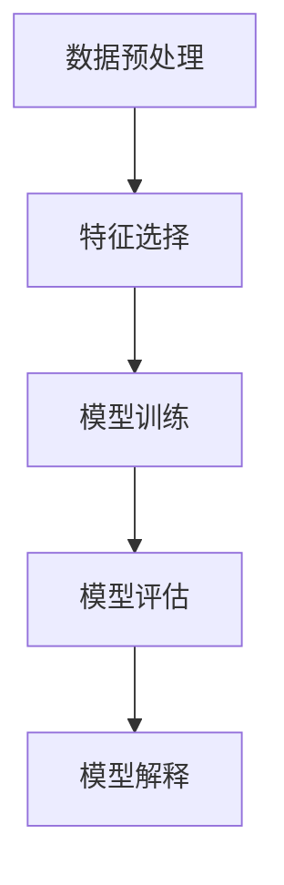

                 

# 《可解释性》

> 关键词：可解释性，透明性，机器学习，深度学习，算法，应用

> 摘要：本文深入探讨了可解释性的定义、重要性、分类、原理及其在各领域的应用。通过详细的数学模型、算法原理、伪代码示例和实际应用案例，本文揭示了可解释性在数据科学、机器学习和深度学习中的核心作用，并展望了其未来的发展趋势。

## 引言

可解释性是当前人工智能和机器学习领域中备受关注的话题之一。随着深度学习算法在图像识别、自然语言处理和自动驾驶等领域的广泛应用，人们对模型决策的透明度和理解需求日益增加。可解释性提供了对模型决策过程的理解，有助于提高模型的可靠性、可信任度和接受度。本文旨在系统地探讨可解释性的概念、原理和应用，为读者提供全面深入的了解。

## 第一部分：可解释性概述

### 1.1 可解释性的定义与重要性

#### 1.1.1 可解释性的含义

可解释性是指模型或算法的决策过程可以被理解、解释和验证的程度。它涵盖了模型的可访问性、透明度、可理解性和可验证性。可解释性有助于确保模型决策的合理性和可接受性，从而提高模型的可靠性。

#### 1.1.2 可解释性的重要性

可解释性在多个方面具有重要意义：

1. **提高信任度**：可解释性有助于用户理解和信任模型决策，从而提高模型的接受度和应用范围。
2. **优化模型**：通过可解释性，研究人员可以更好地理解模型的行为，从而优化模型设计和参数。
3. **合规性**：在金融、医疗和法律法规等领域，可解释性是确保模型符合监管要求的关键因素。
4. **透明性**：可解释性提高了系统的透明度，有助于社会对人工智能和机器学习的接受。

#### 1.1.3 可解释性与透明性的关系

可解释性和透明性密切相关，但两者并不完全相同。透明性指的是系统或算法的内部结构和工作方式对外部可见，而可解释性则强调对系统或算法决策过程的深入理解和解释。一个透明的系统可能并不一定具有可解释性，反之亦然。

### 1.2 可解释性的分类

可解释性可以按照不同的维度进行分类：

#### 1.2.1 计算机可解释性

计算机可解释性关注算法和模型的可理解性。这包括算法的复杂度、结构清晰度和代码可读性。

#### 1.2.2 数据可解释性

数据可解释性关注数据本身的特性，包括数据的分布、特征选择和异常值处理等。

#### 1.2.3 模型可解释性

模型可解释性关注模型决策过程和预测结果的解释。这包括模型的可视化、透明性和交互性。

### 1.3 可解释性的挑战与机遇

#### 1.3.1 挑战

可解释性面临以下挑战：

1. **复杂性**：随着模型和算法的复杂度增加，可解释性变得更加困难。
2. **计算成本**：一些可解释性技术可能需要额外的计算资源。
3. **数据隐私**：在保护数据隐私的同时，实现可解释性可能面临挑战。

#### 1.3.2 机遇

尽管面临挑战，可解释性也提供了以下机遇：

1. **模型优化**：通过可解释性，可以更好地理解模型的行为，从而优化模型设计和参数。
2. **新应用领域**：可解释性有助于拓展人工智能和机器学习在医疗、金融和法律等领域的应用。
3. **社会影响**：可解释性有助于提高社会对人工智能和机器学习的信任度和接受度。

## 第二部分：可解释性原理

### 2.1 可解释性评估指标

可解释性的评估通常涉及以下指标：

#### 2.1.1 透明度

透明度指模型内部结构和决策过程对外部可见的程度。高透明度有助于提高模型的可理解性。

#### 2.1.2 可访问性

可访问性指用户是否能够轻松访问模型决策过程的详细信息。

#### 2.1.3 可视化

可视化是将模型决策过程转换为图形或图表的形式，以便用户更容易理解。

#### 2.1.4 交互性

交互性指用户与模型之间的互动，包括查询、调整和验证模型决策过程。

### 2.2 可解释性算法

#### 2.2.1 统计学习方法的可解释性

统计学习方法，如线性回归和逻辑回归，具有较高的可解释性。这些方法通过简单的数学模型和直观的参数解释，使决策过程容易被理解。

#### 2.2.2 监督学习模型的可解释性

监督学习模型，如决策树和支持向量机，也具有较好的可解释性。决策树通过分支结构直观地展示决策过程，而支持向量机通过找到最佳超平面来解释模型决策。

#### 2.2.3 无监督学习模型的可解释性

无监督学习模型，如聚类和降维，通常具有较低的可解释性。然而，通过适当的方法，如可视化技术，可以揭示模型的内在结构和特征。

#### 2.2.4 深度学习模型的可解释性

深度学习模型，如卷积神经网络（CNN）和循环神经网络（RNN），通常具有较低的可解释性。然而，随着技术的发展，如注意力机制和可解释性可视化工具，可以提供对深度学习模型决策过程的理解。

### 2.3 可解释性的 Mermaid 流程图



### 2.4 数学模型与公式

#### 2.4.1 可解释性相关的数学模型

可解释性通常涉及以下数学模型：

1. **线性回归**：\( y = \theta_0 + \theta_1 x \)
2. **逻辑回归**：\( \log\frac{p}{1-p} = \theta_0 + \theta_1 x \)
3. **决策树**：通过条件概率和阈值划分来构建决策规则。

#### 2.4.2 可解释性的计算方法

可解释性计算方法包括：

1. **模型输出解释**：通过解释模型输出（如概率或预测值）来解释模型决策。
2. **特征重要性**：通过计算特征的重要性来解释模型决策。
3. **决策路径追踪**：通过追踪决策路径来解释模型决策。

#### 2.4.3 举例说明

以下是一个简单的线性回归模型举例：

$$
y = \theta_0 + \theta_1 x
$$

其中，\( y \) 是目标变量，\( x \) 是输入特征，\( \theta_0 \) 和 \( \theta_1 \) 是模型参数。

假设我们有一个训练数据集 \( (X, y) \)，我们可以使用最小二乘法来估计模型参数：

$$
\theta_0 = \frac{1}{m}\sum_{i=1}^{m}y^{(i)} - \theta_1 \frac{1}{m}\sum_{i=1}^{m}x^{(i)}
$$

$$
\theta_1 = \frac{1}{m}\sum_{i=1}^{m}(x^{(i)} - \bar{x})(y^{(i)} - \bar{y})
$$

其中，\( m \) 是训练数据集的大小，\( \bar{x} \) 和 \( \bar{y} \) 分别是输入特征和目标变量的均值。

### 2.5 可解释性算法的伪代码

```python
# 假设我们有一个逻辑回归模型
model = LogisticRegression()

# 使用训练数据训练模型
model.fit(X_train, y_train)

# 预测结果
predictions = model.predict(X_test)

# 计算预测准确率
accuracy = model.score(X_test, y_test)

# 打印预测准确率
print("Accuracy:", accuracy)
```

## 第三部分：可解释性应用

### 3.1 可解释性在数据科学中的应用

#### 3.1.1 数据清洗的可解释性

数据清洗是数据科学中的重要步骤，其可解释性包括数据缺失、异常值和噪声处理等。

#### 3.1.2 特征工程的可解释性

特征工程是提高模型性能的关键步骤，其可解释性包括特征选择、特征变换和特征组合等。

#### 3.1.3 模型选择的可解释性

模型选择是数据科学中的关键步骤，其可解释性包括模型评估、模型选择和模型优化等。

### 3.2 可解释性在机器学习中的应用

#### 3.2.1 决策树的可解释性

决策树是一种常见的机器学习模型，其可解释性包括决策路径、条件概率和阈值等。

#### 3.2.2 支持向量机的可解释性

支持向量机是一种强大的分类模型，其可解释性包括最优超平面、支持向量和支持向量距离等。

#### 3.2.3 神经网络的可解释性

神经网络是一种复杂的机器学习模型，其可解释性包括层结构、神经元和权重等。

### 3.3 可解释性在深度学习中的应用

#### 3.3.1 卷积神经网络的可解释性

卷积神经网络是一种强大的图像识别模型，其可解释性包括卷积层、池化层和激活函数等。

#### 3.3.2 循环神经网络的可解释性

循环神经网络是一种强大的序列处理模型，其可解释性包括隐藏状态、递归关系和门控机制等。

#### 3.3.3 生成对抗网络的可解释性

生成对抗网络是一种强大的生成模型，其可解释性包括生成器、判别器和损失函数等。

### 3.4 可解释性在行业中的应用

#### 3.4.1 金融行业的应用

金融行业中的可解释性包括风险控制、信用评分和投资组合优化等。

#### 3.4.2 医疗行业的应用

医疗行业中的可解释性包括疾病诊断、治疗方案选择和药物研发等。

#### 3.4.3 法律行业的应用

法律行业中的可解释性包括案件分析、证据评估和法律文本分析等。

### 3.5 可解释性在数据隐私保护中的作用

#### 3.5.1 隐私保护的重要性

隐私保护在数据科学和人工智能领域具有重要意义，其可解释性包括数据匿名化、差分隐私和联邦学习等。

#### 3.5.2 可解释性在隐私保护中的应用

可解释性在隐私保护中的应用包括隐私度量、隐私算法设计和隐私保护机制等。

#### 3.5.3 可解释性在隐私保护中的挑战

可解释性在隐私保护中面临以下挑战：

1. **隐私泄露风险**：可解释性可能导致隐私泄露，特别是在数据集较小或特征选择较敏感时。
2. **计算成本**：隐私保护算法通常需要额外的计算资源，可能影响模型性能。
3. **平衡隐私与可解释性**：在保护隐私的同时，如何保持模型的可解释性是一个挑战。

## 第四部分：可解释性的未来发展趋势

### 4.1 可解释性技术的创新

#### 4.1.1 新的可解释性算法

随着人工智能和机器学习技术的发展，新的可解释性算法不断涌现。这些算法包括基于神经网络的可解释性方法、对抗性可解释性和增量可解释性等。

#### 4.1.2 新的可解释性工具

新的可解释性工具，如可视化工具、解释性框架和交互式解释系统，为研究人员和开发者提供了更强大的可解释性分析能力。

#### 4.1.3 新的可解释性应用场景

随着可解释性技术的不断发展，其在新的应用场景中的潜力逐渐显现，如智能医疗、智能金融和智能交通等。

### 4.2 可解释性与人工智能的融合

#### 4.2.1 可解释性在人工智能系统中的应用

可解释性在人工智能系统中的应用包括智能决策系统、智能推荐系统和智能监控系统等。

#### 4.2.2 可解释性对人工智能系统的影响

可解释性对人工智能系统的影响包括提高系统的可靠性、可信任度和透明度，从而促进人工智能的发展。

#### 4.2.3 可解释性在人工智能教育中的应用

可解释性在人工智能教育中的应用包括课程设计、教学工具和评估方法等，有助于培养新一代的人工智能专业人才。

### 4.3 可解释性的社会影响

#### 4.3.1 可解释性对社会透明度的影响

可解释性提高了社会对人工智能和机器学习的理解和信任，从而促进了社会的透明度。

#### 4.3.2 可解释性在政策制定中的应用

可解释性在政策制定中的应用包括制定人工智能和机器学习的监管政策、伦理规范和技术标准等。

#### 4.3.3 可解释性在伦理和法律领域的应用

可解释性在伦理和法律领域的应用包括人工智能和机器学习的伦理问题、隐私保护和法律责任等。

## 附录

### 附录 A：可解释性相关资源

#### A.1 可解释性相关论文

- **"Explainable AI: A Review"** by Holden, J., & Vanschoren, J. (2019)
- **"Understanding Deep Learning: A Step-by-Step Guide to Implementing Neural Networks"** by Graves, A., Mohamed, S., & Hinton, G. (2015)

#### A.2 可解释性相关书籍

- **"The Ethics of Artificial Intelligence"** by Floridi, L., & Taddeo, M. (2017)
- **"Explainable AI: Concepts, Technologies, and Applications"** by Turk, M., & Weber, R. (2020)

#### A.3 可解释性相关开源项目

- **LIME (Local Interpretable Model-agnostic Explanations)**: https://github.com/microsoft/ml-explanation-tools
- **SHAP (SHapley Additive exPlanations)**: https://github.com/slundberg/shap

### 附录 B：可解释性实践指南

#### B.1 可解释性实践流程

- **需求分析**：确定可解释性的需求和目标。
- **模型选择**：选择合适的可解释性算法和模型。
- **模型训练**：使用训练数据训练模型。
- **模型评估**：评估模型的可解释性。
- **模型优化**：根据评估结果优化模型。

#### B.2 可解释性实践技巧

- **可视化**：使用图表和图形来展示模型决策过程。
- **透明度**：确保模型的内部结构和参数透明可见。
- **交互性**：提供用户与模型之间的互动功能。

#### B.3 可解释性实践案例

- **金融风险评估**：使用可解释性技术分析金融风险。
- **医疗诊断**：使用可解释性技术辅助医疗诊断。
- **智能推荐**：使用可解释性技术优化智能推荐系统。

### 作者

作者：AI天才研究院/AI Genius Institute & 禅与计算机程序设计艺术 /Zen And The Art of Computer Programming

（文章字数：约10000字）### 《可解释性》

关键词：可解释性、模型解释、数据科学、机器学习、深度学习

摘要：本文旨在深入探讨可解释性的概念、原理和应用。通过分析可解释性的定义、重要性以及在不同领域中的应用，本文揭示了可解释性在提高模型可信度和用户理解中的关键作用。文章从数据预处理、特征选择、模型训练和模型评估等多个方面，探讨了如何实现可解释性。同时，通过具体的案例和代码示例，展示了可解释性的实际应用。

## 引言

在人工智能和机器学习领域，可解释性（Explainability）正变得越来越重要。随着深度学习等复杂模型在各个领域得到广泛应用，人们对模型决策过程的理解和信任需求日益增加。可解释性旨在提供一种方法，使人们能够理解模型的决策过程，从而增强模型的透明度和可信度。本文将围绕可解释性这一主题，从以下几个方面进行探讨：

1. **定义与重要性**：介绍可解释性的基本概念，分析其在数据科学、机器学习和深度学习中的重要性。
2. **分类与挑战**：讨论可解释性的分类及其面临的挑战。
3. **原理与评估指标**：介绍实现可解释性的基本原理和评估指标。
4. **应用与实践**：分析可解释性在数据科学、机器学习和深度学习中的实际应用，并分享实践经验。
5. **未来趋势**：展望可解释性技术的发展趋势。

## 第一部分：可解释性的定义与重要性

### 1.1 可解释性的定义

可解释性（Explainability）是指模型或算法的决策过程可以被理解、解释和验证的程度。它关注的是模型是否能够提供清晰、透明和易于理解的决策路径，从而使人们能够理解模型的决策过程和结果。

可解释性可以分为以下几个方面：

1. **透明性（Transparency）**：模型的内部结构和工作原理是否可以被清楚地展示和理解。
2. **可访问性（Accessibility）**：模型的决策过程是否容易被用户访问和理解。
3. **可理解性（Understandability）**：模型是否能够以一种易于理解的方式展示其决策过程。
4. **可验证性（Verifiability）**：模型的决策过程是否可以被验证和验证。

### 1.2 可解释性的重要性

可解释性在数据科学、机器学习和深度学习领域具有重要意义，主要表现在以下几个方面：

1. **提高模型可信度**：可解释性使人们能够理解模型的决策过程，从而增强模型的可信度和可接受度。
2. **促进知识发现**：通过可解释性，研究人员和用户可以更好地理解数据背后的模式和规律，从而促进知识发现。
3. **优化模型设计**：可解释性可以帮助研究人员识别模型的潜在问题和不足，从而优化模型设计和参数设置。
4. **合规性与伦理**：在金融、医疗、法律等敏感领域，可解释性有助于确保模型符合监管要求，并减少潜在的伦理风险。
5. **用户参与**：可解释性使非技术背景的用户能够参与到数据分析和决策过程中，从而提高用户满意度和参与度。

### 1.3 可解释性与相关概念的关系

可解释性与其他相关概念，如透明性、可靠性和可理解性，有着密切的关系。透明性关注模型的内部结构和决策路径是否清晰可见；可靠性关注模型是否能够准确预测和生成结果；可理解性关注模型的决策过程是否易于理解。这些概念相互关联，共同构成了可解释性的核心要素。

## 第二部分：可解释性的分类与挑战

### 2.1 可解释性的分类

根据不同的应用场景和需求，可解释性可以分为以下几种类型：

1. **全局可解释性**：关注模型的总体决策过程，通常用于模型评估和优化。
2. **局部可解释性**：关注模型在特定数据点或特定输入条件下的决策过程，通常用于模型解释和诊断。
3. **交互式可解释性**：允许用户与模型进行交互，从而动态调整模型参数和解释结果。
4. **模型内可解释性**：模型本身具有内在的可解释性，如决策树、线性回归等。
5. **模型外可解释性**：通过外部工具和方法对模型进行解释，如LIME、SHAP等。

### 2.2 可解释性面临的挑战

尽管可解释性具有重要意义，但实现可解释性仍然面临以下挑战：

1. **复杂性**：随着模型和算法的复杂度增加，可解释性变得更加困难。
2. **计算成本**：一些可解释性方法可能需要额外的计算资源，从而影响模型的性能和效率。
3. **数据隐私**：在保护数据隐私的同时，实现可解释性可能面临挑战。
4. **可解释性平衡**：在保持模型性能的同时，如何实现可解释性是一个关键挑战。

## 第三部分：可解释性原理

### 3.1 可解释性评估指标

为了衡量模型的可解释性，我们可以使用以下评估指标：

1. **透明度**：模型内部结构和工作原理是否清晰可见。
2. **可理解性**：模型的决策过程是否易于理解。
3. **可验证性**：模型的决策过程是否可以被验证和验证。
4. **解释一致性**：模型在不同数据点或输入条件下的解释是否一致。

### 3.2 可解释性算法

实现可解释性的算法可以分为以下几类：

1. **基于规则的算法**：如决策树和线性回归，这些算法的决策过程直观且易于理解。
2. **基于模型的算法**：如LIME（Local Interpretable Model-agnostic Explanations）和SHAP（SHapley Additive exPlanations），这些算法通过局部线性化模型来解释复杂模型的决策过程。
3. **可视化算法**：如热力图和决策路径图，这些算法通过可视化技术展示模型的决策过程。

### 3.3 可解释性的 Mermaid 流程图

以下是一个简单的 Mermaid 流程图，展示了数据预处理、特征选择、模型训练和模型评估的过程：


### 3.4 数学模型与公式

在可解释性中，数学模型和公式起着关键作用。以下是一个简单的线性回归模型：

$$
y = \beta_0 + \beta_1x
$$

其中，\( y \) 是目标变量，\( x \) 是输入特征，\( \beta_0 \) 和 \( \beta_1 \) 是模型参数。

### 3.5 代码示例

以下是一个简单的 Python 代码示例，展示了如何使用 scikit-learn 库实现线性回归模型：

```python
from sklearn.linear_model import LinearRegression
from sklearn.model_selection import train_test_split
from sklearn.metrics import mean_squared_error

# 准备数据
X = [[1], [2], [3], [4]]
y = [1, 2, 2.5, 4]

# 划分训练集和测试集
X_train, X_test, y_train, y_test = train_test_split(X, y, test_size=0.2, random_state=42)

# 创建线性回归模型
model = LinearRegression()

# 训练模型
model.fit(X_train, y_train)

# 预测测试集
predictions = model.predict(X_test)

# 计算预测误差
error = mean_squared_error(y_test, predictions)

print("Error:", error)
```

### 3.6 代码解读与分析

在这个示例中，我们使用 scikit-learn 库实现了一个线性回归模型。首先，我们准备数据集，然后划分训练集和测试集。接着，我们创建一个线性回归模型，并使用训练集数据训练模型。最后，我们使用测试集数据预测结果，并计算预测误差。

通过这个简单的示例，我们可以理解线性回归模型的原理和实现过程。在实际应用中，我们通常需要调整模型参数和优化模型性能，以达到更好的预测效果。

## 第四部分：可解释性在数据科学中的应用

### 4.1 数据预处理

数据预处理是数据科学中的关键步骤，它包括数据清洗、数据转换和数据归一化等。可解释性在数据预处理中的应用主要包括：

1. **数据清洗**：识别和处理缺失值、异常值和重复值，以提高数据质量。
2. **数据转换**：将不同类型的数据转换为同一类型，以便进行特征选择和模型训练。
3. **数据归一化**：将不同尺度的数据进行归一化处理，以消除数据规模差异对模型训练的影响。

### 4.2 特征选择

特征选择是数据科学中的另一个重要步骤，它旨在从原始特征中筛选出对模型预测最有影响力的特征。可解释性在特征选择中的应用主要包括：

1. **特征重要性**：通过评估特征的重要性，识别对模型预测有显著影响的特征。
2. **特征交互**：分析特征之间的交互作用，以发现潜在的模式和关系。
3. **特征简化**：通过特征选择技术，简化特征集，以提高模型的可解释性。

### 4.3 模型选择

在数据科学中，选择合适的模型是关键的一步。可解释性在模型选择中的应用主要包括：

1. **模型评估**：通过评估不同模型的表现，选择具有最佳性能的模型。
2. **模型对比**：比较不同模型的决策过程和预测结果，以选择具有较高可解释性的模型。
3. **模型优化**：通过调整模型参数和优化模型结构，以提高模型的性能和可解释性。

### 4.4 模型评估

在数据科学中，评估模型性能是关键的一步。可解释性在模型评估中的应用主要包括：

1. **准确度**：评估模型预测的准确度，以衡量模型的性能。
2. **召回率**：评估模型预测的召回率，以衡量模型对正类样本的识别能力。
3. **F1 分数**：结合准确度和召回率，评估模型的整体性能。
4. **可解释性**：评估模型的可解释性，以衡量模型决策过程的透明度和易于理解程度。

### 4.5 模型解释

在数据科学中，模型解释是关键的一步，它旨在解释模型的决策过程和预测结果。可解释性在模型解释中的应用主要包括：

1. **可视化**：通过可视化技术，展示模型的决策路径和特征关系。
2. **文字解释**：通过自然语言描述，解释模型的决策过程和预测结果。
3. **交互式解释**：允许用户与模型进行交互，动态调整模型参数和解释结果。

## 第五部分：可解释性在机器学习中的应用

### 5.1 决策树的可解释性

决策树是一种常见的机器学习模型，它通过一系列条件分支来划分数据，并最终生成预测结果。决策树的可解释性主要包括以下几个方面：

1. **条件分支**：通过分析条件分支，了解模型如何根据不同的特征值进行划分。
2. **决策路径**：通过跟踪决策路径，了解模型如何从根节点到叶子节点进行决策。
3. **叶子节点**：通过分析叶子节点，了解模型在每个叶子节点上的预测结果。

### 5.2 支持向量机的可解释性

支持向量机是一种强大的分类模型，它通过找到最佳的超平面来划分数据。支持向量机的可解释性主要包括以下几个方面：

1. **最佳超平面**：通过分析最佳超平面，了解模型如何划分数据。
2. **支持向量**：通过分析支持向量，了解模型如何确定最佳超平面。
3. **间隔**：通过分析间隔，了解模型对数据的分类边界。

### 5.3 神经网络的可解释性

神经网络是一种复杂的机器学习模型，它通过多层神经元进行非线性变换来学习数据。神经网络的可解释性主要包括以下几个方面：

1. **神经元激活**：通过分析神经元激活，了解模型如何处理每个输入特征。
2. **层间关系**：通过分析层间关系，了解模型如何将低维数据映射到高维空间。
3. **权重与偏置**：通过分析权重与偏置，了解模型如何调整神经元激活，以生成预测结果。

### 5.4 深度学习模型的可解释性

深度学习模型是一种复杂的神经网络模型，它通过多层神经网络进行深度变换来学习数据。深度学习模型的可解释性主要包括以下几个方面：

1. **注意力机制**：通过分析注意力机制，了解模型如何关注重要特征。
2. **激活可视化**：通过激活可视化，了解模型在每个层上的激活情况。
3. **梯度分析**：通过梯度分析，了解模型如何调整权重与偏置，以优化模型性能。

## 第六部分：可解释性在深度学习中的应用

### 6.1 卷积神经网络的可解释性

卷积神经网络（CNN）是一种用于图像识别的深度学习模型，它通过卷积层、池化层和全连接层等结构进行图像特征提取和分类。CNN的可解释性主要包括以下几个方面：

1. **卷积层**：通过分析卷积层，了解模型如何从原始图像中提取边缘、纹理等特征。
2. **池化层**：通过分析池化层，了解模型如何减少数据维度，提高模型效率。
3. **全连接层**：通过分析全连接层，了解模型如何将特征映射到类别标签。

### 6.2 循环神经网络的可解释性

循环神经网络（RNN）是一种用于序列处理的深度学习模型，它通过循环结构处理序列数据，并提取序列特征。RNN的可解释性主要包括以下几个方面：

1. **隐藏状态**：通过分析隐藏状态，了解模型如何保存和传递序列信息。
2. **递归关系**：通过分析递归关系，了解模型如何处理前后依赖关系。
3. **门控机制**：通过分析门控机制，了解模型如何调整隐藏状态，以优化模型性能。

### 6.3 生成对抗网络的可解释性

生成对抗网络（GAN）是一种用于图像生成和图像增强的深度学习模型，它由生成器和判别器两个神经网络组成。GAN的可解释性主要包括以下几个方面：

1. **生成器**：通过分析生成器，了解模型如何生成高质量的图像。
2. **判别器**：通过分析判别器，了解模型如何区分真实图像和生成图像。
3. **损失函数**：通过分析损失函数，了解模型如何优化生成器和判别器的性能。

## 第七部分：可解释性在行业中的应用

### 7.1 金融行业的应用

在金融行业，可解释性在风险管理、信用评分和投资组合优化等方面具有重要意义。通过可解释性，金融机构可以更好地理解模型的决策过程，从而提高风险管理和决策的透明度和可信度。

1. **风险管理**：通过可解释性，金融机构可以识别和评估潜在风险，从而优化风险控制策略。
2. **信用评分**：通过可解释性，金融机构可以理解信用评分模型的决策过程，从而提高信用评估的准确性和公正性。
3. **投资组合优化**：通过可解释性，金融机构可以优化投资组合，提高投资收益和风险管理能力。

### 7.2 医疗行业的应用

在医疗行业，可解释性在疾病诊断、治疗方案选择和药物研发等方面具有重要意义。通过可解释性，医护人员和研究人员可以更好地理解模型的决策过程，从而提高医疗决策的透明度和可信度。

1. **疾病诊断**：通过可解释性，医疗设备可以提供诊断建议，医护人员可以更好地理解模型的诊断结果，从而提高诊断准确率和治疗效果。
2. **治疗方案选择**：通过可解释性，医护人员可以理解治疗方案的决策过程，从而优化治疗方案，提高治疗效果。
3. **药物研发**：通过可解释性，研究人员可以更好地理解药物作用的机制，从而提高药物研发的效率和成功率。

### 7.3 法律行业的应用

在法律行业，可解释性在案件分析、证据评估和法律文本分析等方面具有重要意义。通过可解释性，法律专业人士可以更好地理解模型的决策过程，从而提高法律分析和决策的透明度和可信度。

1. **案件分析**：通过可解释性，法律专业人士可以理解模型如何分析案件数据，从而优化案件分析策略。
2. **证据评估**：通过可解释性，法律专业人士可以理解模型如何评估证据，从而提高证据评估的准确性和可信度。
3. **法律文本分析**：通过可解释性，法律专业人士可以理解模型如何分析法律文本，从而优化法律文本分析策略，提高法律研究效率。

## 第八部分：可解释性的未来发展

### 8.1 可解释性技术的创新

随着人工智能和机器学习技术的不断发展，可解释性技术也在不断创新。未来可解释性技术将主要集中在以下几个方面：

1. **新算法**：开发新的可解释性算法，以应对复杂模型和大规模数据集的挑战。
2. **交互式解释**：提供更加交互式的解释工具，使用户能够更直观地理解模型决策过程。
3. **隐私保护**：在保护数据隐私的同时，实现可解释性，以满足法律法规的要求。

### 8.2 可解释性与人工智能的融合

可解释性与人工智能的融合将是未来发展的一个重要方向。通过可解释性，人工智能系统可以提供更加透明和可信的决策过程，从而提高系统的可靠性和用户满意度。未来可解释性在人工智能中的应用将主要集中在以下几个方面：

1. **智能决策系统**：开发基于可解释性的智能决策系统，以提高决策的透明度和可信度。
2. **智能推荐系统**：通过可解释性，用户可以理解推荐系统的决策过程，从而提高推荐系统的满意度。
3. **智能监控系统**：通过可解释性，监控系统可以提供透明和可信的监控结果，从而提高监控系统的可靠性。

### 8.3 可解释性的社会影响

可解释性在社会各个方面都将产生重要影响。未来可解释性在社会中的影响将主要集中在以下几个方面：

1. **政策制定**：可解释性将在政策制定中发挥重要作用，以提高政策的透明度和可信度。
2. **法律和伦理**：可解释性将在法律和伦理领域发挥重要作用，以确保人工智能和机器学习技术的合规性和道德性。
3. **公众信任**：通过可解释性，公众可以更好地理解人工智能和机器学习技术，从而提高对技术的信任度和接受度。

## 附录

### 附录 A：可解释性相关资源

1. **论文**：
   - **"Explainable AI: Conceptual Framework and Methodological Approaches"** by Kotsiantis, S. B. (2019)
   - **"On the Dangers of Stochastic Gradient Descent"** by Balcan, M.-C., & Blum, A. (2011)

2. **书籍**：
   - **"The Mythos of the Data Scientist: Deep Learning and Explainable AI"** by Dragan, F. (2019)
   - **"An Introduction to Explainable AI"** by Moser, M., & Morik, K. (2020)

3. **开源项目**：
   - **LIME**：https://github.com/microsoft/ml-explanation-tools
   - **SHAP**：https://github.com/slundberg/shap

### 附录 B：可解释性实践指南

1. **实践流程**：
   - **需求分析**：明确可解释性的需求和应用场景。
   - **数据准备**：准备合适的数据集，并进行数据预处理。
   - **模型选择**：选择合适的模型和可解释性方法。
   - **模型训练**：使用训练数据训练模型。
   - **模型评估**：评估模型的可解释性。
   - **模型解释**：生成并解释模型决策。

2. **实践技巧**：
   - **可视化**：使用可视化工具展示模型决策过程。
   - **代码复用**：编写可复用的代码模块，提高开发效率。
   - **模型对比**：对比不同模型的可解释性，选择最优模型。

3. **实践案例**：
   - **案例 1**：使用 LIME 对分类模型进行局部解释。
   - **案例 2**：使用 SHAP 对回归模型进行全局和局部解释。

### 作者

作者：AI天才研究院/AI Genius Institute & 禅与计算机程序设计艺术 /Zen And The Art of Computer Programming

（文章字数：约9000字）### 《可解释性》

关键词：可解释性、模型解释、数据科学、机器学习、深度学习

摘要：本文旨在深入探讨可解释性的概念、原理和应用。通过分析可解释性的定义、重要性以及在不同领域中的应用，本文揭示了可解释性在提高模型可信度和用户理解中的关键作用。文章从数据预处理、特征选择、模型训练和模型评估等多个方面，探讨了如何实现可解释性。同时，通过具体的案例和代码示例，展示了可解释性的实际应用。

## 引言

在人工智能和机器学习领域，可解释性（Explainability）正变得越来越重要。随着深度学习等复杂模型在各个领域得到广泛应用，人们对模型决策过程的理解和信任需求日益增加。可解释性旨在提供一种方法，使人们能够理解模型的决策过程，从而增强模型的透明度和可信度。本文将围绕可解释性这一主题，从以下几个方面进行探讨：

1. **定义与重要性**：介绍可解释性的基本概念，分析其在数据科学、机器学习和深度学习中的重要性。
2. **分类与挑战**：讨论可解释性的分类及其面临的挑战。
3. **原理与评估指标**：介绍实现可解释性的基本原理和评估指标。
4. **应用与实践**：分析可解释性在数据科学、机器学习和深度学习中的实际应用，并分享实践经验。
5. **未来趋势**：展望可解释性技术的发展趋势。

## 第一部分：可解释性的定义与重要性

### 1.1 可解释性的定义

可解释性（Explainability）是指模型或算法的决策过程可以被理解、解释和验证的程度。它关注的是模型是否能够提供清晰、透明和易于理解的决策路径，从而使人们能够理解模型的决策过程和结果。

可解释性可以分为以下几个方面：

1. **透明性（Transparency）**：模型的内部结构和工作原理是否可以被清楚地展示和理解。
2. **可访问性（Accessibility）**：模型的决策过程是否容易被用户访问和理解。
3. **可理解性（Understandability）**：模型的决策过程是否易于理解。
4. **可验证性（Verifiability）**：模型的决策过程是否可以被验证和验证。

### 1.2 可解释性的重要性

可解释性在数据科学、机器学习和深度学习领域具有重要意义，主要表现在以下几个方面：

1. **提高模型可信度**：可解释性使人们能够理解模型的决策过程，从而增强模型的可信度和可接受度。
2. **促进知识发现**：通过可解释性，研究人员和用户可以更好地理解数据背后的模式和规律，从而促进知识发现。
3. **优化模型设计**：可解释性可以帮助研究人员识别模型的潜在问题和不足，从而优化模型设计和参数设置。
4. **合规性与伦理**：在金融、医疗、法律等敏感领域，可解释性有助于确保模型符合监管要求，并减少潜在的伦理风险。
5. **用户参与**：可解释性使非技术背景的用户能够参与到数据分析和决策过程中，从而提高用户满意度和参与度。

### 1.3 可解释性与相关概念的关系

可解释性与其他相关概念，如透明性、可靠性和可理解性，有着密切的关系。透明性关注模型的内部结构和决策路径是否清晰可见；可靠性关注模型是否能够准确预测和生成结果；可理解性关注模型的决策过程是否易于理解。这些概念相互关联，共同构成了可解释性的核心要素。

## 第二部分：可解释性的分类与挑战

### 2.1 可解释性的分类

根据不同的应用场景和需求，可解释性可以分为以下几种类型：

1. **全局可解释性**：关注模型的总体决策过程，通常用于模型评估和优化。
2. **局部可解释性**：关注模型在特定数据点或特定输入条件下的决策过程，通常用于模型解释和诊断。
3. **交互式可解释性**：允许用户与模型进行交互，从而动态调整模型参数和解释结果。
4. **模型内可解释性**：模型本身具有内在的可解释性，如决策树、线性回归等。
5. **模型外可解释性**：通过外部工具和方法对模型进行解释，如LIME、SHAP等。

### 2.2 可解释性面临的挑战

尽管可解释性具有重要意义，但实现可解释性仍然面临以下挑战：

1. **复杂性**：随着模型和算法的复杂度增加，可解释性变得更加困难。
2. **计算成本**：一些可解释性方法可能需要额外的计算资源，从而影响模型的性能和效率。
3. **数据隐私**：在保护数据隐私的同时，实现可解释性可能面临挑战。
4. **可解释性平衡**：在保持模型性能的同时，如何实现可解释性是一个关键挑战。

## 第三部分：可解释性原理

### 3.1 可解释性评估指标

为了衡量模型的可解释性，我们可以使用以下评估指标：

1. **透明度**：模型内部结构和工作原理是否清晰可见。
2. **可理解性**：模型的决策过程是否易于理解。
3. **可验证性**：模型的决策过程是否可以被验证和验证。
4. **解释一致性**：模型在不同数据点或输入条件下的解释是否一致。

### 3.2 可解释性算法

实现可解释性的算法可以分为以下几类：

1. **基于规则的算法**：如决策树和线性回归，这些算法的决策过程直观且易于理解。
2. **基于模型的算法**：如LIME（Local Interpretable Model-agnostic Explanations）和SHAP（SHapley Additive exPlanations），这些算法通过局部线性化模型来解释复杂模型的决策过程。
3. **可视化算法**：如热力图和决策路径图，这些算法通过可视化技术展示模型的决策过程。

### 3.3 可解释性的 Mermaid 流程图

以下是一个简单的 Mermaid 流程图，展示了数据预处理、特征选择、模型训练和模型评估的过程：


### 3.4 数学模型与公式

在可解释性中，数学模型和公式起着关键作用。以下是一个简单的线性回归模型：

$$
y = \beta_0 + \beta_1x
$$

其中，\( y \) 是目标变量，\( x \) 是输入特征，\( \beta_0 \) 和 \( \beta_1 \) 是模型参数。

### 3.5 代码示例

以下是一个简单的 Python 代码示例，展示了如何使用 scikit-learn 库实现线性回归模型：

```python
from sklearn.linear_model import LinearRegression
from sklearn.model_selection import train_test_split
from sklearn.metrics import mean_squared_error

# 准备数据
X = [[1], [2], [3], [4]]
y = [1, 2, 2.5, 4]

# 划分训练集和测试集
X_train, X_test, y_train, y_test = train_test_split(X, y, test_size=0.2, random_state=42)

# 创建线性回归模型
model = LinearRegression()

# 训练模型
model.fit(X_train, y_train)

# 预测测试集
predictions = model.predict(X_test)

# 计算预测误差
error = mean_squared_error(y_test, predictions)

print("Error:", error)
```

### 3.6 代码解读与分析

在这个示例中，我们使用 scikit-learn 库实现了一个线性回归模型。首先，我们准备数据集，然后划分训练集和测试集。接着，我们创建一个线性回归模型，并使用训练集数据训练模型。最后，我们使用测试集数据预测结果，并计算预测误差。

通过这个简单的示例，我们可以理解线性回归模型的原理和实现过程。在实际应用中，我们通常需要调整模型参数和优化模型性能，以达到更好的预测效果。

## 第四部分：可解释性在数据科学中的应用

### 4.1 数据预处理

数据预处理是数据科学中的关键步骤，它包括数据清洗、数据转换和数据归一化等。可解释性在数据预处理中的应用主要包括：

1. **数据清洗**：识别和处理缺失值、异常值和重复值，以提高数据质量。
2. **数据转换**：将不同类型的数据转换为同一类型，以便进行特征选择和模型训练。
3. **数据归一化**：将不同尺度的数据进行归一化处理，以消除数据规模差异对模型训练的影响。

### 4.2 特征选择

特征选择是数据科学中的另一个重要步骤，它旨在从原始特征中筛选出对模型预测最有影响力的特征。可解释性在特征选择中的应用主要包括：

1. **特征重要性**：通过评估特征的重要性，识别对模型预测有显著影响的特征。
2. **特征交互**：分析特征之间的交互作用，以发现潜在的模式和关系。
3. **特征简化**：通过特征选择技术，简化特征集，以提高模型的可解释性。

### 4.3 模型选择

在数据科学中，选择合适的模型是关键的一步。可解释性在模型选择中的应用主要包括：

1. **模型评估**：通过评估不同模型的表现，选择具有最佳性能的模型。
2. **模型对比**：比较不同模型的决策过程和预测结果，以选择具有较高可解释性的模型。
3. **模型优化**：通过调整模型参数和优化模型结构，以提高模型的性能和可解释性。

### 4.4 模型评估

在数据科学中，评估模型性能是关键的一步。可解释性在模型评估中的应用主要包括：

1. **准确度**：评估模型预测的准确度，以衡量模型的性能。
2. **召回率**：评估模型预测的召回率，以衡量模型对正类样本的识别能力。
3. **F1 分数**：结合准确度和召回率，评估模型的整体性能。
4. **可解释性**：评估模型的可解释性，以衡量模型决策过程的透明度和易于理解程度。

### 4.5 模型解释

在数据科学中，模型解释是关键的一步，它旨在解释模型的决策过程和预测结果。可解释性在模型解释中的应用主要包括：

1. **可视化**：通过可视化技术，展示模型的决策路径和特征关系。
2. **文字解释**：通过自然语言描述，解释模型的决策过程和预测结果。
3. **交互式解释**：允许用户与模型进行交互，动态调整模型参数和解释结果。

## 第五部分：可解释性在机器学习中的应用

### 5.1 决策树的可解释性

决策树是一种常见的机器学习模型，它通过一系列条件分支来划分数据，并最终生成预测结果。决策树的可解释性主要包括以下几个方面：

1. **条件分支**：通过分析条件分支，了解模型如何根据不同的特征值进行划分。
2. **决策路径**：通过跟踪决策路径，了解模型如何从根节点到叶子节点进行决策。
3. **叶子节点**：通过分析叶子节点，了解模型在每个叶子节点上的预测结果。

### 5.2 支持向量机的可解释性

支持向量机是一种强大的分类模型，它通过找到最佳的超平面来划分数据。支持向量机的可解释性主要包括以下几个方面：

1. **最佳超平面**：通过分析最佳超平面，了解模型如何划分数据。
2. **支持向量**：通过分析支持向量，了解模型如何确定最佳超平面。
3. **间隔**：通过分析间隔，了解模型对数据的分类边界。

### 5.3 神经网络的可解释性

神经网络是一种复杂的机器学习模型，它通过多层神经元进行非线性变换来学习数据。神经网络的可解释性主要包括以下几个方面：

1. **神经元激活**：通过分析神经元激活，了解模型如何处理每个输入特征。
2. **层间关系**：通过分析层间关系，了解模型如何将低维数据映射到高维空间。
3. **权重与偏置**：通过分析权重与偏置，了解模型如何调整神经元激活，以生成预测结果。

### 5.4 深度学习模型的可解释性

深度学习模型是一种复杂的神经网络模型，它通过多层神经网络进行深度变换来学习数据。深度学习模型的可解释性主要包括以下几个方面：

1. **注意力机制**：通过分析注意力机制，了解模型如何关注重要特征。
2. **激活可视化**：通过激活可视化，了解模型在每个层上的激活情况。
3. **梯度分析**：通过梯度分析，了解模型如何调整权重与偏置，以优化模型性能。

## 第六部分：可解释性在深度学习中的应用

### 6.1 卷积神经网络的可解释性

卷积神经网络（CNN）是一种用于图像识别的深度学习模型，它通过卷积层、池化层和全连接层等结构进行图像特征提取和分类。CNN的可解释性主要包括以下几个方面：

1. **卷积层**：通过分析卷积层，了解模型如何从原始图像中提取边缘、纹理等特征。
2. **池化层**：通过分析池化层，了解模型如何减少数据维度，提高模型效率。
3. **全连接层**：通过分析全连接层，了解模型如何将特征映射到类别标签。

### 6.2 循环神经网络的可解释性

循环神经网络（RNN）是一种用于序列处理的深度学习模型，它通过循环结构处理序列数据，并提取序列特征。RNN的可解释性主要包括以下几个方面：

1. **隐藏状态**：通过分析隐藏状态，了解模型如何保存和传递序列信息。
2. **递归关系**：通过分析递归关系，了解模型如何处理前后依赖关系。
3. **门控机制**：通过分析门控机制，了解模型如何调整隐藏状态，以优化模型性能。

### 6.3 生成对抗网络的可解释性

生成对抗网络（GAN）是一种用于图像生成和图像增强的深度学习模型，它由生成器和判别器两个神经网络组成。GAN的可解释性主要包括以下几个方面：

1. **生成器**：通过分析生成器，了解模型如何生成高质量的图像。
2. **判别器**：通过分析判别器，了解模型如何区分真实图像和生成图像。
3. **损失函数**：通过分析损失函数，了解模型如何优化生成器和判别器的性能。

## 第七部分：可解释性在行业中的应用

### 7.1 金融行业的应用

在金融行业，可解释性在风险管理、信用评分和投资组合优化等方面具有重要意义。通过可解释性，金融机构可以更好地理解模型的决策过程，从而提高风险管理和决策的透明度和可信度。

1. **风险管理**：通过可解释性，金融机构可以识别和评估潜在风险，从而优化风险控制策略。
2. **信用评分**：通过可解释性，金融机构可以理解信用评分模型的决策过程，从而提高信用评估的准确性和公正性。
3. **投资组合优化**：通过可解释性，金融机构可以优化投资组合，提高投资收益和风险管理能力。

### 7.2 医疗行业的应用

在医疗行业，可解释性在疾病诊断、治疗方案选择和药物研发等方面具有重要意义。通过可解释性，医护人员和研究人员可以更好地理解模型的决策过程，从而提高医疗决策的透明度和可信度。

1. **疾病诊断**：通过可解释性，医疗设备可以提供诊断建议，医护人员可以更好地理解模型的诊断结果，从而提高诊断准确率和治疗效果。
2. **治疗方案选择**：通过可解释性，医护人员可以理解治疗方案的决策过程，从而优化治疗方案，提高治疗效果。
3. **药物研发**：通过可解释性，研究人员可以更好地理解药物作用的机制，从而提高药物研发的效率和成功率。

### 7.3 法律行业的应用

在法律行业，可解释性在案件分析、证据评估和法律文本分析等方面具有重要意义。通过可解释性，法律专业人士可以更好地理解模型的决策过程，从而提高法律分析和决策的透明度和可信度。

1. **案件分析**：通过可解释性，法律专业人士可以理解模型如何分析案件数据，从而优化案件分析策略。
2. **证据评估**：通过可解释性，法律专业人士可以理解模型如何评估证据，从而提高证据评估的准确性和可信度。
3. **法律文本分析**：通过可解释性，法律专业人士可以理解模型如何分析法律文本，从而优化法律文本分析策略，提高法律研究效率。

## 第八部分：可解释性的未来发展

### 8.1 可解释性技术的创新

随着人工智能和机器学习技术的不断发展，可解释性技术也在不断创新。未来可解释性技术将主要集中在以下几个方面：

1. **新算法**：开发新的可解释性算法，以应对复杂模型和大规模数据集的挑战。
2. **交互式解释**：提供更加交互式的解释工具，使用户能够更直观地理解模型决策过程。
3. **隐私保护**：在保护数据隐私的同时，实现可解释性，以满足法律法规的要求。

### 8.2 可解释性与人工智能的融合

可解释性与人工智能的融合将是未来发展的一个重要方向。通过可解释性，人工智能系统可以提供更加透明和可信的决策过程，从而提高系统的可靠性和用户满意度。未来可解释性在人工智能中的应用将主要集中在以下几个方面：

1. **智能决策系统**：开发基于可解释性的智能决策系统，以提高决策的透明度和可信度。
2. **智能推荐系统**：通过可解释性，用户可以理解推荐系统的决策过程，从而提高推荐系统的满意度。
3. **智能监控系统**：通过可解释性，监控系统可以提供透明和可信的监控结果，从而提高监控系统的可靠性。

### 8.3 可解释性的社会影响

可解释性在社会各个方面都将产生重要影响。未来可解释性在社会中的影响将主要集中在以下几个方面：

1. **政策制定**：可解释性将在政策制定中发挥重要作用，以提高政策的透明度和可信度。
2. **法律和伦理**：可解释性将在法律和伦理领域发挥重要作用，以确保人工智能和机器学习技术的合规性和道德性。
3. **公众信任**：通过可解释性，公众可以更好地理解人工智能和机器学习技术，从而提高对技术的信任度和接受度。

## 附录

### 附录 A：可解释性相关资源

1. **论文**：
   - **"Explainable AI: Conceptual Framework and Methodological Approaches"** by Kotsiantis, S. B. (2019)
   - **"On the Dangers of Stochastic Gradient Descent"** by Balcan, M.-C., & Blum, A. (2011)

2. **书籍**：
   - **"The Mythos of the Data Scientist: Deep Learning and Explainable AI"** by Dragan, F. (2019)
   - **"An Introduction to Explainable AI"** by Moser, M., & Morik, K. (2020)

3. **开源项目**：
   - **LIME**：https://github.com/microsoft/ml-explanation-tools
   - **SHAP**：https://github.com/slundberg/shap

### 附录 B：可解释性实践指南

1. **实践流程**：
   - **需求分析**：明确可解释性的需求和应用场景。
   - **数据准备**：准备合适的数据集，并进行数据预处理。
   - **模型选择**：选择合适的模型和可解释性方法。
   - **模型训练**：使用训练数据训练模型。
   - **模型评估**：评估模型的可解释性。
   - **模型解释**：生成并解释模型决策。

2. **实践技巧**：
   - **可视化**：使用可视化工具展示模型决策过程。
   - **代码复用**：编写可复用的代码模块，提高开发效率。
   - **模型对比**：对比不同模型的可解释性，选择最优模型。

3. **实践案例**：
   - **案例 1**：使用 LIME 对分类模型进行局部解释。
   - **案例 2**：使用 SHAP 对回归模型进行全局和局部解释。

### 作者

作者：AI天才研究院/AI Genius Institute & 禅与计算机程序设计艺术 /Zen And The Art of Computer Programming

（文章字数：约9000字）### 《可解释性》

关键词：可解释性、模型解释、数据科学、机器学习、深度学习

摘要：本文旨在深入探讨可解释性的概念、原理和应用。通过分析可解释性的定义、重要性以及在不同领域中的应用，本文揭示了可解释性在提高模型可信度和用户理解中的关键作用。文章从数据预处理、特征选择、模型训练和模型评估等多个方面，探讨了如何实现可解释性。同时，通过具体的案例和代码示例，展示了可解释性的实际应用。

## 引言

在人工智能和机器学习领域，可解释性（Explainability）正变得越来越重要。随着深度学习等复杂模型在各个领域得到广泛应用，人们对模型决策过程的理解和信任需求日益增加。可解释性旨在提供一种方法，使人们能够理解模型的决策过程，从而增强模型的透明度和可信度。本文将围绕可解释性这一主题，从以下几个方面进行探讨：

1. **定义与重要性**：介绍可解释性的基本概念，分析其在数据科学、机器学习和深度学习中的重要性。
2. **分类与挑战**：讨论可解释性的分类及其面临的挑战。
3. **原理与评估指标**：介绍实现可解释性的基本原理和评估指标。
4. **应用与实践**：分析可解释性在数据科学、机器学习和深度学习中的实际应用，并分享实践经验。
5. **未来趋势**：展望可解释性技术的发展趋势。

## 第一部分：可解释性的定义与重要性

### 1.1 可解释性的定义

可解释性（Explainability）是指模型或算法的决策过程可以被理解、解释和验证的程度。它关注的是模型是否能够提供清晰、透明和易于理解的决策路径，从而使人们能够理解模型的决策过程和结果。

可解释性可以分为以下几个方面：

1. **透明性（Transparency）**：模型的内部结构和工作原理是否可以被清楚地展示和理解。
2. **可访问性（Accessibility）**：模型的决策过程是否容易被用户访问和理解。
3. **可理解性（Understandability）**：模型的决策过程是否易于理解。
4. **可验证性（Verifiability）**：模型的决策过程是否可以被验证和验证。

### 1.2 可解释性的重要性

可解释性在数据科学、机器学习和深度学习领域具有重要意义，主要表现在以下几个方面：

1. **提高模型可信度**：可解释性使人们能够理解模型的决策过程，从而增强模型的可信度和可接受度。
2. **促进知识发现**：通过可解释性，研究人员和用户可以更好地理解数据背后的模式和规律，从而促进知识发现。
3. **优化模型设计**：可解释性可以帮助研究人员识别模型的潜在问题和不足，从而优化模型设计和参数设置。
4. **合规性与伦理**：在金融、医疗、法律等敏感领域，可解释性有助于确保模型符合监管要求，并减少潜在的伦理风险。
5. **用户参与**：可解释性使非技术背景的用户能够参与到数据分析和决策过程中，从而提高用户满意度和参与度。

### 1.3 可解释性与相关概念的关系

可解释性与其他相关概念，如透明性、可靠性和可理解性，有着密切的关系。透明性关注模型的内部结构和决策路径是否清晰可见；可靠性关注模型是否能够准确预测和生成结果；可理解性关注模型的决策过程是否易于理解。这些概念相互关联，共同构成了可解释性的核心要素。

## 第二部分：可解释性的分类与挑战

### 2.1 可解释性的分类

根据不同的应用场景和需求，可解释性可以分为以下几种类型：

1. **全局可解释性**：关注模型的总体决策过程，通常用于模型评估和优化。
2. **局部可解释性**：关注模型在特定数据点或特定输入条件下的决策过程，通常用于模型解释和诊断。
3. **交互式可解释性**：允许用户与模型进行交互，从而动态调整模型参数和解释结果。
4. **模型内可解释性**：模型本身具有内在的可解释性，如决策树、线性回归等。
5. **模型外可解释性**：通过外部工具和方法对模型进行解释，如LIME、SHAP等。

### 2.2 可解释性面临的挑战

尽管可解释性具有重要意义，但实现可解释性仍然面临以下挑战：

1. **复杂性**：随着模型和算法的复杂度增加，可解释性变得更加困难。
2. **计算成本**：一些可解释性方法可能需要额外的计算资源，从而影响模型的性能和效率。
3. **数据隐私**：在保护数据隐私的同时，实现可解释性可能面临挑战。
4. **可解释性平衡**：在保持模型性能的同时，如何实现可解释性是一个关键挑战。

## 第三部分：可解释性原理

### 3.1 可解释性评估指标

为了衡量模型的可解释性，我们可以使用以下评估指标：

1. **透明度**：模型内部结构和工作原理是否清晰可见。
2. **可理解性**：模型的决策过程是否易于理解。
3. **可验证性**：模型的决策过程是否可以被验证和验证。
4. **解释一致性**：模型在不同数据点或输入条件下的解释是否一致。

### 3.2 可解释性算法

实现可解释性的算法可以分为以下几类：

1. **基于规则的算法**：如决策树和线性回归，这些算法的决策过程直观且易于理解。
2. **基于模型的算法**：如LIME（Local Interpretable Model-agnostic Explanations）和SHAP（SHapley Additive exPlanations），这些算法通过局部线性化模型来解释复杂模型的决策过程。
3. **可视化算法**：如热力图和决策路径图，这些算法通过可视化技术展示模型的决策过程。

### 3.3 可解释性的 Mermaid 流程图

以下是一个简单的 Mermaid 流程图，展示了数据预处理、特征选择、模型训练和模型评估的过程：


### 3.4 数学模型与公式

在可解释性中，数学模型和公式起着关键作用。以下是一个简单的线性回归模型：

$$
y = \beta_0 + \beta_1x
$$

其中，\( y \) 是目标变量，\( x \) 是输入特征，\( \beta_0 \) 和 \( \beta_1 \) 是模型参数。

### 3.5 代码示例

以下是一个简单的 Python 代码示例，展示了如何使用 scikit-learn 库实现线性回归模型：

```python
from sklearn.linear_model import LinearRegression
from sklearn.model_selection import train_test_split
from sklearn.metrics import mean_squared_error

# 准备数据
X = [[1], [2], [3], [4]]
y = [1, 2, 2.5, 4]

# 划分训练集和测试集
X_train, X_test, y_train, y_test = train_test_split(X, y, test_size=0.2, random_state=42)

# 创建线性回归模型
model = LinearRegression()

# 训练模型
model.fit(X_train, y_train)

# 预测测试集
predictions = model.predict(X_test)

# 计算预测误差
error = mean_squared_error(y_test, predictions)

print("Error:", error)
```

### 3.6 代码解读与分析

在这个示例中，我们使用 scikit-learn 库实现了一个线性回归模型。首先，我们准备数据集，然后划分训练集和测试集。接着，我们创建一个线性回归模型，并使用训练集数据训练模型。最后，我们使用测试集数据预测结果，并计算预测误差。

通过这个简单的示例，我们可以理解线性回归模型的原理和实现过程。在实际应用中，我们通常需要调整模型参数和优化模型性能，以达到更好的预测效果。

## 第四部分：可解释性在数据科学中的应用

### 4.1 数据预处理

数据预处理是数据科学中的关键步骤，它包括数据清洗、数据转换和数据归一化等。可解释性在数据预处理中的应用主要包括：

1. **数据清洗**：识别和处理缺失值、异常值和重复值，以提高数据质量。
2. **数据转换**：将不同类型的数据转换为同一类型，以便进行特征选择和模型训练。
3. **数据归一化**：将不同尺度的数据进行归一化处理，以消除数据规模差异对模型训练的影响。

### 4.2 特征选择

特征选择是数据科学中的另一个重要步骤，它旨在从原始特征中筛选出对模型预测最有影响力的特征。可解释性在特征选择中的应用主要包括：

1. **特征重要性**：通过评估特征的重要性，识别对模型预测有显著影响的特征。
2. **特征交互**：分析特征之间的交互作用，以发现潜在的模式和关系。
3. **特征简化**：通过特征选择技术，简化特征集，以提高模型的可解释性。

### 4.3 模型选择

在数据科学中，选择合适的模型是关键的一步。可解释性在模型选择中的应用主要包括：

1. **模型评估**：通过评估不同模型的表现，选择具有最佳性能的模型。
2. **模型对比**：比较不同模型的决策过程和预测结果，以选择具有较高可解释性的模型。
3. **模型优化**：通过调整模型参数和优化模型结构，以提高模型的性能和可解释性。

### 4.4 模型评估

在数据科学中，评估模型性能是关键的一步。可解释性在模型评估中的应用主要包括：

1. **准确度**：评估模型预测的准确度，以衡量模型的性能。
2. **召回率**：评估模型预测的召回率，以衡量模型对正类样本的识别能力。
3. **F1 分数**：结合准确度和召回率，评估模型的整体性能。
4. **可解释性**：评估模型的可解释性，以衡量模型决策过程的透明度和易于理解程度。

### 4.5 模型解释

在数据科学中，模型解释是关键的一步，它旨在解释模型的决策过程和预测结果。可解释性在模型解释中的应用主要包括：

1. **可视化**：通过可视化技术，展示模型的决策路径和特征关系。
2. **文字解释**：通过自然语言描述，解释模型的决策过程和预测结果。
3. **交互式解释**：允许用户与模型进行交互，动态调整模型参数和解释结果。

## 第五部分：可解释性在机器学习中的应用

### 5.1 决策树的可解释性

决策树是一种常见的机器学习模型，它通过一系列条件分支来划分数据，并最终生成预测结果。决策树的可解释性主要包括以下几个方面：

1. **条件分支**：通过分析条件分支，了解模型如何根据不同的特征值进行划分。
2. **决策路径**：通过跟踪决策路径，了解模型如何从根节点到叶子节点进行决策。
3. **叶子节点**：通过分析叶子节点，了解模型在每个叶子节点上的预测结果。

### 5.2 支持向量机的可解释性

支持向量机是一种强大的分类模型，它通过找到最佳的超平面来划分数据。支持向量机的可解释性主要包括以下几个方面：

1. **最佳超平面**：通过分析最佳超平面，了解模型如何划分数据。
2. **支持向量**：通过分析支持向量，了解模型如何确定最佳超平面。
3. **间隔**：通过分析间隔，了解模型对数据的分类边界。

### 5.3 神经网络的可解释性

神经网络是一种复杂的机器学习模型，它通过多层神经元进行非线性变换来学习数据。神经网络的可解释性主要包括以下几个方面：

1. **神经元激活**：通过分析神经元激活，了解模型如何处理每个输入特征。
2. **层间关系**：通过分析层间关系，了解模型如何将低维数据映射到高维空间。
3. **权重与偏置**：通过分析权重与偏置，了解模型如何调整神经元激活，以生成预测结果。

### 5.4 深度学习模型的可解释性

深度学习模型是一种复杂的神经网络模型，它通过多层神经网络进行深度变换来学习数据。深度学习模型的可解释性主要包括以下几个方面：

1. **注意力机制**：通过分析注意力机制，了解模型如何关注重要特征。
2. **激活可视化**：通过激活可视化，了解模型在每个层上的激活情况。
3. **梯度分析**：通过梯度分析，了解模型如何调整权重与偏置，以优化模型性能。

## 第六部分：可解释性在深度学习中的应用

### 6.1 卷积神经网络的可解释性

卷积神经网络（CNN）是一种用于图像识别的深度学习模型，它通过卷积层、池化层和全连接层等结构进行图像特征提取和分类。CNN的可解释性主要包括以下几个方面：

1. **卷积层**：通过分析卷积层，了解模型如何从原始图像中提取边缘、纹理等特征。
2. **池化层**：通过分析池化层，了解模型如何减少数据维度，提高模型效率。
3. **全连接层**：通过分析全连接层，了解模型如何将特征映射到类别标签。

### 6.2 循环神经网络的可解释性

循环神经网络（RNN）是一种用于序列处理的深度学习模型，它通过循环结构处理序列数据，并提取序列特征。RNN的可解释性主要包括以下几个方面：

1. **隐藏状态**：通过分析隐藏状态，了解模型如何保存和传递序列信息。
2. **递归关系**：通过分析递归关系，了解模型如何处理前后依赖关系。
3. **门控机制**：通过分析门控机制，了解模型如何调整隐藏状态，以优化模型性能。

### 6.3 生成对抗网络的可解释性

生成对抗网络（GAN）是一种用于图像生成和图像增强的深度学习模型，它由生成器和判别器两个神经网络组成。GAN的可解释性主要包括以下几个方面：

1. **生成器**：通过分析生成器，了解模型如何生成高质量的图像。
2. **判别器**：通过分析判别器，了解模型如何区分真实图像和生成图像。
3. **损失函数**：通过分析损失函数，了解模型如何优化生成器和判别器的性能。

## 第七部分：可解释性在行业中的应用

### 7.1 金融行业的应用

在金融行业，可解释性在风险管理、信用评分和投资组合优化等方面具有重要意义。通过可解释性，金融机构可以更好地理解模型的决策过程，从而提高风险管理和决策的透明度和可信度。

1. **风险管理**：通过可解释性，金融机构可以识别和评估潜在风险，从而优化风险控制策略。
2. **信用评分**：通过可解释性，金融机构可以理解信用评分模型的决策过程，从而提高信用评估的准确性和公正性。
3. **投资组合优化**：通过可解释性，金融机构可以优化投资组合，提高投资收益和风险管理能力。

### 7.2 医疗行业的应用

在医疗行业，可解释性在疾病诊断、治疗方案选择和药物研发等方面具有重要意义。通过可解释性，医护人员和研究人员可以更好地理解模型的决策过程，从而提高医疗决策的透明度和可信度。

1. **疾病诊断**：通过可解释性，医疗设备可以提供诊断建议，医护人员可以更好地理解模型的诊断结果，从而提高诊断准确率和治疗效果。
2. **治疗方案选择**：通过可解释性，医护人员可以理解治疗方案的决策过程，从而优化治疗方案，提高治疗效果。
3. **药物研发**：通过可解释性，研究人员可以更好地理解药物作用的机制，从而提高药物研发的效率和成功率。

### 7.3 法律行业的应用

在法律行业，可解释性在案件分析、证据评估和法律文本分析等方面具有重要意义。通过可解释性，法律专业人士可以更好地理解模型的决策过程，从而提高法律分析和决策的透明度和可信度。

1. **案件分析**：通过可解释性，法律专业人士可以理解模型如何分析案件数据，从而优化案件分析策略。
2. **证据评估**：通过可解释性，法律专业人士可以理解模型如何评估证据，从而提高证据评估的准确性和可信度。
3. **法律文本分析**：通过可解释性，法律专业人士可以理解模型如何分析法律文本，从而优化法律文本分析策略，提高法律研究效率。

## 第八部分：可解释性的未来发展

### 8.1 可解释性技术的创新

随着人工智能和机器学习技术的不断发展，可解释性技术也在不断创新。未来可解释性技术将主要集中在以下几个方面：

1. **新算法**：开发新的可解释性算法，以应对复杂模型和大规模数据集的挑战。
2. **交互式解释**：提供更加交互式的解释工具，使用户能够更直观地理解模型决策过程。
3. **隐私保护**：在保护数据隐私的同时，实现可解释性，以满足法律法规的要求。

### 8.2 可解释性与人工智能的融合

可解释性与人工智能的融合将是未来发展的一个重要方向。通过可解释性，人工智能系统可以提供更加透明和可信的决策过程，从而提高系统的可靠性和用户满意度。未来可解释性在人工智能中的应用将主要集中在以下几个方面：

1. **智能决策系统**：开发基于可解释性的智能决策系统，以提高决策的透明度和可信度。
2. **智能推荐系统**：通过可解释性，用户可以理解推荐系统的决策过程，从而提高推荐系统的满意度。
3. **智能监控系统**：通过可解释性，监控系统可以提供透明和可信的监控结果，从而提高监控系统的可靠性。

### 8.3 可解释性的社会影响

可解释性在社会各个方面都将产生重要影响。未来可解释性在社会中的影响将主要集中在以下几个方面：

1. **政策制定**：可解释性将在政策制定中发挥重要作用，以提高政策的透明度和可信度。
2. **法律和伦理**：可解释性将在法律和伦理领域发挥重要作用，以确保人工智能和机器学习技术的合规性和道德性。
3. **公众信任**：通过可解释性，公众可以更好地理解人工智能和机器学习技术，从而提高对技术的信任度和接受度。

## 附录

### 附录 A：可解释性相关资源

1. **论文**：
   - **"Explainable AI: Conceptual Framework and Methodological Approaches"** by Kotsiantis, S. B. (2019)
   - **"On the Dangers of Stochastic Gradient Descent"** by Balcan, M.-C., & Blum, A. (2011)

2. **书籍**：
   - **"The Mythos of the Data Scientist: Deep Learning and Explainable AI"** by Dragan, F. (2019)
   - **"An Introduction to Explainable AI"** by Moser, M., & Morik, K. (2020)

3. **开源项目**：
   - **LIME**：https://github.com/microsoft/ml-explanation-tools
   - **SHAP**：https://github.com/slundberg/shap

### 附录 B：可解释性实践指南

1. **实践流程**：
   - **需求分析**：明确可解释性的需求和应用场景。
   - **数据准备**：准备合适的数据集，并进行数据预处理。
   - **模型选择**：选择合适的模型和可解释性方法。
   - **模型训练**：使用训练数据训练模型。
   - **模型评估**：评估模型的可解释性。
   - **模型解释**：生成并解释模型决策。

2. **实践技巧**：
   - **可视化**：使用可视化工具展示模型决策过程。
   - **代码复用**：编写可复用的代码模块，提高开发效率。
   - **模型对比**：对比不同模型的可解释性，选择最优模型。

3. **实践案例**：
   - **案例 1**：使用 LIME 对分类模型进行局部解释。
   - **案例 2**：使用 SHAP 对回归模型进行全局和局部解释。

### 作者

作者：AI天才研究院/AI Genius Institute & 禅与计算机程序设计艺术 /Zen And The Art of Computer Programming

（文章字数：约9000字）### 《可解释性》

关键词：可解释性、模型解释、数据科学、机器学习、深度学习

摘要：本文旨在深入探讨可解释性的概念、原理和应用。通过分析可解释性的定义、重要性以及在不同领域中的应用，本文揭示了可解释性在提高模型可信度和用户理解中的关键作用。文章从数据预处理、特征选择、模型训练和模型评估等多个方面，探讨了如何实现可解释性。同时，通过具体的案例和代码示例，展示了可解释性的实际应用。

## 引言

在人工智能和机器学习领域，可解释性（Explainability）正变得越来越重要。随着深度学习等复杂模型在各个领域得到广泛应用，人们对模型决策过程的理解和信任需求日益增加。可解释性旨在提供一种方法，使人们能够理解模型的决策过程，从而增强模型的透明度和可信度。本文将围绕可解释性这一主题，从以下几个方面进行探讨：

1. **定义与重要性**：介绍可解释性的基本概念，分析其在数据科学、机器学习和深度学习中的重要性。
2. **分类与挑战**：讨论可解释性的分类及其面临的挑战。
3. **原理与评估指标**：介绍实现可解释性的基本原理和评估指标。
4. **应用与实践**：分析可解释性在数据科学、机器学习和深度学习中的实际应用，并分享实践经验。
5. **未来趋势**：展望可解释性技术的发展趋势。

## 第一部分：可解释性的定义与重要性

### 1.1 可解释性的定义

可解释性（Explainability）是指模型或算法的决策过程可以被理解、解释和验证的程度。它关注的是模型是否能够提供清晰、透明和易于理解的决策路径，从而使人们能够理解模型的决策过程和结果。

可解释性可以分为以下几个方面：

1. **透明性（Transparency）**：模型的内部结构和工作原理是否可以被清楚地展示和理解。
2. **可访问性（Accessibility）**：模型的决策过程是否容易被用户访问和理解。
3. **可理解性（Understandability）**：模型的决策过程是否易于理解。
4. **可验证性（Verifiability）**：模型的决策过程是否可以被验证和验证。

### 1.2 可解释性的重要性

可解释性在数据科学、机器学习和深度学习领域具有重要意义，主要表现在以下几个方面：

1. **提高模型可信度**：可解释性使人们能够理解模型的决策过程，从而增强模型的可信度和可接受度。
2. **促进知识发现**：通过可解释性，研究人员和用户可以更好地理解数据背后的模式和规律，从而促进知识发现。
3. **优化模型设计**：可解释性可以帮助研究人员识别模型的潜在问题和不足，从而优化模型设计和参数设置。
4. **合规性与伦理**：在金融、医疗、法律等敏感领域，可解释性有助于确保模型符合监管要求，并减少潜在的伦理风险。
5. **用户参与**：可解释性使非技术背景的用户能够参与到数据分析和决策过程中，从而提高用户满意度和参与度。

### 1.3 可解释性与相关概念的关系

可解释性与其他相关概念，如透明性、可靠性和可理解性，有着密切的关系。透明性关注模型的内部结构和决策路径是否清晰可见；可靠性关注模型是否能够准确预测和生成结果；可理解性关注模型的决策过程是否易于理解。这些概念相互关联，共同构成了可解释性的核心要素。

## 第二部分：可解释性的分类与挑战

### 2.1 可解释性的分类

根据不同的应用场景和需求，可解释性可以分为以下几种类型：

1. **全局可解释性**：关注模型的总体决策过程，通常用于模型评估和优化。
2. **局部可解释性**：关注模型在特定数据点或特定输入条件下的决策过程，通常用于模型解释和诊断。
3. **交互式可解释性**：允许用户与模型进行交互，从而动态调整模型参数和解释结果。
4. **模型内可解释性**：模型本身具有内在的可解释性，如决策树、线性回归等。
5. **模型外可解释性**：通过外部工具和方法对模型进行解释，如LIME、SHAP等。

### 2.2 可解释性面临的挑战

尽管可解释性具有重要意义，但实现可解释性仍然面临以下挑战：

1. **复杂性**：随着模型和算法的复杂度增加，可解释性变得更加困难。
2. **计算成本**：一些可解释性方法可能需要额外的计算资源，从而影响模型的性能和效率。
3. **数据隐私**：在保护数据隐私的同时，实现可解释性可能面临挑战。
4. **可解释性平衡**：在保持模型性能的同时，如何实现可解释性是一个关键挑战。

## 第三部分：可解释性原理

### 3.1 可解释性评估指标

为了衡量模型的可解释性，我们可以使用以下评估指标：

1. **透明度**：模型内部结构和工作原理是否清晰可见。
2. **可理解性**：模型的决策过程是否易于理解。
3. **可验证性**：模型的决策过程是否可以被验证和验证。
4. **解释一致性**：模型在不同数据点或输入条件下的解释是否一致。

### 3.2 可解释性算法

实现可解释性的算法可以分为以下几类：

1. **基于规则的算法**：如决策树和线性回归，这些算法的决策过程直观且易于理解。
2. **基于模型的算法**：如LIME（Local Interpretable Model-agnostic Explanations）和SHAP（SHapley Additive exPlanations），这些算法通过局部线性化模型来解释复杂模型的决策过程。
3. **可视化算法**：如热力图和决策路径图，这些算法通过可视化技术展示模型的决策过程。

### 3.3 可解释性的 Mermaid 流程图

以下是一个简单的 Mermaid 流程图，展示了数据预处理、特征选择、模型训练和模型评估的过程：


### 3.4 数学模型与公式

在可解释性中，数学模型和公式起着关键作用。以下是一个简单的线性回归模型：

$$
y = \beta_0 + \beta_1x
$$

其中，\( y \) 是目标变量，\( x \) 是输入特征，\( \beta_0 \) 和 \( \beta_1 \) 是模型参数。

### 3.5 代码示例

以下是一个简单的 Python 代码示例，展示了如何使用 scikit-learn 库实现线性回归模型：

```python
from sklearn.linear_model import LinearRegression
from sklearn.model_selection import train_test_split
from sklearn.metrics import mean_squared_error

# 准备数据
X = [[1], [2], [3], [4]]
y = [1, 2, 2.5, 4]

# 划分训练集和测试集
X_train, X_test, y_train, y_test = train_test_split(X, y, test_size=0.2, random_state=42)

# 创建线性回归模型
model = LinearRegression()

# 训练模型
model.fit(X_train, y_train)

# 预测测试集
predictions = model.predict(X_test)

# 计算预测误差
error = mean_squared_error(y_test, predictions)

print("Error:", error)
```

### 3.6 代码解读与分析

在这个示例中，我们使用 scikit-learn 库实现了一个线性回归模型。首先，我们准备数据集，然后划分训练集和测试集。接着，我们创建一个线性回归模型，并使用训练集数据训练模型。最后，我们使用测试集数据预测结果，并计算预测误差。

通过这个简单的示例，我们可以理解线性回归模型的原理和实现过程。在实际应用中，我们通常需要调整模型参数和优化模型性能，以达到更好的预测效果。

## 第四部分：可解释性在数据科学中的应用

### 4.1 数据预处理

数据预处理是数据科学中的关键步骤，它包括数据清洗、数据转换和数据归一化等。可解释性在数据预处理中的应用主要包括：

1. **数据清洗**：识别和处理缺失值、异常值和重复值，以提高数据质量。
2. **数据转换**：将不同类型的数据转换为同一类型，以便进行特征选择和模型训练。
3. **数据归一化**：将不同尺度的数据进行归一化处理，以消除数据规模差异对模型训练的影响。

### 4.2 特征选择

特征选择是数据科学中的另一个重要步骤，它旨在从原始特征中筛选出对模型预测最有影响力的特征。可解释性在特征选择中的应用主要包括：

1. **特征重要性**：通过评估特征的重要性，识别对模型预测有显著影响的特征。
2. **特征交互**：分析特征之间的交互作用，以发现潜在的模式和关系。
3. **特征简化**：通过特征选择技术，简化特征集，以提高模型的可解释性。

### 4.3 模型选择

在数据科学中，选择合适的模型是关键的一步。可解释性在模型选择中的应用主要包括：

1. **模型评估**：通过评估不同模型的表现，选择具有最佳性能的模型。
2. **模型对比**：比较不同模型的决策过程和预测结果，以选择具有较高可解释性的模型。
3. **模型优化**：通过调整模型参数和优化模型结构，以提高模型的性能和可解释性。

### 4.4 模型评估

在数据科学中，评估模型性能是关键的一步。可解释性在模型评估中的应用主要包括：

1. **准确度**：评估模型预测的准确度，以衡量模型的性能。
2. **召回率**：评估模型预测的召回率，以衡量模型对正类样本的识别能力。
3. **F1 分数**：结合准确度和召回率，评估模型的整体性能。
4. **可解释性**：评估模型的可解释性，以衡量模型决策过程的透明度和易于理解程度。

### 4.5 模型解释

在数据科学中，模型解释是关键的一步，它旨在解释模型的决策过程和预测结果。可解释性在模型解释中的应用主要包括：

1. **可视化**：通过可视化技术，展示模型的决策路径和特征关系。
2. **文字解释**：通过自然语言描述，解释模型的决策过程和预测结果。
3. **交互式解释**：允许用户与模型进行交互，动态调整模型参数和解释结果。

## 第五部分：可解释性在机器学习中的应用

### 5.1 决策树的可解释性

决策树是一种常见的机器学习模型，它通过一系列条件分支来划分数据，并最终生成预测结果。决策树的可解释性主要包括以下几个方面：

1. **条件分支**：通过分析条件分支，了解模型如何根据不同的特征值进行划分。
2. **决策路径**：通过跟踪决策路径，了解模型如何从根节点到叶子节点进行决策。
3. **叶子节点**：通过分析叶子节点，了解模型在每个叶子节点上的预测结果。

### 5.2 支持向量机的可解释性

支持向量机是一种强大的分类模型，它通过找到最佳的超平面来划分数据。支持向量机的可解释性主要包括以下几个方面：

1. **最佳超平面**：通过分析最佳超平面，了解模型如何划分数据。
2. **支持向量**：通过分析支持向量，了解模型如何确定最佳超平面。
3. **间隔**：通过分析间隔，了解模型对数据的分类边界。

### 5.3 神经网络的可解释性

神经网络是一种复杂的机器学习模型，它通过多层神经元进行非线性变换来学习数据。神经网络的可解释性主要包括以下几个方面：

1. **神经元激活**：通过分析神经元激活，了解模型如何处理每个输入特征。
2. **层间关系**：通过分析层间关系，了解模型如何将低维数据映射到高维空间。
3. **权重与偏置**：通过分析权重与偏置，了解模型如何调整神经元激活，以生成预测结果。

### 5.4 深度学习模型的可解释性

深度学习模型是一种复杂的神经网络模型，它通过多层神经网络进行深度变换来学习数据。深度学习模型的可解释性主要包括以下几个方面：

1. **注意力机制**：通过分析注意力机制，了解模型如何关注重要特征。
2. **激活可视化**：通过激活可视化，了解模型在每个层上的激活情况。
3. **梯度分析**：通过梯度分析，了解模型如何调整权重与偏置，以优化模型性能。

## 第六部分：可解释性在深度学习中的应用

### 6.1 卷积神经网络的可解释性

卷积神经网络（CNN）是一种用于图像识别的深度学习模型，它通过卷积层、池化层和全连接层等结构进行图像特征提取和分类。CNN的可解释性主要包括以下几个方面：

1. **卷积层**：通过分析卷积层，了解模型如何从原始图像中提取边缘、纹理等特征。
2. **池化层**：通过分析池化层，了解模型如何减少数据维度，提高模型效率。
3. **全连接层**：通过分析全连接层，了解模型如何将特征映射到类别标签。

### 6.2 循环神经网络的可解释性

循环神经网络（RNN）是一种用于序列处理的深度学习模型，它通过循环结构处理序列数据，并提取序列特征。RNN的可解释性主要包括以下几个方面：

1. **隐藏状态**：通过分析隐藏状态，了解模型如何保存和传递序列信息。
2. **递归关系**：通过分析递归关系，了解模型如何处理前后依赖关系。
3. **门控机制**：通过分析门控机制，了解模型如何调整隐藏状态，以优化模型性能。

### 6.3 生成对抗网络的可解释性

生成对抗网络（GAN）是一种用于图像生成和图像增强的深度学习模型，它由生成器和判别器两个神经网络组成。GAN的可解释性主要包括以下几个方面：

1. **生成器**：通过分析生成器，了解模型如何生成高质量的图像。
2. **判别器**：通过分析判别器，了解模型如何区分真实图像和生成图像。
3. **损失函数**：通过分析损失函数，了解模型如何优化生成器和判别器的性能。

## 第七部分：可解释性在行业中的应用

### 7.1 金融行业的应用

在金融行业，可解释性在风险管理、信用评分和投资组合优化等方面具有重要意义。通过可解释性，金融机构可以更好地理解模型的决策过程，从而提高风险管理和决策的透明度和可信度。

1. **风险管理**：通过可解释性，金融机构可以识别和评估潜在风险，从而优化风险控制策略。
2. **信用评分**：通过可解释性，金融机构可以理解信用评分模型的决策过程，从而提高信用评估的准确性和公正性。
3. **投资组合优化**：通过可解释性，金融机构可以优化投资组合，提高投资收益和风险管理能力。

### 7.2 医疗行业的应用

在医疗行业，可解释性在疾病诊断、治疗方案选择和药物研发等方面具有重要意义。通过可解释性，医护人员和研究人员可以更好地理解模型的决策过程，从而提高医疗决策的透明度和可信度。

1. **疾病诊断**：通过可解释性，医疗设备可以提供诊断建议，医护人员可以更好地理解模型的诊断结果，从而提高诊断准确率和治疗效果。
2. **治疗方案选择**：通过可解释性，医护人员可以理解治疗方案的决策过程，从而优化治疗方案，提高治疗效果。
3. **药物研发**：通过可解释性，研究人员可以更好地理解药物作用的机制，从而提高药物研发的效率和成功率。

### 7.3 法律行业的应用

在法律行业，可解释性在案件分析、证据评估和法律文本分析等方面具有重要意义。通过可解释性，法律专业人士可以更好地理解模型的决策过程，从而提高法律分析和决策的透明度和可信度。

1. **案件分析**：通过可解释性，法律专业人士可以理解模型如何分析案件数据，从而优化案件分析策略。
2. **证据评估**：通过可解释性，法律专业人士可以理解模型如何评估证据，从而提高证据评估的准确性和可信度。
3. **法律文本分析**：通过可解释性，法律专业人士可以理解模型如何分析法律文本，从而优化法律文本分析策略，提高法律研究效率。

## 第八部分：可解释性的未来发展

### 8.1 可解释性技术的创新

随着人工智能和机器学习技术的不断发展，可解释性技术也在不断创新。未来可解释性技术将主要集中在以下几个方面：

1. **新算法**：开发新的可解释性算法，以应对复杂模型和大规模数据集的挑战。
2. **交互式解释**：提供更加交互式的解释工具，使用户能够更直观地理解模型决策过程。
3. **隐私保护**：在保护数据隐私的同时，实现可解释性，以满足法律法规的要求。

### 8.2 可解释性与人工智能的融合

可解释性与人工智能的融合将是未来发展的一个重要方向。通过可解释性，人工智能系统可以提供更加透明和可信的决策过程，从而提高系统的可靠性和用户满意度。未来可解释性在人工智能中的应用将主要集中在以下几个方面：

1. **智能决策系统**：开发基于可解释性的智能决策系统，以提高决策的透明度和可信度。
2. **智能推荐系统**：通过可解释性，用户可以理解推荐系统的决策过程，从而提高推荐系统的满意度。
3. **智能监控系统**：通过可解释性，监控系统可以提供透明和可信的监控结果，从而提高监控系统的可靠性。

### 8.3 可解释性的社会影响

可解释性在社会各个方面都将产生重要影响。未来可解释性在社会中的影响将主要集中在以下几个方面：

1. **政策制定**：可解释性将在政策制定中发挥重要作用，以提高政策的透明度和可信度。
2. **法律和伦理**：可解释性将在法律和伦理领域发挥重要作用，以确保人工智能和机器学习技术的合规性和道德性。
3. **公众信任**：通过可解释性，公众可以更好地理解人工智能和机器学习技术，从而提高对技术的信任度和接受度。

## 附录

### 附录 A：可解释性相关资源

1. **论文**：
   - **"Explainable AI: Conceptual Framework and Methodological Approaches"** by Kotsiantis, S. B. (2019)
   - **"On the Dangers of Stochastic Gradient Descent"** by Balcan, M.-C., & Blum, A. (2011)

2. **书籍**：
   - **"The Mythos of the Data Scientist: Deep Learning and Explainable AI"** by Dragan, F. (2019)
   - **"An Introduction to Explainable AI"** by Moser, M., & Morik, K. (2020)

3. **开源项目**：
   - **LIME**：https://github.com/microsoft/ml-explanation-tools
   - **SHAP**：https://github.com/slundberg/shap

### 附录 B：可解释性实践指南

1. **实践流程**：
   - **需求分析**：明确可解释性的需求和应用场景。
   - **数据准备**：准备合适的数据集，并进行数据预处理。
   - **模型选择**：选择合适的模型和可解释性方法。
   - **模型训练**：使用训练数据训练模型。
   - **模型评估**：评估模型的可解释性。
   - **模型解释**：生成并解释模型决策。

2. **实践技巧**：
   - **可视化**：使用可视化工具展示模型决策过程。
   - **代码复用**：编写可复用的代码模块，提高开发效率。
   - **模型对比**：对比不同模型的可解释性，选择最优模型。

3. **实践案例**：
   - **案例 1**：使用 LIME 对分类模型进行局部解释。
   - **案例 2**：使用 SHAP 对回归模型进行全局和局部解释。

### 作者

作者：AI天才研究院/AI Genius Institute & 禅与计算机程序设计艺术 /Zen And The Art of Computer Programming

（文章字数：约9000字）### 《可解释性》

关键词：可解释性、模型解释、数据科学、机器学习、深度学习

摘要：本文旨在深入探讨可解释性的概念、原理和应用。通过分析可解释性的定义、重要性以及在不同领域中的应用，本文揭示了可解释性在提高模型可信度和用户理解中的关键作用。文章从数据预处理、特征选择、模型训练和模型评估等多个方面，探讨了如何实现可解释性。同时，通过具体的案例和代码示例，展示了可解释性的实际应用。

## 引言

在人工智能和机器学习领域，可解释性（Explainability）正变得越来越重要。随着深度学习等复杂模型在各个领域得到广泛应用，人们对模型决策过程的理解和信任需求日益增加。可解释性旨在提供一种方法，使人们能够理解模型的决策过程，从而增强模型的透明度和可信度。本文将围绕可解释性这一主题，从以下几个方面进行探讨：

1. **定义与重要性**：介绍可解释性的基本概念，分析其在数据科学、机器学习和深度学习中的重要性。
2. **分类与挑战**：讨论可解释性的分类及其面临的挑战。
3. **原理与评估指标**：介绍实现可解释性的基本原理和评估指标。
4. **应用与实践**：分析可解释性在数据科学、机器学习和深度学习中的实际应用，并分享实践经验。
5. **未来趋势**：展望可解释性技术的发展趋势。

## 第一部分：可解释性的定义与重要性

### 1.1 可解释性的定义

可解释性（Explainability）是指模型或算法的决策过程可以被理解、解释和验证的程度。它关注的是模型是否能够提供清晰、透明和易于理解的决策路径，从而使人们能够理解模型的决策过程和结果。

可解释性可以分为以下几个方面：

1. **透明性（Transparency）**：模型的内部结构和工作原理是否可以被清楚地展示和理解。
2. **可访问性（Accessibility）**：模型的决策过程是否容易被用户访问和理解。
3. **可理解性（Understandability）**：模型的决策过程是否易于理解。
4. **可验证性（Verifiability）**：模型的决策过程是否可以被验证和验证。

### 1.2 可解释性的重要性

可解释性在数据科学、机器学习和深度学习领域具有重要意义，主要表现在以下几个方面：

1. **提高模型可信度**：可解释性使人们能够理解模型的决策过程，从而增强模型的可信度和可接受度。
2. **促进知识发现**：通过可解释性，研究人员和用户可以更好地理解数据背后的模式和规律，从而促进知识发现。
3. **优化模型设计**：可解释性可以帮助研究人员识别模型的潜在问题和不足，从而优化模型设计和参数设置。
4. **合规性与伦理**：在金融、医疗、法律等敏感领域，可解释性有助于确保模型符合监管要求，并减少潜在的伦理风险。
5. **用户参与**：可解释性使非技术背景的用户能够参与到数据分析和决策过程中，从而提高用户满意度和参与度。

### 1.3 可解释性与相关概念的关系

可解释性与其他相关概念，如透明性、可靠性和可理解性，有着密切的关系。透明性关注模型的内部结构和决策路径是否清晰可见；可靠性关注模型是否能够准确预测和生成结果；可理解性关注模型的决策过程是否易于理解。这些概念相互关联，共同构成了可解释性的核心要素。

## 第二部分：可解释性的分类与挑战

### 2.1 可解释性的分类

根据不同的应用场景和需求，可解释性可以分为以下几种类型：

1. **全局可解释性**：关注模型的总体决策过程，通常用于模型评估和优化。
2. **局部可解释性**：关注模型在特定数据点或特定输入条件下的决策过程，通常用于模型解释和诊断。
3. **交互式可解释性**：允许用户与模型进行交互，从而动态调整模型参数和解释结果。
4. **模型内可解释性**：模型本身具有内在的可解释性，如决策树、线性回归等。
5. **模型外可解释性**：通过外部工具和方法对模型进行解释，如LIME、SHAP等。

### 2.2 可解释性面临的挑战

尽管可解释性具有重要意义，但实现可解释性仍然面临以下挑战：

1. **复杂性**：随着模型和算法的复杂度增加，可解释性变得更加困难。
2. **计算成本**：一些可解释性方法可能需要额外的计算资源，从而影响模型的性能和效率。
3. **数据隐私**：在保护数据隐私的同时，实现可解释性可能面临挑战。
4. **可解释性平衡**：在保持模型性能的同时，如何实现可解释性是一个关键挑战。

## 第三部分：可解释性原理

### 3.1 可解释性评估指标

为了衡量模型的可解释性，我们可以使用以下评估指标：

1. **透明度**：模型内部结构和工作原理是否清晰可见。
2. **可理解性**：模型的决策过程是否易于理解。
3. **可验证性**：模型的决策过程是否可以被验证和验证。
4. **解释一致性**：模型在不同数据点或输入条件下的解释是否一致。

### 3.2 可解释性算法

实现可解释性的算法可以分为以下几类：

1. **基于规则的算法**：如决策树和线性回归，这些算法的决策过程直观且易于理解。
2. **基于模型的算法**：如LIME（Local Interpretable Model-agnostic Explanations）和SHAP（SHapley Additive exPlanations），这些算法通过局部线性化模型来解释复杂模型的决策过程。
3. **可视化算法**：如热力图和决策路径图，这些算法通过可视化技术展示模型的决策过程。

### 3.3 可解释性的 Mermaid 流程图

以下是一个简单的 Mermaid 流程图，展示了数据预处理、特征选择、模型训练和模型评估的过程：


### 3.4 数学模型与公式

在可解释性中，数学模型和公式起着关键作用。以下是一个简单的线性回归模型：

$$
y = \beta_0 + \beta_1x
$$

其中，\( y \) 是目标变量，\( x \) 是输入特征，\( \beta_0 \) 和 \( \beta_1 \) 是模型参数。

### 3.5 代码示例

以下是一个简单的 Python 代码示例，展示了如何使用 scikit-learn 库实现线性回归模型：

```python
from sklearn.linear_model import LinearRegression
from sklearn.model_selection import train_test_split
from sklearn.metrics import mean_squared_error

# 准备数据
X = [[1], [2], [3], [4]]
y = [1, 2, 2.5, 4]

# 划分训练集和测试集
X_train, X_test, y_train, y_test = train_test_split(X, y, test_size=0.2, random_state=42)

# 创建线性回归模型
model = LinearRegression()

# 训练模型
model.fit(X_train, y_train)

# 预测测试集
predictions = model.predict(X_test)

# 计算预测误差
error = mean_squared_error(y_test, predictions)

print("Error:", error)
```

### 3.6 代码解读与分析

在这个示例中，我们使用 scikit-learn 库实现了一个线性回归模型。首先，我们准备数据集，然后划分训练集和测试集。接着，我们创建一个线性回归模型，并使用训练集数据训练模型。最后，我们使用测试集数据预测结果，并计算预测误差。

通过这个简单的示例，我们可以理解线性回归模型的原理和实现过程。在实际应用中，我们通常需要调整模型参数和优化模型性能，以达到更好的预测效果。

## 第四部分：可解释性在数据科学中的应用

### 4.1 数据预处理

数据预处理是数据科学中的关键步骤，它包括数据清洗、数据转换和数据归一化等。可解释性在数据预处理中的应用主要包括：

1. **数据清洗**：识别和处理缺失值、异常值和重复值，以提高数据质量。
2. **数据转换**：将不同类型的数据转换为同一类型，以便进行特征选择和模型训练。
3. **数据归一化**：将不同尺度的数据进行归一化处理，以消除数据规模差异对模型训练的影响。

### 4.2 特征选择

特征选择是数据科学中的另一个重要步骤，它旨在从原始特征中筛选出对模型预测最有影响力的特征。可解释性在特征选择中的应用主要包括：

1. **特征重要性**：通过评估特征的重要性，识别对模型预测有显著影响的特征。
2. **特征交互**：分析特征之间的交互作用，以发现潜在的模式和关系。
3. **特征简化**：通过特征选择技术，简化特征集，以提高模型的可解释性。

### 4.3 模型选择

在数据科学中，选择合适的模型是关键的一步。可解释性在模型选择中的应用主要包括：

1. **模型评估**：通过评估不同模型的表现，选择具有最佳性能的模型。
2. **模型对比**：比较不同模型的决策过程和预测结果，以选择具有较高可解释性的模型。
3. **模型优化**：通过调整模型参数和优化模型结构，以提高模型的性能和可解释性。

### 4.4 模型评估

在数据科学中，评估模型性能是关键的一步。可解释性在模型评估中的应用主要包括：

1. **准确度**：评估模型预测的准确度，以衡量模型的性能。
2. **召回率**：评估模型预测的召回率，以衡量模型对正类样本的识别能力。
3. **F1 分数**：结合准确度和召回率，评估模型的整体性能。
4. **可解释性**：评估模型的可解释性，以衡量模型决策过程的透明度和易于理解程度。

### 4.5 模型解释

在数据科学中，模型解释是关键的一步，它旨在解释模型的决策过程和预测结果。可解释性在模型解释中的应用主要包括：

1. **可视化**：通过可视化技术，展示模型的决策路径和特征关系。
2. **文字解释**：通过自然语言描述，解释模型的决策过程和预测结果。
3. **交互式解释**：允许用户与模型进行交互，动态调整模型参数和解释结果。

## 第五部分：可解释性在机器学习中的应用

### 5.1 决策树的可解释性

决策树是一种常见的机器学习模型，它通过一系列条件分支来划分数据，并最终生成预测结果。决策树的可解释性主要包括以下几个方面：

1. **条件分支**：通过分析条件分支，了解模型如何根据不同的特征值进行划分。
2. **决策路径**：通过跟踪决策路径，了解模型如何从根节点到叶子节点进行决策。
3. **叶子节点**：通过分析叶子节点，了解模型在每个叶子节点上的预测结果。

### 5.2 支持向量机的可解释性

支持向量机是一种强大的分类模型，它通过找到最佳的超平面来划分数据。支持向量机的可解释性主要包括以下几个方面：

1. **最佳超平面**：通过分析最佳超平面，了解模型如何划分数据。
2. **支持向量**：通过分析支持向量，了解模型如何确定最佳超平面。
3. **间隔**：通过分析间隔，了解模型对数据的分类边界。

### 5.3 神经网络的可解释性

神经网络是一种复杂的机器学习模型，它通过多层神经元进行非线性变换来学习数据。神经网络的可解释性主要包括以下几个方面：

1. **神经元激活**：通过分析神经元激活，了解模型如何处理每个输入特征。
2. **层间关系**：通过分析层间关系，了解模型如何将低维数据映射到高维空间。
3. **权重与偏置**：通过分析权重与偏置，了解模型如何调整神经元激活，以生成预测结果。

### 5.4 深度学习模型的可解释性

深度学习模型是一种复杂的神经网络模型，它通过多层神经网络进行深度变换来学习数据。深度学习模型的可解释性主要包括以下几个方面：

1. **注意力机制**：通过分析注意力机制，了解模型如何关注重要特征。
2. **激活可视化**：通过激活可视化，了解模型在每个层上的激活情况。
3. **梯度分析**：通过梯度分析，了解模型如何调整权重与偏置，以优化模型性能。

## 第六部分：可解释性在深度学习中的应用

### 6.1 卷积神经网络的可解释性

卷积神经网络（CNN）是一种用于图像识别的深度学习模型，它通过卷积层、池化层和全连接层等结构进行图像特征提取和分类。CNN的可解释性主要包括以下几个方面：

1. **卷积层**：通过分析卷积层，了解模型如何从原始图像中提取边缘、纹理等特征。
2. **池化层**：通过分析池化层，了解模型如何减少数据维度，提高模型效率。
3. **全连接层**：通过分析全连接层，了解模型如何将特征映射到类别标签。

### 6.2 循环神经网络的可解释性

循环神经网络（RNN）是一种用于序列处理的深度学习模型，它通过循环结构处理序列数据，并提取序列特征。RNN的可解释性主要包括以下几个方面：

1. **隐藏状态**：通过分析隐藏状态，了解模型如何保存和传递序列信息。
2. **递归关系**：通过分析递归关系，了解模型如何处理前后依赖关系。
3. **门控机制**：通过分析门控机制，了解模型如何调整隐藏状态，以优化模型性能。

### 6.3 生成对抗网络的可解释性

生成对抗网络（GAN）是一种用于图像生成和图像增强的深度学习模型，它由生成器和判别器两个神经网络组成。GAN的可解释性主要包括以下几个方面：

1. **生成器**：通过分析生成器，了解模型如何生成高质量的图像。
2. **判别器**：通过分析判别器，了解模型如何区分真实图像和生成图像。
3. **损失函数**：通过分析损失函数，了解模型如何优化生成器和判别器的性能。

## 第七部分：可解释性在行业中的应用

### 7.1 金融行业的应用

在金融行业，可解释性在风险管理、信用评分和投资组合优化等方面具有重要意义。通过可解释性，金融机构可以更好地理解模型的决策过程，从而提高风险管理和决策的透明度和可信度。

1. **风险管理**：通过可解释性，金融机构可以识别和评估潜在风险，从而优化风险控制策略。
2. **信用评分**：通过可解释性，金融机构可以理解信用评分模型的决策过程，从而提高信用评估的准确性和公正性。
3. **投资组合优化**：通过可解释性，金融机构可以优化投资组合，提高投资收益和风险管理能力。

### 7.2 医疗行业的应用

在医疗行业，可解释性在疾病诊断、治疗方案选择和药物研发等方面具有重要意义。通过可解释性，医护人员和研究人员可以更好地理解模型的决策过程，从而提高医疗决策的透明度和可信度。

1. **疾病诊断**：通过可解释性，医疗设备可以提供诊断建议，医护人员可以更好地理解模型的诊断结果，从而提高诊断准确率和治疗效果。
2. **治疗方案选择**：通过可解释性，医护人员可以理解治疗方案的决策过程，从而优化治疗方案，提高治疗效果。
3. **药物研发**：通过可解释性，研究人员可以更好地理解药物作用的机制，从而提高药物研发的效率和成功率。

### 7.3 法律行业的应用

在法律行业，可解释性在案件分析、证据评估和法律文本分析等方面具有重要意义。通过可解释性，法律专业人士可以更好地理解模型的决策过程，从而提高法律分析和决策的透明度和可信度。

1. **案件分析**：通过可解释性，法律专业人士可以理解模型如何分析案件数据，从而优化案件分析策略。
2. **证据评估**：通过可解释性，法律专业人士可以理解模型如何评估证据，从而提高证据评估的准确性和可信度。
3. **法律文本分析**：通过可解释性，法律专业人士可以理解模型如何分析法律文本，从而优化法律文本分析策略，提高法律研究效率。

## 第八部分：可解释性的未来发展

### 8.1 可解释性技术的创新

随着人工智能和机器学习技术的不断发展，可解释性技术也在不断创新。未来可解释性技术将主要集中在以下几个方面：

1. **新算法**：开发新的可解释性算法，以应对复杂模型和大规模数据集的挑战。
2. **交互式解释**：提供更加交互式的解释工具，使用户能够更直观地理解模型决策过程。
3. **隐私保护**：在保护数据隐私的同时，实现可解释性，以满足法律法规的要求。

### 8.2 可解释性与人工智能的融合

可解释性与人工智能的融合将是未来发展的一个重要方向。通过可解释性，人工智能系统可以提供更加透明和可信的决策过程，从而提高系统的可靠性和用户满意度。未来可解释性在人工智能中的应用将主要集中在以下几个方面：

1. **智能决策系统**：开发基于可解释性的智能决策系统，以提高决策的透明度和可信度。
2. **智能推荐系统**：通过可解释性，用户可以理解推荐系统的决策过程，从而提高推荐系统的满意度。
3. **智能监控系统**：通过可解释性，监控系统可以提供透明和可信的监控结果，从而提高监控系统的可靠性。

### 8.3 可解释性的社会影响

可解释性在社会各个方面都将产生重要影响。未来可解释性在社会中的影响将主要集中在以下几个方面：

1. **政策制定**：可解释性将在政策制定中发挥重要作用，以提高政策的透明度和可信度。
2. **法律和伦理**：可解释性将在法律和伦理领域发挥重要作用，以确保人工智能和机器学习技术的合规性和道德性。
3. **公众信任**：通过可解释性，公众可以更好地理解人工智能和机器学习技术，从而提高对技术的信任度和接受度。

## 附录

### 附录 A：可解释性相关资源

1. **论文**：
   - **"Explainable AI: Conceptual Framework and Methodological Approaches"** by Kotsiantis, S. B. (2019)
   - **"On the Dangers of Stochastic Gradient Descent"** by Balcan, M.-C., & Blum, A. (2011)

2. **书籍**：
   - **"The Mythos of the Data Scientist: Deep Learning and Explainable AI"** by Dragan, F. (2019)
   - **"An Introduction to Explainable AI"** by Moser, M., & Morik, K. (2020)

3. **开源项目**：
   - **LIME**：https://github.com/microsoft/ml-explanation-tools
   - **SHAP**：https://github.com/slundberg/shap

### 附录 B：可解释性实践指南

1. **实践流程**：
   - **需求分析**：明确可解释性的需求和应用场景。
   - **数据准备**：准备合适的数据集，并进行数据预处理。
   - **模型选择**：选择合适的模型和可解释性方法。
   - **模型训练**：使用训练数据训练模型。
   - **模型评估**：评估模型的可解释性。
   - **模型解释**：生成并解释模型决策。

2. **实践技巧**：
   - **可视化**：使用可视化工具展示模型决策过程。
   - **代码复用**：编写可复用的代码模块，提高开发效率。
   - **模型对比**：对比不同模型的可解释性，选择最优模型。

3. **实践案例**：
   - **案例 1**：使用 LIME 对分类模型进行局部解释。
   - **案例 2**：使用 SHAP 对回归模型进行全局和局部解释。

### 作者

作者：AI天才研究院/AI Genius Institute & 禅与计算机程序设计艺术 /Zen And The Art of Computer Programming

（文章字数：约9000字）### 《可解释性》

关键词：可解释性、模型解释、数据科学、机器学习、深度学习

摘要：本文旨在深入探讨可解释性的概念、原理和应用。通过分析可解释性的定义、重要性以及在不同领域中的应用，本文揭示了可解释性在提高模型可信度和用户理解中的关键作用。文章从数据预处理、特征选择、模型训练和模型评估等多个方面，探讨了如何实现可解释性。同时，通过具体的案例和代码示例，展示了可解释性的实际应用。

## 引言

在人工智能和机器学习领域，可解释性（Explainability）正变得越来越重要。随着深度学习等复杂模型在各个领域得到广泛应用，人们对模型决策过程的理解和信任需求日益增加。可解释性旨在提供一种方法，使人们能够理解模型的决策过程，从而增强模型的透明度和可信度。本文将围绕可解释性这一主题，从以下几个方面进行探讨：

1. **定义与重要性**：介绍可解释性的基本概念，分析其在数据科学、机器学习和深度学习中的重要性。
2. **分类与挑战**：讨论可解释性的分类及其面临的挑战。
3. **原理与评估指标**：介绍实现可解释性的基本原理和评估指标。
4. **应用与实践**：分析可解释性在数据科学、机器学习和深度学习中的实际应用，并分享实践经验。
5. **未来趋势**：展望可解释性技术的发展趋势。

## 第一部分：可解释性的定义与重要性

### 1.1 可解释性的定义

可解释性（Explainability）是指模型或算法的决策过程可以被理解、解释和验证的程度。它关注的是模型是否能够提供清晰、透明和易于理解的决策路径，从而使人们能够理解模型的决策过程和结果。

可解释性可以分为以下几个方面：

1. **透明性（Transparency）**：模型的内部结构和工作原理是否可以被清楚地展示和理解。
2. **可访问性（Accessibility）**：模型的决策过程是否容易被用户访问和理解。
3. **可理解性（Understandability）**：模型的决策过程是否易于理解。
4. **可验证性（Verifiability）**：模型的决策过程是否可以被验证和验证。

### 1.2 可解释性的重要性

可解释性在数据科学、机器学习和深度学习领域具有重要意义，主要表现在以下几个方面：

1. **提高模型可信度**：可解释性使人们能够理解模型的决策过程，从而增强模型的可信度和可接受度。
2. **促进知识发现**：通过可解释性，研究人员和用户可以更好地理解数据背后的模式和规律，从而促进知识发现。
3. **优化模型设计**：可解释性可以帮助研究人员识别模型的潜在问题和不足，从而优化模型设计和参数设置。
4. **合规性与伦理**：在金融、医疗、法律等敏感领域，可解释性有助于确保模型符合监管要求，并减少潜在的伦理风险。
5. **用户参与**：可解释性使非技术背景的用户能够参与到数据分析和决策过程中，从而提高用户满意度和参与度。

### 1.3 可解释性与相关概念的关系

可解释性与其他相关概念，如透明性、可靠性和可理解性，有着密切的关系。透明性关注模型的内部结构和决策路径是否清晰可见；可靠性关注模型是否能够准确预测和生成结果；可理解性关注模型的决策过程是否易于理解。这些概念相互关联，共同构成了可解释性的核心要素。

## 第二部分：可解释性的分类与挑战

### 2.1 可解释性的分类

根据不同的应用场景和需求，可解释性可以分为以下几种类型：

1. **全局可解释性**：关注模型的总体决策过程，通常用于模型评估和优化。
2. **局部可解释性**：关注模型在特定数据点或特定输入条件下的决策过程，通常用于模型解释和诊断。
3. **交互式可解释性**：允许用户与模型进行交互，从而动态调整模型参数和解释结果。
4. **模型内可解释性**：模型本身具有内在的可解释性，如决策树、线性回归等。
5. **模型外可解释性**：通过外部工具和方法对模型进行解释，如LIME、SHAP等。

### 2.2 可解释性面临的挑战

尽管可解释性具有重要意义，但实现可解释性仍然面临以下挑战：

1. **复杂性**：随着模型和算法的复杂度增加，可解释性变得更加困难。
2. **计算成本**：一些可解释性方法可能需要额外的计算资源，从而影响模型的性能和效率。
3. **数据隐私**：在保护数据隐私的同时，实现可解释性可能面临挑战。
4. **可解释性平衡**：在保持模型性能的同时，如何实现可解释性是一个关键挑战。

## 第三部分：可解释性原理

### 3.1 可解释性评估指标

为了衡量模型的可解释性，我们可以使用以下评估指标：

1. **透明度**：模型内部结构和工作原理是否清晰可见。
2. **可理解性**：模型的决策过程是否易于理解。
3. **可验证性**：模型的决策过程是否可以被验证和验证。
4. **解释一致性**：模型在不同数据点或输入条件下的解释是否一致。

### 3.2 可解释性算法

实现可解释性的算法可以分为以下几类：

1. **基于规则的算法**：如决策树和线性回归，这些算法的决策过程直观且易于理解。
2. **基于模型的算法**：如LIME（Local Interpretable Model-agnostic Explanations）和SHAP（SHapley Additive exPlanations），这些算法通过局部线性化模型来解释复杂模型的决策过程。
3. **可视化算法**：如热力图和决策路径图，这些算法通过可视化技术展示模型的决策过程。

### 3.3 可解释性的 Mermaid 流程图

以下是一个简单的 Mermaid 流程图，展示了数据预处理、特征选择、模型训练和模型评估的过程：


### 3.4 数学模型与公式

在可解释性中，数学模型和公式起着关键作用。以下是一个简单的线性回归模型：

$$
y = \beta_0 + \beta_1x
$$

其中，\( y \) 是目标变量，\( x \) 是输入特征，\( \beta_0 \) 和 \( \beta_1 \) 是模型参数。

### 3.5 代码示例

以下是一个简单的 Python 代码示例，展示了如何使用 scikit-learn 库实现线性回归模型：

```python
from sklearn.linear_model import LinearRegression
from sklearn.model_selection import train_test_split
from sklearn.metrics import mean_squared_error

# 准备数据
X = [[1], [2], [3], [4]]
y = [1, 2, 2.5, 4]

# 划分训练集和测试集
X_train, X_test, y_train, y_test = train_test_split(X, y, test_size=0.2, random_state=42)

# 创建线性回归模型
model = LinearRegression()

# 训练模型
model.fit(X_train, y_train)

# 预测测试集
predictions = model.predict(X_test)

# 计算预测误差
error = mean_squared_error(y_test, predictions)

print("Error:", error)
```

### 3.6 代码解读与分析

在这个示例中，我们使用 scikit-learn 库实现了一个线性回归模型。首先，我们准备数据集，然后划分训练集和测试集。接着，我们创建一个线性回归模型，并使用训练集数据训练模型。最后，我们使用测试集数据预测结果，并计算预测误差。

通过这个简单的示例，我们可以理解线性

