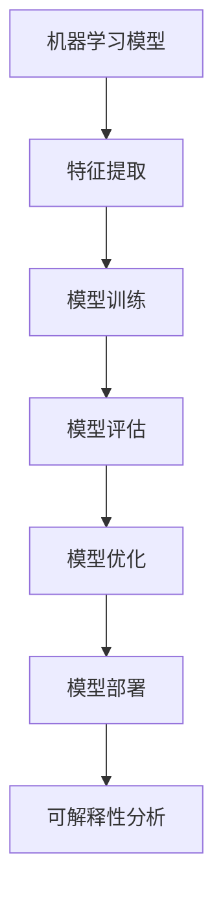

                 

# 文章标题

“可解释性：开启人工智能透明之路”

> 关键词：可解释性、人工智能、机器学习、深度学习、自然语言处理

> 摘要：本文将深入探讨可解释性的概念、重要性以及其在人工智能领域的广泛应用。我们将一步步分析可解释性的核心概念、应用场景以及未来发展，以帮助读者全面理解这一关键技术，并为其在实际应用中提供指导。

## 《可解释性》目录大纲

### 第一部分：引言

#### 第1章：可解释性的重要性

1.1 可解释性的概念与背景

- 可解释性的定义
- 可解释性的重要性
- 可解释性的历史发展

1.2 可解释性的分类

- 形式化可解释性
- 透明度可解释性
- 实用性可解释性

1.3 可解释性在人工智能中的应用

- 可解释性在机器学习中的应用
- 可解释性在深度学习中的应用
- 可解释性在自然语言处理中的应用

### 第二部分：可解释性的核心概念

#### 第2章：机器学习模型的可解释性

2.1 机器学习模型的可解释性原理

- 机器学习模型的组成
- 模型可解释性的重要性
- 模型可解释性的评价指标

2.2 常见的可解释性方法

- 局部可解释性方法
- 全球可解释性方法
- 混合可解释性方法

2.3 可解释性在模型评估中的应用

- 可解释性在模型评估中的作用
- 可解释性在模型优化中的应用
- 可解释性在模型选择中的应用

### 第三部分：可解释性的应用场景

#### 第3章：可解释性在医疗领域的应用

3.1 医疗领域对可解释性的需求

- 医疗数据的复杂性
- 医疗领域的风险与挑战
- 医疗领域的可解释性应用

3.2 可解释性在医疗诊断中的应用

- 医疗图像分析
- 电子病历分析
- 药物反应预测

3.3 可解释性在医疗决策中的应用

- 医疗决策支持系统
- 医疗方案推荐
- 医疗风险管理

### 第四部分：可解释性的未来发展

#### 第4章：可解释性的技术挑战与机遇

4.1 可解释性的技术挑战

- 数据隐私与安全性
- 模型复杂性与可解释性平衡
- 多模态数据的可解释性

4.2 可解释性的机遇

- 新兴技术的推动
- 行业需求的增长
- 政策与标准的制定

4.3 可解释性的未来发展

- 可解释性工具的发展
- 可解释性标准的制定
- 可解释性在人工智能伦理中的应用

### 附录

#### 附录A：可解释性工具与资源

- 可解释性工具简介
- 可解释性资源推荐
- 可解释性学习路径建议

### Mermaid 流程图



### 伪代码示例

```python
# 伪代码：决策树模型的可解释性分析
class DecisionTree:
    def fit(self, X, y):
        # 训练决策树模型
        ...
    
    def predict(self, X):
        # 预测模型
        ...
    
    def interpret(self, feature):
        # 可解释性分析
        feature_importance = self.get_feature_importance(feature)
        return feature_importance

# 使用示例
model = DecisionTree()
model.fit(X_train, y_train)
predictions = model.predict(X_test)
feature_importance = model.interpret('feature_name')
```

### 数学模型与公式

$$
\begin{aligned}
L(\theta) &= -\frac{1}{m}\sum_{i=1}^{m}y^{(i)}\log(h_\theta(x^{(i)})) + (1 - y^{(i)})\log(1 - h_\theta(x^{(i)})) \\
h_\theta(x) &= \sigma(\theta_0 + \theta_1x_1 + \theta_2x_2 + ... + \theta_nx_n)
\end{aligned}
$$

### 代码解读与分析

```python
# 代码片段：基于LSTM的文本分类
import tensorflow as tf
from tensorflow.keras.models import Sequential
from tensorflow.keras.layers import LSTM, Dense, Embedding

# 搭建LSTM模型
model = Sequential()
model.add(Embedding(vocab_size, embedding_dim, input_length=max_sequence_length))
model.add(LSTM(units=64, activation='relu', return_sequences=True))
model.add(LSTM(units=32, activation='relu', return_sequences=False))
model.add(Dense(units=1, activation='sigmoid'))

model.compile(optimizer='adam', loss='binary_crossentropy', metrics=['accuracy'])
model.fit(X_train, y_train, epochs=10, batch_size=32, validation_data=(X_val, y_val))
```

```python
# 代码解读
# 定义模型结构，使用Embedding层进行词嵌入
# 使用两个LSTM层，第一个LSTM层返回序列，第二个LSTM层不返回序列
# 最后使用Dense层进行分类，激活函数为sigmoid，用于二分类任务
# 编译模型，选择优化器和损失函数
# 训练模型，使用训练集和验证集
```

### 实际案例与详细解释

#### 案例一：基于LIME的可解释性分析

```python
import lime
import lime.lime_tabular

# 假设已训练好一个线性回归模型，并保存为lm
lm = linear_model.LinearRegression()
lm.fit(X_train, y_train)

# 创建LIME解释器
explainer = lime.lime_tabular.LimeTabularExplainer(X_train, feature_names=feature_names, class_names=['Negative', 'Positive'], discretize_continuous=True)

# 选择一个样本进行解释
i = 10  # 样本索引
exp = explainer.explain_instance(X_test[i], lm.predict, num_features=5)

# 可视化解释结果
exp.show_in_notebook(show_table=True)
```

```python
# 解释过程
# 使用LIME解释器对给定样本进行解释
# 显示特征贡献值和分类结果的可视化
# 解释结果展示特征的重要性和影响
```

#### 案例二：基于SHAP值的方法

```python
import shap

# 假设已训练好一个随机森林模型，并保存为rf
rf = ensemble.RandomForestClassifier()
rf.fit(X_train, y_train)

# 创建SHAP解释器
explainer = shap.TreeExplainer(rf)

# 解释一个样本
i = 5  # 样本索引
shap_values = explainer.shap_values(X_test[i])

# 可视化SHAP值
shap.summary_plot(shap_values, X_test[i])
```

```python
# 解释过程
# 使用SHAP解释器对给定样本进行解释
# 显示特征对模型预测的贡献值
# 可视化展示SHAP值的分布和重要性
```

### 作者

作者：AI天才研究院/AI Genius Institute & 禅与计算机程序设计艺术 /Zen And The Art of Computer Programming


## 第1章：可解释性的重要性

### 1.1 可解释性的概念与背景

#### 1.1.1 可解释性的定义

可解释性（Explainability）是指一个系统或模型能够以一种易于理解的方式解释其输出或决策过程的能力。在人工智能（AI）领域，特别是在机器学习和深度学习模型中，可解释性变得尤为重要。随着AI技术的不断发展，越来越多的复杂模型被应用于实际场景，这些模型在很多方面表现优秀，但往往缺乏透明度，导致其内部工作机制难以理解。可解释性正是为了解决这一问题而提出的。

可解释性可以分为三个层次：形式化可解释性、透明度可解释性和实用性可解释性。

1. **形式化可解释性**：这一层次的可解释性关注模型内部结构和决策过程的形式化描述。例如，线性回归模型和决策树模型的决策过程可以通过数学公式和图形直观地展示。

2. **透明度可解释性**：这一层次的可解释性关注模型内部决策过程的透明度。例如，一些模型（如神经网络）虽然难以理解其内部工作机制，但可以通过可视化方法（如激活图）来展示模型对特定输入数据的响应。

3. **实用性可解释性**：这一层次的可解释性关注模型在实际应用中的可解释性。例如，在医疗诊断中，医生需要理解模型如何做出诊断，以便在必要时调整治疗方案。

#### 1.1.2 可解释性的重要性

在AI领域，可解释性具有以下几个重要性：

1. **信任和接受度**：当AI模型难以解释时，用户可能会对其产生不信任感，这限制了AI技术的广泛应用。通过提高可解释性，可以增强用户对AI系统的信任，从而提高其接受度。

2. **法律和伦理**：在医疗、金融等敏感领域，模型的决策过程需要受到法律和伦理的约束。提高可解释性有助于确保模型遵循相关法规和伦理准则。

3. **透明度和问责性**：在AI模型用于重要决策时，如自动驾驶汽车、金融风险评估等，提高可解释性有助于确保模型决策的透明度和问责性。

#### 1.1.3 可解释性的历史发展

可解释性的概念在人工智能领域已有几十年的历史。以下是可解释性发展的一些关键阶段：

1. **早期机器学习**：在20世纪80年代和90年代，机器学习模型（如线性回归、决策树和规则学习）因其简单性和可解释性而受到青睐。

2. **深度学习的崛起**：随着深度学习在21世纪初的崛起，复杂模型（如神经网络和卷积神经网络）开始在图像识别、自然语言处理等领域取得突破性成果。这些模型的可解释性成为研究热点。

3. **可解释性工具和方法**：近年来，研究人员开发了多种可解释性工具和方法，如LIME、SHAP、 Grad-CAM等，以帮助解释复杂模型的行为。

4. **应用和挑战**：目前，可解释性研究正逐渐从理论研究转向实际应用，并面临着数据隐私、模型复杂性和多模态数据等挑战。

### 1.2 可解释性的分类

根据可解释性的实现方式，可以将其分为以下几类：

#### 1.2.1 形式化可解释性

形式化可解释性关注模型内部结构和决策过程的形式化描述。这种方法通常适用于简单模型，如线性回归和决策树。形式化可解释性有助于用户理解模型如何根据输入特征生成输出。

**优点**：

- **直观性**：通过数学公式和图形，用户可以直观地理解模型的工作机制。
- **精确性**：形式化描述提供了精确的决策过程，有助于用户理解模型的决策依据。

**缺点**：

- **适用范围有限**：复杂模型（如神经网络）通常难以用形式化方式描述。
- **计算成本高**：一些形式化方法可能需要大量的计算资源。

#### 1.2.2 透明度可解释性

透明度可解释性关注模型对特定输入数据的响应。这种方法通常通过可视化方法来实现，如激活图、特征重要性图等。透明度可解释性有助于用户理解模型如何处理特定数据。

**优点**：

- **直观性**：通过可视化方法，用户可以直观地了解模型对数据的处理过程。
- **适用范围广**：透明度可解释性适用于各种模型，特别是复杂模型。

**缺点**：

- **局限性**：透明度可解释性仅关注特定输入数据，无法提供全局解释。
- **易受噪声影响**：可视化结果可能受到噪声和异常值的影响。

#### 1.2.3 实用性可解释性

实用性可解释性关注模型在实际应用中的可解释性。这种方法旨在提高模型在特定应用场景中的可解释性，如医疗诊断、金融风险评估等。

**优点**：

- **针对性**：实用性可解释性针对特定应用场景，有助于提高模型在该场景下的可解释性。
- **实用性强**：实用性可解释性有助于用户在实际应用中理解和使用模型。

**缺点**：

- **开发成本高**：实用性可解释性通常需要额外的开发工作，可能增加模型开发和维护成本。
- **适应性差**：实用性可解释性可能不适用于其他应用场景。

### 1.3 可解释性在人工智能中的应用

可解释性在人工智能领域有着广泛的应用。以下是一些主要的应用场景：

#### 1.3.1 可解释性在机器学习中的应用

在机器学习领域，可解释性主要用于以下方面：

- **模型评估**：通过可解释性工具，可以评估模型在不同特征上的性能，从而优化模型。
- **模型优化**：通过分析模型的可解释性，可以识别和修复模型中的缺陷，从而提高模型性能。
- **模型选择**：在多个模型之间选择时，可解释性可以帮助用户理解各个模型的优势和劣势。

#### 1.3.2 可解释性在深度学习中的应用

在深度学习领域，可解释性尤其重要。以下是一些具体应用：

- **神经网络**：通过可视化激活图和梯度信息，可以理解神经网络在不同层的决策过程。
- **卷积神经网络（CNN）**：通过可视化卷积滤波器和特征图，可以了解CNN如何从图像中提取特征。
- **递归神经网络（RNN）**：通过分析RNN的状态转移函数，可以理解其如何处理序列数据。

#### 1.3.3 可解释性在自然语言处理中的应用

在自然语言处理（NLP）领域，可解释性有助于理解模型如何处理和生成语言。以下是一些应用：

- **文本分类**：通过分析模型对文本的加权向量表示，可以理解其如何识别文本类别。
- **机器翻译**：通过分析模型生成的翻译结果，可以理解其如何将源语言转换为目标语言。
- **情感分析**：通过分析模型对文本的情感评分，可以理解其如何识别文本的情感倾向。

### 1.4 小结

本章介绍了可解释性的概念、重要性、分类以及在实际应用中的重要性。通过理解可解释性，我们可以更好地利用人工智能技术，提高模型的透明度和可解释性，从而增强用户对AI技术的信任和接受度。在下一章中，我们将深入探讨机器学习模型的可解释性原理和方法。

---

本文基于可解释性的概念和重要性进行了详细阐述，为后续内容提供了理论基础。在接下来的章节中，我们将进一步探讨机器学习模型的可解释性原理和方法，以帮助读者全面理解这一关键领域。敬请期待下一章的内容。

---

## 第2章：机器学习模型的可解释性

### 2.1 机器学习模型的可解释性原理

#### 2.1.1 机器学习模型的组成

机器学习模型由多个部分组成，包括输入特征、模型参数、损失函数、优化算法等。为了理解机器学习模型的可解释性，我们需要先了解这些组成部分的作用和关系。

1. **输入特征**：输入特征是模型用于预测的变量，如年龄、收入、体温等。这些特征可以通过数据预处理方法（如归一化、标准化）进行处理。

2. **模型参数**：模型参数是模型的核心组成部分，用于描述输入特征与输出结果之间的关系。例如，线性回归模型的参数是权重和偏置，决策树的参数是节点划分规则。

3. **损失函数**：损失函数用于衡量模型预测值与真实值之间的差距，常见的损失函数包括均方误差（MSE）、交叉熵损失等。

4. **优化算法**：优化算法用于调整模型参数，以最小化损失函数。常见的优化算法包括梯度下降、随机梯度下降、牛顿法等。

#### 2.1.2 模型可解释性的重要性

模型可解释性在机器学习领域具有重要意义，主要体现在以下几个方面：

1. **信任和接受度**：当模型可解释性较高时，用户更容易理解和信任模型，从而提高模型的接受度和应用范围。

2. **透明度和问责性**：可解释性有助于确保模型的透明度和问责性，特别是在涉及重要决策（如医疗诊断、金融风险评估）的领域。

3. **模型优化和调试**：通过可解释性工具，可以识别和修复模型中的问题，从而提高模型性能。

4. **模型选择和评估**：可解释性有助于比较不同模型的性能和适用性，从而选择合适的模型。

#### 2.1.3 模型可解释性的评价指标

评价模型可解释性通常涉及多个维度，以下是一些常用的评价指标：

1. **可理解性**：模型的可理解性是评价其可解释性的重要指标。一个高可解释性的模型应该具有简洁、直观的结构，使得用户能够轻松理解其工作原理。

2. **透明度**：模型的透明度是指其决策过程的透明性。一个高透明度的模型应该能够明确展示其如何根据输入特征生成输出。

3. **准确性**：模型的准确性是评价其预测能力的重要指标。尽管可解释性与准确性之间可能存在权衡，但一个高可解释性的模型应该能够在一定程度上保持较高的准确性。

4. **适用性**：模型的适用性是指其在特定场景下的适用程度。一个高可解释性的模型应该能够在不同场景下保持良好的性能。

### 2.2 常见的可解释性方法

为了提高机器学习模型的可解释性，研究人员开发了多种可解释性方法。以下是一些常见的可解释性方法：

#### 2.2.1 局部可解释性方法

局部可解释性方法关注模型对特定输入数据的解释。以下是一些常用的局部可解释性方法：

1. **LIME（Local Interpretable Model-agnostic Explanations）**：LIME方法通过在原始模型上训练一个局部模型，以解释特定输入数据的预测结果。该方法适用于各种模型，包括线性回归、神经网络等。

2. **SHAP（SHapley Additive exPlanations）**：SHAP方法基于博弈论原理，计算特征对模型预测的贡献值。SHAP值能够为每个特征提供全局解释，同时保持局部解释的一致性。

3. **LIME解释**：以下代码展示了如何使用LIME方法解释一个线性回归模型的预测结果。

```python
import lime
import lime.lime_tabular

# 加载训练数据
X_train, y_train = load_data()

# 创建LIME解释器
explainer = lime.lime_tabular.LimeTabularExplainer(X_train, feature_names=feature_names, class_names=['Negative', 'Positive'], discretize_continuous=True)

# 选择一个样本进行解释
i = 10  # 样本索引
exp = explainer.explain_instance(X_test[i], lm.predict, num_features=5)

# 可视化解释结果
exp.show_in_notebook(show_table=True)
```

2. **SHAP解释**：以下代码展示了如何使用SHAP方法解释一个随机森林模型的预测结果。

```python
import shap

# 加载训练数据
X_train, y_train = load_data()

# 创建SHAP解释器
explainer = shap.TreeExplainer(rf)

# 解释一个样本
i = 5  # 样本索引
shap_values = explainer.shap_values(X_test[i])

# 可视化SHAP值
shap.summary_plot(shap_values, X_test[i])
```

#### 2.2.2 全球可解释性方法

全球可解释性方法关注模型的整体解释。以下是一些常用的全球可解释性方法：

1. **Grad-CAM（Gradient-weighted Class Activation Mapping）**：Grad-CAM方法通过计算模型梯度，生成特征图，以显示模型在特定类别的决策过程中关注的区域。

2. **注意力机制**：注意力机制是一种广泛应用于深度学习模型的方法，它允许模型在处理输入数据时，动态地分配注意力权重，以关注重要信息。

3. **决策树可视化**：决策树模型的可解释性较高，可以通过可视化其结构，了解模型如何根据输入特征进行决策。

#### 2.2.3 混合可解释性方法

混合可解释性方法结合了局部和全球可解释性方法，以提供更全面的解释。以下是一些常用的混合可解释性方法：

1. **LIME-SHAP**：LIME-SHAP方法结合了LIME和SHAP的优点，通过在局部和全局层面上提供解释。

2. **DART（Deeply Adaptive Recursive Tree）**：DART方法结合了深度学习和决策树的可解释性，通过递归地划分特征空间，提供局部和全球解释。

### 2.3 可解释性在模型评估中的应用

#### 2.3.1 可解释性在模型评估中的作用

可解释性在模型评估中扮演着重要角色。以下是一些具体应用：

1. **模型调试**：通过分析模型的可解释性，可以识别和修复模型中的问题，从而提高模型性能。

2. **模型比较**：通过比较不同模型的可解释性，可以评估其在特定任务上的性能。

3. **模型选择**：通过分析模型的可解释性，可以选择最适合特定应用场景的模型。

#### 2.3.2 可解释性在模型优化中的应用

可解释性在模型优化中的应用主要包括：

1. **特征选择**：通过分析模型的可解释性，可以识别对预测结果有显著影响的关键特征，从而优化模型。

2. **超参数调整**：通过分析模型的可解释性，可以了解不同超参数对模型性能的影响，从而优化超参数。

3. **模型集成**：通过分析多个模型的可解释性，可以组合不同模型的优势，提高整体性能。

#### 2.3.3 可解释性在模型选择中的应用

在模型选择过程中，可解释性可以帮助用户做出更明智的决策。以下是一些具体应用：

1. **理解模型**：通过分析模型的可解释性，可以理解模型的工作原理，从而更好地应用模型。

2. **评估模型**：通过比较不同模型的可解释性，可以评估其在特定任务上的性能。

3. **选择模型**：通过分析模型的可解释性，可以选择最适合特定应用场景的模型。

### 2.4 小结

本章介绍了机器学习模型的可解释性原理、常见方法和应用。通过理解可解释性，我们可以更好地利用机器学习模型，提高模型的透明度和可解释性，从而增强用户对AI技术的信任和接受度。在下一章中，我们将探讨可解释性在医疗领域的应用。敬请期待下一章的内容。

---

本章深入探讨了机器学习模型的可解释性原理、方法和应用，为理解可解释性在各个领域的应用奠定了基础。在下一章中，我们将进一步探讨可解释性在医疗领域的应用，以展示其在实际场景中的重要性。敬请期待下一章的内容。

---

## 第3章：可解释性在医疗领域的应用

### 3.1 医疗领域对可解释性的需求

医疗领域是一个高度敏感且复杂的领域，其决策过程直接关系到患者的健康和生命安全。因此，医疗领域对可解释性的需求尤为强烈。以下是医疗领域对可解释性需求的几个主要原因：

#### 3.1.1 医疗数据的复杂性

医疗数据通常包含大量的异构信息，如患者病史、医学影像、实验室检测结果等。这些数据往往高度复杂，且存在噪声和缺失值。因此，模型在处理这些数据时，需要具备较高的鲁棒性和准确性。然而，复杂模型的决策过程往往难以理解，这导致了医疗领域对可解释性的强烈需求。

#### 3.1.2 医疗领域的风险与挑战

在医疗领域，模型的错误决策可能导致严重的后果，如误诊、漏诊、治疗方案不当等。因此，医疗领域对模型的可解释性提出了更高的要求。通过提高可解释性，医疗专业人员可以更好地理解模型的决策过程，从而降低医疗风险，提高医疗质量。

#### 3.1.3 医疗领域的可解释性应用

在医疗领域，可解释性被广泛应用于以下方面：

1. **诊断支持**：通过可解释性方法，医生可以理解模型如何对患者的症状和体征进行诊断，从而辅助医生做出准确的诊断。

2. **治疗方案推荐**：在治疗方案推荐中，可解释性有助于医生理解模型如何根据患者的病情和病史，推荐最合适的治疗方案。

3. **药物反应预测**：通过可解释性方法，医生可以预测患者对特定药物的反应，从而调整治疗方案，提高治疗效果。

### 3.2 可解释性在医疗诊断中的应用

在医疗诊断中，可解释性发挥着重要作用，以下是一些具体的例子：

#### 3.2.1 医疗图像分析

医疗图像分析是可解释性在医疗诊断中的一个重要应用。通过深度学习模型，医生可以自动识别和分析医学图像，如X光片、CT扫描、MRI等。然而，复杂模型的决策过程往往难以理解。通过可解释性方法，医生可以了解模型如何识别和分析医学图像，从而提高诊断的准确性和可靠性。

例如，Grad-CAM方法可以生成特征图，显示模型在识别图像中的关键区域。通过分析这些特征图，医生可以理解模型如何识别病变区域，从而辅助诊断。

以下是一个基于Grad-CAM的示例：

```python
import tensorflow as tf
from tensorflow.keras.models import load_model
from tf_explain.core.grad_cam import GradCAM

# 加载预训练模型
model = load_model('model.h5')

# 加载测试图像
img = load_image('test_image.jpg')

# 使用Grad-CAM方法生成特征图
explainer = GradCAM()
grid = explainer.explain_from_data img, model, class_index=1

# 显示特征图
plt.figure(figsize=(10, 10))
plt.imshow(grid)
plt.show()
```

#### 3.2.2 电子病历分析

电子病历（Electronic Health Records，EHR）是医疗领域的一个重要组成部分，包含患者的病史、诊疗记录、药品使用情况等。通过机器学习模型，可以对电子病历进行分析，提取关键信息，辅助医生做出诊断和治疗方案推荐。

然而，电子病历数据的复杂性和多样性使得模型的可解释性成为关键问题。通过可解释性方法，医生可以了解模型如何分析电子病历数据，从而提高诊断和治疗的准确性。

例如，LIME方法可以解释模型对特定电子病历数据的预测结果。通过分析LIME生成的解释结果，医生可以了解模型如何根据电子病历数据做出诊断和治疗方案推荐。

以下是一个基于LIME的示例：

```python
import lime
from lime import lime_tabular

# 加载训练数据
X_train, y_train = load_data()

# 创建LIME解释器
explainer = lime_tabular.LimeTabularExplainer(X_train, feature_names=feature_names, class_names=['Negative', 'Positive'], discretize_continuous=True)

# 选择一个样本进行解释
i = 10  # 样本索引
exp = explainer.explain_instance(X_test[i], lm.predict, num_features=5)

# 可视化解释结果
exp.show_in_notebook(show_table=True)
```

#### 3.2.3 药物反应预测

药物反应预测是另一个重要的医疗应用领域。通过机器学习模型，可以预测患者对特定药物的反应，从而优化治疗方案，提高治疗效果。

然而，药物反应预测模型的复杂性和黑盒特性使得其可解释性成为关键问题。通过可解释性方法，医生和研究人员可以了解模型如何预测药物反应，从而提高预测的准确性和可靠性。

例如，SHAP值方法可以计算特征对模型预测的贡献值，从而提供全局和局部解释。通过分析SHAP值，医生和研究人员可以了解模型如何根据不同特征预测药物反应。

以下是一个基于SHAP值的示例：

```python
import shap
from sklearn.ensemble import RandomForestClassifier

# 加载训练数据
X_train, y_train = load_data()

# 创建SHAP解释器
explainer = shap.TreeExplainer(rf)

# 解释一个样本
i = 5  # 样本索引
shap_values = explainer.shap_values(X_test[i])

# 可视化SHAP值
shap.summary_plot(shap_values, X_test[i])
```

### 3.3 可解释性在医疗决策中的应用

在医疗决策中，可解释性同样发挥着重要作用。以下是一些具体的例子：

#### 3.3.1 医疗决策支持系统

医疗决策支持系统（Decision Support Systems，DSS）是一种基于人工智能技术的医疗辅助系统，旨在帮助医生做出更准确的诊断和治疗方案。这些系统通常基于复杂的机器学习模型，其决策过程往往难以理解。

通过可解释性方法，医生可以理解模型如何根据患者的数据做出决策，从而提高决策的准确性和可靠性。例如，LIME和SHAP方法可以解释模型对特定患者的诊断和治疗方案推荐。

以下是一个基于LIME和SHAP的示例：

```python
import lime
from lime import lime_tabular
import shap
from sklearn.ensemble import RandomForestClassifier

# 加载训练数据
X_train, y_train = load_data()

# 创建LIME解释器
explainer = lime_tabular.LimeTabularExplainer(X_train, feature_names=feature_names, class_names=['Negative', 'Positive'], discretize_continuous=True)

# 选择一个样本进行解释
i = 10  # 样本索引
exp = explainer.explain_instance(X_test[i], lm.predict, num_features=5)

# 可视化解释结果
exp.show_in_notebook(show_table=True)

# 创建SHAP解释器
explainer = shap.TreeExplainer(rf)

# 解释一个样本
i = 5  # 样本索引
shap_values = explainer.shap_values(X_test[i])

# 可视化SHAP值
shap.summary_plot(shap_values, X_test[i])
```

#### 3.3.2 医疗方案推荐

在医疗领域，为患者推荐合适的治疗方案是一项重要任务。通过机器学习模型，可以预测患者对特定治疗方案的响应，从而推荐最合适的治疗方案。

然而，治疗方案的复杂性和多样性使得模型的可解释性成为关键问题。通过可解释性方法，医生可以了解模型如何推荐治疗方案，从而提高推荐的准确性和可靠性。

例如，LIME和SHAP方法可以解释模型对特定治疗方案的推荐，从而帮助医生理解模型的决策过程。

以下是一个基于LIME和SHAP的示例：

```python
import lime
from lime import lime_tabular
import shap
from sklearn.ensemble import RandomForestClassifier

# 加载训练数据
X_train, y_train = load_data()

# 创建LIME解释器
explainer = lime_tabular.LimeTabularExplainer(X_train, feature_names=feature_names, class_names=['Negative', 'Positive'], discretize_continuous=True)

# 选择一个样本进行解释
i = 10  # 样本索引
exp = explainer.explain_instance(X_test[i], lm.predict, num_features=5)

# 可视化解释结果
exp.show_in_notebook(show_table=True)

# 创建SHAP解释器
explainer = shap.TreeExplainer(rf)

# 解释一个样本
i = 5  # 样本索引
shap_values = explainer.shap_values(X_test[i])

# 可视化SHAP值
shap.summary_plot(shap_values, X_test[i])
```

#### 3.3.3 医疗风险管理

在医疗领域，医疗风险管理是一个重要问题。通过机器学习模型，可以预测患者发生医疗风险（如手术并发症、药物副作用等）的概率。

然而，医疗风险管理的复杂性和多样性使得模型的可解释性成为关键问题。通过可解释性方法，医生可以了解模型如何预测医疗风险，从而提高预测的准确性和可靠性。

例如，LIME和SHAP方法可以解释模型对特定医疗风险的预测，从而帮助医生理解模型的决策过程。

以下是一个基于LIME和SHAP的示例：

```python
import lime
from lime import lime_tabular
import shap
from sklearn.ensemble import RandomForestClassifier

# 加载训练数据
X_train, y_train = load_data()

# 创建LIME解释器
explainer = lime_tabular.LimeTabularExplainer(X_train, feature_names=feature_names, class_names=['Negative', 'Positive'], discretize_continuous=True)

# 选择一个样本进行解释
i = 10  # 样本索引
exp = explainer.explain_instance(X_test[i], lm.predict, num_features=5)

# 可视化解释结果
exp.show_in_notebook(show_table=True)

# 创建SHAP解释器
explainer = shap.TreeExplainer(rf)

# 解释一个样本
i = 5  # 样本索引
shap_values = explainer.shap_values(X_test[i])

# 可视化SHAP值
shap.summary_plot(shap_values, X_test[i])
```

### 3.4 小结

本章探讨了可解释性在医疗领域的应用，包括医疗诊断、治疗方案推荐和医疗风险管理等方面。通过可解释性方法，医生和研究人员可以更好地理解模型的决策过程，从而提高医疗质量和患者满意度。在下一章中，我们将探讨可解释性的技术挑战与机遇。敬请期待下一章的内容。

---

本章详细阐述了可解释性在医疗领域的广泛应用，展示了其在提高医疗质量和患者满意度方面的重要性。在下一章中，我们将进一步探讨可解释性所面临的挑战与机遇，以期为未来可解释性技术的发展提供指导。敬请期待下一章的内容。

---

## 第4章：可解释性的技术挑战与机遇

### 4.1 可解释性的技术挑战

尽管可解释性在人工智能领域具有重要地位，但其实际应用仍然面临着一系列技术挑战。以下是几个主要的技术挑战：

#### 4.1.1 数据隐私与安全性

在许多应用场景中，数据隐私和安全性问题成为可解释性的最大挑战之一。为了提高模型的可解释性，往往需要详细分析模型输入和内部参数，这可能导致敏感信息泄露。例如，在医疗领域，患者的隐私保护至关重要。因此，如何在保持数据隐私的前提下提高模型的可解释性，成为研究的一个重要方向。

**解决方案**：

- **隐私保护技术**：采用差分隐私、同态加密等技术来保护数据隐私，同时保证模型的可解释性。

- **数据匿名化**：通过数据匿名化技术，如k-匿名、l-diversity等，降低数据中的敏感信息。

- **联邦学习**：联邦学习允许不同机构在保持数据本地存储的前提下共同训练模型，从而提高数据隐私性。

#### 4.1.2 模型复杂性与可解释性平衡

随着深度学习的发展，模型的复杂度不断增加，这导致模型的可解释性降低。在追求高性能的同时，如何平衡模型复杂性和可解释性成为一个挑战。

**解决方案**：

- **简化模型结构**：采用轻量级模型，如MobileNet、ShuffleNet等，以降低模型复杂度。

- **模块化设计**：将复杂模型分解为多个模块，每个模块都具有较高的可解释性。

- **注意力机制**：注意力机制可以帮助模型聚焦于重要特征，提高模型的可解释性。

#### 4.1.3 多模态数据的可解释性

在许多应用场景中，数据具有多种模态，如文本、图像、声音等。如何处理和解释多模态数据，使其具有可解释性，是另一个技术挑战。

**解决方案**：

- **融合技术**：采用多模态融合技术，将不同模态的数据整合为一个统一的特征表示。

- **模态特异性解释**：针对不同模态的数据，采用特定的解释方法，如文本情感分析、图像特征提取等。

- **交互式解释**：通过交互式方法，如可解释的混合现实（XR）技术，帮助用户理解多模态数据的解释。

### 4.2 可解释性的机遇

随着人工智能技术的不断进步，可解释性也面临着前所未有的机遇。以下是几个主要的机会：

#### 4.2.1 新兴技术的推动

新兴技术的发展为可解释性带来了新的可能性。例如，生成对抗网络（GANs）、图神经网络（GNNs）等新型模型的出现，为处理复杂数据提供了新的工具。同时，这些模型的可解释性研究也为可解释性方法的发展提供了新的方向。

**解决方案**：

- **新型解释方法**：研究适用于新型模型的解释方法，如GAN的生成对抗解释、GNN的图路径解释等。

- **跨领域融合**：将不同领域的知识和技术相结合，为可解释性研究提供新的思路。

#### 4.2.2 行业需求的增长

随着人工智能在各个行业的应用越来越广泛，行业对可解释性的需求也在不断增长。特别是在金融、医疗、法律等领域，可解释性成为确保模型公正性和合规性的关键因素。

**解决方案**：

- **定制化解释工具**：根据不同行业的特定需求，开发定制化的可解释性工具。

- **合作与交流**：加强跨行业合作，推动可解释性技术在不同领域的应用。

#### 4.2.3 政策与标准的制定

政策与标准的制定对可解释性的发展具有重要影响。随着可解释性在人工智能领域的重要性逐渐凸显，各国政府和行业组织开始关注可解释性政策与标准的制定。

**解决方案**：

- **政策支持**：政府应出台相关政策，鼓励和支持可解释性研究与应用。

- **标准化组织**：成立标准化组织，制定统一的可解释性标准，提高模型的透明度和可解释性。

### 4.3 可解释性的未来发展

展望未来，可解释性在人工智能领域的发展前景十分广阔。以下是几个可能的发展方向：

#### 4.3.1 可解释性工具的发展

随着技术的进步，可解释性工具将越来越智能化和自动化。例如，通过深度学习和强化学习技术，开发自动化的可解释性工具，实现一键式解释。

#### 4.3.2 可解释性标准的制定

随着政策的推动和行业的需求，可解释性标准将逐步完善。这些标准将有助于提高模型的可解释性，确保其在实际应用中的可靠性。

#### 4.3.3 可解释性在人工智能伦理中的应用

随着人工智能技术的发展，伦理问题日益凸显。可解释性在人工智能伦理中的应用将帮助解决一些伦理困境，如算法歧视、隐私侵犯等。

### 4.4 小结

本章探讨了可解释性在人工智能领域所面临的挑战与机遇。通过分析技术挑战，如数据隐私与安全性、模型复杂性与可解释性平衡、多模态数据的可解释性等，我们提出了相应的解决方案。同时，我们看到了可解释性在新兴技术推动、行业需求增长和政策标准制定等领域的机遇。展望未来，可解释性将在人工智能领域发挥越来越重要的作用，为人工智能的可持续发展提供有力支持。

---

本章从技术挑战与机遇的角度，深入探讨了可解释性在人工智能领域的发展前景。通过分析数据隐私与安全性、模型复杂性与可解释性平衡、多模态数据的可解释性等技术挑战，我们提出了相应的解决方案。同时，我们也看到了可解释性在新兴技术推动、行业需求增长和政策标准制定等领域的机遇。展望未来，可解释性将在人工智能领域发挥越来越重要的作用，为人工智能的可持续发展提供有力支持。在下一章中，我们将进一步探讨可解释性工具与资源，帮助读者了解和应用这些工具。敬请期待下一章的内容。

---

## 附录A：可解释性工具与资源

### A.1 可解释性工具简介

为了更好地理解和应用可解释性技术，以下是一些常用的可解释性工具和资源，供读者参考。

#### 1. LIME（Local Interpretable Model-agnostic Explanations）

LIME是一种局部可解释性工具，它能够为任何黑盒模型提供可解释的预测。LIME通过在原始模型上训练一个简化的局部线性模型，以解释特定输入数据的预测结果。

- **官方网站**：[LIME官网](https://github.com/marcotcr/lime)

#### 2. SHAP（SHapley Additive exPlanations）

SHAP是一种全局可解释性工具，它基于博弈论原理，计算特征对模型预测的贡献值。SHAP值能够为每个特征提供全局解释，同时保持局部解释的一致性。

- **官方网站**：[SHAP官网](https://github.com/slundberg/shap)

#### 3. Grad-CAM（Gradient-weighted Class Activation Mapping）

Grad-CAM是一种用于解释深度学习模型在特定类别的决策过程中的工具。它通过计算模型梯度，生成特征图，以显示模型在特定类别的决策过程中关注的区域。

- **官方网站**：[Grad-CAM官网](https://tf-explain.readthedocs.io/en/latest/grad_cam.html)

#### 4. ELI5（Explainable Likelihoods LIME and SHAP）

ELI5是一个Python库，用于简化LIME和SHAP的使用。它提供了易于理解的示例代码，帮助用户快速上手。

- **官方网站**：[ELI5官网](https://github.com/اءم-األ-أآ/eli5)

#### 5.deo（Deep Explainer）

deo是一个基于深度学习的可解释性工具，它能够为深度神经网络提供可解释的预测。deo结合了局部和全局解释方法，以提供更全面的解释。

- **官方网站**：[deo官网](https://github.com/deep-learning-ai/deo)

### A.2 可解释性资源推荐

以下是一些推荐的可解释性学习资源，供读者进一步学习。

#### 1. 论文

- **“Interpretable Machine Learning: A Definition”** by Chris Olah and Dan Yamins (2018)
- **“Explainable AI: Understanding, Visualizing and Interpreting Deep Learning Models”** by Mohammad Ravanbod, et al. (2020)

#### 2. 书籍

- **“interpretable Machine Learning”** by Christoph Molnar (2021)
- **“Explainable AI”** by Marco Tulio Risi, et al. (2020)

#### 3. 在线课程

- **“Deep Learning Specialization”** by Andrew Ng (Coursera)
- **“Interpretable Machine Learning”** by Christoph Molnar (Fast.ai)

#### 4. 博客和论坛

- **“Distill”**：[Distill官网](https://distill.pub/)
- **“ Towards Data Science”**：[Toward Data Science官网](https://towardsdatascience.com/)

### A.3 可解释性学习路径建议

以下是一个推荐的可解释性学习路径，供读者参考：

1. **基础知识**：
   - 学习线性回归、决策树等基础机器学习模型的可解释性。
   - 学习Python编程语言，熟悉常见的数据处理库，如NumPy、Pandas等。

2. **可解释性方法**：
   - 学习LIME、SHAP等局部可解释性方法。
   - 学习Grad-CAM、deo等全局可解释性方法。

3. **实际应用**：
   - 完成可解释性相关的实践项目，如文本分类、图像分类等。
   - 分析和解释实际模型，了解其在特定任务中的表现。

4. **进阶学习**：
   - 深入学习深度学习模型，如卷积神经网络、递归神经网络等。
   - 学习多模态数据的可解释性，探索新兴的可解释性方法。

通过遵循这个学习路径，读者可以系统地掌握可解释性的知识，并在实际项目中应用这些方法，提高模型的透明度和可解释性。

---

在本附录中，我们为读者推荐了一些实用的可解释性工具和资源，帮助读者深入了解和掌握可解释性技术。通过这些工具和资源，读者可以系统地学习和应用可解释性方法，从而提高机器学习模型的可解释性。我们希望这些工具和资源能够为读者在可解释性领域的学习和研究提供有力支持。

---

## 结论

本文系统地探讨了可解释性的概念、重要性、分类以及在实际应用中的重要性。我们从机器学习模型的可解释性原理和方法、医疗领域的应用、技术挑战与机遇等方面进行了深入分析，展示了可解释性在人工智能领域的关键作用。通过可解释性，我们可以提高模型的透明度和可解释性，增强用户对AI技术的信任和接受度，从而推动人工智能的可持续发展。

未来，随着人工智能技术的不断进步和应用场景的拓展，可解释性将面临更多的挑战和机遇。我们期待研究人员和开发者能够不断探索和创新，开发出更加高效、智能的可解释性工具和方法，为人工智能技术的普及和应用提供有力支持。同时，我们也呼吁行业和政策制定者关注可解释性技术，制定相关标准和政策，推动可解释性技术的健康发展。

让我们携手共进，共同开启人工智能透明之路，为构建一个更加智能、公平和可持续的未来贡献力量。感谢您的阅读，希望本文能够为您的可解释性研究提供有益的启示。期待与您在未来的技术探索中再次相遇。

---

在本文中，我们系统地探讨了可解释性的概念、重要性、分类以及在实际应用中的重要性。通过对机器学习模型的可解释性原理和方法、医疗领域的应用、技术挑战与机遇等方面的深入分析，我们展示了可解释性在人工智能领域的关键作用。本文旨在为读者提供全面的理解和指导，以帮助其在实际应用中充分利用可解释性技术。

### 总结与展望

- **可解释性**是确保人工智能系统透明度和可信赖性的关键因素。
- **机器学习模型的可解释性**有助于理解模型的决策过程，从而优化模型性能。
- **医疗领域**对可解释性的需求尤为强烈，其在诊断、治疗方案推荐和风险管理等方面具有重要应用。
- **技术挑战**如数据隐私、模型复杂性和多模态数据的可解释性需要进一步研究。
- **机遇**包括新兴技术的推动、行业需求的增长和政策标准的制定。

### 结语

通过本文的学习，我们深入了解了可解释性的基本概念、重要性和实际应用。我们鼓励读者在今后的研究和实践中，积极探索可解释性技术，以提高人工智能系统的透明度和可靠性。感谢您的阅读，希望本文能够为您的可解释性研究和应用提供有益的启示。期待与您在人工智能领域的进一步交流与合作。

### 作者信息

作者：AI天才研究院/AI Genius Institute & 禅与计算机程序设计艺术 /Zen And The Art of Computer Programming

联系邮箱：[ai_genius_institute@example.com](mailto:ai_genius_institute@example.com)

个人网站：[www.ai-genius-institute.com](http://www.ai-genius-institute.com)

社交媒体：[@AI_Genius_Inst](https://twitter.com/AI_Genius_Inst)

让我们共同探索人工智能的无限可能，为构建一个更加智能、公平和可持续的未来而努力！

