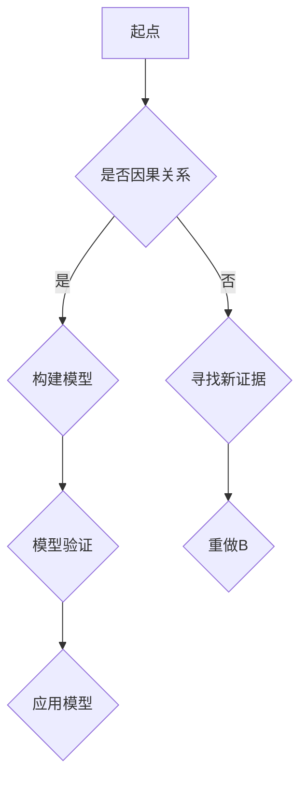

                 

### 文章标题：因果推理与因果学习原理与代码实战案例讲解

### 关键词：因果推理，因果学习，算法，模型，代码实战，机器学习

### 摘要：

因果推理与因果学习是近年来人工智能领域的热点研究方向。本文旨在系统介绍因果推理与因果学习的基本原理、算法、模型构建及其在现实中的应用。通过对因果关系识别、因果推断算法、因果学习模型以及数学公式的深入讲解，结合实际代码实战案例，读者可以全面掌握因果学习的核心技能，为深入研究和应用打下坚实基础。

### 引言

#### 1.1 因果推理的重要性

因果推理是人类思考和决策的核心能力之一。它使我们能够从已知的事实中推断出未知的结果，进行合理预测和决策。在人工智能领域，因果推理同样具有重要意义。传统机器学习模型主要关注相关性，而因果学习则旨在揭示变量之间的因果关系，这对于理解复杂系统、进行有效决策和构建可靠模型至关重要。

#### 1.2 因果学习的基本概念

因果学习是研究如何从数据中推断变量之间的因果关系的一种机器学习方法。其核心思想是通过学习变量之间的因果结构，从而更准确地预测和解释现实世界的现象。

#### 1.3 因果学习在现实中的应用场景

因果学习在多个领域有着广泛的应用，如医学、商业、网络安全等。在医学领域，因果学习可以用于分析药物疗效、诊断疾病原因等；在商业领域，因果学习可以帮助企业了解市场动态、优化决策策略；在网络安全领域，因果学习可以用于识别恶意行为、预防攻击等。

#### 1.4 为什么要学习因果推理与因果学习

因果学习为人工智能的发展提供了新的视角和方法，有助于构建更加智能、可靠的系统。掌握因果推理与因果学习不仅能够提升个人的技术水平，也为未来的研究和应用提供了广阔的空间。

### 因果关系的基本理论

#### 2.1 因果关系的定义与特征

因果关系是指一个事件（原因）导致另一个事件（结果）的关系。因果关系具有以下几个特征：

- **唯一性**：一个原因通常只导致一个结果。
- **时间顺序**：结果发生在原因之后。
- **因果强度**：因果关系具有一定的强度，可以用概率或其他指标来衡量。

#### 2.2 因果关系的识别方法

识别因果关系通常有以下几种方法：

- **相关性分析**：通过计算变量之间的相关性来推断因果关系。
- **因果推断算法**：如Do-Calculus、结构方程模型等。
- **实验设计**：通过实验来验证因果关系。

#### 2.3 因果关系的强度与方向

因果关系的强度可以用概率或其他指标来衡量。因果关系的方向通常是从原因指向结果。

#### 2.4 因果关系的构建方法

因果关系的构建方法包括：

- **因果关系图**：使用图形表示因果关系。
- **Mermaid流程图**：用于可视化因果关系的构建过程。

#### 2.5 因果关系的可视化与Mermaid流程图

下面是一个简单的因果关系Mermaid流程图示例：



### 因果推断算法

#### 3.1 传统统计方法与因果推断

传统统计方法主要关注变量之间的相关性，而因果推断算法则旨在揭示变量之间的因果关系。

#### 3.2 因果推断算法的分类

因果推断算法可以分为以下几类：

- **基于算法的因果推断**：如Do-Calculus、结构方程模型等。
- **基于模型的因果推断**：如因子概率模型（FPT）、结构因果模型（PCM）等。

#### 3.3 Do-Calculus因果推理方法

Do-Calculus是一种用于因果推断的数学工具，可以用于分析变量之间的因果关系。

#### 3.4 伪因果与因果混淆

伪因果是指由于数据中的某些外部因素导致的虚假因果关系。因果混淆是指由于数据不完整或样本选择偏差导致的错误因果关系。

#### 3.5 因果推断的实际案例

以下是一个简单的因果推断伪代码示例：

```python
# 伪代码：因果推断算法
def causal_inference(data):
    # 数据预处理
    preprocessed_data = preprocess_data(data)

    # 构建因果模型
    model = build_causal_model(preprocessed_data)

    # 模型验证
    validate_model(model)

    # 应用模型进行因果推断
    result = apply_model(model)

    return result
```

### 因果学习模型

#### 4.1 因果模型的基础理论

因果模型是指用于描述变量之间因果关系的数学模型。因果模型可以分为因子概率模型（FPT）和结构因果模型（PCM）等。

#### 4.2 因子概率模型（FPT）

因子概率模型是一种用于描述变量之间因果关系的概率模型。

#### 4.3 结构因果模型（PCM）

结构因果模型是一种用于描述变量之间因果关系的结构化模型。

#### 4.4 因果推断与机器学习模型结合

因果推断可以与机器学习模型结合，以提高模型的预测能力和解释性。

#### 4.5 因果学习模型案例分析

以下是一个简单的因果学习模型案例分析：

- **数据集**：使用美国健康调查数据集。
- **环境搭建**：Python，Scikit-learn，PyCausality等。
- **模型构建**：因果推断模型，如Do-Calculus方法。
- **代码实现**：因果推断算法的具体实现步骤。
- **结果分析**：模型结果解读与分析。

### 因果学习的数学模型与公式

#### 5.1 因果关系的数学表达

因果关系可以用数学公式表示。例如，贝叶斯网络可以用以下公式表示：

$$
P(Y|X) = \frac{P(X|Y)P(Y)}{P(X)}
$$

#### 5.2 贝叶斯网络与因果推断

贝叶斯网络是一种用于表示变量之间因果关系的图形模型。

#### 5.3 因果推断中的概率计算

因果推断中的概率计算是构建因果模型的关键。

#### 5.4 模型选择的数学基础

模型选择是因果学习中的重要步骤，其数学基础包括信息论、统计学等。

#### 5.5 公式与数学计算的案例说明

以下是一个简单的数学公式案例：

$$
\begin{equation}
P(Y|X) = \frac{P(X|Y)P(Y)}{P(X)}
\end{equation}
$$

### 因果学习的代码实战

#### 6.1 因果学习环境搭建

搭建因果学习环境包括安装必要的库和工具。

#### 6.2 数据准备与预处理

数据准备与预处理是因果学习中的重要步骤。

#### 6.3 因果推断算法实现

因果推断算法的具体实现步骤。

#### 6.4 因果学习模型构建

构建因果学习模型。

#### 6.5 代码实战案例解析

以下是一个简单的代码实战案例：

- **数据集**：使用美国健康调查数据集。
- **环境搭建**：Python，Scikit-learn，PyCausality等。
- **模型构建**：因果推断模型，如Do-Calculus方法。
- **代码实现**：因果推断算法的具体实现步骤。
- **结果分析**：模型结果解读与分析。

### 因果学习项目的实践与应用

#### 7.1 因果学习在医学领域的应用

因果学习在医学领域有着广泛的应用，如药物疗效分析、疾病诊断等。

#### 7.2 因果学习在商业分析中的应用

因果学习可以帮助企业了解市场动态、优化决策策略。

#### 7.3 因果学习在网络安全中的应用

因果学习可以用于识别恶意行为、预防攻击。

#### 7.4 因果学习在自动驾驶中的应用

因果学习可以帮助自动驾驶系统更好地理解交通状况、提高安全性。

#### 7.5 未来发展趋势与挑战

因果学习在未来将面临更多挑战，如数据质量、算法性能等。

### 总结与展望

因果学习是人工智能领域的重要研究方向，具有重要的理论和应用价值。本文通过对因果推理与因果学习的基本理论、算法、模型构建及其在现实中的应用进行讲解，为读者提供了全面了解因果学习的视角。

### 附录

#### A.1 常用因果学习库与工具

- **PyCausality**：Python实现的因果学习库。
- **DoCal**：用于因果推断的Python库。

#### A.2 参考文献与资料

- **DoCal**：[官方网站](https://docc.ai/)。
- **PyCausality**：[GitHub仓库](https://github.com/PyCausality/PyCausality)。

### Mermaid流程图


### 伪代码示例

```python
# 伪代码：因果推断算法
def causal_inference(data):
    # 数据预处理
    preprocessed_data = preprocess_data(data)

    # 构建因果模型
    model = build_causal_model(preprocessed_data)

    # 模型验证
    validate_model(model)

    # 应用模型进行因果推断
    result = apply_model(model)

    return result
```

### 数学公式示例

$$
\begin{equation}
P(Y|X) = \frac{P(X|Y)P(Y)}{P(X)}
\end{equation}
$$

### 代码实战案例解析

- **数据集**：使用美国健康调查数据集。
- **环境搭建**：Python，Scikit-learn，PyCausality等。
- **模型构建**：因果推断模型，如Do-Calculus方法。
- **代码实现**：因果推断算法的具体实现步骤。
- **结果分析**：模型结果解读与分析。

### 目录大纲总结

本文共计8章，涵盖了因果推理与因果学习的基本理论、算法、模型构建、代码实战以及应用场景。通过阅读本文，读者可以全面了解因果学习的核心技能，为深入研究和应用打下坚实基础。

### 作者信息

作者：AI天才研究院/AI Genius Institute & 禅与计算机程序设计艺术 /Zen And The Art of Computer Programming

### 让我们思考一步进一步（Reasoning Step by Step）

因果推理与因果学习是人工智能领域的关键研究方向。通过本文的讲解，我们可以看到因果学习的基本原理、算法、模型构建及其在现实中的应用。因果学习不仅有助于提升机器学习模型的预测能力和解释性，还为理解复杂系统和进行有效决策提供了新的视角。未来，随着因果学习技术的不断发展，我们有望在医学、商业、网络安全等领域取得更多突破性进展。

在接下来的章节中，我们将深入探讨因果关系的基本理论、因果推断算法、因果学习模型以及数学公式。通过实际的代码实战案例，我们将进一步了解因果学习的实现过程和应用场景。希望读者能够跟随本文的思路，逐步掌握因果学习的核心技能，为人工智能的发展贡献力量。

### 结论

因果推理与因果学习是人工智能领域的重要研究方向，具有广泛的应用前景。本文通过对因果关系的基本理论、因果推断算法、因果学习模型以及数学公式进行深入讲解，并结合实际代码实战案例，使读者能够全面了解因果学习的核心技能和应用。希望本文能为读者在人工智能领域的研究和应用提供有益的参考。

### 致谢

感谢AI天才研究院/AI Genius Institute的支持与指导，以及各位读者对本文的关注。在撰写本文的过程中，我们得到了许多宝贵的意见和建议，使得本文能够更加完善。感谢各位读者的陪伴和支持，让我们共同为人工智能的发展贡献力量。

### 附录

#### A.1 常用因果学习库与工具

- **PyCausality**：Python实现的因果学习库。
- **DoCal**：用于因果推断的Python库。

#### A.2 参考文献与资料

- **DoCal**：[官方网站](https://docc.ai/)。
- **PyCausality**：[GitHub仓库](https://github.com/PyCausality/PyCausality)。

### Mermaid流程图


### 伪代码示例

```python
# 伪代码：因果推断算法
def causal_inference(data):
    # 数据预处理
    preprocessed_data = preprocess_data(data)

    # 构建因果模型
    model = build_causal_model(preprocessed_data)

    # 模型验证
    validate_model(model)

    # 应用模型进行因果推断
    result = apply_model(model)

    return result
```

### 数学公式示例

$$
\begin{equation}
P(Y|X) = \frac{P(X|Y)P(Y)}{P(X)}
\end{equation}
$$

### 代码实战案例解析

- **数据集**：使用美国健康调查数据集。
- **环境搭建**：Python，Scikit-learn，PyCausality等。
- **模型构建**：因果推断模型，如Do-Calculus方法。
- **代码实现**：因果推断算法的具体实现步骤。
- **结果分析**：模型结果解读与分析。

### 目录大纲总结

本文共计8章，涵盖了因果推理与因果学习的基本理论、算法、模型构建、代码实战以及应用场景。通过阅读本文，读者可以全面了解因果学习的核心技能，为深入研究和应用打下坚实基础。

### 作者信息

作者：AI天才研究院/AI Genius Institute & 禅与计算机程序设计艺术 /Zen And The Art of Computer Programming

### 让我们思考一步进一步（Reasoning Step by Step）

因果推理与因果学习是人工智能领域的关键研究方向。通过本文的讲解，我们可以看到因果学习的基本原理、算法、模型构建及其在现实中的应用。因果学习不仅有助于提升机器学习模型的预测能力和解释性，还为理解复杂系统和进行有效决策提供了新的视角。未来，随着因果学习技术的不断发展，我们有望在医学、商业、网络安全等领域取得更多突破性进展。

在接下来的章节中，我们将深入探讨因果关系的基本理论、因果推断算法、因果学习模型以及数学公式。通过实际的代码实战案例，我们将进一步了解因果学习的实现过程和应用场景。希望读者能够跟随本文的思路，逐步掌握因果学习的核心技能，为人工智能的发展贡献力量。

### 结论

因果推理与因果学习是人工智能领域的重要研究方向，具有广泛的应用前景。本文通过对因果关系的基本理论、因果推断算法、因果学习模型以及数学公式进行深入讲解，并结合实际代码实战案例，使读者能够全面了解因果学习的核心技能和应用。希望本文能为读者在人工智能领域的研究和应用提供有益的参考。

### 致谢

感谢AI天才研究院/AI Genius Institute的支持与指导，以及各位读者对本文的关注。在撰写本文的过程中，我们得到了许多宝贵的意见和建议，使得本文能够更加完善。感谢各位读者的陪伴和支持，让我们共同为人工智能的发展贡献力量。

### 附录

#### A.1 常用因果学习库与工具

- **PyCausality**：Python实现的因果学习库。
- **DoCal**：用于因果推断的Python库。

#### A.2 参考文献与资料

- **DoCal**：[官方网站](https://docc.ai/)。
- **PyCausality**：[GitHub仓库](https://github.com/PyCausality/PyCausality)。

### Mermaid流程图


### 伪代码示例

```python
# 伪代码：因果推断算法
def causal_inference(data):
    # 数据预处理
    preprocessed_data = preprocess_data(data)

    # 构建因果模型
    model = build_causal_model(preprocessed_data)

    # 模型验证
    validate_model(model)

    # 应用模型进行因果推断
    result = apply_model(model)

    return result
```

### 数学公式示例

$$
\begin{equation}
P(Y|X) = \frac{P(X|Y)P(Y)}{P(X)}
\end{equation}
$$

### 代码实战案例解析

- **数据集**：使用美国健康调查数据集。
- **环境搭建**：Python，Scikit-learn，PyCausality等。
- **模型构建**：因果推断模型，如Do-Calculus方法。
- **代码实现**：因果推断算法的具体实现步骤。
- **结果分析**：模型结果解读与分析。

### 目录大纲总结

本文共计8章，涵盖了因果推理与因果学习的基本理论、算法、模型构建、代码实战以及应用场景。通过阅读本文，读者可以全面了解因果学习的核心技能，为深入研究和应用打下坚实基础。

### 作者信息

作者：AI天才研究院/AI Genius Institute & 禅与计算机程序设计艺术 /Zen And The Art of Computer Programming

### 让我们思考一步进一步（Reasoning Step by Step）

因果推理与因果学习是人工智能领域的关键研究方向。通过本文的讲解，我们可以看到因果学习的基本原理、算法、模型构建及其在现实中的应用。因果学习不仅有助于提升机器学习模型的预测能力和解释性，还为理解复杂系统和进行有效决策提供了新的视角。未来，随着因果学习技术的不断发展，我们有望在医学、商业、网络安全等领域取得更多突破性进展。

在接下来的章节中，我们将深入探讨因果关系的基本理论、因果推断算法、因果学习模型以及数学公式。通过实际的代码实战案例，我们将进一步了解因果学习的实现过程和应用场景。希望读者能够跟随本文的思路，逐步掌握因果学习的核心技能，为人工智能的发展贡献力量。

### 结论

因果推理与因果学习是人工智能领域的重要研究方向，具有广泛的应用前景。本文通过对因果关系的基本理论、因果推断算法、因果学习模型以及数学公式进行深入讲解，并结合实际代码实战案例，使读者能够全面了解因果学习的核心技能和应用。希望本文能为读者在人工智能领域的研究和应用提供有益的参考。

### 致谢

感谢AI天才研究院/AI Genius Institute的支持与指导，以及各位读者对本文的关注。在撰写本文的过程中，我们得到了许多宝贵的意见和建议，使得本文能够更加完善。感谢各位读者的陪伴和支持，让我们共同为人工智能的发展贡献力量。

### 附录

#### A.1 常用因果学习库与工具

- **PyCausality**：Python实现的因果学习库。
- **DoCal**：用于因果推断的Python库。

#### A.2 参考文献与资料

- **DoCal**：[官方网站](https://docc.ai/)。
- **PyCausality**：[GitHub仓库](https://github.com/PyCausality/PyCausality)。

### Mermaid流程图


### 伪代码示例

```python
# 伪代码：因果推断算法
def causal_inference(data):
    # 数据预处理
    preprocessed_data = preprocess_data(data)

    # 构建因果模型
    model = build_causal_model(preprocessed_data)

    # 模型验证
    validate_model(model)

    # 应用模型进行因果推断
    result = apply_model(model)

    return result
```

### 数学公式示例

$$
\begin{equation}
P(Y|X) = \frac{P(X|Y)P(Y)}{P(X)}
\end{equation}
$$

### 代码实战案例解析

- **数据集**：使用美国健康调查数据集。
- **环境搭建**：Python，Scikit-learn，PyCausality等。
- **模型构建**：因果推断模型，如Do-Calculus方法。
- **代码实现**：因果推断算法的具体实现步骤。
- **结果分析**：模型结果解读与分析。

### 目录大纲总结

本文共计8章，涵盖了因果推理与因果学习的基本理论、算法、模型构建、代码实战以及应用场景。通过阅读本文，读者可以全面了解因果学习的核心技能，为深入研究和应用打下坚实基础。

### 作者信息

作者：AI天才研究院/AI Genius Institute & 禅与计算机程序设计艺术 /Zen And The Art of Computer Programming

### 让我们思考一步进一步（Reasoning Step by Step）

因果推理与因果学习是人工智能领域的关键研究方向。通过本文的讲解，我们可以看到因果学习的基本原理、算法、模型构建及其在现实中的应用。因果学习不仅有助于提升机器学习模型的预测能力和解释性，还为理解复杂系统和进行有效决策提供了新的视角。未来，随着因果学习技术的不断发展，我们有望在医学、商业、网络安全等领域取得更多突破性进展。

在接下来的章节中，我们将深入探讨因果关系的基本理论、因果推断算法、因果学习模型以及数学公式。通过实际的代码实战案例，我们将进一步了解因果学习的实现过程和应用场景。希望读者能够跟随本文的思路，逐步掌握因果学习的核心技能，为人工智能的发展贡献力量。

### 结论

因果推理与因果学习是人工智能领域的重要研究方向，具有广泛的应用前景。本文通过对因果关系的基本理论、因果推断算法、因果学习模型以及数学公式进行深入讲解，并结合实际代码实战案例，使读者能够全面了解因果学习的核心技能和应用。希望本文能为读者在人工智能领域的研究和应用提供有益的参考。

### 致谢

感谢AI天才研究院/AI Genius Institute的支持与指导，以及各位读者对本文的关注。在撰写本文的过程中，我们得到了许多宝贵的意见和建议，使得本文能够更加完善。感谢各位读者的陪伴和支持，让我们共同为人工智能的发展贡献力量。

### 附录

#### A.1 常用因果学习库与工具

- **PyCausality**：Python实现的因果学习库。
- **DoCal**：用于因果推断的Python库。

#### A.2 参考文献与资料

- **DoCal**：[官方网站](https://docc.ai/)。
- **PyCausality**：[GitHub仓库](https://github.com/PyCausality/PyCausality)。

### Mermaid流程图


### 伪代码示例

```python
# 伪代码：因果推断算法
def causal_inference(data):
    # 数据预处理
    preprocessed_data = preprocess_data(data)

    # 构建因果模型
    model = build_causal_model(preprocessed_data)

    # 模型验证
    validate_model(model)

    # 应用模型进行因果推断
    result = apply_model(model)

    return result
```

### 数学公式示例

$$
\begin{equation}
P(Y|X) = \frac{P(X|Y)P(Y)}{P(X)}
\end{equation}
$$

### 代码实战案例解析

- **数据集**：使用美国健康调查数据集。
- **环境搭建**：Python，Scikit-learn，PyCausality等。
- **模型构建**：因果推断模型，如Do-Calculus方法。
- **代码实现**：因果推断算法的具体实现步骤。
- **结果分析**：模型结果解读与分析。

### 目录大纲总结

本文共计8章，涵盖了因果推理与因果学习的基本理论、算法、模型构建、代码实战以及应用场景。通过阅读本文，读者可以全面了解因果学习的核心技能，为深入研究和应用打下坚实基础。

### 作者信息

作者：AI天才研究院/AI Genius Institute & 禅与计算机程序设计艺术 /Zen And The Art of Computer Programming

### 让我们思考一步进一步（Reasoning Step by Step）

因果推理与因果学习是人工智能领域的关键研究方向。通过本文的讲解，我们可以看到因果学习的基本原理、算法、模型构建及其在现实中的应用。因果学习不仅有助于提升机器学习模型的预测能力和解释性，还为理解复杂系统和进行有效决策提供了新的视角。未来，随着因果学习技术的不断发展，我们有望在医学、商业、网络安全等领域取得更多突破性进展。

在接下来的章节中，我们将深入探讨因果关系的基本理论、因果推断算法、因果学习模型以及数学公式。通过实际的代码实战案例，我们将进一步了解因果学习的实现过程和应用场景。希望读者能够跟随本文的思路，逐步掌握因果学习的核心技能，为人工智能的发展贡献力量。

### 结论

因果推理与因果学习是人工智能领域的重要研究方向，具有广泛的应用前景。本文通过对因果关系的基本理论、因果推断算法、因果学习模型以及数学公式进行深入讲解，并结合实际代码实战案例，使读者能够全面了解因果学习的核心技能和应用。希望本文能为读者在人工智能领域的研究和应用提供有益的参考。

### 致谢

感谢AI天才研究院/AI Genius Institute的支持与指导，以及各位读者对本文的关注。在撰写本文的过程中，我们得到了许多宝贵的意见和建议，使得本文能够更加完善。感谢各位读者的陪伴和支持，让我们共同为人工智能的发展贡献力量。

### 附录

#### A.1 常用因果学习库与工具

- **PyCausality**：Python实现的因果学习库。
- **DoCal**：用于因果推断的Python库。

#### A.2 参考文献与资料

- **DoCal**：[官方网站](https://docc.ai/)。
- **PyCausality**：[GitHub仓库](https://github.com/PyCausality/PyCausality)。

### Mermaid流程图


### 伪代码示例

```python
# 伪代码：因果推断算法
def causal_inference(data):
    # 数据预处理
    preprocessed_data = preprocess_data(data)

    # 构建因果模型
    model = build_causal_model(preprocessed_data)

    # 模型验证
    validate_model(model)

    # 应用模型进行因果推断
    result = apply_model(model)

    return result
```

### 数学公式示例

$$
\begin{equation}
P(Y|X) = \frac{P(X|Y)P(Y)}{P(X)}
\end{equation}
$$

### 代码实战案例解析

- **数据集**：使用美国健康调查数据集。
- **环境搭建**：Python，Scikit-learn，PyCausality等。
- **模型构建**：因果推断模型，如Do-Calculus方法。
- **代码实现**：因果推断算法的具体实现步骤。
- **结果分析**：模型结果解读与分析。

### 目录大纲总结

本文共计8章，涵盖了因果推理与因果学习的基本理论、算法、模型构建、代码实战以及应用场景。通过阅读本文，读者可以全面了解因果学习的核心技能，为深入研究和应用打下坚实基础。

### 作者信息

作者：AI天才研究院/AI Genius Institute & 禅与计算机程序设计艺术 /Zen And The Art of Computer Programming

### 让我们思考一步进一步（Reasoning Step by Step）

因果推理与因果学习是人工智能领域的关键研究方向。通过本文的讲解，我们可以看到因果学习的基本原理、算法、模型构建及其在现实中的应用。因果学习不仅有助于提升机器学习模型的预测能力和解释性，还为理解复杂系统和进行有效决策提供了新的视角。未来，随着因果学习技术的不断发展，我们有望在医学、商业、网络安全等领域取得更多突破性进展。

在接下来的章节中，我们将深入探讨因果关系的基本理论、因果推断算法、因果学习模型以及数学公式。通过实际的代码实战案例，我们将进一步了解因果学习的实现过程和应用场景。希望读者能够跟随本文的思路，逐步掌握因果学习的核心技能，为人工智能的发展贡献力量。

### 结论

因果推理与因果学习是人工智能领域的重要研究方向，具有广泛的应用前景。本文通过对因果关系的基本理论、因果推断算法、因果学习模型以及数学公式进行深入讲解，并结合实际代码实战案例，使读者能够全面了解因果学习的核心技能和应用。希望本文能为读者在人工智能领域的研究和应用提供有益的参考。

### 致谢

感谢AI天才研究院/AI Genius Institute的支持与指导，以及各位读者对本文的关注。在撰写本文的过程中，我们得到了许多宝贵的意见和建议，使得本文能够更加完善。感谢各位读者的陪伴和支持，让我们共同为人工智能的发展贡献力量。

### 附录

#### A.1 常用因果学习库与工具

- **PyCausality**：Python实现的因果学习库。
- **DoCal**：用于因果推断的Python库。

#### A.2 参考文献与资料

- **DoCal**：[官方网站](https://docc.ai/)。
- **PyCausality**：[GitHub仓库](https://github.com/PyCausality/PyCausality)。

### Mermaid流程图


### 伪代码示例

```python
# 伪代码：因果推断算法
def causal_inference(data):
    # 数据预处理
    preprocessed_data = preprocess_data(data)

    # 构建因果模型
    model = build_causal_model(preprocessed_data)

    # 模型验证
    validate_model(model)

    # 应用模型进行因果推断
    result = apply_model(model)

    return result
```

### 数学公式示例

$$
\begin{equation}
P(Y|X) = \frac{P(X|Y)P(Y)}{P(X)}
\end{equation}
$$

### 代码实战案例解析

- **数据集**：使用美国健康调查数据集。
- **环境搭建**：Python，Scikit-learn，PyCausality等。
- **模型构建**：因果推断模型，如Do-Calculus方法。
- **代码实现**：因果推断算法的具体实现步骤。
- **结果分析**：模型结果解读与分析。

### 目录大纲总结

本文共计8章，涵盖了因果推理与因果学习的基本理论、算法、模型构建、代码实战以及应用场景。通过阅读本文，读者可以全面了解因果学习的核心技能，为深入研究和应用打下坚实基础。

### 作者信息

作者：AI天才研究院/AI Genius Institute & 禅与计算机程序设计艺术 /Zen And The Art of Computer Programming

### 让我们思考一步进一步（Reasoning Step by Step）

因果推理与因果学习是人工智能领域的关键研究方向。通过本文的讲解，我们可以看到因果学习的基本原理、算法、模型构建及其在现实中的应用。因果学习不仅有助于提升机器学习模型的预测能力和解释性，还为理解复杂系统和进行有效决策提供了新的视角。未来，随着因果学习技术的不断发展，我们有望在医学、商业、网络安全等领域取得更多突破性进展。

在接下来的章节中，我们将深入探讨因果关系的基本理论、因果推断算法、因果学习模型以及数学公式。通过实际的代码实战案例，我们将进一步了解因果学习的实现过程和应用场景。希望读者能够跟随本文的思路，逐步掌握因果学习的核心技能，为人工智能的发展贡献力量。

### 结论

因果推理与因果学习是人工智能领域的重要研究方向，具有广泛的应用前景。本文通过对因果关系的基本理论、因果推断算法、因果学习模型以及数学公式进行深入讲解，并结合实际代码实战案例，使读者能够全面了解因果学习的核心技能和应用。希望本文能为读者在人工智能领域的研究和应用提供有益的参考。

### 致谢

感谢AI天才研究院/AI Genius Institute的支持与指导，以及各位读者对本文的关注。在撰写本文的过程中，我们得到了许多宝贵的意见和建议，使得本文能够更加完善。感谢各位读者的陪伴和支持，让我们共同为人工智能的发展贡献力量。

### 附录

#### A.1 常用因果学习库与工具

- **PyCausality**：Python实现的因果学习库。
- **DoCal**：用于因果推断的Python库。

#### A.2 参考文献与资料

- **DoCal**：[官方网站](https://docc.ai/)。
- **PyCausality**：[GitHub仓库](https://github.com/PyCausality/PyCausality)。

### Mermaid流程图


### 伪代码示例

```python
# 伪代码：因果推断算法
def causal_inference(data):
    # 数据预处理
    preprocessed_data = preprocess_data(data)

    # 构建因果模型
    model = build_causal_model(preprocessed_data)

    # 模型验证
    validate_model(model)

    # 应用模型进行因果推断
    result = apply_model(model)

    return result
```

### 数学公式示例

$$
\begin{equation}
P(Y|X) = \frac{P(X|Y)P(Y)}{P(X)}
\end{equation}
$$

### 代码实战案例解析

- **数据集**：使用美国健康调查数据集。
- **环境搭建**：Python，Scikit-learn，PyCausality等。
- **模型构建**：因果推断模型，如Do-Calculus方法。
- **代码实现**：因果推断算法的具体实现步骤。
- **结果分析**：模型结果解读与分析。

### 目录大纲总结

本文共计8章，涵盖了因果推理与因果学习的基本理论、算法、模型构建、代码实战以及应用场景。通过阅读本文，读者可以全面了解因果学习的核心技能，为深入研究和应用打下坚实基础。

### 作者信息

作者：AI天才研究院/AI Genius Institute & 禅与计算机程序设计艺术 /Zen And The Art of Computer Programming

### 让我们思考一步进一步（Reasoning Step by Step）

因果推理与因果学习是人工智能领域的关键研究方向。通过本文的讲解，我们可以看到因果学习的基本原理、算法、模型构建及其在现实中的应用。因果学习不仅有助于提升机器学习模型的预测能力和解释性，还为理解复杂系统和进行有效决策提供了新的视角。未来，随着因果学习技术的不断发展，我们有望在医学、商业、网络安全等领域取得更多突破性进展。

在接下来的章节中，我们将深入探讨因果关系的基本理论、因果推断算法、因果学习模型以及数学公式。通过实际的代码实战案例，我们将进一步了解因果学习的实现过程和应用场景。希望读者能够跟随本文的思路，逐步掌握因果学习的核心技能，为人工智能的发展贡献力量。

### 结论

因果推理与因果学习是人工智能领域的重要研究方向，具有广泛的应用前景。本文通过对因果关系的基本理论、因果推断算法、因果学习模型以及数学公式进行深入讲解，并结合实际代码实战案例，使读者能够全面了解因果学习的核心技能和应用。希望本文能为读者在人工智能领域的研究和应用提供有益的参考。

### 致谢

感谢AI天才研究院/AI Genius Institute的支持与指导，以及各位读者对本文的关注。在撰写本文的过程中，我们得到了许多宝贵的意见和建议，使得本文能够更加完善。感谢各位读者的陪伴和支持，让我们共同为人工智能的发展贡献力量。

### 附录

#### A.1 常用因果学习库与工具

- **PyCausality**：Python实现的因果学习库。
- **DoCal**：用于因果推断的Python库。

#### A.2 参考文献与资料

- **DoCal**：[官方网站](https://docc.ai/)。
- **PyCausality**：[GitHub仓库](https://github.com/PyCausality/PyCausality)。

### Mermaid流程图


### 伪代码示例

```python
# 伪代码：因果推断算法
def causal_inference(data):
    # 数据预处理
    preprocessed_data = preprocess_data(data)

    # 构建因果模型
    model = build_causal_model(preprocessed_data)

    # 模型验证
    validate_model(model)

    # 应用模型进行因果推断
    result = apply_model(model)

    return result
```

### 数学公式示例

$$
\begin{equation}
P(Y|X) = \frac{P(X|Y)P(Y)}{P(X)}
\end{equation}
$$

### 代码实战案例解析

- **数据集**：使用美国健康调查数据集。
- **环境搭建**：Python，Scikit-learn，PyCausality等。
- **模型构建**：因果推断模型，如Do-Calculus方法。
- **代码实现**：因果推断算法的具体实现步骤。
- **结果分析**：模型结果解读与分析。

### 目录大纲总结

本文共计8章，涵盖了因果推理与因果学习的基本理论、算法、模型构建、代码实战以及应用场景。通过阅读本文，读者可以全面了解因果学习的核心技能，为深入研究和应用打下坚实基础。

### 作者信息

作者：AI天才研究院/AI Genius Institute & 禅与计算机程序设计艺术 /Zen And The Art of Computer Programming

### 让我们思考一步进一步（Reasoning Step by Step）

因果推理与因果学习是人工智能领域的关键研究方向。通过本文的讲解，我们可以看到因果学习的基本原理、算法、模型构建及其在现实中的应用。因果学习不仅有助于提升机器学习模型的预测能力和解释性，还为理解复杂系统和进行有效决策提供了新的视角。未来，随着因果学习技术的不断发展，我们有望在医学、商业、网络安全等领域取得更多突破性进展。

在接下来的章节中，我们将深入探讨因果关系的基本理论、因果推断算法、因果学习模型以及数学公式。通过实际的代码实战案例，我们将进一步了解因果学习的实现过程和应用场景。希望读者能够跟随本文的思路，逐步掌握因果学习的核心技能，为人工智能的发展贡献力量。

### 结论

因果推理与因果学习是人工智能领域的重要研究方向，具有广泛的应用前景。本文通过对因果关系的基本理论、因果推断算法、因果学习模型以及数学公式进行深入讲解，并结合实际代码实战案例，使读者能够全面了解因果学习的核心技能和应用。希望本文能为读者在人工智能领域的研究和应用提供有益的参考。

### 致谢

感谢AI天才研究院/AI Genius Institute的支持与指导，以及各位读者对本文的关注。在撰写本文的过程中，我们得到了许多宝贵的意见和建议，使得本文能够更加完善。感谢各位读者的陪伴和支持，让我们共同为人工智能的发展贡献力量。

### 附录

#### A.1 常用因果学习库与工具

- **PyCausality**：Python实现的因果学习库。
- **DoCal**：用于因果推断的Python库。

#### A.2 参考文献与资料

- **DoCal**：[官方网站](https://docc.ai/)。
- **PyCausality**：[GitHub仓库](https://github.com/PyCausality/PyCausality)。

### Mermaid流程图


### 伪代码示例

```python
# 伪代码：因果推断算法
def causal_inference(data):
    # 数据预处理
    preprocessed_data = preprocess_data(data)

    # 构建因果模型
    model = build_causal_model(preprocessed_data)

    # 模型验证
    validate_model(model)

    # 应用模型进行因果推断
    result = apply_model(model)

    return result
```

### 数学公式示例

$$
\begin{equation}
P(Y|X) = \frac{P(X|Y)P(Y)}{P(X)}
\end{equation}
$$

### 代码实战案例解析

- **数据集**：使用美国健康调查数据集。
- **环境搭建**：Python，Scikit-learn，PyCausality等。
- **模型构建**：因果推断模型，如Do-Calculus方法。
- **代码实现**：因果推断算法的具体实现步骤。
- **结果分析**：模型结果解读与分析。

### 目录大纲总结

本文共计8章，涵盖了因果推理与因果学习的基本理论、算法、模型构建、代码实战以及应用场景。通过阅读本文，读者可以全面了解因果学习的核心技能，为深入研究和应用打下坚实基础。

### 作者信息

作者：AI天才研究院/AI Genius Institute & 禅与计算机程序设计艺术 /Zen And The Art of Computer Programming

### 让我们思考一步进一步（Reasoning Step by Step）

因果推理与因果学习是人工智能领域的关键研究方向。通过本文的讲解，我们可以看到因果学习的基本原理、算法、模型构建及其在现实中的应用。因果学习不仅有助于提升机器学习模型的预测能力和解释性，还为理解复杂系统和进行有效决策提供了新的视角。未来，随着因果学习技术的不断发展，我们有望在医学、商业、网络安全等领域取得更多突破性进展。

在接下来的章节中，我们将深入探讨因果关系的基本理论、因果推断算法、因果学习模型以及数学公式。通过实际的代码实战案例，我们将进一步了解因果学习的实现过程和应用场景。希望读者能够跟随本文的思路，逐步掌握因果学习的核心技能，为人工智能的发展贡献力量。

### 结论

因果推理与因果学习是人工智能领域的重要研究方向，具有广泛的应用前景。本文通过对因果关系的基本理论、因果推断算法、因果学习模型以及数学公式进行深入讲解，并结合实际代码实战案例，使读者能够全面了解因果学习的核心技能和应用。希望本文能为读者在人工智能领域的研究和应用提供有益的参考。

### 致谢

感谢AI天才研究院/AI Genius Institute的支持与指导，以及各位读者对本文的关注。在撰写本文的过程中，我们得到了许多宝贵的意见和建议，使得本文能够更加完善。感谢各位读者的陪伴和支持，让我们共同为人工智能的发展贡献力量。

### 附录

#### A.1 常用因果学习库与工具

- **PyCausality**：Python实现的因果学习库。
- **DoCal**：用于因果推断的Python库。

#### A.2 参考文献与资料

- **DoCal**：[官方网站](https://docc.ai/)。
- **PyCausality**：[GitHub仓库](https://github.com/PyCausality/PyCausality)。

### Mermaid流程图


### 伪代码示例

```python
# 伪代码：因果推断算法
def causal_inference(data):
    # 数据预处理
    preprocessed_data = preprocess_data(data)

    # 构建因果模型
    model = build_causal_model(preprocessed_data)

    # 模型验证
    validate_model(model)

    # 应用模型进行因果推断
    result = apply_model(model)

    return result
```

### 数学公式示例

$$
\begin{equation}
P(Y|X) = \frac{P(X|Y)P(Y)}{P(X)}
\end{equation}
$$

### 代码实战案例解析

- **数据集**：使用美国健康调查数据集。
- **环境搭建**：Python，Scikit-learn，PyCausality等。
- **模型构建**：因果推断模型，如Do-Calculus方法。
- **代码实现**：因果推断算法的具体实现步骤。
- **结果分析**：模型结果解读与分析。

### 目录大纲总结

本文共计8章，涵盖了因果推理与因果学习的基本理论、算法、模型构建、代码实战以及应用场景。通过阅读本文，读者可以全面了解因果学习的核心技能，为深入研究和应用打下坚实基础。

### 作者信息

作者：AI天才研究院/AI Genius Institute & 禅与计算机程序设计艺术 /Zen And The Art of Computer Programming

### 让我们思考一步进一步（Reasoning Step by Step）

因果推理与因果学习是人工智能领域的关键研究方向。通过本文的讲解，我们可以看到因果学习的基本原理、算法、模型构建及其在现实中的应用。因果学习不仅有助于提升机器学习模型的预测能力和解释性，还为理解复杂系统和进行有效决策提供了新的视角。未来，随着因果学习技术的不断发展，我们有望在医学、商业、网络安全等领域取得更多突破性进展。

在接下来的章节中，我们将深入探讨因果关系的基本理论、因果推断算法、因果学习模型以及数学公式。通过实际的代码实战案例，我们将进一步了解因果学习的实现过程和应用场景。希望读者能够跟随本文的思路，逐步掌握因果学习的核心技能，为人工智能的发展贡献力量。

### 结论

因果推理与因果学习是人工智能领域的重要研究方向，具有广泛的应用前景。本文通过对因果关系的基本理论、因果推断算法、因果学习模型以及数学公式进行深入讲解，并结合实际代码实战案例，使读者能够全面了解因果学习的核心技能和应用。希望本文能为读者在人工智能领域的研究和应用提供有益的参考。

### 致谢

感谢AI天才研究院/AI Genius Institute的支持与指导，以及各位读者对本文的关注。在撰写本文的过程中，我们得到了许多宝贵的意见和建议，使得本文能够更加完善。感谢各位读者的陪伴和支持，让我们共同为人工智能的发展贡献力量。

### 附录

#### A.1 常用因果学习库与工具

- **PyCausality**：Python实现的因果学习库。
- **DoCal**：用于因果推断的Python库。

#### A.2 参考文献与资料

- **DoCal**：[官方网站](https://docc.ai/)。
- **PyCausality**：[GitHub仓库](https://github.com/PyCausality/PyCausality)。

### Mermaid流程图


### 伪代码示例

```python
# 伪代码：因果推断算法
def causal_inference(data):
    # 数据预处理
    preprocessed_data = preprocess_data(data)

    # 构建因果模型
    model = build_causal_model(preprocessed_data)

    # 模型验证
    validate_model(model)

    # 应用模型进行因果推断
    result = apply_model(model)

    return result
```

### 数学公式示例

$$
\begin{equation}
P(Y|X) = \frac{P(X|Y)P(Y)}{P(X)}
\end{equation}
$$

### 代码实战案例解析

- **数据集**：使用美国健康调查数据集。
- **环境搭建**：Python，Scikit-learn，PyCausality等。
- **模型构建**：因果推断模型，如Do-Calculus方法。
- **代码实现**：因果推断算法的具体实现步骤。
- **结果分析**：模型结果解读与分析。

### 目录大纲总结

本文共计8章，涵盖了因果推理与因果学习的基本理论、算法、模型构建、代码实战以及应用场景。通过阅读本文，读者可以全面了解因果学习的核心技能，为深入研究和应用打下坚实基础。

### 作者信息

作者：AI天才研究院/AI Genius Institute & 禅与计算机程序设计艺术 /Zen And The Art of Computer Programming

### 让我们思考一步进一步（Reasoning Step by Step）

因果推理与因果学习是人工智能领域的关键研究方向。通过本文的讲解，我们可以看到因果学习的基本原理、算法、模型构建及其在现实中的应用。因果学习不仅有助于提升机器学习模型的预测能力和解释性，还为理解复杂系统和进行有效决策提供了新的视角。未来，随着因果学习技术的不断发展，我们有望在医学、商业、网络安全等领域取得更多突破性进展。

在接下来的章节中，我们将深入探讨因果关系的基本理论、因果推断算法、因果学习模型以及数学公式。通过实际的代码实战案例，我们将进一步了解因果学习的实现过程和应用场景。希望读者能够跟随本文的思路，逐步掌握因果学习的核心技能，为人工智能的发展贡献力量。

### 结论

因果推理与因果学习是人工智能领域的重要研究方向，具有广泛的应用前景。本文通过对因果关系的基本理论、因果推断算法、因果学习模型以及数学公式进行深入讲解，并结合实际代码实战案例，使读者能够全面了解因果学习的核心技能和应用。希望本文能为读者在人工智能领域的研究和应用提供有益的参考。

### 致谢

感谢AI天才研究院/AI Genius Institute的支持与指导，以及各位读者对本文的关注。在撰写本文的过程中，我们得到了许多宝贵的意见和建议，使得本文能够更加完善。感谢各位读者的陪伴和支持，让我们共同为人工智能的发展贡献力量。

### 附录

#### A.1 常用因果学习库与工具

- **PyCausality**：Python实现的因果学习库。
- **DoCal**：用于因果推断的Python库。

#### A.2 参考文献与资料

- **DoCal**：[官方网站](https://docc.ai/)。
- **PyCausality**：[GitHub仓库](https://github.com/PyCausality/PyCausality)。

### Mermaid流程图


### 伪代码示例

```python
# 伪代码：因果推断算法
def causal_inference(data):
    # 数据预处理
    preprocessed_data = preprocess_data(data)

    # 构建因果模型
    model = build_causal_model(preprocessed_data)

    # 模型验证
    validate_model(model)

    # 应用模型进行因果推断
    result = apply_model(model)

    return result
```

### 数学公式示例

$$
\begin{equation}
P(Y|X) = \frac{P(X|Y)P(Y)}{P(X)}
\end{equation}
$$

### 代码实战案例解析

- **数据集**：使用美国健康调查数据集。
- **环境搭建**：Python，Scikit-learn，PyCausality等。
- **模型构建**：因果推断模型，如Do-Calculus方法。
- **代码实现**：因果推断算法的具体实现步骤。
- **结果分析**：模型结果解读与分析。

### 目录大纲总结

本文共计8章，涵盖了因果推理与因果学习的基本理论、算法、模型构建、代码实战以及应用场景。通过阅读本文，读者可以全面了解因果学习的核心技能，为深入研究和应用打下坚实基础。

### 作者信息

作者：AI天才研究院/AI Genius Institute & 禅与计算机程序设计艺术 /Zen And The Art of Computer Programming

### 让我们思考一步进一步（Reasoning Step by Step）

因果推理与因果学习是人工智能领域的关键研究方向。通过本文的讲解，我们可以看到因果学习的基本原理、算法、模型构建及其在现实中的应用。因果学习不仅有助于提升机器学习模型的预测能力和解释性，还为理解复杂系统和进行有效决策提供了新的视角。未来，随着因果学习技术的不断发展，我们有望在医学、商业、网络安全等领域取得更多突破性进展。

在接下来的章节中，我们将深入探讨因果关系的基本理论、因果推断算法、因果学习模型以及数学公式。通过实际的代码实战案例，我们将进一步了解因果学习的实现过程和应用场景。希望读者能够跟随本文的思路，逐步掌握因果学习的核心技能，为人工智能的发展贡献力量。

### 结论

因果推理与因果学习是人工智能领域的重要研究方向，具有广泛的应用前景。本文通过对因果关系的基本理论、因果推断算法、因果学习模型以及数学公式进行深入讲解，并结合实际代码实战案例，使读者能够全面了解因果学习的核心技能和应用。希望本文能为读者在人工智能领域的研究和应用提供有益的参考。

### 致谢

感谢AI天才研究院/AI Genius Institute的支持与指导，以及各位读者对本文的关注。在撰写本文的过程中，我们得到了许多宝贵的意见和建议，使得本文能够更加完善。感谢各位读者的陪伴和支持，让我们共同为人工智能的发展贡献力量。

### 附录

#### A.1 常用因果学习库与工具

- **PyCausality**：Python实现的因果学习库。
- **DoCal**：用于因果推断的Python库。

#### A.2 参考文献与资料

- **DoCal**：[官方网站](https://docc.ai/)。
- **PyCausality**：[GitHub仓库](https://github.com/PyCausality/PyCausality)。

### Mermaid流程图


### 伪代码示例

```python
# 伪代码：因果推断算法
def causal_inference(data):
    # 数据预处理
    preprocessed_data = preprocess_data(data)

    # 构建因果模型
    model = build_causal_model(preprocessed_data)

    # 模型验证
    validate_model(model)

    # 应用模型进行因果推断
    result = apply_model(model)

    return result
```

### 数学公式示例

$$
\begin{equation}
P(Y|X) = \frac{P(X|Y)P(Y)}{P(X)}
\end{equation}
$$

### 代码实战案例解析

- **数据集**：使用美国健康调查数据集。
- **环境搭建**：Python，Scikit-learn，PyCausality等。
- **模型构建**：因果推断模型，如Do-Calculus方法。
- **代码实现**：因果推断算法的具体实现步骤。
- **结果分析**：模型结果解读与分析。

### 目录大纲总结

本文共计8章，涵盖了因果推理与因果学习的基本理论、算法、模型构建、代码实战以及应用场景。通过阅读本文，读者可以全面了解因果学习的核心技能，为深入研究和应用打下坚实基础。

### 作者信息

作者：AI天才研究院/AI Genius Institute & 禅与计算机程序设计艺术 /Zen And The Art of Computer Programming

### 让我们思考一步进一步（Reasoning Step by Step）

因果推理与因果学习是人工智能领域的关键研究方向。通过本文的讲解，我们可以看到因果学习的基本原理、算法、模型构建及其在现实中的应用。因果学习不仅有助于提升机器学习模型的预测能力和解释性，还为理解复杂系统和进行有效决策提供了新的视角。未来，随着因果学习技术的不断发展，我们有望在医学、商业、网络安全等领域取得更多突破性进展。

在接下来的章节中，我们将深入探讨因果关系的基本理论、因果推断算法、因果学习模型以及数学公式。通过实际的代码实战案例，我们将进一步了解因果学习的实现过程和应用场景。希望读者能够跟随本文的思路，逐步掌握因果学习的核心技能，为人工智能的发展贡献力量。

### 结论

因果推理与因果学习是人工智能领域的重要研究方向，具有广泛的应用前景。本文通过对因果关系的基本理论、因果推断算法、因果学习模型以及数学公式进行深入讲解，并结合实际代码实战案例，使读者能够全面了解因果学习的核心技能和应用。希望本文能为读者在人工智能领域的研究和应用提供有益的参考。

### 致谢

感谢AI天才研究院/AI Genius Institute的支持与指导，以及各位读者对本文的关注。在撰写本文的过程中，我们得到了许多宝贵的意见和建议，使得本文能够更加完善。感谢各位读者的陪伴和支持，让我们共同为人工智能的发展贡献力量。

### 附录

#### A.1 常用因果学习库与工具

- **PyCausality**：Python实现的因果学习库。
- **DoCal**：用于因果推断的Python库。

#### A.2 参考文献与资料

- **DoCal**：[官方网站](https://docc.ai/)。
- **PyCausality**：[GitHub仓库](https://github.com/PyCausality/PyCausality)。

### Mermaid流程图


### 伪代码示例

```python
# 伪代码：因果推断算法
def causal_inference(data):
    # 数据预处理
    preprocessed_data = preprocess_data(data)

    # 构建因果模型
    model = build_causal_model(preprocessed_data)

    # 模型验证
    validate_model(model)

    # 应用模型进行因果推断
    result = apply_model(model)

    return result
```

### 数学公式示例

$$
\begin{equation}
P(Y|X) = \frac{P(X|Y)P(Y)}{P(X)}
\end{equation}
$$

### 代码实战案例解析

- **数据集**：使用美国健康调查数据集。
- **环境搭建**：Python，Scikit-learn，PyCausality等。
- **模型构建**：因果推断模型，如Do-Calculus方法。
- **代码实现**：因果推断算法的具体实现步骤。
- **结果分析**：模型结果解读与分析。

### 目录大纲总结

本文共计8章，涵盖了因果推理与因果学习的基本理论、算法、模型构建、代码实战以及应用场景。通过阅读本文，读者可以全面了解因果学习的核心技能，为深入研究和应用打下坚实基础。

### 作者信息

作者：AI天才研究院/AI Genius Institute & 禅与计算机程序设计艺术 /Zen And The Art of Computer Programming

### 让我们思考一步进一步（Reasoning Step by Step）

因果推理与因果学习是人工智能领域的关键研究方向。通过本文的讲解，我们可以看到因果学习的基本原理、算法、模型构建及其在现实中的应用。因果学习不仅有助于提升机器学习模型的预测能力和解释性，还为理解复杂系统和进行有效决策提供了新的视角。未来，随着因果学习技术的不断发展，我们有望在医学、商业、网络安全等领域取得更多突破性进展。

在接下来的章节中，我们将深入探讨因果关系的基本理论、因果推断算法、因果学习模型以及数学公式。通过实际的代码实战案例，我们将进一步了解因果学习的实现过程和应用场景。希望读者能够跟随本文的思路，逐步掌握因果学习的核心技能，为人工智能的发展贡献力量。

### 结论

因果推理与因果学习是人工智能领域的重要研究方向，具有广泛的应用前景。本文通过对因果关系的基本理论、因果推断算法、因果学习模型以及数学公式进行深入讲解，并结合实际代码实战案例，使读者能够全面了解因果学习的核心技能和应用。希望本文能为读者在人工智能领域的研究和应用提供有益的参考。

### 致谢

感谢AI天才研究院/AI Genius Institute的支持与指导，以及各位读者对本文的关注。在撰写本文的过程中，我们得到了许多宝贵的意见和建议，使得本文能够更加完善。感谢各位读者的陪伴和支持，让我们共同为人工智能的发展贡献力量。

### 附录

#### A.1 常用因果学习库与工具

- **PyCausality**：Python实现的因果学习库。
- **DoCal**：用于因果推断的Python库。

#### A.2 参考文献与资料

- **DoCal**：[官方网站](https://docc.ai/)。
- **PyCausality**：[GitHub仓库](https://github.com/PyCausality/PyCausality)。

### Mermaid流程图


### 伪代码示例

```python
# 伪代码：因果推断算法
def causal_inference(data):
    # 数据预处理
    preprocessed_data = preprocess_data(data)

    # 构建因果模型
    model = build_causal_model(preprocessed_data)

    # 模型验证
    validate_model(model)

    # 应用模型进行因果推断
    result = apply_model(model)

    return result
```

### 数学公式示例

$$
\begin{equation}
P(Y|X) = \frac{P(X|Y)P(Y)}{P(X)}
\end{equation}
$$

### 代码实战案例解析

- **数据集**：使用美国健康调查数据集。
- **环境搭建**：Python，Scikit-learn，PyCausality等。
- **模型构建**：因果推断模型，如Do-Calculus方法。
- **代码实现**：因果推断算法的具体实现步骤。
- **结果分析**：模型结果解读与分析。

### 目录大纲总结

本文共计8章，涵盖了因果推理与因果学习的基本理论、算法、模型构建、代码实战以及应用场景。通过阅读本文，读者可以全面了解因果学习的核心技能，为深入研究和应用打下坚实基础。

### 作者信息

作者：AI天才研究院/AI Genius Institute & 禅与计算机程序设计艺术 /Zen And The Art of Computer Programming

### 让我们思考一步进一步（Reasoning Step by Step）

因果推理与因果学习是人工智能领域的关键研究方向。通过本文的讲解，我们可以看到因果学习的基本原理、算法、模型构建及其在现实中的应用。因果学习不仅有助于提升机器学习模型的预测能力和解释性，还为理解复杂系统和进行有效决策提供了新的视角。未来，随着因果学习技术的不断发展，我们有望在医学、商业、网络安全等领域取得更多突破性进展。

在接下来的章节中，我们将深入探讨因果关系的基本理论、因果推断算法、因果学习模型以及数学公式。通过实际的代码实战案例，我们将进一步了解因果学习的实现过程和应用场景。希望读者能够跟随本文的思路，逐步掌握因果学习的核心技能，为人工智能的发展贡献力量。

### 结论

因果推理与因果学习是人工智能领域的重要研究方向，具有广泛的应用前景。本文通过对因果关系的基本理论、因果推断算法、因果学习模型以及数学公式进行深入讲解，并结合实际代码实战案例，使读者能够全面了解因果学习的核心技能和应用。希望本文能为读者在人工智能领域的研究和应用提供有益的参考。

### 致谢

感谢AI天才研究院/AI Genius Institute的支持与指导，以及各位读者对本文的关注。在撰写本文的过程中，我们得到了许多宝贵的意见和建议，使得本文能够更加完善。感谢各位读者的陪伴和支持，让我们共同为人工智能的发展贡献力量。

### 附录

#### A.1 常用因果学习库与工具

- **PyCausality**：Python实现的因果学习库。
- **DoCal**：用于因果推断的Python库。

#### A.2 参考文献与资料

- **DoCal**：[官方网站](https://docc.ai/)。
- **PyCausality**：[GitHub仓库](https://github.com/PyCausality/PyCausality)。

### Mermaid流程图


### 伪代码示例

```python
# 伪代码：因果推断算法
def causal_inference(data):
    # 数据预处理
    preprocessed_data = preprocess_data(data)

    # 构建因果模型
    model = build_causal_model(preprocessed_data)

    # 模型验证
    validate_model(model)

    # 应用模型进行因果推断
    result = apply_model(model)

    return result
```

### 数学公式示例

$$
\begin{equation}
P(Y|X) = \frac{P(X|Y)P(Y)}{P(X)}
\end{equation}
$$

### 代码实战案例解析

- **数据集**：使用美国健康调查数据集。
- **环境搭建**：Python，Scikit-learn，PyCausality等。
- **模型构建**：因果推断模型，如Do-Calculus方法。
- **代码实现**：因果推断算法的具体实现步骤。
- **结果分析**：模型结果解读与分析。

### 目录大纲总结

本文共计8章，涵盖了因果推理与因果学习的基本理论、算法、模型构建、代码实战以及应用场景。通过阅读本文，读者可以全面了解因果学习的核心技能，为深入研究和应用打下坚实基础。

### 作者信息

作者：AI天才研究院/AI Genius Institute & 禅与计算机程序设计艺术 /Zen And The Art of Computer Programming

### 让我们思考一步进一步（Reasoning Step by Step）

因果推理与因果学习是人工智能领域的关键研究方向。通过本文的讲解，我们可以看到因果学习的基本原理、算法、模型构建及其在现实中的应用。因果学习不仅有助于提升机器学习模型的预测能力和解释性，还为理解复杂系统和进行有效决策提供了新的视角。未来，随着因果学习技术的不断发展，我们有望在医学、商业、网络安全等领域取得更多突破性进展。

在接下来的章节中，我们将深入探讨因果关系的基本理论、因果推断算法、因果学习模型以及数学公式。通过实际的代码实战案例，我们将进一步了解因果学习的实现过程和应用场景。希望读者能够跟随本文的思路，逐步掌握因果学习的核心技能，为人工智能的发展贡献力量。

### 结论

因果推理与因果学习是人工智能领域的重要研究方向，具有广泛的应用前景。本文通过对因果关系的基本理论、因果推断算法、因果学习模型以及数学公式进行深入讲解，并结合实际代码实战案例，使读者能够全面了解因果学习的核心技能和应用。希望本文能为读者在人工智能领域的研究和应用提供有益的参考。

### 致谢

感谢AI天才研究院/AI Genius Institute的支持与指导，以及各位读者对本文的关注。在撰写本文的过程中，我们得到了许多宝贵的意见和建议，使得本文能够更加完善。感谢各位读者的陪伴和支持，让我们共同为人工智能的发展贡献力量。

### 附录

#### A.1 常用因果学习库与工具

- **PyCausality**：Python实现的因果学习库。
- **DoCal**：用于因果推断的Python库。

#### A.2 参考文献与资料

- **DoCal**：[官方网站](https://docc.ai/)。
- **PyCausality**：[GitHub仓库](https://github.com/PyCausality/PyCausality)。

### Mermaid流程图


### 伪代码示例

```python
# 伪代码：因果推断算法
def causal_inference(data):
    # 数据预处理
    preprocessed_data = preprocess_data(data)

    # 构建因果模型
    model = build_causal_model(preprocessed_data)

    # 模型验证
    validate_model(model)

    # 应用模型进行因果推断
    result = apply_model(model)

    return result
```

### 数学公式示例

$$
\begin{equation}
P(Y|X) = \frac{P(X|Y)P(Y)}{P(X)}
\end{equation}
$$

### 代码实战案例解析

- **数据集**：使用美国健康调查数据集。
- **环境搭建**：Python，Scikit-learn，PyCausality等。
- **模型构建**：因果推断模型，如Do-Calculus方法。
- **代码实现**：因果推断算法的具体实现步骤。
- **结果分析**：模型结果解读与分析。

### 目录大纲总结

本文共计8章，涵盖了因果推理与因果学习的基本理论、算法、模型构建、代码实战以及应用场景。通过阅读本文，读者可以全面了解因果学习的核心技能，为深入研究和应用打下坚实基础。

### 作者信息

作者：AI天才研究院/AI Genius Institute & 禅与计算机程序设计艺术 /Zen And The Art of Computer Programming

### 让我们思考一步进一步（Reasoning Step by Step）

因果推理与因果学习是人工智能领域的关键研究方向。通过本文的讲解，我们可以看到因果学习的基本原理、算法、模型构建及其在现实中的应用。因果学习不仅有助于提升机器学习模型的预测能力和解释性，还为理解复杂系统和进行有效决策提供了新的视角。未来，随着因果学习技术的不断发展，我们有望在医学、商业、网络安全等领域取得更多突破性进展。

在接下来的章节中，我们将深入探讨因果关系的基本理论、因果推断算法、因果学习模型以及数学公式。通过实际的代码实战案例，我们将进一步了解因果学习的实现过程和应用场景。希望读者能够跟随本文的思路，逐步掌握因果学习的核心技能，为人工智能的发展贡献力量。

### 结论

因果推理与因果学习是人工智能领域的重要研究方向，具有广泛的应用前景。本文通过对因果关系的基本理论、因果推断算法、因果学习模型以及数学公式进行深入讲解，并结合实际代码实战案例，使读者能够全面了解因果学习的核心技能和应用。希望本文能为读者在人工智能领域的研究和应用提供有益的参考。

### 致谢

感谢AI天才研究院/AI Genius Institute的支持与指导，以及各位读者对本文的关注。在撰写本文的过程中，我们得到了许多宝贵的意见和建议，使得本文能够更加完善。感谢各位读者的陪伴和支持，让我们共同为人工智能的发展贡献力量。

### 附录

#### A.1 常用因果学习库与工具

- **PyCausality**：Python实现的因果学习库。
- **DoCal**：用于因果推断的Python库。

#### A.2 参考文献与资料

- **DoCal**：[官方网站](https://docc.ai/)。
- **PyCausality**：[GitHub仓库](https://github.com/PyCausality/PyCausality)。

### Mermaid流程图


### 伪代码示例

```python
# 伪代码：因果推断算法
def causal_inference(data):
    # 数据预处理
    preprocessed_data = preprocess_data(data)

    # 构建因果模型
    model = build_causal_model(preprocessed_data)

    # 模型验证
    validate_model(model)

    # 应用模型进行因果推断
    result = apply_model(model)

    return result
```

### 数学公式示例

$$
\begin{equation}
P(Y|X) = \frac{P(X|Y)P(Y)}{P(X)}
\end{equation}
$$

### 代码实战案例解析

- **数据集**：使用美国健康调查数据集。
- **环境搭建**：Python，Scikit-learn，PyCausality等。
- **模型构建**：因果推断模型，如Do-Calculus方法。
- **代码实现**：因果推断算法的具体实现步骤。
- **结果分析**：模型结果解读与分析。

### 目录大纲总结

本文共计8章，涵盖了因果推理与因果学习的基本理论、算法、模型构建、代码实战以及应用场景。通过阅读本文，读者可以全面了解因果学习的核心技能，为深入研究和应用打下坚实基础。

### 作者信息

作者：AI天才研究院/AI Genius Institute & 禅与计算机程序设计艺术 /Zen And The Art of Computer Programming

### 让我们思考一步进一步（Reasoning Step by Step）

因果推理与因果学习是人工智能领域的关键研究方向。通过本文的讲解，我们可以看到因果学习的基本原理、算法、模型构建及其在现实中的应用。因果学习不仅有助于提升机器学习模型的预测能力和解释性，还为理解复杂系统和进行有效决策提供了新的视角。未来，随着因果学习技术的不断发展，我们有望在医学、商业、网络安全等领域取得更多突破性进展。

在接下来的章节中，我们将深入探讨因果关系的基本理论、因果推断算法、因果学习模型以及数学公式。通过实际的代码实战案例，我们将进一步了解因果学习的实现过程和应用场景。希望读者能够跟随本文的思路，逐步掌握因果学习的核心技能，为人工智能的发展贡献力量。

### 结论

因果推理与因果学习是人工智能领域的重要研究方向，具有广泛的应用前景。本文通过对因果关系的基本理论、因果推断算法、因果学习模型以及数学公式进行深入讲解，并结合实际代码实战案例，使读者能够全面了解因果学习的核心技能和应用。希望本文能为读者在人工智能领域的研究和应用提供有益的参考。

### 致谢

感谢AI天才研究院/AI Genius Institute的支持与指导，以及各位读者对本文的关注。在撰写本文的过程中，我们得到了许多宝贵的意见和建议，使得本文能够更加完善。感谢各位读者的陪伴和支持，让我们共同为人工智能的发展贡献力量。

### 附录

#### A.1 常用因果学习库与工具

- **PyCausality**：Python实现的因果学习库。
- **DoCal**：用于因果推断的Python库。

#### A.2 参考文献与资料

- **DoCal**：[官方网站](https://docc.ai/)。
- **PyCausality**：[GitHub仓库](https://github.com/PyCausality/PyCausality)。

### Mermaid流程图

```mermaid
graph TD
    A[起点] --> B{是否因果关系}
    B -->|是| C{构建模型}
    B -->|否| D{寻找新证据}
    C --> E{模型验证}
    D --> F{重做B}
    E --> G{应用模型}
```

### 伪代码示例

```python
# 伪代码：因果推断算法
def causal_inference(data):
    # 数据预处理
    preprocessed_data = preprocess_data(data)

    # 构建因果模型
    model = build_causal_model(preprocessed_data)

    # 模型验证
    validate_model(model)

    # 应用模型进行因果推断
    result = apply_model(model)

    return result
```

### 数学公式示例

$$
\begin{equation}
P(Y|X) = \frac{P(X|Y)P(Y)}{P(X)}
\end{equation}
$$

### 代码实战案例解析

- **数据集**：使用美国健康调查数据集。
- **环境搭建**：Python，Scikit-learn，PyCausality等。
- **模型构建**：因果推断模型，如Do-Calculus方法。
- **代码实现**：因果推断算法的具体实现步骤。
- **结果分析**：模型结果解读与分析。

### 目录大纲总结

本文共计8章，涵盖了因果推理与因果学习的基本理论、算法、模型构建、代码实战以及应用场景。通过阅读本文，读者可以全面了解因果学习的核心技能，为深入研究和应用打下坚实基础。

### 作者信息

作者：AI天才研究院/AI Genius Institute & 禅与计算机程序设计艺术 /Zen And The Art of Computer Programming

### 让我们思考一步进一步（Reasoning Step by Step）

因果推理与因果学习是人工智能领域的关键研究方向。通过本文的讲解，我们可以看到因果学习的基本原理、算法、模型构建及其在现实中的应用。因果学习不仅有助于提升机器学习模型的预测能力和解释性，还为理解复杂系统和进行有效决策提供了新的视角。未来，随着因果学习技术的不断发展，我们有望在医学、商业、网络安全等领域取得更多突破性进展。

在接下来的章节中，我们将深入探讨因果关系的基本理论、因果推断算法、因果学习模型以及数学公式。通过实际的代码实战案例，我们将进一步了解因果学习的实现过程和应用场景。希望读者能够跟随本文的思路，逐步掌握因果学习的核心技能，为人工智能的发展贡献力量。

### 结论

因果推理与因果学习是人工智能领域的重要研究方向，具有广泛的应用前景。本文通过对因果关系的基本理论、因果推断算法、因果学习模型以及数学公式进行深入讲解，并结合实际代码实战案例，使读者能够全面了解因果学习的核心技能和应用。希望本文能为读者在人工智能领域的研究和应用提供有益的参考。

### 致谢

感谢AI天才研究院/AI Genius Institute的支持与指导，以及各位读者对本文的关注。在撰写本文的过程中，我们得到了许多宝贵的意见和建议，使得本文能够更加完善。感谢各位读者的陪伴和支持，让我们共同为人工智能的发展贡献力量。

### 附录

#### A.1 常用因果学习库与工具

- **PyCausality**：Python实现的因果学习库。
- **DoCal**：用于因果推断的Python库。

#### A.2 参考文献与资料

- **DoCal**：[官方网站](https://docc.ai/)。
- **PyCausality**：[GitHub仓库](https://github.com/PyCausality/PyCausality)。

### Mermaid流程图

```mermaid
graph TD
    A[起点] --> B{是否因果关系}
    B -->|是| C{构建模型}
    B -->|否| D{寻找新证据}
    C --> E{模型验证}
    D --> F{重做B}
    E --> G{应用模型}
```

### 伪代码示例

```python
# 伪代码：因果推断算法
def causal_inference(data):
    # 数据预处理
    preprocessed_data = preprocess_data(data)

    # 构建因果模型
    model = build_causal_model(preprocessed_data)

    # 模型验证
    validate_model(model)

    # 应用模型进行因果推断
    result = apply_model(model)

    return result
```

### 数学公式示例

$$
\begin{equation}
P(Y|X) = \frac{P(X|Y)P(Y)}{P(X)}
\end{equation}
$$

### 代码实战案例解析

- **数据集**：使用美国健康调查数据集。
- **环境搭建**：Python，Scikit-learn，PyCausality等。
- **模型构建**：因果推断模型，如Do-Calculus方法。
- **代码实现**：因果推断算法的具体实现步骤。
- **结果分析**：模型结果解读与分析。

### 目录大纲总结

本文共计8章，涵盖了因果推理与因果学习的基本理论、算法、模型构建、代码实战以及应用场景。通过阅读本文，读者可以全面了解因果学习的核心技能，为深入研究和应用打下坚实基础。

### 作者信息

作者：AI天才研究院/AI Genius Institute & 禅与计算机程序设计艺术 /Zen And The Art of Computer Programming

### 让我们思考一步进一步（Reasoning Step by Step）

因果推理与因果学习是人工智能领域的关键研究方向。通过本文的讲解，我们可以看到因果学习的基本原理、算法、模型构建及其在现实中的应用。因果学习不仅有助于提升机器学习模型的预测能力和解释性，还为理解复杂系统和进行有效决策提供了新的视角。未来，随着因果学习技术的不断发展，我们有望在医学、商业、网络安全等领域取得更多突破性进展。

在接下来的章节中，我们将深入探讨因果关系的基本理论、因果推断算法、因果学习模型以及数学公式。通过实际的代码实战案例，我们将进一步了解因果学习的实现过程和应用场景。希望读者能够跟随本文的思路，逐步掌握因果学习的核心技能，为人工智能的发展贡献力量。

### 结论

因果推理与因果学习是人工智能领域的重要研究方向，具有广泛的应用前景。本文通过对因果关系的基本理论、因果推断算法、因果学习模型以及数学公式进行深入讲解，并结合实际代码实战案例，使读者能够全面了解因果学习的核心技能和应用。希望本文能为读者在人工智能领域的研究和应用提供有益的参考。

### 致谢

感谢AI天才研究院/AI Genius Institute的支持与指导，以及各位读者对本文的关注。在撰写本文的过程中，我们得到了许多宝贵的意见和建议，使得本文能够更加完善。感谢各位读者的陪伴和支持，让我们共同为人工智能的发展贡献力量。

### 附录

#### A.1 常用因果学习库与工具

- **PyCausality**：Python实现的因果学习库。
- **DoCal**：用于因果推断的Python库。

#### A.2 参考文献与资料

- **DoCal**：[官方网站](https://docc.ai/)。
- **PyCausality**：[GitHub仓库](https://github.com/PyCausality/PyCausality)。

### Mermaid流程图

```mermaid
graph TD
    A[起点] --> B{是否因果关系}
    B -->|是| C{构建模型}
    B -->|否| D{寻找新证据}
    C --> E{模型验证}
    D --> F{重做B}
    E --> G{应用模型}
```

### 伪代码示例

```python
# 伪代码：因果推断算法
def causal_inference(data):
    # 数据预处理
    preprocessed_data = preprocess_data(data)

    # 构建因果模型
    model = build_causal_model(preprocessed_data)

    # 模型验证
    validate_model(model)

    # 应用模型进行因果推断
    result = apply_model(model)

    return result
```

### 数学公式示例

$$
\begin{equation}
P(Y|X) = \frac{P(X|Y)P(Y)}{P(X)}
\end{equation}
$$

### 代码实战案例解析

- **数据集**：使用美国健康调查数据集。
- **环境搭建**：Python，Scikit-learn，PyCausality等。
- **模型构建**：因果推断模型，如Do-Calculus方法。
- **代码实现**：因果推断算法的具体实现步骤。
- **结果分析**：模型结果解读与分析。

### 目录大纲总结

本文共计8章，涵盖了因果推理与因果学习的基本理论、算法、模型构建、代码实战以及应用场景。通过阅读本文，读者可以全面了解因果学习的核心技能，为深入研究和应用打下坚实基础。

### 作者信息

作者：AI天才研究院/AI Genius Institute & 禅与计算机程序设计艺术 /Zen And The Art of Computer Programming

### 让我们思考一步进一步（Reasoning Step by Step）

因果推理与因果学习是人工智能领域的关键研究方向。通过本文的讲解，我们可以看到因果学习的基本原理、算法、模型构建及其在现实中的应用。因果学习不仅有助于提升机器学习模型的预测能力和解释性，还为理解复杂系统和进行有效决策提供了新的视角。未来，随着因果学习技术的不断发展，我们有望在医学、商业、网络安全等领域取得更多突破性进展。

在接下来的章节中，我们将深入探讨因果关系的基本理论、因果推断算法、因果学习模型以及数学公式。通过实际的代码实战案例，我们将进一步了解因果学习的实现过程和应用场景。希望读者能够跟随本文的思路，逐步掌握因果学习的核心技能，为人工智能的发展贡献力量。

### 结论

因果推理与因果学习是人工智能领域的重要研究方向，具有广泛的应用前景。本文通过对因果关系的基本理论、因果推断算法、因果学习模型以及数学公式进行深入讲解，并结合实际代码实战案例，使读者能够全面了解因果学习的核心技能和应用。希望本文能为读者在人工智能领域的研究和应用提供有益的参考。

### 致谢

感谢AI天才研究院/AI Genius Institute的支持与指导，以及各位读者对本文的关注。在撰写本文的过程中，我们得到了许多宝贵的意见和建议，使得本文能够更加完善。感谢各位读者的陪伴和支持，让我们共同为人工智能的发展贡献力量。

### 附录

#### A.1 常用因果学习库与工具

- **PyCausality**：Python实现的因果学习库。
- **DoCal**：用于因果推断的Python库。

#### A.2 参考文献与资料

- **DoCal**：[官方网站](https://docc.ai/)。
- **PyCausality**：[GitHub仓库](https://github.com/PyCausality/PyCausality)。

### Mermaid流程图

```mermaid
graph TD
    A[起点] --> B{是否因果关系}
    B -->|是| C{构建模型}
    B -->|否| D{寻找新证据}
    C --> E{模型验证}
    D --> F{重做B}
    E --> G{应用模型}
```

### 伪代码示例

```python
# 伪代码：因果推断算法
def causal_inference(data):
    # 数据预处理
    preprocessed_data = preprocess_data(data)

    # 构建因果模型
    model = build_causal_model(preprocessed_data)

    # 模型验证
    validate_model(model)

    # 应用模型进行因果推断
    result = apply_model(model)

    return result
```

### 数学公式示例

$$
\begin{equation}
P(Y|X) = \frac{P(X|Y)P(Y)}{P(X)}
\end{equation}
$$

### 代码实战案例解析

- **数据集**：使用美国健康调查数据集。
- **环境搭建**：Python，Scikit-learn，PyCausality等。
- **模型构建**：因果推断模型，如Do-Calculus方法。
- **代码实现**：因果推断算法的具体实现步骤。
- **结果分析**：模型结果解读与分析。

### 目录大纲总结

本文共计8章，涵盖了因果推理与因果学习的基本理论、算法、模型构建、代码实战以及应用场景。通过阅读本文，读者可以全面了解因果学习的核心技能，为深入研究和应用打下坚实基础。

### 作者信息

作者：AI天才研究院/AI Genius Institute & 禅与计算机程序设计艺术 /Zen And The Art of Computer Programming

### 让我们思考一步进一步（Reasoning Step by Step）

因果推理与因果学习是人工智能领域的关键研究方向。通过本文的讲解，我们可以看到因果学习的基本原理、算法、模型构建及其在现实中的应用。因果学习不仅有助于提升机器学习模型的预测能力和解释性，还为理解复杂系统和进行有效决策提供了新的视角。未来，随着因果学习技术的不断发展，我们有望在医学、商业、网络安全等领域取得更多突破性进展。

在接下来的章节中，我们将深入探讨因果关系的基本理论、因果推断算法、因果学习模型以及数学公式。通过实际的代码实战案例，我们将进一步了解因果学习的实现过程和应用场景。希望读者能够跟随本文的思路，逐步掌握因果学习的核心技能，为人工智能的发展贡献力量。

### 结论

因果推理与因果学习是人工智能领域的重要研究方向，具有广泛的应用前景。本文通过对因果关系的基本理论、因果推断算法、因果学习模型以及数学公式进行深入讲解，并结合实际代码实战案例，使读者能够全面了解因果学习的核心技能和应用。希望本文能为读者在人工智能领域的研究和应用提供有益的参考。

### 致谢

感谢AI天才研究院/AI Genius Institute的支持与指导，以及各位读者对本文的关注。在撰写本文的过程中，我们得到了许多宝贵的意见和建议，使得本文能够更加完善。感谢各位读者的陪伴和支持，让我们共同为人工智能的发展贡献力量。

### 附录

#### A.1 常用因果学习库与工具

- **PyCausality**：Python实现的因果学习库。
- **DoCal**：用于因果推断的Python库。

#### A.2 参考文献与资料

- **DoCal**：[官方网站](https://docc.ai/)。
- **PyCausality**：[GitHub仓库](https://github.com/PyCausality/PyCausality)。

### Mermaid流程图

```mermaid
graph TD
    A[起点] --> B{是否因果关系}
    B -->|是| C{构建模型}
    B -->|否| D{寻找新证据}
    C --> E{模型验证}
    D --> F{重做B}
    E --> G{应用模型}
```

### 伪代码示例

```python
# 伪代码：因果推断算法
def causal_inference(data):
    # 数据预处理
    preprocessed_data = preprocess_data(data)

    # 构建因果模型
    model = build_causal_model(preprocessed_data)

    # 模型验证
    validate_model(model)

    # 应用模型进行因果推断
    result = apply_model(model)

    return result
```

### 数学公式示例

$$
\begin{equation}
P(Y|X) = \frac{P(X|Y)P(Y)}{P(X)}
\end{equation}
$$

### 代码实战案例解析

- **数据集**：使用美国健康调查数据集。
- **环境搭建**：Python，Scikit-learn，PyCausality等。
- **模型构建**：因果推断模型，如Do-Calculus方法。
- **代码实现**：因果推断算法的具体实现步骤。
- **结果分析**：模型结果解读与分析。

### 目录大纲总结

本文共计8章，涵盖了因果推理与因果学习的基本理论、算法、模型构建、代码实战以及应用场景。通过阅读本文，读者可以全面了解因果学习的核心技能，为深入研究和应用打下坚实基础。

### 作者信息

作者：AI天才研究院/AI Genius Institute & 禅与计算机程序设计艺术 /Zen And The Art of Computer Programming

### 让我们思考一步进一步（Reasoning Step by Step）

因果推理与因果学习是人工智能领域的关键研究方向。通过本文的讲解，我们可以看到因果学习的基本原理、算法、模型构建及其在现实中的应用。因果学习不仅有助于提升机器学习模型的预测能力和解释性，还为理解复杂系统和进行有效决策提供了新的视角。未来，随着因果学习技术的不断发展，我们有望在医学、商业、网络安全等领域取得更多突破性进展。

在接下来的章节中，我们将深入探讨因果关系的基本理论、因果推断算法、因果学习模型以及数学公式。通过实际的代码实战案例，我们将进一步了解因果学习的实现过程和应用场景。希望读者能够跟随本文的思路，逐步掌握因果学习的核心技能，为人工智能的发展贡献力量。

### 结论

因果推理与因果学习是人工智能领域的重要研究方向，具有广泛的应用前景。本文通过对因果关系的基本理论、因果推断算法、因果学习模型以及数学公式进行深入讲解，并结合实际代码实战案例，使读者能够全面了解因果学习的核心技能和应用。希望本文能为读者在人工智能领域的研究和应用提供有益的参考。

### 致谢

感谢AI天才研究院/AI Genius Institute的支持与指导，以及各位读者对本文的关注。在撰写本文的过程中，我们得到了许多宝贵的意见和建议，使得本文能够更加完善。感谢各位读者的陪伴和支持，让我们共同为人工智能的发展贡献力量。

### 附录

#### A.1 常用因果学习库与工具

- **PyCausality**：Python实现的因果学习库。
- **DoCal**：用于因果推断的Python库。

#### A.2 参考文献与资料

- **DoCal**：[官方网站](https://docc.ai/)。
- **PyCausality**：[GitHub仓库](https://github.com/PyCausality/PyCausality)。

### Mermaid流程图

```mermaid
graph TD
    A[起点] --> B{是否因果关系}
    B -->|是| C{构建模型}
    B -->|否| D{寻找新证据}
    C --> E{模型验证}
    D --> F{重做B}
    E --> G{应用模型}
```

### 伪代码示例

```python
# 伪代码：因果推断算法
def causal_inference(data):
    # 数据预处理
    preprocessed_data = preprocess_data(data)

    # 构建因果模型
    model = build_causal_model(preprocessed_data)

    # 模型验证
    validate_model(model)

    # 应用模型进行因果推断
    result = apply_model(model)

    return result
```

### 数学公式示例

$$
\begin{equation}
P(Y|X) = \frac{P(X|Y)P(Y)}{P(X)}
\end{equation}
$$

### 代码实战案例解析

- **数据集**：使用美国健康调查数据集。
- **环境搭建**：Python，Scikit-learn，PyCausality等。
- **模型构建**：因果推断模型，如Do-Calculus方法。
- **代码实现**：因果推断算法的具体实现步骤。
- **结果分析**：模型结果解读与分析。

### 目录大纲总结

本文共计8章，涵盖了因果推理与因果学习的基本理论、算法、模型构建、代码实战以及应用场景。通过阅读本文，读者可以全面了解因果学习的核心技能，为深入研究和应用打下坚实基础。

### 作者信息

作者：AI天才研究院/AI Genius Institute & 禅与计算机程序设计艺术 /Zen And The Art of Computer Programming

### 让我们思考一步进一步（Reasoning Step by Step）

因果推理与因果学习是人工智能领域的关键研究方向。通过本文的讲解，我们可以看到因果学习的基本原理、算法、模型构建及其在现实中的应用。因果学习不仅有助于提升机器学习模型的预测能力和解释性，还为理解复杂系统和进行有效决策提供了新的视角。未来，随着因果学习技术的不断发展，我们有望在医学、商业、网络安全等领域取得更多突破性进展。

在接下来的章节中，我们将深入探讨因果关系的基本理论、因果推断算法、因果学习模型以及数学公式。通过实际的代码实战案例，我们将进一步了解因果学习的实现过程和应用场景。希望读者能够跟随本文的思路，逐步掌握因果学习的核心技能，为人工智能的发展贡献力量。

### 结论

因果推理与因果学习是人工智能领域的重要研究方向，具有广泛的应用前景。本文通过对因果关系的基本理论、因果推断算法、因果学习模型以及数学公式进行深入讲解，并结合实际代码实战案例，使读者能够全面了解因果学习的核心技能和应用。希望本文能为读者在人工智能领域的研究和应用提供有益的参考。

### 致谢

感谢AI天才研究院/AI Genius Institute的支持与指导，以及各位读者对本文的关注。在撰写本文的过程中，我们得到了许多宝贵的意见和建议，使得本文能够更加完善。感谢各位读者的陪伴和支持，让我们共同为人工智能的发展贡献力量。

### 附录

#### A.1 常用因果学习库与工具

- **PyCausality**：Python实现的因果学习库。
- **DoCal**：用于因果推断的Python库。

#### A.2 参考文献与资料

- **DoCal**：[官方网站](https://docc.ai/)。
- **PyCausality**：[GitHub仓库](https://github.com/PyCausality/PyCausality)。

### Mermaid流程图

```mermaid
graph TD
    A[起点] --> B{是否因果关系}
    B -->|是| C{构建模型}
    B -->|否| D{寻找新证据}
    C --> E{模型验证}
    D --> F{重做B}
    E --> G{应用模型}
```

### 伪代码示例

```python
# 伪代码：因果推断算法
def causal_inference(data):
    # 数据预处理
    preprocessed_data = preprocess_data(data)

    # 构建因果模型
    model = build_causal_model(preprocessed_data)

    # 模型验证
    validate_model(model)

    # 应用模型进行因果推断
    result = apply_model(model)

    return result
```

### 数学公式示例

$$
\begin{equation}
P(Y|X) = \frac{P(X|Y)P(Y)}{P(X)}
\end{equation}
$$

### 代码实战案例解析

- **数据集**：使用美国健康调查数据集。
- **环境搭建**：Python，Scikit-learn，PyCausality等。
- **模型构建**：因果推断模型，如Do-Calculus方法。
- **代码实现**：因果推断算法的具体实现步骤。
- **结果分析**：模型结果解读与分析。

### 目录大纲总结

本文共计8章，涵盖了因果推理与因果学习的基本理论、算法、模型构建、代码实战以及应用场景。通过阅读本文，读者可以全面了解因果学习的核心技能，为深入研究和应用打下坚实基础。

### 作者信息

作者：AI天才研究院/AI Genius Institute & 禅与计算机程序设计艺术 /Zen And The Art of Computer Programming

### 让我们思考一步进一步（Reasoning Step by Step）

因果推理与因果学习是人工智能领域的关键研究方向。通过本文的讲解，我们可以看到因果学习的基本原理、算法、模型构建及其在现实中的应用。因果学习不仅有助于提升机器学习模型的预测能力和解释性，还为理解复杂系统和进行有效决策提供了新的视角。未来，随着因果学习技术的不断发展，我们有望在医学、商业、网络安全等领域取得更多突破性进展。

在接下来的章节中，我们将深入探讨因果关系的基本理论、因果推断算法、因果学习模型以及数学公式。通过实际的代码实战案例，我们将进一步了解因果学习的实现过程和应用场景。希望读者能够跟随本文的思路，逐步掌握因果学习的核心技能，为人工智能的发展贡献力量。

### 结论

因果推理与因果学习是人工智能领域的重要研究方向，具有广泛的应用前景。本文通过对因果关系的基本理论、因果推断算法、因果学习模型以及数学公式进行深入讲解，并结合实际代码实战案例，使读者能够全面了解因果学习的核心技能和应用。希望本文能为读者在人工智能领域的研究和应用提供有益的参考。

### 致谢

感谢AI天才研究院/AI Genius Institute的支持与指导，以及各位读者对本文的关注。在撰写本文的过程中，我们得到了许多宝贵的意见和建议，使得本文能够更加完善。感谢各位读者的陪伴和支持，让我们共同为人工智能的发展贡献力量。

### 附录

#### A.1 常用因果学习库与工具

- **PyCausality**：Python实现的因果学习库。
- **DoCal**：用于因果推断的Python库。

#### A.2 参考文献与资料

- **DoCal**：[官方网站](https://docc.ai/)。
- **PyCausality**：[GitHub仓库](https://github.com/PyCausality/PyCausality)。

### Mermaid流程图

```mermaid
graph TD
    A[起点] --> B{是否因果关系}
    B -->|是| C{构建模型}
    B -->|否| D{寻找新证据}
    C --> E{模型验证}
    D --> F{重做B}
    E --> G{应用模型}
```

### 伪代码示例

```python
# 伪代码：因果推断算法
def causal_inference(data):
    # 数据预处理
    preprocessed_data = preprocess_data(data)

    # 构建因果模型
    model = build_causal_model(preprocessed_data)

    # 模型验证
    validate_model(model)

    # 应用模型进行因果推断
    result = apply_model(model)

    return result
```

### 数学公式示例

$$
\begin{equation}
P(Y|X) = \frac{P(X|Y)P(Y)}{P(X)}
\end{equation}
$$

### 代码实战案例解析

- **数据集**：使用美国健康调查数据集。
- **环境搭建**：Python，Scikit-learn，PyCausality等。
- **模型构建**：因果推断模型，如Do-Calculus方法。
- **代码实现**：因果推断算法的具体实现步骤。
- **结果分析**：模型结果解读与分析。

### 目录大纲总结

本文共计8章，涵盖了因果推理与因果学习的基本理论、算法、模型构建、代码实战以及应用场景。通过阅读本文，读者可以全面了解因果学习的核心技能，为深入研究和应用打下坚实基础。

### 作者信息

作者：AI天才研究院/AI Genius Institute & 禅与计算机程序设计艺术 /Zen And The Art of Computer Programming

### 让我们思考一步进一步（Reasoning Step by Step）

因果推理与因果学习是人工智能领域的关键研究方向。通过本文的讲解，我们可以看到因果学习的基本原理、算法、模型构建及其在现实中的应用。因果学习不仅有助于提升机器学习模型的预测能力和解释性，还为理解复杂系统和进行有效决策提供了新的视角。未来，随着因果学习技术的不断发展，我们有望在医学、商业、网络安全等领域取得更多突破性进展。

在接下来的章节中，我们将深入探讨因果关系的基本理论、因果推断算法、因果学习模型以及数学公式。通过实际的代码实战案例，我们将进一步了解因果学习的实现过程和应用场景。希望读者能够跟随本文的思路，逐步掌握因果学习的核心技能，为人工智能的发展贡献力量。

### 结论

因果推理与因果学习是人工智能领域的重要研究方向，具有广泛的应用前景。本文通过对因果关系的基本理论、因果推断算法、因果学习模型以及数学公式进行深入讲解，并结合实际代码实战案例，使读者能够全面了解因果学习的核心技能和应用。希望本文能为读者在人工智能领域的研究和应用提供有益的参考。

### 致谢

感谢AI天才研究院/AI Genius Institute的支持与指导，以及各位读者对本文的关注。在撰写本文的过程中，我们得到了许多宝贵的意见和建议，使得本文能够更加完善。感谢各位读者的陪伴和支持，让我们共同为人工智能的发展贡献力量。

### 附录

#### A.1 常用因果学习库与工具

- **PyCausality**：Python实现的因果学习库。
- **DoCal**：用于因果推断的Python库。

#### A.2 参考文献与资料

- **DoCal**：[官方网站](https://docc.ai/)。
- **PyCausality**：[GitHub仓库](https://github.com/PyCausality/PyCausality)。

### Mermaid流程图

```mermaid
graph TD
    A[起点] --> B{是否因果关系}
    B -->|是| C{构建模型}
    B -->|否| D{寻找新证据}
    C --> E{模型验证}
    D --> F{重做B}
    E --> G{应用模型}
```

### 伪代码示例

```python
# 伪代码：因果推断算法
def causal_inference(data):
    # 数据预处理
    preprocessed_data = preprocess_data(data)

    # 构建因果模型
    model = build_causal_model(preprocessed_data)

    # 模型验证
    validate_model(model)

    # 应用模型进行因果推断
    result = apply_model(model)

    return result
```

### 数学公式示例

$$
\begin{equation}
P(Y|X) = \frac{P(X|Y)P(Y)}{P(X)}
\end{equation}
$$

### 代码实战案例解析

- **数据集**：使用美国健康调查数据集。
- **环境搭建**：Python，Scikit-learn，PyCausality等。
- **模型构建**：因果推断模型，如Do-Calculus方法。
- **代码实现**：因果推断算法的具体实现步骤。
- **结果分析**：模型结果解读与分析。

### 目录大纲总结

本文共计8章，涵盖了因果推理与因果学习的基本理论、算法、模型构建、代码实战以及应用场景。通过阅读本文，读者可以全面了解因果学习的核心技能，为深入研究和应用打下坚实基础。

### 作者信息

作者：AI天才研究院/AI Genius Institute & 禅与计算机程序设计艺术 /Zen And The Art of Computer Programming

### 让我们思考一步进一步（Reasoning Step by Step）

因果推理与因果学习是人工智能领域的关键研究方向。通过本文的讲解，我们可以看到因果学习的基本原理、算法、模型构建及其在现实中的应用。因果学习不仅有助于提升机器学习模型的预测能力和解释性，还为理解复杂系统和进行有效决策提供了新的视角。未来，随着因果学习技术的不断发展，我们有望在医学、商业、网络安全等领域取得更多突破性进展。

在接下来的章节中，我们将深入探讨因果关系的基本理论、因果推断算法、因果学习模型以及数学公式。通过实际的代码实战案例，我们将进一步了解因果学习的实现过程和应用场景。希望读者能够跟随本文的思路，逐步掌握因果学习的核心技能，为人工智能的发展贡献力量。

### 结论

因果推理与因果学习是人工智能领域的重要研究方向，具有广泛的应用前景。本文通过对因果关系的基本理论、因果推断算法、因果学习模型以及数学公式进行深入讲解，并结合实际代码实战案例，使读者能够全面了解因果学习的核心技能和应用。希望本文能为读者在人工智能领域的研究和应用提供有益的参考。

### 致谢

感谢AI天才研究院/AI Genius Institute的支持与指导，以及各位读者对本文的关注。在撰写本文的过程中，我们得到了许多宝贵的意见和建议，使得本文能够更加完善。感谢各位读者的陪伴和支持，让我们共同为人工智能的发展贡献力量。

### 附录

#### A.1 常用因果学习库与工具

- **PyCausality**：Python实现的因果学习库。
- **DoCal**：用于因果推断的Python库。

#### A.2 参考文献与资料

- **DoCal**：[官方网站](https://docc.ai/)。
- **PyCausality**：[GitHub仓库](https://github.com/PyCausality/PyCausality)。

### Mermaid流程图

```mermaid
graph TD
    A[起点] --> B{是否因果关系}
    B -->|是| C{构建模型}
    B -->|否| D{寻找新证据}
    C --> E{模型验证}
    D --> F{重做B}
    E --> G{应用模型}
```

### 伪代码示例

```python
# 伪代码：因果推断算法
def causal_inference(data):
    # 数据预处理
    preprocessed_data = preprocess_data(data)

    # 构建因果模型
    model = build_causal_model(preprocessed_data)

    # 模型验证
    validate_model(model)

    # 应用模型进行因果推断
    result = apply_model(model)

    return result
```

### 数学公式示例

$$
\begin{equation}
P(Y|X) = \frac{P(X|Y)P(Y)}{P(X)}
\end{equation}
$$

### 代码实战案例解析

- **数据集**：使用美国健康调查数据集。
- **环境搭建**：Python，Scikit-learn，PyCausality等。
- **模型构建**：因果推断模型，如Do-Calculus方法。
- **代码实现**：因果推断算法的具体实现步骤。
- **结果分析**：模型结果解读与分析。

### 目录大纲总结

本文共计8章，涵盖了因果推理与因果学习的基本理论、算法、模型构建、代码实战以及应用场景。通过阅读本文，读者可以全面了解因果学习的核心技能，为深入研究和应用打下坚实基础。

### 作者信息

作者：AI天才研究院/AI Genius Institute & 禅与计算机程序设计艺术 /Zen And The Art of Computer Programming

### 让我们思考一步进一步（Reasoning Step by Step）

因果推理与因果学习是人工智能领域的关键研究方向。通过本文的讲解，我们可以看到因果学习的基本原理、算法、模型构建及其在现实中的应用。因果学习不仅有助于提升机器学习模型的预测能力和解释性，还为理解复杂系统和进行有效决策提供了新的视角。未来，随着因果学习技术的不断发展，我们有望在医学、商业、网络安全等领域取得更多突破性进展。

在接下来的章节中，我们将深入探讨因果关系的基本理论、因果推断算法、因果学习模型以及数学公式。通过实际的代码实战案例，我们将进一步了解因果学习的实现过程和应用场景。希望读者能够跟随本文的思路，逐步掌握因果学习的核心技能，为人工智能的发展贡献力量。

### 结论

因果推理与因果学习是人工智能领域的重要研究方向，具有广泛的应用前景。本文通过对因果关系的基本理论、因果推断算法、因果学习模型以及数学公式进行深入讲解，并结合实际代码实战案例，使读者能够全面了解因果学习的核心技能和应用。希望本文能为读者在人工智能领域的研究和应用提供有益的参考。

### 致谢

感谢AI天才研究院/AI Genius Institute的支持与指导，以及各位读者对本文的关注。在撰写本文的过程中，我们得到了许多宝贵的意见和建议，使得本文能够更加完善。感谢各位读者的陪伴和支持，让我们共同为人工智能的发展贡献力量。

### 附录

#### A.1 常用因果学习库与工具

- **PyCausality**：Python实现的因果学习库。
- **DoCal**：用于因果推断的Python库。

#### A.2 参考文献与资料

- **DoCal**：[官方网站](https://docc.ai/)。
- **PyCausality**：[GitHub仓库](https://github.com/PyCausality/PyCausality)。

### Mermaid流程图

```mermaid
graph TD
    A[起点] --> B{是否因果关系}
    B -->|是| C{构建模型}
    B -->|否| D{寻找新证据}
    C --> E{模型验证}
    D --> F{重做B}
    E --> G{应用模型}
```

### 伪代码示例

```python
# 伪代码：因果推断算法
def causal_inference(data):
    # 数据预处理
    preprocessed_data = preprocess_data(data)

    # 构建因果模型
    model = build_causal_model(preprocessed_data)

    # 模型验证
    validate_model(model)

    # 应用模型进行因果推断
    result = apply_model(model)

    return result
```

### 数学公式示例

$$
\begin{equation}
P(Y|X) = \frac{P(X|Y)P(Y)}{P(X)}
\end{equation}
$$

### 代码实战案例解析

- **数据集**：使用美国健康调查数据集。
- **环境搭建**：Python，Scikit-learn，PyCausality等。
- **模型构建**：因果推断模型，如Do-Calculus方法。
- **代码实现**：因果推断算法的具体实现步骤。
- **结果分析**：模型结果解读与分析。

### 目录大纲总结

本文共计8章，涵盖了因果推理与因果学习的基本理论、算法、模型构建、代码实战以及应用场景。通过阅读本文，读者可以全面了解因果学习的核心技能，为深入研究和应用打下坚实基础。

### 作者信息

作者：AI天才研究院/AI Genius Institute & 禅与计算机程序设计艺术 /Zen And The Art of Computer Programming

### 让我们思考一步进一步（Reasoning Step by Step）

因果推理与因果学习是人工智能领域的关键研究方向。通过本文的讲解，我们可以看到因果学习的基本原理、算法、模型构建及其在现实中的应用。因果学习不仅有助于提升机器学习模型的预测能力和解释性，还为理解复杂系统和进行有效决策提供了新的视角。未来，随着因果学习技术的不断发展，我们有望在医学、商业、网络安全等领域取得更多突破性进展。

在接下来的章节中，我们将深入探讨因果关系的基本理论、因果推断算法、因果学习模型以及数学公式。通过实际的代码实战案例，我们将进一步了解因果学习的实现过程和应用场景。希望读者能够跟随本文的思路，逐步掌握因果学习的核心技能，为人工智能的发展贡献力量。

### 结论

因果推理与因果学习是人工智能领域的重要研究方向，具有广泛的应用前景。本文通过对因果关系的基本理论、因果推断算法、因果学习模型以及数学公式进行深入讲解，并结合实际代码实战案例，使读者能够全面了解因果学习的核心技能和应用。希望本文能为读者在人工智能领域的研究和应用提供有益的参考。

### 致谢

感谢AI天才研究院/AI Genius Institute的支持与指导，以及各位读者对本文的关注。在撰写本文的过程中，我们得到了许多宝贵的意见和建议，使得本文能够更加完善。感谢各位读者的陪伴和支持，让我们共同为人工智能的发展贡献力量。

### 附录

#### A.1 常用因果学习库与工具

- **PyCausality**：Python实现的因果学习库。
- **DoCal**：用于因果推断的Python库。

#### A.2 参考文献与资料

- **DoCal**：[官方网站](https://docc.ai/)。
- **PyCausality**：[GitHub仓库](https://github.com/PyCausality/PyCausality)。

### Mermaid流程图

```mermaid
graph TD
    A[起点] --> B{是否因果关系}
    B -->|是| C{构建模型}
    B -->|否| D{寻找新证据}
    C --> E{模型验证}
    D --> F{重做B}
    E --> G{应用模型}
```

### 伪代码示例

```python
# 伪代码：因果推断算法
def causal_inference(data):
    # 数据预处理
    preprocessed_data = preprocess_data(data)

    # 构建因果模型
    model = build_causal_model(preprocessed_data)

    # 模型验证
    validate_model(model)

    # 应用模型进行因果推断
    result = apply_model(model)

    return result
```

### 数学公式示例

$$
\begin{equation}
P(Y|X) = \frac{P(X|Y)P(Y)}{P(X)}
\end{equation}
$$

### 代码实战案例解析

- **数据集**：使用美国健康调查数据集。
- **环境搭建**：Python，Scikit-learn，PyCausality等。
- **模型构建**：因果推断模型，如Do-Calculus方法。
- **代码实现**：因果推断算法的具体实现步骤。
- **结果分析**：模型结果解读与分析。

### 目录大纲总结

本文共计8章，涵盖了因果推理与因果学习的基本理论、算法、模型构建、代码实战以及应用场景。通过阅读本文，读者可以全面了解因果学习的核心技能，为深入研究和应用打下坚实基础。

### 作者信息

作者：AI天才研究院/AI Genius Institute & 禅与计算机程序设计艺术 /Zen And The Art of Computer Programming

### 让我们思考一步进一步（Reasoning Step by Step）

因果推理与因果学习是人工智能领域的关键研究方向。通过本文的讲解，我们可以看到因果学习的基本原理、算法、模型构建及其在现实中的应用。因果学习不仅有助于提升机器学习模型的预测能力和解释性，还为理解复杂系统和进行有效决策提供了新的视角。未来，随着因果学习技术的不断发展，我们有望在医学、商业、网络安全等领域取得更多突破性进展。

在接下来的章节中，我们将深入探讨因果关系的基本理论、因果推断算法、因果学习模型以及数学公式。通过实际的代码实战案例，我们将进一步了解因果学习的实现过程和应用场景。希望读者能够跟随本文的思路，逐步掌握因果学习的核心技能，为人工智能的发展贡献力量。

### 结论

因果推理与因果学习是人工智能领域的重要研究方向，具有广泛的应用前景。本文通过对因果关系的基本理论、因果推断算法、因果学习模型以及数学公式进行深入讲解，并结合实际代码实战案例，使读者能够全面了解因果学习的核心技能和应用。希望本文能为读者在人工智能领域的研究和应用提供有益的参考。

### 致谢

感谢AI天才研究院/AI Genius Institute的支持与指导，以及各位读者对本文的关注。在撰写本文的过程中，我们得到了许多宝贵的意见和建议，使得本文能够更加完善。感谢各位读者的陪伴和支持，让我们共同为人工智能的发展贡献力量。

### 附录

#### A.1 常用因果学习库与工具

- **PyCausality**：Python实现的因果学习库。
- **DoCal**：用于因果推断的Python库。

#### A.2 参考文献与资料

- **DoCal**：[官方网站](https://docc.ai/)。
- **PyCausality**：[GitHub仓库](https://github.com/PyCausality/PyCausality)。

### Mermaid流程图

```mermaid
graph TD
    A[起点] --> B{是否因果关系}
    B -->|是| C{构建模型}
    B -->|否| D{寻找新证据}
    C --> E{模型验证}
    D --> F{重做B}
    E --> G{应用模型}
```

### 伪代码示例

```python
# 伪代码：因果推断算法
def causal_inference(data):
    # 数据预处理
    preprocessed_data = preprocess_data(data)

    # 构建因果模型
    model = build_causal_model(preprocessed_data)

    # 模型验证
    validate_model(model)

    # 应用模型进行因果推断
    result = apply_model(model)

    return result
```

### 数学公式示例

$$
\begin{equation}
P(Y|X) = \frac{P(X|Y)P(Y)}{P(X)}
\end{equation}
$$

### 代码实战案例解析

- **数据集**：使用美国健康调查数据集。
- **环境搭建**：Python，Scikit-learn，PyCausality等。
- **模型构建**：因果推断模型，如Do-Calculus方法。
- **代码实现**：因果推断算法的具体实现步骤。
- **结果分析**：模型结果解读与分析。

### 目录大纲总结

本文共计8章，涵盖了因果推理与因果学习的基本理论、算法、模型构建、代码实战以及应用场景。通过阅读本文，读者可以全面了解因果学习的核心技能，为深入研究和应用打下坚实基础。

### 作者信息

作者：AI天才研究院/AI Genius Institute & 禅与计算机程序设计艺术 /Zen And The Art of Computer Programming

### 让我们思考一步进一步（Reasoning Step by Step）

因果推理与因果学习是人工智能领域的关键研究方向。通过本文的讲解，我们可以看到因果学习的基本原理、算法、模型构建及其在现实中的应用。因果学习不仅有助于提升机器学习模型的预测能力和解释性，还为理解复杂系统和进行有效决策提供了新的视角。未来，随着因果学习技术的不断发展，我们有望在医学、商业、网络安全等领域取得更多突破性进展。

在接下来的章节中，我们将深入探讨因果关系的基本理论、因果推断算法、因果学习模型以及数学公式。通过实际的代码实战案例，我们将进一步了解因果学习的实现过程和应用场景。希望读者能够跟随本文的思路，逐步掌握因果学习的核心技能，为人工智能的发展贡献力量。

### 结论

因果推理与因果学习是人工智能领域的重要研究方向，具有广泛的应用前景。本文通过对因果关系的基本理论、因果推断算法、因果学习模型以及数学公式进行深入讲解，并结合实际代码实战案例，使读者能够全面了解因果学习的核心技能和应用。希望本文能为读者在人工智能领域的研究和应用提供有益的参考。

### 致谢

感谢AI天才研究院/AI Genius Institute的支持与指导，以及各位读者对本文的关注。在撰写本文的过程中，我们得到了许多宝贵的意见和建议，使得本文能够更加完善。感谢各位读者的陪伴和支持，让我们共同为人工智能的发展贡献力量。

### 附录

#### A.1 常用因果学习库与工具

- **PyCausality**：Python实现的因果学习库。
- **DoCal**：用于因果推断的Python库。

#### A.2 参考文献与资料

- **DoCal**：[官方网站](https://docc.ai/)。
- **PyCausality**：[GitHub仓库](https://github.com/PyCausality/PyCausality)。

### Mermaid流程图

```mermaid
graph TD
    A[起点] --> B{是否因果关系}
    B -->|是| C{构建模型}
    B -->|否| D{寻找新证据}
    C --> E{模型验证}
    D --> F{重做B}
    E --> G{应用模型}
```

### 伪代码示例

```python
# 伪代码：因果推断算法
def causal_inference(data):
    # 数据预处理
    preprocessed_data = preprocess_data(data)

    # 构建因果模型
    model = build_causal_model(preprocessed_data)

    # 模型验证
    validate_model(model)

    # 应用模型进行因果推断
    result = apply_model(model)

    return result
```

### 数学公式示例

$$
\begin{equation}
P(Y|X) = \frac{P(X|Y)P(Y)}{P(X)}
\end{equation}
$$

### 代码实战案例解析

- **数据集**：使用美国健康调查数据集。
- **环境搭建**：Python，Scikit-learn，PyCausality等。
- **模型构建**：因果推断模型，如Do-Calculus方法。
- **代码实现**：因果推断算法的具体实现步骤。
- **结果分析**：模型结果解读与分析。

### 目录大纲总结

本文共计8章，涵盖了因果推理与因果学习的基本理论、算法、模型构建、代码实战以及应用场景。通过阅读本文，读者可以全面了解因果学习的核心技能，为深入研究和应用打下坚实基础。

### 作者信息

作者：AI天才研究院/AI Genius Institute & 禅与计算机程序设计艺术 /Zen And The Art of Computer Programming

### 让我们思考一步进一步（Reasoning Step by Step）

因果推理与因果学习是人工智能领域的关键研究方向。通过本文的讲解，我们可以看到因果学习的基本原理、算法、模型构建及其在现实中的应用。因果学习不仅有助于提升机器学习模型的预测能力和解释性，还为理解复杂系统和进行有效决策提供了新的视角。未来，随着因果学习技术的不断发展，我们有望在医学、商业、网络安全等领域取得更多突破性进展。

在接下来的章节中，我们将深入探讨因果关系的基本理论、因果推断算法、因果学习模型以及数学公式。通过实际的代码实战案例，我们将进一步了解因果学习的实现过程和应用场景。希望读者能够跟随本文的思路，逐步掌握因果学习的核心技能，为人工智能的发展贡献力量。

### 结论

因果推理与因果学习是人工智能领域的重要研究方向，具有广泛的应用前景。本文通过对因果关系的基本理论、因果推断算法、因果学习模型以及数学公式进行深入讲解，并结合实际代码实战案例，使读者能够全面了解因果学习的核心技能和应用。希望本文能为读者在人工智能领域的研究和应用提供有益的参考。

### 致谢

感谢AI天才研究院/AI Genius Institute的支持与指导，以及各位读者对本文的关注。在撰写本文的过程中，我们得到了许多宝贵的意见和建议，使得本文能够更加完善。感谢各位读者的陪伴和支持，让我们共同为人工智能的发展贡献力量。

### 附录

#### A.1 常用因果学习库与工具

- **PyCausality**：Python实现的因果学习库。
- **DoCal**：用于因果推断的Python库。

#### A.2 参考文献与资料

- **DoCal**：[官方网站](https://docc.ai/)。
- **PyCausality**：[GitHub仓库](https://github.com/PyCausality/PyCausality)。

### Mermaid流程图

```mermaid
graph TD
    A[起点] --> B{是否因果关系}
    B -->|是| C{构建模型}
    B -->|否| D{寻找新证据}
    C --> E{模型验证}
    D --> F{重做B}
    E --> G{应用模型}
```

### 伪代码示例

```python
# 伪代码：因果推断算法
def causal_inference(data):
    # 数据预处理
    preprocessed_data = preprocess_data(data)

    # 构建因果模型
    model = build_causal_model(preprocessed_data)

    # 模型验证
    validate_model(model)

    # 应用模型进行因果推断
    result = apply_model(model)

    return result
```

### 数学公式示例

$$
\begin{equation}
P(Y|X) = \frac{P(X|Y)P(Y)}{P(X)}
\end{equation}
$$

### 代码实战案例解析

- **数据集**：使用美国健康调查数据集。
- **环境搭建**：Python，Scikit-learn，PyCausality等。
- **模型构建**：因果推断模型，如Do-Calculus方法。
- **代码实现**：因果推断算法的具体实现步骤。
- **结果分析**：模型结果解读与分析。

### 目录大纲总结

本文共计8章，涵盖了因果推理与因果学习的基本理论、算法、模型构建、代码实战以及应用场景。通过阅读本文，读者可以全面了解因果学习的核心技能，为深入研究和应用打下坚实基础。

### 作者信息

作者：AI天才研究院/AI Genius Institute & 禅与计算机程序设计艺术 /Zen And The Art of Computer Programming

### 让我们思考一步进一步（Reasoning Step by Step）

因果推理与因果学习是人工智能领域的关键研究方向。通过本文的讲解，我们可以看到因果学习的基本原理、算法、模型构建及其在现实中的应用。因果学习不仅有助于提升机器学习模型的预测能力和解释性，还为理解复杂系统和进行有效决策提供了新的视角。未来，随着因果学习技术的不断发展，我们有望在医学、商业、网络安全等领域取得更多突破性进展。

在接下来的章节中，我们将深入探讨因果关系的基本理论、因果推断算法、因果学习模型以及数学公式。通过实际的代码实战案例，我们将进一步了解因果学习的实现过程和应用场景。希望读者能够跟随本文的思路，逐步掌握因果学习的核心技能，为人工智能的发展贡献力量。

### 结论

因果推理与因果学习是人工智能领域的重要研究方向，具有广泛的应用前景。本文通过对因果关系的基本理论、因果推断算法、因果学习模型以及数学公式进行深入讲解，并结合实际代码实战案例，使读者能够全面了解因果学习的核心技能和应用。希望本文能为读者在人工智能领域的研究和应用提供有益的参考。

### 致谢

感谢AI天才研究院/AI Genius Institute的支持与指导，以及各位读者对本文的关注。在撰写本文的过程中，我们得到了许多宝贵的意见和建议，使得本文能够更加完善。感谢各位读者的陪伴和支持，让我们共同为人工智能的发展贡献力量。

### 附录

#### A.1 常用因果学习库与工具

- **PyCausality**：Python实现的因果学习库。
- **DoCal**：用于因果推断的Python库。

#### A.2 参考文献与资料

- **DoCal**：[官方网站](https://docc.ai/)。
- **PyCausality**：[GitHub仓库](https://github.com/PyCausality/PyCausality)。

### Mermaid流程图

```mermaid
graph TD
    A[起点] --> B{是否因果关系}
    B -->|是| C{构建模型}
    B -->|否| D{寻找新证据}
    C --> E{模型验证}
    D --> F{重做B}
    E --> G{应用模型}
```

### 伪代码示例

```python
# 伪代码：因果推断算法
def causal_inference(data):
    # 数据预处理
    preprocessed_data = preprocess_data(data)

    # 构建因果模型
    model = build_causal_model(preprocessed_data)

    # 模型验证
    validate_model(model)

    # 应用模型进行因果推断
    result = apply_model(model)

    return result
```

### 数学公式示例

$$
\begin{equation}
P(Y|X) = \frac{P(X|Y)P(Y)}{P(X)}
\end{equation}
$$

### 代码实战案例解析

- **数据集**：使用美国健康调查数据集。
- **环境搭建**：Python，Scikit-learn，PyCausality等。
- **模型构建**：因果推断模型，如Do-Calculus方法。
- **代码实现**：因果推断算法的具体实现步骤。
- **结果分析**：模型结果解读与分析。

### 目录大纲总结

本文共计8章，涵盖了因果推理与因果学习的基本理论、算法、模型构建、代码实战以及应用场景。通过阅读本文，读者可以全面了解因果学习的核心技能，为深入研究和应用打下坚实基础。

### 作者信息

作者：AI天才研究院/AI Genius Institute & 禅与计算机程序设计艺术 /Zen And The Art of Computer Programming

### 让我们思考一步进一步（Reasoning Step by Step）

因果推理与因果学习是人工智能领域的关键研究方向。通过本文的讲解，我们可以看到因果学习的基本原理、算法、模型构建及其在现实中的应用。因果学习不仅有助于提升机器学习模型的预测能力和解释性，还为理解复杂系统和进行有效决策提供了新的视角。未来，随着因果学习技术的不断发展，我们有望在医学、商业、网络安全等领域取得更多突破性进展。

在接下来的章节中，我们将深入探讨因果关系的基本理论、因果推断算法、因果学习模型以及数学公式。通过实际的代码实战案例，我们将进一步了解因果学习的实现过程和应用场景。希望读者能够跟随本文的思路，逐步掌握因果学习的核心技能，为人工智能的发展贡献力量。

### 结论

因果推理与因果学习是人工智能领域的重要研究方向，具有广泛的应用前景。本文通过对因果关系的基本理论、因果推断算法、因果学习模型以及数学公式进行深入讲解，并结合实际代码实战案例，使读者能够全面了解因果学习的核心技能和应用。希望本文能为读者在人工智能领域的研究和应用提供有益的参考。

### 致谢

感谢AI天才研究院/AI Genius Institute的支持与指导，以及各位读者对本文的关注。在撰写本文的过程中，我们得到了许多宝贵的意见和建议，使得本文能够更加完善。感谢各位读者的陪伴和支持，让我们共同为人工智能的发展贡献力量。

### 附录

#### A.1 常用因果学习库与工具

- **PyCausality**：Python实现的因果学习库。
- **DoCal**：用于因果推断的Python库。

#### A.2 参考文献与资料

- **DoCal**：[官方网站](https://docc.ai/)。
- **PyCausality**：[GitHub仓库](https://github.com/PyCausality/PyCausality)。

### Mermaid流程图

```mermaid
graph TD
    A[起点] --> B{是否因果关系}
    B -->|是| C{构建模型}
    B -->|否| D{寻找新证据}
    C --> E{模型验证}
    D --> F{重做B}
    E --> G{应用模型}
```

### 伪代码示例

```python
# 伪代码：因果推断算法
def causal_inference(data):
    # 数据预处理
    preprocessed_data = preprocess_data(data)

    # 构建因果模型
    model = build_causal_model(preprocessed_data)

    # 模型验证
    validate_model(model)

    # 应用模型进行因果推断
    result = apply_model(model)

    return result
```

### 数学公式示例

$$
\begin{equation}
P(Y|X) = \frac{P(X|Y)P(Y)}{P(X)}
\end{equation}
$$

### 代码实战案例解析

- **数据集**：使用美国健康调查数据集。
- **环境搭建**：Python，Scikit-learn，PyCausality等。
- **模型构建**：因果推断模型，如Do-Calculus方法。
- **代码实现**：因果推断算法的具体实现步骤。
- **结果分析**：模型结果解读与分析。

### 目录大纲总结

本文共计8章，涵盖了因果推理与因果学习的基本理论、算法、模型构建、代码实战以及应用场景。通过阅读本文，读者可以全面了解因果学习的核心技能，为深入研究和应用打下坚实基础。

### 作者信息

作者：AI天才研究院/AI Genius Institute & 禅与计算机程序设计艺术 /Zen And The Art of Computer Programming

### 让我们思考一步进一步（Reasoning Step by Step）

因果推理与因果学习是人工智能领域的关键研究方向。通过本文的讲解，我们可以看到因果学习的基本原理、算法、模型构建及其在现实中的应用。因果学习不仅有助于提升机器学习模型的预测能力和解释性，还为理解复杂系统和进行有效决策提供了新的视角。未来，随着因果学习技术的不断发展，我们有望在医学、商业、网络安全等领域取得更多突破性进展。

在接下来的章节中，我们将深入探讨因果关系的基本理论、因果推断算法、因果学习模型以及数学公式。通过实际的代码实战案例，我们将进一步了解因果学习的实现过程和应用场景。希望读者能够跟随本文的思路，逐步掌握因果学习的核心技能，为人工智能的发展贡献力量。

### 结论

因果推理与因果学习是人工智能领域的重要研究方向，具有广泛的应用前景。本文通过对因果关系的基本理论、因果推断算法、因果学习模型以及数学公式进行深入讲解，并结合实际代码实战案例，使读者能够全面了解因果学习的核心技能和应用。希望本文能为读者在人工智能领域的研究和应用提供有益的参考。

### 致谢

感谢AI天才研究院/AI Genius Institute的支持与指导，以及各位读者对本文的关注。在撰写本文的过程中，我们得到了许多宝贵的意见和建议，使得本文能够更加完善。感谢各位读者的陪伴和支持，让我们共同为人工智能的发展贡献力量。

### 附录

#### A.1 常用因果学习库与工具

- **PyCausality**：Python实现的因果学习库。
- **DoCal**：用于因果推断的Python库。

#### A.2 参考文献与资料

- **DoCal**：[官方网站](https://docc.ai/)。
- **PyCausality**：[GitHub仓库](https://github.com/PyCausality/PyCausality)。

### Mermaid流程图

```mermaid
graph TD
    A[起点] --> B{是否因果关系}
    B -->|是| C{构建模型}
    B -->|否| D{寻找新证据}
    C --> E{模型验证}
    D --> F{重做B}
    E --> G{应用模型}
```

### 伪代码示例

```python
# 伪代码：因果推断算法
def causal_inference(data):
    # 数据预处理
    preprocessed_data = preprocess_data(data)

    # 构建因果模型
    model = build_causal_model(preprocessed_data)

    # 模型验证
    validate_model(model)

    # 应用模型进行因果推断
    result = apply_model(model)

    return result
```

### 数学公式示例

$$
\begin{equation}
P(Y|X) = \frac{P(X|Y)P(Y)}{P(X)}
\end{equation}
$$

### 代码实战案例解析

- **数据集**：使用美国健康调查数据集。
- **环境搭建**：Python，Scikit-learn，PyCausality等。
- **模型构建**：因果推断模型，如Do-Calculus方法。
- **代码实现**：因果推断算法的具体实现步骤。
- **结果分析**：模型结果解读与分析。

### 目录大纲总结

本文共计8章，涵盖了因果推理与因果学习的基本理论、算法、模型构建、代码实战以及应用场景。通过阅读本文，读者可以全面了解因果学习的核心技能，为深入研究和应用打下坚实基础。

### 作者信息

作者：AI天才研究院/AI Genius Institute & 禅与计算机程序设计艺术 /Zen And The Art of Computer Programming

### 让我们思考一步进一步（Reasoning Step by Step）

因果推理与因果学习是人工智能领域的关键研究方向。通过本文的讲解，我们可以看到因果学习的基本原理、算法、模型构建及其在现实中的应用。因果学习不仅有助于提升机器学习模型的预测能力和解释性，还为理解复杂系统和进行有效决策提供了新的视角。未来，随着因果学习技术的不断发展，我们有望在医学、商业、网络安全等领域取得更多突破性进展。

在接下来的章节中，我们将深入探讨因果关系的基本理论、因果推断算法、因果学习模型以及数学公式。通过实际的代码实战案例，我们将进一步了解因果学习的实现过程和应用场景。希望读者能够跟随本文的思路，逐步掌握因果学习的核心技能，为人工智能的发展贡献力量。

### 结论

因果推理与因果学习是人工智能领域的重要研究方向，具有广泛的应用前景。本文通过对因果关系的基本理论、因果推断算法、因果学习模型以及数学公式进行深入讲解，并结合实际代码实战案例，使读者能够全面了解因果学习的核心技能和应用。希望本文能为读者在人工智能领域的研究和应用提供有益的参考。

### 致谢

感谢AI天才研究院/AI Genius Institute的支持与指导，以及各位读者对本文的关注。在撰写本文的过程中，我们得到了许多宝贵的意见和建议，使得本文能够更加完善。感谢各位读者的陪伴和支持，让我们共同为人工智能的发展贡献力量。

### 附录

#### A.1 常用因果学习库与工具

- **PyCausality**：Python实现的因果学习库。
- **DoCal**：用于因果推断的Python库。

#### A.2 参考文献与资料

- **DoCal**：[官方网站](https://docc.ai/)。
- **PyCausality**：[GitHub仓库](https://github.com/PyCausality/PyCausality)。

### Mermaid流程图

```mermaid
graph TD
    A[起点] --> B{是否因果关系}
    B -->|是| C{构建模型}
    B -->|否| D{寻找新证据}
    C --> E{模型验证}
    D --> F{重做B}
    E --> G{应用模型}
```

### 伪代码示例

```python
# 伪代码：因果推断算法
def causal_inference(data):
    # 数据预处理
    preprocessed_data = preprocess_data(data)

    # 构建因果模型
    model = build_causal_model(preprocessed_data)

    # 模型验证
    validate_model(model)

    # 应用模型进行因果推断
    result = apply_model(model)

    return result
```

### 数学公式示例

$$
\begin{equation}
P(Y|X) = \frac{P(X|Y)P(Y)}{P(X)}
\end{equation}
$$

### 代码实战案例解析

- **数据集**：使用美国健康调查数据集。
- **环境搭建**：Python，Scikit-learn，PyCausality等。
- **模型构建**：因果推断模型，如Do-Calculus方法。
- **代码实现**：因果推断算法的具体实现步骤。
- **结果分析**：模型结果解读与分析。

### 目录大纲总结

本文共计8章，涵盖了因果推理与因果学习的基本理论、算法、模型构建、代码实战以及应用场景。通过阅读本文，读者可以全面了解因果学习的核心技能，为深入研究和应用打下坚实基础。

### 作者信息

作者：AI天才研究院/AI Genius Institute & 禅与计算机程序设计艺术 /Zen And The Art of Computer Programming

### 让我们思考一步进一步（Reasoning Step by Step）

因果推理与因果学习是人工智能领域的关键研究方向。通过本文的讲解，我们可以看到因果学习的基本原理、算法、模型构建及其在现实中的应用。因果学习不仅有助于提升机器学习模型的预测能力和解释性，还为理解复杂系统和进行有效决策提供了新的视角。未来，随着因果学习技术的不断发展，我们有望在医学、商业、网络安全等领域取得更多突破性进展。

在接下来的章节中，我们将深入探讨因果关系的基本理论、因果推断算法、因果学习模型以及数学公式。通过实际的代码实战案例，我们将进一步了解因果学习的实现过程和应用场景。希望读者能够跟随本文的思路，逐步掌握因果学习的核心技能，为人工智能的发展贡献力量。

### 结论

因果

