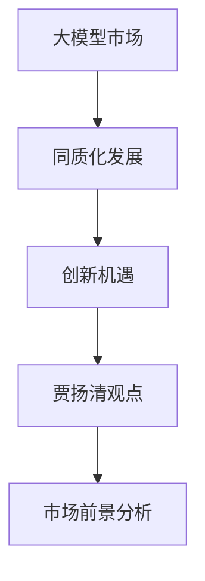

                 

# 国内大模型市场：贾扬清观点，同质化发展与创新机遇并存

## 关键词
- 国内大模型市场
- 同质化发展
- 创新机遇
- 贾扬清
- 技术创新
- 市场趋势

## 摘要
本文旨在分析国内大模型市场的发展现状，深入探讨同质化发展的原因与影响，以及技术创新与市场机遇。结合贾扬清的观点，本文将提供对市场前景的深度分析，并通过行业案例研究，揭示成功与失败的原因。最后，本文将对政策环境的影响进行探讨，并对未来市场发展提出展望。

## 第一部分：国内大模型市场概述

### 第1章：引言

#### 1.1 引言
近年来，随着人工智能技术的飞速发展，国内大模型市场逐渐崛起。大模型作为人工智能的核心技术，已经在自然语言处理、计算机视觉、推荐系统等领域展现出巨大的潜力。本文将围绕国内大模型市场的发展背景，结合贾扬清的观点，深入探讨市场现状、同质化发展、创新机遇以及前景分析。

#### 1.2 本书核心概念与联系

以下是本文的核心概念及其相互联系：

- **大模型市场**：指涉及大规模机器学习模型的研发、应用和商业化的市场。
- **同质化发展**：指市场中大量企业采用相似的技术和商业模式，导致产品和服务差异化降低。
- **创新机遇**：指通过技术创新，企业能够突破同质化竞争，开辟新的市场空间。
- **贾扬清观点**：结合贾扬清作为国内人工智能领域的专家，对大模型市场的独到见解。
- **市场前景分析**：对国内大模型市场的发展趋势、挑战和机遇进行展望。

**Mermaid 流程图**：



#### 1.3 大模型市场核心概念讲解

**核心算法原理讲解**：

- **深度学习算法**：基于多层神经网络进行特征提取和分类。例如，卷积神经网络（CNN）和循环神经网络（RNN）广泛应用于图像和文本处理。

  $$ 
  y = \sigma(\text{W}^T \cdot \text{a} + b)
  $$

  其中，\( y \) 是输出，\( \sigma \) 是激活函数，\( \text{W} \) 是权重矩阵，\( \text{a} \) 是输入特征，\( b \) 是偏置。

- **迁移学习算法**：将预训练模型应用于新的任务，通过微调来适应特定领域。

  $$ 
  \text{new\_model} = \text{pretrained\_model} + \text{fine-tuning}
  $$

  其中，\( \text{new\_model} \) 是微调后的模型，\( \text{pretrained\_model} \) 是预训练模型，\( \text{fine-tuning} \) 是微调过程。

- **自监督学习算法**：在缺乏标注数据的情况下，利用未标记的数据进行学习。

  $$ 
  \text{label}_{\text{predict}} = \text{model}(\text{input})
  $$

  其中，\( \text{label}_{\text{predict}} \) 是预测的标签，\( \text{model} \) 是自监督学习模型，\( \text{input} \) 是未标记的数据。

**伪代码示例**：

```python
def train_model(data, labels):
    # 初始化模型
    model = initialize_model()
    
    # 训练模型
    for epoch in range(num_epochs):
        for batch in data:
            # 计算预测值
            predictions = model(batch)
            
            # 计算损失
            loss = calculate_loss(predictions, labels)
            
            # 更新模型参数
            model.update_params(loss)
    
    return model
```

#### 1.4 贾扬清观点介绍

贾扬清作为国内人工智能领域的杰出代表，对国内大模型市场有着深刻的见解。他认为，当前国内大模型市场正处于同质化发展的阶段，企业需要通过技术创新来打破这种局面。同时，贾扬清强调了数据质量和计算资源的整合对于大模型发展的关键作用。

#### 1.5 国内大模型市场前景分析

随着人工智能技术的不断进步，国内大模型市场前景广阔。一方面，政策支持和资金投入的增加将为市场提供强有力的保障；另一方面，技术创新将不断推动市场向前发展。然而，市场也面临着数据隐私、算法伦理等挑战。总体而言，国内大模型市场将在技术创新和市场需求的双重驱动下，迎来一个快速发展的时期。

### 第二部分：同质化发展与市场趋势

#### 第2章：同质化发展的原因与影响

#### 第3章：市场趋势与机遇

#### 第4章：行业案例分析

### 第三部分：技术创新与市场布局

#### 第5章：技术创新对市场的影响

#### 第6章：市场布局策略

#### 第7章：技术创新案例分析

### 第四部分：政策环境与市场发展

#### 第8章：政策环境对市场的影响

#### 第9章：市场发展策略

#### 第10章：未来市场展望

### 第五部分：企业实战案例与经验分享

#### 第11章：企业实战案例分析

#### 第12章：企业经验分享

#### 第13章：企业成长与市场布局

### 第六部分：结论与展望

#### 第14章：总结与展望

## 附录

### 附录 A：技术参考

### 附录 B：参考资料

### 附录 C：网络资源

---

本文以贾扬清的观点为切入点，深入分析国内大模型市场的现状、同质化发展、创新机遇以及政策环境。通过行业案例分析，本文揭示了成功与失败的原因，并提出了企业实战经验和市场发展策略。未来，国内大模型市场将在技术创新和市场需求的双重驱动下，迎来更加广阔的发展空间。然而，企业也需要应对数据隐私、算法伦理等挑战，以确保市场的可持续发展。

## 作者

- 作者：AI天才研究院/AI Genius Institute & 禅与计算机程序设计艺术 /Zen And The Art of Computer Programming

