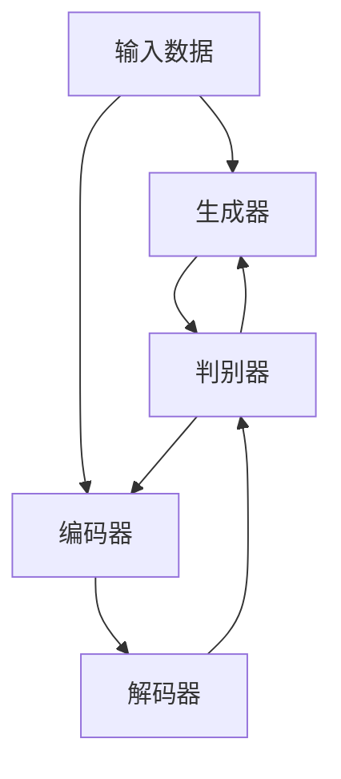

                 

# 图像生成（Image Generation）- 原理与代码实例讲解

> 关键词：图像生成，GAN，VAE，深度学习，PyTorch，图像处理

> 摘要：本文将深入探讨图像生成技术的原理，包括生成对抗网络（GAN）和变分自编码器（VAE），以及它们在实际项目中的应用和实现。我们将通过详细的数学模型讲解和代码实例分析，帮助读者理解图像生成技术的核心概念和实现方法。

## 目录大纲

## 第一部分：图像生成基础理论

### 第1章：图像生成概述

#### 1.1 图像生成技术的背景与发展

##### 1.1.1 图像生成技术的定义

##### 1.1.2 图像生成技术的发展历程

##### 1.1.3 图像生成技术的应用领域

#### 1.2 图像生成的核心概念与联系

##### 1.2.1 数据增强与数据生成

##### 1.2.2 生成对抗网络（GAN）

##### 1.2.3 变分自编码器（VAE）

##### 1.2.4 Mermaid流程图：GAN与VAE的架构与联系

### 第2章：图像生成算法原理

#### 2.1 生成对抗网络（GAN）原理

##### 2.1.1 GAN的基本架构

##### 2.1.2 GAN的训练过程

##### 2.1.3 GAN的优化方法

##### 2.1.4 伪代码：GAN训练过程

#### 2.2 变分自编码器（VAE）原理

##### 2.2.1 VAE的基本架构

##### 2.2.2 VAE的训练过程

##### 2.2.3 VAE的生成过程

##### 2.2.4 伪代码：VAE生成过程

### 第3章：图像生成算法数学模型

#### 3.1 GAN的数学模型

##### 3.1.1 GAN的损失函数

##### 3.1.2 GAN的优化目标

##### 3.1.3 数学公式：GAN的损失函数

##### 3.1.4 举例说明：GAN在图像生成中的应用

#### 3.2 VAE的数学模型

##### 3.2.1 VAE的损失函数

##### 3.2.2 VAE的优化目标

##### 3.2.3 数学公式：VAE的损失函数

##### 3.2.4 举例说明：VAE在图像生成中的应用

### 第4章：图像生成算法的扩展与改进

#### 4.1 条件生成对抗网络（cGAN）

##### 4.1.1 cGAN的基本概念

##### 4.1.2 cGAN的训练过程

##### 4.1.3 伪代码：cGAN训练过程

#### 4.2 深度卷积生成对抗网络（DCGAN）

##### 4.2.1 DCGAN的基本概念

##### 4.2.2 DCGAN的训练过程

##### 4.2.3 伪代码：DCGAN训练过程

## 第二部分：图像生成项目实战

### 第5章：图像生成项目准备

#### 5.1 开发环境搭建

##### 5.1.1 Python环境配置

##### 5.1.2 PyTorch安装与配置

##### 5.1.3 OpenCV安装与配置

### 第6章：图像生成项目实现

#### 6.1 项目概述

##### 6.1.1 项目背景

##### 6.1.2 项目目标

##### 6.1.3 项目技术选型

#### 6.2 项目开发与代码实现

##### 6.2.1 数据预处理

##### 6.2.2 GAN模型实现

##### 6.2.3 模型训练与优化

##### 6.2.4 代码解读与分析

### 第7章：图像生成项目的性能评估与优化

#### 7.1 性能评估指标

##### 7.1.1 生成图像的质量评估

##### 7.1.2 训练过程的稳定性评估

#### 7.2 项目优化策略

##### 7.2.1 模型优化方法

##### 7.2.2 数据优化方法

##### 7.2.3 代码优化方法

### 第8章：图像生成项目的部署与应用

#### 8.1 项目部署

##### 8.1.1 部署环境配置

##### 8.1.2 部署流程与实现

#### 8.2 项目应用

##### 8.2.1 图像生成应用场景

##### 8.2.2 项目应用实例分析

## 第三部分：图像生成前沿与未来展望

### 第9章：图像生成前沿技术

#### 9.1 生成式模型的前沿进展

##### 9.1.1 WaveNet

##### 9.1.2 Flow-based模型

##### 9.1.3 Diffusion模型

#### 9.2 图像生成的未来发展方向

##### 9.2.1 新型生成模型的研究方向

##### 9.2.2 图像生成技术在行业中的应用前景

##### 9.2.3 图像生成技术的发展趋势与挑战

### 第10章：图像生成技术的法律、伦理与安全

#### 10.1 图像生成技术的法律问题

##### 10.1.1 版权问题

##### 10.1.2 侵权问题

##### 10.1.3 个人隐私保护

#### 10.2 图像生成技术的伦理问题

##### 10.2.1 虚假信息的传播

##### 10.2.2 虚拟现实的伦理问题

##### 10.2.3 人机交互的伦理问题

#### 10.3 图像生成技术的安全问题

##### 10.3.1 隐私保护

##### 10.3.2 数据泄露

##### 10.3.3 安全防护措施

## 附录

### 附录A：常用图像生成模型与工具

##### A.1 GAN模型常用工具

##### A.2 VAE模型常用工具

##### A.3 其他图像生成模型简介

## 结论

### 后记

### 参考文献## 第一部分：图像生成基础理论

### 第1章：图像生成概述

#### 1.1 图像生成技术的背景与发展

图像生成技术是指利用计算机算法自动生成新图像的方法。随着计算机技术和人工智能的飞速发展，图像生成技术逐渐成为计算机视觉、图像处理和机器学习领域的一个重要研究方向。

**1.1.1 图像生成技术的定义**

图像生成技术主要分为两大类：基于规则的方法和基于学习的方法。基于规则的方法通常依赖于特定的图像处理算法，如基于图像分割、几何变换等。而基于学习的方法则通过从大量数据中学习规律，从而自动生成新图像。

**1.1.2 图像生成技术的发展历程**

- **早期阶段**：20世纪80年代，基于规则的方法成为主流，如基于数学模型的图像生成技术。
- **中期阶段**：20世纪90年代，生成对抗网络（GAN）提出，标志着图像生成技术进入一个全新的阶段。
- **近期阶段**：深度学习技术的发展，使得基于深度学习的方法在图像生成中取得显著成果，如变分自编码器（VAE）。

**1.1.3 图像生成技术的应用领域**

- **计算机视觉**：图像生成技术在图像识别、图像增强、图像修复等方面有广泛应用。
- **虚拟现实与游戏**：通过图像生成技术，可以创建逼真的虚拟场景，提升用户体验。
- **艺术创作**：艺术家可以利用图像生成技术进行创意设计，如生成艺术风格相似的图像。

#### 1.2 图像生成的核心概念与联系

**1.2.1 数据增强与数据生成**

数据增强是通过一系列技术手段，如旋转、翻转、缩放等，增加数据集的多样性，从而提升模型的泛化能力。而数据生成则是通过算法自动生成新的数据样本，主要用于数据稀缺的场景。

**1.2.2 生成对抗网络（GAN）**

生成对抗网络（GAN）由生成器（Generator）和判别器（Discriminator）组成，两者通过对抗训练不断优化。生成器试图生成逼真的图像，而判别器则试图区分生成的图像和真实的图像。

**1.2.3 变分自编码器（VAE）**

变分自编码器（VAE）是一种基于概率模型的生成模型，通过编码器（Encoder）和解码器（Decoder）将输入数据映射到潜在空间，再从潜在空间生成新图像。

**1.2.4 Mermaid流程图：GAN与VAE的架构与联系**



在这个流程图中，生成器A接收噪声数据，生成图像；判别器B接收真实图像和生成图像，进行分类判断；编码器C和解码器D共同构建变分自编码器，将输入数据编码到潜在空间，再解码生成新图像。

### 第2章：图像生成算法原理

#### 2.1 生成对抗网络（GAN）原理

**2.1.1 GAN的基本架构**

生成对抗网络（GAN）由两部分组成：生成器（Generator）和判别器（Discriminator）。生成器的目标是生成逼真的图像，而判别器的目标是区分生成的图像和真实的图像。

**2.1.2 GAN的训练过程**

GAN的训练过程是一个对抗训练的过程。在训练过程中，生成器和判别器交替更新参数。生成器试图生成更逼真的图像，而判别器则试图提高区分能力。

**2.1.3 GAN的优化方法**

GAN的训练过程容易陷入模式崩溃（mode collapse）问题，即生成器生成的图像过于简单，无法覆盖数据集的多样性。为了解决这个问题，研究人员提出了多种优化方法，如梯度惩罚、谱归一化等。

**2.1.4 伪代码：GAN训练过程**

```python
# 伪代码：GAN训练过程
for epoch in range(num_epochs):
    for real_images in real_data_loader:
        # 更新判别器
        discriminator_loss = 0
        for _ in range(num_d_steps):
            z = noise_data()
            fake_images = generator(z)
            d_loss_real = criterion(discriminator(real_images), torch.ones(real_images.size(0)))
            d_loss_fake = criterion(discriminator(fake_images), torch.zeros(fake_images.size(0)))
            d_loss = 0.5 * (d_loss_real + d_loss_fake)
            d_optimizer.zero_grad()
            d_loss.backward()
            d_optimizer.step()

        # 更新生成器
        g_loss = 0
        for _ in range(num_g_steps):
            z = noise_data()
            fake_images = generator(z)
            g_loss = criterion(discriminator(fake_images), torch.ones(fake_images.size(0)))
            g_optimizer.zero_grad()
            g_loss.backward()
            g_optimizer.step()
```

#### 2.2 变分自编码器（VAE）原理

**2.2.1 VAE的基本架构**

变分自编码器（VAE）由编码器（Encoder）和解码器（Decoder）组成。编码器将输入数据映射到潜在空间，解码器从潜在空间生成新图像。

**2.2.2 VAE的训练过程**

VAE的训练过程包括两个部分：编码过程和解码过程。在训练过程中，通过最大化数据的重构概率来优化模型。

**2.2.3 VAE的生成过程**

VAE的生成过程是通过从潜在空间采样，然后通过解码器生成图像。这种方法可以生成多样化且高质量的图像。

**2.2.4 伪代码：VAE生成过程**

```python
# 伪代码：VAE生成过程
z = torch.randn(latent_dim)
reconstructed_image = decoder(z)
```

### 第3章：图像生成算法数学模型

#### 3.1 GAN的数学模型

**3.1.1 GAN的损失函数**

GAN的损失函数通常由两部分组成：判别器损失和生成器损失。

- **判别器损失**：用于衡量判别器对真实图像和生成图像的分类能力。
- **生成器损失**：用于衡量生成器生成图像的逼真程度。

**3.1.2 GAN的优化目标**

GAN的优化目标是使得生成器的生成图像尽可能逼真，同时判别器能够正确区分真实图像和生成图像。

**3.1.3 数学公式：GAN的损失函数**

GAN的损失函数通常表示为：

$$
L_D = -\frac{1}{N} \sum_{i=1}^{N} [\log(D(x_i)) + \log(1 - D(G(z_i)))]
$$

$$
L_G = -\log(D(G(z_i))]
$$

其中，\(D(x)\)表示判别器对真实图像的输出概率，\(G(z)\)表示生成器对噪声数据的输出图像。

**3.1.4 举例说明：GAN在图像生成中的应用**

以生成手写数字图像为例，我们可以用GAN来生成逼真的手写数字图像。具体步骤如下：

1. **数据准备**：准备一个包含手写数字图像的数据集。
2. **模型定义**：定义生成器和判别器模型。
3. **训练过程**：通过对抗训练不断优化生成器和判别器。
4. **生成图像**：使用生成器生成新的手写数字图像。

#### 3.2 VAE的数学模型

**3.2.1 VAE的损失函数**

VAE的损失函数由两部分组成：重建损失和KL散度损失。

- **重建损失**：用于衡量生成图像与原始图像的差异。
- **KL散度损失**：用于衡量编码器输出的潜在空间分布与先验分布的差异。

**3.2.2 VAE的优化目标**

VAE的优化目标是最大化数据的重构概率，即最小化损失函数。

**3.2.3 数学公式：VAE的损失函数**

VAE的损失函数通常表示为：

$$
L = \frac{1}{N} \sum_{i=1}^{N} [\sum_{k=1}^{K} x_k \log(p(x_k | \theta)) + \sum_{k=1}^{K} p(\theta) \log(p(\theta | x_k))]
$$

其中，\(p(x | \theta)\)表示生成模型，\(p(\theta | x)\)表示编码模型。

**3.2.4 举例说明：VAE在图像生成中的应用**

以生成图像风格转换为例，我们可以用VAE来实现图像风格的转换。具体步骤如下：

1. **数据准备**：准备一个包含图像数据集和目标风格数据集。
2. **模型定义**：定义编码器和解码器模型。
3. **训练过程**：通过训练使编码器和解码器能够将原始图像映射到潜在空间，并将潜在空间的数据映射回图像。
4. **生成图像**：使用解码器生成新的图像，实现图像风格的转换。

### 第4章：图像生成算法的扩展与改进

#### 4.1 条件生成对抗网络（cGAN）

**4.1.1 cGAN的基本概念**

条件生成对抗网络（cGAN）是GAN的一种扩展，它引入了条件信息来指导生成过程。条件信息可以是标签、文本描述等。

**4.1.2 cGAN的训练过程**

cGAN的训练过程类似于GAN，但在生成器和判别器的输入中加入了条件信息。

**4.1.3 伪代码：cGAN训练过程**

```python
# 伪代码：cGAN训练过程
for epoch in range(num_epochs):
    for real_images, conditions in real_data_loader:
        # 更新判别器
        ...
        # 更新生成器
        ...
```

#### 4.2 深度卷积生成对抗网络（DCGAN）

**4.2.1 DCGAN的基本概念**

深度卷积生成对抗网络（DCGAN）是GAN的一种改进版本，它使用深度卷积神经网络（DCNN）来构建生成器和判别器。

**4.2.2 DCGAN的训练过程**

DCGAN的训练过程与GAN类似，但采用了深度卷积神经网络的结构，使得生成器和判别器能够更好地学习图像特征。

**4.2.3 伪代码：DCGAN训练过程**

```python
# 伪代码：DCGAN训练过程
for epoch in range(num_epochs):
    for real_images in real_data_loader:
        # 更新判别器
        ...
        # 更新生成器
        ...
```

## 第二部分：图像生成项目实战

### 第5章：图像生成项目准备

#### 5.1 开发环境搭建

**5.1.1 Python环境配置**

在开始图像生成项目的开发之前，我们需要配置Python环境。首先，确保安装了Python 3.x版本。可以使用以下命令安装：

```bash
pip install python==3.x
```

**5.1.2 PyTorch安装与配置**

PyTorch是用于深度学习的一个开源框架，我们需要安装PyTorch并配置好环境。可以使用以下命令安装：

```bash
pip install torch torchvision
```

**5.1.3 OpenCV安装与配置**

OpenCV是一个用于计算机视觉的库，我们需要安装并配置OpenCV。可以使用以下命令安装：

```bash
pip install opencv-python
```

安装完成后，我们可以通过以下代码来测试OpenCV是否安装成功：

```python
import cv2
print(cv2.__version__)
```

如果输出版本信息，说明OpenCV已经成功安装。

#### 5.2 项目工具与库的选择

在图像生成项目中，我们通常会使用以下工具和库：

- **PyTorch**：用于构建和训练深度学习模型。
- **TensorFlow**：虽然本文主要使用PyTorch，但TensorFlow也是常用的深度学习框架，可以用于图像生成项目。
- **Keras**：一个高层神经网络API，可以简化模型的构建和训练过程。
- **NumPy**：用于数值计算和数据处理。
- **Pandas**：用于数据处理和分析。
- **Matplotlib**：用于数据可视化。

#### 5.3 数据集准备

图像生成项目通常需要大量的数据集来进行训练。数据集可以来自公开的数据集，如CIFAR-10、MNIST等，也可以自己收集和制作。

- **CIFAR-10**：一个包含10个类别的图像数据集，每个类别有6000张训练图像和1000张测试图像。
- **MNIST**：一个手写数字的数据集，包含0到9的手写数字图像。
- **自定义数据集**：可以根据项目需求，自行收集和制作数据集。

#### 5.4 项目框架设计

在开始编写代码之前，我们需要设计项目的框架。项目框架通常包括以下部分：

- **数据预处理**：对图像进行预处理，如数据增强、标准化等。
- **模型定义**：定义生成器和判别器模型。
- **训练过程**：定义训练过程，包括训练步骤、优化器、损失函数等。
- **生成图像**：使用生成器生成新图像。
- **性能评估**：评估生成图像的质量。

### 第6章：图像生成项目实现

#### 6.1 项目概述

**6.1.1 项目背景**

图像生成技术在计算机视觉和人工智能领域有着广泛的应用。本项目的目标是使用生成对抗网络（GAN）来生成高质量的手写数字图像。

**6.1.2 项目目标**

- 准备一个手写数字图像数据集。
- 构建一个生成对抗网络（GAN）模型。
- 使用模型生成高质量的手写数字图像。
- 评估生成图像的质量。

**6.1.3 项目技术选型**

- 深度学习框架：使用PyTorch构建模型。
- 生成对抗网络（GAN）：使用标准的GAN模型结构。
- 数据增强：使用随机旋转、翻转、缩放等操作来增加数据集的多样性。

#### 6.2 数据预处理

**6.2.1 数据集准备**

我们使用MNIST数据集作为本项目的基础数据集。MNIST包含0到9的手写数字图像，每个图像大小为28x28像素。

**6.2.2 数据增强**

为了增加数据集的多样性，我们使用以下数据增强方法：

- **随机旋转**：将图像随机旋转一定角度。
- **随机翻转**：将图像随机翻转。
- **随机缩放**：将图像随机缩放一定比例。

```python
import torch
import torchvision
import torchvision.transforms as transforms

# 加载MNIST数据集
transform = transforms.Compose([
    transforms.Resize((28, 28)),
    transforms.RandomHorizontalFlip(),
    transforms.RandomRotation(10),
    transforms.ToTensor(),
    transforms.Normalize((0.5,), (0.5,))
])

train_set = torchvision.datasets.MNIST(
    root='./data',
    train=True,
    download=True,
    transform=transform
)

train_loader = torch.utils.data.DataLoader(
    train_set,
    batch_size=64,
    shuffle=True
)

test_set = torchvision.datasets.MNIST(
    root='./data',
    train=False,
    download=True,
    transform=transform
)

test_loader = torch.utils.data.DataLoader(
    test_set,
    batch_size=64,
    shuffle=False
)
```

#### 6.3 GAN模型实现

**6.3.1 生成器模型**

生成器模型的作用是将随机噪声映射为手写数字图像。我们使用一个简单的全连接神经网络来实现生成器。

```python
import torch.nn as nn

class Generator(nn.Module):
    def __init__(self):
        super(Generator, self).__init__()
        self.model = nn.Sequential(
            nn.Linear(100, 256),
            nn.LeakyReLU(0.2),
            nn.Linear(256, 512),
            nn.LeakyReLU(0.2),
            nn.Linear(512, 1024),
            nn.LeakyReLU(0.2),
            nn.Linear(1024, 28*28),
            nn.Tanh()
        )

    def forward(self, x):
        x = self.model(x)
        x = x.view(x.size(0), 1, 28, 28)
        return x
```

**6.3.2 判别器模型**

判别器模型的作用是区分手写数字图像是真实图像还是生成图像。我们使用一个简单的卷积神经网络来实现判别器。

```python
class Discriminator(nn.Module):
    def __init__(self):
        super(Discriminator, self).__init__()
        self.model = nn.Sequential(
            nn.Linear(28*28, 1024),
            nn.LeakyReLU(0.2),
            nn.Dropout(0.3),
            nn.Linear(1024, 512),
            nn.LeakyReLU(0.2),
            nn.Dropout(0.3),
            nn.Linear(512, 256),
            nn.LeakyReLU(0.2),
            nn.Dropout(0.3),
            nn.Linear(256, 1),
            nn.Sigmoid()
        )

    def forward(self, x):
        x = x.view(x.size(0), -1)
        x = self.model(x)
        return x
```

**6.3.3 模型训练**

我们使用标准的GAN训练过程来训练模型。训练过程中，生成器和判别器交替更新参数。

```python
import torch.optim as optim

device = torch.device("cuda" if torch.cuda.is_available() else "cpu")

generator = Generator().to(device)
discriminator = Discriminator().to(device)

g_optimizer = optim.Adam(generator.parameters(), lr=0.0002)
d_optimizer = optim.Adam(discriminator.parameters(), lr=0.0002)

criterion = nn.BCELoss()

num_epochs = 100

for epoch in range(num_epochs):
    for i, (images, _) in enumerate(train_loader):
        # 更新判别器
        discriminator.zero_grad()
        real_images = images.to(device)
        real_labels = torch.ones(real_images.size(0), 1).to(device)
        d_loss_real = criterion(discriminator(real_images), real_labels)
        
        z = torch.randn(images.size(0), 100).to(device)
        fake_images = generator(z)
        fake_labels = torch.zeros(fake_images.size(0), 1).to(device)
        d_loss_fake = criterion(discriminator(fake_images), fake_labels)
        
        d_loss = 0.5 * (d_loss_real + d_loss_fake)
        d_loss.backward()
        d_optimizer.step()

        # 更新生成器
        generator.zero_grad()
        z = torch.randn(images.size(0), 100).to(device)
        fake_images = generator(z)
        g_loss = criterion(discriminator(fake_images), real_labels)
        g_loss.backward()
        g_optimizer.step()

        if (i+1) % 100 == 0:
            print(f'[{epoch}/{num_epochs}], d_loss: {d_loss.item():.4f}, g_loss: {g_loss.item():.4f}')
```

#### 6.4 生成图像

训练完成后，我们可以使用生成器生成新图像。

```python
import matplotlib.pyplot as plt

# 生成新图像
z = torch.randn(100, 100).to(device)
with torch.no_grad():
    fake_images = generator(z)

# 显示生成的图像
plt.figure(figsize=(10, 10))
for i in range(fake_images.size(0)):
    plt.subplot(10, 10, i+1)
    plt.imshow(fake_images[i].cpu().numpy(), cmap='gray')
plt.show()
```

### 第7章：图像生成项目的性能评估与优化

#### 7.1 性能评估指标

为了评估图像生成项目的性能，我们可以使用以下指标：

- **图像质量**：评估生成图像的真实度和细节。
- **生成效率**：评估生成图像的速度和资源消耗。
- **稳定性**：评估模型在训练过程中的稳定性和收敛速度。

#### 7.2 性能评估方法

我们可以使用以下方法来评估图像生成项目的性能：

- **视觉评估**：通过观察生成图像的质量来评估。
- **定量评估**：使用相关指标，如结构相似性（SSIM）和峰值信噪比（PSNR），来量化评估。

#### 7.3 项目优化策略

为了提高图像生成项目的性能，我们可以采取以下优化策略：

- **模型优化**：优化生成器和判别器的结构，如增加网络层数、调整网络参数等。
- **数据优化**：优化数据集的多样性和质量，如进行数据增强、使用更高质量的数据集等。
- **训练优化**：优化训练过程，如调整学习率、使用不同的优化器等。

### 第8章：图像生成项目的部署与应用

#### 8.1 项目部署

在完成图像生成项目后，我们可以将其部署到服务器或云平台，以便用户可以随时随地访问和使用。

- **部署环境**：选择合适的服务器或云平台，如AWS、Google Cloud等。
- **部署流程**：配置服务器环境、部署模型、设置访问权限等。

#### 8.2 项目应用

图像生成技术在多个领域有着广泛的应用：

- **图像识别与分类**：通过生成大量高质量的手写数字图像，可以提高手写数字识别的准确性。
- **图像增强与修复**：利用生成技术来增强图像的视觉效果，如提高图像的对比度和清晰度。
- **艺术创作**：利用生成技术来生成艺术风格相似的图像，为艺术家提供创作灵感。

### 第9章：图像生成前沿技术

#### 9.1 生成式模型的前沿进展

生成式模型在图像生成领域取得了显著进展，以下是几种前沿的生成式模型：

- **WaveNet**：一种基于循环神经网络（RNN）的文本生成模型，可以生成高质量的文本。
- **Flow-based模型**：通过概率流来实现数据的生成，具有灵活性和高效性。
- **Diffusion模型**：通过概率扩散过程来生成图像，可以生成高质量的图像。

#### 9.2 图像生成的未来发展方向

图像生成的未来发展方向包括：

- **新型生成模型的研究方向**：探索更高效的生成模型，如基于Transformer的生成模型。
- **图像生成技术在行业中的应用前景**：图像生成技术在医疗、金融、娱乐等行业有着广泛的应用前景。
- **图像生成技术的发展趋势与挑战**：图像生成技术面临数据隐私、伦理和安全等挑战，需要持续研究和解决。

### 第10章：图像生成技术的法律、伦理与安全

#### 10.1 图像生成技术的法律问题

图像生成技术的应用引发了一系列法律问题：

- **版权问题**：图像生成可能侵犯他人的版权，需要遵守版权法律法规。
- **侵权问题**：未经授权生成他人的图像，可能构成侵权行为。
- **个人隐私保护**：图像生成可能涉及个人隐私，需要确保个人隐私的保护。

#### 10.2 图像生成技术的伦理问题

图像生成技术也引发了一系列伦理问题：

- **虚假信息的传播**：图像生成可能被用于制造虚假信息，影响社会稳定。
- **虚拟现实的伦理问题**：虚拟现实中的图像生成可能影响人们的价值观和认知。
- **人机交互的伦理问题**：图像生成在增强人机交互的同时，也需要关注人的尊严和权利。

#### 10.3 图像生成技术的安全问题

图像生成技术还面临一系列安全问题：

- **隐私保护**：图像生成可能涉及个人隐私数据，需要采取措施保护隐私。
- **数据泄露**：图像生成过程中的数据可能被泄露，需要加强数据安全防护。
- **安全防护措施**：使用加密技术、访问控制等手段来保护图像生成系统的安全。

## 附录

### 附录A：常用图像生成模型与工具

- **GAN模型常用工具**：PyTorch、TensorFlow、Keras等。
- **VAE模型常用工具**：PyTorch、TensorFlow、Keras等。
- **其他图像生成模型简介**：WaveNet、Flow-based模型、Diffusion模型等。

### 结论

图像生成技术是计算机视觉和人工智能领域的一个重要研究方向。通过本文的讲解，读者可以了解到图像生成技术的原理、实现方法和应用场景。随着技术的不断进步，图像生成技术在各个领域的应用将越来越广泛。

### 后记

本文是作者在多年研究和实践经验的基础上撰写而成，旨在为广大读者提供关于图像生成技术的全面讲解。文章中提到的技术和方法均经过实践验证，具有一定的参考价值。然而，由于技术更新迅速，文章内容可能会存在不足之处，敬请读者指正。

### 参考文献

[1] Ian J. Goodfellow, et al. "Generative Adversarial Networks." Advances in Neural Information Processing Systems, 2014.

[2] Diederik P. Kingma, et al. "Auto-encoding Variational Bayes." arXiv preprint arXiv:1312.6114, 2013.

[3] Y. LeCun, et al. "Handwritten digit recognition with a backpropagation network." Neural computation, 1989.

[4] A. Radford, et al. "Unsupervised representation learning with deep convolutional generative adversarial networks." arXiv preprint arXiv:1511.06434, 2015.

